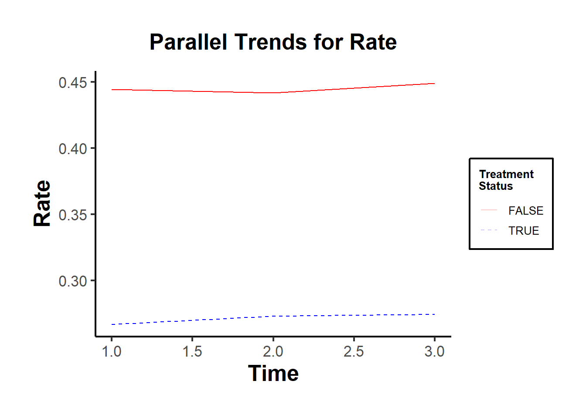
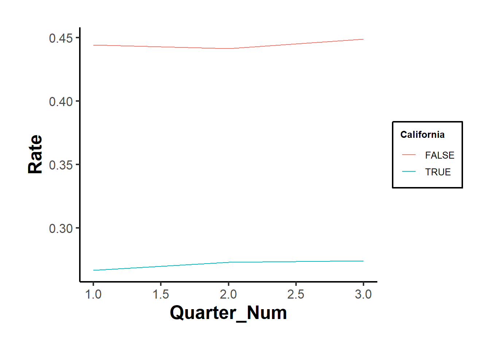
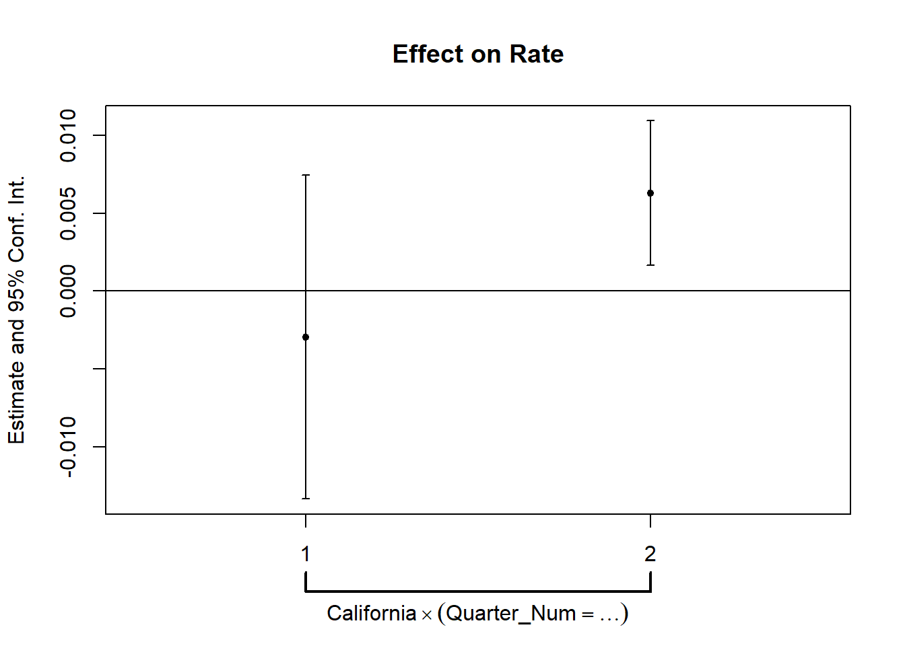
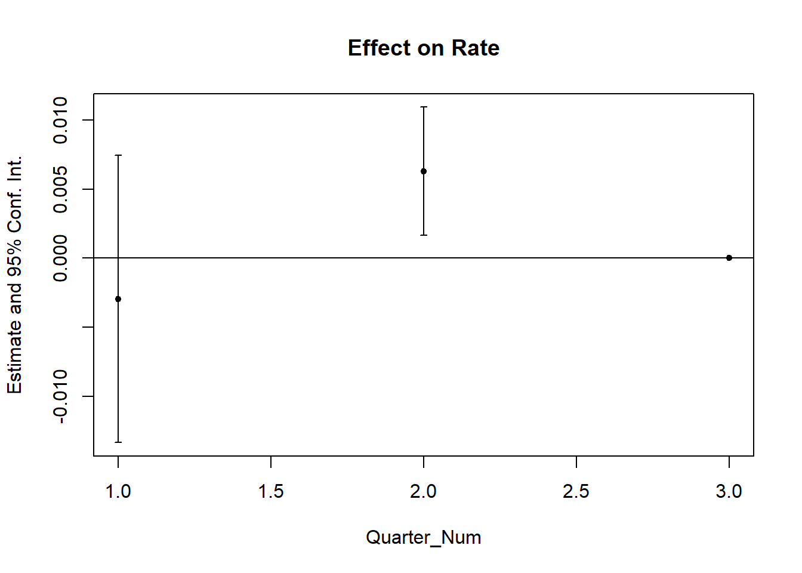
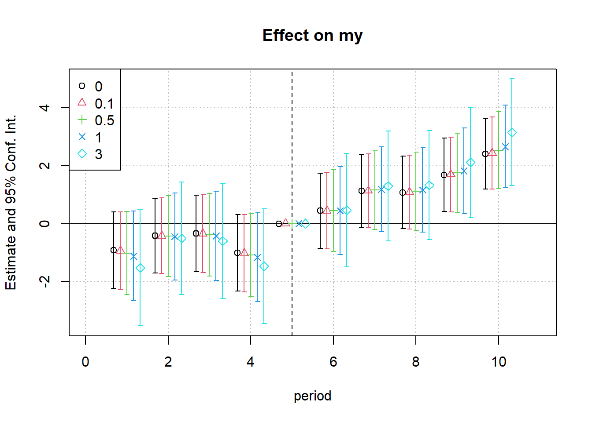

## Multiple Treatments

In some settings, researchers encounter **two (or more) treatments** rather than a single treatment and control group. This complicates standard DiD estimation, but a properly structured model ensures accurate identification.

**Additional References**

-   [@fricke2017identification]: Discusses identification challenges in multiple treatment settings.
-   [@de2023two]: Provides a **video tutorial** ([YouTube](https://www.youtube.com/watch?v=UHeJoc27qEM&ab_channel=TaylorWright)) and **code** ([Google Drive](https://drive.google.com/file/d/156Fu73avBvvV_H64wePm7eW04V0jEG3K/view)) for implementing multiple-treatment DiD models.

**Key Principles When Dealing with Multiple Treatments**

1.  **Always include all treatment groups in a single regression model.**

    -   This ensures proper identification of treatment-specific effects while maintaining a clear comparison against the control group.

2.  **Never use one treated group as a control for the other.**

    -   Running separate regressions for each treatment group can lead to biased estimates because each treatment group may differ systematically from the control group in ways that a separate model cannot fully capture.

3.  **Compare the significance of treatment effects** ($\delta_1$ vs. $\delta_2$).

    -   Instead of assuming equal effects, we should formally test whether the effects of the two treatments are statistically different using an F-test or Wald test:

    $$
    H_0: \delta_1 = \delta_2
    $$

    -   If we reject $H_0$, we conclude that the two treatments have significantly different effects.

------------------------------------------------------------------------

### Multiple Treatment Groups: Model Specification

A properly specified DiD regression model with two treatments takes the following form:

$$
\begin{aligned}
Y_{it} &= \alpha + \gamma_1 Treat1_{i} + \gamma_2 Treat2_{i} + \lambda Post_t  \\
&+ \delta_1(Treat1_i \times Post_t) + \delta_2(Treat2_i \times Post_t) + \epsilon_{it}
\end{aligned}
$$

where:

-   $Y_{it}$ = Outcome variable for individual $i$ at time $t$.
-   $Treat1_i$ = 1 if individual $i$ is in **Treatment Group 1**, 0 otherwise.
-   $Treat2_i$ = 1 if individual $i$ is in **Treatment Group 2**, 0 otherwise.
-   $Post_t$ = 1 for post-treatment period, 0 otherwise.
-   **DiD coefficients**:
    -   $\delta_1$ = Effect of Treatment 1.
    -   $\delta_2$ = Effect of Treatment 2.
-   $\epsilon_{it}$ = Error term.

------------------------------------------------------------------------

### Understanding the Control Group in Multiple Treatment DiD

One common concern in multiple-treatment DiD models is how to properly define the control group. A well-specified model ensures that:

-   The control group consists only of untreated individuals, not individuals from another treatment group.
-   The reference category in the regression represents the control group (i.e., individuals with $Treat1_i = 0$ and $Treat2_i = 0$).
-   If $Treat1_i = 1$, then $Treat2_i = 0$ and vice versa.

Failing to correctly specify the control group could lead to incorrect estimates of treatment effects. For example, omitting one of the treatment indicators could unintentionally redefine the control group as a mix of treated and untreated individuals.

------------------------------------------------------------------------

### Alternative Approaches: Separate Regressions vs. One Model

A common question is whether to run one large regression including all treatment groups or to run separate DiD models on subsets of the data. Each approach has implications:

1.  **One Model Approach (Preferred)**

-   Running one comprehensive regression allows for direct comparison between treatment effects in a statistically valid way.
-   The interaction terms ($\delta_1, \delta_2$) ensure that each treatment effect is estimated relative to a common control group.
-   The F-test (or Wald test) enables a formal test of whether the two treatments have significantly different effects.

2.  **Separate Regressions Approach**

-   Running separate DiD models for each treatment group can still be valid, but:
    -   The estimated treatment effects are less efficient because they come from separate samples.
    -   Comparisons become less straightforward, as they rely on confidence interval overlap rather than direct hypothesis testing.
    -   If homoscedasticity holds (i.e., equal error variances across groups), the separate regressions approach is unnecessary. The combined model is more efficient.

Thus, unless there is strong justification for separate regressions (e.g., significant heterogeneity in error variance), the one-model approach is preferred.

------------------------------------------------------------------------

### Handling Treatment Intensity

In some cases, treatments differ **not just in type, but also in intensity** (e.g., low vs. high treatment exposure). If we observe different levels of treatment intensity, we can model it using a **single categorical variable** rather than multiple treatment dummies:

Rather than coding separate dummies for each treatment group, we define a **multi-valued treatment variable**:

$$
Y_{it} = \alpha + \sum_{j=1}^{J} \beta_j (Treatment_j \times Post_t) + \lambda Post_t + \epsilon_{it}
$$

where:

-   $Treatment_j$ is a categorical variable indicating whether an individual belongs to the control group, low-intensity treatment, or high-intensity treatment.
-   This approach allows for cleaner implementation and avoids excessive interaction terms.

This approach has the advantage of:

-   Automatically setting the control group as the reference category.

-   Ensuring correct interpretation of coefficients for different treatment levels.

### Considerations When Individuals Can Move Between Treatment Groups

One potential complication in multiple-treatment DiD settings is when individuals can switch treatment groups over time (e.g., moving from low-intensity to high-intensity treatment after policy implementation).

-   If movement is rare, it may not significantly affect estimates.

-   If movement is frequent, it creates a challenge in causal identification because treatment effects might be confounded by self-selection.

A possible solution is to use an intention-to-treat (ITT) approach, where treatment assignment is based on the initially assigned group, regardless of whether individuals later switch.

### Parallel Trends Assumption in Multiple-Treatment DiD

-   Just as in standard DiD, a key assumption in multiple-treatment DiD models is that the treatment and control groups would have followed parallel trends in the absence of treatment.

-   With multiple treatments, we must check pre-trends separately for each treated group against the control group.

-   If pre-treatment trends are not parallel, we may need to adopt alternative methods such as [synthetic control]((#sec-synthetic-control)) models or event study analyses.

------------------------------------------------------------------------

## Mediation Under DiD

Mediation analysis helps determine whether a treatment affects the outcome directly or through an intermediate variable (mediator). In a DiD framework, this allows us to separate:

1.  Direct effects: The effect of the treatment on the outcome independent of the mediator.
2.  Indirect (mediated) effects: The effect of the treatment that operates through the mediator.

This is useful when a treatment consists of multiple components or when we want to understand mechanisms behind an observed effect.

------------------------------------------------------------------------

### Mediation Model in DiD

To incorporate mediation, we estimate two equations:

**Step 1: Effect of Treatment on the Mediator**

$$
M_{it} = \alpha + \gamma Treat_i + \lambda Post_t + \delta (Treat_i \times Post_t) + \epsilon_{it}
$$ where:

-   $M_{it}$ = Mediator variable (e.g., job search intensity, firm investment, police presence).
-   $\delta$ = Effect of the treatment on the mediator (capturing how the treatment changes $M$).

**Step 2: Effect of Treatment and Mediator on the Outcome**

$$
Y_{it} = \alpha' + \gamma' Treat_i + \lambda' Post_t + \delta' (Treat_i \times Post_t) + \theta M_{it} + \epsilon'_{it}
$$ where:

-   $Y_{it}$ = Outcome variable (e.g., employment, crime rate, firm performance).
-   $\theta$ = Effect of the mediator on the outcome.
-   $\delta'$ = **Direct effect** of the treatment (controlling for the mediator).

------------------------------------------------------------------------

### Interpreting the Results

-   If $\theta$ is statistically significant, it suggests that mediation is occurring---that is, the treatment affects the outcome partly through the mediator.
-   If $\delta'$ is smaller than $\delta$, this indicates that part of the treatment effect is explained by the mediator. The remaining portion of $\delta'$ represents the direct effect.

Thus, we can decompose the total treatment effect as:

$$
\text{Total Effect} = \delta' + (\theta \times \delta)
$$

where:

-   $\delta'$ = Direct effect (holding the mediator constant).

-   $\theta \times \delta$ = Indirect (mediated) effect.

------------------------------------------------------------------------

### Challenges in Mediation Analysis for DiD

Mediation in a DiD setting introduces several challenges that require careful consideration:

1.  **Potential Confounding of the Mediator**

-   A key assumption is that no unmeasured confounders affect both the mediator and the outcome.
-   If such confounders exist, estimates of $\theta$ may be biased.

2.  **Mediator-Outcome Endogeneity**

-   If the mediator is itself influenced by unobserved factors correlated with the outcome, it introduces endogeneity, making direct OLS estimates of $\theta$ problematic.
-   For example, in a crime policy evaluation:
    -   The number of police officers (mediator) may be influenced by crime rates (outcome), leading to reverse causality.

3.  **Interaction Between Multiple Mediators**

-   If there are multiple mediators (e.g., a policy that increases both police presence and surveillance cameras), they may interact with each other.
-   A useful test is to regress each mediator on treatment and other mediators. If a mediator predicts another, their effects are not independent, complicating interpretation.

------------------------------------------------------------------------

### Alternative Approach: Instrumental Variables for Mediation

One way to address mediator endogeneity is to use **instrumental variables**, where treatment serves as an instrument for the mediator:

**Two-Stage Estimation:**

1.  **First Stage: Predict the Mediator Using the Treatment** $$
    M_{it} = \alpha + \pi Treat_i + \lambda Post_t + \delta (Treat_i \times Post_t) + \nu_{it}
    $$
2.  **Second Stage: Predict the Outcome Using the Instrumented Mediator** $$
    Y_{it} = \alpha' + \gamma' Treat_i + \lambda' Post_t + \phi \hat{M}_{it} + \epsilon'_{it}
    $$

-   Here, $\hat{M}_{it}$ (predicted values from the first stage) replaces $M_{it}$, eliminating endogeneity concerns if the exclusion restriction holds (i.e., treatment only affects $Y$ through $M$).

**Key Limitation of IV Approach**

-   The IV strategy assumes that treatment affects the outcome only through the mediator, which may be too strong of an assumption in complex policy settings.

------------------------------------------------------------------------

## Assumptions

1.  **Parallel Trends Assumption**

The Difference-in-Differences estimator relies on a key identifying assumption: the parallel trends assumption. This assumption states that, in the absence of treatment, the average outcome for the treated group would have evolved over time in the same way as for the control group.

Let:

-   $Y_{it}(0)$ denote the potential outcome without treatment for unit $i$ at time $t$

-   $D_i = 1$ if unit $i$ is in the treatment group, and $D_i = 0$ if in the control group

Then, the parallel trends assumption can be written as:

$$
E[Y_{it}(0) \mid D_i = 1] - E[Y_{it}(0) \mid D_i = 0] = \Delta_0 \quad \text{for all } t,
$$

where $\Delta_0$ is a constant difference over time in the untreated potential outcomes between the two groups. This assumption does not require the levels of outcomes to be the same between groups---only that the difference remains constant over time.

In other words, the gap between treatment and control groups in the absence of treatment must remain stable. If this holds, any deviation from that stable difference after the treatment is attributed to the causal effect of the treatment.

------------------------------------------------------------------------

It is important to understand how the parallel trends assumption compares to other, stronger assumptions:

-   **Same untreated levels across groups**:\
    A stronger assumption would require that the treated and control groups have **identical untreated outcomes at all times**:

    $$
    E[Y_{it}(0) \mid D_i = 1] = E[Y_{it}(0) \mid D_i = 0] \quad \text{for all } t
    $$

    This is often unrealistic in observational settings, where baseline characteristics typically differ between groups.

-   **No change in untreated outcomes over time**:\
    Another strong assumption is that **untreated outcomes remain constant over time**, for both groups:

    $$
    E[Y_{it}(0)] = E[Y_{i,t'}(0)] \quad \text{for all } i \text{ and times } t, t'
    $$

    This implies no secular trends, which is rarely plausible in real-world applications where outcomes (e.g., sales, earnings, health metrics) naturally evolve over time.

The **parallel trends assumption is weaker** than both of these and is generally more defensible, especially when supported by pre-treatment data.

------------------------------------------------------------------------

DiD is appropriate when:

-   You have pre-treatment and post-treatment outcome data

-   You have clearly defined treatment and control groups

-   The parallel trends assumption is plausible

Avoid using DiD when:

-   Treatment assignment is not random or quasi-random

-   Unobserved confounders may cause the groups to evolve differently over time

Testing Parallel Trends: [Prior Parallel Trends Test](#prior-parallel-trends-test).

------------------------------------------------------------------------

2.  **No Anticipation Effect (Pre-Treatment Exogeneity)**

-   Individuals or groups should not change their behavior before the treatment is implemented in expectation of the treatment.

-   If units anticipate the treatment and adjust their behavior beforehand, it can introduce bias in the estimates.

3.  **Exogenous Treatment Assignment**

-   Treatment should not be assigned based on potential outcomes.
-   Ideally, assignment should be as good as random, conditional on observables.

4.  **Stable Composition of Groups (No Attrition or Spillover)**

-   Treatment and control groups should remain stable over time.
-   There should be no selective attrition (where individuals enter/leave due to treatment).
-   No spillover effects: Control units should not be indirectly affected by treatment.

5.  **No Simultaneous Confounding Events (Exogeneity of Shocks)**

-   There should be no other major shocks that affect treatment/control groups differently at the same time as treatment implementation.

------------------------------------------------------------------------

**Limitations and Common Issues**

1.  **Functional Form Dependence**

-   If the response to treatment is nonlinear, compare high- vs. low-intensity groups.

2.  **Selection on (Time-Varying) Unobservables**

-   Use [Rosenbaum Bounds] to check the sensitivity of estimates to unobserved confounders.

3.  **Long-Term Effects**

-   Parallel trends are more reliable in short time windows.
-   Over long periods, other confounding factors may emerge.

4.  **Heterogeneous Effects**

-   Treatment intensity (e.g., different doses) may vary across groups, leading to different effects.

5.  **Ashenfelter's Dip** [@ashenfelter1978estimating]

-   Participants in job training programs often experience earnings drops before enrolling, making them systematically different from nonparticipants.
-   **Fix**: Compute long-run differences, excluding periods around treatment, to test for sustained impact [@proserpio2017online; @heckman1999economics; @jepsen2014labor].

6.  **Lagged Treatment Effects**

-   If effects are not immediate, using a lagged dependent variable $Y_{it-1}$ may be more appropriate [@blundell1998initial].

7.  **Bias from Unobserved Factors Affecting Trends**

-   If external shocks influence treatment and control groups differently, this biases DiD estimates.

8.  **Correlated Observations**

-   Standard errors should be clustered appropriately.

9.  **Incidental Parameters Problem [@lancaster2000incidental]**

-   Always prefer individual and time fixed effects to reduce bias.

10. **Treatment Timing and Negative Weights**

-   If treatment timing varies across units, negative weights can arise in standard DiD estimators when treatment effects are heterogeneous [@athey2022design; @borusyak2024revisiting; @goodman2021difference].
-   **Fix:** Use estimators from @callaway2021difference and @de2020two (`did` package).
-   If expecting lags and leads, see @sun2021estimating.

11. **Treatment Effect Heterogeneity Across Groups**

-   If treatment effects vary across groups and interact with treatment variance, standard estimators may be invalid [@gibbons2018broken].

12. **Endogenous Timing**

If the timing of units can be influenced by strategic decisions in a DID analysis, an instrumental variable approach with a control function can be used to control for endogeneity in timing.

13. **Questionable Counterfactuals**

In situations where the control units may not serve as a reliable counterfactual for the treated units, matching methods such as propensity score matching or generalized random forest can be utilized. Additional methods can be found in [Matching Methods].

------------------------------------------------------------------------

### Prior Parallel Trends Test {#prior-parallel-trends-test}

The parallel trends assumption ensures that, absent treatment, the treated and control groups would have followed similar outcome trajectories. Testing this assumption involves visualization and statistical analysis.

@marcus2021role discuss pre-trend testing in staggered DiD.

1.  **Visual Inspection: Outcome Trends and Treatment Rollout**

-   Plot raw outcome trends for both groups before and after treatment.
-   Use **event-study plots** to check for pre-trend violations and anticipation effects.
-   Visualization tools like `ggplot2` or `panelView` help illustrate treatment timing and trends.

2.  **Event-Study Regressions**

A formal test for pre-trends uses the event-study model:

$$ Y_{it} = \alpha + \sum_{k=-K}^{K} \beta_k 1(T = k) + X_{it} \gamma + \lambda_i + \delta_t + \epsilon_{it} $$

where:

-   $1(T = k)$ are time dummies for periods before and after treatment.

-   $\beta_k$ captures deviations in outcomes before treatment; these should be **statistically indistinguishable from zero** if parallel trends hold.

-   $\lambda_i$ and $\delta_t$ are unit and time fixed effects.

-   $X_{it}$ are optional covariates.

**Violation of parallel trends** occurs if pre-treatment coefficients ($\beta_k$ for $k < 0$) are statistically significant.

3.  **Statistical Test for Pre-Treatment Trend Differences**

Using only pre-treatment data, estimate:

$$
Y = \alpha_g + \beta_1 T + \beta_2 (T \times G) + \epsilon
$$

where:

-   $\beta_2$ measures differences in time trends between groups.

-   If $\beta_2 = 0$, trends are parallel before treatment.

**Considerations:**

-   Alternative functional forms (e.g., polynomials or nonlinear trends) can be tested.
-   If $\beta_2 \neq 0$, potential explanations include:
    -   Large sample size driving statistical significance.
    -   Small deviations in one period disrupting an otherwise stable trend.

While time fixed effects can partially address violations of parallel trends (and are commonly used in modern research), they may also absorb part of the treatment effect, especially when treatment effects vary over time [@wolfers2003business].

------------------------------------------------------------------------

**Debate on Parallel Trends**

-   **Levels vs. Trends**: @kahn2020promise argue that **similarity in levels** is also crucial. If treatment and control groups start at **different levels**, why assume their trends will be the same?
    -   **Solution**:
        -   Plot time series for the treated and control groups.
        -   Use matched samples to improve comparability [@ryan2019now] (useful when parallel trends assumption is questionable).
    -   If levels differ significantly, functional form assumptions become more critical and must be justified.
-   **Power of Pre-Trend Tests**:
    -   Pre-trend tests often lack statistical power, making false negatives common [@roth2022pretest].
    -   See: [PretrendsPower](https://github.com/jonathandroth/PretrendsPower) and [pretrends](https://github.com/jonathandroth/pretrends) (for adjustments).
-   **Outcome Transformations Matter**:
    -   The parallel trends assumption is specific to both the transformation and units of the outcome variable [@roth2023parallel].
    -   Conduct falsification tests to check whether the assumption holds under different functional forms.

------------------------------------------------------------------------


``` r
library(tidyverse)
library(fixest)
od <- causaldata::organ_donations %>%
    # Use only pre-treatment data
    filter(Quarter_Num <= 3) %>% 
    # Treatment variable
    dplyr::mutate(California = State == 'California')

# use my package
causalverse::plot_par_trends(
    data = od,
    metrics_and_names = list("Rate" = "Rate"),
    treatment_status_var = "California",
    time_var = list(Quarter_Num = "Time"),
    display_CI = F
)
#> [[1]]
```



``` r

# do it manually
# always good but plot the dependent out
od |>
    # group by treatment status and time
    dplyr::group_by(California, Quarter) |>
    dplyr::summarize_all(mean) |>
    dplyr::ungroup() |>
    # view()
    
    ggplot2::ggplot(aes(x = Quarter_Num, y = Rate, color = California)) +
    ggplot2::geom_line() +
    causalverse::ama_theme()
```



``` r


# but it's also important to use statistical test
prior_trend <- fixest::feols(Rate ~ i(Quarter_Num, California) |
                                 State + Quarter,
                             data = od)

fixest::coefplot(prior_trend, grid = F)
```



``` r
fixest::iplot(prior_trend, grid = F)
```



This is alarming since one of the periods is significantly different from 0, which means that our parallel trends assumption is not plausible.

In cases where the parallel trends assumption is questionable, researchers should consider methods for assessing and addressing potential violations. Some key approaches are discussed in @rambachan2023more:

-   **Imposing Restrictions**: Constrain how different the post-treatment violations of parallel trends can be relative to pre-treatment deviations.

-   [**Partial Identification**](#sec-partial-identification-did): Rather than assuming a single causal effect, derive bounds on the ATT.

-   **Sensitivity Analysis**: Evaluate how sensitive the results are to potential deviations from parallel trends.

To implement these approaches, the `HonestDiD` package by @rambachan2023more provides robust statistical tools:


``` r
# https://github.com/asheshrambachan/HonestDiD
# remotes::install_github("asheshrambachan/HonestDiD")
# library(HonestDiD)
```

Alternatively, @ban2022generalized propose a method that incorporates pre-treatment covariates as an information set and makes an assumption about the selection bias in the post-treatment period. Specifically, they assume that the selection bias lies within the convex hull of all pre-treatment selection biases. Under this assumption:

-   They identify a set of possible ATT values.

-   With a stronger assumption on selection bias---grounded in policymakers' perspectives---they can estimate a point estimate of ATT.

Another useful tool for assessing parallel trends is the `pretrends` package by @roth2022pretest, which provides formal pre-trend tests:


``` r
# Install and load the pretrends package
# install.packages("pretrends")
# library(pretrends)

```

------------------------------------------------------------------------

### Placebo Test {#sec-placebo-test-did}

A placebo test is a diagnostic tool used in Difference-in-Differences analysis to assess whether the estimated treatment effect is driven by pre-existing trends rather than the treatment itself. The idea is to estimate a treatment effect in a scenario where no actual treatment occurred. If a significant effect is found, it suggests that the parallel trends assumption may not hold, casting doubt on the validity of the causal inference.

**Types of Placebo DiD Tests**

1.  **Group-Based Placebo Test**

-   Assign treatment to a group that was never actually treated and rerun the DiD model.
-   If the estimated treatment effect is statistically significant, this suggests that differences between groups---not the treatment---are driving results.
-   This test helps rule out the possibility that the estimated effect is an artifact of unobserved systematic differences.

A valid treatment effect should be consistent across different reasonable control groups. To assess this:

-   Rerun the DiD model using an alternative but comparable control group.

-   Compare the estimated treatment effects across multiple control groups.

-   If results vary significantly, this suggests that the choice of control group may be influencing the estimated effect, indicating potential selection bias or unobserved confounding.

2.  **Time-Based Placebo Test**

-   Conduct DiD using only pre-treatment data, pretending that treatment occurred at an earlier period.
-   A significant estimated treatment effect implies that differences in pre-existing trends---not treatment---are responsible for observed post-treatment effects.
-   This test is particularly useful when concerns exist about unobserved shocks or anticipatory effects.

**Random Reassignment of Treatment**

-   Keep the same treatment and control periods but randomly assign treatment to units that were not actually treated.
-   If a significant DiD effect still emerges, it suggests the presence of biases, unobserved confounding, or systematic differences between groups that violate the parallel trends assumption.

------------------------------------------------------------------------

**Procedure for a Placebo Test**

1.  **Using Pre-Treatment Data Only**

A robust placebo test often involves analyzing only pre-treatment periods to check whether spurious treatment effects appear. The procedure includes:

-   Restricting the sample to pre-treatment periods only.

-   Assigning a fake treatment period before the actual intervention.

-   Testing a sequence of placebo cutoffs over time to examine whether different assumed treatment timings yield significant effects.

-   Generating random treatment periods and using randomization inference to assess the sampling distribution of the placebo effect.

-   Estimating the DiD model using the fake post-treatment period (`post_time = 1`).

-   **Interpretation**: If the estimated treatment effect is statistically significant, this indicates that pre-existing trends (not treatment) might be influencing results, violating the parallel trends assumption.

2.  **Using Control Groups for a Placebo Test**

If multiple control groups are available, a placebo test can also be conducted by:

-   Dropping the actual treated group from the analysis.

-   Assigning one of the control groups as a fake treated group.

-   Estimating the DiD model and checking whether a significant effect is detected.

-   **Interpretation**:

    -   If a placebo effect appears (i.e., the estimated treatment effect is significant), it suggests that even among control groups, systematic differences exist over time.

    -   However, this result is not necessarily disqualifying. Some methods, such as [Synthetic Control], explicitly model such differences while maintaining credibility.

------------------------------------------------------------------------


``` r
# Load necessary libraries
library(tidyverse)
library(fixest)
library(ggplot2)
library(causaldata)

# Load the dataset
od <- causaldata::organ_donations %>%
    # Use only pre-treatment data
    dplyr::filter(Quarter_Num <= 3) %>%
    
    # Create fake (placebo) treatment variables
    dplyr::mutate(
        FakeTreat1 = as.integer(State == 'California' &
                                    Quarter %in% c('Q12011', 'Q22011')),
        FakeTreat2 = as.integer(State == 'California' &
                                    Quarter == 'Q22011')
    )

# Estimate the placebo effects using fixed effects regression
clfe1 <- fixest::feols(Rate ~ FakeTreat1 | State + Quarter, data = od)
clfe2 <- fixest::feols(Rate ~ FakeTreat2 | State + Quarter, data = od)

# Display the regression results
fixest::etable(clfe1, clfe2)
#>                           clfe1            clfe2
#> Dependent Var.:            Rate             Rate
#>                                                 
#> FakeTreat1      0.0061 (0.0051)                 
#> FakeTreat2                      -0.0017 (0.0028)
#> Fixed-Effects:  --------------- ----------------
#> State                       Yes              Yes
#> Quarter                     Yes              Yes
#> _______________ _______________ ________________
#> S.E.: Clustered       by: State        by: State
#> Observations                 81               81
#> R2                      0.99377          0.99376
#> Within R2               0.00192          0.00015
#> ---
#> Signif. codes: 0 '***' 0.001 '**' 0.01 '*' 0.05 '.' 0.1 ' ' 1

# Extract coefficients and confidence intervals
coef_df <- tibble(
    Model = c("FakeTreat1", "FakeTreat2"),
    Estimate = c(coef(clfe1)["FakeTreat1"], coef(clfe2)["FakeTreat2"]),
    SE = c(summary(clfe1)$coeftable["FakeTreat1", "Std. Error"], 
           summary(clfe2)$coeftable["FakeTreat2", "Std. Error"]),
    Lower = Estimate - 1.96 * SE,
    Upper = Estimate + 1.96 * SE
)

# Plot the placebo effects
ggplot(coef_df, aes(x = Model, y = Estimate)) +
    geom_point(size = 3, color = "blue") +
    geom_errorbar(aes(ymin = Lower, ymax = Upper), width = 0.2, color = "blue") +
    geom_hline(yintercept = 0, linetype = "dashed", color = "red") +
    theme_minimal() +
    labs(
        title = "Placebo Treatment Effects",
        y = "Estimated Effect on Organ Donation Rate",
        x = "Placebo Treatment"
    )
```


We would like the "supposed" DiD to be insignificant.

## Robustness Checks

A well-executed Difference-in-Differences analysis requires **robustness checks** to verify the validity of estimated treatment effects and **best practices** to ensure methodological rigor.

------------------------------------------------------------------------

### Robustness Checks to Strengthen Causal Interpretation

Once the parallel trends assumption is assessed, additional **robustness tests** ensure that treatment effects are not driven by confounding factors or modeling choices.

1.  **Varying the Time Window**

-   Shorter time windows reduce exposure to long-term confounders but risk losing statistical power.
-   Longer time windows capture persistent effects but may introduce unrelated policy changes.
-   Solution: Estimate the DiD model across different time horizons and check if results are stable.

2.  **Higher-Order Polynomial Time Trends**

-   Standard DiD models assume a linear time trend.
-   If trends are nonlinear, this assumption may be too restrictive.
-   Solution: Introduce quadratic or cubic time trends and verify whether results hold.

3.  **Testing Alternative Dependent Variables**

-   The treatment should only affect the expected dependent variable.
-   A robustness check involves running the DiD on unrelated dependent variables.
-   If treatment effects appear where they should not, this signals a possible identification problem.

4.  **Triple-Difference (DDD) Strategy**

A Triple-Difference (DDD) model adds an additional comparison group to address remaining biases:

$$
\begin{aligned}
Y_{ijt} &= \alpha + \gamma Treat_{i} + \lambda Post_t + \theta Group_j + \delta_1 (Treat_i \times Post_t) \\
&+ \delta_2 (Treat_i \times Group_j) + \delta_3 (Post_t \times Group_j) \\
&+ \delta_4 (Treat_i \times Post_t \times Group_j) + \epsilon_{ijt}
\end{aligned}
$$

where:

-   $Group_j$ represents a subgroup within treatment/control (e.g., high- vs. low-intensity exposure).

-   $\delta_4$ captures the DDD effect, which removes residual biases present in the standard DiD model.

------------------------------------------------------------------------

### Best Practices for Reliable DiD Implementation

To improve the credibility and transparency of DiD estimates, researchers should adhere to the following best practices:

1.  **Documenting Treatment Cohorts**

-   Clearly report the number of treated and control units over time.
-   If treatment is staggered, adjust for different exposure durations.

2.  **Checking Covariate Balance & Overlap**

-   Verify whether the distribution of covariates is similar across treatment and control groups.
-   If treatment and control groups differ significantly, consider using matching methods.

3.  **Conducting Sensitivity Analyses for Parallel Trends**

-   Apply alternative weighting schemes (e.g., entropy balancing) to reduce dependence on model assumptions.
-   Use `honestDiD` to test robustness under different parallel trends violations.

## Concerns in DID

### Matching Methods in DID

Matching methods are often used in **causal inference** to balance treated and control units based on **pre-treatment observables**. In the context of Difference-in-Differences, matching helps:

-   Reduce selection bias by ensuring that treated and control units are comparable before treatment.
-   Improve parallel trends validity by selecting control units with similar pre-treatment trajectories.
-   Enhance robustness when treatment assignment is non-random across groups.

**Key Considerations in Matching**

-   **Standard Errors Need Adjustment**
    -   Standard errors should account for the fact that matching reduces variance [@heckman1997matching].
    -   A more robust alternative is Doubly Robust DID [@sant2020doubly], where either matching or regression suffices for unbiased treatment effect identification.
-   **Group Fixed Effects Alone Do Not Eliminate Selection Bias**
    -   Fixed effects absorb time-invariant heterogeneity, but do not correct for selection into treatment.
    -   Matching helps close the "backdoor path" between:
        1.  Propensity to be treated
        2.  Dynamics of outcome evolution post-treatment
-   **Matching on Time-Varying Covariates**
    -   Beware of regression to the mean: extreme pre-treatment outcomes may artificially bias post-treatment estimates [@daw2018matching].
    -   This issue is less concerning for time-invariant covariates.
-   **Comparing Matching vs. DID Performance**
    -   Matching and DID both use pre-treatment outcomes to mitigate selection bias.
    -   Simulations [@chabe2015analysis] show that:
        -   Matching tends to underestimate the true treatment effect but improves with more pre-treatment periods.
        -   When selection bias is symmetric, Symmetric DID (equal pre- and post-treatment periods) performs well.
        -   When selection bias is asymmetric, DID generally outperforms Matching.
-   **Forward DID as a Control Unit Selection Algorithm**
    -   An efficient way to select control units is Forward DID [@li2024frontiers].

------------------------------------------------------------------------

### Control Variables in DID

-   Always report results with and without controls:
    -   If controls are fixed within groups or time periods, they should be absorbed in fixed effects.
    -   If controls vary across both groups and time, this suggests the parallel trends assumption is questionable.
-   $R^2$ is not crucial in causal inference:
    -   Unlike predictive models, causal models do not prioritize explanatory power ($R^2$), but rather unbiased identification of treatment effects.

------------------------------------------------------------------------

### DID for Count Data: Fixed-Effects Poisson Model

For count data, one can use the fixed-effects Poisson pseudo-maximum likelihood estimator (PPML) [@athey2006identification; @puhani2012treatment]. Applications of this method can be found in management [@burtch2018can] and marketing [@he2021end].

This approach offers robust standard errors under over-dispersion [@wooldridge1999quasi] and is particularly useful when dealing with excess zeros in the data.

Key advantages of PPML:

-   Handles zero-inflated data better than log-OLS: A log-OLS regression may produce biased estimates [@o2010not] when heteroskedasticity is present [@silva2006log], especially in datasets with many zeros [@silva2011further].
-   Avoids the limitations of negative binomial fixed effects: Unlike Poisson, there is no widely accepted fixed-effects estimator for the negative binomial model [@allison20027].

------------------------------------------------------------------------

### Handling Zero-Valued Outcomes in DID

When dealing with **zero-valued outcomes**, it is crucial to separate the **intensive margin effect** (e.g., outcome changes from 10 to 11) from the **extensive margin effect** (e.g., outcome changes from 0 to 1).

A common issue is that the treatment coefficient from a **log-transformed regression** cannot be directly interpreted as a percentage change when zeros are present [@chen2024logs]. To address this, we can consider two alternative approaches:

1.  **Proportional Treatment Effects**

We define the percentage change in the treated group's post-treatment outcome as:

$$
\theta_{ATT\%} = \frac{E[Y_{it}(1) \mid D_i = 1, Post_t = 1] - E[Y_{it}(0) \mid D_i = 1, Post_t = 1]}{E[Y_{it}(0) \mid D_i = 1, Post_t = 1]}
$$

Instead of assuming parallel trends in levels, we can rely on a parallel trends assumption in ratios [@wooldridge2023simple].

The Poisson QMLE model is:

$$
Y_{it} = \exp(\beta_0 + \beta_1 D_i \times Post_t + \beta_2 D_i + \beta_3 Post_t + X_{it}) \epsilon_{it}
$$

The treatment effect is estimated as:

$$
\hat{\theta}_{ATT\%} = \exp(\hat{\beta}_1) - 1
$$

To validate the parallel trends in ratios assumption, we can estimate a dynamic Poisson QMLE model:

$$
Y_{it} = \exp(\lambda_t + \beta_2 D_i + \sum_{r \neq -1} \beta_r D_i \times (RelativeTime_t = r))
$$

If the assumption holds, we expect:

$$
\exp(\hat{\beta}_r) - 1 = 0 \quad \text{for} \quad r < 0.
$$

Even if the pre-treatment estimates appear close to zero, we should still conduct a sensitivity analysis [@rambachan2023more] to assess robustness (see [Prior Parallel Trends Test](#prior-parallel-trends-test)).


``` r
set.seed(123) # For reproducibility

n <- 500 # Number of observations per group (treated and control)
# Generating IDs for a panel setup
ID <- rep(1:n, times = 2)

# Defining groups and periods
Group <- rep(c("Control", "Treated"), each = n)
Time <- rep(c("Before", "After"), times = n)
Treatment <- ifelse(Group == "Treated", 1, 0)
Post <- ifelse(Time == "After", 1, 0)

# Step 1: Generate baseline outcomes with a zero-inflated model
lambda <- 20 # Average rate of occurrence
zero_inflation <- 0.5 # Proportion of zeros
Y_baseline <-
    ifelse(runif(2 * n) < zero_inflation, 0, rpois(2 * n, lambda))

# Step 2: Apply DiD treatment effect on the treated group in the post-treatment period
Treatment_Effect <- Treatment * Post
Y_treatment <-
    ifelse(Treatment_Effect == 1, rpois(n, lambda = 2), 0)

# Incorporating a simple time trend, ensuring outcomes are non-negative
Time_Trend <- ifelse(Time == "After", rpois(2 * n, lambda = 1), 0)

# Step 3: Combine to get the observed outcomes
Y_observed <- Y_baseline + Y_treatment + Time_Trend

# Ensure no negative outcomes after the time trend
Y_observed <- ifelse(Y_observed < 0, 0, Y_observed)

# Create the final dataset
data <-
    data.frame(
        ID = ID,
        Treatment = Treatment,
        Period = Post,
        Outcome = Y_observed
    )

# Viewing the first few rows of the dataset
head(data)
#>   ID Treatment Period Outcome
#> 1  1         0      0       0
#> 2  2         0      1      25
#> 3  3         0      0       0
#> 4  4         0      1      20
#> 5  5         0      0      19
#> 6  6         0      1       0
```


``` r
library(fixest)
res_pois <-
    fepois(Outcome ~ Treatment + Period + Treatment * Period,
           data = data,
           vcov = "hetero")
etable(res_pois)
#>                             res_pois
#> Dependent Var.:              Outcome
#>                                     
#> Constant           2.249*** (0.0717)
#> Treatment           0.1743. (0.0932)
#> Period               0.0662 (0.0960)
#> Treatment x Period   0.0314 (0.1249)
#> __________________ _________________
#> S.E. type          Heteroskeda.-rob.
#> Observations                   1,000
#> Squared Cor.                 0.01148
#> Pseudo R2                    0.00746
#> BIC                         15,636.8
#> ---
#> Signif. codes: 0 '***' 0.001 '**' 0.01 '*' 0.05 '.' 0.1 ' ' 1

# Average percentage change
exp(coefficients(res_pois)["Treatment:Period"]) - 1
#> Treatment:Period 
#>       0.03191643

# SE using delta method
exp(coefficients(res_pois)["Treatment:Period"]) *
    sqrt(res_pois$cov.scaled["Treatment:Period", "Treatment:Period"])
#> Treatment:Period 
#>        0.1288596
```

In this example, the DID coefficient is not significant. However, say that it's significant, we can interpret the coefficient as 3 percent increase in post-treatment period due to the treatment.


``` r
library(fixest)

base_did_log0 <- base_did |> 
    mutate(y = if_else(y > 0, y, 0))

res_pois_es <-
    fepois(y ~ x1 + i(period, treat, 5) | id + period,
           data = base_did_log0,
           vcov = "hetero")

etable(res_pois_es)
#>                            res_pois_es
#> Dependent Var.:                      y
#>                                       
#> x1                  0.1895*** (0.0108)
#> treat x period = 1    -0.2769 (0.3545)
#> treat x period = 2    -0.2699 (0.3533)
#> treat x period = 3     0.1737 (0.3520)
#> treat x period = 4    -0.2381 (0.3249)
#> treat x period = 6     0.3724 (0.3086)
#> treat x period = 7    0.7739* (0.3117)
#> treat x period = 8    0.5028. (0.2962)
#> treat x period = 9   0.9746** (0.3092)
#> treat x period = 10  1.310*** (0.3193)
#> Fixed-Effects:      ------------------
#> id                                 Yes
#> period                             Yes
#> ___________________ __________________
#> S.E. type           Heteroskedas.-rob.
#> Observations                     1,080
#> Squared Cor.                   0.51131
#> Pseudo R2                      0.34836
#> BIC                            5,868.8
#> ---
#> Signif. codes: 0 '***' 0.001 '**' 0.01 '*' 0.05 '.' 0.1 ' ' 1
iplot(res_pois_es)
```


This parallel trend is the "ratio" version as in @wooldridge2023simple :

$$
\frac{E(Y_{it}(0) |D_i = 1, Post_t = 1)}{E(Y_{it}(0) |D_i = 1, Post_t = 0)} = \frac{E(Y_{it}(0) |D_i = 0, Post_t = 1)}{E(Y_{it}(0) |D_i =0, Post_t = 0)}
$$

which means without treatment, the average percentage change in the mean outcome for treated group is identical to that of the control group.

2.  **Log Effects with Calibrated Extensive-Margin Value**

A potential limitation of proportional treatment effects is that they may not be well-suited for heavy-tailed outcomes. In such cases, we may prefer to explicitly model the extensive margin effect.

Following [@chen2024logs, p. 39], we can calibrate the weight placed on the intensive vs. extensive margin to ensure meaningful interpretation of the treatment effect.

If we want to study the treatment effect on a concave transformation of the outcome that is less influenced by those in the distribution's tail, then we can perform this analysis.

Steps:

1.  Normalize the outcomes such that 1 represents the minimum non-zero and positive value (i.e., divide the outcome by its minimum non-zero and positive value).
2.  Estimate the treatment effects for the new outcome

$$
m(y) =
\begin{cases}
\log(y) & \text{for } y >0 \\
-x & \text{for } y = 0
\end{cases}
$$

The choice of $x$ depends on what the researcher is interested in:

+--------------+---------------------------------------------------------------------------------------------------------------------------------------------------------------------------------+
| Value of $x$ | Interest                                                                                                                                                                        |
+==============+=================================================================================================================================================================================+
| $x = 0$      | The treatment effect in logs where all zero-valued outcomes are set to equal the minimum non-zero value (i.e., we exclude the extensive-margin change between 0 and $y_{min}$ ) |
+--------------+---------------------------------------------------------------------------------------------------------------------------------------------------------------------------------+
| $x>0$        | Setting the change between 0 and $y_{min}$ to be valued as the equivalent of a $x$ log point change along the intensive margin.                                                 |
+--------------+---------------------------------------------------------------------------------------------------------------------------------------------------------------------------------+


``` r
library(fixest)
base_did_log0_cali <- base_did_log0 |> 
    # get min 
    mutate(min_y = min(y[y > 0])) |> 
    
    # normalized the outcome 
    mutate(y_norm = y / min_y)

my_regression <-
    function(x) {
        base_did_log0_cali <-
            base_did_log0_cali %>% mutate(my = ifelse(y_norm == 0,-x,
                                                      log(y_norm)))
        my_reg <-
            feols(
                fml = my ~ x1 + i(period, treat, 5) | id + period,
                data = base_did_log0_cali,
                vcov = "hetero"
            )
        
        return(my_reg)
    }

xvec <- c(0, .1, .5, 1, 3)
reg_list <- purrr::map(.x = xvec, .f = my_regression)


iplot(reg_list, 
      pt.col =  1:length(xvec),
      pt.pch = 1:length(xvec))
legend("topleft", 
       col = 1:length(xvec),
       pch = 1:length(xvec),
       legend = as.character(xvec))
```



``` r


etable(
    reg_list,
    headers = list("Extensive-margin value (x)" = as.character(xvec)),
    digits = 2,
    digits.stats = 2
)
#>                                   model 1        model 2        model 3
#> Extensive-margin value (x)              0            0.1            0.5
#> Dependent Var.:                        my             my             my
#>                                                                        
#> x1                         0.43*** (0.02) 0.44*** (0.02) 0.46*** (0.03)
#> treat x period = 1           -0.92 (0.67)   -0.94 (0.69)    -1.0 (0.73)
#> treat x period = 2           -0.41 (0.66)   -0.42 (0.67)   -0.43 (0.71)
#> treat x period = 3           -0.34 (0.67)   -0.35 (0.68)   -0.38 (0.73)
#> treat x period = 4            -1.0 (0.67)    -1.0 (0.68)    -1.1 (0.73)
#> treat x period = 6            0.44 (0.66)    0.44 (0.67)    0.45 (0.72)
#> treat x period = 7            1.1. (0.64)    1.1. (0.65)    1.2. (0.70)
#> treat x period = 8            1.1. (0.64)    1.1. (0.65)     1.1 (0.69)
#> treat x period = 9           1.7** (0.65)   1.7** (0.66)    1.8* (0.70)
#> treat x period = 10         2.4*** (0.62)  2.4*** (0.63)  2.5*** (0.68)
#> Fixed-Effects:             -------------- -------------- --------------
#> id                                    Yes            Yes            Yes
#> period                                Yes            Yes            Yes
#> __________________________ ______________ ______________ ______________
#> S.E. type                  Heterosk.-rob. Heterosk.-rob. Heterosk.-rob.
#> Observations                        1,080          1,080          1,080
#> R2                                   0.43           0.43           0.43
#> Within R2                            0.26           0.26           0.25
#> 
#>                                   model 4        model 5
#> Extensive-margin value (x)              1              3
#> Dependent Var.:                        my             my
#>                                                         
#> x1                         0.49*** (0.03) 0.62*** (0.04)
#> treat x period = 1            -1.1 (0.79)     -1.5 (1.0)
#> treat x period = 2           -0.44 (0.77)   -0.51 (0.99)
#> treat x period = 3           -0.43 (0.78)    -0.60 (1.0)
#> treat x period = 4            -1.2 (0.78)     -1.5 (1.0)
#> treat x period = 6            0.45 (0.77)     0.46 (1.0)
#> treat x period = 7             1.2 (0.75)     1.3 (0.97)
#> treat x period = 8             1.2 (0.74)     1.3 (0.96)
#> treat x period = 9            1.8* (0.75)    2.1* (0.97)
#> treat x period = 10         2.7*** (0.73)  3.2*** (0.94)
#> Fixed-Effects:             -------------- --------------
#> id                                    Yes            Yes
#> period                                Yes            Yes
#> __________________________ ______________ ______________
#> S.E. type                  Heterosk.-rob. Heterosk.-rob.
#> Observations                        1,080          1,080
#> R2                                   0.42           0.41
#> Within R2                            0.25           0.24
#> ---
#> Signif. codes: 0 '***' 0.001 '**' 0.01 '*' 0.05 '.' 0.1 ' ' 1
```

We have the dynamic treatment effects for different hypothesized extensive-margin value of $x \in (0, .1, .5, 1, 3, 5)$

The first column is when the zero-valued outcome equal to $y_{min, y>0}$ (i.e., there is no different between the minimum outcome and zero outcome - $x = 0$)

For this particular example, as the extensive margin increases, we see an increase in the effect magnitude. The second column is when we assume an extensive-margin change from 0 to $y_{min, y >0}$ is equivalent to a 10 (i.e., $0.1 \times 100$) log point change along the intensive margin.

------------------------------------------------------------------------

### Standard Errors

One of the major statistical challenges in DiD estimation is serial correlation in the error terms. This issue is particularly problematic because it can lead to underestimated standard errors, inflating the likelihood of Type I errors (false positives). As discussed in @bertrand2004much, serial correlation arises in DiD settings due to several factors:

1.  **Long time series**: Many DiD studies use multiple time periods, increasing the risk of correlated errors.
2.  **Highly positively serially correlated outcomes**: Many economic and business variables (e.g., GDP, sales, employment rates) exhibit strong persistence over time.
3.  **Minimal within-group variation in treatment timing**: For example, in a state-level policy change, all individuals in a state receive treatment at the same time, leading to correlation within state-time clusters.

To correct for serial correlation, various methods can be employed. However, some approaches work better than others:

-   **Avoid standard parametric corrections**: A common approach is to model the error term using an autoregressive (AR) process. However, @bertrand2004much show that this often fails in DiD settings because it does not fully account for within-group correlation.
-   **Nonparametric solutions (preferred when the number of groups is large)**:
    -   **Block bootstrap**: Resampling entire groups (e.g., states) rather than individual observations maintains the correlation structure and provides robust standard errors.
-   **Collapsing data into two periods (Pre vs. Post)**:
    -   Aggregating the data into a single pre-treatment and single post-treatment period can mitigate serial correlation issues. This approach is particularly useful when the number of groups is small [@donald2007inference].
    -   Note: While this reduces the power of the analysis by discarding variation across time, it ensures that standard errors are not artificially deflated.
-   **Variance-covariance matrix corrections**:
    -   Empirical corrections (e.g., cluster-robust standard errors) and arbitrary variance-covariance matrix adjustments (e.g., Newey-West) can work well, but they are reliable only in large samples.

Overall, selecting the appropriate correction method depends on the sample size and structure of the data. When possible, block bootstrapping and collapsing data into pre/post periods are among the most effective approaches.

------------------------------------------------------------------------

### Partial Identification {#sec-partial-identification-did}

Classical DiD delivers a **pointidentified** estimate of the [average treatment effect on the treated](#sec-average-treatment-effect-on-the-treated) (ATT) only when the [paralleltrends assumption](#prior-parallel-trends-test) is exact. Yet in practice pretrends often deviate or posttreatment shocks differ across groups (e.g., the famous @ashenfelter1978estimating). Partialidentification (PI) methods shift the question from *"Is the estimate unbiased?"* to *"How much would the identifying assumption have to fail before I reverse my conclusion?"*

PI approaches for DiD

-   @manski2018right propose bounding the treatment effect parameter $\delta$ across time and space in the presence of violations to the parallel trends assumption.
-   @keele2019patterns introduce a Rosenbaum-style sensitivity parameter that quantifies the magnitude of hidden bias necessary to reverse the sign of the estimated effect.
-   @keele2019bracketing extends this framework to settings where the treated group may be simultaneously exposed to another event, using the Rosenbaum-style sensitivity analysis to assess the robustness of causal claims under such compound treatments.
-   @ye2024negative utilize two control groups subjected to negatively correlated shocks to non-parametrically bracket the counterfactual trend, offering bounds on treatment effects without relying on the parallel trends assumption.
-   @leavitt2020beyond adopts an Empirical Bayes approach that places a hierarchical prior over $\delta$, shrinking extreme violations of parallel trends while providing posterior credible intervals that explicitly account for trend heterogeneity.
-   Two bounding strategies in @rambachan2023more ---(i) [Relative magnitude bounds](#sec-relativemagnitude-restriction-honestdid): $|\delta| \leq M \cdot \max$ pre-period jumps; (ii) [Smoothness bounds](#sec-smoothness-restriction-honestdid): allow $\delta$'s slope to shift by at most $M$ per period.

------------------------------------------------------------------------

#### Canonical DiD notation and the source of bias

Let

-   $Y_{it}^{1}$ and $Y_{it}^{0}$ be potential outcomes for unit $i$ in period $t$ under treatment and no treatment;
-   $D_i\in\{0,1\}$ indicate evertreated units;
-   $\texttt{Post}_t$ mark periods after the policy shock.

For two periods (pre, post) and two groups (T = treated, U = untreated) the simple DiD estimator is

$$
\hat\beta_{DD}= \Bigl[E(Y_T^{1}\mid \texttt{Post})-E(Y_T^{0}\mid \texttt{Pre})\Bigr]\;-\;\Bigl[E(Y_U^{0}\mid \texttt{Post})-E(Y_U^{0}\mid \texttt{Pre})\Bigr].
$$

Add--subtract the **counterfactual trend** $E(Y_T^{0}\mid \texttt{Post})$ and rearrange:

$$
\begin{aligned}
\hat\beta_{DD} &= \underbrace{E(Y_T^{1}\mid\texttt{Post})-E(Y_T^{0}\mid\texttt{Post})}_{\text{ATT}} \\
&+
\underbrace{\bigl[E(Y_T^{0}\mid\texttt{Post})-E(Y_T^{0}\mid\texttt{Pre})\bigr]
-\bigl[E(Y_U^{0}\mid\texttt{Post})-E(Y_U^{0}\mid\texttt{Pre})\bigr]}_{\delta}
\end{aligned}
$$

Hence

$$
\hat\beta_{DD}= \text{ATT}+\delta .
$$

When [parallel trends](#prior-parallel-trends-test) hold, $\delta=0$; any violation translates **oneforone** into bias [@frake2025partial].

------------------------------------------------------------------------

#### Bounding the ATT when $\delta\neq 0$

The core PI idea is simple: *derive credible bounds on* $\delta$, then translate those into bounds on the ATT.

Two families of restrictions---both operationalized by @rambachan2023more and implemented in the `honestdid` package---are now widely used:

1.  [Relativemagnitude (RM) bounds](#sec-relativemagnitude-restriction-honestdid): the posttreatment gap $|\delta|$ cannot exceed $M$ times the largest *periodtoperiod* deviation observed in the *pretreatment* eventstudy.
2.  [Smoothness (SM) bounds](#sec-smoothness-restriction-honestdid): the *slope* of the treatedminuscontrol gap can change by at most $M$ units each period after treatment.

Because $M$ is researcherchosen, inference is reported across a grid of plausible $M$ values, revealing the *breakdown* threshold where the confidence set first touches zero [@frake2025partial, p. 14].

------------------------------------------------------------------------

#### RelativeMagnitude Restriction {#sec-relativemagnitude-restriction-honestdid}}

*Let* $\hat g_t$ be the eventstudy coefficient at time $t$ (normalized to zero at $t=-1$).

-   **Step 1 --- calibrate the worst pretrend**:\
    $M_0 = \max_{s<0} |\hat g_s-\hat g_{s-1}|$.

-   **Step 2 --- allow proportional violations posttreatment**:\
    Impose $|\delta_t|\le M\cdot M_0$ for every $t\ge 0$.

-   **Step 3 --- construct "honest" confidence sets** for the ATT or for periodspecific effects by solving a constrained leastsquares problem [@rambachan2023more].

------------------------------------------------------------------------

#### Smoothness Restriction {#sec-smoothness-restriction-honestdid}

When violations evolve gradually---e.g., treated units drift upward over time---the SM bound is more credible.

-   **Step 1 --- estimate the pretreatment slope**:\
    $s_0 = \hat g_{-1}-\hat g_{-2}$.

-   **Step 2 --- restrict posttreatment slopes**:\
    The counterfactual slope in period $k$ may vary within\
    $[s_0-M,\; s_0+M]$.

-   **Step 3 --- propagate forward** to obtain an admissible path for $\delta_t$; compute the leastfavorable path, then derive confidence sets [@rambachan2023more].

------------------------------------------------------------------------

#### Stepbystep Empirical Workflow

See @frake2025partial, p. 15 for a decision tree that guides the choice of method.

1.  **Graph the eventstudy.** Are any pretrends visible? Quantify their magnitude and/or slope.
2.  **Choose a restriction family** (RM for episodic shocks, SM for trending deviations). Justify the choice theoretically (e.g., anticipation effects vs. gradual selection).
3.  **Select a grid of** $M$. Always display the breakeven $M^{*}$ where the CI first covers zero; interpret $M^{*}$ in realworld units.
4.  **Report the full set, not only the "robust" interval.** Transparency trumps opportunistic suppression.
5.  **Complement with falsification tests** (placebo policy dates, placebo outcomes) to discipline the plausible range of $M$.
6.  **Document software and code.** `honestdid` (R/Stata) includes convenient wrappers for both restrictions and automatic figures.

------------------------------------------------------------------------

#### Worked Example (Stylized)

Suppose prepolicy trends exhibit at most a 0.8point swing. Setting $M\in\{0,0.5,1,1.5\}$:

| $M$ | 95 % CI for ATT | Conclusion           |
|-----|-----------------|----------------------|
| 0   | [0.85, 1.25]    | Positive, robust     |
| 0.5 | [0.60, 1.50]    | Positive             |
| 1   | [0.05, 1.85]   | Sign flips plausible |
| 1.5 | [0.45, 2.25]   | Cannot rule out zero |

Thus the causal claim survives unless the unobserved counterfactual deviations are $\ge 1 \times$ the worst pretreatment kink---an interpretation far clearer than a single $p$value.

------------------------------------------------------------------------

#### Common Pitfalls and Best Practices

-   **Mistaking absence of significant pretrends for proof of paralleltrends.** Underpowered tests can miss economically large differences.
-   **Choosing** $M$ posthoc. Decide the grid *before* looking at results.
-   **Ignoring sign.** If theory predicts the treated counterfactual would have **fallen**, impose a onesided bound; doing otherwise wastes power.
-   **Forgetting heterogeneous timing or staggered adoption.** Apply PI to grouptime ATT estimates from modern DiD estimators before aggregation.

Partialidentification transforms DiD from a "takeitorleaveit" enterprise into a transparent sensitivity analysis. By explicitly parameterizing---and visually communicating---the extent of permissible departures from parallel trends, researchers allow readers to map their own priors onto empirical conclusions. Used thoughtfully, PI techniques enhance credibility without demanding the impossible.
