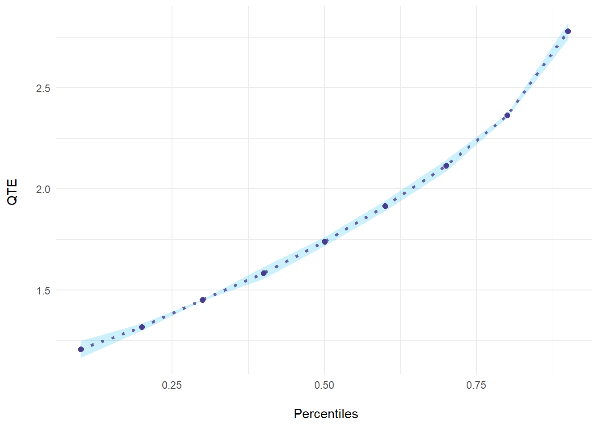
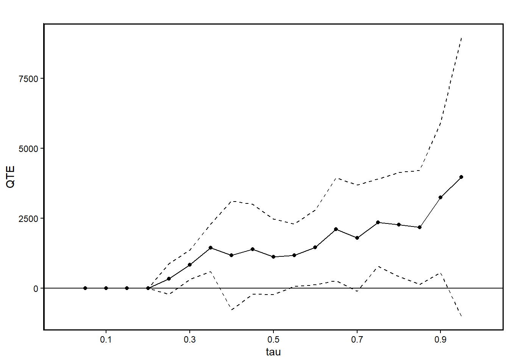
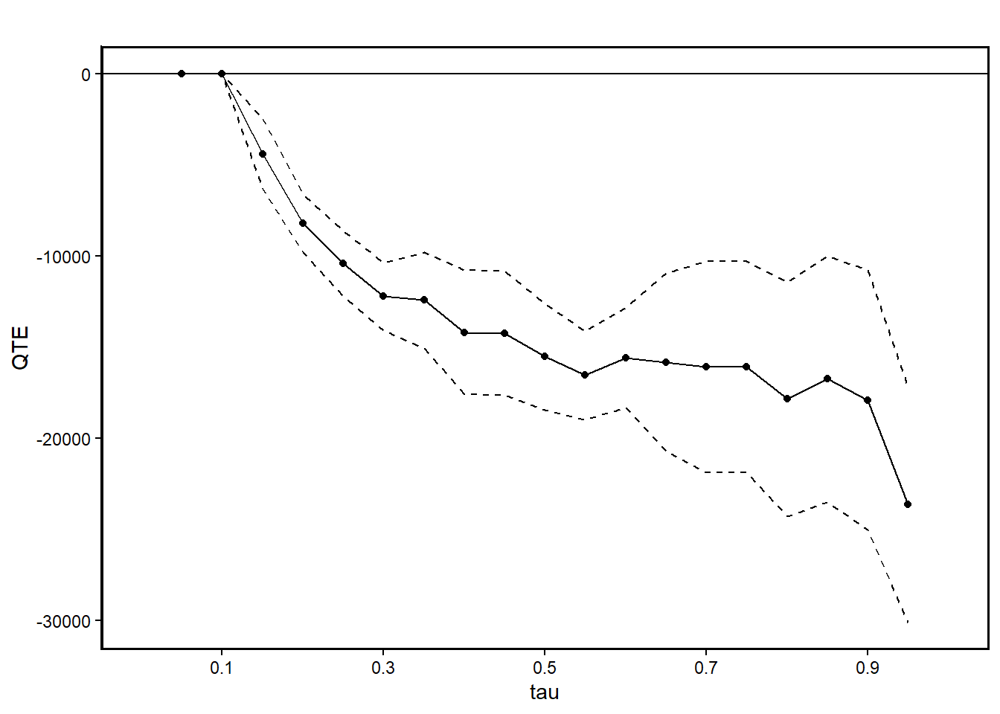
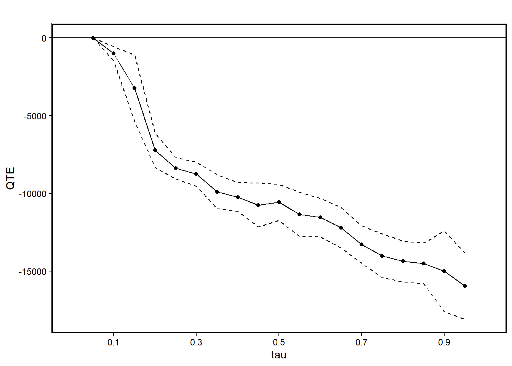
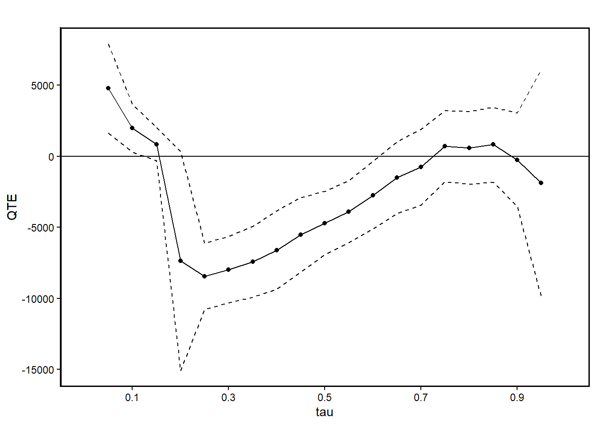
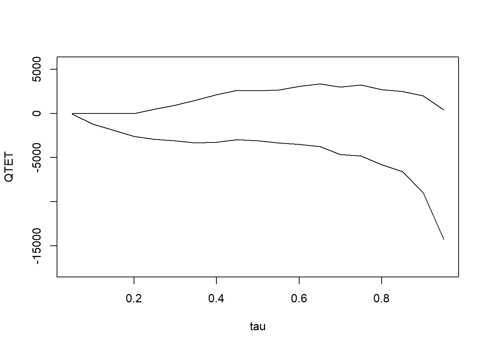
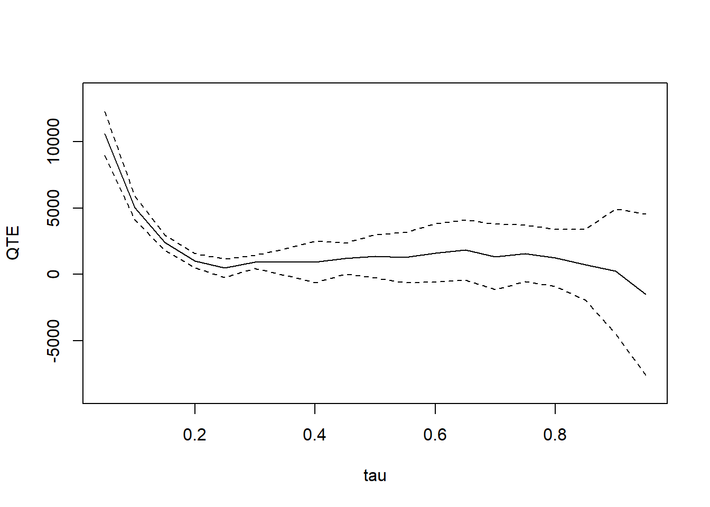

# Changes-in-Changes {#sec-changes-in-changes}

The Changes-in-Changes (CiC) estimator, introduced by @athey2006identification, is an alternative to the [Difference-in-Differences](#sec-difference-in-differences) strategy. While traditional DiD estimates the [Average Treatment Effect on the Treated] (ATT), CiC focuses on the **Quantile Treatment Effect on the Treated (QTT)**.

Policymakers and analysts often look beyond average program impacts to understand how benefits are distributed across different subgroups. The QTT approach is particularly useful in cases where:

-   **Policy decisions depend on distributional effects:**
    -   For instance, consider two job training programs with the same negative average effect.
    -   If one program harms high-income earners while benefiting low-income earners, it might still be considered valuable, whereas a program that negatively affects low-income earners might be rejected.
-   **Limitations of traditional methods:**
    -   Methods such as linear regression assume uniform treatment effects across the population, which may mask important distributional differences.
-   **Advantages of QTE methods:**
    -   Quantile treatment effects (QTEs) allow for a more detailed examination of how treatment effects vary across different segments of a population.
    -   While QTEs provide distributional insights, they can also be used to recover ATEs under weaker assumptions.

<!-- -->

-   **References**

    -   @athey2006identification
    -   @frolich2013unconditional: IV-based
    -   @callaway2019quantile: panel data
    -   @huber2022direct

-   **Additional Resources**

    -   Code examples available in [Stata](https://sites.google.com/site/blaisemelly/home/computer-programs/cic_stata).

## Key Concepts

-   **Quantile Treatment Effect on the Treated (QTT):**
    -   Measures the difference in quantiles of the potential outcome distributions for treated units.
-   **Rank Preservation:**
    -   Assumes that the rank of an individual remains unchanged across different potential outcome distributions.
    -   This is a **strong assumption** and should be considered carefully in empirical applications.
-   **Counterfactual Distribution:**
    -   The main estimation challenge in CiC is constructing the **counterfactual distribution** of outcomes for treated units in period 1.

## Estimating QTT with CiC

CiC relies on four distributions from a 2 × 2 Difference-in-Differences (DiD) setup:

1.  $F_{Y(0),00}$: CDF of $Y(0)$ for control units in period 0.
2.  $F_{Y(0),10}$: CDF of $Y(0)$ for treatment units in period 0.
3.  $F_{Y(0),01}$: CDF of $Y(0)$ for control units in period 1.
4.  $F_{Y(1),11}$: CDF of $Y(1)$ for treatment units in period 1.

The Quantile Treatment Effect on the Treated (QTT) at quantile $\theta$ is:

$$
\Delta_\theta^{QTT} = F_{Y(1), 11}^{-1} (\theta) - F_{Y (0), 11}^{-1} (\theta)
$$

To estimate the counterfactual CDF:

$$
\hat{F}_{Y(0),11}(y) = F_{y,01}\left(F^{-1}_{y,00}\left(F_{y,10}(y)\right)\right)
$$

This leads to the estimation of the inverse counterfactual CDF:

$$
\hat{F}^{-1}_{Y(0),11}(\theta) = F^{-1}_{y,01}\left(F_{y,00}\left(F^{-1}_{y,10}(\theta)\right)\right)
$$

Finally, the treatment effect estimate is:

$$
\hat{\Delta}^{CIC}_{\theta} = F^{-1}_{Y(1),11}(\theta) - \hat{F}^{-1}_{Y(0),11}(\theta)
$$

Alternatively, CiC can be expressed as the difference between two QTE estimates:

$$
\Delta^{CIC}_{\theta} = \Delta^{QTE}_{\theta,1} - \Delta^{QTE}_{\theta',0}
$$

where:

-   $\Delta^{QTT}_{\theta,1}$ represents the change over time at quantile $\theta$ for the treated group ($D=1$).
-   $\Delta^{QTU}_{\theta',0}$ represents the change over time at quantile $\theta'$ for the control group ($D=0$).
    -   The quantile $\theta'$ is selected to match the value of $y$ at quantile $\theta$ in the treated group's period 0 distribution.

------------------------------------------------------------------------

**Marketing Example**

Suppose a company introduces a new online marketing strategy aimed at improving customer retention rates. The goal is to analyze how this strategy affects retention at different quantiles of the customer base.

1.  **QTT Interpretation:**
    -   Instead of looking at the average effect of the marketing strategy, CiC allows the company to examine how retention rates change across different quantiles (e.g., low vs. high-retention customers).
2.  **Rank Preservation Assumption:**
    -   This approach assumes that customers' rank in the retention distribution remains unchanged, regardless of whether they received the new strategy.
3.  **Counterfactual Distribution:**
    -   CiC helps estimate how retention rates would have evolved without the new strategy, by comparing trends in the control group.

------------------------------------------------------------------------

## Application

### ECIC package


``` r
library(ecic)
data(dat, package = "ecic")
mod =
  ecic(
    yvar  = lemp,         # dependent variable
    gvar  = first.treat,  # group indicator
    tvar  = year,         # time indicator
    ivar  = countyreal,   # unit ID
    dat   = dat,          # dataset
    boot  = "weighted",   # bootstrap proceduce ("no", "normal", or "weighted")
    nReps = 3            # number of bootstrap runs
    )
mod_res <- summary(mod)
mod_res
#>   perc    coefs          se
#> 1  0.1 1.206140 0.021351711
#> 2  0.2 1.316599 0.009225026
#> 3  0.3 1.449963 0.001859468
#> 4  0.4 1.583415 0.015296156
#> 5  0.5 1.739932 0.011240454
#> 6  0.6 1.915558 0.013060348
#> 7  0.7 2.114966 0.014482208
#> 8  0.8 2.363105 0.005173865
#> 9  0.9 2.779202 0.020831180

ecic_plot(mod_res)
```



### QTE package


``` r
library(qte)
data(lalonde)

# randomized setting
# qte is identical to qtet
jt.rand <-
    ci.qtet(
        re78 ~ treat,
        data = lalonde.exp,
        iters = 10
    )
summary(jt.rand)
#> 
#> Quantile Treatment Effect:
#> 		
#> tau	QTE	Std. Error
#> 0.05	   0.00	   0.00
#> 0.1	   0.00	   0.00
#> 0.15	   0.00	   0.00
#> 0.2	   0.00	   0.00
#> 0.25	 338.65	 278.30
#> 0.3	 846.40	 269.62
#> 0.35	1451.51	 435.59
#> 0.4	1177.72	 991.27
#> 0.45	1396.08	 820.60
#> 0.5	1123.55	 688.62
#> 0.55	1181.54	 568.44
#> 0.6	1466.51	 680.35
#> 0.65	2115.04	 936.74
#> 0.7	1795.12	 965.18
#> 0.75	2347.49	 793.25
#> 0.8	2278.12	 945.42
#> 0.85	2178.28	1038.98
#> 0.9	3239.60	1369.51
#> 0.95	3979.62	2541.22
#> 
#> Average Treatment Effect:	1794.34
#> 	 Std. Error: 		552.77
ggqte(jt.rand)
```




``` r
# conditional independence assumption (CIA)
jt.cia <- ci.qte(
    re78 ~ treat,
    xformla =  ~ age + education,
    data = lalonde.psid,
    iters = 10
)
summary(jt.cia)
#> 
#> Quantile Treatment Effect:
#> 		
#> tau	QTE	Std. Error
#> 0.05	     0.00	     0.00
#> 0.1	     0.00	     0.00
#> 0.15	 -4433.18	   982.83
#> 0.2	 -8219.15	   808.52
#> 0.25	-10435.74	   918.11
#> 0.3	-12232.03	   954.91
#> 0.35	-12428.30	  1344.81
#> 0.4	-14195.24	  1741.44
#> 0.45	-14248.66	  1736.88
#> 0.5	-15538.67	  1484.04
#> 0.55	-16550.71	  1241.91
#> 0.6	-15595.02	  1402.47
#> 0.65	-15827.52	  2484.78
#> 0.7	-16090.32	  2946.11
#> 0.75	-16091.49	  2956.65
#> 0.8	-17864.76	  3282.21
#> 0.85	-16756.71	  3443.48
#> 0.9	-17914.99	  3634.99
#> 0.95	-23646.22	  3296.60
#> 
#> Average Treatment Effect:	-13435.40
#> 	 Std. Error: 		1211.55
ggqte(jt.cia)
```



``` r

jt.ciat <- ci.qtet(
    re78 ~ treat,
    xformla =  ~ age + education,
    data = lalonde.psid,
    iters = 10
)
summary(jt.ciat)
#> 
#> Quantile Treatment Effect:
#> 		
#> tau	QTE	Std. Error
#> 0.05	     0.00	     0.00
#> 0.1	 -1018.15	   233.40
#> 0.15	 -3251.00	  1087.69
#> 0.2	 -7240.86	   565.00
#> 0.25	 -8379.94	   350.81
#> 0.3	 -8758.82	   393.28
#> 0.35	 -9897.44	   556.21
#> 0.4	-10239.57	   466.64
#> 0.45	-10751.39	   716.41
#> 0.5	-10570.14	   594.04
#> 0.55	-11348.96	   727.81
#> 0.6	-11550.84	   633.34
#> 0.65	-12203.56	   664.15
#> 0.7	-13277.72	   610.92
#> 0.75	-14011.74	   722.19
#> 0.8	-14373.95	   671.96
#> 0.85	-14499.18	   673.49
#> 0.9	-15008.63	  1319.24
#> 0.95	-15954.05	  1081.66
#> 
#> Average Treatment Effect:	4266.19
#> 	 Std. Error: 		426.03
ggqte(jt.ciat)
```



-   **QTE** compares quantiles of the entire population under treatment and control, whereas **QTET** compares quantiles within the treated group itself. This difference means that QTE reflects the overall population-level impact, while QTET focuses on the treated group's specific impact.

-   **CIA** enables identification of both QTE and QTET, but since QTET is conditional on treatment, it might reflect different effects than QTE, especially when the treatment effect is heterogeneous across different subpopulations. For example, the QTE could show a more generalized effect across all individuals, while the QTET may reveal stronger or weaker effects for the subgroup that actually received the treatment.

These are DID-like models

1.  With the distributional difference-in-differences assumption [@fan2012partial, @callaway2019quantile], which is an extension of the parallel trends assumption, we can estimate QTET.


``` r
# distributional DiD assumption
jt.pqtet <- panel.qtet(
    re ~ treat,
    t = 1978,
    tmin1 = 1975,
    tmin2 = 1974,
    tname = "year",
    idname = "id",
    data = lalonde.psid.panel,
    iters = 10
)
summary(jt.pqtet)
#> 
#> Quantile Treatment Effect:
#> 		
#> tau	QTE	Std. Error
#> 0.05	 4779.21	 1598.63
#> 0.1	 1987.35	  860.00
#> 0.15	  842.95	  597.52
#> 0.2	-7366.04	 3930.31
#> 0.25	-8449.96	 1186.97
#> 0.3	-7992.15	 1191.05
#> 0.35	-7429.21	 1275.29
#> 0.4	-6597.37	 1406.24
#> 0.45	-5519.45	 1331.88
#> 0.5	-4702.88	 1132.75
#> 0.55	-3904.52	 1106.54
#> 0.6	-2741.80	 1215.67
#> 0.65	-1507.31	 1284.42
#> 0.7	 -771.12	 1359.07
#> 0.75	  707.81	 1267.75
#> 0.8	  580.00	 1307.04
#> 0.85	  821.75	 1343.46
#> 0.9	 -250.77	 1677.63
#> 0.95	-1874.54	 4062.08
#> 
#> Average Treatment Effect:	2326.51
#> 	 Std. Error: 		668.35
ggqte(jt.pqtet)
```



2.  With 2 periods, the distributional DiD assumption can partially identify QTET with bounds [@fan2012partial]


``` r
res_bound <-
    bounds(
        re ~ treat,
        t = 1978,
        tmin1 = 1975,
        data = lalonde.psid.panel,
        idname = "id",
        tname = "year"
    )
summary(res_bound)
#> 
#> Bounds on the Quantile Treatment Effect on the Treated:
#> 		
#> tau	Lower Bound	Upper Bound
#>         tau	Lower Bound	Upper Bound
#>        0.05	     -51.72	          0
#>         0.1	   -1220.84	          0
#>        0.15	    -1881.9	          0
#>         0.2	   -2601.32	          0
#>        0.25	   -2916.38	     485.23
#>         0.3	   -3080.16	     943.05
#>        0.35	   -3327.89	    1505.98
#>         0.4	   -3240.59	    2133.59
#>        0.45	   -2982.51	    2616.84
#>         0.5	   -3108.01	     2566.2
#>        0.55	   -3342.66	    2672.82
#>         0.6	    -3491.4	     3065.7
#>        0.65	   -3739.74	    3349.74
#>         0.7	   -4647.82	    2992.03
#>        0.75	   -4826.78	    3219.32
#>         0.8	    -5801.7	    2702.33
#>        0.85	   -6588.61	    2499.41
#>         0.9	   -8953.84	    2020.84
#>        0.95	  -14283.61	     397.04
#> 
#> Average Treatment Effect on the Treated:	2326.51
plot(res_bound)
```



3.  With a restrictive assumption that difference in the quantiles of the distribution of potential outcomes for the treated and untreated groups be the same for all values of quantiles, we can have the mean DiD model


``` r
jt.mdid <- ddid2(
    re ~ treat,
    t = 1978,
    tmin1 = 1975,
    tname = "year",
    idname = "id",
    data = lalonde.psid.panel,
    iters = 10
)
summary(jt.mdid)
#> 
#> Quantile Treatment Effect:
#> 		
#> tau	QTE	Std. Error
#> 0.05	10616.61	  847.60
#> 0.1	 5019.83	  460.02
#> 0.15	 2388.12	  300.16
#> 0.2	 1033.23	  270.61
#> 0.25	  485.23	  359.29
#> 0.3	  943.05	  250.11
#> 0.35	  931.45	  511.72
#> 0.4	  945.35	  797.51
#> 0.45	 1205.88	  597.34
#> 0.5	 1362.11	  831.69
#> 0.55	 1279.05	  961.36
#> 0.6	 1618.13	 1127.94
#> 0.65	 1834.30	 1156.69
#> 0.7	 1326.06	 1262.08
#> 0.75	 1586.35	 1085.09
#> 0.8	 1256.09	 1093.97
#> 0.85	  723.10	 1364.49
#> 0.9	  251.36	 2405.13
#> 0.95	-1509.92	 3091.21
#> 
#> Average Treatment Effect:	2326.51
#> 	 Std. Error: 		673.89
plot(jt.mdid)
```



On top of the distributional DiD assumption, we need **copula stability** assumption (i.e., If, before the treatment, the units with the highest outcomes were improving the most, we would expect to see them improving the most in the current period too.) for these models:

| **Aspect**                      | **QDiD**                       | **CiC**                          |
|---------------------------------|--------------------------------|----------------------------------|
| **Treatment of Time and Group** | Symmetric                      | Asymmetric                       |
| **QTET Computation**            | Not inherently scale-invariant | Outcome Variable Scale-Invariant |


``` r
jt.qdid <- QDiD(
    re ~ treat,
    t = 1978,
    tmin1 = 1975,
    tname = "year",
    idname = "id",
    data = lalonde.psid.panel,
    iters = 10,
    panel = T
)

jt.cic <- CiC(
    re ~ treat,
    t = 1978,
    tmin1 = 1975,
    tname = "year",
    idname = "id",
    data = lalonde.psid.panel,
    iters = 10,
    panel = T
)
```

------------------------------------------------------------------------

## CiC vs. QDiD: A More Detailed Contrast

CiC and QDiD both deliver quantile treatment effects in panel settings, but they rest on *different* identifying assumptions and answer *different* counterfactual questions. The distinction matters in applied work:

| **Aspect**                          | **QDiD (Quantile DiD)**                                                                                                     | **CiC (Athey-Imbens)**                                                                                                              |
|-----------------------------------|-----------------------------|-----------------------------|
| **Target estimand**                 | QTT at each quantile $\theta$                                                                                               | QTT at each quantile $\theta$                                                                                                       |
| **Identifying assumption**          | Differences in quantiles of untreated potential outcomes are constant across groups (a distributional parallel-trends form) | Rank invariance / rank similarity: an individual's rank in the untreated-outcome distribution is stable across groups and over time |
| **Treatment of time vs. group**     | Symmetric (the roles of the two dimensions are interchangeable)                                                             | Asymmetric (explicit monotone production function in an unobserved scalar)                                                          |
| **Scale-invariance**                | Not invariant to monotone outcome transforms; results depend on whether you use $Y$, $\log Y$, or $\sqrt{Y}$               | Invariant to monotone transformations of the outcome (a major advantage in applied work)                                            |
| **Additional structure**            | Requires a copula-stability assumption (the dependence between outcome ranks across periods is stable)                      | Requires that the distribution of the unobserved heterogeneity in the treated group is contained in that of the control            |
| **Interpretation of heterogeneity** | Captures differences in quantile shifts                                                                                      | Captures shifts in the latent outcome-generating function                                                                           |

Which to pick? CiC is the natural choice when three things hold: the outcome can reasonably be modeled as a monotone function of an unobserved scalar (productivity → wages is the canonical example), scale-invariance matters (you do not want results to flip when you log the outcome), and the treated group's pre-treatment support is contained in the control group's. QDiD is preferable when the distributional parallel-trends assumption is defensible (pre-treatment quantiles for treated and control track each other closely) and the outcome has a natural scale that need not be robust to monotone reparameterization.

When feasible, report both estimates alongside the standard DiD point estimate. Concordance across CiC, QDiD, and DiD increases credibility; divergence is a signal that distributional heterogeneity is doing real work in the data and deserves explicit discussion.

------------------------------------------------------------------------

## Practical Guidance on CiC

CiC becomes interesting in applications where the whole distribution of outcomes, not just the mean, carries policy weight. Income support programs often fit this description, because the effect at the bottom of the distribution is more important to a welfare analyst than the effect at the median. Job-training programs similarly can concentrate their gains in the middle of the ability distribution, with little or no effect at the tails. Marketing interventions where response is concentrated in a heavy upper tail (big spenders reacting strongly to a price promotion) are another case where the ATT masks the substantive story.

Before reaching for CiC, check three things. First, is the underlying outcome plausibly a monotone function of an unobserved scalar (ability, latent demand, willingness-to-pay)? The Athey-Imbens derivation relies on exactly that production-function structure. Second, is the treated group's pre-treatment outcome support contained inside the control group's support? If not, some quantiles are not identified and the estimator extrapolates. Third, will scale-invariance buy you something? CiC's main operational advantage over QDiD is that its output does not change if you log, square-root, or otherwise monotonically reparameterize the outcome, a useful feature when reviewers push back on functional-form choices.

The single strongest assumption is rank invariance: an individual's position in the untreated outcome distribution would have been the same in the post-period as in the pre-period, had they not been treated. It is an assumption that needs to be argued in context, not asserted from a template. In some settings (short panels, relatively stable populations) it is plausible; in others (long panels, high mobility across the distribution) it is hard to defend.

Two practical limitations to keep in mind. Confidence intervals come from the bootstrap and are often wide at extreme quantiles where density is low, do not chase statistical significance into the tails of a thin sample. And CiC identifies the marginal distribution of potential outcomes, not individual-level effects; a headline of the form "the treatment raised the 90th percentile by $X$" should not be read as "the 90th-percentile units gained $X$ from the treatment."

A complete CiC writeup has four elements: a plot of estimated QTT across quantiles with bootstrap bands, the corresponding DiD/ATT for comparison, overlap diagnostics showing pre-treatment outcome densities for treated and control, and, wherever feasible, both CiC and QDiD estimates side-by-side. Concordance across estimators builds credibility; divergence is itself a finding worth discussing.
