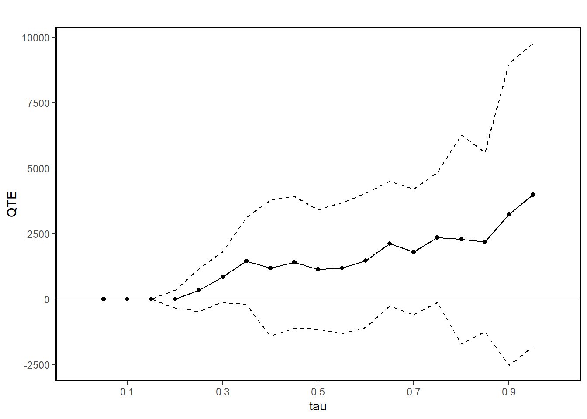
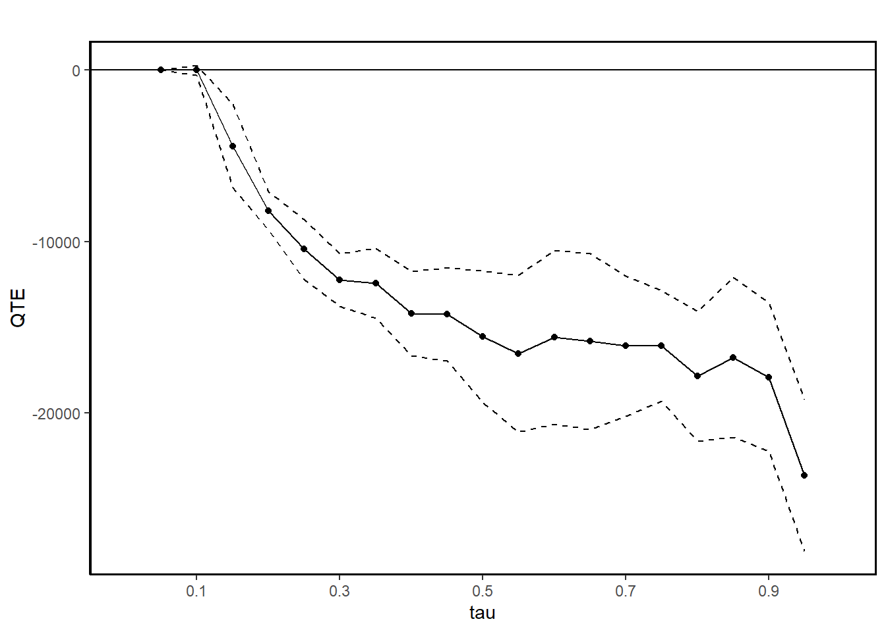
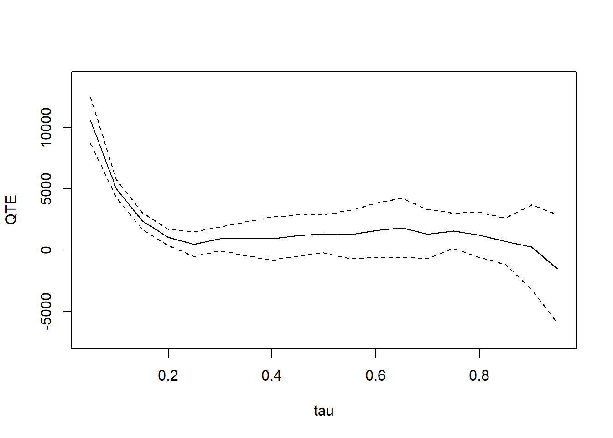

# Changes-in-Changes {#sec-changes-in-changes}

The Changes-in-Changes (CiC) estimator, introduced by @athey2006identification, is an alternative to the [Difference-in-Differences](#sec-difference-in-differences) strategy. While traditional DiD estimates the [Average Treatment Effect on the Treated] (ATT), CiC focuses on the **Quantile Treatment Effect on the Treated (QTT)**.

Policymakers and analysts often look beyond average program impacts to understand how benefits are distributed across different subgroups. The QTT approach is particularly useful in cases where:

-   **Policy decisions depend on distributional effects:**
    -   For instance, consider two job training programs with the same negative average effect.
    -   If one program harms high-income earners while benefiting low-income earners, it might still be considered valuable, whereas a program that negatively affects low-income earners might be rejected.
-   **Limitations of traditional methods:**
    -   Methods such as linear regression assume uniform treatment effects across the population, which may mask important distributional differences.
-   **Advantages of QTE methods:**
    -   Quantile treatment effects (QTEs) allow for a more detailed examination of how treatment effects vary across different segments of a population.
    -   While QTEs provide distributional insights, they can also be used to recover ATEs under weaker assumptions.

<!-- -->

-   **References**

    -   @athey2006identification
    -   @frolich2013unconditional: IV-based
    -   @callaway2019quantile: panel data
    -   @huber2022direct

-   **Additional Resources**

    -   Code examples available in [Stata](https://sites.google.com/site/blaisemelly/home/computer-programs/cic_stata).

## Key Concepts

-   **Quantile Treatment Effect on the Treated (QTT):**
    -   Measures the difference in quantiles of the potential outcome distributions for treated units.
-   **Rank Preservation:**
    -   Assumes that the rank of an individual remains unchanged across different potential outcome distributions.
    -   This is a **strong assumption** and should be considered carefully in empirical applications.
-   **Counterfactual Distribution:**
    -   The main estimation challenge in CiC is constructing the **counterfactual distribution** of outcomes for treated units in period 1.

## Estimating QTT with CiC

CiC relies on four distributions from a 2 × 2 Difference-in-Differences (DiD) setup:

1.  $F_{Y(0),00}$: CDF of $Y(0)$ for control units in period 0.
2.  $F_{Y(0),10}$: CDF of $Y(0)$ for treatment units in period 0.
3.  $F_{Y(0),01}$: CDF of $Y(0)$ for control units in period 1.
4.  $F_{Y(1),11}$: CDF of $Y(1)$ for treatment units in period 1.

The Quantile Treatment Effect on the Treated (QTT) at quantile $\theta$ is:

$$
\Delta_\theta^{QTT} = F_{Y(1), 11}^{-1} (\theta) - F_{Y (0), 11}^{-1} (\theta)
$$

To estimate the counterfactual CDF:

$$
\hat{F}_{Y(0),11}(y) = F_{y,01}\left(F^{-1}_{y,00}\left(F_{y,10}(y)\right)\right)
$$

This leads to the estimation of the inverse counterfactual CDF:

$$
\hat{F}^{-1}_{Y(0),11}(\theta) = F^{-1}_{y,01}\left(F_{y,00}\left(F^{-1}_{y,10}(\theta)\right)\right)
$$

Finally, the treatment effect estimate is:

$$
\hat{\Delta}^{CIC}_{\theta} = F^{-1}_{Y(1),11}(\theta) - \hat{F}^{-1}_{Y(0),11}(\theta)
$$

Alternatively, CiC can be expressed as the difference between two QTE estimates:

$$
\Delta^{CIC}_{\theta} = \Delta^{QTE}_{\theta,1} - \Delta^{QTE}_{\theta',0}
$$

where:

-   $\Delta^{QTT}_{\theta,1}$ represents the change over time at quantile $\theta$ for the treated group ($D=1$).
-   $\Delta^{QTU}_{\theta',0}$ represents the change over time at quantile $\theta'$ for the control group ($D=0$).
    -   The quantile $\theta'$ is selected to match the value of $y$ at quantile $\theta$ in the treated group's period 0 distribution.

------------------------------------------------------------------------

**Marketing Example**

Suppose a company introduces a new online marketing strategy aimed at improving customer retention rates. The goal is to analyze how this strategy affects retention at different quantiles of the customer base.

1.  **QTT Interpretation:**
    -   Instead of looking at the average effect of the marketing strategy, CiC allows the company to examine how retention rates change across different quantiles (e.g., low vs. high-retention customers).
2.  **Rank Preservation Assumption:**
    -   This approach assumes that customers' rank in the retention distribution remains unchanged, regardless of whether they received the new strategy.
3.  **Counterfactual Distribution:**
    -   CiC helps estimate how retention rates would have evolved without the new strategy, by comparing trends in the control group.

------------------------------------------------------------------------

## Application

### ECIC package


``` r
library(ecic)
data(dat, package = "ecic")
mod =
  ecic(
    yvar  = lemp,         # dependent variable
    gvar  = first.treat,  # group indicator
    tvar  = year,         # time indicator
    ivar  = countyreal,   # unit ID
    dat   = dat,          # dataset
    boot  = "weighted",   # bootstrap proceduce ("no", "normal", or "weighted")
    nReps = 3            # number of bootstrap runs
    )
mod_res <- summary(mod)
mod_res
#>   perc    coefs          se
#> 1  0.1 1.206140 0.021351711
#> 2  0.2 1.316599 0.009225026
#> 3  0.3 1.449963 0.001859468
#> 4  0.4 1.583415 0.015296156
#> 5  0.5 1.739932 0.011240454
#> 6  0.6 1.915558 0.013060348
#> 7  0.7 2.114966 0.014482208
#> 8  0.8 2.363105 0.005173865
#> 9  0.9 2.779202 0.020831180

ecic_plot(mod_res)
```


### QTE package


``` r
library(qte)
data(lalonde)

# randomized setting
# qte is identical to qtet
jt.rand <-
    ci.qtet(
        re78 ~ treat,
        data = lalonde.exp,
        iters = 10
    )
summary(jt.rand)
#> 
#> Quantile Treatment Effect:
#> 		
#> tau	QTE	Std. Error
#> 0.05	   0.00	   0.00
#> 0.1	   0.00	   0.00
#> 0.15	   0.00	   0.00
#> 0.2	   0.00	 172.22
#> 0.25	 338.65	 412.28
#> 0.3	 846.40	 495.49
#> 0.35	1451.51	 850.06
#> 0.4	1177.72	1324.94
#> 0.45	1396.08	1284.24
#> 0.5	1123.55	1165.53
#> 0.55	1181.54	1278.94
#> 0.6	1466.51	1305.18
#> 0.65	2115.04	1214.72
#> 0.7	1795.12	1223.99
#> 0.75	2347.49	1263.86
#> 0.8	2278.12	2035.94
#> 0.85	2178.28	1748.55
#> 0.9	3239.60	2943.38
#> 0.95	3979.62	2956.72
#> 
#> Average Treatment Effect:	1794.34
#> 	 Std. Error: 		1231.65
ggqte(jt.rand)
```




``` r
# conditional independence assumption (CIA)
jt.cia <- ci.qte(
    re78 ~ treat,
    xformla =  ~ age + education,
    data = lalonde.psid,
    iters = 10
)
summary(jt.cia)
#> 
#> Quantile Treatment Effect:
#> 		
#> tau	QTE	Std. Error
#> 0.05	     0.00	     0.00
#> 0.1	     0.00	   153.44
#> 0.15	 -4433.18	  1247.76
#> 0.2	 -8219.15	   567.13
#> 0.25	-10435.74	   890.72
#> 0.3	-12232.03	   780.23
#> 0.35	-12428.30	  1046.95
#> 0.4	-14195.24	  1255.86
#> 0.45	-14248.66	  1375.50
#> 0.5	-15538.67	  1957.68
#> 0.55	-16550.71	  2333.33
#> 0.6	-15595.02	  2586.83
#> 0.65	-15827.52	  2623.48
#> 0.7	-16090.32	  2082.43
#> 0.75	-16091.49	  1644.88
#> 0.8	-17864.76	  1929.23
#> 0.85	-16756.71	  2383.14
#> 0.9	-17914.99	  2205.49
#> 0.95	-23646.22	  2246.10
#> 
#> Average Treatment Effect:	-13435.40
#> 	 Std. Error: 		953.59
ggqte(jt.cia)
```



``` r

jt.ciat <- ci.qtet(
    re78 ~ treat,
    xformla =  ~ age + education,
    data = lalonde.psid,
    iters = 10
)
summary(jt.ciat)
#> 
#> Quantile Treatment Effect:
#> 		
#> tau	QTE	Std. Error
#> 0.05	     0.00	     0.00
#> 0.1	 -1018.15	   621.26
#> 0.15	 -3251.00	  1647.68
#> 0.2	 -7240.86	  1075.73
#> 0.25	 -8379.94	   646.57
#> 0.3	 -8758.82	   655.46
#> 0.35	 -9897.44	   837.77
#> 0.4	-10239.57	   864.00
#> 0.45	-10751.39	  1305.32
#> 0.5	-10570.14	   901.01
#> 0.55	-11348.96	  1165.84
#> 0.6	-11550.84	   985.99
#> 0.65	-12203.56	  1017.18
#> 0.7	-13277.72	  1005.26
#> 0.75	-14011.74	   535.50
#> 0.8	-14373.95	   694.64
#> 0.85	-14499.18	   840.33
#> 0.9	-15008.63	  1745.99
#> 0.95	-15954.05	  1689.42
#> 
#> Average Treatment Effect:	4266.19
#> 	 Std. Error: 		447.40
ggqte(jt.ciat)
```


-   **QTE** compares quantiles of the entire population under treatment and control, whereas **QTET** compares quantiles within the treated group itself. This difference means that QTE reflects the overall population-level impact, while QTET focuses on the treated group's specific impact.

-   **CIA** enables identification of both QTE and QTET, but since QTET is conditional on treatment, it might reflect different effects than QTE, especially when the treatment effect is heterogeneous across different subpopulations. For example, the QTE could show a more generalized effect across all individuals, while the QTET may reveal stronger or weaker effects for the subgroup that actually received the treatment.

These are DID-like models

1.  With the distributional difference-in-differences assumption [@fan2012partial, @callaway2019quantile], which is an extension of the parallel trends assumption, we can estimate QTET.


``` r
# distributional DiD assumption
jt.pqtet <- panel.qtet(
    re ~ treat,
    t = 1978,
    tmin1 = 1975,
    tmin2 = 1974,
    tname = "year",
    idname = "id",
    data = lalonde.psid.panel,
    iters = 10
)
summary(jt.pqtet)
#> 
#> Quantile Treatment Effect:
#> 		
#> tau	QTE	Std. Error
#> 0.05	 4779.21	 1381.99
#> 0.1	 1987.35	  580.24
#> 0.15	  842.95	  597.66
#> 0.2	-7366.04	 4554.93
#> 0.25	-8449.96	 1941.26
#> 0.3	-7992.15	  840.84
#> 0.35	-7429.21	  860.91
#> 0.4	-6597.37	  804.03
#> 0.45	-5519.45	  917.33
#> 0.5	-4702.88	  883.83
#> 0.55	-3904.52	 1206.82
#> 0.6	-2741.80	 1282.21
#> 0.65	-1507.31	 1266.61
#> 0.7	 -771.12	 1403.72
#> 0.75	  707.81	 1255.73
#> 0.8	  580.00	  972.56
#> 0.85	  821.75	  921.04
#> 0.9	 -250.77	 1597.59
#> 0.95	-1874.54	 1775.63
#> 
#> Average Treatment Effect:	2326.51
#> 	 Std. Error: 		354.00
ggqte(jt.pqtet)
```


2.  With 2 periods, the distributional DiD assumption can partially identify QTET with bounds [@fan2012partial]


``` r
res_bound <-
    bounds(
        re ~ treat,
        t = 1978,
        tmin1 = 1975,
        data = lalonde.psid.panel,
        idname = "id",
        tname = "year"
    )
summary(res_bound)
#> 
#> Bounds on the Quantile Treatment Effect on the Treated:
#> 		
#> tau	Lower Bound	Upper Bound
#>         tau	Lower Bound	Upper Bound
#>        0.05	     -51.72	          0
#>         0.1	   -1220.84	          0
#>        0.15	    -1881.9	          0
#>         0.2	   -2601.32	          0
#>        0.25	   -2916.38	     485.23
#>         0.3	   -3080.16	     943.05
#>        0.35	   -3327.89	    1505.98
#>         0.4	   -3240.59	    2133.59
#>        0.45	   -2982.51	    2616.84
#>         0.5	   -3108.01	     2566.2
#>        0.55	   -3342.66	    2672.82
#>         0.6	    -3491.4	     3065.7
#>        0.65	   -3739.74	    3349.74
#>         0.7	   -4647.82	    2992.03
#>        0.75	   -4826.78	    3219.32
#>         0.8	    -5801.7	    2702.33
#>        0.85	   -6588.61	    2499.41
#>         0.9	   -8953.84	    2020.84
#>        0.95	  -14283.61	     397.04
#> 
#> Average Treatment Effect on the Treated:	2326.51
plot(res_bound)
```


3.  With a restrictive assumption that difference in the quantiles of the distribution of potential outcomes for the treated and untreated groups be the same for all values of quantiles, we can have the mean DiD model


``` r
jt.mdid <- ddid2(
    re ~ treat,
    t = 1978,
    tmin1 = 1975,
    tname = "year",
    idname = "id",
    data = lalonde.psid.panel,
    iters = 10
)
summary(jt.mdid)
#> 
#> Quantile Treatment Effect:
#> 		
#> tau	QTE	Std. Error
#> 0.05	10616.61	  964.99
#> 0.1	 5019.83	  375.72
#> 0.15	 2388.12	  349.21
#> 0.2	 1033.23	  337.01
#> 0.25	  485.23	  513.72
#> 0.3	  943.05	  493.07
#> 0.35	  931.45	  704.90
#> 0.4	  945.35	  907.41
#> 0.45	 1205.88	  852.24
#> 0.5	 1362.11	  797.66
#> 0.55	 1279.05	 1008.63
#> 0.6	 1618.13	 1133.52
#> 0.65	 1834.30	 1233.78
#> 0.7	 1326.06	 1024.53
#> 0.75	 1586.35	  735.59
#> 0.8	 1256.09	  944.51
#> 0.85	  723.10	  960.34
#> 0.9	  251.36	 1766.75
#> 0.95	-1509.92	 2264.59
#> 
#> Average Treatment Effect:	2326.51
#> 	 Std. Error: 		599.15
plot(jt.mdid)
```



On top of the distributional DiD assumption, we need **copula stability** assumption (i.e., If, before the treatment, the units with the highest outcomes were improving the most, we would expect to see them improving the most in the current period too.) for these models:

| **Aspect**                      | **QDiD**                       | **CiC**                          |
|---------------------------------|--------------------------------|----------------------------------|
| **Treatment of Time and Group** | Symmetric                      | Asymmetric                       |
| **QTET Computation**            | Not inherently scale-invariant | Outcome Variable Scale-Invariant |


``` r
jt.qdid <- QDiD(
    re ~ treat,
    t = 1978,
    tmin1 = 1975,
    tname = "year",
    idname = "id",
    data = lalonde.psid.panel,
    iters = 10,
    panel = T
)

jt.cic <- CiC(
    re ~ treat,
    t = 1978,
    tmin1 = 1975,
    tname = "year",
    idname = "id",
    data = lalonde.psid.panel,
    iters = 10,
    panel = T
)
```
