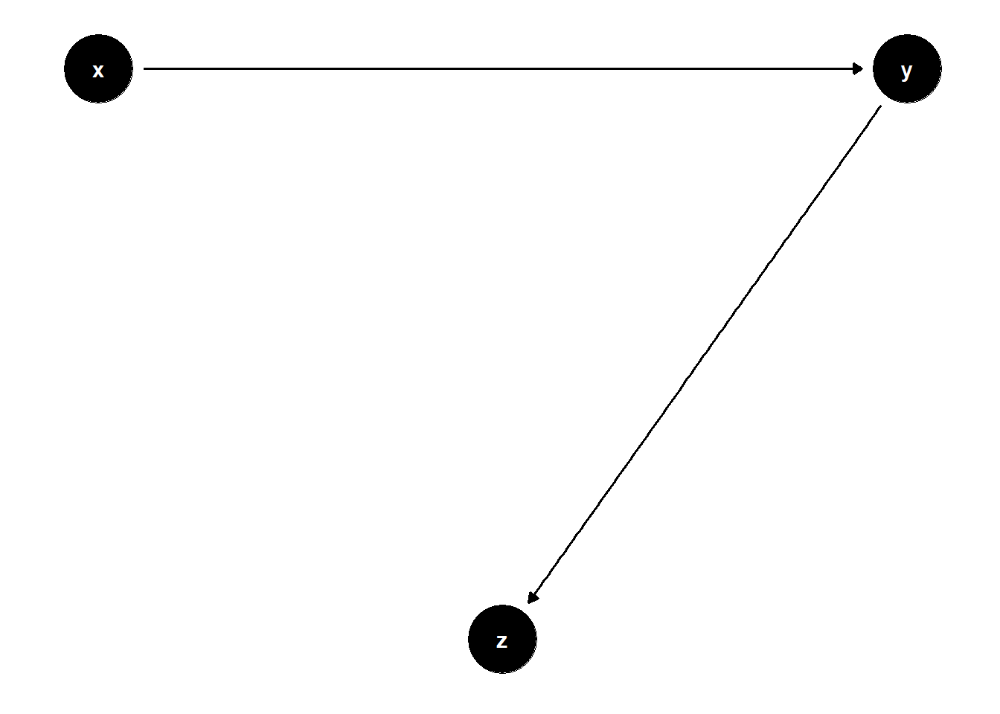

# Controls

This section follows [@cinelli2022crash] and [code](https://www.kaggle.com/code/carloscinelli/crash-course-in-good-and-bad-controls-linear-r/notebook#Model-11---Bad-Control-(overcontrol-bias))


```r
library(dagitty)
library(ggdag)
```

Traditional literature usually considers adding additional control variables is harmless to analysis.

More specifically, this problem is most prevalent in the review process. Reviewers only ask authors to add more variables to "control" for such variable, which can be asked with only limited rationale. Rarely ever you will see a reviewer asks an author to remove some variables to see the behavior of the variable of interest (This is also related to [Coefficient stability]).

However, adding more controls is only good in limited cases.

## Bad Controls

### M-bias

Traditional textbooks [@imbens2015causal; @angrist2009mostly] consider $Z$ as a good control because it's a pre-treatment variable, where it correlates with the treatment and the outcome.

This is most prevalent in [Matching Methods], where we are recommended to include all "pre-treatment" variables.

However, it is a bad control because it opens the back-door path $Z \leftarrow U_1 \to Z \leftarrow U_2 \to Y$


```r
# cleans workspace
rm(list = ls())

# DAG

## specify edges
model <- dagitty("dag{x->y; u1->x; u1->z; u2->z; u2->y}")

# set u as latent
latents(model) <- c("u1", "u2")

## coordinates for plotting
coordinates(model) <-  list(x = c(
    x = 1,
    u1 = 1,
    z = 2,
    u2 = 3,
    y = 3
),
y = c(
    x = 1,
    u1 = 2,
    z = 1.5,
    u2 = 2,
    y = 1
))

## ggplot
ggdag(model) + theme_dag()
```


Even though $Z$ can correlate with both $X$ and $Y$ very well, it's not a confounder.

Controlling for $Z$ can bias the $X \to Y$ estimate, because it opens the colliding path $X \leftarrow U_1 \rightarrow Z \leftarrow U_2 \leftarrow Y$


```r
n <- 1e4
u1 <- rnorm(n)
u2 <- rnorm(n)
z <- u1 + u2 + rnorm(n)
x <- u1 + rnorm(n)
causal_coef <- 2
y <- causal_coef * x - 4*u2 + rnorm(n)


jtools::export_summs(lm(y ~ x), lm(y ~ x + z))
```


```{=html}
<table class="huxtable" style="border-collapse: collapse; border: 0px; margin-bottom: 2em; margin-top: 2em; ; margin-left: auto; margin-right: auto;  " id="tab:unnamed-chunk-3">
<caption style="caption-side: top; text-align: center;">(#tab:unnamed-chunk-3) </caption><col><col><col><tr>
<th style="vertical-align: top; text-align: center; white-space: normal; border-style: solid solid solid solid; border-width: 0.8pt 0pt 0pt 0pt;    padding: 6pt 6pt 6pt 6pt; font-weight: normal;"></th><th style="vertical-align: top; text-align: center; white-space: normal; border-style: solid solid solid solid; border-width: 0.8pt 0pt 0.4pt 0pt;    padding: 6pt 6pt 6pt 6pt; font-weight: normal;">Model 1</th><th style="vertical-align: top; text-align: center; white-space: normal; border-style: solid solid solid solid; border-width: 0.8pt 0pt 0.4pt 0pt;    padding: 6pt 6pt 6pt 6pt; font-weight: normal;">Model 2</th></tr>
<tr>
<th style="vertical-align: top; text-align: left; white-space: normal; border-style: solid solid solid solid; border-width: 0pt 0pt 0pt 0pt;    padding: 6pt 6pt 6pt 6pt; font-weight: normal;">(Intercept)</th><td style="vertical-align: top; text-align: right; white-space: normal; border-style: solid solid solid solid; border-width: 0.4pt 0pt 0pt 0pt;    padding: 6pt 6pt 6pt 6pt; font-weight: normal;">0.01&nbsp;&nbsp;&nbsp;&nbsp;</td><td style="vertical-align: top; text-align: right; white-space: normal; border-style: solid solid solid solid; border-width: 0.4pt 0pt 0pt 0pt;    padding: 6pt 6pt 6pt 6pt; font-weight: normal;">-0.02&nbsp;&nbsp;&nbsp;&nbsp;</td></tr>
<tr>
<th style="vertical-align: top; text-align: left; white-space: normal; border-style: solid solid solid solid; border-width: 0pt 0pt 0pt 0pt;    padding: 6pt 6pt 6pt 6pt; font-weight: normal;"></th><td style="vertical-align: top; text-align: right; white-space: normal; border-style: solid solid solid solid; border-width: 0pt 0pt 0pt 0pt;    padding: 6pt 6pt 6pt 6pt; font-weight: normal;">(0.04)&nbsp;&nbsp;&nbsp;</td><td style="vertical-align: top; text-align: right; white-space: normal; border-style: solid solid solid solid; border-width: 0pt 0pt 0pt 0pt;    padding: 6pt 6pt 6pt 6pt; font-weight: normal;">(0.03)&nbsp;&nbsp;&nbsp;</td></tr>
<tr>
<th style="vertical-align: top; text-align: left; white-space: normal; border-style: solid solid solid solid; border-width: 0pt 0pt 0pt 0pt;    padding: 6pt 6pt 6pt 6pt; font-weight: normal;">x</th><td style="vertical-align: top; text-align: right; white-space: normal; border-style: solid solid solid solid; border-width: 0pt 0pt 0pt 0pt;    padding: 6pt 6pt 6pt 6pt; font-weight: normal;">1.97 ***</td><td style="vertical-align: top; text-align: right; white-space: normal; border-style: solid solid solid solid; border-width: 0pt 0pt 0pt 0pt;    padding: 6pt 6pt 6pt 6pt; font-weight: normal;">2.81 ***</td></tr>
<tr>
<th style="vertical-align: top; text-align: left; white-space: normal; border-style: solid solid solid solid; border-width: 0pt 0pt 0pt 0pt;    padding: 6pt 6pt 6pt 6pt; font-weight: normal;"></th><td style="vertical-align: top; text-align: right; white-space: normal; border-style: solid solid solid solid; border-width: 0pt 0pt 0pt 0pt;    padding: 6pt 6pt 6pt 6pt; font-weight: normal;">(0.03)&nbsp;&nbsp;&nbsp;</td><td style="vertical-align: top; text-align: right; white-space: normal; border-style: solid solid solid solid; border-width: 0pt 0pt 0pt 0pt;    padding: 6pt 6pt 6pt 6pt; font-weight: normal;">(0.03)&nbsp;&nbsp;&nbsp;</td></tr>
<tr>
<th style="vertical-align: top; text-align: left; white-space: normal; border-style: solid solid solid solid; border-width: 0pt 0pt 0pt 0pt;    padding: 6pt 6pt 6pt 6pt; font-weight: normal;">z</th><td style="vertical-align: top; text-align: right; white-space: normal; border-style: solid solid solid solid; border-width: 0pt 0pt 0pt 0pt;    padding: 6pt 6pt 6pt 6pt; font-weight: normal;">&nbsp;&nbsp;&nbsp;&nbsp;&nbsp;&nbsp;&nbsp;</td><td style="vertical-align: top; text-align: right; white-space: normal; border-style: solid solid solid solid; border-width: 0pt 0pt 0pt 0pt;    padding: 6pt 6pt 6pt 6pt; font-weight: normal;">-1.63 ***</td></tr>
<tr>
<th style="vertical-align: top; text-align: left; white-space: normal; border-style: solid solid solid solid; border-width: 0pt 0pt 0pt 0pt;    padding: 6pt 6pt 6pt 6pt; font-weight: normal;"></th><td style="vertical-align: top; text-align: right; white-space: normal; border-style: solid solid solid solid; border-width: 0pt 0pt 0.4pt 0pt;    padding: 6pt 6pt 6pt 6pt; font-weight: normal;">&nbsp;&nbsp;&nbsp;&nbsp;&nbsp;&nbsp;&nbsp;</td><td style="vertical-align: top; text-align: right; white-space: normal; border-style: solid solid solid solid; border-width: 0pt 0pt 0.4pt 0pt;    padding: 6pt 6pt 6pt 6pt; font-weight: normal;">(0.02)&nbsp;&nbsp;&nbsp;</td></tr>
<tr>
<th style="vertical-align: top; text-align: left; white-space: normal; border-style: solid solid solid solid; border-width: 0pt 0pt 0pt 0pt;    padding: 6pt 6pt 6pt 6pt; font-weight: normal;">N</th><td style="vertical-align: top; text-align: right; white-space: normal; border-style: solid solid solid solid; border-width: 0.4pt 0pt 0pt 0pt;    padding: 6pt 6pt 6pt 6pt; font-weight: normal;">10000&nbsp;&nbsp;&nbsp;&nbsp;&nbsp;&nbsp;&nbsp;</td><td style="vertical-align: top; text-align: right; white-space: normal; border-style: solid solid solid solid; border-width: 0.4pt 0pt 0pt 0pt;    padding: 6pt 6pt 6pt 6pt; font-weight: normal;">10000&nbsp;&nbsp;&nbsp;&nbsp;&nbsp;&nbsp;&nbsp;</td></tr>
<tr>
<th style="vertical-align: top; text-align: left; white-space: normal; border-style: solid solid solid solid; border-width: 0pt 0pt 0.8pt 0pt;    padding: 6pt 6pt 6pt 6pt; font-weight: normal;">R2</th><td style="vertical-align: top; text-align: right; white-space: normal; border-style: solid solid solid solid; border-width: 0pt 0pt 0.8pt 0pt;    padding: 6pt 6pt 6pt 6pt; font-weight: normal;">0.31&nbsp;&nbsp;&nbsp;&nbsp;</td><td style="vertical-align: top; text-align: right; white-space: normal; border-style: solid solid solid solid; border-width: 0pt 0pt 0.8pt 0pt;    padding: 6pt 6pt 6pt 6pt; font-weight: normal;">0.57&nbsp;&nbsp;&nbsp;&nbsp;</td></tr>
<tr>
<th colspan="3" style="vertical-align: top; text-align: left; white-space: normal; border-style: solid solid solid solid; border-width: 0.8pt 0pt 0pt 0pt;    padding: 6pt 6pt 6pt 6pt; font-weight: normal;"> *** p &lt; 0.001;  ** p &lt; 0.01;  * p &lt; 0.05.</th></tr>
</table>

```


Another worse variation is


```r
# cleans workspace
rm(list = ls())

# DAG

## specify edges
model <- dagitty("dag{x->y; u1->x; u1->z; u2->z; u2->y; z->y}")

# set u as latent
latents(model) <- c("u1", "u2")

## coordinates for plotting
coordinates(model) <-  list(
  x = c(x=1, u1=1, z=2, u2=3, y=3),
  y = c(x=1, u1=2, z=1.5, u2=2, y=1))

## ggplot
ggdag(model) + theme_dag()
```


You can't do much in this case.

-   If you don't control for $Z$, then you have an open back-door path $X \leftarrow U_1 \to Z \to Y$, and the unadjusted estimate is biased

-   If you control for $Z$, then you open backdoor path $X \leftarrow U_1 \to Z \leftarrow U_2 \to Y$, and the adjusted estimate is also biased

Hence, we cannot identify the causal effect in this case.

We can do sensitivity analyses to examine [@cinelli2019sensitivity; @cinelli2020making]

1.  the plausible bounds on the strength of the direct effect of $Z \to Y$
2.  the strength of the effects of the latent variables

### Bias Amplification


```r
# cleans workspace
rm(list = ls())

# DAG

## specify edges
model <- dagitty("dag{x->y; u->x; u->y; z->x}")

# set u as latent
latents(model) <- c("u")

## coordinates for plotting
coordinates(model) <-  list(
  x = c(z=1, x=2, u=3, y=4),
  y = c(z=1, x=1, u=2, y=1))

## ggplot
ggdag(model) + theme_dag()
```


Controlling for Z amplifies the omitted variable bias


```r
n <- 1e4
z <- rnorm(n)
u <- rnorm(n)
x <- 2*z + u + rnorm(n)
y <- x + 2*u + rnorm(n)

jtools::export_summs(lm(y ~ x), lm(y ~ x + z))
```


```{=html}
<table class="huxtable" style="border-collapse: collapse; border: 0px; margin-bottom: 2em; margin-top: 2em; ; margin-left: auto; margin-right: auto;  " id="tab:unnamed-chunk-6">
<caption style="caption-side: top; text-align: center;">(#tab:unnamed-chunk-6) </caption><col><col><col><tr>
<th style="vertical-align: top; text-align: center; white-space: normal; border-style: solid solid solid solid; border-width: 0.8pt 0pt 0pt 0pt;    padding: 6pt 6pt 6pt 6pt; font-weight: normal;"></th><th style="vertical-align: top; text-align: center; white-space: normal; border-style: solid solid solid solid; border-width: 0.8pt 0pt 0.4pt 0pt;    padding: 6pt 6pt 6pt 6pt; font-weight: normal;">Model 1</th><th style="vertical-align: top; text-align: center; white-space: normal; border-style: solid solid solid solid; border-width: 0.8pt 0pt 0.4pt 0pt;    padding: 6pt 6pt 6pt 6pt; font-weight: normal;">Model 2</th></tr>
<tr>
<th style="vertical-align: top; text-align: left; white-space: normal; border-style: solid solid solid solid; border-width: 0pt 0pt 0pt 0pt;    padding: 6pt 6pt 6pt 6pt; font-weight: normal;">(Intercept)</th><td style="vertical-align: top; text-align: right; white-space: normal; border-style: solid solid solid solid; border-width: 0.4pt 0pt 0pt 0pt;    padding: 6pt 6pt 6pt 6pt; font-weight: normal;">0.01&nbsp;&nbsp;&nbsp;&nbsp;</td><td style="vertical-align: top; text-align: right; white-space: normal; border-style: solid solid solid solid; border-width: 0.4pt 0pt 0pt 0pt;    padding: 6pt 6pt 6pt 6pt; font-weight: normal;">0.01&nbsp;&nbsp;&nbsp;&nbsp;</td></tr>
<tr>
<th style="vertical-align: top; text-align: left; white-space: normal; border-style: solid solid solid solid; border-width: 0pt 0pt 0pt 0pt;    padding: 6pt 6pt 6pt 6pt; font-weight: normal;"></th><td style="vertical-align: top; text-align: right; white-space: normal; border-style: solid solid solid solid; border-width: 0pt 0pt 0pt 0pt;    padding: 6pt 6pt 6pt 6pt; font-weight: normal;">(0.02)&nbsp;&nbsp;&nbsp;</td><td style="vertical-align: top; text-align: right; white-space: normal; border-style: solid solid solid solid; border-width: 0pt 0pt 0pt 0pt;    padding: 6pt 6pt 6pt 6pt; font-weight: normal;">(0.02)&nbsp;&nbsp;&nbsp;</td></tr>
<tr>
<th style="vertical-align: top; text-align: left; white-space: normal; border-style: solid solid solid solid; border-width: 0pt 0pt 0pt 0pt;    padding: 6pt 6pt 6pt 6pt; font-weight: normal;">x</th><td style="vertical-align: top; text-align: right; white-space: normal; border-style: solid solid solid solid; border-width: 0pt 0pt 0pt 0pt;    padding: 6pt 6pt 6pt 6pt; font-weight: normal;">1.33 ***</td><td style="vertical-align: top; text-align: right; white-space: normal; border-style: solid solid solid solid; border-width: 0pt 0pt 0pt 0pt;    padding: 6pt 6pt 6pt 6pt; font-weight: normal;">1.99 ***</td></tr>
<tr>
<th style="vertical-align: top; text-align: left; white-space: normal; border-style: solid solid solid solid; border-width: 0pt 0pt 0pt 0pt;    padding: 6pt 6pt 6pt 6pt; font-weight: normal;"></th><td style="vertical-align: top; text-align: right; white-space: normal; border-style: solid solid solid solid; border-width: 0pt 0pt 0pt 0pt;    padding: 6pt 6pt 6pt 6pt; font-weight: normal;">(0.01)&nbsp;&nbsp;&nbsp;</td><td style="vertical-align: top; text-align: right; white-space: normal; border-style: solid solid solid solid; border-width: 0pt 0pt 0pt 0pt;    padding: 6pt 6pt 6pt 6pt; font-weight: normal;">(0.01)&nbsp;&nbsp;&nbsp;</td></tr>
<tr>
<th style="vertical-align: top; text-align: left; white-space: normal; border-style: solid solid solid solid; border-width: 0pt 0pt 0pt 0pt;    padding: 6pt 6pt 6pt 6pt; font-weight: normal;">z</th><td style="vertical-align: top; text-align: right; white-space: normal; border-style: solid solid solid solid; border-width: 0pt 0pt 0pt 0pt;    padding: 6pt 6pt 6pt 6pt; font-weight: normal;">&nbsp;&nbsp;&nbsp;&nbsp;&nbsp;&nbsp;&nbsp;</td><td style="vertical-align: top; text-align: right; white-space: normal; border-style: solid solid solid solid; border-width: 0pt 0pt 0pt 0pt;    padding: 6pt 6pt 6pt 6pt; font-weight: normal;">-1.99 ***</td></tr>
<tr>
<th style="vertical-align: top; text-align: left; white-space: normal; border-style: solid solid solid solid; border-width: 0pt 0pt 0pt 0pt;    padding: 6pt 6pt 6pt 6pt; font-weight: normal;"></th><td style="vertical-align: top; text-align: right; white-space: normal; border-style: solid solid solid solid; border-width: 0pt 0pt 0.4pt 0pt;    padding: 6pt 6pt 6pt 6pt; font-weight: normal;">&nbsp;&nbsp;&nbsp;&nbsp;&nbsp;&nbsp;&nbsp;</td><td style="vertical-align: top; text-align: right; white-space: normal; border-style: solid solid solid solid; border-width: 0pt 0pt 0.4pt 0pt;    padding: 6pt 6pt 6pt 6pt; font-weight: normal;">(0.03)&nbsp;&nbsp;&nbsp;</td></tr>
<tr>
<th style="vertical-align: top; text-align: left; white-space: normal; border-style: solid solid solid solid; border-width: 0pt 0pt 0pt 0pt;    padding: 6pt 6pt 6pt 6pt; font-weight: normal;">N</th><td style="vertical-align: top; text-align: right; white-space: normal; border-style: solid solid solid solid; border-width: 0.4pt 0pt 0pt 0pt;    padding: 6pt 6pt 6pt 6pt; font-weight: normal;">10000&nbsp;&nbsp;&nbsp;&nbsp;&nbsp;&nbsp;&nbsp;</td><td style="vertical-align: top; text-align: right; white-space: normal; border-style: solid solid solid solid; border-width: 0.4pt 0pt 0pt 0pt;    padding: 6pt 6pt 6pt 6pt; font-weight: normal;">10000&nbsp;&nbsp;&nbsp;&nbsp;&nbsp;&nbsp;&nbsp;</td></tr>
<tr>
<th style="vertical-align: top; text-align: left; white-space: normal; border-style: solid solid solid solid; border-width: 0pt 0pt 0.8pt 0pt;    padding: 6pt 6pt 6pt 6pt; font-weight: normal;">R2</th><td style="vertical-align: top; text-align: right; white-space: normal; border-style: solid solid solid solid; border-width: 0pt 0pt 0.8pt 0pt;    padding: 6pt 6pt 6pt 6pt; font-weight: normal;">0.71&nbsp;&nbsp;&nbsp;&nbsp;</td><td style="vertical-align: top; text-align: right; white-space: normal; border-style: solid solid solid solid; border-width: 0pt 0pt 0.8pt 0pt;    padding: 6pt 6pt 6pt 6pt; font-weight: normal;">0.80&nbsp;&nbsp;&nbsp;&nbsp;</td></tr>
<tr>
<th colspan="3" style="vertical-align: top; text-align: left; white-space: normal; border-style: solid solid solid solid; border-width: 0.8pt 0pt 0pt 0pt;    padding: 6pt 6pt 6pt 6pt; font-weight: normal;"> *** p &lt; 0.001;  ** p &lt; 0.01;  * p &lt; 0.05.</th></tr>
</table>

```


### Overcontrol bias

Sometimes, this is similar to controlling for variables that are proxy of the dependent variable.


```r
# cleans workspace
rm(list = ls())

# DAG

## specify edges
model <- dagitty("dag{x->z; z->y}")


## coordinates for plotting
coordinates(model) <-  list(
  x = c(x=1, z=2, y=3),
  y = c(x=1, z=1, y=1))

## ggplot
ggdag(model) + theme_dag()
```


If X is a proxy for Z (i.e., a mediator between Z and Y), controlling for Z is bad


```r
n <- 1e4
x <- rnorm(n)
z <- x + rnorm(n)
y <- z + rnorm(n)

jtools::export_summs(lm(y ~ x), lm(y ~ x + z))
```


```{=html}
<table class="huxtable" style="border-collapse: collapse; border: 0px; margin-bottom: 2em; margin-top: 2em; ; margin-left: auto; margin-right: auto;  " id="tab:unnamed-chunk-8">
<caption style="caption-side: top; text-align: center;">(#tab:unnamed-chunk-8) </caption><col><col><col><tr>
<th style="vertical-align: top; text-align: center; white-space: normal; border-style: solid solid solid solid; border-width: 0.8pt 0pt 0pt 0pt;    padding: 6pt 6pt 6pt 6pt; font-weight: normal;"></th><th style="vertical-align: top; text-align: center; white-space: normal; border-style: solid solid solid solid; border-width: 0.8pt 0pt 0.4pt 0pt;    padding: 6pt 6pt 6pt 6pt; font-weight: normal;">Model 1</th><th style="vertical-align: top; text-align: center; white-space: normal; border-style: solid solid solid solid; border-width: 0.8pt 0pt 0.4pt 0pt;    padding: 6pt 6pt 6pt 6pt; font-weight: normal;">Model 2</th></tr>
<tr>
<th style="vertical-align: top; text-align: left; white-space: normal; border-style: solid solid solid solid; border-width: 0pt 0pt 0pt 0pt;    padding: 6pt 6pt 6pt 6pt; font-weight: normal;">(Intercept)</th><td style="vertical-align: top; text-align: right; white-space: normal; border-style: solid solid solid solid; border-width: 0.4pt 0pt 0pt 0pt;    padding: 6pt 6pt 6pt 6pt; font-weight: normal;">-0.02&nbsp;&nbsp;&nbsp;&nbsp;</td><td style="vertical-align: top; text-align: right; white-space: normal; border-style: solid solid solid solid; border-width: 0.4pt 0pt 0pt 0pt;    padding: 6pt 6pt 6pt 6pt; font-weight: normal;">-0.00&nbsp;&nbsp;&nbsp;&nbsp;</td></tr>
<tr>
<th style="vertical-align: top; text-align: left; white-space: normal; border-style: solid solid solid solid; border-width: 0pt 0pt 0pt 0pt;    padding: 6pt 6pt 6pt 6pt; font-weight: normal;"></th><td style="vertical-align: top; text-align: right; white-space: normal; border-style: solid solid solid solid; border-width: 0pt 0pt 0pt 0pt;    padding: 6pt 6pt 6pt 6pt; font-weight: normal;">(0.01)&nbsp;&nbsp;&nbsp;</td><td style="vertical-align: top; text-align: right; white-space: normal; border-style: solid solid solid solid; border-width: 0pt 0pt 0pt 0pt;    padding: 6pt 6pt 6pt 6pt; font-weight: normal;">(0.01)&nbsp;&nbsp;&nbsp;</td></tr>
<tr>
<th style="vertical-align: top; text-align: left; white-space: normal; border-style: solid solid solid solid; border-width: 0pt 0pt 0pt 0pt;    padding: 6pt 6pt 6pt 6pt; font-weight: normal;">x</th><td style="vertical-align: top; text-align: right; white-space: normal; border-style: solid solid solid solid; border-width: 0pt 0pt 0pt 0pt;    padding: 6pt 6pt 6pt 6pt; font-weight: normal;">1.02 ***</td><td style="vertical-align: top; text-align: right; white-space: normal; border-style: solid solid solid solid; border-width: 0pt 0pt 0pt 0pt;    padding: 6pt 6pt 6pt 6pt; font-weight: normal;">0.00&nbsp;&nbsp;&nbsp;&nbsp;</td></tr>
<tr>
<th style="vertical-align: top; text-align: left; white-space: normal; border-style: solid solid solid solid; border-width: 0pt 0pt 0pt 0pt;    padding: 6pt 6pt 6pt 6pt; font-weight: normal;"></th><td style="vertical-align: top; text-align: right; white-space: normal; border-style: solid solid solid solid; border-width: 0pt 0pt 0pt 0pt;    padding: 6pt 6pt 6pt 6pt; font-weight: normal;">(0.01)&nbsp;&nbsp;&nbsp;</td><td style="vertical-align: top; text-align: right; white-space: normal; border-style: solid solid solid solid; border-width: 0pt 0pt 0pt 0pt;    padding: 6pt 6pt 6pt 6pt; font-weight: normal;">(0.01)&nbsp;&nbsp;&nbsp;</td></tr>
<tr>
<th style="vertical-align: top; text-align: left; white-space: normal; border-style: solid solid solid solid; border-width: 0pt 0pt 0pt 0pt;    padding: 6pt 6pt 6pt 6pt; font-weight: normal;">z</th><td style="vertical-align: top; text-align: right; white-space: normal; border-style: solid solid solid solid; border-width: 0pt 0pt 0pt 0pt;    padding: 6pt 6pt 6pt 6pt; font-weight: normal;">&nbsp;&nbsp;&nbsp;&nbsp;&nbsp;&nbsp;&nbsp;</td><td style="vertical-align: top; text-align: right; white-space: normal; border-style: solid solid solid solid; border-width: 0pt 0pt 0pt 0pt;    padding: 6pt 6pt 6pt 6pt; font-weight: normal;">1.00 ***</td></tr>
<tr>
<th style="vertical-align: top; text-align: left; white-space: normal; border-style: solid solid solid solid; border-width: 0pt 0pt 0pt 0pt;    padding: 6pt 6pt 6pt 6pt; font-weight: normal;"></th><td style="vertical-align: top; text-align: right; white-space: normal; border-style: solid solid solid solid; border-width: 0pt 0pt 0.4pt 0pt;    padding: 6pt 6pt 6pt 6pt; font-weight: normal;">&nbsp;&nbsp;&nbsp;&nbsp;&nbsp;&nbsp;&nbsp;</td><td style="vertical-align: top; text-align: right; white-space: normal; border-style: solid solid solid solid; border-width: 0pt 0pt 0.4pt 0pt;    padding: 6pt 6pt 6pt 6pt; font-weight: normal;">(0.01)&nbsp;&nbsp;&nbsp;</td></tr>
<tr>
<th style="vertical-align: top; text-align: left; white-space: normal; border-style: solid solid solid solid; border-width: 0pt 0pt 0pt 0pt;    padding: 6pt 6pt 6pt 6pt; font-weight: normal;">N</th><td style="vertical-align: top; text-align: right; white-space: normal; border-style: solid solid solid solid; border-width: 0.4pt 0pt 0pt 0pt;    padding: 6pt 6pt 6pt 6pt; font-weight: normal;">10000&nbsp;&nbsp;&nbsp;&nbsp;&nbsp;&nbsp;&nbsp;</td><td style="vertical-align: top; text-align: right; white-space: normal; border-style: solid solid solid solid; border-width: 0.4pt 0pt 0pt 0pt;    padding: 6pt 6pt 6pt 6pt; font-weight: normal;">10000&nbsp;&nbsp;&nbsp;&nbsp;&nbsp;&nbsp;&nbsp;</td></tr>
<tr>
<th style="vertical-align: top; text-align: left; white-space: normal; border-style: solid solid solid solid; border-width: 0pt 0pt 0.8pt 0pt;    padding: 6pt 6pt 6pt 6pt; font-weight: normal;">R2</th><td style="vertical-align: top; text-align: right; white-space: normal; border-style: solid solid solid solid; border-width: 0pt 0pt 0.8pt 0pt;    padding: 6pt 6pt 6pt 6pt; font-weight: normal;">0.34&nbsp;&nbsp;&nbsp;&nbsp;</td><td style="vertical-align: top; text-align: right; white-space: normal; border-style: solid solid solid solid; border-width: 0pt 0pt 0.8pt 0pt;    padding: 6pt 6pt 6pt 6pt; font-weight: normal;">0.67&nbsp;&nbsp;&nbsp;&nbsp;</td></tr>
<tr>
<th colspan="3" style="vertical-align: top; text-align: left; white-space: normal; border-style: solid solid solid solid; border-width: 0.8pt 0pt 0pt 0pt;    padding: 6pt 6pt 6pt 6pt; font-weight: normal;"> *** p &lt; 0.001;  ** p &lt; 0.01;  * p &lt; 0.05.</th></tr>
</table>

```


Now you see that $Z$ is significant, which is technically true, but we are interested in the causal coefficient of $X$ on $Y$.

Another setting for overcontrol bias is


```r
# cleans workspace
rm(list = ls())

# DAG

## specify edges
model <- dagitty("dag{x->m; m->z; m->y}")


## coordinates for plotting
coordinates(model) <-  list(
  x = c(x=1, m=2, z=2, y=3),
  y = c(x=2, m=2, z=1, y=2))

## ggplot
ggdag(model) + theme_dag()
```


```r
n <- 1e4
x <- rnorm(n)
m <- x + rnorm(n)
z <- m + rnorm(n)
y <- m + rnorm(n)


jtools::export_summs(lm(y ~ x), lm(y ~ x + z))
```


```{=html}
<table class="huxtable" style="border-collapse: collapse; border: 0px; margin-bottom: 2em; margin-top: 2em; ; margin-left: auto; margin-right: auto;  " id="tab:unnamed-chunk-10">
<caption style="caption-side: top; text-align: center;">(#tab:unnamed-chunk-10) </caption><col><col><col><tr>
<th style="vertical-align: top; text-align: center; white-space: normal; border-style: solid solid solid solid; border-width: 0.8pt 0pt 0pt 0pt;    padding: 6pt 6pt 6pt 6pt; font-weight: normal;"></th><th style="vertical-align: top; text-align: center; white-space: normal; border-style: solid solid solid solid; border-width: 0.8pt 0pt 0.4pt 0pt;    padding: 6pt 6pt 6pt 6pt; font-weight: normal;">Model 1</th><th style="vertical-align: top; text-align: center; white-space: normal; border-style: solid solid solid solid; border-width: 0.8pt 0pt 0.4pt 0pt;    padding: 6pt 6pt 6pt 6pt; font-weight: normal;">Model 2</th></tr>
<tr>
<th style="vertical-align: top; text-align: left; white-space: normal; border-style: solid solid solid solid; border-width: 0pt 0pt 0pt 0pt;    padding: 6pt 6pt 6pt 6pt; font-weight: normal;">(Intercept)</th><td style="vertical-align: top; text-align: right; white-space: normal; border-style: solid solid solid solid; border-width: 0.4pt 0pt 0pt 0pt;    padding: 6pt 6pt 6pt 6pt; font-weight: normal;">-0.00&nbsp;&nbsp;&nbsp;&nbsp;</td><td style="vertical-align: top; text-align: right; white-space: normal; border-style: solid solid solid solid; border-width: 0.4pt 0pt 0pt 0pt;    padding: 6pt 6pt 6pt 6pt; font-weight: normal;">-0.00&nbsp;&nbsp;&nbsp;&nbsp;</td></tr>
<tr>
<th style="vertical-align: top; text-align: left; white-space: normal; border-style: solid solid solid solid; border-width: 0pt 0pt 0pt 0pt;    padding: 6pt 6pt 6pt 6pt; font-weight: normal;"></th><td style="vertical-align: top; text-align: right; white-space: normal; border-style: solid solid solid solid; border-width: 0pt 0pt 0pt 0pt;    padding: 6pt 6pt 6pt 6pt; font-weight: normal;">(0.01)&nbsp;&nbsp;&nbsp;</td><td style="vertical-align: top; text-align: right; white-space: normal; border-style: solid solid solid solid; border-width: 0pt 0pt 0pt 0pt;    padding: 6pt 6pt 6pt 6pt; font-weight: normal;">(0.01)&nbsp;&nbsp;&nbsp;</td></tr>
<tr>
<th style="vertical-align: top; text-align: left; white-space: normal; border-style: solid solid solid solid; border-width: 0pt 0pt 0pt 0pt;    padding: 6pt 6pt 6pt 6pt; font-weight: normal;">x</th><td style="vertical-align: top; text-align: right; white-space: normal; border-style: solid solid solid solid; border-width: 0pt 0pt 0pt 0pt;    padding: 6pt 6pt 6pt 6pt; font-weight: normal;">1.00 ***</td><td style="vertical-align: top; text-align: right; white-space: normal; border-style: solid solid solid solid; border-width: 0pt 0pt 0pt 0pt;    padding: 6pt 6pt 6pt 6pt; font-weight: normal;">0.52 ***</td></tr>
<tr>
<th style="vertical-align: top; text-align: left; white-space: normal; border-style: solid solid solid solid; border-width: 0pt 0pt 0pt 0pt;    padding: 6pt 6pt 6pt 6pt; font-weight: normal;"></th><td style="vertical-align: top; text-align: right; white-space: normal; border-style: solid solid solid solid; border-width: 0pt 0pt 0pt 0pt;    padding: 6pt 6pt 6pt 6pt; font-weight: normal;">(0.01)&nbsp;&nbsp;&nbsp;</td><td style="vertical-align: top; text-align: right; white-space: normal; border-style: solid solid solid solid; border-width: 0pt 0pt 0pt 0pt;    padding: 6pt 6pt 6pt 6pt; font-weight: normal;">(0.01)&nbsp;&nbsp;&nbsp;</td></tr>
<tr>
<th style="vertical-align: top; text-align: left; white-space: normal; border-style: solid solid solid solid; border-width: 0pt 0pt 0pt 0pt;    padding: 6pt 6pt 6pt 6pt; font-weight: normal;">z</th><td style="vertical-align: top; text-align: right; white-space: normal; border-style: solid solid solid solid; border-width: 0pt 0pt 0pt 0pt;    padding: 6pt 6pt 6pt 6pt; font-weight: normal;">&nbsp;&nbsp;&nbsp;&nbsp;&nbsp;&nbsp;&nbsp;</td><td style="vertical-align: top; text-align: right; white-space: normal; border-style: solid solid solid solid; border-width: 0pt 0pt 0pt 0pt;    padding: 6pt 6pt 6pt 6pt; font-weight: normal;">0.50 ***</td></tr>
<tr>
<th style="vertical-align: top; text-align: left; white-space: normal; border-style: solid solid solid solid; border-width: 0pt 0pt 0pt 0pt;    padding: 6pt 6pt 6pt 6pt; font-weight: normal;"></th><td style="vertical-align: top; text-align: right; white-space: normal; border-style: solid solid solid solid; border-width: 0pt 0pt 0.4pt 0pt;    padding: 6pt 6pt 6pt 6pt; font-weight: normal;">&nbsp;&nbsp;&nbsp;&nbsp;&nbsp;&nbsp;&nbsp;</td><td style="vertical-align: top; text-align: right; white-space: normal; border-style: solid solid solid solid; border-width: 0pt 0pt 0.4pt 0pt;    padding: 6pt 6pt 6pt 6pt; font-weight: normal;">(0.01)&nbsp;&nbsp;&nbsp;</td></tr>
<tr>
<th style="vertical-align: top; text-align: left; white-space: normal; border-style: solid solid solid solid; border-width: 0pt 0pt 0pt 0pt;    padding: 6pt 6pt 6pt 6pt; font-weight: normal;">N</th><td style="vertical-align: top; text-align: right; white-space: normal; border-style: solid solid solid solid; border-width: 0.4pt 0pt 0pt 0pt;    padding: 6pt 6pt 6pt 6pt; font-weight: normal;">10000&nbsp;&nbsp;&nbsp;&nbsp;&nbsp;&nbsp;&nbsp;</td><td style="vertical-align: top; text-align: right; white-space: normal; border-style: solid solid solid solid; border-width: 0.4pt 0pt 0pt 0pt;    padding: 6pt 6pt 6pt 6pt; font-weight: normal;">10000&nbsp;&nbsp;&nbsp;&nbsp;&nbsp;&nbsp;&nbsp;</td></tr>
<tr>
<th style="vertical-align: top; text-align: left; white-space: normal; border-style: solid solid solid solid; border-width: 0pt 0pt 0.8pt 0pt;    padding: 6pt 6pt 6pt 6pt; font-weight: normal;">R2</th><td style="vertical-align: top; text-align: right; white-space: normal; border-style: solid solid solid solid; border-width: 0pt 0pt 0.8pt 0pt;    padding: 6pt 6pt 6pt 6pt; font-weight: normal;">0.35&nbsp;&nbsp;&nbsp;&nbsp;</td><td style="vertical-align: top; text-align: right; white-space: normal; border-style: solid solid solid solid; border-width: 0pt 0pt 0.8pt 0pt;    padding: 6pt 6pt 6pt 6pt; font-weight: normal;">0.51&nbsp;&nbsp;&nbsp;&nbsp;</td></tr>
<tr>
<th colspan="3" style="vertical-align: top; text-align: left; white-space: normal; border-style: solid solid solid solid; border-width: 0.8pt 0pt 0pt 0pt;    padding: 6pt 6pt 6pt 6pt; font-weight: normal;"> *** p &lt; 0.001;  ** p &lt; 0.01;  * p &lt; 0.05.</th></tr>
</table>

```


Another setting for this bias is


```r
# cleans workspace
rm(list = ls())

# DAG

## specify edges
model <- dagitty("dag{x->z; z->y; u->z; u->y}")

# set u as latent
latents(model) <- "u"

## coordinates for plotting
coordinates(model) <-  list(
  x = c(x=1, z=2, u=3, y=4),
  y = c(x=1, z=1, u=2, y=1))

## ggplot
ggdag(model) + theme_dag()
```


```r
set.seed(1)
n <- 1e4
x <- rnorm(n)
u <- rnorm(n)
z <- x + u + rnorm(n)
y <- z + u + rnorm(n)

jtools::export_summs(lm(y ~ x), lm(y ~ x + z))
```


```{=html}
<table class="huxtable" style="border-collapse: collapse; border: 0px; margin-bottom: 2em; margin-top: 2em; ; margin-left: auto; margin-right: auto;  " id="tab:unnamed-chunk-12">
<caption style="caption-side: top; text-align: center;">(#tab:unnamed-chunk-12) </caption><col><col><col><tr>
<th style="vertical-align: top; text-align: center; white-space: normal; border-style: solid solid solid solid; border-width: 0.8pt 0pt 0pt 0pt;    padding: 6pt 6pt 6pt 6pt; font-weight: normal;"></th><th style="vertical-align: top; text-align: center; white-space: normal; border-style: solid solid solid solid; border-width: 0.8pt 0pt 0.4pt 0pt;    padding: 6pt 6pt 6pt 6pt; font-weight: normal;">Model 1</th><th style="vertical-align: top; text-align: center; white-space: normal; border-style: solid solid solid solid; border-width: 0.8pt 0pt 0.4pt 0pt;    padding: 6pt 6pt 6pt 6pt; font-weight: normal;">Model 2</th></tr>
<tr>
<th style="vertical-align: top; text-align: left; white-space: normal; border-style: solid solid solid solid; border-width: 0pt 0pt 0pt 0pt;    padding: 6pt 6pt 6pt 6pt; font-weight: normal;">(Intercept)</th><td style="vertical-align: top; text-align: right; white-space: normal; border-style: solid solid solid solid; border-width: 0.4pt 0pt 0pt 0pt;    padding: 6pt 6pt 6pt 6pt; font-weight: normal;">-0.01&nbsp;&nbsp;&nbsp;&nbsp;</td><td style="vertical-align: top; text-align: right; white-space: normal; border-style: solid solid solid solid; border-width: 0.4pt 0pt 0pt 0pt;    padding: 6pt 6pt 6pt 6pt; font-weight: normal;">-0.01&nbsp;&nbsp;&nbsp;&nbsp;</td></tr>
<tr>
<th style="vertical-align: top; text-align: left; white-space: normal; border-style: solid solid solid solid; border-width: 0pt 0pt 0pt 0pt;    padding: 6pt 6pt 6pt 6pt; font-weight: normal;"></th><td style="vertical-align: top; text-align: right; white-space: normal; border-style: solid solid solid solid; border-width: 0pt 0pt 0pt 0pt;    padding: 6pt 6pt 6pt 6pt; font-weight: normal;">(0.02)&nbsp;&nbsp;&nbsp;</td><td style="vertical-align: top; text-align: right; white-space: normal; border-style: solid solid solid solid; border-width: 0pt 0pt 0pt 0pt;    padding: 6pt 6pt 6pt 6pt; font-weight: normal;">(0.01)&nbsp;&nbsp;&nbsp;</td></tr>
<tr>
<th style="vertical-align: top; text-align: left; white-space: normal; border-style: solid solid solid solid; border-width: 0pt 0pt 0pt 0pt;    padding: 6pt 6pt 6pt 6pt; font-weight: normal;">x</th><td style="vertical-align: top; text-align: right; white-space: normal; border-style: solid solid solid solid; border-width: 0pt 0pt 0pt 0pt;    padding: 6pt 6pt 6pt 6pt; font-weight: normal;">1.01 ***</td><td style="vertical-align: top; text-align: right; white-space: normal; border-style: solid solid solid solid; border-width: 0pt 0pt 0pt 0pt;    padding: 6pt 6pt 6pt 6pt; font-weight: normal;">-0.47 ***</td></tr>
<tr>
<th style="vertical-align: top; text-align: left; white-space: normal; border-style: solid solid solid solid; border-width: 0pt 0pt 0pt 0pt;    padding: 6pt 6pt 6pt 6pt; font-weight: normal;"></th><td style="vertical-align: top; text-align: right; white-space: normal; border-style: solid solid solid solid; border-width: 0pt 0pt 0pt 0pt;    padding: 6pt 6pt 6pt 6pt; font-weight: normal;">(0.02)&nbsp;&nbsp;&nbsp;</td><td style="vertical-align: top; text-align: right; white-space: normal; border-style: solid solid solid solid; border-width: 0pt 0pt 0pt 0pt;    padding: 6pt 6pt 6pt 6pt; font-weight: normal;">(0.01)&nbsp;&nbsp;&nbsp;</td></tr>
<tr>
<th style="vertical-align: top; text-align: left; white-space: normal; border-style: solid solid solid solid; border-width: 0pt 0pt 0pt 0pt;    padding: 6pt 6pt 6pt 6pt; font-weight: normal;">z</th><td style="vertical-align: top; text-align: right; white-space: normal; border-style: solid solid solid solid; border-width: 0pt 0pt 0pt 0pt;    padding: 6pt 6pt 6pt 6pt; font-weight: normal;">&nbsp;&nbsp;&nbsp;&nbsp;&nbsp;&nbsp;&nbsp;</td><td style="vertical-align: top; text-align: right; white-space: normal; border-style: solid solid solid solid; border-width: 0pt 0pt 0pt 0pt;    padding: 6pt 6pt 6pt 6pt; font-weight: normal;">1.48 ***</td></tr>
<tr>
<th style="vertical-align: top; text-align: left; white-space: normal; border-style: solid solid solid solid; border-width: 0pt 0pt 0pt 0pt;    padding: 6pt 6pt 6pt 6pt; font-weight: normal;"></th><td style="vertical-align: top; text-align: right; white-space: normal; border-style: solid solid solid solid; border-width: 0pt 0pt 0.4pt 0pt;    padding: 6pt 6pt 6pt 6pt; font-weight: normal;">&nbsp;&nbsp;&nbsp;&nbsp;&nbsp;&nbsp;&nbsp;</td><td style="vertical-align: top; text-align: right; white-space: normal; border-style: solid solid solid solid; border-width: 0pt 0pt 0.4pt 0pt;    padding: 6pt 6pt 6pt 6pt; font-weight: normal;">(0.01)&nbsp;&nbsp;&nbsp;</td></tr>
<tr>
<th style="vertical-align: top; text-align: left; white-space: normal; border-style: solid solid solid solid; border-width: 0pt 0pt 0pt 0pt;    padding: 6pt 6pt 6pt 6pt; font-weight: normal;">N</th><td style="vertical-align: top; text-align: right; white-space: normal; border-style: solid solid solid solid; border-width: 0.4pt 0pt 0pt 0pt;    padding: 6pt 6pt 6pt 6pt; font-weight: normal;">10000&nbsp;&nbsp;&nbsp;&nbsp;&nbsp;&nbsp;&nbsp;</td><td style="vertical-align: top; text-align: right; white-space: normal; border-style: solid solid solid solid; border-width: 0.4pt 0pt 0pt 0pt;    padding: 6pt 6pt 6pt 6pt; font-weight: normal;">10000&nbsp;&nbsp;&nbsp;&nbsp;&nbsp;&nbsp;&nbsp;</td></tr>
<tr>
<th style="vertical-align: top; text-align: left; white-space: normal; border-style: solid solid solid solid; border-width: 0pt 0pt 0.8pt 0pt;    padding: 6pt 6pt 6pt 6pt; font-weight: normal;">R2</th><td style="vertical-align: top; text-align: right; white-space: normal; border-style: solid solid solid solid; border-width: 0pt 0pt 0.8pt 0pt;    padding: 6pt 6pt 6pt 6pt; font-weight: normal;">0.15&nbsp;&nbsp;&nbsp;&nbsp;</td><td style="vertical-align: top; text-align: right; white-space: normal; border-style: solid solid solid solid; border-width: 0pt 0pt 0.8pt 0pt;    padding: 6pt 6pt 6pt 6pt; font-weight: normal;">0.78&nbsp;&nbsp;&nbsp;&nbsp;</td></tr>
<tr>
<th colspan="3" style="vertical-align: top; text-align: left; white-space: normal; border-style: solid solid solid solid; border-width: 0.8pt 0pt 0pt 0pt;    padding: 6pt 6pt 6pt 6pt; font-weight: normal;"> *** p &lt; 0.001;  ** p &lt; 0.01;  * p &lt; 0.05.</th></tr>
</table>

```


The total effect of $X$ on $Y$ is not biased (i.e., $1.01 \approx 1.48 - 0.47$).

Controlling for Z will fail to identify the direct effect of $X$ on $Y$ and opens the biasing path $X \rightarrow Z \leftarrow U \rightarrow Y$

### Selection Bias

Also known as "collider stratification bias"


```r
rm(list = ls())

# DAG

## specify edges
model <- dagitty("dag{x->y; x->z; u->z;u->y}")

# set u as latent
latents(model) <- "u"

## coordinates for plotting
coordinates(model) <-  list(
  x = c(x=1, z=2, u=2, y=3),
  y = c(x=3, z=2, u=4, y=3))

## ggplot
ggdag(model) + theme_dag()
```


Adjusting $Z$ opens the colliding path $X \to Z \leftarrow U \to Y$


```r
n <- 1e4
x <- rnorm(n)
u <- rnorm(n)
z <- x + u +  rnorm(n)
y <- x + 2*u + rnorm(n)

jtools::export_summs(lm(y ~ x), lm(y ~ x + z))
```


```{=html}
<table class="huxtable" style="border-collapse: collapse; border: 0px; margin-bottom: 2em; margin-top: 2em; ; margin-left: auto; margin-right: auto;  " id="tab:unnamed-chunk-14">
<caption style="caption-side: top; text-align: center;">(#tab:unnamed-chunk-14) </caption><col><col><col><tr>
<th style="vertical-align: top; text-align: center; white-space: normal; border-style: solid solid solid solid; border-width: 0.8pt 0pt 0pt 0pt;    padding: 6pt 6pt 6pt 6pt; font-weight: normal;"></th><th style="vertical-align: top; text-align: center; white-space: normal; border-style: solid solid solid solid; border-width: 0.8pt 0pt 0.4pt 0pt;    padding: 6pt 6pt 6pt 6pt; font-weight: normal;">Model 1</th><th style="vertical-align: top; text-align: center; white-space: normal; border-style: solid solid solid solid; border-width: 0.8pt 0pt 0.4pt 0pt;    padding: 6pt 6pt 6pt 6pt; font-weight: normal;">Model 2</th></tr>
<tr>
<th style="vertical-align: top; text-align: left; white-space: normal; border-style: solid solid solid solid; border-width: 0pt 0pt 0pt 0pt;    padding: 6pt 6pt 6pt 6pt; font-weight: normal;">(Intercept)</th><td style="vertical-align: top; text-align: right; white-space: normal; border-style: solid solid solid solid; border-width: 0.4pt 0pt 0pt 0pt;    padding: 6pt 6pt 6pt 6pt; font-weight: normal;">0.00&nbsp;&nbsp;&nbsp;&nbsp;</td><td style="vertical-align: top; text-align: right; white-space: normal; border-style: solid solid solid solid; border-width: 0.4pt 0pt 0pt 0pt;    padding: 6pt 6pt 6pt 6pt; font-weight: normal;">0.02&nbsp;&nbsp;&nbsp;&nbsp;</td></tr>
<tr>
<th style="vertical-align: top; text-align: left; white-space: normal; border-style: solid solid solid solid; border-width: 0pt 0pt 0pt 0pt;    padding: 6pt 6pt 6pt 6pt; font-weight: normal;"></th><td style="vertical-align: top; text-align: right; white-space: normal; border-style: solid solid solid solid; border-width: 0pt 0pt 0pt 0pt;    padding: 6pt 6pt 6pt 6pt; font-weight: normal;">(0.02)&nbsp;&nbsp;&nbsp;</td><td style="vertical-align: top; text-align: right; white-space: normal; border-style: solid solid solid solid; border-width: 0pt 0pt 0pt 0pt;    padding: 6pt 6pt 6pt 6pt; font-weight: normal;">(0.02)&nbsp;&nbsp;&nbsp;</td></tr>
<tr>
<th style="vertical-align: top; text-align: left; white-space: normal; border-style: solid solid solid solid; border-width: 0pt 0pt 0pt 0pt;    padding: 6pt 6pt 6pt 6pt; font-weight: normal;">x</th><td style="vertical-align: top; text-align: right; white-space: normal; border-style: solid solid solid solid; border-width: 0pt 0pt 0pt 0pt;    padding: 6pt 6pt 6pt 6pt; font-weight: normal;">0.98 ***</td><td style="vertical-align: top; text-align: right; white-space: normal; border-style: solid solid solid solid; border-width: 0pt 0pt 0pt 0pt;    padding: 6pt 6pt 6pt 6pt; font-weight: normal;">-0.03&nbsp;&nbsp;&nbsp;&nbsp;</td></tr>
<tr>
<th style="vertical-align: top; text-align: left; white-space: normal; border-style: solid solid solid solid; border-width: 0pt 0pt 0pt 0pt;    padding: 6pt 6pt 6pt 6pt; font-weight: normal;"></th><td style="vertical-align: top; text-align: right; white-space: normal; border-style: solid solid solid solid; border-width: 0pt 0pt 0pt 0pt;    padding: 6pt 6pt 6pt 6pt; font-weight: normal;">(0.02)&nbsp;&nbsp;&nbsp;</td><td style="vertical-align: top; text-align: right; white-space: normal; border-style: solid solid solid solid; border-width: 0pt 0pt 0pt 0pt;    padding: 6pt 6pt 6pt 6pt; font-weight: normal;">(0.02)&nbsp;&nbsp;&nbsp;</td></tr>
<tr>
<th style="vertical-align: top; text-align: left; white-space: normal; border-style: solid solid solid solid; border-width: 0pt 0pt 0pt 0pt;    padding: 6pt 6pt 6pt 6pt; font-weight: normal;">z</th><td style="vertical-align: top; text-align: right; white-space: normal; border-style: solid solid solid solid; border-width: 0pt 0pt 0pt 0pt;    padding: 6pt 6pt 6pt 6pt; font-weight: normal;">&nbsp;&nbsp;&nbsp;&nbsp;&nbsp;&nbsp;&nbsp;</td><td style="vertical-align: top; text-align: right; white-space: normal; border-style: solid solid solid solid; border-width: 0pt 0pt 0pt 0pt;    padding: 6pt 6pt 6pt 6pt; font-weight: normal;">1.00 ***</td></tr>
<tr>
<th style="vertical-align: top; text-align: left; white-space: normal; border-style: solid solid solid solid; border-width: 0pt 0pt 0pt 0pt;    padding: 6pt 6pt 6pt 6pt; font-weight: normal;"></th><td style="vertical-align: top; text-align: right; white-space: normal; border-style: solid solid solid solid; border-width: 0pt 0pt 0.4pt 0pt;    padding: 6pt 6pt 6pt 6pt; font-weight: normal;">&nbsp;&nbsp;&nbsp;&nbsp;&nbsp;&nbsp;&nbsp;</td><td style="vertical-align: top; text-align: right; white-space: normal; border-style: solid solid solid solid; border-width: 0pt 0pt 0.4pt 0pt;    padding: 6pt 6pt 6pt 6pt; font-weight: normal;">(0.01)&nbsp;&nbsp;&nbsp;</td></tr>
<tr>
<th style="vertical-align: top; text-align: left; white-space: normal; border-style: solid solid solid solid; border-width: 0pt 0pt 0pt 0pt;    padding: 6pt 6pt 6pt 6pt; font-weight: normal;">N</th><td style="vertical-align: top; text-align: right; white-space: normal; border-style: solid solid solid solid; border-width: 0.4pt 0pt 0pt 0pt;    padding: 6pt 6pt 6pt 6pt; font-weight: normal;">10000&nbsp;&nbsp;&nbsp;&nbsp;&nbsp;&nbsp;&nbsp;</td><td style="vertical-align: top; text-align: right; white-space: normal; border-style: solid solid solid solid; border-width: 0.4pt 0pt 0pt 0pt;    padding: 6pt 6pt 6pt 6pt; font-weight: normal;">10000&nbsp;&nbsp;&nbsp;&nbsp;&nbsp;&nbsp;&nbsp;</td></tr>
<tr>
<th style="vertical-align: top; text-align: left; white-space: normal; border-style: solid solid solid solid; border-width: 0pt 0pt 0.8pt 0pt;    padding: 6pt 6pt 6pt 6pt; font-weight: normal;">R2</th><td style="vertical-align: top; text-align: right; white-space: normal; border-style: solid solid solid solid; border-width: 0pt 0pt 0.8pt 0pt;    padding: 6pt 6pt 6pt 6pt; font-weight: normal;">0.17&nbsp;&nbsp;&nbsp;&nbsp;</td><td style="vertical-align: top; text-align: right; white-space: normal; border-style: solid solid solid solid; border-width: 0pt 0pt 0.8pt 0pt;    padding: 6pt 6pt 6pt 6pt; font-weight: normal;">0.49&nbsp;&nbsp;&nbsp;&nbsp;</td></tr>
<tr>
<th colspan="3" style="vertical-align: top; text-align: left; white-space: normal; border-style: solid solid solid solid; border-width: 0.8pt 0pt 0pt 0pt;    padding: 6pt 6pt 6pt 6pt; font-weight: normal;"> *** p &lt; 0.001;  ** p &lt; 0.01;  * p &lt; 0.05.</th></tr>
</table>

```


Another setting is


```r
rm(list = ls())

# DAG

## specify edges
model <- dagitty("dag{x->y; x->z; y->z}")

## coordinates for plotting
coordinates(model) <-  list(
  x = c(x=1, z=2, y=3),
  y = c(x=2, z=1, y=2))

## ggplot
ggdag(model) + theme_dag()
```


Controlling $Z$ opens the colliding path $X \to Z \leftarrow Y$


```r
n <- 1e4
x <- rnorm(n)
y <- x + rnorm(n)
z <- x + y + rnorm(n)

jtools::export_summs(lm(y ~ x), lm(y ~ x + z))
```


```{=html}
<table class="huxtable" style="border-collapse: collapse; border: 0px; margin-bottom: 2em; margin-top: 2em; ; margin-left: auto; margin-right: auto;  " id="tab:unnamed-chunk-16">
<caption style="caption-side: top; text-align: center;">(#tab:unnamed-chunk-16) </caption><col><col><col><tr>
<th style="vertical-align: top; text-align: center; white-space: normal; border-style: solid solid solid solid; border-width: 0.8pt 0pt 0pt 0pt;    padding: 6pt 6pt 6pt 6pt; font-weight: normal;"></th><th style="vertical-align: top; text-align: center; white-space: normal; border-style: solid solid solid solid; border-width: 0.8pt 0pt 0.4pt 0pt;    padding: 6pt 6pt 6pt 6pt; font-weight: normal;">Model 1</th><th style="vertical-align: top; text-align: center; white-space: normal; border-style: solid solid solid solid; border-width: 0.8pt 0pt 0.4pt 0pt;    padding: 6pt 6pt 6pt 6pt; font-weight: normal;">Model 2</th></tr>
<tr>
<th style="vertical-align: top; text-align: left; white-space: normal; border-style: solid solid solid solid; border-width: 0pt 0pt 0pt 0pt;    padding: 6pt 6pt 6pt 6pt; font-weight: normal;">(Intercept)</th><td style="vertical-align: top; text-align: right; white-space: normal; border-style: solid solid solid solid; border-width: 0.4pt 0pt 0pt 0pt;    padding: 6pt 6pt 6pt 6pt; font-weight: normal;">-0.00&nbsp;&nbsp;&nbsp;&nbsp;</td><td style="vertical-align: top; text-align: right; white-space: normal; border-style: solid solid solid solid; border-width: 0.4pt 0pt 0pt 0pt;    padding: 6pt 6pt 6pt 6pt; font-weight: normal;">-0.01&nbsp;&nbsp;&nbsp;&nbsp;</td></tr>
<tr>
<th style="vertical-align: top; text-align: left; white-space: normal; border-style: solid solid solid solid; border-width: 0pt 0pt 0pt 0pt;    padding: 6pt 6pt 6pt 6pt; font-weight: normal;"></th><td style="vertical-align: top; text-align: right; white-space: normal; border-style: solid solid solid solid; border-width: 0pt 0pt 0pt 0pt;    padding: 6pt 6pt 6pt 6pt; font-weight: normal;">(0.01)&nbsp;&nbsp;&nbsp;</td><td style="vertical-align: top; text-align: right; white-space: normal; border-style: solid solid solid solid; border-width: 0pt 0pt 0pt 0pt;    padding: 6pt 6pt 6pt 6pt; font-weight: normal;">(0.01)&nbsp;&nbsp;&nbsp;</td></tr>
<tr>
<th style="vertical-align: top; text-align: left; white-space: normal; border-style: solid solid solid solid; border-width: 0pt 0pt 0pt 0pt;    padding: 6pt 6pt 6pt 6pt; font-weight: normal;">x</th><td style="vertical-align: top; text-align: right; white-space: normal; border-style: solid solid solid solid; border-width: 0pt 0pt 0pt 0pt;    padding: 6pt 6pt 6pt 6pt; font-weight: normal;">1.03 ***</td><td style="vertical-align: top; text-align: right; white-space: normal; border-style: solid solid solid solid; border-width: 0pt 0pt 0pt 0pt;    padding: 6pt 6pt 6pt 6pt; font-weight: normal;">-0.01&nbsp;&nbsp;&nbsp;&nbsp;</td></tr>
<tr>
<th style="vertical-align: top; text-align: left; white-space: normal; border-style: solid solid solid solid; border-width: 0pt 0pt 0pt 0pt;    padding: 6pt 6pt 6pt 6pt; font-weight: normal;"></th><td style="vertical-align: top; text-align: right; white-space: normal; border-style: solid solid solid solid; border-width: 0pt 0pt 0pt 0pt;    padding: 6pt 6pt 6pt 6pt; font-weight: normal;">(0.01)&nbsp;&nbsp;&nbsp;</td><td style="vertical-align: top; text-align: right; white-space: normal; border-style: solid solid solid solid; border-width: 0pt 0pt 0pt 0pt;    padding: 6pt 6pt 6pt 6pt; font-weight: normal;">(0.01)&nbsp;&nbsp;&nbsp;</td></tr>
<tr>
<th style="vertical-align: top; text-align: left; white-space: normal; border-style: solid solid solid solid; border-width: 0pt 0pt 0pt 0pt;    padding: 6pt 6pt 6pt 6pt; font-weight: normal;">z</th><td style="vertical-align: top; text-align: right; white-space: normal; border-style: solid solid solid solid; border-width: 0pt 0pt 0pt 0pt;    padding: 6pt 6pt 6pt 6pt; font-weight: normal;">&nbsp;&nbsp;&nbsp;&nbsp;&nbsp;&nbsp;&nbsp;</td><td style="vertical-align: top; text-align: right; white-space: normal; border-style: solid solid solid solid; border-width: 0pt 0pt 0pt 0pt;    padding: 6pt 6pt 6pt 6pt; font-weight: normal;">0.51 ***</td></tr>
<tr>
<th style="vertical-align: top; text-align: left; white-space: normal; border-style: solid solid solid solid; border-width: 0pt 0pt 0pt 0pt;    padding: 6pt 6pt 6pt 6pt; font-weight: normal;"></th><td style="vertical-align: top; text-align: right; white-space: normal; border-style: solid solid solid solid; border-width: 0pt 0pt 0.4pt 0pt;    padding: 6pt 6pt 6pt 6pt; font-weight: normal;">&nbsp;&nbsp;&nbsp;&nbsp;&nbsp;&nbsp;&nbsp;</td><td style="vertical-align: top; text-align: right; white-space: normal; border-style: solid solid solid solid; border-width: 0pt 0pt 0.4pt 0pt;    padding: 6pt 6pt 6pt 6pt; font-weight: normal;">(0.00)&nbsp;&nbsp;&nbsp;</td></tr>
<tr>
<th style="vertical-align: top; text-align: left; white-space: normal; border-style: solid solid solid solid; border-width: 0pt 0pt 0pt 0pt;    padding: 6pt 6pt 6pt 6pt; font-weight: normal;">N</th><td style="vertical-align: top; text-align: right; white-space: normal; border-style: solid solid solid solid; border-width: 0.4pt 0pt 0pt 0pt;    padding: 6pt 6pt 6pt 6pt; font-weight: normal;">10000&nbsp;&nbsp;&nbsp;&nbsp;&nbsp;&nbsp;&nbsp;</td><td style="vertical-align: top; text-align: right; white-space: normal; border-style: solid solid solid solid; border-width: 0.4pt 0pt 0pt 0pt;    padding: 6pt 6pt 6pt 6pt; font-weight: normal;">10000&nbsp;&nbsp;&nbsp;&nbsp;&nbsp;&nbsp;&nbsp;</td></tr>
<tr>
<th style="vertical-align: top; text-align: left; white-space: normal; border-style: solid solid solid solid; border-width: 0pt 0pt 0.8pt 0pt;    padding: 6pt 6pt 6pt 6pt; font-weight: normal;">R2</th><td style="vertical-align: top; text-align: right; white-space: normal; border-style: solid solid solid solid; border-width: 0pt 0pt 0.8pt 0pt;    padding: 6pt 6pt 6pt 6pt; font-weight: normal;">0.51&nbsp;&nbsp;&nbsp;&nbsp;</td><td style="vertical-align: top; text-align: right; white-space: normal; border-style: solid solid solid solid; border-width: 0pt 0pt 0.8pt 0pt;    padding: 6pt 6pt 6pt 6pt; font-weight: normal;">0.76&nbsp;&nbsp;&nbsp;&nbsp;</td></tr>
<tr>
<th colspan="3" style="vertical-align: top; text-align: left; white-space: normal; border-style: solid solid solid solid; border-width: 0.8pt 0pt 0pt 0pt;    padding: 6pt 6pt 6pt 6pt; font-weight: normal;"> *** p &lt; 0.001;  ** p &lt; 0.01;  * p &lt; 0.05.</th></tr>
</table>

```


### Case-control Bias


```r
rm(list = ls())

# DAG

## specify edges
model <- dagitty("dag{x->y; y->z}")

## coordinates for plotting
coordinates(model) <-  list(
  x = c(x=1, z=2, y=3),
  y = c(x=2, z=1, y=2))

## ggplot
ggdag(model) + theme_dag()
```



Controlling $Z$ opens a virtual collider (a descendant of a collider).

However, if $X$ truly has no causal effect on $Y$. Then, controlling for $Z$ is valid for testing whether the effect of $X$ on $Y$ is 0 because X is d-separated from $Y$ regardless of adjusting for $Z$


```r
n <- 1e4
x <- rnorm(n)
y <- x + rnorm(n)
z <- y + rnorm(n)

jtools::export_summs(lm(y ~ x), lm(y ~ x + z))
```


```{=html}
<table class="huxtable" style="border-collapse: collapse; border: 0px; margin-bottom: 2em; margin-top: 2em; ; margin-left: auto; margin-right: auto;  " id="tab:unnamed-chunk-18">
<caption style="caption-side: top; text-align: center;">(#tab:unnamed-chunk-18) </caption><col><col><col><tr>
<th style="vertical-align: top; text-align: center; white-space: normal; border-style: solid solid solid solid; border-width: 0.8pt 0pt 0pt 0pt;    padding: 6pt 6pt 6pt 6pt; font-weight: normal;"></th><th style="vertical-align: top; text-align: center; white-space: normal; border-style: solid solid solid solid; border-width: 0.8pt 0pt 0.4pt 0pt;    padding: 6pt 6pt 6pt 6pt; font-weight: normal;">Model 1</th><th style="vertical-align: top; text-align: center; white-space: normal; border-style: solid solid solid solid; border-width: 0.8pt 0pt 0.4pt 0pt;    padding: 6pt 6pt 6pt 6pt; font-weight: normal;">Model 2</th></tr>
<tr>
<th style="vertical-align: top; text-align: left; white-space: normal; border-style: solid solid solid solid; border-width: 0pt 0pt 0pt 0pt;    padding: 6pt 6pt 6pt 6pt; font-weight: normal;">(Intercept)</th><td style="vertical-align: top; text-align: right; white-space: normal; border-style: solid solid solid solid; border-width: 0.4pt 0pt 0pt 0pt;    padding: 6pt 6pt 6pt 6pt; font-weight: normal;">0.00&nbsp;&nbsp;&nbsp;&nbsp;</td><td style="vertical-align: top; text-align: right; white-space: normal; border-style: solid solid solid solid; border-width: 0.4pt 0pt 0pt 0pt;    padding: 6pt 6pt 6pt 6pt; font-weight: normal;">-0.00&nbsp;&nbsp;&nbsp;&nbsp;</td></tr>
<tr>
<th style="vertical-align: top; text-align: left; white-space: normal; border-style: solid solid solid solid; border-width: 0pt 0pt 0pt 0pt;    padding: 6pt 6pt 6pt 6pt; font-weight: normal;"></th><td style="vertical-align: top; text-align: right; white-space: normal; border-style: solid solid solid solid; border-width: 0pt 0pt 0pt 0pt;    padding: 6pt 6pt 6pt 6pt; font-weight: normal;">(0.01)&nbsp;&nbsp;&nbsp;</td><td style="vertical-align: top; text-align: right; white-space: normal; border-style: solid solid solid solid; border-width: 0pt 0pt 0pt 0pt;    padding: 6pt 6pt 6pt 6pt; font-weight: normal;">(0.01)&nbsp;&nbsp;&nbsp;</td></tr>
<tr>
<th style="vertical-align: top; text-align: left; white-space: normal; border-style: solid solid solid solid; border-width: 0pt 0pt 0pt 0pt;    padding: 6pt 6pt 6pt 6pt; font-weight: normal;">x</th><td style="vertical-align: top; text-align: right; white-space: normal; border-style: solid solid solid solid; border-width: 0pt 0pt 0pt 0pt;    padding: 6pt 6pt 6pt 6pt; font-weight: normal;">1.00 ***</td><td style="vertical-align: top; text-align: right; white-space: normal; border-style: solid solid solid solid; border-width: 0pt 0pt 0pt 0pt;    padding: 6pt 6pt 6pt 6pt; font-weight: normal;">0.50 ***</td></tr>
<tr>
<th style="vertical-align: top; text-align: left; white-space: normal; border-style: solid solid solid solid; border-width: 0pt 0pt 0pt 0pt;    padding: 6pt 6pt 6pt 6pt; font-weight: normal;"></th><td style="vertical-align: top; text-align: right; white-space: normal; border-style: solid solid solid solid; border-width: 0pt 0pt 0pt 0pt;    padding: 6pt 6pt 6pt 6pt; font-weight: normal;">(0.01)&nbsp;&nbsp;&nbsp;</td><td style="vertical-align: top; text-align: right; white-space: normal; border-style: solid solid solid solid; border-width: 0pt 0pt 0pt 0pt;    padding: 6pt 6pt 6pt 6pt; font-weight: normal;">(0.01)&nbsp;&nbsp;&nbsp;</td></tr>
<tr>
<th style="vertical-align: top; text-align: left; white-space: normal; border-style: solid solid solid solid; border-width: 0pt 0pt 0pt 0pt;    padding: 6pt 6pt 6pt 6pt; font-weight: normal;">z</th><td style="vertical-align: top; text-align: right; white-space: normal; border-style: solid solid solid solid; border-width: 0pt 0pt 0pt 0pt;    padding: 6pt 6pt 6pt 6pt; font-weight: normal;">&nbsp;&nbsp;&nbsp;&nbsp;&nbsp;&nbsp;&nbsp;</td><td style="vertical-align: top; text-align: right; white-space: normal; border-style: solid solid solid solid; border-width: 0pt 0pt 0pt 0pt;    padding: 6pt 6pt 6pt 6pt; font-weight: normal;">0.50 ***</td></tr>
<tr>
<th style="vertical-align: top; text-align: left; white-space: normal; border-style: solid solid solid solid; border-width: 0pt 0pt 0pt 0pt;    padding: 6pt 6pt 6pt 6pt; font-weight: normal;"></th><td style="vertical-align: top; text-align: right; white-space: normal; border-style: solid solid solid solid; border-width: 0pt 0pt 0.4pt 0pt;    padding: 6pt 6pt 6pt 6pt; font-weight: normal;">&nbsp;&nbsp;&nbsp;&nbsp;&nbsp;&nbsp;&nbsp;</td><td style="vertical-align: top; text-align: right; white-space: normal; border-style: solid solid solid solid; border-width: 0pt 0pt 0.4pt 0pt;    padding: 6pt 6pt 6pt 6pt; font-weight: normal;">(0.00)&nbsp;&nbsp;&nbsp;</td></tr>
<tr>
<th style="vertical-align: top; text-align: left; white-space: normal; border-style: solid solid solid solid; border-width: 0pt 0pt 0pt 0pt;    padding: 6pt 6pt 6pt 6pt; font-weight: normal;">N</th><td style="vertical-align: top; text-align: right; white-space: normal; border-style: solid solid solid solid; border-width: 0.4pt 0pt 0pt 0pt;    padding: 6pt 6pt 6pt 6pt; font-weight: normal;">10000&nbsp;&nbsp;&nbsp;&nbsp;&nbsp;&nbsp;&nbsp;</td><td style="vertical-align: top; text-align: right; white-space: normal; border-style: solid solid solid solid; border-width: 0.4pt 0pt 0pt 0pt;    padding: 6pt 6pt 6pt 6pt; font-weight: normal;">10000&nbsp;&nbsp;&nbsp;&nbsp;&nbsp;&nbsp;&nbsp;</td></tr>
<tr>
<th style="vertical-align: top; text-align: left; white-space: normal; border-style: solid solid solid solid; border-width: 0pt 0pt 0.8pt 0pt;    padding: 6pt 6pt 6pt 6pt; font-weight: normal;">R2</th><td style="vertical-align: top; text-align: right; white-space: normal; border-style: solid solid solid solid; border-width: 0pt 0pt 0.8pt 0pt;    padding: 6pt 6pt 6pt 6pt; font-weight: normal;">0.50&nbsp;&nbsp;&nbsp;&nbsp;</td><td style="vertical-align: top; text-align: right; white-space: normal; border-style: solid solid solid solid; border-width: 0pt 0pt 0.8pt 0pt;    padding: 6pt 6pt 6pt 6pt; font-weight: normal;">0.75&nbsp;&nbsp;&nbsp;&nbsp;</td></tr>
<tr>
<th colspan="3" style="vertical-align: top; text-align: left; white-space: normal; border-style: solid solid solid solid; border-width: 0.8pt 0pt 0pt 0pt;    padding: 6pt 6pt 6pt 6pt; font-weight: normal;"> *** p &lt; 0.001;  ** p &lt; 0.01;  * p &lt; 0.05.</th></tr>
</table>

```


## Good Controls

### Omitted Variable Bias Correction

This is when $Z$ can block all back-door paths.


```r
rm(list = ls())

model <- dagitty("dag{x->y; z->x; z->y}")

## coordinates for plotting
coordinates(model) <-  list(
  x = c(x=1, y=3, z=2),
  y = c(x=1, y=1, z=2))

## ggplot
ggdag(model) + theme_dag()
```


Unadjusted estimate is biased

adjusting for $Z$ blocks the backdoor path


```r
n <- 1e4
z <- rnorm(n)
causal_coef = 2
beta2 = 3
x <- z + rnorm(n)
y <- causal_coef * x + beta2 * z + rnorm(n)

jtools::export_summs(lm(y ~ x), lm(y ~ x + z))
```


```{=html}
<table class="huxtable" style="border-collapse: collapse; border: 0px; margin-bottom: 2em; margin-top: 2em; ; margin-left: auto; margin-right: auto;  " id="tab:unnamed-chunk-20">
<caption style="caption-side: top; text-align: center;">(#tab:unnamed-chunk-20) </caption><col><col><col><tr>
<th style="vertical-align: top; text-align: center; white-space: normal; border-style: solid solid solid solid; border-width: 0.8pt 0pt 0pt 0pt;    padding: 6pt 6pt 6pt 6pt; font-weight: normal;"></th><th style="vertical-align: top; text-align: center; white-space: normal; border-style: solid solid solid solid; border-width: 0.8pt 0pt 0.4pt 0pt;    padding: 6pt 6pt 6pt 6pt; font-weight: normal;">Model 1</th><th style="vertical-align: top; text-align: center; white-space: normal; border-style: solid solid solid solid; border-width: 0.8pt 0pt 0.4pt 0pt;    padding: 6pt 6pt 6pt 6pt; font-weight: normal;">Model 2</th></tr>
<tr>
<th style="vertical-align: top; text-align: left; white-space: normal; border-style: solid solid solid solid; border-width: 0pt 0pt 0pt 0pt;    padding: 6pt 6pt 6pt 6pt; font-weight: normal;">(Intercept)</th><td style="vertical-align: top; text-align: right; white-space: normal; border-style: solid solid solid solid; border-width: 0.4pt 0pt 0pt 0pt;    padding: 6pt 6pt 6pt 6pt; font-weight: normal;">-0.01&nbsp;&nbsp;&nbsp;&nbsp;</td><td style="vertical-align: top; text-align: right; white-space: normal; border-style: solid solid solid solid; border-width: 0.4pt 0pt 0pt 0pt;    padding: 6pt 6pt 6pt 6pt; font-weight: normal;">0.01&nbsp;&nbsp;&nbsp;&nbsp;</td></tr>
<tr>
<th style="vertical-align: top; text-align: left; white-space: normal; border-style: solid solid solid solid; border-width: 0pt 0pt 0pt 0pt;    padding: 6pt 6pt 6pt 6pt; font-weight: normal;"></th><td style="vertical-align: top; text-align: right; white-space: normal; border-style: solid solid solid solid; border-width: 0pt 0pt 0pt 0pt;    padding: 6pt 6pt 6pt 6pt; font-weight: normal;">(0.02)&nbsp;&nbsp;&nbsp;</td><td style="vertical-align: top; text-align: right; white-space: normal; border-style: solid solid solid solid; border-width: 0pt 0pt 0pt 0pt;    padding: 6pt 6pt 6pt 6pt; font-weight: normal;">(0.01)&nbsp;&nbsp;&nbsp;</td></tr>
<tr>
<th style="vertical-align: top; text-align: left; white-space: normal; border-style: solid solid solid solid; border-width: 0pt 0pt 0pt 0pt;    padding: 6pt 6pt 6pt 6pt; font-weight: normal;">x</th><td style="vertical-align: top; text-align: right; white-space: normal; border-style: solid solid solid solid; border-width: 0pt 0pt 0pt 0pt;    padding: 6pt 6pt 6pt 6pt; font-weight: normal;">3.53 ***</td><td style="vertical-align: top; text-align: right; white-space: normal; border-style: solid solid solid solid; border-width: 0pt 0pt 0pt 0pt;    padding: 6pt 6pt 6pt 6pt; font-weight: normal;">2.00 ***</td></tr>
<tr>
<th style="vertical-align: top; text-align: left; white-space: normal; border-style: solid solid solid solid; border-width: 0pt 0pt 0pt 0pt;    padding: 6pt 6pt 6pt 6pt; font-weight: normal;"></th><td style="vertical-align: top; text-align: right; white-space: normal; border-style: solid solid solid solid; border-width: 0pt 0pt 0pt 0pt;    padding: 6pt 6pt 6pt 6pt; font-weight: normal;">(0.02)&nbsp;&nbsp;&nbsp;</td><td style="vertical-align: top; text-align: right; white-space: normal; border-style: solid solid solid solid; border-width: 0pt 0pt 0pt 0pt;    padding: 6pt 6pt 6pt 6pt; font-weight: normal;">(0.01)&nbsp;&nbsp;&nbsp;</td></tr>
<tr>
<th style="vertical-align: top; text-align: left; white-space: normal; border-style: solid solid solid solid; border-width: 0pt 0pt 0pt 0pt;    padding: 6pt 6pt 6pt 6pt; font-weight: normal;">z</th><td style="vertical-align: top; text-align: right; white-space: normal; border-style: solid solid solid solid; border-width: 0pt 0pt 0pt 0pt;    padding: 6pt 6pt 6pt 6pt; font-weight: normal;">&nbsp;&nbsp;&nbsp;&nbsp;&nbsp;&nbsp;&nbsp;</td><td style="vertical-align: top; text-align: right; white-space: normal; border-style: solid solid solid solid; border-width: 0pt 0pt 0pt 0pt;    padding: 6pt 6pt 6pt 6pt; font-weight: normal;">3.00 ***</td></tr>
<tr>
<th style="vertical-align: top; text-align: left; white-space: normal; border-style: solid solid solid solid; border-width: 0pt 0pt 0pt 0pt;    padding: 6pt 6pt 6pt 6pt; font-weight: normal;"></th><td style="vertical-align: top; text-align: right; white-space: normal; border-style: solid solid solid solid; border-width: 0pt 0pt 0.4pt 0pt;    padding: 6pt 6pt 6pt 6pt; font-weight: normal;">&nbsp;&nbsp;&nbsp;&nbsp;&nbsp;&nbsp;&nbsp;</td><td style="vertical-align: top; text-align: right; white-space: normal; border-style: solid solid solid solid; border-width: 0pt 0pt 0.4pt 0pt;    padding: 6pt 6pt 6pt 6pt; font-weight: normal;">(0.01)&nbsp;&nbsp;&nbsp;</td></tr>
<tr>
<th style="vertical-align: top; text-align: left; white-space: normal; border-style: solid solid solid solid; border-width: 0pt 0pt 0pt 0pt;    padding: 6pt 6pt 6pt 6pt; font-weight: normal;">N</th><td style="vertical-align: top; text-align: right; white-space: normal; border-style: solid solid solid solid; border-width: 0.4pt 0pt 0pt 0pt;    padding: 6pt 6pt 6pt 6pt; font-weight: normal;">10000&nbsp;&nbsp;&nbsp;&nbsp;&nbsp;&nbsp;&nbsp;</td><td style="vertical-align: top; text-align: right; white-space: normal; border-style: solid solid solid solid; border-width: 0.4pt 0pt 0pt 0pt;    padding: 6pt 6pt 6pt 6pt; font-weight: normal;">10000&nbsp;&nbsp;&nbsp;&nbsp;&nbsp;&nbsp;&nbsp;</td></tr>
<tr>
<th style="vertical-align: top; text-align: left; white-space: normal; border-style: solid solid solid solid; border-width: 0pt 0pt 0.8pt 0pt;    padding: 6pt 6pt 6pt 6pt; font-weight: normal;">R2</th><td style="vertical-align: top; text-align: right; white-space: normal; border-style: solid solid solid solid; border-width: 0pt 0pt 0.8pt 0pt;    padding: 6pt 6pt 6pt 6pt; font-weight: normal;">0.82&nbsp;&nbsp;&nbsp;&nbsp;</td><td style="vertical-align: top; text-align: right; white-space: normal; border-style: solid solid solid solid; border-width: 0pt 0pt 0.8pt 0pt;    padding: 6pt 6pt 6pt 6pt; font-weight: normal;">0.97&nbsp;&nbsp;&nbsp;&nbsp;</td></tr>
<tr>
<th colspan="3" style="vertical-align: top; text-align: left; white-space: normal; border-style: solid solid solid solid; border-width: 0.8pt 0pt 0pt 0pt;    padding: 6pt 6pt 6pt 6pt; font-weight: normal;"> *** p &lt; 0.001;  ** p &lt; 0.01;  * p &lt; 0.05.</th></tr>
</table>

```


```r
# cleans workspace
rm(list = ls())

# Draw DAG

# specify edges
model <- dagitty("dag{x->y; u->z; z->x; u->y}")

# set u as latent
latents(model) <- "u"

## coordinates for plotting
coordinates(model) <-  list(
  x = c(x=1, z=2, u=3, y = 4),
  y = c(x=1, y=1, z=2, u = 3))

## ggplot
ggdag(model) + theme_dag()
```


Unadjusted estimate is biased

adjusting for $Z$ blocks the backdoor door path due to $U$


```r
n <- 1e4
u <- rnorm(n)
z <- u + rnorm(n)
causal_coef = 2
x <- z + rnorm(n)
y <- causal_coef * x + u + rnorm(n)

jtools::export_summs(lm(y ~ x), lm(y ~ x + z))
```


```{=html}
<table class="huxtable" style="border-collapse: collapse; border: 0px; margin-bottom: 2em; margin-top: 2em; ; margin-left: auto; margin-right: auto;  " id="tab:unnamed-chunk-22">
<caption style="caption-side: top; text-align: center;">(#tab:unnamed-chunk-22) </caption><col><col><col><tr>
<th style="vertical-align: top; text-align: center; white-space: normal; border-style: solid solid solid solid; border-width: 0.8pt 0pt 0pt 0pt;    padding: 6pt 6pt 6pt 6pt; font-weight: normal;"></th><th style="vertical-align: top; text-align: center; white-space: normal; border-style: solid solid solid solid; border-width: 0.8pt 0pt 0.4pt 0pt;    padding: 6pt 6pt 6pt 6pt; font-weight: normal;">Model 1</th><th style="vertical-align: top; text-align: center; white-space: normal; border-style: solid solid solid solid; border-width: 0.8pt 0pt 0.4pt 0pt;    padding: 6pt 6pt 6pt 6pt; font-weight: normal;">Model 2</th></tr>
<tr>
<th style="vertical-align: top; text-align: left; white-space: normal; border-style: solid solid solid solid; border-width: 0pt 0pt 0pt 0pt;    padding: 6pt 6pt 6pt 6pt; font-weight: normal;">(Intercept)</th><td style="vertical-align: top; text-align: right; white-space: normal; border-style: solid solid solid solid; border-width: 0.4pt 0pt 0pt 0pt;    padding: 6pt 6pt 6pt 6pt; font-weight: normal;">-0.02&nbsp;&nbsp;&nbsp;&nbsp;</td><td style="vertical-align: top; text-align: right; white-space: normal; border-style: solid solid solid solid; border-width: 0.4pt 0pt 0pt 0pt;    padding: 6pt 6pt 6pt 6pt; font-weight: normal;">-0.01&nbsp;&nbsp;&nbsp;&nbsp;</td></tr>
<tr>
<th style="vertical-align: top; text-align: left; white-space: normal; border-style: solid solid solid solid; border-width: 0pt 0pt 0pt 0pt;    padding: 6pt 6pt 6pt 6pt; font-weight: normal;"></th><td style="vertical-align: top; text-align: right; white-space: normal; border-style: solid solid solid solid; border-width: 0pt 0pt 0pt 0pt;    padding: 6pt 6pt 6pt 6pt; font-weight: normal;">(0.01)&nbsp;&nbsp;&nbsp;</td><td style="vertical-align: top; text-align: right; white-space: normal; border-style: solid solid solid solid; border-width: 0pt 0pt 0pt 0pt;    padding: 6pt 6pt 6pt 6pt; font-weight: normal;">(0.01)&nbsp;&nbsp;&nbsp;</td></tr>
<tr>
<th style="vertical-align: top; text-align: left; white-space: normal; border-style: solid solid solid solid; border-width: 0pt 0pt 0pt 0pt;    padding: 6pt 6pt 6pt 6pt; font-weight: normal;">x</th><td style="vertical-align: top; text-align: right; white-space: normal; border-style: solid solid solid solid; border-width: 0pt 0pt 0pt 0pt;    padding: 6pt 6pt 6pt 6pt; font-weight: normal;">2.32 ***</td><td style="vertical-align: top; text-align: right; white-space: normal; border-style: solid solid solid solid; border-width: 0pt 0pt 0pt 0pt;    padding: 6pt 6pt 6pt 6pt; font-weight: normal;">1.98 ***</td></tr>
<tr>
<th style="vertical-align: top; text-align: left; white-space: normal; border-style: solid solid solid solid; border-width: 0pt 0pt 0pt 0pt;    padding: 6pt 6pt 6pt 6pt; font-weight: normal;"></th><td style="vertical-align: top; text-align: right; white-space: normal; border-style: solid solid solid solid; border-width: 0pt 0pt 0pt 0pt;    padding: 6pt 6pt 6pt 6pt; font-weight: normal;">(0.01)&nbsp;&nbsp;&nbsp;</td><td style="vertical-align: top; text-align: right; white-space: normal; border-style: solid solid solid solid; border-width: 0pt 0pt 0pt 0pt;    padding: 6pt 6pt 6pt 6pt; font-weight: normal;">(0.01)&nbsp;&nbsp;&nbsp;</td></tr>
<tr>
<th style="vertical-align: top; text-align: left; white-space: normal; border-style: solid solid solid solid; border-width: 0pt 0pt 0pt 0pt;    padding: 6pt 6pt 6pt 6pt; font-weight: normal;">z</th><td style="vertical-align: top; text-align: right; white-space: normal; border-style: solid solid solid solid; border-width: 0pt 0pt 0pt 0pt;    padding: 6pt 6pt 6pt 6pt; font-weight: normal;">&nbsp;&nbsp;&nbsp;&nbsp;&nbsp;&nbsp;&nbsp;</td><td style="vertical-align: top; text-align: right; white-space: normal; border-style: solid solid solid solid; border-width: 0pt 0pt 0pt 0pt;    padding: 6pt 6pt 6pt 6pt; font-weight: normal;">0.52 ***</td></tr>
<tr>
<th style="vertical-align: top; text-align: left; white-space: normal; border-style: solid solid solid solid; border-width: 0pt 0pt 0pt 0pt;    padding: 6pt 6pt 6pt 6pt; font-weight: normal;"></th><td style="vertical-align: top; text-align: right; white-space: normal; border-style: solid solid solid solid; border-width: 0pt 0pt 0.4pt 0pt;    padding: 6pt 6pt 6pt 6pt; font-weight: normal;">&nbsp;&nbsp;&nbsp;&nbsp;&nbsp;&nbsp;&nbsp;</td><td style="vertical-align: top; text-align: right; white-space: normal; border-style: solid solid solid solid; border-width: 0pt 0pt 0.4pt 0pt;    padding: 6pt 6pt 6pt 6pt; font-weight: normal;">(0.02)&nbsp;&nbsp;&nbsp;</td></tr>
<tr>
<th style="vertical-align: top; text-align: left; white-space: normal; border-style: solid solid solid solid; border-width: 0pt 0pt 0pt 0pt;    padding: 6pt 6pt 6pt 6pt; font-weight: normal;">N</th><td style="vertical-align: top; text-align: right; white-space: normal; border-style: solid solid solid solid; border-width: 0.4pt 0pt 0pt 0pt;    padding: 6pt 6pt 6pt 6pt; font-weight: normal;">10000&nbsp;&nbsp;&nbsp;&nbsp;&nbsp;&nbsp;&nbsp;</td><td style="vertical-align: top; text-align: right; white-space: normal; border-style: solid solid solid solid; border-width: 0.4pt 0pt 0pt 0pt;    padding: 6pt 6pt 6pt 6pt; font-weight: normal;">10000&nbsp;&nbsp;&nbsp;&nbsp;&nbsp;&nbsp;&nbsp;</td></tr>
<tr>
<th style="vertical-align: top; text-align: left; white-space: normal; border-style: solid solid solid solid; border-width: 0pt 0pt 0.8pt 0pt;    padding: 6pt 6pt 6pt 6pt; font-weight: normal;">R2</th><td style="vertical-align: top; text-align: right; white-space: normal; border-style: solid solid solid solid; border-width: 0pt 0pt 0.8pt 0pt;    padding: 6pt 6pt 6pt 6pt; font-weight: normal;">0.91&nbsp;&nbsp;&nbsp;&nbsp;</td><td style="vertical-align: top; text-align: right; white-space: normal; border-style: solid solid solid solid; border-width: 0pt 0pt 0.8pt 0pt;    padding: 6pt 6pt 6pt 6pt; font-weight: normal;">0.92&nbsp;&nbsp;&nbsp;&nbsp;</td></tr>
<tr>
<th colspan="3" style="vertical-align: top; text-align: left; white-space: normal; border-style: solid solid solid solid; border-width: 0.8pt 0pt 0pt 0pt;    padding: 6pt 6pt 6pt 6pt; font-weight: normal;"> *** p &lt; 0.001;  ** p &lt; 0.01;  * p &lt; 0.05.</th></tr>
</table>

```


Even though $Z$ is significant, we cannot give it a causal interpretation.


```r
# cleans workspace
rm(list = ls())

# Draw DAG

# specify edges
model <- dagitty("dag{x->y; u->z; u->x; z->y}")

# set u as latent
latents(model) <- "u"

## coordinates for plotting
coordinates(model) <-  list(
  x = c(x=1, z=3, u=2, y = 4),
  y = c(x=1, y=1, z=2, u = 3))

## ggplot
ggdag(model) + theme_dag()
```


```r
n     <- 1e4
u     <- rnorm(n)
z     <- u + rnorm(n)
x     <- u + rnorm(n)
causal_coef <- 2
y     <- causal_coef * x + z + rnorm(n)

jtools::export_summs(lm(y ~ x), lm(y ~ x + z))
```


```{=html}
<table class="huxtable" style="border-collapse: collapse; border: 0px; margin-bottom: 2em; margin-top: 2em; ; margin-left: auto; margin-right: auto;  " id="tab:unnamed-chunk-24">
<caption style="caption-side: top; text-align: center;">(#tab:unnamed-chunk-24) </caption><col><col><col><tr>
<th style="vertical-align: top; text-align: center; white-space: normal; border-style: solid solid solid solid; border-width: 0.8pt 0pt 0pt 0pt;    padding: 6pt 6pt 6pt 6pt; font-weight: normal;"></th><th style="vertical-align: top; text-align: center; white-space: normal; border-style: solid solid solid solid; border-width: 0.8pt 0pt 0.4pt 0pt;    padding: 6pt 6pt 6pt 6pt; font-weight: normal;">Model 1</th><th style="vertical-align: top; text-align: center; white-space: normal; border-style: solid solid solid solid; border-width: 0.8pt 0pt 0.4pt 0pt;    padding: 6pt 6pt 6pt 6pt; font-weight: normal;">Model 2</th></tr>
<tr>
<th style="vertical-align: top; text-align: left; white-space: normal; border-style: solid solid solid solid; border-width: 0pt 0pt 0pt 0pt;    padding: 6pt 6pt 6pt 6pt; font-weight: normal;">(Intercept)</th><td style="vertical-align: top; text-align: right; white-space: normal; border-style: solid solid solid solid; border-width: 0.4pt 0pt 0pt 0pt;    padding: 6pt 6pt 6pt 6pt; font-weight: normal;">0.01&nbsp;&nbsp;&nbsp;&nbsp;</td><td style="vertical-align: top; text-align: right; white-space: normal; border-style: solid solid solid solid; border-width: 0.4pt 0pt 0pt 0pt;    padding: 6pt 6pt 6pt 6pt; font-weight: normal;">0.00&nbsp;&nbsp;&nbsp;&nbsp;</td></tr>
<tr>
<th style="vertical-align: top; text-align: left; white-space: normal; border-style: solid solid solid solid; border-width: 0pt 0pt 0pt 0pt;    padding: 6pt 6pt 6pt 6pt; font-weight: normal;"></th><td style="vertical-align: top; text-align: right; white-space: normal; border-style: solid solid solid solid; border-width: 0pt 0pt 0pt 0pt;    padding: 6pt 6pt 6pt 6pt; font-weight: normal;">(0.02)&nbsp;&nbsp;&nbsp;</td><td style="vertical-align: top; text-align: right; white-space: normal; border-style: solid solid solid solid; border-width: 0pt 0pt 0pt 0pt;    padding: 6pt 6pt 6pt 6pt; font-weight: normal;">(0.01)&nbsp;&nbsp;&nbsp;</td></tr>
<tr>
<th style="vertical-align: top; text-align: left; white-space: normal; border-style: solid solid solid solid; border-width: 0pt 0pt 0pt 0pt;    padding: 6pt 6pt 6pt 6pt; font-weight: normal;">x</th><td style="vertical-align: top; text-align: right; white-space: normal; border-style: solid solid solid solid; border-width: 0pt 0pt 0pt 0pt;    padding: 6pt 6pt 6pt 6pt; font-weight: normal;">2.50 ***</td><td style="vertical-align: top; text-align: right; white-space: normal; border-style: solid solid solid solid; border-width: 0pt 0pt 0pt 0pt;    padding: 6pt 6pt 6pt 6pt; font-weight: normal;">2.00 ***</td></tr>
<tr>
<th style="vertical-align: top; text-align: left; white-space: normal; border-style: solid solid solid solid; border-width: 0pt 0pt 0pt 0pt;    padding: 6pt 6pt 6pt 6pt; font-weight: normal;"></th><td style="vertical-align: top; text-align: right; white-space: normal; border-style: solid solid solid solid; border-width: 0pt 0pt 0pt 0pt;    padding: 6pt 6pt 6pt 6pt; font-weight: normal;">(0.01)&nbsp;&nbsp;&nbsp;</td><td style="vertical-align: top; text-align: right; white-space: normal; border-style: solid solid solid solid; border-width: 0pt 0pt 0pt 0pt;    padding: 6pt 6pt 6pt 6pt; font-weight: normal;">(0.01)&nbsp;&nbsp;&nbsp;</td></tr>
<tr>
<th style="vertical-align: top; text-align: left; white-space: normal; border-style: solid solid solid solid; border-width: 0pt 0pt 0pt 0pt;    padding: 6pt 6pt 6pt 6pt; font-weight: normal;">z</th><td style="vertical-align: top; text-align: right; white-space: normal; border-style: solid solid solid solid; border-width: 0pt 0pt 0pt 0pt;    padding: 6pt 6pt 6pt 6pt; font-weight: normal;">&nbsp;&nbsp;&nbsp;&nbsp;&nbsp;&nbsp;&nbsp;</td><td style="vertical-align: top; text-align: right; white-space: normal; border-style: solid solid solid solid; border-width: 0pt 0pt 0pt 0pt;    padding: 6pt 6pt 6pt 6pt; font-weight: normal;">0.98 ***</td></tr>
<tr>
<th style="vertical-align: top; text-align: left; white-space: normal; border-style: solid solid solid solid; border-width: 0pt 0pt 0pt 0pt;    padding: 6pt 6pt 6pt 6pt; font-weight: normal;"></th><td style="vertical-align: top; text-align: right; white-space: normal; border-style: solid solid solid solid; border-width: 0pt 0pt 0.4pt 0pt;    padding: 6pt 6pt 6pt 6pt; font-weight: normal;">&nbsp;&nbsp;&nbsp;&nbsp;&nbsp;&nbsp;&nbsp;</td><td style="vertical-align: top; text-align: right; white-space: normal; border-style: solid solid solid solid; border-width: 0pt 0pt 0.4pt 0pt;    padding: 6pt 6pt 6pt 6pt; font-weight: normal;">(0.01)&nbsp;&nbsp;&nbsp;</td></tr>
<tr>
<th style="vertical-align: top; text-align: left; white-space: normal; border-style: solid solid solid solid; border-width: 0pt 0pt 0pt 0pt;    padding: 6pt 6pt 6pt 6pt; font-weight: normal;">N</th><td style="vertical-align: top; text-align: right; white-space: normal; border-style: solid solid solid solid; border-width: 0.4pt 0pt 0pt 0pt;    padding: 6pt 6pt 6pt 6pt; font-weight: normal;">10000&nbsp;&nbsp;&nbsp;&nbsp;&nbsp;&nbsp;&nbsp;</td><td style="vertical-align: top; text-align: right; white-space: normal; border-style: solid solid solid solid; border-width: 0.4pt 0pt 0pt 0pt;    padding: 6pt 6pt 6pt 6pt; font-weight: normal;">10000&nbsp;&nbsp;&nbsp;&nbsp;&nbsp;&nbsp;&nbsp;</td></tr>
<tr>
<th style="vertical-align: top; text-align: left; white-space: normal; border-style: solid solid solid solid; border-width: 0pt 0pt 0.8pt 0pt;    padding: 6pt 6pt 6pt 6pt; font-weight: normal;">R2</th><td style="vertical-align: top; text-align: right; white-space: normal; border-style: solid solid solid solid; border-width: 0pt 0pt 0.8pt 0pt;    padding: 6pt 6pt 6pt 6pt; font-weight: normal;">0.84&nbsp;&nbsp;&nbsp;&nbsp;</td><td style="vertical-align: top; text-align: right; white-space: normal; border-style: solid solid solid solid; border-width: 0pt 0pt 0.8pt 0pt;    padding: 6pt 6pt 6pt 6pt; font-weight: normal;">0.93&nbsp;&nbsp;&nbsp;&nbsp;</td></tr>
<tr>
<th colspan="3" style="vertical-align: top; text-align: left; white-space: normal; border-style: solid solid solid solid; border-width: 0.8pt 0pt 0pt 0pt;    padding: 6pt 6pt 6pt 6pt; font-weight: normal;"> *** p &lt; 0.001;  ** p &lt; 0.01;  * p &lt; 0.05.</th></tr>
</table>

```


Even though $Z$ is significant, we cannot give it a causal interpretation.

**Summary**


```r
# cleans workspace
rm(list = ls())

# Model 1 

model1 <- dagitty("dag{x->y; z->x; z->y}")

## coordinates for plotting
coordinates(model1) <-  list(
  x = c(x=1, y=3, z=2),
  y = c(x=1, y=1, z=2))


# Model 2

# specify edges
model2 <- dagitty("dag{x->y; u->z; z->x; u->y}")

# set u as latent
latents(model2) <- "u"

## coordinates for plotting
coordinates(model2) <-  list(
  x = c(x=1, z=2, u=3, y = 4),
  y = c(x=1, y=1, z=2, u = 3))


# Model 3

# specify edges
model3 <- dagitty("dag{x->y; u->z; u->x; z->y}")

# set u as latent
latents(model3) <- "u"

## coordinates for plotting
coordinates(model3) <-  list(
  x = c(x=1, z=3, u=2, y = 4),
  y = c(x=1, y=1, z=2, u = 3))

par(mfrow=c(1,3))

## ggplot
ggdag(model1) + theme_dag()
```


```r

## ggplot
ggdag(model2) + theme_dag()
```


```r

## ggplot
ggdag(model3) + theme_dag()
```


### Omitted Variable Bias in Mediation Correction

Common causes of $X$ and any mediator (between $X$ and $Y$) confound the effect of $X$ on $Y$


```r
# cleans workspace
rm(list = ls())

# DAG

## specify edges
model <- dagitty("dag{x->y; z->x; x->m; z->m; m->y}")

## coordinates for plotting
coordinates(model) <-  list(
  x = c(x=1, z=2, m=3, y=4),
  y = c(x=1, z=2, m=1, y=1))

## ggplot
ggdag(model) + theme_dag()
```


$Z$ is a confounder of both the mediator $M$ and $X$


```r
n     <- 1e4
z     <- rnorm(n)
x     <- z + rnorm(n)
causal_coef <- 2
m     <- causal_coef * x + z + rnorm(n)
y     <- m + rnorm(n)

jtools::export_summs(lm(y ~ x), lm(y ~ x + z))
```


```{=html}
<table class="huxtable" style="border-collapse: collapse; border: 0px; margin-bottom: 2em; margin-top: 2em; ; margin-left: auto; margin-right: auto;  " id="tab:unnamed-chunk-27">
<caption style="caption-side: top; text-align: center;">(#tab:unnamed-chunk-27) </caption><col><col><col><tr>
<th style="vertical-align: top; text-align: center; white-space: normal; border-style: solid solid solid solid; border-width: 0.8pt 0pt 0pt 0pt;    padding: 6pt 6pt 6pt 6pt; font-weight: normal;"></th><th style="vertical-align: top; text-align: center; white-space: normal; border-style: solid solid solid solid; border-width: 0.8pt 0pt 0.4pt 0pt;    padding: 6pt 6pt 6pt 6pt; font-weight: normal;">Model 1</th><th style="vertical-align: top; text-align: center; white-space: normal; border-style: solid solid solid solid; border-width: 0.8pt 0pt 0.4pt 0pt;    padding: 6pt 6pt 6pt 6pt; font-weight: normal;">Model 2</th></tr>
<tr>
<th style="vertical-align: top; text-align: left; white-space: normal; border-style: solid solid solid solid; border-width: 0pt 0pt 0pt 0pt;    padding: 6pt 6pt 6pt 6pt; font-weight: normal;">(Intercept)</th><td style="vertical-align: top; text-align: right; white-space: normal; border-style: solid solid solid solid; border-width: 0.4pt 0pt 0pt 0pt;    padding: 6pt 6pt 6pt 6pt; font-weight: normal;">0.02&nbsp;&nbsp;&nbsp;&nbsp;</td><td style="vertical-align: top; text-align: right; white-space: normal; border-style: solid solid solid solid; border-width: 0.4pt 0pt 0pt 0pt;    padding: 6pt 6pt 6pt 6pt; font-weight: normal;">0.01&nbsp;&nbsp;&nbsp;&nbsp;</td></tr>
<tr>
<th style="vertical-align: top; text-align: left; white-space: normal; border-style: solid solid solid solid; border-width: 0pt 0pt 0pt 0pt;    padding: 6pt 6pt 6pt 6pt; font-weight: normal;"></th><td style="vertical-align: top; text-align: right; white-space: normal; border-style: solid solid solid solid; border-width: 0pt 0pt 0pt 0pt;    padding: 6pt 6pt 6pt 6pt; font-weight: normal;">(0.02)&nbsp;&nbsp;&nbsp;</td><td style="vertical-align: top; text-align: right; white-space: normal; border-style: solid solid solid solid; border-width: 0pt 0pt 0pt 0pt;    padding: 6pt 6pt 6pt 6pt; font-weight: normal;">(0.01)&nbsp;&nbsp;&nbsp;</td></tr>
<tr>
<th style="vertical-align: top; text-align: left; white-space: normal; border-style: solid solid solid solid; border-width: 0pt 0pt 0pt 0pt;    padding: 6pt 6pt 6pt 6pt; font-weight: normal;">x</th><td style="vertical-align: top; text-align: right; white-space: normal; border-style: solid solid solid solid; border-width: 0pt 0pt 0pt 0pt;    padding: 6pt 6pt 6pt 6pt; font-weight: normal;">2.49 ***</td><td style="vertical-align: top; text-align: right; white-space: normal; border-style: solid solid solid solid; border-width: 0pt 0pt 0pt 0pt;    padding: 6pt 6pt 6pt 6pt; font-weight: normal;">2.01 ***</td></tr>
<tr>
<th style="vertical-align: top; text-align: left; white-space: normal; border-style: solid solid solid solid; border-width: 0pt 0pt 0pt 0pt;    padding: 6pt 6pt 6pt 6pt; font-weight: normal;"></th><td style="vertical-align: top; text-align: right; white-space: normal; border-style: solid solid solid solid; border-width: 0pt 0pt 0pt 0pt;    padding: 6pt 6pt 6pt 6pt; font-weight: normal;">(0.01)&nbsp;&nbsp;&nbsp;</td><td style="vertical-align: top; text-align: right; white-space: normal; border-style: solid solid solid solid; border-width: 0pt 0pt 0pt 0pt;    padding: 6pt 6pt 6pt 6pt; font-weight: normal;">(0.01)&nbsp;&nbsp;&nbsp;</td></tr>
<tr>
<th style="vertical-align: top; text-align: left; white-space: normal; border-style: solid solid solid solid; border-width: 0pt 0pt 0pt 0pt;    padding: 6pt 6pt 6pt 6pt; font-weight: normal;">z</th><td style="vertical-align: top; text-align: right; white-space: normal; border-style: solid solid solid solid; border-width: 0pt 0pt 0pt 0pt;    padding: 6pt 6pt 6pt 6pt; font-weight: normal;">&nbsp;&nbsp;&nbsp;&nbsp;&nbsp;&nbsp;&nbsp;</td><td style="vertical-align: top; text-align: right; white-space: normal; border-style: solid solid solid solid; border-width: 0pt 0pt 0pt 0pt;    padding: 6pt 6pt 6pt 6pt; font-weight: normal;">0.97 ***</td></tr>
<tr>
<th style="vertical-align: top; text-align: left; white-space: normal; border-style: solid solid solid solid; border-width: 0pt 0pt 0pt 0pt;    padding: 6pt 6pt 6pt 6pt; font-weight: normal;"></th><td style="vertical-align: top; text-align: right; white-space: normal; border-style: solid solid solid solid; border-width: 0pt 0pt 0.4pt 0pt;    padding: 6pt 6pt 6pt 6pt; font-weight: normal;">&nbsp;&nbsp;&nbsp;&nbsp;&nbsp;&nbsp;&nbsp;</td><td style="vertical-align: top; text-align: right; white-space: normal; border-style: solid solid solid solid; border-width: 0pt 0pt 0.4pt 0pt;    padding: 6pt 6pt 6pt 6pt; font-weight: normal;">(0.02)&nbsp;&nbsp;&nbsp;</td></tr>
<tr>
<th style="vertical-align: top; text-align: left; white-space: normal; border-style: solid solid solid solid; border-width: 0pt 0pt 0pt 0pt;    padding: 6pt 6pt 6pt 6pt; font-weight: normal;">N</th><td style="vertical-align: top; text-align: right; white-space: normal; border-style: solid solid solid solid; border-width: 0.4pt 0pt 0pt 0pt;    padding: 6pt 6pt 6pt 6pt; font-weight: normal;">10000&nbsp;&nbsp;&nbsp;&nbsp;&nbsp;&nbsp;&nbsp;</td><td style="vertical-align: top; text-align: right; white-space: normal; border-style: solid solid solid solid; border-width: 0.4pt 0pt 0pt 0pt;    padding: 6pt 6pt 6pt 6pt; font-weight: normal;">10000&nbsp;&nbsp;&nbsp;&nbsp;&nbsp;&nbsp;&nbsp;</td></tr>
<tr>
<th style="vertical-align: top; text-align: left; white-space: normal; border-style: solid solid solid solid; border-width: 0pt 0pt 0.8pt 0pt;    padding: 6pt 6pt 6pt 6pt; font-weight: normal;">R2</th><td style="vertical-align: top; text-align: right; white-space: normal; border-style: solid solid solid solid; border-width: 0pt 0pt 0.8pt 0pt;    padding: 6pt 6pt 6pt 6pt; font-weight: normal;">0.83&nbsp;&nbsp;&nbsp;&nbsp;</td><td style="vertical-align: top; text-align: right; white-space: normal; border-style: solid solid solid solid; border-width: 0pt 0pt 0.8pt 0pt;    padding: 6pt 6pt 6pt 6pt; font-weight: normal;">0.87&nbsp;&nbsp;&nbsp;&nbsp;</td></tr>
<tr>
<th colspan="3" style="vertical-align: top; text-align: left; white-space: normal; border-style: solid solid solid solid; border-width: 0.8pt 0pt 0pt 0pt;    padding: 6pt 6pt 6pt 6pt; font-weight: normal;"> *** p &lt; 0.001;  ** p &lt; 0.01;  * p &lt; 0.05.</th></tr>
</table>

```


```r
# cleans workspace
rm(list = ls())

# DAG

## specify edges
model <- dagitty("dag{x->y; u->z; z->x; x->m; u->m; m->y}")

# set u as latent
latents(model) <- "u"

## coordinates for plotting
coordinates(model) <-  list(
  x = c(x=1, z=2, u=3, m=4, y=5),
  y = c(x=1, z=2, u=3, m=1, y=1))

## ggplot
ggdag(model) + theme_dag()
```


```r
n     <- 1e4
u     <- rnorm(n)
z     <- u + rnorm(n)
x     <- z + rnorm(n)
causal_coef <- 2
m     <- causal_coef * x + u + rnorm(n)
y     <- m + rnorm(n)

jtools::export_summs(lm(y ~ x), lm(y ~ x + z))
```


```{=html}
<table class="huxtable" style="border-collapse: collapse; border: 0px; margin-bottom: 2em; margin-top: 2em; ; margin-left: auto; margin-right: auto;  " id="tab:unnamed-chunk-29">
<caption style="caption-side: top; text-align: center;">(#tab:unnamed-chunk-29) </caption><col><col><col><tr>
<th style="vertical-align: top; text-align: center; white-space: normal; border-style: solid solid solid solid; border-width: 0.8pt 0pt 0pt 0pt;    padding: 6pt 6pt 6pt 6pt; font-weight: normal;"></th><th style="vertical-align: top; text-align: center; white-space: normal; border-style: solid solid solid solid; border-width: 0.8pt 0pt 0.4pt 0pt;    padding: 6pt 6pt 6pt 6pt; font-weight: normal;">Model 1</th><th style="vertical-align: top; text-align: center; white-space: normal; border-style: solid solid solid solid; border-width: 0.8pt 0pt 0.4pt 0pt;    padding: 6pt 6pt 6pt 6pt; font-weight: normal;">Model 2</th></tr>
<tr>
<th style="vertical-align: top; text-align: left; white-space: normal; border-style: solid solid solid solid; border-width: 0pt 0pt 0pt 0pt;    padding: 6pt 6pt 6pt 6pt; font-weight: normal;">(Intercept)</th><td style="vertical-align: top; text-align: right; white-space: normal; border-style: solid solid solid solid; border-width: 0.4pt 0pt 0pt 0pt;    padding: 6pt 6pt 6pt 6pt; font-weight: normal;">0.01&nbsp;&nbsp;&nbsp;&nbsp;</td><td style="vertical-align: top; text-align: right; white-space: normal; border-style: solid solid solid solid; border-width: 0.4pt 0pt 0pt 0pt;    padding: 6pt 6pt 6pt 6pt; font-weight: normal;">0.00&nbsp;&nbsp;&nbsp;&nbsp;</td></tr>
<tr>
<th style="vertical-align: top; text-align: left; white-space: normal; border-style: solid solid solid solid; border-width: 0pt 0pt 0pt 0pt;    padding: 6pt 6pt 6pt 6pt; font-weight: normal;"></th><td style="vertical-align: top; text-align: right; white-space: normal; border-style: solid solid solid solid; border-width: 0pt 0pt 0pt 0pt;    padding: 6pt 6pt 6pt 6pt; font-weight: normal;">(0.02)&nbsp;&nbsp;&nbsp;</td><td style="vertical-align: top; text-align: right; white-space: normal; border-style: solid solid solid solid; border-width: 0pt 0pt 0pt 0pt;    padding: 6pt 6pt 6pt 6pt; font-weight: normal;">(0.02)&nbsp;&nbsp;&nbsp;</td></tr>
<tr>
<th style="vertical-align: top; text-align: left; white-space: normal; border-style: solid solid solid solid; border-width: 0pt 0pt 0pt 0pt;    padding: 6pt 6pt 6pt 6pt; font-weight: normal;">x</th><td style="vertical-align: top; text-align: right; white-space: normal; border-style: solid solid solid solid; border-width: 0pt 0pt 0pt 0pt;    padding: 6pt 6pt 6pt 6pt; font-weight: normal;">2.32 ***</td><td style="vertical-align: top; text-align: right; white-space: normal; border-style: solid solid solid solid; border-width: 0pt 0pt 0pt 0pt;    padding: 6pt 6pt 6pt 6pt; font-weight: normal;">1.98 ***</td></tr>
<tr>
<th style="vertical-align: top; text-align: left; white-space: normal; border-style: solid solid solid solid; border-width: 0pt 0pt 0pt 0pt;    padding: 6pt 6pt 6pt 6pt; font-weight: normal;"></th><td style="vertical-align: top; text-align: right; white-space: normal; border-style: solid solid solid solid; border-width: 0pt 0pt 0pt 0pt;    padding: 6pt 6pt 6pt 6pt; font-weight: normal;">(0.01)&nbsp;&nbsp;&nbsp;</td><td style="vertical-align: top; text-align: right; white-space: normal; border-style: solid solid solid solid; border-width: 0pt 0pt 0pt 0pt;    padding: 6pt 6pt 6pt 6pt; font-weight: normal;">(0.02)&nbsp;&nbsp;&nbsp;</td></tr>
<tr>
<th style="vertical-align: top; text-align: left; white-space: normal; border-style: solid solid solid solid; border-width: 0pt 0pt 0pt 0pt;    padding: 6pt 6pt 6pt 6pt; font-weight: normal;">z</th><td style="vertical-align: top; text-align: right; white-space: normal; border-style: solid solid solid solid; border-width: 0pt 0pt 0pt 0pt;    padding: 6pt 6pt 6pt 6pt; font-weight: normal;">&nbsp;&nbsp;&nbsp;&nbsp;&nbsp;&nbsp;&nbsp;</td><td style="vertical-align: top; text-align: right; white-space: normal; border-style: solid solid solid solid; border-width: 0pt 0pt 0pt 0pt;    padding: 6pt 6pt 6pt 6pt; font-weight: normal;">0.51 ***</td></tr>
<tr>
<th style="vertical-align: top; text-align: left; white-space: normal; border-style: solid solid solid solid; border-width: 0pt 0pt 0pt 0pt;    padding: 6pt 6pt 6pt 6pt; font-weight: normal;"></th><td style="vertical-align: top; text-align: right; white-space: normal; border-style: solid solid solid solid; border-width: 0pt 0pt 0.4pt 0pt;    padding: 6pt 6pt 6pt 6pt; font-weight: normal;">&nbsp;&nbsp;&nbsp;&nbsp;&nbsp;&nbsp;&nbsp;</td><td style="vertical-align: top; text-align: right; white-space: normal; border-style: solid solid solid solid; border-width: 0pt 0pt 0.4pt 0pt;    padding: 6pt 6pt 6pt 6pt; font-weight: normal;">(0.02)&nbsp;&nbsp;&nbsp;</td></tr>
<tr>
<th style="vertical-align: top; text-align: left; white-space: normal; border-style: solid solid solid solid; border-width: 0pt 0pt 0pt 0pt;    padding: 6pt 6pt 6pt 6pt; font-weight: normal;">N</th><td style="vertical-align: top; text-align: right; white-space: normal; border-style: solid solid solid solid; border-width: 0.4pt 0pt 0pt 0pt;    padding: 6pt 6pt 6pt 6pt; font-weight: normal;">10000&nbsp;&nbsp;&nbsp;&nbsp;&nbsp;&nbsp;&nbsp;</td><td style="vertical-align: top; text-align: right; white-space: normal; border-style: solid solid solid solid; border-width: 0.4pt 0pt 0pt 0pt;    padding: 6pt 6pt 6pt 6pt; font-weight: normal;">10000&nbsp;&nbsp;&nbsp;&nbsp;&nbsp;&nbsp;&nbsp;</td></tr>
<tr>
<th style="vertical-align: top; text-align: left; white-space: normal; border-style: solid solid solid solid; border-width: 0pt 0pt 0.8pt 0pt;    padding: 6pt 6pt 6pt 6pt; font-weight: normal;">R2</th><td style="vertical-align: top; text-align: right; white-space: normal; border-style: solid solid solid solid; border-width: 0pt 0pt 0.8pt 0pt;    padding: 6pt 6pt 6pt 6pt; font-weight: normal;">0.86&nbsp;&nbsp;&nbsp;&nbsp;</td><td style="vertical-align: top; text-align: right; white-space: normal; border-style: solid solid solid solid; border-width: 0pt 0pt 0.8pt 0pt;    padding: 6pt 6pt 6pt 6pt; font-weight: normal;">0.87&nbsp;&nbsp;&nbsp;&nbsp;</td></tr>
<tr>
<th colspan="3" style="vertical-align: top; text-align: left; white-space: normal; border-style: solid solid solid solid; border-width: 0.8pt 0pt 0pt 0pt;    padding: 6pt 6pt 6pt 6pt; font-weight: normal;"> *** p &lt; 0.001;  ** p &lt; 0.01;  * p &lt; 0.05.</th></tr>
</table>

```


```r
# cleans workspace
rm(list = ls())

# DAG

## specify edges
model <- dagitty("dag{x->y; u->z; z->m; x->m; u->x; m->y}")

# set u as latent
latents(model) <- "u"

## coordinates for plotting
coordinates(model) <-  list(
  x = c(x=1, z=3, u=2, m=4, y=5),
  y = c(x=1, z=2, u=3, m=1, y=1))

## ggplot
ggdag(model) + theme_dag()
```


```r
n     <- 1e4
u     <- rnorm(n)
z     <- u + rnorm(n)
x     <- u + rnorm(n)
causal_coef <- 2
m     <- causal_coef * x + z + rnorm(n)
y     <- m + rnorm(n)

jtools::export_summs(lm(y ~ x), lm(y ~ x + z))
```


```{=html}
<table class="huxtable" style="border-collapse: collapse; border: 0px; margin-bottom: 2em; margin-top: 2em; ; margin-left: auto; margin-right: auto;  " id="tab:unnamed-chunk-31">
<caption style="caption-side: top; text-align: center;">(#tab:unnamed-chunk-31) </caption><col><col><col><tr>
<th style="vertical-align: top; text-align: center; white-space: normal; border-style: solid solid solid solid; border-width: 0.8pt 0pt 0pt 0pt;    padding: 6pt 6pt 6pt 6pt; font-weight: normal;"></th><th style="vertical-align: top; text-align: center; white-space: normal; border-style: solid solid solid solid; border-width: 0.8pt 0pt 0.4pt 0pt;    padding: 6pt 6pt 6pt 6pt; font-weight: normal;">Model 1</th><th style="vertical-align: top; text-align: center; white-space: normal; border-style: solid solid solid solid; border-width: 0.8pt 0pt 0.4pt 0pt;    padding: 6pt 6pt 6pt 6pt; font-weight: normal;">Model 2</th></tr>
<tr>
<th style="vertical-align: top; text-align: left; white-space: normal; border-style: solid solid solid solid; border-width: 0pt 0pt 0pt 0pt;    padding: 6pt 6pt 6pt 6pt; font-weight: normal;">(Intercept)</th><td style="vertical-align: top; text-align: right; white-space: normal; border-style: solid solid solid solid; border-width: 0.4pt 0pt 0pt 0pt;    padding: 6pt 6pt 6pt 6pt; font-weight: normal;">0.01&nbsp;&nbsp;&nbsp;&nbsp;</td><td style="vertical-align: top; text-align: right; white-space: normal; border-style: solid solid solid solid; border-width: 0.4pt 0pt 0pt 0pt;    padding: 6pt 6pt 6pt 6pt; font-weight: normal;">0.01&nbsp;&nbsp;&nbsp;&nbsp;</td></tr>
<tr>
<th style="vertical-align: top; text-align: left; white-space: normal; border-style: solid solid solid solid; border-width: 0pt 0pt 0pt 0pt;    padding: 6pt 6pt 6pt 6pt; font-weight: normal;"></th><td style="vertical-align: top; text-align: right; white-space: normal; border-style: solid solid solid solid; border-width: 0pt 0pt 0pt 0pt;    padding: 6pt 6pt 6pt 6pt; font-weight: normal;">(0.02)&nbsp;&nbsp;&nbsp;</td><td style="vertical-align: top; text-align: right; white-space: normal; border-style: solid solid solid solid; border-width: 0pt 0pt 0pt 0pt;    padding: 6pt 6pt 6pt 6pt; font-weight: normal;">(0.01)&nbsp;&nbsp;&nbsp;</td></tr>
<tr>
<th style="vertical-align: top; text-align: left; white-space: normal; border-style: solid solid solid solid; border-width: 0pt 0pt 0pt 0pt;    padding: 6pt 6pt 6pt 6pt; font-weight: normal;">x</th><td style="vertical-align: top; text-align: right; white-space: normal; border-style: solid solid solid solid; border-width: 0pt 0pt 0pt 0pt;    padding: 6pt 6pt 6pt 6pt; font-weight: normal;">2.48 ***</td><td style="vertical-align: top; text-align: right; white-space: normal; border-style: solid solid solid solid; border-width: 0pt 0pt 0pt 0pt;    padding: 6pt 6pt 6pt 6pt; font-weight: normal;">1.99 ***</td></tr>
<tr>
<th style="vertical-align: top; text-align: left; white-space: normal; border-style: solid solid solid solid; border-width: 0pt 0pt 0pt 0pt;    padding: 6pt 6pt 6pt 6pt; font-weight: normal;"></th><td style="vertical-align: top; text-align: right; white-space: normal; border-style: solid solid solid solid; border-width: 0pt 0pt 0pt 0pt;    padding: 6pt 6pt 6pt 6pt; font-weight: normal;">(0.01)&nbsp;&nbsp;&nbsp;</td><td style="vertical-align: top; text-align: right; white-space: normal; border-style: solid solid solid solid; border-width: 0pt 0pt 0pt 0pt;    padding: 6pt 6pt 6pt 6pt; font-weight: normal;">(0.01)&nbsp;&nbsp;&nbsp;</td></tr>
<tr>
<th style="vertical-align: top; text-align: left; white-space: normal; border-style: solid solid solid solid; border-width: 0pt 0pt 0pt 0pt;    padding: 6pt 6pt 6pt 6pt; font-weight: normal;">z</th><td style="vertical-align: top; text-align: right; white-space: normal; border-style: solid solid solid solid; border-width: 0pt 0pt 0pt 0pt;    padding: 6pt 6pt 6pt 6pt; font-weight: normal;">&nbsp;&nbsp;&nbsp;&nbsp;&nbsp;&nbsp;&nbsp;</td><td style="vertical-align: top; text-align: right; white-space: normal; border-style: solid solid solid solid; border-width: 0pt 0pt 0pt 0pt;    padding: 6pt 6pt 6pt 6pt; font-weight: normal;">1.01 ***</td></tr>
<tr>
<th style="vertical-align: top; text-align: left; white-space: normal; border-style: solid solid solid solid; border-width: 0pt 0pt 0pt 0pt;    padding: 6pt 6pt 6pt 6pt; font-weight: normal;"></th><td style="vertical-align: top; text-align: right; white-space: normal; border-style: solid solid solid solid; border-width: 0pt 0pt 0.4pt 0pt;    padding: 6pt 6pt 6pt 6pt; font-weight: normal;">&nbsp;&nbsp;&nbsp;&nbsp;&nbsp;&nbsp;&nbsp;</td><td style="vertical-align: top; text-align: right; white-space: normal; border-style: solid solid solid solid; border-width: 0pt 0pt 0.4pt 0pt;    padding: 6pt 6pt 6pt 6pt; font-weight: normal;">(0.01)&nbsp;&nbsp;&nbsp;</td></tr>
<tr>
<th style="vertical-align: top; text-align: left; white-space: normal; border-style: solid solid solid solid; border-width: 0pt 0pt 0pt 0pt;    padding: 6pt 6pt 6pt 6pt; font-weight: normal;">N</th><td style="vertical-align: top; text-align: right; white-space: normal; border-style: solid solid solid solid; border-width: 0.4pt 0pt 0pt 0pt;    padding: 6pt 6pt 6pt 6pt; font-weight: normal;">10000&nbsp;&nbsp;&nbsp;&nbsp;&nbsp;&nbsp;&nbsp;</td><td style="vertical-align: top; text-align: right; white-space: normal; border-style: solid solid solid solid; border-width: 0.4pt 0pt 0pt 0pt;    padding: 6pt 6pt 6pt 6pt; font-weight: normal;">10000&nbsp;&nbsp;&nbsp;&nbsp;&nbsp;&nbsp;&nbsp;</td></tr>
<tr>
<th style="vertical-align: top; text-align: left; white-space: normal; border-style: solid solid solid solid; border-width: 0pt 0pt 0.8pt 0pt;    padding: 6pt 6pt 6pt 6pt; font-weight: normal;">R2</th><td style="vertical-align: top; text-align: right; white-space: normal; border-style: solid solid solid solid; border-width: 0pt 0pt 0.8pt 0pt;    padding: 6pt 6pt 6pt 6pt; font-weight: normal;">0.78&nbsp;&nbsp;&nbsp;&nbsp;</td><td style="vertical-align: top; text-align: right; white-space: normal; border-style: solid solid solid solid; border-width: 0pt 0pt 0.8pt 0pt;    padding: 6pt 6pt 6pt 6pt; font-weight: normal;">0.87&nbsp;&nbsp;&nbsp;&nbsp;</td></tr>
<tr>
<th colspan="3" style="vertical-align: top; text-align: left; white-space: normal; border-style: solid solid solid solid; border-width: 0.8pt 0pt 0pt 0pt;    padding: 6pt 6pt 6pt 6pt; font-weight: normal;"> *** p &lt; 0.001;  ** p &lt; 0.01;  * p &lt; 0.05.</th></tr>
</table>

```


**Summary**


```r
# model 4
model4 <- dagitty("dag{x->y; z->x; x->m; z->m; m->y}")

## coordinates for plotting
coordinates(model4) <-  list(
  x = c(x=1, z=2, m=3, y=4),
  y = c(x=1, z=2, m=1, y=1))


# model 5
model5 <- dagitty("dag{x->y; u->z; z->x; x->m; u->m; m->y}")

# set u as latent
latents(model5) <- "u"

## coordinates for plotting
coordinates(model5) <-  list(
  x = c(x=1, z=2, u=3, m=4, y=5),
  y = c(x=1, z=2, u=3, m=1, y=1))


# model 6

model6 <- dagitty("dag{x->y; u->z; z->m; x->m; u->x; m->y}")

# set u as latent
latents(model6) <- "u"

## coordinates for plotting
coordinates(model6) <-  list(
  x = c(x=1, z=3, u=2, m=4, y=5),
  y = c(x=1, z=2, u=3, m=1, y=1))

par(mfrow=c(1,3))

## ggplot
ggdag(model4) + theme_dag()
```


```r

## ggplot
ggdag(model5) + theme_dag()
```


```r

## ggplot
ggdag(model6) + theme_dag()
```


## Neutral Controls

### Good Predictive Controls

Good for precision


```r
# cleans workspace
rm(list = ls())

# DAG

## specify edges
model <- dagitty("dag{x->y; z->y}")


## coordinates for plotting
coordinates(model) <-  list(
  x = c(x=1, z=2, y=2),
  y = c(x=1, z=2, y=1))

## ggplot
ggdag(model) + theme_dag()
```


Controlling for $Z$ does not help or hurt identification, but it can increase precision (i.e., reducing SE)


```r
n <- 1e4
z <- rnorm(n)
x <- rnorm(n)
y <- x + 2 * z + rnorm(n)

jtools::export_summs(lm(y ~ x), lm(y ~ x + z))
```


```{=html}
<table class="huxtable" style="border-collapse: collapse; border: 0px; margin-bottom: 2em; margin-top: 2em; ; margin-left: auto; margin-right: auto;  " id="tab:unnamed-chunk-34">
<caption style="caption-side: top; text-align: center;">(#tab:unnamed-chunk-34) </caption><col><col><col><tr>
<th style="vertical-align: top; text-align: center; white-space: normal; border-style: solid solid solid solid; border-width: 0.8pt 0pt 0pt 0pt;    padding: 6pt 6pt 6pt 6pt; font-weight: normal;"></th><th style="vertical-align: top; text-align: center; white-space: normal; border-style: solid solid solid solid; border-width: 0.8pt 0pt 0.4pt 0pt;    padding: 6pt 6pt 6pt 6pt; font-weight: normal;">Model 1</th><th style="vertical-align: top; text-align: center; white-space: normal; border-style: solid solid solid solid; border-width: 0.8pt 0pt 0.4pt 0pt;    padding: 6pt 6pt 6pt 6pt; font-weight: normal;">Model 2</th></tr>
<tr>
<th style="vertical-align: top; text-align: left; white-space: normal; border-style: solid solid solid solid; border-width: 0pt 0pt 0pt 0pt;    padding: 6pt 6pt 6pt 6pt; font-weight: normal;">(Intercept)</th><td style="vertical-align: top; text-align: right; white-space: normal; border-style: solid solid solid solid; border-width: 0.4pt 0pt 0pt 0pt;    padding: 6pt 6pt 6pt 6pt; font-weight: normal;">-0.02&nbsp;&nbsp;&nbsp;&nbsp;</td><td style="vertical-align: top; text-align: right; white-space: normal; border-style: solid solid solid solid; border-width: 0.4pt 0pt 0pt 0pt;    padding: 6pt 6pt 6pt 6pt; font-weight: normal;">-0.00&nbsp;&nbsp;&nbsp;&nbsp;</td></tr>
<tr>
<th style="vertical-align: top; text-align: left; white-space: normal; border-style: solid solid solid solid; border-width: 0pt 0pt 0pt 0pt;    padding: 6pt 6pt 6pt 6pt; font-weight: normal;"></th><td style="vertical-align: top; text-align: right; white-space: normal; border-style: solid solid solid solid; border-width: 0pt 0pt 0pt 0pt;    padding: 6pt 6pt 6pt 6pt; font-weight: normal;">(0.02)&nbsp;&nbsp;&nbsp;</td><td style="vertical-align: top; text-align: right; white-space: normal; border-style: solid solid solid solid; border-width: 0pt 0pt 0pt 0pt;    padding: 6pt 6pt 6pt 6pt; font-weight: normal;">(0.01)&nbsp;&nbsp;&nbsp;</td></tr>
<tr>
<th style="vertical-align: top; text-align: left; white-space: normal; border-style: solid solid solid solid; border-width: 0pt 0pt 0pt 0pt;    padding: 6pt 6pt 6pt 6pt; font-weight: normal;">x</th><td style="vertical-align: top; text-align: right; white-space: normal; border-style: solid solid solid solid; border-width: 0pt 0pt 0pt 0pt;    padding: 6pt 6pt 6pt 6pt; font-weight: normal;">0.98 ***</td><td style="vertical-align: top; text-align: right; white-space: normal; border-style: solid solid solid solid; border-width: 0pt 0pt 0pt 0pt;    padding: 6pt 6pt 6pt 6pt; font-weight: normal;">0.99 ***</td></tr>
<tr>
<th style="vertical-align: top; text-align: left; white-space: normal; border-style: solid solid solid solid; border-width: 0pt 0pt 0pt 0pt;    padding: 6pt 6pt 6pt 6pt; font-weight: normal;"></th><td style="vertical-align: top; text-align: right; white-space: normal; border-style: solid solid solid solid; border-width: 0pt 0pt 0pt 0pt;    padding: 6pt 6pt 6pt 6pt; font-weight: normal;">(0.02)&nbsp;&nbsp;&nbsp;</td><td style="vertical-align: top; text-align: right; white-space: normal; border-style: solid solid solid solid; border-width: 0pt 0pt 0pt 0pt;    padding: 6pt 6pt 6pt 6pt; font-weight: normal;">(0.01)&nbsp;&nbsp;&nbsp;</td></tr>
<tr>
<th style="vertical-align: top; text-align: left; white-space: normal; border-style: solid solid solid solid; border-width: 0pt 0pt 0pt 0pt;    padding: 6pt 6pt 6pt 6pt; font-weight: normal;">z</th><td style="vertical-align: top; text-align: right; white-space: normal; border-style: solid solid solid solid; border-width: 0pt 0pt 0pt 0pt;    padding: 6pt 6pt 6pt 6pt; font-weight: normal;">&nbsp;&nbsp;&nbsp;&nbsp;&nbsp;&nbsp;&nbsp;</td><td style="vertical-align: top; text-align: right; white-space: normal; border-style: solid solid solid solid; border-width: 0pt 0pt 0pt 0pt;    padding: 6pt 6pt 6pt 6pt; font-weight: normal;">2.01 ***</td></tr>
<tr>
<th style="vertical-align: top; text-align: left; white-space: normal; border-style: solid solid solid solid; border-width: 0pt 0pt 0pt 0pt;    padding: 6pt 6pt 6pt 6pt; font-weight: normal;"></th><td style="vertical-align: top; text-align: right; white-space: normal; border-style: solid solid solid solid; border-width: 0pt 0pt 0.4pt 0pt;    padding: 6pt 6pt 6pt 6pt; font-weight: normal;">&nbsp;&nbsp;&nbsp;&nbsp;&nbsp;&nbsp;&nbsp;</td><td style="vertical-align: top; text-align: right; white-space: normal; border-style: solid solid solid solid; border-width: 0pt 0pt 0.4pt 0pt;    padding: 6pt 6pt 6pt 6pt; font-weight: normal;">(0.01)&nbsp;&nbsp;&nbsp;</td></tr>
<tr>
<th style="vertical-align: top; text-align: left; white-space: normal; border-style: solid solid solid solid; border-width: 0pt 0pt 0pt 0pt;    padding: 6pt 6pt 6pt 6pt; font-weight: normal;">N</th><td style="vertical-align: top; text-align: right; white-space: normal; border-style: solid solid solid solid; border-width: 0.4pt 0pt 0pt 0pt;    padding: 6pt 6pt 6pt 6pt; font-weight: normal;">10000&nbsp;&nbsp;&nbsp;&nbsp;&nbsp;&nbsp;&nbsp;</td><td style="vertical-align: top; text-align: right; white-space: normal; border-style: solid solid solid solid; border-width: 0.4pt 0pt 0pt 0pt;    padding: 6pt 6pt 6pt 6pt; font-weight: normal;">10000&nbsp;&nbsp;&nbsp;&nbsp;&nbsp;&nbsp;&nbsp;</td></tr>
<tr>
<th style="vertical-align: top; text-align: left; white-space: normal; border-style: solid solid solid solid; border-width: 0pt 0pt 0.8pt 0pt;    padding: 6pt 6pt 6pt 6pt; font-weight: normal;">R2</th><td style="vertical-align: top; text-align: right; white-space: normal; border-style: solid solid solid solid; border-width: 0pt 0pt 0.8pt 0pt;    padding: 6pt 6pt 6pt 6pt; font-weight: normal;">0.16&nbsp;&nbsp;&nbsp;&nbsp;</td><td style="vertical-align: top; text-align: right; white-space: normal; border-style: solid solid solid solid; border-width: 0pt 0pt 0.8pt 0pt;    padding: 6pt 6pt 6pt 6pt; font-weight: normal;">0.83&nbsp;&nbsp;&nbsp;&nbsp;</td></tr>
<tr>
<th colspan="3" style="vertical-align: top; text-align: left; white-space: normal; border-style: solid solid solid solid; border-width: 0.8pt 0pt 0pt 0pt;    padding: 6pt 6pt 6pt 6pt; font-weight: normal;"> *** p &lt; 0.001;  ** p &lt; 0.01;  * p &lt; 0.05.</th></tr>
</table>

```


Similar coefficients, but smaller SE when controlling for $Z$

Another variation is


```r
# cleans workspace
rm(list = ls())

# DAG

## specify edges
model <- dagitty("dag{x->y; x->m; z->m; m->y}")

## coordinates for plotting
coordinates(model) <-  list(
  x = c(x=1, z=2, m=2, y=3),
  y = c(x=1, z=2, m=1, y=1))

## ggplot
ggdag(model) + theme_dag()
```


```r
n <- 1e4
z <- rnorm(n)
x <- rnorm(n)
m <- 2 * z + rnorm(n)
y <- x + 2 * m + rnorm(n)

jtools::export_summs(lm(y ~ x), lm(y ~ x + z))
```


```{=html}
<table class="huxtable" style="border-collapse: collapse; border: 0px; margin-bottom: 2em; margin-top: 2em; ; margin-left: auto; margin-right: auto;  " id="tab:unnamed-chunk-36">
<caption style="caption-side: top; text-align: center;">(#tab:unnamed-chunk-36) </caption><col><col><col><tr>
<th style="vertical-align: top; text-align: center; white-space: normal; border-style: solid solid solid solid; border-width: 0.8pt 0pt 0pt 0pt;    padding: 6pt 6pt 6pt 6pt; font-weight: normal;"></th><th style="vertical-align: top; text-align: center; white-space: normal; border-style: solid solid solid solid; border-width: 0.8pt 0pt 0.4pt 0pt;    padding: 6pt 6pt 6pt 6pt; font-weight: normal;">Model 1</th><th style="vertical-align: top; text-align: center; white-space: normal; border-style: solid solid solid solid; border-width: 0.8pt 0pt 0.4pt 0pt;    padding: 6pt 6pt 6pt 6pt; font-weight: normal;">Model 2</th></tr>
<tr>
<th style="vertical-align: top; text-align: left; white-space: normal; border-style: solid solid solid solid; border-width: 0pt 0pt 0pt 0pt;    padding: 6pt 6pt 6pt 6pt; font-weight: normal;">(Intercept)</th><td style="vertical-align: top; text-align: right; white-space: normal; border-style: solid solid solid solid; border-width: 0.4pt 0pt 0pt 0pt;    padding: 6pt 6pt 6pt 6pt; font-weight: normal;">-0.08&nbsp;&nbsp;&nbsp;&nbsp;</td><td style="vertical-align: top; text-align: right; white-space: normal; border-style: solid solid solid solid; border-width: 0.4pt 0pt 0pt 0pt;    padding: 6pt 6pt 6pt 6pt; font-weight: normal;">-0.02&nbsp;&nbsp;&nbsp;&nbsp;</td></tr>
<tr>
<th style="vertical-align: top; text-align: left; white-space: normal; border-style: solid solid solid solid; border-width: 0pt 0pt 0pt 0pt;    padding: 6pt 6pt 6pt 6pt; font-weight: normal;"></th><td style="vertical-align: top; text-align: right; white-space: normal; border-style: solid solid solid solid; border-width: 0pt 0pt 0pt 0pt;    padding: 6pt 6pt 6pt 6pt; font-weight: normal;">(0.05)&nbsp;&nbsp;&nbsp;</td><td style="vertical-align: top; text-align: right; white-space: normal; border-style: solid solid solid solid; border-width: 0pt 0pt 0pt 0pt;    padding: 6pt 6pt 6pt 6pt; font-weight: normal;">(0.02)&nbsp;&nbsp;&nbsp;</td></tr>
<tr>
<th style="vertical-align: top; text-align: left; white-space: normal; border-style: solid solid solid solid; border-width: 0pt 0pt 0pt 0pt;    padding: 6pt 6pt 6pt 6pt; font-weight: normal;">x</th><td style="vertical-align: top; text-align: right; white-space: normal; border-style: solid solid solid solid; border-width: 0pt 0pt 0pt 0pt;    padding: 6pt 6pt 6pt 6pt; font-weight: normal;">0.99 ***</td><td style="vertical-align: top; text-align: right; white-space: normal; border-style: solid solid solid solid; border-width: 0pt 0pt 0pt 0pt;    padding: 6pt 6pt 6pt 6pt; font-weight: normal;">1.00 ***</td></tr>
<tr>
<th style="vertical-align: top; text-align: left; white-space: normal; border-style: solid solid solid solid; border-width: 0pt 0pt 0pt 0pt;    padding: 6pt 6pt 6pt 6pt; font-weight: normal;"></th><td style="vertical-align: top; text-align: right; white-space: normal; border-style: solid solid solid solid; border-width: 0pt 0pt 0pt 0pt;    padding: 6pt 6pt 6pt 6pt; font-weight: normal;">(0.05)&nbsp;&nbsp;&nbsp;</td><td style="vertical-align: top; text-align: right; white-space: normal; border-style: solid solid solid solid; border-width: 0pt 0pt 0pt 0pt;    padding: 6pt 6pt 6pt 6pt; font-weight: normal;">(0.02)&nbsp;&nbsp;&nbsp;</td></tr>
<tr>
<th style="vertical-align: top; text-align: left; white-space: normal; border-style: solid solid solid solid; border-width: 0pt 0pt 0pt 0pt;    padding: 6pt 6pt 6pt 6pt; font-weight: normal;">z</th><td style="vertical-align: top; text-align: right; white-space: normal; border-style: solid solid solid solid; border-width: 0pt 0pt 0pt 0pt;    padding: 6pt 6pt 6pt 6pt; font-weight: normal;">&nbsp;&nbsp;&nbsp;&nbsp;&nbsp;&nbsp;&nbsp;</td><td style="vertical-align: top; text-align: right; white-space: normal; border-style: solid solid solid solid; border-width: 0pt 0pt 0pt 0pt;    padding: 6pt 6pt 6pt 6pt; font-weight: normal;">3.99 ***</td></tr>
<tr>
<th style="vertical-align: top; text-align: left; white-space: normal; border-style: solid solid solid solid; border-width: 0pt 0pt 0pt 0pt;    padding: 6pt 6pt 6pt 6pt; font-weight: normal;"></th><td style="vertical-align: top; text-align: right; white-space: normal; border-style: solid solid solid solid; border-width: 0pt 0pt 0.4pt 0pt;    padding: 6pt 6pt 6pt 6pt; font-weight: normal;">&nbsp;&nbsp;&nbsp;&nbsp;&nbsp;&nbsp;&nbsp;</td><td style="vertical-align: top; text-align: right; white-space: normal; border-style: solid solid solid solid; border-width: 0pt 0pt 0.4pt 0pt;    padding: 6pt 6pt 6pt 6pt; font-weight: normal;">(0.02)&nbsp;&nbsp;&nbsp;</td></tr>
<tr>
<th style="vertical-align: top; text-align: left; white-space: normal; border-style: solid solid solid solid; border-width: 0pt 0pt 0pt 0pt;    padding: 6pt 6pt 6pt 6pt; font-weight: normal;">N</th><td style="vertical-align: top; text-align: right; white-space: normal; border-style: solid solid solid solid; border-width: 0.4pt 0pt 0pt 0pt;    padding: 6pt 6pt 6pt 6pt; font-weight: normal;">10000&nbsp;&nbsp;&nbsp;&nbsp;&nbsp;&nbsp;&nbsp;</td><td style="vertical-align: top; text-align: right; white-space: normal; border-style: solid solid solid solid; border-width: 0.4pt 0pt 0pt 0pt;    padding: 6pt 6pt 6pt 6pt; font-weight: normal;">10000&nbsp;&nbsp;&nbsp;&nbsp;&nbsp;&nbsp;&nbsp;</td></tr>
<tr>
<th style="vertical-align: top; text-align: left; white-space: normal; border-style: solid solid solid solid; border-width: 0pt 0pt 0.8pt 0pt;    padding: 6pt 6pt 6pt 6pt; font-weight: normal;">R2</th><td style="vertical-align: top; text-align: right; white-space: normal; border-style: solid solid solid solid; border-width: 0pt 0pt 0.8pt 0pt;    padding: 6pt 6pt 6pt 6pt; font-weight: normal;">0.05&nbsp;&nbsp;&nbsp;&nbsp;</td><td style="vertical-align: top; text-align: right; white-space: normal; border-style: solid solid solid solid; border-width: 0pt 0pt 0.8pt 0pt;    padding: 6pt 6pt 6pt 6pt; font-weight: normal;">0.77&nbsp;&nbsp;&nbsp;&nbsp;</td></tr>
<tr>
<th colspan="3" style="vertical-align: top; text-align: left; white-space: normal; border-style: solid solid solid solid; border-width: 0.8pt 0pt 0pt 0pt;    padding: 6pt 6pt 6pt 6pt; font-weight: normal;"> *** p &lt; 0.001;  ** p &lt; 0.01;  * p &lt; 0.05.</th></tr>
</table>

```


Controlling for $Z$ can reduce SE

### Good Selection Bias


```r
# cleans workspace
rm(list = ls())

# DAG

## specify edges
model <- dagitty("dag{x->y; x->z; z->w; u->w;u->y}")

# set u as latent
latents(model) <- "u"

## coordinates for plotting
coordinates(model) <-  list(
  x = c(x=1, z=2, w=3, u=3, y=5),
  y = c(x=3, z=2, w=1, u=4, y=3))

## ggplot
ggdag(model) + theme_dag()
```


1.  Unadjusted estimate is unbiased
2.  Controlling for Z can increase SE
3.  Controlling for Z while having on W can help identify X


```r
n <- 1e4
x <- rnorm(n)
u <- rnorm(n)
z <- x + rnorm(n)
w <- z + u + rnorm(n)
y <- x - 2*u + rnorm(n)

jtools::export_summs(lm(y ~ x), lm(y ~ x + w), lm(y ~ x + z + w))
```


```{=html}
<table class="huxtable" style="border-collapse: collapse; border: 0px; margin-bottom: 2em; margin-top: 2em; ; margin-left: auto; margin-right: auto;  " id="tab:unnamed-chunk-38">
<caption style="caption-side: top; text-align: center;">(#tab:unnamed-chunk-38) </caption><col><col><col><col><tr>
<th style="vertical-align: top; text-align: center; white-space: normal; border-style: solid solid solid solid; border-width: 0.8pt 0pt 0pt 0pt;    padding: 6pt 6pt 6pt 6pt; font-weight: normal;"></th><th style="vertical-align: top; text-align: center; white-space: normal; border-style: solid solid solid solid; border-width: 0.8pt 0pt 0.4pt 0pt;    padding: 6pt 6pt 6pt 6pt; font-weight: normal;">Model 1</th><th style="vertical-align: top; text-align: center; white-space: normal; border-style: solid solid solid solid; border-width: 0.8pt 0pt 0.4pt 0pt;    padding: 6pt 6pt 6pt 6pt; font-weight: normal;">Model 2</th><th style="vertical-align: top; text-align: center; white-space: normal; border-style: solid solid solid solid; border-width: 0.8pt 0pt 0.4pt 0pt;    padding: 6pt 6pt 6pt 6pt; font-weight: normal;">Model 3</th></tr>
<tr>
<th style="vertical-align: top; text-align: left; white-space: normal; border-style: solid solid solid solid; border-width: 0pt 0pt 0pt 0pt;    padding: 6pt 6pt 6pt 6pt; font-weight: normal;">(Intercept)</th><td style="vertical-align: top; text-align: right; white-space: normal; border-style: solid solid solid solid; border-width: 0.4pt 0pt 0pt 0pt;    padding: 6pt 6pt 6pt 6pt; font-weight: normal;">-0.02&nbsp;&nbsp;&nbsp;&nbsp;</td><td style="vertical-align: top; text-align: right; white-space: normal; border-style: solid solid solid solid; border-width: 0.4pt 0pt 0pt 0pt;    padding: 6pt 6pt 6pt 6pt; font-weight: normal;">-0.02&nbsp;&nbsp;&nbsp;&nbsp;</td><td style="vertical-align: top; text-align: right; white-space: normal; border-style: solid solid solid solid; border-width: 0.4pt 0pt 0pt 0pt;    padding: 6pt 6pt 6pt 6pt; font-weight: normal;">-0.03&nbsp;&nbsp;&nbsp;&nbsp;</td></tr>
<tr>
<th style="vertical-align: top; text-align: left; white-space: normal; border-style: solid solid solid solid; border-width: 0pt 0pt 0pt 0pt;    padding: 6pt 6pt 6pt 6pt; font-weight: normal;"></th><td style="vertical-align: top; text-align: right; white-space: normal; border-style: solid solid solid solid; border-width: 0pt 0pt 0pt 0pt;    padding: 6pt 6pt 6pt 6pt; font-weight: normal;">(0.02)&nbsp;&nbsp;&nbsp;</td><td style="vertical-align: top; text-align: right; white-space: normal; border-style: solid solid solid solid; border-width: 0pt 0pt 0pt 0pt;    padding: 6pt 6pt 6pt 6pt; font-weight: normal;">(0.02)&nbsp;&nbsp;&nbsp;</td><td style="vertical-align: top; text-align: right; white-space: normal; border-style: solid solid solid solid; border-width: 0pt 0pt 0pt 0pt;    padding: 6pt 6pt 6pt 6pt; font-weight: normal;">(0.02)&nbsp;&nbsp;&nbsp;</td></tr>
<tr>
<th style="vertical-align: top; text-align: left; white-space: normal; border-style: solid solid solid solid; border-width: 0pt 0pt 0pt 0pt;    padding: 6pt 6pt 6pt 6pt; font-weight: normal;">x</th><td style="vertical-align: top; text-align: right; white-space: normal; border-style: solid solid solid solid; border-width: 0pt 0pt 0pt 0pt;    padding: 6pt 6pt 6pt 6pt; font-weight: normal;">0.98 ***</td><td style="vertical-align: top; text-align: right; white-space: normal; border-style: solid solid solid solid; border-width: 0pt 0pt 0pt 0pt;    padding: 6pt 6pt 6pt 6pt; font-weight: normal;">1.66 ***</td><td style="vertical-align: top; text-align: right; white-space: normal; border-style: solid solid solid solid; border-width: 0pt 0pt 0pt 0pt;    padding: 6pt 6pt 6pt 6pt; font-weight: normal;">0.98 ***</td></tr>
<tr>
<th style="vertical-align: top; text-align: left; white-space: normal; border-style: solid solid solid solid; border-width: 0pt 0pt 0pt 0pt;    padding: 6pt 6pt 6pt 6pt; font-weight: normal;"></th><td style="vertical-align: top; text-align: right; white-space: normal; border-style: solid solid solid solid; border-width: 0pt 0pt 0pt 0pt;    padding: 6pt 6pt 6pt 6pt; font-weight: normal;">(0.02)&nbsp;&nbsp;&nbsp;</td><td style="vertical-align: top; text-align: right; white-space: normal; border-style: solid solid solid solid; border-width: 0pt 0pt 0pt 0pt;    padding: 6pt 6pt 6pt 6pt; font-weight: normal;">(0.02)&nbsp;&nbsp;&nbsp;</td><td style="vertical-align: top; text-align: right; white-space: normal; border-style: solid solid solid solid; border-width: 0pt 0pt 0pt 0pt;    padding: 6pt 6pt 6pt 6pt; font-weight: normal;">(0.02)&nbsp;&nbsp;&nbsp;</td></tr>
<tr>
<th style="vertical-align: top; text-align: left; white-space: normal; border-style: solid solid solid solid; border-width: 0pt 0pt 0pt 0pt;    padding: 6pt 6pt 6pt 6pt; font-weight: normal;">w</th><td style="vertical-align: top; text-align: right; white-space: normal; border-style: solid solid solid solid; border-width: 0pt 0pt 0pt 0pt;    padding: 6pt 6pt 6pt 6pt; font-weight: normal;">&nbsp;&nbsp;&nbsp;&nbsp;&nbsp;&nbsp;&nbsp;</td><td style="vertical-align: top; text-align: right; white-space: normal; border-style: solid solid solid solid; border-width: 0pt 0pt 0pt 0pt;    padding: 6pt 6pt 6pt 6pt; font-weight: normal;">-0.67 ***</td><td style="vertical-align: top; text-align: right; white-space: normal; border-style: solid solid solid solid; border-width: 0pt 0pt 0pt 0pt;    padding: 6pt 6pt 6pt 6pt; font-weight: normal;">-1.00 ***</td></tr>
<tr>
<th style="vertical-align: top; text-align: left; white-space: normal; border-style: solid solid solid solid; border-width: 0pt 0pt 0pt 0pt;    padding: 6pt 6pt 6pt 6pt; font-weight: normal;"></th><td style="vertical-align: top; text-align: right; white-space: normal; border-style: solid solid solid solid; border-width: 0pt 0pt 0pt 0pt;    padding: 6pt 6pt 6pt 6pt; font-weight: normal;">&nbsp;&nbsp;&nbsp;&nbsp;&nbsp;&nbsp;&nbsp;</td><td style="vertical-align: top; text-align: right; white-space: normal; border-style: solid solid solid solid; border-width: 0pt 0pt 0pt 0pt;    padding: 6pt 6pt 6pt 6pt; font-weight: normal;">(0.01)&nbsp;&nbsp;&nbsp;</td><td style="vertical-align: top; text-align: right; white-space: normal; border-style: solid solid solid solid; border-width: 0pt 0pt 0pt 0pt;    padding: 6pt 6pt 6pt 6pt; font-weight: normal;">(0.01)&nbsp;&nbsp;&nbsp;</td></tr>
<tr>
<th style="vertical-align: top; text-align: left; white-space: normal; border-style: solid solid solid solid; border-width: 0pt 0pt 0pt 0pt;    padding: 6pt 6pt 6pt 6pt; font-weight: normal;">z</th><td style="vertical-align: top; text-align: right; white-space: normal; border-style: solid solid solid solid; border-width: 0pt 0pt 0pt 0pt;    padding: 6pt 6pt 6pt 6pt; font-weight: normal;">&nbsp;&nbsp;&nbsp;&nbsp;&nbsp;&nbsp;&nbsp;</td><td style="vertical-align: top; text-align: right; white-space: normal; border-style: solid solid solid solid; border-width: 0pt 0pt 0pt 0pt;    padding: 6pt 6pt 6pt 6pt; font-weight: normal;">&nbsp;&nbsp;&nbsp;&nbsp;&nbsp;&nbsp;&nbsp;</td><td style="vertical-align: top; text-align: right; white-space: normal; border-style: solid solid solid solid; border-width: 0pt 0pt 0pt 0pt;    padding: 6pt 6pt 6pt 6pt; font-weight: normal;">1.02 ***</td></tr>
<tr>
<th style="vertical-align: top; text-align: left; white-space: normal; border-style: solid solid solid solid; border-width: 0pt 0pt 0pt 0pt;    padding: 6pt 6pt 6pt 6pt; font-weight: normal;"></th><td style="vertical-align: top; text-align: right; white-space: normal; border-style: solid solid solid solid; border-width: 0pt 0pt 0.4pt 0pt;    padding: 6pt 6pt 6pt 6pt; font-weight: normal;">&nbsp;&nbsp;&nbsp;&nbsp;&nbsp;&nbsp;&nbsp;</td><td style="vertical-align: top; text-align: right; white-space: normal; border-style: solid solid solid solid; border-width: 0pt 0pt 0.4pt 0pt;    padding: 6pt 6pt 6pt 6pt; font-weight: normal;">&nbsp;&nbsp;&nbsp;&nbsp;&nbsp;&nbsp;&nbsp;</td><td style="vertical-align: top; text-align: right; white-space: normal; border-style: solid solid solid solid; border-width: 0pt 0pt 0.4pt 0pt;    padding: 6pt 6pt 6pt 6pt; font-weight: normal;">(0.02)&nbsp;&nbsp;&nbsp;</td></tr>
<tr>
<th style="vertical-align: top; text-align: left; white-space: normal; border-style: solid solid solid solid; border-width: 0pt 0pt 0pt 0pt;    padding: 6pt 6pt 6pt 6pt; font-weight: normal;">N</th><td style="vertical-align: top; text-align: right; white-space: normal; border-style: solid solid solid solid; border-width: 0.4pt 0pt 0pt 0pt;    padding: 6pt 6pt 6pt 6pt; font-weight: normal;">10000&nbsp;&nbsp;&nbsp;&nbsp;&nbsp;&nbsp;&nbsp;</td><td style="vertical-align: top; text-align: right; white-space: normal; border-style: solid solid solid solid; border-width: 0.4pt 0pt 0pt 0pt;    padding: 6pt 6pt 6pt 6pt; font-weight: normal;">10000&nbsp;&nbsp;&nbsp;&nbsp;&nbsp;&nbsp;&nbsp;</td><td style="vertical-align: top; text-align: right; white-space: normal; border-style: solid solid solid solid; border-width: 0.4pt 0pt 0pt 0pt;    padding: 6pt 6pt 6pt 6pt; font-weight: normal;">10000&nbsp;&nbsp;&nbsp;&nbsp;&nbsp;&nbsp;&nbsp;</td></tr>
<tr>
<th style="vertical-align: top; text-align: left; white-space: normal; border-style: solid solid solid solid; border-width: 0pt 0pt 0.8pt 0pt;    padding: 6pt 6pt 6pt 6pt; font-weight: normal;">R2</th><td style="vertical-align: top; text-align: right; white-space: normal; border-style: solid solid solid solid; border-width: 0pt 0pt 0.8pt 0pt;    padding: 6pt 6pt 6pt 6pt; font-weight: normal;">0.16&nbsp;&nbsp;&nbsp;&nbsp;</td><td style="vertical-align: top; text-align: right; white-space: normal; border-style: solid solid solid solid; border-width: 0pt 0pt 0.8pt 0pt;    padding: 6pt 6pt 6pt 6pt; font-weight: normal;">0.38&nbsp;&nbsp;&nbsp;&nbsp;</td><td style="vertical-align: top; text-align: right; white-space: normal; border-style: solid solid solid solid; border-width: 0pt 0pt 0.8pt 0pt;    padding: 6pt 6pt 6pt 6pt; font-weight: normal;">0.50&nbsp;&nbsp;&nbsp;&nbsp;</td></tr>
<tr>
<th colspan="4" style="vertical-align: top; text-align: left; white-space: normal; border-style: solid solid solid solid; border-width: 0.8pt 0pt 0pt 0pt;    padding: 6pt 6pt 6pt 6pt; font-weight: normal;"> *** p &lt; 0.001;  ** p &lt; 0.01;  * p &lt; 0.05.</th></tr>
</table>

```


### Bad Predictive Controls


```r
# cleans workspace
rm(list = ls())

# DAG

## specify edges
model <- dagitty("dag{x->y; z->x}")


## coordinates for plotting
coordinates(model) <-  list(
  x = c(x=1, z=1, y=2),
  y = c(x=1, z=2, y=1))

## ggplot
ggdag(model) + theme_dag()
```


```r
n <- 1e4
z <- rnorm(n)
x <- 2 * z + rnorm(n)
y <- x + 2 * rnorm(n)

jtools::export_summs(lm(y ~ x), lm(y ~ x + z))
```


```{=html}
<table class="huxtable" style="border-collapse: collapse; border: 0px; margin-bottom: 2em; margin-top: 2em; ; margin-left: auto; margin-right: auto;  " id="tab:unnamed-chunk-40">
<caption style="caption-side: top; text-align: center;">(#tab:unnamed-chunk-40) </caption><col><col><col><tr>
<th style="vertical-align: top; text-align: center; white-space: normal; border-style: solid solid solid solid; border-width: 0.8pt 0pt 0pt 0pt;    padding: 6pt 6pt 6pt 6pt; font-weight: normal;"></th><th style="vertical-align: top; text-align: center; white-space: normal; border-style: solid solid solid solid; border-width: 0.8pt 0pt 0.4pt 0pt;    padding: 6pt 6pt 6pt 6pt; font-weight: normal;">Model 1</th><th style="vertical-align: top; text-align: center; white-space: normal; border-style: solid solid solid solid; border-width: 0.8pt 0pt 0.4pt 0pt;    padding: 6pt 6pt 6pt 6pt; font-weight: normal;">Model 2</th></tr>
<tr>
<th style="vertical-align: top; text-align: left; white-space: normal; border-style: solid solid solid solid; border-width: 0pt 0pt 0pt 0pt;    padding: 6pt 6pt 6pt 6pt; font-weight: normal;">(Intercept)</th><td style="vertical-align: top; text-align: right; white-space: normal; border-style: solid solid solid solid; border-width: 0.4pt 0pt 0pt 0pt;    padding: 6pt 6pt 6pt 6pt; font-weight: normal;">0.01&nbsp;&nbsp;&nbsp;&nbsp;</td><td style="vertical-align: top; text-align: right; white-space: normal; border-style: solid solid solid solid; border-width: 0.4pt 0pt 0pt 0pt;    padding: 6pt 6pt 6pt 6pt; font-weight: normal;">0.01&nbsp;&nbsp;&nbsp;&nbsp;</td></tr>
<tr>
<th style="vertical-align: top; text-align: left; white-space: normal; border-style: solid solid solid solid; border-width: 0pt 0pt 0pt 0pt;    padding: 6pt 6pt 6pt 6pt; font-weight: normal;"></th><td style="vertical-align: top; text-align: right; white-space: normal; border-style: solid solid solid solid; border-width: 0pt 0pt 0pt 0pt;    padding: 6pt 6pt 6pt 6pt; font-weight: normal;">(0.02)&nbsp;&nbsp;&nbsp;</td><td style="vertical-align: top; text-align: right; white-space: normal; border-style: solid solid solid solid; border-width: 0pt 0pt 0pt 0pt;    padding: 6pt 6pt 6pt 6pt; font-weight: normal;">(0.02)&nbsp;&nbsp;&nbsp;</td></tr>
<tr>
<th style="vertical-align: top; text-align: left; white-space: normal; border-style: solid solid solid solid; border-width: 0pt 0pt 0pt 0pt;    padding: 6pt 6pt 6pt 6pt; font-weight: normal;">x</th><td style="vertical-align: top; text-align: right; white-space: normal; border-style: solid solid solid solid; border-width: 0pt 0pt 0pt 0pt;    padding: 6pt 6pt 6pt 6pt; font-weight: normal;">1.00 ***</td><td style="vertical-align: top; text-align: right; white-space: normal; border-style: solid solid solid solid; border-width: 0pt 0pt 0pt 0pt;    padding: 6pt 6pt 6pt 6pt; font-weight: normal;">1.02 ***</td></tr>
<tr>
<th style="vertical-align: top; text-align: left; white-space: normal; border-style: solid solid solid solid; border-width: 0pt 0pt 0pt 0pt;    padding: 6pt 6pt 6pt 6pt; font-weight: normal;"></th><td style="vertical-align: top; text-align: right; white-space: normal; border-style: solid solid solid solid; border-width: 0pt 0pt 0pt 0pt;    padding: 6pt 6pt 6pt 6pt; font-weight: normal;">(0.01)&nbsp;&nbsp;&nbsp;</td><td style="vertical-align: top; text-align: right; white-space: normal; border-style: solid solid solid solid; border-width: 0pt 0pt 0pt 0pt;    padding: 6pt 6pt 6pt 6pt; font-weight: normal;">(0.02)&nbsp;&nbsp;&nbsp;</td></tr>
<tr>
<th style="vertical-align: top; text-align: left; white-space: normal; border-style: solid solid solid solid; border-width: 0pt 0pt 0pt 0pt;    padding: 6pt 6pt 6pt 6pt; font-weight: normal;">z</th><td style="vertical-align: top; text-align: right; white-space: normal; border-style: solid solid solid solid; border-width: 0pt 0pt 0pt 0pt;    padding: 6pt 6pt 6pt 6pt; font-weight: normal;">&nbsp;&nbsp;&nbsp;&nbsp;&nbsp;&nbsp;&nbsp;</td><td style="vertical-align: top; text-align: right; white-space: normal; border-style: solid solid solid solid; border-width: 0pt 0pt 0pt 0pt;    padding: 6pt 6pt 6pt 6pt; font-weight: normal;">-0.04&nbsp;&nbsp;&nbsp;&nbsp;</td></tr>
<tr>
<th style="vertical-align: top; text-align: left; white-space: normal; border-style: solid solid solid solid; border-width: 0pt 0pt 0pt 0pt;    padding: 6pt 6pt 6pt 6pt; font-weight: normal;"></th><td style="vertical-align: top; text-align: right; white-space: normal; border-style: solid solid solid solid; border-width: 0pt 0pt 0.4pt 0pt;    padding: 6pt 6pt 6pt 6pt; font-weight: normal;">&nbsp;&nbsp;&nbsp;&nbsp;&nbsp;&nbsp;&nbsp;</td><td style="vertical-align: top; text-align: right; white-space: normal; border-style: solid solid solid solid; border-width: 0pt 0pt 0.4pt 0pt;    padding: 6pt 6pt 6pt 6pt; font-weight: normal;">(0.05)&nbsp;&nbsp;&nbsp;</td></tr>
<tr>
<th style="vertical-align: top; text-align: left; white-space: normal; border-style: solid solid solid solid; border-width: 0pt 0pt 0pt 0pt;    padding: 6pt 6pt 6pt 6pt; font-weight: normal;">N</th><td style="vertical-align: top; text-align: right; white-space: normal; border-style: solid solid solid solid; border-width: 0.4pt 0pt 0pt 0pt;    padding: 6pt 6pt 6pt 6pt; font-weight: normal;">10000&nbsp;&nbsp;&nbsp;&nbsp;&nbsp;&nbsp;&nbsp;</td><td style="vertical-align: top; text-align: right; white-space: normal; border-style: solid solid solid solid; border-width: 0.4pt 0pt 0pt 0pt;    padding: 6pt 6pt 6pt 6pt; font-weight: normal;">10000&nbsp;&nbsp;&nbsp;&nbsp;&nbsp;&nbsp;&nbsp;</td></tr>
<tr>
<th style="vertical-align: top; text-align: left; white-space: normal; border-style: solid solid solid solid; border-width: 0pt 0pt 0.8pt 0pt;    padding: 6pt 6pt 6pt 6pt; font-weight: normal;">R2</th><td style="vertical-align: top; text-align: right; white-space: normal; border-style: solid solid solid solid; border-width: 0pt 0pt 0.8pt 0pt;    padding: 6pt 6pt 6pt 6pt; font-weight: normal;">0.56&nbsp;&nbsp;&nbsp;&nbsp;</td><td style="vertical-align: top; text-align: right; white-space: normal; border-style: solid solid solid solid; border-width: 0pt 0pt 0.8pt 0pt;    padding: 6pt 6pt 6pt 6pt; font-weight: normal;">0.56&nbsp;&nbsp;&nbsp;&nbsp;</td></tr>
<tr>
<th colspan="3" style="vertical-align: top; text-align: left; white-space: normal; border-style: solid solid solid solid; border-width: 0.8pt 0pt 0pt 0pt;    padding: 6pt 6pt 6pt 6pt; font-weight: normal;"> *** p &lt; 0.001;  ** p &lt; 0.01;  * p &lt; 0.05.</th></tr>
</table>

```


Similar coefficients, but greater SE when controlling for $Z$

Another variation is


```r
rm(list = ls())

# DAG

## specify edges
model <- dagitty("dag{x->y; x->z}")


## coordinates for plotting
coordinates(model) <-  list(
  x = c(x=1, z=1, y=2),
  y = c(x=1, z=2, y=1))

## ggplot
ggdag(model) + theme_dag()
```


```r
set.seed(1)
n <- 1e4
x <- rnorm(n)
z <- 2 * x + rnorm(n)
y <- x + 2 * rnorm(n)

jtools::export_summs(lm(y ~ x), lm(y ~ x + z))
```


```{=html}
<table class="huxtable" style="border-collapse: collapse; border: 0px; margin-bottom: 2em; margin-top: 2em; ; margin-left: auto; margin-right: auto;  " id="tab:unnamed-chunk-42">
<caption style="caption-side: top; text-align: center;">(#tab:unnamed-chunk-42) </caption><col><col><col><tr>
<th style="vertical-align: top; text-align: center; white-space: normal; border-style: solid solid solid solid; border-width: 0.8pt 0pt 0pt 0pt;    padding: 6pt 6pt 6pt 6pt; font-weight: normal;"></th><th style="vertical-align: top; text-align: center; white-space: normal; border-style: solid solid solid solid; border-width: 0.8pt 0pt 0.4pt 0pt;    padding: 6pt 6pt 6pt 6pt; font-weight: normal;">Model 1</th><th style="vertical-align: top; text-align: center; white-space: normal; border-style: solid solid solid solid; border-width: 0.8pt 0pt 0.4pt 0pt;    padding: 6pt 6pt 6pt 6pt; font-weight: normal;">Model 2</th></tr>
<tr>
<th style="vertical-align: top; text-align: left; white-space: normal; border-style: solid solid solid solid; border-width: 0pt 0pt 0pt 0pt;    padding: 6pt 6pt 6pt 6pt; font-weight: normal;">(Intercept)</th><td style="vertical-align: top; text-align: right; white-space: normal; border-style: solid solid solid solid; border-width: 0.4pt 0pt 0pt 0pt;    padding: 6pt 6pt 6pt 6pt; font-weight: normal;">0.02&nbsp;&nbsp;&nbsp;&nbsp;</td><td style="vertical-align: top; text-align: right; white-space: normal; border-style: solid solid solid solid; border-width: 0.4pt 0pt 0pt 0pt;    padding: 6pt 6pt 6pt 6pt; font-weight: normal;">0.02&nbsp;&nbsp;&nbsp;&nbsp;</td></tr>
<tr>
<th style="vertical-align: top; text-align: left; white-space: normal; border-style: solid solid solid solid; border-width: 0pt 0pt 0pt 0pt;    padding: 6pt 6pt 6pt 6pt; font-weight: normal;"></th><td style="vertical-align: top; text-align: right; white-space: normal; border-style: solid solid solid solid; border-width: 0pt 0pt 0pt 0pt;    padding: 6pt 6pt 6pt 6pt; font-weight: normal;">(0.02)&nbsp;&nbsp;&nbsp;</td><td style="vertical-align: top; text-align: right; white-space: normal; border-style: solid solid solid solid; border-width: 0pt 0pt 0pt 0pt;    padding: 6pt 6pt 6pt 6pt; font-weight: normal;">(0.02)&nbsp;&nbsp;&nbsp;</td></tr>
<tr>
<th style="vertical-align: top; text-align: left; white-space: normal; border-style: solid solid solid solid; border-width: 0pt 0pt 0pt 0pt;    padding: 6pt 6pt 6pt 6pt; font-weight: normal;">x</th><td style="vertical-align: top; text-align: right; white-space: normal; border-style: solid solid solid solid; border-width: 0pt 0pt 0pt 0pt;    padding: 6pt 6pt 6pt 6pt; font-weight: normal;">1.00 ***</td><td style="vertical-align: top; text-align: right; white-space: normal; border-style: solid solid solid solid; border-width: 0pt 0pt 0pt 0pt;    padding: 6pt 6pt 6pt 6pt; font-weight: normal;">0.99 ***</td></tr>
<tr>
<th style="vertical-align: top; text-align: left; white-space: normal; border-style: solid solid solid solid; border-width: 0pt 0pt 0pt 0pt;    padding: 6pt 6pt 6pt 6pt; font-weight: normal;"></th><td style="vertical-align: top; text-align: right; white-space: normal; border-style: solid solid solid solid; border-width: 0pt 0pt 0pt 0pt;    padding: 6pt 6pt 6pt 6pt; font-weight: normal;">(0.02)&nbsp;&nbsp;&nbsp;</td><td style="vertical-align: top; text-align: right; white-space: normal; border-style: solid solid solid solid; border-width: 0pt 0pt 0pt 0pt;    padding: 6pt 6pt 6pt 6pt; font-weight: normal;">(0.05)&nbsp;&nbsp;&nbsp;</td></tr>
<tr>
<th style="vertical-align: top; text-align: left; white-space: normal; border-style: solid solid solid solid; border-width: 0pt 0pt 0pt 0pt;    padding: 6pt 6pt 6pt 6pt; font-weight: normal;">z</th><td style="vertical-align: top; text-align: right; white-space: normal; border-style: solid solid solid solid; border-width: 0pt 0pt 0pt 0pt;    padding: 6pt 6pt 6pt 6pt; font-weight: normal;">&nbsp;&nbsp;&nbsp;&nbsp;&nbsp;&nbsp;&nbsp;</td><td style="vertical-align: top; text-align: right; white-space: normal; border-style: solid solid solid solid; border-width: 0pt 0pt 0pt 0pt;    padding: 6pt 6pt 6pt 6pt; font-weight: normal;">0.00&nbsp;&nbsp;&nbsp;&nbsp;</td></tr>
<tr>
<th style="vertical-align: top; text-align: left; white-space: normal; border-style: solid solid solid solid; border-width: 0pt 0pt 0pt 0pt;    padding: 6pt 6pt 6pt 6pt; font-weight: normal;"></th><td style="vertical-align: top; text-align: right; white-space: normal; border-style: solid solid solid solid; border-width: 0pt 0pt 0.4pt 0pt;    padding: 6pt 6pt 6pt 6pt; font-weight: normal;">&nbsp;&nbsp;&nbsp;&nbsp;&nbsp;&nbsp;&nbsp;</td><td style="vertical-align: top; text-align: right; white-space: normal; border-style: solid solid solid solid; border-width: 0pt 0pt 0.4pt 0pt;    padding: 6pt 6pt 6pt 6pt; font-weight: normal;">(0.02)&nbsp;&nbsp;&nbsp;</td></tr>
<tr>
<th style="vertical-align: top; text-align: left; white-space: normal; border-style: solid solid solid solid; border-width: 0pt 0pt 0pt 0pt;    padding: 6pt 6pt 6pt 6pt; font-weight: normal;">N</th><td style="vertical-align: top; text-align: right; white-space: normal; border-style: solid solid solid solid; border-width: 0.4pt 0pt 0pt 0pt;    padding: 6pt 6pt 6pt 6pt; font-weight: normal;">10000&nbsp;&nbsp;&nbsp;&nbsp;&nbsp;&nbsp;&nbsp;</td><td style="vertical-align: top; text-align: right; white-space: normal; border-style: solid solid solid solid; border-width: 0.4pt 0pt 0pt 0pt;    padding: 6pt 6pt 6pt 6pt; font-weight: normal;">10000&nbsp;&nbsp;&nbsp;&nbsp;&nbsp;&nbsp;&nbsp;</td></tr>
<tr>
<th style="vertical-align: top; text-align: left; white-space: normal; border-style: solid solid solid solid; border-width: 0pt 0pt 0.8pt 0pt;    padding: 6pt 6pt 6pt 6pt; font-weight: normal;">R2</th><td style="vertical-align: top; text-align: right; white-space: normal; border-style: solid solid solid solid; border-width: 0pt 0pt 0.8pt 0pt;    padding: 6pt 6pt 6pt 6pt; font-weight: normal;">0.20&nbsp;&nbsp;&nbsp;&nbsp;</td><td style="vertical-align: top; text-align: right; white-space: normal; border-style: solid solid solid solid; border-width: 0pt 0pt 0.8pt 0pt;    padding: 6pt 6pt 6pt 6pt; font-weight: normal;">0.20&nbsp;&nbsp;&nbsp;&nbsp;</td></tr>
<tr>
<th colspan="3" style="vertical-align: top; text-align: left; white-space: normal; border-style: solid solid solid solid; border-width: 0.8pt 0pt 0pt 0pt;    padding: 6pt 6pt 6pt 6pt; font-weight: normal;"> *** p &lt; 0.001;  ** p &lt; 0.01;  * p &lt; 0.05.</th></tr>
</table>

```


Worse SE when controlling for $Z$ ($0.02 < 0.05$)

### Bad Selection Bias


```r
# cleans workspace
rm(list = ls())

# DAG

## specify edges
model <- dagitty("dag{x->y; x->z}")


## coordinates for plotting
coordinates(model) <-  list(
  x = c(x=1, z=2, y=2),
  y = c(x=1, z=2, y=1))

## ggplot
ggdag(model) + theme_dag()
```


Not all post-treatment variables are bad.

Controlling for $Z$ is neutral, but it might hurt the precision of the causal effect.

## Choosing Controls


```r
library(pcalg)
library(dagitty)
library(causaleffect)
```

By providing a causal diagram, deciding the appropriateness of controls are automated.

-   [Fusion](https://causalfusion.net/login)

-   [DAGitty](http://dagitty.net/)

Guide on how to choose confounders: @vanderweele2019principles

In cases where it's hard to determine the plausibility of controls, we might need to further analysis.

`sensemakr` provides such tools.


```r
library(sensemakr)
```

In simple cases, we can follow the simple rules of thumb provided by @steinmetz2022meta (p. 614, Fig 2)

{width="600" height="400"}
