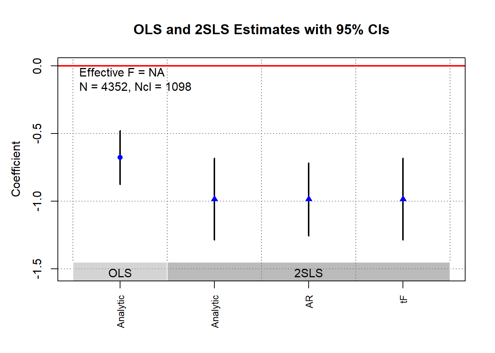

# Instrumental Variables

Similar to [RCT][Experimental Design], we try to introduce randomization (random assignment to treatment) to our treatment variable by using only variation in the instrument.

Logic of using an instrument:

-   Use only exogenous variation to see the variation in treatment (try to exclude all endogenous variation in the treatment)

-   Use only exogenous variation to see the variation in outcome (try to exclude all endogenous variation in the outcome)

-   See the relationship between treatment and outcome in terms of residual variations that are exogenous to omitted variables.

**Notes**:

-   Instruments can be used to remove attenuation bias in errors-in-variables.

-   Be careful with the F-test and standard errors when you do 2SLS by hand (you need to correct them).

-   Repeated use of related IVs across different studies can collectively invalidate these instruments, primarily through the violation of the exclusion restriction [@gallen2020broken]. One needs to test for invalid instruments (Hausman-like test).

    -   @mellon2023rain shows the widespread use of weather as an instrument in social sciences (289 studies linking weather to 195 variables) demonstrates significant exclusion violations that can overturn many IV results.

-   For [Zero-valued Outcomes], we can't directly interpret the treatment coefficient of log-transformed outcome regression as percentage change [@chen2023logs]. We have to distinguish the treatment effect on the intensive (outcome: 10 to 11) vs. extensive margins (outcome: 0 to 1), and we can't readily interpret the treatment coefficient of log-transformed outcome regression as percentage change. To have percentage change interpretation, we can either do:

    -   Proportional LATE: estimate $\theta_{ATE\%}$ for those who are compliers under the instrument. To estimate proportional LATE,

        1.  Regress $Y_i = \beta D_i + X_i + \epsilon_i$ using 2SLS with an instrument on $D_i$, where $\beta$ is interpreted as the LATE in levels of the control group's mean for compliers.

        2.  Get estimate of the control complier mean by regressing with same 2SLS regression [@abadie2002instrumental] where the final outcome is $-(D_i - 1)Y_i$ , we refer to the new new estimated effect of $D_i$ as $\beta_{cc}$

        3.  The $\theta_{ATE \%}$ for compliers that are induced by the instrument is $\hat{\beta}/\hat{\beta}_{cc}$, where it can be interpreted directly as the percentage change for compliers that are induced by the instrument under treatment as compared to under control.

        4.  SE can be obtained by non-parametric bootstrap.

        5.  For specific case that the instrument is binary, $\theta$ of the intensive margin for compliers can be directly obtained by Poisson IV regression (`ivpoisson` in Stata).

    -   @lee2009training bounds: we can get bounds for the average treatment effect in logs for compliers who have positive outcome regardless of treatment status (i.e., intensive-margin effect). This requires a monotonicity assumption for compliers where they should still have positive outcome regardless of treatment status.

**Notes** on First-stage:

-   Always use the OLS regression in the first stage (regardless of the type of endogenous variables - e.g., continuous or discreet) (suggested by [@angrist2009mostly]. Estimates of IV can still be consistent regardless of the form of the endogenous variables (discreet vs. continuous).

    -   Alternatively, we could use "biprobit" model, but this is applicable only in cases where you have both dependent and endogenous variables to be binary.

-   If you still want to continue and use logit or probit models for the first stage when you have binary variables, you have a "[forbidden regression](https://www.statalist.org/forums/forum/general-stata-discussion/general/1379449-two-step-iv-method-with-binary-dependent-variable)" (also [1](https://stats.stackexchange.com/questions/125830/consistency-of-2sls-with-binary-endogenous-variable), [2](https://stats.stackexchange.com/questions/94063/probit-two-stage-least-squares-2sls/94392#94392)) (i.e., an incorrect extension of 2SLS to a nonlinear case).

There are several ways to understand this problem:

1.  **Identification strategy**: The identification strategy in instrumental variables analysis relies on the fact that the instrumental variable affects the outcome variable only through its effect on the endogenous variable. However, when the endogenous variable is binary, the relationship between the instrumental variable and the endogenous variable is not continuous. This means that the instrumental variable can only affect the endogenous variable in discrete jumps, rather than through a continuous change. As a result, the identification of the causal effect of the endogenous variable on the outcome variable may not be possible with probit or logit regression in the first stage.

2.  **Model assumptions**: Both models assume that the error term has a specific distribution (normal or logistic), and that the probability of the binary outcome is a function of the linear combination of the regressors.

    When the endogenous variable is binary, however, the distribution of the error term is not specified, as there is no continuous relationship between the endogenous variable and the outcome variable. This means that the assumptions of the probit and logit models may not hold, and the resulting estimates may not be reliable or interpretable.

3.  **Issue of weak instruments**: When the instrument is weak, the variance of the inverse Mills ratio (which is used to correct for endogeneity in instrumental variables analysis) can be very large. In the case of binary endogenous variables, the inverse Mills ratio cannot be consistently estimated using probit or logit regression, and this can lead to biased and inconsistent estimates of the causal effect of the endogenous variable on the outcome variable.

Problems with weak instruments [@bound1995problems]:

-   Weak instrumental variables can produce (finite-sample) **biased** and **inconsistent** estimates of the causal effect of an endogenous variable on an outcome variable (even in the presence of large sample size)

-   In a finite sample, instrumental variables (IV) estimates can be biased in the same direction as ordinary least squares (OLS) estimates. Additionally, the bias of IV estimates approaches that of OLS estimates as the correlation (R2) between the instruments and the endogenous explanatory variable approaches zero. This means that when the correlation between the instruments and the endogenous variable is weak, the bias of the IV estimates can be similar to that of the OLS estimates.

-   Weak instruments are problematic because they do not have enough variation to fully capture the variation in the endogenous variable, leading to measurement error and other sources of noise in the estimates.

-   Using weak instruments can produce large standard errors and low t-ratio. And when the feedback (reverse causality) is strong, the bias in IV is even greater than that of OLS [@nelson1988distribution].

-   Using lagged dependent variables as instruments for current values depends on serial correlations, typically low [@nelson1988distribution].

-   Using multiple covariates to artificially increase the first-stage $R^2$ does not solve this weak instrument problem [@nelson1988distribution].

-   Solutions:

    -   use of multiple instruments

    -   use of instrumental variables with higher correlation

    -   use of alternative estimation methods such as limited information maximum likelihood (LIML) or two-stage least squares (2SLS) with heteroscedasticity-robust standard errors.

Instrument Validity:

1.  Random assignment ([Exogeneity Assumption]).
2.  Any effect of the instrument on the outcome must be through the endogenous variable ([Relevance Assumption]).

## Framework

-   $D_i \sim Bern$ Dummy Treatment

-   $Y_{0i}, Y_{1i}$ potential outcomes

-   $Y_i = Y_{0i} + (Y_{1i} - Y_{0i}) D_i$ observed outcome

-   $Z_i \perp Y_{0i}, Y_{1i}$ Instrumental variables (and also correlate with $D_i$)

Under constant-effects and linear ($Y_{1i} - Y_{0i}$ are the same for everyone)

$$ \begin{aligned} Y_{0i} &= \alpha + \eta_i \\ Y_{1i} - Y_{0i} &= \rho \\ Y_i &= Y_{0i} + D_i (Y_{1i} - Y_{0i}) \\ &= \alpha + \eta_i  + D_i \rho \\ &= \alpha + \rho D_i + \eta_i \end{aligned} $$

where

-   $\eta_i$ is individual differences

-   $\rho$ is the difference between treated outcome and untreated outcome. Here we assume they are constant for everyone

However, we have a problem with OLS because $D_i$ is correlated with $\eta_i$ for each unit

But $Z_i$ can come to the rescue, the causal estimate can be written as

$$ \begin{aligned} \rho &= \frac{Cov( Y_i, Z_i)}{Cov(D_i, Z_i)} \\ &= \frac{Cov(Y_i, Z_i) / V(Z_i) }{Cov( D_i, Z_i) / V(Z_i)} = \frac{Reduced form}{First-stage} \\ &= \frac{E[Y_i |Z_i = 1] - E[Y_i | Z_i = 0]}{E[D_i |Z_i = 1] - E[D_i | Z_i = 0 ]} \end{aligned} $$

Under heterogeneous treatment effect ($Y_{1i} - Y_{0i}$ are different for everyone) with LATE framework

$Y_i(d,z)$ denotes the potential outcome for unit $i$ with treatment $D_i = d$ and instrument $Z_i = z$

Observed treatment status

$$ D_i = D_{0i} + Z_i (D_{1i} - D_{0i}) $$

where

-   $D_{1i}$ is treatment status of unit $i$ when $z_i = 1$

-   $D_{0i}$ is treatment status of unit $i$ when $z_i = 0$

-   $D_{1i} - D_{0i}$ is the causal effect of $Z_i$ on $D_i$

**Assumptions**

-   [***Independence***]{.underline}: The instrument is randomly assigned (i.e., independent of potential outcomes and potential treatments)

    -   $[\{Y_i(d,z); \forall d, z \}, D_{1i}, D_{0i} ] \Pi Z_i$

    -   This assumption let the first-stage equation be the average causal effect of $Z_i$ on $D_i$

    $$ \begin{aligned} E[D_i |Z_i = 1] - E[D_i | Z_i = 0] &= E[D_{1i} |Z_i = 1] - E[D_{0i} |Z_i = 0] \\ &= E[D_{1i} - D_{0i}] \end{aligned} $$

    -   This assumption also is sufficient for a causal interpretation of the reduced form, where we see the effect of the instrument on the outcome.

$$ E[Y_i |Z_i = 1 ] - E[Y_i|Z_i = 0] = E[Y_i (D_{1i}, Z_i = 1) - Y_i (D_{0i} , Z_i = 0)] $$

-   [***Exclusion***]{.underline} (i.e., existence of instruments [@imbens1994identification]

    -   The treatment $D_i$ fully mediates the effect of $Z_i$ on $Y_i$

    $$ Y_{1i} = Y_i (1,1) = Y_i (1,0) \\  Y_{0i} = Y_i (0,1) = Y_i (0, 0) $$

    -   With this assumption, the observed outcome $Y_i$ can be thought of as (assume $Y_{1i}, Y_{0i}$ already satisfy the independence assumption)

    $$ \begin{aligned} Y_i &= Y_i (0, Z_i) + [Y_i (1 , Z_i) - Y_i (0, Z_i)] D_i \\ &= Y_{0i} + (Y_{1i} - Y_{0i} ) D_i \end{aligned} $$

    -   This assumption let us go from reduced-form causal effects to treatment effects [@angrist1995two]

-   [***Monotonicity***]{.underline}: $D_{1i} > D_{0i} \forall i$

    -   With this assumption, we have $E[D_{1i} - D_{0i} ] = P[D_{1i} > D_{0i}]$

    -   This assumption lets us assume that there is a first stage, in which we examine the proportion of the population that $D_i$ is driven by $Z_i$

    -   This assumption is used to solve to problem of the shifts between participation status back to non-participation status.

        -   Alternatively, one can solve the same problem by assuming constant (homogeneous) treatment effect [@imbens1994identification], but this is rather restrictive.

        -   A third solution is the assumption that there exists a value of the instrument, where the probability of participation conditional on that value is 0 [@heckman1990varieties, @angrist1991sources].

With these three assumptions, we have the LATE theorem [@angrist2009mostly, 4.4.1]

$$ \frac{E[Y_i | Z_i = 1] - E[Y_i | Z_i = 0]}{E[D_i |Z_i = 1] - E[D_i |Z_i = 0]} = E[Y_{1i} - Y_{0i} | D_{1i} > D_{0i}] $$

LATE assumptions allow us to go back to the types of subjects we have in [Causal Inference]

-   Switchers:

    -   Compliers: $D_{1i} > D_{0i}$

-   Non-switchers:

    -   Always-takers: $D_{1i} = D_{0i} = 1$

    -   Never-takers: $D_{1i} = D_{0i} = 0$

[Instrumental Variables] can't say anything about non-switchers because treatment status $D_i$ has no effects on them (similar to fixed effects models).

When all groups are the same, we come back to the constant-effects world.

Treatment effects on the treated is a weighted average of always-takers and compliers.

In the special case of IV in randomized trials, we have a compliance problem (when compliance is voluntary), where those in the treated will not always take the treatment (i.e., might be selection bias).

-   **Intention-to-treat analysis** is valid, but contaminated by non-compliance

-   IV in this case ($Z_i$ = random assignment to the treatment; $D_i$ = whether the unit actually received/took the treatment) can solve this problem.

-   Under certain assumptions (i.e., SUTVA, random assignment, exclusion restriction, no defiers, and monotinicity), this analysis can give causal interpreation of LATE because it's the average causal effect for the compliers only.

    -   Without these assumptions, it's a ratio of intention-to-treat.

-   Without always-takers in this case, LATE = Treatment effects on the treated

See proof @bloom1984accounting and examples @bloom1997benefits and @sherman1984minneapolis

$$ \frac{E[Y_i |Z_i = 1] - E[Y_i |Z_i = 0]}{E[D_i |Z_i = 1]} = \frac{\text{Intention-to-treat effect}}{\text{Compliance rate}} \\ = E[Y_{1i} - Y_{0i} |D_i = 1] $$

## Estimation

### 2SLS Estimation

A special case of [IV-GMM]

Examples by authors of `fixest` package


```r
library(fixest)
base = iris
names(base) = c("y", "x1", "x_endo_1", "x_inst_1", "fe")
set.seed(2)
base$x_inst_2 = 0.2 * base$y + 0.2 * base$x_endo_1 + rnorm(150, sd = 0.5)
base$x_endo_2 = 0.2 * base$y - 0.2 * base$x_inst_1 + rnorm(150, sd = 0.5)

# est_iv = feols(y ~ x1 | x_endo_1  ~ x_inst_1 , base)
est_iv = feols(y ~ x1 | x_endo_1 + x_endo_2 ~ x_inst_1 + x_inst_2, base)
est_iv
#> TSLS estimation - Dep. Var.: y
#>                   Endo.    : x_endo_1, x_endo_2
#>                   Instr.   : x_inst_1, x_inst_2
#> Second stage: Dep. Var.: y
#> Observations: 150
#> Standard-errors: IID 
#>              Estimate Std. Error  t value   Pr(>|t|)    
#> (Intercept)  1.831380   0.411435  4.45121 1.6844e-05 ***
#> fit_x_endo_1 0.444982   0.022086 20.14744  < 2.2e-16 ***
#> fit_x_endo_2 0.639916   0.307376  2.08186 3.9100e-02 *  
#> x1           0.565095   0.084715  6.67051 4.9180e-10 ***
#> ---
#> Signif. codes:  0 '***' 0.001 '**' 0.01 '*' 0.05 '.' 0.1 ' ' 1
#> RMSE: 0.398842   Adj. R2: 0.761653
#> F-test (1st stage), x_endo_1: stat = 903.2    , p < 2.2e-16 , on 2 and 146 DoF.
#> F-test (1st stage), x_endo_2: stat =   3.25828, p = 0.041268, on 2 and 146 DoF.
#>                   Wu-Hausman: stat =   6.79183, p = 0.001518, on 2 and 144 DoF.
```

Default statistics

1.  F-test first-stage (weak instrument test)
2.  Wu-Hausman endogeneity test
3.  Over-identifying restriction (Sargan) J-test


```r
fitstat(
    est_iv,
    type = c(
        "n", "ll", "aic", "bic", "rmse", # ll means log-likelihood
        
        "my", # mean dependent var

        "g", # degrees of freedom used to compute the t-test

        "r2", "ar2", "wr2", "awr2", "pr2", "apr2", "wpr2", "awpr2",

        "theta", # over-dispersion parameter in Negative Binomial models

        "f", "wf", # F-tests of nullity of the coefficients

        "wald", # Wald test of joint nullity of the coefficients

        "ivf",
        
        "ivf1",

        "ivf2",

        "ivfall",
        
        "ivwald", "ivwald1", "ivwald2", "ivwaldall",

        "cd"
        
        # "kpr"
        
        
        ),
    cluster = 'fe'
)
#>                 Observations: 150
#>               Log-Likelihood: -75.0
#>                          AIC: 157.9
#>                          BIC: 170.0
#>                         RMSE: 0.398842
#>               Dep. Var. mean: 5.84333
#>                            G: 3
#>                           R2: 0.766452
#>                      Adj. R2: 0.761653
#>                    Within R2: NA
#>                         awr2: NA
#>                    Pseudo R2: 0.592684
#>               Adj. Pseudo R2: 0.576383
#>             Within Pseudo R2: NA
#>                        awpr2: NA
#>              Over-dispersion: NA
#>                       F-test: stat =       1.80769, p = 0.375558, on 3 and 2 DoF.
#>           F-test (projected): NA
#>         Wald (joint nullity): stat = 539,363.2    , p < 2.2e-16 , on 3 and 146 DoF, VCOV: Clustered (fe).
#> F-test (1st stage), x_endo_1: stat =     903.2    , p < 2.2e-16 , on 2 and 146 DoF.
#> F-test (1st stage), x_endo_2: stat =       3.25828, p = 0.041268, on 2 and 146 DoF.
#>           F-test (2nd stage): stat =     194.2    , p < 2.2e-16 , on 2 and 146 DoF.
#>             F-test (IV only): stat =     194.2    , p < 2.2e-16 , on 2 and 146 DoF.
#> Wald (1st stage), x_endo_1  : stat =   1,482.6    , p < 2.2e-16 , on 2 and 146 DoF, VCOV: Clustered (fe).
#> Wald (1st stage), x_endo_2  : stat =       2.22157, p = 0.112092, on 2 and 146 DoF, VCOV: Clustered (fe).
#>             Wald (2nd stage): stat = 539,363.2    , p < 2.2e-16 , on 2 and 146 DoF, VCOV: Clustered (fe).
#>               Wald (IV only): stat = 539,363.2    , p < 2.2e-16 , on 2 and 146 DoF, VCOV: Clustered (fe).
#>                 Cragg-Donald: 3.11162
```

To set default printing


```r
# always add second-stage Wald test
setFixest_print(fitstat = ~ . + ivwald2)
est_iv
```

To see results from different stages


```r
# first-stage
summary(est_iv, stage = 1)

# second-stage
summary(est_iv, stage = 2)

# both stages
etable(summary(est_iv, stage = 1:2), fitstat = ~ . + ivfall + ivwaldall.p)
etable(summary(est_iv, stage = 2:1), fitstat = ~ . + ivfall + ivwaldall.p)
# .p means p-value, not statistic
# `all` means IV only
```

### IV-GMM {data-link="IV-GMM"}

This is a more general framework.

-   [2SLS Estimation] is a special case of [IV-GMM] estimator

$$
Y = X \beta + u, u \sim (0, \Omega)
$$

where

-   $X$ is a matrix of endogenous variables ($N\times k$)

We will use a matrix of instruments $X$ where it has $N \times l$ dimensions (where $l \ge k$)

Then, we can have a set of $l$ moments:

$$
g_i (\beta) = Z_i' u_i = Z_i' (Y_i - X_i \beta)
$$

where

-   $i \in (1,N)$

Each $l$ moment equation is a sample moment, which can be estimated by averaging over $N$

$$
\bar{g}(\beta) = \frac{1}{N} \sum_{i = 1}^N Z_i (Y_i - X_i \beta) = \frac{1}{N} Z'u
$$

GMM then estimate $\beta$ so that $\bar{g}(\hat{\beta}_{GMM}) = 0$

When $l = k$ there is a unique solution to this system of equations (and equivalent to the IV estimator)

$$
\hat{\beta}_{IV} = (Z'X)^{-1}Z'Y
$$

When $l > k$, we have a set of $k$ instruments

$$
\hat{X} = Z(Z'Z)^{-1} Z' X = P_ZX
$$

then we can use the 2SLS estimator

$$
\begin{aligned}
\hat{\beta}_{2SLS} &= (\hat{X}'X)^{-1} \hat{X}' Y \\
&= (X'P_Z X)^{-1}X' P_Z Y
\end{aligned}
$$

Differences between 2SLS and IV-GMM:

-   In the 2SLS method, when there are more instruments available than what is actually needed for the estimation, to address this, a matrix is created that only includes the necessary instruments, which simplifies the calculation.

-   The IV-GMM method uses all the available instruments, but applies a weighting system to prioritize the instruments that are most relevant. This approach is useful when there are more instruments than necessary, which can make the calculation more complex. The IV-GMM method uses a criterion function to weight the estimates and improve their accuracy.

-   **In short, always use IV-GMM when you have overid problems**

GMM estimator minimizes

$$
J (\hat{\beta}_{GMM} ) = N \bar{g}(\hat{\beta}_{GMM})' W \bar{g} (\hat{\beta}_{GMM})
$$

where $W$ is a symmetric weighting matrix $l \times l$

For an overid equation, solving the set of FOCs for the IV-GMM estimator, we should have

$$
\hat{\beta}_{GMM} = (X'ZWZ' X)^{-1} X'ZWZ'Y
$$

which is identical for all $W$ matrices. The optimal $W = S^{-1}$ [@hansen1982large] where $S$ is the covariance matrix of the moment conditions to produce the most efficient estimator:

$$
S = E[Z'uu'Z] = \lim_{N \to \infty} N^{-1}[Z' \Omega Z]
$$

With a consistent estimator of $S$ from the 2SLS residuals, the feasible IV-GMM estimator can be defined as

$$
\hat{\beta}_{FEGMM} = (X'Z \hat{S}^{-1} Z' X)^{-1} X'Z \hat{S}^{-1} Z'Y
$$

In cases where $\Omega$ (i.e., the vcov of the error process $u$) satisfy all classical assumptions

1.  IID
2.  $S = \sigma^2_u I_N$
3.  The optimal weighting matrix is proportional to the identity matrix

Then, IV-GMM estimator is the standard IV (or 2SLS) estimator.

For IV-GMM, you also have an additional test of overid restrictions: GMM distance (also known as Hayashi C statistic)

To account for clustering, one can use code provided by this [blog](https://www.r-bloggers.com/2014/04/iv-estimates-via-gmm-with-clustering-in-r/)

## Inference

Under just-identified instrument variable model, we have

$$
Y = \beta X + u
$$

where $corr(u, Z) = 0$ (relevant assumption) and $corr(Z,X) \neq 0$ (exogenous assumption)

The t-ratio approach to construct the 95 CIs is

$$
\hat{\beta} \pm 1.96 \sqrt{\hat{V}_N(\hat{\beta})}
$$

But this is wrong, and has been long recognized by those who understand the "weak instruments" problem [@staiger1997instrumental, @dufour1997some]

To test the null hypothesis of $\beta = \beta_0$ [@lee2022valid] $$ \frac{(\hat{\beta} - \beta_0)^2}{\hat{V}_N(\hat{\beta})} = \hat{t}^2 = \hat{t}^2_{AR} \times \frac{1}{1 - \hat{\rho} \frac{\hat{t}_{AR}}{\hat{f}} + \frac{\hat{t}^2_{AR}}{\hat{f}^2}} $$ where $\hat{t}_{AR}^2 \sim \chi^2(1)$ (even with weak instruments) [@anderson1949estimation]

$$
\hat{t}_{AR} = \frac{\hat{\pi}(\hat{\beta} - \beta_0)}{\sqrt{\hat{V}_N (\hat{\pi} (\hat{\beta} - \beta_0))}} \sim N(0,1)
$$

where

-   $\hat{f} = \frac{\hat{\pi}}{\sqrt{\hat{V}_N(\hat{\pi})}}\sim N$

-   $\hat{\pi}$ = 1st-stage coefficient

-   $\hat{\rho} = COV(Zv, Zu)$ = correlation between the 1st-stage residual and an estimate of $u$

Even in large samples, $\hat{t}^2 \neq \hat{t}^2_{AR}$ because the right-hand term does not have a degenerate distribution. Thus, the normal t critical values wouldn't work.

The t-ratios does not match that of standard normal, but it matches the proposed density by @staiger1997instrumental and @stock2005testing .

The deviation between $\hat{t}^2 , \hat{t}^2_{AR}$ depends on

1.  $\pi$ (i.e., correlation between the instrument and the endogenous variable)
2.  $E(F)$ (i.e., strength of the first-stage)
3.  Magnitude of $|\rho|$ (i.e., degree of endogeneity)

Hence, we can think of several scenarios:

1.  **Worst case**: Very weak first stage ($\pi = 0$) and high degree of endogeneity ($|\rho |= 1$).

-   The interval $\hat{\beta} \pm 1.96 \times SE$ does not contain the true parameter $\beta$.

-   A 5 percent significance test under these conditions will incorrectly reject the null hypothesis ($\beta = \beta_0$) 100% of the time.

2.  **Best case**: No endogeneity ($\rho =0$) or very large $\hat{f}$ (very strong first-stage)

-   The interval $\hat{\beta} \pm 1.96 \times SD$ accurately contains $\beta$ at least 95% of the time.

3.  **Intermediate case**: The performance of the interval lies between the two extremes.

**Solutions**: To have valid inference of $\hat{\beta} \pm 1.96 \times SE$ using t-ratio ($\hat{t}^2 \approx \hat{t}^2_{AR}$), we can either

1.  Assume our problem away
    1.  Assume $E(F) > 142.6$ [@lee2022valid] (Not much of an assumption since we can observe first-stage F-stat empirically).
    2.  Assume $|\rho| < 0.565$ [@angrist2024one, @lee2022valid], but this defeats our motivation to use IV in the first place because we think there is a strong endogeneity bias, that's why we are trying to correct for it (circular argument).
2.  Deal with it head on
    1.  [AR approach] [@anderson1949estimation]
    2.  [tF Procedure] [@lee2022valid]
    3.  [AK approach] [@angrist2023one]

**Common Practices & Challenges**:

-   The t-ratio test is preferred by many researchers but has its pitfalls:

    -   Known to over-reject (equivalently, under-cover confidence intervals), especially with weak instruments [@lee2022valid, @nelson1990distribution, @bound1995problems, @dufour1997some].

-   To address this:

    -   The first-stage F-statistic is used as an indicator of weak instruments.

    -   [@staiger1997instrumental, @stock2005testing] provided a framework to understand and correct these **distortions**.

**Misinterpretations**:

-   Common errors in application:

    -   Using a rule-of-thumb F-stat threshold of 10 instead of referring to @stock2005testing.

    -   Mislabeling intervals such as $\hat{\beta} \pm 1.96 \times \hat{se}(\hat{\beta})$ as 95% confidence intervals (when passed the $F>10$ rule of thumb). @staiger1997instrumental clarified that such intervals actually represent 85% confidence when using $F > 16.38$ from @stock2005testing

-   Pretesting for weak instruments might exacerbate over-rejection of the t-ratio test mentioned above [@hall1996judging].

-   Selective model specification (i.e., dropping certain specification) based on F-statistics also leads to significant **distortions** [@andrews2019weak].

### AR approach

**Validity of Anderson-Rubin Test** (notated as AR) [@anderson1949estimation]:

-   Gives accurate results even under non-normal and homoskedastic errors [@staiger1997instrumental].

-   Maintains validity across diverse error structures [@stock2000gmm].

-   Minimizes type II error among several alternative tests, in cases of:

    -   Homoskedastic errors [@andrews2006optimal, @moreira2009tests].

    -   Generalized for heteroskedastic, clustered, and autocorrelated errors [@moreira2019optimal].


```r
library(ivDiag)

# AR test (robust to weak instruments)
# example by the package's authors
ivDiag::AR_test(
    data = rueda,
    Y = "e_vote_buying",
    # treatment
    D = "lm_pob_mesa",
    # instruments
    Z = "lz_pob_mesa_f",
    controls = c("lpopulation", "lpotencial"),
    cl = "muni_code",
    CI = FALSE
)
#> $Fstat
#>         F       df1       df2         p 
#>   50.5097    1.0000 4350.0000    0.0000

g <- ivDiag::ivDiag(
    data = rueda,
    Y = "e_vote_buying",
    D = "lm_pob_mesa",
    Z = "lz_pob_mesa_f",
    controls = c("lpopulation", "lpotencial"),
    cl = "muni_code",
    cores = 4,
    bootstrap = FALSE
)
g$AR
#> $Fstat
#>         F       df1       df2         p 
#>   50.5097    1.0000 4350.0000    0.0000 
#> 
#> $ci.print
#> [1] "[-1.2545, -0.7156]"
#> 
#> $ci
#> [1] -1.2545169 -0.7155854
#> 
#> $bounded
#> [1] TRUE
ivDiag::plot_coef(g)
```



### tF Procedure

@lee2022valid propose a new method that is aligned better with traditional econometric training than AR, where it is called the tF procedure. It incorporates both the 1st-stage F-stat and the 2SLS $t$-value. This method is applicable to single instrumental variable (i.e., just-identified model), including

-   Randomized trials with imperfect compliance [@imbens1994identification].

-   Fuzzy [Regression Discontinuity] designs [@lee2010regression].

-   Fuzzy regression kink designs [@card2015inference].

See @andrews2019weak for a comparison between [AR approach] and [tF Procedure].

**tF Procedure**:

-   Adjusts the t-ratio based on the first-stage F-statistic.

-   Rather than a fixed pretesting threshold, it applies an adjustment factor to 2SLS standard errors.

-   Adjustment factors are provided for 95% and 99% confidence levels.

**Advantages of the tF Procedure**:

1.  **Smooth Adjustment**:

    -   Gives usable finite confidence intervals for smaller F statistic values.

    -   95% confidence is applicable for $F > 3.84$, aligning with AR's bounded 95% confidence intervals.

2.  **Clear Confidence Levels**:

    -   These levels incorporate effects of basing inference on the first-stage F.

    -   Mirrors AR or other zero distortion procedures.

3.  **Robustness**:

    -   Robust against common error structures (e.g., heteroskedasticity or clustering and/or autocorrelated errors).

    -   No further adjustments are necessary as long as robust variance estimators are consistently used (same robust variance estimator used for the 1st-stage as for the IV estimate).

4.  **Comparison to AR**:

    -   Surprisingly, with $F > 3.84$, AR's expected interval length is infinite, while tF's is finite (i.e., better).

5.  **Applicability**:

    -   The tF adjustment can re-evaluate published studies if the first-stage F-statistic is available.

    -   Original data access is not needed.

**Impacts in Applied Research**:

-   @lee2022valid examined recent single-instrument specification studies from the American Economic Review (AER).

-   Observations:

    -   For at least 25% of the studied specifications, using tF increased confidence interval lengths by:

        -   49% (5% significance level).

        -   136% (1% significance level).

    -   For specifications with $F > 10$ and $t > 1.96$, about 25% became statistically insignificant at the 5% level when adjusted using tF.

    -   Conclusion: tF adjustments could greatly influence inferences in research employing t-ratio inferences.

Notation

-   $Y = X \beta + W \gamma + u$
-   $X = Z \pi + W \xi + \nu$

where

-   $W$: Additional covariates, possibly including an intercept term.
-   $X$: variable of interest
-   $Z$: instruments

Key Statistics:

-   $t$-ratio for the instrumental variable estimator: $\hat{t} = \frac{\hat{\beta} - \beta_0}{\sqrt{\hat{V}_N (\hat{\beta})}}$

-   $t$-ratio for the first-stage coefficient: $\hat{f} = \frac{\hat{\pi}}{\sqrt{\hat{V}_N (\hat{\pi})}}$

-   $\hat{F} = \hat{f}^2$

where

-   $\hat{\beta}$: Instrumental variable estimator.
-   $\hat{V}_N (\hat{\beta})$: Estimated variance of $\hat{\beta}$, possibly robust to deal with non-iid errors.
-   $\hat{t}$: $t$-ratio under the null hypothesis.
-   $\hat{f}$: $t$-ratio under the null hypothesis of $\pi=0$.

Traditional $t$ Inference:

-   In large samples, $\hat{t}^2 \to^d t^2$
-   Standard normal critical values are $\pm 1.96$ for 5% significance level testing.

Distortions in Inference in the case of IV:

-   Use of a standard normal can lead to distorted inferences even in large samples.
    -   Despite large samples, t-distribution might not be normal.
-   But magnitude of this distortion can be quantified.
    -   @stock2005testing provides a formula for Wald test statistics using 2SLS.
    -   $t^2$ formula allows for quantification of inference distortions.
    -   In the just-identified case with one endogenous regressor $t^2 = f + t_{AR} + \rho f t_{AR}$ [@stock2005testing]
        -   $\hat{f} \to^d f$ and $\bar{f} = \frac{\pi}{\sqrt{\frac{1}{N} AV(\hat{\pi})}}$ and $AV(\hat{\pi})$ is the asymptotic variance of $\hat{\pi}$
        -   $t_{AR}$ is a standard normal with $AR = t^2_{AR}$
        -   $\rho$ (degree of endogeneity) is the correlation of $Zu$ and $Z \nu$ (when data are homoskedastic, $\rho$ is the correlation between $u$ and $\nu$)

Implications of $t^2$ formula:

-   Varies rejection rates depending on $\rho$ value.
    -   $\rho \in (0,0.5]$ (low) the t-ratio rejects at a probability below the nominal $0.05$ rate
    -   $\rho = 0.8$ (high) the rejection rate can be $0.13$
-   In short, incorrect test size when relying solely on $t^2$ (based on traditional econometric understanding)

To correct for this, one can

1.  Estimate the usually 2SLS standard errors
2.  Multiply the SE by the adjustment factor based on the observed first-stage $\hat{F}$ stat
3.  One can go back to the traditional hypothesis by using either the t-ratio of confidence intervals

@lee2022valid call this adjusted SE as "0.05 tF SE".


```r
library(ivDiag)
g <- ivDiag::ivDiag(
    data = rueda,
    Y = "e_vote_buying",
    D = "lm_pob_mesa",
    Z = "lz_pob_mesa_f",
    controls = c("lpopulation", "lpotencial"),
    cl = "muni_code",
    cores = 4,
    bootstrap = FALSE
)
g$tF
#>         F        cF      Coef        SE         t    CI2.5%   CI97.5%   p-value 
#> 8598.3264    1.9600   -0.9835    0.1540   -6.3872   -1.2853   -0.6817    0.0000
```


```r
# example in fixest package
library(fixest)
library(tidyverse)
base = iris
names(base) = c("y", "x1", "x_endo_1", "x_inst_1", "fe")
set.seed(2)
base$x_inst_2 = 0.2 * base$y + 0.2 * base$x_endo_1 + rnorm(150, sd = 0.5)
base$x_endo_2 = 0.2 * base$y - 0.2 * base$x_inst_1 + rnorm(150, sd = 0.5)

est_iv = feols(y ~ x1 | x_endo_1 + x_endo_2 ~ x_inst_1 + x_inst_2, base)
est_iv
#> TSLS estimation - Dep. Var.: y
#>                   Endo.    : x_endo_1, x_endo_2
#>                   Instr.   : x_inst_1, x_inst_2
#> Second stage: Dep. Var.: y
#> Observations: 150
#> Standard-errors: IID 
#>              Estimate Std. Error  t value   Pr(>|t|)    
#> (Intercept)  1.831380   0.411435  4.45121 1.6844e-05 ***
#> fit_x_endo_1 0.444982   0.022086 20.14744  < 2.2e-16 ***
#> fit_x_endo_2 0.639916   0.307376  2.08186 3.9100e-02 *  
#> x1           0.565095   0.084715  6.67051 4.9180e-10 ***
#> ---
#> Signif. codes:  0 '***' 0.001 '**' 0.01 '*' 0.05 '.' 0.1 ' ' 1
#> RMSE: 0.398842   Adj. R2: 0.761653
#> F-test (1st stage), x_endo_1: stat = 903.2    , p < 2.2e-16 , on 2 and 146 DoF.
#> F-test (1st stage), x_endo_2: stat =   3.25828, p = 0.041268, on 2 and 146 DoF.
#>                   Wu-Hausman: stat =   6.79183, p = 0.001518, on 2 and 144 DoF.

res_est_iv <- est_iv$coeftable |> 
    rownames_to_column()


coef_of_interest <-
    res_est_iv[res_est_iv$rowname == "fit_x_endo_1", "Estimate"]
se_of_interest <-
    res_est_iv[res_est_iv$rowname == "fit_x_endo_1", "Std. Error"]
fstat_1st <- fitstat(est_iv, type = "ivf1")[[1]]$stat

# To get the correct SE based on 1st-stage F-stat (This result is similar without adjustment since F is large)
# the results are the new CIS and p.value
tF(coef = coef_of_interest, se = se_of_interest, Fstat = fstat_1st) |> 
    causalverse::nice_tab(5)
#>          F   cF    Coef      SE        t  CI2.5. CI97.5. p.value
#> 1 903.1628 1.96 0.44498 0.02209 20.14744 0.40169 0.48827       0

# We can try to see a different 1st-stage F-stat and how it changes the results
tF(coef = coef_of_interest, se = se_of_interest, Fstat = 2) |> 
    causalverse::nice_tab(5)
#>   F    cF    Coef      SE        t  CI2.5. CI97.5. p.value
#> 1 2 18.66 0.44498 0.02209 20.14744 0.03285 0.85711 0.03432
```

### AK approach

[@angrist2023one]

## Testing Assumptions

$$
Y = \beta_1 X_1 + \beta_2 X_2 + \epsilon
$$

where

-   $X_1$ are exogenous variables

-   $X_2$ are endogenous variables

-   $Z$ are instrumental variables

If $Z$ satisfies the relevance condition, it means $Cov(Z, X_2) \neq 0$

This is important because we need this to be able to estimate $\beta_2$ where

$$
\beta_2 = \frac{Cov(Z,Y)}{Cov(Z, X_2)}
$$

If $Z$ satisfies the exogeneity condition, $E[Z\epsilon]=0$, this can achieve by

-   $Z$ having no direct effect on $Y$ except through $X_2$

-   In the presence of omitted variable, $Z$ is uncorrelated with this variable.

If we just want to know the effect of $Z$ on $Y$ (**reduced form**) where the coefficient of $Z$ is

$$
\rho = \frac{Cov(Y, Z)}{Var(Z)}
$$

and this effect is only through $X_2$ (by the exclusion restriction assumption).

We can also consistently estimate the effect of $Z$ on $X$ (**first stage**) where the the coefficient of $X_2$ is

$$
\pi = \frac{Cov(X_2, Z)}{Var(Z)}
$$

and the IV estimate is

$$
\beta_2 = \frac{Cov(Y,Z)}{Cov(X_2, Z)} = \frac{\rho}{\pi}
$$

### Relevance Assumption

-   **Weak instruments**: can explain little variation in the endogenous regressor

    -   Coefficient estimate of the endogenous variable will be inaccurate.
    -   For cases where weak instruments are unavoidable, @moreira2003conditional proposes the conditional likelihood ratio test for robust inference. This test is considered approximately optimal for weak instrument scenarios [@andrews2008efficient; @andrews2008exactly].

-   Rule of thumb:

    -   Compute F-statistic in the first-stage, where it should be greater than 10. But this is discouraged now by @lee2022valid

    -   use `linearHypothesis()` to see only instrument coefficients.

**First-Stage F-Test**

In the context of a two-stage least squares (2SLS) setup where you are estimating the equation:

$$
Y = X \beta + \epsilon
$$

and $X$ is endogenous, you typically estimate a first-stage regression of:

$$
X = Z \pi + u
$$

where 𝑍Z is the instrument.

The first-stage F-test evaluates the joint significance of the instruments in this first stage:

$$
F = \frac{(SSR_r - SSR_{ur})/q}{SSR_{ur}/ (n - k - 1)}
$$

where:

-   $SSR_r$ is the sum of squared residuals from the restricted model (no instruments, just the constant).

-   $SSR_{ur}$ is the sum of squared residuals from the unrestricted model (with instruments).

-   $q$ is the number of instruments excluded from the main equation.

-   $n$ is the number of observations.

-   $k$ is the number of explanatory variables excluding the instruments.

**Cragg-Donald Test**

The Cragg-Donald statistic is essentially the same as the Wald statistic of the joint significance of the instruments in the first stage, and it's used specifically when you have multiple endogenous regressors. It's calculated as:

$$
CD = n \times (R_{ur}^2 - R_r^2)
$$

where:

-   $R_{ur}^2$ and $R_r^2$ are the R-squared values from the unrestricted and restricted models respectively.

-   $n$ is the number of observations.

For one endogenous variable, the Cragg-Donald test results should align closely with those from Stock and Yogo. The Anderson canonical correlation test, a likelihood ratio test, also works under similar conditions, contrasting with Cragg-Donald's Wald statistic approach. Both are valid with one endogenous variable and at least one instrument.

**Stock-Yogo Weak IV Test**

The Stock-Yogo test does not directly compute a statistic like the F-test or Cragg-Donald, but rather uses pre-computed critical values to assess the strength of instruments. It often uses the eigenvalues derived from the concentration matrix:

$$
S = \frac{1}{n} (Z' X) (X'Z)
$$

where $Z$ is the matrix of instruments and $X$ is the matrix of endogenous regressors.

Stock and Yogo provide critical values for different scenarios (bias, size distortion) for a given number of instruments and endogenous regressors, based on the smallest eigenvalue of $S$. The test compares these eigenvalues against critical values that correspond to thresholds of permissible bias or size distortion in a 2SLS estimator.

-   **Critical Values and Test Conditions**: The critical values derived by Stock and Yogo depend on the level of acceptable bias, the number of endogenous regressors, and the number of instruments. For example, with a 5% maximum acceptable bias, one endogenous variable, and three instruments, the critical value for a sufficient first stage F-statistic is 13.91. Note that this framework requires at least two overidentifying degree of freedom.

**Comparison**

| **Test**                    | **Description**                                                     | **Focus**                                                                  | **Usage**                                                                                                                                               |
|-----------------------------|---------------------------------------------------------------------|----------------------------------------------------------------------------|---------------------------------------------------------------------------------------------------------------------------------------------------------|
| **First-Stage F-Test**      | Evaluates the joint significance of instruments in the first stage. | Predictive power of instruments for the endogenous variable.               | Simplest and most direct test, widely used especially with a single endogenous variable. Rule of thumb: F \< 10 suggests weak instruments.              |
| **Cragg-Donald Test**       | Wald statistic for joint significance of instruments.               | Joint strength of multiple instruments with multiple endogenous variables. | More appropriate in complex IV setups with multiple endogenous variables. Compares statistic against critical values for assessing instrument strength. |
| **Stock-Yogo Weak IV Test** | Compares test statistic to pre-determined critical values.          | Minimizing size distortions and bias from weak instruments.                | Theoretical evaluation of instrument strength, ensuring the reliability of 2SLS estimates against specific thresholds of bias or size distortion.       |

All the mentioned tests (Stock Yogo, Cragg-Donald, Anderson canonical correlation test) assume errors are independently and identically distributed. If this assumption is violated, the Kleinbergen-Paap test is robust against violations of the iid assumption and can be applied even with a single endogenous variable and instrument, provided the model is properly identified [@baum2021ivreg2h].

#### Weak Instrument Tests

#### Cragg-Donald

[@cragg1993testing]

Similar to the first-stage F-statistic


```r
library(cragg)
library(AER) # for dataaset
data("WeakInstrument")

cragg_donald(
    # control variables
    X = ~ 1, 
    # endogeneous variables
    D = ~ x, 
    # instrument variables 
    Z = ~ z, 
    data = WeakInstrument
)
#> Cragg-Donald test for weak instruments:
#> 
#>      Data:                        WeakInstrument 
#>      Controls:                    ~1 
#>      Treatments:                  ~x 
#>      Instruments:                 ~z 
#> 
#>      Cragg-Donald Statistic:        4.566136 
#>      Df:                                 198
```

Large CD statistic implies that the instruments are strong, but not in our case here. But to judge it against some critical value, we have to look at [Stock-Yogo]

#### Stock-Yogo

@stock2002testing set the critical values such that the bias is less then 10% (default)

$H_0:$ Instruments are weak

$H_1:$ Instruments are not weak


```r
library(cragg)
library(AER) # for dataaset
data("WeakInstrument")
stock_yogo_test(
    # control variables
    X = ~ 1,
    # endogeneous variables
    D = ~ x,
    # instrument variables
    Z = ~ z,
    size_bias = "bias",
    data = WeakInstrument
)
```

The CD statistic should be bigger than the set critical value to be considered strong instruments.

#### Anderson-Rubin

#### Stock-Wright

### Exogeneity Assumption

The local average treatment effect (LATE) is defined as:

$$
\text{LATE} = \frac{\text{reduced form}}{\text{first stage}} = \frac{\rho}{\phi} 
$$

This implies that the reduced form ($\rho$) is the product of the first stage ($\phi$) and LATE:

$$
\rho = \phi \times \text{LATE}
$$

Thus, if the first stage ($\phi$) is 0, the reduced form ($\rho$) should also be 0.


```r
# Load necessary libraries
library(shiny)
library(AER)  # for ivreg
library(ggplot2)  # for visualization
library(dplyr)  # for data manipulation

# Function to simulate the dataset
simulate_iv_data <- function(n, beta, phi, direct_effect) {
  Z <- rnorm(n)
  epsilon_x <- rnorm(n)
  epsilon_y <- rnorm(n)
  X <- phi * Z + epsilon_x
  Y <- beta * X + direct_effect * Z + epsilon_y
  data <- data.frame(Y = Y, X = X, Z = Z)
  return(data)
}

# Function to run the simulations and calculate the effects
run_simulation <- function(n, beta, phi, direct_effect) {
  # Simulate the data
  simulated_data <- simulate_iv_data(n, beta, phi, direct_effect)
  
  # Estimate first-stage effect (phi)
  first_stage <- lm(X ~ Z, data = simulated_data)
  phi <- coef(first_stage)["Z"]
  phi_ci <- confint(first_stage)["Z", ]
  
  # Estimate reduced-form effect (rho)
  reduced_form <- lm(Y ~ Z, data = simulated_data)
  rho <- coef(reduced_form)["Z"]
  rho_ci <- confint(reduced_form)["Z", ]
  
  # Estimate LATE using IV regression
  iv_model <- ivreg(Y ~ X | Z, data = simulated_data)
  iv_late <- coef(iv_model)["X"]
  iv_late_ci <- confint(iv_model)["X", ]
  
  # Calculate LATE as the ratio of reduced-form and first-stage coefficients
  calculated_late <- rho / phi
  calculated_late_se <- sqrt(
    (rho_ci[2] - rho)^2 / phi^2 + (rho * (phi_ci[2] - phi) / phi^2)^2
  )
  calculated_late_ci <- c(calculated_late - 1.96 * calculated_late_se, 
                          calculated_late + 1.96 * calculated_late_se)
  
  # Return a list of results
  list(phi = phi, 
       phi_ci = phi_ci,
       rho = rho, 
       rho_ci = rho_ci,
       direct_effect = direct_effect,
       direct_effect_ci = c(direct_effect, direct_effect),  # Placeholder for direct effect CI
       iv_late = iv_late, 
       iv_late_ci = iv_late_ci,
       calculated_late = calculated_late, 
       calculated_late_ci = calculated_late_ci,
       true_effect = beta,
       true_effect_ci = c(beta, beta))  # Placeholder for true effect CI
}

# Define UI for the sliders
ui <- fluidPage(
  titlePanel("IV Model Simulation"),
  sidebarLayout(
    sidebarPanel(
      sliderInput("beta", "True Effect of X on Y (beta):", min = 0, max = 1.0, value = 0.5, step = 0.1),
      sliderInput("phi", "First Stage Effect (phi):", min = 0, max = 1.0, value = 0.7, step = 0.1),
      sliderInput("direct_effect", "Direct Effect of Z on Y:", min = -0.5, max = 0.5, value = 0, step = 0.1)
    ),
    mainPanel(
      plotOutput("dotPlot")
    )
  )
)

# Define server logic to run the simulation and generate the plot
server <- function(input, output) {
  output$dotPlot <- renderPlot({
    # Run simulation
    results <- run_simulation(n = 1000, beta = input$beta, phi = input$phi, direct_effect = input$direct_effect)
    
    # Prepare data for plotting
    plot_data <- data.frame(
      Effect = c("First Stage (phi)", "Reduced Form (rho)", "Direct Effect", "LATE (Ratio)", "LATE (IV)", "True Effect"),
      Value = c(results$phi, results$rho, results$direct_effect, results$calculated_late, results$iv_late, results$true_effect),
      CI_Lower = c(results$phi_ci[1], results$rho_ci[1], results$direct_effect_ci[1], results$calculated_late_ci[1], results$iv_late_ci[1], results$true_effect_ci[1]),
      CI_Upper = c(results$phi_ci[2], results$rho_ci[2], results$direct_effect_ci[2], results$calculated_late_ci[2], results$iv_late_ci[2], results$true_effect_ci[2])
    )
    
    # Create dot plot with confidence intervals
    ggplot(plot_data, aes(x = Effect, y = Value)) +
      geom_point(size = 3) +
      geom_errorbar(aes(ymin = CI_Lower, ymax = CI_Upper), width = 0.2) +
      labs(title = "IV Model Effects",
           y = "Coefficient Value") +
      coord_cartesian(ylim = c(-1, 1)) +  # Limits the y-axis to -1 to 1 but allows CI beyond
      theme_minimal() +
      theme(axis.text.x = element_text(angle = 45, hjust = 1))
  })
}

# Run the application 
shinyApp(ui = ui, server = server)

```

A statistically significant reduced form estimate without a corresponding first stage indicates an issue, suggesting an alternative channel linking instruments to outcomes or a direct effect of the IV on the outcome.

-   **No Direct Effect**: When the direct effect is 0 and the first stage is 0, the reduced form is 0.
    -   Note: Extremely rare cases with multiple additional paths that perfectly cancel each other out can also produce this result, but testing for all possible paths is impractical.
-   **With Direct Effect**: When there is a direct effect of the IV on the outcome, the reduced form can be significantly different from 0, even if the first stage is 0.
    -   This violates the exogeneity assumption, as the IV should only affect the outcome through the treatment variable.

To test the validity of the exogeneity assumption, we can use a sanity test:

-   Identify groups for which the effects of instruments on the treatment variable are small and not significantly different from 0. The reduced form estimate for these groups should also be 0. These "no-first-stage samples" provide evidence of whether the exogeneity assumption is violated.

#### Overid Tests

-   Wald test and Hausman test for exogeneity of $X$ assuming $Z$ is exogenous

    -   People might prefer Wald test over Hausman test.

-   Sargan (for 2SLS) is a simpler version of Hansen's J test (for IV-GMM)

-   Modified J test (i.e., Regularized jacknife IV): can handle weak instruments and small sample size [@carrasco2022testing] (also proposed a regularized F-test to test relevance assumption that is robust to heteroskedasticity).

-   New advances: endogeneity robust inference in finite sample and sensitivity analysis of inference [@kiviet2020testing]

These tests that can provide evidence fo the validity of the over-identifying restrictions is not sufficient or necessary for the validity of the moment conditions (i.e., this assumption cannot be tested). [@deaton2010instruments; @parente2012cautionary]

-   The over-identifying restriction can still be valid even when the instruments are correlated with the error terms, but then in this case, what you're estimating is no longer your parameters of interest.

-   Rejection of the over-identifying restrictions can also be the result of **parameter heterogeneity** [@angrist2000interpretation]

Why overid tests hold no value/info?

-   Overidentifying restrictions are valid irrespective of the instruments' validity

    -   Whenever instruments have the same motivation and are on the same scale, the estimated parameter of interests will be very close [@parente2012cautionary, p. 316]

-   Overidentifying restriction are invalid when each instrument is valid

    -   When the effect of your parameter of interest is heterogeneous (e.g., you have two groups with two different true effects), your first instrument can be correlated with your variable of interest only for the first group and your second interments can be correlated with your variable of interest only for the second group (i.e., each instrument is valid), and if you use each instrument, you can still identify the parameter of interest. However, if you use both of them, what you estimate is a mixture of the two groups. Hence, the overidentifying restriction will be invalid (because no single parameters can make the errors of the model orthogonal to both instruments). The result may seem confusing at first because if each subset of overidentifying restrictions is valid, the full set should also be valid. However, this interpretation is flawed because the residual's orthogonality to the instruments depends on the chosen set of instruments, and therefore the set of restrictions tested when using two sets of instruments together is not the same as the union of the sets of restrictions tested when using each set of instruments separately [@parente2012cautionary, p. 316]

These tests (of overidentifying restrictions) should be used to check whether different instruments identify the same parameters of interest, not to check their validity

[@hausman1983specification; @parente2012cautionary]

##### Wald Test

Assuming that $Z$ is exogenous (a valid instrument), we want to know whether $X_2$ is exogenous

1st stage:

$$
X_2 = \hat{\alpha} Z + \hat{\epsilon}
$$

2nd stage:

$$
Y = \delta_0 X_1 + \delta_1 X_2 + \delta_2 \hat{\epsilon} + u
$$

where

-   $\hat{\epsilon}$ is the residuals from the 1st stage

The Wald test of exogeneity assumes

$$
H_0: \delta_2 = 0 \\
H_1: \delta_2 \neq 0
$$

If you have more than one endogenous variable with more than one instrument, $\delta_2$ is a vector of all residuals from all the first-stage equations. And the null hypothesis is that they are jointly equal 0.

If you reject this hypothesis, it means that $X_2$ is **not endogenous**. Hence, for this test, we do not want to reject the null hypothesis.

If the test is not sacrificially significant, we might just don't have enough information to reject the null.

When you have a valid instrument $Z$, whether $X_2$ is endogenous or exogenous, your coefficient estimates of $X_2$ should still be consistent. But if $X_2$ is exogenous, then 2SLS will be inefficient (i.e., larger standard errors).

Intuition:

$\hat{\epsilon}$ is the supposed endogenous part of $X_2$, When we regress $Y$ on $\hat{\epsilon}$ and observe that its coefficient is not different from 0. It means that the exogenous part of $X_2$ can explain well the impact on $Y$, and there is no endogenous part.

##### Hausman's Test

Similar to [Wald Test] and identical to [Wald Test] when we have homoskedasticity (i.e., homogeneity of variances). Because of this assumption, it's used less often than [Wald Test]

##### Hansen's J {#hansens-j}

-   [@hansen1982large]

-   J-test (over-identifying restrictions test): test whether **additional** instruments are exogenous

    -   Can only be applied in cases where you have more instruments than endogenous variables
        -   $dim(Z) > dim(X_2)$
    -   Assume at least one instrument within $Z$ is exogenous

Procedure IV-GMM:

1.  Obtain the residuals of the 2SLS estimation
2.  Regress the residuals on all instruments and exogenous variables.
3.  Test the joint hypothesis that all coefficients of the residuals across instruments are 0 (i.e., this is true when instruments are exogenous).
    1.  Compute $J = mF$ where $m$ is the number of instruments, and $F$ is your equation $F$ statistic (can you use `linearHypothesis()` again).

    2.  If your exogeneity assumption is true, then $J \sim \chi^2_{m-k}$ where $k$ is the number of endogenous variables.
4.  If you reject this hypothesis, it can be that
    1.  The first sets of instruments are invalid

    2.  The second sets of instruments are invalid

    3.  Both sets of instruments are invalid

**Note**: This test is only true when your residuals are homoskedastic.

For a heteroskedasticity-robust $J$-statistic, see [@carrasco2022testing; @li2022testing]

##### Sargan Test

[@sargan1958estimation]

Similar to [Hansen's J](#hansens-j), but it assumes homoskedasticity

-   Have to be careful when sample is not collected exogenously. As such, when you have choice-based sampling design, the sampling weights have to be considered to have consistent estimates. However, even if we apply sampling weights, the tests are not suitable because the iid assumption off errors are already violated. Hence, the test is invalid in this case [@pitt2011overidentification].

-   If one has heteroskedasticity in its design, the Sargan test is invalid [@pitt2011overidentification}]

## Negative $R^2$

It's okay to have negative $R^2$ in the 2nd stage. We care more about consistent coefficient estimates.

$R^2$ has no statistical meaning in instrumental variable regression or 2 or 3SLS

$$
R^2 = \frac{MSS}{TSS}
$$

where

-   MSS = model sum of squares (TSS- RSS)
-   TSS = total sum of squares ($\sum(y - \bar{y})^2$)
-   RSS = residual sum of squares ($\sum (y - Xb)^2$)

If $TSS > RSS$, then we have negative RSS and negative $R^2$. Since the predicted values of the endogenous variables are different from the endogenous variables themselves, the error that is used to calculate RSS can be different from the error in the second stage, and RSS in the second stage can be less than TSS.

## Treatment Intensity

Two-Stage Least Squares (TSLS) can be used to estimate the average causal effect of variable treatment intensity, and it "identifies a weighted average of per-unit treatment effects along the length of a causal response function" [@angrist1995two, p. 431]. For example

-   Drug dosage

-   Hours of exam prep on score [@powers1984effects]

-   Cigarette smoking on birth weights [@permutt1989simultaneous]

-   Years of education

-   Class size on test score [@angrist1999using]

-   Sibship size on earning [@lavy2006new]

-   Social Media Adoption

The **average causal effect** here refers to the conditional expectation of the difference in outcomes between the treated and what would have happened in the counterfactual world.

Notes:

-   We do not need a linearity assumption of the relationships between the dependent variable, treatment intensities, and instruments.

Example

In their original paper, @angrist1995two take the example of schooling effect on earnings where they have quarters of birth as the instrumental variable.

For each additional year of schooling, there can be an increase in earnings, and each additional year can be heterogeneous (both in the sense that grade 9th to grade 10th is qualitatively different and one can change to a different school).

$$
Y = \gamma_0 + \gamma_1 X_1 + \rho S + \epsilon
$$

where

-   $S$ is years of schooling (i.e., endogenous regressor)

-   $\rho$ is the return to a year of schooling

-   $X_1$ is a matrix of exogenous covariates

Schooling can also be related to the exogenous variable $X_1$

$$
S = \delta_0 + X_1 \delta_1 + X_2 \delta_2 + \eta
$$

where

-   $X_2$ is an exogenous instrument

-   $\delta_2$ is the coefficient of the instrument

by using only the fitted value in the second, the TSLS can give a consistent estimate of the effect of schooling on earning

$$
Y = \gamma_0 + X_1 \gamma-1 + \rho \hat{S} + \nu
$$

To give $\rho$ a causal interpretation,

1.  We first have to have the SUTVA (stable unit treatment value assumption), where the potential outcomes of the same person with different years of schooling are independent.
2.  When $\rho$ has a probability limit equal to a weighted average of $E[Y_j - Y_{j-1}] \forall j$

Even though the first bullet point is not trivial, most of the time we don't have to defend much about it in a research article, the second bullet point is the harder one to argue and only apply to certain cases.

## Control Function

Also known as **two-stage residual inclusion**

Resources:

-   Binary outcome and binary endogenous variable application [@tchetgen2014note]

    -   In rare events: we use a logistic model in the 2nd stage

    -   In non-rare events: use risk ratio regression in the 2nd stage

-   Application in marketing for consumer choice model [@petrin2010control]

Notes

-   This approach is better suited for models with nonadditive errors (e.g., discrete choice models), or binary endogenous model, binary response variable, etc.

$$
Y = g(X) + U \\
X = \pi(Z) + V \\
E(U |Z,V) = E(U|V) \\
E(V|Z) = 0
$$

Under control function approach,

$$
E(Y|Z,V) = g(X) + E(U|Z,V) \\
= g(X) + E(U|V) \\
= g(X) + h(V)
$$

where $h(V)$ is the control function that models the endogeneity

1.  Linear in parameters

<!-- -->

a.  Linear Endogenous Variables:
    -   The control function function approach is identical to the usual 2SLS estimator
b.  Nonlinear Endogenous Variables:
    -   The control function is different from the 2SLS estimator
c.  Nonlinear in parameters:
    -   The CF function is superior than the 2SLS estimator

### Simulation


```r
library(fixest)
library(tidyverse)
library(modelsummary)

# Set the seed for reproducibility
set.seed(123)
n = 10000
# Generate the exogenous variable from a normal distribution
exogenous <- rnorm(n, mean = 5, sd = 1)

# Generate the omitted variable as a function of the exogenous variable
omitted <- rnorm(n, mean = 2, sd = 1)

# Generate the endogenous variable as a function of the omitted variable and the exogenous variable
endogenous <- 5 * omitted + 2 * exogenous + rnorm(n, mean = 0, sd = 1)

# nonlinear endogenous variable
endogenous_nonlinear <- 5 * omitted^2 + 2 * exogenous + rnorm(100, mean = 0, sd = 1)

unrelated <- rexp(n, rate = 1)

# Generate the response variable as a function of the endogenous variable and the omitted variable
response <- 4 +  3 * endogenous + 6 * omitted + rnorm(n, mean = 0, sd = 1)

response_nonlinear <- 4 +  3 * endogenous_nonlinear + 6 * omitted + rnorm(n, mean = 0, sd = 1)

response_nonlinear_para <- 4 +  3 * endogenous ^ 2 + 6 * omitted + rnorm(n, mean = 0, sd = 1)


# Combine the variables into a data frame
my_data <-
    data.frame(
        exogenous,
        omitted,
        endogenous,
        response,
        unrelated,
        response,
        response_nonlinear,
        response_nonlinear_para
    )

# View the first few rows of the data frame
# head(my_data)

wo_omitted <- feols(response ~ endogenous + sw0(unrelated), data = my_data)
w_omitted  <- feols(response ~ endogenous + omitted + unrelated, data = my_data)


# ivreg::ivreg(response ~ endogenous + unrelated | exogenous, data = my_data)
iv <- feols(response ~ 1 + sw0(unrelated) | endogenous ~ exogenous, data = my_data)

etable(
    wo_omitted,
    w_omitted,
    iv, 
    digits = 2
    # vcov = list("each", "iid", "hetero")
)
#>                   wo_omitted.1   wo_omitted.2      w_omitted           iv.1
#> Dependent Var.:       response       response       response       response
#>                                                                            
#> Constant        -3.9*** (0.10) -4.0*** (0.10)  4.0*** (0.05) 15.7*** (0.59)
#> endogenous      4.0*** (0.005) 4.0*** (0.005) 3.0*** (0.004)  3.0*** (0.03)
#> unrelated                         0.03 (0.03)  0.002 (0.010)               
#> omitted                                        6.0*** (0.02)               
#> _______________ ______________ ______________ ______________ ______________
#> S.E. type                  IID            IID            IID            IID
#> Observations            10,000         10,000         10,000         10,000
#> R2                     0.98566        0.98567        0.99803        0.92608
#> Adj. R2                0.98566        0.98566        0.99803        0.92607
#> 
#>                           iv.2
#> Dependent Var.:       response
#>                               
#> Constant        15.6*** (0.59)
#> endogenous       3.0*** (0.03)
#> unrelated         0.10. (0.06)
#> omitted                       
#> _______________ ______________
#> S.E. type                  IID
#> Observations            10,000
#> R2                     0.92610
#> Adj. R2                0.92608
#> ---
#> Signif. codes: 0 '***' 0.001 '**' 0.01 '*' 0.05 '.' 0.1 ' ' 1
```

Linear in parameter and linear in endogenous variable


```r
# manual
# 2SLS
first_stage = lm(endogenous ~ exogenous, data = my_data)
new_data = cbind(my_data, new_endogenous = predict(first_stage, my_data))
second_stage = lm(response ~ new_endogenous, data = new_data)
summary(second_stage)
#> 
#> Call:
#> lm(formula = response ~ new_endogenous, data = new_data)
#> 
#> Residuals:
#>     Min      1Q  Median      3Q     Max 
#> -77.683 -14.374  -0.107  14.289  78.274 
#> 
#> Coefficients:
#>                Estimate Std. Error t value Pr(>|t|)    
#> (Intercept)     15.6743     2.0819   7.529 5.57e-14 ***
#> new_endogenous   3.0142     0.1039  29.025  < 2e-16 ***
#> ---
#> Signif. codes:  0 '***' 0.001 '**' 0.01 '*' 0.05 '.' 0.1 ' ' 1
#> 
#> Residual standard error: 21.26 on 9998 degrees of freedom
#> Multiple R-squared:  0.07771,	Adjusted R-squared:  0.07762 
#> F-statistic: 842.4 on 1 and 9998 DF,  p-value: < 2.2e-16

new_data_cf = cbind(my_data, residual = resid(first_stage))
second_stage_cf = lm(response ~ endogenous + residual, data = new_data_cf)
summary(second_stage_cf)
#> 
#> Call:
#> lm(formula = response ~ endogenous + residual, data = new_data_cf)
#> 
#> Residuals:
#>    Min     1Q Median     3Q    Max 
#> -5.360 -1.016  0.003  1.023  5.201 
#> 
#> Coefficients:
#>              Estimate Std. Error t value Pr(>|t|)    
#> (Intercept) 15.674265   0.149350   105.0   <2e-16 ***
#> endogenous   3.014202   0.007450   404.6   <2e-16 ***
#> residual     1.140920   0.008027   142.1   <2e-16 ***
#> ---
#> Signif. codes:  0 '***' 0.001 '**' 0.01 '*' 0.05 '.' 0.1 ' ' 1
#> 
#> Residual standard error: 1.525 on 9997 degrees of freedom
#> Multiple R-squared:  0.9953,	Adjusted R-squared:  0.9953 
#> F-statistic: 1.048e+06 on 2 and 9997 DF,  p-value: < 2.2e-16

modelsummary(list(second_stage, second_stage_cf))
```

<table class="table" style="width: auto !important; margin-left: auto; margin-right: auto;">
 <thead>
  <tr>
   <th style="text-align:left;">   </th>
   <th style="text-align:center;">  (1) </th>
   <th style="text-align:center;">   (2) </th>
  </tr>
 </thead>
<tbody>
  <tr>
   <td style="text-align:left;"> (Intercept) </td>
   <td style="text-align:center;"> 15.674 </td>
   <td style="text-align:center;"> 15.674 </td>
  </tr>
  <tr>
   <td style="text-align:left;">  </td>
   <td style="text-align:center;"> (2.082) </td>
   <td style="text-align:center;"> (0.149) </td>
  </tr>
  <tr>
   <td style="text-align:left;"> new_endogenous </td>
   <td style="text-align:center;"> 3.014 </td>
   <td style="text-align:center;">  </td>
  </tr>
  <tr>
   <td style="text-align:left;">  </td>
   <td style="text-align:center;"> (0.104) </td>
   <td style="text-align:center;">  </td>
  </tr>
  <tr>
   <td style="text-align:left;"> endogenous </td>
   <td style="text-align:center;">  </td>
   <td style="text-align:center;"> 3.014 </td>
  </tr>
  <tr>
   <td style="text-align:left;">  </td>
   <td style="text-align:center;">  </td>
   <td style="text-align:center;"> (0.007) </td>
  </tr>
  <tr>
   <td style="text-align:left;"> residual </td>
   <td style="text-align:center;">  </td>
   <td style="text-align:center;"> 1.141 </td>
  </tr>
  <tr>
   <td style="text-align:left;box-shadow: 0px 1.5px">  </td>
   <td style="text-align:center;box-shadow: 0px 1.5px">  </td>
   <td style="text-align:center;box-shadow: 0px 1.5px"> (0.008) </td>
  </tr>
  <tr>
   <td style="text-align:left;"> Num.Obs. </td>
   <td style="text-align:center;"> 10000 </td>
   <td style="text-align:center;"> 10000 </td>
  </tr>
  <tr>
   <td style="text-align:left;"> R2 </td>
   <td style="text-align:center;"> 0.078 </td>
   <td style="text-align:center;"> 0.995 </td>
  </tr>
  <tr>
   <td style="text-align:left;"> R2 Adj. </td>
   <td style="text-align:center;"> 0.078 </td>
   <td style="text-align:center;"> 0.995 </td>
  </tr>
  <tr>
   <td style="text-align:left;"> AIC </td>
   <td style="text-align:center;"> 89520.9 </td>
   <td style="text-align:center;"> 36826.8 </td>
  </tr>
  <tr>
   <td style="text-align:left;"> BIC </td>
   <td style="text-align:center;"> 89542.5 </td>
   <td style="text-align:center;"> 36855.6 </td>
  </tr>
  <tr>
   <td style="text-align:left;"> Log.Lik. </td>
   <td style="text-align:center;"> −44757.438 </td>
   <td style="text-align:center;"> −18409.377 </td>
  </tr>
  <tr>
   <td style="text-align:left;"> F </td>
   <td style="text-align:center;"> 842.424 </td>
   <td style="text-align:center;"> 1048263.304 </td>
  </tr>
  <tr>
   <td style="text-align:left;"> RMSE </td>
   <td style="text-align:center;"> 21.26 </td>
   <td style="text-align:center;"> 1.53 </td>
  </tr>
</tbody>
</table>


Nonlinear in endogenous variable


```r
# 2SLS
first_stage = lm(endogenous_nonlinear ~ exogenous, data = my_data)

new_data = cbind(my_data, new_endogenous_nonlinear = predict(first_stage, my_data))
second_stage = lm(response_nonlinear ~ new_endogenous_nonlinear, data = new_data)
summary(second_stage)
#> 
#> Call:
#> lm(formula = response_nonlinear ~ new_endogenous_nonlinear, data = new_data)
#> 
#> Residuals:
#>    Min     1Q Median     3Q    Max 
#> -94.43 -52.10 -15.29  36.50 446.08 
#> 
#> Coefficients:
#>                          Estimate Std. Error t value Pr(>|t|)    
#> (Intercept)               15.3390    11.8175   1.298    0.194    
#> new_endogenous_nonlinear   3.0174     0.3376   8.938   <2e-16 ***
#> ---
#> Signif. codes:  0 '***' 0.001 '**' 0.01 '*' 0.05 '.' 0.1 ' ' 1
#> 
#> Residual standard error: 69.51 on 9998 degrees of freedom
#> Multiple R-squared:  0.007927,	Adjusted R-squared:  0.007828 
#> F-statistic: 79.89 on 1 and 9998 DF,  p-value: < 2.2e-16

new_data_cf = cbind(my_data, residual = resid(first_stage))
second_stage_cf = lm(response_nonlinear ~ endogenous_nonlinear + residual, data = new_data_cf)
summary(second_stage_cf)
#> 
#> Call:
#> lm(formula = response_nonlinear ~ endogenous_nonlinear + residual, 
#>     data = new_data_cf)
#> 
#> Residuals:
#>      Min       1Q   Median       3Q      Max 
#> -17.5437  -0.8348   0.4614   1.4424   4.8154 
#> 
#> Coefficients:
#>                      Estimate Std. Error t value Pr(>|t|)    
#> (Intercept)          15.33904    0.38459   39.88   <2e-16 ***
#> endogenous_nonlinear  3.01737    0.01099  274.64   <2e-16 ***
#> residual              0.24919    0.01104   22.58   <2e-16 ***
#> ---
#> Signif. codes:  0 '***' 0.001 '**' 0.01 '*' 0.05 '.' 0.1 ' ' 1
#> 
#> Residual standard error: 2.262 on 9997 degrees of freedom
#> Multiple R-squared:  0.9989,	Adjusted R-squared:  0.9989 
#> F-statistic: 4.753e+06 on 2 and 9997 DF,  p-value: < 2.2e-16

modelsummary(list(second_stage, second_stage_cf))
```

<table class="table" style="width: auto !important; margin-left: auto; margin-right: auto;">
 <thead>
  <tr>
   <th style="text-align:left;">   </th>
   <th style="text-align:center;">  (1) </th>
   <th style="text-align:center;">   (2) </th>
  </tr>
 </thead>
<tbody>
  <tr>
   <td style="text-align:left;"> (Intercept) </td>
   <td style="text-align:center;"> 15.339 </td>
   <td style="text-align:center;"> 15.339 </td>
  </tr>
  <tr>
   <td style="text-align:left;">  </td>
   <td style="text-align:center;"> (11.817) </td>
   <td style="text-align:center;"> (0.385) </td>
  </tr>
  <tr>
   <td style="text-align:left;"> new_endogenous_nonlinear </td>
   <td style="text-align:center;"> 3.017 </td>
   <td style="text-align:center;">  </td>
  </tr>
  <tr>
   <td style="text-align:left;">  </td>
   <td style="text-align:center;"> (0.338) </td>
   <td style="text-align:center;">  </td>
  </tr>
  <tr>
   <td style="text-align:left;"> endogenous_nonlinear </td>
   <td style="text-align:center;">  </td>
   <td style="text-align:center;"> 3.017 </td>
  </tr>
  <tr>
   <td style="text-align:left;">  </td>
   <td style="text-align:center;">  </td>
   <td style="text-align:center;"> (0.011) </td>
  </tr>
  <tr>
   <td style="text-align:left;"> residual </td>
   <td style="text-align:center;">  </td>
   <td style="text-align:center;"> 0.249 </td>
  </tr>
  <tr>
   <td style="text-align:left;box-shadow: 0px 1.5px">  </td>
   <td style="text-align:center;box-shadow: 0px 1.5px">  </td>
   <td style="text-align:center;box-shadow: 0px 1.5px"> (0.011) </td>
  </tr>
  <tr>
   <td style="text-align:left;"> Num.Obs. </td>
   <td style="text-align:center;"> 10000 </td>
   <td style="text-align:center;"> 10000 </td>
  </tr>
  <tr>
   <td style="text-align:left;"> R2 </td>
   <td style="text-align:center;"> 0.008 </td>
   <td style="text-align:center;"> 0.999 </td>
  </tr>
  <tr>
   <td style="text-align:left;"> R2 Adj. </td>
   <td style="text-align:center;"> 0.008 </td>
   <td style="text-align:center;"> 0.999 </td>
  </tr>
  <tr>
   <td style="text-align:left;"> AIC </td>
   <td style="text-align:center;"> 113211.6 </td>
   <td style="text-align:center;"> 44709.6 </td>
  </tr>
  <tr>
   <td style="text-align:left;"> BIC </td>
   <td style="text-align:center;"> 113233.2 </td>
   <td style="text-align:center;"> 44738.4 </td>
  </tr>
  <tr>
   <td style="text-align:left;"> Log.Lik. </td>
   <td style="text-align:center;"> −56602.782 </td>
   <td style="text-align:center;"> −22350.801 </td>
  </tr>
  <tr>
   <td style="text-align:left;"> F </td>
   <td style="text-align:center;"> 79.887 </td>
   <td style="text-align:center;"> 4752573.052 </td>
  </tr>
  <tr>
   <td style="text-align:left;"> RMSE </td>
   <td style="text-align:center;"> 69.50 </td>
   <td style="text-align:center;"> 2.26 </td>
  </tr>
</tbody>
</table>


Nonlinear in parameters


```r
# 2SLS
first_stage = lm(endogenous ~ exogenous, data = my_data)

new_data = cbind(my_data, new_endogenous = predict(first_stage, my_data))
second_stage = lm(response_nonlinear_para ~ new_endogenous, data = new_data)
summary(second_stage)
#> 
#> Call:
#> lm(formula = response_nonlinear_para ~ new_endogenous, data = new_data)
#> 
#> Residuals:
#>     Min      1Q  Median      3Q     Max 
#> -1536.5  -452.4   -80.7   368.4  3780.9 
#> 
#> Coefficients:
#>                 Estimate Std. Error t value Pr(>|t|)    
#> (Intercept)    -1089.943     61.706  -17.66   <2e-16 ***
#> new_endogenous   119.829      3.078   38.93   <2e-16 ***
#> ---
#> Signif. codes:  0 '***' 0.001 '**' 0.01 '*' 0.05 '.' 0.1 ' ' 1
#> 
#> Residual standard error: 630.2 on 9998 degrees of freedom
#> Multiple R-squared:  0.1316,	Adjusted R-squared:  0.1316 
#> F-statistic:  1516 on 1 and 9998 DF,  p-value: < 2.2e-16

new_data_cf = cbind(my_data, residual = resid(first_stage))
second_stage_cf = lm(response_nonlinear_para ~ endogenous_nonlinear + residual, data = new_data_cf)
summary(second_stage_cf)
#> 
#> Call:
#> lm(formula = response_nonlinear_para ~ endogenous_nonlinear + 
#>     residual, data = new_data_cf)
#> 
#> Residuals:
#>     Min      1Q  Median      3Q     Max 
#> -961.00 -139.32  -16.02  135.57 1403.62 
#> 
#> Coefficients:
#>                      Estimate Std. Error t value Pr(>|t|)    
#> (Intercept)          678.1593     9.9177   68.38   <2e-16 ***
#> endogenous_nonlinear  17.7884     0.2759   64.46   <2e-16 ***
#> residual              52.5016     1.1552   45.45   <2e-16 ***
#> ---
#> Signif. codes:  0 '***' 0.001 '**' 0.01 '*' 0.05 '.' 0.1 ' ' 1
#> 
#> Residual standard error: 231.9 on 9997 degrees of freedom
#> Multiple R-squared:  0.8824,	Adjusted R-squared:  0.8824 
#> F-statistic: 3.751e+04 on 2 and 9997 DF,  p-value: < 2.2e-16

modelsummary(list(second_stage, second_stage_cf))
```

<table class="table" style="width: auto !important; margin-left: auto; margin-right: auto;">
 <thead>
  <tr>
   <th style="text-align:left;">   </th>
   <th style="text-align:center;">  (1) </th>
   <th style="text-align:center;">   (2) </th>
  </tr>
 </thead>
<tbody>
  <tr>
   <td style="text-align:left;"> (Intercept) </td>
   <td style="text-align:center;"> −1089.943 </td>
   <td style="text-align:center;"> 678.159 </td>
  </tr>
  <tr>
   <td style="text-align:left;">  </td>
   <td style="text-align:center;"> (61.706) </td>
   <td style="text-align:center;"> (9.918) </td>
  </tr>
  <tr>
   <td style="text-align:left;"> new_endogenous </td>
   <td style="text-align:center;"> 119.829 </td>
   <td style="text-align:center;">  </td>
  </tr>
  <tr>
   <td style="text-align:left;">  </td>
   <td style="text-align:center;"> (3.078) </td>
   <td style="text-align:center;">  </td>
  </tr>
  <tr>
   <td style="text-align:left;"> endogenous_nonlinear </td>
   <td style="text-align:center;">  </td>
   <td style="text-align:center;"> 17.788 </td>
  </tr>
  <tr>
   <td style="text-align:left;">  </td>
   <td style="text-align:center;">  </td>
   <td style="text-align:center;"> (0.276) </td>
  </tr>
  <tr>
   <td style="text-align:left;"> residual </td>
   <td style="text-align:center;">  </td>
   <td style="text-align:center;"> 52.502 </td>
  </tr>
  <tr>
   <td style="text-align:left;box-shadow: 0px 1.5px">  </td>
   <td style="text-align:center;box-shadow: 0px 1.5px">  </td>
   <td style="text-align:center;box-shadow: 0px 1.5px"> (1.155) </td>
  </tr>
  <tr>
   <td style="text-align:left;"> Num.Obs. </td>
   <td style="text-align:center;"> 10000 </td>
   <td style="text-align:center;"> 10000 </td>
  </tr>
  <tr>
   <td style="text-align:left;"> R2 </td>
   <td style="text-align:center;"> 0.132 </td>
   <td style="text-align:center;"> 0.882 </td>
  </tr>
  <tr>
   <td style="text-align:left;"> R2 Adj. </td>
   <td style="text-align:center;"> 0.132 </td>
   <td style="text-align:center;"> 0.882 </td>
  </tr>
  <tr>
   <td style="text-align:left;"> AIC </td>
   <td style="text-align:center;"> 157302.4 </td>
   <td style="text-align:center;"> 137311.3 </td>
  </tr>
  <tr>
   <td style="text-align:left;"> BIC </td>
   <td style="text-align:center;"> 157324.1 </td>
   <td style="text-align:center;"> 137340.1 </td>
  </tr>
  <tr>
   <td style="text-align:left;"> Log.Lik. </td>
   <td style="text-align:center;"> −78648.225 </td>
   <td style="text-align:center;"> −68651.628 </td>
  </tr>
  <tr>
   <td style="text-align:left;"> F </td>
   <td style="text-align:center;"> 1515.642 </td>
   <td style="text-align:center;"> 37505.777 </td>
  </tr>
  <tr>
   <td style="text-align:left;"> RMSE </td>
   <td style="text-align:center;"> 630.10 </td>
   <td style="text-align:center;"> 231.88 </td>
  </tr>
</tbody>
</table>


<!-- ## Application in Marketing -->

<!-- ### Peer-based IV -->

## New Advances

-   Combine ML and IV [@singh2020machine]
