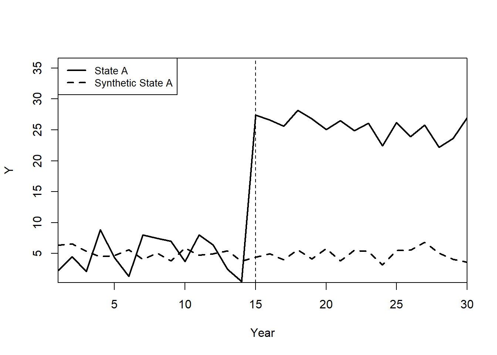
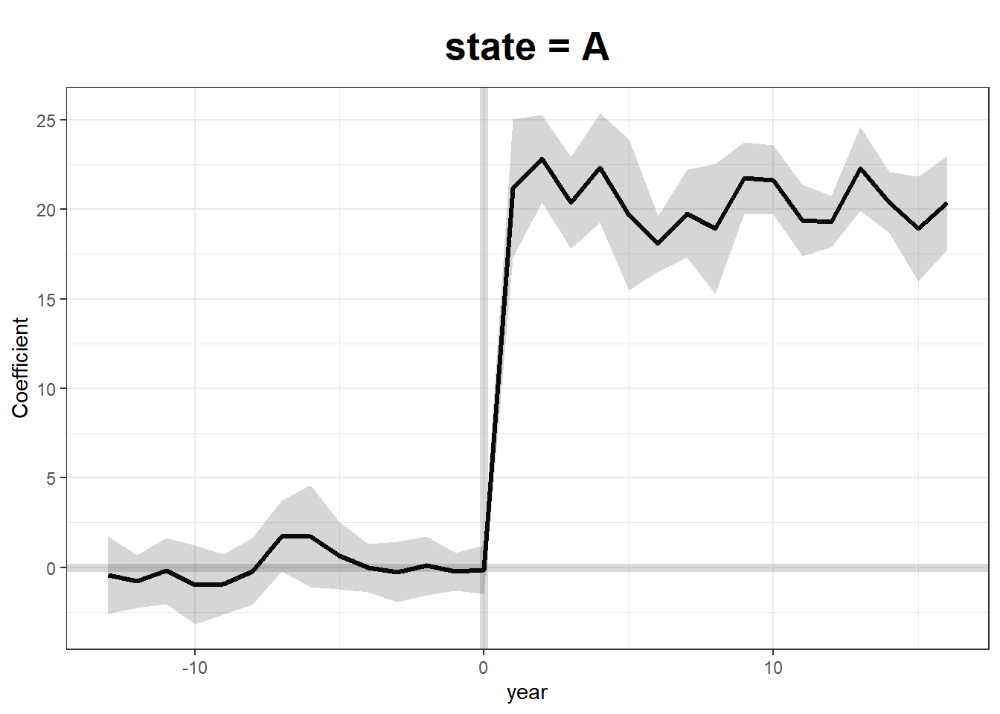

# Synthetic Control {#sec-synthetic-control}

The Synthetic Control Method (SCM) is a powerful causal inference tool used when only one treated unit exists, and researchers must construct a synthetic comparison group from a donor pool of untreated units. Introduced by @abadie2003economic and later extended by @abadie2010synthetic, SCM has become a widely used method in policy evaluation and business analytics. See @abadie2021using for a review of the method.

Why Use SCM?

-   A data-driven method for constructing a comparable control group (i.e., "black box" approach).
-   Avoids large bias when covariate distributions do not match between treated and control groups.
-   Natural alternative to [Difference-in-Differences](#sec-difference-in-differences) when:
    -   No perfect untreated comparison group exists.
    -   Treatment is applied to a single unit or a small number of units.

SCM is recommended in settings where:

1.  A major policy or social event is being evaluated (e.g., minimum wage laws, tax reforms, advertising campaigns).
2.  Only one treated case exists, with several potential controls (e.g., a state enacts a new law, while others do not).

## Marketing Applications

SCM has been applied in various marketing and business contexts:

-   Impact of Offline TV Advertising on Online Chatter [@tirunillai2017]
-   Effect of Mobile Hailing Technology Adoption on Drivers' Hourly Earnings [@wang2019mobile]
-   Impact of Payment Disclosure Laws on Physician Prescription Behavior (Massachusetts Open Payment Law) [@guo2020let]
-   Effect of Mandatory GMO Labels on Consumer Demand (Vermont as a case study) [@adalja2023gmo]

## Key Features of SCM

-   SCM estimates asymptotically normal parameters in linear panel models when the pre-treatment period is sufficiently long, making it a natural alternative to the [Difference-in-Differences](#sec-difference-in-differences) model [@arkhangelsky2023large].
-   SCM is superior to [Matching Methods], as it matches not only on pre-treatment covariates but also on pre-treatment outcomes. SCM differs from [Matching Methods] because:
    -   Matching methods focus on covariates.
    -   SCM constructs a synthetic unit by matching on pre-treatment outcomes.
-   SCM can be implemented under a Bayesian framework ([Bayesian Synthetic Control]) to avoid restrictive priors [@kim2020bayesian].

## Advantages of SCM

### Compared to DiD

1.  Maximizes similarity between control and treated units (including unobservables).
2.  Useful when no untreated unit closely matches the treated unit.
3.  Objective selection of control units, reducing researcher bias.

### Compared to Linear Regression

1.  Avoids extrapolation (no regression weights outside of [0,1]).
2.  Provides transparent weights, explicitly showing control unit contributions.
3.  Does not require post-treatment outcomes of the control group (reducing risk of p-hacking).

### Additional Advantages

1.  Selection criteria provide insights into the relative importance of each donor unit.
2.  Prevents overfitting, since post-intervention outcomes are not used when constructing the synthetic control.
3.  Enhances interpretability, since the synthetic unit is constructed using observable pre-treatment characteristics.

## Disadvantages of SCM

1.  Interpretability of Weights: It can be difficult to justify the exact weights assigned to control units.
2.  Strong Assumptions: Assumes the counterfactual outcome of the treated unit can be expressed as a linear combination of control units.
3.  Limited in Small Samples: Requires a large set of pre-treatment periods and a sufficiently large donor pool.

------------------------------------------------------------------------

## Assumptions

1.  Good Donor Pool Matching
    -   The synthetic control should closely resemble the treated unit in pre-treatment periods.
    -   The gap between pre-treatment outcomes of the treated unit and synthetic control should be zero (or very small).
2.  No Contamination
    -   Only the treated unit experiences the intervention.
    -   Control units in the donor pool do not receive treatment.
3.  No Other Major Changes
    -   The treatment is the only significant event affecting the treated unit.
4.  Linearity Assumption
    -   The counterfactual outcome of the treated unit can be constructed as a weighted sum of the control units.
5.  Exlusion Restriction (Identification Assumption):
    -   The exclusion restriction holds conditional on pre-treatment outcomes.

The `Synth` package provides an algorithm to determine the optimal weight for each control unit such that the synthetic control best resembles the treated unit before treatment.

------------------------------------------------------------------------

## Estimation

We observe $J + 1$ units over $T$ time periods.

-   The first unit ($i = 1$) is treated starting from time $T_0 + 1$.
-   The remaining $J$ units serve as the donor pool (potential controls).
-   Define:
    -   $Y_{it}^I$: Outcome for unit $i$ under treatment ($i=1$, for $t \geq T_0 + 1$).
    -   $Y_{it}^N$: Outcome for unit $i$ in the absence of treatment (counterfactual).

The goal is to estimate the treatment effect:

$$
\tau_{1t} = Y_{1t}^I - Y_{1t}^N
$$

where we observe:

$$
Y_{1t}^I = Y_{1t}
$$

but $Y_{1t}^N$ is unobserved and must be estimated using a synthetic control.

### Constructing the Synthetic Control

To estimate the counterfactual outcome, we create a synthetic control unit, a weighted combination of the untreated donor units. We assign weights $\mathbf{W} = (w_2, \dots, w_{J+1})'$ that satisfy:

-   Non-negativity constraint:\
    $$ w_j \geq 0, \quad \forall j = 2, \dots, J+1 $$
-   Sum-to-one constraint:\
    $$ w_2 + w_3 + \dots + w_{J+1} = 1 $$

The optimal weights are found by solving:

$$
\min_{\mathbf{W}} ||\mathbf{X}_1 - \mathbf{X}_0 \mathbf{W}||
$$

where:

-   $\mathbf{X}_1$ is a $k \times 1$ vector of pre-treatment characteristics for the treated unit.
-   $\mathbf{X}_0$ is a $k \times J$ matrix of pre-treatment characteristics for the donor units.

A common approach is to minimize the weighted sum:

$$
\min_{\mathbf{W}} \sum_{h=1}^{k} v_h (X_{h1} - w_2 X_{h2} - \dots - w_{J+1} X_{hJ+1})^2
$$

where:

-   $v_h$ represents the predictive power of each $k$-dimensional pre-treatment characteristic on $Y_{1t}^N$.
-   The weights $v_h$ can be chosen either:
    -   Explicitly by the researcher, or
    -   Data-driven via optimization.

------------------------------------------------------------------------

### Penalized Synthetic Control

To reduce interpolation bias, the penalized synthetic control method [@abadie2021penalized] modifies the optimization problem:

$$
\min_{\mathbf{W}} ||\mathbf{X}_1 - \sum_{j=2}^{J+1}W_j \mathbf{X}_j ||^2 + \lambda \sum_{j=2}^{J+1} W_j ||\mathbf{X}_1 - \mathbf{X}_j||^2
$$

where:

-   $\lambda > 0$ controls the trade-off between fit and regularization:
    -   $\lambda \to 0$: Standard synthetic control (unpenalized).
    -   $\lambda \to \infty$: Nearest-neighbor matching (strong penalization).
-   This method ensures:
    -   Sparse and unique solutions for weights.
    -   Exclusion of dissimilar control units (reducing interpolation bias).

The final synthetic control estimator is:

$$
\hat{\tau}_{1t} = Y_{1t} - \sum_{j=2}^{J+1} w_j^* Y_{jt}
$$

where $Y_{jt}$ is the outcome for unit $j$ at time $t$.

------------------------------------------------------------------------

## Theoretical Considerations

SCM assumes that the counterfactual outcome follows a factor model [@abadie2010synthetic]:

$$
Y_{it}^N = \mathbf{\theta}_t \mathbf{Z}_i + \mathbf{\lambda}_t \mathbf{\mu}_i + \epsilon_{it}
$$

where:

-   $\mathbf{Z}_i$ = Observed characteristics.
-   $\mathbf{\mu}_i$ = Unobserved factors.
-   $\epsilon_{it}$ = Transitory shocks (random noise).

To ensure a valid synthetic control, the weights $\mathbf{W}^*$ must satisfy:

$$
\sum_{j=2}^{J+1} w_j^* \mathbf{Z}_j  = \mathbf{Z}_1
$$

$$
\sum_{j=2}^{J+1} w_j^* Y_{j1} = Y_{11}, \quad \dots, \quad \sum_{j=2}^{J+1} w_j^* Y_{jT_0} = Y_{1T_0}
$$

This guarantees that the synthetic control closely matches the treated unit in pre-treatment periods.

Bias Considerations:

-   The accuracy of SCM depends on the ratio of transitory shocks ($\epsilon_{it}$) to pre-treatment periods ($T_0$). In other words, you should have good fit for $Y_{1t}$ for pre-treatment period (i.e., $T_0$ should be large while small variance in $\epsilon_{it}$)
-   Good fit in pre-treatment periods (large $T_0$) is crucial.
-   If the pre-treatment fit is poor, bias correction methods are required [@arkhangelsky2019synthetic, @abadie2021using, @ben2020varying].

------------------------------------------------------------------------

## Inference in SCM

Unlike traditional methods, SCM does not rely on standard statistical inference due to:

1.  Undefined sampling mechanism (e.g., only one treated unit).
2.  SCM is deterministic, making p-values difficult to interpret.

### Permutation (Placebo) Inference

To perform inference:

1.  Iteratively reassign the treatment to units in the donor pool.
2.  Estimate placebo treatment effects for each synthetic control.
3.  Compare the actual treatment effect to the placebo distribution.

The treatment effect is considered statistically significant if it is extreme relative to the placebo distribution.

### One-Sided Inference

-   Recommended due to the limited number of treated cases.
-   The permutation test is more robust than standard p-values.

For benchmark distributions (e.g., uniform permutation distributions), see [@firpo2018synthetic].

------------------------------------------------------------------------

## Augmented Synthetic Control Method {#sec-augmented-synthetic-control}

The Augmented Synthetic Control Method (ASCM), introduced by @ben2021augmented, extends the Synthetic Control Method to cases where perfect pre-treatment fit is infeasible. ASCM combines SCM weighting with bias correction through an outcome model, improving estimates when SCM alone fails to match pre-treatment outcomes precisely.

Key Idea:

-   Standard SCM requires that the synthetic control closely matches the treated unit in pre-treatment periods.
-   When this is not possible, ASCM adjusts for bias using outcome modeling, similar to bias correction in matching estimators.
-   ASCM can be seen as a trade-off between SCM and regression-based approaches, incorporating both synthetic control weighting and outcome modeling.

ASCM builds on SCM but relaxes its strong convex hull assumption. Key assumptions:

-   No Interference: Treatment affects only the treated unit.

-   No Unobserved Time-Varying Confounders: Changes over time should not be correlated with treatment assignment.

-   Regularization Controls Extrapolation Bias: Ridge penalty prevents overfitting.

ASCM is recommended when:

1.  SCM alone does not provide a good pre-treatment fit.

2.  Only one treated unit is available.

3.  Auxiliary covariates need to be incorporated.

Advantages of ASCM

1.  Handles Poor Pre-Treatment Fit
    -   Standard SCM fails when the treated unit lies outside the convex hull of donor units.
    -   ASCM allows negative weights (via ridge regression) to improve fit.
2.  Balances Bias and Variance
    -   Ridge penalty controls extrapolation, reducing overfitting.
3.  Flexible Estimation Framework
    -   Works with auxiliary covariates, extending beyond pure pre-treatment matching.

------------------------------------------------------------------------

Let:

-   $J + 1$ units be observed over $T$ time periods.

-   The first unit ($i=1$) is treated in periods $T_0 + 1, \dots, T$. - The remaining $J$ units are the donor pool (potential controls).

-   Define:

    -   $Y_{it}^I$: Outcome for unit $i$ under treatment.

    -   $Y_{it}^N$: Outcome for unit $i$ in the absence of treatment (counterfactual).

The treatment effect of interest:

$$
\tau_{1t} = Y_{1t}^I - Y_{1t}^N
$$

where:

$$
Y_{1t}^I = Y_{1t}
$$

but $Y_{1t}^N$ is unobserved and must be estimated.

ASCM improves SCM by incorporating an outcome model to correct for poor pre-treatment fit. The counterfactual outcome is estimated as:

$$
\hat{Y}^{\text{aug}}_{1T}(0) = \sum_{i=2}^{J+1} w_i Y_{iT} + \left( m_1 - \sum_{i=2}^{J+1} w_i m_i \right)
$$

where:

-   $w_i$ are SCM weights chosen to best match pre-treatment outcomes.

-   $m_i$ is an outcome model prediction for unit $i$.

-   If SCM achieves perfect pre-treatment fit, $m_1 - \sum w_i m_i \approx 0$, and ASCM reduces to standard SCM.

The most common implementation, Ridge ASCM, uses ridge regression to estimate $m_i$, leading to:

$$
\hat{Y}^{\text{aug}}_{1T}(0) = \sum_{i=2}^{J+1} w_i Y_{iT} + \left( X_1 - \sum w_i X_i \right) \beta
$$

where $\beta$ is estimated using ridge regression of post-treatment outcomes on pre-treatment outcomes.

------------------------------------------------------------------------

## Synthetic Control with Staggered Adoption

While traditional SCM focuses on cases with a single treated unit, many real-world policies exhibit staggered adoption, where different units receive treatment at different times.

In staggered adoption designs, policy implementation occurs over multiple time periods across different units (e.g., states, companies, or regions). This presents challenges:

-   Traditional SCM limitations: SCM was designed for a single treated unit and does not naturally accommodate multiple adoption times.
-   Heterogeneous treatment effects: The impact of the intervention may vary over time or across units.
-   Estimation bias: Common approaches such as [Two-Way Fixed Effects] can yield biased results when treatment effects are heterogeneous.

### Partially Pooled Synthetic Control

@ben2022synthetic propose a partially pooled SCM approach, balancing trade-offs between separate SCM for each unit and a fully pooled approach that estimates a single synthetic control for all treated units. The key ideas include:

1.  Two imbalance measures:
    -   Individual unit-level imbalance.
    -   Aggregate imbalance for the average treated unit.
2.  Optimization framework:
    -   Weights are chosen to minimize a weighted sum of these two imbalance measures.
    -   This method reduces bias compared to estimating separate SCM models for each unit​.

Mathematically, let:

-   $Y_{it}$ be the outcome of interest for unit $i$ at time $t$.

-   $T_i$ be the treatment adoption time for unit $i$.

-   $W_i$ be the synthetic control weight assigned to unit $i$.

Then, for treated unit $j$, the estimated counterfactual is:

$$ \hat{Y}_{jT_j+k} = \sum_{i=1}^{N} \hat{W}_{ij} Y_{iT_j+k} $$

The objective function combines both individual and aggregate balance constraints:

$$ \min_W \lambda \sum_{j} ||Y_{j,\text{pre}} - \sum_i W_{ij} Y_{i,\text{pre}}||^2 + (1-\lambda) ||Y_{\text{treated, pre}} - \sum_i W_i Y_{i,\text{pre}}||^2 $$

where $\lambda$ is a tuning parameter that controls the trade-off between individual and pooled balance​.


```r
# Load necessary library
library(augsynth)
```

------------------------------------------------------------------------

## Generalized Synthetic Control

The Generalized Synthetic Control (GSC) Method extends the synthetic control approach to accommodate multiple treated units and heterogeneous treatment effects while relaxing the [parallel trends assumption](#prior-parallel-trends-test) required in [difference-in-differences](#sec-difference-in-differences). Originally developed by @xu2017generalized, the GSC method integrates interactive fixed effects models, improving efficiency and robustness in time-series cross-sectional (TSCS) data.

### The Problem with Traditional Methods

Traditional causal inference methods such as [DID](#sec-difference-in-differences) require the [parallel trends assumption](#prior-parallel-trends-test): $$
E[Y_{it}(0) | D_i = 1] - E[Y_{it}(0) | D_i = 0] = \text{constant}
$$ which states that in the absence of treatment, the difference in outcomes between treated and control units would have remained constant over time. However, this assumption often fails due to:

-   Time-varying unobserved confounders affecting both treatment assignment and outcomes.
-   Heterogeneous treatment effects across units and over time.
-   Multiple treatment periods where different units adopt the treatment at different times.

To address these limitations, GSC builds on the interactive fixed effects model, which allows for unit-specific and time-specific latent factors that can capture unobserved confounding trends.

### Generalized Synthetic Control Model

Let $Y_{it}$ represent the observed outcome of unit $i$ at time $t$, and define the potential outcomes framework: $$
Y_{it}(d) = \mu_{it} + \delta_{it} d + \varepsilon_{it}, \quad d \in \{0,1\}
$$ where:

-   $\mu_{it}$ represents the latent factor structure of untreated outcomes.

-   $\delta_{it}$ is the treatment effect.

-   $\varepsilon_{it}$ is the idiosyncratic error term.

Under the interactive fixed effects model, we assume that the untreated outcome follows: $$
\mu_{it} = X_{it} \beta + \lambda_i' f_t
$$ where:

-   $X_{it}$ is a vector of observed covariates.

-   $\beta$ is a vector of unknown coefficients.

-   $\lambda_i$ represents unit-specific factor loadings.

-   $f_t$ represents time-specific factors.

The presence of $\lambda_i' f_t$ allows GSC to control for unobserved confounders that vary across time and units, a key advantage over [DID](#sec-difference-in-differences) and traditional [SCM](#sec-synthetic-control).

### Identification and Estimation

To estimate the [Average Treatment Effect on the Treated], we define: $$
\text{ATT}_t = \frac{1}{N_T} \sum_{i \in T} \left[ Y_{it}(1) - Y_{it}(0) \right]
$$ where $N_T$ is the number of treated units. The challenge is that $Y_{it}(0)$ for treated units is counterfactual and must be estimated.

Step 1: Estimating Factor Loadings and Latent Factors

Using only control units, we estimate the latent factors and factor loadings: $$
Y_{it} = X_{it} \beta + \lambda_i' f_t + \varepsilon_{it}, \quad i \in C
$$ which can be rewritten in matrix form: $$
Y_C = X_C \beta + \Lambda_C F' + E_C.
$$ The key assumption is that factor loadings and latent factors apply to both treated and control units, ensuring valid counterfactual estimation.

Step 2: Imputing Counterfactual Outcomes

For treated units, we estimate: $$
\hat{\lambda}_i = (F_0'F_0)^{-1} F_0' (Y_{i,0} - X_{i,0} \beta)
$$ where $F_0$ and $Y_{i,0}$ denote pre-treatment data. The imputed counterfactuals are then:

$$
\hat{Y}_{it}(0) = X_{it} \beta + \hat{\lambda}_i' \hat{f}_t.
$$

### Bootstrap Procedure for Standard Errors

A key issue in statistical inference with GSC is the estimation of uncertainty. The standard nonparametric bootstrap is biased due to dependent structures in panel data we adopt the parametric bootstrap from [@li2023statistical] to correct for bias.

Corrected Bootstrap Algorithm:

1.  Estimate the IFE Model using control units.
2.  Resample residuals $\hat{\varepsilon}_{it}$ from the fitted model.
3.  Generate new synthetic datasets using: $$
    Y_{it}^* = X_{it} \hat{\beta} + \hat{\lambda}_i' \hat{f}_t + \varepsilon_{it}^*
    $$
4.  Re-estimate the model on resampled data and compute bootstrap confidence intervals.

This approach ensures correct coverage probabilities and avoids bias in standard error estimation.


```r
# Load required package
library(gsynth)

# Example data
data("gsynth")

# Fit Generalized Synthetic Control Model
gsc_model <-
    gsynth(
        Y ~ D + X1 + X2,
        data = simdata,
        parallel = FALSE,
        index = c("id", "time"),
        force = "two-way",
        CV = TRUE,
        r = c(0, 5),
        se = T
    )
#> Cross-validating ... 
#>  r = 0; sigma2 = 1.84865; IC = 1.02023; PC = 1.74458; MSPE = 2.37280
#>  r = 1; sigma2 = 1.51541; IC = 1.20588; PC = 1.99818; MSPE = 1.71743
#>  r = 2; sigma2 = 0.99737; IC = 1.16130; PC = 1.69046; MSPE = 1.14540*
#>  r = 3; sigma2 = 0.94664; IC = 1.47216; PC = 1.96215; MSPE = 1.15032
#>  r = 4; sigma2 = 0.89411; IC = 1.76745; PC = 2.19241; MSPE = 1.21397
#>  r = 5; sigma2 = 0.85060; IC = 2.05928; PC = 2.40964; MSPE = 1.23876
#> 
#>  r* = 2
#> 
#> 
Bootstrapping ...
#> ..

# Summary of results
summary(gsc_model)
#>              Length Class   Mode     
#> Y.dat         1500  -none-  numeric  
#> Y                1  -none-  character
#> D                1  -none-  character
#> X                2  -none-  character
#> W                0  -none-  NULL     
#> index            2  -none-  character
#> id              50  -none-  numeric  
#> time            30  -none-  numeric  
#> obs.missing   1500  -none-  numeric  
#> id.tr            5  -none-  numeric  
#> id.co           45  -none-  numeric  
#> D.tr           150  -none-  numeric  
#> I.tr           150  -none-  numeric  
#> Y.tr           150  -none-  numeric  
#> Y.ct           150  -none-  numeric  
#> Y.co          1350  -none-  numeric  
#> eff            150  -none-  numeric  
#> Y.bar           90  -none-  numeric  
#> att             30  -none-  numeric  
#> att.avg          1  -none-  numeric  
#> force            1  -none-  numeric  
#> sameT0           1  -none-  logical  
#> T                1  -none-  numeric  
#> N                1  -none-  numeric  
#> p                1  -none-  numeric  
#> Ntr              1  -none-  numeric  
#> Nco              1  -none-  numeric  
#> T0               5  -none-  numeric  
#> tr              50  -none-  logical  
#> pre            150  -none-  logical  
#> post           150  -none-  logical  
#> r.cv             1  -none-  numeric  
#> IC               1  -none-  numeric  
#> PC               1  -none-  numeric  
#> beta             2  -none-  numeric  
#> est.co          13  -none-  list     
#> mu               1  -none-  numeric  
#> validX           1  -none-  numeric  
#> sigma2           1  -none-  numeric  
#> res.co        1350  -none-  numeric  
#> MSPE             1  -none-  numeric  
#> CV.out          30  -none-  numeric  
#> niter            1  -none-  numeric  
#> factor          60  -none-  numeric  
#> lambda.co       90  -none-  numeric  
#> lambda.tr       10  -none-  numeric  
#> wgt.implied    225  -none-  numeric  
#> alpha.tr         5  -none-  numeric  
#> alpha.co        45  -none-  numeric  
#> xi              30  -none-  numeric  
#> inference        1  -none-  character
#> est.att        180  -none-  numeric  
#> est.avg          5  -none-  numeric  
#> att.avg.boot   200  -none-  numeric  
#> att.boot      6000  -none-  numeric  
#> eff.boot     30000  -none-  numeric  
#> Dtr.boot     30000  -none-  numeric  
#> Itr.boot     30000  -none-  numeric  
#> beta.boot      400  -none-  numeric  
#> est.beta        10  -none-  numeric  
#> call             9  -none-  call     
#> formula          3  formula call

# Visualization
plot(gsc_model)
```


------------------------------------------------------------------------

## Bayesian Synthetic Control

The Bayesian Synthetic Control (BSC) approach introduces a probabilistic alternative to traditional synthetic control methods. Unlike the standard SCM, which estimates a single point estimate of treatment effects using a convex combination of control units, BSC incorporates posterior predictive distributions, allowing for proper uncertainty quantification and probabilistic inference​.

Bayesian methods offer several advantages over frequentist SCM:

-   Probabilistic Treatment Effects: Instead of a single deterministic estimate, Bayesian SCM provides a distribution over possible treatment effects.

-   Regularization via Priors: Bayesian approaches allow for the incorporation of shrinkage priors to improve estimation stability in high-dimensional settings.

-   Flexibility: The Bayesian framework can accommodate dynamic latent factor models, addressing issues like time-varying heterogeneity​.

Two major Bayesian approaches to SCM:

1.  Dynamic Multilevel Factor Models [@pang2022bayesian]
2.  Bayesian Sparse Synthetic Control [@kim2020bayesian]

### Bayesian Causal Inference Framework

In the traditional SCM, we estimate the counterfactual outcome $Y_{it}(0)$ for treated unit $i$ at time $t$ using a weighted sum of control units:

$$
\hat{Y}_{it}(0) = \sum_{j \neq i} w_j Y_{jt}.
$$

However, this deterministic approach does not quantify uncertainty in the estimation. The Bayesian SCM instead models the counterfactual outcome as a posterior predictive distribution:

$$
P(Y_{it}(0) | Y_{\text{obs}}, \theta),
$$

where $\theta$ represents the parameters of the model (e.g., factor loadings, regression coefficients, latent variables). The Bayesian approach estimates full posterior distributions, allowing us to compute credible intervals instead of relying solely on point estimates.

### Bayesian Dynamic Multilevel Factor Model

The Dynamic Multilevel Factor Model (DM-LFM), proposed by @pang2022bayesian, extends SCM by incorporating latent factor models to correct for unit-specific time trends.

#### Model Specification

Let $Y_{it}$ be the observed outcome for unit $i$ at time $t$. The potential untreated outcome follows:

$$
Y_{it}(0) = X_{it} \beta + \lambda_i' f_t + \varepsilon_{it},
$$

where:

-   $X_{it}$ are observed covariates,

-   $\beta$ are regression coefficients,

-   $\lambda_i$ are unit-specific factor loadings,

-   $f_t$ are common latent time factors,

-   $\varepsilon_{it} \sim \mathcal{N}(0, \sigma^2)$ is the noise term.

The treatment effect is defined as:

$$
\tau_{it} = Y_{it}(1) - Y_{it}(0).
$$

Under latent ignorability, we assume:

$$
P(T_i | X_i, U_i) = P(T_i | X_i),
$$

where $U_i$ are latent variables extracted from the outcome data​.

#### Bayesian Inference Procedure

To estimate treatment effects, we follow these steps:

1.  Estimate $\lambda_i$ and $f_t$ using control units.
2.  Predict counterfactuals for treated units: $$
    \hat{Y}_{it}(0) = X_{it} \hat{\beta} + \hat{\lambda}_i' \hat{f}_t.
    $$
3.  Obtain the posterior predictive distribution of treatment effects.

This Bayesian approach enables proper credible intervals for causal effects.

### Bayesian Sparse Synthetic Control

@kim2020bayesian propose an alternative Bayesian framework that removes restrictive constraints imposed by standard SCM​.

#### Relaxing SCM Constraints

Traditional SCM imposes:

1.  Nonnegative weights: $w_j \geq 0$.
2.  Convex combination: $\sum_j w_j = 1$.

BSCM relaxes these by allowing negative weights and regularization priors. It models the control unit weights using Bayesian shrinkage priors:

$$
w_j \sim \mathcal{N}(0, \tau^2),
$$

where $\tau^2$ is a regularization parameter. This allows flexible weight selection while preventing overfitting.

#### Bayesian Shrinkage Priors

BSCM incorporates horseshoe priors and spike-and-slab priors to select relevant control units:

-   Horseshoe Prior: $$
      w_j \sim \mathcal{N}(0, \lambda_j^2), \quad \lambda_j \sim C^+(0,1).
      $$

-   Spike-and-Slab Prior: $$
      w_j \sim \gamma_j \mathcal{N}(0, \sigma_1^2) + (1-\gamma_j) \mathcal{N}(0, \sigma_0^2),
      $$ where $\gamma_j \sim \text{Bernoulli}(\pi)$ determines whether a control unit is included.

These priors ensure robust weight selection while controlling for overfitting.

### Bayesian Inference and MCMC Estimation

Both DM-LFM and BSCM are estimated using Markov Chain Monte Carlo (MCMC). Given observed data $Y_{\text{obs}}$, we sample from the posterior:

$$
P(\theta | Y_{\text{obs}}) \propto P(Y_{\text{obs}} | \theta) P(\theta),
$$

where $P(\theta)$ encodes prior beliefs about the parameters.

Common MCMC techniques used:

-   Gibbs Sampling for latent factors and regression coefficients.

-   Hamiltonian Monte Carlo (HMC) for high-dimensional posteriors.


```r
# Load necessary libraries
library(rstan)
library(bayesplot)

# Define Bayesian SCM model in Stan
scm_model <- "
data {
  int<lower=0> N;  // Number of observations
  int<lower=0> T;  // Time periods
  matrix[N, T] Y;  // Outcome matrix
}
parameters {
  vector[T] f;  // Latent factors
  vector[N] lambda; // Factor loadings
  real<lower=0> sigma; // Noise variance
}
model {
  // Priors
  f ~ normal(0, 1);
  lambda ~ normal(0, 1);

  // Likelihood
  for (i in 1:N)
    Y[i, ] ~ normal(lambda[i] * f, sigma);
}
"

# Compile and fit the model
fit <-
  stan(model_code = scm_model, data = list(
    N = 50,
    T = 20,
    Y = matrix(rnorm(1000), 50, 20)
  ))

# Summarize results
print(fit)
```

## Using Multiple Outcomes to Improve the Synthetic Control Method

Typically, SCM constructs a weighted combination of untreated control units to approximate the counterfactual outcome of the treated unit. However, standard SCM is limited to a single outcome variable, which can lead to biased estimates when multiple correlated outcomes are available.

In their work, @sun2023using propose a novel extension of SCM that leverages multiple outcome variables to improve causal inference by:

1.  Using a common set of synthetic control weights across all outcomes rather than estimating separate weights for each outcome.
2.  Reducing bias using a low-rank factor model, which exploits shared latent structures across outcomes.

### Standard Synthetic Control Method

Let $Y_{itk}$ denote the observed outcome for unit $i$ at time $t$ for outcome $k$, where $i = 1, \dots, N$, $t = 1, \dots, T$, and $k = 1, \dots, K$. The potential outcomes framework assumes:

$$
Y_{itk}(d) = \mu_{itk} + \delta_{itk} d + \varepsilon_{itk}, \quad d \in \{0,1\}
$$

where:

-   $\mu_{itk}$ represents the latent structure of untreated outcomes.

-   $\delta_{itk}$ is the treatment effect.

-   $\varepsilon_{itk} \sim \mathcal{N}(0, \sigma^2)$ is random noise.

For unit $i=1$ (the treated unit), the observed outcome follows:

$$
Y_{1tk} = Y_{1tk}(0) + D_{1t} \delta_{1tk}
$$

where $D_{1t}$ is an indicator for treatment at time $t$. The challenge is to estimate the counterfactual outcome $Y_{1tk}(0)$, which is unobserved post-treatment.

SCM estimates $Y_{1tk}(0)$ as a weighted combination of control units:

$$
\hat{Y}_{1tk}(0) = \sum_{i=2}^{N} w_i Y_{itk}
$$

where weights $w_i$ are chosen to minimize pre-treatment imbalance.

### Using Multiple Outcomes for Bias Reduction

Instead of estimating separate weights $w_k$ for each outcome $k$, @sun2023using propose a single set of weights $w$ across all outcomes. This approach is justified under a low-rank factor model, which assumes that multiple outcomes share common latent factors.

#### Low-Rank Factor Model

Assume the untreated potential outcome follows a linear factor structure:

$$
Y_{itk}(0) = X_{it} \beta_k + \lambda_i' f_{tk} + \varepsilon_{itk}
$$

where:

-   $X_{it}$ are observed covariates.

-   $\beta_k$ are outcome-specific coefficients.

-   $\lambda_i$ are unit-specific factor loadings.

-   $f_{tk}$ are time-and-outcome-specific latent factors.

If all outcomes share the same latent factor structure, then the bias in synthetic control estimation can be reduced by a factor of $1 / \sqrt{K}$ as the number of outcomes $K$ increases.

### Estimation Methods

@sun2023using propose two methods for constructing a common synthetic control:

1.  Concatenated Outcome Weights: Estimate weights by minimizing imbalance across all outcomes simultaneously:

    $$
    \hat{w} = \arg\min_w \sum_{k=1}^{K} || Y_{1,\text{pre},k} - \sum_{i=2}^{N} w_i Y_{i,\text{pre},k} ||^2
    $$

2.  Averaged Outcome Weights: Estimate weights based on a linear combination (e.g., average) of outcomes:

    $$
    \hat{w} = \arg\min_w || \frac{1}{K} \sum_{k=1}^{K} Y_{1,\text{pre},k} - \sum_{i=2}^{N} w_i \frac{1}{K} \sum_{k=1}^{K} Y_{i,\text{pre},k} ||^2
    $$

These methods improve SCM performance by reducing variance and overfitting to noise.

### Empirical Application: Flint Water Crisis

To illustrate the benefits of multiple outcome SCM, @sun2023using re-analyze the Flint water crisis, which led to lead contamination in drinking water, potentially affecting student performance.

Four key educational outcomes were studied:

1.  Math Achievement
2.  Reading Achievement
3.  Special Needs Status
4.  Daily Attendance

By applying common weights across these outcomes, their SCM results showed:

-   Reduced bias and improved robustness compared to separate SCM fits.

-   Better pre-treatment fit for educational outcomes.

-   Stronger evidence of educational impacts following the crisis.


```r
# Load necessary libraries
library(augsynth)

# Fit SCM using a common set of weights across multiple outcomes
synth_model <- augsynth_multiout()
```

## Applications

### Synthetic Control Estimation

This example simulates data for 10 states over 30 years, where State A receives treatment after year 15. We implement two approaches:

1.  Standard Synthetic Control using `Synth`.
2.  [Generalized Synthetic Control] using `gsynth`, which incorporates iterative fixed effects and multiple treated units.

Load Required Libraries


```r
# install.packages("Synth")
# install.packages("gsynth")
library("Synth")
library("gsynth")
```

We construct a panel dataset where the outcome variable $Y$ is influenced by two covariates ($X_1, X_2$). Treatment ($T$) is applied to State A from year 15 onwards, with an artificial treatment effect of +20.


```r
# Simulate panel data
set.seed(1)

df <- data.frame(
  year      = rep(1:30, 10),          # 30 years for 10 states
  state     = rep(LETTERS[1:10], each = 30),  # States A to J
  X1        = round(rnorm(300, 2, 1), 2),     # Continuous covariate
  X2        = round(rbinom(300, 1, 0.5) + rnorm(300), 2),  # Binary + noise
  state.num = rep(1:10, each = 30)    # Numeric identifier for states
)

# Outcome variable: Y = 1 + 2 * X1 + noise
df$Y <- round(1 + 2 * df$X1 + rnorm(300), 2)

# Assign treatment: Only State A (state == "A") from year 15 onward
df$T <- as.integer(df$state == "A" & df$year >= 15)

# Apply treatment effect: Increase Y by 20 where treatment is applied
df$Y[df$T == 1] <- df$Y[df$T == 1] + 20

# View data structure
str(df)
#> 'data.frame':	300 obs. of  7 variables:
#>  $ year     : int  1 2 3 4 5 6 7 8 9 10 ...
#>  $ state    : chr  "A" "A" "A" "A" ...
#>  $ X1       : num  1.37 2.18 1.16 3.6 2.33 1.18 2.49 2.74 2.58 1.69 ...
#>  $ X2       : num  1.96 0.4 -0.75 -0.56 -0.45 1.06 0.51 -2.1 0 0.54 ...
#>  $ state.num: int  1 1 1 1 1 1 1 1 1 1 ...
#>  $ Y        : num  2.29 4.51 2.07 8.87 4.37 1.32 8 7.49 6.98 3.72 ...
#>  $ T        : int  0 0 0 0 0 0 0 0 0 0 ...
```

Step 1: Estimating Synthetic Control with `Synth`

The `Synth` package creates a synthetic control by matching pre-treatment trends of the treated unit (`State A`) with a weighted combination of donor states.

We specify predictors, dependent variable, and donor pool.


```r
dataprep.out <- dataprep(
  df,
  predictors = c("X1", "X2"),
  dependent = "Y",
  unit.variable = "state.num",
  time.variable = "year",
  unit.names.variable = "state",
  treatment.identifier = 1,
  controls.identifier = 2:10,
  time.predictors.prior = 1:14,
  time.optimize.ssr = 1:14,
  time.plot = 1:30
)
```

Fit Synthetic Control Model


```r
synth.out <- synth(dataprep.out)
#> 
#> X1, X0, Z1, Z0 all come directly from dataprep object.
#> 
#> 
#> **************** 
#>  searching for synthetic control unit  
#>  
#> 
#> **************** 
#> **************** 
#> **************** 
#> 
#> MSPE (LOSS V): 9.831789 
#> 
#> solution.v:
#>  0.3888387 0.6111613 
#> 
#> solution.w:
#>  0.1115941 0.1832781 0.1027237 0.312091 0.06096758 0.03509706 0.05893735 0.05746256 0.07784853

# Display synthetic control weights and balance table
print(synth.tab(dataprep.res = dataprep.out, synth.res = synth.out))
#> $tab.pred
#>    Treated Synthetic Sample Mean
#> X1   2.028     2.028       2.017
#> X2   0.513     0.513       0.394
#> 
#> $tab.v
#>    v.weights
#> X1 0.389    
#> X2 0.611    
#> 
#> $tab.w
#>    w.weights unit.names unit.numbers
#> 2      0.112          B            2
#> 3      0.183          C            3
#> 4      0.103          D            4
#> 5      0.312          E            5
#> 6      0.061          F            6
#> 7      0.035          G            7
#> 8      0.059          H            8
#> 9      0.057          I            9
#> 10     0.078          J           10
#> 
#> $tab.loss
#>            Loss W   Loss V
#> [1,] 9.761708e-12 9.831789
```

Plot: Observed vs. Synthetic State A


```r
path.plot(
  synth.out,
  dataprep.out,
  Ylab = "Y",
  Xlab = "Year",
  Legend = c("State A", "Synthetic State A"),
  Legend.position = "topleft"
)

# Mark the treatment start year
abline(v = 15, lty = 2)  
```



Plot: Treatment Effect (Gaps Plot)

The gaps plot shows the difference between `State A` and its synthetic control over time.


```r
gaps.plot(synth.res    = synth.out,
          dataprep.res = dataprep.out,
          Ylab         = c("Gap"),
          Xlab         = c("Year"),
          Ylim         = c(-30, 30),
          Main         = ""
)

abline(v   = 15, lty = 2)
```


Step 2: Estimating Generalized Synthetic Control with `gsynth`

Unlike `Synth`, the `gsynth` package supports:

-   Iterative Fixed Effects (IFE) for unobserved heterogeneity.

-   Multiple Treated Units and Staggered Adoption.

-   Bootstrapped Standard Errors for inference.

Fit Generalized Synthetic Control Model

We use two-way fixed effects, cross-validation (`CV = TRUE`), and bootstrapped standard errors.


```r
gsynth.out <- gsynth(
  Y ~ T + X1 + X2,
  data = df,
  index = c("state", "year"),
  force = "two-way",
  CV = TRUE,
  r = c(0, 5),
  se = TRUE,
  inference = "parametric",
  nboots = 100
)
#> Parallel computing ...
#> Cross-validating ... 
#>  r = 0; sigma2 = 1.13533; IC = 0.95632; PC = 0.96713; MSPE = 1.65502
#>  r = 1; sigma2 = 0.96885; IC = 1.54420; PC = 4.30644; MSPE = 1.33375
#>  r = 2; sigma2 = 0.81855; IC = 2.08062; PC = 6.58556; MSPE = 1.27341*
#>  r = 3; sigma2 = 0.71670; IC = 2.61125; PC = 8.35187; MSPE = 1.79319
#>  r = 4; sigma2 = 0.62823; IC = 3.10156; PC = 9.59221; MSPE = 2.02301
#>  r = 5; sigma2 = 0.55497; IC = 3.55814; PC = 10.48406; MSPE = 2.79596
#> 
#>  r* = 2
#> 
#> 
Simulating errors ...
Bootstrapping ...
#> 
```


```r
# Plot Estimated Treatment Effects
plot(gsynth.out)
```



```r

# Plot Counterfactual Trends
plot(gsynth.out, type = "counterfactual")
```


```r

# Show Estimations for Control Cases
plot(gsynth.out, type = "counterfactual", raw = "all") 
```


### The Basque Country Policy Change

The Basque Country in Spain implemented a major policy change in 1975, impacting its GDP per capita growth. This example uses SCM to estimate the counterfactual economic performance had the policy not been implemented.

We will:

1.  Construct a synthetic control using economic predictors. 2
2.  Evaluate the policy's impact by comparing the real and synthetic Basque GDP.


```r
library(Synth)
```

The `basque` dataset from `Synth` contains economic indicators for Spain's regions from 1955 to 1997.


```r
data("basque")
dim(basque)  # 774 observations, 17 variables
#> [1] 774  17
head(basque)
#>   regionno     regionname year   gdpcap sec.agriculture sec.energy sec.industry
#> 1        1 Spain (Espana) 1955 2.354542              NA         NA           NA
#> 2        1 Spain (Espana) 1956 2.480149              NA         NA           NA
#> 3        1 Spain (Espana) 1957 2.603613              NA         NA           NA
#> 4        1 Spain (Espana) 1958 2.637104              NA         NA           NA
#> 5        1 Spain (Espana) 1959 2.669880              NA         NA           NA
#> 6        1 Spain (Espana) 1960 2.869966              NA         NA           NA
#>   sec.construction sec.services.venta sec.services.nonventa school.illit
#> 1               NA                 NA                    NA           NA
#> 2               NA                 NA                    NA           NA
#> 3               NA                 NA                    NA           NA
#> 4               NA                 NA                    NA           NA
#> 5               NA                 NA                    NA           NA
#> 6               NA                 NA                    NA           NA
#>   school.prim school.med school.high school.post.high popdens invest
#> 1          NA         NA          NA               NA      NA     NA
#> 2          NA         NA          NA               NA      NA     NA
#> 3          NA         NA          NA               NA      NA     NA
#> 4          NA         NA          NA               NA      NA     NA
#> 5          NA         NA          NA               NA      NA     NA
#> 6          NA         NA          NA               NA      NA     NA
```

Step 1: Preparing Data for `Synth`

We define predictors and specify pre-treatment (1960--1969) and post-treatment (1975--1997) periods.


```r
dataprep.out <- dataprep(
    foo = basque,
    predictors = c(
        "school.illit",
        "school.prim",
        "school.med",
        "school.high",
        "school.post.high",
        "invest"
    ),
    predictors.op = "mean",
    time.predictors.prior = 1964:1969,
    # Pre-treatment period
    special.predictors = list(
        list("gdpcap", 1960:1969, "mean"),
        list("sec.agriculture", seq(1961, 1969, 2), "mean"),
        list("sec.energy", seq(1961, 1969, 2), "mean"),
        list("sec.industry", seq(1961, 1969, 2), "mean"),
        list("sec.construction", seq(1961, 1969, 2), "mean"),
        list("sec.services.venta", seq(1961, 1969, 2), "mean"),
        list("sec.services.nonventa", seq(1961, 1969, 2), "mean"),
        list("popdens", 1969, "mean")
    ),
    dependent = "gdpcap",
    unit.variable = "regionno",
    unit.names.variable = "regionname",
    time.variable = "year",
    treatment.identifier = 17,
    # Basque region
    controls.identifier = c(2:16, 18),
    # Control regions
    time.optimize.ssr = 1960:1969,
    time.plot = 1955:1997
)
```

Step 2: Estimating the Synthetic Control

We now estimate the synthetic control weights using `synth()`. This solves for weights that best match the pre-treatment economic indicators of the Basque Country.


```r
synth.out = synth(data.prep.obj = dataprep.out, method = "BFGS")
#> 
#> X1, X0, Z1, Z0 all come directly from dataprep object.
#> 
#> 
#> **************** 
#>  searching for synthetic control unit  
#>  
#> 
#> **************** 
#> **************** 
#> **************** 
#> 
#> MSPE (LOSS V): 0.008864606 
#> 
#> solution.v:
#>  0.02773094 1.194e-07 1.60609e-05 0.0007163836 1.486e-07 0.002423908 0.0587055 0.2651997 0.02851006 0.291276 0.007994382 0.004053188 0.009398579 0.303975 
#> 
#> solution.w:
#>  2.53e-08 4.63e-08 6.44e-08 2.81e-08 3.37e-08 4.844e-07 4.2e-08 4.69e-08 0.8508145 9.75e-08 3.2e-08 5.54e-08 0.1491843 4.86e-08 9.89e-08 1.162e-07
```

Step 3: Evaluating Treatment Effects

Calculate the GDP Gap Between Real and Synthetic Basque Country


```r
gaps = dataprep.out$Y1plot - (dataprep.out$Y0plot %*% synth.out$solution.w)
gaps[1:3,1]  # First three differences
#>       1955       1956       1957 
#> 0.15023473 0.09168035 0.03716475
```

The `synth.tab()` function provides pre-treatment fit diagnostics and predictor weights.


```r
synth.tables = synth.tab(dataprep.res = dataprep.out, synth.res = synth.out)
names(synth.tables)
#> [1] "tab.pred" "tab.v"    "tab.w"    "tab.loss"

# Predictor Balance Table
synth.tables$tab.pred[1:13,]
#>                                          Treated Synthetic Sample Mean
#> school.illit                              39.888   256.337     170.786
#> school.prim                             1031.742  2730.104    1127.186
#> school.med                                90.359   223.340      76.260
#> school.high                               25.728    63.437      24.235
#> school.post.high                          13.480    36.153      13.478
#> invest                                    24.647    21.583      21.424
#> special.gdpcap.1960.1969                   5.285     5.271       3.581
#> special.sec.agriculture.1961.1969          6.844     6.179      21.353
#> special.sec.energy.1961.1969               4.106     2.760       5.310
#> special.sec.industry.1961.1969            45.082    37.636      22.425
#> special.sec.construction.1961.1969         6.150     6.952       7.276
#> special.sec.services.venta.1961.1969      33.754    41.104      36.528
#> special.sec.services.nonventa.1961.1969    4.072     5.371       7.111
```

Importance of Each Control Region in the Synthetic Basque Country


```r
synth.tables$tab.w[8:14, ]
#>    w.weights            unit.names unit.numbers
#> 9      0.000    Castilla-La Mancha            9
#> 10     0.851              Cataluna           10
#> 11     0.000  Comunidad Valenciana           11
#> 12     0.000           Extremadura           12
#> 13     0.000               Galicia           13
#> 14     0.149 Madrid (Comunidad De)           14
#> 15     0.000    Murcia (Region de)           15
```

Step 4: Visualizing Results

Plot Real vs. Synthetic GDP Per Capita


```r
path.plot(
    synth.res = synth.out,
    dataprep.res = dataprep.out,
    Ylab = "Real Per-Capita GDP (1986 USD, thousand)",
    Xlab = "Year",
    Ylim = c(0, 12),
    Legend = c("Basque Country", "Synthetic Basque Country"),
    Legend.position = "bottomright"
)
```


Plot the Treatment Effect (GDP Gap)


```r
gaps.plot(
    synth.res = synth.out,
    dataprep.res = dataprep.out,
    Ylab = "Gap in Real Per-Capita GDP (1986 USD, thousand)",
    Xlab = "Year",
    Ylim = c(-1.5, 1.5),
    Main = NA
)
```


The gap plot shows the difference between actual Basque GDP and its synthetic control over time. A large post-treatment deviation suggests a policy impact.

### Micro-Synthetic Control with `microsynth`

The `microsynth` package extends standard SCM by allowing: 1

1.  Matching on both predictors and time-variant outcomes. 2
2.  Permutation tests and jackknife resampling for placebo tests.
3.  Multiple follow-up periods to track long-term treatment effects.
4.  Omnibus test statistics for multiple outcome variables.

This example evaluates the Seattle Drug Market Initiative, a policing intervention aimed at reducing drug-related crime. The dataset `seattledmi` contains crime statistics across different city zones.

------------------------------------------------------------------------

Step 1: Load the Required Package and Data


```r
library(microsynth)
data("seattledmi")
```

Step 2: Define Predictors and Outcome Variables

We specify:

-   Predictors (time-invariant): Population, race distribution, household data.

-   Outcomes (time-variant): Crime rates across different offense categories.


```r
cov.var <- c(
    "TotalPop",
    "BLACK",
    "HISPANIC",
    "Males_1521",
    "HOUSEHOLDS",
    "FAMILYHOUS",
    "FEMALE_HOU",
    "RENTER_HOU",
    "VACANT_HOU"
)
match.out <- c("i_felony", "i_misdemea", "i_drugs", "any_crime")

```

Step 3: Fit the Micro-Synthetic Control Model

We first estimate treatment effects using a single follow-up period.


```r
sea1 <- microsynth(
    seattledmi,
    idvar       = "ID",          # Unique unit identifier
    timevar     = "time",        # Time variable
    intvar      = "Intervention",# Treatment assignment
    start.pre   = 1,             # Start of pre-treatment period
    end.pre     = 12,            # End of pre-treatment period
    end.post    = 16,            # End of post-treatment period
    match.out   = match.out,     # Outcomes to match on
    match.covar = cov.var,       # Predictors to match on
    result.var  = match.out,     # Variables for treatment effect estimates
    omnibus.var = match.out,     # Variables for omnibus p-values
    test        = "lower",       # One-sided test (decrease in crime)
    n.cores     = min(parallel::detectCores() - 4, 2) # Parallel processing
)

```

Step 4: Summarize Results


```r
summary(sea1)
```

This output provides:

-   Weighted unit contributions to the synthetic control.

-   Treatment effect estimates and confidence intervals.

-   p-values from permutation tests.

Step 5: Visualize the Treatment Effect

We generate a treatment effect plot comparing actual vs. synthetic trends.


```r
plot_microsynth(sea1)
```

Step 6: Incorporating Multiple Follow-Up Periods

We extend the analysis by adding multiple post-treatment periods (`end.post = c(14, 16)`) and permutation-based placebo tests (`perm = 250`, `jack = TRUE`).


```r
sea2 <- microsynth(
    seattledmi,
    idvar       = "ID",
    timevar     = "time",
    intvar      = "Intervention",
    start.pre   = 1,
    end.pre     = 12,
    end.post    = c(14, 16), # Two follow-up periods
    match.out   = match.out,
    match.covar = cov.var,
    result.var  = match.out,
    omnibus.var = match.out,
    test        = "lower",
    perm        = 250, # Permutation placebo tests
    jack        = TRUE, # Jackknife resampling
    n.cores     = min(parallel::detectCores() - 4, 2)
)
```

Step 7: Placebo Testing and Robustness Checks

Permutation and jackknife tests assess whether observed treatment effects are statistically significant or due to random fluctuations.

Key robustness checks:

1.  Permutation Tests (`perm = 250`)

```         
1.  Reassigns treatment randomly and estimates placebo effects

2.  If true effects exceed placebo effects, they are likely causal.
```

2.  Jackknife Resampling (`jack = TRUE`)

```         
1.  Removes one control unit at a time and re-estimates effects.

2.  Ensures no single control dominates the synthetic match.
```


```r
summary(sea2)  # Compare estimates with multiple follow-up periods
plot_microsynth(sea2)  # Visualize placebo-adjusted treatment effects
```
