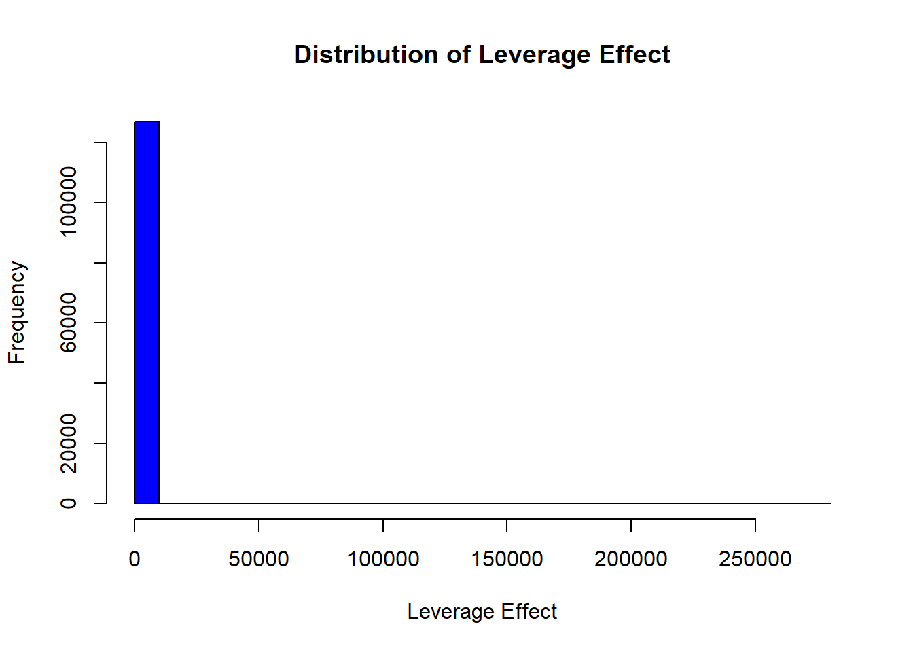

# Event Studies {#sec-event-studies}

The event study methodology is widely used in finance, marketing, and management to measure the impact of specific events on stock prices. The foundation of this methodology is the **Efficient Markets Hypothesis** proposed by @fama1970efficient, which asserts that asset prices reflect all available information. Under this assumption, stock prices should immediately react to new, unexpected information, making event studies a useful tool for assessing the economic impact of firm- and non-firm-initiated activities.

The first event study was conducted by @dolley1933characteristics, while @campbell1998econometrics formalized the methodology for modern applications. Later, @dubow2006measuring developed a metric to assess market transparency (i.e., a way to gauge how "clean" a market is) by tracking unusual stock price movements before major regulatory announcements. Their study found that abnormal price shifts before announcements could indicate insider trading, as prices reacted to leaked information before official disclosures.

**Advantages of Event Studies**

-   **More Reliable than Accounting-Based Measures:** Unlike financial metrics (e.g., profits), which managers can manipulate, stock prices are harder to alter and reflect real-time investor sentiment [@benston1985validity].

-   **Easy to Conduct:** Event studies require only stock price data and simple econometric models, making them widely accessible for researchers.

**Types of Events in Event Studies**

| **Event Type**      | **Examples**                                                 |
|-----------------------|-------------------------------------------------|
| **Internal Events** | Stock repurchase, earnings announcements, leadership changes |
| **External Events** | Macroeconomic shocks, regulatory changes, media reports      |

## Review of Event Studies Across Disciplines

Event studies have been applied extensively in management, marketing, and finance to assess how different corporate and external events influence shareholder value.

### Finance Applications

-   [@fama1969adjustment]: Stock split.

### Management Applications

-   [@mcwilliams1997event]: Comprehensive review of event studies in management research.

### Marketing Applications

Event studies are useful in marketing for evaluating the effects of firm decisions (e.g., advertising campaigns, brand changes) and non-firm-initiated activities (e.g., regulatory decisions, third-party reviews).

#### Firm-Initiated Activities

| **Event Type**                             | **Studies**                                                                                                                                                                                                                                                                           |
|--------------------|----------------------------------------------------|
| **Corporate Changes**                      | [@horsky1987does] (name change), [@kalaignanam2013corporate] (corporate brand change)                                                                                                                                                                                                 |
| **New Product Strategies**                 | [@chaney1991impact] (new product announcements), [@raassens2012market] (outsourcing product development), [@sood2009innovations] (innovation payoff), [@borah2014make] (make, buy or ally for innovations), [@fang2015timing] (co-development agreements)                             |
| **Brand & Marketing Strategies**           | [@lane1995stock] (brand extensions), [@wiles2012effect] (brand acquisition)                                                                                                                                                                                                           |
| **Advertising & Promotions**               | [@wiles2010stock] (deceptive advertising), [@cornwell2005relationship] (sponsorship announcements)                                                                                                                                                                                    |
| **Strategic Alliances**                    | [@houston2000buyer] (joint ventures), [@fang2015timing] (co-development agreements), [@sorescu2007some] (M&A), [@homburg2014firm] (channel expansions)                                                                                                                                |
| **Entertainment & Celebrity Endorsements** | [@agrawal1995economic] (celebrity endorsements), [@elberse2007power] (casting announcements), [@wiles2009worth] (product placement in movies), [@joshi2009movie] (movie releases), [@karniouchina2011marketing] (product placement), [@mazodier2013sponsorship] (sports annoucements) |

-   @geyskens2002market: Internet channel (for newspapers)

-   @boyd2010chief: new CMO appointments

#### Non-Firm-Initiated Activities

Event studies are also used to examine the impact of external events on firm value, including regulatory decisions, media coverage, economic shocks, and unexpected crises.

| **Event Type**                          | **Studies**                                                                                                                                                      |
|---------------------|---------------------------------------------------|
| **Regulatory Decisions**                | [@sorescu2003] (FDA approvals), [@rao2008fruits] (FDA approvals), [@tipton2009regulatory] (deceptive advertising regulation)                                     |
| **Media Coverage & Consumer Reactions** | [@jacobson2009financial] (customer satisfaction score release), [@chen2012third] (third-party movie reviews), [@tellis2007] (quality reviews by Walter Mossberg) |
| **Economic & Market Shocks**            | [@gielens2008dancing] (Walmart's entry into the UK), [@xiong2013asymmetric] (asymmetric news impact), [@pandey2005relationship] (diversity elite list)           |
| **Consumer & Industry Recognitions**    | [@balasubramanian2005impact] (high-quality achievements), [@fornell2006customer] (customer satisfaction), [@ittner2009commentary] (customer satisfaction)        |
| **Financial & Market Reactions**        | [@boyd2008market] (indirect ties), [@karniouchina2009impact] (*Mad Money* with Jim Cramer), [@bhagat1998shareholder] (litigation)                                |
| **Product & Service Failures**          | [@chen2009does] (product recalls), [@gao2015should] (product recalls), [@malhotra2011evaluating] (data breach)                                                   |

Event studies can be extended to new types of events, such as:

-   Advertising Campaigns -- How do major ad campaigns affect stock prices?

-   Market Entry -- Does entering a new market increase firm value?

-   Product Failures & Recalls -- How do recalls affect brand equity?

-   Patent Announcements -- Do new patents generate abnormal returns?

## Key Assumptions

1.  **Efficient Market Hypothesis**: Stock prices fully reflect available information [@fama1970efficient].

2.  **Stock Market as a Proxy for Firm Value**: Shareholders are the primary stakeholders.

3.  **Sharp Event Effect**: The event must cause an immediate stock price reaction.

4.  **Proper Calculation of Expected Returns**: Requires an appropriate benchmark model.

## Steps for Conducting an Event Study

### Step 1: Event Identification

An event study examines how a particular event affects a firm's stock price, assuming that stock markets incorporate new information efficiently. The event must influence either the firm's expected cash flows or discount rate [@sorescu2017, p. 191].

**Common Types of Events Analyzed**

| **Event Category**           | **Examples**                                                                                                                                   |
|---------------------|---------------------------------------------------|
| **Corporate Actions**        | Dividends, mergers & acquisitions (M&A), stock buybacks, name changes, brand extensions, sponsorships, product launches, advertising campaigns |
| **Regulatory Changes**       | New laws, taxation policies, financial deregulation, trade agreements                                                                          |
| **Market Events**            | Privatization, nationalization, entry/exit from major indices                                                                                  |
| **Marketing-Related Events** | Celebrity endorsements, new product announcements, media reviews                                                                               |
| **Crisis & Negative Shocks** | Product recalls, data breaches, lawsuits, financial fraud scandals                                                                             |

To systematically identify events, researchers use **WRDS S&P Capital IQ Key Developments**, which tracks U.S. and international corporate events.

------------------------------------------------------------------------

### Step 2: Define the Event and Estimation Windows

#### (A) Estimation Window ($T_0 \to T_1$)

The estimation window is used to compute normal (expected) returns before the event.

| **Study**              | **Estimation Window**                                                |
|-----------------------|-------------------------------------------------|
| [@johnston2007review]  | 250 days before the event, with a 45-day gap before the event window |
| [@wiles2012effect]     | 90-trading-day estimation window ending 6 days before the event      |
| [@sorescu2017, p. 194] | 100 days before the event                                            |

> **Leakage Concern**: To avoid biases from information leaking before the event, researchers should check broad news sources (e.g., LexisNexis, Factiva, RavenPack) for pre-event rumors.

------------------------------------------------------------------------

#### (B) Event Window ($T_1 \to T_2$)

The event window captures the market's reaction to the event. The selection of an appropriate window length depends on event type and information speed.

| **Study**                                                          | **Event Window**  |
|--------------------------------------------------|----------------------|
| [@balasubramanian2005impact; @boyd2010chief; @fornell2006customer] | **1-day window**  |
| [@raassens2012market; @sood2009innovations]                        | **2-day window**  |
| [@cornwell2005relationship; @sorescu2007some]                      | **Up to 10 days** |

------------------------------------------------------------------------

#### (C) Post-Event Window ($T_2 \to T_3$)

Used to assess long-term effects on stock prices.

------------------------------------------------------------------------

### Step 3: Compute Normal vs. Abnormal Returns

The abnormal return measures how much the stock price deviates from its expected return:

$$
\epsilon_{it}^* = \frac{P_{it} - E(P_{it})}{P_{it-1}} = R_{it} - E(R_{it} | X_t)
$$

where:

-   $\epsilon_{it}^*$ = abnormal return

-   $R_{it}$ = realized return

-   $P_{it}$ = dividend-adjusted stock price

-   $E(R_{it} | X_t)$ = expected return

------------------------------------------------------------------------

#### (A) Statistical Models for Expected Returns

These models assume jointly normal and independently distributed returns.

1.  **Constant Mean Return Model**\
    $$ E(R_{it}) = \frac{1}{T} \sum_{t=T_0}^{T_1} R_{it} $$
2.  **Market Model**\
    $$ R_{it} = \alpha_i + \beta_i R_{mt} + \epsilon_{it} $$
3.  **Adjusted Market Return Model**\
    $$ E(R_{it}) = R_{mt} $$

------------------------------------------------------------------------

#### (B) Economic Models for Expected Returns

1.  **Capital Asset Pricing Model (CAPM)**\
    $$ E(R_{it}) = R_f + \beta (R_m - R_f) $$
2.  **Arbitrage Pricing Theory (APT)**\
    $$ R_{it} = \lambda_0 + \lambda_1 F_1 + \lambda_2 F_2 + ... + \lambda_n F_n + \epsilon_{it} $$

------------------------------------------------------------------------

### Step 4: Compute Cumulative Abnormal Returns

Once abnormal returns are computed, we aggregate them over the event window:

$$
CAR_{i} = \sum_{t=T_{\text{event, start}}}^{T_{\text{event, end}}} AR_{it}
$$

For multiple firms, compute the Average Cumulative Abnormal Return (ACAR):

$$
ACAR = \frac{1}{N} \sum_{i=1}^{N} CAR_{i}
$$

------------------------------------------------------------------------

### Step 5: Statistical Tests for Significance

To determine if abnormal returns are statistically significant, use:

1.  T-Test for Abnormal Returns $$ t = \frac{\bar{CAR}}{\sigma(CAR)} $$
2.  Bootstrap & Monte Carlo Simulations
    -   Used when returns are non-normally distributed.

------------------------------------------------------------------------

## Event Studies in Marketing

A key challenge in marketing-related event studies is determining the appropriate dependent variable [@skiera2017should]. Traditional event studies in finance use cumulative abnormal returns (CAR) on shareholder value ($CAR^{SHV}$). However, marketing events primarily affect a firm's operating business, rather than its total shareholder value, leading to potential distortions if financial leverage is ignored.

According to valuation theory, a firm's shareholder value ($SHV$) consists of three components [@schulze2012linking]:

$$
SHV = \text{Operating Business Value} + \text{Non-Operating Assets} - \text{Debt}
$$

Many marketing-related events primarily impact operating business value (e.g., brand perception, customer satisfaction, advertising efficiency), while non-operating assets and debt remain largely unaffected.

Ignoring firm-specific leverage effects in event studies can cause:

-   Inflated impact for firms with high debt.
-   Deflated impact for firms with large non-operating assets.

Thus, it is recommended that both $CAR^{OB}$ and $CAR^{SHV}$ be reported, with justification for which is most appropriate.

Few event studies have explicitly controlled for financial structure. Exceptions include:

-   [@gielens2008dancing]: Studied marketing spending shocks while accounting for leverage.
-   [@chaney1991impact]: Examined advertising expenses and firm value, controlling for financial structure.

------------------------------------------------------------------------

### Definition

1.  **Cumulative Abnormal Return on Shareholder Value** ($CAR^{SHV}$)

$$
CAR^{SHV} = \frac{\sum \text{Abnormal Returns}}{SHV}
$$

-   Shareholder Value ($SHV$): Market capitalization, defined as:

    $$
    SHV = \text{Share Price} \times \text{Shares Outstanding}
    $$

2.  **Cumulative Abnormal Return on Operating Business** ($CAR^{OB}$)

To correct for leverage effects, $CAR^{OB}$ is calculated as:

$$
CAR^{OB} = \frac{CAR^{SHV}}{\text{Leverage Effect}}
$$

where:

$$
\text{Leverage Effect} = \frac{\text{Operating Business Value}}{\text{Shareholder Value}}
$$

Key Relationships:

-   Operating Business Value = $SHV -$ Non-Operating Assets $+$ Debt.
-   Leverage Effect ($LE$) measures how a 1% change in operating business value translates into shareholder value movement.

3.  **Leverage Effect vs. Leverage Ratio**

Leverage Effect ($LE$) is not the same as the leverage ratio, which is typically:

$$
\text{Leverage Ratio} = \frac{\text{Debt}}{\text{Firm Size}}
$$

where firm size can be:

-   Book value of equity

-   Market capitalization

-   Total assets

-   Debt + Equity

------------------------------------------------------------------------

### When Can Marketing Events Affect Non-Operating Assets or Debt?

While most marketing events impact operating business value, in rare cases they also influence non-operating assets and debt:

| Marketing Event                                       | Impact on Financial Structure       |
|-------------------------------------------|-----------------------------|
| Excess Pre-ordering [@hall2004determinants]           | Affects short-term debt             |
| CMO Turnover [@berger1997managerial]                  | Higher debt due to manager turnover |
| Unique Product Development [@bhaduri2002determinants] | Alters debt levels                  |

These exceptions highlight why controlling for financial structure is crucial in event studies.

------------------------------------------------------------------------

### Calculating the Leverage Effect

We can express leverage effect ($LE$) as:

$$
\begin{aligned}
LE &= \frac{\text{Operating Business Value}}{\text{Shareholder Value}} \\
&= \frac{(\text{SHV} - \text{Non-Operating Assets} + \text{Debt})}{\text{SHV}} \\
&= \frac{prcc_f \times csho - ivst + dd1 + dltt + pstk}{prcc_f \times csho}
\end{aligned}
$$

where:

-   $prcc_f$ = Share price

-   $csho$ = Common shares outstanding

-   $ivst$ = Short-term investments (Non-Operating Assets)

-   $dd1$ = Long-term debt due in one year

-   $dltt$ = Long-term debt

-   $pstk$ = Preferred stock

------------------------------------------------------------------------

### Computing Leverage Effect from Compustat Data


```r
# Load required libraries
library(tidyverse)


# Load dataset
df_leverage_effect <- read.csv("data/leverage_effect.csv.gz") %>%
    
    # Filter active firms
    filter(costat == "A") %>%
    
    # Drop missing values
    drop_na() %>%
    
    # Compute Shareholder Value (SHV)
    mutate(shv = prcc_f * csho) %>%
    
    # Compute Operating Business Value (OBV)
    mutate(obv = shv - ivst + dd1 + dltt + pstk) %>%
    
    # Compute Leverage Effect
    mutate(leverage_effect = obv / shv) %>%
    
    # Remove infinite values and non-positive leverage effects
    filter(is.finite(leverage_effect), leverage_effect > 0) %>%
    
    # Compute within-firm statistics
    group_by(gvkey) %>%
    mutate(
        within_mean_le = mean(leverage_effect, na.rm = TRUE),
        within_sd_le = sd(leverage_effect, na.rm = TRUE)
    ) %>%
    ungroup()

# Summary statistics
mean_le <- mean(df_leverage_effect$leverage_effect, na.rm = TRUE)
max_le <- max(df_leverage_effect$leverage_effect, na.rm = TRUE)

# Plot histogram of leverage effect
hist(
    df_leverage_effect$leverage_effect,
    main = "Distribution of Leverage Effect",
    xlab = "Leverage Effect",
    col = "blue",
    breaks = 30
)
```



```r

# Compute coefficient of variation (CV)
cv_le <-
    sd(df_leverage_effect$leverage_effect, na.rm = TRUE) / mean_le * 100

# Plot within-firm coefficient of variation histogram
df_leverage_effect %>%
    group_by(gvkey) %>%
    slice(1) %>%
    ungroup() %>%
    mutate(cv = within_sd_le / within_mean_le) %>%
    pull(cv) %>%
    hist(
        main = "Within-Firm Coefficient of Variation",
        xlab = "CV",
        col = "red",
        breaks = 30
    )
```


## Economic Significance

The total wealth gain (or loss) resulting from a marketing event is given by:

$$
\Delta W_t = CAR_t \times MKTVAL_0
$$

where:

-   $\Delta W_t$ = Change in firm value (gain or loss).
-   $CAR_t$ = Cumulative abnormal return up to date $t$.
-   $MKTVAL_0$ = Market value of the firm before the event window.

**Interpretation:**

-   If $\Delta W_t > 0$: The event increased firm value.
-   If $\Delta W_t < 0$: The event decreased firm value.
-   The magnitude of $\Delta W_t$ reflects the economic impact of the marketing event in dollar terms.

By computing $\Delta W_t$, researchers can translate stock market reactions into tangible financial implications, helping assess the real-world significance of marketing decisions.

------------------------------------------------------------------------


```r
# Load necessary libraries
library(tidyverse)

# Simulated dataset of event study results
df_event_study <- tibble(
    firm_id = 1:100,
    # 100 firms
    CAR_t = rnorm(100, mean = 0.02, sd = 0.05),
    # Simulated CAR values
    MKTVAL_0 = runif(100, min = 1e8, max = 5e9)  # Market value in dollars
)

# Compute total wealth gain/loss
df_event_study <- df_event_study %>%
    mutate(wealth_change = CAR_t * MKTVAL_0)

# Summary statistics of economic impact
summary(df_event_study$wealth_change)
#>       Min.    1st Qu.     Median       Mean    3rd Qu.       Max. 
#> -306702650  -12441117   33553616   63342785  108316418  644487833

# Histogram of total wealth gain/loss
hist(
    df_event_study$wealth_change,
    main = "Distribution of Wealth Change from Event",
    xlab = "Wealth Change ($)",
    col = "blue",
    breaks = 30
)
```


------------------------------------------------------------------------

## Testing in Event Studies

### Statistical Power in Event Studies

Statistical power refers to the ability to detect a true effect (i.e., identify significant abnormal returns) when one exists.

Power increases with:

-   More firms in the sample → reduces variance and increases reliability.
-   Fewer days in the event window → avoids contamination from other confounding factors.

Trade-Off:

-   A longer event window captures delayed market reactions but risks contamination from unrelated events.
-   A shorter event window reduces noise but may miss slow adjustments in stock prices.

Thus, an optimal event window balances precision (avoiding confounds) and completeness (capturing true market reaction).

### Parametric Tests

@brown1985using provide evidence that parametric tests perform well even under non-normality, as long as the sample includes at least five securities. This is because the distribution of abnormal returns converges to normality as the sample size increases.

#### Power of Parametric Tests

@kothari1997measuring highlights that the power to detect significant abnormal returns depends on:

-   Sample size: More firms improve statistical power.
-   Magnitude of abnormal returns: Larger effects are easier to detect.
-   Variance of abnormal returns across firms: Lower variance increases power.

#### T-Test for Abnormal Returns

By applying the [Central Limit Theorem], we can use the t-test for abnormal returns:

$$
\begin{aligned}
t_{CAR} &= \frac{\bar{CAR_{it}}}{\sigma (CAR_{it})/\sqrt{n}} \\
t_{BHAR} &= \frac{\bar{BHAR_{it}}}{\sigma (BHAR_{it})/\sqrt{n}}
\end{aligned}
$$

**Assumptions:**

-   Abnormal returns follow a normal distribution.

-   Variance is equal across firms.

-   No cross-sectional correlation in abnormal returns.

If these assumptions do not hold, the t-test will be misspecified, leading to unreliable inference.

Misspecification may occur due to:

-   **Heteroskedasticity** (unequal variance across firms).

-   **Cross-sectional dependence** (correlation in abnormal returns across firms).

-   **Non-normality** of abnormal returns (though event study design often forces normality).

To address these concerns, [Patell Standardized Residuals](#patell-standardized-residual-psr) provide a robust alternative.

------------------------------------------------------------------------

#### Patell Standardized Residual {#patell-standardized-residual-psr}

@patell1976corporate developed the [Patell Standardized Residuals](#patell-standardized-residual-psr) (PSR), which standardizes abnormal returns to correct for estimation errors.

Since the market model relies on observations outside the event window, it introduces prediction errors beyond true residuals. PSR corrects for this:

$$
AR_{it} = \frac{\hat{u}_{it}}{s_i \sqrt{C_{it}}}
$$

where:

-   $\hat{u}_{it}$ = estimated residual from the market model.
-   $s_i$ = standard deviation of residuals from the estimation period.
-   $C_{it}$ = correction factor accounting for estimation period variation.

The correction factor ($C_{it}$) is:

$$
C_{it} = 1 + \frac{1}{T} + \frac{(R_{mt} - \bar{R}_m)^2}{\sum_t (R_{mt} - \bar{R}_m)^2}
$$

where:

-   $T$ = number of observations in the estimation period.
-   $R_{mt}$ = market return at time $t$.
-   $\bar{R}_m$ = mean market return.

This correction ensures abnormal returns are properly scaled, reducing bias from estimation errors.

------------------------------------------------------------------------

### Non-Parametric Tests

Non-parametric tests do not assume a specific return distribution, making them robust to non-normality and heteroskedasticity.

#### Sign Test

The Sign Test assumes symmetric abnormal returns around zero.

-   Null hypothesis ($H_0$): Equal probability of positive and negative abnormal returns.
-   Alternative hypothesis ($H_A$): More positive (or negative) abnormal returns than expected.


```r
# Perform a sign test using binomial test
binom.test(x = sum(CAR > 0), n = length(CAR), p = 0.5)
```

#### Wilcoxon Signed-Rank Test

The Wilcoxon Signed-Rank Test allows for non-symmetry in returns.

-   Use case: Detects shifts in the distribution of abnormal returns.

-   More powerful than the sign test when return magnitudes matter.


```r
# Perform Wilcoxon Signed-Rank Test
wilcox.test(CAR, mu = 0)
```

#### Generalized Sign Test

A more advanced sign test, comparing the proportion of positive abnormal returns to historical norms.

#### Corrado Rank Test

The Corrado Rank Test is a rank-based test for abnormal returns.

-   Advantage: Accounts for cross-sectional dependence.

-   More robust than the t-test under non-normality.


```r
# Load necessary libraries
library(tidyverse)

# Simulate abnormal returns (CAR)
set.seed(123)
df_returns <- tibble(
    firm_id = 1:100,  # 100 firms
    CAR = rnorm(100, mean = 0.02, sd = 0.05)  # Simulated CAR values
)

# Parametric T-Test for CAR
t_test_result <- t.test(df_returns$CAR, mu = 0)

# Non-parametric tests
sign_test_result <- binom.test(sum(df_returns$CAR > 0), n = nrow(df_returns), p = 0.5)
wilcox_test_result <- wilcox.test(df_returns$CAR, mu = 0)

# Print results
list(
    T_Test = t_test_result,
    Sign_Test = sign_test_result,
    Wilcoxon_Test = wilcox_test_result
)
#> $T_Test
#> 
#> 	One Sample t-test
#> 
#> data:  df_returns$CAR
#> t = 5.3725, df = 99, p-value = 5.159e-07
#> alternative hypothesis: true mean is not equal to 0
#> 95 percent confidence interval:
#>  0.01546417 0.03357642
#> sample estimates:
#> mean of x 
#> 0.0245203 
#> 
#> 
#> $Sign_Test
#> 
#> 	Exact binomial test
#> 
#> data:  sum(df_returns$CAR > 0) and nrow(df_returns)
#> number of successes = 70, number of trials = 100, p-value = 7.85e-05
#> alternative hypothesis: true probability of success is not equal to 0.5
#> 95 percent confidence interval:
#>  0.6001853 0.7875936
#> sample estimates:
#> probability of success 
#>                    0.7 
#> 
#> 
#> $Wilcoxon_Test
#> 
#> 	Wilcoxon signed rank test with continuity correction
#> 
#> data:  df_returns$CAR
#> V = 3917, p-value = 1.715e-06
#> alternative hypothesis: true location is not equal to 0
```

------------------------------------------------------------------------

## Sample in Event Studies

Event studies in marketing and finance often use relatively small samples, but they can still yield meaningful results.

Examples of sample sizes in prior studies:

-   [@wiles2012effect]: 572 acquisition announcements, 308 disposal announcements.

-   [@markovitch2008findings]: Smallest sample with 71 events.

-   [@borah2014make]: Largest sample with 3,552 events.

Thus, while larger samples improve power, meaningful results can still be obtained from smaller datasets.

------------------------------------------------------------------------

## Confounders in Event Studies

A major challenge in event studies is controlling for confounding events, which could bias the estimation of abnormal returns.

### Types of Confounding Events

[@mcwilliams1997event] suggest excluding firms that experience other major events within a two-day window around the focal event. These include:

-   Financial announcements: Earnings reports, stock buybacks, dividend changes, IPOs.
-   Corporate actions: Mergers, acquisitions, spin-offs, stock splits, debt defaults.
-   Executive changes: CEO/CFO resignations or appointments.
-   Operational changes: Layoffs, restructurings, lawsuits, joint ventures.

@fornell2006customer recommend:

-   One-day event period: The date when Wall Street Journal publishes the ACSI announcement.
-   Five-day window (before and after the event) to rule out other news (from PR Newswires, Dow Jones, Business Wires).

Events controlled for include:

-   M&A, spin-offs, stock splits.

-   CEO or CFO changes.

-   Layoffs, restructurings, lawsuits.

A useful data source for identifying confounding events is **Capital IQ's Key Developments**, which captures almost all important corporate events.

------------------------------------------------------------------------

### Should We Exclude Confounded Observations?

@sorescu2017 investigated confounding events in short-term event windows using:

-   RavenPack dataset (2000-2013).

-   3-day event windows for 3,982 US publicly traded firms.

**Key Findings:**

-   The difference between the full sample and the sample without confounded events was statistically insignificant.
-   **Conclusion:** Excluding confounded observations **may not be necessary** in short-term event studies.

**Why?**

-   **Selection bias risk**: Researchers may selectively exclude events, introducing bias.
-   **Increasing exclusions over time**: As time progresses, more events need to be excluded, reducing statistical power.
-   **Short-term windows minimize confounder effects**.

------------------------------------------------------------------------

### Simulation Study: Should We Exclude Correlated and Uncorrelated Events?

To illustrate the impact of correlated and uncorrelated events, let's conduct a simulation study.

We consider three event types:

1.  **Focal events** (events of interest).
2.  **Correlated events** (events that often co-occur with focal events).
3.  **Uncorrelated events** (random events that might coincide with focal events).

We will analyze the impact of **including vs. excluding** correlated and uncorrelated events.

------------------------------------------------------------------------


```r
# Load required libraries
library(dplyr)
library(ggplot2)
library(tidyr)
library(tidyverse)

# Parameters
n                  <- 100000         # Number of observations
n_focal            <- round(n * 0.2) # Number of focal events
overlap_correlated <- 0.5            # Overlapping percentage between focal and correlated events

# Function to compute mean and confidence interval
mean_ci <- function(x) {
    m <- mean(x)
    ci <- qt(0.975, length(x)-1) * sd(x) / sqrt(length(x)) # 95% confidence interval
    list(mean = m, lower = m - ci, upper = m + ci)
}


# Simulate data
set.seed(42)
data <- tibble(
    date       = seq.Date(
        from = as.Date("2010-01-01"),
        by = "day",
        length.out = n
    ),
    # Date sequence
    focal      = rep(0, n),
    correlated = rep(0, n),
    ab_ret     = rnorm(n)
)


# Define focal events
focal_idx <- sample(1:n, n_focal)
data$focal[focal_idx] <- 1

true_effect <- 0.25

# Adjust the ab_ret for the focal events to have a mean of true_effect
data$ab_ret[focal_idx] <-
    data$ab_ret[focal_idx] - mean(data$ab_ret[focal_idx]) + true_effect


# Determine the number of correlated events that overlap with focal and those that don't
n_correlated_overlap <-
    round(length(focal_idx) * overlap_correlated)
n_correlated_non_overlap <- n_correlated_overlap

# Sample the overlapping correlated events from the focal indices
correlated_idx <- sample(focal_idx, size = n_correlated_overlap)

# Get the remaining indices that are not part of focal
remaining_idx <- setdiff(1:n, focal_idx)

# Check to ensure that we're not attempting to sample more than the available remaining indices
if (length(remaining_idx) < n_correlated_non_overlap) {
    stop("Not enough remaining indices for non-overlapping correlated events")
}

# Sample the non-overlapping correlated events from the remaining indices
correlated_non_focal_idx <-
    sample(remaining_idx, size = n_correlated_non_overlap)

# Combine the two to get all correlated indices
all_correlated_idx <- c(correlated_idx, correlated_non_focal_idx)

# Set the correlated events in the data
data$correlated[all_correlated_idx] <- 1


# Inflate the effect for correlated events to have a mean of
correlated_non_focal_idx <-
    setdiff(all_correlated_idx, focal_idx) # Fixing the selection of non-focal correlated events
data$ab_ret[correlated_non_focal_idx] <-
    data$ab_ret[correlated_non_focal_idx] - mean(data$ab_ret[correlated_non_focal_idx]) + 1


# Define the numbers of uncorrelated events for each scenario
num_uncorrelated <- c(5, 10, 20, 30, 40)

# Define uncorrelated events
for (num in num_uncorrelated) {
    for (i in 1:num) {
        data[paste0("uncorrelated_", i)] <- 0
        uncorrelated_idx <- sample(1:n, round(n * 0.1))
        data[uncorrelated_idx, paste0("uncorrelated_", i)] <- 1
    }
}


# Define uncorrelated columns and scenarios
unc_cols <- paste0("uncorrelated_", 1:num_uncorrelated)
results <- tibble(
    Scenario = c(
        "Include Correlated",
        "Correlated Effects",
        "Exclude Correlated",
        "Exclude Correlated and All Uncorrelated"
    ),
    MeanEffect = c(
        mean_ci(data$ab_ret[data$focal == 1])$mean,
        mean_ci(data$ab_ret[data$focal == 0 |
                                data$correlated == 1])$mean,
        mean_ci(data$ab_ret[data$focal == 1 &
                                data$correlated == 0])$mean,
        mean_ci(data$ab_ret[data$focal == 1 &
                                data$correlated == 0 &
                                rowSums(data[, paste0("uncorrelated_", 1:num_uncorrelated)]) == 0])$mean
    ),
    LowerCI = c(
        mean_ci(data$ab_ret[data$focal == 1])$lower,
        mean_ci(data$ab_ret[data$focal == 0 |
                                data$correlated == 1])$lower,
        mean_ci(data$ab_ret[data$focal == 1 &
                                data$correlated == 0])$lower,
        mean_ci(data$ab_ret[data$focal == 1 &
                                data$correlated == 0 &
                                rowSums(data[, paste0("uncorrelated_", 1:num_uncorrelated)]) == 0])$lower
    ),
    UpperCI = c(
        mean_ci(data$ab_ret[data$focal == 1])$upper,
        mean_ci(data$ab_ret[data$focal == 0 |
                                data$correlated == 1])$upper,
        mean_ci(data$ab_ret[data$focal == 1 &
                                data$correlated == 0])$upper,
        mean_ci(data$ab_ret[data$focal == 1 &
                                data$correlated == 0 &
                                rowSums(data[, paste0("uncorrelated_", 1:num_uncorrelated)]) == 0])$upper
    )
)

# Add the scenarios for excluding 5, 10, 20, and 50 uncorrelated
for (num in num_uncorrelated) {
    unc_cols <- paste0("uncorrelated_", 1:num)
    results <- results %>%
        add_row(
            Scenario = paste("Exclude", num, "Uncorrelated"),
            MeanEffect = mean_ci(data$ab_ret[data$focal == 1 &
                                                 data$correlated == 0 &
                                                 rowSums(data[, unc_cols]) == 0])$mean,
            LowerCI = mean_ci(data$ab_ret[data$focal == 1 &
                                              data$correlated == 0 &
                                              rowSums(data[, unc_cols]) == 0])$lower,
            UpperCI = mean_ci(data$ab_ret[data$focal == 1 &
                                              data$correlated == 0 &
                                              rowSums(data[, unc_cols]) == 0])$upper
        )
}


ggplot(results,
       aes(
           x = factor(Scenario, levels = Scenario),
           y = MeanEffect,
           ymin = LowerCI,
           ymax = UpperCI
       )) +
    geom_pointrange() +
    coord_flip() +
    ylab("Mean Effect") +
    xlab("Scenario") +
    ggtitle("Mean Effect of Focal Events under Different Scenarios") +
    geom_hline(yintercept = true_effect,
               linetype = "dashed",
               color = "red") 
```


As depicted in the plot, the inclusion of correlated events demonstrates minimal impact on the estimation of our focal events. Conversely, excluding these correlated events can diminish our statistical power. This is true in cases of pronounced correlation.

However, the consequences of excluding unrelated events are notably more significant. It becomes evident that by omitting around 40 unrelated events from our study, we lose the ability to accurately identify the true effects of the focal events. In reality and within research, we often rely on the Key Developments database, excluding over 150 events, a practice that can substantially impair our capacity to ascertain the authentic impact of the focal events.

This little experiment really drives home the point -- you better have a darn good reason to exclude an event from your study!

------------------------------------------------------------------------

## Biases in Event Studies

Event studies are subject to several biases that can affect the estimation of abnormal returns, the validity of test statistics, and the interpretation of results. This section discusses key biases and recommended corrections.

------------------------------------------------------------------------

### Timing Bias: Different Market Closing Times

@campbell1998econometrics highlight that differences in market closing times across exchanges can obscure abnormal return calculations, especially for firms traded in multiple time zones.

**Solution:**

-   Use synchronized market closing prices where possible.
-   Adjust event windows based on the firm's primary trading exchange.

------------------------------------------------------------------------

### Upward Bias in Cumulative Abnormal Returns

-   The aggregation of CARs can introduce an upward bias due to the use of transaction prices (i.e., bid and ask prices).
-   **Issue:** Prices can jump due to liquidity constraints, leading to artificially inflated CARs.

**Solution:**

-   Use volume-weighted average prices (VWAP) instead of raw transaction prices.
-   Apply robust standard errors to mitigate bias.

------------------------------------------------------------------------

### Cross-Sectional Dependence Bias

Cross-sectional dependence in returns biases the standard deviation estimates downward, leading to inflated test statistics when multiple firms experience the event on the same date.

-   [@mackinlay1997event]: This bias is particularly problematic when firms in the same industry or market share event dates.
-   [@wiles2012effect]: Events in concentrated industries amplify cross-sectional dependence, further inflating test statistics.

**Solution:**

-   Use [Calendar-Time Portfolio Abnormal Returns (CTARs)](#calendar-time-portfolio-abnormal-returns-ctars) [@jaffe1974special].
-   Apply a time-series standard deviation test statistic [@brown1980measuring] to correct standard errors.


```r
# Load required libraries
library(sandwich)  # For robust standard errors
library(lmtest)    # For hypothesis testing

# Simulated dataset
set.seed(123)
df_returns <- data.frame(
    event_id = rep(1:100, each = 10),
    firm_id = rep(1:10, times = 100),
    abnormal_return = rnorm(1000, mean = 0.02, sd = 0.05)
)

# Cross-sectional dependence adjustment using clustered standard errors
model <- lm(abnormal_return ~ 1, data = df_returns)
coeftest(model, vcov = vcovCL(model, cluster = ~event_id))
#> 
#> t test of coefficients:
#> 
#>              Estimate Std. Error t value  Pr(>|t|)    
#> (Intercept) 0.0208064  0.0014914  13.951 < 2.2e-16 ***
#> ---
#> Signif. codes:  0 '***' 0.001 '**' 0.01 '*' 0.05 '.' 0.1 ' ' 1
```

### Sample Selection Bias

Event studies often suffer from self-selection bias, where firms self-select into treatment (the event) based on private information. This is similar to omitted variable bias, where the omitted variable is the private information that led the firm to take the action.

### Corrections for Sample Selection Bias

1.  Heckman Two-Stage Model [@acharya1993value]

    -   **Problem**: Hard to find a strong instrument that meets the exclusion restriction.

    -   **Solution**: Estimate the Mills ratio ($\lambda$) to account for private information in firm decisions.

2.  Counterfactual Observations

```         
-   **Propensity Score Matching**: Matches firms experiencing an event with similar firms that did not.

-    **Switching Regression**: Compares outcomes across two groups while accounting for unobserved heterogeneity.
```

------------------------------------------------------------------------

1.  **Heckman Selection Model**

A Heckman selection model can be used when private information influences both event participation and abnormal returns.

**Examples**: @chen2009does; @wiles2012effect; @fang2015timing

**Steps:**

1.  **First Stage (Selection Equation):** Model the firm's probability of experiencing the event using a Probit regression.

2.  **Second Stage (Outcome Equation):** Model abnormal returns, controlling for the estimated Mills ratio ($\lambda$).


```r
# Load required libraries
library(sampleSelection)

# Simulated dataset for Heckman model
set.seed(123)
df_heckman <- data.frame(
    firm_id = 1:500,
    event = rbinom(500, 1, 0.3),  # Event occurrence (selection)
    firm_size = runif(500, 1, 10), # Firm characteristic
    abnormal_return = rnorm(500, mean = 0.02, sd = 0.05)
)

# Introduce selection bias by correlating firm_size with event occurrence
df_heckman$event[df_heckman$firm_size > 7] <- 1

# Heckman Selection Model
heckman_model <- selection(
    selection = event ~ firm_size,  # Selection equation
    outcome = abnormal_return ~ firm_size,  # Outcome equation
    data = df_heckman
)

# Summary of Heckman model
summary(heckman_model)
#> --------------------------------------------
#> Tobit 2 model (sample selection model)
#> Maximum Likelihood estimation
#> Newton-Raphson maximisation, 6 iterations
#> Return code 8: successive function values within relative tolerance limit (reltol)
#> Log-Likelihood: 165.4579 
#> 500 observations (239 censored and 261 observed)
#> 6 free parameters (df = 494)
#> Probit selection equation:
#>             Estimate Std. Error t value Pr(>|t|)    
#> (Intercept) -1.75936    0.15793  -11.14   <2e-16 ***
#> firm_size    0.33933    0.02776   12.22   <2e-16 ***
#> Outcome equation:
#>             Estimate Std. Error t value Pr(>|t|)
#> (Intercept) 0.006025   0.040359   0.149    0.881
#> firm_size   0.001311   0.004205   0.312    0.755
#>    Error terms:
#>       Estimate Std. Error t value Pr(>|t|)    
#> sigma 0.049048   0.002836  17.297   <2e-16 ***
#> rho   0.188195   0.421944   0.446    0.656    
#> ---
#> Signif. codes:  0 '***' 0.001 '**' 0.01 '*' 0.05 '.' 0.1 ' ' 1
#> --------------------------------------------
```

**Interpretation**

-   If the Mills ratio ($\lambda$) is significant, it indicates that private information affects CARs.

-   Weak instruments can lead to multicollinearity, making the second-stage estimates unreliable.

2.  **Propensity Score Matching**

PSM matches event firms with similar non-event firms, controlling for selection bias.

**Examples of PSM in Finance and Marketing:**

-   **Finance:** [@iskandar2013valuation, @doan2021does, @masulis2011venture].

-   **Marketing:** [@warren2017how, @borah2014make, @cao2013wedded].


```r
# Load required libraries
library(MatchIt)

# Simulated dataset
set.seed(123)
df_psm <- data.frame(
    firm_id = 1:1000,
    event = rbinom(1000, 1, 0.5),  # 50% of firms experience an event
    firm_size = runif(1000, 1, 10),
    market_cap = runif(1000, 100, 10000)
)

# Propensity score matching (PSM)
match_model <- matchit(event ~ firm_size + market_cap, data = df_psm, method = "nearest")

# Summary of matched sample
summary(match_model)
#> 
#> Call:
#> matchit(formula = event ~ firm_size + market_cap, data = df_psm, 
#>     method = "nearest")
#> 
#> Summary of Balance for All Data:
#>            Means Treated Means Control Std. Mean Diff. Var. Ratio eCDF Mean
#> distance          0.4987        0.4875          0.2093     1.0656    0.0602
#> firm_size         5.2627        5.6998         -0.1683     1.0530    0.0494
#> market_cap     5208.5283     4868.5828          0.1163     1.0483    0.0359
#>            eCDF Max
#> distance     0.1152
#> firm_size    0.0902
#> market_cap   0.0713
#> 
#> Summary of Balance for Matched Data:
#>            Means Treated Means Control Std. Mean Diff. Var. Ratio eCDF Mean
#> distance          0.4987        0.4898          0.1668     1.1170    0.0489
#> firm_size         5.2627        5.6182         -0.1369     1.0693    0.0404
#> market_cap     5208.5283     4949.8521          0.0885     1.0594    0.0283
#>            eCDF Max Std. Pair Dist.
#> distance     0.1034          0.1673
#> firm_size    0.0872          0.6549
#> market_cap   0.0649          0.9168
#> 
#> Sample Sizes:
#>           Control Treated
#> All           507     493
#> Matched       493     493
#> Unmatched      14       0
#> Discarded       0       0

# Extract matched data
matched_data <- match.data(match_model)
```

**Advantages of PSM**

-   Controls for observable differences between event and non-event firms.

-   Reduces selection bias while maintaining a valid control group.

3.  **Switching Regression**

A Switching Regression Model accounts for selection on unobservables using instrumental variables.

-   Example: @cao2013wedded applied switching regression to compare two outcomes while correcting for selection bias.

## Long-run Event Studies

Long-horizon event studies analyze the long-term impact of corporate events on stock prices. These studies commonly assume that the distribution of abnormal returns has a mean of zero [@sorescu2017, p. 192]. Moreover, @sorescu2017 provide evidence that samples with and without confounding events yield similar results.

However, long-run event studies face several methodological challenges:

-   **Systematic biases over time**: Estimation errors can accumulate over long periods.
-   **Sensitivity to model specification**: The choice of asset pricing models can influence results.

Long-run event studies typically use event windows of **12 to 60 months** [@loughran1995new; @brav1997myth].

There are three primary methods for measuring long-term abnormal stock returns:

-   [Buy-and-Hold Abnormal Returns (BHAR)](#buy-and-hold-abnormal-returns-bhar)
-   [Long-term Cumulative Abnormal Returns (LCARs)](#long-term-cumulative-abnormal-returns-lcars)
-   [Calendar-time Portfolio Abnormal Returns (CTARs)](#calendar-time-portfolio-abnormal-returns-ctars), also known as Jensen's Alpha, which better handles cross-sectional dependence and is less sensitive to asset pricing model misspecification.

**Types of Events Analyzed in Long-run Studies**

1.  **Unexpected changes in firm-specific variables**\
    These events are typically not announced, may not be immediately visible to all investors, and their impact on firm value is complex. Examples include:
    -   The effect of customer satisfaction scores on firm value [@jacobson2009financial].
    -   Unexpected changes in marketing expenditures and their potential mispricing effects [@kim2011stock].
2.  **Events with complex consequences**\
    Investors may take time to fully incorporate the information into stock prices. For example:
    -   The long-term impact of acquisitions depends on post-merger integration [@sorescu2007some].

Below is an example using the `crseEventStudy` package, which calculates standardized abnormal returns:


```r
library(crseEventStudy)

# Example using demo data from the package
data(demo_returns)

SAR <- sar(event = demo_returns$EON,
           control = demo_returns$RWE,
           logret = FALSE)

mean(SAR)
#> [1] 0.006870196
```

### Buy-and-Hold Abnormal Returns (BHAR) {#sec-buy-and-hold-abnormal-returns-bhar}

BHAR is one of the most widely used methods in long-term event studies. It involves constructing a portfolio of benchmark stocks that closely match event firms over the same period and then comparing their returns.

Key References

-   [@loughran1995new]

-   [@barber1997firm]

-   [@lyon1999improved]

BHAR measures returns from:

1.  Buying stocks in event firms.

2.  Shorting stocks in similar non-event firms.

Since cross-sectional correlations can inflate t-statistics, BHAR's rank order remains reliable even if absolute significance levels are affected [@markovitch2008findings; @sorescu2007some].

To construct the benchmark portfolio, firms are matched based on:

-   Size

-   Book-to-market ratio

-   Momentum

Matching strategies vary across studies. Below are two common procedures:

1.  [@barber1997firm] approach

-   Each July, all common stocks in the CRSP database are classified into ten deciles based on market capitalization from the previous June.

-   Within each size decile, firms are further grouped into five quintiles based on their book-to-market ratios as of the prior December.

-   The benchmark portfolio consists of non-event firms that fit these criteria.

2.  [@wiles2010stock] approach

-   Firms in the same two-digit SIC code with market values between 50% and 150% of the focal firm are selected.

-   From this subset, the 10 firms with the closest book-to-market ratios form the benchmark portfolio.

Abnormal return for firm $i$ at time $t$:

$$
AR_{it} = R_{it} - E(R_{it}|X_t)
$$

Cumulative Abnormal Return (CAR):

$$
CAR_{it} = \sum_{t=1}^T (R_{it} - E(R_{it}))
$$

Buy-and-Hold Abnormal Return (BHAR):

$$
BHAR_{t=1}^{T} = \prod_{t=1}^{T} (1 + R_{it}) - \prod_{t=1}^{T} (1 + E(R_{it}))
$$

Unlike CAR, which is arithmetic, BHAR is geometric.

-   In short-term studies, differences between CAR and BHAR are minimal.

-   In long-term studies, the discrepancy is significant. For instance, @barber1997firm show that when annual BHAR exceeds 28%, it dramatically surpasses CAR.

To avoid favoring recent events, researchers in cross-sectional event studies typically treat all events equally when assessing their impact on the stock market over time. This approach helps in identifying abnormal changes in stock prices, particularly when analyzing a series of unplanned events.

However, long-run event studies face several biases that can distort abnormal return calculations:

1.  **Construct Benchmark Portfolios with Fixed Constituents**

One recommended approach is to form benchmark portfolios that do not change their constituent firms over time [@mitchell2000managerial]. This helps mitigate the following biases:

-   **New Listing Bias**\
    Newly public companies often underperform relative to a balanced market index [@ritter1991long]. Including these firms in event studies may distort long-term return expectations. This issue, termed new listing bias, was first identified by [@barber1997firm].

-   **Rebalancing Bias**\
    Regularly rebalancing an equal-weighted portfolio can lead to overestimated long-term returns. This is because the process systematically sells winning stocks and buys underperformers, which tends to skew buy-and-hold abnormal returns downward [@barber1997firm].

-   **Value-Weight Bias**\
    Value-weighted portfolios, which assign higher weights to larger market capitalization stocks, may overestimate BHARs. This approach mimics an active strategy that continuously buys winners and sells underperformers, which inflates long-run return estimates.

2.  **Buy-and-Hold Without Annual Rebalancing**

Another method involves holding an initial portfolio fixed throughout the investment period. In this approach, returns are compounded, and the average is calculated across all securities:

$$
\Pi_{t = s}^{T} (1 + E(R_{it})) = \sum_{i=s}^{n_t} \left( w_{is} \prod_{t=1}^{T} (1 + R_{it}) \right)
$$

where:

-   $T$ = total investment period,

-   $R_{it}$ = return on security $i$ at time $t$,

-   $n_t$ = number of securities in the portfolio,

-   $w_{is}$ = initial weight of firm $i$ in the portfolio at period $s$ (either equal-weighted or value-weighted).

Key Characteristics of This Approach

1.  **No Monthly Adjustments**\
    The portfolio remains fixed based on stocks available at time $s$, meaning:

    -   No new stocks are added after period $s$.
    -   No rebalancing occurs each period.

2.  **Avoids Rebalancing Bias**\
    Since there is no forced buying or selling, distortions due to rebalancing are minimized.

3.  **Market-Weight Adjustment is Required**\
    Since value-weighted portfolios favor larger firms, adjustments may be necessary to prevent recently listed firms from exerting excessive influence on portfolio returns.

------------------------------------------------------------------------

-   The choice between equal-weighted and value-weighted portfolios affects results:
    -   **Equal-weighted portfolios** ensure each firm contributes equally.
    -   **Value-weighted portfolios** reflect real-world investment scenarios but may be skewed toward larger firms.
-   Researchers should define minimum inclusion criteria (e.g., stocks must trade for at least 12 months post-event) to filter out firms with insufficient return data.

For empirical research, Wharton Research Data Services (WRDS) provides an automated tool for computing Buy-and-Hold Abnormal Returns. This tool allows researchers to generate all types of BHAR measures based on different weighting and rebalancing approaches:

-   **Equal-weighted vs. Value-weighted portfolios**
-   **With vs. Without annual rebalancing**

The WRDS platform enables users to upload their own event data and apply these methodologies efficiently. More details can be found at [WRDS Long-Run Event Study](https://wrds-www.wharton.upenn.edu/pages/get-data/event-study-wrds/long-run-event-study-upload-you-own-events/).

The WRDS tool provides several options for customizing event study settings:

| **Parameter** | **Description**                                                                             |
|--------------------|----------------------------------------------------|
| **MINWIN**    | The minimum number of months a firm must trade after the event to be included in the study. |
| **MAXWIN**    | The maximum number of months considered in the event study.                                 |
| **MONTH**     | The event window length (e.g., 12, 24, or 36 months) for BHAR calculation.                  |

If a firm's monthly returns are missing during the selected event window, matching portfolio returns are used to fill in the gaps. This ensures that BHAR calculations remain consistent even when individual firm data is incomplete.

------------------------------------------------------------------------

### Long-term Cumulative Abnormal Returns (LCARs) {#long-term-cumulative-abnormal-returns-lcars}

Long-term Cumulative Abnormal Returns (LCARs) measure the total abnormal return of an event firm over an extended period post-event. Unlike Buy-and-Hold Abnormal Returns, which use compounding, LCARs sum up abnormal returns over time.

This method is widely used in long-run event studies and is particularly useful for examining how an event's impact evolves gradually rather than instantaneously.

The LCAR for firm $i$ over the post-event horizon $(1,T)$ is given by [@sorescu2007some]:

$$
LCAR_{iT} = \sum_{t = 1}^{T} (R_{it} - R_{pt})
$$

where:

-   $R_{it}$ = Rate of return of stock $i$ in month $t$.

-   $R_{pt}$ = Rate of return on the counterfactual (benchmark) portfolio in month $t$.

LCARs aggregate monthly abnormal returns to capture the cumulative effect of an event over time.

------------------------------------------------------------------------

#### Key Considerations in Using LCARs

1.  **Benchmark Portfolio Selection**

The choice of counterfactual portfolio $R_{pt}$ is critical, as it serves as a reference point for detecting abnormal performance. Common benchmarks include:

-   Size and book-to-market matched portfolios\
    Firms are grouped based on market capitalization and book-to-market ratio to control for firm characteristics.

-   Industry-matched portfolios\
    Firms within the same industry (e.g., 2-digit SIC code) provide a relevant comparison.

-   Market model expectations\
    Expected returns are estimated using asset pricing models such as the CAPM or Fama-French 3-factor model.

2.  **Event Window Length**

Long-term event studies use windows ranging from 12 to 60 months [@loughran1995new; @brav1997myth]. A longer window captures the full market reaction but increases the risk of contamination from unrelated events.

3.  **Statistical Significance Issues**

Since LCARs use a simple summation of abnormal returns, they can suffer from:

-   Cross-sectional dependence: Abnormal returns across firms may be correlated, inflating t-statistics.
-   Variance drift: The standard deviation of cumulative returns grows over time, complicating inference.

To correct these biases, researchers often use:

-   Bootstrapping methods
-   [Calendar-time portfolio approaches](#calendar-time-portfolio-abnormal-returns-ctars) (e.g., Jensen's Alpha)
-   Skewness-adjusted t-tests [@lyon1999improved]

------------------------------------------------------------------------

| Feature                | LCAR                                             | BHAR                          |
|------------------|---------------------------------|---------------------|
| **Computation**        | Sum of abnormal returns                          | Product of abnormal returns   |
| **Return Aggregation** | Arithmetic                                       | Geometric                     |
| **Main Issue**         | Variance drift                                   | Rebalancing bias              |
| **Best for**           | Identifying gradual changes in stock performance | Capturing compounding effects |

In short-term studies, LCAR and BHAR tend to yield similar results, but in long-term studies, BHAR amplifies the impact of extreme returns, whereas LCAR provides a more linear view.

------------------------------------------------------------------------


```r
# Load necessary packages
library(tidyverse)
library(ggplot2)


# Simulate stock returns and benchmark portfolio returns
set.seed(123)
months <- 60  # 5-year event window
firms <- 50   # Number of event firms

# Generate random stock returns (normally distributed)
stock_returns <-
    matrix(rnorm(months * firms, mean = 0.01, sd = 0.05),
           nrow = months,
           ncol = firms)

# Generate benchmark portfolio returns
benchmark_returns <- rnorm(months, mean = 0.009, sd = 0.03)

# Compute LCAR for each firm
LCARs <-
    apply(stock_returns, 2, function(stock)
        cumsum(stock - benchmark_returns))

# Convert to data frame for visualization
LCAR_df <- as.data.frame(LCARs) %>%
    mutate(Month = 1:months) %>%
    pivot_longer(-Month, names_to = "Firm", values_to = "LCAR")

# Plot LCAR trajectories
ggplot(LCAR_df, aes(x = Month, y = LCAR, group = Firm)) +
    geom_line(alpha = 0.3) +
    theme_minimal() +
    labs(
        title = "Long-term Cumulative Abnormal Returns (LCARs)",
        x = "Months Since Event",
        y = "Cumulative Abnormal Return",
        caption = "Each line represents an event firm's LCAR trajectory."
    )
```


### Calendar-time Portfolio Abnormal Returns (CTARs) {#calendar-time-portfolio-abnormal-returns-ctars}

The Calendar-time Portfolio Abnormal Returns (CTARs) method, also known as Jensen's Alpha approach, is widely used in long-run event studies to address cross-sectional dependence among firms experiencing similar events. Unlike BHAR or LCAR, which focus on individual stock returns, CTARs evaluate portfolio-level abnormal returns over time.

This method follows the strict procedure outlined in @wiles2010stock and has key advantages:

-   Controls for cross-sectional correlation by aggregating event firms into portfolios.

-   Reduces model misspecification biases by relying on time-series regressions instead of individual firm-level return calculations.

------------------------------------------------------------------------

#### Constructing the Calendar-time Portfolio

1.  Portfolio Formation
    -   A portfolio is constructed for every day in the calendar time (including all firms that experience an event on that day).\
    -   Securities in each portfolio are equally weighted to avoid bias from firm size differences.
2.  Compute the Average Abnormal Return for Each Portfolio

For a given portfolio $P$ on day $t$:

$$
AAR_{Pt} = \frac{\sum_{i=1}^S AR_i}{S}
$$

where:

-   $S$ = Number of stocks in portfolio $P$.

-   $AR_i$ = Abnormal return for stock $i$ in the portfolio.

3.  Calculate the Standard Deviation of AAR over the Preceding $k$ Days

    The time-series standard deviation of $AAR_{Pt}$, denoted as $SD(AAR_{Pt})$, is calculated using the preceding $k$ days (rolling window), assuming independence over time.

4.  Standardize the Average Abnormal Return

$$
SAAR_{Pt} = \frac{AAR_{Pt}}{SD(AAR_{Pt})}
$$

5.  Compute the Average Standardized Abnormal Return (ASAAR)

The standardized residuals across all portfolios are averaged across the full calendar time:

$$
ASAAR = \frac{1}{n} \sum_{t=1}^{255} SAAR_{Pt} \times D_t
$$

where:

-   $D_t = 1$ when at least one security is in portfolio $P_t$, otherwise $D_t = 0$.

-   $n$ is the number of days where at least one firm is in the portfolio, defined as:

$$
n = \sum_{t=1}^{255} D_t
$$

6.  Compute the Cumulative Average Standardized Abnormal Return (CASSAR)

The cumulative impact of events over a time horizon $S_1$ to $S_2$ is given by:

$$
CASSAR_{S_1, S_2} = \sum_{t=S_1}^{S_2} ASAAR
$$

7.  Compute the Test Statistic

If ASAAR values are independent over time, the standard deviation of the cumulative metric is:

$$
\sqrt{S_2 - S_1 + 1}
$$

Thus, the test statistic for assessing statistical significance is:

$$
t = \frac{CASSAR_{S_1, S_2}}{\sqrt{S_2 - S_1 + 1}}
$$

------------------------------------------------------------------------

#### Limitations of the CTAR Method

While CTAR offers robust cross-sectional controls, it has notable limitations:

1.  Cannot Examine Individual Stock Differences
    -   CTAR only evaluates portfolio-level differences, masking firm-level variations.
    -   A workaround is to construct multiple portfolios based on relevant firm characteristics (e.g., size, book-to-market, industry) and compare their intercepts.
2.  Low Statistical Power
    -   CTAR has been criticized for low power (i.e., high Type II error rates) [@loughran2000uniformly].
    -   Detecting significant abnormal returns requires a large number of event firms and a sufficiently long time-series.

------------------------------------------------------------------------

## Aggregation

### Over Time

To assess the impact of events on stock performance over time, we calculate the Cumulative Abnormal Return (CAR) for the event windows.

**Hypotheses**:

-   $H_0$: The standardized cumulative abnormal return (SCAR) for stock $i$ is 0 (i.e., the event has no effect on stock performance).
-   $H_1$: The SCAR is not 0 (i.e., the event does have an effect on stock performance).

### Across Firms and Over Time

In addition to evaluating CAR for individual stocks, we may want to aggregate results across multiple firms to determine whether events systematically affect stock prices.

**Additional Assumptions**:

-   **Uncorrelated Abnormal Returns:** The abnormal returns of different stocks are assumed to be uncorrelated. This is a strong assumption, but it holds reasonably well if event windows for different stocks do not overlap.
-   **Overlapping Event Windows:** If event windows do overlap, follow the methodology proposed by @bernard1987cross and @schipper1983evidence, @schipper1983effects.

**Hypotheses**:

-   $H_0$: The mean abnormal return across all firms is 0 (i.e., there is no systematic effect of the event).
-   $H_1$: The mean abnormal return across all firms is different from 0 (i.e., the event has a systematic effect).

### Statistical Tests

Two broad categories of statistical tests can be applied: **parametric** and **non-parametric**.

#### Parametric Tests

These tests assume that abnormal returns are normally distributed. Empirical evidence suggests that either of the following approaches can work well:

1.  **Aggregate the CAR of all stocks**
    -   Use this method if the true abnormal return variance is greater for stocks with higher variance.
2.  **Aggregate the SCAR of all stocks**
    -   Use this method if the true abnormal return is constant across all stocks.

#### Non-Parametric Tests

Non-parametric tests provide robustness by avoiding assumptions about the distribution of abnormal returns.

1.  **Sign Test**
    -   Assumes abnormal returns and CAR are independent across stocks.
    -   Under $H_0$, we expect 50% of stocks to have positive abnormal returns and 50% to have negative abnormal returns.
    -   If there is a systematic relationship between the event and abnormal returns, we should observe a significant deviation from this 50-50 split.
    -   If the alternative hypothesis suggests a negative relationship, the null hypothesis must be adjusted accordingly.
    -   **Important Note:** In the presence of skewed distributions (common in daily stock return data), the size of the test may not be reliable. In such cases, a rank-based test is preferred.
2.  **Rank Test**
    -   More robust than the sign test when distributions are skewed.
    -   Null Hypothesis ($H_0$): There is no abnormal return during the event window.
    -   Alternative Hypothesis ($H_1$): There is an abnormal return associated with the event.

------------------------------------------------------------------------

## Heterogeneity in the Event Effect

The impact of an event on stock performance can vary significantly across firms due to firm-specific or event-specific characteristics. We model this heterogeneity using the following regression framework:

$$
y = X \theta + \eta
$$

where:

-   $y$ = Cumulative Abnormal Return (CAR) for a given event window.
-   $X$ = Matrix of firm- or event-specific characteristics that explain heterogeneity in the event effect.
-   $\theta$ = Vector of coefficients capturing the impact of these characteristics on abnormal returns.
-   $\eta$ = Error term, capturing unobserved factors.

Selection bias can arise if firm characteristics influence both the likelihood of experiencing the event and the magnitude of abnormal returns. One common issue is investor anticipation:

-   **Example:** Larger firms might benefit more from an event, leading investors to preemptively price in the expected effect, potentially distorting CAR measurements.

-   This can result in an endogeneity problem, where expected returns are systematically related to firm characteristics.

To correct for this issue, White's heteroskedasticity-consistent $t$-statistics should be used. This provides lower bounds for the true significance of coefficient estimates by accounting for heteroskedasticity in the regression residuals.

> **Key Point:** Even if the average CAR is not significantly different from zero, analyzing heterogeneity remains essential, particularly when CAR variance is high [@boyd2010chief].

------------------------------------------------------------------------

### Common Variables Affecting CAR in Marketing and Finance

Event effects on stock returns can be influenced by various firm-specific and market-specific factors. The following variables are commonly examined in event studies, as summarized in @sorescu2017 (Table 4).

**Firm-Specific Characteristics**

1.  **Firm Size**
    -   **Finance Literature:** Typically **negatively correlated** with abnormal returns.
    -   **Marketing Literature:** Results are **mixed**, suggesting different dynamics.
    -   **Interpretation:** Large firms may have less information asymmetry, leading to smaller stock reactions.
2.  **Number of Event Occurrences**
    -   A firm that frequently experiences similar events may see diminishing stock market reactions over time.
3.  **R&D Expenditure**
    -   Higher R&D investment often signals long-term innovation potential but may also increase risk, affecting abnormal returns.
4.  **Advertising Expense**
    -   Can enhance brand equity and consumer perception, leading to a stronger stock price response to events.
5.  **Marketing Investment (SG&A - Selling, General & Administrative Expenses)**
    -   A proxy for strategic spending on market development.
    -   High marketing investment may drive higher abnormal returns if perceived as value-enhancing.
6.  **Financial Leverage (Debt-to-Equity Ratio)**
    -   High leverage can amplify risk, leading to more pronounced market reactions to events.
7.  **Book-to-Market Ratio**
    -   A fundamental indicator of valuation.
    -   High book-to-market firms (value stocks) may respond differently to events compared to low book-to-market firms (growth stocks).
8.  **Return on Assets (ROA)**
    -   A measure of firm profitability.
    -   Higher ROA firms may be less susceptible to negative shocks.
9.  **Free Cash Flow**
    -   High free cash flow can signal financial flexibility, potentially mitigating negative event impacts.
10. **Sales Growth**
    -   A proxy for firm momentum.
    -   Higher growth firms may exhibit stronger abnormal returns following positive events.
11. **Firm Age**
    -   Younger firms may experience higher abnormal returns due to greater investor uncertainty and information asymmetry.

------------------------------------------------------------------------

**Industry-Specific & Market-Level Characteristics**

12. **Industry Concentration (Herfindahl-Hirschman Index - HHI, Number of Competitors)**
    -   High industry concentration (fewer competitors) can reduce competitive pressure, leading to stronger abnormal returns.
13. **Market Share**
    -   Firms with higher market share may experience weaker abnormal returns due to already-established dominance.
14. **Market Size (Total Sales Volume within the Firm's SIC Code)**
    -   A measure of industry attractiveness.
    -   Events occurring in larger markets may have muted effects due to broader investor diversification.
15. **Marketing Capability**
    -   Firms with stronger marketing capabilities may better leverage events for long-term brand and revenue growth, influencing CAR.

------------------------------------------------------------------------

## Expected Return Calculation

Expected return models are essential for estimating abnormal returns in event studies. These models help separate normal stock price movements from those caused by specific events.

------------------------------------------------------------------------

### **Statistical Models for Expected Returns**

Statistical models rely on assumptions about the behavior of returns, often assuming stable distributions [@owen1983class]. These models do not impose economic constraints but instead focus on statistical properties of returns.

#### **Constant Mean Return Model**

The simplest statistical model assumes that a stock's expected return is simply its historical mean return:

$$
Ra_{it} = R_{it} - \bar{R}_i
$$

where:

-   $R_{it}$ = observed return of stock $i$ in period $t$
-   $\bar{R}_i$ = mean return of stock $i$ over the estimation period
-   $Ra_{it}$ = abnormal return in period $t$ (i.e., deviation from historical average)

**Assumptions:**

-   Returns revert to their mean over time (i.e., they follow a stable mean-reverting process).
-   This assumption is questionable, as market conditions evolve dynamically.

> **Empirical Note:**\
> The constant mean return model typically delivers similar results to more complex models since the variance of abnormal returns is not substantially reduced when using more sophisticated statistical approaches [@brown1985using].

------------------------------------------------------------------------

#### **Market Model**

A widely used alternative to the constant mean model is the market model, which assumes that stock returns are linearly related to market returns:

$$
R_{it} = \alpha_i + \beta_i R_{mt} + \epsilon_{it}
$$

where:

-   $R_{it}$ = return of stock $i$ in period $t$
-   $R_{mt}$ = market return in period $t$ (e.g., S&P 500 index)
-   $\alpha_i$ = stock-specific intercept (capturing average return not explained by the market)
-   $\beta_i$ = systematic risk (market beta) of stock $i$
-   $\epsilon_{it}$ = zero-mean error term with variance $\sigma^2$, capturing idiosyncratic risk

**Notes on Implementation:**

-   The market return ($R_{mt}$) is typically proxied using:
    -   S&P 500 index
    -   CRSP value-weighted index
    -   CRSP equal-weighted index
-   If $\beta_i = 0$, the market model reduces to the constant mean return model.

> **Key Insight:**\
> The better the fit of the market model, the lower the variance of abnormal returns, making it easier to detect event effects.

**Robust Estimation:**

-   To account for heteroskedasticity and autocorrelation, it is recommended to use the Generalized Method of Moments (GMM) for estimation.

------------------------------------------------------------------------

#### **Fama-French Multifactor Models**

The Fama-French family of models extends the market model by incorporating additional factors that capture systematic risks beyond market exposure.

**Key Considerations:**

-   There is a distinction between using total return and excess return as the dependent variable.
-   The correct specification involves excess returns for both individual stocks and the market portfolio [@fama2010luck, p. 1917].

> Interpretation of $\alpha_i$:\
> $\alpha_i$ represents the abnormal return, i.e., the return that is unexplained by the model.

##### **Fama-French Three-Factor Model (FF3)**

[@fama1993common]

$$
\begin{aligned}
E(R_{it}|X_t) - r_{ft} &= \alpha_i + \beta_{1i} (E(R_{mt}|X_t )- r_{ft}) \\
&+ b_{2i} SML_t + b_{3i} HML_t
\end{aligned}
$$

where:

-   $r_{ft}$ = risk-free rate (e.g., 3-month Treasury bill)
-   $R_{mt}$ = market return (e.g., S&P 500)
-   $SML_t$ = size factor (returns on small-cap stocks minus large-cap stocks)
-   $HML_t$ = value factor (returns on high book-to-market stocks minus low book-to-market stocks)

##### **Fama-French Four-Factor Model (FF4)**

[@carhart1997persistence] extends FF3 by adding a momentum factor:

$$
\begin{aligned}
E(R_{it}|X_t) - r_{ft} &= \alpha_i + \beta_{1i} (E(R_{mt}|X_t )- r_{ft}) \\
&+ b_{2i} SML_t + b_{3i} HML_t + b_{4i} UMD_t
\end{aligned}
$$

where:

-   $UMD_t$ = momentum factor (returns of high past-return stocks minus low past-return stocks)

> **Practical Application in Marketing:**\
> [@sorescu2017, p. 195] recommends:
>
> -   Market Model for short-term event windows.
>
> -   Fama-French Model for long-term windows.
>
> -   However, the statistical properties of the FF model for daily event studies remain untested.

------------------------------------------------------------------------

### **Economic Models for Expected Returns**

Economic models impose theoretical constraints on expected returns based on equilibrium asset pricing theory. The two most widely used models are:

#### **Capital Asset Pricing Model (CAPM)** {#capital-asset-pricing-model-capm}

CAPM is derived from modern portfolio theory and assumes that expected returns are determined solely by market risk:

$$
E(R_i) = R_f + \beta_i (E(R_m) - R_f)
$$

where:

-   $E(R_i)$ = expected return of stock $i$
-   $R_f$ = risk-free rate
-   $E(R_m) - R_f$ = market risk premium (excess return of market portfolio)
-   $\beta_i$ = firm-specific market beta (systematic risk measure)

> **Key Assumption:**\
> Investors hold the market portfolio, and only systematic risk (beta) matters.

------------------------------------------------------------------------

#### **Arbitrage Pricing Theory (APT)** {#arbitrage-pricing-theory-apt}

APT generalizes CAPM by allowing multiple risk factors to drive expected returns:

$$
R = R_f + \Lambda f + \epsilon
$$

where:

-   $\Lambda$ = factor loadings (sensitivities to risk factors)
-   $f \sim N(\mu, \Omega)$ = vector of risk factors
    -   $\mu$ = expected risk premiums
    -   $\Omega$ = factor covariance matrix
-   $\epsilon \sim N(0, \Psi)$ = idiosyncratic error term

> **APT vs. CAPM:**
>
> -   CAPM assumes a single factor (market risk).
>
> -   APT allows multiple systematic factors, making it more flexible for empirical applications.

------------------------------------------------------------------------

**Summary: Model Comparison**

| Model                | Key Assumptions                         | Factors Considered              | Best Use Case                |
|-----------------|-----------------|---------------------|-----------------|
| Constant Mean Return | Mean-reverting returns                  | None                            | Simple event studies         |
| Market Model         | Linear relationship with market returns | Market factor ($R_m$)           | Short-term studies           |
| Fama-French (FF3)    | Size & value factors matter             | Market, Size (SML), Value (HML) | Medium- to long-term studies |
| Fama-French (FF4)    | Momentum also matters                   | Market, Size, Value, Momentum   | Momentum-driven strategies   |
| CAPM                 | Market is the only risk factor          | Market factor ($R_m$)           | Classic asset pricing        |
| APT                  | Multiple systematic risks matter        | Market + Other Factors          | Flexible risk modeling       |

------------------------------------------------------------------------

## Application of Event Study

Several R packages facilitate event studies. Below are some commonly used ones:

| Package                | Description                                                  |
|-----------------------------|------------------------------|
| `eventstudies`         | Computes abnormal returns and visualizes event impact        |
| `erer`                 | Implements event study methodology in economics and finance  |
| `EventStudy`           | Provides API-based event study tools (requires subscription) |
| `AbnormalReturns`      | Implements market model and FF3 abnormal return calculations |
| `PerformanceAnalytics` | Provides tools for risk and performance measurement          |
| `estudy2`              | A flexible event study implementation                        |

To install these packages, run:


```r
install.packages(
    c(
        "eventstudies",
        "erer",
        "EventStudy",
        "AbnormalReturns",
        "PerformanceAnalytics",
        "tidyquant",
        "tidyverse"
    )
)
```

### **Sorting Portfolios for Expected Returns**

A common approach in finance is to sort stocks into portfolios based on firm characteristics such as size and book-to-market (B/M) ratio. This method helps control for the possibility that standard models (e.g., Fama-French) may not be correctly specified.

**Sorting Process**

1.   Sort all stock returns into 10 deciles based on size (market capitalization).

2.   Within each size decile, sort returns into 10 deciles based on B/M ratio.

3.   Calculate the average return of each portfolio for each period (i.e., the expected return for stocks given their characteristics).

4.   Compare each stock\'s return to its corresponding portfolio.

> **Important Notes:**
>
> -   Sorting often leads to more conservative estimates compared to Fama-French models.
>
> -    If the event study results change depending on the sorting order (e.g., sorting by B/M first vs. size first), this suggests that the findings are not robust.

### **`erer` Package**

The `erer` package provides a straightforward implementation of event studies.

Step 1: Load Required Libraries


```r
library(erer)
library(ggplot2)
library(dplyr)
```

**Step 2: Load Sample Data**

The package includes an example dataset, `daEsa`, which contains stock returns and event dates.


```r
data(daEsa)
head(daEsa)
#>       date       tb3m    sp500     bbc     bow     csk      gp      ip     kmb
#> 1 19900102  0.3973510  1.76420  2.5352  1.3575  0.6289  4.1237  1.3274  1.8707
#> 2 19900103  0.6596306 -0.25889  0.2747  0.8929  6.2500  0.9901 -0.2183 -0.3339
#> 3 19900104 -0.5242464 -0.86503 -1.3699 -0.4425 -2.3529  0.7353 -0.4376 -0.1675
#> 4 19900105 -0.6587615 -0.98041 -0.5556 -0.4444  1.2048  0.0000  0.2198 -0.6711
#> 5 19900108  0.0000000  0.45043 -1.3966 -0.8929 -1.1905  0.4866 -0.2193  1.0135
#> 6 19900109  0.1326260 -1.18567  0.2833 -0.4505 -2.4096 -0.2421 -2.1978 -2.1739
#>       lpx     mwv     pch     pcl      pop     tin     wpp      wy
#> 1  1.7341  1.6529  4.0816  1.5464  2.43525 -1.0791  2.9197  2.7149
#> 2  0.8523  2.0325  0.0000  0.5076  1.41509 -1.4545  0.7092 -2.2026
#> 3 -0.2817  0.3984  0.3268 -0.5051 -0.93023 -0.1845  2.1127 -0.9009
#> 4 -0.8475 -0.3968 -0.6515 -0.5076  0.00000  0.5545 -0.6897 -0.4545
#> 5 -0.5698 -0.3984  0.3279  1.0204 -0.93897 -0.5515 -0.6944  0.0000
#> 6 -0.2865 -1.6000  0.3268 -2.5253 -3.79147 -2.4030  0.6993 -1.8265
```

**Step 3: Compute Abnormal Returns**

We define the estimation window (250 days before the event) and the event window ($\pm5$ days around the event):


```r
hh <- evReturn(
    y = daEsa,      
    firm = "wpp",   
    y.date = "date",
    index = "sp500", 
    est.win = 250,   
    event.date = 19990505, 
    event.win = 5    
)
```

**Step 4: Visualizing the Results**


```r
plot(hh)
```


### Eventus

2 types of output:

1.  [Basic Event Study]

    -   Using different estimation methods (e.g., market model to calendar-time approach)

    -   Does not include event-specific returns. Hence, no regression later to determine variables that can affect abnormal stock returns.

2.  [Cross-sectional Analysis of Eventus]: Event-specific abnormal returns (using monthly or data data) for cross-sectional analysis (under **Cross-Sectional Analysis** section)

    -   Since it has the stock-specific abnormal returns, we can do regression on CARs later. But it only gives market-adjusted model. However, according to [@sorescu2017], they advocate for the use of market-adjusted model for the short-term only, and reserve the FF4 for the longer-term event studies using monthly daily.

#### Basic Event Study

1.  Input a text file contains a firm identifier (e.g., PERMNO, CUSIP) and the event date
2.  Choose market indices: equally weighted and the value weighted index (i.e., weighted by their market capitalization). And check Fama-French and Carhart factors.
3.  Estimation options
    1.  Estimation period: `ESTLEN = 100` is the convention so that the estimation is not impacted by outliers.

    2.  Use "autodate" options: the first trading after the event date is used if the event falls on a weekend or holiday
4.  Abnormal returns window: depends on the specific event
5.  Choose test: either parametric (including [Patell Standardized Residual (PSR)](#patell-standardized-residual-psr)) or non-parametric

#### Cross-sectional Analysis of Eventus

Similar to the [Basic Event Study](Average%20abnormal%20returns%20across%20a%20sample "under **Basic Event Study** and **Eventus Alternative** sections"), but now you can have event-specific abnormal returns.
