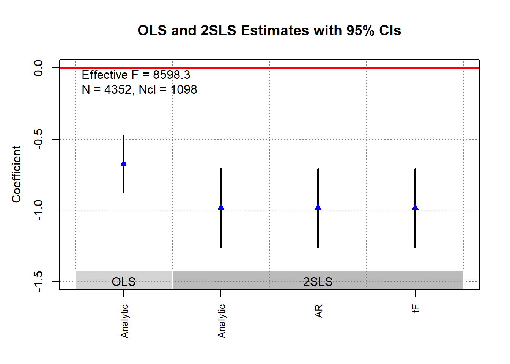

# Instrumental Variables {#sec-instrumental-variables}

In many empirical settings, we seek to estimate the causal effect of an explanatory variable $X$ on an outcome variable $Y$. A common starting point is the [Ordinary Least Squares] regression:

$$ Y = \beta_0 + \beta_1 X + \varepsilon. $$

For OLS to provide an unbiased and consistent estimate of $\beta_1$, the explanatory variable $X$ must satisfy the *exogeneity condition*:

$$ \mathbb{E}[\varepsilon \mid X] = 0. $$

However, when $X$ is correlated with the error term $\varepsilon$, this assumption is violated, leading to *endogeneity*. As a result, the OLS estimator is biased and inconsistent. Common causes of endogeneity include:

-   Omitted Variable Bias (OVB): When a relevant variable is omitted from the regression, leading to correlation between $X$ and $\varepsilon$.
-   Simultaneity: When $X$ and $Y$ are jointly determined, such as in supply-and-demand models.
-   Measurement Error: Errors in measuring $X$ introduce bias in estimation.
    -   Attenuation Bias in Errors-in-Variables: measurement error in the independent variable leads to an underestimate of the true effect (biasing the coefficient toward zero).

Instrumental Variables (IV) estimation addresses endogeneity by introducing an instrument $Z$ that affects $Y$ *only* through $X$. Similar to [RCT](#sec-experimental-design), we try to introduce randomization (random assignment to treatment) to our treatment variable by using only variation in the instrument.

Logic of using an instrument:

-   Use only exogenous variation to see the variation in treatment (try to exclude all endogenous variation in the treatment)

-   Use only exogenous variation to see the variation in outcome (try to exclude all endogenous variation in the outcome)

-   See the relationship between treatment and outcome in terms of residual variations that are exogenous to omitted variables.

For an instrument $Z$ to be valid, it must satisfy two conditions:

1.  Relevance Condition: The instrument $Z$ must be correlated with the endogenous variable $X$: $$ \text{Cov}(Z, X) \neq 0. $$

2.  Exogeneity Condition (Exclusion Restriction): The instrument $Z$ must be uncorrelated with the error term $\varepsilon$ and affect $Y$ *only* through $X$: $$ \text{Cov}(Z, \varepsilon) = 0. $$

These conditions ensure that $Z$ provides exogenous variation in $X$, allowing us to isolate the causal effect of $X$ on $Y$.

These conditions ensure that $Z$ provides exogenous variation in $X$, allowing us to estimate the causal effect of $X$ on $Y$. [Random assignment](#sec-the-gold-standard-randomized-controlled-trials) of $Z$ helps ensure exogeneity, but we must also confirm that $Z$ influences $Y$ *only* through $X$ to satisfy the exclusion restriction.

The IV approach dates back to early econometric research in the 1920s and 1930s, with a significant role in Cowles Commission studies on simultaneous equations. Key contributions include:

-   @wright1928tariff: One of the earliest applications, studying supply and demand for pig iron.
-   @angrist1991sources: Popularized IV methods using quarter-of-birth as an instrument for education.

The *credibility revolution* in econometrics (1990s--2000s) led to widespread use of IVs in applied research, particularly in economics, political science, and epidemiology.

## Challenges with Instrumental Variables

While IVs can provide a solution to endogeneity, several challenges arise:

-   Exclusion Restriction Violations: If $Z$ affects $Y$ through any channel other than $X$, the IV estimate is biased.
-   Repeated Use of Instruments: Common instruments, such as weather or policy changes, may be invalid due to their widespread application across studies [@gallen2020broken]. One needs to test for invalid instruments (Hausman-like test).
    -   A notable example is @mellon2021rain, who documents that *289 social sciences studies* have used weather as an instrument for 195 variables, raising concerns about exclusion violations.
-   Heterogeneous Treatment Effects: The Local Average Treatment Effect (LATE) estimated by IV applies only to *compliers*---units whose treatment status is affected by the instrument.
-   Weak Instruments: Too little correlation with the endogenous regressor yields unstable estimates.
-   Invalid Instruments: If the instrument violates exogeneity, your results are inconsistent.
-   Interpretation Mistakes: The IV identifies *only* the effect for those "marginal" units whose treatment status is driven by the instrument.

------------------------------------------------------------------------

## Framework for Instrumental Variables

We consider a binary treatment framework where:

-   $D_i \sim Bernoulli(p)$ is a dummy treatment variable.

-   $(Y_{0i}, Y_{1i})$ are the potential outcomes under control and treatment.

-   The observed outcome is: $$ Y_i = Y_{0i} + (Y_{1i} - Y_{0i}) D_i. $$

-   We introduce an instrumental variable $Z_i$ satisfying: $$ Z_i \perp (Y_{0i}, Y_{1i}, D_{0i}, D_{1i}). $$

    -   This means $Z_i$ is independent of potential outcomes and potential treatment status.
    -   $Z_i$ must also be correlated with $D_i$ to satisfy the relevance condition.

### Constant-Treatment-Effect Model

Under the constant treatment effect assumption (i.e., the treatment effect is the same for all individuals),

$$
\begin{aligned}
Y_{0i} &= \alpha + \eta_i, \\
Y_{1i} - Y_{0i} &= \rho, \\
Y_i &= Y_{0i} + D_i (Y_{1i} - Y_{0i}) \\
    &= \alpha + \eta_i  + D_i \rho \\
    &= \alpha + \rho D_i + \eta_i.
\end{aligned}
$$

where:

-   $\eta_i$ captures individual-level heterogeneity.
-   $\rho$ is the constant treatment effect.

The problem with OLS estimation is that $D_i$ may be correlated with $\eta_i$, leading to endogeneity bias.

### Instrumental Variable Solution

A valid instrument $Z_i$ allows us to estimate the causal effect $\rho$ via:

$$
\begin{aligned}
\rho &= \frac{\text{Cov}(Y_i, Z_i)}{\text{Cov}(D_i, Z_i)} \\
     &= \frac{\text{Cov}(Y_i, Z_i) / V(Z_i) }{\text{Cov}(D_i, Z_i) / V(Z_i)} \\
     &= \frac{\text{Reduced form estimate}}{\text{First-stage estimate}} \\
     &= \frac{E[Y_i |Z_i = 1] - E[Y_i | Z_i = 0]}{E[D_i |Z_i = 1] - E[D_i | Z_i = 0 ]}.
\end{aligned}
$$

This ratio measures the treatment effect *only if* $Z_i$ is a valid instrument.

### Heterogeneous Treatment Effects and the LATE Framework

In a more general framework where treatment effects vary across individuals,

-   Define potential outcomes as: $$ Y_i(d,z) = \text{outcome for unit } i \text{ given } D_i = d, Z_i = z. $$

-   Define treatment status based on $Z_i$: $$ D_i = D_{0i} + Z_i (D_{1i} - D_{0i}). $$

    where:

    -   $D_{1i}$ is the treatment status when $Z_i = 1$.
    -   $D_{0i}$ is the treatment status when $Z_i = 0$.
    -   $D_{1i} - D_{0i}$ is the causal effect of $Z_i$ on $D_i$.

### Assumptions for LATE Identification

#### Independence (Instrument Randomization)

The instrument must be *as good as randomly assigned*:

$$ [\{Y_i(d,z); \forall d, z \}, D_{1i}, D_{0i} ] \perp Z_i. $$

This ensures that $Z_i$ is uncorrelated with potential outcomes and potential treatment status.

This assumption let the first-stage equation be the average causal effect of $Z_i$ on $D_i$

$$ \begin{aligned} E[D_i |Z_i = 1] - E[D_i | Z_i = 0] &= E[D_{1i} |Z_i = 1] - E[D_{0i} |Z_i = 0] \\ &= E[D_{1i} - D_{0i}] \end{aligned} $$

This assumption also is sufficient for a causal interpretation of the reduced form, where we see the effect of the instrument $Z_i$ on the outcome $Y_i$:

$$ E[Y_i |Z_i = 1 ] - E[Y_i|Z_i = 0] = E[Y_i (D_{1i}, Z_i = 1) - Y_i (D_{0i} , Z_i = 0)] $$

#### Exclusion Restriction

This is also known as the existence of the instrument assumption [@imbens1994identification]. The instrument should only affect $Y_i$ through $D_i$ (i.e., the treatment $D_i$ fully mediates the effect of $Z_i$ on $Y_i$):

$$ 
\begin{aligned}
Y_{1i} &= Y_i (1,1) = Y_i (1,0)\\
Y_{0i} &= Y_i (0,1) = Y_i (0,0)
\end{aligned}
$$

Under this assumption (and assume $Y_{1i, Y_{0i}}$ already satisfy the independence assumption), the observed outcome $Y_i$ can be rewritten as:

$$
\begin{aligned}
  Y_i &= Y_i (0, Z_i) + [Y_i (1 , Z_i) - Y_i (0, Z_i)] D_i \\
      &= Y_{0i} + (Y_{1i} - Y_{0i}) D_i.
  \end{aligned}
$$

This assumption let us go from reduced-form causal effects to treatment effects [@angrist1995two].

#### Monotonicity (No Defiers)

We assume that $Z_i$ affects $D_i$ in a *monotonic* way:

$$ D_{1i} \geq D_{0i}, \quad \forall i. $$

-   This assumption lets us assume that there is a first stage, in which we examine the proportion of the population that $D_i$ is driven by $Z_i$. It implies that $Z_i$ only moves individuals *toward* treatment, but never away. This rules out "defiers" (i.e., individuals who would have taken the treatment when not assigned but refuse when assigned).
-   This assumption is used to solve to problem of the shifts between participation status back to non-participation status.
    -   Alternatively, one can solve the same problem by assuming constant (homogeneous) treatment effect [@imbens1994identification], but this is rather restrictive.

    -   A third solution is the assumption that there exists a value of the instrument, where the probability of participation conditional on that value is 0 [@heckman1990varieties, @angrist1991sources].

Under monotonicity,

$$
\begin{aligned}
  E[D_{1i} - D_{0i} ] = P[D_{1i} > D_{0i}].
  \end{aligned}
$$

### Local Average Treatment Effect Theorem

Given Independence, Exclusion, and Monotonicity, we obtain the LATE result [@angrist2009mostly, 4.4.1]:

$$
\begin{aligned}
\frac{E[Y_i | Z_i = 1] - E[Y_i | Z_i = 0]}{E[D_i |Z_i = 1] - E[D_i |Z_i = 0]} = E[Y_{1i} - Y_{0i} | D_{1i} > D_{0i}].
\end{aligned}
$$

This states that the IV estimator recovers the causal effect *only for compliers*---units whose treatment status changes due to $Z_i$.

IV only identifies treatment effects for switchers (compliers):

| Switcher Type | Compliance Type | Definition                                                        |
|--------------|--------------|-------------------------------------------|
| Switchers     | Compliers       | $D_{1i} > D_{0i}$ (take treatment if $Z_i = 1$, not if $Z_i = 0$) |
| Non-switchers | Always-Takers   | $D_{1i} = D_{0i} = 1$ (always take treatment)                     |
| Non-switchers | Never-Takers    | $D_{1i} = D_{0i} = 0$ (never take treatment)                      |

-   IV estimates nothing for always-takers and never-takers since their treatment status is unaffected by $Z_i$ (Similar to the fixed-effects models).

### IV in Randomized Trials (Noncompliance)

-   In randomized trials, if compliance is imperfect (i.e., compliance is voluntary), where individuals in the treatment group will not always take the treatment (e.g., selection bias), intention-to-treat (ITT) estimates are valid but contaminated by noncompliance.
-   IV estimation using [random assignment](#sec-the-gold-standard-randomized-controlled-trials) ($Z_i$) as an instrument for actual treatment received ($D_i$) recovers the LATE.

$$
\begin{aligned}
\frac{E[Y_i |Z_i = 1] - E[Y_i |Z_i = 0]}{E[D_i |Z_i = 1]} = \frac{\text{Intent-to-Treat Effect}}{\text{Compliance Rate}} = E[Y_{1i} - Y_{0i} |D_i = 1].
\end{aligned}
$$

Under full compliance, LATE = Treatment Effect on the Treated (TOT).

------------------------------------------------------------------------

## Estimation {#sec-estimation}

### Two-Stage Least Squares Estimation {#sec-two-stage-least-squares-estimation}

Two-Stage Least Squares (2SLS) is the most widely used IV estimator It's a special case of [IV-GMM]. Consider the structural equation:

$$
Y_i = X_i \beta + \varepsilon_i,
$$

where $X_i$ is endogenous. We introduce an instrument $Z_i$ satisfying:

1.  Relevance: $Z_i$ is correlated with $X_i$.
2.  Exogeneity: $Z_i$ is uncorrelated with $\varepsilon_i$.

2SLS Steps

1.  First-Stage Regression: Predict $X_i$ using the instrument: $$
    X_i = \pi_0 + \pi_1 Z_i + v_i.
    $$

    -   Obtain fitted values $\hat{X}_i = \pi_0 + \pi_1 Z_i$.

2.  Second-Stage Regression: Use $\hat{X}_i$ in place of $X_i$: $$
    Y_i = \beta_0 + \beta_1 \hat{X}_i + \varepsilon_i.
    $$

    -   The estimated $\hat{\beta}_1$ is our IV estimator.


``` r
library(fixest)
base = iris
names(base) = c("y", "x1", "x_endo_1", "x_inst_1", "fe")
set.seed(2)
base$x_inst_2 = 0.2 * base$y + 0.2 * base$x_endo_1 + rnorm(150, sd = 0.5)
base$x_endo_2 = 0.2 * base$y - 0.2 * base$x_inst_1 + rnorm(150, sd = 0.5)

# IV Estimation
est_iv = feols(y ~ x1 | x_endo_1 + x_endo_2 ~ x_inst_1 + x_inst_2, base)
summary(est_iv)
#> TSLS estimation - Dep. Var.: y
#>                   Endo.    : x_endo_1, x_endo_2
#>                   Instr.   : x_inst_1, x_inst_2
#> Second stage: Dep. Var.: y
#> Observations: 150
#> Standard-errors: IID 
#>              Estimate Std. Error  t value   Pr(>|t|)    
#> (Intercept)  1.831380   0.411435  4.45121 1.6844e-05 ***
#> fit_x_endo_1 0.444982   0.022086 20.14744  < 2.2e-16 ***
#> fit_x_endo_2 0.639916   0.307376  2.08186 3.9100e-02 *  
#> x1           0.565095   0.084715  6.67051 4.9180e-10 ***
#> ---
#> Signif. codes:  0 '***' 0.001 '**' 0.01 '*' 0.05 '.' 0.1 ' ' 1
#> RMSE: 0.398842   Adj. R2: 0.761653
#> F-test (1st stage), x_endo_1: stat = 903.2    , p < 2.2e-16 , on 2 and 146 DoF.
#> F-test (1st stage), x_endo_2: stat =   3.25828, p = 0.041268, on 2 and 146 DoF.
#>                   Wu-Hausman: stat =   6.79183, p = 0.001518, on 2 and 144 DoF.
```

Diagnostic Tests

To assess instrument validity:


``` r
fitstat(est_iv, type = c("n", "f", "ivf", "ivf1", "ivf2", "ivwald", "cd"))
#>                 Observations: 150
#>                       F-test: stat = 132.0    , p < 2.2e-16 , on 3 and 146 DoF.
#> F-test (1st stage), x_endo_1: stat = 903.2    , p < 2.2e-16 , on 2 and 146 DoF.
#> F-test (1st stage), x_endo_2: stat =   3.25828, p = 0.041268, on 2 and 146 DoF.
#>           F-test (2nd stage): stat = 194.2    , p < 2.2e-16 , on 2 and 146 DoF.
#> Wald (1st stage), x_endo_1  : stat = 903.2    , p < 2.2e-16 , on 2 and 146 DoF, VCOV: IID.
#> Wald (1st stage), x_endo_2  : stat =   3.25828, p = 0.041268, on 2 and 146 DoF, VCOV: IID.
#>                 Cragg-Donald: 3.11162
```

To set default printing


``` r
# always add second-stage Wald test
setFixest_print(fitstat = ~ . + ivwald2)
est_iv
```

To see results from different stages


``` r
# first-stage
summary(est_iv, stage = 1)

# second-stage
summary(est_iv, stage = 2)

# both stages
etable(summary(est_iv, stage = 1:2), fitstat = ~ . + ivfall + ivwaldall.p)
etable(summary(est_iv, stage = 2:1), fitstat = ~ . + ivfall + ivwaldall.p)
# .p means p-value, not statistic
# `all` means IV only
```

### IV-GMM

The Generalized Method of Moments (GMM) provides a flexible estimation framework that generalizes the Instrumental Variables (IV) approach, including [2SLS](#sec-two-stage-least-squares-estimation) as a special case. The key idea behind GMM is to use moment conditions derived from economic models to estimate parameters efficiently, even in the presence of endogeneity.

Consider the standard linear regression model:

$$
Y = X\beta + u, \quad u \sim (0, \Omega)
$$

where:

-   $Y$ is an $N \times 1$ vector of the dependent variable.
-   $X$ is an $N \times k$ matrix of endogenous regressors.
-   $\beta$ is a $k \times 1$ vector of coefficients.
-   $u$ is an $N \times 1$ vector of error terms.
-   $\Omega$ is the variance-covariance matrix of $u$.

To address endogeneity in $X$, we introduce an $N \times l$ matrix of instruments, $Z$, where $l \geq k$. The moment conditions are then given by:

$$
E[Z_i' u_i] = E[Z_i' (Y_i - X_i \beta)] = 0.
$$

In practice, these expectations are replaced by their sample analogs. The empirical moment conditions are given by:

$$
\bar{g}(\beta) = \frac{1}{N} \sum_{i=1}^{N} Z_i' (Y_i - X_i \beta) = \frac{1}{N} Z' (Y - X\beta).
$$

GMM estimates $\beta$ by minimizing a quadratic function of these sample moments.

------------------------------------------------------------------------

#### IV and GMM Estimators

1.  Exactly Identified Case ($l = k$)

When the number of instruments equals the number of endogenous regressors ($l = k$), the moment conditions uniquely determine $\beta$. In this case, the IV estimator is:

$$
\hat{\beta}_{IV} = (Z'X)^{-1}Z'Y.
$$

This is equivalent to the classical 2SLS estimator.

2.  Overidentified Case ($l > k$)

When there are more instruments than endogenous variables ($l > k$), the system has more moment conditions than parameters. In this case, we project $X$ onto the instrument space:

$$
\hat{X} = Z(Z'Z)^{-1} Z' X = P_Z X.
$$

The 2SLS estimator is then given by:

$$
\begin{aligned}
\hat{\beta}_{2SLS} &= (\hat{X}'X)^{-1} \hat{X}' Y \\
&= (X'P_Z X)^{-1} X' P_Z Y.
\end{aligned}
$$

However, 2SLS does not optimally weight the instruments when $l > k$. The IV-GMM approach resolves this issue.

------------------------------------------------------------------------

#### IV-GMM Estimation

The GMM estimator is obtained by minimizing the objective function:

$$
J (\hat{\beta}_{GMM} ) = N \bar{g}(\hat{\beta}_{GMM})' W \bar{g} (\hat{\beta}_{GMM}),
$$

where $W$ is an $l \times l$ symmetric weighting matrix.

For the IV-GMM estimator, solving the first-order conditions yields:

$$
\hat{\beta}_{GMM} = (X'ZWZ' X)^{-1} X'ZWZ'Y.
$$

For any weighting matrix $W$, this is a consistent estimator. The optimal choice of $W$ is $S^{-1}$, where $S$ is the covariance matrix of the moment conditions:

$$
S = E[Z' u u' Z] = \lim_{N \to \infty} N^{-1} [Z' \Omega Z].
$$

A feasible estimator replaces $S$ with its sample estimate from the 2SLS residuals:

$$
\hat{\beta}_{FEGMM} = (X'Z \hat{S}^{-1} Z' X)^{-1} X'Z \hat{S}^{-1} Z'Y.
$$

When $\Omega$ satisfies standard assumptions:

1.  Errors are independently and identically distributed.
2.  $S = \sigma_u^2 I_N$.
3.  The optimal weighting matrix is proportional to the identity matrix.

Then, the IV-GMM estimator simplifies to the standard IV (or 2SLS) estimator.

------------------------------------------------------------------------

Comparison of 2SLS and IV-GMM

| Feature                 | 2SLS                                   | IV-GMM                               |
|------------------|----------------------------|--------------------------|
| Instrument usage        | Uses a subset of available instruments | Uses all available instruments       |
| Weighting               | No weighting applied                   | Weights instruments for efficiency   |
| Efficiency              | Suboptimal in overidentified cases     | Efficient when $W = S^{-1}$          |
| Overidentification test | Not available                          | Uses Hansen's $J$-test (overid test) |

Key Takeaways:

-   Use IV-GMM whenever overidentification is a concern (i.e., $l > k$).
-   2SLS is a special case of IV-GMM when the weighting matrix is proportional to the identity matrix.
-   IV-GMM improves efficiency by optimally weighting the moment conditions.


``` r
# Standard approach

library(gmm)
gmm_model <- gmm(y ~ x1, ~ x_inst_1 + x_inst_2, data = base)
summary(gmm_model)
#> 
#> Call:
#> gmm(g = y ~ x1, x = ~x_inst_1 + x_inst_2, data = base)
#> 
#> 
#> Method:  twoStep 
#> 
#> Kernel:  Quadratic Spectral(with bw =  0.72368 )
#> 
#> Coefficients:
#>              Estimate     Std. Error   t value      Pr(>|t|)   
#> (Intercept)   1.4385e+01   1.8960e+00   7.5871e+00   3.2715e-14
#> x1           -2.7506e+00   6.2101e-01  -4.4292e+00   9.4584e-06
#> 
#> J-Test: degrees of freedom is 1 
#>                 J-test     P-value  
#> Test E(g)=0:    7.9455329  0.0048206
#> 
#> Initial values of the coefficients
#> (Intercept)          x1 
#>   16.117875   -3.360622
```

------------------------------------------------------------------------

#### Overidentification Test: Hansen's $J$-Statistic

A key advantage of IV-GMM is that it allows testing of instrument validity through the Hansen $J$-test (also known as the GMM distance test or Hayashi's C-statistic). The test statistic is:

$$
J = N \bar{g}(\hat{\beta}_{GMM})' \hat{S}^{-1} \bar{g} (\hat{\beta}_{GMM}),
$$

which follows a $\chi^2$ distribution with degrees of freedom equal to the number of overidentifying restrictions ($l - k$). A significant $J$-statistic suggests that the instruments may not be valid.

------------------------------------------------------------------------

#### Cluster-Robust Standard Errors

In empirical applications, errors often exhibit heteroskedasticity or intra-group correlation (clustering), violating the assumption of independently and identically distributed errors. Standard IV-GMM estimators remain consistent but may not be efficient if clustering is ignored.

To address this, we adjust the GMM weighting matrix by incorporating cluster-robust variance estimation. Specifically, the covariance matrix of the moment conditions $S$ is estimated as:

$$
\hat{S} = \frac{1}{N} \sum_{c=1}^{C} \left( \sum_{i \in c} Z_i' u_i \right) \left( \sum_{i \in c} Z_i' u_i \right)',
$$

where:

-   $C$ is the number of clusters,

-   $i \in c$ represents observations belonging to cluster $c$,

-   $u_i$ is the residual for observation $i$,

-   $Z_i$ is the vector of instruments.

Using this robust weighting matrix, we compute a clustered GMM estimator that remains consistent and improves inference when clustering is present.

------------------------------------------------------------------------


``` r
# Load required packages
library(gmm)
library(dplyr)
library(MASS)  # For generalized inverse if needed

# General IV-GMM function with clustering
gmmcl <- function(formula, instruments, data, cluster_var, lambda = 1e-6) {
  
  # Ensure cluster_var exists in data
  if (!(cluster_var %in% colnames(data))) {
    stop("Error: Cluster variable not found in data.")
  }
  
  # Step 1: Initial GMM estimation (identity weighting matrix)
  initial_gmm <- gmm(formula, instruments, data = data, vcov = "TrueFixed", 
                      weightsMatrix = diag(ncol(model.matrix(instruments, data))))
  
  # Extract residuals
  u_hat <- residuals(initial_gmm)
  
  # Matrix of instruments
  Z <- model.matrix(instruments, data)
  
  # Ensure clusters are treated as a factor
  data[[cluster_var]] <- as.factor(data[[cluster_var]])
  
  # Compute clustered weighting matrix
  cluster_groups <- split(seq_along(u_hat), data[[cluster_var]])
  
  # Remove empty clusters (if any)
  cluster_groups <- cluster_groups[lengths(cluster_groups) > 0]
  
  # Initialize cluster-based covariance matrix
  S_cluster <- matrix(0, ncol(Z), ncol(Z))  # Zero matrix
  
  # Compute clustered weight matrix
  for (indices in cluster_groups) {
    if (length(indices) > 0) {  # Ensure valid clusters
      u_cluster <- matrix(u_hat[indices], ncol = 1)  # Convert to column matrix
      Z_cluster <- Z[indices, , drop = FALSE]        # Keep matrix form
      S_cluster <- S_cluster + t(Z_cluster) %*% (u_cluster %*% t(u_cluster)) %*% Z_cluster
    }
  }
  
  # Normalize by sample size
  S_cluster <- S_cluster / nrow(data)
  
  # Ensure S_cluster is invertible
  S_cluster <- S_cluster + lambda * diag(ncol(S_cluster))  # Regularization

  # Compute inverse or generalized inverse if needed
  if (qr(S_cluster)$rank < ncol(S_cluster)) {
    S_cluster_inv <- ginv(S_cluster)  # Use generalized inverse (MASS package)
  } else {
    S_cluster_inv <- solve(S_cluster)
  }

  # Step 2: GMM estimation using clustered weighting matrix
  final_gmm <- gmm(formula, instruments, data = data, vcov = "TrueFixed", 
                    weightsMatrix = S_cluster_inv)
  
  return(final_gmm)
}

# Example: Simulated Data for IV-GMM with Clustering
set.seed(123)
n <- 200   # Total observations
C <- 50    # Number of clusters
data <- data.frame(
  cluster = rep(1:C, each = n / C),  # Cluster variable
  z1 = rnorm(n),
  z2 = rnorm(n),
  x1 = rnorm(n),
  y1 = rnorm(n)
)
data$x1 <- data$z1 + data$z2 + rnorm(n)  # Endogenous regressor
data$y1 <- data$x1 + rnorm(n)            # Outcome variable

# Run standard IV-GMM (without clustering)
gmm_results_standard <- gmm(y1 ~ x1, ~ z1 + z2, data = data)

# Run IV-GMM with clustering
gmm_results_clustered <- gmmcl(y1 ~ x1, ~ z1 + z2, data = data, cluster_var = "cluster")

# Display results for comparison
summary(gmm_results_standard)
#> 
#> Call:
#> gmm(g = y1 ~ x1, x = ~z1 + z2, data = data)
#> 
#> 
#> Method:  twoStep 
#> 
#> Kernel:  Quadratic Spectral(with bw =  1.09893 )
#> 
#> Coefficients:
#>              Estimate     Std. Error   t value      Pr(>|t|)   
#> (Intercept)   4.4919e-02   6.5870e-02   6.8193e-01   4.9528e-01
#> x1            9.8409e-01   4.4215e-02   2.2257e+01  9.6467e-110
#> 
#> J-Test: degrees of freedom is 1 
#>                 J-test  P-value
#> Test E(g)=0:    1.6171  0.2035 
#> 
#> Initial values of the coefficients
#> (Intercept)          x1 
#>  0.05138658  0.98580796
summary(gmm_results_clustered)
#> 
#> Call:
#> gmm(g = formula, x = instruments, vcov = "TrueFixed", weightsMatrix = S_cluster_inv, 
#>     data = data)
#> 
#> 
#> Method:  One step GMM with fixed W 
#> 
#> Kernel:  Quadratic Spectral
#> 
#> Coefficients:
#>              Estimate    Std. Error  t value     Pr(>|t|)  
#> (Intercept)  4.9082e-02  7.0878e-05  6.9249e+02  0.0000e+00
#> x1           9.8238e-01  5.2798e-05  1.8606e+04  0.0000e+00
#> 
#> J-Test: degrees of freedom is 1 
#>                 J-test   P-value
#> Test E(g)=0:    1247099        0
```

------------------------------------------------------------------------

### Limited Information Maximum Likelihood

LIML is an alternative to 2SLS that performs better when instruments are weak.

It solves: $$
\min_{\lambda} \left| \begin{bmatrix} Y - X\beta \\ \lambda (D - X\gamma) \end{bmatrix} \right|
$$ where $\lambda$ is an eigenvalue.

### Jackknife IV

JIVE reduces small-sample bias by leaving each observation out when estimating first-stage fitted values:

$$
\begin{aligned}
\hat{X}_i^{(-i)} &= Z_i (Z_{-i}'Z_{-i})^{-1} Z_{-i}'X_{-i}. \\
\hat{\beta}_{JIVE} &= (X^{(-i)'}X^{(-i)})^{-1}X^{(-i)'} Y
\end{aligned}
$$


``` r
library(AER)
jive_model = ivreg(y ~ x_endo_1 | x_inst_1, data = base, method = "jive")
summary(jive_model)
#> 
#> Call:
#> ivreg(formula = y ~ x_endo_1 | x_inst_1, data = base, method = "jive")
#> 
#> Residuals:
#>     Min      1Q  Median      3Q     Max 
#> -1.2390 -0.3022 -0.0206  0.2772  1.0039 
#> 
#> Coefficients:
#>             Estimate Std. Error t value Pr(>|t|)    
#> (Intercept)  4.34586    0.08096   53.68   <2e-16 ***
#> x_endo_1     0.39848    0.01964   20.29   <2e-16 ***
#> ---
#> Signif. codes:  0 '***' 0.001 '**' 0.01 '*' 0.05 '.' 0.1 ' ' 1
#> 
#> Residual standard error: 0.4075 on 148 degrees of freedom
#> Multiple R-Squared: 0.7595,	Adjusted R-squared: 0.7578 
#> Wald test: 411.6 on 1 and 148 DF,  p-value: < 2.2e-16
```

------------------------------------------------------------------------

### Control Function Approach

The Control Function (CF) approach, also known as two-stage residual inclusion (2SRI), is a method used to address endogeneity in regression models. This approach is particularly suited for models with nonadditive errors, such as discrete choice models or cases where both the endogenous variable and the outcome are binary.

The control function approach is particularly useful in:

-   Binary outcome and binary endogenous variable models:
    -   In rare events, the second stage typically uses a logistic model [@tchetgen2014note].
    -   In non-rare events, a risk ratio regression is often more appropriate.
-   Marketing applications:
    -   Used in consumer choice models to account for endogeneity in demand estimation [@petrin2010control].

The general model setup is:

$$
Y = g(X) + U  
$$

$$
X = \pi(Z) + V  
$$

with the key assumptions:

1.  Conditional mean independence:\
    $$E(U |Z,V) = E(U|V)$$\
    This implies that once we control for $V$, the instrumental variable $Z$ does not directly affect $U$.

2.  Instrument relevance:\
    $$E(V|Z) = 0$$\
    This ensures that $Z$ is a valid instrument for $X$.

Under the control function approach, the expectation of $Y$ conditional on $(Z,V)$ can be rewritten as:

$$
E(Y|Z,V) = g(X) + E(U|Z,V) = g(X) + E(U|V) = g(X) + h(V).
$$

Here, $h(V)$ is the control function that captures endogeneity through the first-stage residuals.

#### Implementation

Rather than replacing the endogenous variable $X_i$ with its predicted value $\hat{X}_i$, the CF approach explicitly incorporates the residuals from the first-stage regression:

Stage 1: Estimate First-Stage Residuals

Estimate the endogenous variable using its instrumental variables:

$$
X_i = Z_i \pi + v_i.
$$

Obtain the residuals:

$$
\hat{v}_i = X_i - Z_i \hat{\pi}.
$$

Stage 2: Include Residuals in Outcome Equation

Regress the outcome variable on $X_i$ and the first-stage residuals:

$$
Y_i = X_i \beta + \gamma \hat{v}_i + \varepsilon_i.
$$

If endogeneity is present, $\gamma \neq 0$; otherwise, the endogenous regressor $X$ would be exogenous.

#### Comparison to Two-Stage Least Squares

The control function method differs from [2SLS](#sec-two-stage-least-squares-estimation) depending on whether the model is linear or nonlinear:

1.  Linear Endogenous Variables:
    -   When both $X$ and $Y$ are continuous, the CF approach is equivalent to 2SLS.
2.  Nonlinear Endogenous Variables:
    -   If $X$ is nonlinear (e.g., a binary treatment), CF differs from 2SLS and often performs better.
3.  Nonlinear in Parameters:
    -   In models where $g(X)$ is nonlinear (e.g., logit/probit models), CF is typically superior to 2SLS because it explicitly models endogeneity via the control function $h(V)$.


``` r
library(fixest)
library(tidyverse)
library(modelsummary)

# Set the seed for reproducibility
set.seed(123)
n = 1000
# Generate the exogenous variable from a normal distribution
exogenous <- rnorm(n, mean = 5, sd = 1)

# Generate the omitted variable as a function of the exogenous variable
omitted <- rnorm(n, mean = 2, sd = 1)

# Generate the endogenous variable as a function of the omitted variable and the exogenous variable
endogenous <- 5 * omitted + 2 * exogenous + rnorm(n, mean = 0, sd = 1)

# nonlinear endogenous variable
endogenous_nonlinear <- 5 * omitted^2 + 2 * exogenous + rnorm(100, mean = 0, sd = 1)

unrelated <- rexp(n, rate = 1)

# Generate the response variable as a function of the endogenous variable and the omitted variable
response <- 4 +  3 * endogenous + 6 * omitted + rnorm(n, mean = 0, sd = 1)

response_nonlinear <- 4 +  3 * endogenous_nonlinear + 6 * omitted + rnorm(n, mean = 0, sd = 1)

response_nonlinear_para <- 4 +  3 * endogenous ^ 2 + 6 * omitted + rnorm(n, mean = 0, sd = 1)


# Combine the variables into a data frame
my_data <-
    data.frame(
        exogenous,
        omitted,
        endogenous,
        response,
        unrelated,
        response,
        response_nonlinear,
        response_nonlinear_para
    )

# View the first few rows of the data frame
# head(my_data)

wo_omitted <- feols(response ~ endogenous + sw0(unrelated), data = my_data)
w_omitted  <- feols(response ~ endogenous + omitted + unrelated, data = my_data)


# ivreg::ivreg(response ~ endogenous + unrelated | exogenous, data = my_data)
iv <- feols(response ~ 1 + sw0(unrelated) | endogenous ~ exogenous, data = my_data)

etable(
    wo_omitted,
    w_omitted,
    iv, 
    digits = 2
    # vcov = list("each", "iid", "hetero")
)
#>                   wo_omitted.1   wo_omitted.2     w_omitted          iv.1
#> Dependent Var.:       response       response      response      response
#>                                                                          
#> Constant        -3.8*** (0.30) -3.6*** (0.31) 3.9*** (0.16) 12.0*** (1.4)
#> endogenous       4.0*** (0.01)  4.0*** (0.01) 3.0*** (0.01) 3.2*** (0.07)
#> unrelated                       -0.14. (0.08)  -0.02 (0.03)              
#> omitted                                       6.0*** (0.08)              
#> _______________ ______________ ______________ _____________ _____________
#> S.E. type                  IID            IID           IID           IID
#> Observations             1,000          1,000         1,000         1,000
#> R2                     0.98756        0.98760       0.99817       0.94976
#> Adj. R2                0.98755        0.98757       0.99816       0.94971
#> 
#>                          iv.2
#> Dependent Var.:      response
#>                              
#> Constant        12.2*** (1.4)
#> endogenous      3.2*** (0.07)
#> unrelated       -0.28. (0.16)
#> omitted                      
#> _______________ _____________
#> S.E. type                 IID
#> Observations            1,000
#> R2                    0.95010
#> Adj. R2               0.95000
#> ---
#> Signif. codes: 0 '***' 0.001 '**' 0.01 '*' 0.05 '.' 0.1 ' ' 1
```

Linear in parameter and linear in endogenous variable


``` r
# manual
# 2SLS
first_stage = lm(endogenous ~ exogenous, data = my_data)
new_data = cbind(my_data, new_endogenous = predict(first_stage, my_data))
second_stage = lm(response ~ new_endogenous, data = new_data)
summary(second_stage)
#> 
#> Call:
#> lm(formula = response ~ new_endogenous, data = new_data)
#> 
#> Residuals:
#>     Min      1Q  Median      3Q     Max 
#> -68.126 -14.949   0.608  15.099  73.842 
#> 
#> Coefficients:
#>                Estimate Std. Error t value Pr(>|t|)    
#> (Intercept)     11.9910     5.7671   2.079   0.0379 *  
#> new_endogenous   3.2097     0.2832  11.335   <2e-16 ***
#> ---
#> Signif. codes:  0 '***' 0.001 '**' 0.01 '*' 0.05 '.' 0.1 ' ' 1
#> 
#> Residual standard error: 21.49 on 998 degrees of freedom
#> Multiple R-squared:  0.1141,	Adjusted R-squared:  0.1132 
#> F-statistic: 128.5 on 1 and 998 DF,  p-value: < 2.2e-16

new_data_cf = cbind(my_data, residual = resid(first_stage))
second_stage_cf = lm(response ~ endogenous + residual, data = new_data_cf)
summary(second_stage_cf)
#> 
#> Call:
#> lm(formula = response ~ endogenous + residual, data = new_data_cf)
#> 
#> Residuals:
#>     Min      1Q  Median      3Q     Max 
#> -5.1039 -1.0065  0.0247  0.9480  4.2521 
#> 
#> Coefficients:
#>             Estimate Std. Error t value Pr(>|t|)    
#> (Intercept) 11.99102    0.39849   30.09   <2e-16 ***
#> endogenous   3.20974    0.01957  164.05   <2e-16 ***
#> residual     0.95036    0.02159   44.02   <2e-16 ***
#> ---
#> Signif. codes:  0 '***' 0.001 '**' 0.01 '*' 0.05 '.' 0.1 ' ' 1
#> 
#> Residual standard error: 1.485 on 997 degrees of freedom
#> Multiple R-squared:  0.9958,	Adjusted R-squared:  0.9958 
#> F-statistic: 1.175e+05 on 2 and 997 DF,  p-value: < 2.2e-16

modelsummary(list(second_stage, second_stage_cf))
```


```{=html}
<!-- preamble start -->

    <script>

      function styleCell_bcyeklf5s9it3st59pct(i, j, css_id) {
          var table = document.getElementById("tinytable_bcyeklf5s9it3st59pct");
          var cell = table.rows[i]?.cells[j];  // Safe navigation to avoid errors
          if (cell) {
              console.log(`Styling cell at (${i}, ${j}) with class ${css_id}`);
              cell.classList.add(css_id);
          } else {
              console.warn(`Cell at (${i}, ${j}) not found.`);
          }
      }
      function insertSpanRow(i, colspan, content) {
        var table = document.getElementById('tinytable_bcyeklf5s9it3st59pct');
        var newRow = table.insertRow(i);
        var newCell = newRow.insertCell(0);
        newCell.setAttribute("colspan", colspan);
        // newCell.innerText = content;
        // this may be unsafe, but innerText does not interpret <br>
        newCell.innerHTML = content;
      }
      function spanCell_bcyeklf5s9it3st59pct(i, j, rowspan, colspan) {
        var table = document.getElementById("tinytable_bcyeklf5s9it3st59pct");
        const targetRow = table.rows[i];
        const targetCell = targetRow.cells[j];
        for (let r = 0; r < rowspan; r++) {
          // Only start deleting cells to the right for the first row (r == 0)
          if (r === 0) {
            // Delete cells to the right of the target cell in the first row
            for (let c = colspan - 1; c > 0; c--) {
              if (table.rows[i + r].cells[j + c]) {
                table.rows[i + r].deleteCell(j + c);
              }
            }
          }
          // For rows below the first, delete starting from the target column
          if (r > 0) {
            for (let c = colspan - 1; c >= 0; c--) {
              if (table.rows[i + r] && table.rows[i + r].cells[j]) {
                table.rows[i + r].deleteCell(j);
              }
            }
          }
        }
        // Set rowspan and colspan of the target cell
        targetCell.rowSpan = rowspan;
        targetCell.colSpan = colspan;
      }
      // tinytable span after
      window.addEventListener('load', function () {
          var cellsToStyle = [
            // tinytable style arrays after
          { positions: [ { i: 8, j: 1 }, { i: 8, j: 2 },  ], css_id: 'tinytable_css_r26r60ajssspwfmf290a',}, 
          { positions: [ { i: 0, j: 0 },  ], css_id: 'tinytable_css_piypxjc10jchlu8i8lum',}, 
          { positions: [ { i: 0, j: 1 }, { i: 0, j: 2 },  ], css_id: 'tinytable_css_nsd9p1h6lz5yped7732d',}, 
          { positions: [ { i: 16, j: 0 },  ], css_id: 'tinytable_css_mq7w75252rzirjsjyffa',}, 
          { positions: [ { i: 16, j: 1 }, { i: 16, j: 2 },  ], css_id: 'tinytable_css_loedou5fkndbhxj8rx6x',}, 
          { positions: [ { i: 1, j: 1 }, { i: 2, j: 1 }, { i: 3, j: 1 }, { i: 5, j: 1 }, { i: 6, j: 1 }, { i: 7, j: 1 }, { i: 4, j: 2 }, { i: 9, j: 1 }, { i: 10, j: 1 }, { i: 11, j: 1 }, { i: 12, j: 1 }, { i: 13, j: 1 }, { i: 14, j: 1 }, { i: 15, j: 1 }, { i: 12, j: 2 }, { i: 4, j: 1 }, { i: 1, j: 2 }, { i: 2, j: 2 }, { i: 3, j: 2 }, { i: 5, j: 2 }, { i: 6, j: 2 }, { i: 7, j: 2 }, { i: 9, j: 2 }, { i: 10, j: 2 }, { i: 11, j: 2 }, { i: 13, j: 2 }, { i: 14, j: 2 }, { i: 15, j: 2 },  ], css_id: 'tinytable_css_1au6c85u0y4nmlayzt6a',}, 
          { positions: [ { i: 1, j: 0 }, { i: 2, j: 0 }, { i: 3, j: 0 }, { i: 4, j: 0 }, { i: 5, j: 0 }, { i: 6, j: 0 }, { i: 7, j: 0 }, { i: 12, j: 0 }, { i: 9, j: 0 }, { i: 10, j: 0 }, { i: 11, j: 0 }, { i: 13, j: 0 }, { i: 14, j: 0 }, { i: 15, j: 0 },  ], css_id: 'tinytable_css_0wp6hnlpsdgp0nxz78wo',}, 
          { positions: [ { i: 8, j: 0 },  ], css_id: 'tinytable_css_01coubw8i75hkgsgfp9l',}, 
          ];

          // Loop over the arrays to style the cells
          cellsToStyle.forEach(function (group) {
              group.positions.forEach(function (cell) {
                  styleCell_bcyeklf5s9it3st59pct(cell.i, cell.j, group.css_id);
              });
          });
      });
    </script>

    <style>
      /* tinytable css entries after */
      .table td.tinytable_css_r26r60ajssspwfmf290a, .table th.tinytable_css_r26r60ajssspwfmf290a { text-align: center; border-bottom: solid black 0.05em; }
      .table td.tinytable_css_piypxjc10jchlu8i8lum, .table th.tinytable_css_piypxjc10jchlu8i8lum { text-align: left; border-top: solid #d3d8dc 0.1em; border-bottom: solid #d3d8dc 0.05em; }
      .table td.tinytable_css_nsd9p1h6lz5yped7732d, .table th.tinytable_css_nsd9p1h6lz5yped7732d { text-align: center; border-top: solid #d3d8dc 0.1em; border-bottom: solid #d3d8dc 0.05em; }
      .table td.tinytable_css_mq7w75252rzirjsjyffa, .table th.tinytable_css_mq7w75252rzirjsjyffa { text-align: left; border-bottom: solid #d3d8dc 0.1em; }
      .table td.tinytable_css_loedou5fkndbhxj8rx6x, .table th.tinytable_css_loedou5fkndbhxj8rx6x { text-align: center; border-bottom: solid #d3d8dc 0.1em; }
      .table td.tinytable_css_1au6c85u0y4nmlayzt6a, .table th.tinytable_css_1au6c85u0y4nmlayzt6a { text-align: center; }
      .table td.tinytable_css_0wp6hnlpsdgp0nxz78wo, .table th.tinytable_css_0wp6hnlpsdgp0nxz78wo { text-align: left; }
      .table td.tinytable_css_01coubw8i75hkgsgfp9l, .table th.tinytable_css_01coubw8i75hkgsgfp9l { text-align: left; border-bottom: solid black 0.05em; }
    </style>
    <div class="container">
      <table class="table table-borderless" id="tinytable_bcyeklf5s9it3st59pct" style="width: auto; margin-left: auto; margin-right: auto;" data-quarto-disable-processing='true'>
        <thead>
        
              <tr>
                <th scope="col"> </th>
                <th scope="col">(1)</th>
                <th scope="col">(2)</th>
              </tr>
        </thead>
        
        <tbody>
                <tr>
                  <td>(Intercept)</td>
                  <td>11.991</td>
                  <td>11.991</td>
                </tr>
                <tr>
                  <td></td>
                  <td>(5.767)</td>
                  <td>(0.398)</td>
                </tr>
                <tr>
                  <td>new_endogenous</td>
                  <td>3.210</td>
                  <td></td>
                </tr>
                <tr>
                  <td></td>
                  <td>(0.283)</td>
                  <td></td>
                </tr>
                <tr>
                  <td>endogenous</td>
                  <td></td>
                  <td>3.210</td>
                </tr>
                <tr>
                  <td></td>
                  <td></td>
                  <td>(0.020)</td>
                </tr>
                <tr>
                  <td>residual</td>
                  <td></td>
                  <td>0.950</td>
                </tr>
                <tr>
                  <td></td>
                  <td></td>
                  <td>(0.022)</td>
                </tr>
                <tr>
                  <td>Num.Obs.</td>
                  <td>1000</td>
                  <td>1000</td>
                </tr>
                <tr>
                  <td>R2</td>
                  <td>0.114</td>
                  <td>0.996</td>
                </tr>
                <tr>
                  <td>R2 Adj.</td>
                  <td>0.113</td>
                  <td>0.996</td>
                </tr>
                <tr>
                  <td>AIC</td>
                  <td>8977.0</td>
                  <td>3633.5</td>
                </tr>
                <tr>
                  <td>BIC</td>
                  <td>8991.8</td>
                  <td>3653.2</td>
                </tr>
                <tr>
                  <td>Log.Lik.</td>
                  <td>-4485.516</td>
                  <td>-1812.768</td>
                </tr>
                <tr>
                  <td>F</td>
                  <td>128.483</td>
                  <td>117473.460</td>
                </tr>
                <tr>
                  <td>RMSE</td>
                  <td>21.47</td>
                  <td>1.48</td>
                </tr>
        </tbody>
      </table>
    </div>
<!-- hack to avoid NA insertion in last line -->
```


Nonlinear in endogenous variable


``` r
# 2SLS
first_stage = lm(endogenous_nonlinear ~ exogenous, data = my_data)

new_data = cbind(my_data, new_endogenous_nonlinear = predict(first_stage, my_data))
second_stage = lm(response_nonlinear ~ new_endogenous_nonlinear, data = new_data)
summary(second_stage)
#> 
#> Call:
#> lm(formula = response_nonlinear ~ new_endogenous_nonlinear, data = new_data)
#> 
#> Residuals:
#>     Min      1Q  Median      3Q     Max 
#> -101.26  -53.01  -13.50   39.33  376.16 
#> 
#> Coefficients:
#>                          Estimate Std. Error t value Pr(>|t|)    
#> (Intercept)               11.7539    21.6478   0.543    0.587    
#> new_endogenous_nonlinear   3.1253     0.5993   5.215 2.23e-07 ***
#> ---
#> Signif. codes:  0 '***' 0.001 '**' 0.01 '*' 0.05 '.' 0.1 ' ' 1
#> 
#> Residual standard error: 70.89 on 998 degrees of freedom
#> Multiple R-squared:  0.02653,	Adjusted R-squared:  0.02555 
#> F-statistic:  27.2 on 1 and 998 DF,  p-value: 2.234e-07

new_data_cf = cbind(my_data, residual = resid(first_stage))
second_stage_cf = lm(response_nonlinear ~ endogenous_nonlinear + residual, data = new_data_cf)
summary(second_stage_cf)
#> 
#> Call:
#> lm(formula = response_nonlinear ~ endogenous_nonlinear + residual, 
#>     data = new_data_cf)
#> 
#> Residuals:
#>      Min       1Q   Median       3Q      Max 
#> -12.8559  -0.8337   0.4429   1.3432   4.3147 
#> 
#> Coefficients:
#>                      Estimate Std. Error t value Pr(>|t|)    
#> (Intercept)          11.75395    0.67012  17.540  < 2e-16 ***
#> endogenous_nonlinear  3.12525    0.01855 168.469  < 2e-16 ***
#> residual              0.13577    0.01882   7.213 1.08e-12 ***
#> ---
#> Signif. codes:  0 '***' 0.001 '**' 0.01 '*' 0.05 '.' 0.1 ' ' 1
#> 
#> Residual standard error: 2.194 on 997 degrees of freedom
#> Multiple R-squared:  0.9991,	Adjusted R-squared:  0.9991 
#> F-statistic: 5.344e+05 on 2 and 997 DF,  p-value: < 2.2e-16

modelsummary(list(second_stage, second_stage_cf))
```


```{=html}
<!-- preamble start -->

    <script>

      function styleCell_gunj3tvsvj2u9zwprcks(i, j, css_id) {
          var table = document.getElementById("tinytable_gunj3tvsvj2u9zwprcks");
          var cell = table.rows[i]?.cells[j];  // Safe navigation to avoid errors
          if (cell) {
              console.log(`Styling cell at (${i}, ${j}) with class ${css_id}`);
              cell.classList.add(css_id);
          } else {
              console.warn(`Cell at (${i}, ${j}) not found.`);
          }
      }
      function insertSpanRow(i, colspan, content) {
        var table = document.getElementById('tinytable_gunj3tvsvj2u9zwprcks');
        var newRow = table.insertRow(i);
        var newCell = newRow.insertCell(0);
        newCell.setAttribute("colspan", colspan);
        // newCell.innerText = content;
        // this may be unsafe, but innerText does not interpret <br>
        newCell.innerHTML = content;
      }
      function spanCell_gunj3tvsvj2u9zwprcks(i, j, rowspan, colspan) {
        var table = document.getElementById("tinytable_gunj3tvsvj2u9zwprcks");
        const targetRow = table.rows[i];
        const targetCell = targetRow.cells[j];
        for (let r = 0; r < rowspan; r++) {
          // Only start deleting cells to the right for the first row (r == 0)
          if (r === 0) {
            // Delete cells to the right of the target cell in the first row
            for (let c = colspan - 1; c > 0; c--) {
              if (table.rows[i + r].cells[j + c]) {
                table.rows[i + r].deleteCell(j + c);
              }
            }
          }
          // For rows below the first, delete starting from the target column
          if (r > 0) {
            for (let c = colspan - 1; c >= 0; c--) {
              if (table.rows[i + r] && table.rows[i + r].cells[j]) {
                table.rows[i + r].deleteCell(j);
              }
            }
          }
        }
        // Set rowspan and colspan of the target cell
        targetCell.rowSpan = rowspan;
        targetCell.colSpan = colspan;
      }
      // tinytable span after
      window.addEventListener('load', function () {
          var cellsToStyle = [
            // tinytable style arrays after
          { positions: [ { i: 1, j: 0 }, { i: 2, j: 0 }, { i: 3, j: 0 }, { i: 4, j: 0 }, { i: 5, j: 0 }, { i: 6, j: 0 }, { i: 7, j: 0 }, { i: 12, j: 0 }, { i: 9, j: 0 }, { i: 10, j: 0 }, { i: 11, j: 0 }, { i: 13, j: 0 }, { i: 14, j: 0 }, { i: 15, j: 0 },  ], css_id: 'tinytable_css_yy8ma1xswh7egpgnn4hn',}, 
          { positions: [ { i: 16, j: 0 },  ], css_id: 'tinytable_css_tpgrdq1fihx7tijhvcui',}, 
          { positions: [ { i: 0, j: 1 }, { i: 0, j: 2 },  ], css_id: 'tinytable_css_ln1kvxnxdqzz7ajcfv1q',}, 
          { positions: [ { i: 16, j: 1 }, { i: 16, j: 2 },  ], css_id: 'tinytable_css_joqirgo39649wwe8he46',}, 
          { positions: [ { i: 8, j: 0 },  ], css_id: 'tinytable_css_61l5drkaax3f6bc98ola',}, 
          { positions: [ { i: 1, j: 1 }, { i: 2, j: 1 }, { i: 3, j: 1 }, { i: 5, j: 1 }, { i: 6, j: 1 }, { i: 7, j: 1 }, { i: 4, j: 2 }, { i: 9, j: 1 }, { i: 10, j: 1 }, { i: 11, j: 1 }, { i: 12, j: 1 }, { i: 13, j: 1 }, { i: 14, j: 1 }, { i: 15, j: 1 }, { i: 12, j: 2 }, { i: 4, j: 1 }, { i: 1, j: 2 }, { i: 2, j: 2 }, { i: 3, j: 2 }, { i: 5, j: 2 }, { i: 6, j: 2 }, { i: 7, j: 2 }, { i: 9, j: 2 }, { i: 10, j: 2 }, { i: 11, j: 2 }, { i: 13, j: 2 }, { i: 14, j: 2 }, { i: 15, j: 2 },  ], css_id: 'tinytable_css_5ihhxya5a015v9xlg2cu',}, 
          { positions: [ { i: 0, j: 0 },  ], css_id: 'tinytable_css_33ogij62iys81ucr3onb',}, 
          { positions: [ { i: 8, j: 1 }, { i: 8, j: 2 },  ], css_id: 'tinytable_css_1pyfov7i1xroz6e7owob',}, 
          ];

          // Loop over the arrays to style the cells
          cellsToStyle.forEach(function (group) {
              group.positions.forEach(function (cell) {
                  styleCell_gunj3tvsvj2u9zwprcks(cell.i, cell.j, group.css_id);
              });
          });
      });
    </script>

    <style>
      /* tinytable css entries after */
      .table td.tinytable_css_yy8ma1xswh7egpgnn4hn, .table th.tinytable_css_yy8ma1xswh7egpgnn4hn { text-align: left; }
      .table td.tinytable_css_tpgrdq1fihx7tijhvcui, .table th.tinytable_css_tpgrdq1fihx7tijhvcui { text-align: left; border-bottom: solid #d3d8dc 0.1em; }
      .table td.tinytable_css_ln1kvxnxdqzz7ajcfv1q, .table th.tinytable_css_ln1kvxnxdqzz7ajcfv1q { text-align: center; border-top: solid #d3d8dc 0.1em; border-bottom: solid #d3d8dc 0.05em; }
      .table td.tinytable_css_joqirgo39649wwe8he46, .table th.tinytable_css_joqirgo39649wwe8he46 { text-align: center; border-bottom: solid #d3d8dc 0.1em; }
      .table td.tinytable_css_61l5drkaax3f6bc98ola, .table th.tinytable_css_61l5drkaax3f6bc98ola { text-align: left; border-bottom: solid black 0.05em; }
      .table td.tinytable_css_5ihhxya5a015v9xlg2cu, .table th.tinytable_css_5ihhxya5a015v9xlg2cu { text-align: center; }
      .table td.tinytable_css_33ogij62iys81ucr3onb, .table th.tinytable_css_33ogij62iys81ucr3onb { text-align: left; border-top: solid #d3d8dc 0.1em; border-bottom: solid #d3d8dc 0.05em; }
      .table td.tinytable_css_1pyfov7i1xroz6e7owob, .table th.tinytable_css_1pyfov7i1xroz6e7owob { text-align: center; border-bottom: solid black 0.05em; }
    </style>
    <div class="container">
      <table class="table table-borderless" id="tinytable_gunj3tvsvj2u9zwprcks" style="width: auto; margin-left: auto; margin-right: auto;" data-quarto-disable-processing='true'>
        <thead>
        
              <tr>
                <th scope="col"> </th>
                <th scope="col">(1)</th>
                <th scope="col">(2)</th>
              </tr>
        </thead>
        
        <tbody>
                <tr>
                  <td>(Intercept)</td>
                  <td>11.754</td>
                  <td>11.754</td>
                </tr>
                <tr>
                  <td></td>
                  <td>(21.648)</td>
                  <td>(0.670)</td>
                </tr>
                <tr>
                  <td>new_endogenous_nonlinear</td>
                  <td>3.125</td>
                  <td></td>
                </tr>
                <tr>
                  <td></td>
                  <td>(0.599)</td>
                  <td></td>
                </tr>
                <tr>
                  <td>endogenous_nonlinear</td>
                  <td></td>
                  <td>3.125</td>
                </tr>
                <tr>
                  <td></td>
                  <td></td>
                  <td>(0.019)</td>
                </tr>
                <tr>
                  <td>residual</td>
                  <td></td>
                  <td>0.136</td>
                </tr>
                <tr>
                  <td></td>
                  <td></td>
                  <td>(0.019)</td>
                </tr>
                <tr>
                  <td>Num.Obs.</td>
                  <td>1000</td>
                  <td>1000</td>
                </tr>
                <tr>
                  <td>R2</td>
                  <td>0.027</td>
                  <td>0.999</td>
                </tr>
                <tr>
                  <td>R2 Adj.</td>
                  <td>0.026</td>
                  <td>0.999</td>
                </tr>
                <tr>
                  <td>AIC</td>
                  <td>11364.2</td>
                  <td>4414.7</td>
                </tr>
                <tr>
                  <td>BIC</td>
                  <td>11378.9</td>
                  <td>4434.4</td>
                </tr>
                <tr>
                  <td>Log.Lik.</td>
                  <td>-5679.079</td>
                  <td>-2203.371</td>
                </tr>
                <tr>
                  <td>F</td>
                  <td>27.196</td>
                  <td>534439.006</td>
                </tr>
                <tr>
                  <td>RMSE</td>
                  <td>70.82</td>
                  <td>2.19</td>
                </tr>
        </tbody>
      </table>
    </div>
<!-- hack to avoid NA insertion in last line -->
```


Nonlinear in parameters


``` r
# 2SLS
first_stage = lm(endogenous ~ exogenous, data = my_data)

new_data = cbind(my_data, new_endogenous = predict(first_stage, my_data))
second_stage = lm(response_nonlinear_para ~ new_endogenous, data = new_data)
summary(second_stage)
#> 
#> Call:
#> lm(formula = response_nonlinear_para ~ new_endogenous, data = new_data)
#> 
#> Residuals:
#>      Min       1Q   Median       3Q      Max 
#> -1402.34  -462.21   -64.22   382.35  3090.62 
#> 
#> Coefficients:
#>                 Estimate Std. Error t value Pr(>|t|)    
#> (Intercept)    -1137.875    173.811  -6.547  9.4e-11 ***
#> new_endogenous   122.525      8.534  14.357  < 2e-16 ***
#> ---
#> Signif. codes:  0 '***' 0.001 '**' 0.01 '*' 0.05 '.' 0.1 ' ' 1
#> 
#> Residual standard error: 647.7 on 998 degrees of freedom
#> Multiple R-squared:  0.1712,	Adjusted R-squared:  0.1704 
#> F-statistic: 206.1 on 1 and 998 DF,  p-value: < 2.2e-16

new_data_cf = cbind(my_data, residual = resid(first_stage))
second_stage_cf = lm(response_nonlinear_para ~ endogenous_nonlinear + residual, data = new_data_cf)
summary(second_stage_cf)
#> 
#> Call:
#> lm(formula = response_nonlinear_para ~ endogenous_nonlinear + 
#>     residual, data = new_data_cf)
#> 
#> Residuals:
#>     Min      1Q  Median      3Q     Max 
#> -904.77 -154.35  -20.41  143.24  953.04 
#> 
#> Coefficients:
#>                      Estimate Std. Error t value Pr(>|t|)    
#> (Intercept)          492.2494    32.3530   15.21  < 2e-16 ***
#> endogenous_nonlinear  23.5991     0.8741   27.00  < 2e-16 ***
#> residual              30.5914     3.7397    8.18 8.58e-16 ***
#> ---
#> Signif. codes:  0 '***' 0.001 '**' 0.01 '*' 0.05 '.' 0.1 ' ' 1
#> 
#> Residual standard error: 245.9 on 997 degrees of freedom
#> Multiple R-squared:  0.8806,	Adjusted R-squared:  0.8804 
#> F-statistic:  3676 on 2 and 997 DF,  p-value: < 2.2e-16

modelsummary(list(second_stage, second_stage_cf))
```


```{=html}
<!-- preamble start -->

    <script>

      function styleCell_foncyue7l6n3r3g1l51p(i, j, css_id) {
          var table = document.getElementById("tinytable_foncyue7l6n3r3g1l51p");
          var cell = table.rows[i]?.cells[j];  // Safe navigation to avoid errors
          if (cell) {
              console.log(`Styling cell at (${i}, ${j}) with class ${css_id}`);
              cell.classList.add(css_id);
          } else {
              console.warn(`Cell at (${i}, ${j}) not found.`);
          }
      }
      function insertSpanRow(i, colspan, content) {
        var table = document.getElementById('tinytable_foncyue7l6n3r3g1l51p');
        var newRow = table.insertRow(i);
        var newCell = newRow.insertCell(0);
        newCell.setAttribute("colspan", colspan);
        // newCell.innerText = content;
        // this may be unsafe, but innerText does not interpret <br>
        newCell.innerHTML = content;
      }
      function spanCell_foncyue7l6n3r3g1l51p(i, j, rowspan, colspan) {
        var table = document.getElementById("tinytable_foncyue7l6n3r3g1l51p");
        const targetRow = table.rows[i];
        const targetCell = targetRow.cells[j];
        for (let r = 0; r < rowspan; r++) {
          // Only start deleting cells to the right for the first row (r == 0)
          if (r === 0) {
            // Delete cells to the right of the target cell in the first row
            for (let c = colspan - 1; c > 0; c--) {
              if (table.rows[i + r].cells[j + c]) {
                table.rows[i + r].deleteCell(j + c);
              }
            }
          }
          // For rows below the first, delete starting from the target column
          if (r > 0) {
            for (let c = colspan - 1; c >= 0; c--) {
              if (table.rows[i + r] && table.rows[i + r].cells[j]) {
                table.rows[i + r].deleteCell(j);
              }
            }
          }
        }
        // Set rowspan and colspan of the target cell
        targetCell.rowSpan = rowspan;
        targetCell.colSpan = colspan;
      }
      // tinytable span after
      window.addEventListener('load', function () {
          var cellsToStyle = [
            // tinytable style arrays after
          { positions: [ { i: 16, j: 1 }, { i: 16, j: 2 },  ], css_id: 'tinytable_css_tihu9oe35xyyz92hstch',}, 
          { positions: [ { i: 1, j: 0 }, { i: 2, j: 0 }, { i: 3, j: 0 }, { i: 4, j: 0 }, { i: 5, j: 0 }, { i: 6, j: 0 }, { i: 7, j: 0 }, { i: 12, j: 0 }, { i: 9, j: 0 }, { i: 10, j: 0 }, { i: 11, j: 0 }, { i: 13, j: 0 }, { i: 14, j: 0 }, { i: 15, j: 0 },  ], css_id: 'tinytable_css_o6pc4f1jgrgp52wz2ggn',}, 
          { positions: [ { i: 1, j: 1 }, { i: 2, j: 1 }, { i: 3, j: 1 }, { i: 5, j: 1 }, { i: 6, j: 1 }, { i: 7, j: 1 }, { i: 4, j: 2 }, { i: 9, j: 1 }, { i: 10, j: 1 }, { i: 11, j: 1 }, { i: 12, j: 1 }, { i: 13, j: 1 }, { i: 14, j: 1 }, { i: 15, j: 1 }, { i: 12, j: 2 }, { i: 4, j: 1 }, { i: 1, j: 2 }, { i: 2, j: 2 }, { i: 3, j: 2 }, { i: 5, j: 2 }, { i: 6, j: 2 }, { i: 7, j: 2 }, { i: 9, j: 2 }, { i: 10, j: 2 }, { i: 11, j: 2 }, { i: 13, j: 2 }, { i: 14, j: 2 }, { i: 15, j: 2 },  ], css_id: 'tinytable_css_o5jfz0tqf78ebq9js54k',}, 
          { positions: [ { i: 0, j: 0 },  ], css_id: 'tinytable_css_n7u3moaxtrudjoxfh383',}, 
          { positions: [ { i: 16, j: 0 },  ], css_id: 'tinytable_css_i7zp0qw8pja7p06kcigp',}, 
          { positions: [ { i: 0, j: 1 }, { i: 0, j: 2 },  ], css_id: 'tinytable_css_gkykmnb67lvy8jl1lfoq',}, 
          { positions: [ { i: 8, j: 1 }, { i: 8, j: 2 },  ], css_id: 'tinytable_css_3zrpj2g730jekm7mkx4a',}, 
          { positions: [ { i: 8, j: 0 },  ], css_id: 'tinytable_css_0pwmvz6w9h2w2su5ha81',}, 
          ];

          // Loop over the arrays to style the cells
          cellsToStyle.forEach(function (group) {
              group.positions.forEach(function (cell) {
                  styleCell_foncyue7l6n3r3g1l51p(cell.i, cell.j, group.css_id);
              });
          });
      });
    </script>

    <style>
      /* tinytable css entries after */
      .table td.tinytable_css_tihu9oe35xyyz92hstch, .table th.tinytable_css_tihu9oe35xyyz92hstch { text-align: center; border-bottom: solid #d3d8dc 0.1em; }
      .table td.tinytable_css_o6pc4f1jgrgp52wz2ggn, .table th.tinytable_css_o6pc4f1jgrgp52wz2ggn { text-align: left; }
      .table td.tinytable_css_o5jfz0tqf78ebq9js54k, .table th.tinytable_css_o5jfz0tqf78ebq9js54k { text-align: center; }
      .table td.tinytable_css_n7u3moaxtrudjoxfh383, .table th.tinytable_css_n7u3moaxtrudjoxfh383 { text-align: left; border-top: solid #d3d8dc 0.1em; border-bottom: solid #d3d8dc 0.05em; }
      .table td.tinytable_css_i7zp0qw8pja7p06kcigp, .table th.tinytable_css_i7zp0qw8pja7p06kcigp { text-align: left; border-bottom: solid #d3d8dc 0.1em; }
      .table td.tinytable_css_gkykmnb67lvy8jl1lfoq, .table th.tinytable_css_gkykmnb67lvy8jl1lfoq { text-align: center; border-top: solid #d3d8dc 0.1em; border-bottom: solid #d3d8dc 0.05em; }
      .table td.tinytable_css_3zrpj2g730jekm7mkx4a, .table th.tinytable_css_3zrpj2g730jekm7mkx4a { text-align: center; border-bottom: solid black 0.05em; }
      .table td.tinytable_css_0pwmvz6w9h2w2su5ha81, .table th.tinytable_css_0pwmvz6w9h2w2su5ha81 { text-align: left; border-bottom: solid black 0.05em; }
    </style>
    <div class="container">
      <table class="table table-borderless" id="tinytable_foncyue7l6n3r3g1l51p" style="width: auto; margin-left: auto; margin-right: auto;" data-quarto-disable-processing='true'>
        <thead>
        
              <tr>
                <th scope="col"> </th>
                <th scope="col">(1)</th>
                <th scope="col">(2)</th>
              </tr>
        </thead>
        
        <tbody>
                <tr>
                  <td>(Intercept)</td>
                  <td>-1137.875</td>
                  <td>492.249</td>
                </tr>
                <tr>
                  <td></td>
                  <td>(173.811)</td>
                  <td>(32.353)</td>
                </tr>
                <tr>
                  <td>new_endogenous</td>
                  <td>122.525</td>
                  <td></td>
                </tr>
                <tr>
                  <td></td>
                  <td>(8.534)</td>
                  <td></td>
                </tr>
                <tr>
                  <td>endogenous_nonlinear</td>
                  <td></td>
                  <td>23.599</td>
                </tr>
                <tr>
                  <td></td>
                  <td></td>
                  <td>(0.874)</td>
                </tr>
                <tr>
                  <td>residual</td>
                  <td></td>
                  <td>30.591</td>
                </tr>
                <tr>
                  <td></td>
                  <td></td>
                  <td>(3.740)</td>
                </tr>
                <tr>
                  <td>Num.Obs.</td>
                  <td>1000</td>
                  <td>1000</td>
                </tr>
                <tr>
                  <td>R2</td>
                  <td>0.171</td>
                  <td>0.881</td>
                </tr>
                <tr>
                  <td>R2 Adj.</td>
                  <td>0.170</td>
                  <td>0.880</td>
                </tr>
                <tr>
                  <td>AIC</td>
                  <td>15788.6</td>
                  <td>13853.1</td>
                </tr>
                <tr>
                  <td>BIC</td>
                  <td>15803.3</td>
                  <td>13872.7</td>
                </tr>
                <tr>
                  <td>Log.Lik.</td>
                  <td>-7891.307</td>
                  <td>-6922.553</td>
                </tr>
                <tr>
                  <td>F</td>
                  <td>206.123</td>
                  <td>3676.480</td>
                </tr>
                <tr>
                  <td>RMSE</td>
                  <td>647.01</td>
                  <td>245.58</td>
                </tr>
        </tbody>
      </table>
    </div>
<!-- hack to avoid NA insertion in last line -->
```


### Fuller and Bias-Reduced IV

Fuller adjusts LIML for bias reduction.


``` r
fuller_model = ivreg(y ~ x_endo_1 | x_inst_1, data = base, method = "fuller", k = 1)
summary(fuller_model)
#> 
#> Call:
#> ivreg(formula = y ~ x_endo_1 | x_inst_1, data = base, method = "fuller", 
#>     k = 1)
#> 
#> Residuals:
#>     Min      1Q  Median      3Q     Max 
#> -1.2390 -0.3022 -0.0206  0.2772  1.0039 
#> 
#> Coefficients:
#>             Estimate Std. Error t value Pr(>|t|)    
#> (Intercept)  4.34586    0.08096   53.68   <2e-16 ***
#> x_endo_1     0.39848    0.01964   20.29   <2e-16 ***
#> ---
#> Signif. codes:  0 '***' 0.001 '**' 0.01 '*' 0.05 '.' 0.1 ' ' 1
#> 
#> Residual standard error: 0.4075 on 148 degrees of freedom
#> Multiple R-Squared: 0.7595,	Adjusted R-squared: 0.7578 
#> Wald test: 411.6 on 1 and 148 DF,  p-value: < 2.2e-16
```

------------------------------------------------------------------------

## Asymptotic Properties of the IV Estimator

IV estimation provides consistent and asymptotically normal estimates of structural parameters under a specific set of assumptions. Understanding the asymptotic properties of the IV estimator requires clarity on the identification conditions and the large-sample behavior of the estimator.

Consider the linear structural model:

$$
Y = X \beta + u
$$

Where:

-   $Y$ is the dependent variable ($n \times 1$)

-   $X$ is a matrix of endogenous regressors ($n \times k$)

-   $u$ is the error term

-   $\beta$ is the parameter vector of interest ($k \times 1$)

Suppose we have a matrix of instruments $Z$ ($n \times m$), with $m \ge k$.

The **IV estimator** of $\beta$ is:

$$
\hat{\beta}_{IV} = (Z'X)^{-1} Z'Y
$$

Alternatively, when using **2SLS**, this is equivalent to:

$$
\hat{\beta}_{2SLS} = (X'P_ZX)^{-1} X'P_ZY
$$

Where:

-   $P_Z = Z (Z'Z)^{-1} Z'$ is the projection matrix onto the column space of $Z$.

### Consistency {#sec-consistency-iv}

For $\hat{\beta}_{IV}$ to be **consistent**, the following conditions must hold as $n \to \infty$:

1.  **Instrument Exogeneity**

$$
\mathbb{E}[Z'u] = 0
$$

-   Instruments must be uncorrelated with the structural error term.

-   Guarantees instrument validity.

2.  **Instrument Relevance**

$$
\mathrm{rank}(\mathbb{E}[Z'X]) = k
$$

-   Instruments must be correlated with the endogenous regressors.

-   Ensures identification of $\beta$.

-   If this fails, the model is underidentified, and $\hat{\beta}_{IV}$ does not converge to the true $\beta$.

3.  **Random Sampling (IID Observations)**

-   $\{(Y_i, X_i, Z_i)\}_{i=1}^n$ are independent and identically distributed (i.i.d.).
-   In more general settings, stationarity and mixing conditions can relax this.

4.  **Finite Moments**

-   $\mathbb{E}[||Z||^2] < \infty$ and $\mathbb{E}[||u||^2] < \infty$
-   Ensures [Law of Large Numbers] applies to sample moments.

If these conditions are satisfied: $$
\hat{\beta}_{IV} \overset{p}{\to} \beta
$$ This means the IV estimator is consistent.

### Asymptotic Normality

In addition to [consistency](#sec-consistency-iv) conditions, we require:

5.  **Homoskedasticity (Optional but Simplifying)**

$$
\mathbb{E}[u u' | Z] = \sigma^2 I
$$

-   Simplifies variance estimation.

-   If violated, heteroskedasticity-robust variance estimators must be used.

6.  **[Central Limit Theorem] Conditions**

-   Sample moments must satisfy a CLT: $$
    \sqrt{n} \left( \frac{1}{n} \sum_{i=1}^n Z_i u_i \right) \overset{d}{\to} N(0, \Omega)
    $$ Where $\Omega = \mathbb{E}[Z_i Z_i' u_i^2]$.

Under the above conditions: $$
\sqrt{n}(\hat{\beta}_{IV} - \beta) \overset{d}{\to} N(0, V)
$$

Where the asymptotic variance-covariance matrix $V$ is: $$
V = (Q_{ZX})^{-1} Q_{Zuu} (Q_{ZX}')^{-1}
$$ With:

-   $Q_{ZX} = \mathbb{E}[Z_i X_i']$

-   $Q_{Zuu} = \mathbb{E}[Z_i Z_i' u_i^2]$

### Asymptotic Efficiency

7.  **Optimal Instrument Choice**

-   Among all IV estimators, **2SLS** is efficient when the instrument matrix $Z$ contains all relevant information.
-   Generalized Method of Moments (GMM) can deliver efficiency gains in the presence of heteroskedasticity, by optimally weighting the moment conditions.

GMM Estimator

$$
\hat{\beta}_{GMM} = \arg \min_{\beta} \left( \frac{1}{n} \sum_{i=1}^n Z_i (Y_i - X_i' \beta) \right)' W \left( \frac{1}{n} \sum_{i=1}^n Z_i (Y_i - X_i' \beta) \right)
$$

Where $W$ is an optimal weighting matrix, typically:

$$
W = \Omega^{-1}
$$

Result

-   If $Z$ is overidentified ($m > k$), GMM can be more efficient than 2SLS.
-   When instruments are exactly identified ($m = k$), IV, 2SLS, and GMM coincide.

Summary Table of Conditions

| **Condition**               | **Requirement**                      | **Purpose**                  |
|----------------------|----------------------------|-----------------------|
| Instrument Exogeneity       | $\mathbb{E}[Z'u] = 0$                | Instrument validity          |
| Instrument Relevance        | $\mathrm{rank}(\mathbb{E}[Z'X]) = k$ | Model identification         |
| Random Sampling             | IID (or stationary and mixing)       | LLN and CLT applicability    |
| Finite Second Moments       | $\mathbb{E}[||Z||^2] < \infty$, etc. | LLN and CLT applicability    |
| Homoskedasticity (optional) | $\mathbb{E}[u u' | Z] = \sigma^2 I$  | Simplifies variance formulas |
| Optimal Weighting           | $W = \Omega^{-1}$ in GMM             | Asymptotic efficiency        |

------------------------------------------------------------------------

## Inference {#sec-inference-iv}

Inference in IV models, particularly when instruments are weak, presents serious challenges that can undermine standard testing and confidence interval procedures. In this section, we explore the core issues of IV inference under weak instruments, discuss the standard and alternative approaches, and outline practical guidelines for applied research.

Consider the just-identified linear IV model:

$$
Y = \beta X + u
$$

where:

-   $X$ is endogenous: $\text{Cov}(X, u) \neq 0$.

-   $Z$ is an instrumental variable satisfying:

    -   Relevance: $\text{Cov}(Z, X) \neq 0$.

    -   Exogeneity: $\text{Cov}(Z, u) = 0$.

The IV estimator of $\beta$ is consistent under these assumptions.

A commonly used approach for inference is the t-ratio method, constructing a 95% confidence interval as:

$$
\hat{\beta} \pm 1.96 \sqrt{\hat{V}_N(\hat{\beta})}
$$

However, this approach is invalid when instruments are weak. Specifically:

-   The t-ratio does not follow a standard normal distribution under weak instruments.

-   Confidence intervals based on this method can severely under-cover the true parameter.

-   Hypothesis tests can over-reject, even in large samples.

This problem was first systematically identified by @staiger1997instrumental and @dufour1997some. Weak instruments create distortions in the finite-sample distribution of $\hat{\beta}$.

Common Practices and Misinterpretations

1.  Overreliance on t-Ratio Tests

-   Popular but problematic when instruments are weak.
-   Known to over-reject null hypotheses and under-cover confidence intervals.
-   Documented extensively by @nelson1990distribution, @bound1995problems, @dufour1997some, and @lee2022valid.

2.  Weak Instrument Diagnostics

-   First-Stage F-Statistic:
    -   Rule of thumb: $F > 10$ often used but simplistic and misleading.
    -   More accurate critical values provided by @stock2005testing.
    -   For 95% coverage, $F > 16.38$ is often cited [@staiger1997instrumental].

3.  Misinterpretations and Pitfalls

-   Mistakenly interpreting $\hat{\beta} \pm 1.96 \times \hat{SE}$ as a 95% CI when the instrument is weak, @staiger1997instrumental show that under $F > 16.38$, the nominal 95% CI may only offer 85% coverage.
-   Pretesting for weak instruments can exacerbate inference problems [@hall1996judging].
-   Selective model specification based on weak instrument diagnostics may introduce additional distortions [@andrews2019weak].

------------------------------------------------------------------------

### Weak Instruments Problem

An alternative statistic accounts for weak instrument issues by adjusting the standard Anderson-Rubin (AR) test:

$$
\hat{t}^2 = \hat{t}^2_{AR} \times \frac{1}{1 - \hat{\rho} \frac{\hat{t}_{AR}}{\hat{f}} + \frac{\hat{t}^2_{AR}}{\hat{f}^2}}
$$

Where:

-   $\hat{t}^2_{AR} \sim \chi^2(1)$ under the null, even with weak instruments [@anderson1949estimation].

-   $\hat{t}_{AR} = \dfrac{\hat{\pi}(\hat{\beta} - \beta_0)}{\sqrt{\hat{V}_N (\hat{\pi} (\hat{\beta} - \beta_0))}} \sim N(0,1)$.

-   $\hat{f} = \dfrac{\hat{\pi}}{\sqrt{\hat{V}_N(\hat{\pi})}}$ measures instrument strength (first-stage F-stat).

-   $\hat{\pi}$ is the coefficient from the first-stage regression of $X$ on $Z$.

-   $\hat{\rho} = \text{Cov}(Zv, Zu)$ captures the correlation between first-stage residuals and $u$.

Implications

-   Even in large samples, $\hat{t}^2 \neq \hat{t}^2_{AR}$ because the adjustment term does not converge to zero unless instruments are strong and $\rho = 0$.
-   The distribution of $\hat{t}$ does not match the standard normal but follows a more complex distribution described by @staiger1997instrumental and @stock2005testing.

------------------------------------------------------------------------

The divergence between $\hat{t}^2$ and $\hat{t}^2_{AR}$ depends on:

1.  Instrument Strength ($\pi$): Higher correlation between $Z$ and $X$ mitigates the problem.
2.  First-Stage F-statistic ($E(F)$): A weak first-stage regression increases the bias and distortion.
3.  Endogeneity Level ($|\rho|$): Greater correlation between $X$ and $u$ exacerbates inference errors.

------------------------------------------------------------------------

| Scenario          | Conditions                                                       | Inference Quality                                                        |
|----------------|---------------------------|------------------------------|
| Worst Case        | $\pi = 0$, $|\rho| = 1$                                          | $\hat{\beta} \pm 1.96 \times SE$ fails; Type I error = 100%              |
| Best Case         | $\rho = 0$ (No endogeneity) or very large $\hat{f}$ (strong $Z$) | Standard inference works; intervals cover $\beta$ with correct rate      |
| Intermediate Case | Moderate $\pi$, $\rho$, and $F$                                  | Coverage and Type I error lie between extremes; standard inference risky |

------------------------------------------------------------------------

### Solutions and Approaches for Valid Inference

1.  Assume the Problem Away (Risky Assumptions)
    1.  High First-Stage F-statistic:
        -   Require $E(F) > 142.6$ for near-validity [@lee2022valid].
        -   While the first-stage $F$ is observable, this threshold is high and often impractical.
    2.  Low Endogeneity:
        -   Assume $|\rho| < 0.565$ [@angrist2024one, @lee2022valid]. In other words, we assume endogeneity to be less than moderat level.
        -   This undermines the motivation for IV in the first place, which exists precisely because of suspected endogeneity.
2.  Confront the Problem Directly (Robust Methods)
    1.  [Anderson-Rubin (AR) Test](#sec-anderson-rubin-approach) [@anderson1949estimation]:
        -   Valid under weak instruments.
        -   Tests whether $Z$ explains variation in $Y - \beta_0 X$.
    2.  [tF Procedure](#sec-tf-procedure) [@lee2022valid]:
        -   Combines t-statistics and F-statistics in a unified testing framework.
        -   Offers valid inference in presence of weak instruments.
    3.  [Andrews-Kolesr (AK) Procedure](#sec-ak-approach) [@angrist2023one]:
        -   Provides uniformly valid confidence intervals for $\beta$.
        -   Allows for weak instruments and arbitrary heteroskedasticity.
        -   Especially useful in overidentified settings.

------------------------------------------------------------------------

### Anderson-Rubin Approach {#sec-anderson-rubin-approach}

The Anderson-Rubin (AR) test, originally proposed by @anderson1949estimation, remains one of the most robust inferential tools in the context of instrumental variable estimation, particularly when instruments are weak or endogenous regressors exhibit complex error structures.

The AR test directly evaluates the joint null hypothesis that:

$$
H_0: \beta = \beta_0
$$

by testing whether the instruments explain any variation in the residuals $Y - \beta_0 X$. Under the null, the model becomes:

$$
Y - \beta_0 X = u
$$

Given that $\text{Cov}(Z, u) = 0$ (by the IV exogeneity assumption), the test regresses $(Y - \beta_0 X)$ on $Z$. The test statistic is constructed as:

$$
AR(\beta_0) = \frac{(Y - \beta_0 X)' P_Z (Y - \beta_0 X)}{\hat{\sigma}^2}
$$

-   $P_Z$ is the projection matrix onto the column space of $Z$: $P_Z = Z (Z'Z)^{-1} Z'$.
-   $\hat{\sigma}^2$ is an estimate of the error variance (under homoskedasticity).

Under $H_0$, the statistic follows a chi-squared distribution:

$$
AR(\beta_0) \sim \chi^2(q)
$$

where $q$ is the number of instruments (1 in a just-identified model).

------------------------------------------------------------------------

Key Properties of the AR Test

-   Robust to Weak Instruments:
    -   The AR test does not rely on the strength of the instruments.
    -   Its distribution under the null hypothesis remains valid even when the instruments are weak [@staiger1997instrumental].
-   Robust to Non-Normality and Homoskedastic Errors:
    -   Maintains correct Type I error rates even under non-normal errors [@staiger1997instrumental].
    -   Optimality properties under homoskedastic errors are established in @andrews2006optimal and @moreira2009tests.
-   Robust to Heteroskedasticity, Clustering, and Autocorrelation:
    -   The AR test has been generalized to account for heteroskedasticity, clustered errors, and autocorrelation [@stock2000gmm; @moreira2019optimal].
    -   Valid inference is possible when combined with heteroskedasticity-robust variance estimators or cluster-robust techniques.

| Setting                            | Validity                                                                  | Reference                                |
|------------------|----------------------------------|--------------------|
| Non-Normal, Homoskedastic Errors   | Valid without distributional assumptions                                  | [@staiger1997instrumental]               |
| Heteroskedastic Errors             | Generalized AR test remains valid; robust variance estimation recommended | [@stock2000gmm]                          |
| Clustered or Autocorrelated Errors | Extensions available using cluster-robust and HAC variance estimators     | [@moreira2019optimal]                    |
| Optimality under Homoskedasticity  | AR test minimizes Type II error among invariant tests                     | [@andrews2006optimal; @moreira2009tests] |

------------------------------------------------------------------------

The AR test is relatively simple to implement and is available in most econometric software. Here's an intuitive step-by-step breakdown:

1.  Specify the null hypothesis value $\beta_0$.
2.  Compute the residual $u = Y - \beta_0 X$.
3.  Regress $u$ on $Z$ and obtain the $R^2$ from this regression.
4.  Compute the test statistic:

$$
AR(\beta_0) = \frac{R^2 \cdot n}{q}
$$

(For a just-identified model with a single instrument, $q=1$.)

5.  Compare $AR(\beta_0)$ to the $\chi^2(q)$ distribution to determine significance.


``` r
library(ivDiag)

# AR test (robust to weak instruments)
# example by the package's authors
ivDiag::AR_test(
    data = rueda,
    Y = "e_vote_buying",
    # treatment
    D = "lm_pob_mesa",
    # instruments
    Z = "lz_pob_mesa_f",
    controls = c("lpopulation", "lpotencial"),
    cl = "muni_code",
    CI = FALSE
)
#> $Fstat
#>         F       df1       df2         p 
#>   48.4768    1.0000 4350.0000    0.0000

g <- ivDiag::ivDiag(
    data = rueda,
    Y = "e_vote_buying",
    D = "lm_pob_mesa",
    Z = "lz_pob_mesa_f",
    controls = c("lpopulation", "lpotencial"),
    cl = "muni_code",
    cores = 4,
    bootstrap = FALSE
)
g$AR
#> $Fstat
#>         F       df1       df2         p 
#>   48.4768    1.0000 4350.0000    0.0000 
#> 
#> $ci.print
#> [1] "[-1.2626, -0.7073]"
#> 
#> $ci
#> [1] -1.2626 -0.7073
#> 
#> $bounded
#> [1] TRUE
ivDiag::plot_coef(g)
```



------------------------------------------------------------------------

### tF Procedure {#sec-tf-procedure}

@lee2022valid introduce the tF procedure, an inference method specifically designed for just-identified IV models (single endogenous regressor and single instrument). It addresses the shortcomings of traditional 2SLS $t$-tests under weak instruments and offers a solution that is conceptually familiar to researchers trained in standard econometric practices.

Unlike the [Anderson-Rubin test](#sec-anderson-rubin-approach), which inverts hypothesis tests to form confidence sets, the tF procedure adjusts standard $t$-statistics and standard errors directly, making it a more intuitive extension of traditional hypothesis testing.

The tF procedure is widely applicable in settings where just-identified IV models arise, including:

-   Randomized controlled trials with imperfect compliance\
    (e.g., [Local Average Treatment Effects] in @imbens1994identification).

-   [Fuzzy Regression Discontinuity Designs](#sec-fuzzy-regression-discontinuity-design)\
    (e.g., @lee2010regression).

-   [Fuzzy Regression Kink Designs](#sec-identification-in-fuzzy-regression-kink-design)\
    (e.g., [@card2015inference]).

A comparison of the [AR approach](#sec-anderson-rubin-approach) and the [tF procedure](#sec-tf-procedure) can be found in @andrews2019weak.

| Feature                     | Anderson-Rubin                                                 | tF Procedure                                               |
|-----------------|-----------------------------|---------------------------|
| Robustness to Weak IV       | Yes (valid under weak instruments)                             | Yes (valid under weak instruments)                         |
| Finite Confidence Intervals | No (interval becomes infinite for $F \le 3.84$)                | Yes (finite intervals for all $F$ values)                  |
| Interval Length             | Often longer, especially when $F$ is moderate (e.g., $F = 16$) | Typically shorter than AR intervals for $F > 3.84$         |
| Ease of Interpretation      | Requires inverting tests; less intuitive                       | Directly adjusts $t$-based standard errors; more intuitive |
| Computational Simplicity    | Moderate (inversion of hypothesis tests)                       | Simple (multiplicative adjustment to standard errors)      |

-   With $F > 3.84$, the AR test's expected interval length is infinite, whereas the tF procedure guarantees finite intervals, making it superior in practical applications with weak instruments.

The tF procedure adjusts the conventional 2SLS $t$-ratio for the first-stage F-statistic strength. Instead of relying on a pre-testing threshold (e.g., $F > 10$), the tF approach provides a smooth adjustment to the standard errors.

Key Features:

-   Adjusts the 2SLS $t$-ratio based on the observed first-stage F-statistic.
-   Applies different adjustment factors for different significance levels (e.g., 95% and 99%).
-   Remains valid even when the instrument is weak, offering finite confidence intervals even when the first-stage F-statistic is low.

Advantages of the tF Procedure

1.  Smooth Adjustment for First-Stage Strength

-   The tF procedure smoothly adjusts inference based on the observed first-stage F-statistic, avoiding the need for arbitrary pre-testing thresholds (e.g., $F > 10$).

-   It produces finite and usable confidence intervals even when the first-stage F-statistic is low:

    $$
    F > 3.84
    $$

-   This threshold aligns with the critical value of 3.84 for a 95% [Anderson-Rubin](#sec-anderson-rubin-approach) confidence interval, but with a crucial advantage:

    -   The AR interval becomes unbounded (i.e., infinite length) when $F \le 3.84$.
    -   The tF procedure, in contrast, still provides a finite confidence interval, making it more practical in weak instrument cases.

------------------------------------------------------------------------

2.  Clear and Interpretable Confidence Levels

-   The tF procedure offers transparent confidence intervals that:

    -   Directly incorporate the impact of first-stage instrument strength on the critical values used for inference.

    -   Mirror the distortion-free properties of robust methods like the [Anderson-Rubin](#sec-anderson-rubin-approach) test, but remain closer in spirit to conventional $t$-based inference.

-   Researchers can interpret tF-based 95% and 99% confidence intervals using familiar econometric tools, without needing to invert hypothesis tests or construct confidence sets.

------------------------------------------------------------------------

3.  Robustness to Common Error Structures

-   The tF procedure remains robust in the presence of:

    -   Heteroskedasticity
    -   Clustering
    -   Autocorrelation

-   No additional adjustments are necessary beyond the use of a robust variance estimator for both:

    -   The first-stage regression
    -   The second-stage IV regression

-   As long as the same robust variance estimator is applied consistently, the tF adjustment maintains valid inference without imposing additional computational complexity.

------------------------------------------------------------------------

4.  Applicability to Published Research

-   One of the most powerful features of the tF procedure is its flexibility for re-evaluating published studies:

    -   Researchers only need the reported first-stage F-statistic and standard errors from the 2SLS estimates.

    -   No access to the original data is required to recalculate confidence intervals or test statistical significance using the tF adjustment.

-   This makes the tF procedure particularly valuable for meta-analyses, replications, and robustness checks of published IV studies, where:

    -   Raw data may be unavailable, or
    -   Replication costs are high.

------------------------------------------------------------------------

Consider the linear IV model with additional covariates $W$:

$$
Y = X \beta + W \gamma + u
$$

$$
X = Z \pi + W \xi + \nu
$$

Where:

-   $Y$: Outcome variable.

-   $X$: Endogenous regressor of interest.

-   $Z$: Instrumental variable (single instrument case).

-   $W$: Vector of exogenous controls, possibly including an intercept.

-   $u$, $\nu$: Error terms.

Key Statistics:

-   $t$-ratio for the IV estimator:

    $$
    \hat{t} = \frac{\hat{\beta} - \beta_0}{\sqrt{\hat{V}_N (\hat{\beta})}}
    $$

-   $t$-ratio for the first-stage coefficient:

    $$
    \hat{f} = \frac{\hat{\pi}}{\sqrt{\hat{V}_N (\hat{\pi})}}
    $$

-   First-stage F-statistic:

    $$
    \hat{F} = \hat{f}^2
    $$

where

-   $\hat{\beta}$: Instrumental variable estimator.
-   $\hat{V}_N (\hat{\beta})$: Estimated variance of $\hat{\beta}$, possibly robust to deal with non-iid errors.
-   $\hat{t}$: $t$-ratio under the null hypothesis.
-   $\hat{f}$: $t$-ratio under the null hypothesis of $\pi=0$.

------------------------------------------------------------------------

Under traditional asymptotics large samples, the $t$-ratio statistic follows:

$$
\hat{t}^2 \to^d t^2
$$

With critical values:

-   $\pm 1.96$ for a 5% significance test.

-   $\pm 2.58$ for a 1% significance test.

However, in IV settings (particularly with weak instruments):

-   The distribution of the $t$-statistic is distorted (i.e., $t$-distribution might not be normal), even in large samples.

-   The distortion arises because the strength of the instrument ($F$) and the degree of endogeneity ($\rho$) affect the $t$-distribution.

@stock2005testing provide a formula to quantify this distortion (in the just-identified case) for Wald test statistics using 2SLS.:

$$
t^2 = f + t_{AR} + \rho f t_{AR}
$$

Where:

-   $\hat{f} \to^d f$

-   $\bar{f} = \dfrac{\pi}{\sqrt{\dfrac{1}{N} AV(\hat{\pi})}}$ and $AV(\hat{\pi})$ is the asymptotic variance of $\hat{\pi}$

-   $t_{AR}$ is asymptotically standard normal ($AR = t^2_{AR}$)

-   $\rho$ measures the correlation (degree of endogeneity) between $Zu$ and $Z\nu$ (when data are homoskedastic, $\rho$ is the correlation between $u$ and $\nu$).

Implications:

-   For low $\rho$ ($\rho \in [0, 0.5]$), rejection probabilities can be below nominal levels.
-   For high $\rho$ ($\rho = 0.8$), rejection rates can be inflated, e.g., 13% rejection at a nominal 5% significance level.
-   Reliance on standard $t$-ratios leads to incorrect test sizes and invalid confidence intervals.

------------------------------------------------------------------------

The tF procedure corrects for these distortions by adjusting the standard error of the 2SLS estimator based on the observed first-stage F-statistic.

Steps:

1.  Estimate $\hat{\beta}$ and its conventional SE from 2SLS.
2.  Compute the first-stage $\hat{F}$.
3.  Multiply the conventional SE by an adjustment factor, which depends on $\hat{F}$ and the desired confidence level.
4.  Compute new $t$-ratios and construct confidence intervals using standard critical values (e.g., $\pm 1.96$ for 95% CI).

@lee2022valid refer to the adjusted standard errors as "0.05 tF SE" (for a 5% significance level) and "0.01 tF SE" (for 1%).

------------------------------------------------------------------------

@lee2022valid conducted a review of recent single-instrument studies in the American Economic Review.

Key Findings:

-   For at least 25% of the examined specifications:
    -   tF-adjusted confidence intervals were 49% longer at the 5% level.
    -   tF-adjusted confidence intervals were 136% longer at the 1% level.
-   Even among specifications with $F > 10$ and $t > 1.96$:
    -   Approximately 25% became statistically insignificant at the 5% level after applying the tF adjustment.

Takeaway:

-   The tF procedure can substantially alter inference conclusions.
-   Published studies can be re-evaluated with the tF method using only the reported first-stage F-statistics, without requiring access to the underlying microdata.

------------------------------------------------------------------------


``` r
library(ivDiag)
g <- ivDiag::ivDiag(
    data = rueda,
    Y = "e_vote_buying",
    D = "lm_pob_mesa",
    Z = "lz_pob_mesa_f",
    controls = c("lpopulation", "lpotencial"),
    cl = "muni_code",
    cores = 4,
    bootstrap = FALSE
)
g$tF
#>         F        cF      Coef        SE         t    CI2.5%   CI97.5%   p-value 
#> 8598.3264    1.9600   -0.9835    0.1424   -6.9071   -1.2626   -0.7044    0.0000
```


``` r
# example in fixest package
library(fixest)
library(tidyverse)
base = iris
names(base) = c("y", "x1", "x_endo_1", "x_inst_1", "fe")
set.seed(2)
base$x_inst_2 = 0.2 * base$y + 0.2 * base$x_endo_1 + rnorm(150, sd = 0.5)
base$x_endo_2 = 0.2 * base$y - 0.2 * base$x_inst_1 + rnorm(150, sd = 0.5)

est_iv = feols(y ~ x1 | x_endo_1 + x_endo_2 ~ x_inst_1 + x_inst_2, base)
est_iv
#> TSLS estimation - Dep. Var.: y
#>                   Endo.    : x_endo_1, x_endo_2
#>                   Instr.   : x_inst_1, x_inst_2
#> Second stage: Dep. Var.: y
#> Observations: 150
#> Standard-errors: IID 
#>              Estimate Std. Error  t value   Pr(>|t|)    
#> (Intercept)  1.831380   0.411435  4.45121 1.6844e-05 ***
#> fit_x_endo_1 0.444982   0.022086 20.14744  < 2.2e-16 ***
#> fit_x_endo_2 0.639916   0.307376  2.08186 3.9100e-02 *  
#> x1           0.565095   0.084715  6.67051 4.9180e-10 ***
#> ---
#> Signif. codes:  0 '***' 0.001 '**' 0.01 '*' 0.05 '.' 0.1 ' ' 1
#> RMSE: 0.398842   Adj. R2: 0.761653
#> F-test (1st stage), x_endo_1: stat = 903.2    , p < 2.2e-16 , on 2 and 146 DoF.
#> F-test (1st stage), x_endo_2: stat =   3.25828, p = 0.041268, on 2 and 146 DoF.
#>                   Wu-Hausman: stat =   6.79183, p = 0.001518, on 2 and 144 DoF.

res_est_iv <- est_iv$coeftable |> 
    rownames_to_column()


coef_of_interest <-
    res_est_iv[res_est_iv$rowname == "fit_x_endo_1", "Estimate"]
se_of_interest <-
    res_est_iv[res_est_iv$rowname == "fit_x_endo_1", "Std. Error"]
fstat_1st <- fitstat(est_iv, type = "ivf1")[[1]]$stat

# To get the correct SE based on 1st-stage F-stat (This result is similar without adjustment since F is large)
# the results are the new CIS and p.value
tF(coef = coef_of_interest, se = se_of_interest, Fstat = fstat_1st) |> 
    causalverse::nice_tab(5)
#>          F   cF  Coef     SE       t CI2.5. CI97.5. p.value
#> 1 903.1628 1.96 0.445 0.0221 20.1474 0.4017  0.4883       0

# We can try to see a different 1st-stage F-stat and how it changes the results
tF(coef = coef_of_interest, se = se_of_interest, Fstat = 2) |> 
    causalverse::nice_tab(5)
#>   F    cF  Coef     SE       t CI2.5. CI97.5. p.value
#> 1 2 18.66 0.445 0.0221 20.1474 0.0329  0.8571  0.0343
```

------------------------------------------------------------------------

### AK Approach {#sec-ak-approach}

@angrist2024one offer a reappraisal of just-identified IV models, focusing on the finite-sample properties of conventional inference in cases where a single instrument is used for a single endogenous variable. Their findings challenge some of the more pessimistic views about weak instruments and inference distortions in microeconometric applications.

Rather than propose a new estimator or test, Angrist and Kolesr provide a framework and rationale supporting the validity of traditional just-ID IV inference in many practical settings. Their insights clarify when conventional t-tests and confidence intervals can be trusted, and they offer practical guidance on first-stage pretesting, bias reduction, and endogeneity considerations.

AK apply their framework to three canonical studies:

1.  @angrist1991does - Education returns
2.  @angrist1998children - Family size and female labor supply
3.  @angrist1999using - Class size effects

Findings:

-   Endogeneity ($\rho$) in these studies is moderate (typically $|\rho| < 0.47$).

-   Conventional t-tests and confidence intervals work reasonably well.

-   In many micro applications, theoretical bounds on causal effects and plausible OVB scenarios limit $\rho$, supporting the validity of conventional inference.

------------------------------------------------------------------------

Key Contributions of the AK Approach

-   Reassessing Bias and Coverage:\
    AK demonstrate that conventional IV estimates and t-tests in just-ID IV models often perform better than theory might suggest---provided the degree of endogeneity ($\rho$) is moderate, and the first-stage F-statistic is not extremely weak.

-   First-Stage Sign Screening:

    -   They propose sign screening as a simple, costless strategy to halve the median bias of IV estimators.
    -   Screening on the sign of the estimated first-stage coefficient (i.e., using only samples where the first-stage estimate has the correct sign) improves the finite-sample performance of just-ID IV estimates without degrading confidence interval coverage.

-   Bias-Minimizing Screening Rule:

    -   AK show that setting the first-stage t-statistic threshold $c = 0$, i.e., requiring only the correct sign of the first-stage estimate, minimizes median bias while preserving conventional coverage properties.

-   Practical Implication:

    -   They argue that conventional just-ID IV inference, including t-tests and confidence intervals, is likely valid in most microeconometric applications, especially where theory or institutional knowledge suggests the direction of the first-stage relationship.

------------------------------------------------------------------------

#### Model Setup and Notation

AK adopt a reduced-form and first-stage specification for just-ID IV models:

$$
Y_i = Z_i \delta + X_i' \psi_1 + u_i \\
D_i = Z_i \pi + X_i' \psi_2 + v_i
$$

-   $Y_i$: Outcome variable
-   $D_i$: Endogenous treatment variable
-   $Z_i$: Instrumental variable (single instrument)
-   $X_i$: Control variables
-   $u_i, v_i$: Error terms

Parameter of Interest:

$$
\beta = \frac{\delta}{\pi}
$$

------------------------------------------------------------------------

#### Endogeneity and Instrument Strength

AK characterize the two key parameters governing finite-sample inference:

-   Instrument Strength:\
    $$ E[F] = \frac{\pi^2}{\sigma^2_{\hat{\pi}}} + 1 $$\
    (Expected value of the first-stage F-statistic.)

-   Endogeneity:\
    $$ \rho = \text{cor}(\hat{\delta} - \hat{\pi} \beta, \hat{\pi}) $$\
    Measures the degree of correlation between reduced-form and first-stage residuals (or between $u$ and $v$ under homoskedasticity).

Key Insight:

For $\rho < 0.76$, the coverage of conventional 95% confidence intervals is distorted by less than 5%, regardless of the first-stage F-statistic.

------------------------------------------------------------------------

#### First-Stage Sign Screening

AK argue that pre-screening based on the sign of the first-stage estimate ($\hat{\pi}$) offers bias reduction without compromising confidence interval coverage.

Screening Rule:

-   Screen if $\hat{\pi} > 0$\
    (or $\hat{\pi} < 0$ if the theoretical sign is negative).

Results:

-   Halves median bias of the IV estimator.
-   No degradation of confidence interval coverage.

This screening approach:

-   Avoids the pitfalls of pre-testing based on first-stage F-statistics (which can exacerbate bias and distort inference).

-   Provides a "free lunch": bias reduction with no coverage cost.

------------------------------------------------------------------------

#### Rejection Rates and Confidence Interval Coverage

-   Rejection rates of conventional t-tests stay close to the nominal level (5%) if $|\rho| < 0.76$, independent of instrument strength.
-   For $|\rho| < 0.565$, conventional t-tests exhibit no over-rejection, aligning with findings from @lee2022valid.

Comparison with AR and tF Procedures:

| Approach          | Bias Reduction             | Coverage     | CI Length (F \> 3.84)                      |
|---------------|----------------|---------------|--------------------------|
| AK Sign Screening | Halves median bias         | Near-nominal | Finite                                     |
| AR Test           | No bias (inversion method) | Exact        | Infinite                                   |
| tF Procedure      | Bias adjusted              | Near-nominal | Longer than AK (especially for moderate F) |

------------------------------------------------------------------------

## Testing Assumptions

We are interested in estimating the causal effect of an endogenous regressor $X_2$ on an outcome variable $Y$, using instrumental variables $Z$ to address endogeneity.

The structural model of interest is:

$$
Y = \beta_1 X_1 + \beta_2 X_2 + \epsilon
$$

-   $X_1$: Exogenous regressors
-   $X_2$: Endogenous regressor(s)
-   $Z$: Instrumental variables

If $Z$ satisfies the relevance and exogeneity assumptions, we can identify $\beta_2$ as:

$$
\beta_2 = \frac{Cov(Z, Y)}{Cov(Z, X_2)}
$$

Alternatively, in terms of reduced form and first stage estimates:

-   Reduced Form (effect of $Z$ on $Y$):

$$
\rho = \frac{Cov(Y, Z)}{Var(Z)}
$$

-   First Stage (effect of $Z$ on $X_2$):

$$
\pi = \frac{Cov(X_2, Z)}{Var(Z)}
$$

-   IV Estimate:

$$
\beta_2 = \frac{Cov(Y,Z)}{Cov(X_2, Z)} = \frac{\rho}{\pi}
$$

To interpret $\beta_2$ as the causal effect of $X_2$ on $Y$, the following assumptions must hold:

### Relevance Assumption {#sec-relevance-assumption}

In IV estimation, instrument relevance ensures that the instrument(s) $Z$ can explain sufficient variation in the endogenous regressor(s) $X_2$ to identify the structural equation:

$$
Y = \beta_1 X_1 + \beta_2 X_2 + \epsilon
$$

The relevance condition requires that the instrument(s) $Z$ be correlated with the endogenous variable(s) $X_2$, conditional on other covariates $X_1$. Formally:

$$
Cov(Z, X_2) \ne 0
$$

Or, in matrix notation for multiple instruments and regressors, the matrix of correlations (or more generally, the projection matrix) between $Z$ and $X_2$ must be of full column rank. This guarantees that $Z$ has non-trivial explanatory power for $X_2$.

An equivalent condition in terms of population moment conditions is that:

$$
E[Z' (X_2 - E[X_2 | Z])] \ne 0
$$

This condition ensures the identification of $\beta_2$. Without it, the IV estimator would be undefined due to division by zero in its ratio form:

$$
\hat{\beta}_2^{IV} = \frac{Cov(Z, Y)}{Cov(Z, X_2)}
$$

The first-stage regression operationalizes the relevance assumption:

$$
X_2 = Z \pi + X_1 \gamma + u
$$

-   $\pi$: Vector of first-stage coefficients, measuring the effect of instruments on the endogenous regressor(s).
-   $u$: First-stage residual.

Identification of $\beta_2$ requires that $\pi \ne 0$. If $\pi = 0$, the instrument has no explanatory power for $X_2$, and the IV procedure collapses.

#### Weak Instruments

Even when $Cov(Z, X_2) \ne 0$, weak instruments pose a serious problem in finite samples:

-   Bias: The IV estimator becomes biased in the direction of the OLS estimator.
-   Size distortion: Hypothesis tests can have inflated Type I error rates.
-   Variance: Estimates become highly variable and unreliable.

Asymptotic vs. Finite Sample Problems

-   IV estimators are consistent as $n \to \infty$ if the relevance condition holds.
-   With weak instruments, convergence can be so slow that finite-sample behavior is practically indistinguishable from inconsistency.

Boundaries between relevance and strength are thus critical in applied work.

------------------------------------------------------------------------

#### First-Stage F-Statistic {#sec-first-stage-f-statistic}

In a single endogenous regressor case, the first-stage F-statistic is the standard test for instrument strength.

First-Stage Regression:

$$
X_2 = Z \pi + X_1 \gamma + u
$$

We test:

$$
\begin{aligned}
H_0&: \pi = 0 \quad \text{(Instruments have no explanatory power)}  \\
H_1&: \pi \ne 0 \quad \text{(Instruments explain variation in $X_2$)}
\end{aligned}
$$

F-Statistic Formula:

$$
F = \frac{(SSR_r - SSR_{ur}) / q}{SSR_{ur} / (n - k - 1)}
$$

-   $SSR_r$: Sum of squared residuals from the restricted model (no instruments).
-   $SSR_{ur}$: Sum of squared residuals from the unrestricted model (with instruments).
-   $q$: Number of excluded instruments (restrictions tested).
-   $n$: Number of observations.
-   $k$: Number of control variables.

Interpretation:

-   A rule of thumb [@staiger1997instrumental]: If $F < 10$, instruments are weak.
-   However, @lee2022valid criticizes this threshold, advocating for model-specific diagnostics.
-   @moreira2003conditional proposes the Conditional Likelihood Ratio test for inference under weak instruments [@andrews2008efficient].

Use `linearHypothesis()` in R to test instrument relevance.

#### Cragg-Donald Test {#sec-cragg-donald-test}

The Cragg-Donald statistic is essentially the same as the Wald statistic of the joint significance of the instruments in the first stage [@cragg1993testing], and it's used specifically when you have multiple endogenous regressors. It's calculated as:

$$
CD = n \times (R_{ur}^2 - R_r^2)
$$

where:

-   $R_{ur}^2$ and $R_r^2$ are the R-squared values from the unrestricted and restricted models respectively.

-   $n$ is the number of observations.

For one endogenous variable, the Cragg-Donald test results should align closely with those from Stock and Yogo. The Anderson canonical correlation test, a likelihood ratio test, also works under similar conditions, contrasting with Cragg-Donald's Wald statistic approach. Both are valid with one endogenous variable and at least one instrument.


``` r
library(cragg)
library(AER) # for dataaset
data("WeakInstrument")

cragg_donald(
    # control variables
    X = ~ 1, 
    # endogeneous variables
    D = ~ x, 
    # instrument variables 
    Z = ~ z, 
    data = WeakInstrument
)
#> Cragg-Donald test for weak instruments:
#> 
#>      Data:                        WeakInstrument 
#>      Controls:                    ~1 
#>      Treatments:                  ~x 
#>      Instruments:                 ~z 
#> 
#>      Cragg-Donald Statistic:        4.566136 
#>      Df:                                 198
```

Large CD statistic implies that the instruments are strong, but not in our case here. But to judge it against some critical value, we have to look at [Stock-Yogo]

#### Stock-Yogo

The Stock-Yogo test does not directly compute a statistic like the F-test or Cragg-Donald, but rather uses pre-computed critical values to assess the strength of instruments. It often uses the eigenvalues derived from the concentration matrix:

$$
S = \frac{1}{n} (Z' X) (X'Z)
$$

where $Z$ is the matrix of instruments and $X$ is the matrix of endogenous regressors.

Stock and Yogo provide critical values for different scenarios (bias, size distortion) for a given number of instruments and endogenous regressors, based on the smallest eigenvalue of $S$. The test compares these eigenvalues against critical values that correspond to thresholds of permissible bias or size distortion in a 2SLS estimator.

-   Critical Values and Test Conditions: The critical values derived by Stock and Yogo depend on the level of acceptable bias, the number of endogenous regressors, and the number of instruments. For example, with a 5% maximum acceptable bias, one endogenous variable, and three instruments, the critical value for a sufficient first stage F-statistic is 13.91. Note that this framework requires at least two overidentifying degree of freedom. @stock2002testing set the critical values such that the bias is less then 10% (default)

$H_0:$ Instruments are weak

$H_1:$ Instruments are not weak


``` r
library(cragg)
library(AER) # for dataaset
data("WeakInstrument")

stock_yogo_test(
    # control variables
    X =  ~ Sepal.Length,
    # endogeneous variables
    D =  ~ Sepal.Width,
    # instrument variables
    Z =  ~ Petal.Length + Petal.Width + Species,
    size_bias = "bias",
    data = iris
)
#> Results of Stock and Yogo test for weak instruments:
#> 
#>      Null Hypothesis:             Instruments are weak 
#>      Alternative Hypothesis:      Instruments are not weak 
#> 
#>      Data:                        iris       
#>      Controls:                    ~Sepal.Length 
#>      Treatments:                  ~Sepal.Width 
#>      Instruments:                 ~Petal.Length + Petal.Width + Species 
#> 
#>      Alpha:                             0.05 
#>      Acceptable level of bias:    5% relative to OLS.
#>      Critical Value:                   16.85 
#> 
#>      Cragg-Donald Statistic:        61.30973 
#>      Df:                                 144
```

#### Anderson-Rubin Test {#sec-anderson-rubin-test}

The Anderson-Rubin (AR) test addresses the issues of weak instruments by providing a test for the structural parameter ($\beta$) that is robust to weak instruments [@anderson1949estimation]. It does not rely on the strength of the instruments to control size, making it a valuable tool for inference when instrument relevance is questionable.

Consider the following linear IV model:

$$
Y = X \beta + u
$$

-   $Y$: Dependent variable ($n \times 1$)
-   $X$: Endogenous regressor ($n \times k$)
-   $Z$: Instrument matrix ($n \times m$), assumed to satisfy:
    -   Instrument Exogeneity: $\mathbb{E}[Z'u] = 0$
    -   Instrument Relevance: $\mathrm{rank}(\mathbb{E}[Z'X]) = k$

The relevance assumption ensures that $Z$ contains valid information for predicting $X$.

Relevance is typically assessed in the first-stage regression:

$$
X = Z \Pi + V
$$

If $Z$ is weakly correlated with $X$, $\Pi$ is close to zero, violating the relevance assumption.

The AR test is a Wald-type test for the null hypothesis:

$$
H_0: \beta = \beta_0
$$

It is constructed by examining whether the residuals from imposing $\beta_0$ are orthogonal to the instruments $Z$. Specifically:

1.  Compute the reduced-form residuals under $H_0$:

$$
r(\beta_0) = Y - X \beta_0
$$

2.  The AR test statistic is:

$$
AR(\beta_0) = \frac{r(\beta_0)' P_Z r(\beta_0)}{\hat{\sigma}^2}
$$

-   $P_Z = Z (Z'Z)^{-1} Z'$ is the projection matrix onto the column space of $Z$.
-   $\hat{\sigma}^2 = \frac{r(\beta_0)' M_Z r(\beta_0)}{n - m}$ is the residual variance estimator, with $M_Z = I - P_Z$.

Under $H_0$, and assuming homoskedasticity, the AR statistic follows an F-distribution:

$$
AR(\beta_0) \sim F(m, n - m)
$$

Alternatively, for large $n$, the AR statistic can be approximated by a chi-squared distribution:

$$
AR(\beta_0) \sim \chi^2_m
$$

Interpretation

-   If $AR(\beta_0)$ exceeds the critical value from the $F$ (or $\chi^2$) distribution, we reject $H_0$.
-   The test assesses whether $r(\beta_0)$ is orthogonal to $Z$. If not, $H_0$ is inconsistent with the moment conditions.

The key advantage of the AR test is that its size is correct even when instruments are weak. The AR statistic does not depend on the strength of the instruments (i.e., the magnitude of $\Pi$), making it valid under weak identification.

This contrasts with standard 2SLS-based Wald tests, whose distribution depends on the first-stage relevance and can be severely distorted if $Z$ is weakly correlated with $X$.

-   The relevance assumption is necessary for point identification and consistent estimation in IV.
-   If instruments are weak, point estimates of $\beta$ from 2SLS can be biased.
-   The AR test allows for valid hypothesis testing, even if instrument relevance is weak.

However, if instruments are completely irrelevant (i.e., $Z'X = 0$), the IV model is unidentified, and the AR test lacks power (i.e., it does not reject $H_0$ for any $\beta_0$).

The AR test can be inverted to form confidence sets for $\beta$:

1.  Compute $AR(\beta)$ for a grid of $\beta$ values.
2.  Include all $\beta$ values for which $AR(\beta)$ does not reject $H_0$ at the chosen significance level.

These confidence sets are robust to weak instruments and can be disconnected or unbounded if identification is weak.


``` r
set.seed(123)

# Simulate data
n <- 500
Z <- cbind(1, rnorm(n)) # Instrument (include constant)
X <- 0.1 * Z[,2] + rnorm(n) # Weak first-stage relationship
beta_true <- 1
u <- rnorm(n)
Y <- X * beta_true + u


library(ivmodel)
ivmodel(Y = Y, D = X, Z = Z)
#> 
#> Call:
#> ivmodel(Y = Y, D = X, Z = Z)
#> sample size: 500
#> _ _ _ _ _ _ _ _ _ _ _ _ _ _ _ _ _ _ _ _ _ _ _ _ _ _ _ _ _ _ 
#> 
#> First Stage Regression Result:
#> 
#> F=0.684842, df1=2, df2=497, p-value is 0.50464
#> R-squared=0.002748329,   Adjusted R-squared=-0.001264756
#> Residual standard error: 1.01117 on 499 degrees of freedom
#> _ _ _ _ _ _ _ _ _ _ _ _ _ _ _ _ _ _ _ _ _ _ _ _ _ _ _ _ _ _ 
#> 
#> Sargan Test Result:
#> 
#> Sargan Test Statistics=0.007046677, df=1, p-value is 0.9331
#> _ _ _ _ _ _ _ _ _ _ _ _ _ _ _ _ _ _ _ _ _ _ _ _ _ _ _ _ _ _ 
#> 
#> Coefficients of k-Class Estimators:
#> 
#>              k Estimate Std. Error t value Pr(>|t|)    
#> OLS    0.00000  1.05559    0.04396  24.015   <2e-16 ***
#> Fuller 0.99800  1.81913    0.80900   2.249   0.0250 *  
#> TSLS   1.00000  2.37533    1.40555   1.690   0.0917 .  
#> LIML   1.00001  2.38211    1.41382   1.685   0.0926 .  
#> ---
#> Signif. codes:  0 '***' 0.001 '**' 0.01 '*' 0.05 '.' 0.1 ' ' 1
#> _ _ _ _ _ _ _ _ _ _ _ _ _ _ _ _ _ _ _ _ _ _ _ _ _ _ _ _ _ _ 
#> 
#> Alternative tests for the treatment effect under H_0: beta=0.
#> 
#> Anderson-Rubin test (under F distribution):
#> F=1.874305, df1=2, df2=497, p-value is 0.15454
#> 95 percent confidence interval:
#>  Whole Real Line
#> 
#> Conditional Likelihood Ratio test (under Normal approximation):
#> Test Stat=3.741629, p-value is 0.14881
#> 95 percent confidence interval:
#>  Whole Real Line
```

#### Stock-Wright Test {#sec-stock-wright-test}

While the [Anderson-Rubin test](#sec-anderson-rubin-test) offers one solution by constructing test statistics that are valid regardless of instrument strength, another complementary approach is the Stock-Wright test, sometimes referred to as the S-test or Score test. This test belongs to a broader class of conditional likelihood ratio tests proposed by @moreira2003conditional and @stock2000gmm, and it plays an important role in constructing weak-instrument robust confidence regions.

The Stock-Wright test exploits the conditional score function of the IV model to test hypotheses about structural parameters, offering robustness under weak identification.

Consider the linear IV model:

$$
Y = X \beta + u
$$

-   $Y$: Outcome variable ($n \times 1$)
-   $X$: Endogenous regressor ($n \times k$)
-   $Z$: Instrument matrix ($n \times m$), where $m \ge k$

The exogeneity and relevance assumptions for $Z$ are:

1.  $\mathbb{E}[Z'u] = 0$ (Exogeneity)
2.  $\mathrm{rank}(\mathbb{E}[Z'X]) = k$ (Relevance)

Weak instruments imply that the matrix $\mathbb{E}[Z'X]$ is close to rank-deficient or nearly zero, which can invalidate standard inference.

The goal is to test the null hypothesis:

$$
H_0: \beta = \beta_0
$$

The Stock-Wright test provides a robust way to perform this hypothesis test by constructing a score statistic that is robust to weak instruments.

The score test (or Lagrange Multiplier test) evaluates whether the score (the gradient of the log-likelihood function with respect to $\beta$) is close to zero under the null hypothesis.

In the IV context, the conditional score is evaluated from the reduced-form equations. The SW test uses the fact that under $H_0$, the moment condition:

$$
\mathbb{E}[Z'(Y - X \beta_0)] = 0
$$

should hold. Deviations from this condition can be tested using a score statistic.

The reduced-form equations are:

$$
\begin{aligned}
Y &= Z \pi_Y + \epsilon_Y \\
X &= Z \pi_X + \epsilon_X
\end{aligned}
$$

Under this system:

-   $\epsilon_Y$ and $\epsilon_X$ are jointly normally distributed with covariance matrix $\Sigma$.

-   The structural model implies a restriction on $\pi_Y$: $\pi_Y = \pi_X \beta$.

The Stock-Wright test statistic is given by:

$$
S(\beta_0) = (Z'(Y - X \beta_0))' \left[ \hat{\Omega}^{-1} \right] (Z'(Y - X \beta_0))
$$

Where:

-   $\hat{\Omega}$ is an estimator of the covariance matrix of the moment condition $Z'u$, often estimated by $Z'Z$ times an estimator of $\mathrm{Var}(u)$.

-   In homoskedastic settings, $\hat{\Omega} = \hat{\sigma}^2 Z'Z$, with $\hat{\sigma}^2$ estimated from the residuals under $H_0$:

$$
\hat{\sigma}^2 = \frac{(Y - X \beta_0)' (Y - X \beta_0)}{n}
$$

Under the null hypothesis $H_0$, the test statistic $S(\beta_0)$ follows a chi-squared distribution with $m$ degrees of freedom:

$$
S(\beta_0) \sim \chi^2_m
$$

The Stock-Wright test is closely related to the [Anderson-Rubin test](#sec-anderson-rubin-test). However:

-   The AR test focuses on the orthogonality of the reduced-form residuals with $Z$.
-   The SW test focuses on the conditional score, derived from the likelihood framework.
-   Both are robust to weak instruments, but they have different power properties depending on the data-generating process.

Geometric Intuition

-   The SW test can be seen as testing whether the orthogonality condition between $Z$ and $u$ holds, using a score function.
-   It effectively checks whether the directional derivative of the likelihood (evaluated at $\beta_0$) is zero, offering a generalized method of moments interpretation.

The Stock-Wright S-test can be inverted to form confidence regions:

1.  For a grid of $\beta$ values, compute $S(\beta)$.
2.  The confidence region consists of all $\beta$ values where $S(\beta)$ does not reject $H_0$ at the chosen significance level.

These regions are robust to weak instruments, and can be disconnected or unbounded if the instruments are too weak to deliver informative inference.


``` r
set.seed(42)

# Simulate data
n <- 500
Z <- cbind(1, rnorm(n)) # Instrument (include constant)
X <- 0.1 * Z[,2] + rnorm(n) # Weak first-stage relationship
beta_true <- 1
u <- rnorm(n)
Y <- X * beta_true + u

# Null hypothesis to test
beta_0 <- 0

# Residuals under H0
r_beta0 <- Y - X * beta_0

# Estimate variance of residuals under H0
sigma2_hat <- mean(r_beta0^2)

# Compute Omega matrix
Omega_hat <- sigma2_hat * t(Z) %*% Z

# Compute the Stock-Wright S-statistic
S_stat <- t(t(Z) %*% r_beta0) %*% solve(Omega_hat) %*% (t(Z) %*% r_beta0)

# p-value from chi-squared distribution
df <- ncol(Z) # degrees of freedom
p_val <- 1 - pchisq(S_stat, df = df)

# Output
cat("Stock-Wright S-Statistic:", round(S_stat, 4), "\n")
#> Stock-Wright S-Statistic: 5.0957
cat("p-value:", round(p_val, 4), "\n")
#> p-value: 0.0783
```

#### Kleibergen-Paap rk Statistic {#sec-kleibergen-paap-rk-statistic}

Traditional diagnostics for instrument relevance, such as:

-   The [first-stage](#sec-first-stage-f-statistic) $F$-statistic (for single endogenous variables with homoskedastic errors)

-   The [Cragg-Donald statistic](#sec-cragg-donald-test) (for multiple endogenous regressors under homoskedasticity)

are not valid when errors exhibit heteroskedasticity or non-i.i.d. behavior.

The Kleibergen-Paap (KP) rk statistic addresses these limitations by providing a robust test for underidentification and weak identification in IV models, even in the presence of heteroskedasticity.

Consider the linear IV model:

$$
Y = X \beta + u
$$

-   $Y$: Dependent variable ($n \times 1$)
-   $X$: Matrix of endogenous regressors ($n \times k$)
-   $Z$: Instrument matrix ($n \times m$), with $m \ge k$
-   $u$: Structural error term

The moment conditions under exogeneity are:

$$
\mathbb{E}[Z'u] = 0
$$

The relevance assumption requires:

$$
\mathrm{rank}(\mathbb{E}[Z'X]) = k
$$

If this condition fails, the model is underidentified, and consistent estimation of $\beta$ is impossible.

The Kleibergen-Paap rk statistic performs two key functions:

1.  Test for underidentification (whether the instruments identify the equation)
2.  Weak identification diagnostics, analogous to the [Cragg-Donald statistic](#sec-cragg-donald-test), but robust to heteroskedasticity.

Why "rk"?

-   "rk" stands for rank---the statistic tests whether the matrix of reduced-form coefficients has full rank, necessary for identification.

The KP rk statistic builds on the generalized method of moments framework and the canonical correlations between $X$ and $Z$.

The reduced-form for $X$ is:

$$
X = Z \Pi + V
$$

-   $\Pi$: Matrix of reduced-form coefficients ($m \times k$)
-   $V$: First-stage residuals ($n \times k$)

Under the null hypothesis of underidentification, the matrix $\Pi$ is rank deficient, meaning $\Pi$ does not have full rank $k$.

The Kleibergen-Paap rk statistic tests the null hypothesis:

$$
H_0: \mathrm{rank}(\mathbb{E}[Z'X]) < k
$$

Against the alternative:

$$
H_A: \mathrm{rank}(\mathbb{E}[Z'X]) = k
$$

The Kleibergen-Paap rk statistic is a Lagrange Multiplier test statistic derived from the first-stage canonical correlations between $X$ and $Z$, adjusted for heteroskedasticity.

Computation Outline

1.  Compute first-stage residuals for each endogenous regressor.
2.  Estimate the covariance matrix of the residuals, allowing for heteroskedasticity.
3.  Calculate the rank test statistic, which has an asymptotic chi-squared distribution with $k(m - k)$ degrees of freedom.

Under $H_0$, the KP rk statistic follows:

$$
KP_{rk} \sim \chi^2_{k(m - k)}
$$

Intuition Behind the KP rk Statistic

-   The statistic examines whether the moment conditions based on $Z$ provide enough information to identify $\beta$.
-   If $Z$ fails to explain sufficient variation in $X$, the instruments are not relevant, and the model is underidentified.
-   The KP rk test is a necessary condition for relevance, though not a sufficient measure of instrument strength.

Practical Usage

-   A rejection of $H_0$ suggests that the instruments are relevant enough for identification.
-   A failure to reject $H_0$ implies underidentification, and the IV estimates are not valid.

While the KP rk statistic tests for underidentification, it does not directly assess weak instruments. However, it is often reported alongside Kleibergen-Paap LM and Wald statistics, which address weak instrument diagnostics in heteroskedastic settings.

Comparison: Kleibergen-Paap rk vs Cragg-Donald Statistic

| Feature                       | [Kleibergen-Paap rk Statistic](#sec-kleibergen-paap-rk-statistic) | [Cragg-Donald Statistic](#sec-cragg-donald-test) |
|-----------------|-------------------------------|------------------------|
| Robust to Heteroskedasticity  | Yes                                                               | No                                               |
| Valid Under Non-i.i.d. Errors | Yes                                                               | No                                               |
| Underidentification Test      | Yes                                                               | No (tests weak instruments)                      |
| Degrees of Freedom            | $k(m - k)$                                                        | Varies (depends on $k$ and $m$)                  |
| Applicability                 | Always preferred in practice                                      | Homoskedastic errors only                        |


``` r
# Load necessary packages
library(sandwich)  # For robust covariance estimators
library(lmtest)    # For testing
library(AER)       # For IV estimation (optional)

# Simulate data
set.seed(123)
n <- 500
Z1 <- rnorm(n)
Z2 <- rnorm(n)
Z <- cbind(1, Z1, Z2) # Instruments (include intercept)

# Weak instrument case
X1 <- 0.1 * Z1 + 0.1 * Z2 + rnorm(n)
X <- cbind(X1)
beta_true <- 1
u <- rnorm(n)
Y <- X %*% beta_true + u

# First-stage regression: X ~ Z
first_stage <- lm(X1 ~ Z1 + Z2)
V <- residuals(first_stage) # First-stage residuals

# Calculate robust covariance matrix of residuals
# Note: sandwich package already computes heteroskedasticity-consistent covariances

# Kleibergen-Paap rk test via sandwich estimators (conceptual)
# In practice, Kleibergen-Paap rk statistics are provided by ivreg2 (Stata) or via custom functions

# For illustration, using ivreg and summary statistics
iv_model <- ivreg(Y ~ X1 | Z1 + Z2)

# Kleibergen-Paap rk statistic (reported by summary under diagnostics)
summary(iv_model, diagnostics = TRUE)
#> 
#> Call:
#> ivreg(formula = Y ~ X1 | Z1 + Z2)
#> 
#> Residuals:
#>        Min         1Q     Median         3Q        Max 
#> -3.2259666 -0.6433047  0.0004169  0.8384112  3.4831350 
#> 
#> Coefficients:
#>             Estimate Std. Error t value Pr(>|t|)    
#> (Intercept)  0.05389    0.04810   1.120    0.263    
#> X1           1.16437    0.22129   5.262 2.12e-07 ***
#> 
#> Diagnostic tests:
#>                  df1 df2 statistic  p-value    
#> Weak instruments   2 497    11.793 9.91e-06 ***
#> Wu-Hausman         1 497     2.356  0.12541    
#> Sargan             1  NA     6.934  0.00846 ** 
#> ---
#> Signif. codes:  0 '***' 0.001 '**' 0.01 '*' 0.05 '.' 0.1 ' ' 1
#> 
#> Residual standard error: 1.066 on 498 degrees of freedom
#> Multiple R-Squared: 0.3593,	Adjusted R-squared: 0.358 
#> Wald test: 27.69 on 1 and 498 DF,  p-value: 2.123e-07

# Interpretation:
# Weak instruments are flagged if the KP rk statistic does not reject underidentification.
```

Interpretation

-   The Kleibergen-Paap rk statistic is reported alongside LM and Wald weak identification tests.

-   The p-value of the rk statistic tells us whether the equation is identified.

-   If the test rejects, we proceed to evaluate weak instrument strength using Wald or LM statistics.

#### Comparison of Weak Instrument Tests

| Test                    | Description                                                   | Use Case                                                                               | Assumptions                |
|--------------|------------------|--------------------------|--------------|
| First-Stage F-Statistic | Joint significance of instruments on $X_2$                    | Simple IV models (1 endogenous regressor, 1+ instruments)                              | i.i.d. errors              |
| Cragg-Donald Wald       | Wald test for multiple instruments and endogenous variables   | Multi-equation IV models                                                               | i.i.d. errors              |
| Stock-Yogo              | Critical values for bias/size distortion                      | Assess bias and size distortions in 2SLS estimator                                     | i.i.d. errors              |
| Anderson-Rubin          | Joint significance test in structural equation                | Robust to weak instruments; tests hypotheses on $\beta_2$                              | None (valid under weak IV) |
| Kleinbergen-Paap rk     | Generalized Cragg-Donald for heteroskedastic/clustered errors | Robust inference when classical assumptions fail; heteroskedastic-consistent inference | Allows heteroskedasticity  |

All the mentioned tests (Stock Yogo, Cragg-Donald, Anderson canonical correlation test) assume errors are independently and identically distributed. If this assumption is violated, the Kleinbergen-Paap test is robust against violations of the iid assumption and can be applied even with a single endogenous variable and instrument, provided the model is properly identified [@baum2019advice].

------------------------------------------------------------------------

### Independence (Unconfoundedness)

-   $Z$ is independent of any factors affecting $Y$, apart from through $X_2$.
-   Formally: $Z \perp \epsilon$.

This is stronger than exclusion restriction and typically requires randomized assignment of $Z$ or strong theoretical justification.

------------------------------------------------------------------------

### Monotonicity Assumption {#sec-monotonicity-assumption}

-   Relevant for identifying [Local Average Treatment Effects] [@imbens1994identification]
-   Assumes there are **no defiers**: the instrument $Z$ does not cause the treatment $X_2$ to increase for some units while decreasing it for others.

$$
X_2(Z = 1) \ge X_2(Z = 0) \quad \text{for all individuals}
$$

-   Ensures we are identifying a [Local Average Treatment Effect] (LATE) for the group of **compliers**---individuals whose treatment status responds to the instrument.

This assumption is particularly important in empirical applications involving binary instruments and heterogeneous treatment effects.

In business settings, instruments often arise from policy changes, eligibility cutoffs, or randomized marketing campaigns. For instance:

-   A firm rolls out a new loyalty program ($Z = 1$) in selected regions to encourage purchases ($X_2$). The monotonicity assumption implies that no customer *reduces* their purchases because of the program---it only increases or leaves them unchanged.

This assumption rules out defiers---individuals who respond to the instrument in the opposite direction---which would otherwise bias the IV estimate by introducing effects not attributable to compliers. Violations of monotonicity make the IV estimate difficult to interpret, as it may average over both compliers and defiers, yielding a non-causal or ambiguous LATE.

While monotonicity is an assumption about unobserved counterfactuals and thus not directly testable, several empirical strategies can provide suggestive evidence:

1.  First-Stage Regression

Estimate the impact of the instrument on the treatment. A strong, consistent sign across subgroups supports monotonicity.


``` r
set.seed(123)

# Sample size
n <- 1000

# Generate instrument (Z), treatment (D), and outcome (Y)
Z <- rbinom(n, 1, 0.5)  # Binary instrument (e.g., policy change)
U <- rnorm(n)           # Unobserved confounder
D <- 0.8 * Z + 0.3 * U + rnorm(n)  # Treatment variable
Y <- 2 * D + 0.5 * U + rnorm(n)    # Outcome variable

# Create a data frame
df <- data.frame(Z, D, Y)

# First-stage regression
first_stage <- lm(D ~ Z, data = df)
summary(first_stage)
#> 
#> Call:
#> lm(formula = D ~ Z, data = df)
#> 
#> Residuals:
#>     Min      1Q  Median      3Q     Max 
#> -3.2277 -0.7054  0.0105  0.7047  3.3846 
#> 
#> Coefficients:
#>             Estimate Std. Error t value Pr(>|t|)    
#> (Intercept)  0.02910    0.04651   0.626    0.532    
#> Z            0.74286    0.06623  11.216   <2e-16 ***
#> ---
#> Signif. codes:  0 '***' 0.001 '**' 0.01 '*' 0.05 '.' 0.1 ' ' 1
#> 
#> Residual standard error: 1.047 on 998 degrees of freedom
#> Multiple R-squared:  0.1119,	Adjusted R-squared:  0.111 
#> F-statistic: 125.8 on 1 and 998 DF,  p-value: < 2.2e-16

# Check F-statistic
fs_f_stat <- summary(first_stage)$fstatistic[1]
fs_f_stat
#>    value 
#> 125.7911
```

-   A positive and significant coefficient on $Z$ supports a monotonic relationship.

-   If the coefficient is near zero or flips sign in subgroups, this may signal violations.

2.  Density Plot of First-Stage Residuals


``` r
# Extract residuals
residuals_first_stage <- residuals(first_stage)

# Plot density
library(ggplot2)
ggplot(data.frame(residuals = residuals_first_stage),
       aes(x = residuals)) +
    geom_density(fill = "blue", alpha = 0.5) +
    ggtitle("Density of First-Stage Residuals") +
    xlab("Residuals from First-Stage Regression") +
    ylab("Density") +
    causalverse::ama_theme()
```


-   A unimodal residual distribution supports monotonicity.

-   A bimodal or heavily skewed pattern could suggest a mixture of compliers and defiers.

3.  Subgroup Analysis

Split the sample into subgroups (e.g., by market segment or region) and compare the first-stage coefficients.


``` r
# Create two random subgroups
df$subgroup <- ifelse(runif(n) > 0.5, "Group A", "Group B")

# First-stage regression in subgroups
first_stage_A <- lm(D ~ Z, data = df[df$subgroup == "Group A", ])
first_stage_B <- lm(D ~ Z, data = df[df$subgroup == "Group B", ])

# Compare coefficients
coef_A <- coef(first_stage_A)["Z"]
coef_B <- coef(first_stage_B)["Z"]

cat("First-stage coefficient for Group A:", coef_A, "\n")
#> First-stage coefficient for Group A: 0.6645617
cat("First-stage coefficient for Group B:", coef_B, "\n")
#> First-stage coefficient for Group B: 0.8256711
```

-   If both groups show a coefficient with the same sign, this supports monotonicity.

-   Opposing signs raise concerns that some individuals may respond *against* the instrument.

------------------------------------------------------------------------

### Homogeneous Treatment Effects (Optional)

-   Assumes that the causal effect of $X_2$ on $Y$ is constant across individuals.
-   Without this, IV estimates a local rather than global average treatment effect (LATE vs ATE).

------------------------------------------------------------------------

### Linearity and Additivity {#sec-linearity-and-additivity}

-   The functional form is linear in parameters:

$$
Y = X \beta + \epsilon
$$

-   No interactions or non-linearities unless explicitly modeled.
-   Additivity of the error term $\epsilon$ implies no heteroskedasticity in classic IV models (though robust standard errors can relax this).

------------------------------------------------------------------------

### Instrument Exogeneity (Exclusion Restriction)

-   $E[Z \epsilon] = 0$: Instruments must not be correlated with the error term.
-   $Z$ influences $Y$ only through $X_2$.
-   No omitted variable bias from unobserved confounders correlated with $Z$.

Key Interpretation:

-   $Z$ has no direct effect on $Y$.
-   Any pathway from $Z$ to $Y$ must operate exclusively through $X_2$.

### Exogeneity Assumption {#sec-exogeneity-assumption}

The local average treatment effect (LATE) is defined as:

$$
\text{LATE} = \frac{\text{reduced form}}{\text{first stage}} = \frac{\rho}{\phi} 
$$

This implies that the reduced form ($\rho$) is the product of the first stage ($\phi$) and LATE:

$$
\rho = \phi \times \text{LATE}
$$

Thus, if the first stage ($\phi$) is 0, the reduced form ($\rho$) should also be 0.


``` r
# Load necessary libraries
library(shiny)
library(AER)  # for ivreg
library(ggplot2)  # for visualization
library(dplyr)  # for data manipulation

# Function to simulate the dataset
simulate_iv_data <- function(n, beta, phi, direct_effect) {
  Z <- rnorm(n)
  epsilon_x <- rnorm(n)
  epsilon_y <- rnorm(n)
  X <- phi * Z + epsilon_x
  Y <- beta * X + direct_effect * Z + epsilon_y
  data <- data.frame(Y = Y, X = X, Z = Z)
  return(data)
}

# Function to run the simulations and calculate the effects
run_simulation <- function(n, beta, phi, direct_effect) {
  # Simulate the data
  simulated_data <- simulate_iv_data(n, beta, phi, direct_effect)
  
  # Estimate first-stage effect (phi)
  first_stage <- lm(X ~ Z, data = simulated_data)
  phi <- coef(first_stage)["Z"]
  phi_ci <- confint(first_stage)["Z", ]
  
  # Estimate reduced-form effect (rho)
  reduced_form <- lm(Y ~ Z, data = simulated_data)
  rho <- coef(reduced_form)["Z"]
  rho_ci <- confint(reduced_form)["Z", ]
  
  # Estimate LATE using IV regression
  iv_model <- ivreg(Y ~ X | Z, data = simulated_data)
  iv_late <- coef(iv_model)["X"]
  iv_late_ci <- confint(iv_model)["X", ]
  
  # Calculate LATE as the ratio of reduced-form and first-stage coefficients
  calculated_late <- rho / phi
  calculated_late_se <- sqrt(
    (rho_ci[2] - rho)^2 / phi^2 + (rho * (phi_ci[2] - phi) / phi^2)^2
  )
  calculated_late_ci <- c(calculated_late - 1.96 * calculated_late_se, 
                          calculated_late + 1.96 * calculated_late_se)
  
  # Return a list of results
  list(phi = phi, 
       phi_ci = phi_ci,
       rho = rho, 
       rho_ci = rho_ci,
       direct_effect = direct_effect,
       direct_effect_ci = c(direct_effect, direct_effect),  # Placeholder for direct effect CI
       iv_late = iv_late, 
       iv_late_ci = iv_late_ci,
       calculated_late = calculated_late, 
       calculated_late_ci = calculated_late_ci,
       true_effect = beta,
       true_effect_ci = c(beta, beta))  # Placeholder for true effect CI
}

# Define UI for the sliders
ui <- fluidPage(
  titlePanel("IV Model Simulation"),
  sidebarLayout(
    sidebarPanel(
      sliderInput("beta", "True Effect of X on Y (beta):", min = 0, max = 1.0, value = 0.5, step = 0.1),
      sliderInput("phi", "First Stage Effect (phi):", min = 0, max = 1.0, value = 0.7, step = 0.1),
      sliderInput("direct_effect", "Direct Effect of Z on Y:", min = -0.5, max = 0.5, value = 0, step = 0.1)
    ),
    mainPanel(
      plotOutput("dotPlot")
    )
  )
)

# Define server logic to run the simulation and generate the plot
server <- function(input, output) {
  output$dotPlot <- renderPlot({
    # Run simulation
    results <- run_simulation(n = 1000, beta = input$beta, phi = input$phi, direct_effect = input$direct_effect)
    
    # Prepare data for plotting
    plot_data <- data.frame(
      Effect = c("First Stage (phi)", "Reduced Form (rho)", "Direct Effect", "LATE (Ratio)", "LATE (IV)", "True Effect"),
      Value = c(results$phi, results$rho, results$direct_effect, results$calculated_late, results$iv_late, results$true_effect),
      CI_Lower = c(results$phi_ci[1], results$rho_ci[1], results$direct_effect_ci[1], results$calculated_late_ci[1], results$iv_late_ci[1], results$true_effect_ci[1]),
      CI_Upper = c(results$phi_ci[2], results$rho_ci[2], results$direct_effect_ci[2], results$calculated_late_ci[2], results$iv_late_ci[2], results$true_effect_ci[2])
    )
    
    # Create dot plot with confidence intervals
    ggplot(plot_data, aes(x = Effect, y = Value)) +
      geom_point(size = 3) +
      geom_errorbar(aes(ymin = CI_Lower, ymax = CI_Upper), width = 0.2) +
      labs(title = "IV Model Effects",
           y = "Coefficient Value") +
      coord_cartesian(ylim = c(-1, 1)) +  # Limits the y-axis to -1 to 1 but allows CI beyond
      theme_minimal() +
      theme(axis.text.x = element_text(angle = 45, hjust = 1))
  })
}

# Run the application 
shinyApp(ui = ui, server = server)

```

A statistically significant reduced form estimate without a corresponding first stage indicates an issue, suggesting an alternative channel linking instruments to outcomes or a direct effect of the IV on the outcome.

-   No Direct Effect: When the direct effect is 0 and the first stage is 0, the reduced form is 0.
    -   Note: Extremely rare cases with multiple additional paths that perfectly cancel each other out can also produce this result, but testing for all possible paths is impractical.
-   With Direct Effect: When there is a direct effect of the IV on the outcome, the reduced form can be significantly different from 0, even if the first stage is 0.
    -   This violates the exogeneity assumption, as the IV should only affect the outcome through the treatment variable.

To test the validity of the exogeneity assumption, we can use a sanity test:

-   Identify groups for which the effects of instruments on the treatment variable are small and not significantly different from 0. The reduced form estimate for these groups should also be 0. These "no-first-stage samples" provide evidence of whether the exogeneity assumption is violated.

#### Overid Tests

-   Wald test and Hausman test for exogeneity of $X$ assuming $Z$ is exogenous

    -   People might prefer Wald test over Hausman test.

-   Sargan (for 2SLS) is a simpler version of Hansen's J test (for IV-GMM)

-   Modified J test (i.e., Regularized jacknife IV): can handle weak instruments and small sample size [@carrasco2022testing] (also proposed a regularized F-test to test relevance assumption that is robust to heteroskedasticity).

-   New advances: endogeneity robust inference in finite sample and sensitivity analysis of inference [@kiviet2020testing]

These tests that can provide evidence fo the validity of the over-identifying restrictions is not sufficient or necessary for the validity of the moment conditions (i.e., this assumption cannot be tested). [@deaton2010instruments; @parente2012cautionary]

-   The over-identifying restriction can still be valid even when the instruments are correlated with the error terms, but then in this case, what you're estimating is no longer your parameters of interest.

-   Rejection of the over-identifying restrictions can also be the result of parameter heterogeneity [@angrist2000interpretation]

Why overid tests hold no value/info?

-   Overidentifying restrictions are valid irrespective of the instruments' validity

    -   Whenever instruments have the same motivation and are on the same scale, the estimated parameter of interests will be very close [@parente2012cautionary, p. 316]

-   Overidentifying restriction are invalid when each instrument is valid

    -   When the effect of your parameter of interest is heterogeneous (e.g., you have two groups with two different true effects), your first instrument can be correlated with your variable of interest only for the first group and your second interments can be correlated with your variable of interest only for the second group (i.e., each instrument is valid), and if you use each instrument, you can still identify the parameter of interest. However, if you use both of them, what you estimate is a mixture of the two groups. Hence, the overidentifying restriction will be invalid (because no single parameters can make the errors of the model orthogonal to both instruments). The result may seem confusing at first because if each subset of overidentifying restrictions is valid, the full set should also be valid. However, this interpretation is flawed because the residual's orthogonality to the instruments depends on the chosen set of instruments, and therefore the set of restrictions tested when using two sets of instruments together is not the same as the union of the sets of restrictions tested when using each set of instruments separately [@parente2012cautionary, p. 316]

These tests (of overidentifying restrictions) should be used to check whether different instruments identify the same parameters of interest, not to check their validity [@hausman1983specification; @parente2012cautionary]

##### Wald Test

Assuming that $Z$ is exogenous (a valid instrument), we want to know whether $X_2$ is exogenous

1st stage:

$$
X_2 = \hat{\alpha} Z + \hat{\epsilon}
$$

2nd stage:

$$
Y = \delta_0 X_1 + \delta_1 X_2 + \delta_2 \hat{\epsilon} + u
$$

where

-   $\hat{\epsilon}$ is the residuals from the 1st stage

The Wald test of exogeneity assumes

$$
H_0: \delta_2 = 0 \\
H_1: \delta_2 \neq 0
$$

If you have more than one endogenous variable with more than one instrument, $\delta_2$ is a vector of all residuals from all the first-stage equations. And the null hypothesis is that they are jointly equal 0.

If you reject this hypothesis, it means that $X_2$ is not endogenous. Hence, for this test, we do not want to reject the null hypothesis.

If the test is not sacrificially significant, we might just don't have enough information to reject the null.

When you have a valid instrument $Z$, whether $X_2$ is endogenous or exogenous, your coefficient estimates of $X_2$ should still be consistent. But if $X_2$ is exogenous, then 2SLS will be inefficient (i.e., larger standard errors).

Intuition:

$\hat{\epsilon}$ is the supposed endogenous part of $X_2$, When we regress $Y$ on $\hat{\epsilon}$ and observe that its coefficient is not different from 0. It means that the exogenous part of $X_2$ can explain well the impact on $Y$, and there is no endogenous part.

##### Hausman's Test

Similar to [Wald Test] and identical to [Wald Test] when we have homoskedasticity (i.e., homogeneity of variances). Because of this assumption, it's used less often than [Wald Test]

##### Hansen's J {#hansens-j}

-   [@hansen1982large]

-   J-test (over-identifying restrictions test): test whether additional instruments are exogenous

    -   Can only be applied in cases where you have more instruments than endogenous variables
        -   $dim(Z) > dim(X_2)$
    -   Assume at least one instrument within $Z$ is exogenous

Procedure IV-GMM:

1.  Obtain the residuals of the 2SLS estimation
2.  Regress the residuals on all instruments and exogenous variables.
3.  Test the joint hypothesis that all coefficients of the residuals across instruments are 0 (i.e., this is true when instruments are exogenous).
    1.  Compute $J = mF$ where $m$ is the number of instruments, and $F$ is your equation $F$ statistic (can you use `linearHypothesis()` again).

    2.  If your exogeneity assumption is true, then $J \sim \chi^2_{m-k}$ where $k$ is the number of endogenous variables.
4.  If you reject this hypothesis, it can be that
    1.  The first sets of instruments are invalid

    2.  The second sets of instruments are invalid

    3.  Both sets of instruments are invalid

Note: This test is only true when your residuals are homoskedastic.

For a heteroskedasticity-robust $J$-statistic, see [@carrasco2022testing; @li2022testing]

##### Sargan Test

[@sargan1958estimation]

Similar to [Hansen's J](#hansens-j), but it assumes homoskedasticity

-   Have to be careful when sample is not collected exogenously. As such, when you have choice-based sampling design, the sampling weights have to be considered to have consistent estimates. However, even if we apply sampling weights, the tests are not suitable because the iid assumption off errors are already violated. Hence, the test is invalid in this case [@pitt2011overidentification].

-   If one has heteroskedasticity in its design, the Sargan test is invalid [@pitt2011overidentification}]

------------------------------------------------------------------------

#### Standard Interpretation of the J-Test for Overidentifying Restrictions Is Misleading

In IV estimation---particularly in overidentified models where the number of instruments $m$ exceeds the number of endogenous regressors $k$---it is standard practice to conduct the J-test [@sargan1958estimation; @hansen1982large]. Commonly, the J-test (or Sargan-Hansen test) is described as a method to test whether the instruments are valid. But this is misleading. The J-test *cannot* establish instrument validity merely because it "fails to reject" the null; at best, it can uncover evidence *against* validity.

**What the J-Test Actually Does**

Let $Z$ denote the $n \times m$ matrix of instruments, and let $u$ be the structural error term from the IV model. The J-test evaluates the following moment conditions implied by instrument exogeneity:

$$
\begin{aligned}
H_0 &: \mathbb{E}[Z'u] = 0 \quad \text{(All moment conditions hold simultaneously)},\\
H_A &: \mathbb{E}[Z'u] \neq 0 \quad \text{(At least one moment condition fails)}.
\end{aligned}
$$

-   **Reject** $H_0$: At least one instrument is invalid, or the model is otherwise misspecified.
-   **Fail to reject** $H_0$: There is *no sample evidence* that the instruments are invalid---but this *does not* mean they are necessarily valid.

The J-statistic can be written (in a Generalized Method of Moments context) as:

$$
J = n \,\hat{g}'\, W \,\hat{g},
$$

where $\hat{g} = \frac{1}{n} \sum_{i=1}^n z_i \hat{u}_i$ is the sample average of instrument--residual covariances (for residuals $\hat{u}_i$), and $W$ is an appropriate weighting matrix (often the inverse of the variance matrix of $\hat{g}$).

Under the null, $J$ is asymptotically $\chi^2_{m - k}$. A large $J$ (relative to a $\chi^2$ critical value) indicates rejection.

> **Key Insight**: **Failing to reject** the J-test null **does not confirm validity**. It just means the test *did not detect* evidence of invalid instruments. If the test has *low power* (e.g., in small samples or with weak instruments), you may see "no rejection" even when instruments are truly invalid.

------------------------------------------------------------------------

Why the "J-Test as a Validity Test" Is the Wrong Way to Think About It

1.  **The Null Hypothesis Is Almost Always Too Strong**
    -   Economic models are approximations; strict exogeneity rarely holds perfectly.
    -   Even when instruments are "plausibly" exogenous, the population moment $\mathbb{E}[Z'u]$ may only approximately hold.
    -   The J-test requires *all* instruments to be perfectly valid. Failing to reject $H_0$ does not prove that they are.
2.  **Weak Instruments Lead to Weak Power**
    -   The J-test can have low power when instruments are weak.
    -   You may fail to reject even *invalid* instruments if the test cannot detect violations.
3.  **Rejection Does Not Pinpoint Which Instrument Is Invalid**
    -   You only learn that *one or more* instruments (or the entire model) is problematic; the J-test doesn't tell you which ones.
4.  **Model Specification Error Confounds Interpretation**
    -   A J-test rejection can stem from instrument invalidity *or* from broader model mis-specification (e.g., incorrect functional form).
    -   The test does not distinguish these sources.
5.  **Overidentification Itself Does Not Guarantee a Validity Check**
    -   The J-test is only available if $m > k$. If $m = k$ (exact identification), no J-test is possible.
    -   Ironically, exactly-identified models often go "unquestioned" because we *cannot* run a J-test---yet that does not mean they are more valid.

------------------------------------------------------------------------

How to Think About the J-Test Instead

A Diagnostic, Not a Proof

-   **Rejection**: Suggests a problem---invalid instruments or mis-specification.
-   **No rejection**: Implies no detected evidence of invalidity---but not a proof of validity.

> **Analogy**: Not rejecting the J-test null is like a blood test that does not detect a virus. It does *not* guarantee the patient is healthy; the test may have been insensitive or the sample might have been too small.

Contextual Evaluation Is Key

-   **Substantive/Theoretical Knowledge**: Instrument validity ultimately hinges on whether you can justify $Z$ being uncorrelated with the error term *in theory*.
-   The J-test is merely *complementary*, not a substitute for compelling arguments about why instruments are exogenous.

------------------------------------------------------------------------

**Practical Implications and Recommendations**

1.  **Don't Rely Solely on the J-Test**
    -   Use it as a screening tool, but always provide theoretical or institutional justification for instrument exogeneity.
2.  **Assess Instrument Strength Separately**
    -   The J-test says nothing about relevance.
    -   Weak instruments reduce the power of the J-test.
    -   Check first-stage $F$-statistics or Kleibergen-Paap rk statistics.
3.  **Sensitivity and Robustness Analysis**
    -   Test different subsets of instruments or alternative specifications.
    -   Perform leave-one-out analyses to see whether dropping a particular instrument changes conclusions.
4.  **Use Weak-Instrument-Robust Tests**
    -   Consider Anderson-Rubin, Stock-Wright, or Conditional Likelihood Ratio tests.
    -   These can remain valid or more robust in the presence of weak instruments or model misspecification.

------------------------------------------------------------------------

Summary Table: Common Misinterpretations vs. Reality

| **Common Misinterpretation**                                 | **Correct Understanding**                                                                                                           |
|-----------------------|------------------------------------------------|
| "The J-test proves my instruments are valid."                | Failing to reject does *not* prove validity; it only means no evidence *against* validity was found.                                |
| "A high p-value shows strong evidence of validity."          | A high p-value shows no evidence *against* validity, possibly due to low power or other limitations.                                |
| "Rejecting the J-test means I know which instrument is bad." | Rejection only indicates a problem. It doesn't pinpoint which instrument or whether the issue is broader model misspecification.    |
| "The J-test replaces theory in validating instruments."      | The J-test is *complementary* to theory or institutional knowledge; instrument exogeneity still requires substantive justification. |

------------------------------------------------------------------------


``` r
# Load packages
library(AER)  # Provides ivreg function

# Simulate data for a small demonstration
set.seed(42)
n <- 500
Z1 <- rnorm(n)
Z2 <- rnorm(n)
Z  <- cbind(Z1, Z2)

# Construct a (potentially) weak first stage
X <- 0.2 * Z1 + 0.1 * Z2 + rnorm(n)
u <- rnorm(n)
Y <- 1.5 * X + u

# Fit IV (overidentified) using both Z1 and Z2 as instruments
iv_model <- ivreg(Y ~ X | Z1 + Z2)

# Summary with diagnostics, including Sargan-Hansen J-test
summary(iv_model, diagnostics = TRUE)
#> 
#> Call:
#> ivreg(formula = Y ~ X | Z1 + Z2)
#> 
#> Residuals:
#>      Min       1Q   Median       3Q      Max 
#> -2.62393 -0.68911 -0.01314  0.69803  3.53553 
#> 
#> Coefficients:
#>             Estimate Std. Error t value Pr(>|t|)    
#> (Intercept)  0.02941    0.04579   0.642    0.521    
#> X            1.47136    0.17654   8.335 7.63e-16 ***
#> 
#> Diagnostic tests:
#>                  df1 df2 statistic  p-value    
#> Weak instruments   2 497    17.289 5.51e-08 ***
#> Wu-Hausman         1 497     0.003    0.959    
#> Sargan             1  NA     0.131    0.717    
#> ---
#> Signif. codes:  0 '***' 0.001 '**' 0.01 '*' 0.05 '.' 0.1 ' ' 1
#> 
#> Residual standard error: 1.005 on 498 degrees of freedom
#> Multiple R-Squared: 0.6794,	Adjusted R-squared: 0.6787 
#> Wald test: 69.47 on 1 and 498 DF,  p-value: 7.628e-16

# Interpretation:
# - If the J-test p-value is large, do NOT conclude "valid instruments."
# - Check the first-stage F-stat or other measures of strength.
```

**Interpretation of Output**:

-   A large (non-significant) J-test statistic (with a large p-value) means you *do not* reject the hypothesis that $\hat{u} = 0$. It does *not* prove that all instruments are valid---it only suggests the sample does not provide evidence against validity.

-   Always pair this with theory-based justifications for $Z$.

#### J-Test Rejects Even with Valid Instruments (Heterogeneous Treatment Effects)

A more subtle point: The J-test can reject *even if all instruments truly are exogenous* when the **treatment effect is heterogeneous**---i.e., each instrument identifies a *different* local average treatment effect.

**The Core Issue: Inconsistent LATEs**

-   The J-test implicitly assumes a single (homogeneous) treatment effect $\beta$.

-   If different instruments identify different segments of the population, each instrument can yield a *distinct* causal effect.

-   This discrepancy can trigger a J-test rejection, not because the instruments are invalid, but because they don't agree on a *single* parameter value.


``` r
library(AER)
set.seed(123)

n  <- 5000
Z1 <- rbinom(n, 1, 0.5)
Z2 <- rbinom(n, 1, 0.5)

# Assign "complier type" for illustration
# (This is just one way to simulate different subpopulations responding differently.)
complier_type <- ifelse(Z1 == 1 & Z2 == 0, "Z1_only",
                 ifelse(Z2 == 1 & Z1 == 0, "Z2_only", "Both"))

# True LATEs differ by instrument-induced compliance
beta_Z1 <- 1.0
beta_Z2 <- 2.0

# Generate endogenous X with partial influence from Z1 and Z2
propensity <- 0.2 + 0.5 * Z1 + 0.5 * Z2
X <- rbinom(n, 1, propensity)
u <- rnorm(n)

# Outcome with heterogeneous effects
Y <- ifelse(complier_type == "Z1_only", beta_Z1 * X,
     ifelse(complier_type == "Z2_only", beta_Z2 * X, 1.5 * X)) + u

df <- data.frame(Y, X, Z1, Z2)

# IV using Z1 only
iv_Z1 <- ivreg(Y ~ X | Z1, data = df)
summary(iv_Z1)
#> 
#> Call:
#> ivreg(formula = Y ~ X | Z1, data = df)
#> 
#> Residuals:
#>      Min       1Q   Median       3Q      Max 
#> -4.50464 -1.08224 -0.01943  1.08215  4.27937 
#> 
#> Coefficients:
#>             Estimate Std. Error t value Pr(>|t|)    
#> (Intercept)   1.1026     0.1101   10.01  < 2e-16 ***
#> X            -0.5259     0.1977   -2.66  0.00785 ** 
#> ---
#> Signif. codes:  0 '***' 0.001 '**' 0.01 '*' 0.05 '.' 0.1 ' ' 1
#> 
#> Residual standard error: 1.466 on 3802 degrees of freedom
#> Multiple R-Squared: -0.2743,	Adjusted R-squared: -0.2746 
#> Wald test: 7.076 on 1 and 3802 DF,  p-value: 0.007847

# IV using Z2 only
iv_Z2 <- ivreg(Y ~ X | Z2, data = df)
summary(iv_Z2)
#> 
#> Call:
#> ivreg(formula = Y ~ X | Z2, data = df)
#> 
#> Residuals:
#>        Min         1Q     Median         3Q        Max 
#> -4.5025384 -1.1458187  0.0002382  1.1747011  5.0622955 
#> 
#> Coefficients:
#>             Estimate Std. Error t value Pr(>|t|)    
#> (Intercept)  -1.2145     0.1279  -9.499   <2e-16 ***
#> X             3.7344     0.2306  16.195   <2e-16 ***
#> ---
#> Signif. codes:  0 '***' 0.001 '**' 0.01 '*' 0.05 '.' 0.1 ' ' 1
#> 
#> Residual standard error: 1.533 on 3802 degrees of freedom
#> Multiple R-Squared: -0.3948,	Adjusted R-squared: -0.3952 
#> Wald test: 262.3 on 1 and 3802 DF,  p-value: < 2.2e-16

# Overidentified model (Z1 + Z2)
iv_both <- ivreg(Y ~ X | Z1 + Z2, data = df)
summary(iv_both, diagnostics = TRUE)
#> 
#> Call:
#> ivreg(formula = Y ~ X | Z1 + Z2, data = df)
#> 
#> Residuals:
#>      Min       1Q   Median       3Q      Max 
#> -3.46090 -0.71661 -0.01045  0.71687  3.82014 
#> 
#> Coefficients:
#>             Estimate Std. Error t value Pr(>|t|)    
#> (Intercept)  0.02763    0.04423   0.625    0.532    
#> X            1.45057    0.07494  19.356   <2e-16 ***
#> 
#> Diagnostic tests:
#>                   df1  df2 statistic p-value    
#> Weak instruments    2 3801   510.265  <2e-16 ***
#> Wu-Hausman          1 3801     0.751   0.386    
#> Sargan              1   NA   264.175  <2e-16 ***
#> ---
#> Signif. codes:  0 '***' 0.001 '**' 0.01 '*' 0.05 '.' 0.1 ' ' 1
#> 
#> Residual standard error: 1.059 on 3802 degrees of freedom
#> Multiple R-Squared: 0.3345,	Adjusted R-squared: 0.3343 
#> Wald test: 374.7 on 1 and 3802 DF,  p-value: < 2.2e-16
```

**Expected Results**

-   IV via Z1 only should yield an estimate $\approx 1.0$.

-   IV via Z2 only should yield $\approx 2.0$.

-   IV via Z1 and Z2 together yields a 2SLS estimate that is some *weighted average* of 1.0 and 2.0.

-   The J-test often *rejects* because the data do not support a *single* $\beta$ across both instruments.

**Key Takeaways**

1.  **The J-Test Assumes Homogeneity**

-   If treatment effects vary with the subpopulation that each instrument induces into treatment, the J-test can reject even when all instruments are *exogenous*.

2.  **A Rejection May Signal Heterogeneity, Not Invalidity**

-   The test cannot distinguish invalid exogeneity from different underlying causal parameters.

3.  **Practical Implications**

-   Be aware of the [Local Average Treatment Effect] interpretation of your instruments.

-   If multiple instruments target different "complier" groups, the standard J-test lumps them into one homogenous $\beta$.

-   Consider reporting separate IV estimates or using methods that explicitly account for treatment-effect heterogeneity (e.g., Marginal Treatment Effects or other advanced frameworks).

------------------------------------------------------------------------

## Negative $R^2$ in IV

In IV estimation, particularly 2SLS and 3SLS, it is common and not problematic to encounter negative $R^2$ values in the second stage regression. Unlike [Ordinary Least Squares], where $R^2$ is often used to assess the fit of the model, in IV regression the primary concern is consistency and unbiased estimation of the coefficients of interest, not the goodness-of-fit.

What Should You Look At Instead of $R^2$ in IV?

1.  **Instrument Relevance** (First-stage $F$-statistics, Partial $R^2$)
2.  **Weak Instrument Tests** (Kleibergen-Paap, Anderson-Rubin tests)
3.  **Validity of Instruments** (Overidentification tests like Sargan/Hansen J-test)
4.  **Endogeneity Tests** (Durbin-Wu-Hausman test for endogeneity)
5.  [Confidence Intervals and Standard Errors](#sec-inference-iv), focusing on inference for $\hat{\beta}$.

**Geometric Intuition**

-   In OLS, the fitted values $\hat{y}$ are the orthogonal projection of $y$ onto the column space of $X$.
-   In 2SLS, $\hat{y}$ is the projection onto the space spanned by $Z$, not $X$.
-   As a result, the angle between $y$ and $\hat{y}$ may not minimize the residual variance, and RSS can be larger than in OLS.

------------------------------------------------------------------------

Recall the formula for the coefficient of determination ($R^2$) in a regression model:

$$
R^2 = 1 - \frac{RSS}{TSS} = \frac{MSS}{TSS}
$$

Where:

-   $TSS$ is the Total Sum of Squares: $$
    TSS = \sum_{i=1}^n (y_i - \bar{y})^2
    $$
-   $MSS$ is the Model Sum of Squares: $$
    MSS = \sum_{i=1}^n (\hat{y}_i - \bar{y})^2
    $$
-   $RSS$ is the Residual Sum of Squares: $$
    RSS = \sum_{i=1}^n (y_i - \hat{y}_i)^2
    $$

In OLS, the $R^2$ measures the proportion of variance in $Y$ that is explained by the regressors $X$.

Key Properties in OLS:

-   $R^2 \in [0, 1]$
-   Adding more regressors (even irrelevant ones) never decreases $R^2$.
-   $R^2$ measures in-sample goodness-of-fit, not causal interpretation.

------------------------------------------------------------------------

### Why Does $R^2$ Lose Its Meaning in IV Regression?

In IV regression, the second stage regression replaces the endogenous variable $X_2$ with its predicted values from the first stage:

Stage 1:

$$
X_2 = Z \pi + v
$$

Stage 2:

$$
Y = X_1 \beta_1 + \hat{X}_2 \beta_2 + \epsilon
$$

-   $\hat{X}_2$ is not the observed $X_2$, but a proxy constructed from $Z$.
-   $\hat{X}_2$ isolates the exogenous variation in $X_2$ that is independent of $\epsilon$.
-   This reduces bias, but comes at a cost:
    -   The variation in $\hat{X}_2$ is typically less than that in $X_2$.
    -   The predicted values $\hat{y}_i$ from the second stage are not necessarily close to $y_i$.

### Why $R^2$ Can Be Negative:

1.  $R^2$ is calculated using: $$
    R^2 = 1 - \frac{RSS}{TSS}
    $$ But in IV:

-   The predicted values of $Y$ are not chosen to minimize RSS, because IV is not minimizing the residuals in the second stage.
-   Unlike OLS, 2SLS chooses $\hat{\beta}$ to satisfy moment conditions rather than minimizing the sum of squared errors.

2.  It is possible (and common in IV) for the residual sum of squares to be greater than the total sum of squares: $$
    RSS > TSS
    $$ Which makes: $$
    R^2 = 1 - \frac{RSS}{TSS} < 0
    $$

3.  This happens because:

    -   The predicted values $\hat{y}_i$ in IV are not optimized to fit the observed $y_i$.
    -   The residuals can be larger, because IV focuses on identifying causal effects, not prediction.

For example, assume we have:

-   $TSS = 100$

-   $RSS = 120$

Then: $$ R^2 = 1 - \frac{120}{100} = -0.20 $$

This happens because the IV procedure does not minimize RSS. It prioritizes solving the endogeneity problem over explaining the variance in $Y$.

------------------------------------------------------------------------

### Why We Don't Care About $R^2$ in IV

1.  IV Estimates Focus on **Consistency**, Not **Prediction**

-   The goal of IV is to obtain a consistent estimate of $\beta_2$.
-   IV sacrifices fit (higher variance in $\hat{y}_i$) to remove endogeneity bias.

2.  $R^2$ Does Not Reflect the Quality of an IV Estimator

-   A high $R^2$ in IV may be misleading (for instance, when instruments are weak or invalid).
-   A negative $R^2$ does not imply a bad IV estimator if the assumptions of instrument validity are met.

3.  IV Regression Is About Identification, Not In-Sample Fit

-   IV relies on relevance and exogeneity of instruments, not residual minimization.

------------------------------------------------------------------------

### Technical Details on $R^2$

In OLS: $$
\hat{\beta}^{OLS} = (X'X)^{-1} X'Y
$$ Minimizes: $$
RSS = (Y - X \hat{\beta}^{OLS})'(Y - X \hat{\beta}^{OLS})
$$

In IV: $$
\hat{\beta}^{IV} = (X'P_Z X)^{-1} X'P_Z Y
$$

where:

-   $P_Z = Z (Z'Z)^{-1} Z'$ is the projection matrix onto $Z$.

-   The IV estimator solves: $$
    Z'(Y - X\hat{\beta}) = 0
    $$

-   No guarantee that this minimizes RSS.

Residuals:

$$
e^{IV} = Y - X \hat{\beta}^{IV}
$$

The norm of $e^{IV}$ is typically larger than in OLS because IV uses fewer effective degrees of freedom (constrained variation via $Z$).

A Note on $R^2$ in 3SLS and GMM

-   In 3SLS or GMM IV, $R^2$ can be similarly misleading.
-   These methods often operate under moment conditions or system estimation, not residual minimization.

------------------------------------------------------------------------

## Treatment Intensity

Two-Stage Least Squares is a powerful method for estimating the average causal effect when treatment intensity varies across units. Rather than simple binary treatment (treated vs. untreated), many empirical applications involve treatments that can take on a range of values. TSLS can identify causal effects in these settings, capturing "a weighted average of per-unit treatment effects along the length of a causal response function" [@angrist1995two, p. 431].

Common examples of treatment intensity include:

-   **Drug dosage** (e.g., milligrams administered)
-   **Hours of exam preparation** on test performance [@powers1984effects]
-   **Cigarette consumption** (e.g., packs per day) on infant birth weights [@permutt1989simultaneous]
-   **Years of education** and their effect on earnings
-   **Class size** and its impact on student test scores [@angrist1999using]
-   **Sibship size** and later-life earnings [@angrist2010multiple]
-   **Social media adoption intensity** (e.g., time spent, number of platforms)

The average causal effect here refers to the conditional expectation of the difference in outcomes between the treated unit (at a given treatment intensity) and what would have happened in the counterfactual scenario (at a different treatment intensity). Importantly:

-   Linearity is not required in the relationships between the dependent variable, treatment intensities, and instruments. TSLS can accommodate nonlinear causal response functions, provided the assumptions of the method hold.

------------------------------------------------------------------------

### Example: Schooling and Earnings

In their seminal paper, @angrist1995two estimate the causal effect of **years of schooling** on **earnings**, using **quarter of birth** as an instrumental variable. The intuition is that individuals born in different quarters are subject to different compulsory schooling laws, which affect educational attainment but are plausibly unrelated to unobserved ability or motivation (the typical omitted variables in this context).

The structural outcome equation is:

$$
Y = \gamma_0 + \gamma_1 X_1 + \rho S + \varepsilon
$$

where:

-   $Y$ is the log of earnings (the dependent variable)
-   $S$ is years of schooling (the endogenous regressor)
-   $X_1$ is a vector (or matrix) of exogenous covariates (e.g., demographic characteristics)
-   $\rho$ is the causal return to schooling we wish to estimate
-   $\varepsilon$ is the error term, capturing unobserved factors

Because schooling $S$ may be endogenous (e.g., correlated with $\varepsilon$), we model its first-stage relationship with the exogenous variables and instruments:

$$
S = \delta_0 + X_1 \delta_1 + X_2 \delta_2 + \eta
$$

where:

-   $X_2$ represents the instrumental variables (e.g., quarter of birth)
-   $\delta_2$ is the coefficient on the instrument
-   $\eta$ is the first-stage error term

The Two-Stage Procedure

1.  **First Stage Regression**\
    Regress $S$ on $X_1$ and $X_2$ to obtain the predicted (fitted) values $\hat{S}$.

$$
\hat{S} = \widehat{\delta_0} + X_1 \widehat{\delta_1} + X_2 \widehat{\delta_2}
$$

2.  **Second Stage Regression**\
    Replace $S$ with $\hat{S}$ in the structural equation and estimate:

$$
Y = \gamma_0 + \gamma_1 X_1 + \rho \hat{S} + \nu
$$

where $\nu$ is the new error term (different from $\varepsilon$ because $\hat{S}$ is constructed to be exogenous).

Under the standard IV assumptions, $\rho$ is a consistent estimator of the causal effect of schooling on earnings.

------------------------------------------------------------------------

### Causal Interpretation of $\rho$

For $\rho$ to have a valid causal interpretation, two key assumptions are essential:

1.  SUTVA ([Stable Unit Treatment Value Assumption])
    -   The potential outcomes of each individual are not affected by the treatment assignments of other units.
    -   There are no hidden variations of the treatment; "one year of schooling" means the same treatment type across individuals.
    -   While important, SUTVA is often assumed without extensive defense in empirical work, though violations (e.g., spillovers in education settings) should be acknowledged when plausible.
2.  [Local Average Treatment Effect] (LATE)
    -   TSLS identifies a weighted average of marginal effects at the points where the instrument induces variation in treatment intensity.
    -   Formally, $\rho$ converges in probability to a weighted average of causal increments:

$$
\text{plim } \hat{\rho} = \sum_j w_j \cdot E[Y_j - Y_{j-1} \mid \text{Compliers at level } j]
$$

where $w_j$ are weights determined by the distribution of the instrument and treatment intensity.

-   This LATE interpretation means that TSLS estimates apply to compliers whose treatment intensity changes in response to the instrument. If there is heterogeneity in treatment effects across units, the interpretation of $\rho$ becomes instrument-dependent and may not generalize to the entire population.

------------------------------------------------------------------------

<!-- ## Application in Marketing -->

<!-- ### Peer-based IV -->

## Emerging Research

### Heterogeneous Effects in IV Estimation

#### Constant vs. Heterogeneous Treatment Effects

The standard instrumental variables framework assumes that the causal effect of an endogenous regressor $D_i$ on an outcome $Y_i$ is constant across individuals, i.e.:

$$
Y_i = \beta_0 + \beta_1 D_i + u_i
$$

This implies homogeneous treatment effects, where $\beta_1$ is a structural parameter that applies uniformly to all individuals $i$ in the population. We refer to this as the homogeneous treatment effects model, and it underlies the traditional IV assumptions:

-   Linearity with a constant effect $\beta_1$.

-   Instrument relevance: $\mathrm{Cov}(Z_i, D_i) \ne 0$.

-   Instrument exogeneity: $\mathrm{Cov}(Z_i, u_i) = 0$.

Under these assumptions, the IV estimator $\hat{\beta}_1^{IV}$ consistently estimates the causal effect $\beta_1$.

#### Heterogeneous Treatment Effects and the Problem for IV

In practice, treatment effects often vary across individuals. That is, the effect of $D_i$ on $Y_i$ depends on the individual's characteristics or other unobserved factors:

$$
Y_i = \beta_{1i} D_i + u_i
$$

Here, $\beta_{1i}$ represents the individual-specific causal effect, and the population [Average Treatment Effect] is:

$$
ATE = \mathbb{E}[\beta_{1i}]
$$

In the presence of treatment effect heterogeneity, the IV estimator $\hat{\beta}_1^{IV}$ does not, in general, estimate the ATE. Instead, it estimates a weighted average of the heterogeneous treatment effects, with weights determined by the instrumental variation in the data.

This distinction is critical:

-   OLS estimates a weighted average treatment effect, with weights depending on the variance of $D_i$.

-   IV estimates a [Local Average Treatment Effect] (LATE), depending on the instrument $Z_i$.

When there is one endogenous regressor $D_i$ and one instrument $Z_i$, both binary variables, we can interpret the IV estimator as the [Local Average Treatment Effect] under specific assumptions. The setup is:

$$
Y_i = \beta_0 + \beta_{1i} D_i + u_i
$$

-   $D_i \in \{0, 1\}$: The treatment indicator.
-   $Z_i \in \{0, 1\}$: The binary instrument.

Assumptions for the LATE Interpretation

1.  [Instrument Exogeneity](#sec-exogeneity-assumption)

$$
Z_i \perp (u_i, v_i)
$$ - The instrument is as good as randomly assigned, and is independent of both the structural error term $u_i$ and the unobserved determinants $v_i$ that affect treatment selection.

2.  [Relevance](#sec-relevance-assumption)

$$
\mathbb{P}(D_i = 1 | Z_i = 1) \ne \mathbb{P}(D_i = 1 | Z_i = 0)
$$ - The instrument must affect the likelihood of receiving treatment $D_i$.

3.  [Monotonicity](#sec-monotonicity-assumption) [@imbens1994identification]

$$
D_i(1) \ge D_i(0) \quad \forall i
$$

-   There are no defiers: no individual who takes the treatment when $Z_i = 0$ but does not take it when $Z_i = 1$.

-   Monotonicity is not testable, but must be defended on theoretical grounds.

Under these assumptions, $\hat{\beta}_1^{IV}$ estimates the [Local Average Treatment Effect]:

$$
LATE = \mathbb{E}[\beta_{1i} | \text{Compliers}]
$$

-   Compliers are individuals who receive the treatment when $Z_i = 1$, but not when $Z_i = 0$.
-   Local refers to the fact that the estimate pertains to this specific subpopulation of compliers.

**Implications**:

-   The LATE is not the ATE, unless treatment effects are homogeneous, or the complier subpopulation is representative of the entire population.
-   Different instruments define different complier groups, leading to different LATEs.

#### Multiple Instruments and Multiple LATEs

When we have multiple instruments $Z_i^{(1)}, Z_i^{(2)}, \dots, Z_i^{(m)}$, each can induce different complier groups:

-   Each instrument has its own LATE, corresponding to its own group of compliers.

-   If heterogeneous treatment effects exist, these LATEs may differ.

In an overidentified model, where $m > k$, the 2SLS estimator imposes the assumption that all instruments identify the same causal effect $\beta_1$. This leads to the moment conditions:

$$
\mathbb{E}[Z_i^{(j)}(Y_i - D_i \beta_1)] = 0 \quad \forall j = 1, \dots, m
$$

If instruments identify different LATEs:

-   These moment conditions can be inconsistent with one another.

-   The Sargan-Hansen J-test may reject, even though each instrument is valid (i.e., exogenous and relevant).

> **Key Insight**: The J-test rejects because the homogeneity assumption is violated---not because instruments are invalid in the exogeneity sense.

#### Illustration: Multiple Instruments, Different LATEs

Consider the following example:

-   $Z_i^{(1)}$ identifies a LATE of 1.0.

-   $Z_i^{(2)}$ identifies a LATE of 2.0.

-   If both instruments are included in an overidentified IV model, the 2SLS estimator tries to reconcile these LATEs as if they were identifying the same $\beta_1$, leading to:

    -   An average of these LATEs.

    -   A possible rejection of the overidentification restrictions via the J-test.

This scenario is common in:

-   **Labor economics** (e.g., different instruments for education identify different populations).

-   **Marketing and pricing experiments** (e.g., different price instruments impact different customer segments).

#### Practical Implications for Empirical Research

1.  Be Clear About Whose Effect You're Estimating

-   Different instruments often imply different complier groups.
-   Understanding who the compliers are is essential for policy implications.

2.  Interpret the J-Test Carefully

-   A rejection may indicate treatment effect heterogeneity, not necessarily instrument invalidity.
-   Supplement the J-test with:
    -   Subgroup analysis.
    -   Sensitivity analysis.
    -   Local Instrumental Variable or Marginal Treatment Effects frameworks.

3.  Use Structural Models When Needed

-   If you need an ATE, consider parametric or semi-parametric structural models that explicitly model heterogeneity.

4.  Don't Assume LATE = ATE

-   Be cautious in generalizing LATE estimates beyond the complier subpopulation.

------------------------------------------------------------------------

### Zero-Valued Outcomes

For outcomes that take zero values, log transformations can introduce interpretation issues. Specifically, the coefficient on a log-transformed outcome does not directly represent a percentage change [@chen2024logs]. We have to distinguish the treatment effect on the intensive (outcome: 10 to 11) vs. extensive margins (outcome: 0 to 1), and we can't readily interpret the treatment coefficient of log-transformed outcome regression as percentage change. In such cases, researchers use alternative methods:

#### Proportional LATE Estimation

When dealing with zero-valued outcomes, direct log transformations can lead to interpretation issues. To obtain an interpretable percentage change in the outcome due to treatment among *compliers*, we estimate the **proportional Local Average Treatment Effect (LATE)**, denoted as $\theta_{ATE\%}$.

Steps to Estimate Proportional LATE:

1.  **Estimate LATE using 2SLS:**

    We first estimate the treatment effect using a standard Two-Stage Least Squares regression: $$ Y_i = \beta D_i + X_i + \epsilon_i, $$ where:

    -   $D_i$ is the endogenous treatment variable.
    -   $X_i$ includes any exogenous controls.
    -   $\beta$ represents the LATE in *levels* for the mean of the control group's compliers.

2.  **Estimate the control complier mean** ($\beta_{cc}$):

    Using the same 2SLS setup, we estimate the control mean for compliers by transforming the outcome variable [@abadie2002instrumental]: $$ Y_i^{CC} = -(D_i - 1) Y_i. $$ The estimated coefficient from this regression, $\beta_{cc}$, captures the mean outcome for compliers in the control group.

3.  **Compute the proportional LATE:**

    The estimated proportional LATE is given by: $$ \theta_{ATE\%} = \frac{\hat{\beta}}{\hat{\beta}_{cc}}, $$ which provides a direct *percentage change* interpretation for the outcome among compliers induced by the instrument.

4.  **Obtain standard errors via non-parametric bootstrap:**

    Since $\theta_{ATE\%}$ is a ratio of estimated coefficients, standard errors are best obtained using non-parametric bootstrap methods.

5.  **Special case: Binary instrument**

    If the instrument is binary, $\theta_{ATE\%}$ for the intensive margin of compliers can be directly estimated using **Poisson IV regression** (`ivpoisson` in Stata).

#### Bounds on Intensive-Margin Effects

@lee2009training proposed a bounding approach for intensive-margin effects, assuming that compliers always have positive outcomes regardless of treatment (i.e., intensive-margin effect). These bounds help estimate treatment effects without relying on log transformations. However, this requires a monotonicity assumption for compliers where they should still have positive outcome regardless of treatment status.
