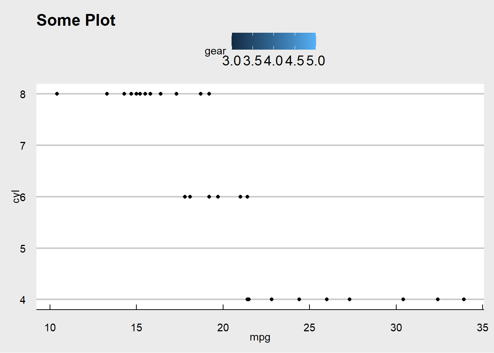

# Report

Structure

-   Exploratory analysis

    -   plots
    -   preliminary results
    -   interesting structure/features in the data
    -   outliers

-   Model

    -   Assumptions
    -   Why this model/ How is this model the best one?
    -   Consideration: interactions, collinearity, dependence

-   Model Fit

    -   How well does it fit?

    -   Are the model assumptions met?

        -   Residual analysis

-   Inference/ Prediction

    -   Are there different way to support your inference?

-   Conclusion

    -   Recommendation

    -   Limitation of the analysis

    -   How to correct those in the future

This chapter is based on the `jtools` package. More information can be found [here.](https://www.rdocumentation.org/packages/jtools/versions/2.1.0)

## One summary table

Packages for reporting:

Summary Statistics Table:

-   [qwraps2](https://cran.r-project.org/web/packages/qwraps2/vignettes/summary-statistics.html)
-   [vtable](https://cran.r-project.org/web/packages/vtable/vignettes/sumtable.html)
-   [gtsummary](http://www.danieldsjoberg.com/gtsummary/)
-   [apaTables](https://cran.r-project.org/web/packages/apaTables/apaTables.pdf)
-   [stargazer](https://cran.r-project.org/web/packages/stargazer/vignettes/stargazer.pdf)

Regression Table

-   [gtsummary](http://www.danieldsjoberg.com/gtsummary/)
-   [sjPlot,sjmisc, sjlabelled](https://cran.r-project.org/web/packages/sjPlot/vignettes/tab_model_estimates.html)
-   [stargazer](https://cran.r-project.org/web/packages/stargazer/vignettes/stargazer.pdf): recommended ([Example](https://www.jakeruss.com/cheatsheets/stargazer/))
-   [modelsummary](https://github.com/vincentarelbundock/modelsummary#a-simple-example)


```r
library(jtools)
data(movies)
fit <- lm(metascore ~ budget + us_gross + year, data = movies)
summ(fit)
```

<table class="table table-striped table-hover table-condensed table-responsive" style="width: auto !important; margin-left: auto; margin-right: auto;">
<tbody>
  <tr>
   <td style="text-align:left;font-weight: bold;"> Observations </td>
   <td style="text-align:right;"> 831 (10 missing obs. deleted) </td>
  </tr>
  <tr>
   <td style="text-align:left;font-weight: bold;"> Dependent variable </td>
   <td style="text-align:right;"> metascore </td>
  </tr>
  <tr>
   <td style="text-align:left;font-weight: bold;"> Type </td>
   <td style="text-align:right;"> OLS linear regression </td>
  </tr>
</tbody>
</table> <table class="table table-striped table-hover table-condensed table-responsive" style="width: auto !important; margin-left: auto; margin-right: auto;">
<tbody>
  <tr>
   <td style="text-align:left;font-weight: bold;"> F(3,827) </td>
   <td style="text-align:right;"> 26.23 </td>
  </tr>
  <tr>
   <td style="text-align:left;font-weight: bold;"> R² </td>
   <td style="text-align:right;"> 0.09 </td>
  </tr>
  <tr>
   <td style="text-align:left;font-weight: bold;"> Adj. R² </td>
   <td style="text-align:right;"> 0.08 </td>
  </tr>
</tbody>
</table> <table class="table table-striped table-hover table-condensed table-responsive" style="width: auto !important; margin-left: auto; margin-right: auto;border-bottom: 0;">
 <thead>
  <tr>
   <th style="text-align:left;">   </th>
   <th style="text-align:right;"> Est. </th>
   <th style="text-align:right;"> S.E. </th>
   <th style="text-align:right;"> t val. </th>
   <th style="text-align:right;"> p </th>
  </tr>
 </thead>
<tbody>
  <tr>
   <td style="text-align:left;font-weight: bold;"> (Intercept) </td>
   <td style="text-align:right;"> 52.06 </td>
   <td style="text-align:right;"> 139.67 </td>
   <td style="text-align:right;"> 0.37 </td>
   <td style="text-align:right;"> 0.71 </td>
  </tr>
  <tr>
   <td style="text-align:left;font-weight: bold;"> budget </td>
   <td style="text-align:right;"> -0.00 </td>
   <td style="text-align:right;"> 0.00 </td>
   <td style="text-align:right;"> -5.89 </td>
   <td style="text-align:right;"> 0.00 </td>
  </tr>
  <tr>
   <td style="text-align:left;font-weight: bold;"> us_gross </td>
   <td style="text-align:right;"> 0.00 </td>
   <td style="text-align:right;"> 0.00 </td>
   <td style="text-align:right;"> 7.61 </td>
   <td style="text-align:right;"> 0.00 </td>
  </tr>
  <tr>
   <td style="text-align:left;font-weight: bold;"> year </td>
   <td style="text-align:right;"> 0.01 </td>
   <td style="text-align:right;"> 0.07 </td>
   <td style="text-align:right;"> 0.08 </td>
   <td style="text-align:right;"> 0.94 </td>
  </tr>
</tbody>
<tfoot><tr><td style="padding: 0; " colspan="100%">
<sup></sup> Standard errors: OLS</td></tr></tfoot>
</table>

```r
summ(
    fit,
    scale = TRUE,
    vifs = TRUE,
    part.corr = TRUE,
    confint = TRUE,
    pvals = FALSE
) # notice that scale here is TRUE
```

<table class="table table-striped table-hover table-condensed table-responsive" style="width: auto !important; margin-left: auto; margin-right: auto;">
<tbody>
  <tr>
   <td style="text-align:left;font-weight: bold;"> Observations </td>
   <td style="text-align:right;"> 831 (10 missing obs. deleted) </td>
  </tr>
  <tr>
   <td style="text-align:left;font-weight: bold;"> Dependent variable </td>
   <td style="text-align:right;"> metascore </td>
  </tr>
  <tr>
   <td style="text-align:left;font-weight: bold;"> Type </td>
   <td style="text-align:right;"> OLS linear regression </td>
  </tr>
</tbody>
</table> <table class="table table-striped table-hover table-condensed table-responsive" style="width: auto !important; margin-left: auto; margin-right: auto;">
<tbody>
  <tr>
   <td style="text-align:left;font-weight: bold;"> F(3,827) </td>
   <td style="text-align:right;"> 26.23 </td>
  </tr>
  <tr>
   <td style="text-align:left;font-weight: bold;"> R² </td>
   <td style="text-align:right;"> 0.09 </td>
  </tr>
  <tr>
   <td style="text-align:left;font-weight: bold;"> Adj. R² </td>
   <td style="text-align:right;"> 0.08 </td>
  </tr>
</tbody>
</table> <table class="table table-striped table-hover table-condensed table-responsive" style="width: auto !important; margin-left: auto; margin-right: auto;border-bottom: 0;">
 <thead>
  <tr>
   <th style="text-align:left;">   </th>
   <th style="text-align:right;"> Est. </th>
   <th style="text-align:right;"> 2.5% </th>
   <th style="text-align:right;"> 97.5% </th>
   <th style="text-align:right;"> t val. </th>
   <th style="text-align:right;"> VIF </th>
   <th style="text-align:right;"> partial.r </th>
   <th style="text-align:right;"> part.r </th>
  </tr>
 </thead>
<tbody>
  <tr>
   <td style="text-align:left;font-weight: bold;"> (Intercept) </td>
   <td style="text-align:right;"> 63.01 </td>
   <td style="text-align:right;"> 61.91 </td>
   <td style="text-align:right;"> 64.11 </td>
   <td style="text-align:right;"> 112.23 </td>
   <td style="text-align:right;"> NA </td>
   <td style="text-align:right;"> NA </td>
   <td style="text-align:right;"> NA </td>
  </tr>
  <tr>
   <td style="text-align:left;font-weight: bold;"> budget </td>
   <td style="text-align:right;"> -3.78 </td>
   <td style="text-align:right;"> -5.05 </td>
   <td style="text-align:right;"> -2.52 </td>
   <td style="text-align:right;"> -5.89 </td>
   <td style="text-align:right;"> 1.31 </td>
   <td style="text-align:right;"> -0.20 </td>
   <td style="text-align:right;"> -0.20 </td>
  </tr>
  <tr>
   <td style="text-align:left;font-weight: bold;"> us_gross </td>
   <td style="text-align:right;"> 5.28 </td>
   <td style="text-align:right;"> 3.92 </td>
   <td style="text-align:right;"> 6.64 </td>
   <td style="text-align:right;"> 7.61 </td>
   <td style="text-align:right;"> 1.52 </td>
   <td style="text-align:right;"> 0.26 </td>
   <td style="text-align:right;"> 0.25 </td>
  </tr>
  <tr>
   <td style="text-align:left;font-weight: bold;"> year </td>
   <td style="text-align:right;"> 0.05 </td>
   <td style="text-align:right;"> -1.18 </td>
   <td style="text-align:right;"> 1.28 </td>
   <td style="text-align:right;"> 0.08 </td>
   <td style="text-align:right;"> 1.24 </td>
   <td style="text-align:right;"> 0.00 </td>
   <td style="text-align:right;"> 0.00 </td>
  </tr>
</tbody>
<tfoot><tr><td style="padding: 0; " colspan="100%">
<sup></sup> Standard errors: OLS; Continuous predictors are mean-centered and scaled by 1 s.d. The outcome variable remains in its original units.</td></tr></tfoot>
</table>

```r

#obtain clsuter-robust SE
data("PetersenCL", package = "sandwich")
fit2 <- lm(y ~ x, data = PetersenCL)
summ(fit2, robust = "HC3", cluster = "firm") 
```

<table class="table table-striped table-hover table-condensed table-responsive" style="width: auto !important; margin-left: auto; margin-right: auto;">
<tbody>
  <tr>
   <td style="text-align:left;font-weight: bold;"> Observations </td>
   <td style="text-align:right;"> 5000 </td>
  </tr>
  <tr>
   <td style="text-align:left;font-weight: bold;"> Dependent variable </td>
   <td style="text-align:right;"> y </td>
  </tr>
  <tr>
   <td style="text-align:left;font-weight: bold;"> Type </td>
   <td style="text-align:right;"> OLS linear regression </td>
  </tr>
</tbody>
</table> <table class="table table-striped table-hover table-condensed table-responsive" style="width: auto !important; margin-left: auto; margin-right: auto;">
<tbody>
  <tr>
   <td style="text-align:left;font-weight: bold;"> F(1,4998) </td>
   <td style="text-align:right;"> 1310.74 </td>
  </tr>
  <tr>
   <td style="text-align:left;font-weight: bold;"> R² </td>
   <td style="text-align:right;"> 0.21 </td>
  </tr>
  <tr>
   <td style="text-align:left;font-weight: bold;"> Adj. R² </td>
   <td style="text-align:right;"> 0.21 </td>
  </tr>
</tbody>
</table> <table class="table table-striped table-hover table-condensed table-responsive" style="width: auto !important; margin-left: auto; margin-right: auto;border-bottom: 0;">
 <thead>
  <tr>
   <th style="text-align:left;">   </th>
   <th style="text-align:right;"> Est. </th>
   <th style="text-align:right;"> S.E. </th>
   <th style="text-align:right;"> t val. </th>
   <th style="text-align:right;"> p </th>
  </tr>
 </thead>
<tbody>
  <tr>
   <td style="text-align:left;font-weight: bold;"> (Intercept) </td>
   <td style="text-align:right;"> 0.03 </td>
   <td style="text-align:right;"> 0.07 </td>
   <td style="text-align:right;"> 0.44 </td>
   <td style="text-align:right;"> 0.66 </td>
  </tr>
  <tr>
   <td style="text-align:left;font-weight: bold;"> x </td>
   <td style="text-align:right;"> 1.03 </td>
   <td style="text-align:right;"> 0.05 </td>
   <td style="text-align:right;"> 20.36 </td>
   <td style="text-align:right;"> 0.00 </td>
  </tr>
</tbody>
<tfoot><tr><td style="padding: 0; " colspan="100%">
<sup></sup> Standard errors: Cluster-robust, type = HC3</td></tr></tfoot>
</table>

Model to Equation


```r
# install.packages("equatiomatic") # not available for R 4.2
fit <- lm(metascore ~ budget + us_gross + year, data = movies)
# show the theoretical model
equatiomatic::extract_eq(fit)
# display the actual coefficients
equatiomatic::extract_eq(fit, use_coefs = TRUE)
```

## Model Comparison


```r
fit <- lm(metascore ~ log(budget), data = movies)
fit_b <- lm(metascore ~ log(budget) + log(us_gross), data = movies)
fit_c <- lm(metascore ~ log(budget) + log(us_gross) + runtime, data = movies)
coef_names <- c("Budget" = "log(budget)", "US Gross" = "log(us_gross)",
                "Runtime (Hours)" = "runtime", "Constant" = "(Intercept)")
export_summs(fit, fit_b, fit_c, robust = "HC3", coefs = coef_names)
```


```{=html}
<table class="huxtable" style="border-collapse: collapse; border: 0px; margin-bottom: 2em; margin-top: 2em; ; margin-left: auto; margin-right: auto;  " id="tab:unnamed-chunk-3">
<caption style="caption-side: top; text-align: center;">(#tab:unnamed-chunk-3) </caption><col><col><col><col><tr>
<th style="vertical-align: top; text-align: center; white-space: normal; border-style: solid solid solid solid; border-width: 0.8pt 0pt 0pt 0pt;    padding: 6pt 6pt 6pt 6pt; font-weight: normal;"></th><th style="vertical-align: top; text-align: center; white-space: normal; border-style: solid solid solid solid; border-width: 0.8pt 0pt 0.4pt 0pt;    padding: 6pt 6pt 6pt 6pt; font-weight: normal;">Model 1</th><th style="vertical-align: top; text-align: center; white-space: normal; border-style: solid solid solid solid; border-width: 0.8pt 0pt 0.4pt 0pt;    padding: 6pt 6pt 6pt 6pt; font-weight: normal;">Model 2</th><th style="vertical-align: top; text-align: center; white-space: normal; border-style: solid solid solid solid; border-width: 0.8pt 0pt 0.4pt 0pt;    padding: 6pt 6pt 6pt 6pt; font-weight: normal;">Model 3</th></tr>
<tr>
<th style="vertical-align: top; text-align: left; white-space: normal; border-style: solid solid solid solid; border-width: 0pt 0pt 0pt 0pt;    padding: 6pt 6pt 6pt 6pt; font-weight: normal;">Budget</th><td style="vertical-align: top; text-align: right; white-space: normal; border-style: solid solid solid solid; border-width: 0.4pt 0pt 0pt 0pt;    padding: 6pt 6pt 6pt 6pt; font-weight: normal;">-2.43 ***</td><td style="vertical-align: top; text-align: right; white-space: normal; border-style: solid solid solid solid; border-width: 0.4pt 0pt 0pt 0pt;    padding: 6pt 6pt 6pt 6pt; font-weight: normal;">-5.16 ***</td><td style="vertical-align: top; text-align: right; white-space: normal; border-style: solid solid solid solid; border-width: 0.4pt 0pt 0pt 0pt;    padding: 6pt 6pt 6pt 6pt; font-weight: normal;">-6.70 ***</td></tr>
<tr>
<th style="vertical-align: top; text-align: left; white-space: normal; border-style: solid solid solid solid; border-width: 0pt 0pt 0pt 0pt;    padding: 6pt 6pt 6pt 6pt; font-weight: normal;"></th><td style="vertical-align: top; text-align: right; white-space: normal; border-style: solid solid solid solid; border-width: 0pt 0pt 0pt 0pt;    padding: 6pt 6pt 6pt 6pt; font-weight: normal;">(0.44)&nbsp;&nbsp;&nbsp;</td><td style="vertical-align: top; text-align: right; white-space: normal; border-style: solid solid solid solid; border-width: 0pt 0pt 0pt 0pt;    padding: 6pt 6pt 6pt 6pt; font-weight: normal;">(0.62)&nbsp;&nbsp;&nbsp;</td><td style="vertical-align: top; text-align: right; white-space: normal; border-style: solid solid solid solid; border-width: 0pt 0pt 0pt 0pt;    padding: 6pt 6pt 6pt 6pt; font-weight: normal;">(0.67)&nbsp;&nbsp;&nbsp;</td></tr>
<tr>
<th style="vertical-align: top; text-align: left; white-space: normal; border-style: solid solid solid solid; border-width: 0pt 0pt 0pt 0pt;    padding: 6pt 6pt 6pt 6pt; font-weight: normal;">US Gross</th><td style="vertical-align: top; text-align: right; white-space: normal; border-style: solid solid solid solid; border-width: 0pt 0pt 0pt 0pt;    padding: 6pt 6pt 6pt 6pt; font-weight: normal;">&nbsp;&nbsp;&nbsp;&nbsp;&nbsp;&nbsp;&nbsp;</td><td style="vertical-align: top; text-align: right; white-space: normal; border-style: solid solid solid solid; border-width: 0pt 0pt 0pt 0pt;    padding: 6pt 6pt 6pt 6pt; font-weight: normal;">3.96 ***</td><td style="vertical-align: top; text-align: right; white-space: normal; border-style: solid solid solid solid; border-width: 0pt 0pt 0pt 0pt;    padding: 6pt 6pt 6pt 6pt; font-weight: normal;">3.85 ***</td></tr>
<tr>
<th style="vertical-align: top; text-align: left; white-space: normal; border-style: solid solid solid solid; border-width: 0pt 0pt 0pt 0pt;    padding: 6pt 6pt 6pt 6pt; font-weight: normal;"></th><td style="vertical-align: top; text-align: right; white-space: normal; border-style: solid solid solid solid; border-width: 0pt 0pt 0pt 0pt;    padding: 6pt 6pt 6pt 6pt; font-weight: normal;">&nbsp;&nbsp;&nbsp;&nbsp;&nbsp;&nbsp;&nbsp;</td><td style="vertical-align: top; text-align: right; white-space: normal; border-style: solid solid solid solid; border-width: 0pt 0pt 0pt 0pt;    padding: 6pt 6pt 6pt 6pt; font-weight: normal;">(0.51)&nbsp;&nbsp;&nbsp;</td><td style="vertical-align: top; text-align: right; white-space: normal; border-style: solid solid solid solid; border-width: 0pt 0pt 0pt 0pt;    padding: 6pt 6pt 6pt 6pt; font-weight: normal;">(0.48)&nbsp;&nbsp;&nbsp;</td></tr>
<tr>
<th style="vertical-align: top; text-align: left; white-space: normal; border-style: solid solid solid solid; border-width: 0pt 0pt 0pt 0pt;    padding: 6pt 6pt 6pt 6pt; font-weight: normal;">Runtime (Hours)</th><td style="vertical-align: top; text-align: right; white-space: normal; border-style: solid solid solid solid; border-width: 0pt 0pt 0pt 0pt;    padding: 6pt 6pt 6pt 6pt; font-weight: normal;">&nbsp;&nbsp;&nbsp;&nbsp;&nbsp;&nbsp;&nbsp;</td><td style="vertical-align: top; text-align: right; white-space: normal; border-style: solid solid solid solid; border-width: 0pt 0pt 0pt 0pt;    padding: 6pt 6pt 6pt 6pt; font-weight: normal;">&nbsp;&nbsp;&nbsp;&nbsp;&nbsp;&nbsp;&nbsp;</td><td style="vertical-align: top; text-align: right; white-space: normal; border-style: solid solid solid solid; border-width: 0pt 0pt 0pt 0pt;    padding: 6pt 6pt 6pt 6pt; font-weight: normal;">14.29 ***</td></tr>
<tr>
<th style="vertical-align: top; text-align: left; white-space: normal; border-style: solid solid solid solid; border-width: 0pt 0pt 0pt 0pt;    padding: 6pt 6pt 6pt 6pt; font-weight: normal;"></th><td style="vertical-align: top; text-align: right; white-space: normal; border-style: solid solid solid solid; border-width: 0pt 0pt 0pt 0pt;    padding: 6pt 6pt 6pt 6pt; font-weight: normal;">&nbsp;&nbsp;&nbsp;&nbsp;&nbsp;&nbsp;&nbsp;</td><td style="vertical-align: top; text-align: right; white-space: normal; border-style: solid solid solid solid; border-width: 0pt 0pt 0pt 0pt;    padding: 6pt 6pt 6pt 6pt; font-weight: normal;">&nbsp;&nbsp;&nbsp;&nbsp;&nbsp;&nbsp;&nbsp;</td><td style="vertical-align: top; text-align: right; white-space: normal; border-style: solid solid solid solid; border-width: 0pt 0pt 0pt 0pt;    padding: 6pt 6pt 6pt 6pt; font-weight: normal;">(1.63)&nbsp;&nbsp;&nbsp;</td></tr>
<tr>
<th style="vertical-align: top; text-align: left; white-space: normal; border-style: solid solid solid solid; border-width: 0pt 0pt 0pt 0pt;    padding: 6pt 6pt 6pt 6pt; font-weight: normal;">Constant</th><td style="vertical-align: top; text-align: right; white-space: normal; border-style: solid solid solid solid; border-width: 0pt 0pt 0pt 0pt;    padding: 6pt 6pt 6pt 6pt; font-weight: normal;">105.29 ***</td><td style="vertical-align: top; text-align: right; white-space: normal; border-style: solid solid solid solid; border-width: 0pt 0pt 0pt 0pt;    padding: 6pt 6pt 6pt 6pt; font-weight: normal;">81.84 ***</td><td style="vertical-align: top; text-align: right; white-space: normal; border-style: solid solid solid solid; border-width: 0pt 0pt 0pt 0pt;    padding: 6pt 6pt 6pt 6pt; font-weight: normal;">83.35 ***</td></tr>
<tr>
<th style="vertical-align: top; text-align: left; white-space: normal; border-style: solid solid solid solid; border-width: 0pt 0pt 0pt 0pt;    padding: 6pt 6pt 6pt 6pt; font-weight: normal;"></th><td style="vertical-align: top; text-align: right; white-space: normal; border-style: solid solid solid solid; border-width: 0pt 0pt 0.4pt 0pt;    padding: 6pt 6pt 6pt 6pt; font-weight: normal;">(7.65)&nbsp;&nbsp;&nbsp;</td><td style="vertical-align: top; text-align: right; white-space: normal; border-style: solid solid solid solid; border-width: 0pt 0pt 0.4pt 0pt;    padding: 6pt 6pt 6pt 6pt; font-weight: normal;">(8.66)&nbsp;&nbsp;&nbsp;</td><td style="vertical-align: top; text-align: right; white-space: normal; border-style: solid solid solid solid; border-width: 0pt 0pt 0.4pt 0pt;    padding: 6pt 6pt 6pt 6pt; font-weight: normal;">(8.82)&nbsp;&nbsp;&nbsp;</td></tr>
<tr>
<th style="vertical-align: top; text-align: left; white-space: normal; border-style: solid solid solid solid; border-width: 0pt 0pt 0pt 0pt;    padding: 6pt 6pt 6pt 6pt; font-weight: normal;">N</th><td style="vertical-align: top; text-align: right; white-space: normal; border-style: solid solid solid solid; border-width: 0.4pt 0pt 0pt 0pt;    padding: 6pt 6pt 6pt 6pt; font-weight: normal;">831&nbsp;&nbsp;&nbsp;&nbsp;&nbsp;&nbsp;&nbsp;</td><td style="vertical-align: top; text-align: right; white-space: normal; border-style: solid solid solid solid; border-width: 0.4pt 0pt 0pt 0pt;    padding: 6pt 6pt 6pt 6pt; font-weight: normal;">831&nbsp;&nbsp;&nbsp;&nbsp;&nbsp;&nbsp;&nbsp;</td><td style="vertical-align: top; text-align: right; white-space: normal; border-style: solid solid solid solid; border-width: 0.4pt 0pt 0pt 0pt;    padding: 6pt 6pt 6pt 6pt; font-weight: normal;">831&nbsp;&nbsp;&nbsp;&nbsp;&nbsp;&nbsp;&nbsp;</td></tr>
<tr>
<th style="vertical-align: top; text-align: left; white-space: normal; border-style: solid solid solid solid; border-width: 0pt 0pt 0.8pt 0pt;    padding: 6pt 6pt 6pt 6pt; font-weight: normal;">R2</th><td style="vertical-align: top; text-align: right; white-space: normal; border-style: solid solid solid solid; border-width: 0pt 0pt 0.8pt 0pt;    padding: 6pt 6pt 6pt 6pt; font-weight: normal;">0.03&nbsp;&nbsp;&nbsp;&nbsp;</td><td style="vertical-align: top; text-align: right; white-space: normal; border-style: solid solid solid solid; border-width: 0pt 0pt 0.8pt 0pt;    padding: 6pt 6pt 6pt 6pt; font-weight: normal;">0.09&nbsp;&nbsp;&nbsp;&nbsp;</td><td style="vertical-align: top; text-align: right; white-space: normal; border-style: solid solid solid solid; border-width: 0pt 0pt 0.8pt 0pt;    padding: 6pt 6pt 6pt 6pt; font-weight: normal;">0.17&nbsp;&nbsp;&nbsp;&nbsp;</td></tr>
<tr>
<th colspan="4" style="vertical-align: top; text-align: left; white-space: normal; border-style: solid solid solid solid; border-width: 0.8pt 0pt 0pt 0pt;    padding: 6pt 6pt 6pt 6pt; font-weight: normal;">Standard errors are heteroskedasticity robust.  *** p &lt; 0.001;  ** p &lt; 0.01;  * p &lt; 0.05.</th></tr>
</table>

```


Another package is `modelsummary`


```r
library(modelsummary)
lm_mod <- lm(mpg ~ wt + hp + cyl, mtcars)
msummary(lm_mod, vcov = c("iid","robust","HC4"))
```

<table class="table" style="width: auto !important; margin-left: auto; margin-right: auto;">
 <thead>
  <tr>
   <th style="text-align:left;">   </th>
   <th style="text-align:center;">  (1) </th>
   <th style="text-align:center;">   (2) </th>
   <th style="text-align:center;">   (3) </th>
  </tr>
 </thead>
<tbody>
  <tr>
   <td style="text-align:left;"> (Intercept) </td>
   <td style="text-align:center;"> 38.752 </td>
   <td style="text-align:center;"> 38.752 </td>
   <td style="text-align:center;"> 38.752 </td>
  </tr>
  <tr>
   <td style="text-align:left;">  </td>
   <td style="text-align:center;"> (1.787) </td>
   <td style="text-align:center;"> (2.286) </td>
   <td style="text-align:center;"> (2.177) </td>
  </tr>
  <tr>
   <td style="text-align:left;"> wt </td>
   <td style="text-align:center;"> −3.167 </td>
   <td style="text-align:center;"> −3.167 </td>
   <td style="text-align:center;"> −3.167 </td>
  </tr>
  <tr>
   <td style="text-align:left;">  </td>
   <td style="text-align:center;"> (0.741) </td>
   <td style="text-align:center;"> (0.833) </td>
   <td style="text-align:center;"> (0.819) </td>
  </tr>
  <tr>
   <td style="text-align:left;"> hp </td>
   <td style="text-align:center;"> −0.018 </td>
   <td style="text-align:center;"> −0.018 </td>
   <td style="text-align:center;"> −0.018 </td>
  </tr>
  <tr>
   <td style="text-align:left;">  </td>
   <td style="text-align:center;"> (0.012) </td>
   <td style="text-align:center;"> (0.010) </td>
   <td style="text-align:center;"> (0.013) </td>
  </tr>
  <tr>
   <td style="text-align:left;"> cyl </td>
   <td style="text-align:center;"> −0.942 </td>
   <td style="text-align:center;"> −0.942 </td>
   <td style="text-align:center;"> −0.942 </td>
  </tr>
  <tr>
   <td style="text-align:left;box-shadow: 0px 1.5px">  </td>
   <td style="text-align:center;box-shadow: 0px 1.5px"> (0.551) </td>
   <td style="text-align:center;box-shadow: 0px 1.5px"> (0.573) </td>
   <td style="text-align:center;box-shadow: 0px 1.5px"> (0.572) </td>
  </tr>
  <tr>
   <td style="text-align:left;"> Num.Obs. </td>
   <td style="text-align:center;"> 32 </td>
   <td style="text-align:center;"> 32 </td>
   <td style="text-align:center;"> 32 </td>
  </tr>
  <tr>
   <td style="text-align:left;"> R2 </td>
   <td style="text-align:center;"> 0.843 </td>
   <td style="text-align:center;"> 0.843 </td>
   <td style="text-align:center;"> 0.843 </td>
  </tr>
  <tr>
   <td style="text-align:left;"> R2 Adj. </td>
   <td style="text-align:center;"> 0.826 </td>
   <td style="text-align:center;"> 0.826 </td>
   <td style="text-align:center;"> 0.826 </td>
  </tr>
  <tr>
   <td style="text-align:left;"> AIC </td>
   <td style="text-align:center;"> 155.5 </td>
   <td style="text-align:center;"> 155.5 </td>
   <td style="text-align:center;"> 155.5 </td>
  </tr>
  <tr>
   <td style="text-align:left;"> BIC </td>
   <td style="text-align:center;"> 162.8 </td>
   <td style="text-align:center;"> 162.8 </td>
   <td style="text-align:center;"> 162.8 </td>
  </tr>
  <tr>
   <td style="text-align:left;"> Log.Lik. </td>
   <td style="text-align:center;"> −72.738 </td>
   <td style="text-align:center;"> −72.738 </td>
   <td style="text-align:center;"> −72.738 </td>
  </tr>
  <tr>
   <td style="text-align:left;"> F </td>
   <td style="text-align:center;"> 50.171 </td>
   <td style="text-align:center;"> 31.065 </td>
   <td style="text-align:center;"> 32.623 </td>
  </tr>
  <tr>
   <td style="text-align:left;"> RMSE </td>
   <td style="text-align:center;"> 2.35 </td>
   <td style="text-align:center;"> 2.35 </td>
   <td style="text-align:center;"> 2.35 </td>
  </tr>
  <tr>
   <td style="text-align:left;"> Std.Errors </td>
   <td style="text-align:center;"> IID </td>
   <td style="text-align:center;"> HC3 </td>
   <td style="text-align:center;"> HC4 </td>
  </tr>
</tbody>
</table>


```r
modelplot(lm_mod, vcov = c("iid","robust","HC4"))
```


Another package is `stargazer`


```r
library("stargazer")
stargazer(attitude)
#> 
#> % Table created by stargazer v.5.2.3 by Marek Hlavac, Social Policy Institute. E-mail: marek.hlavac at gmail.com
#> % Date and time: Mon, Aug 21, 2023 - 9:49:22 PM
#> \begin{table}[!htbp] \centering 
#>   \caption{} 
#>   \label{} 
#> \begin{tabular}{@{\extracolsep{5pt}}lccccc} 
#> \\[-1.8ex]\hline 
#> \hline \\[-1.8ex] 
#> Statistic & \multicolumn{1}{c}{N} & \multicolumn{1}{c}{Mean} & \multicolumn{1}{c}{St. Dev.} & \multicolumn{1}{c}{Min} & \multicolumn{1}{c}{Max} \\ 
#> \hline \\[-1.8ex] 
#> rating & 30 & 64.633 & 12.173 & 40 & 85 \\ 
#> complaints & 30 & 66.600 & 13.315 & 37 & 90 \\ 
#> privileges & 30 & 53.133 & 12.235 & 30 & 83 \\ 
#> learning & 30 & 56.367 & 11.737 & 34 & 75 \\ 
#> raises & 30 & 64.633 & 10.397 & 43 & 88 \\ 
#> critical & 30 & 74.767 & 9.895 & 49 & 92 \\ 
#> advance & 30 & 42.933 & 10.289 & 25 & 72 \\ 
#> \hline \\[-1.8ex] 
#> \end{tabular} 
#> \end{table}
## 2 OLS models
linear.1 <-
    lm(rating ~ complaints + privileges + learning + raises + critical,
       data = attitude)
linear.2 <-
    lm(rating ~ complaints + privileges + learning, data = attitude)
## create an indicator dependent variable, and run a probit model
attitude$high.rating <- (attitude$rating > 70)

probit.model <-
    glm(
        high.rating ~ learning + critical + advance,
        data = attitude,
        family = binomial(link = "probit")
    )
stargazer(linear.1,
          linear.2,
          probit.model,
          title = "Results",
          align = TRUE)
#> 
#> % Table created by stargazer v.5.2.3 by Marek Hlavac, Social Policy Institute. E-mail: marek.hlavac at gmail.com
#> % Date and time: Mon, Aug 21, 2023 - 9:49:22 PM
#> % Requires LaTeX packages: dcolumn 
#> \begin{table}[!htbp] \centering 
#>   \caption{Results} 
#>   \label{} 
#> \begin{tabular}{@{\extracolsep{5pt}}lD{.}{.}{-3} D{.}{.}{-3} D{.}{.}{-3} } 
#> \\[-1.8ex]\hline 
#> \hline \\[-1.8ex] 
#>  & \multicolumn{3}{c}{\textit{Dependent variable:}} \\ 
#> \cline{2-4} 
#> \\[-1.8ex] & \multicolumn{2}{c}{rating} & \multicolumn{1}{c}{high.rating} \\ 
#> \\[-1.8ex] & \multicolumn{2}{c}{\textit{OLS}} & \multicolumn{1}{c}{\textit{probit}} \\ 
#> \\[-1.8ex] & \multicolumn{1}{c}{(1)} & \multicolumn{1}{c}{(2)} & \multicolumn{1}{c}{(3)}\\ 
#> \hline \\[-1.8ex] 
#>  complaints & 0.692^{***} & 0.682^{***} &  \\ 
#>   & (0.149) & (0.129) &  \\ 
#>   & & & \\ 
#>  privileges & -0.104 & -0.103 &  \\ 
#>   & (0.135) & (0.129) &  \\ 
#>   & & & \\ 
#>  learning & 0.249 & 0.238^{*} & 0.164^{***} \\ 
#>   & (0.160) & (0.139) & (0.053) \\ 
#>   & & & \\ 
#>  raises & -0.033 &  &  \\ 
#>   & (0.202) &  &  \\ 
#>   & & & \\ 
#>  critical & 0.015 &  & -0.001 \\ 
#>   & (0.147) &  & (0.044) \\ 
#>   & & & \\ 
#>  advance &  &  & -0.062 \\ 
#>   &  &  & (0.042) \\ 
#>   & & & \\ 
#>  Constant & 11.011 & 11.258 & -7.476^{**} \\ 
#>   & (11.704) & (7.318) & (3.570) \\ 
#>   & & & \\ 
#> \hline \\[-1.8ex] 
#> Observations & \multicolumn{1}{c}{30} & \multicolumn{1}{c}{30} & \multicolumn{1}{c}{30} \\ 
#> R$^{2}$ & \multicolumn{1}{c}{0.715} & \multicolumn{1}{c}{0.715} &  \\ 
#> Adjusted R$^{2}$ & \multicolumn{1}{c}{0.656} & \multicolumn{1}{c}{0.682} &  \\ 
#> Log Likelihood &  &  & \multicolumn{1}{c}{-9.087} \\ 
#> Akaike Inf. Crit. &  &  & \multicolumn{1}{c}{26.175} \\ 
#> Residual Std. Error & \multicolumn{1}{c}{7.139 (df = 24)} & \multicolumn{1}{c}{6.863 (df = 26)} &  \\ 
#> F Statistic & \multicolumn{1}{c}{12.063$^{***}$ (df = 5; 24)} & \multicolumn{1}{c}{21.743$^{***}$ (df = 3; 26)} &  \\ 
#> \hline 
#> \hline \\[-1.8ex] 
#> \textit{Note:}  & \multicolumn{3}{r}{$^{*}$p$<$0.1; $^{**}$p$<$0.05; $^{***}$p$<$0.01} \\ 
#> \end{tabular} 
#> \end{table}
```


```r
# Latex
stargazer(
    linear.1,
    linear.2,
    probit.model,
    title = "Regression Results",
    align = TRUE,
    dep.var.labels = c("Overall Rating", "High Rating"),
    covariate.labels = c(
        "Handling of Complaints",
        "No Special Privileges",
        "Opportunity to Learn",
        "Performance-Based Raises",
        "Too Critical",
        "Advancement"
    ),
    omit.stat = c("LL", "ser", "f"),
    no.space = TRUE
)
```


```r
# ASCII text output
stargazer(
    linear.1,
    linear.2,
    type = "text",
    title = "Regression Results",
    dep.var.labels = c("Overall Rating", "High Rating"),
    covariate.labels = c(
        "Handling of Complaints",
        "No Special Privileges",
        "Opportunity to Learn",
        "Performance-Based Raises",
        "Too Critical",
        "Advancement"
    ),
    omit.stat = c("LL", "ser", "f"),
    ci = TRUE,
    ci.level = 0.90,
    single.row = TRUE
)
#> 
#> Regression Results
#> ========================================================================
#>                                        Dependent variable:              
#>                          -----------------------------------------------
#>                                          Overall Rating                 
#>                                    (1)                     (2)          
#> ------------------------------------------------------------------------
#> Handling of Complaints   0.692*** (0.447, 0.937) 0.682*** (0.470, 0.894)
#> No Special Privileges    -0.104 (-0.325, 0.118)  -0.103 (-0.316, 0.109) 
#> Opportunity to Learn      0.249 (-0.013, 0.512)   0.238* (0.009, 0.467) 
#> Performance-Based Raises -0.033 (-0.366, 0.299)                         
#> Too Critical              0.015 (-0.227, 0.258)                         
#> Advancement              11.011 (-8.240, 30.262) 11.258 (-0.779, 23.296)
#> ------------------------------------------------------------------------
#> Observations                       30                      30           
#> R2                                0.715                   0.715         
#> Adjusted R2                       0.656                   0.682         
#> ========================================================================
#> Note:                                        *p<0.1; **p<0.05; ***p<0.01
```


```r
stargazer(
    linear.1,
    linear.2,
    probit.model,
    title = "Regression Results",
    align = TRUE,
    dep.var.labels = c("Overall Rating", "High Rating"),
    covariate.labels = c(
        "Handling of Complaints",
        "No Special Privileges",
        "Opportunity to Learn",
        "Performance-Based Raises",
        "Too Critical",
        "Advancement"
    ),
    omit.stat = c("LL", "ser", "f"),
    no.space = TRUE
)
```

Correlation Table


```r
correlation.matrix <-
    cor(attitude[, c("rating", "complaints", "privileges")])
stargazer(correlation.matrix, title = "Correlation Matrix")
```

## Changes in an estimate


```r
coef_names <- coef_names[1:3] # Dropping intercept for plots
plot_summs(fit, fit_b, fit_c, robust = "HC3", coefs = coef_names)
```


```r
plot_summs(
    fit_c,
    robust = "HC3",
    coefs = coef_names,
    plot.distributions = TRUE
)
```


## Standard Errors

`sandwich` [vignette](cran.r-project.org/web/packages/sandwich/vignettes/sandwich-CL.pdf)

+------------+------------+------------------------------------------------------------------------------------------+--------------------------+
| Type       | Applicable | Usage                                                                                    | Reference                |
+============+============+==========================================================================================+==========================+
| `const`    |            | Assume constant variances                                                                |                          |
+------------+------------+------------------------------------------------------------------------------------------+--------------------------+
| `HC` `HC0` | `vcovCL`   | Heterogeneity                                                                            | [@white1980]             |
|            |            |                                                                                          |                          |
|            |            | White's estimator                                                                        |                          |
|            |            |                                                                                          |                          |
|            |            | All other heterogeneity SE methods are derivatives of this.                              |                          |
|            |            |                                                                                          |                          |
|            |            | No small sample bias adjustment                                                          |                          |
+------------+------------+------------------------------------------------------------------------------------------+--------------------------+
| `HC1`      | `vcovCL`   | Uses a degrees of freedom-based correction                                               | [@mackinnon1985some]     |
|            |            |                                                                                          |                          |
|            |            | When the number of clusters is small, `HC2` and `HC3` are better [@cameron2008bootstrap] |                          |
+------------+------------+------------------------------------------------------------------------------------------+--------------------------+
| `HC2`      | `vcovCL`   | Better with the linear model, but still applicable for [Generalized Linear Models]       |                          |
|            |            |                                                                                          |                          |
|            |            | Needs a hat (weighted) matrix                                                            |                          |
+------------+------------+------------------------------------------------------------------------------------------+--------------------------+
| `HC3`      | `vcovCL`   | Better with the linear model, but still applicable for [Generalized Linear Models]       |                          |
|            |            |                                                                                          |                          |
|            |            | Needs a hat (weighted) matrix                                                            |                          |
+------------+------------+------------------------------------------------------------------------------------------+--------------------------+
| `HC4`      | `vcovHC`   |                                                                                          | [@cribari2004asymptotic] |
+------------+------------+------------------------------------------------------------------------------------------+--------------------------+
| `HC4m`     | `vcovHC`   |                                                                                          | [@cribari2007inference]  |
+------------+------------+------------------------------------------------------------------------------------------+--------------------------+
| `HC5`      | `vcovHC`   |                                                                                          | [@cribari2011new]        |
+------------+------------+------------------------------------------------------------------------------------------+--------------------------+


```r
data(cars)
model <- lm(speed ~ dist, data = cars)
summary(model)
#> 
#> Call:
#> lm(formula = speed ~ dist, data = cars)
#> 
#> Residuals:
#>     Min      1Q  Median      3Q     Max 
#> -7.5293 -2.1550  0.3615  2.4377  6.4179 
#> 
#> Coefficients:
#>             Estimate Std. Error t value Pr(>|t|)    
#> (Intercept)  8.28391    0.87438   9.474 1.44e-12 ***
#> dist         0.16557    0.01749   9.464 1.49e-12 ***
#> ---
#> Signif. codes:  0 '***' 0.001 '**' 0.01 '*' 0.05 '.' 0.1 ' ' 1
#> 
#> Residual standard error: 3.156 on 48 degrees of freedom
#> Multiple R-squared:  0.6511,	Adjusted R-squared:  0.6438 
#> F-statistic: 89.57 on 1 and 48 DF,  p-value: 1.49e-12
lmtest::coeftest(model, vcov. = sandwich::vcovHC(model, type = "HC1"))
#> 
#> t test of coefficients:
#> 
#>             Estimate Std. Error t value  Pr(>|t|)    
#> (Intercept) 8.283906   0.891860  9.2883 2.682e-12 ***
#> dist        0.165568   0.019402  8.5335 3.482e-11 ***
#> ---
#> Signif. codes:  0 '***' 0.001 '**' 0.01 '*' 0.05 '.' 0.1 ' ' 1
```

## Coefficient Uncertainty and Distribution

The `ggdist` allows us to visualize uncertainty under both frequentist and Bayesian frameworks


```r
library(ggdist)
```

## Descriptive Tables

Export APA theme


```r
data("mtcars")

library(flextable)
theme_apa(flextable(mtcars[1:5,1:5]))
```

Export to Latex


```r
print(xtable::xtable(mtcars, type = "latex"),
      file = file.path(getwd(), "output", "mtcars_xtable.tex"))

# American Economic Review style
stargazer::stargazer(
    mtcars,
    title = "Testing",
    style = "aer",
    out = file.path(getwd(), "output", "mtcars_stargazer.tex")
)

# other styles include
# Administrative Science Quarterly
# Quarterly Journal of Economics
```

However, the above codes do not play well with notes. Hence, I create my own custom code that follows the AMA guidelines


```r
ama_tbl <- function(data, caption, label, note, output_path) {
  library(tidyverse)
  library(xtable)
  # Function to determine column alignment
  get_column_alignment <- function(data) {
    # Start with the alignment for the header row
    alignment <- c("l", "l")
    
    # Check each column
    for (col in seq_len(ncol(data))[-1]) {
      if (is.numeric(data[[col]])) {
        alignment <- c(alignment, "r")  # Right alignment for numbers
      } else {
        alignment <- c(alignment, "c")  # Center alignment for other data
      }
    }
    
    return(alignment)
  }
  
  data %>%
    # bold + left align first column 
    rename_with(~paste("\\multicolumn{1}{l}{\\textbf{", ., "}}"), 1) %>% 
    # bold + center align all other columns
    `colnames<-`(ifelse(colnames(.) != colnames(.)[1],
                        paste("\\multicolumn{1}{c}{\\textbf{", colnames(.), "}}"),
                        colnames(.))) %>% 
    
    xtable(caption = caption,
           label = label,
           align = get_column_alignment(data),
           auto = TRUE) %>%
    print(
      include.rownames = FALSE,
      caption.placement = "top",
      
      hline.after=c(-1, 0),
      
       # p{0.9\linewidth} sets the width of the column to 90% of the line width, and the @{} removes any extra padding around the cell.
      
      add.to.row = list(pos = list(nrow(data)), # Add at the bottom of the table
                        command = c(paste0("\\hline \n \\multicolumn{",ncol(data), "}{l} {", "\n \\begin{tabular}{@{}p{0.9\\linewidth}@{}} \n","Note: ", note, "\n \\end{tabular}  } \n"))), # Add your note here
      
      # make sure your heading is untouched (because you manually change it above)
      sanitize.colnames.function = identity,
      
      # place a the top of the page
      table.placement = "h",
      
      file = output_path
    )
}
```


```r
ama_tbl(
    mtcars,
    caption     = "This is caption",
    label       = "tab:this_is_label",
    note        = "this is note",
    output_path = file.path(getwd(), "output", "mtcars_custom_ama.tex")
)
```

## Visualizations and Plots

You can customize your plots based on your preferred journals. Here, I am creating a custom setting for the American Marketing Association.

American-Marketing-Association-ready theme for plots


```r
library(ggplot2)

# check available fonts
# windowsFonts()

# for Times New Roman
# names(windowsFonts()[windowsFonts()=="TT Times New Roman"])
```


```r
# Making a theme
amatheme = theme_bw(base_size = 14, base_family = "serif") + # This is Time New Roman
    
    theme(
        # remove major gridlines
        panel.grid.major   = element_blank(),

        # remove minor gridlines
        panel.grid.minor   = element_blank(),

        # remove panel border
        panel.border       = element_blank(),

        line               = element_line(),

        # change font
        text               = element_text(),

        # if you want to remove legend title
        # legend.title     = element_blank(),

        legend.title       = element_text(size = rel(0.6), face = "bold"),

        # change font size of legend
        legend.text        = element_text(size = rel(0.6)),
        
        legend.background  = element_rect(color = "black"),
        
        # legend.margin    = margin(t = 5, l = 5, r = 5, b = 5),
        # legend.key       = element_rect(color = NA, fill = NA),

        # change font size of main title
        plot.title         = element_text(
            size           = rel(1.2),
            face           = "bold",
            hjust          = 0.5,
            margin         = margin(b = 15)
        ),
        
        plot.margin        = unit(c(1, 1, 1, 1), "cm"),

        # add black line along axes
        axis.line          = element_line(colour = "black", linewidth = .8),
        
        axis.ticks         = element_line(),
        

        # axis title
        axis.title.x       = element_text(size = rel(1.2), face = "bold"),
        axis.title.y       = element_text(size = rel(1.2), face = "bold"),

        # axis text size
        axis.text.y        = element_text(size = rel(1)),
        axis.text.x        = element_text(size = rel(1))
    )
```

Example


```r
library(tidyverse)
library(ggsci)
data("mtcars")
yourplot <- mtcars %>%
    select(mpg, cyl, gear) %>%
    ggplot(., aes(x = mpg, y = cyl, fill = gear)) + 
    geom_point() +
    labs(title="Some Plot") 

yourplot + 
    amatheme + 
    # choose different color theme
    scale_color_npg() 
```


```r

yourplot + 
    amatheme + 
    scale_color_continuous()
```


Other pre-specified themes


```r
library(ggthemes)


# Stata theme
yourplot +
    theme_stata()
```


```r

# The economist theme
yourplot + 
    theme_economist()
```


```r

yourplot + 
    theme_economist_white()
```



```r

# Wall street journal theme
yourplot + 
    theme_wsj()
```


```r

# APA theme
yourplot +
    jtools::theme_apa(
        legend.font.size = 24,
        x.font.size = 20,
        y.font.size = 20
    )
```


