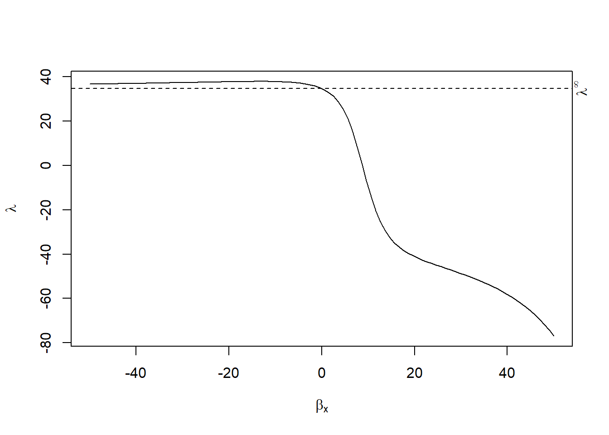
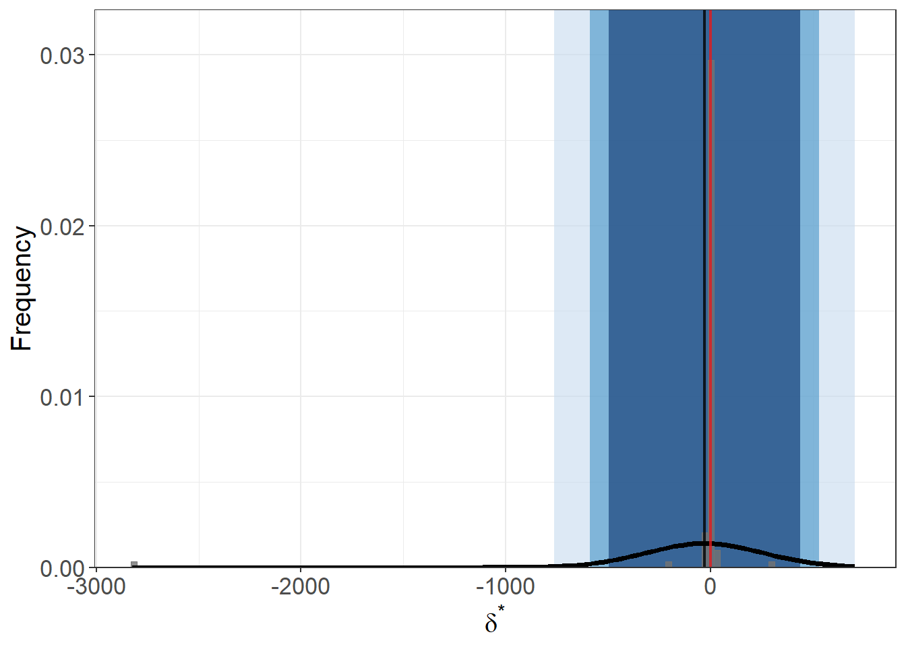
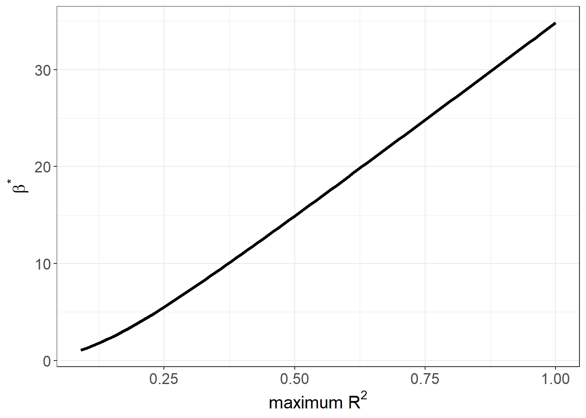

# Matching Methods {#sec-matching-methods}

Matching is a strategy that aims to eliminate---or at least minimize---potential sources of bias by constructing treatment and comparison groups with similar observed characteristics. By doing so, any observed differences in outcomes between these groups can be attributed more confidently to the treatment itself rather than to other factors. In observational research, matching is frequently combined with [Difference-in-Differences] (DiD) techniques to address issues of selection bias, particularly when multiple pre-treatment outcomes are available.

> Matching is defined as "any method that aims to equate (or"balance") the distribution of covariates in the treated and control groups." [@stuart2010matching, pp. 1]

Matching is particularly useful when:

-   Outcomes are **not yet observed**, such as in follow-up studies, and you want to construct balanced treatment/control groups.
-   Outcomes **are available**, but you wish to **reduce model dependence** and **improve robustness**.

> Conceptually, matching can also be viewed through the lens of **missing data**, since we never observe both potential outcomes $(Y_i^T, Y_i^C)$ for any unit. Hence, this topic closely relates to [Imputation (Missing Data)].

## Introduction and Motivation

### Why Match?

In many observational studies, researchers do not have the luxury of randomization. Subjects (people, firms, schools, etc.) typically select or are selected into treatment based on certain observed and/or unobserved characteristics. This can introduce systematic differences (selection bias) that confound causal inference. Matching attempts to approximate a randomized experiment by "balancing" these observed characteristics between treated and non-treated (control) units.

-   **Goal:** Reduce model dependence and clarify causal effects by ensuring that treated and control subjects have sufficiently comparable covariates.
-   **Challenge:** Even if matching achieves balance in observed covariates, any **unobserved** confounders remain a threat to identification (i.e., Matching is only a selection observables identification strategy). Matching does not magically fix bias from unobserved variables.

To understand why causal inference is difficult in observational studies, consider:

$$ 
\begin{aligned} E(Y_i^T | T) - E(Y_i^C | C) &= E(Y_i^T - Y_i^C | T) + \underbrace{[E(Y_i^C | T) - E(Y_i^C | C)]}_{\text{Selection Bias}} \\ \end{aligned} $$

-   The term $E(Y_i^T - Y_i^C | T)$ is the **causal effect** (specifically the ATT).
-   The term $E(Y_i^C | T) - E(Y_i^C | C)$ reflects **selection bias** due to systematic differences in the untreated potential outcome across treated and control groups.

Random assignment ensures:

$$ E(Y_i^C | T) = E(Y_i^C | C) $$

which eliminates selection bias. In observational data, however, this equality rarely holds.

Matching aims to mimic randomization by **conditioning on covariates** $X$:

$$ E(Y_i^C | X, T) = E(Y_i^C | X, C) $$

For example, propensity score matching achieves this balance by conditioning on the **propensity score** $P(X)$:

$$ E(Y_i^C | P(X), T) = E(Y_i^C | P(X), C) $$

(See [Propensity Scores](#sec-propensity-scores) for further discussion.)

The [Average Treatment Effect] (ATE) under matching is typically estimated as:

$$ \frac{1}{N_T} \sum_{i=1}^{N_T} \left(Y_i^T - \frac{1}{N_{C_i}} \sum_{j \in \mathcal{C}_i} Y_j^C\right) $$

where $\mathcal{C}_i$ denotes the matched controls for treated unit $i$.

Standard Errors in Matching

-   Matching does not have a closed-form standard error for the ATE or ATT.
-   Therefore, we rely on bootstrapping to estimate uncertainty.

> **Note**: Matching tends to yield larger standard errors than [OLS][Ordinary Least Squares] because it reduces the effective sample size by discarding unmatched observations.

------------------------------------------------------------------------

### Matching as "Pruning"

Matching can be thought of as "**pruning**" (a **preprocessing** step) [@king2017balance]. The goal is to **prune** unmatched or poorly matched units before conducting analysis, reducing model dependence.

Without Matching:

-   Imbalanced data → Model dependence → Researcher discretion → Biased estimates

With Matching:

-   Balanced data → Reduces discretion → More credible causal inference

+-----------------------+------------------------+----------------------+
| Balance of Covariates | Complete Randomization | Fully Exact Matching |
+=======================+========================+======================+
| **Observed**          | On average             | Exact                |
+-----------------------+------------------------+----------------------+
| **Unobserved**        | On average             | On average           |
+-----------------------+------------------------+----------------------+

: Degree of Balance Across Designs

Fully blocked or exactly matched designs outperform randomized ones on:

-   **Imbalance**
-   **Model dependence**
-   **Efficiency and power**
-   **Bias**
-   **Robustness**
-   **Research costs**

------------------------------------------------------------------------

### Matching with DiD

Matching can be fruitfully combined with DiD when multiple pre-treatment periods are available. Such designs can help correct for selection bias under certain assumptions:

-   When selection bias is symmetric around the treatment date, standard DID (implemented symmetrically around the treatment date) remains consistent [@chabe2015analysis ].
-   If selection bias is asymmetric, simulations by @chabe2015analysis show that symmetric DID still outperforms matching alone, although having more pre-treatment observations can improve matching performance.

In short, matching is not a universal solution but often provides a helpful preprocessing step before conducting DiD or other causal estimation methods [@smith2005does].

------------------------------------------------------------------------

## Key Assumptions

Matching relies on the standard set of assumptions underpinning [selection on observables](#sec-selection-on-observables)---also known as the **back-door criterion** (see [Assumptions for Identifying Treatment Effects]). When these assumptions hold, matching can yield valid estimates of causal effects by constructing treated and control groups that are comparable on observed covariates.

1.  **Strong** [Conditional Ignorability Assumption] (Unconfoundedness)

Also known as the **no hidden bias** or **ignorability** assumption:

$$
(Y(0),\, Y(1)) \,\perp\, T \,\big|\, X
$$

This implies that, conditional on covariates $X$, treatment assignment is independent of the potential outcomes. In other words, there are no unobserved confounders once we adjust for $X$.

-   This assumption is not testable, but it is more plausible when all relevant confounders are observed and included in $X$.
-   It is often satisfied approximately when unobserved covariates are highly correlated with the observed ones.
-   If unobserved variables are unrelated to $X$, you can:
    -   Conduct sensitivity analysis to test the robustness of your estimates.
    -   Apply design sensitivity techniques: If unobserved confounding is suspected, methods such as [@heller2009split]'s design sensitivity approaches or bounding approaches (e.g., the `rbounds` R package) can be used to test how robust findings are to hidden bias.

> This is the cornerstone assumption of matching: without it, causal inference from observational data is generally invalid.

------------------------------------------------------------------------

2.  [Overlap (Positivity) Assumption] **(Common Support)**

$$
0 < P(T=1 \mid X) < 1 \quad \forall X
$$

This condition ensures that, for every value of the covariates $X$, there is a positive probability of receiving both treatment and control.

-   If this assumption fails, there are regions of covariate space where either treatment or control units are absent, making comparison impossible.
-   Matching enforces this assumption by discarding units outside of the region of common support.

> This pruning step is both a strength and limitation of matching---it improves internal validity at the cost of generalizability.

------------------------------------------------------------------------

3.  [Stable Unit Treatment Value Assumption] (SUTVA)

SUTVA requires that:

-   The potential outcomes for any individual unit do not depend on the treatment assignment of other units.

That is, there are **no interference or spillover effects** between units.

-   Mathematically, $Y_i(T_i)$ depends only on $T_i$, not on $T_j$ for any $j \neq i$.
-   Violations can occur in settings like:
    -   Education (peer effects)
    -   Epidemiology (disease transmission)
    -   Marketing (network influence)

> In cases with known spillover, efforts should be made to reduce interactions or explicitly model interference.

------------------------------------------------------------------------

Summary of Assumptions for Matching

+------------------------------+-------------------------------------------------------------------------------------+----------------------------------------------+
| Assumption                   | Description                                                                         | Notation                                     |
+==============================+=====================================================================================+==============================================+
| **Conditional Ignorability** | No hidden confounding after conditioning on covariates                              | $(Y(0), Y(1)) \perp T \mid X$                |
+------------------------------+-------------------------------------------------------------------------------------+----------------------------------------------+
| **Overlap (Positivity)**     | Each unit has a non-zero probability of treatment and control assignment            | $0 < P(T=1 \mid X) < 1$                      |
+------------------------------+-------------------------------------------------------------------------------------+----------------------------------------------+
| **SUTVA**                    | No interference between units; one unit's outcome unaffected by another's treatment | $Y_i(T_i)$ unaffected by $T_j$ for $j \ne i$ |
+------------------------------+-------------------------------------------------------------------------------------+----------------------------------------------+

These three assumptions form the foundation for valid causal inference using matching methods.

------------------------------------------------------------------------

## Framework for Generalization

Let:

-   $P_t$, $P_c$: treated and control populations
-   $N_t$, $N_c$: random samples drawn from $P_t$, $P_c$
-   $\mu_i$, $\Sigma_i$: means and covariance matrices of the $p$ covariates in group $i \in \{t, c\}$
-   $X_j$: vector of covariates for individual $j$
-   $T_j \in \{0, 1\}$: treatment indicator (1 = treated, 0 = control)
-   $Y_j$: observed outcome
-   Assume $N_t < N_c$ (i.e., more controls than treated)

The conditional treatment effect is:

$$
\tau(x) = R_1(x) - R_0(x), \quad \text{where } R_1(x) = E[Y(1) \mid X = x], \quad R_0(x) = E[Y(0) \mid X = x]
$$

If we assume **constant treatment effects (parallel trends)**, then $\tau(x) = \tau$ for all $x$. If this assumption is relaxed, we can still estimate an **average** effect over the distribution of $X$.

**Common Estimands**

-   [Average Treatment Effect] (ATE): Average causal effect across all units.
-   [Average Treatment Effect on the Treated] (ATT): Causal effect for treated units only.

------------------------------------------------------------------------

## Steps for Matching

Most matching methods rely on:

-   **Propensity score**: summarizes $P(T=1|X)$
-   **Distance metric**: measures similarity
-   **Covariates**: assumed to satisfy ignorability

### Step 1: Define "Closeness" (Distance Metrics)

Matching requires a **distance metric** to define similarity between treated and control units.

**Variable Selection Guidelines**

-   Include as many pre-treatment covariates as possible to support conditional ignorability.
-   Avoid post-treatment variables, which introduce bias.
-   Be cautious with variables (e.g., heavy drug users) highly correlated with the outcome (e.g., heavy drinkers) but not treatment (e.g., mediators).
-   If variables are uncorrelated with both treatment and outcome, the cost of inclusion is small.

**Distance Measures**

+----------------------------+----------------------------------------------------+------------------------------------------------------------------------------------------------------------------------------------------+
| Method                     | Formula                                            | Notes                                                                                                                                    |
+============================+====================================================+==========================================================================================================================================+
| **Exact Matching**         | $D_{ij} = 0$ if $X_i = X_j$, else $\infty$         | Only feasible in low dimensions; can be relaxed via [Coarsened Exact Matching]                                                           |
+----------------------------+----------------------------------------------------+------------------------------------------------------------------------------------------------------------------------------------------+
| **Mahalanobis Distance**   | $D_{ij} = (X_i - X_j)' \Sigma^{-1}(X_i - X_j)$     | $\Sigma$ (var-covar matrix of $X$) from control group if ATT is of interest or pooled if ATE is of interest; sensitive to dimensionality |
+----------------------------+----------------------------------------------------+------------------------------------------------------------------------------------------------------------------------------------------+
| **Propensity Score**       | $D_{ij} = |e_i - e_j|$                             | Where $e_k$ is the estimated propensity score $P(T=1 \mid X_k)$ for unit $k$.                                                            |
|                            |                                                    |                                                                                                                                          |
|                            |                                                    | Advanced: **Prognostic scores** [@hansen2008prognostic] require modeling $E[Y(0)|X]$, so they depend on the outcome model.               |
+----------------------------+----------------------------------------------------+------------------------------------------------------------------------------------------------------------------------------------------+
| **Logit Propensity Score** | $D_{ij} = |\text{logit}(e_i) - \text{logit}(e_j)|$ | More stable in tails of distribution                                                                                                     |
+----------------------------+----------------------------------------------------+------------------------------------------------------------------------------------------------------------------------------------------+

> **Tip**: In high dimensions, exact and Mahalanobis matching perform poorly. Combining Mahalanobis with **propensity score calipers** can improve robustness [@rubin2000combining].

Advanced methods for longitudinal setting:

-   **Marginal Structural Models**: for time-varying treatments [@robins2000marginal]
-   **Balanced Risk Set Matching**: for survival analysis [@li2001balanced]

------------------------------------------------------------------------

### Step 2: Matching Algorithms

1.  Nearest Neighbor Matching

-   **Greedy matching**: Fast, but suboptimal under competition for controls.
-   **Optimal matching**: Minimizes global distance across all pairs.
-   **Ratio matching (k:1)**: Useful when controls outnumber treated; choose $k$ using trade-off between bias and variance [@rubin1996matching].
-   **With vs. without replacement**:
    -   **With replacement**: Improves matching quality, but requires **frequency weights** for analysis.
    -   **Without replacement**: Simpler, but less flexible.

2.  Subclassification, Full Matching, and Weighting

These methods generalize nearest-neighbor approaches by assigning **fractional weights**.

-   **Subclassification**: Partition into strata based on propensity score (e.g., quintiles).
-   **Full Matching**: Each treated unit is matched to a weighted group of controls (and vice versa) to minimize average within-set distance.
-   **Weighting**: Weighting techniques use propensity scores to estimate the ATE. However, if the weights are extreme, the resulting variance may be inflated---not due to the underlying probabilities, but due to the estimation procedure itself. To address this issue, researchers can employ (1) weight trimming or (2) doubly robust methods when using propensity scores for weighting or matching.
    -   **Inverse Probability of Treatment Weighting (IPTW)**: $$
        w_i = \frac{T_i}{\hat{e}_i} + \frac{1 - T_i}{1 - \hat{e}_i}
        $$
    -   **Odds weighting**: $$
        w_i = T_i + (1 - T_i)\frac{\hat{e}_i}{1 - \hat{e}_i}
        $$
    -   **Kernel weighting**: Smooth average over control group (popular in economics).
    -   **Trimming and Doubly-Robust Methods**: Reduce variance due to extreme weights.

3.  Assessing Common Support

-   Use propensity score histograms to visualize overlap.
-   Units outside the convex hull of $X$ (i.e., unmatched regions) can be discarded.
-   Lack of overlap indicates that some comparisons are extrapolations, not empirical matches.

------------------------------------------------------------------------

### Step 3: Diagnosing Match Quality

**Balance Diagnostics**

Matching aims to balance the covariate distributions between treated and control units. A well-matched sample satisfies:

$$
\tilde{p}(X \mid T=1) \approx \tilde{p}(X \mid T=0)
$$

where $\tilde{p}$ is the empirical distribution.

1.  Numerical Checks

-   **Standardized differences in means** (most common): Should be $< 0.1$
-   **Standardized difference of propensity scores**: Should be $< 0.25$ [@rubin2001using]
-   **Variance ratio of propensity scores**: Between 0.5 and 2.0 [@rubin2001using]
-   **Variance of residuals** after regression on propensity score (treated vs. control) for each covariate

> Avoid using p-values as diagnostics---they conflate balance with statistical power and are sensitive to sample size.

2.  Graphical Diagnostics

-   **Empirical Distribution Plots**
-   **Quantile-Quantile (QQ) Plots**
-   **Love Plots**: Summarize standardized differences before/after matching

------------------------------------------------------------------------

### Step 4: Estimating Treatment Effects

1.  After Matching

-   With k:1 matching with replacement, use weights to adjust for reuse of controls.
-   Use regression adjustment on matched samples to improve precision and adjust for residual imbalance.

2.  After Subclassification or Full Matching

-   **ATT**: Weight subclass-specific estimates by number of treated units.
-   **ATE**: Weight by total units per subclass.

3.  Variance Estimation

Must reflect uncertainty in both:

1.  The **matching procedure** (sampling and distance calculation) (Step 3)
2.  The **outcome model** (regression, difference-in-means, etc.) (Step 4)

Often estimated via **bootstrapping**.

------------------------------------------------------------------------

## Special Considerations

1.  **Handling Missing Data**

-   Use generalized boosted models or multiple imputation [@qu2009propensity].

2.  **Violation of Ignorability**

Strategies when unobservables bias treatment:

-   Use pre-treatment measures of outcome
-   Compare multiple control groups
-   Conduct sensitivity analysis:
    -   Quantify correlation between unobserved confounders and both treatment and outcome to nullify the observed effect

------------------------------------------------------------------------

## Choosing a Matching Strategy

### Based on Estimand

-   **ATE**: Use IPTW or full matching
-   **ATT**:
    -   If many controls ($N_c > 3N_t$): k:1 nearest neighbor without replacement
    -   If few controls: subclassification, full matching, or odds weighting

### Based on Diagnostics

-   If balanced: proceed with regression on matched samples
-   If imbalance on few covariates: Mahalanobis matching on those
-   If imbalance on many covariates: Try k:1 matching with replacement

### Selection Criteria

-   Minimize standardized differences across many covariates
-   Especially prioritize prognostic covariates
-   Minimize number of covariates with large ($>0.25$) imbalance [@diamond2013genetic]

Matching is not one-size-fits-all. Choose methods based on the target estimand, data structure, and diagnostic results.

------------------------------------------------------------------------

## Matching vs. Regression

Matching and regression are two core strategies used in observational studies to adjust for differences in covariates $X$ and estimate causal effects. While both aim to remove bias due to confounding, they approach the problem differently, particularly in how they **weight observations**, handle **functional form assumptions**, and address **covariate balance**.

Neither method can resolve the issue of **unobserved confounding**, but each can be a powerful tool when used with care and supported by appropriate diagnostics.

-   **Matching** emphasizes covariate balance by pruning the dataset to retain only comparable units. It is nonparametric, focusing on ATT.
-   **Regression** (typically [OLS][Ordinary Least Squares]) emphasizes functional form and allows for model-based adjustment, enabling the estimation of ATE and continuous or interactive effects of treatment.

Both matching and regression assign implicit or explicit weights to observations during estimation:

-   **Matching**: Weights observations more heavily in strata with more treated units, aligning with the ATT estimand.
-   [OLS][Ordinary Least Squares] **Regression**: Places more weight on strata where the variance of treatment assignment is highest---i.e., when groups are approximately balanced between treated and control (near 50/50).

This results in differing estimands and sensitivities:

> **Important Caveat**: If your [OLS][Ordinary Least Squares] estimate is biased due to unobserved confounding, your matching estimate is likely biased too. Both depend on the [selection on observables](#sec-selection-on-observables) assumption.

We explore the difference in estimands between matching and regression, especially for estimating the ATT.

### Matching Estimand

Suppose we want the treatment effect on the treated:

$$
\delta_{\text{TOT}} = E[Y_{1i} - Y_{0i} \mid D_i = 1]
$$

Using the [Law of Iterated Expectation]:

$$
\delta_{\text{TOT}} = E\left[ E[Y_{1i} \mid X_i, D_i = 1] - E[Y_{0i} \mid X_i, D_i = 1] \mid D_i = 1 \right]
$$

Assuming conditional independence:

$$
E[Y_{0i} \mid X_i, D_i = 0] = E[Y_{0i} \mid X_i, D_i = 1]
$$

Then,

$$
\begin{aligned}
\delta_{TOT} &= E [ E[ Y_{1i} | X_i, D_i = 1] - E[ Y_{0i}|X_i, D_i = 0 ]|D_i = 1 ] \\
&= E\left[ E[Y_i \mid X_i, D_i = 1] - E[Y_i \mid X_i, D_i = 0] \mid D_i = 1 \right] \\
&= E[\delta_X |D_i = 1]
\end{aligned}
$$

where $\delta_X$ is an $X$-specific difference in means at covariate value $X_i$

If $X_i$ is discrete, the matching estimand becomes:

$$
\delta_M = \sum_x \delta_x P(X_i = x \mid D_i = 1)
$$

where $P(X_i = x |D_i = 1)$ is the probability mass function for $X_i$ given $D_i = 1$

By Bayes' rule:

$$
P(X_i = x \mid D_i = 1) = \frac{P(D_i = 1 \mid X_i = x) P(X_i = x)}{P(D_i = 1)}
$$

So,

$$
\begin{aligned}
\delta_M &= \frac{\sum_x \delta_x P (D_i = 1 | X_i = x) P (X_i = x)}{\sum_x P(D_i = 1 |X_i = x)P(X_i = x)} \\
&= \sum_x \delta_x \frac{ P (D_i = 1 | X_i = x) P (X_i = x)}{\sum_x P(D_i = 1 |X_i = x)P(X_i = x)}
\end{aligned}
$$

------------------------------------------------------------------------

### Regression Estimand

In regression:

$$
Y_i = \sum_x d_{ix} \beta_x + \delta_R D_i + \varepsilon_i
$$

-   $d_{ix}$ = indicator that $X_i = x$
-   $\beta_x$ = baseline outcome at $X = x$
-   $\delta_R$ = regression estimand

Then,

$$
\begin{aligned}
\delta_R &= \frac{\sum_x \delta_x [P(D_i = 1 | X_i = x) (1 - P(D_i = 1 | X_i = x))]P(X_i = x)}{\sum_x [P(D_i = 1| X_i = x)(1 - P(D_i = 1 | X_i = x))]P(X_i = x)} \\
&= \sum_x \delta_x \frac{[P(D_i = 1 | X_i = x) (1 - P(D_i = 1 | X_i = x))]P(X_i = x)}{\sum_x [P(D_i = 1| X_i = x)(1 - P(D_i = 1 | X_i = x))]P(X_i = x)}
\end{aligned}
$$

------------------------------------------------------------------------

### Interpretation: Weighting Differences

The distinction between matching and regression comes down to how covariate-specific treatment effects $\delta_x$ are weighted:

+-------------+--------------------------------------------------------------------------------------+----------------------------------------------------------------------------------------------+---------------------------------------------------------------------------------------------------------------------+
| Type        | Weighting Function                                                                   | Interpretation                                                                               | Makes Sense Because...                                                                                              |
+=============+======================================================================================+==============================================================================================+=====================================================================================================================+
| Matching    | $P(D_i = 1 \mid X_i = x)$                                                            | Weights more heavily where more treated units exist (ATT-focused)                            | We're interested in the effect on the treated, so more weight is placed where treated units are observed            |
+-------------+--------------------------------------------------------------------------------------+----------------------------------------------------------------------------------------------+---------------------------------------------------------------------------------------------------------------------+
| Regression  | $\begin{aligned}P(D_i = 1 \mid X_i = x)\\(1 - P(D_i = 1 \mid X_i = x))\end{aligned}$ | Weights more where treatment assignment has high variance (i.e., near 50/50 treated/control) | These cells provide lowest-variance estimates of $\delta_x$, assuming the treatment effect is homogenous across $X$ |
+-------------+--------------------------------------------------------------------------------------+----------------------------------------------------------------------------------------------+---------------------------------------------------------------------------------------------------------------------+

**Summary Table: Matching vs. Regression**

+----------------------------+----------------------------------------------------------+-----------------------------------------------------+
| Feature                    | Matching                                                 | Regression (OLS)                                    |
+============================+==========================================================+=====================================================+
| **Functional Form**        | Less parametric; no assumption of linearity              | Parametric; usually assumes linearity               |
+----------------------------+----------------------------------------------------------+-----------------------------------------------------+
| **Primary Estimand**       | ATT (effect on the treated)                              | ATE or effects of continuous/interacted treatments  |
+----------------------------+----------------------------------------------------------+-----------------------------------------------------+
| **Balance**                | Enforces balance via matched samples                     | Does not guarantee balance                          |
+----------------------------+----------------------------------------------------------+-----------------------------------------------------+
| **Diagnostics**            | Covariate SMDs, QQ plots, empirical distributions        | Residual plots, R-squared, heteroskedasticity tests |
+----------------------------+----------------------------------------------------------+-----------------------------------------------------+
| **Unobserved Confounding** | Cannot be resolved; assumes ignorability                 | Same limitation                                     |
+----------------------------+----------------------------------------------------------+-----------------------------------------------------+
| **Standard Errors**        | Larger; require bootstrapping                            | Smaller; closed-form under assumptions              |
+----------------------------+----------------------------------------------------------+-----------------------------------------------------+
| **Best Used When**         | High control-to-treated ratio; misspecification concerns | Model is correctly specified; sufficient overlap    |
+----------------------------+----------------------------------------------------------+-----------------------------------------------------+

------------------------------------------------------------------------

**Qualitative Comparisons**

+---------------------------------------------------------------------+----------------------------------------------------------------------+
| Matching                                                            | Regression                                                           |
+=====================================================================+======================================================================+
| Not sensitive to the form of covariate-outcome relationship         | Can estimate continuous or interacted treatment effects              |
+---------------------------------------------------------------------+----------------------------------------------------------------------+
| Easier to assess balance and interpret diagnostics                  | Easier to estimate the effects of all covariates, not just treatment |
+---------------------------------------------------------------------+----------------------------------------------------------------------+
| Facilitates clear visual evaluation of overlap and balance          | Less intuitive diagnostics; model diagnostics used                   |
+---------------------------------------------------------------------+----------------------------------------------------------------------+
| Helps when treatment is rare (prunes clearly incomparable controls) | Performs better with balanced treatment assignment                   |
+---------------------------------------------------------------------+----------------------------------------------------------------------+
| Forces explicit enforcement of common support                       | May extrapolate outside the support of covariate distributions       |
+---------------------------------------------------------------------+----------------------------------------------------------------------+

------------------------------------------------------------------------

## Software and Practical Implementation

Many R packages provide functionality for implementing the various matching methods discussed above. Below is an overview of some popular options:

-   **MatchIt**:\
    Implements a wide range of matching methods (nearest neighbor, optimal, full, subclassification, exact, etc.). It focuses on "preprocessing" data before a final outcome analysis.

-   **Matching**:\
    Provides multivariate and propensity score matching, including options for *exact* and *nearest neighbor* matching. The package also offers functions to evaluate balance and to conduct sensitivity analyses.

-   **cem** ([Coarsened Exact Matching](#sec-cem)):\
    Uses a coarsening approach to create strata within which exact matching can be performed. This can reduce imbalance by discarding units that do not overlap in coarsened covariate space.

-   **optmatch**:\
    Enables *optimal matching* with variable matching ratios and full matching, allowing for flexible group constructions that minimize overall distance.

-   **MatchingFrontier** [@king2017balance]:\
    Finds the "frontier" of matching solutions by balancing sample size (or other constraints) against covariate balance. Allows analysts to see trade-offs in real time.

-   **CBPS** (Covariate Balancing Propensity Score):\
    Estimates propensity scores such that covariate balance is directly optimized. This can help avoid iterative re-specification of the propensity score model.

-   **PanelMatch** [@rauh2025panelmatch]:\
    Tailored to panel (longitudinal) data settings, providing matching methods that exploit repeated observations over time (e.g., for DID-type analyses in a time-series cross-sectional environment).

-   **PSAgraphics**:\
    Specializes in visual diagnostics for propensity score analyses, offering graphical tools to inspect balance and common support.

-   **rbounds**:\
    Conducts **Rosenbaum bounds** sensitivity analysis on matched data. Researchers can examine how a hypothetical unmeasured confounder could undermine their estimated treatment effects.

-   **twang**:\
    Implements *generalized boosted models (GBM)* to estimate propensity scores. Often used for weighting approaches such as inverse probability weighting (IPW).

In practice, the choice of software and methods hinges on the study design, the nature of the data, and the researcher's theoretical expectations regarding treatment assignment.

------------------------------------------------------------------------

## Selection on Observables {#sec-selection-on-observables}

In observational studies, treatment assignment is typically not randomized. This poses a challenge when estimating causal effects, as treated and control groups may differ systematically. A central assumption that allows us to estimate causal effects from such data is **selection on observables**, also known as **unconfoundedness** or **conditional independence**.

Suppose we observe a binary treatment indicator $T_i \in \{0, 1\}$ and an outcome $Y_i$. Each unit $i$ has two potential outcomes:

-   $Y_i(1)$: outcome if treated
-   $Y_i(0)$: outcome if untreated

However, only one of these outcomes is observed for each unit. The average treatment effect on the treated (ATT) is:

$$
\text{ATT} = \mathbb{E}[Y(1) - Y(0) \mid T = 1]
$$

To identify this from data, we invoke the **conditional independence assumption**:

$$
(Y(0), Y(1)) \perp T \mid X
$$

This assumption means that after controlling for covariates $X$, treatment is as good as randomly assigned. A secondary assumption is **overlap**:

$$
0 < \mathbb{P}(T = 1 \mid X = x) < 1 \quad \text{for all } x
$$

This ensures that for every covariate profile, there is a positive probability of being both treated and untreated.

Matching attempts to approximate the conditions of a randomized experiment by creating a comparison group that is similar to the treated group in terms of observed covariates. Instead of relying solely on model-based adjustment (e.g., regression), matching balances the covariate distribution across treatment groups before estimation.

------------------------------------------------------------------------

### Matching with `MatchIt`

We demonstrate the matching procedure using the `lalonde` dataset, a classic example in the causal inference literature, which investigates the effect of job training on subsequent earnings.


``` r
library(MatchIt)
data("lalonde")
```

We focus on estimating the effect of the treatment (`treat`) on earnings in 1978 (`re78`), conditional on covariates.

------------------------------------------------------------------------

**Step 1: Planning the Analysis**

Before conducting matching, several strategic decisions must be made:

-   **Estimand**: Do you want ATT (effect on treated), ATE (effect in population), or ATC (effect on controls)? Matching typically targets the ATT.

-   **Covariate Selection**: Only include **pre-treatment variables** that are potential confounders---i.e., affect both the treatment assignment and the outcome [@austin2011optimal; @vanderweele2019principles].

-   **Distance Measure**: Choose how to quantify similarity between units (e.g., propensity score, Mahalanobis distance).

-   **Matching Method**: Determine the method (e.g., nearest neighbor, full matching, genetic matching).

For our demonstration, we focus on ATT using **propensity score matching**.

------------------------------------------------------------------------

**Step 2: Assessing Initial Imbalance**

We first assess imbalance between treatment and control groups before matching.


``` r
# Estimate propensity scores with logistic regression
m.out0 <- matchit(
  treat ~ age + educ + race + married + nodegree + re74 + re75,
  data = MatchIt::lalonde,
  method = NULL,     # no matching, only estimates propensity scores
  distance = "glm"
)

# Summary of balance statistics before matching
summary(m.out0)
#> 
#> Call:
#> matchit(formula = treat ~ age + educ + race + married + nodegree + 
#>     re74 + re75, data = MatchIt::lalonde, method = NULL, distance = "glm")
#> 
#> Summary of Balance for All Data:
#>            Means Treated Means Control Std. Mean Diff. Var. Ratio eCDF Mean
#> distance          0.5774        0.1822          1.7941     0.9211    0.3774
#> age              25.8162       28.0303         -0.3094     0.4400    0.0813
#> educ             10.3459       10.2354          0.0550     0.4959    0.0347
#> raceblack         0.8432        0.2028          1.7615          .    0.6404
#> racehispan        0.0595        0.1422         -0.3498          .    0.0827
#> racewhite         0.0973        0.6550         -1.8819          .    0.5577
#> married           0.1892        0.5128         -0.8263          .    0.3236
#> nodegree          0.7081        0.5967          0.2450          .    0.1114
#> re74           2095.5737     5619.2365         -0.7211     0.5181    0.2248
#> re75           1532.0553     2466.4844         -0.2903     0.9563    0.1342
#>            eCDF Max
#> distance     0.6444
#> age          0.1577
#> educ         0.1114
#> raceblack    0.6404
#> racehispan   0.0827
#> racewhite    0.5577
#> married      0.3236
#> nodegree     0.1114
#> re74         0.4470
#> re75         0.2876
#> 
#> Sample Sizes:
#>           Control Treated
#> All           429     185
#> Matched       429     185
#> Unmatched       0       0
#> Discarded       0       0
```

This summary provides:

-   Standardized mean differences

-   Variance ratios

-   Propensity score distributions

These diagnostics help us understand the extent of covariate imbalance.

------------------------------------------------------------------------

**Step 3: Implementing Matching**

1.  Nearest Neighbor Matching (1:1 without Replacement)


``` r
m.out1 <- matchit(
  treat ~ age + educ + race + married + nodegree + re74 + re75,
  data = MatchIt::lalonde,
  method = "nearest",
  distance = "glm"
)

```

Matching is based on estimated propensity scores. Each treated unit is matched to the closest control unit.

Assess Balance After Matching


``` r
summary(m.out1, un = FALSE)  # only show post-matching stats
#> 
#> Call:
#> matchit(formula = treat ~ age + educ + race + married + nodegree + 
#>     re74 + re75, data = lalonde, method = "nearest", distance = "glm")
#> 
#> Summary of Balance for Matched Data:
#>            Means Treated Means Control Std. Mean Diff. Var. Ratio eCDF Mean
#> distance          0.5774        0.3629          0.9739     0.7566    0.1321
#> age              25.8162       25.3027          0.0718     0.4568    0.0847
#> educ             10.3459       10.6054         -0.1290     0.5721    0.0239
#> raceblack         0.8432        0.4703          1.0259          .    0.3730
#> racehispan        0.0595        0.2162         -0.6629          .    0.1568
#> racewhite         0.0973        0.3135         -0.7296          .    0.2162
#> married           0.1892        0.2108         -0.0552          .    0.0216
#> nodegree          0.7081        0.6378          0.1546          .    0.0703
#> re74           2095.5737     2342.1076         -0.0505     1.3289    0.0469
#> re75           1532.0553     1614.7451         -0.0257     1.4956    0.0452
#>            eCDF Max Std. Pair Dist.
#> distance     0.4216          0.9740
#> age          0.2541          1.3938
#> educ         0.0757          1.2474
#> raceblack    0.3730          1.0259
#> racehispan   0.1568          1.0743
#> racewhite    0.2162          0.8390
#> married      0.0216          0.8281
#> nodegree     0.0703          1.0106
#> re74         0.2757          0.7965
#> re75         0.2054          0.7381
#> 
#> Sample Sizes:
#>           Control Treated
#> All           429     185
#> Matched       185     185
#> Unmatched     244       0
#> Discarded       0       0

# Visual diagnostic: jitter plot of propensity scores
plot(m.out1, type = "jitter", interactive = FALSE)
```


``` r

# QQ plot for individual covariates
plot(m.out1, type = "qq", which.xs = c("age", "re74"))
```


**Interpretation**: Good matches will show overlapping distributions of covariates across groups, and standardized differences should be below 0.1 in absolute value.

2.  Full Matching

Allows many-to-one or one-to-many matches, minimizing overall distance.


``` r
m.out2 <- matchit(
  treat ~ age + educ + race + married + nodegree + re74 + re75,
  data = MatchIt::lalonde,
  method = "full",
  distance = "glm",
  link = "probit"
)

summary(m.out2, un = FALSE)
#> 
#> Call:
#> matchit(formula = treat ~ age + educ + race + married + nodegree + 
#>     re74 + re75, data = MatchIt::lalonde, method = "full", distance = "glm", 
#>     link = "probit")
#> 
#> Summary of Balance for Matched Data:
#>            Means Treated Means Control Std. Mean Diff. Var. Ratio eCDF Mean
#> distance          0.5773        0.5764          0.0045     0.9949    0.0043
#> age              25.8162       25.5347          0.0393     0.4790    0.0787
#> educ             10.3459       10.5381         -0.0956     0.6192    0.0253
#> raceblack         0.8432        0.8389          0.0119          .    0.0043
#> racehispan        0.0595        0.0492          0.0435          .    0.0103
#> racewhite         0.0973        0.1119         -0.0493          .    0.0146
#> married           0.1892        0.1633          0.0660          .    0.0259
#> nodegree          0.7081        0.6577          0.1110          .    0.0504
#> re74           2095.5737     2100.2150         -0.0009     1.3467    0.0314
#> re75           1532.0553     1561.4420         -0.0091     1.5906    0.0536
#>            eCDF Max Std. Pair Dist.
#> distance     0.0486          0.0198
#> age          0.2742          1.2843
#> educ         0.0730          1.2179
#> raceblack    0.0043          0.0162
#> racehispan   0.0103          0.4412
#> racewhite    0.0146          0.3454
#> married      0.0259          0.4473
#> nodegree     0.0504          0.9872
#> re74         0.1881          0.8387
#> re75         0.1984          0.8240
#> 
#> Sample Sizes:
#>               Control Treated
#> All            429.       185
#> Matched (ESS)   50.76     185
#> Matched        429.       185
#> Unmatched        0.         0
#> Discarded        0.         0
```

3.  Exact Matching

Only matches units with exactly the same covariate values (usually categorical):


``` r
m.out3 <- matchit(
  treat ~ race + nodegree,
  data = MatchIt::lalonde,
  method = "exact"
)

```

4.  Optimal Matching

Minimizes the total distance between matched units across the sample.


``` r
m.out4 <- matchit(
  treat ~ age + educ + re74 + re75,
  data = MatchIt::lalonde,
  method = "optimal",
  ratio = 2
)

```

5.  Genetic Matching

Searches over weights assigned to covariates to optimize balance.


``` r
m.out5 <- matchit(
  treat ~ age + educ + re74 + re75,
  data = MatchIt::lalonde,
  method = "genetic"
)

```

------------------------------------------------------------------------

**Step 4: Estimating Treatment Effects**

Once matching is complete, we use the matched data to estimate treatment effects.


``` r
library(lmtest)
library(sandwich)

# Extract matched data
matched_data <- match.data(m.out1)

# Estimate ATT with robust standard errors
model <- lm(re78 ~ treat + age + educ + race + re74 + re75,
            data = matched_data,
            weights = weights)

coeftest(model, vcov. = vcovCL, cluster = ~subclass)
#> 
#> t test of coefficients:
#> 
#>                Estimate  Std. Error t value Pr(>|t|)   
#> (Intercept) -437.664937 1912.759171 -0.2288 0.819143   
#> treat       1398.134870  723.745751  1.9318 0.054164 . 
#> age           -0.343085   39.256789 -0.0087 0.993032   
#> educ         470.767350  147.892765  3.1832 0.001583 **
#> racehispan  1518.303924 1035.083141  1.4668 0.143287   
#> racewhite    557.295853  897.121013  0.6212 0.534856   
#> re74           0.017244    0.166298  0.1037 0.917470   
#> re75           0.226076    0.165722  1.3642 0.173357   
#> ---
#> Signif. codes:  0 '***' 0.001 '**' 0.01 '*' 0.05 '.' 0.1 ' ' 1
```

The coefficient on `treat` is our estimate of the ATT. The weights and subclass clustering account for the matched design.

### Reporting Standards

To ensure transparency and reproducibility, always report the following:

1.  **Matching method** (e.g., nearest neighbor, genetic)

2.  **Distance metric** (e.g., propensity score via logistic regression)

3.  **Covariates matched on** and justification for their inclusion

4.  **Balance statistics** (e.g., standardized mean differences before/after)

5.  **Sample sizes**: total, matched, unmatched, discarded

6.  **Estimation model**: whether treatment effects are estimated using regression adjustment, with or without weights

7.  **Assumptions**: especially unconfoundedness and overlap

------------------------------------------------------------------------

### Optimization-Based Matching via `designmatch`

For more advanced applications, the `designmatch` package provides matching methods based on combinatorial optimization.


``` r
library(designmatch)
```

Notable methods:

-   `distmatch()`: Distance-based matching with custom constraints

-   `bmatch()`: Bipartite matching using linear programming

-   `cardmatch()`: Cardinality matching for maximum matched sample size with balance constraints

-   `profmatch()`: Profile matching for stratified treatment allocation

-   `nmatch()`: Non-bipartite matching (e.g., in interference settings)

------------------------------------------------------------------------

### MatchingFrontier

As mentioned in `MatchIt`, you have to make trade-off (also known as bias-variance trade-off) between balance and sample size. An automated procedure to optimize this trade-off is implemented in `MatchingFrontier` [@king2017balance], which solves this joint optimization problem.

Following `MatchingFrontier` [guide](https://projects.iq.harvard.edu/files/frontier/files/using_matchingfrontier.pdf)


``` r
# library(devtools)
# install_github('ChristopherLucas/MatchingFrontier')
library(MatchingFrontier)
data("lalonde", package = "MatchIt")
# choose var to match on
match.on <-
    colnames(lalonde)[!(colnames(lalonde) %in% c('re78', 'treat'))]
match.on

# Mahanlanobis frontier (default)
mahal.frontier <-
    makeFrontier(
        dataset = lalonde,
        treatment = "treat",
        match.on = match.on
    )
mahal.frontier

# L1 frontier
L1.frontier <-
    makeFrontier(
        dataset = lalonde,
        treatment = 'treat',
        match.on = match.on,
        QOI = 'SATT',
        metric = 'L1',
        ratio = 'fixed'
    )
L1.frontier

# estimate effects along the frontier

# Set base form
my.form <-
    as.formula(re78 ~ treat + age + black + education 
               + hispanic + married + nodegree + re74 + re75)

# Estimate effects for the mahalanobis frontier
mahal.estimates <-
    estimateEffects(
        mahal.frontier,
        're78 ~ treat',
        mod.dependence.formula = my.form,
        continuous.vars = c('age', 'education', 're74', 're75'),
        prop.estimated = .1,
        means.as.cutpoints = TRUE
    )

# Estimate effects for the L1 frontier
L1.estimates <-
    estimateEffects(
        L1.frontier,
        're78 ~ treat',
        mod.dependence.formula = my.form,
        continuous.vars = c('age', 'education', 're74', 're75'),
        prop.estimated = .1,
        means.as.cutpoints = TRUE
    )

# Plot covariates means 
# plotPrunedMeans()


# Plot estimates (deprecated)
# plotEstimates(
#     L1.estimates,
#     ylim = c(-10000, 3000),
#     cex.lab = 1.4,
#     cex.axis = 1.4,
#     panel.first = grid(NULL, NULL, lwd = 2,)
# )

# Plot estimates
plotMeans(L1.frontier)


# parallel plot
parallelPlot(
    L1.frontier,
    N = 400,
    variables = c('age', 're74', 're75', 'black'),
    treated.col = 'blue',
    control.col = 'gray'
)

# export matched dataset
# take 400 units
matched.data <- generateDataset(L1.frontier, N = 400) 
```

------------------------------------------------------------------------

### Propensity Scores {#sec-propensity-scores}

Propensity score methods are widely used for estimating causal effects in observational studies, where random assignment to treatment and control groups is not feasible. The core idea is to mimic a randomized experiment by adjusting for confounding variables that predict treatment assignment. Formally, the **propensity score** is defined as the probability of assignment to treatment conditional on observed covariates [@rosenbaum1983central; @rosenbaum1985bias]:

$$
e_i(X_i) = P(T_i = 1 \mid X_i)
$$

where:

-   $T_i \in \{0, 1\}$ is the binary treatment indicator for unit $i$,
-   $X_i$ is a vector of observed pre-treatment covariates for unit $i$.

The key insight from @rosenbaum1983central is that conditioning on the propensity score is sufficient to remove bias due to confounding from observed covariates, under certain assumptions.

------------------------------------------------------------------------

#### Assumptions for Identification

To identify causal effects using propensity scores, the following assumptions must hold:

-   **Unconfoundedness / Conditional Independence Assumption (CIA):**

$$
(Y_i(0), Y_i(1)) \perp T_i \mid X_i
$$

-   **Positivity (Overlap):**

$$
0 < P(T_i = 1 \mid X_i) < 1 \quad \text{for all } i
$$

These assumptions ensure that for each unit, we can observe comparable treated and untreated units in the sample. Violations of positivity, especially in high-dimensional covariate spaces, are a critical weakness of propensity score matching.

------------------------------------------------------------------------

#### Why PSM Is Not Recommended Anymore

Despite its intuitive appeal, recent literature has strongly cautioned against using propensity score matching for causal inference [@king2019propensity]. The main criticisms are as follows:

-   **Imbalance**: PSM often fails to achieve covariate balance better than simpler techniques like covariate adjustment via regression or exact matching. Matching on the propensity score is a *scalar reduction* of a multivariate distribution, and this reduction can distort multivariate relationships.
-   **Inefficiency**: Discarding unmatched units reduces statistical efficiency, especially when better estimators (e.g., inverse probability weighting or doubly robust estimators) can use all data.
-   **Model dependence**: Small changes in the specification of the propensity score model can lead to large changes in matches and estimated treatment effects.
-   **Bias**: Poor matches and irrelevant covariates can introduce additional bias rather than reduce it.

@abadie2016matching show that the asymptotic distribution of treatment effect estimators is sensitive to the estimation of the propensity score itself:

-   The estimated propensity score can improve efficiency over using the true propensity score when estimating the [ATE](#sec-average-treatment-effect). Formally, the adjustment to the asymptotic variance is non-positive.
-   However, for the [ATT](#sec-average-treatment-effect-on-the-treated), the sign of the adjustment is data-dependent. Estimation error in the propensity score can lead to misestimated confidence intervals: they may be too wide or too narrow.

This result suggests that even in large samples, failure to account for the estimation uncertainty in the propensity score can produce misleading inference.

A fundamental flaw in PSM is the **asymmetry of match quality**:

-   If $X_c = X_t$, then it must be that $e(X_c) = e(X_t)$.
-   However, the converse **does not hold**:\
    $e(X_c) = e(X_t) \nRightarrow X_c = X_t$

Therefore, two units with identical propensity scores may still differ substantially in covariate space. This undermines the matching goal of achieving similarity across all covariates.

------------------------------------------------------------------------

#### Estimating the Propensity Score

Estimation of the propensity score is typically carried out using:

-   **Parametric models**:
    -   Logistic regression:\
        $$
        \hat{e}_i = \frac{1}{1 + \exp(-X_i^\top \hat{\beta})}
        $$
-   **Nonparametric / machine learning methods**:
    -   Generalized Boosted Models (GBM)
    -   Boosted Classification and Regression Trees (CART)
    -   Random forests or Bayesian Additive Regression Trees (BART)

These machine learning approaches often yield better balance due to flexible functional forms, but they also complicate interpretation and inference.

------------------------------------------------------------------------

#### Matching Algorithms

1.  **Reduce** the high-dimensional vector $X_i$ to the scalar $\hat{e}_i$.
2.  **Calculate distances** between treated and control units based on $\hat{e}_i$: $$
    d(i, j) = |\hat{e}_i - \hat{e}_j|
    $$
3.  **Match** each treated unit $i$ to the control unit $j$ with the closest propensity score.
4.  **Prune**:
    -   Control units not used in any match are discarded.
    -   Matches exceeding a caliper (maximum distance threshold) are also discarded.
5.  **No replacement** is typically assumed --- each control unit is matched at most once.

Let $c > 0$ be a caliper. Then a treated unit $i$ is matched to control unit $j$ only if:

$$
|\hat{e}_i - \hat{e}_j| < c
$$

Caliper matching helps reduce poor matches, but may result in *random pruning*, further reducing balance and efficiency.

------------------------------------------------------------------------

#### Practical Recommendations

-   **Do not include irrelevant covariates**: Including variables that are unrelated to the outcome can increase the variability of the estimated propensity score and reduce matching quality.
-   **Avoid instrumental variables** [@bhattacharya2007instrumental]: Including IVs in the propensity score model can **inflate bias** by introducing variation in treatment assignment unrelated to potential outcomes.
-   Focus on **covariates that are confounders**, i.e., those that affect both treatment and outcome.

What remains **after pruning** is more consequential than the initial covariate set. Matching can discard a large portion of the sample, which distorts representativeness and increases variance.

------------------------------------------------------------------------

#### Diagnostics and Evaluation

After matching, the primary diagnostic tool is covariate balance. Key diagnostics include:

-   **Standardized mean differences (SMD)** between treatment groups before and after matching
-   **Variance ratios**
-   **Visual inspection** via Love plots or density plots

Statistical model fit criteria (e.g., AIC, BIC, c-statistics) are **not valid** for evaluating propensity score models, since the goal is *not prediction*, but achieving balance.

There is **no need to worry about collinearity** in the covariates when estimating propensity scores --- unlike in outcome regression models, where multicollinearity can inflate standard errors.

------------------------------------------------------------------------

#### Applications in Business and Finance

Propensity score methods have been used in empirical finance and marketing, though increasingly replaced by more robust approaches. One illustrative application is found in @hirtle2020impact, which investigates the causal effect of regulatory bank supervision on firm-level outcomes:

-   **Treatment**: Degree of supervisory attention.
-   **Outcomes**: Loan risk, profitability, volatility, and firm growth.
-   **Method**: Propensity score matching to construct treated and control groups of banks with comparable observed characteristics.

Their matched sample analysis reveals that **intensified supervision** leads to:

-   Lower risk (more conservative loan portfolios)
-   Reduced volatility
-   No significant loss in profitability or growth

------------------------------------------------------------------------

#### Conclusion

While the theoretical motivation behind propensity scores remains sound, their application via naive matching methods is no longer considered best practice. The statistical community increasingly favors alternatives such as:

-   **Covariate adjustment via regression**
-   **Inverse probability weighting (IPW)**
-   **Doubly robust estimators**
-   **Targeted Maximum Likelihood Estimation (TMLE)**

These approaches better utilize the full dataset, yield more efficient estimators, and offer more transparent diagnostics. Matching on estimated propensity scores may still be useful for illustration or sensitivity analysis, but should not be the primary method for causal inference in applied research.

------------------------------------------------------------------------

#### Look-Ahead Propensity Score Matching

In observational data, estimating **causal effects** is complicated by **self-selection bias**: individuals who receive a treatment may differ systematically from those who do not. Standard **PSM** methods attempt to control for such biases by matching treated and untreated units on observable characteristics.

However, when **unobservable** or **latent traits** influence both treatment assignment and outcomes, traditional PSM may produce biased estimates. @bapna2018monetizing introduce **Look-Ahead Propensity Score Matching (LA-PSM)**, a novel technique that leverages **future behavior** to correct for **time-invariant unobserved confounding**, particularly useful in rare-event economic decisions.

In the study of @bapna2018monetizing:

-   Treatment: user pays for a premium subscription.
-   Outcome: social engagement (songs listened, playlists created, friends made).
-   Problem: users choosing to subscribe are systematically different (e.g., more engaged).

**LA-PSM Implementation:**

-   Treated group: users subscribing between Sept 2011 - June 2012.

-   Control group: users who will subscribe later (June 2012 - Jan 2015).

-   Matching on: observed demographics, past behavior.

-   Analysis: [Difference-in-Differences](#sec-difference-in-differences) estimation.

**Results:**

-   Premium adoption increases:

```{=html}
<!-- -->
```
-   Songs listened: +287.2%

-   Playlists created: +1.92%

-   Forum posts: +2.01%

-   Friends added: +15.77%

------------------------------------------------------------------------

In standard PSM:

-   Match individuals who received treatment with individuals who did not, based on observed covariates.
-   Assume selection into treatment is **strongly ignorable**, conditional on covariates.

Problem:

-   Unobserved factors (e.g., ambition, risk tolerance) may bias both treatment and outcome.

-   Standard PSM cannot correct for this.

**Solution: Look-Ahead PSM**

-   Match treated units with **future-treated** units: those who haven't yet received treatment but will in the future.

-   Future-treated units share unobservable traits with current-treated units.

Thus, LA-PSM controls for **time-invariant unobserved confounders**.

------------------------------------------------------------------------

Let:

-   $i \in \{1, \ldots, N\}$ index individuals.

-   $D_i(t)$ = 1 if individual $i$ is treated at time $t$, 0 otherwise.

-   $X_i$ = observed covariates.

-   $U_i$ = unobserved time-invariant confounders.

-   $Y_i(t)$ = outcome at time $t$.

In standard PSM:

-   Match on $\mathbb{P}(D_i(t) = 1 \mid X_i)$.

In LA-PSM:

-   Match **current treated** individuals with **future treated** individuals based on: $$ \mathbb{P}(D_i(t) = 1 \mid X_i) $$

-   and require: $$ \exists \, s > t \quad \text{such that} \quad D_i(s) = 1 $$

Formally, define:

-   Treatment group: $$ T = \{ i \mid D_i(t) = 1 \} $$

-   Control group: $$ C = \{ j \mid D_j(t) = 0 \quad \text{and} \quad \exists \, s>t : D_j(s) = 1 \} $$

Thus, both treatment and control groups are "eventual adopters," just at different times.

------------------------------------------------------------------------

**Proposition:**\
If $U_i$ is **time-invariant** and **affects both treatment assignment and outcomes**, then LA-PSM produces unbiased causal estimates under weaker assumptions than standard PSM.

1.  In regular PSM, matching on $X_i$ cannot adjust for $U_i$.
2.  In LA-PSM, by restricting controls to **future adopters**, we select units that share latent traits $U_i$ driving adoption.
3.  Thus, $U_i$ is balanced across treatment and control, eliminating bias from $U_i$.
4.  Remaining bias is due only to differences in $X_i$, which are adjusted for via matching.

------------------------------------------------------------------------

**Practical Implementation Steps**

1.  In **Static Look-Ahead PSM**, we:

-   Fix a single matching window at a given time $t$.
-   Define:
    -   **Treatment Group**: Individuals who receive treatment at time $t$.
    -   **Control Group**: Individuals who are not yet treated at $t$ but will receive treatment at a later time $t'>t$.
-   Estimate propensity scores based only on observed covariates $X$.
-   Match treated and (future-treated) control units based on their propensity scores.

This ensures treated and control individuals have similar observed $X$ and similar unobserved $U$, assuming $U$ is time-invariant.

How to implement Static LA-PSM:

1.  Identify individuals **treated now** (treatment group) and **future adopters** (control group).
2.  Estimate propensity scores $\mathbb{P}(D=1 \mid X)$.
3.  Match treated and control units using nearest-neighbor matching.
4.  Estimate treatment effects via a regression on the matched sample.

**Important:**

-   Drop individuals who are never treated from the analysis.

-   Only compare current-treated and future-treated!

------------------------------------------------------------------------

2.  In **Dynamic Look-Ahead PSM**, we:

-   Allow time to move forward ($t=1,2,3,\dots$).
-   At each time $t$:
    -   Define treated individuals (those who receive treatment at $t$).
    -   Define control individuals (those untreated at $t$ but who will adopt later).
-   Repeat matching separately for each $t$.
-   Aggregate results across different $t$ periods to estimate the overall effect.

Dynamic LA-PSM is more flexible:

-   It updates control groups over time.

-   Better handles situations where treatment adoption spreads gradually over time.

How to implement Dynamic LA-PSM:

1.  For each time period $t$:
    -   Define treated-now = individuals treated at $t$.
    -   Define control = individuals untreated at $t$ but who adopt later.
2.  Estimate propensity scores $\mathbb{P}(D=1 \mid X)$ within that time window.
3.  Match treated and controls at each $t$ separately.
4.  Pool matched samples from all $t$ together.
5.  Estimate treatment effects using the pooled sample.

**Important:**

-   Keep track of time --- matching is done separately each period.

-   Aggregate the treatment effect estimates carefully (either by averaging or pooling matched data).

------------------------------------------------------------------------

+----------------------+------------------------------------+--------------------------------------------+
| Feature              | Static Look-Ahead PSM              | Dynamic Look-Ahead PSM                     |
+:=====================+:===================================+:===========================================+
| Matching Window      | Single, fixed window (e.g., $t=5$) | Rolling window at each time $t$            |
+----------------------+------------------------------------+--------------------------------------------+
| Treated Group        | Treated at $t$                     | Treated at $t$                             |
+----------------------+------------------------------------+--------------------------------------------+
| Control Group        | Future treated (after $t$)         | Future treated relative to each $t$        |
+----------------------+------------------------------------+--------------------------------------------+
| Updates over time?   | No                                 | Yes                                        |
+----------------------+------------------------------------+--------------------------------------------+
| Suitable for         | Simple adoption settings           | Gradual adoption / time-sensitive settings |
+----------------------+------------------------------------+--------------------------------------------+

> **Challenge:**\
> Simulate your own dataset with hidden confounding and implement both Static and Dynamic Look-Ahead PSM.\
> Compare bias against Standard PSM and Randomized Assignment.

------------------------------------------------------------------------

### Mahalanobis Distance Matching {#sec-mahalanobis}

Mahalanobis Distance Matching is a method for matching units in observational studies based on the **multivariate similarity** of covariates. Unlike propensity score matching, which reduces the covariate space to a single scalar, Mahalanobis distance operates in the full multivariate space. As a result, Mahalanobis matching can be interpreted as approximating a **fully blocked design**, where each treated unit is paired with a control unit that has nearly identical covariate values.

-   In the ideal case: $X_t = X_c$, implying a perfect match.
-   In practice, Mahalanobis distance allows for "near-exact" matches in high-dimensional space.

Because it preserves the multivariate structure of the covariates, Mahalanobis matching more faithfully emulates randomization within **covariate strata**, making it more robust to specification error than propensity score matching.

This method is particularly appealing when the number of covariates is relatively small and when these covariates are continuous and well-measured.

------------------------------------------------------------------------

Given a set of $p$ covariates $X_i \in \mathbb{R}^p$ for unit $i$, the **Mahalanobis distance** between a treated unit $t$ and a control unit $c$ is defined as:

$$
D_M(X_t, X_c) = \sqrt{(X_t - X_c)^\top S^{-1}(X_t - X_c)}
$$

where:

-   $X_t$ and $X_c$ are the $p$-dimensional vectors of covariates for treated and control units, respectively,
-   $S$ is the sample covariance matrix of the covariates across all units (treated and control),
-   $S^{-1}$ serves to standardize and decorrelate the covariate space, accounting for both scale and correlation among covariates.

------------------------------------------------------------------------

**Why Not Use Euclidean Distance?**

The Euclidean distance:

$$
D_E(X_t, X_c) = \sqrt{(X_t - X_c)^\top (X_t - X_c)}
$$

does **not adjust for different variances** among covariates or for **correlation** between them. Mahalanobis distance corrects for this by incorporating the inverse covariance matrix $S^{-1}$, effectively transforming the data to a space where the covariates are **standardized and orthogonal**.

This makes the Mahalanobis distance **scale-invariant**, i.e., invariant under affine transformations of the data, which is essential when matching on variables of different units (e.g., income in dollars and age in years).

------------------------------------------------------------------------

#### Mahalanobis Matching Algorithm

Let $\mathcal{T}$ be the set of treated units and $\mathcal{C}$ the set of control units. The procedure for Mahalanobis matching can be described as follows:

1.  **Compute the covariance matrix** $S$ of the covariates $X$ across all units.
2.  **For each treated unit** $i \in \mathcal{T}$, compute $D_M(X_i, X_j)$ for all $j \in \mathcal{C}$.
3.  **Match** treated unit $i$ to the control unit $j$ with the smallest Mahalanobis distance.
4.  **Prune**:
    -   Control units not used in any match are discarded.
    -   Matches where $D_M > \delta$ (a caliper threshold) are also discarded.

A caliper $\delta$ is used to enforce a maximum allowable distance. That is, a match is made between $i$ and $j$ only if:

$$
D_M(X_i, X_j) < \delta
$$

This prevents poor-quality matches and helps ensure that treated and control units are meaningfully similar. If no match falls within the caliper for a given treated unit, that unit is left unmatched, and potentially discarded from the analysis.

------------------------------------------------------------------------

#### Properties

-   **Scale-invariant**: Standardizes variables using $S^{-1}$, ensuring that variables with large scales do not dominate the distance metric.
-   **Correlation-adjusted**: Accounts for linear relationships among covariates, which is critical in multivariate contexts.
-   **Non-parametric**: No model for treatment assignment is estimated; purely based on observed covariates.

------------------------------------------------------------------------

#### Limitations

-   **Sensitive to multicollinearity**: If the covariates are highly collinear, the covariance matrix $S$ may be nearly singular, making $S^{-1}$ unstable or non-invertible. Regularization techniques may be required.
-   **Not suitable for high-dimensional covariate spaces**: As $p$ increases, exact or even near-exact matches become harder to find. Dimensionality reduction techniques (e.g., PCA) may help.
-   **Inefficient with categorical variables**: Since Mahalanobis distance is based on continuous covariates and assumes multivariate normality (implicitly), it's less effective when most covariates are categorical or binary.

------------------------------------------------------------------------

#### Hybrid Approaches

Mahalanobis matching can be **combined with propensity scores** for improved performance:

-   **Within propensity score calipers**: Match using Mahalanobis distance only within groups of units that fall within a specified caliper of each other in propensity score space.
-   **Stratified matching**: Divide the sample into strata based on propensity scores and apply Mahalanobis matching within each stratum.

These hybrid methods aim to preserve the robustness of Mahalanobis matching while mitigating its weaknesses in high dimensions.

------------------------------------------------------------------------

#### Practical Considerations

-   Estimate $S$ from the pooled sample (treated + control) to ensure consistency.
-   Standardize all covariates before applying Mahalanobis distance to ensure comparability and numerical stability.
-   Use diagnostic plots (e.g., QQ plots or multivariate distance histograms) to assess match quality.

------------------------------------------------------------------------

### Coarsened Exact Matching (CEM) {#sec-cem}

Coarsened Exact Matching (CEM) is a **monotonic imbalance bounding** matching method designed to improve covariate balance between treated and control units in observational studies. CEM operates by **coarsening** continuous or high-cardinality covariates into discrete bins and then applying **exact matching** on this coarsened space. The result is a non-parametric method that prioritizes covariate balance and robustness over modeling assumptions.

Introduced and formalized in @iacus2012causal, CEM is well-suited for causal inference when covariates are noisy or when traditional modeling-based approaches (e.g., propensity scores) are unstable or hard to interpret.

------------------------------------------------------------------------

The central idea is to **discretize covariates** into meaningful bins (either automatically or manually), then sort observations into **strata** or subclasses based on the **unique combinations** of these binned covariate values. Exact matching is applied within each stratum.

Let $X_i \in \mathbb{R}^p$ be the $p$-dimensional covariate vector for unit $i$. Define $C(X_i)$ to be a coarsened version of $X_i$, where:

-   Continuous variables are binned into intervals (e.g., age 20--29, 30--39, etc.)
-   Categorical variables may be grouped (e.g., Likert scales aggregated into fewer categories)

Then, matching proceeds as follows:

1.  Temporarily coarsen the covariate space $X \to C(X)$.
2.  Sort observations into strata defined by unique values of $C(X)$.
3.  Prune any stratum that contains only treated or only control units.
4.  Retain all original (uncoarsened) units in matched strata for analysis.

This process produces a matched sample in which each stratum includes at least one treated and one control unit, improving internal validity by design.

As with other matching methods, CEM requires the **ignorability assumption** (also known as unconfoundedness or selection on observables):

$$ (Y_i(0), Y_i(1)) \perp T_i \mid X_i $$

Under this assumption and sufficient overlap in the coarsened strata, CEM yields unbiased estimates of causal effects within the matched sample.

------------------------------------------------------------------------

#### Mathematical Properties

1.  **Monotonic Imbalance Bounding**

CEM is a Monotonic Imbalance Bounding method, meaning that the user can pre-specify the maximum level of imbalance allowed on each covariate. The imbalance measure is guaranteed to be weakly decreasing as coarsening becomes finer. This provides:

-   **Transparency**: The imbalance tradeoff is determined *ex ante* by the user.
-   **Control**: Users can make a direct decision about how much imbalance is tolerable.

Formally, let $\mathcal{L}(C(X))$ denote a measure of imbalance under coarsened covariates. Then, for any refinements of $C(X)$:

$$
\text{if } C_1(X) \preceq C_2(X), \text{ then } \mathcal{L}(C_1(X)) \leq \mathcal{L}(C_2(X))
$$

That is, finer coarsenings (more bins) cannot increase imbalance.

2.  **Congruence Principle**

CEM respects the congruence principle, which asserts that analysis should not be more precise than the data allow. By coarsening, CEM protects against overfitting and artificial precision, especially when measurement error is present.

3.  **Robustness**

-   **Robust to measurement error**: Discretization makes matching less sensitive to noise in covariates.
-   **Works with missing data**: The `cem` R package supports partial handling of missingness.
-   **Multiple imputation**: CEM can be applied within imputation routines to preserve matching structure across imputed datasets.
-   **Supports multi-valued treatments**: Matching can be extended to treatments beyond binary $T \in \{0, 1\}$.

------------------------------------------------------------------------

1.  Load and Prepare Data


``` r
library(cem)
data(LeLonde)

# Remove missing values
Le <- na.omit(LeLonde)

# Treatment and control indices
tr <- which(Le$treated == 1)
ct <- which(Le$treated == 0)
ntr <- length(tr)
nct <- length(ct)

# Unadjusted bias (naïve difference in means)
mean(Le$re78[tr]) - mean(Le$re78[ct])
#> [1] 759.0479
```

2.  Define Pre-Treatment Covariates


``` r
vars <- c(
    "age", "education", "black", "married", "nodegree",
    "re74", "re75", "hispanic", "u74", "u75", "q1"
)

# Pre-treatment imbalance
imbalance(group = Le$treated, data = Le[vars]) # L1 imbalance = 0.902
#> 
#> Multivariate Imbalance Measure: L1=0.902
#> Percentage of local common support: LCS=5.8%
#> 
#> Univariate Imbalance Measures:
#> 
#>               statistic   type           L1 min 25%      50%       75%
#> age        -0.252373042 (diff) 5.102041e-03   0   0   0.0000   -1.0000
#> education   0.153634710 (diff) 8.463851e-02   1   0   1.0000    1.0000
#> black      -0.010322734 (diff) 1.032273e-02   0   0   0.0000    0.0000
#> married    -0.009551495 (diff) 9.551495e-03   0   0   0.0000    0.0000
#> nodegree   -0.081217371 (diff) 8.121737e-02   0  -1   0.0000    0.0000
#> re74      -18.160446880 (diff) 5.551115e-17   0   0 284.0715  806.3452
#> re75      101.501761679 (diff) 5.551115e-17   0   0 485.6310 1238.4114
#> hispanic   -0.010144756 (diff) 1.014476e-02   0   0   0.0000    0.0000
#> u74        -0.045582186 (diff) 4.558219e-02   0   0   0.0000    0.0000
#> u75        -0.065555292 (diff) 6.555529e-02   0   0   0.0000    0.0000
#> q1          7.494021189 (Chi2) 1.067078e-01  NA  NA       NA        NA
#>                  max
#> age          -6.0000
#> education     1.0000
#> black         0.0000
#> married       0.0000
#> nodegree      0.0000
#> re74      -2139.0195
#> re75        490.3945
#> hispanic      0.0000
#> u74           0.0000
#> u75           0.0000
#> q1                NA
```

3.  Automatically Coarsen and Match


``` r
mat <- cem(
    treatment = "treated",
    data = Le,
    drop = "re78",     # outcome variable
    keep.all = TRUE    # retain unmatched units in output
)
#> 
#> Using 'treated'='1' as baseline group
mat
#>            G0  G1
#> All       392 258
#> Matched    95  84
#> Unmatched 297 174
```

-   `mat$w` contains **weights** for matched units.

-   Summary of matched strata and units retained.

4.  Manual Coarsening (User-Controlled)

Users may coarsen variables explicitly based on theoretical knowledge or data distribution.

Example: Grouped Categorical and Binned Continuous Covariates


``` r
# Inspect levels for grouping
levels(Le$q1)
#> [1] "agree"             "disagree"          "neutral"          
#> [4] "no opinion"        "strongly agree"    "strongly disagree"

# Group Likert responses
q1.grp <- list(
    c("strongly agree", "agree"),
    c("neutral", "no opinion"),
    c("strongly disagree", "disagree")
)

# Custom cutpoints for education
table(Le$education)
#> 
#>   3   4   5   6   7   8   9  10  11  12  13  14  15 
#>   1   5   4   6  12  55 106 146 173 113  19   9   1
educut <- c(0, 6.5, 8.5, 12.5, 17)

# Run CEM with manual coarsening
mat1 <- cem(
    treatment = "treated",
    data = Le,
    drop = "re78",
    cutpoints = list(education = educut),
    grouping = list(q1 = q1.grp)
)
#> 
#> Using 'treated'='1' as baseline group
mat1
#>            G0  G1
#> All       392 258
#> Matched   158 115
#> Unmatched 234 143
```

This allows for **domain-specific discretion** and enhances interpretability.

#### Progressive Coarsening

CEM supports **progressive coarsening**, where matching is attempted with fine coarsening first. If insufficient matches are found, coarsening is gradually relaxed until a suitable number of matched units is retained.

This strategy balances:

-   **Precision** (finer bins)

-   **Sample size retention** (coarser bins)

#### Summary

Strengths

-   Transparent and tunable matching procedure

-   Non-parametric: Does not require estimation of a treatment assignment model

-   Robust to measurement error and model misspecification

-   Supports multi-valued treatments and partial missingness

-   Theoretically grounded via monotonic imbalance bounding

Limitations

-   Loss of information due to coarsening

-   Arbitrary binning may influence results if not theoretically motivated

-   Not designed for high-dimensional settings without careful variable selection

-   Cannot account for unobserved confounding

Coarsened Exact Matching offers a powerful, transparent, and theoretically principled method for preprocessing observational data before estimating causal effects. It overcomes several limitations of traditional matching approaches, particularly propensity score matching, by giving researchers direct control over the quality of matches and by anchoring inference in empirical balance rather than model-dependent estimates.

------------------------------------------------------------------------

### Genetic Matching {#sec-genetic-matching}

Genetic Matching (GM) is a generalization of [propensity score](#sec-propensity-scores) and [Mahalanobis distance matching](#sec-mahalanobis), leveraging a search algorithm inspired by evolutionary biology to optimize covariate balance. Unlike classical matching techniques, which rely on pre-specified distance metrics, Genetic Matching *learns* an optimal distance metric through an iterative process aimed at minimizing imbalance between treated and control groups.

Genetic Matching was introduced by @diamond2013genetic and is designed to improve balance on observed covariates by selecting optimal weights for each covariate. The core idea is to define a generalized Mahalanobis distance metric, where the weights used in the distance calculation are chosen by a **genetic search algorithm**. This process adaptively explores the space of possible weighting matrices and evolves toward a set of weights that result in optimal covariate balance across treatment groups.

The method combines two components:

-   [**Propensity Score Matching**](#sec-propensity-scores): Balances on the estimated probability of treatment assignment given covariates.
-   [**Mahalanobis Distance Matching**](#sec-mahalanobis): Accounts for correlations among covariates and ensures geometric proximity in multivariate space.

The Genetic Matching approach treats the selection of covariate weights as an optimization problem, solved using techniques inspired by natural selection---mutation, crossover, and survival of the fittest.

Compared to traditional matching methods such as:

-   **Nearest Neighbor Matching**: May result in poor balance in high-dimensional or imbalanced datasets.
-   **Full Matching**: More efficient but not always feasible with severe imbalance.

Genetic Matching is particularly powerful in situations where traditional distance metrics are insufficient to achieve balance. It adaptively searches the weight space to ensure better covariate overlap, which is crucial for unbiased causal inference.

In empirical settings, this often results in superior balance on observed covariates and more credible estimates of treatment effects.

------------------------------------------------------------------------

Let:

-   $T_i \in \{0, 1\}$ be the binary treatment indicator for unit $i$.

-   $\mathbf{X}_i \in \mathbb{R}^p$ be the covariate vector for unit $i$, where $p$ is the number of observed covariates.

-   $\mathbf{W}$ be a $p \times p$ positive definite weight matrix optimized by the algorithm.

The **generalized Mahalanobis distance** between unit $i$ and $j$ is defined as:

$$
D_{ij} = \sqrt{(\mathbf{X}_i - \mathbf{X}_j)^\top \mathbf{W} (\mathbf{X}_i - \mathbf{X}_j)}
$$

Here, $\mathbf{W}$ is not necessarily the inverse of the covariance matrix (as in standard Mahalanobis distance), but a data-driven weighting matrix found by Genetic Matching to optimize covariate balance.

The genetic algorithm optimizes the weights in $\mathbf{W}$ to minimize a global imbalance metric $\mathcal{B}$ across all covariates. This can involve different balance criteria:

-   Paired $t$-tests for continuous or dichotomous variables
-   Kolmogorov--Smirnov (K--S) test statistics for distributional similarity
-   Standardized mean differences

Let $b_k$ denote the balance metric for the $k$th covariate. Then the total imbalance could be:

$$
\mathcal{B} = \sum_{k=1}^{p} w_k b_k^2
$$

The optimization objective becomes finding $\mathbf{W}$ that minimizes $\mathcal{B}$.

------------------------------------------------------------------------

Genetic Matching is implemented in the `Matching` package in R via the `GenMatch()` function. This function:

-   Accepts a treatment indicator (`Tr`) and a matrix of covariates (`X`).
-   Optionally takes a **Balance Matrix** (`BalanceMatrix`) that specifies which variables should be balanced.
-   Uses a genetic search to find the weight matrix that best achieves balance on the specified variables.

Balance is assessed via:

-   Paired $t$-tests for dichotomous or continuous variables
-   Kolmogorov-Smirnov (K--S) tests for distributional differences

Matching can be performed:

-   **With or without replacement** (with replacement often improves match quality at the cost of increased variance).
-   For different estimands: [Average Treatment Effect], [Average Treatment Effect on the Treated], or [Average Treatment Effect on the Control].

------------------------------------------------------------------------


``` r
library(Matching)
data(lalonde, package = "MatchIt")
attach(lalonde)

# Define the covariates to match on
X <- cbind(age, educ, black, hisp, married, nodegr, u74, u75, re75, re74)

# Define the covariates to balance on
BalanceMat <- cbind(
  age, educ, black, hisp, married, nodegr,
  u74, u75, re75, re74,
  I(re74 * re75) # Include interaction term
)

# Genetic Matching to optimize covariate balance
# Note: pop.size = 16 is too small for real applications
genout <- GenMatch(
  Tr = treat,
  X = X,
  BalanceMatrix = BalanceMat,
  estimand = "ATE",
  M = 1,
  pop.size = 16,
  max.generations = 10,
  wait.generations = 1
)

# Define the outcome variable
Y <- re78 / 1000

# Perform matching with the optimized weights
mout <- Match(
  Y = Y,
  Tr = treat,
  X = X,
  estimand = "ATE",
  Weight.matrix = genout
)

# Summarize the treatment effect estimates
summary(mout)

# Assess post-matching balance
mb <- MatchBalance(
  treat ~ age + educ + black + hisp + married + nodegr +
    u74 + u75 + re75 + re74 + I(re74 * re75),
  match.out = mout,
  nboots = 500
)
```

**Extensions and Considerations**

-   The method can be extended to multinomial treatments (via generalized entropy balancing).

-   For longitudinal or panel data, entropy balancing can be adapted to match across time points.

-   One should avoid balancing on post-treatment variables, which would bias estimates.

Entropy balancing fits naturally into modern workflows for causal inference, and is especially valuable when researchers want to prioritize design over modeling.

------------------------------------------------------------------------

### Entropy Balancing

Entropy balancing is a data preprocessing technique for causal inference in observational studies. Introduced by @hainmueller2012entropy, it is particularly useful in settings with binary treatments where covariate imbalance between treated and control groups threatens the validity of causal estimates.

The method applies a **maximum entropy reweighting** scheme to assign **unit weights** to control group observations such that the **reweighted covariate distribution** in the control group matches the **sample moments** (e.g., means, variances) of the treated group.

Entropy balancing directly targets covariate balance and avoids the trial-and-error of iterative propensity score or matching methods. It also reduces reliance on outcome models by ensuring pre-treatment covariates are aligned between groups.

-   **Goal**: Create a set of weights for the control group such that its covariate distribution matches that of the treated group.
-   **Approach**: Solve a constrained optimization problem that minimizes information loss (measured via Shannon entropy) subject to **balance constraints** on covariates.

Entropy balancing:

-   Achieves exact balance on the specified covariate moments (e.g., means, variances).

-   Produces unique, data-driven weights without the need for iterative matching.

-   Is compatible with any outcome model in the second stage (e.g., weighted regression, IPW, DID, etc.).

**Advantages of Entropy Balancing**

-   **Exact balance**: Guarantees moment balance without iterative diagnostics.
-   **Flexibility**: Can balance on higher moments, interactions, or non-linear transformations.
-   **Model independence**: Reduces reliance on correct specification of the outcome model.
-   **Stability**: The optimization procedure is smooth and produces stable, interpretable weights.

Entropy balancing is especially useful in high-dimensional settings or when working with small treated groups, where matching can perform poorly or fail entirely.

------------------------------------------------------------------------

Suppose we have $n_1$ treated units and $n_0$ control units, with covariates $\mathbf{X}_i \in \mathbb{R}^p$ for each unit $i$. Let $T_i \in \{0,1\}$ be the treatment indicator.

Let the treatment group's sample moment vector be:

$$
\bar{\mathbf{X}}_T = \frac{1}{n_1} \sum_{i: T_i=1} \mathbf{X}_i
$$

We seek a set of weights $\{w_i\}_{i: T_i=0}$ for control units such that:

1.  **Covariate balancing constraints** (e.g., mean balance):

$$
\sum_{i: T_i=0} w_i \mathbf{X}_i = \bar{\mathbf{X}}_T
$$

2.  **Minimum entropy divergence** from uniform weights:

We minimize the Kullback-Leibler divergence between the new weights $w_i$ and uniform base weights $w_i^{(0)} = \frac{1}{n_0}$:

$$
\min_{\{w_i\}} \sum_{i: T_i=0} w_i \log \left( \frac{w_i}{w_i^{(0)}} \right)
$$

subject to:

-   $\sum w_i = 1$ (weights must sum to 1)
-   $\sum w_i \mathbf{X}_i = \bar{\mathbf{X}}_T$
-   (Optionally) higher-order moments, e.g., variances, skewness, etc.

This is a **convex optimization problem**, ensuring a unique global solution.

------------------------------------------------------------------------


``` r
# Load package
library(ebal)

# Simulate data
set.seed(123)
n_treat <- 50
n_control <- 100

# Covariates
X_treat <- matrix(rnorm(n_treat * 3, mean = 1), ncol = 3)
X_control <- matrix(rnorm(n_control * 3, mean = 0), ncol = 3)
X <- rbind(X_control, X_treat)  # Order: control first, then treated

# Treatment vector: 0 = control, 1 = treated
treatment <- c(rep(0, n_control), rep(1, n_treat))

# Apply entropy balancing
eb_out <- ebalance(Treatment = treatment, X = X)

# Simulate outcome variable
Y_control <- rnorm(n_control, mean = 1)
Y_treat <- rnorm(n_treat, mean = 3)
Y <- c(Y_control, Y_treat)

# Construct weights: treated get weight 1, control get weights from ebalance
weights <- c(eb_out$w, rep(1, n_treat))

# Estimate ATE using weighted linear regression
df <- data.frame(Y = Y, treat = treatment, weights = weights)
fit <- lm(Y ~ treat, data = df, weights = weights)
summary(fit)
```

------------------------------------------------------------------------

### Matching for high-dimensional data

One could reduce the number of dimensions using methods such as:

-   Lasso [@gordon2019comparison]

-   Penalized logistic regression [@eckles2021bias]

-   PCA (Principal Component Analysis)

-   Locality Preserving Projections (LPP) [@li2016matching]

-   Random projection

-   Autoencoders [@ramachandra2018deep]

Additionally, one could jointly does dimension reduction while balancing the distributions of the control and treated groups [@yao2018representation].

### Matching for multiple treatments

In cases where you have multiple treatment groups, and you want to do matching, it's important to have the same baseline (control) group. For more details, see

-   [@mccaffrey2013tutorial]

-   [@lopez2017estimation]

-   [@zhao2021propensity]: also for continuous treatment

If you insist on using the `MatchIt` package, then see this [answer](https://stats.stackexchange.com/questions/405019/matching-with-multiple-treatments)

### Matching for multi-level treatments

See [@yang2016propensity]

Package in R `shuyang1987/multilevelMatching` on Github

### Matching for repeated treatments

<https://cran.r-project.org/web/packages/twang/vignettes/iptw.pdf>

package in R `twang`

------------------------------------------------------------------------

## Selection on Unobservables {#sec-selection-on-unobservables}

While randomized experiments help eliminate bias from unobserved factors, observational data often leave us vulnerable to [selection on unobservables](#sec-selection-on-unobservables)---a scenario where omitted variables jointly affect both treatment assignment and outcomes. Unlike [selection on observables](#sec-selection-on-observables), these unobserved confounders cannot be directly controlled by regression or matching techniques.

One popular strategy to mitigate bias from observable variables is [matching methods](#sec-matching-methods). These methods are widely used to estimate causal effects under the assumption of **selection on observables** and offer two primary advantages:

-   They reduce reliance on functional form assumptions (unlike parametric regression).
-   They rely on the assumption that all covariates influencing treatment assignment are observed.

However, this key assumption is often unrealistic. When relevant covariates are unmeasured, **bias from unobservables remains a threat**. To address this concern, researchers turn to **Rosenbaum Bounds**, a sensitivity analysis framework that quantifies how strong hidden bias must be to explain away the observed treatment effect.

Several econometric methods have been developed to test the robustness of causal estimates against such hidden bias. Below are key strategies that researchers commonly employ:

1.  [Rosenbaum Bounds](#sec-rosenbaum-bounds)\
    This approach assesses the sensitivity of treatment effects to potential hidden bias by bounding the treatment effect under varying assumptions about the strength of unobserved confounding. It is particularly useful when treatment assignment is believed to be *conditionally ignorable*, but this assumption may be imperfect.

2.  [Endogenous Sample Selection] (Heckman-style correction)\
    When sample selection is non-random and correlated with unobserved variables influencing the outcome, the Heckman selection model provides a correction. It introduces the inverse Mills ratio $\lambda$ as a control function. A statistically significant $\lambda$ indicates that unobserved factors influencing selection also affect the outcome, pointing to endogenous selection.

    -   Interpretation tip: A significant $\lambda$ suggests selection bias due to unobservables, and the Heckman model adjusts the outcome equation accordingly.
    -   This method is frequently applied in labor economics and marketing analytics (e.g., correcting for self-selection in surveys or consumer choice modeling).

3.  [Relative Correlation Restrictions](#sec-relative-correlation-restrictions)\
    This method imposes assumptions about the correlation between observed and unobserved variables. For instance, by assuming that the selection on unobservables is not stronger than the selection on observables (as in @altonji2005selection), one can identify bounds on causal effects. These approaches often rely on auxiliary assumptions or symmetry restrictions to enable partial identification.

4.  [Coefficient-Stability Bounds](#sec-coefficient-stability-bounds)\
    This technique evaluates how treatment effect estimates change with the inclusion of additional control variables. If the coefficient on the treatment variable remains stable as more covariates are added, it suggests robustness to omitted variable bias.

    -   This idea underlies methods like Oster's $\delta$ method [@oster2019unobservable], which quantifies how much selection on unobservables would be required to nullify the observed effect, assuming proportional selection between observables and unobservables.

In applied business research---such as customer retention, credit scoring, or pricing analytics---selection on unobservables is often unavoidable. These methods do not *eliminate* the problem but provide frameworks to **quantify and interpret the risk** of hidden bias. The choice among these tools depends on the specific context, data availability, and the plausibility of underlying assumptions.

------------------------------------------------------------------------

### Rosenbaum Bounds {#sec-rosenbaum-bounds}

Rosenbaum Bounds assess the **robustness of treatment effect estimates to hidden bias** by introducing a sensitivity parameter $\Gamma$ (gamma), which captures the potential effect of an unobserved variable on treatment assignment.

-   $\Gamma = 1$: Indicates **perfect randomization**---units in a matched pair are equally likely to receive treatment.
-   $\Gamma = 2$: Suggests that one unit in a matched pair could be up to **twice as likely** to receive treatment due to an unmeasured confounder.

Since $\Gamma$ is unknown, sensitivity analysis proceeds by varying $\Gamma$ and examining how the statistical significance and magnitude of the treatment effect respond. This allows us to evaluate how strong an unobserved confounder would need to be to invalidate our findings.

Because the unobserved variable must affect both selection into treatment and outcomes, Rosenbaum Bounds are often described as a **worst-case analysis** [@diprete2004assessing].

------------------------------------------------------------------------

Imagine we match two individuals based on age and education. One receives treatment, the other does not. If there's an unmeasured trait (say, motivation) that makes one of them **twice** as likely to receive treatment, this is equivalent to $\Gamma = 2$.

We then ask: *At what level of* $\Gamma$ does our result lose significance? If that level is very high (e.g., $\Gamma = 3$ or more), we can be more confident in our findings.

------------------------------------------------------------------------

In layman's terms, consider two matched individuals who differ only in an unobserved trait (e.g., motivation). If one of them is twice as likely to receive treatment because of this unobservable, this corresponds to $\Gamma = 2$. We then ask: *Would the treatment effect remain significant under this level of hidden bias?*

If the estimated effect becomes insignificant only at high values of $\Gamma$ (e.g., $\Gamma > 2$), the effect is considered robust. Conversely, if statistical significance vanishes at $\Gamma \approx 1.1$, the effect is highly sensitive to hidden bias.

------------------------------------------------------------------------

#### Technical Summary

-   Rosenbaum Bounds assess sensitivity without requiring knowledge of the **direction** of the unobserved bias.
-   They apply to **matched data**, typically using **Wilcoxon signed-rank tests** or other non-parametric statistics.
-   In the presence of **random treatment assignment**, such non-parametric tests are valid directly.
-   In **observational data**, they are valid under the assumption of **selection on observables**. If that assumption is questionable, Rosenbaum Bounds offer a way to **test its believability** [@rosenbaum2002attributing].

A typical Rosenbaum Bounds analysis presents:

-   The $p$-value for statistical significance at increasing levels of $\Gamma$.
-   The Hodges-Lehmann point estimate (a robust median-based treatment effect estimator).
-   The critical $\Gamma$ value at which the treatment effect becomes insignificant.

These analyses do not provide exact bounds on treatment effect estimates. For that, other approaches such as [Relative Correlation Restrictions](#sec-selection-on-unobservables) are required.

------------------------------------------------------------------------

#### Technical Framework

Let $\pi_i$ denote the probability that unit $i$ receives treatment. The odds of treatment are:

$$
\text{Odds}_i = \frac{\pi_i}{1 - \pi_i}
$$

Ideally, after matching, if there's no hidden bias, $\pi_i = \pi_j$ for unit $i$ and $j$.

Rosenbaum bounds constrain the **odds ratio** between two matched units $i$ and $j$:

$$
\frac{1}{\Gamma} \le \frac{\text{Odds}_i}{\text{Odds}_j} \le \Gamma
$$

This relationship links the hidden bias directly to selection probabilities.

Suppose treatment assignment follows:

$$
\log\left( \frac{\pi_i}{1 - \pi_i} \right) = \kappa x_i + \gamma u_i
$$

where $u_i$ is an unobserved covariate, and $x_i$ is an observed covariate. The greater the $\gamma$, the stronger the influence of the unobservable.

------------------------------------------------------------------------

#### Sensitivity Analysis Procedure

1.  Choose a plausible range of $\Gamma$ (typically from 1 to 2.5).
2.  Assess how the p-value or the magnitude of the treatment effect [@hodges2011estimates] (for more details, see @hollander2013nonparametric) changes with varying $\Gamma$ values.
3.  Employ specific randomization tests based on the type of outcome to establish bounds on inferences.
    -   Report the minimum value of $\Gamma$ at which the treatment treat is nullified (i.e., become insignificant). And the literature's rules of thumb is that if $\Gamma > 2$, then we have strong evidence for our treatment effect is robust to large biases [@proserpio2017online].

If treatment is clustered (e.g., by region or school), standard Rosenbaum bounds must be adjusted. See [@hansen2014clustered] for methods that extend sensitivity analysis to clustered settings---analogous to using clustered standard errors in regression.

------------------------------------------------------------------------

#### Empirical Marketing Examples

The table below shows $\Gamma$ thresholds needed to nullify treatment effects in real-world marketing studies:

+---------------------------+-------------------+-----------------------------------------------------------+
| Study                     | Critical $\Gamma$ | Context                                                   |
+===========================+===================+===========================================================+
| [@oestreicher2013content] | 1.5 -- 1.8        | User community participation on willingness to pay        |
+---------------------------+-------------------+-----------------------------------------------------------+
| [@sun2013ad]              | 1.5               | Revenue-sharing program and content popularity            |
+---------------------------+-------------------+-----------------------------------------------------------+
| [@manchanda2015social]    | 1.6               | Impact of social referrals on purchase behavior           |
+---------------------------+-------------------+-----------------------------------------------------------+
| [@sudhir2015peter]        | 1.9 -- 2.2        | IT adoption effects on productivity                       |
+---------------------------+-------------------+-----------------------------------------------------------+
| [@proserpio2017online]    | 2.0               | Management responses and online reputation                |
+---------------------------+-------------------+-----------------------------------------------------------+
| [@zhang2022makes]         | 1.55              | Verified photos and Airbnb demand                         |
+---------------------------+-------------------+-----------------------------------------------------------+
| [@chae2023paywall]        | 27.0              | Paywall suspensions and future subscriptions (not a typo) |
+---------------------------+-------------------+-----------------------------------------------------------+

Packages

-   `rbounds` [@keele2010overview]

-   `sensitivitymv` [@rosenbaum2015two]

Since we typically assess our estimate sensitivity to unboservables after matching, we first do some matching.


``` r
library(MatchIt)
library(Matching)
data("lalonde", package = "MatchIt")

# Matching
matched <- matchit(treat ~ age + educ, data = MatchIt::lalonde, method = "nearest")
summary(matched)
#> 
#> Call:
#> matchit(formula = treat ~ age + educ, data = MatchIt::lalonde, 
#>     method = "nearest")
#> 
#> Summary of Balance for All Data:
#>          Means Treated Means Control Std. Mean Diff. Var. Ratio eCDF Mean
#> distance        0.3080        0.2984          0.2734     0.4606    0.0881
#> age            25.8162       28.0303         -0.3094     0.4400    0.0813
#> educ           10.3459       10.2354          0.0550     0.4959    0.0347
#>          eCDF Max
#> distance   0.1663
#> age        0.1577
#> educ       0.1114
#> 
#> Summary of Balance for Matched Data:
#>          Means Treated Means Control Std. Mean Diff. Var. Ratio eCDF Mean
#> distance        0.3080        0.3077          0.0094     0.9963    0.0033
#> age            25.8162       25.8649         -0.0068     1.0300    0.0050
#> educ           10.3459       10.2865          0.0296     0.5886    0.0253
#>          eCDF Max Std. Pair Dist.
#> distance   0.0432          0.0146
#> age        0.0162          0.0597
#> educ       0.1189          0.8146
#> 
#> Sample Sizes:
#>           Control Treated
#> All           429     185
#> Matched       185     185
#> Unmatched     244       0
#> Discarded       0       0
matched_data <- match.data(matched)

# Split into groups
treatment_group <- subset(matched_data, treat == 1)
control_group   <- subset(matched_data, treat == 0)

# Load rbounds package
library(rbounds)

# P-value sensitivity
psens_res <- psens(treatment_group$re78,
                   control_group$re78,
                   Gamma = 2,
                   GammaInc = 0.1)
psens_res
#> 
#>  Rosenbaum Sensitivity Test for Wilcoxon Signed Rank P-Value 
#>  
#> Unconfounded estimate ....  0.9651 
#> 
#>  Gamma Lower bound Upper bound
#>    1.0      0.9651      0.9651
#>    1.1      0.8969      0.9910
#>    1.2      0.7778      0.9980
#>    1.3      0.6206      0.9996
#>    1.4      0.4536      0.9999
#>    1.5      0.3047      1.0000
#>    1.6      0.1893      1.0000
#>    1.7      0.1097      1.0000
#>    1.8      0.0597      1.0000
#>    1.9      0.0308      1.0000
#>    2.0      0.0151      1.0000
#> 
#>  Note: Gamma is Odds of Differential Assignment To
#>  Treatment Due to Unobserved Factors 
#> 

# Hodges-Lehmann estimate sensitivity
hlsens_res <- hlsens(treatment_group$re78,
                     control_group$re78,
                     Gamma = 2,
                     GammaInc = 0.1)
hlsens_res
#> 
#>  Rosenbaum Sensitivity Test for Hodges-Lehmann Point Estimate 
#>  
#> Unconfounded estimate ....  1376.248 
#> 
#>  Gamma Lower bound Upper bound
#>    1.0     1376.20      1376.2
#>    1.1      852.45      1682.0
#>    1.2      456.55      2023.1
#>    1.3      137.25      2405.9
#>    1.4     -133.45      2765.2
#>    1.5     -461.65      3063.6
#>    1.6     -751.85      3328.5
#>    1.7     -946.45      3591.6
#>    1.8    -1185.50      3864.8
#>    1.9    -1404.70      4133.1
#>    2.0    -1624.60      4358.4
#> 
#>  Note: Gamma is Odds of Differential Assignment To
#>  Treatment Due to Unobserved Factors 
#> 
```

For matching with more than one control per treated unit:


``` r
library(Matching)
library(MatchIt)

n_ratio <- 2
matched <-
    matchit(treat ~ age + educ,
            data = MatchIt::lalonde,
            method = "nearest",
            ratio = n_ratio)
matched_data <- match.data(matched)

mcontrol_res <- rbounds::mcontrol(
    y          = matched_data$re78,
    grp.id     = matched_data$subclass,
    treat.id   = matched_data$treat,
    group.size = n_ratio + 1,
    Gamma      = 2.5,
    GammaInc   = 0.1
)
mcontrol_res
#> 
#>  Rosenbaum Sensitivity Test for Wilcoxon Strat. Rank P-Value 
#>  
#> Unconfounded estimate ....  0.9977 
#> 
#>  Gamma Lower bound Upper bound
#>    1.0      0.9977      0.9977
#>    1.1      0.9892      0.9996
#>    1.2      0.9651      0.9999
#>    1.3      0.9144      1.0000
#>    1.4      0.8301      1.0000
#>    1.5      0.7149      1.0000
#>    1.6      0.5809      1.0000
#>    1.7      0.4445      1.0000
#>    1.8      0.3209      1.0000
#>    1.9      0.2195      1.0000
#>    2.0      0.1428      1.0000
#>    2.1      0.0888      1.0000
#>    2.2      0.0530      1.0000
#>    2.3      0.0305      1.0000
#>    2.4      0.0170      1.0000
#>    2.5      0.0092      1.0000
#> 
#>  Note: Gamma is Odds of Differential Assignment To
#>  Treatment Due to Unobserved Factors 
#> 
```

Alternative Sensitivity Analysis Tools

`sensitivitymw` is faster than `sensitivitymw`. But `sensitivitymw` can match where matched sets can have differing numbers of controls [@rosenbaum2015two].


``` r
library(sensitivitymv)
data(lead150)
senmv(lead150, gamma = 2, trim = 2)
#> $pval
#> [1] 0.02665519
#> 
#> $deviate
#> [1] 1.932398
#> 
#> $statistic
#> [1] 27.97564
#> 
#> $expectation
#> [1] 18.0064
#> 
#> $variance
#> [1] 26.61524

library(sensitivitymw)
senmw(lead150, gamma = 2, trim = 2)
#> $pval
#> [1] 0.02665519
#> 
#> $deviate
#> [1] 1.932398
#> 
#> $statistic
#> [1] 27.97564
#> 
#> $expectation
#> [1] 18.0064
#> 
#> $variance
#> [1] 26.61524
```

------------------------------------------------------------------------

### Relative Correlation Restrictions {#sec-relative-correlation-restrictions}

In many observational studies, researchers are concerned about the impact of unobserved variables that are not included in the regression model. Even after including a comprehensive set of controls, there is always the possibility that omitted variables still bias the estimated treatment effect. **Relative Correlation Restrictions (RCR)** offer a formal way to assess the **potential magnitude of this bias** by comparing it to the observed selection.

------------------------------------------------------------------------

Let's begin with a linear outcome model:

$$
Y_i = X_i \beta + C_i \gamma + \epsilon_i
$$

Where:

-   $Y_i$ is the outcome variable (e.g., revenue, engagement, churn),
-   $X_i$ is the treatment or variable of interest (e.g., paywall suspension, ad exposure),
-   $C_i$ is a set of observed control covariates,
-   $\epsilon_i$ is the error term, which may include unobserved factors.

In standard OLS regression, we assume:

$$
\text{Cov}(X_i, \epsilon_i) = 0
$$

That is, the treatment $X_i$ is uncorrelated with the omitted variables contained in $\epsilon_i$. This assumption is crucial for the **unbiased estimation of** $\beta$, the treatment effect.

However, in observational settings, this assumption may not hold. There may be unobserved confounders that influence both $X_i$ and $Y_i$, biasing the OLS estimate of $\beta$. The Relative Correlation Restrictions framework provides a way to bound the treatment effect under assumptions about the relative strength of selection on unobservables compared to selection on observables.

------------------------------------------------------------------------

The method was originally proposed by @altonji2005selection and later extended by @krauth2016bounding. The core idea is to assume a proportional relationship between the correlation of the treatment with the error term and its correlation with the observed controls:

$$
\text{Corr}(X_i, \epsilon_i) = \lambda \cdot \text{Corr}(X_i, C_i \gamma)
$$

Here, $\lambda$ represents the relative strength of selection on unobservables compared to observables.

-   If $\lambda = 0$, then we return to the standard OLS assumption: no unobserved selection.
-   If $\lambda = 1$, we assume that selection on unobservables is as strong as selection on observables.
-   If $\lambda > 1$, then unobserved selection is assumed to be stronger than observable selection.
-   In practice, we evaluate treatment effects over a range of plausible values for $\lambda$.

This approach allows us to **bound the treatment effect** based on assumptions about the degree of omitted variable bias.

------------------------------------------------------------------------

The choice of $\lambda$ is crucial and inherently subjective, but some guidelines and empirical precedents help:

-   Small values of $\lambda$ (e.g., 0--1) represent modest levels of bias and suggest that selection on unobservables is not dominant.
-   Large values (e.g., $\lambda > 2$ or higher) imply that any omitted variables must be far more predictive of treatment than the observed controls---a strong and often implausible assumption in well-specified models.

This makes RCR particularly useful for *stress testing* causal estimates: "How bad would unobserved selection have to be to overturn my result?"

------------------------------------------------------------------------

This method has been applied to various marketing and digital strategy settings to assess the robustness of estimated effects. A few notable examples:

+------------------------+---------------------------------------------------------------------------+-------------------------------------+
| Study                  | Context                                                                   | Minimum $\lambda$ to nullify effect |
+========================+===========================================================================+=====================================+
| [@manchanda2015social] | **Social dollar effect**: impact of peer influence on purchasing behavior | 3.23                                |
+------------------------+---------------------------------------------------------------------------+-------------------------------------+
| [@chae2023paywall]     | **Paywall suspension**: effect on future subscription behavior            | 6.69                                |
+------------------------+---------------------------------------------------------------------------+-------------------------------------+
| [@sun2013ad]           | **Ad revenue-sharing**: impact on content popularity                      |                                     |
+------------------------+---------------------------------------------------------------------------+-------------------------------------+

These high $\lambda$ values imply that unobserved selection would need to be 3 to 7 times stronger than observable selection to eliminate the estimated treatment effect. In practical terms, this offers strong evidence that the effects are robust to omitted variable bias.

------------------------------------------------------------------------

We can estimate Relative Correlation Restrictions using the `rcrbounds` package in R, developed by @krauth2016bounding. This package estimates the bounds of the treatment effect across a range of $\lambda$ values and provides inference on whether the effect would remain statistically significant.


``` r
# Install if necessary:
# remotes::install_github("bvkrauth/rcr/r/rcrbounds")
library(rcrbounds)

# Example using ChickWeight dataset
data("ChickWeight")

# Estimate treatment effect of Time on weight, controlling for Diet
rcr_res <- rcrbounds::rcr(
    formula = weight ~ Time | Diet, 
    data = ChickWeight, 
    # rc_range = c(0, 10) # Test lambda from 0 to 10
    rc_range = c(0, 1)
)

# Print summary
summary(rcr_res)
#> 
#> Call:
#> rcrbounds::rcr(formula = weight ~ Time | Diet, data = ChickWeight, 
#>     rc_range = c(0, 1))
#> 
#> Coefficients:
#>            Estimate  Std. Error    t value      Pr(>|t|)
#> rcInf     34.676505  50.1295005  0.6917385  4.891016e-01
#> effectInf 71.989336 112.5711682  0.6395007  5.224973e-01
#> rc0       34.741955  58.7169195  0.5916856  5.540611e-01
#> effectL    8.624677   0.3337819 25.8392614 3.212707e-147
#> effectH    8.750492   0.2607671 33.5567355 7.180405e-247
#> ---
#> conservative confidence interval:
#>          2.5  %  97.5  %
#> effect 7.970477 9.261586

# Test whether the treatment effect is significantly different from 0
rcrbounds::effect_test(rcr_res, h0 = 0)
#> [1] 5.960464e-08

# Plot the bounds of the treatment effect
plot(rcr_res)
```



The plot shows how the estimated treatment effect varies as we allow for stronger selection on unobservables (i.e., increasing $\lambda$). If the effect remains consistently different from zero even at high $\lambda$, it provides graphical evidence of robustness.

------------------------------------------------------------------------

### Coefficient-Stability Bounds {#sec-coefficient-stability-bounds}

Robust regression analysis requires methods that account for potential **omitted variable bias**. A contribution to this literature is the coefficient-stability framework developed by @oster2019unobservable, which builds on the proportional selection model of @altonji2005selection. @oster2019unobservable derives conditions under which we can bound the bias due to unobservables using movements in the coefficient of interest and changes in model fit, as measured by $R^2$.

More recently, @masten2022effect have revealed that Oster's commonly used "delta" metric is insufficient to guarantee robustness of the **sign** of the treatment effect. They propose distinguishing between two types of breakdown points: one where the effect becomes zero (explain-away), and another where it changes sign.

Suppose the data‑generating process for outcome $Y$ is

$$
Y
=\beta X+\underbrace{W_1^{\!\top}\gamma_1}_{\text{observed}}
+\underbrace{W_2^{\!\top}\gamma_2}_{\text{unobserved}}
+\varepsilon ,
\quad
\operatorname{E}[\varepsilon|X,W_1,W_2]=0,
\tag{1}
$$

but the econometrician can only regress $Y$ on $X$ and the **observed** covariates $W_1$. By the omitted‑variable‑bias (OVB) formula,

$$
\widehat\beta_{\text{med}}-\beta
= \frac{\operatorname{Cov}(X,W_2^{\!\top}\gamma_2)}{\operatorname{Var}(X)} .
\tag{2}
$$

Because $W_2$ is hidden, nothing inside the sample alone fixes (2). The literature therefore introduces a *sensitivity parameter* that gauges how strongly $X$ is correlated with the missing variables.

@altonji2005selection postulated that the *selection on unobservables* is proportional to the *selection on observables*. @oster2019unobservable formalized the idea:

$$
\frac{\operatorname{Cov}(X,W_2^{\!\top}\gamma_2)}
     {\operatorname{Var}(W_2^{\!\top}\gamma_2)}
=\delta\;
\frac{\operatorname{Cov}(X,W_1^{\!\top}\gamma_1)}
     {\operatorname{Var}(W_1^{\!\top}\gamma_1)} .
\tag{3}
$$

where

-   $\delta$ is the **selection ratio**.
-   $\delta = 1$ says "unobservables are as correlated with $X$ as observables," yielding the canonical "Altonji‑Elder‑Taber benchmark."

@oster2019unobservable also assumes **coefficient alignment** ($\gamma_1=C\pi_1$) so we can link bias to the *movement* of $\widehat\beta$ and $R^2$ when controls are added. Under (1)--(3) the *long‑run* coefficient (with $W_2$ observed) satisfies

$$
\boxed{\;
\beta_{\text{long}}
=\beta_{\text{med}}
+\bigl(\beta_{\text{med}}-\beta_{\text{short}}\bigr)
     \frac{R^2_{\text{long}}-R^2_{\text{med}}}
          {R^2_{\text{med}}-R^2_{\text{short}}}
\;}
\tag{4}
$$ where "short" means no controls, "med" means with $W_1$, and "long" is the unfeasible full model. Equation (4) is the **coefficient‑stability adjustment**. The two sensitivity objects are

-   **Bias‑adjusted coefficient**

    $$
    \beta^*(\delta,R^2_{\max})\equiv \beta_{\text{long}}
    \quad\text{after substituting }R^2_{\text{long}}=R^2_{\max},\;
    \delta\text{ into (4);} \tag{5}
    $$

-   **Breakdown point**

    $$
    \delta^{\text{EA}}
    \;=\;
    \inf\bigl\{\delta:\beta^*(\delta,R^2_{\max})=0\bigr\}.
    \tag{6}
    $$

When $\delta^{\text{EA}}>1$, unobservables must be *more* predictive of $X$ than observables to wipe out the estimate.

------------------------------------------------------------------------

@masten2022effect prove a stronger result: under Assumptions (1)--(3) the **sign‑change breakdown**

$$
\delta^{\text{SC}}
=\inf\bigl\{\delta:\operatorname{sign}\beta^*(\delta,R^2_{\max})
                \neq \operatorname{sign}\beta_{\text{med}}\bigr\}
\tag{7}
$$

is *always* ≤ 1 if $R^2_{\max}>R^2_{\text{med}}$ and $\beta_{\text{short}}\neq\beta_{\text{med}}$. Hence the traditional "$\delta = 1$ rule" can never guarantee that the *direction* of the effect is robust; it merely speaks to *magnitude*. Putting both $\delta^{EA}$ and $\delta^{SC}$ on the table is therefore critical.

------------------------------------------------------------------------

@oster2019unobservable recommends $R^2_{\max}=1.3\,R^2_{\text{med}}$ based on external evidence from randomized experiments, but researchers should vary this choice---especially if $R^2_{\text{med}}$ is modest. @cinelli2020making re‑express the problem in partial‑$R^2$ space and propose the **robustness value**, implemented in the `sensemakr` package. @imbens2003sensitivity supply complementary contour‑plot tools.

------------------------------------------------------------------------


``` r
library(tidyverse)
library(MatchIt)
library(robomit)


data("lalonde", package = "MatchIt")
lalonde <- lalonde %>% mutate(log_re78 = log(re78 + 1))

# create race dummies if needed
if (!("black" %in% names(lalonde))) {
  lalonde <- lalonde %>% mutate(
    black  = as.integer(race == "black"),
    hispan = as.integer(race == "hispanic")
  )
}

# nodegree naming patch
if (!("nodegr" %in% names(lalonde))) {
  if ("nodegree" %in% names(lalonde)) {
    lalonde <- lalonde %>% rename(nodegr = nodegree)
  }
}

# assure 0/1 indicators
lalonde <-
    lalonde %>% mutate(across(c(treat, black, hispan, married, nodegr),
                              as.numeric))

## analysis sample & R^2
vars <- c(
    "log_re78",
    "treat",
    "age",
    "educ",
    "black",
    "hispan",
    "married",
    "nodegr",
    "re74",
    "re75"
)
model_df <- lalonde %>% dplyr::select(all_of(vars)) %>% na.omit()

R2_med <- summary(
    lm(
        log_re78 ~ treat + age + educ + black + hispan +
            married + nodegr + re74 + re75,
        data = model_df
    )
)$r.squared
R2_max <- 1.3 * R2_med # Oster default upper bound

## β* (δ = 1) & δ* (β = 0) 
beta_tbl  <- o_beta(
    y = "log_re78",
    x = "treat",
    con = "age + educ + black + hispan + married + nodegr + re74 + re75",
    delta = 1,
    R2max = R2_max,
    type = "lm",
    data = model_df
)

delta_tbl <- o_delta(
    y = "log_re78",
    x = "treat",
    con = "age + educ + black + hispan + married + nodegr + re74 + re75",
    beta = 0,
    R2max = R2_max,
    type = "lm",
    data = model_df
)

beta_val  <- beta_tbl  %>% filter(Name == "beta*")  %>% pull(Value)
delta_val <- delta_tbl %>% filter(Name == "delta*") %>% pull(Value)

list(
  bias_adjusted_beta = beta_val,
  explain_away_delta = delta_val
)
#> $bias_adjusted_beta
#> [1] 1.378256
#> 
#> $explain_away_delta
#> [1] -1.845051
```


``` r
# 1.  δ* as Rmax varies (explain‑away curve)
o_delta_rsq_viz(
  y   = "log_re78", x = "treat",
  con = "age + educ + black + hispan + married + nodegr + re74 + re75",
  beta = 0,                     # explain‑away target
  type = "lm",
  data = model_df
)
```


``` r

# 2.  bootstrap sampling distribution of δ*
o_delta_boot_viz(
  y   = "log_re78", x = "treat",
  con = "age + educ + black + hispan + married + nodegr + re74 + re75",
  beta   = 0,
  R2max  = R2_max,
  sim    = 100,                 # number of bootstrap draws
  obs    = nrow(model_df),      # draw full‑sample size each time
  rep    = TRUE,                # with replacement
  CI     = c(90, 95, 99),       # show three confidence bands
  type   = "lm",
  norm   = TRUE,                # overlay normal curve
  bin    = 120,                 # histogram bins
  data   = model_df
)
```



``` r

# 3.  bias‑adjusted β* over a grid of Rmax value
o_beta_rsq_viz(
  y   = "log_re78", x = "treat",
  con = "age + educ + black + hispan + married + nodegr + re74 + re75",
  delta = 1,                    # proportional selection benchmark
  type  = "lm",
  data  = model_df
)
```



1.  **Explain‑away curve**: plots $\delta^*$ against a range of $R^2_{\max}$.
2.  **Bootstrap histogram**: sampling distribution of $\delta^*$, with 90/95/99 % bands.
3.  $\beta^*$ vs. $R^2_{\max}$: how the bias‑adjusted coefficient moves as you tighten or loosen the assumed upper bound on $R^2$.
