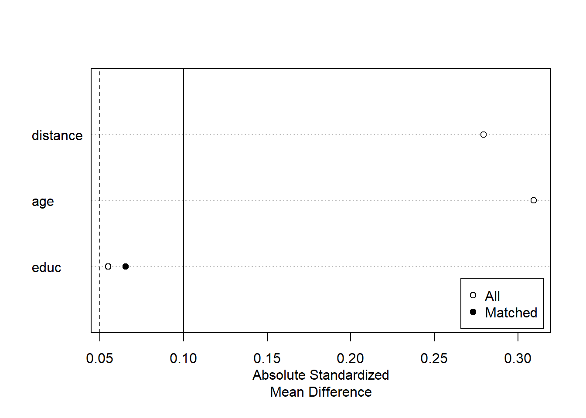

# Matching Methods {#sec-matching-methods}

Matching is a strategy that aims to eliminate---or at least minimize---potential sources of bias by constructing treatment and comparison groups with similar observed characteristics. By doing so, any observed differences in outcomes between these groups can be attributed more confidently to the treatment itself rather than to other factors. In observational research, matching is frequently combined with [Difference-in-Differences] (DiD) techniques to address issues of selection bias, particularly when multiple pre-treatment outcomes are available.

> Matching is defined as "any method that aims to equate (or"balance") the distribution of covariates in the treated and control groups." [@stuart2010matching, pp. 1]

Matching is particularly useful when:

-   Outcomes are **not yet observed**, such as in follow-up studies, and you want to construct balanced treatment/control groups.
-   Outcomes **are available**, but you wish to **reduce model dependence** and **improve robustness**.

> Conceptually, matching can also be viewed through the lens of **missing data**, since we never observe both potential outcomes $(Y_i^T, Y_i^C)$ for any unit. Hence, this topic closely relates to [Imputation (Missing Data)].

## Introduction and Motivation

### Why Match?

In many observational studies, researchers do not have the luxury of randomization. Subjects (people, firms, schools, etc.) typically select or are selected into treatment based on certain observed and/or unobserved characteristics. This can introduce systematic differences (selection bias) that confound causal inference. Matching attempts to approximate a randomized experiment by "balancing" these observed characteristics between treated and non-treated (control) units.

-   **Goal:** Reduce model dependence and clarify causal effects by ensuring that treated and control subjects have sufficiently comparable covariates.
-   **Challenge:** Even if matching achieves balance in observed covariates, any **unobserved** confounders remain a threat to identification (i.e., Matching is only a selection observables identification strategy). Matching does not magically fix bias from unobserved variables.

To understand why causal inference is difficult in observational studies, consider:

$$ 
\begin{aligned} E(Y_i^T | T) - E(Y_i^C | C) &= E(Y_i^T - Y_i^C | T) + \underbrace{[E(Y_i^C | T) - E(Y_i^C | C)]}_{\text{Selection Bias}} \\ \end{aligned} $$

-   The term $E(Y_i^T - Y_i^C | T)$ is the **causal effect** (specifically the ATT).
-   The term $E(Y_i^C | T) - E(Y_i^C | C)$ reflects **selection bias** due to systematic differences in the untreated potential outcome across treated and control groups.

Random assignment ensures:

$$ E(Y_i^C | T) = E(Y_i^C | C) $$

which eliminates selection bias. In observational data, however, this equality rarely holds.

Matching aims to mimic randomization by **conditioning on covariates** $X$:

$$ E(Y_i^C | X, T) = E(Y_i^C | X, C) $$

For example, propensity score matching achieves this balance by conditioning on the **propensity score** $P(X)$:

$$ E(Y_i^C | P(X), T) = E(Y_i^C | P(X), C) $$

(See [Propensity Scores](#sec-propensity-scores) for further discussion.)

The [Average Treatment Effect] (ATE) under matching is typically estimated as:

$$ \frac{1}{N_T} \sum_{i=1}^{N_T} \left(Y_i^T - \frac{1}{N_{C_i}} \sum_{j \in \mathcal{C}_i} Y_j^C\right) $$

where $\mathcal{C}_i$ denotes the matched controls for treated unit $i$.

Standard Errors in Matching

-   Matching does not have a closed-form standard error for the ATE or ATT.
-   Therefore, we rely on bootstrapping to estimate uncertainty.

> **Note**: Matching tends to yield larger standard errors than [OLS][Ordinary Least Squares] because it reduces the effective sample size by discarding unmatched observations.

------------------------------------------------------------------------

### Matching as "Pruning"

Professor @king2017balance suggests calling matching "**pruning**," emphasizing its role as a **preprocessing** step. The goal is to **prune** unmatched or poorly matched units before conducting analysis, reducing model dependence.

Without Matching:

-   Imbalanced data → Model dependence → Researcher discretion → Biased estimates

With Matching:

-   Balanced data → Reduces discretion → More credible causal inference

| Balance of Covariates | Complete Randomization | Fully Exact Matching |
|-----------------------|------------------------|----------------------|
| **Observed**          | On average             | Exact                |
| **Unobserved**        | On average             | On average           |

: Degree of Balance Across Designs

Fully blocked or exactly matched designs outperform randomized ones on:

-   **Imbalance**
-   **Model dependence**
-   **Efficiency and power**
-   **Bias**
-   **Robustness**
-   **Research costs**

------------------------------------------------------------------------

### Matching with DiD

Matching can be fruitfully combined with DiD when multiple pre-treatment periods are available. Such designs can help correct for selection bias under certain assumptions:

-   When selection bias is symmetric around the treatment date, standard DID (implemented symmetrically around the treatment date) remains consistent [@chabe2015analysis ].
-   If selection bias is asymmetric, simulations by @chabe2015analysis show that symmetric DID still outperforms matching alone, although having more pre-treatment observations can improve matching performance.

In short, matching is not a universal solution but often provides a helpful preprocessing step before conducting DiD or other causal estimation methods [@smith2005does].

------------------------------------------------------------------------

## Key Assumptions

Matching relies on the standard set of assumptions underpinning [selection on observables](#sec-selection-on-observables)---also known as the **back-door criterion** (see [Assumptions for Identifying Treatment Effects]). When these assumptions hold, matching can yield valid estimates of causal effects by constructing treated and control groups that are comparable on observed covariates.

1.  **Strong** [Conditional Ignorability Assumption] (Unconfoundedness)

Also known as the **no hidden bias** or **ignorability** assumption:

$$
(Y(0),\, Y(1)) \,\perp\, T \,\big|\, X
$$

This implies that, **conditional on covariates** $X$, treatment assignment is independent of the potential outcomes. In other words, there are **no unobserved confounders** once we adjust for $X$.

-   This assumption is **not testable**, but it is more plausible when all relevant confounders are observed and included in $X$.
-   It is often satisfied **approximately** when unobserved covariates are highly correlated with the observed ones.
-   If unobserved variables are unrelated to $X$, you can:
    -   Conduct **sensitivity analysis** to test the robustness of your estimates.
    -   Apply **design sensitivity** techniques: If unobserved confounding is suspected, methods such as [@heller2009split]'s design sensitivity approaches or bounding approaches (e.g., the `rbounds` R package) can be used to test how robust findings are to hidden bias.

> This is the cornerstone assumption of matching: without it, causal inference from observational data is generally invalid.

------------------------------------------------------------------------

2.  [Overlap (Positivity) Assumption] **(Common Support)**

$$
0 < P(T=1 \mid X) < 1 \quad \forall X
$$

This condition ensures that, for every value of the covariates $X$, there is a positive probability of receiving both treatment and control.

-   If this assumption fails, there are regions of covariate space where either treatment or control units are absent, making comparison impossible.
-   Matching enforces this assumption by discarding units outside of the region of common support.

> This pruning step is both a strength and limitation of matching---it improves internal validity at the cost of generalizability.

------------------------------------------------------------------------

3.  [Stable Unit Treatment Value Assumption] (SUTVA)

SUTVA requires that:

-   The potential outcomes for any individual unit do not depend on the treatment assignment of other units.

That is, there are **no interference or spillover effects** between units.

-   Mathematically, $Y_i(T_i)$ depends only on $T_i$, not on $T_j$ for any $j \neq i$.
-   Violations can occur in settings like:
    -   Education (peer effects)
    -   Epidemiology (disease transmission)
    -   Marketing (network influence)

> In cases with known spillover, efforts should be made to **reduce interactions** or explicitly **model interference**.

------------------------------------------------------------------------

Summary of Assumptions for Matching

| Assumption                   | Description                                                                         | Notation                                     |
|------------------------------|-------------------------------------------------------------------------------------|----------------------------------------------|
| **Conditional Ignorability** | No hidden confounding after conditioning on covariates                              | $(Y(0), Y(1)) \perp T \mid X$                |
| **Overlap (Positivity)**     | Each unit has a non-zero probability of treatment and control assignment            | $0 < P(T=1 \mid X) < 1$                      |
| **SUTVA**                    | No interference between units; one unit's outcome unaffected by another's treatment | $Y_i(T_i)$ unaffected by $T_j$ for $j \ne i$ |

These three assumptions form the foundation for valid causal inference using matching methods.

## Framework for Generalization

Let:

-   $P_t$, $P_c$: treated and control populations
-   $N_t$, $N_c$: random samples drawn from $P_t$, $P_c$
-   $\mu_i$, $\Sigma_i$: means and covariance matrices of the $p$ covariates in group $i \in \{t, c\}$
-   $X_j$: vector of covariates for individual $j$
-   $T_j \in \{0, 1\}$: treatment indicator (1 = treated, 0 = control)
-   $Y_j$: observed outcome
-   Assume $N_t < N_c$ (i.e., more controls than treated)

The conditional treatment effect is:

$$
\tau(x) = R_1(x) - R_0(x), \quad \text{where } R_1(x) = E[Y(1) \mid X = x], \quad R_0(x) = E[Y(0) \mid X = x]
$$

If we assume **constant treatment effects (parallel trends)**, then $\tau(x) = \tau$ for all $x$. If this assumption is relaxed, we can still estimate an **average** effect over the distribution of $X$.

**Common Estimands**

-   [Average Treatment Effect] (ATE): Average causal effect across all units.
-   [Average Treatment Effect on the Treated] (ATT): Causal effect for treated units only.

------------------------------------------------------------------------

## Steps for Matching

Most matching methods rely on:

-   **Propensity score**: summarizes $P(T=1|X)$
-   **Distance metric**: measures similarity
-   **Covariates**: assumed to satisfy ignorability

### Step 1: Define "Closeness" (Distance Metrics)

Matching requires a **distance metric** to define similarity between treated and control units.

#### Variable Selection Guidelines

-   Include as many pre-treatment covariates as possible to support conditional ignorability.
-   Avoid post-treatment variables, which introduce bias.
-   Be cautious with variables (e.g., heavy drug users) highly correlated with the outcome (e.g., heavy drinkers) but not treatment (e.g., mediators).
-   If variables are uncorrelated with both treatment and outcome, the cost of inclusion is small.

#### Distance Measures

+----------------------------+----------------------------------------------------+------------------------------------------------------------------------------------------------------------------------------------------+
| Method                     | Formula                                            | Notes                                                                                                                                    |
+============================+====================================================+==========================================================================================================================================+
| **Exact Matching**         | $D_{ij} = 0$ if $X_i = X_j$, else $\infty$         | Only feasible in low dimensions; can be relaxed via [Coarsened Exact Matching]                                                           |
+----------------------------+----------------------------------------------------+------------------------------------------------------------------------------------------------------------------------------------------+
| **Mahalanobis Distance**   | $D_{ij} = (X_i - X_j)' \Sigma^{-1}(X_i - X_j)$     | $\Sigma$ (var-covar matrix of $X$) from control group if ATT is of interest or pooled if ATE is of interest; sensitive to dimensionality |
+----------------------------+----------------------------------------------------+------------------------------------------------------------------------------------------------------------------------------------------+
| **Propensity Score**       | $D_{ij} = |e_i - e_j|$                             | Where $e_k$ is the estimated propensity score $P(T=1 \mid X_k)$ for unit $k$.                                                            |
|                            |                                                    |                                                                                                                                          |
|                            |                                                    | Advanced: **Prognostic scores** [@hansen2008prognostic] require modeling $E[Y(0)|X]$, so they depend on the outcome model.               |
+----------------------------+----------------------------------------------------+------------------------------------------------------------------------------------------------------------------------------------------+
| **Logit Propensity Score** | $D_{ij} = |\text{logit}(e_i) - \text{logit}(e_j)|$ | More stable in tails of distribution                                                                                                     |
+----------------------------+----------------------------------------------------+------------------------------------------------------------------------------------------------------------------------------------------+

> **Tip**: In high dimensions, exact and Mahalanobis matching perform poorly. Combining Mahalanobis with **propensity score calipers** can improve robustness [@rubin2000combining].

Advanced methods for longitudinal setting:

-   **Marginal Structural Models**: for time-varying treatments [@robins2000marginal]
-   **Balanced Risk Set Matching**: for survival analysis [@li2001balanced]

------------------------------------------------------------------------

### Step 2: Matching Algorithms

1.  Nearest Neighbor Matching

-   **Greedy matching**: Fast, but suboptimal under competition for controls.
-   **Optimal matching**: Minimizes global distance across all pairs.
-   **Ratio matching (k:1)**: Useful when controls outnumber treated; choose $k$ using trade-off between bias and variance [@rubin1996matching].
-   **With vs. without replacement**:
    -   **With replacement**: Improves matching quality, but requires **frequency weights** for analysis.
    -   **Without replacement**: Simpler, but less flexible.

2.  Subclassification, Full Matching, and Weighting

These methods generalize nearest-neighbor approaches by assigning **fractional weights**.

-   **Subclassification**: Partition into strata based on propensity score (e.g., quintiles).
-   **Full Matching**: Each treated unit is matched to a weighted group of controls (and vice versa) to minimize average within-set distance.
-   **Weighting**: Weighting techniques use propensity scores to estimate the ATE. However, if the weights are extreme, the resulting variance may be inflated---not due to the underlying probabilities, but due to the estimation procedure itself. To address this issue, researchers can employ (1) weight trimming or (2) doubly robust methods when using propensity scores for weighting or matching.
    -   **Inverse Probability of Treatment Weighting (IPTW)**: $$
        w_i = \frac{T_i}{\hat{e}_i} + \frac{1 - T_i}{1 - \hat{e}_i}
        $$
    -   **Odds weighting**: $$
        w_i = T_i + (1 - T_i)\frac{\hat{e}_i}{1 - \hat{e}_i}
        $$
    -   **Kernel weighting**: Smooth average over control group (popular in economics).
    -   **Trimming and Doubly-Robust Methods**: Reduce variance due to extreme weights.

3.  Assessing Common Support

-   Use propensity score histograms to visualize overlap.
-   Units outside the convex hull of $X$ (i.e., unmatched regions) can be discarded.
-   Lack of overlap indicates that some comparisons are extrapolations, not empirical matches.

------------------------------------------------------------------------

### Step 3: Diagnosing Match Quality

#### Balance Diagnostics

Matching aims to balance the covariate distributions between treated and control units. A well-matched sample satisfies:

$$
\tilde{p}(X \mid T=1) \approx \tilde{p}(X \mid T=0)
$$

where $\tilde{p}$ is the empirical distribution.

1.  Numerical Checks

-   **Standardized differences in means** (most common): Should be $< 0.1$
-   **Standardized difference of propensity scores**: Should be $< 0.25$ [@rubin2001using]
-   **Variance ratio of propensity scores**: Between 0.5 and 2.0 [@rubin2001using]
-   **Variance of residuals** after regression on propensity score (treated vs. control) for each covariate

> Avoid using p-values as diagnostics---they conflate balance with statistical power and are sensitive to sample size.

2.  Graphical Diagnostics

-   **Empirical Distribution Plots**
-   **Quantile-Quantile (QQ) Plots**
-   **Love Plots**: Summarize standardized differences before/after matching

------------------------------------------------------------------------

### Step 4: Estimating Treatment Effects

#### After Matching

-   With k:1 matching with replacement, use weights to adjust for reuse of controls.
-   Use regression adjustment on matched samples to improve precision and adjust for residual imbalance.

#### After Subclassification or Full Matching

-   **ATT**: Weight subclass-specific estimates by number of treated units.
-   **ATE**: Weight by total units per subclass.

#### Variance Estimation

Must reflect uncertainty in both:

1.  The **matching procedure** (sampling and distance calculation) (Step 3)
2.  The **outcome model** (regression, difference-in-means, etc.) (Step 4)

Often estimated via **bootstrapping**.

------------------------------------------------------------------------

## Special Considerations

1.  **Handling Missing Data**

-   Use generalized boosted models or multiple imputation [@qu2009propensity].

2.  **Violation of Ignorability**

Strategies when unobservables bias treatment:

-   Use **pre-treatment measures** of outcome
-   Compare **multiple control groups**
-   Conduct **sensitivity analysis**:
    -   Quantify correlation between unobserved confounders and both treatment and outcome to nullify the observed effect

------------------------------------------------------------------------

## Choosing a Matching Strategy

### Based on Estimand

-   **ATE**: Use IPTW or full matching
-   **ATT**:
    -   If many controls ($N_c > 3N_t$): k:1 nearest neighbor without replacement
    -   If few controls: subclassification, full matching, or odds weighting

### Based on Diagnostics

-   If balanced: proceed with regression on matched samples
-   If imbalance on few covariates: Mahalanobis matching on those
-   If imbalance on many covariates: Try k:1 matching with replacement

### Selection Criteria

-   Minimize standardized differences across many covariates
-   Especially prioritize prognostic covariates
-   Minimize number of covariates with large ($>0.25$) imbalance [@diamond2013genetic]

Matching is not one-size-fits-all. Choose methods based on the target estimand, data structure, and diagnostic results.

------------------------------------------------------------------------

## Motivating Examples

Do Teachers' Qualifications Affect Student Test Scores? [@aaronson2007teachers]

1.  **Initial Model:** $$
    Y_{ijt} = \delta_0 + Y_{ij(t-1)}\,\delta_1 + X_{it}\,\delta_2 + Z_{jt}\,\delta_3 + \epsilon_{ijt},
    $$ where $Y_{ijt}$ is the outcome (test score) of student $i$ in class $j$ at time $t$, $X_{it}$ are student-level covariates, and $Z_{jt}$ are teacher or classroom-level covariates.

2.  **Refining the Model:** $$
    Y_{ijst} = \alpha_0 + Y_{ij(t-1)}\,\alpha_1 + X_{it}\,\alpha_2 + Z_{jt}\,\alpha_3 + \gamma_s + u_{isjt},
    $$ introducing school fixed effects ($\gamma_s$). Sorting of students and teachers often happens within schools, so including fixed effects can reduce bias.

3.  **Further Adjustment via Matching:**\
    Identify schools or classes that appear to allocate teachers as-if randomly (or close to it). Match students on prior scores ($Y_{ij(t-1)}$) and other observed characteristics. Then re-run a model with interactions: $$
    \begin{aligned}
    Y_{isjt} 
    &= Y_{isj(t-1)}\,\lambda 
       + X_{it}\,\alpha_1 
       + Z_{jt}\,\alpha_{21} 
       + (Z_{jt} \times D_i)\,\alpha_{22} 
       + \gamma_s 
       + u_{isjt},
    \end{aligned}
    $$ where $D_i$ is an indicator for "high-poverty" students. Testing $\alpha_{22} = 0$ checks for heterogeneous effects of teacher experience by student poverty level.

------------------------------------------------------------------------

## Matching vs. Regression

Matching and regression are two core strategies used in observational studies to adjust for differences in covariates $X$ and estimate causal effects. While both aim to remove bias due to confounding, they approach the problem differently, particularly in how they **weight observations**, handle **functional form assumptions**, and address **covariate balance**.

Neither method can resolve the issue of **unobserved confounding**, but each can be a powerful tool when used with care and supported by appropriate diagnostics.

-   **Matching** emphasizes covariate balance by pruning the dataset to retain only comparable units. It is nonparametric, focusing on ATT.
-   **Regression** (typically [OLS][Ordinary Least Squares]) emphasizes functional form and allows for model-based adjustment, enabling the estimation of ATE and continuous or interactive effects of treatment.

Both matching and regression assign implicit or explicit weights to observations during estimation:

-   **Matching**: Weights observations more heavily in strata with more treated units, aligning with the ATT estimand.
-   [OLS][Ordinary Least Squares] **Regression**: Places more weight on strata where the variance of treatment assignment is highest---i.e., when groups are approximately balanced between treated and control (near 50/50).

This results in differing estimands and sensitivities:

> **Important Caveat**: If your [OLS][Ordinary Least Squares] estimate is biased due to unobserved confounding, your matching estimate is likely biased too. Both depend on the [selection on observables](#sec-selection-on-observables) assumption.

We explore the difference in estimands between matching and regression, especially for estimating the ATT.

### Matching Estimand

Suppose we want the treatment effect on the treated:

$$
\delta_{\text{TOT}} = E[Y_{1i} - Y_{0i} \mid D_i = 1]
$$

Using the [Law of Iterated Expectation]:

$$
\delta_{\text{TOT}} = E\left[ E[Y_{1i} \mid X_i, D_i = 1] - E[Y_{0i} \mid X_i, D_i = 1] \mid D_i = 1 \right]
$$

Assuming conditional independence:

$$
E[Y_{0i} \mid X_i, D_i = 0] = E[Y_{0i} \mid X_i, D_i = 1]
$$

Then,

$$
\begin{aligned}
\delta_{TOT} &= E [ E[ Y_{1i} | X_i, D_i = 1] - E[ Y_{0i}|X_i, D_i = 0 ]|D_i = 1 ] \\
&= E\left[ E[Y_i \mid X_i, D_i = 1] - E[Y_i \mid X_i, D_i = 0] \mid D_i = 1 \right] \\
&= E[\delta_X |D_i = 1]
\end{aligned}
$$

where $\delta_X$ is an $X$-specific difference in means at covariate value $X_i$

If $X_i$ is discrete, the matching estimand becomes:

$$
\delta_M = \sum_x \delta_x P(X_i = x \mid D_i = 1)
$$

where $P(X_i = x |D_i = 1)$ is the probability mass function for $X_i$ given $D_i = 1$

By Bayes' rule:

$$
P(X_i = x \mid D_i = 1) = \frac{P(D_i = 1 \mid X_i = x) P(X_i = x)}{P(D_i = 1)}
$$

So,

$$
\begin{aligned}
\delta_M &= \frac{\sum_x \delta_x P (D_i = 1 | X_i = x) P (X_i = x)}{\sum_x P(D_i = 1 |X_i = x)P(X_i = x)} \\
&= \sum_x \delta_x \frac{ P (D_i = 1 | X_i = x) P (X_i = x)}{\sum_x P(D_i = 1 |X_i = x)P(X_i = x)}
\end{aligned}
$$

------------------------------------------------------------------------

### Regression Estimand

In regression:

$$
Y_i = \sum_x d_{ix} \beta_x + \delta_R D_i + \varepsilon_i
$$

-   $d_{ix}$ = indicator that $X_i = x$
-   $\beta_x$ = baseline outcome at $X = x$
-   $\delta_R$ = regression estimand

Then,

$$
\begin{aligned}
\delta_R &= \frac{\sum_x \delta_x [P(D_i = 1 | X_i = x) (1 - P(D_i = 1 | X_i = x))]P(X_i = x)}{\sum_x [P(D_i = 1| X_i = x)(1 - P(D_i = 1 | X_i = x))]P(X_i = x)} \\
&= \sum_x \delta_x \frac{[P(D_i = 1 | X_i = x) (1 - P(D_i = 1 | X_i = x))]P(X_i = x)}{\sum_x [P(D_i = 1| X_i = x)(1 - P(D_i = 1 | X_i = x))]P(X_i = x)}
\end{aligned}
$$

------------------------------------------------------------------------

### Interpretation: Weighting Differences

The distinction between matching and regression comes down to how covariate-specific treatment effects $\delta_x$ are weighted:

| Type       | Weighting Function                                     | Interpretation                                                                               | Makes Sense Because...                                                                                              |
|------------|--------------------------------------------------------|----------------------------------------------------------------------------------------------|---------------------------------------------------------------------------------------------------------------------|
| Matching   | $P(D_i = 1 \mid X_i = x)$                              | Weights more heavily where more treated units exist (ATT-focused)                            | We're interested in the effect on the treated, so more weight is placed where treated units are observed            |
| Regression | $P(D_i = 1 \mid X_i = x)(1 - P(D_i = 1 \mid X_i = x))$ | Weights more where treatment assignment has high variance (i.e., near 50/50 treated/control) | These cells provide lowest-variance estimates of $\delta_x$, assuming the treatment effect is homogenous across $X$ |

**Summary Table: Matching vs. Regression**

| Feature                    | Matching                                                 | Regression (OLS)                                    |
|----------------------------|----------------------------------------------------------|-----------------------------------------------------|
| **Functional Form**        | Less parametric; no assumption of linearity              | Parametric; usually assumes linearity               |
| **Primary Estimand**       | ATT (effect on the treated)                              | ATE or effects of continuous/interacted treatments  |
| **Balance**                | Enforces balance via matched samples                     | Does not guarantee balance                          |
| **Diagnostics**            | Covariate SMDs, QQ plots, empirical distributions        | Residual plots, R-squared, heteroskedasticity tests |
| **Unobserved Confounding** | Cannot be resolved; assumes ignorability                 | Same limitation                                     |
| **Standard Errors**        | Larger; require bootstrapping                            | Smaller; closed-form under assumptions              |
| **Best Used When**         | High control-to-treated ratio; misspecification concerns | Model is correctly specified; sufficient overlap    |

------------------------------------------------------------------------

**Qualitative Comparisons**

| Matching                                                            | Regression                                                           |
|---------------------------------------------------------------------|----------------------------------------------------------------------|
| Not sensitive to the form of covariate-outcome relationship         | Can estimate continuous or interacted treatment effects              |
| Easier to assess balance and interpret diagnostics                  | Easier to estimate the effects of all covariates, not just treatment |
| Facilitates clear visual evaluation of overlap and balance          | Less intuitive diagnostics; model diagnostics used                   |
| Helps when treatment is rare (prunes clearly incomparable controls) | Performs better with balanced treatment assignment                   |
| Forces explicit enforcement of common support                       | May extrapolate outside the support of covariate distributions       |

------------------------------------------------------------------------

## Software and Practical Implementation

Many R packages provide functionality for implementing the various matching methods discussed above. Below is an overview of some popular options:

-   **MatchIt**:\
    Implements a wide range of matching methods (nearest neighbor, optimal, full, subclassification, exact, etc.). It focuses on "preprocessing" data before a final outcome analysis.

-   **Matching**:\
    Provides multivariate and propensity score matching, including options for *exact* and *nearest neighbor* matching. The package also offers functions to evaluate balance and to conduct sensitivity analyses.

-   **cem** (Coarsened Exact Matching):\
    Uses a coarsening approach to create strata within which exact matching can be performed. This can reduce imbalance by discarding units that do not overlap in coarsened covariate space.

-   **optmatch**:\
    Enables *optimal matching* with variable matching ratios and full matching, allowing for flexible group constructions that minimize overall distance.

-   **MatchingFrontier** [@king2017balance]:\
    Finds the "frontier" of matching solutions by balancing sample size (or other constraints) against covariate balance. Allows analysts to see trade-offs in real time.

-   **CBPS** (Covariate Balancing Propensity Score):\
    Estimates propensity scores such that covariate balance is directly optimized. This can help avoid iterative re-specification of the propensity score model.

-   **PanelMatch** [@rauh2025panelmatch]:\
    Tailored to panel (longitudinal) data settings, providing matching methods that exploit repeated observations over time (e.g., for DID-type analyses in a time-series cross-sectional environment).

-   **PSAgraphics**:\
    Specializes in visual diagnostics for propensity score analyses, offering graphical tools to inspect balance and common support.

-   **rbounds**:\
    Conducts **Rosenbaum bounds** sensitivity analysis on matched data. Researchers can examine how a hypothetical unmeasured confounder could undermine their estimated treatment effects.

-   **twang**:\
    Implements *generalized boosted models (GBM)* to estimate propensity scores. Often used for weighting approaches such as inverse probability weighting (IPW).

In practice, the choice of software and methods hinges on the study design, the nature of the data, and the researcher's theoretical expectations regarding treatment assignment.

------------------------------------------------------------------------

## Selection on Observables {#sec-selection-on-observables}

### MatchIt

Procedure typically involves (proposed by [Noah Freifer](https://cran.r-project.org/web/packages/MatchIt/vignettes/MatchIt.html) using `MatchIt`)

1.  planning
2.  matching
3.  checking (balance)
4.  estimating the treatment effect


``` r
library(MatchIt)
data("lalonde")
```

examine `treat` on `re78`

1.  Planning

-   select type of effect to be estimated (e.g., mediation effect, conditional effect, marginal effect)

-   select the target population

-   select variables to match/balance [@austin2011optimal] [@vanderweele2019principles]

2.  Check Initial Imbalance


``` r
# No matching; constructing a pre-match matchit object
m.out0 <- matchit(
    formula(treat ~ age + educ + race 
            + married + nodegree + re74 + re75, env = lalonde),
    data = data.frame(lalonde),
    method = NULL,
    # assess balance before matching
    distance = "glm" # logistic regression
)

# Checking balance prior to matching
summary(m.out0)

```

3.  Matching


``` r
# 1:1 NN PS matching w/o replacement
m.out1 <- matchit(treat ~ age + educ,
                  data = lalonde,
                  method = "nearest",
                  distance = "glm")
m.out1
#> A `matchit` object
#>  - method: 1:1 nearest neighbor matching without replacement
#>  - distance: Propensity score
#>              - estimated with logistic regression
#>  - number of obs.: 614 (original), 370 (matched)
#>  - target estimand: ATT
#>  - covariates: age, educ
```

4.  Check balance

Sometimes you have to make trade-off between balance and sample size.


``` r
# Checking balance after NN matching
summary(m.out1, un = FALSE)
#> 
#> Call:
#> matchit(formula = treat ~ age + educ, data = lalonde, method = "nearest", 
#>     distance = "glm")
#> 
#> Summary of Balance for Matched Data:
#>          Means Treated Means Control Std. Mean Diff. Var. Ratio eCDF Mean
#> distance        0.3080        0.3077          0.0094     0.9963    0.0033
#> age            25.8162       25.8649         -0.0068     1.0300    0.0050
#> educ           10.3459       10.2865          0.0296     0.5886    0.0253
#>          eCDF Max Std. Pair Dist.
#> distance   0.0432          0.0146
#> age        0.0162          0.0597
#> educ       0.1189          0.8146
#> 
#> Sample Sizes:
#>           Control Treated
#> All           429     185
#> Matched       185     185
#> Unmatched     244       0
#> Discarded       0       0

# examine visually
plot(m.out1, type = "jitter", interactive = FALSE)
```


``` r

plot(
    m.out1,
    type = "qq",
    interactive = FALSE,
    which.xs = c("age")
)
```


Try Full Match (i.e., every treated matches with one control, and every control with one treated).


``` r
# Full matching on a probit PS
m.out2 <- matchit(treat ~ age + educ, 
                  data = lalonde,
                  method = "full", 
                  distance = "glm", 
                  link = "probit")
m.out2
#> A `matchit` object
#>  - method: Optimal full matching
#>  - distance: Propensity score
#>              - estimated with probit regression
#>  - number of obs.: 614 (original), 614 (matched)
#>  - target estimand: ATT
#>  - covariates: age, educ
```

Checking balance again


``` r
# Checking balance after full matching
summary(m.out2, un = FALSE)
#> 
#> Call:
#> matchit(formula = treat ~ age + educ, data = lalonde, method = "full", 
#>     distance = "glm", link = "probit")
#> 
#> Summary of Balance for Matched Data:
#>          Means Treated Means Control Std. Mean Diff. Var. Ratio eCDF Mean
#> distance        0.3082        0.3082         -0.0003     0.9847    0.0036
#> age            25.8162       25.7805          0.0050     0.9950    0.0071
#> educ           10.3459       10.2146          0.0653     0.4485    0.0458
#>          eCDF Max Std. Pair Dist.
#> distance   0.0270          0.0409
#> age        0.0251          0.1198
#> educ       0.1159          1.1123
#> 
#> Sample Sizes:
#>               Control Treated
#> All            429.       185
#> Matched (ESS)  197.42     185
#> Matched        429.       185
#> Unmatched        0.         0
#> Discarded        0.         0

plot(summary(m.out2))
```



Exact Matching


``` r
# Full matching on a probit PS
m.out3 <-
    matchit(
        treat ~ age + educ,
        data = lalonde,
        method = "exact"
    )
m.out3
#> A `matchit` object
#>  - method: Exact matching
#>  - number of obs.: 614 (original), 332 (matched)
#>  - target estimand: ATT
#>  - covariates: age, educ
```

Subclassfication


``` r
m.out4 <- matchit(
    treat ~ age + educ, 
    data = lalonde,
    method = "subclass"
)
m.out4
#> A `matchit` object
#>  - method: Subclassification (6 subclasses)
#>  - distance: Propensity score
#>              - estimated with logistic regression
#>  - number of obs.: 614 (original), 614 (matched)
#>  - target estimand: ATT
#>  - covariates: age, educ

# Or you can use in conjunction with "nearest"
m.out4 <- matchit(
    treat ~ age + educ,
    data = lalonde,
    method = "nearest",
    option = "subclass"
)
m.out4
#> A `matchit` object
#>  - method: 1:1 nearest neighbor matching without replacement
#>  - distance: Propensity score
#>              - estimated with logistic regression
#>  - number of obs.: 614 (original), 370 (matched)
#>  - target estimand: ATT
#>  - covariates: age, educ
```

Optimal Matching


``` r
m.out5 <- matchit(
    treat ~ age + educ, 
    data = lalonde,
    method = "optimal",
    ratio = 2
)
m.out5
#> A `matchit` object
#>  - method: 2:1 optimal pair matching
#>  - distance: Propensity score
#>              - estimated with logistic regression
#>  - number of obs.: 614 (original), 555 (matched)
#>  - target estimand: ATT
#>  - covariates: age, educ
```

Genetic Matching


``` r
m.out6 <- matchit(
    treat ~ age + educ, 
    data = lalonde,
    method = "genetic"
)
m.out6
#> A `matchit` object
#>  - method: 1:1 genetic matching without replacement
#>  - distance: Propensity score
#>              - estimated with logistic regression
#>  - number of obs.: 614 (original), 370 (matched)
#>  - target estimand: ATT
#>  - covariates: age, educ
```

4.  Estimating the Treatment Effect


``` r
# get matched data
m.data1 <- match.data(m.out1)

head(m.data1)
#>      treat age educ   race married nodegree re74 re75       re78  distance
#> NSW1     1  37   11  black       1        1    0    0  9930.0460 0.2536942
#> NSW2     1  22    9 hispan       0        1    0    0  3595.8940 0.3245468
#> NSW3     1  30   12  black       0        0    0    0 24909.4500 0.2881139
#> NSW4     1  27   11  black       0        1    0    0  7506.1460 0.3016672
#> NSW5     1  33    8  black       0        1    0    0   289.7899 0.2683025
#> NSW6     1  22    9  black       0        1    0    0  4056.4940 0.3245468
#>      weights subclass
#> NSW1       1        1
#> NSW2       1        2
#> NSW3       1        3
#> NSW4       1        4
#> NSW5       1        5
#> NSW6       1        6
```


``` r
library("lmtest") #coeftest
library("sandwich") #vcovCL

# imbalance matched dataset
fit1 <- lm(re78 ~ treat + age + educ ,
           data = m.data1, 
           weights = weights)

coeftest(fit1, vcov. = vcovCL, cluster = ~subclass)
#> 
#> t test of coefficients:
#> 
#>              Estimate Std. Error t value Pr(>|t|)   
#> (Intercept)  -174.902   2445.013 -0.0715 0.943012   
#> treat       -1139.085    780.399 -1.4596 0.145253   
#> age           153.133     55.317  2.7683 0.005922 **
#> educ          358.577    163.860  2.1883 0.029278 * 
#> ---
#> Signif. codes:  0 '***' 0.001 '**' 0.01 '*' 0.05 '.' 0.1 ' ' 1
```

`treat` coefficient = estimated ATT


``` r
# balance matched dataset 
m.data2 <- match.data(m.out2)

fit2 <- lm(re78 ~ treat + age + educ , 
           data = m.data2, weights = weights)

coeftest(fit2, vcov. = vcovCL, cluster = ~subclass)
#> 
#> t test of coefficients:
#> 
#>             Estimate Std. Error t value Pr(>|t|)   
#> (Intercept)  608.213   3206.875  0.1897 0.849639   
#> treat       -744.499    750.324 -0.9922 0.321476   
#> age          149.329     57.465  2.5986 0.009587 **
#> educ         254.238    246.309  1.0322 0.302391   
#> ---
#> Signif. codes:  0 '***' 0.001 '**' 0.01 '*' 0.05 '.' 0.1 ' ' 1
```

When reporting, remember to mention

1.  the matching specification (method, and additional options)
2.  the distance measure (e.g., propensity score)
3.  other methods, and rationale for the final chosen method.
4.  balance statistics of the matched dataset.
5.  number of matched, unmatched, discarded
6.  estimation method for treatment effect.

### designmatch

This package includes

-   `distmatch` optimal distance matching

-   `bmatch` optimal bipartile matching

-   `cardmatch` optimal cardinality matching

-   `profmatch` optimal profile matching

-   `nmatch` optimal nonbipartile matching


``` r
library(designmatch)
```

### MatchingFrontier

As mentioned in `MatchIt`, you have to make trade-off (also known as bias-variance trade-off) between balance and sample size. An automated procedure to optimize this trade-off is implemented in `MatchingFrontier` [@king2017balance], which solves this joint optimization problem.

Following `MatchingFrontier` [guide](https://projects.iq.harvard.edu/files/frontier/files/using_matchingfrontier.pdf)


``` r
# library(devtools)
# install_github('ChristopherLucas/MatchingFrontier')
library(MatchingFrontier)
data("lalonde")
# choose var to match on
match.on <-
    colnames(lalonde)[!(colnames(lalonde) %in% c('re78', 'treat'))]
match.on

# Mahanlanobis frontier (default)
mahal.frontier <-
    makeFrontier(
        dataset = lalonde,
        treatment = "treat",
        match.on = match.on
    )
mahal.frontier

# L1 frontier
L1.frontier <-
    makeFrontier(
        dataset = lalonde,
        treatment = 'treat',
        match.on = match.on,
        QOI = 'SATT',
        metric = 'L1',
        ratio = 'fixed'
    )
L1.frontier

# estimate effects along the frontier

# Set base form
my.form <-
    as.formula(re78 ~ treat + age + black + education 
               + hispanic + married + nodegree + re74 + re75)

# Estimate effects for the mahalanobis frontier
mahal.estimates <-
    estimateEffects(
        mahal.frontier,
        're78 ~ treat',
        mod.dependence.formula = my.form,
        continuous.vars = c('age', 'education', 're74', 're75'),
        prop.estimated = .1,
        means.as.cutpoints = TRUE
    )

# Estimate effects for the L1 frontier
L1.estimates <-
    estimateEffects(
        L1.frontier,
        're78 ~ treat',
        mod.dependence.formula = my.form,
        continuous.vars = c('age', 'education', 're74', 're75'),
        prop.estimated = .1,
        means.as.cutpoints = TRUE
    )

# Plot covariates means 
# plotPrunedMeans()


# Plot estimates (deprecated)
# plotEstimates(
#     L1.estimates,
#     ylim = c(-10000, 3000),
#     cex.lab = 1.4,
#     cex.axis = 1.4,
#     panel.first = grid(NULL, NULL, lwd = 2,)
# )

# Plot estimates
plotMeans(L1.frontier)


# parallel plot
parallelPlot(
    L1.frontier,
    N = 400,
    variables = c('age', 're74', 're75', 'black'),
    treated.col = 'blue',
    control.col = 'gray'
)

# export matched dataset
# take 400 units
matched.data <- generateDataset(L1.frontier, N = 400) 
```

### Propensity Scores {#sec-propensity-scores}

Even though I mention the propensity scores matching method here, it is no longer recommended to use such method in research and publication [@king2019propensity] because it increases

-   imbalance

-   inefficiency

-   model dependence: small changes in the model specification lead to big changes in model results

-   bias

[@abadie2016matching]note

-   The initial estimation of the propensity score influences the large sample distribution of the estimators.

-   Adjustments are made to the large sample variances of these estimators for both ATE and ATT.

    -   The adjustment for the ATE estimator is either negative or zero, indicating greater efficiency when matching on an estimated propensity score versus the true score in large samples.

    -   For the ATET estimator, the sign of the adjustment depends on the data generating process. Neglecting the estimation error in the propensity score can lead to inaccurate confidence intervals for the ATT estimator, making them either too large or too small.

PSM tries to accomplish complete randomization while other methods try to achieve fully blocked. Hence, you probably better off use any other methods.

Propensity is "the probability of receiving the treatment given the observed covariates." [@rosenbaum1985bias]

Equivalently, it can to understood as the probability of being treated.

$$
e_i (X_i) = P(T_i = 1 | X_i)
$$

Estimation using

-   logistic regression

-   Non parametric methods:

    -   boosted CART

    -   generalized boosted models (gbm)

Steps by Gary King's [slides](https://www.youtube.com/watch?v=rBv39pK1iEs&ab_channel=MethodsColloquium)

-   reduce k elements of X to scalar

-   $\pi_i \equiv P(T_i = 1|X) = \frac{1}{1+e^{X_i \beta}}$

-   Distance ($X_c, X_t$) = $|\pi_c - \pi_t|$

-   match each treated unit to the nearest control unit

-   control units: not reused; pruned if unused

-   prune matches if distances \> caliper

In the best case scenario, you randomly prune, which increases imbalance

Other methods dominate because they try to match exactly hence

-   $X_c = X_t \to \pi_c = \pi_t$ (exact match leads to equal propensity scores) but

-   $\pi_c = \pi_t \nrightarrow X_c = X_t$ (equal propensity scores do not necessarily lead to exact match)

Notes:

-   Do not include/control for irrelevant covariates because it leads your PSM to be more random, hence more imbalance

-   Do not include for [@bhattacharya2007instrumental] instrumental variable in the predictor set of a propensity score matching estimator. More generally, using variables that do not control for potential confounders, even if they are predictive of the treatment, can result in biased estimates

What you left with after pruning is more important than what you start with then throw out.

Diagnostics:

-   balance of the covariates

-   no need to concern about collinearity

-   can't use c-stat or stepwise because those model fit stat do not apply

Application

-   Finance:

    -   @hirtle2020impact examine the impact of bank supervision on risk, profitability, and growth, using a matched sample approach to show that increased supervisory attention leads to less risky loan portfolios and reduced volatility without compromising profitability or growth.

#### Look Ahead Propensity Score Matching

-   [@bapna2018monetizing]

### Mahalanobis Distance

Approximates fully blocked experiment

Distance $(X_c,X_t)$ = $\sqrt{(X_c - X_t)'S^{-1}(X_c - X_t)}$

where $S^{-1}$ standardize the distance

In application we use Euclidean distance.

Prune unused control units, and prune matches if distance \> caliper

### Coarsened Exact Matching

Steps from Gray King's [slides](https://www.youtube.com/watch?v=rBv39pK1iEs&ab_channel=MethodsColloquium) International Methods Colloquium talk 2015

-   Temporarily coarsen $X$

-   Apply exact matching to the coarsened $X, C(X)$

    -   sort observation into strata, each with unique values of $C(X)$

    -   prune stratum with 0 treated or 0 control units

-   Pass on original (uncoarsened) units except those pruned

Properties:

-   Monotonic imbalance bounding (MIB) matching method

    -   maximum imbalance between the treated and control chosen ex ante

-   meets congruence principle

-   robust to measurement error

-   can be implemented with multiple imputation

-   works well for multi-category treatments

Assumptions:

-   Ignorability (i.e., no omitted variable bias)

More detail in [@iacus2012causal]

Example by [package's authors](https://cran.r-project.org/web/packages/cem/vignettes/cem.pdf)


``` r
library(cem)
data(LeLonde)

Le <- data.frame(na.omit(LeLonde)) # remove missing data
# treated and control groups
tr <- which(Le$treated==1)
ct <- which(Le$treated==0)
ntr <- length(tr)
nct <- length(ct)

# unadjusted, biased difference in means
mean(Le$re78[tr]) - mean(Le$re78[ct])
#> [1] 759.0479

# pre-treatment covariates
vars <-
    c(
        "age",
        "education",
        "black",
        "married",
        "nodegree",
        "re74",
        "re75",
        "hispanic",
        "u74",
        "u75",
        "q1"
    )

# overall imbalance statistics
imbalance(group=Le$treated, data=Le[vars]) # L1 = 0.902
#> 
#> Multivariate Imbalance Measure: L1=0.902
#> Percentage of local common support: LCS=5.8%
#> 
#> Univariate Imbalance Measures:
#> 
#>               statistic   type           L1 min 25%      50%       75%
#> age        -0.252373042 (diff) 5.102041e-03   0   0   0.0000   -1.0000
#> education   0.153634710 (diff) 8.463851e-02   1   0   1.0000    1.0000
#> black      -0.010322734 (diff) 1.032273e-02   0   0   0.0000    0.0000
#> married    -0.009551495 (diff) 9.551495e-03   0   0   0.0000    0.0000
#> nodegree   -0.081217371 (diff) 8.121737e-02   0  -1   0.0000    0.0000
#> re74      -18.160446880 (diff) 5.551115e-17   0   0 284.0715  806.3452
#> re75      101.501761679 (diff) 5.551115e-17   0   0 485.6310 1238.4114
#> hispanic   -0.010144756 (diff) 1.014476e-02   0   0   0.0000    0.0000
#> u74        -0.045582186 (diff) 4.558219e-02   0   0   0.0000    0.0000
#> u75        -0.065555292 (diff) 6.555529e-02   0   0   0.0000    0.0000
#> q1          7.494021189 (Chi2) 1.067078e-01  NA  NA       NA        NA
#>                  max
#> age          -6.0000
#> education     1.0000
#> black         0.0000
#> married       0.0000
#> nodegree      0.0000
#> re74      -2139.0195
#> re75        490.3945
#> hispanic      0.0000
#> u74           0.0000
#> u75           0.0000
#> q1                NA

# drop other variables that are not pre - treatmentt matching variables
todrop <- c("treated", "re78")
imbalance(group=Le$treated, data=Le, drop=todrop)
#> 
#> Multivariate Imbalance Measure: L1=0.902
#> Percentage of local common support: LCS=5.8%
#> 
#> Univariate Imbalance Measures:
#> 
#>               statistic   type           L1 min 25%      50%       75%
#> age        -0.252373042 (diff) 5.102041e-03   0   0   0.0000   -1.0000
#> education   0.153634710 (diff) 8.463851e-02   1   0   1.0000    1.0000
#> black      -0.010322734 (diff) 1.032273e-02   0   0   0.0000    0.0000
#> married    -0.009551495 (diff) 9.551495e-03   0   0   0.0000    0.0000
#> nodegree   -0.081217371 (diff) 8.121737e-02   0  -1   0.0000    0.0000
#> re74      -18.160446880 (diff) 5.551115e-17   0   0 284.0715  806.3452
#> re75      101.501761679 (diff) 5.551115e-17   0   0 485.6310 1238.4114
#> hispanic   -0.010144756 (diff) 1.014476e-02   0   0   0.0000    0.0000
#> u74        -0.045582186 (diff) 4.558219e-02   0   0   0.0000    0.0000
#> u75        -0.065555292 (diff) 6.555529e-02   0   0   0.0000    0.0000
#> q1          7.494021189 (Chi2) 1.067078e-01  NA  NA       NA        NA
#>                  max
#> age          -6.0000
#> education     1.0000
#> black         0.0000
#> married       0.0000
#> nodegree      0.0000
#> re74      -2139.0195
#> re75        490.3945
#> hispanic      0.0000
#> u74           0.0000
#> u75           0.0000
#> q1                NA
```

automated coarsening


``` r
mat <-
    cem(
        treatment = "treated",
        data = Le,
        drop = "re78",
        keep.all = TRUE
    )
#> 
#> Using 'treated'='1' as baseline group
mat
#>            G0  G1
#> All       392 258
#> Matched    95  84
#> Unmatched 297 174

# mat$w
```

coarsening by explicit user choice


``` r
# categorial variables
levels(Le$q1) # grouping option
#> [1] "agree"             "disagree"          "neutral"          
#> [4] "no opinion"        "strongly agree"    "strongly disagree"
q1.grp <-
    list(
        c("strongly agree", "agree"),
        c("neutral", "no opinion"),
        c("strongly disagree", "disagree")
    ) # if you want ordered categories

# continuous variables
table(Le$education)
#> 
#>   3   4   5   6   7   8   9  10  11  12  13  14  15 
#>   1   5   4   6  12  55 106 146 173 113  19   9   1
educut <- c(0, 6.5, 8.5, 12.5, 17)  # use cutpoints

mat1 <-
    cem(
        treatment = "treated",
        data = Le,
        drop = "re78",
        cutpoints = list(education = educut),
        grouping = list(q1 = q1.grp)
    )
#> 
#> Using 'treated'='1' as baseline group
mat1
#>            G0  G1
#> All       392 258
#> Matched   158 115
#> Unmatched 234 143
```

-   Can also use progressive coarsening method to control the number of matches.

-   `cem` can also handle some missingness.

### Genetic Matching

-   GM uses iterative checking process of propensity scores, which combines propensity scores and Mahalanobis distance.

    -   GenMatch [@diamond2013genetic]

-   GM is arguably "superior" method than nearest neighbor or full matching in imbalanced data

-   Use a genetic search algorithm to find weights for each covariate such that we have optimal balance.

-   Implementation

    -   could use *with replacement*

    -   balance can be based on

        -   paired $t$-tests (dichotomous variables)

        -   Kolmogorov-Smirnov (multinomial and continuous)

Packages

`Matching`


``` r
library(Matching)
data(lalonde)
attach(lalonde)

#The covariates we want to match on
X = cbind(age, educ, black, hisp, married, nodegr, u74, u75, re75, re74)

#The covariates we want to obtain balance on
BalanceMat <-
    cbind(age,
          educ,
          black,
          hisp,
          married,
          nodegr,
          u74,
          u75,
          re75,
          re74,
          I(re74 * re75))

#
#Let's call GenMatch() to find the optimal weight to give each
#covariate in 'X' so as we have achieved balance on the covariates in
#'BalanceMat'. This is only an example so we want GenMatch to be quick
#so the population size has been set to be only 16 via the 'pop.size'
#option. This is *WAY* too small for actual problems.
#For details see http://sekhon.berkeley.edu/papers/MatchingJSS.pdf.
#
genout <-
    GenMatch(
        Tr = treat,
        X = X,
        BalanceMatrix = BalanceMat,
        estimand = "ATE",
        M = 1,
        pop.size = 16,
        max.generations = 10,
        wait.generations = 1
    )

#The outcome variable
Y=re78/1000

#
# Now that GenMatch() has found the optimal weights, let's estimate
# our causal effect of interest using those weights
#
mout <-
    Match(
        Y = Y,
        Tr = treat,
        X = X,
        estimand = "ATE",
        Weight.matrix = genout
    )
summary(mout)

#                        
#Let's determine if balance has actually been obtained on the variables of interest
#                        
mb <-
    MatchBalance(
        treat ~ age + educ + black + hisp + married + nodegr 
        + u74 + u75 + re75 + re74 + I(re74 * re75),
        match.out = mout,
        nboots = 500
    )

```

### Entropy Balancing

[@hainmueller2012entropy]

-   Entropy balancing is a method for achieving covariate balance in observational studies with binary treatments.

-   It uses a maximum entropy reweighting scheme to ensure that treatment and control groups are balanced based on sample moments.

-   This method adjusts for inequalities in the covariate distributions, reducing dependence on the model used for estimating treatment effects.

-   Entropy balancing improves balance across all included covariate moments and removes the need for repetitive balance checking and iterative model searching.

### Matching for high-dimensional data

One could reduce the number of dimensions using methods such as:

-   Lasso [@gordon2019comparison]

-   Penalized logistic regression [@eckles2021bias]

-   PCA (Principal Component Analysis)

-   Locality Preserving Projections (LPP) [@li2016matching]

-   Random projection

-   Autoencoders [@ramachandra2018deep]

Additionally, one could jointly does dimension reduction while balancing the distributions of the control and treated groups [@yao2018representation].

### Matching for time series-cross-section data

Examples: [@scheve2012democracy] and [@acemoglu2019democracy]

Identification strategy:

-   Within-unit over-time variation

-   within-time across-units variation

See [DID with in and out treatment condition] for details of this method

### Matching for multiple treatments

In cases where you have multiple treatment groups, and you want to do matching, it's important to have the same baseline (control) group. For more details, see

-   [@mccaffrey2013tutorial]

-   [@lopez2017estimation]

-   [@zhao2021propensity]: also for continuous treatment

If you insist on using the `MatchIt` package, then see this [answer](https://stats.stackexchange.com/questions/405019/matching-with-multiple-treatments)

### Matching for multi-level treatments

See [@yang2016propensity]

Package in R `shuyang1987/multilevelMatching` on Github

### Matching for repeated treatments

<https://cran.r-project.org/web/packages/twang/vignettes/iptw.pdf>

package in R `twang`

## Selection on Unobservables {#sec-selection-on-unobservables}

There are several ways one can deal with selection on unobservables:

1.  [Rosenbaum Bounds](#sec-rosenbaum-bounds)

2.  [Endogenous Sample Selection] (i.e., Heckman-style correction): examine the $\lambda$ term to see whether it's significant (sign of endogenous selection)

3.  [Relative Correlation Restrictions]

4.  [Coefficient-stability Bounds]

### Rosenbaum Bounds {#sec-rosenbaum-bounds}

Examples in marketing

-   [@oestreicher2013content]: A range of 1.5 to 1.8 is important for the effect of the level of community participation of users on their willingness to pay for premium services.

-   [@sun2013ad]: A factor of 1.5 is essential for understanding the relationship between the launch of an ad revenue-sharing program and the popularity of content.

-   [@manchanda2015social]: A factor of 1.6 is required for the social dollar effect to be nullified.

-   [@sudhir2015peter]: A factor of 1.9 is needed for IT adoption to impact labor productivity, and 2.2 for IT adoption to affect floor productivity.

-   [@proserpio2017]: A factor of 2 is necessary for the firm's use of management responses to influence online reputation.

-   [@zhang2022makes]: A factor of 1.55 is critical for the acquisition of verified images to drive demand for Airbnb properties.

-   [@chae2023paywall]: A factor of 27 (not a typo) is significant in how paywall suspensions affect subsequent subscription decisions.

General

-   [Matching Methods](#sec-matching-methods) are favored for estimating treatment effects in observational data, offering advantages over regression methods because

    -   It reduces reliance on functional form assumptions.

    -   Assumes all selection-influencing covariates are observable; estimates are unbiased if no unobserved confounders are missed.

-   Concerns arise when potentially relevant covariates are unmeasured.

    -   [Rosenbaum Bounds](examine%20departure%20from%20assumption%20of%20free%20hidden%20bias%20due%20to%20unobservables.) assess the overall sensitivity of coefficient estimates to hidden bias [@rosenbaum2002overt] without having knowledge (e.g., direction) of the bias. Because the unboservables that cause hidden bias have to both affect selection into treatment by a factor of $\Gamma$ and predictive of outcome, this method is also known as **worst case analyses** [@diprete2004assessing].

-   Can't provide precise bounds on estimates of treatment effects (see [Relative Correlation Restrictions])

-   Typically, we show both p-value and H-L point estimate for each level of gamma $\Gamma$

With random treatment assignment, we can use the non-parametric test (Wilcoxon signed rank test) to see if there is treatment effect.

Without random treatment assignment (i.e., observational data), we cannot use this test. With [Selection on Observables](#sec-selection-on-observables), we can use this test if we believe there are no unmeasured confounders. And this is where @rosenbaum2002attributing can come in to talk about the believability of this notion.

In layman's terms, consider that the treatment assignment is based on a method where the odds of treatment for a unit and its control differ by a multiplier $\Gamma$

-   For example, $\Gamma = 1$ means that the odds of assignment are identical, indicating random treatment assignment.
-   Another example, $\Gamma = 2$, in the same matched pair, one unit is twice as likely to receive the treatment (due to unobservables).
-   Since we can't know $\Gamma$ with certainty, we run sensitivity analysis to see if the results change with different values of $\Gamma$
-   This bias is the product of an unobservable that influences both treatment selection and outcome by a factor $\Gamma$ (omitted variable bias)

In technical terms,

-   **Treatment Assignment and Probability**:
    -   Consider unit $j$ with a probability $\pi_j$ of receiving the treatment, and unit $i$ with $\pi_i$.
    -   Ideally, after matching, if there's no hidden bias, we'd have $\pi_i = \pi_j$.
    -   However, observing $\pi_i \neq \pi_j$ raises questions about potential biases affecting our inference. This is evaluated using the odds ratio.
-   **Odds Ratio and Hidden Bias**:
    -   The odds of treatment for a unit $j$ is defined as $\frac{\pi_j}{1 - \pi_j}$.
    -   The odds ratio between two matched units $i$ and $j$ is constrained by $\frac{1}{\Gamma} \le \frac{\pi_i / (1- \pi_i)}{\pi_j/ (1- \pi_j)} \le \Gamma$.
        -   If $\Gamma = 1$, it implies an absence of hidden bias.
        -   If $\Gamma = 2$, the odds of receiving treatment could differ by up to a factor of 2 between the two units.
-   **Sensitivity Analysis Using Gamma**:
    -   The value of $\Gamma$ helps measure the potential departure from a bias-free study.
    -   Sensitivity analysis involves varying $\Gamma$ to examine how inferences might change with the presence of hidden biases.
-   **Incorporating Unobserved Covariates**:
    -   Consider a scenario where unit $i$ has observed covariates $x_i$ and an unobserved covariate $u_i$, that both affect the outcome.
    -   A logistic regression model could link the odds of assignment to these covariates: $\log(\frac{\pi_i}{1 - \pi_i}) = \kappa x_i + \gamma u_i$, where $\gamma$ represents the impact of the unobserved covariate.
-   **Steps for Sensitivity Analysis** (We could create a table of different levels of $\Gamma$ to assess how the magnitude of biases can affect our evidence of the treatment effect (estimate):
    1.  Select a range of values for $\Gamma$ (e.g., $1 \to 2$).
    2.  Assess how the p-value or the magnitude of the treatment effect [@hodges2011estimates] (for more details, see [@hollander2013nonparametric]) changes with varying $\Gamma$ values.
    3.  Employ specific randomization tests based on the type of outcome to establish bounds on inferences.
        -   report the minimum value of $\Gamma$ at which the treatment treat is nullified (i.e., become insignificant). And the literature's rules of thumb is that if $\Gamma > 2$, then we have strong evidence for our treatment effect is robust to large biases [@proserpio2017online]

Notes:

-   If we have treatment assignment is clustered (e.g., within school, within state) we need to adjust the bounds for clustered treatment assignment [@hansen2014clustered] (similar to clustered standard errors).

Packages

-   `rbounds` [@keele2010overview]

-   `sensitivitymv` [@rosenbaum2015two]

Since we typically assess our estimate sensitivity to unboservables after matching, we first do some matching.


``` r
library(MatchIt)
library(Matching)
data("lalonde")

matched <- MatchIt::matchit(
    treat ~ age + educ,
    data = lalonde,
    method = "nearest"
)
summary(matched)
#> 
#> Call:
#> MatchIt::matchit(formula = treat ~ age + educ, data = lalonde, 
#>     method = "nearest")
#> 
#> Summary of Balance for All Data:
#>          Means Treated Means Control Std. Mean Diff. Var. Ratio eCDF Mean
#> distance        0.4203        0.4125          0.1689     1.2900    0.0431
#> age            25.8162       25.0538          0.1066     1.0278    0.0254
#> educ           10.3459       10.0885          0.1281     1.5513    0.0287
#>          eCDF Max
#> distance   0.1251
#> age        0.0652
#> educ       0.1265
#> 
#> Summary of Balance for Matched Data:
#>          Means Treated Means Control Std. Mean Diff. Var. Ratio eCDF Mean
#> distance        0.4203        0.4179          0.0520     1.1691    0.0105
#> age            25.8162       25.5081          0.0431     1.1518    0.0148
#> educ           10.3459       10.2811          0.0323     1.5138    0.0224
#>          eCDF Max Std. Pair Dist.
#> distance   0.0595          0.0598
#> age        0.0486          0.5628
#> educ       0.0757          0.3602
#> 
#> Sample Sizes:
#>           Control Treated
#> All           260     185
#> Matched       185     185
#> Unmatched      75       0
#> Discarded       0       0
matched_data <- match.data(matched)

treatment_group <- subset(matched_data, treat == 1)
control_group <- subset(matched_data, treat == 0)


library(rbounds)

# p-value sensitivity 
psens_res <-
    psens(treatment_group$re78,
          control_group$re78,
          Gamma = 2,
          GammaInc = .1)

psens_res
#> 
#>  Rosenbaum Sensitivity Test for Wilcoxon Signed Rank P-Value 
#>  
#> Unconfounded estimate ....  0.0058 
#> 
#>  Gamma Lower bound Upper bound
#>    1.0      0.0058      0.0058
#>    1.1      0.0011      0.0235
#>    1.2      0.0002      0.0668
#>    1.3      0.0000      0.1458
#>    1.4      0.0000      0.2599
#>    1.5      0.0000      0.3967
#>    1.6      0.0000      0.5378
#>    1.7      0.0000      0.6664
#>    1.8      0.0000      0.7723
#>    1.9      0.0000      0.8523
#>    2.0      0.0000      0.9085
#> 
#>  Note: Gamma is Odds of Differential Assignment To
#>  Treatment Due to Unobserved Factors 
#> 

# Hodges-Lehmann point estimate sensitivity
# median difference between treatment and control
hlsens_res <-
    hlsens(treatment_group$re78,
           control_group$re78,
           Gamma = 2,
           GammaInc = .1)
hlsens_res
#> 
#>  Rosenbaum Sensitivity Test for Hodges-Lehmann Point Estimate 
#>  
#> Unconfounded estimate ....  1745.843 
#> 
#>  Gamma Lower bound Upper bound
#>    1.0 1745.800000      1745.8
#>    1.1 1139.100000      1865.6
#>    1.2  830.840000      2160.9
#>    1.3  533.740000      2462.4
#>    1.4  259.940000      2793.8
#>    1.5   -0.056912      3059.3
#>    1.6 -144.960000      3297.8
#>    1.7 -380.560000      3535.7
#>    1.8 -554.360000      3751.0
#>    1.9 -716.360000      4012.1
#>    2.0 -918.760000      4224.3
#> 
#>  Note: Gamma is Odds of Differential Assignment To
#>  Treatment Due to Unobserved Factors 
#> 
```

For multiple control group matching


``` r
library(Matching)
library(MatchIt)

n_ratio <- 2
matched <- MatchIt::matchit(treat ~ age + educ ,
                   method = "nearest", ratio = n_ratio)
summary(matched)
matched_data <- match.data(matched)

mcontrol_res <- rbounds::mcontrol(
    y          = matched_data$re78,
    grp.id     = matched_data$subclass,
    treat.id   = matched_data$treat,
    group.size = n_ratio + 1,
    Gamma      = 2.5,
    GammaInc   = .1
)

mcontrol_res
```

`sensitivitymw` is faster than `sensitivitymw`. But `sensitivitymw` can match where matched sets can have differing numbers of controls [@rosenbaum2015two].


``` r
library(sensitivitymv)
data(lead150)
head(lead150)
#>      [,1] [,2] [,3] [,4] [,5] [,6]
#> [1,] 1.40 1.23 2.24 0.96 1.90 1.14
#> [2,] 0.63 0.99 0.87 1.90 0.67 1.40
#> [3,] 1.98 0.82 0.66 0.58 1.00 1.30
#> [4,] 1.45 0.53 1.43 1.70 0.85 1.50
#> [5,] 1.60 1.70 0.63 1.05 1.08 0.92
#> [6,] 1.13 0.31 0.71 1.10 0.86 1.14
senmv(lead150,gamma=2,trim=2)
#> $pval
#> [1] 0.02665519
#> 
#> $deviate
#> [1] 1.932398
#> 
#> $statistic
#> [1] 27.97564
#> 
#> $expectation
#> [1] 18.0064
#> 
#> $variance
#> [1] 26.61524

library(sensitivitymw)
senmw(lead150,gamma=2,trim=2)
#> $pval
#> [1] 0.02665519
#> 
#> $deviate
#> [1] 1.932398
#> 
#> $statistic
#> [1] 27.97564
#> 
#> $expectation
#> [1] 18.0064
#> 
#> $variance
#> [1] 26.61524
```

### Relative Correlation Restrictions

Examples in marketing

-   [@manchanda2015social]: 3.23 for social dollar effect to be nullified

-   [@chae2023paywall]: 6.69 (i.e., how much stronger the selection on unobservables has to be compared to the selection on observables to negate the result) for paywall suspensions affect subsequent subscription decisions

-   [@sun2013ad]

General

-   Proposed by @altonji2005selection

-   Generalized by @krauth2016bounding

-   Estimate bounds of the treatment effects due to unobserved selection.

$$
Y_i = X_i \beta  + C_i \gamma + \epsilon_i
$$

where

-   $\beta$ is the effect of interest

-   $C_i$ is the control variable

-   Using OLS, $cor(X_i, \epsilon_i) = 0$

Under RCR analysis, we assume

$$
cor(X_i, \epsilon_i) = \lambda cor(X_i, C_i \gamma)
$$

where $\lambda \in (\lambda_l, \lambda_h)$

Choice of $\lambda$

-   Strong assumption of no omitted variable bias (small

-   If $\lambda = 0$, then $cor(X_i, \epsilon_i) = 0$

-   If $\lambda = 1$, then $cor(X_i, \epsilon_i) = cor(X_i, C_i \gamma)$

-   We typically examine $\lambda \in (0, 1)$


``` r
# remotes::install_github("bvkrauth/rcr/r/rcrbounds")
library(rcrbounds)
# rcrbounds::install_rcrpy()
data("ChickWeight")

rcr_res <-
    rcrbounds::rcr(weight ~ Time |
                       Diet, ChickWeight, rc_range = c(0, 10))
rcr_res
#> 
#> Call:
#> rcrbounds::rcr(formula = weight ~ Time | Diet, data = ChickWeight, 
#>     rc_range = c(0, 10))
#> 
#> Coefficients:
#>     rcInf effectInf       rc0   effectL   effectH 
#> 34.676505 71.989336 34.741955  7.447713  8.750492
summary(rcr_res)
#> 
#> Call:
#> rcrbounds::rcr(formula = weight ~ Time | Diet, data = ChickWeight, 
#>     rc_range = c(0, 10))
#> 
#> Coefficients:
#>            Estimate  Std. Error    t value      Pr(>|t|)
#> rcInf     34.676505  50.1295005  0.6917385  4.891016e-01
#> effectInf 71.989336 112.5711682  0.6395007  5.224973e-01
#> rc0       34.741955  58.7169195  0.5916856  5.540611e-01
#> effectL    7.447713   2.4276246  3.0679014  2.155677e-03
#> effectH    8.750492   0.2607671 33.5567355 7.180405e-247
#> ---
#> conservative confidence interval:
#>          2.5  %  97.5  %
#> effect 2.689656 9.261586

# hypothesis test for the coefficient
rcrbounds::effect_test(rcr_res, h0 = 0)
#> [1] 0.001234233
plot(rcr_res)
```


### Coefficient-stability Bounds

-   Developed by @oster2019unobservable
-   Assess robustness to omitted variable bias by observing:
    1.  Changes in the coefficient of interest

    2.  Shifts in model $R^2$
-   Refer @masten2022effect for reverse sign problem.
