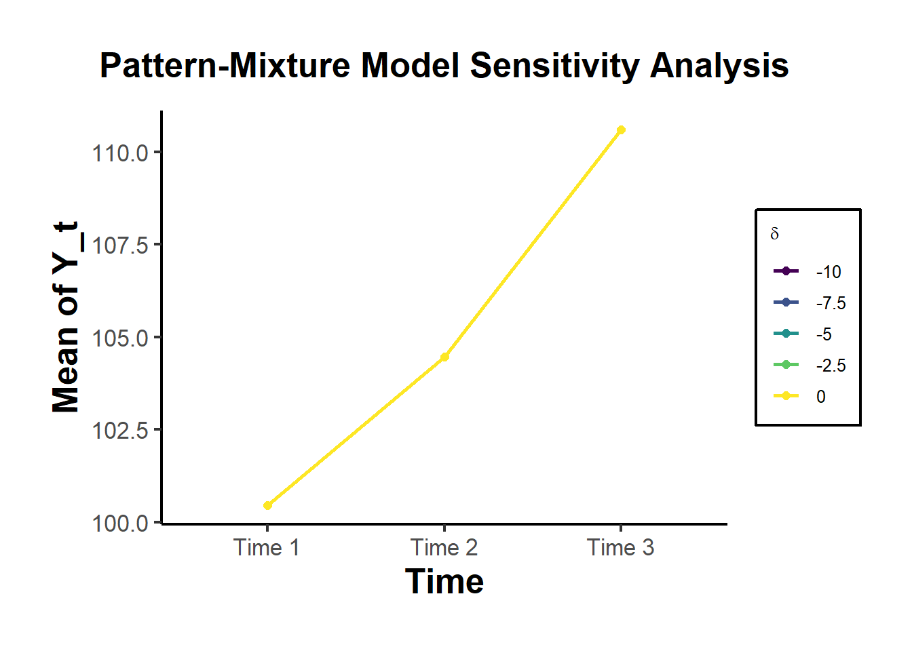

# Endogeneity

Refresher

A general model framework

$$
\mathbf{Y = X \beta + \epsilon}
$$

where

-   $\mathbf{Y} = n \times 1$

-   $\mathbf{X} = n \times k$

-   $\beta = k \times 1$

-   $\epsilon = n \times 1$

Then, OLS estimates of coefficients are

$$
\begin{aligned}
\hat{\beta}_{OLS} &= (\mathbf{X}'\mathbf{X})^{-1}(\mathbf{X}'\mathbf{Y}) \\
&= (\mathbf{X}'\mathbf{X})^{-1}(\mathbf{X}'(\mathbf{X \beta + \epsilon})) \\
&= (\mathbf{X}'\mathbf{X})^{-1} (\mathbf{X}'\mathbf{X}) \beta + (\mathbf{X}'\mathbf{X})^{-1} (\mathbf{X}'\mathbf{\epsilon}) \\
\hat{\beta}_{OLS} & \to \beta + (\mathbf{X}'\mathbf{X})^{-1} (\mathbf{X}'\mathbf{\epsilon})
\end{aligned}
$$

To have unbiased estimates, we have to get rid of the second part $(\mathbf{X}'\mathbf{X})^{-1} (\mathbf{X}'\mathbf{\epsilon})$

There are 2 conditions to achieve unbiased estimates:

1.  $E(\epsilon |X) = 0$ (This is easy, putting an intercept can solve this issue)
2.  $Cov(\mathbf{X}, \epsilon) = 0$ (This is the hard part)

We only care about omitted variable

Usually, the problem will stem Omitted Variables Bias, but we only care about omitted variable bias when

1.  Omitted variables correlate with the variables we care about ($X$). If OMV does not correlate with $X$, we don't care, and random assignment makes this correlation goes to 0)
2.  Omitted variables correlates with outcome/ dependent variable

There are more types of endogeneity listed below.

Types of endogeneity (See @hill2021endogeneity for a review in management):

1.  [Endogenous Treatment]

-   Omitted Variables Bias

    -   Motivation
    -   Ability/talent
    -   Self-selection

-   Feedback Effect ([Simultaneity]): also known as bidirectionality

-   Reverse Causality: Subtle difference from [Simultaneity]: Technically, two variables affect each other sequentially, but in a big enough time frame, (e.g., monthly, or yearly), our coefficient will be biased just like simultaneity.

-   [Measurement Error]

2.  [Endogenous Sample Selection]

To deal with this problem, we have a toolbox (that has been mentioned in previous chapter \@ref(causal-inference))

Using control variables in regression is a "selection on observables" identification strategy.

In other words, if you believe you have an omitted variable, and you can measure it, including it in the regression model solves your problem. These uninterested variables are called control variables in your model.

However, this is rarely the case (because the problem is we don't have their measurements). Hence, we need more elaborate methods:

-   [Endogenous Treatment]

-   [Endogenous Sample Selection]

Before we get to methods that deal with bias arises from omitted variables, we consider cases where we do have measurements of a variable, but there is measurement error (bias).

## Endogenous Treatment

### Measurement Error

-   Data error can stem from

    -   Coding errors

    -   Reporting errors

Two forms of measurement error:

1.  Random (stochastic) (indeterminate error) ([Classical Measurement Errors]): noise or measurement errors do not show up in a consistent or predictable way.
2.  Systematic (determinate error) ([Non-classical Measurement Errors]): When measurement error is consistent and predictable across observations.
    1.  Instrument errors (e.g., faulty scale) -\> calibration or adjustment
    2.  Method errors (e.g., sampling errors) -\> better method development + study design
    3.  Human errors (e.g., judgement)

Usually the systematic measurement error is a bigger issue because it introduces "bias" into our estimates, while random error introduces noise into our estimates

-   Noise -\> regression estimate to 0
-   Bias -\> can pull estimate to upward or downward.

#### Classical Measurement Errors

##### Right-hand side

-   Right-hand side measurement error: When the measurement is in the covariates, then we have the endogeneity problem.

Say you know the true model is

$$
Y_i = \beta_0 + \beta_1 X_i + u_i
$$

But you don't observe $X_i$, but you observe

$$
\tilde{X}_i = X_i + e_i
$$

which is known as classical measurement errors where we **assume** $e_i$ is uncorrelated with $X_i$ (i.e., $E(X_i e_i) = 0$)

Then, when you estimate your observed variables, you have (substitute $X_i$ with $\tilde{X}_i - e_i$ ):

$$
\begin{aligned}
Y_i &= \beta_0 + \beta_1 (\tilde{X}_i - e_i)+ u_i \\
&= \beta_0 + \beta_1 \tilde{X}_i + u_i - \beta_1 e_i \\
&= \beta_0 + \beta_1 \tilde{X}_i + v_i
\end{aligned}
$$

In words, the measurement error in $X_i$ is now a part of the error term in the regression equation $v_i$. Hence, we have an endogeneity bias.

Endogeneity arises when

$$
\begin{aligned}
E(\tilde{X}_i v_i) &= E((X_i + e_i )(u_i - \beta_1 e_i)) \\
&= -\beta_1 Var(e_i) \neq 0
\end{aligned}
$$

Since $\tilde{X}_i$ and $e_i$ are positively correlated, then it leads to

-   a negative bias in $\hat{\beta}_1$ if the true $\beta_1$ is positive

-   a positive bias if $\beta_1$ is negative

In other words, measurement errors cause **attenuation bias**, which inter turn pushes the coefficient towards 0

As $Var(e_i)$ increases or $\frac{Var(e_i)}{Var(\tilde{X})} \to 1$ then $e_i$ is a random (noise) and $\beta_1 \to 0$ (random variable $\tilde{X}$ should not have any relation to $Y_i$)

Technical note:

The size of the bias in the OLS-estimator is

$$
\hat{\beta}_{OLS} = \frac{ cov(\tilde{X}, Y)}{var(\tilde{X})} = \frac{cov(X + e, \beta X + u)}{var(X + e)}
$$

then

$$
plim \hat{\beta}_{OLS} = \beta \frac{\sigma^2_X}{\sigma^2_X + \sigma^2_e} = \beta \lambda
$$

where $\lambda$ is **reliability** or signal-to-total variance ratio or attenuation factor

Reliability affect the extent to which measurement error attenuates $\hat{\beta}$. The attenuation bias is

$$
\hat{\beta}_{OLS} - \beta = -(1-\lambda)\beta
$$

Thus, $\hat{\beta}_{OLS} < \beta$ (unless $\lambda = 1$, in which case we don't even have measurement error).

Note:

**Data transformation worsen (magnify) the measurement error**

$$
y= \beta x + \gamma x^2 + \epsilon
$$

then, the attenuation factor for $\hat{\gamma}$ is the square of the attenuation factor for $\hat{\beta}$ (i.e., $\lambda_{\hat{\gamma}} = \lambda_{\hat{\beta}}^2$)

**Adding covariates increases attenuation bias**

To fix classical measurement error problem, we can

1.  Find estimates of either $\sigma^2_X, \sigma^2_\epsilon$ or $\lambda$ from validation studies, or survey data.
2.  [Endogenous Treatment] Use instrument $Z$ correlated with $X$ but uncorrelated with $\epsilon$
3.  Abandon your project

##### Left-hand side

When the measurement is in the outcome variable, econometricians or causal scientists do not care because they still have an unbiased estimate of the coefficients (the zero conditional mean assumption is not violated, hence we don't have endogeneity). However, statisticians might care because it might inflate our uncertainty in the coefficient estimates (i.e., higher standard errors).

$$
\tilde{Y} = Y + v
$$

then the model you estimate is

$$
\tilde{Y} = \beta X + u + v
$$

Since $v$ is uncorrelated with $X$, then $\hat{\beta}$ is consistently estimated by OLS

If we have measurement error in $Y_i$, it will pass through $\beta_1$ and go to $u_i$

#### Non-classical Measurement Errors

Relaxing the assumption that $X$ and $\epsilon$ are uncorrelated

Recall the true model we have true estimate is

$$
\hat{\beta} = \frac{cov(X + \epsilon, \beta X + u)}{var(X + \epsilon)}
$$

then without the above assumption, we have

$$
\begin{aligned}
plim \hat{\beta} &= \frac{\beta (\sigma^2_X + \sigma_{X \epsilon})}{\sigma^2_X + \sigma^2_\epsilon + 2 \sigma_{X \epsilon}} \\
&= (1 - \frac{\sigma^2_{\epsilon} + \sigma_{X \epsilon}}{\sigma^2_X + \sigma^2_\epsilon + 2 \sigma_{X \epsilon}}) \beta \\
&= (1 - b_{\epsilon \tilde{X}}) \beta
\end{aligned}
$$

where $b_{\epsilon \tilde{X}}$ is the covariance between $\tilde{X}$ and $\epsilon$ (also the regression coefficient of a regression of $\epsilon$ on $\tilde{X}$)

Hence, the [Classical Measurement Errors] is just a special case of [Non-classical Measurement Errors] where $b_{\epsilon \tilde{X}} = 1 - \lambda$

So when $\sigma_{X \epsilon} = 0$ ([Classical Measurement Errors]), increasing this covariance $b_{\epsilon \tilde{X}}$ increases the covariance increases the attenuation factor if more than half of the variance in $\tilde{X}$ is measurement error, and decreases the attenuation factor otherwise. This is also known as **mean reverting measurement error** [@bound1989measurement, @bound2001measurement]

A general framework for both right-hand side and left-hand side measurement error is [@bound2001measurement]:

consider the true model

$$
\mathbf{Y = X \beta + \epsilon}
$$

then

$$
\begin{aligned}
\hat{\beta} &= \mathbf{(\tilde{X}' \tilde{X})^{-1}\tilde{X} \tilde{Y}} \\
&= \mathbf{(\tilde{X}' \tilde{X})^{-1} \tilde{X}' (\tilde{X} \beta - U \beta + v + \epsilon )} \\
&= \mathbf{\beta + (\tilde{X}' \tilde{X})^{-1} \tilde{X}' (-U \beta + v + \epsilon)} \\
plim \hat{\beta} &= \beta + plim (\tilde{X}' \tilde{X})^{-1} \tilde{X}' ( -U\beta + v) \\
&= \beta + plim (\tilde{X}' \tilde{X})^{-1} \tilde{X}' W 
\left[
\begin{array}
{c}
- \beta \\
1
\end{array}
\right]
\end{aligned}
$$

Since we collect the measurement errors in a matrix $W = [U|v]$, then

$$
( -U\beta + v) = W 
\left[
\begin{array}
{c}
- \beta \\
1
\end{array}
\right]
$$

Hence, in general, biases in the coefficients $\beta$ are regression coefficients from regressing the measurement errors on the mis-measured $\tilde{X}$

Notes:

-   [Instrumental Variable] can help fix this problem

-   There can also be measurement error in dummy variables and you can still use [Instrumental Variable] to fix it.

#### Solution to Measurement Errors

##### Correlation

$$
\begin{aligned}
P(\rho | data) &= \frac{P(data|\rho)P(\rho)}{P(data)} \\
\text{Posterior Probability} &\propto \text{Likelihood} \times \text{Prior Probability}
\end{aligned}
$$ where

-   $\rho$ is a correlation coefficient
-   $P(data|\rho)$ is the likelihood function evaluated at $\rho$
-   $P(\rho)$ prior probability
-   $P(data)$ is the normalizing constant

With sample correlation coefficient $r$:

$$
r = \frac{S_{xy}}{\sqrt{S_{xx}S_{yy}}}
$$ Then the posterior density approximation of $\rho$ is [@schisterman2003estimation, pp.3]

$$
P(\rho| x, y)  \propto P(\rho) \frac{(1- \rho^2)^{(n-1)/2}}{(1- \rho \times r)^{n - (3/2)}}
$$

where

-   $\rho = \tanh \xi$ where $\xi \sim N(z, 1/n)$
-   $r = \tanh z$

Then the posterior density follow a normal distribution where

**Mean**

$$
\mu_{posterior} = \sigma^2_{posterior} \times (n_{prior} \times \tanh^{-1} r_{prior}+ n_{likelihood} \times \tanh^{-1} r_{likelihood})
$$

**variance**

$$
\sigma^2_{posterior} = \frac{1}{n_{prior} + n_{Likelihood}}
$$

To simplify the integration process, we choose prior that is

$$
P(\rho) \propto (1 - \rho^2)^c
$$ where

-   $c$ is the weight the prior will have in estimation (i.e., $c = 0$ if no prior info, hence $P(\rho) \propto 1$)

Example:

Current study: $r_{xy} = 0.5, n = 200$

Previous study: $r_{xy} = 0.2765, (n=50205)$

Combining two, we have the posterior following a normal distribution with the **variance** of

$$
\sigma^2_{posterior} =  \frac{1}{n_{prior} + n_{Likelihood}} = \frac{1}{200 + 50205} = 0.0000198393
$$

**Mean**

$$
\begin{aligned}
\mu_{Posterior} &= \sigma^2_{Posterior}  \times (n_{prior} \times \tanh^{-1} r_{prior}+ n_{likelihood} \times \tanh^{-1} r_{likelihood}) \\
&= 0.0000198393 \times (50205 \times \tanh^{-1} 0.2765 + 200 \times \tanh^{-1}0.5 )\\
&= 0.2849415
\end{aligned}
$$

Hence, $Posterior \sim N(0.691, 0.0009)$, which means the correlation coefficient is $\tanh(0.691) = 0.598$ and 95% CI is

$$
\mu_{posterior} \pm 1.96 \times \sqrt{\sigma^2_{Posterior}} = 0.2849415 \pm 1.96 \times (0.0000198393)^{1/2} = (0.2762115, 0.2936714)
$$

Hence, the interval for posterior $\rho$ is $(0.2693952, 0.2855105)$

If future authors suspect that they have

1.  Large sampling variation
2.  Measurement error in either measures in the correlation, which attenuates the relationship between the two variables

Applying this Bayesian correction can give them a better estimate of the correlation between the two.

To implement this calculation in R, see below


``` r
n_new              <- 200
r_new              <- 0.5
alpha              <- 0.05

update_correlation <- function(n_new, r_new, alpha) {
    n_meta             <- 50205
    r_meta             <- 0.2765
    
    # Variance
    var_xi         <- 1 / (n_new + n_meta)
    format(var_xi, scientific = FALSE)
    
    # mean
    mu_xi          <- var_xi * (n_meta * atanh(r_meta) + n_new * (atanh(r_new)))
    format(mu_xi, scientific  = FALSE)
    
    # confidence interval
    upper_xi       <- mu_xi + qnorm(1 - alpha / 2) * sqrt(var_xi)
    lower_xi       <- mu_xi - qnorm(1 - alpha / 2) * sqrt(var_xi)
    
    # rho
    mean_rho       <- tanh(mu_xi)
    upper_rho      <- tanh(upper_xi)
    lower_rho      <- tanh(lower_xi)
    
    # return a list
    return(
        list(
            "mu_xi" = mu_xi,
            "var_xi" = var_xi,
            "upper_xi" = upper_xi,
            "lower_xi" = lower_xi,
            "mean_rho" = mean_rho,
            "upper_rho" = upper_rho,
            "lower_rho" = lower_rho
        )
    )
}


# Old confidence interval
r_new + qnorm(1 - alpha / 2) * sqrt(1/n_new)
#> [1] 0.6385904
r_new - qnorm(1 - alpha / 2) * sqrt(1/n_new)
#> [1] 0.3614096

testing = update_correlation(n_new = n_new, r_new = r_new, alpha = alpha)

# Updated rho
testing$mean_rho
#> [1] 0.2774723

# Updated confidence interval
testing$upper_rho
#> [1] 0.2855105
testing$lower_rho
#> [1] 0.2693952
```

### Simultaneity

-   When independent variables ($X$'s) are jointly determined with the dependent variable $Y$, typically through an equilibrium mechanism, violates the second condition for causality (i.e., temporal order).

-   Examples: quantity and price by demand and supply, investment and productivity, sales and advertisement

General Simultaneous (Structural) Equations

$$
\begin{aligned}
Y_i &= \beta_0 + \beta_1 X_i + u_i \\
X_i &= \alpha_0 + \alpha_1 Y_i + v_i
\end{aligned}
$$

Hence, the solutions are

$$
\begin{aligned}
Y_i &= \frac{\beta_0 + \beta_1 \alpha_0}{1 - \alpha_1 \beta_1} + \frac{\beta_1 v_i + u_i}{1 - \alpha_1 \beta_1} \\
X_i &= \frac{\alpha_0 + \alpha_1 \beta_0}{1 - \alpha_1 \beta_1} + \frac{v_i + \alpha_1 u_i}{1 - \alpha_1 \beta_1}
\end{aligned}
$$

If we run only one regression, we will have biased estimators (because of **simultaneity bias**):

$$
\begin{aligned}
Cov(X_i, u_i) &= Cov(\frac{v_i + \alpha_1 u_i}{1 - \alpha_1 \beta_1}, u_i) \\
&= \frac{\alpha_1}{1- \alpha_1 \beta_1} Var(u_i)
\end{aligned}
$$

In an even more general model

$$
\begin{cases}
Y_i = \beta_0 + \beta_1 X_i + \beta_2 T_i + u_i \\
X_i = \alpha_0 + \alpha_1 Y_i + \alpha_2 Z_i + v_i
\end{cases}
$$

where

-   $X_i, Y_i$ are **endogenous** variables determined within the system

-   $T_i, Z_i$ are **exogenous** variables

Then, the reduced form of the model is

$$
\begin{cases}
\begin{aligned}
Y_i &= \frac{\beta_0 + \beta_1 \alpha_0}{1 - \alpha_1 \beta_1} + \frac{\beta_1 \alpha_2}{1 - \alpha_1 \beta_1} Z_i + \frac{\beta_2}{1 - \alpha_1 \beta_1} T_i + \tilde{u}_i \\
&= B_0 + B_1 Z_i + B_2 T_i + \tilde{u}_i
\end{aligned}
\\
\begin{aligned}
X_i &= \frac{\alpha_0 + \alpha_1 \beta_0}{1 - \alpha_1 \beta_1} + \frac{\alpha_2}{1 - \alpha_1 \beta_1} Z_i + \frac{\alpha_1\beta_2}{1 - \alpha_1 \beta_1} T_i + \tilde{v}_i \\
&= A_0 + A_1 Z_i + A_2 T_i + \tilde{v}_i
\end{aligned}
\end{cases}
$$

Then, now we can get consistent estimates of the reduced form parameters

And to get the original parameter estimates

$$
\begin{aligned}
\frac{B_1}{A_1} &= \beta_1 \\
B_2 (1 - \frac{B_1 A_2}{A_1B_2}) &= \beta_2 \\
\frac{A_2}{B_2} &= \alpha_1 \\
A_1 (1 - \frac{B_1 A_2}{A_1 B_2}) &= \alpha_2
\end{aligned}
$$

Rules for Identification

**Order Condition** (necessary but not sufficient)

$$
K - k \ge m - 1
$$

where

-   $M$ = number of endogenous variables in the model

-   K = number of exogenous variables int he model

-   $m$ = number of endogenous variables in a given

-   $k$ = is the number of exogenous variables in a given equation

This is actually the general framework for instrumental variables

### Endogenous Treatment Solutions

Using the OLS estimates as a reference point


``` r
library(AER)
library(REndo)
set.seed(421)
data("CASchools")
school <- CASchools
school$stratio <- with(CASchools, students / teachers)
m1.ols <-
    lm(read ~ stratio + english + lunch 
       + grades + income + calworks + county,
       data = school)
summary(m1.ols)$coefficients[1:7,]
#>                 Estimate Std. Error     t value      Pr(>|t|)
#> (Intercept) 683.45305948 9.56214469  71.4748711 3.011667e-218
#> stratio      -0.30035544 0.25797023  -1.1643027  2.450536e-01
#> english      -0.20550107 0.03765408  -5.4576041  8.871666e-08
#> lunch        -0.38684059 0.03700982 -10.4523759  1.427370e-22
#> gradesKK-08  -1.91291321 1.35865394  -1.4079474  1.599886e-01
#> income        0.71615378 0.09832843   7.2832829  1.986712e-12
#> calworks     -0.05273312 0.06154758  -0.8567863  3.921191e-01
```

#### Instrumental Variable

[A3a] requires $\epsilon_i$ to be uncorrelated with $\mathbf{x}_i$

Assume [A1][A1 Linearity] , [A2][A2 Full rank], [A5][A5 Data Generation (random Sampling)]

$$
plim(\hat{\beta}_{OLS}) = \beta + [E(\mathbf{x_i'x_i})]^{-1}E(\mathbf{x_i'}\epsilon_i)
$$

[A3a] is the weakest assumption needed for OLS to be **consistent**

[A3][A3 Exogeneity of Independent Variables] fails when $x_{ik}$ is correlated with $\epsilon_i$

-   Omitted Variables Bias: $\epsilon_i$ includes any other factors that may influence the dependent variable (linearly)
-   [Simultaneity] Demand and prices are simultaneously determined.
-   [Endogenous Sample Selection] we did not have iid sample
-   [Measurement Error]

**Note**

-   Omitted Variable: an omitted variable is a variable, omitted from the model (but is in the $\epsilon_i$) and unobserved has predictive power towards the outcome.
-   Omitted Variable Bias: is the bias (and inconsistency when looking at large sample properties) of the OLS estimator when the omitted variable.
-   We cam have both positive and negative selection bias (it depends on what our story is)

The **structural equation** is used to emphasize that we are interested understanding a **causal relationship**

$$
y_{i1} = \beta_0 + \mathbf{z}_i1 \beta_1 + y_{i2}\beta_2 +  \epsilon_i
$$

where

-   $y_{it}$ is the outcome variable (inherently correlated with $\epsilon_i$)
-   $y_{i2}$ is the endogenous covariate (presumed to be correlated with $\epsilon_i$)
-   $\beta_1$ represents the causal effect of $y_{i2}$ on $y_{i1}$
-   $\mathbf{z}_{i1}$ is exogenous controls (uncorrelated with $\epsilon_i$) ($E(z_{1i}'\epsilon_i) = 0$)

OLS is an inconsistent estimator of the causal effect $\beta_2$

If there was no endogeneity

-   $E(y_{i2}'\epsilon_i) = 0$
-   the exogenous variation in $y_{i2}$ is what identifies the causal effect

If there is endogeneity

-   Any wiggle in $y_{i2}$ will shift simultaneously with $\epsilon_i$

$$
plim(\hat{\beta}_{OLS}) = \beta + [E(\mathbf{x'_ix_i})]^{-1}E(\mathbf{x'_i}\epsilon_i)
$$

where

-   $\beta$ is the causal effect
-   $[E(\mathbf{x'_ix_i})]^{-1}E(\mathbf{x'_i}\epsilon_i)$ is the endogenous effect

Hence $\hat{\beta}_{OLS}$ can be either more positive and negative than the true causal effect.

Motivation for **Two Stage Least Squares (2SLS)**

$$
y_{i1}=\beta_0 + \mathbf{z}_{i1}\beta_1 + y_{i2}\beta_2 + \epsilon_i
$$

We want to understand how movement in $y_{i2}$ effects movement in $y_{i1}$, but whenever we move $y_{i2}$, $\epsilon_i$ also moves.

**Solution**\
We need a way to move $y_{i2}$ independently of $\epsilon_i$, then we can analyze the response in $y_{i1}$ as a causal effect

-   Find an **instrumental variable(s)** $z_{i2}$

    -   Instrument **Relevance**: when\*\* $z_{i2}$ moves then $y_{i2}$ also moves
    -   Instrument **Exogeneity**: when $z_{i2}$ moves then $\epsilon_i$ does not move.

-   $z_{i2}$ is the **exogenous variation that identifies** the causal effect $\beta_2$

Finding an Instrumental variable:

-   Random Assignment: + Effect of class size on educational outcomes: instrument is initial random
-   Relation's Choice + Effect of Education on Fertility: instrument is parent's educational level
-   Eligibility + Trade-off between IRA and 401K retirement savings: instrument is 401k eligibility

**Example**

Return to College

-   education is correlated with ability - endogenous

-   **Near 4year** as an instrument

    -   Instrument Relevance: when **near** moves then education also moves
    -   Instrument Exogeneity: when **near** moves then $\epsilon_i$ does not move.

-   Other potential instruments; near a 2-year college. Parent's Education. Owning Library Card

$$
y_{i1}=\beta_0 + \mathbf{z}_{i1}\beta_1 + y_{i2}\beta_2 + \epsilon_i
$$

First Stage (Reduced Form) Equation:

$$
y_{i2} = \pi_0 + \mathbf{z_{i1}\pi_1} + \mathbf{z_{i2}\pi_2} + v_i
$$

where

-   $\pi_0 + \mathbf{z_{i1}\pi_1} + \mathbf{z_{i2}\pi_2}$ is exogenous variation $v_i$ is endogenous variation

This is called a **reduced form equation**

-   Not interested in the causal interpretation of $\pi_1$ or $\pi_2$

-   A linear projection of $z_{i1}$ and $z_{i2}$ on $y_{i2}$ (simple correlations)

-   The projections $\pi_1$ and $\pi_2$ guarantee that $E(z_{i1}'v_i)=0$ and $E(z_{i2}'v_i)=0$

Instrumental variable $z_{i2}$

-   **Instrument Relevance**: $\pi_2 \neq 0$
-   **Instrument Exogeneity**: $E(\mathbf{z_{i2}\epsilon_i})=0$

Moving only the exogenous part of $y_i2$ is moving

$$
\tilde{y}_{i2} = \pi_0 + \mathbf{z_{i1}\pi_1 + z_{i2}\pi_2}
$$

**two Stage Least Squares (2SLS)**

$$
y_{i1} = \beta_0 +\mathbf{z_{i1}\beta_1}+ y_{i2}\beta_2 + \epsilon_i
$$

$$
y_{i2} = \pi_0 + \mathbf{z_{i2}\pi_2} + \mathbf{v_i}
$$

Equivalently,

```{=tex}
\begin{equation}
\begin{split}
y_{i1} = \beta_0 + \mathbf{z_{i1}}\beta_1 + \tilde{y}_{i2}\beta_2 + u_i
\end{split}
(\#eq:2SLS)
\end{equation}
```
where

-   $\tilde{y}_{i2} =\pi_0 + \mathbf{z_{i2}\pi_2}$
-   $u_i = v_i \beta_2+ \epsilon_i$

The \@ref(eq:2SLS) holds for [A1][A1 Linearity], [A5][A5 Data Generation (random Sampling)]

-   [A2][A2 Full rank] holds if the instrument is relevant $\pi_2 \neq 0$ + $y_{i1} = \beta_0 + \mathbf{z_{i1}\beta_1 + (\pi_0 + z_{i1}\pi_1 + z_{i2}\pi_2)}\beta_2 + u_i$
-   [A3a] holds if the instrument is exogenous $E(\mathbf{z}_{i2}\epsilon_i)=0$

$$
\begin{aligned}
E(\tilde{y}_{i2}'u_i) &= E((\pi_0 + \mathbf{z_{i1}\pi_1+z_{i2}})(v_i\beta_2 + \epsilon_i)) \\
&= E((\pi_0 + \mathbf{z_{i1}\pi_1+z_{i2}})( \epsilon_i)) \\
&= E(\epsilon_i)\pi_0 + E(\epsilon_iz_{i1})\pi_1 + E(\epsilon_iz_{i2}) \\
&=0 
\end{aligned}
$$

Hence, \@ref(eq:2SLS) is consistent

The 2SLS Estimator\
1. Estimate the first stage using [OLS][Ordinary Least Squares]

$$
y_{i2} = \pi_0 + \mathbf{z_{i2}\pi_2} + \mathbf{v_i}
$$

and obtained estimated value $\hat{y}_{i2}$

2.  Estimate the altered equation using [OLS][Ordinary Least Squares]

$$
y_{i1} = \beta_0 +\mathbf{z_{i1}\beta_1}+ \hat{y}_{i2}\beta_2 + \epsilon_i
$$

**Properties of the 2SLS Estimator**

-   Under [A1][A1 Linearity], [A2][A2 Full rank], [A3a] (for $z_{i1}$), [A5][A5 Data Generation (random Sampling)] and if the instrument satisfies the following two conditions, + **Instrument Relevance**: $\pi_2 \neq 0$ + **Instrument Exogeneity**: $E(\mathbf{z}_{i2}'\epsilon_i) = 0$ then the 2SLS estimator is consistent
-   Can handle more than one endogenous variable and more than one instrumental variable

$$
\begin{aligned}
y_{i1} &= \beta_0 + z_{i1}\beta_1 + y_{i2}\beta_2 + y_{i3}\beta_3 + \epsilon_i \\
y_{i2} &= \pi_0 + z_{i1}\pi_1 + z_{i2}\pi_2 + z_{i3}\pi_3 + z_{i4}\pi_4 + v_{i2} \\
y_{i3} &= \gamma_0 + z_{i1}\gamma_1 + z_{i2}\gamma_2 + z_{i3}\gamma_3 + z_{i4}\gamma_4 + v_{i3}
\end{aligned}
$$

```         
    + **IV estimator**: one endogenous variable with a single instrument 
    + **2SLS estimator**: one endogenous variable with multiple instruments 
    + **GMM estimator**: multiple endogenous variables with multiple instruments
    
```

-   Standard errors produced in the second step are not correct

    -   Because we do not know $\tilde{y}$ perfectly and need to estimate it in the firs step, we are introducing additional variation
    -   We did not have this problem with [FGLS][Feasible Generalized Least Squares] because "the first stage was orthogonal to the second stage." This is generally not true for most multi-step procedure.\
    -   If [A4][A4 Homoskedasticity] does not hold, need to report robust standard errors.

-   2SLS is less efficient than OLS and will always have larger standard errors.\

    -   First, $Var(u_i) = Var(v_i\beta_2 + \epsilon_i) > Var(\epsilon_i)$\
    -   Second, $\hat{y}_{i2}$ is generally highly collinear with $\mathbf{z}_{i1}$

-   The number of instruments need to be at least as many or more the number of endogenous variables.

**Note**

-   2SLS can be combined with [FGLS][Feasible Generalized Least Squares] to make the estimator more efficient: You have the same first-stage, and in the second-stage, instead of using OLS, you can use FLGS with the weight matrix $\hat{w}$
-   Generalized Method of Moments can be more efficient than 2SLS.
-   In the second-stage of 2SLS, you can also use [MLE][Maximum Likelihood], but then you are making assumption on the distribution of the outcome variable, the endogenous variable, and their relationship (joint distribution).

##### Testing Assumptions

1.  [Endogeneity Test]: Is $y_{i2}$ truly endogenous (i.e., can we just use OLS instead of 2SLS)?

2.  [Exogeneity] (Cannot always test and when you can it might not be informative)

3.  [Relevancy] (need to avoid "weak instruments")

###### Endogeneity Test

-   2SLS is generally so inefficient that we may prefer OLS if there is not much endogeneity

-   Biased but inefficient vs efficient but biased

-   Want a sense of "how endogenous" $y_{i2}$ is

    -   if "very" endogenous - should use 2SLS
    -   if not "very" endogenous - perhaps prefer OLS

**Invalid** Test of Endogeneity: $y_{i2}$ is endogenous if it is correlated with $\epsilon_i$,

$$
\epsilon_i = \gamma_0 + y_{i2}\gamma_1 + error_i
$$

where $\gamma_1 \neq 0$ implies that there is endogeneity

-   $\epsilon_i$ is not observed, but using the residuals

$$
e_i = \gamma_0 + y_{i2}\gamma_1 + error_i
$$

is **NOT** a valid test of endogeneity + The OLS residual, e is mechanically uncorrelated with $y_{i2}$ (by FOC for OLS) + In every situation, $\gamma_1$ will be essentially 0 and you will never be able to reject the null of no endogeneity

**Valid** test of endogeneity

-   If $y_{i2}$ is not endogenous then $\epsilon_i$ and v are uncorrelated

$$
\begin{aligned}
y_{i1} &= \beta_0 + \mathbf{z}_{i1}\beta_1 + y_{i2}\beta_2 + \epsilon_i \\
y_{i2} &= \pi_0 + \mathbf{z}_{i1}\pi_1 + z_{i2}\pi_2 + v_i
\end{aligned}
$$

**Variable Addition test**: include the first stage residuals as an additional variable,

$$
y_{i1} = \beta_0 + \mathbf{z}_{i1}\beta_1 + y_{i2}\beta_2 + \hat{v}_i \theta + error_i
$$

Then the usual $t$-test of significance is a valid test to evaluate the following hypothesis. **note** this test requires your instrument to be valid instrument.

$$
\begin{aligned}
&H_0: \theta = 0 & \text{  (not endogenous)} \\
&H_1: \theta \neq 0 & \text{  (endogenous)}
\end{aligned}
$$

###### Exogeneity

Why exogeneity matter?

$$
E(\mathbf{z}_{i2}'\epsilon_i) = 0
$$

-   If [A3a] fails - 2SLS is also inconsistent
-   If instrument is not exogenous, then we need to find a new one.
-   Similar to [Endogeneity Test], when there is a single instrument

$$
\begin{aligned}
e_i &= \gamma_0 + \mathbf{z}_{i2}\gamma_1 + error_i \\
H_0: \gamma_1 &= 0
\end{aligned}
$$

is **NOT** a valid test of endogeneity

-   the OLS residual, e is mechanically uncorrelated with $z_{i2}$: $\hat{\gamma}_1$ will be essentially 0 and you will never be able to determine if the instrument is endogenous.

**Solution**

Testing Instrumental Exogeneity in an Over-identified Model

-   When there is more than one exogenous instrument (per endogenous variable), we can test for instrument exogeneity.

    -   When we have multiple instruments, the model is said to be over-identified.

    -   Could estimate the same model several ways (i.e., can identify/ estimate $\beta_1$ more than one way)

-   Idea behind the test: if the controls and instruments are truly exogenous then OLS estimation of the following regression,

$$
\epsilon_i = \gamma_0 + \mathbf{z}_{i1}\gamma_1 + \mathbf{z}_{i2}\gamma_2 + error_i
$$

should have a very low $R^2$

-   if the model is **just identified** (one instrument per endogenous variable) then the $R^2 = 0$

Steps:

(1) Estimate the structural equation by 2SLS (using all available instruments) and obtain the residuals e

(2) Regress e on all controls and instruments and obtain the $R^2$

(3) Under the null hypothesis (all IV's are uncorrelated), $nR^2 \sim \chi^2(q)$, where q is the number of instrumental variables minus the number of endogenous variables

    -   if the model is just identified (one instrument per endogenous variable) then q = 0, and the distribution under the null collapses.

low p-value means you reject the null of exogenous instruments. Hence you would like to have high p-value in this test.

**Pitfalls for the Overid test**

-   the overid test is essentially compiling the following information.

    -   Conditional on first instrument being exogenous is the other instrument exogenous?
    -   Conditional on the other instrument being exogenous, is the first instrument exogenous?

-   If all instruments are endogenous than neither test will be valid

-   really only useful if one instrument is thought to be truly exogenous (randomly assigned). even f you do reject the null, the test does not tell you which instrument is exogenous and which is endogenous.

| Result          | Implication                                                                         |
|-----------------|-------------------------------------------------------------------------------------|
| reject the null | you can be pretty sure there is an endogenous instrument, but don't know which one. |
| fail to reject  | could be either (1) they are both exogenous, (2) they are both endogenous.          |

###### Relevancy

Why Relevance matter?

$$
\pi_2 \neq 0 
$$

-   used to show [A2][A2 Full rank] holds

    -   If $\pi_2 = 0$ (instrument is not relevant) then [A2][A2 Full rank] fails - perfect multicollinearity

    -   If $\pi_2$ is close to 0 (**weak instrument**) then there is near perfect multicollinearity - 2SLS is highly inefficient (Large standard errors).

-   A weak instrument will exacerbate any inconsistency due to an instrument being (even slightly) endogenous.

    -   In the simple case with no controls and a single endogenous variable and single instrumental variable,

$$
plim(\hat{\beta}_{2_{2SLS}}) = \beta_2 + \frac{E(z_{i2}\epsilon_i)}{E(z_{i2}y_{i2})}
$$

**Testing Weak Instruments**

-   can use $t$-test (or $F$-test for over-identified models) in the first stage to determine if there is a weak instrument problem.

-   [@stock2002testing, @stock2005asymptotic]: a statistical rejection of the null hypothesis in the first stage at the 5% (or even 1%) level is not enough to insure the instrument is not weak

    -   Rule of Thumb: need a $F$-stat of at least 10 (or a $t$-stat of at least 3.2) to reject the null hypothesis that the instrument is weak.

**Summary of the 2SLS Estimator**

$$
\begin{aligned}
y_{i1} &=\beta_0 + \mathbf{z}_{i1}\beta_1 + y_{i2}\beta_2 + \epsilon_i \\
y_{i2} &= \pi_0 + \mathbf{z_{i1}\pi_1} + \mathbf{z_{i2}\pi_2} + v_i
\end{aligned}
$$

-   when [A3a] does not hold

$$
E(y_{i2}'\epsilon_i) \neq 0
$$

-   Then the OLS estimator is no longer unbiased or consistent.

-   If we have valid instruments $\mathbf{z}_{i2}$

-   [Relevancy] (need to avoid "weak instruments"): $\pi_2 \neq 0$ Then the 2SLS estimator is consistent under [A1][A1 Linearity], [A2][A2 Full rank], [A5a], and the above two conditions.

    -   If [A4][A4 Homoskedasticity] also holds, then the usual standard errors are valid.

    -   If [A4][A4 Homoskedasticity] does not hold then use the robust standard errors.

$$
\begin{aligned}
y_{i1} &= \beta_0 + \mathbf{z}_{i1}\beta_1 + y_{i2}\beta_2 + \epsilon_i \\
y_{i2} &= \pi_0 + \mathbf{z_{i1}\pi_1} + \mathbf{z_{i2}\pi_2} + v_i
\end{aligned}
$$

-   When [A3a] does hold

$$
E(y_{i2}'\epsilon_i) = 0
$$

and we have valid instruments, then both the OLS and 2SLS estimators are consistent.

-   The OLS estimator is always more efficient
-   can use the variable addition test to determine if 2SLS is need (A3a does hold) or if OLS is valid (A3a does not hold)

Sometimes we can test the assumption for instrument to be valid:

-   [Exogeneity] : Only table when there are more instruments than endogenous variables.
-   [Relevancy] (need to avoid "weak instruments"): Always testable, need the F-stat to be greater than 10 to rule out a weak instrument

Application

Expenditure as observed instrument


``` r
m2.2sls <-
    ivreg(
        read ~ stratio + english + lunch 
        + grades + income + calworks + county |
            
            expenditure + english + lunch 
        + grades + income + calworks + county ,
        data = school
    )
summary(m2.2sls)$coefficients[1:7,]
#>                 Estimate  Std. Error     t value      Pr(>|t|)
#> (Intercept) 700.47891593 13.58064436  51.5792106 8.950497e-171
#> stratio      -1.13674002  0.53533638  -2.1234126  3.438427e-02
#> english      -0.21396934  0.03847833  -5.5607753  5.162571e-08
#> lunch        -0.39384225  0.03773637 -10.4366757  1.621794e-22
#> gradesKK-08  -1.89227865  1.37791820  -1.3732881  1.704966e-01
#> income        0.62487986  0.11199008   5.5797785  4.668490e-08
#> calworks     -0.04950501  0.06244410  -0.7927892  4.284101e-01
```

##### Checklist

1.  Regress the dependent variable on the instrument (reduced form). Since under OLS, we have unbiased estimate, the coefficient estimate should be significant (make sure the sign makes sense)
2.  Report F-stat on the excluded instruments. F-stat \< 10 means you have a weak instrument [@stock2002survey].
3.  Present $R^2$ before and after including the instrument [@rossi2014even]
4.  For models with multiple instrument, present firs-t and second-stage result for each instrument separately. Overid test should be conducted (e.g., Sargan-Hansen J)
5.  Hausman test between OLS and 2SLS (don't confuse this test for evidence that endogeneity is irrelevant - under invalid IV, the test is useless)
6.  Compare the 2SLS with the limited information ML. If they are different, you have evidence for weak instruments.

#### Good Instruments

[Exogeneity] and [Relevancy] are necessary but not sufficient for IV to produce consistent estimates.

Without theory or possible explanation, you can always create a new variable that is correlated with $X$ and uncorrelated with $\epsilon$

For example, we want to estimate the effect of price on quantity [@reiss2011structural, p. 960]

$$
\begin{aligned}
Q &= \beta_1 P + \beta_2 X + \epsilon \\
P &= \pi_1 X + \eta
\end{aligned}
$$

where $\epsilon$ and $\eta$ are jointly determined, $X \perp \epsilon, \eta$

Without theory, we can just create a new variable $Z = X + u$ where $E(u) = 0; u \perp X, \epsilon, \eta$

Then, $Z$ satisfied both conditions:

-   Relevancy: $X$ correlates $P$ $\rightarrow$ $Z$ correlates $P$

-   Exogeneity: $u \perp \epsilon$ (random noise)

But obviously, it's not a valid instrument (intuitively). But theoretically, relevance and exogeneity are not sufficient to identify $\beta$ because of unsatisfied rank condition for identification.

Moreover, the functional form of the instrument also plays a role when choosing a good instrument. Hence, we always need to check for the robustness of our instrument.

IV methods even with valid instruments can still have poor sampling properties (finite sample bias, large sampling errors) [@rossi2014even]

When you have a weak instrument, it's important to report it appropriately. This problem will be exacerbated if you have multiple instruments [@larcker2010use].

##### Lagged dependent variable

In time series data sets, we can use lagged dependent variable as an instrument because it is not influenced by current shocks. For example, @chetty2014measuring used lagged dependent variable in econ.

##### Lagged explanatory variable

-   Common practice in applied economics: Replace suspected simultaneously determined explanatory variable with its lagged value [@reed2015practice, @bellemare2017lagged].

    -   This practice does not avoid simultaneity bias.

    -   Estimates using this method are still inconsistent.

    -   Hypothesis testing becomes invalid under this approach.

    -   Lagging variables changes how endogeneity bias operates, adding a "no dynamics among unobservables" assumption to the "selection on observables" assumption.

-   Key conditions for appropriate use [@bellemare2017lagged]:

    -   **Under unobserved confounding:**
        -   No dynamics among unobservables.
        -   The lagged variable $X$ is a stationary autoregressive process.
    -   **Under no unobserved confounding:**
        -   No reverse causality; the causal effect operates with a one-period lag ($X_{t-1} \to Y$, $X_t \not\to Y_t$).
        -   Reverse causality is contemporaneous, with a one-period lag effect.
        -   Reverse causality is contemporaneous; no dynamics in $Y$, but dynamics exist in $X$ ($X_{t-1} \to X$).

-   **Alternative approach**: Use lagged values of the endogenous variable in IV estimation. However, IV estimation is only effective if [@reed2015practice]:

    -   Lagged values do not belong in the estimating equation.

    -   Lagged values are sufficiently correlated with the simultaneously determined explanatory variable.

    -   Lagged IVs help mitigate endogeneity if they only violate the independence assumption. However, if lagged IVs violate both the independence assumption and exclusion restriction, they may aggravate endogeneity [@wang2019lagged].

#### Internal instrumental variable

-   (also known as **instrument free methods**). This section is based on Raluca Gui's [guide](https://cran.r-project.org/web/packages/REndo/vignettes/REndo-introduction.pdf)

-   alternative to external instrumental variable approaches

-   All approaches here assume a **continuous dependent variable**

##### Non-hierarchical Data (Cross-classified)

$$
Y_t = \beta_0 + \beta_1 P_t + \beta_2 X_t + \epsilon_t
$$

where

-   $t = 1, .., T$ (indexes either time or cross-sectional units)
-   $Y_t$ is a $k \times 1$ response variable
-   $X_t$ is a $k \times n$ exogenous regressor
-   $P_t$ is a $k \times 1$ continuous endogenous regressor
-   $\epsilon_t$ is a structural error term with $\mu_\epsilon =0$ and $E(\epsilon^2) = \sigma^2$
-   $\beta$ are model parameters

The endogeneity problem arises from the correlation of $P_t$ and $\epsilon_t$:

$$
P_t = \gamma Z_t + v_t
$$

where

-   $Z_t$ is a $l \times 1$ vector of internal instrumental variables
-   $ν_t$ is a random error with $\mu_{v_t}, E(v^2) = \sigma^2_v, E(\epsilon v) = \sigma_{\epsilon v}$
-   $Z_t$ is assumed to be stochastic with distribution $G$
-   $ν_t$ is assumed to have density $h(·)$

###### Latent Instrumental Variable {#latent-instrumental-variable}

[@ebbes2005solving]

assume $Z_t$ (unobserved) to be uncorrelated with $\epsilon_t$, which is similar to [Instrumental Variable]. Hence, $Z_t$ and $ν_t$ can't be identified without distributional assumptions

The distributions of $Z_t$ and $ν_t$ need to be specified such that:

(1) endogeneity of $P_t$ is corrected
(2) the distribution of $P_t$ is empirically close to the integral that expresses the amount of overlap of Z as it is shifted over ν (= the convolution between $Z_t$ and $ν_t$).

When the density h(·) = Normal, then G cannot be normal because the parameters would not be identified [@ebbes2005solving] .

Hence,

-   in the [LIV](#latent-instrumental-variable) model the distribution of $Z_t$ is discrete
-   in the [Higher Moments Method] and [Joint Estimation Using Copula] methods, the distribution of $Z_t$ is taken to be skewed.

$Z_t$ are assumed **unobserved, discrete and exogenous**, with

-   an unknown number of groups m
-   $\gamma$ is a vector of group means.

Identification of the parameters relies on the distributional assumptions of

-   $P_t$: a non-Gaussian distribution
-   $Z_t$ discrete with $m \ge 2$

Note:

-   If $Z_t$ is continuous, the model is unidentified
-   If $P_t \sim N$, you have inefficient estimates.


``` r
m3.liv <- latentIV(read ~ stratio, data = school)
summary(m3.liv)$coefficients[1:7, ]
#>                   Estimate    Std. Error       z-score     Pr(>|z|)
#> (Intercept)   6.996014e+02  2.686165e+02  2.604462e+00 9.529035e-03
#> stratio      -2.272673e+00  1.367747e+01 -1.661618e-01 8.681097e-01
#> pi1          -4.896363e+01           NaN           NaN          NaN
#> pi2           1.963920e+01  9.225351e-02  2.128830e+02 0.000000e+00
#> theta5       6.939432e-152 3.143456e-161  2.207581e+09 0.000000e+00
#> theta6        3.787512e+02  4.249436e+01  8.912976e+00 1.541010e-17
#> theta7       -1.227543e+00  4.885237e+01 -2.512761e-02 9.799651e-01
```

it will return a coefficient very different from the other methods since there is only one endogenous variable.

###### Joint Estimation Using Copula

assume $Z_t$ (unobserved) to be uncorrelated with $\epsilon_t$, which is similar to [Instrumental Variable]. Hence, $Z_t$ and $ν_t$ can't be identified without distributional assumptions

[@park2012handling] allows joint estimation of the continuous $P_t$ and $\epsilon_t$ using Gaussian copulas, where a copula is a function that maps several conditional distribution functions (CDF) into their joint CDF).

The underlying idea is that using information contained in the observed data, one selects marginal distributions for $P_t$ and $\epsilon_t$. Then, the copula model constructs a flexible multivariate joint distribution that allows a wide range of correlations between the two marginals.

The method allows both continuous and discrete $P_t$.

In the special case of **one continuous** $P_t$, estimation is based on MLE\
Otherwise, based on Gaussian copulas, augmented OLS estimation is used.

**Assumptions**:

-   skewed $P_t$

-   the recovery of the correct parameter estimates

-   $\epsilon_t \sim$ normal marginal distribution. The marginal distribution of $P_t$ is obtained using the **Epanechnikov kernel density estimator**\
    $$
    \hat{h}_p = \frac{1}{T . b} \sum_{t=1}^TK(\frac{p - P_t}{b})
    $$ where

-   $P_t$ = endogenous variables

-   $K(x) = 0.75(1-x^2)I(||x||\le 1)$

-   $b=0.9T^{-1/5}\times min(s, IQR/1.34)$

    -   IQR = interquartile range
    -   $s$ = sample standard deviation
    -   $T$ = n of time periods observed in the data


``` r
# 1.34 comes from this
diff(qnorm(c(0.25, 0.75)))
#> [1] 1.34898
```

In augmented OLS and MLE, the inference procedure occurs in two stages:

(1): the empirical distribution of $P_t$ is computed\
(2) used in it constructing the likelihood function)\
Hence, the standard errors would not be correct.

So we use the sampling distributions (from bootstrapping) to get standard errors and the variance-covariance matrix. Since the distribution of the bootstrapped parameters is highly skewed, we report the percentile confidence intervals is preferable.


``` r
set.seed(110)
m4.cc <-
    copulaCorrection(
        read ~ stratio + english + lunch + calworks +
            grades + income + county |
            continuous(stratio),
        data = school,
        optimx.args = list(method = c("Nelder-Mead"), 
                           itnmax = 60000),
        num.boots = 2,
        verbose = FALSE
    )
summary(m4.cc)$coefficients[1:7,]
#>             Point Estimate    Boots SE Lower Boots CI (95%)
#> (Intercept)   682.38500189 2.438874461                   NA
#> stratio        -0.31091374 0.022332810                   NA
#> english        -0.19648765 0.026136685                   NA
#> lunch          -0.38439247 0.032293205                   NA
#> calworks       -0.04363619 0.009027372                   NA
#> gradesKK-08    -1.97957885 0.138420392                   NA
#> income          0.77449995 0.033266598                   NA
#>             Upper Boots CI (95%)
#> (Intercept)                   NA
#> stratio                       NA
#> english                       NA
#> lunch                         NA
#> calworks                      NA
#> gradesKK-08                   NA
#> income                        NA
```

we run this model with only one endogenous continuous regressor (`stratio`). Sometimes, the code will not converge, in which case you can use different

-   optimization algorithm
-   starting values
-   maximum number of iterations

###### Higher Moments Method

suggested by [@lewbel1997constructing] to identify $\epsilon_t$ caused by **measurement error**.

Identification is achieved by using third moments of the data, with no restrictions on the distribution of $\epsilon_t$\
The following instruments can be used with 2SLS estimation to obtain consistent estimates:

$$
\begin{aligned}
q_{1t} &=  (G_t - \bar{G}) \\
q_{2t} &=  (G_t - \bar{G})(P_t - \bar{P}) \\
q_{3t} &=   (G_t - \bar{G})(Y_t - \bar{Y})\\
q_{4t} &=  (Y_t - \bar{Y})(P_t - \bar{P}) \\
q_{5t} &=  (P_t - \bar{P})^2 \\
q_{6t} &=  (Y_t - \bar{Y})^2 \\
\end{aligned}
$$

where

-   $G_t = G(X_t)$ for any given function G that has finite third own and cross moments
-   $X$ = exogenous variable

$q_{5t}, q_{6t}$ can be used only when the measurement and $\epsilon_t$ are symmetrically distributed. The rest of the instruments does not require any distributional assumptions for $\epsilon_t$.

Since the regressors $G(X) = X$ are included as instruments, $G(X)$ can't be a linear function of X in $q_{1t}$

Since this method has very strong assumptions, [Higher Moments Method] should only be used in case of overidentification


``` r
set.seed(111)
m5.hetEr <-
    hetErrorsIV(
        read ~ stratio + english + lunch + calworks + income +
            grades + county |
            stratio | IIV(income, english),
        data = school
    )
summary(m5.hetEr)$coefficients[1:7,]
#>                 Estimate  Std. Error    t value     Pr(>|t|)
#> (Intercept) 662.78791557 27.90173069 23.7543657 2.380436e-76
#> stratio       0.71480686  1.31077325  0.5453322 5.858545e-01
#> english      -0.19522271  0.04057527 -4.8113717 2.188618e-06
#> lunch        -0.37834232  0.03927793 -9.6324402 9.760809e-20
#> calworks     -0.05665126  0.06302095 -0.8989273 3.692776e-01
#> income        0.82693755  0.17236557  4.7975797 2.335271e-06
#> gradesKK-08  -1.93795843  1.38723186 -1.3969968 1.632541e-01
```

recommend using this approach to create additional instruments to use with external ones for better efficiency.

###### Heteroskedastic Error Approach

-   using means of variables that are uncorrelated with the product of heteroskedastic errors to identify structural parameters.
-   This method can be use either when you don't have external instruments or you want to use additional instruments to improve the efficiency of the IV estimator [@lewbel2012using]
-   The instruments are constructed as simple functions of data
-   Model's assumptions:

$$
\begin{aligned}
E(X \epsilon) &= 0 \\
E(X v ) &= 0 \\
cov(Z, \epsilon v) &= 0  \\
cov(Z, v^2) &\neq 0 \text{  (for identification)}
\end{aligned}
$$

Structural parameters are identified by 2SLS regression of Y on X and P, using X and [Z − E(Z)]ν as instruments.

$$
\text{instrument's strength} \propto cov((Z-\bar{Z})v,v)
$$

where $cov((Z-\bar{Z})v,v)$ is the degree of heteroskedasticity of ν with respect to Z [@lewbel2012using], which can be empirically tested.

If it is zero or close to zero (i.e.,the instrument is weak), you might have imprecise estimates, with large standard errors.

-   Under homoskedasticity, the parameters of the model are unidentified.
-   Under heteroskedasticity related to at least some elements of X, the parameters of the model are identified.

##### Hierarchical Data

Multiple independent assumptions involving various random components at different levels mean that any moderate correlation between some predictors and a random component or error term can result in a significant bias of the coefficients and of the variance components. [@kim2007multilevel] proposed a generalized method of moments which uses both, the between and within variations of the exogenous variables, but only assumes the within variation of the variables to be endogenous.

**Assumptions**

-   the errors at each level $\sim iid N$
-   the slope variables are exogenous
-   the level-1 $\epsilon \perp X, P$. If this is not the case, additional, external instruments are necessary

**Hierarchical Model**

$$
\begin{aligned}
Y_{cst} &= Z_{cst}^1 \beta_{cs}^1 + X_{cst}^1 \beta_1 + \epsilon_{cst}^1 \\
\beta^1_{cs} &= Z_{cs}^2 \beta_{c}^2 + X_{cst}^2 \beta_2 + \epsilon_{cst}^2 \\
\beta^2_{c} &= X^3_c \beta_3 + \epsilon_c^3
\end{aligned}
$$

Bias could stem from:

-   errors at the higher two levels ($\epsilon_c^3,\epsilon_{cst}^2$) are correlated with some of the regressors
-   only third level errors ($\epsilon_c^3$) are correlated with some of the regressors

[@kim2007multilevel] proposed

-   When all variables are assumed exogenous, the proposed estimator equals the random effects estimator
-   When all variables are assumed endogenous, it equals the fixed effects estimator
-   also use omitted variable test (based on the Hausman-test [@hausman1978specification] for panel data), which allows the comparison of a robust estimator and an estimator that is efficient under the null hypothesis of no omitted variables or the comparison of two robust estimators at different levels.


``` r
# function 'cholmod_factor_ldetA' not provided by package 'Matrix'
set.seed(113)
school$gr08 <- school$grades == "KK-06"
m7.multilevel <-
    multilevelIV(read ~ stratio + english + lunch + income + gr08 +
                     calworks + (1 | county) | endo(stratio),
                 data = school)
summary(m7.multilevel)$coefficients[1:7,]
```

Another example using simulated data

-   level-1 regressors: $X_{11}, X_{12}, X_{13}, X_{14}, X_{15}$, where $X_{15}$ is correlated with the level-2 error (i.e., endogenous).\
-   level-2 regressors: $X_{21}, X_{22}, X_{23}, X_{24}$\
-   level-3 regressors: $X_{31}, X_{32}, X_{33}$

We estimate a three-level model with X15 assumed endogenous. Having a three-level hierarchy, `multilevelIV()` returns five estimators, from the most robust to omitted variables (FE_L2), to the most efficient (REF) (i.e. lowest mean squared error).

-   The random effects estimator (REF) is efficient assuming no omitted variables
-   The fixed effects estimator (FE) is unbiased and asymptotically normal even in the presence of omitted variables.
-   Because of the efficiency, the random effects estimator is preferable if you think there is no omitted. variables
-   The robust estimator would be preferable if you think there is omitted variables.


``` r
# function 'cholmod_factor_ldetA' not provided by package 'Matrix'’
data(dataMultilevelIV)
set.seed(114)
formula1 <-
    y ~ X11 + X12 + X13 + X14 + X15 + X21 + X22 + X23 + X24 +
    X31 + X32 + X33 + (1 | CID) + (1 | SID) | endo(X15)
m8.multilevel <-
    multilevelIV(formula = formula1, data = dataMultilevelIV)
coef(m8.multilevel)

summary(m8.multilevel, "REF")
```

True $\beta_{X_{15}} =-1$. We can see that some estimators are bias because $X_{15}$ is correlated with the level-two error, to which only FE_L2 and GMM_L2 are robust

To select the appropriate estimator, we use the omitted variable test.

In a three-level setting, we can have different estimator comparisons:

-   Fixed effects vs. random effects estimators: Test for omitted level-two and level-three omitted effects, simultaneously, one compares FE_L2 to REF. But we will not know at which omitted variables exist.\
-   Fixed effects vs. GMM estimators: Once the existence of omitted effects is established but not sure at which level, we test for level-2 omitted effects by comparing FE_L2 vs GMM_L3. If you reject the null, the omitted variables are at level-2 The same is accomplished by testing FE_L2 vs. GMM_L2, since the latter is consistent only if there are no omitted effects at level-2.\
-   Fixed effects vs. fixed effects estimators: We can test for omitted level-2 effects, while allowing for omitted level-3 effects by comparing FE_L2 vs. FE_L3 since FE_L2 is robust against both level-2 and level-3 omitted effects while FE_L3 is only robust to level-3 omitted variables.

Summary, use the omitted variable test comparing `REF vs. FE_L2` first.

-   If the null hypothesis is rejected, then there are omitted variables either at level-2 or level-3

-   Next, test whether there are level-2 omitted effects, since testing for omitted level three effects relies on the assumption there are no level-two omitted effects. You can use any of these pair of comparisons:

    -   `FE_L2 vs. FE_L3`
    -   `FE_L2 vs. GMM_L2`

-   If no omitted variables at level-2 are found, test for omitted level-3 effects by comparing either

    -   `FE_L3` vs. `GMM_L3`
    -   `GMM_L2` vs. `GMM_L3`


``` r
summary(m8.multilevel, "REF")
# compare REF with all the other estimators. Testing REF (the most efficient estimator) against FE_L2 (the most robust estimator), equivalently we are testing simultaneously for level-2 and level-3 omitted effects. 
```

Since the null hypothesis is rejected (p = 0.000139), there is bias in the random effects estimator.

To test for level-2 omitted effects (regardless of level-3 omitted effects), we compare FE_L2 versus FE_L3


``` r
summary(m8.multilevel,"FE_L2")
```

The null hypothesis of no omitted level-2 effects is rejected ($p = 3.92e − 05$). Hence, there are omitted effects at level-two. We should use FE_L2 which is consistent with the underlying data that we generated (level-2 error correlated with $X_15$, which leads to biased FE_L3 coefficients.

The omitted variable test between FE_L2 and GMM_L2 should reject the null hypothesis of no omitted level-2 effects (p-value is 0).

If we assume an endogenous variable as exogenous, the RE and GMM estimators will be biased because of the wrong set of internal instrumental variables. To increase our confidence, we should compare the omitted variable tests when the variable is considered endogenous vs. exogenous to get a sense whether the variable is truly endogenous.

#### Proxy Variables

-   Can be in place of the omitted variable

-   will not be able to estimate the effect of the omitted variable

-   will be able to reduce some endogeneity caused bye the omitted variable

-   but it can have [Measurement Error]. Hence, you have to be extremely careful when using proxies.

Criteria for a proxy variable:

1.  The proxy is correlated with the omitted variable.
2.  Having the omitted variable in the regression will solve the problem of endogeneity
3.  The variation of the omitted variable unexplained by the proxy is uncorrelated with all independent variables, including the proxy.

IQ test can be a proxy for ability in the regression between wage explained education.

For the third requirement

$$
ability = \gamma_0 + \gamma_1 IQ + \epsilon
$$

where $\epsilon$ is uncorrelated with education and IQ test.

------------------------------------------------------------------------

## Endogenous Sample Selection

Endogenous sample selection arises in **observational** or **non-experimental** research whenever the inclusion of observations (or assignment to treatment) is **not random**, and the same unobservable factors influencing selection also affect the outcome of interest. This scenario leads to **biased and inconsistent** estimates of causal parameters (e.g., [Average Treatment Effects]) if not properly addressed.

This problem was first formalized in the econometric literature by @heckman1974shadow @heckman1976common @heckman1979sample, whose work addressed the issue in the context of labor force participation among women. Later, @amemiya1984tobit generalize the method. Now, it has since been applied widely across social sciences, epidemiology, marketing, and finance.

Endogenous sample selection is often conflated with general selection bias, but it is important to understand that sample selection refers specifically to the inclusion of observations into the estimation sample, not just to assignment into treatment (i.e., selection bias).

This problem comes in many names such as self-selection problem, incidental truncation, or omitted variable (i.e., the omitted variable is how people were selected into the sample). Some disciplines consider nonresponse/selection bias as sample selection:

-   When unobservable factors that affect who is in the sample are independent of unobservable factors that affect the outcome, the sample selection is not endogenous. Hence, the sample selection is ignorable and estimator that ignores sample selection is still consistent.
-   When the unobservable factors that affect who is included in the sample are correlated with the unobservable factors that affect the outcome, the sample selection is endogenous and not ignorable, because estimators that ignore endogenous sample selection are not consistent (we don't know which part of the observable outcome is related to the causal relationship and which part is due to different people were selected for the treatment and control groups).

Many evaluation studies use observational data, and in such data:

-   Participants are not randomly assigned.
-   Treatment or exposure is determined by individual or institutional choices.
-   Counterfactual outcomes are not observed.
-   The treatment indicator is often endogenous.

Some notable terminologies include:

1.  **Truncation**: Occurs when data are collected only from a restricted subpopulation based on the value of a variable.
    -   **Left truncation**: Values below a threshold are excluded (e.g., only high-income individuals are surveyed).
    -   **Right truncation**: Values above a threshold are excluded.
2.  **Censoring**: Occurs when the variable is **observed but coarsened** beyond a threshold.
    -   E.g., incomes below a certain level are coded as zero; arrest counts above a threshold are top-coded.
3.  **Incidental Truncation**: Refers to selection based on a latent variable (e.g., employment decisions), **not directly observed**. This is what makes Heckman's model distinct.
    -   Also called **non-random sample selection**.
    -   The error in the outcome equation is correlated with the selection indicator.

Researchers often categorize self-selection into:

-   **Negative (Mitigation-Based) Selection:** Individuals select into a treatment or sample to address an existing problem, so they start off with worse potential outcomes.
    -   Bias direction: Underestimates true treatment effects (makes the treatment look less effective than it is).
    -   Individuals select into treatment to combat a problem they already face.
    -   **Examples**:
        -   People at high risk of severe illness (e.g., elderly or immunocompromised individuals) are more likely to get vaccinated. If we compare vaccinated vs. unvaccinated individuals without adjusting for risk factors, we might mistakenly conclude that vaccines are ineffective simply because vaccinated individuals had worse initial health conditions.
        -   Evaluating the effect of job training programs---unemployed individuals with the greatest difficulty finding jobs are most likely to enroll, leading to underestimated program benefits.
-   **Positive (Preference-Based) Selection:** Individuals select into a treatment or sample because they have advantageous traits, preferences, or resources. Hence, those who take treatment are systematically better off compared to those who do not.
    -   Bias direction: Overestimates true treatment effects (makes the treatment look more effective than it is).
    -   Individuals select into treatment because they inherently prefer it, rather than because of an underlying problem.
    -   **Examples:**
        -   People who are health-conscious and physically active are more likely to join a fitness program. If we compare fitness program participants to non-participants, we might falsely attribute their better health outcomes to the program, when in reality, their pre-existing lifestyle contributed to their improved health.
        -   Evaluating the effect of private school education---students who attend private schools often come from wealthier families with greater academic support, making it difficult to isolate the true impact of the school itself.

Both forms of selection reflect correlation between **unobservables** (driving selection) and **potential outcomes**---the hallmark of **endogenous selection bias**.

------------------------------------------------------------------------

Some seminal applied works in this area include:

1.  **Labor Force Participation** [@heckman1974shadow]

-   Wages are observed **only** for women who choose to work.
-   Unobservable preferences (reservation wages) drive participation.
-   Ignoring this leads to **biased estimates of the returns to education**.

2.  **Union Membership** [@lewis1986union]

-   Wages differ between union and non-union workers.
-   But union membership is **not exogenous**---workers choose to join based on anticipated benefits.
-   Naïve OLS yields biased estimates of union premium.

3.  **College Attendance** [@card1999causal; @card2001estimating]

-   Comparing income of college graduates vs. non-graduates.
-   Attending college is a choice based on expected gains, ability, or family background.
-   A treatment effect model (described next) is more appropriate here.

------------------------------------------------------------------------

### Unifying Model Frameworks

Though often conflated, there are several overlapping models to address endogenous selection:

1.  [Sample Selection Model](#sec-sample-selection-model) [@heckman1979sample]: Outcome is *unobserved* if an agent is not selected into the sample.
2.  [Treatment Effect Model](#sec-treatment-effect-switching-model): Outcome is observed for both groups (treated vs. untreated), but treatment assignment is endogenous.
3.  [Heckman-Type / Control Function Approaches](#sec-heckman-type-control-function): Decompose the endogenous regressor or incorporate a correction term (Inverse Mills Ratio or residual) to control for endogeneity.

All revolve around the challenge: unobserved factors affect both who is included (or treated) and outcomes.

To formalize the problem, we consider the outcome and selection equations. Let:

-   $y_i$: observed outcome (e.g., wage)
-   $x_i$: covariates affecting outcome
-   $z_i$: covariates affecting selection
-   $w_i$: binary indicator for selection into the sample (e.g., employment)

#### Sample Selection Model {#sec-sample-selection-model}

We begin with an **outcome equation**, which describes the variable of interest $y_i$. However, we only observe $y_i$ if a certain **selection mechanism** indicates it is part of the sample. That mechanism is captured by a binary indicator $w_i = 1$. Formally, the observed outcome equation is:

$$
\begin{aligned}
y_i &= x_i' \beta + \varepsilon_i, \quad &\text{(Observed only if } w_i = 1\text{)}, \\
\varepsilon_i &\sim N(0, \sigma_\varepsilon^2).
\end{aligned}
$$

Here, $x_i$ is a vector of explanatory variables (or covariates) that explain $y_i$. The noise term $\varepsilon_i$ is assumed to be normally distributed with mean zero and variance $\sigma_\varepsilon^2$. However, because we only see $y_i$ for those cases in which $w_i = 1$, we must account for how the selection occurs.

Next, we specify the **selection equation** via a **latent index model**. Let $w_i^*$ be an unobserved latent variable:

$$
\begin{aligned}
w_i^* &= z_i' \gamma + u_i, \\
w_i &= \begin{cases}
1 & \text{if } w_i^* > 0, \\
0 & \text{otherwise}.
\end{cases}
\end{aligned}
$$

Here, $z_i$ is a vector of variables that influence whether or not $y_i$ is observed. In practice, $z_i$ may overlap with $x_i$, but can also include variables not in the outcome equation. For **identification**, we normalize $\mathrm{Var}(u_i) = 1$. This is analogous to the probit model's standard normalization.

Because $w_i = 1$ exactly when $w_i^* > 0$, this event occurs if $u_i \ge -\,z_i' \gamma$. Therefore,

$$
\begin{aligned} 
P(w_i = 1) 
&= P\bigl(u_i \ge -z_i' \gamma\bigr),\\ 
&= 1 - \Phi\bigl(-z_i'\gamma\bigr), \\ 
&= \Phi\bigl(z_i'\gamma\bigr),
\end{aligned}
$$

where we use the symmetry of the standard normal distribution.

We assume $(\varepsilon_i, u_i)$ are **jointly normally distributed** with correlation $\rho$. In other words,

$$
\begin{pmatrix}
\varepsilon_i \\
u_i
\end{pmatrix}
\;\sim\; \mathcal{N} \!\Biggl(
\begin{pmatrix} 0 \\ 0 \end{pmatrix},
\begin{pmatrix} \sigma^2_\varepsilon & \rho \,\sigma_\varepsilon \\
\rho \,\sigma_\varepsilon & 1 \end{pmatrix}
\Biggr).
$$

-   If $\rho = 0$, the selection is exogenous: whether $y_i$ is observed is unrelated to unobserved determinants of $y_i$.
-   If $\rho \neq 0$, **sample selection is endogenous**. Failing to model this selection mechanism leads to biased estimates of $\beta$.

Interpreting $\rho$

-   $\rho > 0$: Individuals with higher unobserved components in $\varepsilon_i$ (and thus typically larger $y_i$) are **more likely** to appear in the sample. (Positive selection)
-   $\rho < 0$: Individuals with higher unobserved components in $\varepsilon_i$ are **less likely** to appear. (Negative selection)
-   $\rho = 0$: No endogenous selection. Observed outcomes are effectively random with respect to the unobserved part of $y_i$.

In empirical practice, $\rho$ signals the direction of bias one might expect if the selection process is ignored.

Often, it is helpful to visualize how part of the distribution of $u_i$ (the error in the selection equation) is truncated based on the threshold $w_i^*>0$. Below is a notional R code snippet that draws a normal density and shades the region where $u_i > -z_i'\gamma$.


``` r
x = seq(-3, 3, length = 200)
y = dnorm(x, mean = 0, sd = 1)
plot(x,
     y,
     type = "l",
     main =  bquote("Probabibility distribution of" ~ u[i]))

x_shaded = seq(0.3, 3, length = 100)
y_shaded = dnorm(x_shaded, 0, 1)
polygon(c(0.3, x_shaded, 3), c(0, y_shaded, 0), col = "gray")

text(1, 0.1, expression(1 - Phi(-z[i] * gamma)))
arrows(-0.5, 0.1, 0.3, 0, length = 0.15)
text(-0.5, 0.12, expression(-z[i] * gamma))
legend("topright",
       "Gray = Prob of Observed",
       pch = 1,
       inset = 0.02)
```


In this figure, the gray‐shaded area represents $u_i > -z_i'\gamma$. Observations in that range are included in the sample. If $\rho\neq 0$, then the unobserved factors that drive $u_i$ also affect $\varepsilon_i$, causing a non‐representative sample of $\varepsilon_i$.

A core insight of the Heckman model is the conditional expectation of $y_i$ given $w_i=1$:

$$
E\bigl(y_i \mid w_i = 1\bigr)
\;=\;
E\bigl(y_i \mid w_i^*>0\bigr)
\;=\;
E\bigl(x_i'\beta + \varepsilon_i \mid u_i > -z_i'\gamma\bigr).
$$

Since $x_i'\beta$ is nonrandom (conditional on $x_i$), we get

$$
E\bigl(y_i \mid w_i=1\bigr)
= x_i'\beta + E\bigl(\varepsilon_i \mid u_i > -z_i'\gamma\bigr).
$$

From bivariate normal properties:

$$
\varepsilon_i \,\bigl\lvert\, u_i=a
\;\sim\; 
N\!\Bigl(\rho\,\sigma_{\varepsilon}\cdot a,\; (1-\rho^2)\,\sigma_{\varepsilon}^2\Bigr).
$$

Thus,

$$
E\bigl(\varepsilon_i \mid u_i > -z_i'\gamma\bigr)
=\;
\rho\,\sigma_{\varepsilon}\,
E\bigl(u_i \mid u_i > -z_i'\gamma\bigr).
$$

If $U\sim N(0,1)$, then

$$
E(U \mid U>a)
= \frac{\phi(a)}{1-\Phi(a)}
= \frac{\phi(a)}{\Phi(-a)},
$$ where $\phi$ is the standard normal pdf, $\Phi$ is the cdf. By symmetry, $\phi(-a)=\phi(a)$ and $\Phi(-a)=1-\Phi(a)$. Letting $a = -\,z_i'\gamma$ yields

$$
E\bigl(U \mid U > -z_i'\gamma\bigr) 
= \frac{\phi(-z_i'\gamma)}{1-\Phi(-z_i'\gamma)}
= \frac{\phi(z_i'\gamma)}{\Phi(z_i'\gamma)}.
$$

Define the **Inverse Mills Ratio** (IMR) as

$$
\lambda(x)
= \frac{\phi(x)}{\Phi(x)}.
$$

Hence,

$$
E\bigl(\varepsilon_i \mid u_i > -z_i'\gamma\bigr)
= \rho\,\sigma_{\varepsilon}\,\lambda\bigl(z_i'\gamma\bigr),
$$ and therefore

$$
\boxed{
E\bigl(y_i \mid w_i=1\bigr)
= x_i'\beta 
\;+\;
\rho\,\sigma_{\varepsilon}\,
\frac{\phi\bigl(z_i'\gamma\bigr)}{\Phi\bigl(z_i'\gamma\bigr)}.
}
$$

This extra term is the so‐called **Heckman correction**.

The IMR appears in the two‐step procedure as a regressor for bias correction. It has useful derivatives:

$$
\frac{d}{dx}\Bigl[\text{IMR}(x)\Bigr]
= \frac{d}{dx}\Bigl[\frac{\phi(x)}{\Phi(x)}\Bigr]
= -x\,\text{IMR}(x)\;-\;\bigl[\text{IMR}(x)\bigr]^2.
$$

This arises from the quotient rule and the fact that $\phi'(x)=-x\phi(x)$, $\Phi'(x)=\phi(x)$. The derivative property also helps in interpreting marginal effects in selection models.

------------------------------------------------------------------------

#### Treatment Effect (Switching) Model {#sec-treatment-effect-switching-model}

While the sample selection model is used when outcome is only observed for one group (e.g., $D = 1$), the treatment effect model is used when outcomes are observed for both groups, but treatment assignment is endogenous.

Treatment Effect Model Equations:

-   Outcome: $$ y_i = x_i' \beta + D_i \delta + \varepsilon_i $$
-   Selection: $$ D_i^* = z_i' \gamma + u_i \\ D_i = 1 \text{ if } D_i^* > 0 $$

Where:

-   $D_i$ is the treatment indicator.

-   $(\varepsilon_i, u_i)$ are again bivariate normal with correlation $\rho$.

The treatment effect model is sometimes called a **switching regression**.

#### Heckman-Type vs. Control Function {#sec-heckman-type-control-function}

-   **Heckman Sample Selection**: Insert an Inverse Mills Ratio (IMR) to adjust the outcome equation for non-random truncation.
-   **Control Function**: Residual-based or predicted-endogenous-variable approach that mirrors IV logic, but typically *still* requires an instrument or parametric assumption.

|                            |                                                                                                                                                 |                                                                                                                                                                                                                                   |
|----------------------------|-------------------------------------------------------------------------------------------------------------------------------------------------|-----------------------------------------------------------------------------------------------------------------------------------------------------------------------------------------------------------------------------------|
|                            | **Heckman Sample Selection Model**                                                                                                              | **Heckman-Type Corrections**                                                                                                                                                                                                      |
| When                       | Only observes one sample (treated), addressing selection bias directly.                                                                         | Two samples are observed (treated and untreated), known as the control function approach.                                                                                                                                         |
| Model                      | Probit                                                                                                                                          | OLS (even for dummy endogenous variable)                                                                                                                                                                                          |
| Integration of 1st stage   | Also include a term (called Inverse Mills ratio) besides the endogenous variable.                                                               | Decompose the endogenous variable to get the part that is uncorrelated with the error terms of the outcome equation. Either use the predicted endogenous variable directly or include the residual from the first-stage equation. |
| Advantages and Assumptions | Provides a direct test for endogeneity via the coefficient of the inverse Mills ratio but requires the assumption of joint normality of errors. | Does not require the assumption of joint normality, but can't test for endogeneity directly.                                                                                                                                      |

: Differences between Heckman Sample Selection vs. Heckman-type correction

------------------------------------------------------------------------

### Estimation Methods

#### Heckman's Two-Step Estimator (Heckit)

**Step 1: Estimate Selection Equation with Probit**

We estimate the probability of being included in the sample: $$ P(w_i = 1 \mid z_i) = \Phi(z_i' \gamma) $$

From the estimated model, we compute the **Inverse Mills Ratio (IMR)**: $$ \lambda_i = \frac{\phi(z_i' \hat{\gamma})}{\Phi(z_i' \hat{\gamma})} $$

This term captures the expected value of the error in the outcome equation, conditional on selection.

**Step 2: Include IMR in Outcome Equation**

We then estimate the regression: $$ y_i = x_i' \beta + \delta \lambda_i + \nu_i $$

-   If $\delta$ is significantly different from 0, selection bias is present.
-   $\lambda_i$ corrects for the non-random selection.
-   OLS on this augmented model yields consistent estimates of $\beta$ under the joint normality assumption.
-   Pros: Conceptually simple; widely used.
-   Cons: Relies heavily on the bivariate normal assumption for $(\varepsilon_i, u_i)$. If no good exclusion variable is available, identification rests on the functional form.

Specifically, the model can be identified **without an exclusion restriction**, but in such cases, identification is driven purely by the **non-linearity** of the probit function and the normality assumption (through the IMR). This is **fragile**.

-   With strong exclusion restriction for the covariate in the correction equation, the variation in this variable can help identify the control for selection.
-   With weak exclusion restriction, and the variable exists in both steps, it's the assumed error structure that identifies the control for selection [@heckman2004using].
-   In management, @wolfolds2019misaccounting found that papers should have valid exclusion conditions, because without these, simulations show that results using the Heckman method are less reliable than those obtained with OLS.

For robust identification, we prefer an **exclusion restriction**:

-   A variable that affects selection (through $z_i$) but not the outcome.
-   Example: Distance to a training center might affect the probability of enrollment, but not post-training income.

Without such a variable, the model relies solely on functional form.

The Heckman two-step estimation procedure is less efficient than FIML. One key limitation is that the two-step estimator does not fully exploit the joint distribution of the error terms across equations, leading to a loss of efficiency. Moreover, the two-step approach may introduce **measurement error** in the second stage. This arises because the inverse Mills ratio used in the second stage is itself an estimated regressor, which can lead to biased standard errors and inference.


``` r
###########################
#   SIM 1: Heckman 2-step #
###########################
suppressPackageStartupMessages(library(MASS))

set.seed(123)
n <- 1000
rho <- 0.5
beta_true <- 2

gamma_true <- 1.0
Sigma <- matrix(c(1, rho, rho, 1), 2)
errors <- mvrnorm(n, c(0,0), Sigma)

epsilon <- errors[,1]
u       <- errors[,2]

x <- rnorm(n)
w <- rnorm(n)

# Selection
z_star <- w*gamma_true + u
z <- ifelse(z_star>0,1,0)

# Outcome

y_star <- x * beta_true + epsilon
# Observed only if z=1
y_obs <- ifelse(z == 1, y_star, NA)

# Step 1: Probit
sel_mod <- glm(z ~ w, family = binomial(link = "probit"))
z_hat <- predict(sel_mod, type = "link")
lambda_vals <- dnorm(z_hat) / pnorm(z_hat)

# Step 2: OLS on observed + IMR
data_heck <- data.frame(y = y_obs,
                        x = x,
                        imr = lambda_vals,
                        z = z)
observed_data <- subset(data_heck, z == 1)
heck_lm <- lm(y ~ x + imr, data = observed_data)
summary(heck_lm)
#> 
#> Call:
#> lm(formula = y ~ x + imr, data = observed_data)
#> 
#> Residuals:
#>      Min       1Q   Median       3Q      Max 
#> -2.76657 -0.60099 -0.02776  0.56317  2.74797 
#> 
#> Coefficients:
#>             Estimate Std. Error t value Pr(>|t|)    
#> (Intercept)  0.01715    0.07068   0.243    0.808    
#> x            1.95925    0.03934  49.800  < 2e-16 ***
#> imr          0.41900    0.10063   4.164 3.69e-05 ***
#> ---
#> Signif. codes:  0 '***' 0.001 '**' 0.01 '*' 0.05 '.' 0.1 ' ' 1
#> 
#> Residual standard error: 0.8942 on 501 degrees of freedom
#> Multiple R-squared:  0.8332,	Adjusted R-squared:  0.8325 
#> F-statistic:  1251 on 2 and 501 DF,  p-value: < 2.2e-16

cat("True beta=", beta_true, "\n")
#> True beta= 2
cat("Heckman 2-step estimated beta=", coef(heck_lm)["x"], "\n")
#> Heckman 2-step estimated beta= 1.959249
```

#### Full Information Maximum Likelihood

Jointly estimates the selection and outcome equations via ML, assuming:

$$
\biggl(\varepsilon_i, u_i\biggr) \sim \mathcal{N}\biggl(\begin{pmatrix}0\\0\end{pmatrix},\begin{pmatrix}\sigma_{\varepsilon}^2 & \rho\,\sigma_{\varepsilon}\\\rho\,\sigma_{\varepsilon} & 1\end{pmatrix}\biggr).
$$

-   Pros: More efficient if the distributional assumption is correct. Allows a direct test of $\rho=0$ (LR test).
-   Cons: More sensitive to specification errors (i.e., requires stronger distributional assumptions); potentially complex to implement.

We can use the **`sampleSelection`** package in R to perform full maximum likelihood estimation for the same data:


``` r
#############################
# SIM 2: 2-step vs. FIML    #
#############################

suppressPackageStartupMessages(library(sampleSelection))

# Using same data (z, x, y_obs) from above

# 1) Heckman 2-step (built-in)
heck2 <-
    selection(z ~ w, y_obs ~ x, method = "2step", data = data_heck)
summary(heck2)
#> --------------------------------------------
#> Tobit 2 model (sample selection model)
#> 2-step Heckman / heckit estimation
#> 1000 observations (496 censored and 504 observed)
#> 7 free parameters (df = 994)
#> Probit selection equation:
#>             Estimate Std. Error t value Pr(>|t|)    
#> (Intercept)  0.02053    0.04494   0.457    0.648    
#> w            0.94063    0.05911  15.913   <2e-16 ***
#> Outcome equation:
#>             Estimate Std. Error t value Pr(>|t|)    
#> (Intercept)  0.01715    0.07289   0.235    0.814    
#> x            1.95925    0.03924  49.932   <2e-16 ***
#> Multiple R-Squared:0.8332,	Adjusted R-Squared:0.8325
#>    Error terms:
#>               Estimate Std. Error t value Pr(>|t|)    
#> invMillsRatio   0.4190     0.1018   4.116 4.18e-05 ***
#> sigma           0.9388         NA      NA       NA    
#> rho             0.4463         NA      NA       NA    
#> ---
#> Signif. codes:  0 '***' 0.001 '**' 0.01 '*' 0.05 '.' 0.1 ' ' 1
#> --------------------------------------------

# 2) FIML
heckFIML <-
    selection(z ~ w, y_obs ~ x, method = "ml", data = data_heck)
summary(heckFIML)
#> --------------------------------------------
#> Tobit 2 model (sample selection model)
#> Maximum Likelihood estimation
#> Newton-Raphson maximisation, 2 iterations
#> Return code 8: successive function values within relative tolerance limit (reltol)
#> Log-Likelihood: -1174.233 
#> 1000 observations (496 censored and 504 observed)
#> 6 free parameters (df = 994)
#> Probit selection equation:
#>             Estimate Std. Error t value Pr(>|t|)    
#> (Intercept)  0.02169    0.04488   0.483    0.629    
#> w            0.94203    0.05908  15.945   <2e-16 ***
#> Outcome equation:
#>             Estimate Std. Error t value Pr(>|t|)    
#> (Intercept) 0.008601   0.071315   0.121    0.904    
#> x           1.959195   0.039124  50.077   <2e-16 ***
#>    Error terms:
#>       Estimate Std. Error t value Pr(>|t|)    
#> sigma  0.94118    0.03503  26.867  < 2e-16 ***
#> rho    0.46051    0.09411   4.893 1.16e-06 ***
#> ---
#> Signif. codes:  0 '***' 0.001 '**' 0.01 '*' 0.05 '.' 0.1 ' ' 1
#> --------------------------------------------
```

You can compare the coefficient estimates on `x` from `heck2` vs. `heckFIML`. In large samples, both should converge to the true $\beta$. FIML is typically more efficient, but if the normality assumption is violated, both can be biased.

#### CF and IV Approaches

1.  **Control Function**

-   Residual-based approach: Regress the selection (or treatment) variable on excluded instruments and included controls. Obtain the predicted residual. Include that residual in the main outcome regression.
-   If correlated residual is significant, that indicates endogeneity; adjusting for it can correct bias.
-   Often used in the context of treatment effect models or simultaneously with IV logic.

2.  **Instrumental Variables**

-   In the pure treatment effect context, an IV must affect treatment assignment but not the outcome directly.
-   For sample selection, an exclusion restriction ("instrument") must shift selection but not outcomes.
-   Example: Distance to a training center influences participation in a job program but not post-training earnings.

------------------------------------------------------------------------

### Theoretical Connections

#### Conditional Expectation from Truncated Distributions

In the sample selection scenario:

$$
\begin{aligned}
\mathbb{E}[y_i\mid w_i=1] &= x_i\beta + \mathbb{E}[\varepsilon_i\mid w_i^*>0],\\
&= x_i\beta + \rho\,\sigma_{\varepsilon}\,\frac{\phi(z_i'\gamma)}{\Phi(z_i'\gamma)},
\end{aligned}
$$

where $\rho\,\sigma_{\varepsilon}$ is the covariance term and $\phi$ and $\Phi$ are the standard normal PDF and CDF, respectively. This formula underpins the inverse Mills ratio correction.

-   If $\rho>0$, then the same unobservables that increase the likelihood of selection also increase outcomes, implying positive selection.
-   If $\rho<0$, selection is negatively correlated with outcomes.
-   $\hat{\rho}$: Estimated correlation of error terms. If significantly different from 0, endogenous selection is present.
-   Wald or Likelihood Ratio Test: Used to test $H_0: \rho = 0$.
-   Lambda ($\hat{\lambda}$): Product of $\hat{\rho} \hat{\sigma}_\varepsilon$---measures strength of selection bias.
-   Inverse Mills Ratio: Can be saved and inspected to understand sample inclusion probabilities.

#### Relationship Among Models

All the models in [Unifying Model Frameworks] can be seen as special or generalized cases:

-   If one only has data for the selected group, it's a sample selection setup.

-   If data for both groups exist, but assignment is endogenous, it's a treatment effect problem.

-   If there's a valid instrument, one can do a control function or IV approach.

-   If the normality assumption holds and selection is truly parametric, Heckman or FIML correct for the bias.

Summary Table of Methods

| **Method**              | **Data Observed**                                               | **Key Assumption**                       | **Exclusion?**       | **Pros**                                | **Cons**                                                   |
|-------------------------|-----------------------------------------------------------------|------------------------------------------|----------------------|-----------------------------------------|------------------------------------------------------------|
| OLS (Naive)             | Full or partial, ignoring selection                             | No endogeneity in errors                 | Not required         | Simple to implement                     | Biased if endogeneity is present                           |
| Heckman 2-Step (Heckit) | Outcome only for selected group                                 | Joint normal errors; linear functional   | Strongly recommended | Intuitive, widely used                  | Sensitive to normality/functional form.                    |
| FIML (Full ML)          | Same as Heckman (subset observed)                               | Joint normal errors                      | Strongly recommended | More efficient, direct test of $\rho=0$ | Complex, more sensitive to misspecification                |
| Control Function        | Observed data for both or one group (depending on setup)        | Some form of valid instrument or exog.   | Yes (instrument)     | Extends easily to many models           | Must find valid instrument, no direct test for endogeneity |
| Instrumental Variables  | Observed data for both groups, or entire sample (for selection) | IV must affect selection but not outcome | Yes (instrument)     | Common approach in program evaluation   | Exclusion restriction validity is critical                 |

------------------------------------------------------------------------

#### Concerns

1.  **Small Samples**: Two-step procedures can be unstable in smaller datasets.
2.  **Exclusion Restrictions**: Without a credible variable that predicts selection but not outcomes, identification depends purely on functional form (bivariate normal + nonlinearity of probit).
3.  **Distributional Assumption**: If normality is seriously violated, neither 2-step nor FIML may reliably remove bias.
4.  **Measurement Error in IMR**: The second-stage includes an *estimated* regressor $\hat{\lambda}_i$, which can add noise.
5.  **Connection to IV**: If a strong instrument exists, one could proceed with a control function or standard IV in a treatment effect setup. But for sample selection (lack of data on unselected), the Heckman approach is more common.
6.  **Presence of Correlation between the Error Terms**: The Heckman treatment effect model outperforms OLS when $\rho \neq 0$ because it corrects for selection bias due to unobserved factors. However, when $\rho = 0$, the correction is unnecessary and can introduce inefficiency, making simpler methods more accurate.

------------------------------------------------------------------------

### Tobit-2: Heckman's Sample Selection Model

The Tobit-2 model, also known as **Heckman's standard sample selection model**, is designed to correct for sample selection bias. This arises when the outcome variable is only observed for a non-random subset of the population, and the selection process is correlated with the outcome of interest.

A key assumption of the model is the **joint normality of the error terms** in the selection and outcome equations.

#### Panel Study of Income Dynamics

We demonstrate the model using the classic dataset from @mroz1984sensitivity, which provides data from the 1975 Panel Study of Income Dynamics on married women's labor-force participation and wages.

We aim to estimate the log of hourly wages for married women, using:

-   `educ`: Years of education
-   `exper`: Years of work experience
-   `exper^2`: Experience squared (to capture non-linear effects)
-   `city`: A dummy for residence in a big city

However, wages are only observed for those who participated in the labor force, meaning an OLS regression using only this subsample would suffer from selection bias.

Because we also have data on non-participants, we can use Heckman's two-step method to correct for this bias.

------------------------------------------------------------------------

1.  **Load and Prepare Data**


``` r
library(sampleSelection)
library(dplyr)
library(nnet)
library(ggplot2)
library(reshape2)

data("Mroz87")  # PSID data on married women in 1975
Mroz87 = Mroz87 %>%
  mutate(kids = kids5 + kids618)  # total number of children
head(Mroz87)
#>   lfp hours kids5 kids618 age educ   wage repwage hushrs husage huseduc huswage
#> 1   1  1610     1       0  32   12 3.3540    2.65   2708     34      12  4.0288
#> 2   1  1656     0       2  30   12 1.3889    2.65   2310     30       9  8.4416
#> 3   1  1980     1       3  35   12 4.5455    4.04   3072     40      12  3.5807
#> 4   1   456     0       3  34   12 1.0965    3.25   1920     53      10  3.5417
#> 5   1  1568     1       2  31   14 4.5918    3.60   2000     32      12 10.0000
#> 6   1  2032     0       0  54   12 4.7421    4.70   1040     57      11  6.7106
#>   faminc    mtr motheduc fatheduc unem city exper  nwifeinc wifecoll huscoll
#> 1  16310 0.7215       12        7  5.0    0    14 10.910060    FALSE   FALSE
#> 2  21800 0.6615        7        7 11.0    1     5 19.499981    FALSE   FALSE
#> 3  21040 0.6915       12        7  5.0    0    15 12.039910    FALSE   FALSE
#> 4   7300 0.7815        7        7  5.0    0     6  6.799996    FALSE   FALSE
#> 5  27300 0.6215       12       14  9.5    1     7 20.100058     TRUE   FALSE
#> 6  19495 0.6915       14        7  7.5    1    33  9.859054    FALSE   FALSE
#>   kids
#> 1    1
#> 2    2
#> 3    4
#> 4    3
#> 5    3
#> 6    0
```

2.  **Model Overview**

The two-step Heckman selection model proceeds as follows:

1.  **Selection Equation (Probit)**:\
    Models the probability of labor force participation (`lfp = 1`) as a function of variables that affect the decision to work.

2.  **Outcome Equation (Wage)**:\
    Models log wages conditional on working. A correction term, the IMR, is included to account for the non-random selection into work.

Step 1: Naive OLS on Observed Wages


``` r
ols1 = lm(log(wage) ~ educ + exper + I(exper ^ 2) + city,
          data = subset(Mroz87, lfp == 1))
summary(ols1)
#> 
#> Call:
#> lm(formula = log(wage) ~ educ + exper + I(exper^2) + city, data = subset(Mroz87, 
#>     lfp == 1))
#> 
#> Residuals:
#>      Min       1Q   Median       3Q      Max 
#> -3.10084 -0.32453  0.05292  0.36261  2.34806 
#> 
#> Coefficients:
#>               Estimate Std. Error t value Pr(>|t|)    
#> (Intercept) -0.5308476  0.1990253  -2.667  0.00794 ** 
#> educ         0.1057097  0.0143280   7.378 8.58e-13 ***
#> exper        0.0410584  0.0131963   3.111  0.00199 ** 
#> I(exper^2)  -0.0007973  0.0003938  -2.025  0.04352 *  
#> city         0.0542225  0.0680903   0.796  0.42629    
#> ---
#> Signif. codes:  0 '***' 0.001 '**' 0.01 '*' 0.05 '.' 0.1 ' ' 1
#> 
#> Residual standard error: 0.6667 on 423 degrees of freedom
#> Multiple R-squared:  0.1581,	Adjusted R-squared:  0.1501 
#> F-statistic: 19.86 on 4 and 423 DF,  p-value: 5.389e-15
```

This OLS is biased because it only includes women who chose to work.

Step 2: Heckman Two-Step Estimation


``` r
# Heckman 2-step estimation
heck1 = heckit(
    selection = lfp ~ age + I(age ^ 2) + kids + huswage + educ,
    outcome = log(wage) ~ educ + exper + I(exper ^ 2) + city,
    data = Mroz87
)

# Stage 1: Selection equation (probit)
summary(heck1$probit)
#> --------------------------------------------
#> Probit binary choice model/Maximum Likelihood estimation
#> Newton-Raphson maximisation, 4 iterations
#> Return code 1: gradient close to zero (gradtol)
#> Log-Likelihood: -482.8212 
#> Model: Y == '1' in contrary to '0'
#> 753 observations (325 'negative' and 428 'positive') and 6 free parameters (df = 747)
#> Estimates:
#>                  Estimate  Std. error t value   Pr(> t)    
#> XS(Intercept) -4.18146681  1.40241567 -2.9816  0.002867 ** 
#> XSage          0.18608901  0.06517476  2.8552  0.004301 ** 
#> XSI(age^2)    -0.00241491  0.00075857 -3.1835  0.001455 ** 
#> XSkids        -0.14955977  0.03825079 -3.9100 9.230e-05 ***
#> XShuswage     -0.04303635  0.01220791 -3.5253  0.000423 ***
#> XSeduc         0.12502818  0.02277645  5.4894 4.034e-08 ***
#> ---
#> Signif. codes:  0 '***' 0.001 '**' 0.01 '*' 0.05 '.' 0.1 ' ' 1
#> Significance test:
#> chi2(5) = 64.10407 (p=1.719042e-12)
#> --------------------------------------------

# Stage 2: Wage equation with selection correction
summary(heck1$lm)
#> 
#> Call:
#> lm(formula = YO ~ -1 + XO + imrData$IMR1, subset = YS == 1, weights = weightsNoNA)
#> 
#> Residuals:
#>      Min       1Q   Median       3Q      Max 
#> -3.09494 -0.30953  0.05341  0.36530  2.34770 
#> 
#> Coefficients:
#>                 Estimate Std. Error t value Pr(>|t|)    
#> XO(Intercept) -0.6143381  0.3768796  -1.630  0.10383    
#> XOeduc         0.1092363  0.0197062   5.543 5.24e-08 ***
#> XOexper        0.0419205  0.0136176   3.078  0.00222 ** 
#> XOI(exper^2)  -0.0008226  0.0004059  -2.026  0.04335 *  
#> XOcity         0.0510492  0.0692414   0.737  0.46137    
#> imrData$IMR1   0.0551177  0.2111916   0.261  0.79423    
#> ---
#> Signif. codes:  0 '***' 0.001 '**' 0.01 '*' 0.05 '.' 0.1 ' ' 1
#> 
#> Residual standard error: 0.6674 on 422 degrees of freedom
#> Multiple R-squared:  0.7734,	Adjusted R-squared:  0.7702 
#> F-statistic:   240 on 6 and 422 DF,  p-value: < 2.2e-16
```

The variable `kids` is used only in the selection equation. This follows good practice: at least one variable should appear only in the selection equation (serving as an instrument) to help identify the model.


``` r
# ML estimation of Heckman selection model
ml1 = selection(
  selection = lfp ~ age + I(age^2) + kids + huswage + educ,
  outcome = log(wage) ~ educ + exper + I(exper^2) + city,
  data = Mroz87
)
summary(ml1)
#> --------------------------------------------
#> Tobit 2 model (sample selection model)
#> Maximum Likelihood estimation
#> Newton-Raphson maximisation, 3 iterations
#> Return code 8: successive function values within relative tolerance limit (reltol)
#> Log-Likelihood: -914.0777 
#> 753 observations (325 censored and 428 observed)
#> 13 free parameters (df = 740)
#> Probit selection equation:
#>               Estimate Std. Error t value Pr(>|t|)    
#> (Intercept) -4.1484037  1.4109302  -2.940 0.003382 ** 
#> age          0.1842132  0.0658041   2.799 0.005253 ** 
#> I(age^2)    -0.0023925  0.0007664  -3.122 0.001868 ** 
#> kids        -0.1488158  0.0384888  -3.866 0.000120 ***
#> huswage     -0.0434253  0.0123229  -3.524 0.000451 ***
#> educ         0.1255639  0.0229229   5.478 5.91e-08 ***
#> Outcome equation:
#>               Estimate Std. Error t value Pr(>|t|)    
#> (Intercept) -0.5814781  0.3052031  -1.905  0.05714 .  
#> educ         0.1078481  0.0172998   6.234 7.63e-10 ***
#> exper        0.0415752  0.0133269   3.120  0.00188 ** 
#> I(exper^2)  -0.0008125  0.0003974  -2.044  0.04129 *  
#> city         0.0522990  0.0682652   0.766  0.44385    
#>    Error terms:
#>       Estimate Std. Error t value Pr(>|t|)    
#> sigma  0.66326    0.02309  28.729   <2e-16 ***
#> rho    0.05048    0.23169   0.218    0.828    
#> ---
#> Signif. codes:  0 '***' 0.001 '**' 0.01 '*' 0.05 '.' 0.1 ' ' 1
#> --------------------------------------------
```

The MLE approach jointly estimates both equations, yielding consistent and asymptotically efficient estimates.

Manual Implementation: Constructing the IMR


``` r
# Step 1: Probit model
myprob <- probit(lfp ~ age + I(age^2) + kids + huswage + educ,
                 data = Mroz87)
summary(myprob)
#> --------------------------------------------
#> Probit binary choice model/Maximum Likelihood estimation
#> Newton-Raphson maximisation, 4 iterations
#> Return code 1: gradient close to zero (gradtol)
#> Log-Likelihood: -482.8212 
#> Model: Y == '1' in contrary to '0'
#> 753 observations (325 'negative' and 428 'positive') and 6 free parameters (df = 747)
#> Estimates:
#>                Estimate  Std. error t value   Pr(> t)    
#> (Intercept) -4.18146681  1.40241567 -2.9816  0.002867 ** 
#> age          0.18608901  0.06517476  2.8552  0.004301 ** 
#> I(age^2)    -0.00241491  0.00075857 -3.1835  0.001455 ** 
#> kids        -0.14955977  0.03825079 -3.9100 9.230e-05 ***
#> huswage     -0.04303635  0.01220791 -3.5253  0.000423 ***
#> educ         0.12502818  0.02277645  5.4894 4.034e-08 ***
#> ---
#> Signif. codes:  0 '***' 0.001 '**' 0.01 '*' 0.05 '.' 0.1 ' ' 1
#> Significance test:
#> chi2(5) = 64.10407 (p=1.719042e-12)
#> --------------------------------------------

# Step 2: Compute IMR
imr <- invMillsRatio(myprob)
Mroz87$IMR1 <- imr$IMR1

# Step 3: Wage regression including IMR
manually_est <- lm(log(wage) ~ educ + exper + I(exper^2) + city + IMR1,
                   data = Mroz87,
                   subset = (lfp == 1))
summary(manually_est)
#> 
#> Call:
#> lm(formula = log(wage) ~ educ + exper + I(exper^2) + city + IMR1, 
#>     data = Mroz87, subset = (lfp == 1))
#> 
#> Residuals:
#>      Min       1Q   Median       3Q      Max 
#> -3.09494 -0.30953  0.05341  0.36530  2.34770 
#> 
#> Coefficients:
#>               Estimate Std. Error t value Pr(>|t|)    
#> (Intercept) -0.6143381  0.3768796  -1.630  0.10383    
#> educ         0.1092363  0.0197062   5.543 5.24e-08 ***
#> exper        0.0419205  0.0136176   3.078  0.00222 ** 
#> I(exper^2)  -0.0008226  0.0004059  -2.026  0.04335 *  
#> city         0.0510492  0.0692414   0.737  0.46137    
#> IMR1         0.0551177  0.2111916   0.261  0.79423    
#> ---
#> Signif. codes:  0 '***' 0.001 '**' 0.01 '*' 0.05 '.' 0.1 ' ' 1
#> 
#> Residual standard error: 0.6674 on 422 degrees of freedom
#> Multiple R-squared:  0.1582,	Adjusted R-squared:  0.1482 
#> F-statistic: 15.86 on 5 and 422 DF,  p-value: 2.505e-14
```

Equivalent Method Using `glm` and Manual IMR Calculation


``` r
# Probit via glm
probit_selection <- glm(
  lfp ~ age + I(age^2) + kids + huswage + educ,
  data = Mroz87,
  family = binomial(link = 'probit')
)

# Compute predicted latent index and IMR
probit_lp <- -predict(probit_selection)
inv_mills <- dnorm(probit_lp) / (1 - pnorm(probit_lp))
Mroz87$inv_mills <- inv_mills

# Second stage: Wage regression with correction
probit_outcome <- glm(
  log(wage) ~ educ + exper + I(exper^2) + city + inv_mills,
  data = Mroz87,
  subset = (lfp == 1)
)
summary(probit_outcome)
#> 
#> Call:
#> glm(formula = log(wage) ~ educ + exper + I(exper^2) + city + 
#>     inv_mills, data = Mroz87, subset = (lfp == 1))
#> 
#> Coefficients:
#>               Estimate Std. Error t value Pr(>|t|)    
#> (Intercept) -0.6143383  0.3768798  -1.630  0.10383    
#> educ         0.1092363  0.0197062   5.543 5.24e-08 ***
#> exper        0.0419205  0.0136176   3.078  0.00222 ** 
#> I(exper^2)  -0.0008226  0.0004059  -2.026  0.04335 *  
#> city         0.0510492  0.0692414   0.737  0.46137    
#> inv_mills    0.0551179  0.2111918   0.261  0.79423    
#> ---
#> Signif. codes:  0 '***' 0.001 '**' 0.01 '*' 0.05 '.' 0.1 ' ' 1
#> 
#> (Dispersion parameter for gaussian family taken to be 0.4454809)
#> 
#>     Null deviance: 223.33  on 427  degrees of freedom
#> Residual deviance: 187.99  on 422  degrees of freedom
#> AIC: 876.49
#> 
#> Number of Fisher Scoring iterations: 2
```

Comparing Models


``` r
library(stargazer)
library(plm)
library(sandwich)

# Custom robust SE function
cse = function(reg) {
  sqrt(diag(vcovHC(reg, type = "HC1")))
}

# Comparison table
stargazer(
  ols1, heck1, ml1, manually_est,
  se = list(cse(ols1), NULL, NULL, NULL),
  title = "Married Women's Wage Regressions: OLS vs Heckman Models",
  type = "text",
  df = FALSE,
  digits = 4,
  selection.equation = TRUE
)
#> 
#> Married Women's Wage Regressions: OLS vs Heckman Models
#> =========================================================================
#>                                      Dependent variable:                 
#>                     -----------------------------------------------------
#>                     log(wage)                lfp               log(wage) 
#>                        OLS         Heckman        selection       OLS    
#>                                   selection                              
#>                        (1)           (2)             (3)          (4)    
#> -------------------------------------------------------------------------
#> age                               0.1861***       0.1842***              
#>                                   (0.0652)        (0.0658)               
#>                                                                          
#> I(age2)                          -0.0024***      -0.0024***              
#>                                   (0.0008)        (0.0008)               
#>                                                                          
#> kids                             -0.1496***      -0.1488***              
#>                                   (0.0383)        (0.0385)               
#>                                                                          
#> huswage                          -0.0430***      -0.0434***              
#>                                   (0.0122)        (0.0123)               
#>                                                                          
#> educ                0.1057***     0.1250***       0.1256***    0.1092*** 
#>                      (0.0130)     (0.0228)        (0.0229)      (0.0197) 
#>                                                                          
#> exper               0.0411***                                  0.0419*** 
#>                      (0.0154)                                   (0.0136) 
#>                                                                          
#> I(exper2)            -0.0008*                                  -0.0008** 
#>                      (0.0004)                                   (0.0004) 
#>                                                                          
#> city                  0.0542                                     0.0510  
#>                      (0.0653)                                   (0.0692) 
#>                                                                          
#> IMR1                                                             0.0551  
#>                                                                 (0.2112) 
#>                                                                          
#> Constant            -0.5308***   -4.1815***      -4.1484***     -0.6143  
#>                      (0.2032)     (1.4024)        (1.4109)      (0.3769) 
#>                                                                          
#> -------------------------------------------------------------------------
#> Observations           428           753             753          428    
#> R2                    0.1581       0.1582                        0.1582  
#> Adjusted R2           0.1501       0.1482                        0.1482  
#> Log Likelihood                                    -914.0777              
#> rho                                0.0830      0.0505 (0.2317)           
#> Inverse Mills Ratio            0.0551 (0.2099)                           
#> Residual Std. Error   0.6667                                     0.6674  
#> F Statistic         19.8561***                                 15.8635***
#> =========================================================================
#> Note:                                         *p<0.1; **p<0.05; ***p<0.01
```

-   IMR: If the coefficient on the IMR is statistically significant, it suggests selection bias is present and that OLS estimates are biased.

-   $\rho$: Represents the estimated correlation between the error terms of the selection and outcome equations. A significant $\rho$ implies non-random selection, justifying the Heckman correction.

-   In our case, if the IMR coefficient is not statistically different from zero, then selection bias may not be a serious concern.

#### The Role of Exclusion Restrictions in Heckman's Model

This example, adapted from the `sampleSelection`, demonstrates the identification of the sample selection model using simulated data.

We compare two cases:

-   One where an **exclusion restriction** is present (i.e., selection and outcome equations use different regressors).

-   One where the **same regressor** is used in both equations.

------------------------------------------------------------------------

**Case 1: With Exclusion Restriction**


``` r
set.seed(0)
library(sampleSelection)
library(mvtnorm)


# Simulate bivariate normal error terms with correlation -0.7
eps <-
    rmvnorm(500, mean = c(0, 0), sigma = matrix(c(1,-0.7,-0.7, 1), 2, 2))

# Independent explanatory variable for selection equation
xs <- runif(500)

# Selection: Probit model (latent utility model)
ys_latent <- xs + eps[, 1]
ys <- ys_latent > 0  # observed participation indicator (TRUE/FALSE)

# Independent explanatory variable for outcome equation
xo <- runif(500)

# Latent outcome variable
yo_latent <- xo + eps[, 2]

# Observed outcome: only when selected (ys == TRUE)
yo <- yo_latent * ys

# Estimate Heckman's selection model
model_with_exclusion <-
    selection(selection = ys ~ xs, outcome = yo ~ xo)
summary(model_with_exclusion)
#> --------------------------------------------
#> Tobit 2 model (sample selection model)
#> Maximum Likelihood estimation
#> Newton-Raphson maximisation, 5 iterations
#> Return code 1: gradient close to zero (gradtol)
#> Log-Likelihood: -712.3163 
#> 500 observations (172 censored and 328 observed)
#> 6 free parameters (df = 494)
#> Probit selection equation:
#>             Estimate Std. Error t value Pr(>|t|)    
#> (Intercept)  -0.2228     0.1081  -2.061   0.0399 *  
#> xs            1.3377     0.2014   6.642 8.18e-11 ***
#> Outcome equation:
#>               Estimate Std. Error t value Pr(>|t|)    
#> (Intercept) -0.0002265  0.1294178  -0.002    0.999    
#> xo           0.7299070  0.1635925   4.462 1.01e-05 ***
#>    Error terms:
#>       Estimate Std. Error t value Pr(>|t|)    
#> sigma   0.9190     0.0574  16.009  < 2e-16 ***
#> rho    -0.5392     0.1521  -3.544 0.000431 ***
#> ---
#> Signif. codes:  0 '***' 0.001 '**' 0.01 '*' 0.05 '.' 0.1 ' ' 1
#> --------------------------------------------
```

**Key Observations:**

-   The variables `xs` and `xo` are **independent**, fulfilling the **exclusion restriction**.

-   The outcome equation is identified not only by the non-linearity of the model but also by the presence of a regressor in the selection equation that is absent from the outcome equation.

This mirrors realistic scenarios in applied business settings, such as:

-   Participation in the labor force driven by family or geographic factors (`xs`), while wages depend on skills or education (`xo`).

-   Loan application driven by personal risk preferences, while interest rates depend on credit score or income.

------------------------------------------------------------------------

**Case 2: Without Exclusion Restriction**


``` r
# Now use the same regressor (xs) in both equations
yo_latent2 <- xs + eps[, 2]
yo2 <- yo_latent2 * ys

# Re-estimate model without exclusion restriction
model_no_exclusion <-
    selection(selection = ys ~ xs, outcome = yo2 ~ xs)
summary(model_no_exclusion)
#> --------------------------------------------
#> Tobit 2 model (sample selection model)
#> Maximum Likelihood estimation
#> Newton-Raphson maximisation, 14 iterations
#> Return code 8: successive function values within relative tolerance limit (reltol)
#> Log-Likelihood: -712.8298 
#> 500 observations (172 censored and 328 observed)
#> 6 free parameters (df = 494)
#> Probit selection equation:
#>             Estimate Std. Error t value Pr(>|t|)    
#> (Intercept)  -0.1984     0.1114  -1.781   0.0756 .  
#> xs            1.2907     0.2085   6.191 1.25e-09 ***
#> Outcome equation:
#>             Estimate Std. Error t value Pr(>|t|)   
#> (Intercept)  -0.5499     0.5644  -0.974  0.33038   
#> xs            1.3987     0.4482   3.120  0.00191 **
#>    Error terms:
#>       Estimate Std. Error t value Pr(>|t|)    
#> sigma  0.85091    0.05352  15.899   <2e-16 ***
#> rho   -0.13226    0.72684  -0.182    0.856    
#> ---
#> Signif. codes:  0 '***' 0.001 '**' 0.01 '*' 0.05 '.' 0.1 ' ' 1
#> --------------------------------------------
```

**What changes?**

-   The estimates remain approximately unbiased because the model is still identified by functional form (non-linear selection mechanism).

-   However, the standard errors are substantially larger, leading to less precise inference.

**Why Exclusion Restrictions Matter**

The exclusion restriction improves identification by introducing additional variation that affects selection but not the outcome. This is a common recommendation in empirical work:

-   In the first case, `xs` helps explain who is selected, while `xo` helps explain the outcome, enabling more precise estimates.

-   In the second case, all variation comes from `xs`, meaning the model relies solely on the distributional assumptions (e.g., joint normality of errors) for identification.

**Best Practice (for applied researchers):**

> Always try to include at least one variable in the selection equation that does **not appear in the outcome equation**. This helps identify the model and improves estimation precision.

### Tobit-5: Switching Regression Model

The **Tobit-5** model, also known as the **Switching Regression Model**, generalizes Heckman's sample selection model to allow for two separate outcome equations:

-   One model for participants
-   A different model for non-participants

Assumptions:

-   The selection process determines which outcome equation is observed.
-   There is at least one variable in the selection equation that does not appear in the outcome equations (i.e., an exclusion restriction), which improves identification.
-   The errors from all three equations (selection, outcome1, outcome2) are assumed to be jointly normally distributed.

This model is especially relevant when selection is endogenous and both groups (selected and unselected) have distinct data-generating processes.

------------------------------------------------------------------------

#### Simulated Example: With Exclusion Restriction


``` r
set.seed(0)
library(sampleSelection)
library(mvtnorm)

# Define a 3x3 covariance matrix with positive correlations
vc <- diag(3)
vc[lower.tri(vc)] <- c(0.9, 0.5, 0.1)
vc[upper.tri(vc)] <- t(vc)[upper.tri(vc)]

# Generate multivariate normal error terms
eps <- rmvnorm(500, mean = c(0, 0, 0), sigma = vc)

# Selection equation regressor (xs), uniformly distributed
xs <- runif(500)

# Binary selection indicator: ys = 1 if selected
ys <- xs + eps[, 1] > 0

# Separate regressors for two regimes (fulfilling exclusion restriction)
xo1 <- runif(500)
yo1 <- xo1 + eps[, 2]  # Outcome for selected group

xo2 <- runif(500)
yo2 <- xo2 + eps[, 3]  # Outcome for non-selected group

# Fit switching regression model
model_switch <- selection(ys ~ xs, list(yo1 ~ xo1, yo2 ~ xo2))
summary(model_switch)
#> --------------------------------------------
#> Tobit 5 model (switching regression model)
#> Maximum Likelihood estimation
#> Newton-Raphson maximisation, 11 iterations
#> Return code 1: gradient close to zero (gradtol)
#> Log-Likelihood: -895.8201 
#> 500 observations: 172 selection 1 (FALSE) and 328 selection 2 (TRUE)
#> 10 free parameters (df = 490)
#> Probit selection equation:
#>             Estimate Std. Error t value Pr(>|t|)    
#> (Intercept)  -0.1550     0.1051  -1.474    0.141    
#> xs            1.1408     0.1785   6.390 3.86e-10 ***
#> Outcome equation 1:
#>             Estimate Std. Error t value Pr(>|t|)    
#> (Intercept)  0.02708    0.16395   0.165    0.869    
#> xo1          0.83959    0.14968   5.609  3.4e-08 ***
#> Outcome equation 2:
#>             Estimate Std. Error t value Pr(>|t|)    
#> (Intercept)   0.1583     0.1885   0.840    0.401    
#> xo2           0.8375     0.1707   4.908 1.26e-06 ***
#>    Error terms:
#>        Estimate Std. Error t value Pr(>|t|)    
#> sigma1  0.93191    0.09211  10.118   <2e-16 ***
#> sigma2  0.90697    0.04434  20.455   <2e-16 ***
#> rho1    0.88988    0.05353  16.623   <2e-16 ***
#> rho2    0.17695    0.33139   0.534    0.594    
#> ---
#> Signif. codes:  0 '***' 0.001 '**' 0.01 '*' 0.05 '.' 0.1 ' ' 1
#> --------------------------------------------
```

The estimated coefficients are close to the true values (intercept = 0, slope = 1), and the model converges well due to correct specification and valid exclusion restriction.

#### Example: Functional Form Misspecification

To demonstrate how **non-normal errors** or skewed distributions affect the model, consider the following:


``` r
set.seed(0)
eps <- rmvnorm(1000, mean = rep(0, 3), sigma = vc)

# Induce skewness: squared errors minus 1 to ensure mean zero
eps <- eps^2 - 1

# Generate xs on a skewed interval [-1, 0]
xs <- runif(1000, -1, 0)
ys <- xs + eps[, 1] > 0

xo1 <- runif(1000)
yo1 <- xo1 + eps[, 2]

xo2 <- runif(1000)
yo2 <- xo2 + eps[, 3]

# Attempt model estimation
summary(selection(ys ~ xs, list(yo1 ~ xo1, yo2 ~ xo2), iterlim = 20))
#> --------------------------------------------
#> Tobit 5 model (switching regression model)
#> Maximum Likelihood estimation
#> Newton-Raphson maximisation, 12 iterations
#> Return code 3: Last step could not find a value above the current.
#> Boundary of parameter space?  
#> Consider switching to a more robust optimisation method temporarily.
#> Log-Likelihood: -1695.102 
#> 1000 observations: 782 selection 1 (FALSE) and 218 selection 2 (TRUE)
#> 10 free parameters (df = 990)
#> Probit selection equation:
#>              Estimate Std. Error t value Pr(>|t|)    
#> (Intercept) -0.660315   0.082477  -8.006  3.3e-15 ***
#> xs           0.007167   0.088630   0.081    0.936    
#> Outcome equation 1:
#>             Estimate Std. Error t value Pr(>|t|)    
#> (Intercept) -0.31351    0.04868   -6.44 1.86e-10 ***
#> xo1          1.03862    0.08049   12.90  < 2e-16 ***
#> Outcome equation 2:
#>             Estimate Std. Error t value Pr(>|t|)    
#> (Intercept)  -2.6835     0.2043 -13.132  < 2e-16 ***
#> xo2           1.0230     0.1309   7.814 1.41e-14 ***
#>    Error terms:
#>        Estimate Std. Error t value Pr(>|t|)    
#> sigma1  0.70172    0.02000   35.09   <2e-16 ***
#> sigma2  2.49651        NaN     NaN      NaN    
#> rho1    0.51564    0.04216   12.23   <2e-16 ***
#> rho2    1.00000        NaN     NaN      NaN    
#> ---
#> Signif. codes:  0 '***' 0.001 '**' 0.01 '*' 0.05 '.' 0.1 ' ' 1
#> --------------------------------------------
```

Even though the exclusion restriction is preserved, non-normal errors introduce bias in the intercept estimates, and convergence is less reliable. This illustrates how functional form misspecification (i.e., deviations from assumed distributional forms) impacts performance.

#### Example: No Exclusion Restriction

Here we remove the exclusion restriction by using the same regressor (`xs`) in both outcome equations.


``` r
set.seed(0)
xs <- runif(1000, -1, 1)
ys <- xs + eps[, 1] > 0

yo1 <- xs + eps[, 2]
yo2 <- xs + eps[, 3]

# Fit switching regression without exclusion restriction
summary(tmp <-
            selection(ys ~ xs, list(yo1 ~ xs, yo2 ~ xs), iterlim = 20))
#> --------------------------------------------
#> Tobit 5 model (switching regression model)
#> Maximum Likelihood estimation
#> Newton-Raphson maximisation, 16 iterations
#> Return code 1: gradient close to zero (gradtol)
#> Log-Likelihood: -1879.552 
#> 1000 observations: 615 selection 1 (FALSE) and 385 selection 2 (TRUE)
#> 10 free parameters (df = 990)
#> Probit selection equation:
#>             Estimate Std. Error t value Pr(>|t|)    
#> (Intercept) -0.33425    0.04280   -7.81 1.46e-14 ***
#> xs           0.94762    0.07763   12.21  < 2e-16 ***
#> Outcome equation 1:
#>             Estimate Std. Error t value Pr(>|t|)    
#> (Intercept) -0.49592    0.06800  -7.293 6.19e-13 ***
#> xs           0.84530    0.06789  12.450  < 2e-16 ***
#> Outcome equation 2:
#>             Estimate Std. Error t value Pr(>|t|)  
#> (Intercept)   0.3861     0.4967   0.777   0.4371  
#> xs            0.6254     0.3322   1.882   0.0601 .
#>    Error terms:
#>        Estimate Std. Error t value Pr(>|t|)    
#> sigma1  0.61693    0.02054  30.029   <2e-16 ***
#> sigma2  1.59059    0.05745  27.687   <2e-16 ***
#> rho1    0.19981    0.15863   1.260    0.208    
#> rho2   -0.01259    0.29339  -0.043    0.966    
#> ---
#> Signif. codes:  0 '***' 0.001 '**' 0.01 '*' 0.05 '.' 0.1 ' ' 1
#> --------------------------------------------
```

This model may fail to converge or produce biased estimates, especially for the intercepts. Even if it does converge, the reliability of the inference is questionable due to weak identification from using the same regressor across all equations.

**Notes on Estimation and Convergence**

The log-likelihood function of switching regression models is not globally concave, so the estimation process may:

-   Fail to converge

-   Converge to a local maximum

Practical Tips:

-   Try different starting values or random seeds

-   Use alternative maximization algorithms (e.g., `optim` control)

-   Consider rescaling variables or centering predictors

-   Refer to [Non-Linear Regression] for advanced diagnostics

Model Comparison Summary

| Scenario                      | Exclusion Restriction | Convergence | Bias             | Variance |
|-------------------------------|-----------------------|-------------|------------------|----------|
| Well-specified with exclusion | Yes                   | Likely      | No               | Low      |
| Misspecified distribution     | Yes                   | Risky       | Yes (intercepts) | Moderate |
| No exclusion restriction      | No                    | Often fails | Yes              | High     |

### Pattern-Mixture Models

In the context of endogenous sample selection, one of the central challenges is modeling the joint distribution of the outcome and the selection mechanism when data are [Missing Not At Random (MNAR)]. In this framework, the probability that an outcome is observed may depend on unobserved values of that outcome, making the missingness mechanism **nonignorable**.

Previously, we discussed the **selection model** approach (e.g., Heckman's Tobit-2 model), which factorizes the joint distribution as:

$$
\mathbb{P}(Y, R) = \mathbb{P}(Y) \cdot \mathbb{P}(R \mid Y),
$$

where:

-   $Y$ is the outcome of interest,

-   $R$ is the response indicator (with $R = 1$ if $Y$ is observed, $R = 0$ otherwise).

This approach models the selection process explicitly via $\mathbb{P}(R \mid Y)$, often using a parametric model such as the probit.

However, the **pattern-mixture model (PMM)** offers an alternative and equally valid factorization:

$$
\mathbb{P}(Y, R) = \mathbb{P}(Y \mid R) \cdot \mathbb{P}(R),
$$

which decomposes the joint distribution by conditioning on the response pattern. This approach is particularly advantageous when the selection mechanism is complex, or when interest lies in modeling how the outcome distribution varies across response strata.

------------------------------------------------------------------------

#### Definition of the Pattern-Mixture Model

Let $(Y_i, R_i)$ for $i = 1, \dots, n$ denote the observed data, where:

-   $Y_i \in \mathbb{R}^p$ is the multivariate outcome of interest,
-   $R_i \in \{0,1\}^p$ is a missingness pattern indicator vector, where $R_{ij} = 1$ indicates that $Y_{ij}$ is observed.

Define $\mathcal{R}$ as the finite set of all possible response patterns. For each pattern $r \in \mathcal{R}$, partition the outcome vector $Y$ into:

-   $Y_{(r)}$: observed components of $Y$ under pattern $r$,
-   $Y_{(\bar{r})}$: missing components of $Y$ under pattern $r$.

The joint distribution can then be factorized according to the pattern-mixture model as:

$$
f(Y, R) = f(Y \mid R = r) \cdot \mathbb{P}(R = r), \quad r \in \mathcal{R}.
$$

The marginal distribution of $Y$ is obtained by summing over all response patterns:

$$
f(Y) = \sum_{r \in \mathcal{R}} f(Y \mid R = r) \cdot \mathbb{P}(R = r).
$$

In the simplest case of binary response patterns (complete responders $R=1$ and complete nonresponders $R=0$), this reduces to:

$$
\mathbb{P}(Y) = \mathbb{P}(Y \mid R = 1) \cdot \mathbb{P}(R = 1) + \mathbb{P}(Y \mid R = 0) \cdot \mathbb{P}(R = 0).
$$

Thus, the overall distribution of $Y$ is explicitly treated as a **mixture** of distributions for responders and nonresponders. While $\mathbb{P}(Y \mid R = 1)$ can be directly estimated from observed data, $\mathbb{P}(Y \mid R = 0)$ cannot be identified from data alone, necessitating additional assumptions or sensitivity parameters for its estimation.

Common approaches for addressing non-identifiability involve defining plausible deviations from $\mathbb{P}(Y \mid R = 1)$ using specific sensitivity parameters such as:

-   **Shift Bias**: Adjusting imputed values by a constant $\delta$ to reflect systematic differences in nonresponders.
-   **Scale Bias**: Scaling imputed values to account for differing variability.
-   **Shape Bias**: Reweighting imputations, for example, using methods like Selection-Indicator Reweighting (SIR), to capture distributional shape differences.

In this discussion, primary focus is placed on the shift parameter $\delta$, hypothesizing that nonresponse shifts the mean of $Y$ by $\delta$ units.

In practice, since only observed components $Y_{(r)}$ are available for individuals with missing data, modeling the full conditional distribution $f(Y \mid R = r)$ requires extrapolating from observed to unobserved components.

------------------------------------------------------------------------

#### Modeling Strategy and Identifiability

Suppose the full-data conditional distribution is parameterized by pattern-specific parameters $\theta_r$ for each response pattern $r \in \mathcal{R}$:

$$
f(Y \mid R = r; \theta_r), \quad \text{with } \theta = \{\theta_r : r \in \mathcal{R}\}.
$$

Then, the marginal distribution of $Y$ can be expressed as:

$$
f(Y; \theta, \psi) = \sum_{r \in \mathcal{R}} f(Y \mid R = r; \theta_r) \cdot \mathbb{P}(R = r; \psi),
$$

where $\psi$ parameterizes the distribution of response patterns.

Important points about identifiability include:

-   The model is inherently non-identifiable without explicit assumptions regarding the distribution of missing components $Y_{(\bar{r})}$.
-   Estimating $f(Y_{(\bar{r})} \mid Y_{(r)}, R = r)$ requires external information, expert knowledge, or assumptions encapsulated in sensitivity parameters.

The conditional density for each response pattern can be further decomposed as:

$$
f(Y \mid R = r) = f(Y_{(r)} \mid R = r) \cdot f(Y_{(\bar{r})} \mid Y_{(r)}, R = r).
$$

-   The first term $f(Y_{(r)} \mid R = r)$ is estimable directly from observed data.
-   The second term $f(Y_{(\bar{r})} \mid Y_{(r)}, R = r)$ cannot be identified from observed data alone and must rely on assumptions or additional sensitivity analysis.

------------------------------------------------------------------------

#### Location Shift Models

A widely used strategy in PMMs is to introduce a **location shift** for the unobserved outcomes. Specifically, assume that:

$$
Y_{(\bar{r})} \mid Y_{(r)}, R = r \sim \mathcal{L}(Y_{(\bar{r})} \mid Y_{(r)}, R = r = r^*) + \delta_r,
$$

where:

-   $r^*$ denotes a fully observed (reference) pattern (e.g., $R = 1^p$),

-   $\delta_r$ is a vector of **sensitivity parameters** that quantify the mean shift for missing outcomes under pattern $r$.

More formally, for each $r \in \mathcal{R}$ and unobserved component $j \in \bar{r}$, we specify:

$$
\mathbb{E}[Y_j \mid Y_{(r)}, R = r] = \mathbb{E}[Y_j \mid Y_{(r)}, R = r^*] + \delta_{rj}.
$$

Under this framework:

-   Setting $\delta_r = 0$ corresponds to the MAR assumption (i.e., ignorability).
-   Nonzero $\delta_r$ introduces controlled deviations from MAR and enables sensitivity analysis.

------------------------------------------------------------------------

#### Sensitivity Analysis in Pattern-Mixture Models

To evaluate the robustness of inferences to the missing data mechanism, we perform sensitivity analysis by varying $\delta_r$ over plausible ranges.

**Bias in Estimation**

Let $\mu = \mathbb{E}[Y]$ be the target estimand. Under the pattern-mixture decomposition:

$$
\mu = \sum_{r \in \mathcal{R}} \mathbb{E}[Y \mid R = r] \cdot \mathbb{P}(R = r),
$$

and under the shift model:

$$
\mathbb{E}[Y \mid R = r] = \tilde{\mu}_r + \delta_r^{*},
$$

where:

-   $\tilde{\mu}_r$ is the mean computed using observed data (e.g., via imputation under MAR),

-   $\delta_r^{*}$ is a vector with entries equal to the mean shifts $\delta_{rj}$ for missing components and 0 for observed components.

Therefore, the overall bias induced by nonzero shifts is:

$$
\Delta = \sum_{r \in \mathcal{R}} \delta_r^{*} \cdot \mathbb{P}(R = r).
$$

This highlights how the overall expectation depends linearly on the sensitivity parameters and their associated pattern probabilities.

Practical Recommendations

-   Use subject-matter knowledge to specify plausible ranges for $\delta_r$.
-   Consider standard increments (e.g., $\pm 0.2$ SD units) or domain-specific metrics (e.g., $\pm 5$ P/E for valuation).
-   If the dataset is large and the number of missingness patterns is small (e.g., monotone dropout), more detailed pattern-specific modeling is feasible.

------------------------------------------------------------------------

#### Generalization to Multivariate and Longitudinal Data

Suppose $Y = (Y_1, \dots, Y_T)$ is a longitudinal outcome. Let $D \in \{1, \dots, T+1\}$ denote the dropout time, where $D = t$ implies observation up to time $t-1$.

Then the pattern-mixture factorization becomes:

$$
f(Y, D) = f(Y \mid D = t) \cdot \mathbb{P}(D = t), \quad t = 2, \dots, T+1.
$$

Assume a parametric model:

$$
Y_j \mid D = t \sim \mathcal{N}(\beta_{0t} + \beta_{1t} t_j, \sigma_t^2), \quad \text{for } j = 1, \dots, T.
$$

Then the overall mean trajectory becomes:

$$
\mathbb{E}[Y_j] = \sum_{t=2}^{T+1} (\beta_{0t} + \beta_{1t} t_j) \cdot \mathbb{P}(D = t).
$$

This model allows for dropout-pattern-specific trajectories and can flexibly account for deviations in the distributional shape due to dropout.

------------------------------------------------------------------------

#### Comparison with Selection Models

| Feature                        | Selection Model                            | Pattern-Mixture Model                      |
|--------------------------------|--------------------------------------------|--------------------------------------------|
| Factorization                  | $\mathbb{P}(Y) \cdot \mathbb{P}(R \mid Y)$ | $\mathbb{P}(Y \mid R) \cdot \mathbb{P}(R)$ |
| Target of modeling             | Missingness process $\mathbb{P}(R \mid Y)$ | Distribution of $Y$ under $R$              |
| Assumption for identifiability | MAR (often Probit)                         | Extrapolation (e.g., shift $\delta$)       |
| Modeling burden                | On $\mathbb{P}(R \mid Y)$                  | On $f(Y \mid R)$                           |
| Sensitivity analysis           | Less interpretable                         | Easily parameterized (via $\delta$)        |


``` r
library(tidyverse)
library(mice)
library(mvtnorm)
library(ggplot2)
library(broom)
library(patchwork)
```

1.  Simulate Longitudinal Dropout Data

We simulate a 3-time-point longitudinal outcome, where dropout depends on unobserved future outcomes, i.e., MNAR.


``` r
set.seed(123)

# Parameters
n <- 100
time <- c(0, 1, 2)
beta <- c(100, 5)  # intercept and slope
sigma <- 5
dropout_bias <- -10  # MNAR: lower future Y -> more dropout

# Simulate full data (Y1, Y2, Y3)
Y <- matrix(NA, nrow = n, ncol = 3)
for (i in 1:3) {
    Y[, i] <- beta[1] + beta[2] * time[i] + rnorm(n, 0, sigma)
}

# Dropout mechanism: higher chance to drop if Y3 is low
prob_dropout <- plogis(-0.5 + 0.2 * (dropout_bias - Y[, 3]))
drop <- rbinom(n, 1, prob_dropout)

# Define dropout time: if drop == 1, then Y3 is missing
R <- matrix(1, nrow = n, ncol = 3)
R[drop == 1, 3] <- 0

# Observed data
Y_obs <- Y
Y_obs[R == 0] <- NA

# Combine into a data frame
df <-
    data.frame(
        id = 1:n,
        Y1 = Y_obs[, 1],
        Y2 = Y_obs[, 2],
        Y3 = Y_obs[, 3],
        R3 = R[, 3]
    )

```

2.  Fit Pattern-Mixture Model with Delta Adjustment

We model $Y_3$ as a function of $Y_1$ and $Y_2$, using the observed cases (complete cases), and create multiple imputed datasets under various shift parameters $\delta$ to represent different MNAR scenarios.


``` r
# Base linear model for Y3 ~ Y1 + Y2
model_cc <- lm(Y3 ~ Y1 + Y2, data = df, subset = R3 == 1)

# Predict for missing Y3s
preds <- predict(model_cc, newdata = df)

# Sensitivity values for delta
delta_seq <- c(0, -2.5, -5, -7.5, -10)  # in units of Y3

# Perform delta adjustment
imputed_dfs <- lapply(delta_seq, function(delta) {
  df_new <- df
  df_new$Y3_imp <- ifelse(is.na(df$Y3),
                          preds + delta,
                          df$Y3)
  df_new$delta <- delta
  return(df_new)
})

# Stack all results
df_imp_all <- bind_rows(imputed_dfs)

```

3.  Estimate Full-Data Mean and Trajectory under Each Delta

We now estimate the mean of $Y_3$ and the full outcome trajectory across delta values.


``` r
estimates <- df_imp_all %>%
    group_by(delta) %>%
    summarise(
        mu_Y1 = mean(Y1, na.rm = TRUE),
        mu_Y2 = mean(Y2, na.rm = TRUE),
        mu_Y3 = mean(Y3_imp),
        .groups = "drop"
    ) %>%
    pivot_longer(cols = starts_with("mu"),
                 names_to = "Time",
                 values_to = "Mean") %>%
    mutate(Time = factor(
        Time,
        levels = c("mu_Y1", "mu_Y2", "mu_Y3"),
        labels = c("Time 1", "Time 2", "Time 3")
    ))

```

4.  Visualization: Sensitivity Analysis

We visualize how the mean trajectory changes across different sensitivity parameters $\delta$.


``` r
ggplot(estimates, aes(
    x = Time,
    y = Mean,
    color = as.factor(delta),
    group = delta
)) +
    geom_line(linewidth = 1) +
    geom_point(size = 2) +
    scale_color_viridis_d(name = expression(delta)) +
    labs(
        title = "Pattern-Mixture Model Sensitivity Analysis",
        subtitle = "Mean outcome trajectory under different delta adjustments",
        y = "Mean of Y_t",
        x = "Time"
    ) +
    causalverse::ama_theme()
```



5.  Sensitivity Table for Reporting

This table quantifies the change in $\mu_{Y3}$ across sensitivity scenarios.


``` r
df_summary <- df_imp_all %>%
    group_by(delta) %>%
    summarise(
        Mean_Y3 = mean(Y3_imp),
        SD_Y3 = sd(Y3_imp),
        N_Missing = sum(is.na(Y3)),
        N_Observed = sum(!is.na(Y3))
    )

knitr::kable(df_summary, digits = 2,
             caption = "Sensitivity of Estimated Mean of Y3 to Delta Adjustments")
```


Table: (\#tab:unnamed-chunk-32)Sensitivity of Estimated Mean of Y3 to Delta Adjustments

| delta| Mean_Y3| SD_Y3| N_Missing| N_Observed|
|-----:|-------:|-----:|---------:|----------:|
| -10.0|   110.6|  4.75|         0|        100|
|  -7.5|   110.6|  4.75|         0|        100|
|  -5.0|   110.6|  4.75|         0|        100|
|  -2.5|   110.6|  4.75|         0|        100|
|   0.0|   110.6|  4.75|         0|        100|


6.  Interpretation and Discussion

-   The estimated mean of $Y_3$ decreases linearly with increasingly negative $\delta$, as expected.

-   This illustrates the **non-identifiability** of the distribution of missing data without unverifiable assumptions.

-   The results provide a **tipping point analysis**: at what $\delta$ does inference about the mean (or treatment effect, in a causal study) substantially change?
