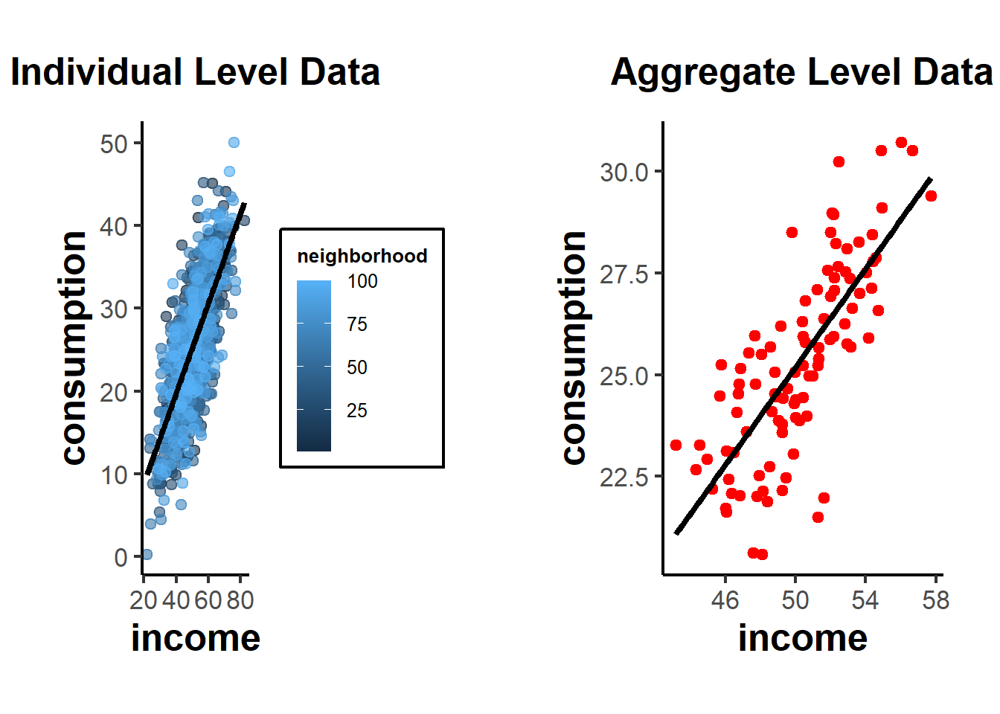
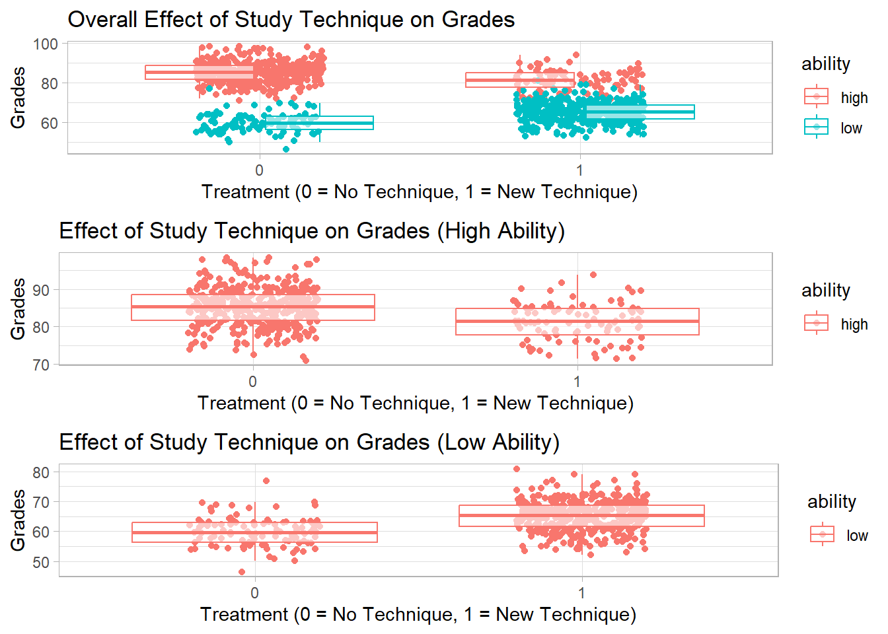
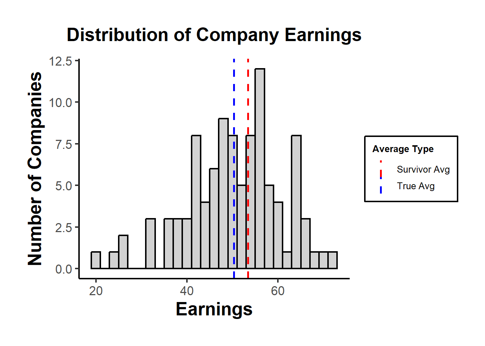
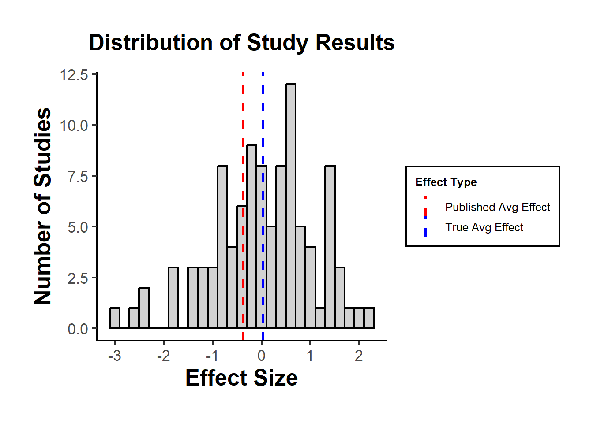
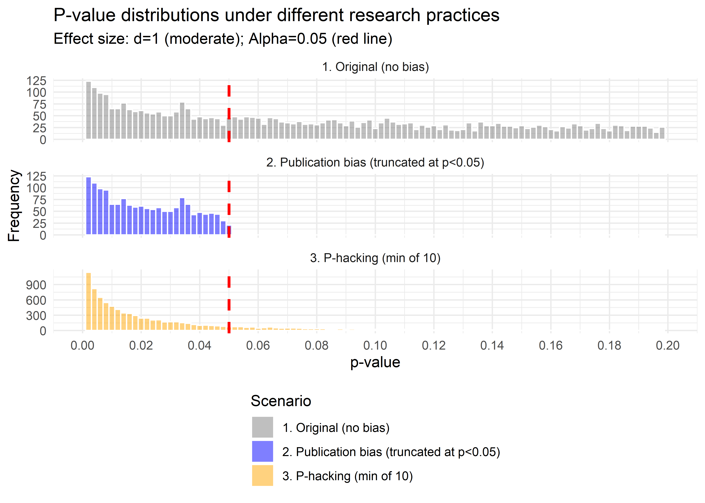
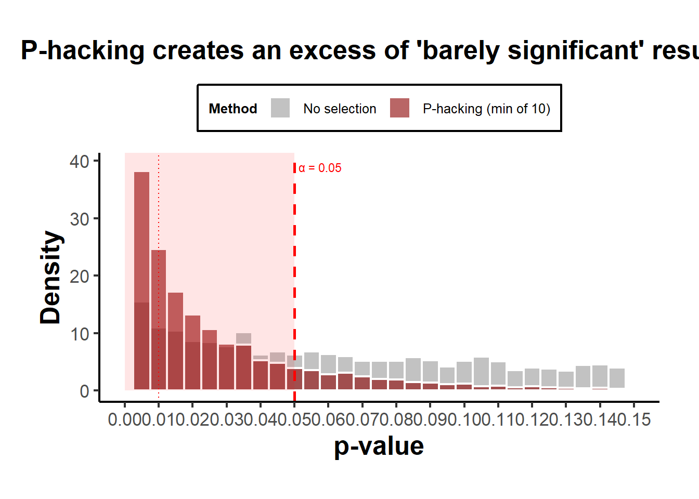
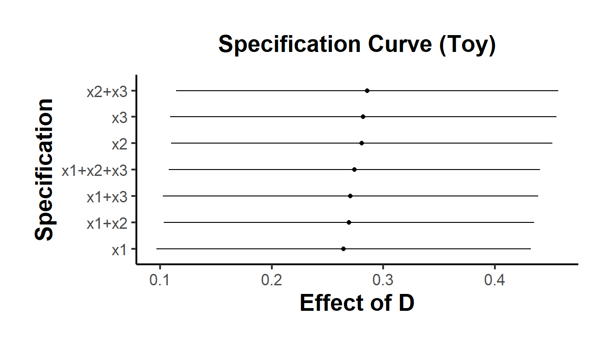

# Other Biases

In econometrics, the main objective is often to uncover causal relationships. However, coefficient estimates can be affected by various biases. Here's a list of common biases that can affect coefficient estimates:

What we've covered so far (see [Linear Regression] and [Endogeneity]):

1.  [**Endogeneity Bias**](#sec-endogeneity): Occurs when an error term is correlated with an independent variable. This can be due to:

    -   [Simultaneity](#sec-simultaneity) (or Reverse Causality): When the dependent variable simultaneously affects an independent variable. Happens when the dependent variable causes changes in the independent variable, leading to a two-way causation.

    -   [Omitted variables](#sec-omitted-variable-bias). Arises when a variable that affects the dependent variable and is correlated with an independent variable is left out of the regression.

    -   [Measurement error](#sec-measurement-error) in the independent variable. Bias introduced when variables in a model are measured with error. If the error is in an independent variable and is classical (mean zero and uncorrelated with the true value), it typically biases the coefficient towards zero.

2.  [**Sample Selection Bias**](#sec-endogenous-sample-selection): Arises when the sample is not randomly selected and the selection is related to the dependent variable. A classic example is the Heckman correction for labor market studies where participants self-select into the workforce.

3.  **Multicollinearity**: Not a bias in the strictest sense, but in the presence of high multicollinearity (when independent variables are highly correlated), coefficient estimates can become unstable and standard errors large. This makes it hard to determine the individual effect of predictors on the dependent variable.

4.  **Specification Errors**: Arise when the functional form of the model is incorrectly specified, e.g., omitting interaction terms or polynomial terms when they are needed.

5.  **Autocorrelation (or Serial Correlation)**: Occurs in time-series data when the error terms are correlated over time. This doesn't cause bias in the coefficient estimates of OLS, but it can make standard errors biased, leading to incorrect inference.

6.  **Heteroskedasticity**: Occurs when the variance of the error term is not constant across observations. Like autocorrelation, heteroskedasticity doesn't bias the OLS estimates but can bias standard errors.

7.  [**Aggregation Bias**](#sec-aggregation-bias): Introduced when data are aggregated, and analysis is conducted at this aggregate level rather than the individual level.

8.  [**Survivorship Bias**](#sec-survivorship-bias) **(very much related to Sample Selection)**: Arises when the sample only includes "survivors" or those who "passed" a certain threshold. Common in finance where only funds or firms that "survive" are analyzed.

9.  [**Publication Bias**](#sec-publication-bias): Not a bias in econometric estimation per se, but relevant in the context of empirical studies. It refers to the tendency for journals to publish only significant or positive results, leading to an overrepresentation of such results in the literature.

------------------------------------------------------------------------

## Aggregation Bias {#sec-aggregation-bias}

Aggregation bias, also known as ecological fallacy, refers to the error introduced when data are aggregated and an analysis is conducted at this aggregate level, rather than at the individual level. This can be especially problematic in econometrics, where analysts are often concerned with understanding individual behavior.

When the relationship between variables is different at the aggregate level than at the individual level, aggregation bias can result. The bias arises when inferences about individual behaviors are made based on aggregate data.

**Example**: Suppose we have data on individuals' incomes and their personal consumption. At the individual level, it's possible that as income rises, consumption also rises. However, when we aggregate the data to, say, a neighborhood level, neighborhoods with diverse income levels might all have similar average consumption due to other unobserved factors.

**Step 1**: Create individual level data


``` r
set.seed(123)

# Generate data for 1000 individuals
n <- 1000

income <- rnorm(n, mean = 50, sd = 10)
consumption <- 0.5 * income + rnorm(n, mean = 0, sd = 5)

# Individual level regression
individual_lm <- lm(consumption ~ income)
summary(individual_lm)
#> 
#> Call:
#> lm(formula = consumption ~ income)
#> 
#> Residuals:
#>      Min       1Q   Median       3Q      Max 
#> -15.1394  -3.4572   0.0213   3.5436  16.4557 
#> 
#> Coefficients:
#>             Estimate Std. Error t value Pr(>|t|)    
#> (Intercept) -1.99596    0.82085  -2.432   0.0152 *  
#> income       0.54402    0.01605  33.888   <2e-16 ***
#> ---
#> Signif. codes:  0 '***' 0.001 '**' 0.01 '*' 0.05 '.' 0.1 ' ' 1
#> 
#> Residual standard error: 5.032 on 998 degrees of freedom
#> Multiple R-squared:  0.535,	Adjusted R-squared:  0.5346 
#> F-statistic:  1148 on 1 and 998 DF,  p-value: < 2.2e-16
```

This would show a significant positive relationship between income and consumption.

**Step 2**: Aggregate data to 'neighborhood' level


``` r
# Assume 100 neighborhoods with 10 individuals each
n_neighborhoods <- 100

df <- data.frame(income, consumption)
df$neighborhood <- rep(1:n_neighborhoods, each = n / n_neighborhoods)

aggregate_data <- aggregate(. ~ neighborhood, data = df, FUN = mean)

# Aggregate level regression
aggregate_lm <- lm(consumption ~ income, data = aggregate_data)
summary(aggregate_lm)
#> 
#> Call:
#> lm(formula = consumption ~ income, data = aggregate_data)
#> 
#> Residuals:
#>     Min      1Q  Median      3Q     Max 
#> -4.4517 -0.9322 -0.0826  1.0556  3.5728 
#> 
#> Coefficients:
#>             Estimate Std. Error t value Pr(>|t|)    
#> (Intercept) -4.94338    2.60699  -1.896   0.0609 .  
#> income       0.60278    0.05188  11.618   <2e-16 ***
#> ---
#> Signif. codes:  0 '***' 0.001 '**' 0.01 '*' 0.05 '.' 0.1 ' ' 1
#> 
#> Residual standard error: 1.54 on 98 degrees of freedom
#> Multiple R-squared:  0.5794,	Adjusted R-squared:  0.5751 
#> F-statistic:   135 on 1 and 98 DF,  p-value: < 2.2e-16
```

If aggregation bias is present, the coefficient for income in the aggregate regression might be different from the coefficient in the individual regression, even if the individual relationship is significant and strong.


``` r
library(ggplot2)

# Individual scatterplot
p1 <- ggplot(df, aes(x = income, y = consumption)) +
    geom_point(aes(color = neighborhood), alpha = 0.6) +
    geom_smooth(method = "lm",
                se = FALSE,
                color = "black") +
    labs(title = "Individual Level Data") +
    causalverse::ama_theme()

# Aggregate scatterplot
p2 <- ggplot(aggregate_data, aes(x = income, y = consumption)) +
    geom_point(color = "red") +
    geom_smooth(method = "lm",
                se = FALSE,
                color = "black") +
    labs(title = "Aggregate Level Data") +
    causalverse::ama_theme()

# print(p1)
# print(p2)

gridExtra::grid.arrange(grobs = list(p1, p2), ncol = 2)
```



From these plots, you can see the relationship at the individual level, with each neighborhood being colored differently in the first plot. The second plot shows the aggregate data, where each point now represents a whole neighborhood.

**Direction of Bias**: The direction of the aggregation bias isn't predetermined. It depends on the underlying relationship and the data distribution. In some cases, aggregation might attenuate (reduce) a relationship, while in other cases, it might exaggerate it.

**Relation to Other Biases**: Aggregation bias is closely related to several other biases in econometrics:

1.  **Specification bias**: If you don't properly account for the hierarchical structure of your data (like individuals nested within neighborhoods), your model might be mis-specified, leading to biased estimates.

2.  **[Measurement Error]**: Aggregation can introduce or amplify measurement errors. For instance, if you aggregate noisy measures, the aggregate might not accurately represent any underlying signal.

3.  **Omitted Variable Bias (see [Endogeneity])**: When you aggregate data, you lose information. If the loss of this information results in omitting important predictors that are correlated with both the independent and dependent variables, it can introduce omitted variable bias.

### Simpson's Paradox

Simpson's Paradox, also known as the Yule-Simpson effect, is a phenomenon in probability and statistics where a trend that appears in different groups of data disappears or reverses when the groups are combined. It's a striking example of how aggregated data can sometimes provide a misleading representation of the actual situation.

**Illustration of Simpson's Paradox:**

Consider a hypothetical scenario involving two hospitals: Hospital A and Hospital B. We want to analyze the success rates of treatments at both hospitals. When we break the data down by the severity of the cases (i.e., minor cases vs. major cases):

1.  **Hospital A**:

    -   Minor cases: 95% success rate

    -   Major cases: 80% success rate

2.  **Hospital B**:

    -   Minor cases: 90% success rate

    -   Major cases: 85% success rate

From this breakdown, Hospital A appears to be better in treating both minor and major cases since it has a higher success rate in both categories.

However, let's consider the overall success rates without considering case severity:

-   **Hospital A**: 83% overall success rate

-   **Hospital B**: 86% overall success rate

Suddenly, Hospital B seems better overall. This surprising reversal happens because the two hospitals might handle very different proportions of minor and major cases. For example, if Hospital A treats many more major cases (which have lower success rates) than Hospital B, it can drag down its overall success rate.

**Causes**:

Simpson's Paradox can arise due to:

1.  A lurking or confounding variable that wasn't initially considered (in our example, the severity of the medical cases).

2.  Different group sizes, where one group might be much larger than the other, influencing the aggregate results.

**Implications**:

Simpson's Paradox highlights the dangers of interpreting aggregated data without considering potential underlying sub-group structures. It underscores the importance of disaggregating data and being aware of the context in which it's analyzed.

**Relation to [Aggregation Bias]()**

In the most extreme case, aggregation bias can reverse the coefficient sign of the relationship of interest (i.e., Simpson's Paradox).

**Example**: Suppose we are studying the effect of a new study technique on student grades. We have two groups of students: those who used the new technique (**`treatment = 1`**) and those who did not (**`treatment = 0`**). We want to see if using the new study technique is related to higher grades.

Let's assume grades are influenced by the starting ability of the students. Perhaps in our sample, many high-ability students didn't use the new technique (because they felt they didn't need it), while many low-ability students did.

Here's a setup:

1.  High-ability students tend to have high grades regardless of the technique.

2.  The new technique has a positive effect on grades, but this is masked by the fact that many low-ability students use it.


``` r
set.seed(123)

# Generate data for 1000 students
n <- 1000

# 500 students are of high ability, 500 of low ability
ability <- c(rep("high", 500), rep("low", 500))

# High ability students are less likely to use the technique
treatment <-
  ifelse(ability == "high", rbinom(500, 1, 0.2), rbinom(500, 1, 0.8))

# Grades are influenced by ability and treatment (new technique),
# but the treatment has opposite effects based on ability.
grades <-
  ifelse(
    ability == "high",
    rnorm(500, mean = 85, sd = 5) + treatment * -3,
    rnorm(500, mean = 60, sd = 5) + treatment * 5
  )

df <- data.frame(ability, treatment, grades)

# Regression without considering ability
overall_lm <- lm(grades ~ factor(treatment), data = df)
summary(overall_lm)
#> 
#> Call:
#> lm(formula = grades ~ factor(treatment), data = df)
#> 
#> Residuals:
#>     Min      1Q  Median      3Q     Max 
#> -33.490  -4.729   0.986   6.368  25.607 
#> 
#> Coefficients:
#>                    Estimate Std. Error t value Pr(>|t|)    
#> (Intercept)         80.0133     0.4373   183.0   <2e-16 ***
#> factor(treatment)1 -11.7461     0.6248   -18.8   <2e-16 ***
#> ---
#> Signif. codes:  0 '***' 0.001 '**' 0.01 '*' 0.05 '.' 0.1 ' ' 1
#> 
#> Residual standard error: 9.877 on 998 degrees of freedom
#> Multiple R-squared:  0.2615,	Adjusted R-squared:  0.2608 
#> F-statistic: 353.5 on 1 and 998 DF,  p-value: < 2.2e-16

# Regression within ability groups
high_ability_lm <-
  lm(grades ~ factor(treatment), data = df[df$ability == "high",])
low_ability_lm <-
  lm(grades ~ factor(treatment), data = df[df$ability == "low",])
summary(high_ability_lm)
#> 
#> Call:
#> lm(formula = grades ~ factor(treatment), data = df[df$ability == 
#>     "high", ])
#> 
#> Residuals:
#>      Min       1Q   Median       3Q      Max 
#> -14.2156  -3.4813   0.1186   3.4952  13.2919 
#> 
#> Coefficients:
#>                    Estimate Std. Error t value Pr(>|t|)    
#> (Intercept)         85.1667     0.2504 340.088  < 2e-16 ***
#> factor(treatment)1  -3.9489     0.5776  -6.837 2.37e-11 ***
#> ---
#> Signif. codes:  0 '***' 0.001 '**' 0.01 '*' 0.05 '.' 0.1 ' ' 1
#> 
#> Residual standard error: 5.046 on 498 degrees of freedom
#> Multiple R-squared:  0.08581,	Adjusted R-squared:  0.08398 
#> F-statistic: 46.75 on 1 and 498 DF,  p-value: 2.373e-11
summary(low_ability_lm)
#> 
#> Call:
#> lm(formula = grades ~ factor(treatment), data = df[df$ability == 
#>     "low", ])
#> 
#> Residuals:
#>      Min       1Q   Median       3Q      Max 
#> -13.3717  -3.5413   0.1097   3.3531  17.0568 
#> 
#> Coefficients:
#>                    Estimate Std. Error t value Pr(>|t|)    
#> (Intercept)         59.8950     0.4871 122.956   <2e-16 ***
#> factor(treatment)1   5.2979     0.5474   9.679   <2e-16 ***
#> ---
#> Signif. codes:  0 '***' 0.001 '**' 0.01 '*' 0.05 '.' 0.1 ' ' 1
#> 
#> Residual standard error: 4.968 on 498 degrees of freedom
#> Multiple R-squared:  0.1583,	Adjusted R-squared:  0.1566 
#> F-statistic: 93.68 on 1 and 498 DF,  p-value: < 2.2e-16
```

From this simulation:

-   The **`overall_lm`** might show that the new study technique is associated with lower grades (negative coefficient), because many of the high-ability students (who naturally have high grades) did not use it.

-   The **`high_ability_lm`** will likely show that high-ability students who used the technique had slightly lower grades than high-ability students who didn't.

-   The **`low_ability_lm`** will likely show that low-ability students who used the technique had much higher grades than low-ability students who didn't.

This is a classic example of Simpson's Paradox: within each ability group, the technique appears beneficial, but when data is aggregated, the effect seems negative because of the distribution of the technique across ability groups.


``` r
library(ggplot2)

# Scatterplot for overall data
p1 <-
  ggplot(df, aes(
    x = factor(treatment),
    y = grades,
    color = ability
  )) +
  geom_jitter(width = 0.2, height = 0) +
  geom_boxplot(alpha = 0.6, outlier.shape = NA) +
  labs(title = "Overall Effect of Study Technique on Grades",
       x = "Treatment (0 = No Technique, 1 = New Technique)",
       y = "Grades")

# Scatterplot for high-ability students
p2 <-
  ggplot(df[df$ability == "high", ], aes(
    x = factor(treatment),
    y = grades,
    color = ability
  )) +
  geom_jitter(width = 0.2, height = 0) +
  geom_boxplot(alpha = 0.6, outlier.shape = NA) +
  labs(title = "Effect of Study Technique on Grades (High Ability)",
       x = "Treatment (0 = No Technique, 1 = New Technique)",
       y = "Grades")

# Scatterplot for low-ability students
p3 <-
  ggplot(df[df$ability == "low", ], aes(
    x = factor(treatment),
    y = grades,
    color = ability
  )) +
  geom_jitter(width = 0.2, height = 0) +
  geom_boxplot(alpha = 0.6, outlier.shape = NA) +
  labs(title = "Effect of Study Technique on Grades (Low Ability)",
       x = "Treatment (0 = No Technique, 1 = New Technique)",
       y = "Grades")

# print(p1)
# print(p2)
# print(p3)
gridExtra::grid.arrange(grobs = list(p1, p2, p3), ncol = 1)
```



------------------------------------------------------------------------

## Contamination Bias {#sec-contamination-bias}

@goldsmith2022contamination show regressions with multiple treatments and flexible controls often fail to estimate convex averages of heterogeneous treatment effects, resulting in contamination by non-convex averages of other treatments' effects.

-   3 estimation methods to avoid this bias and find significant contamination bias in observational studies, with experimental studies showing less due to lower variability in propensity scores.

------------------------------------------------------------------------

## Survivorship Bias {#sec-survivorship-bias}

Survivorship bias refers to the logical error of concentrating on the entities that have made it past some selection process and overlooking those that didn't, typically because of a lack of visibility. This can skew results and lead to overly optimistic conclusions.

**Example**: If you were to analyze the success of companies based only on the ones that are still in business today, you'd miss out on the insights from all those that failed. This would give you a distorted view of what makes a successful company, as you wouldn't account for all those that had those same attributes but didn't succeed.

**Relation to Other Biases**:

1.  **Sample Selection Bias**: Survivorship bias is a specific form of sample selection bias. While survivorship bias focuses on entities that "survive", sample selection bias broadly deals with any non-random sample.

2.  **Confirmation Bias**: Survivorship bias can reinforce confirmation bias. By only looking at the "winners", we might confirm our existing beliefs about what leads to success, ignoring evidence to the contrary from those that didn't survive.


``` r
set.seed(42)

# Generating data for 100 companies
n <- 100

# Randomly generate earnings; assume true average earnings is 50
earnings <- rnorm(n, mean = 50, sd = 10)

# Threshold for bankruptcy
threshold <- 40

# Only companies with earnings above the threshold "survive"
survivor_earnings <- earnings[earnings > threshold]

# Average earnings for all companies vs. survivors
true_avg <- mean(earnings)
survivor_avg <- mean(survivor_earnings)

true_avg
#> [1] 50.32515
survivor_avg
#> [1] 53.3898
```

Using a histogram to visualize the distribution of earnings, highlighting the "survivors".


``` r
library(ggplot2)

df <- data.frame(earnings)

p <- ggplot(df, aes(x = earnings)) +
  geom_histogram(
    binwidth = 2,
    fill = "grey",
    color = "black",
    alpha = 0.7
  ) +
  geom_vline(aes(xintercept = true_avg, color = "True Avg"),
             linetype = "dashed",
             size = 1) +
  geom_vline(
    aes(xintercept = survivor_avg, color = "Survivor Avg"),
    linetype = "dashed",
    size = 1
  ) +
  scale_color_manual(values = c("True Avg" = "blue", "Survivor Avg" = "red"),
                     name = "Average Type") +
  labs(title = "Distribution of Company Earnings",
       x = "Earnings",
       y = "Number of Companies") +
  causalverse::ama_theme()

print(p)
```



In the plot, the "True Avg" might be lower than the "Survivor Avg", indicating that by only looking at the survivors, we overestimate the average earnings.

**Remedies**:

1.  **Awareness**: Recognizing the potential for survivorship bias is the first step.

2.  **Inclusive Data Collection**: Wherever possible, try to include data from entities that didn't "survive" in your sample.

3.  **Statistical Techniques**: In cases where the missing data is inherent, methods like Heckman's two-step procedure can be used to correct for sample selection bias.

4.  **External Data Sources**: Sometimes, complementary datasets can provide insights into the missing "non-survivors".

5.  **Sensitivity Analysis**: Test how sensitive your results are to assumptions about the non-survivors.

------------------------------------------------------------------------

## Publication Bias {#sec-publication-bias}

Publication bias occurs when the results of studies influence the likelihood of their being published. Typically, studies with significant, positive, or sensational results are more likely to be published than those with non-significant or negative results. This can skew the perceived effectiveness or results when researchers conduct meta-analyses or literature reviews, leading them to draw inaccurate conclusions.

**Example**: Imagine pharmaceutical research. If 10 studies are done on a new drug, and only 2 show a positive effect while 8 show no effect, but only the 2 positive studies get published, a later review of the literature might erroneously conclude the drug is effective.

**Relation to Other Biases**:

1.  **Selection Bias**: Publication bias is a form of selection bias, where the selection (publication in this case) isn't random but based on the results of the study.

2.  **Confirmation Bias**: Like survivorship bias, publication bias can reinforce confirmation bias. Researchers might only find and cite studies that confirm their beliefs, overlooking the unpublished studies that might contradict them.

Let's simulate an experiment on a new treatment. We'll assume that the treatment has no effect, but due to random variation, some studies will show significant positive or negative effects.


``` r
set.seed(42)

# Number of studies
n <- 100

# Assuming no real effect (effect size = 0)
true_effect <- 0

# Random variation in results
results <- rnorm(n, mean = true_effect, sd = 1)

# Only "significant" results get published 
# (arbitrarily defining significant as abs(effect) > 1.5)
published_results <- results[abs(results) > 1.5]

# Average effect for all studies vs. published studies
true_avg_effect <- mean(results)
published_avg_effect <- mean(published_results)

true_avg_effect
#> [1] 0.03251482
published_avg_effect
#> [1] -0.3819601
```

Using a histogram to visualize the distribution of study results, highlighting the "published" studies.


``` r
library(ggplot2)

df <- data.frame(results)

p <- ggplot(df, aes(x = results)) +
  geom_histogram(
    binwidth = 0.2,
    fill = "grey",
    color = "black",
    alpha = 0.7
  ) +
  geom_vline(
    aes(xintercept = true_avg_effect,
        color = "True Avg Effect"),
    linetype = "dashed",
    size = 1
  ) +
  geom_vline(
    aes(xintercept = published_avg_effect,
        color = "Published Avg Effect"),
    linetype = "dashed",
    size = 1
  ) +
  scale_color_manual(
    values = c(
      "True Avg Effect" = "blue",
      "Published Avg Effect" = "red"
    ),
    name = "Effect Type"
  ) +
  labs(title = "Distribution of Study Results",
       x = "Effect Size",
       y = "Number of Studies") +
  causalverse::ama_theme()

print(p)
```



The plot might show that the "True Avg Effect" is around zero, while the "Published Avg Effect" is likely higher or lower, depending on which studies happen to have significant results in the simulation.

**Remedies**:

1.  **Awareness**: Understand and accept that publication bias exists, especially when conducting literature reviews or meta-analyses.

2.  **Study Registries**: Encourage the use of study registries where researchers register their studies before they start. This way, one can see all initiated studies, not just the published ones.

3.  **Publish All Results**: Journals and researchers should make an effort to publish negative or null results. Some journals, known as "null result journals", specialize in this.

4.  **Funnel Plots and Egger's Test**: In meta-analyses, these are methods to visually and statistically detect publication bias.

5.  **Use of Preprints**: Promote the use of preprint servers where researchers can upload studies before they're peer-reviewed, ensuring that results are available regardless of eventual publication status.

6.  **p-curve analysis**: addresses publication bias and p-hacking by analyzing the distribution of p-values below 0.05 in research studies. It posits that a right-skewed distribution of these p-values indicates a true effect, whereas a left-skewed distribution suggests p-hacking and no true underlying effect. The method includes a "half-curve" test to counteract extensive p-hacking [@simonsohn2014p, @simonsohn2014pa, @simonsohn2015better].

------------------------------------------------------------------------

## p-Hacking

> "If you torture the data long enough, it will confess to anything." - Ronald Coase\
> (Our job here is to spot bruises.)

This chapter reviews the major statistical tools developed to diagnose, detect, and adjust for *p*-hacking and related selective-reporting practices. We focus on the mathematical foundations, assumptions, and inferential targets of each method; map the different "schools of thought"; summarize the simulation evidence and the spirited debates. This section also offers practical advice for applied researchers.

We separate three concepts that are often conflated:

-   **p-hacking**: data-dependent analysis choices (optional stopping, selective covariates, flexible transformations, subgrouping, selective outcomes/specifications) aimed at achieving $p \le \alpha$.
-   **publication bias** (a.k.a. *selective publication*): the file-drawer problem (journals, reviewers, or authors preferentially publish significant or "exciting" results).
-   **QRPs** (questionable research practices): a broader umbrella that includes *p*-hacking and HARKing (hypothesizing after results are known).

This section is about **detection** (diagnosis) and **adjustment** (bias correction) for these phenomena in literatures and meta-analyses. We aim for methods that either (i) test for their presence, (ii) quantify their magnitude, or (iii) produce bias-adjusted effect estimates and uncertainty statements.

------------------------------------------------------------------------

### Theoretical Signatures of p-Hacking and Selection

#### p-values under the null and under alternatives

Let $Z \sim \mathcal{N}(\mu,1)$ denote a $z$-statistic for a one-sided test, where $\mu$ is the noncentrality: $\mu = \theta / \mathrm{SE}$ for true effect $\theta$ and known standard error $\mathrm{SE}$. The one-sided $p$-value is $P = 1 - \Phi(Z)$. A change of variables yields the density of $P$ under $\mu$:

$$
f(p \mid \mu)
= \frac{\phi(\Phi^{-1}(1-p) - \mu)}{\phi(\Phi^{-1}(1-p))}
= \exp\big\{\mu  z - \tfrac{1}{2}\mu^2\big\}, \quad z = \Phi^{-1}(1-p), \quad p \in (0,1).
$$

Under the **null** ($\mu=0$), $f(p\mid 0) \equiv 1$ (Uniform$(0,1)$).

Under true effects ($\mu \ne 0$), the density **decreases** in $p$: small $p$'s are more likely.

For **two-sided** tests, $P = 2[1-\Phi(|Z|)]$, and the density becomes a mixture due to $|Z|$ [^37-biases-1]

[^37-biases-1]: Most methods below operate on $z$-scores (or on $p$ restricted to $p \le \alpha$), making one-sided exposition sufficient.

#### Selection on statistical significance

Let $S \in \{0,1\}$ indicate publication/reporting. Suppose selection depends on the *p*-value via a **selection function** $s(p) = \Pr(S=1\mid p)$. The observed $p$-density is

$$
f_{\mathrm{obs}}(p) \propto f(p \mid \mu)  s(p).
$$

where $f(p\mid \mu)$ is the theoretical distribution of $p$-values given a true effect $\mu$ and $s(p)$ is the probability that a result with $p$ is *reported or published*.[^37-biases-2]

[^37-biases-2]: A literature with heterogeneous true effects replaces $f(p\mid \mu)$ by $\int f(p\mid \mu) dG(\mu)$ for some mixing distribution $G$. This formulation treats each study's noncentrality $\mu_i$ as a random draw from $G$, capturing true-effect heterogeneity rather than assuming a common $\mu$.

    1.  It is the foundation of **random-effects meta-analysis** [@dersimonian1986meta, @hedges2014statistical, @borenstein2021introduction] and underlies **selection models** where the observed density becomes $f_{\text{obs}}(p)\propto s(p)\int f(p\mid \mu) dG(\mu)$ [@iyengar1988selection, @vevea1995general].
    2.  The same hierarchical idea appears in **empirical Bayes frameworks** for large-scale inference [@efron2010correlated, @storey2002direct, @stephens2017false], where the observed distribution of $z$-scores or $p$-values reflects a mixture of null and non-null effects.
    3.  Modern extensions such as **z-curve** [@bartovs2022z] and **nonparametric selection models** [@andrews2019identification] estimate both $G$ and, when relevant, the selection function $s(p)$ directly from data, providing flexible tools to model publication bias and heterogeneity simultaneously.

This function results in two *related* phenomena (both distort what we see in the published literature), but they're **conceptually distinct** and represent **two polar mechanisms** of how the distortion arises. Mathematically, they correspond to *different shapes of the selection function* $s(p)$.

Two polar cases:

-   **Pure publication bias**: $s(p)=\mathbb{1}\{p\le \alpha\}$ (hard threshold).
-   **p-hacking**: $s(p)$ is smoother or has spikes (e.g., bunching just below $\alpha$, or data-dependent steps that inflate the mass in $(0,\alpha]$, especially near $\alpha$).

In the pure publication bias (the "hard threshold") case

-   **Mechanism:** Results are analyzed *honestly*, but only significant findings are published.

-   **Mathematically:** The selection function is a step function,

    $$ s(p) =  \begin{cases} 1, & p \le \alpha,\\[4pt] 0, & p > \alpha, \end{cases} $$

    or sometimes a monotone increasing function that jumps at $p=\alpha$.\
    Every result above the conventional significance threshold is suppressed, which is the infamous *file drawer problem* [@rosenthal1979file; @iyengar1988selection].

-   **Consequence:** The literature includes only those tests that crossed the line; but the *p*-values themselves were generated correctly under valid statistical procedures.\
    Thus, all distortion happens *after* data analysis.

In the p-hacking (the "smooth or spiked selection") case

-   **Mechanism:** The researcher **manipulates the analysis itself** (e.g.,, tries multiple specifications, adds/drops covariates, peeks at data, etc.) until a significant *p* emerges.\
    Every result is "eligible" for publication, but the *reported* $p$ has been manufactured by analytical flexibility.

-   **Mathematically:** The selection function $s(p)$ is not a hard cutoff but **smoothly increasing** or **spiky** near $\alpha$:

    $$ s(p) \text{ is large for } p \lesssim \alpha, \text{ small for } p > \alpha. $$

    Researchers disproportionately generate or select *p*-values just below .05, producing **bunching** in $(0.045, 0.05]$. It's a signature seen empirically in economics [@brodeur2016star] and psychology [@masicampo2012peculiar].

-   **Consequence:** The literature is distorted *within* the analysis process, even if all results are published.\
    It inflates the frequency of borderline significant *p*-values and biases estimated effects upward.

They represent **extreme ends** of a continuum of selective processes (Table \@ref(tab:p-hacking-bias-comparison))

| Dimension                 | Pure publication bias                   | Pure p-hacking                              |
|---------------------------|-----------------------------------------|---------------------------------------------|
| Timing of distortion      | *After* analysis (in publication)       | *During* analysis (in researcher's choices) |
| Selection function $s(p)$ | Hard threshold (step at $\alpha$)       | Smooth, often spiked near $\alpha$          |
| Who applies selection     | Editors, reviewers, publication process | Researchers themselves                      |
| What's hidden             | Nonsignificant studies                  | Nonsignificant analyses within studies      |
| Empirical pattern         | Missing mass for $p>\alpha$             | Excess mass just below $\alpha$             |

: (#tab:p-hacking-bias-comparison) Differences between publication bias and p-hacking

In practice, most literatures sit somewhere in between, where both the file drawer (publication bias) and data-contingent choices (p-hacking) operate simultaneously.\
That's why comprehensive models of bias (e.g., @andrews2019identification, @vevea1995general, @bartovs2022z) allow $s(p)$ to take flexible forms that include both extremes as special cases.

> Publication bias hides results *after* they're obtained.\
> p-hacking reshapes results *before* they're reported.\
> They both distort the observable distribution of $p$-values, but they do so through **opposite ends** of the research process.

At the surface level, both processes produce similar observable patterns of *published* $p$-values:

-   **Right-skew among significant** $p$'s because only (or mostly) small *p*'s appear: more mass near $0$ than near $\alpha$.
-   **Bunching just below** $\alpha$ (e.g., $z$ near $1.96$) suggests manipulation or selection thresholds. In both cases, you'll often see a cliff or spike just below the threshold.
-   **Funnel plot asymmetry**: small studies show larger effects (or higher $z$) than large ones. Small studies (with larger SEs) are more likely to pass the significance gate if they overestimate the effect, producing a one-sided funnel.
-   **Excess significance**: more significant results than expected given estimated power. The proportion of significant results exceeds what would be expected given the median power of published studies.

From a purely *descriptive* point of view (e.g., looking only at a histogram of published *p*-values), **you cannot tell them apart**.\
That's why analysts call them **observationally confounded mechanisms**: different generative processes, same marginal distributions.

The distinction lies in *where* the distortion occurs in the data-generation pipeline (Figures \@ref(fig:p-value-distribution-comparison) and \@ref(fig:p-hacking-pile-up-effect))

1.  **Pure publication bias**

-   The underlying analysis is honest: each study reports one $p$ generated from the correct $f(p\mid \mu)$.

-   But the **publication process** truncates the distribution: only $p \le \alpha$ appear.

-   Mathematically, the observed density is

    $$
    f_{\mathrm{obs}}(p) = \frac{f(p\mid \mu) \mathbb{1}\{p \le \alpha\}}{\Pr(p \le \alpha\mid \mu)}.
    $$

-   **Key signature**: a *sharp truncation*, literally no data above $\alpha$. There's no spike *within* $(0,\alpha)$, just absence *beyond* it.

2.  **p-hacking**

-   The distortion happens **before** the "publication filter," during the analysis. Researchers keep sampling, transforming, or subgrouping until they find $p\le\alpha$.

-   Each study's reported $p$ is the *minimum* over multiple draws $p_1,\dots,p_m$ from the true $f(p\mid\mu)$:

    $$
    P_{\text{hack}} = \min(P_1, \dots, P_m).
    $$

-   The resulting distribution is

    $$
    f_{\text{hack}}(p) = m [1 - F(p)]^{m-1} f(p),
    $$

    which spikes near 0 when $m$ is large, or piles up near $\alpha$ if researchers stop only when reaching significance.

-   **Key signature**: not just truncation, but a smooth inflation near $\alpha$, sometimes with a local mode or "bump" just below it.

------------------------------------------------------------------------


``` r
set.seed(123)
# True effect small: mu = 1 (z ~ N(1,1))
simulate_p <- function(mu = 1,
                       m = 1,
                       alpha = 0.05,
                       n = 10000) {
    z <- rnorm(n * m, mu, 1)
    p <- 2 * (1 - pnorm(abs(z)))
    if (m > 1) {
        p <- matrix(p, n, m)
        p <- apply(p, 1, min)  # pick the smallest = p-hacking
    }
    return(p)
}

# Generate full distributions (don't truncate yet)
p_orig <-
    simulate_p(mu = 1, m = 1)               # original distribution
p_pub <-
    p_orig[p_orig <= 0.05]               # truncate to sigs (publication bias)
p_hack <-
    simulate_p(mu = 1, m = 10)              # p-hacking: 10 tries, keep min

# Create a more interpretative comparison
library(ggplot2)
library(dplyr)

# Compare three scenarios
df <- rbind(
    data.frame(p = p_orig, type = "1. Original (no bias)"),
    data.frame(p = c(p_pub, rep(
        NA, length(p_orig) - length(p_pub)
    )),
    type = "2. Publication bias (truncated at p<0.05)"),
    data.frame(p = p_hack, type = "3. P-hacking (min of 10)")
) %>%
    filter(!is.na(p))
```


``` r
# Focus on the critical region (0 to 0.2)
ggplot(df, aes(p, fill = type)) +
    geom_histogram(
        binwidth = 0.002,
        position = "identity",
        alpha = 0.5,
        color = "white"
    ) +
    geom_vline(
        xintercept = 0.05,
        linetype = "dashed",
        linewidth = 1,
        color = "red"
    ) +
    scale_x_continuous(limits = c(0, 0.2), breaks = seq(0, 0.2, 0.02)) +
    scale_fill_manual(values = c("gray50", "blue", "orange")) +
    labs(
        x = "p-value",
        y = "Frequency",
        title = "P-value distributions under different research practices",
        subtitle = "Effect size: d=1 (moderate); Alpha=0.05 (red line)",
        fill = "Scenario"
    ) +
    # causalverse::ama_theme() + 
    theme_minimal() +
    theme(legend.position = "bottom",
      legend.direction = "vertical") +
    facet_wrap( ~ type, ncol = 1, scales = "free_y")
```

<div class="figure" style="text-align: center">

<p class="caption">(\#fig:p-value-distribution-comparison)Comparison of p-value Distributions</p>
</div>


``` r
# Alternative: Show the pile-up more clearly
df2 <- rbind(
    data.frame(p = p_orig, type = "No selection"),
    data.frame(p = p_hack, type = "P-hacking (min of 10)")
)

ggplot(df2, aes(p, fill = type)) +
    geom_histogram(
        aes(y = after_stat(density)),
        binwidth = 0.005,
        position = "identity",
        alpha = 0.6,
        color = "white"
    ) +
    geom_vline(
        xintercept = 0.05,
        linetype = "dashed",
        linewidth = 1,
        color = "red"
    ) +
    geom_vline(
        xintercept = 0.01,
        linetype = "dotted",
        linewidth = 0.5,
        color = "red"
    ) +
    scale_x_continuous(limits = c(0, 0.15), breaks = seq(0, 0.15, 0.01)) +
    scale_fill_manual(values = c("gray60", "darkred")) +
    annotate(
        "text",
        x = 0.05,
        y = Inf,
        label = "α = 0.05",
        hjust = -0.1,
        vjust = 2,
        color = "red",
        size = 3
    ) +
    annotate(
        "rect",
        xmin = 0,
        xmax = 0.05,
        ymin = 0,
        ymax = Inf,
        alpha = 0.1,
        fill = "red"
    ) +
    labs(
        x = "p-value",
        y = "Density",
        title = "P-hacking creates an excess of 'barely significant' results",
        fill = "Method"
    ) +
    # theme_minimal() +
    causalverse::ama_theme() + 
    theme(legend.position = "top")
```

<div class="figure" style="text-align: center">

<p class="caption">(\#fig:p-hacking-pile-up-effect)P-hacking Distributions</p>
</div>

**Interpretation:**

-   Both curves show an **absence of** $p>0.05$, so both produce "only significant" results.
-   The *publication-bias* case ends abruptly at 0.05 (a cliff).
-   The *p-hacking* case has a **bulge just below 0.05**, the telltale "bunching" pattern seen in real literature [@brodeur2016star].

Why this distinction matters

-   If the mechanism is pure truncation, the bias can be corrected with selection models that model $s(p)$ as a step function [@vevea1995general].
-   If the mechanism is smooth hacking, then the effective $s(p)$ is continuous or even non-monotone, which these models may miss. Hence, newer approaches such as z-curve, p-curve, and nonparametric selection models [@andrews2019identification, @bartovs2022z] are more appropriate.

In practice, literatures exhibit both: authors p-hack to cross $\alpha$, then journals favor those results, compounding bias. So although the observable patterns overlap, the mechanistic implications and statistical corrections differ (Table \@ref(tab:p-hacking-mech-comparison)).

| Mechanism        | When bias enters             | Typical $s(p)$             | Observable pattern      | Distinguishable feature                      |
|------------------|------------------------------|----------------------------|-------------------------|----------------------------------------------|
| Publication bias | After analysis (file drawer) | Step function at $\alpha$  | Truncation at $\alpha$  | Sharp cutoff; missing nonsignificant results |
| p-hacking        | During analysis              | Smooth/spiky near $\alpha$ | Bunching below $\alpha$ | Local spike or inflation near threshold      |

: (#tab:p-hacking-mech-comparison) Mechanism comparison between publication bias and p-hacking

Both yield "too many small *p*-values," but p-hacking reshapes the distribution, while publication bias truncates it. That's why, theoretically, they are modeled as polar cases, distinct endpoints of the same general selection framework.

------------------------------------------------------------------------

### Method Families

#### Descriptive diagnostics & caliper tests

**Targets**: patterns in $p$-histograms or $z$-densities suggesting manipulation.

-   **Caliper test around** $\alpha$: Compare counts just below vs. just above the significance threshold.

Let $T$ be a $z$-statistic and $c=1.96$ (two-sided $\alpha=0.05$). With a small bandwidth $h>0$, define

$$
N_+ = \#\{i: T_i \in (c, c+h]\}, \quad N_- = \#\{i: T_i \in (c-h, c]\}.
$$

Under continuity of the density at $c$ and no manipulation, $N_+$ and $N_-$ should be similar. A binomial test (or local polynomial density test) assesses $H_0: f_T(c^-) = f_T(c^+)$.

-   **Heaping near** $p=.05$: Excess in $(.045,.05]$ relative to $(.04,.045]$ (binning-based tests).

**Pros**: Simple, visual.

**Cons**: Sensitive to binning and heterogeneity; can't separate publication bias from *p*-hacking.

#### Excess significance tests

@ioannidis2007exploratory -type logic: If study $i$ has power $\pi_i$ to detect a common effect $\hat\theta$ at its $\alpha_i$, then the expected number of significant results is $E=\sum_i \pi_i$. Compare the observed $O$ to $E$ via a binomial (or Poisson-binomial) tail: $$
O \sim \text{Poisson-Binomial}(\pi_1,\ldots,\pi_k), \quad \text{test } \Pr(O \ge O_{\text{obs}} \mid \boldsymbol{\pi}).
$$ **Pros**: Uses study-level power.

**Cons**: Depends on the (possibly biased) common-effect estimate; heterogeneity complicates power computation.

#### Funnel asymmetry tests and meta-regression

Let $y_i$ be estimated effects and $s_i$ their standard errors.

-   **Egger regression**: $z_i = y_i/s_i$. Fit $$
    z_i = \beta_0 + \beta_1 \cdot \frac{1}{s_i} + \varepsilon_i, \quad \varepsilon_i \sim \mathcal{N}(0,\sigma^2).
    $$ A nonzero intercept $\beta_0$ indicates **small-study effects** (possibly selection).

-   **PET-PEESE** (precision-effect testing and precision-effect estimate with standard error): regress effect sizes on $s_i$ or $s_i^2$ (weighted by $1/s_i^2$), $$
    \text{PET: } y_i = \beta_0 + \beta_1 s_i + \varepsilon_i, \quad
    \text{PEESE: } y_i = \beta_0 + \beta_1 s_i^2 + \varepsilon_i.
    $$ The intercept $\beta_0$ estimates the effect "at infinite precision" (bias-adjusted). Use PET to decide whether to report PEESE (various decision rules exist).

**Pros**: Easy, interpretable, works with non-$p$ results.

**Cons**: Conflates genuine small-study heterogeneity with bias; sensitive to model misspecification and between-study variance.

#### Weight-function selection models (classical likelihood)

Assume a common effect (or random effects) and a **stepwise** selection weight $w(p)$ by $p$-bins. With fixed effect $\theta$ and normal sampling,

$$
y_i \sim \mathcal{N}(\theta, s_i^2), \quad p_i = p(y_i).
$$

Observed likelihood with selection weights:

$$
L(\theta, \mathbf{w}) \propto \prod_{i=1}^k \frac{\phi\left(\frac{y_i-\theta}{s_i}\right)\frac{1}{s_i} w(p_i)}
{\int \phi\left(\frac{y-\theta}{s_i}\right)\frac{1}{s_i} w(p(y)) dy}.
$$

$$
L(\theta, \mathbf{w}) \propto \prod_{i=1}^k \frac{\phi\left(\frac{y_i-\theta}{s_i}\right)\frac{1}{s_i} w(p_i)}
{\int \phi\left(\frac{y-\theta}{s_i}\right)\frac{1}{s_i} w(p(y)) dy}.
$$

where typical $w(p)$: piecewise constants over $(0,.001],(.001,.01],(.01,.05],(.05,1]$ [@vevea1995general, @vevea2005publication]. Random-effects models integrate over $\theta_i \sim \mathcal{N}(\theta, \tau^2)$.

**Pros**: Directly models selection; yields adjusted effects.

**Cons**: Partial identifiability; sensitive to binning and $w(\cdot)$ parameterization; requires careful computation.

#### p-curve (diagnosis and effect estimation)

Given only significant $p$-values (e.g., $p_i \le \alpha$), define the conditional density

$$
f_\alpha(p \mid \mu) = \frac{f(p \mid \mu)}{\Pr(P \le \alpha \mid \mu)}, \quad 0<p\le \alpha.
$$

**Diagnostics**:

-   **Right-skew test**: Under $H_0$ (no evidential value), conditional $p/\alpha \sim \text{Uniform}(0,1)$; test whether mass is concentrated near $0$ (e.g., binomial test for $p < \alpha/2$, Stouffer's $z$ for $-\ln p$).

-   **Flat/left-skew** suggests no evidential value (or severe p-hacking).

**Effect estimation**: Maximize the conditional likelihood $\prod_i f_\alpha(p_i\mid \mu)$ over $\mu$ (or map $\mu$ to effect size $\theta$).

**Pros**: Works with published significant results; robust to missing nonsignificant studies if selection is mostly on significance.

**Cons**: Sensitive to heterogeneity, $p$-dependence, and inclusion of $p$-values from *p*-hacked specifications; uses only significant $p$'s.

#### p-uniform and p-uniform\*

Closely related to p-curve but formulated as an MLE for the effect based on the conditional distribution of $p$ given $p\le \alpha$. Original p-uniform assumes homogeneous effects [@van2015meta]; p-uniform\* relaxes this (improved bias properties under heterogeneity) [@van2018correcting].

-   **Estimator**: $\hat\theta$ maximizes $\prod_i f_\alpha(p_i \mid \theta)$, with $f_\alpha$ derived from the test family (e.g., $t$-tests). Variants provide CIs via profile likelihood.

**Pros**: Likelihood-based; can be extended to random-effects.

**Cons**: Original p-uniform biased under heterogeneity and low power; p-uniform\* mitigates but requires care in practice (choice of $\alpha$, modeling of $t/z$ tests).

#### z-curve (mixtures on truncated z)

Model the distribution of **observed significant** $z$-scores via a finite mixture: $$
Z \mid S=1 \sim \sum_{k=1}^K \pi_k  \mathcal{N}(\mu_k, 1) \text{ truncated to } \{|Z|\ge z_{\alpha/2}\}.
$$ Estimate $(\pi_k, \mu_k)$ by EM (or Bayesian mixtures). Then compute:

-   **Expected Discovery Rate (EDR)** at level $\alpha$: $$
    \mathrm{EDR} = \int \Pr(|Z| \ge z_{\alpha/2} \mid \mu)  d\hat G(\mu).
    $$
-   **Expected Replication Rate (ERR)** for the subset already significant: $$
    \mathrm{ERR} = \mathbb{E}\big[\Pr(|Z^\star| \ge z_{\alpha/2} \mid \mu) \big| |Z|\ge z_{\alpha/2}\big].
    $$

**Pros**: Flexible heterogeneity modeling; informative discovery/replication diagnostics.

**Cons**: Identification relies on truncation; mixture choice ($K$) and regularization matter.

#### Nonparametric selection and deconvolution

Observed $z$-density factorizes as

$$
f_{\mathrm{obs}}(z) \propto s(z)  (g \star \varphi)(z), \quad \varphi=\mathcal{N}(0,1), \quad g(\mu)=\text{effect distribution}.
$$

With shape restrictions (e.g., monotone, stepwise $s$), both $s$ and $g$ are estimable via nonparametric MLE. Inference delivers an estimated selection function and a bias-corrected effect distribution [@andrews2019identification].

**Pros**: Minimal parametric assumptions; estimates the selection mechanism itself.

**Cons**: Requires large samples of $z$'s; sensitive to tuning and shape restrictions; computationally heavier.

#### Robust Bayesian meta-analysis (RoBMA and kin)

Construct a model-averaged posterior by mixing [@bartovs2020robma]:

-   Effect models: null vs. alternative; fixed vs. random effects.

-   Bias models: none vs. PET-PEESE vs. selection (weight) models.

Posterior model probabilities: $$
p(M_j \mid \text{data}) \propto p(\text{data} \mid M_j) p(M_j),
$$ and a model-averaged effect: $$
p(\theta \mid \text{data}) = \sum_j p(\theta \mid \text{data}, M_j)  p(M_j \mid \text{data}).
$$ Bayes factors quantify evidence for bias models and for $\theta=0$.

**Pros**: Integrates over model uncertainty; often best-in-class calibration in simulations.

**Cons**: Requires priors and specialized software; transparency requires careful reporting.

#### Statistical forensics (reporting integrity)

-   **statcheck**: recomputes $p$ from reported test statistics and flags inconsistencies.
-   **GRIM** (Granularity-Related Inconsistency of Means): checks whether reported means (with integer-count data) align with feasible fractions $k/n$ at reported $n$.
-   **GRIMMER**: analogous checks for standard deviations.

**Pros**: Catches reporting errors and some forms of fabrication.

**Cons**: Does not measure *p*-hacking directly; depends on data granularity and reporting completeness.

------------------------------------------------------------------------

### Mathematical Details and Assumptions

#### Conditional p-density and likelihoods for p-curve/p-uniform

For a one-sided $z$-test with noncentrality $\mu$, we derived

$$
f(p \mid \mu) = \exp\{\mu z - \tfrac{1}{2}\mu^2\}, \quad z=\Phi^{-1}(1-p).
$$

The power at level $\alpha$ is

$$
\pi(\mu,\alpha) = \Pr(P\le \alpha \mid \mu) = \Pr(Z \ge z_{1-\alpha} \mid \mu) = 1-\Phi(z_{1-\alpha} - \mu).
$$

Conditional on $P\le \alpha$,

$$
f_\alpha(p \mid \mu) = \frac{\exp\{\mu z - \tfrac{1}{2}\mu^2\}}{\pi(\mu,\alpha)}, \quad p\in(0,\alpha].
$$

**Likelihood** (p-curve/p-uniform):

$$
\ell(\mu) = \sum_{i=1}^k \Big[\mu z_i - \tfrac{1}{2}\mu^2 - \log \pi(\mu,\alpha)\Big], \quad z_i=\Phi^{-1}(1-p_i).
$$

Map $\mu$ to effect size, e.g., standardized mean difference $d = \mu \sqrt{2/n}$ if appropriate.

**Heterogeneity**: Replace $\mu$ by a mixture; p-uniform\* introduces random effects. Identifiability is delicate with only significant $p$'s: priors or constraints regularize.

#### Weight-function likelihoods

Let $w(p)$ be piecewise-constant with parameters $\mathbf{w} = (w_1,\ldots,w_B)$ over bins $\mathcal{I}_b$. For fixed-effects:

$$
L(\theta,\mathbf{w}) \propto \prod_i \frac{\phi\left(\frac{y_i-\theta}{s_i}\right)\frac{1}{s_i} w_b \mathbb{1}\{p_i\in \mathcal{I}_b\}}
{\sum_{b=1}^B w_b \int_{p(y)\in \mathcal{I}_b} \phi\left(\frac{y-\theta}{s_i}\right)\frac{1}{s_i} dy}.
$$

Random-effects integrate over $\theta_i \sim \mathcal{N}(\theta,\tau^2)$ in numerator/denominator. Parameters $\mathbf{w}$ are identifiable up to scale (normalize by, e.g., $w_B=1$). Standard inference uses profile likelihood or the observed information.

#### Egger/PET-PEESE algebra

Assume $y_i = \theta + b_i + \varepsilon_i$, where $b_i$ captures small-study bias correlated with $s_i$ and $\varepsilon_i \sim \mathcal{N}(0,s_i^2)$. Regressions: $$
\text{PET: } y_i = \beta_0 + \beta_1 s_i + \varepsilon_i', \quad
\text{PEESE: } y_i = \beta_0 + \beta_1 s_i^2 + \varepsilon_i',
$$ with weights $1/s_i^2$. Under a linear bias-in-$s_i$ model, $\beta_0 \approx \theta$.

#### Andrews--Kasy identification

Let $f_{\mathrm{obs}}(z)$ be the observed density of $z$-scores. Write

$$
f_{\mathrm{obs}}(z) = \frac{s(z) \int \varphi(z-\mu)  dG(\mu)}{\int s(u) \int \varphi(u-\mu)  dG(\mu) du}.
$$

Impose $s(z)$ monotone non-decreasing (selection more likely for larger $|z|$ or for $z>0$ in one-sided literature), and $s$ stepwise on known cutpoints (e.g., $z$ corresponding to $\alpha=.10,.05,.01$). Estimate $s$ and $G$ by NPMLE over these classes (convex optimization over mixing measures and stepweights). Bias-corrected effect summaries are obtained by integrating w.r.t. $\hat G$.

#### z-curve EM

Observed $z_i$ with $|z_i|\ge z_{\alpha/2}$.

E-step:

$$
\gamma_{ik} = \frac{\pi_k  \varphi(z_i - \mu_k)}{\sum_{j=1}^K \pi_j  \varphi(z_i - \mu_j)}.
$$

M-step (before truncation correction):

$$
\hat\pi_k \leftarrow \frac{1}{n}\sum_i \gamma_{ik}, \quad
\hat\mu_k \leftarrow \frac{\sum_i \gamma_{ik} z_i}{\sum_i \gamma_{ik}}.
$$

Truncation is handled by normalizing component likelihoods over $\{|z|\ge z_{\alpha/2}\}$. Posterior across $\mu$ gives EDR/ERR.

------------------------------------------------------------------------

### Schools of Thought and Notable Debates

1.  **Curve methods (p-curve, p-uniform) vs. selection models**

    -   *Curve camp*: Conditioning on $p\le\alpha$ is a feature, not a bug (i.e., model only what is observed); robust when the publication threshold dominates selection.
    -   *Critiques*: Ignoring nonsignificant studies throws away information; heterogeneity inflates bias (original p-uniform), and p-hacked $p$'s violate independence.
    -   *Responses*: p-curve's evidential-value tests are diagnostic, not estimators of the grand mean; p-uniform\* improves bias handling; careful inclusion/exclusion rules mitigate hacking artifacts.

2.  **Selection models vs. PET-PEESE**

    -   *Selection camp*: Directly model the selection mechanism ($w(p)$); theoretically principled for publication bias.
    -   *PET-PEESE camp*: Simple, transparent; adjusts for small-study effects without committing to a (possibly wrong) $w(p)$.
    -   *Meta-simulations*: Often find PET-PEESE good at Type I control when the true effect is near zero but biased when heterogeneity is large; selection models better recover effects when the selection form is approximately correct but can be unstable otherwise.

3.  **z-curve vs. others**

    -   *z-curve*: Flexible mixtures capture heterogeneity; yields EDR/ERR and visually compelling diagnostics of "too few" discoveries relative to what the mixture implies.
    -   *Critiques*: Mixture choice and truncation estimation can be sensitive; interpretability hinges on the mapping from $\mu$-mixture to power under selection.

4.  **Nonparametric selection (Andrews--Kasy) vs. parametric approaches**

    -   *Nonparametric*: Fewer parametric assumptions, can recover selection function shapes (e.g., spikes at $z=1.96$).
    -   *Critiques*: Data-hungry; shape restrictions still assumptions; computational complexity.

Several simulation comparisons (e.g., @carter2019correcting) report that **no single method dominates**. Model-averaged Bayesian approaches (RoBMA) often perform well by hedging across bias models; selection models excel when selection is correctly specified; PET-PEESE is attractive for simple screening; p-curve/p-uniform are better as **diagnostics** (with cautious effect estimation).

For a table of summary, refer to Table \@ref(tab:p-hacking-discourse).

| Topic                                | Proponents                         | Critics                          | Core claim                                                                                         | Counter-claim                                                                          | Applied implication                                                                |
|--------------------------------------|------------------------------------|----------------------------------|----------------------------------------------------------------------------------------------------|----------------------------------------------------------------------------------------|------------------------------------------------------------------------------------|
| **p-curve (diagnostic & estimator)** | @simonsohn2014p                    | @morey2025poor                   | Right-skew among significant p's indicates evidential value; can estimate effect from sig-only p's | Estimator can be biased/undercover with heterogeneity, non-iid p's, misspecified tests | Use for diagnostics; for estimation prefer p-uniform\*, selection models, or RoBMA |
| **p-uniform vs p-uniform\***         | @van2015meta, @van2018correcting   | Curve-method skeptics            | p-uniform works under homogeneity; p-uniform\* better under RE                                     | Still sensitive to wrong test family, dependence among p's                             | Prefer p-uniform\* with care; match test families; sensitivity analyses            |
| **z-curve & Replicability-Index**    | @bartovs2022z                      | Misc. critics                    | Mixture on truncated z gives EDR/ERR and replicability diagnostics                                 | Component choice and truncation make results sensitive; dependence issues              | Great for heterogeneity diagnostics; report EDR/ERR + sensitivity                  |
| **PET-PEESE vs selection models**    | @stanley2012meta, @stanley2014meta | Selection-model proponents       | PET-PEESE is simple & transparent for small-study effects                                          | Over/under-correction if small-study effects reflect real heterogeneity                | Run PET-PEESE as a screen; headline estimate via selection/RoBMA                   |
| **Trim-and-fill**                    | @duval2000trim                     | Misc. critics                    | Impute missing to symmetrize funnel; fast heuristic                                                | Can misbehave under complex selection; shouldn't be sole method                        | Use as quick sensitivity, not a final estimator                                    |
| **Excess-significance tests**        | @ioannidis2007exploratory          | Misc. critics                    | Simple test: too many significant vs expected                                                      | Uses biased effect to compute power; ignores heterogeneity properly                    | Use as a red flag; not definitive proof                                            |
| **Finance factor zoo / t≥3 rule**    | @harvey2016and                     | Skeptics of universal thresholds | Multiple testing inflates false factors; raise t-threshold                                         | Arbitrary thresholds don't fix specification search                                    | Control FDR/Holm; pre-specify; publish nulls; use out-of-sample                    |

: (#tab:p-hacking-discourse) Discourse on p-hacking and publication bias literature

**Key takeaways**:

-   **p-curve**: Great at diagnosing evidential value; controversial as a meta-analytic estimator (especially under heterogeneity/dependence).
-   **z-curve**: Powerful heterogeneity-aware diagnostics (EDR/ERR); interpret with sensitivity to mixture choices.
-   **PET-PEESE**: Simple screening; avoid as the only correction.
-   **Selection models and RoBMA**: Strong for effect estimation; assumptions must be transparent; benefit from model averaging.

------------------------------------------------------------------------

### Practical Guidance for Applied Analysts

-   Use multiple lenses: funnel asymmetry (Egger), PET-PEESE, at least one selection model, and at least one curve method. Convergence across methods is informative; divergence is itself a result.
-   Prefer random-effects throughout; heterogeneity is the rule in business and social science literature.
-   When only significant studies are available, p-curve/p-uniform\* provide diagnostic power; but seek gray literature to reduce selection.
-   For quantification and decision-making (e.g., whether to act on an effect), consider RoBMA or selection models with sensitivity analyses over $w(p)$ grids.
-   Always report assumptions, inclusion criteria, pre-specified analysis plans, and specification curves for your own analyses to preempt *p*-hacking concerns.

------------------------------------------------------------------------

> The following code is illustrative (toy implementations). For production work, use vetted packages (e.g., `metafor`, `weightr`, `robumeta`, `RoBMA`, `puniform`, `zcurve`).


``` r
# Toy dataset: reported p-values and study-level results
set.seed(1)

# suspicious bump?
p_sig <- c(0.001, 0.004, 0.017, 0.021, 0.032, 0.041, 0.048, 0.049)  
n_sig <- length(p_sig)

# --- p-curve right-skew test (binomial below alpha/2) ---
alpha <- 0.05
below <- sum(p_sig < alpha/2)
p_binom <- binom.test(below, n_sig, 0.5, alternative = "greater")$p.value

list(
  n_sig = n_sig,
  count_below_alpha_over_2 = below,
  right_skew_pvalue = p_binom
)
#> $n_sig
#> [1] 8
#> 
#> $count_below_alpha_over_2
#> [1] 4
#> 
#> $right_skew_pvalue
#> [1] 0.6367187
```


``` r
# --- p-uniform-style MLE for one-sided z-test (toy) ---
# Conditional log-likelihood: l(mu) = sum( mu z_i - 0.5 mu^2 - log(pi(mu, alpha)) )
z <- qnorm(1 - p_sig)                    # one-sided z from p-values
pi_mu <- function(mu, alpha) { 1 - pnorm(qnorm(1 - alpha) - mu) }
loglik_mu <- function(mu, z, alpha) {
  sum(mu * z - 0.5 * mu^2 - log(pi_mu(mu, alpha)))
}
opt <- optimize(function(m) -loglik_mu(m, z, alpha), c(-5, 5))
mu_hat <- opt$minimum
list(mu_hat = mu_hat, se_mu_naive = NA_real_)  # (CI via profile LL or bootstrap)
#> $mu_hat
#> [1] 0.2568013
#> 
#> $se_mu_naive
#> [1] NA
```


``` r
# --- Egger and PET-PEESE on synthetic effect sizes ---
library(metafor)

set.seed(2)
k <- 1000
true_theta <- 0.2
s_i <- runif(k, 0.05, 0.3)
y_i <- rnorm(k, mean = true_theta, sd = s_i) + rnorm(k, sd = 0.05)  # add small-study bias

# Egger test
z_i <- y_i / s_i
egger_fit <- lm(z_i ~ I(1/s_i))
egger_intercept_p <- summary(egger_fit)$coef[1,4]

# PET
pet_fit <- lm(y_i ~ s_i, weights = 1/s_i^2)
pet_est <- coef(pet_fit)[1]

# PEESE
peese_fit <- lm(y_i ~ I(s_i^2), weights = 1/s_i^2)
peese_est <- coef(peese_fit)[1]

list(egger_intercept_p = egger_intercept_p, PET = pet_est, PEESE = peese_est)
#> $egger_intercept_p
#> [1] 0.1895973
#> 
#> $PET
#> (Intercept) 
#>    0.196547 
#> 
#> $PEESE
#> (Intercept) 
#>   0.2022462
```


``` r
# --- Caliper test (binomial near z = 1.96) ---
# Construct z from y/s and test mass just above vs. below 1.96
zvals <- y_i / s_i
c <- 1.96
h <- 0.1
N_plus <- sum(zvals > c & zvals <= c + h)
N_minus <- sum(zvals > c - h & zvals <= c)
p_caliper <- binom.test(N_plus, N_plus + N_minus, 0.5, alternative = "greater")$p.value
list(N_plus = N_plus, N_minus = N_minus, caliper_p = p_caliper)
#> $N_plus
#> [1] 23
#> 
#> $N_minus
#> [1] 33
#> 
#> $caliper_p
#> [1] 0.9295523
```


``` r
# --- Minimal weight-function selection model via profile likelihood (toy) ---
# Two-bin weights: w1 for p <= .05, w2 = 1 for p > .05
# Fixed-effect theta; optimize over (theta, w1).
y <- y_i; s <- s_i
pval_two_sided <- 2*(1 - pnorm(abs(y/s)))

negloglik_sel <- function(par) {
  theta <- par[1]; w1 <- exp(par[2])  # enforce positivity
  # Numerator w.r.t. each study
  w_i <- ifelse(pval_two_sided <= 0.05, w1, 1)
  num <- dnorm((y - theta)/s) / s * w_i

  # Denominator: integrate over all y for each study (approx via normal CDF on p-threshold)
  # For two-sided z, the region p<=.05 is |z|>=1.96. We can integrate in z-space:
  mu_i <- (theta)/s
  prob_sig <- pnorm(-1.96 - mu_i) + (1 - pnorm(1.96 - mu_i))  # two tails
  denom <- w1 * prob_sig + (1 - prob_sig) * 1

  -sum(log(num) - log(denom))
}

fit <-
    optim(c(mean(y), 0),
          negloglik_sel,
          method = "BFGS",
          control = list(reltol = 1e-9))
theta_hat <- fit$par[1]
w1_hat <- exp(fit$par[2])
list(
    theta_hat = theta_hat,
    weight_sig_vs_nonsig = w1_hat,
    converged = fit$convergence == 0
)
#> $theta_hat
#> [1] 0.2077403
#> 
#> $weight_sig_vs_nonsig
#> [1] 0.9457644
#> 
#> $converged
#> [1] TRUE
```


``` r
# --- Specification curve ---
# Fit many reasonable models and plot effect vs. specification rank
library(dplyr)
library(ggplot2)

# Fake data and specifications
n <- 500
X <- matrix(rnorm(n * 3), n, 3)
colnames(X) <- c("x1", "x2", "x3")
D <- rbinom(n, 1, 0.5)
Y <- 0.3 * D + X %*% c(0.2,-0.1, 0) + rnorm(n)

specs <- list(
    c("x1"),
    c("x2"),
    c("x3"),
    c("x1", "x2"),
    c("x1", "x3"),
    c("x2", "x3"),
    c("x1", "x2", "x3")
)

est <- lapply(specs, function(ctrls) {
    f <- as.formula(paste0("Y ~ D + ", paste(ctrls, collapse = "+")))
    m <- lm(f, data = data.frame(Y, D, X))
    co <- summary(m)$coef["D", ]
    data.frame(
        spec = paste(ctrls, collapse = "+"),
        beta = co["Estimate"],
        se = co["Std. Error"]
    )
}) |> bind_rows()
```

Refer to Figures \@ref(fig:spec-curve-toy) for an example of the specification curve.


``` r
ggplot(est, aes(x = reorder(spec, beta), y = beta)) +
    geom_point() +
    geom_errorbar(aes(ymin = beta - 1.96 * se, ymax = beta + 1.96 * se), width = 0) +
    coord_flip() +
    labs(x = "Specification", y = "Effect of D", title = "Specification Curve (Toy)") +
    causalverse::ama_theme()
```

<div class="figure" style="text-align: center">

<p class="caption">(\#fig:spec-curve-toy)Specification Curve (Toy)</p>
</div>

------------------------------------------------------------------------

### Limitations and Open Problems

-   **Attribution**: Distinguishing *p*-hacking from publication/editorial selection is intrinsically difficult without design-level information (pre-registration, registered reports).
-   **Heterogeneity**: All methods struggle when effects vary widely (typical in business and social science). Random-effects and mixture modeling help but do not magically identify selection.
-   **Dependent** $p$-values: Multiple specifications from the same dataset violate independent sampling; many methods implicitly assume independence.
-   **Model misspecification**: PET-PEESE assumes linear bias-in-precision; selection models assume binwise $w(p)$; z-curve assumes parametric mixtures. Sensitivity analysis is essential.
-   **Sequential practices**: Optional stopping and data peeking induce complex $p$-distributions not captured by simple $s(p)$ models.
-   **Power diagnostics**: EDR/ERR and excess-significance tests rely on power computed under fitted models; uncertainty in power should be propagated (often ignored).

------------------------------------------------------------------------
