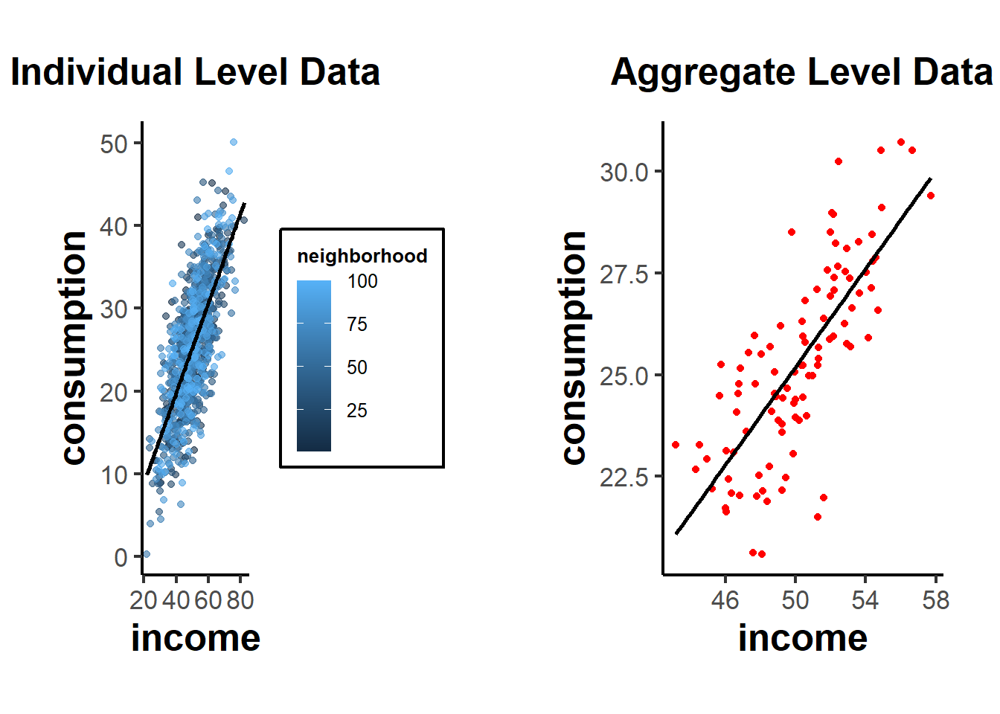
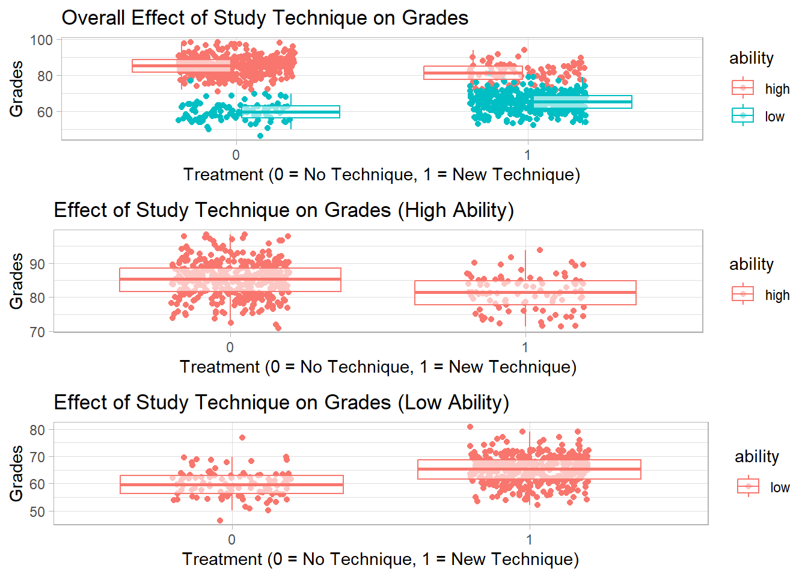
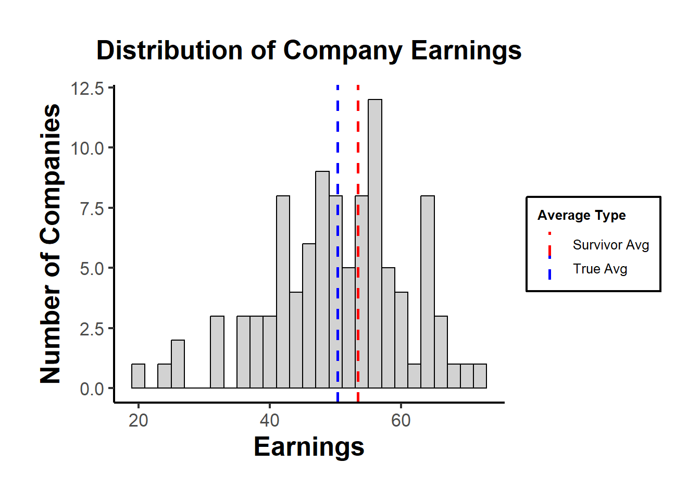

# Other Biases

In econometrics, the main objective is often to uncover causal relationships. However, coefficient estimates can be affected by various biases. Here's a list of common biases that can affect coefficient estimates:

What we've covered so far (see [Linear Regression] and [Endogeneity]):

1.  [**Endogeneity Bias**](#sec-endogeneity): Occurs when an error term is correlated with an independent variable. This can be due to:

    -   [Simultaneity](#sec-simultaneity) (or Reverse Causality): When the dependent variable simultaneously affects an independent variable. Happens when the dependent variable causes changes in the independent variable, leading to a two-way causation.

    -   [Omitted variables](#sec-omitted-variable-bias). Arises when a variable that affects the dependent variable and is correlated with an independent variable is left out of the regression.

    -   [Measurement error](#sec-measurement-error) in the independent variable. Bias introduced when variables in a model are measured with error. If the error is in an independent variable and is classical (mean zero and uncorrelated with the true value), it typically biases the coefficient towards zero.

2.  [**Sample Selection Bias**](#sec-endogenous-sample-selection): Arises when the sample is not randomly selected and the selection is related to the dependent variable. A classic example is the Heckman correction for labor market studies where participants self-select into the workforce.

3.  **Multicollinearity**: Not a bias in the strictest sense, but in the presence of high multicollinearity (when independent variables are highly correlated), coefficient estimates can become unstable and standard errors large. This makes it hard to determine the individual effect of predictors on the dependent variable.

4.  **Specification Errors**: Arise when the functional form of the model is incorrectly specified, e.g., omitting interaction terms or polynomial terms when they are needed.

5.  **Autocorrelation (or Serial Correlation)**: Occurs in time-series data when the error terms are correlated over time. This doesn't cause bias in the coefficient estimates of OLS, but it can make standard errors biased, leading to incorrect inference.

6.  **Heteroskedasticity**: Occurs when the variance of the error term is not constant across observations. Like autocorrelation, heteroskedasticity doesn't bias the OLS estimates but can bias standard errors.

7.  [**Aggregation Bias**](#sec-aggregation-bias): Introduced when data are aggregated, and analysis is conducted at this aggregate level rather than the individual level.

8.  [**Survivorship Bias**](#sec-survivorship-bias) **(very much related to Sample Selection)**: Arises when the sample only includes "survivors" or those who "passed" a certain threshold. Common in finance where only funds or firms that "survive" are analyzed.

9.  [**Publication Bias**](#sec-publication-bias): Not a bias in econometric estimation per se, but relevant in the context of empirical studies. It refers to the tendency for journals to publish only significant or positive results, leading to an overrepresentation of such results in the literature.

------------------------------------------------------------------------

## Aggregation Bias {#sec-aggregation-bias}

Aggregation bias, also known as ecological fallacy, refers to the error introduced when data are aggregated and an analysis is conducted at this aggregate level, rather than at the individual level. This can be especially problematic in econometrics, where analysts are often concerned with understanding individual behavior.

When the relationship between variables is different at the aggregate level than at the individual level, aggregation bias can result. The bias arises when inferences about individual behaviors are made based on aggregate data.

**Example**: Suppose we have data on individuals' incomes and their personal consumption. At the individual level, it's possible that as income rises, consumption also rises. However, when we aggregate the data to, say, a neighborhood level, neighborhoods with diverse income levels might all have similar average consumption due to other unobserved factors.

**Step 1**: Create individual level data


``` r
set.seed(123)

# Generate data for 1000 individuals
n <- 1000

income <- rnorm(n, mean = 50, sd = 10)
consumption <- 0.5 * income + rnorm(n, mean = 0, sd = 5)

# Individual level regression
individual_lm <- lm(consumption ~ income)
summary(individual_lm)
#> 
#> Call:
#> lm(formula = consumption ~ income)
#> 
#> Residuals:
#>      Min       1Q   Median       3Q      Max 
#> -15.1394  -3.4572   0.0213   3.5436  16.4557 
#> 
#> Coefficients:
#>             Estimate Std. Error t value Pr(>|t|)    
#> (Intercept) -1.99596    0.82085  -2.432   0.0152 *  
#> income       0.54402    0.01605  33.888   <2e-16 ***
#> ---
#> Signif. codes:  0 '***' 0.001 '**' 0.01 '*' 0.05 '.' 0.1 ' ' 1
#> 
#> Residual standard error: 5.032 on 998 degrees of freedom
#> Multiple R-squared:  0.535,	Adjusted R-squared:  0.5346 
#> F-statistic:  1148 on 1 and 998 DF,  p-value: < 2.2e-16
```

This would show a significant positive relationship between income and consumption.

**Step 2**: Aggregate data to 'neighborhood' level


``` r
# Assume 100 neighborhoods with 10 individuals each
n_neighborhoods <- 100

df <- data.frame(income, consumption)
df$neighborhood <- rep(1:n_neighborhoods, each = n / n_neighborhoods)

aggregate_data <- aggregate(. ~ neighborhood, data = df, FUN = mean)

# Aggregate level regression
aggregate_lm <- lm(consumption ~ income, data = aggregate_data)
summary(aggregate_lm)
#> 
#> Call:
#> lm(formula = consumption ~ income, data = aggregate_data)
#> 
#> Residuals:
#>     Min      1Q  Median      3Q     Max 
#> -4.4517 -0.9322 -0.0826  1.0556  3.5728 
#> 
#> Coefficients:
#>             Estimate Std. Error t value Pr(>|t|)    
#> (Intercept) -4.94338    2.60699  -1.896   0.0609 .  
#> income       0.60278    0.05188  11.618   <2e-16 ***
#> ---
#> Signif. codes:  0 '***' 0.001 '**' 0.01 '*' 0.05 '.' 0.1 ' ' 1
#> 
#> Residual standard error: 1.54 on 98 degrees of freedom
#> Multiple R-squared:  0.5794,	Adjusted R-squared:  0.5751 
#> F-statistic:   135 on 1 and 98 DF,  p-value: < 2.2e-16
```

If aggregation bias is present, the coefficient for income in the aggregate regression might be different from the coefficient in the individual regression, even if the individual relationship is significant and strong.


``` r
library(ggplot2)

# Individual scatterplot
p1 <- ggplot(df, aes(x = income, y = consumption)) +
    geom_point(aes(color = neighborhood), alpha = 0.6) +
    geom_smooth(method = "lm",
                se = FALSE,
                color = "black") +
    labs(title = "Individual Level Data") +
    causalverse::ama_theme()

# Aggregate scatterplot
p2 <- ggplot(aggregate_data, aes(x = income, y = consumption)) +
    geom_point(color = "red") +
    geom_smooth(method = "lm",
                se = FALSE,
                color = "black") +
    labs(title = "Aggregate Level Data") +
    causalverse::ama_theme()

# print(p1)
# print(p2)

gridExtra::grid.arrange(grobs = list(p1, p2), ncol = 2)
```



From these plots, you can see the relationship at the individual level, with each neighborhood being colored differently in the first plot. The second plot shows the aggregate data, where each point now represents a whole neighborhood.

**Direction of Bias**: The direction of the aggregation bias isn't predetermined. It depends on the underlying relationship and the data distribution. In some cases, aggregation might attenuate (reduce) a relationship, while in other cases, it might exaggerate it.

**Relation to Other Biases**: Aggregation bias is closely related to several other biases in econometrics:

1.  **Specification bias**: If you don't properly account for the hierarchical structure of your data (like individuals nested within neighborhoods), your model might be mis-specified, leading to biased estimates.

2.  **[Measurement Error]**: Aggregation can introduce or amplify measurement errors. For instance, if you aggregate noisy measures, the aggregate might not accurately represent any underlying signal.

3.  **Omitted Variable Bias (see [Endogeneity])**: When you aggregate data, you lose information. If the loss of this information results in omitting important predictors that are correlated with both the independent and dependent variables, it can introduce omitted variable bias.

### Simpson's Paradox

Simpson's Paradox, also known as the Yule-Simpson effect, is a phenomenon in probability and statistics where a trend that appears in different groups of data disappears or reverses when the groups are combined. It's a striking example of how aggregated data can sometimes provide a misleading representation of the actual situation.

**Illustration of Simpson's Paradox:**

Consider a hypothetical scenario involving two hospitals: Hospital A and Hospital B. We want to analyze the success rates of treatments at both hospitals. When we break the data down by the severity of the cases (i.e., minor cases vs. major cases):

1.  **Hospital A**:

    -   Minor cases: 95% success rate

    -   Major cases: 80% success rate

2.  **Hospital B**:

    -   Minor cases: 90% success rate

    -   Major cases: 85% success rate

From this breakdown, Hospital A appears to be better in treating both minor and major cases since it has a higher success rate in both categories.

However, let's consider the overall success rates without considering case severity:

-   **Hospital A**: 83% overall success rate

-   **Hospital B**: 86% overall success rate

Suddenly, Hospital B seems better overall. This surprising reversal happens because the two hospitals might handle very different proportions of minor and major cases. For example, if Hospital A treats many more major cases (which have lower success rates) than Hospital B, it can drag down its overall success rate.

**Causes**:

Simpson's Paradox can arise due to:

1.  A lurking or confounding variable that wasn't initially considered (in our example, the severity of the medical cases).

2.  Different group sizes, where one group might be much larger than the other, influencing the aggregate results.

**Implications**:

Simpson's Paradox highlights the dangers of interpreting aggregated data without considering potential underlying sub-group structures. It underscores the importance of disaggregating data and being aware of the context in which it's analyzed.

**Relation to [Aggregation Bias]()**

In the most extreme case, aggregation bias can reverse the coefficient sign of the relationship of interest (i.e., Simpson's Paradox).

**Example**: Suppose we are studying the effect of a new study technique on student grades. We have two groups of students: those who used the new technique (**`treatment = 1`**) and those who did not (**`treatment = 0`**). We want to see if using the new study technique is related to higher grades.

Let's assume grades are influenced by the starting ability of the students. Perhaps in our sample, many high-ability students didn't use the new technique (because they felt they didn't need it), while many low-ability students did.

Here's a setup:

1.  High-ability students tend to have high grades regardless of the technique.

2.  The new technique has a positive effect on grades, but this is masked by the fact that many low-ability students use it.


``` r
set.seed(123)

# Generate data for 1000 students
n <- 1000

# 500 students are of high ability, 500 of low ability
ability <- c(rep("high", 500), rep("low", 500))

# High ability students are less likely to use the technique
treatment <-
  ifelse(ability == "high", rbinom(500, 1, 0.2), rbinom(500, 1, 0.8))

# Grades are influenced by ability and treatment (new technique),
# but the treatment has opposite effects based on ability.
grades <-
  ifelse(
    ability == "high",
    rnorm(500, mean = 85, sd = 5) + treatment * -3,
    rnorm(500, mean = 60, sd = 5) + treatment * 5
  )

df <- data.frame(ability, treatment, grades)

# Regression without considering ability
overall_lm <- lm(grades ~ factor(treatment), data = df)
summary(overall_lm)
#> 
#> Call:
#> lm(formula = grades ~ factor(treatment), data = df)
#> 
#> Residuals:
#>     Min      1Q  Median      3Q     Max 
#> -33.490  -4.729   0.986   6.368  25.607 
#> 
#> Coefficients:
#>                    Estimate Std. Error t value Pr(>|t|)    
#> (Intercept)         80.0133     0.4373   183.0   <2e-16 ***
#> factor(treatment)1 -11.7461     0.6248   -18.8   <2e-16 ***
#> ---
#> Signif. codes:  0 '***' 0.001 '**' 0.01 '*' 0.05 '.' 0.1 ' ' 1
#> 
#> Residual standard error: 9.877 on 998 degrees of freedom
#> Multiple R-squared:  0.2615,	Adjusted R-squared:  0.2608 
#> F-statistic: 353.5 on 1 and 998 DF,  p-value: < 2.2e-16

# Regression within ability groups
high_ability_lm <-
  lm(grades ~ factor(treatment), data = df[df$ability == "high",])
low_ability_lm <-
  lm(grades ~ factor(treatment), data = df[df$ability == "low",])
summary(high_ability_lm)
#> 
#> Call:
#> lm(formula = grades ~ factor(treatment), data = df[df$ability == 
#>     "high", ])
#> 
#> Residuals:
#>      Min       1Q   Median       3Q      Max 
#> -14.2156  -3.4813   0.1186   3.4952  13.2919 
#> 
#> Coefficients:
#>                    Estimate Std. Error t value Pr(>|t|)    
#> (Intercept)         85.1667     0.2504 340.088  < 2e-16 ***
#> factor(treatment)1  -3.9489     0.5776  -6.837 2.37e-11 ***
#> ---
#> Signif. codes:  0 '***' 0.001 '**' 0.01 '*' 0.05 '.' 0.1 ' ' 1
#> 
#> Residual standard error: 5.046 on 498 degrees of freedom
#> Multiple R-squared:  0.08581,	Adjusted R-squared:  0.08398 
#> F-statistic: 46.75 on 1 and 498 DF,  p-value: 2.373e-11
summary(low_ability_lm)
#> 
#> Call:
#> lm(formula = grades ~ factor(treatment), data = df[df$ability == 
#>     "low", ])
#> 
#> Residuals:
#>      Min       1Q   Median       3Q      Max 
#> -13.3717  -3.5413   0.1097   3.3531  17.0568 
#> 
#> Coefficients:
#>                    Estimate Std. Error t value Pr(>|t|)    
#> (Intercept)         59.8950     0.4871 122.956   <2e-16 ***
#> factor(treatment)1   5.2979     0.5474   9.679   <2e-16 ***
#> ---
#> Signif. codes:  0 '***' 0.001 '**' 0.01 '*' 0.05 '.' 0.1 ' ' 1
#> 
#> Residual standard error: 4.968 on 498 degrees of freedom
#> Multiple R-squared:  0.1583,	Adjusted R-squared:  0.1566 
#> F-statistic: 93.68 on 1 and 498 DF,  p-value: < 2.2e-16
```

From this simulation:

-   The **`overall_lm`** might show that the new study technique is associated with lower grades (negative coefficient), because many of the high-ability students (who naturally have high grades) did not use it.

-   The **`high_ability_lm`** will likely show that high-ability students who used the technique had slightly lower grades than high-ability students who didn't.

-   The **`low_ability_lm`** will likely show that low-ability students who used the technique had much higher grades than low-ability students who didn't.

This is a classic example of Simpson's Paradox: within each ability group, the technique appears beneficial, but when data is aggregated, the effect seems negative because of the distribution of the technique across ability groups.


``` r
library(ggplot2)

# Scatterplot for overall data
p1 <-
  ggplot(df, aes(
    x = factor(treatment),
    y = grades,
    color = ability
  )) +
  geom_jitter(width = 0.2, height = 0) +
  geom_boxplot(alpha = 0.6, outlier.shape = NA) +
  labs(title = "Overall Effect of Study Technique on Grades",
       x = "Treatment (0 = No Technique, 1 = New Technique)",
       y = "Grades")

# Scatterplot for high-ability students
p2 <-
  ggplot(df[df$ability == "high", ], aes(
    x = factor(treatment),
    y = grades,
    color = ability
  )) +
  geom_jitter(width = 0.2, height = 0) +
  geom_boxplot(alpha = 0.6, outlier.shape = NA) +
  labs(title = "Effect of Study Technique on Grades (High Ability)",
       x = "Treatment (0 = No Technique, 1 = New Technique)",
       y = "Grades")

# Scatterplot for low-ability students
p3 <-
  ggplot(df[df$ability == "low", ], aes(
    x = factor(treatment),
    y = grades,
    color = ability
  )) +
  geom_jitter(width = 0.2, height = 0) +
  geom_boxplot(alpha = 0.6, outlier.shape = NA) +
  labs(title = "Effect of Study Technique on Grades (Low Ability)",
       x = "Treatment (0 = No Technique, 1 = New Technique)",
       y = "Grades")

# print(p1)
# print(p2)
# print(p3)
gridExtra::grid.arrange(grobs = list(p1, p2, p3), ncol = 1)
```



------------------------------------------------------------------------

## Contamination Bias {#sec-contamination-bias}

@goldsmith2022contamination show regressions with multiple treatments and flexible controls often fail to estimate convex averages of heterogeneous treatment effects, resulting in contamination by non-convex averages of other treatments' effects.

-   3 estimation methods to avoid this bias and find significant contamination bias in observational studies, with experimental studies showing less due to lower variability in propensity scores.

------------------------------------------------------------------------

## Survivorship Bias {#sec-survivorship-bias}

Survivorship bias refers to the logical error of concentrating on the entities that have made it past some selection process and overlooking those that didn't, typically because of a lack of visibility. This can skew results and lead to overly optimistic conclusions.

**Example**: If you were to analyze the success of companies based only on the ones that are still in business today, you'd miss out on the insights from all those that failed. This would give you a distorted view of what makes a successful company, as you wouldn't account for all those that had those same attributes but didn't succeed.

**Relation to Other Biases**:

1.  **Sample Selection Bias**: Survivorship bias is a specific form of sample selection bias. While survivorship bias focuses on entities that "survive", sample selection bias broadly deals with any non-random sample.

2.  **Confirmation Bias**: Survivorship bias can reinforce confirmation bias. By only looking at the "winners", we might confirm our existing beliefs about what leads to success, ignoring evidence to the contrary from those that didn't survive.


``` r
set.seed(42)

# Generating data for 100 companies
n <- 100

# Randomly generate earnings; assume true average earnings is 50
earnings <- rnorm(n, mean = 50, sd = 10)

# Threshold for bankruptcy
threshold <- 40

# Only companies with earnings above the threshold "survive"
survivor_earnings <- earnings[earnings > threshold]

# Average earnings for all companies vs. survivors
true_avg <- mean(earnings)
survivor_avg <- mean(survivor_earnings)

true_avg
#> [1] 50.32515
survivor_avg
#> [1] 53.3898
```

Using a histogram to visualize the distribution of earnings, highlighting the "survivors".


``` r
library(ggplot2)

df <- data.frame(earnings)

p <- ggplot(df, aes(x = earnings)) +
  geom_histogram(
    binwidth = 2,
    fill = "grey",
    color = "black",
    alpha = 0.7
  ) +
  geom_vline(aes(xintercept = true_avg, color = "True Avg"),
             linetype = "dashed",
             size = 1) +
  geom_vline(
    aes(xintercept = survivor_avg, color = "Survivor Avg"),
    linetype = "dashed",
    size = 1
  ) +
  scale_color_manual(values = c("True Avg" = "blue", "Survivor Avg" = "red"),
                     name = "Average Type") +
  labs(title = "Distribution of Company Earnings",
       x = "Earnings",
       y = "Number of Companies") +
  causalverse::ama_theme()

print(p)
```



In the plot, the "True Avg" might be lower than the "Survivor Avg", indicating that by only looking at the survivors, we overestimate the average earnings.

**Remedies**:

1.  **Awareness**: Recognizing the potential for survivorship bias is the first step.

2.  **Inclusive Data Collection**: Wherever possible, try to include data from entities that didn't "survive" in your sample.

3.  **Statistical Techniques**: In cases where the missing data is inherent, methods like Heckman's two-step procedure can be used to correct for sample selection bias.

4.  **External Data Sources**: Sometimes, complementary datasets can provide insights into the missing "non-survivors".

5.  **Sensitivity Analysis**: Test how sensitive your results are to assumptions about the non-survivors.

------------------------------------------------------------------------

## Publication Bias {#sec-publication-bias}

Publication bias occurs when the results of studies influence the likelihood of their being published. Typically, studies with significant, positive, or sensational results are more likely to be published than those with non-significant or negative results. This can skew the perceived effectiveness or results when researchers conduct meta-analyses or literature reviews, leading them to draw inaccurate conclusions.

**Example**: Imagine pharmaceutical research. If 10 studies are done on a new drug, and only 2 show a positive effect while 8 show no effect, but only the 2 positive studies get published, a later review of the literature might erroneously conclude the drug is effective.

**Relation to Other Biases**:

1.  **Selection Bias**: Publication bias is a form of selection bias, where the selection (publication in this case) isn't random but based on the results of the study.

2.  **Confirmation Bias**: Like survivorship bias, publication bias can reinforce confirmation bias. Researchers might only find and cite studies that confirm their beliefs, overlooking the unpublished studies that might contradict them.

Let's simulate an experiment on a new treatment. We'll assume that the treatment has no effect, but due to random variation, some studies will show significant positive or negative effects.


``` r
set.seed(42)

# Number of studies
n <- 100

# Assuming no real effect (effect size = 0)
true_effect <- 0

# Random variation in results
results <- rnorm(n, mean = true_effect, sd = 1)

# Only "significant" results get published 
# (arbitrarily defining significant as abs(effect) > 1.5)
published_results <- results[abs(results) > 1.5]

# Average effect for all studies vs. published studies
true_avg_effect <- mean(results)
published_avg_effect <- mean(published_results)

true_avg_effect
#> [1] 0.03251482
published_avg_effect
#> [1] -0.3819601
```

Using a histogram to visualize the distribution of study results, highlighting the "published" studies.


``` r
library(ggplot2)

df <- data.frame(results)

p <- ggplot(df, aes(x = results)) +
  geom_histogram(
    binwidth = 0.2,
    fill = "grey",
    color = "black",
    alpha = 0.7
  ) +
  geom_vline(
    aes(xintercept = true_avg_effect,
        color = "True Avg Effect"),
    linetype = "dashed",
    size = 1
  ) +
  geom_vline(
    aes(xintercept = published_avg_effect,
        color = "Published Avg Effect"),
    linetype = "dashed",
    size = 1
  ) +
  scale_color_manual(
    values = c(
      "True Avg Effect" = "blue",
      "Published Avg Effect" = "red"
    ),
    name = "Effect Type"
  ) +
  labs(title = "Distribution of Study Results",
       x = "Effect Size",
       y = "Number of Studies") +
  causalverse::ama_theme()

print(p)
```


The plot might show that the "True Avg Effect" is around zero, while the "Published Avg Effect" is likely higher or lower, depending on which studies happen to have significant results in the simulation.

**Remedies**:

1.  **Awareness**: Understand and accept that publication bias exists, especially when conducting literature reviews or meta-analyses.

2.  **Study Registries**: Encourage the use of study registries where researchers register their studies before they start. This way, one can see all initiated studies, not just the published ones.

3.  **Publish All Results**: Journals and researchers should make an effort to publish negative or null results. Some journals, known as "null result journals", specialize in this.

4.  **Funnel Plots and Egger's Test**: In meta-analyses, these are methods to visually and statistically detect publication bias.

5.  **Use of Preprints**: Promote the use of preprint servers where researchers can upload studies before they're peer-reviewed, ensuring that results are available regardless of eventual publication status.

6.  **p-curve analysis**: addresses publication bias and p-hacking by analyzing the distribution of p-values below 0.05 in research studies. It posits that a right-skewed distribution of these p-values indicates a true effect, whereas a left-skewed distribution suggests p-hacking and no true underlying effect. The method includes a "half-curve" test to counteract extensive p-hacking [@simonsohn2014p, @simonsohn2014pa, @simonsohn2015better].
