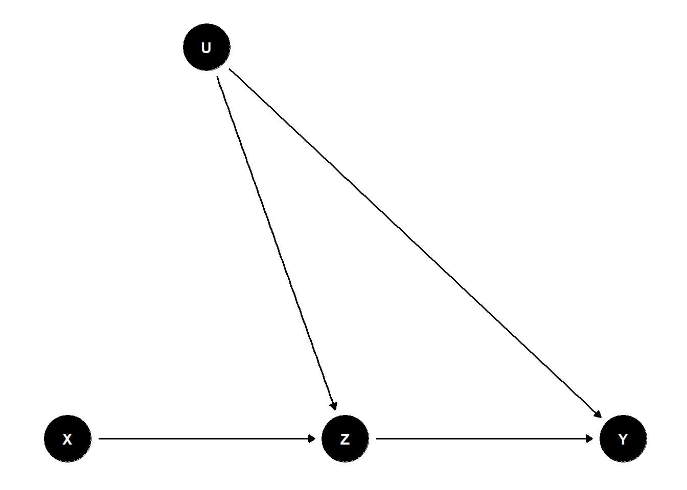

# Directed Acyclic Graphs {#sec-directed-acyclic-graphs}

Directed Acyclic Graphs (DAGs) provide a formal and visual framework for representing assumptions about causal structures. In modern data analysis, they are essential tools for understanding, identifying, and validating causal effects.

A DAG is a graph composed of nodes (representing variables) and directed edges (arrows) showing the direction of causality. "Acyclic" means that the graph contains no feedback loops; you cannot return to the same node by following the direction of the arrows.

Understanding DAGs helps analysts reason about:

-   Which variables to control for in a regression model
-   How to avoid collider bias and confounding
-   What types of data are needed to estimate causal effects
-   Where causal identification fails due to unobserved variables

These R packages facilitate DAG creation, visualization, and causal analysis:

-   `dagitty`: Powerful syntax for defining DAGs, checking d-separation, and performing adjustment set analysis.
-   `ggdag`: A `ggplot2`-based visualization tool for DAGs, compatible with `dagitty`, providing publication-ready DAGs.
-   `dagR`: Focuses on applied epidemiological use of DAGs, particularly for teaching.
-   `r-causal`: Developed by the [Center for Causal Discovery](https://www.ccd.pitt.edu/data-science/). Offers methods for causal discovery from data (also in Python).

Web Tools

-   **Publication-ready DAG editor**: [shinyDAG](https://www.gerkelab.com/project/shinydag/) -- An R-based Shiny app for creating beautiful DAGs interactively.
-   **Standalone DAG tool**: [DAG program](https://hsz.dife.de/dag/) by Sven Knüppel -- Excellent for beginners needing an intuitive graphical interface.

## Basic Notation and Graph Structures

Directed Acyclic Graphs are composed of basic building blocks that define relationships between variables.

1.  **Mediators (Chains)**

$$
X \to Z \to Y
$$

-   Variable $Z$ mediates the effect of $X$ on $Y$.
-   Controlling for $Z$ blocks the *indirect* effect of $X$ on $Y$.
-   Use case in marketing: Email promotion ($X$) → customer interest ($Z$) → purchase ($Y$). Controlling for interest removes the indirect path, isolating the direct impact.

2.  **Common Causes (Forks)**

$$
X \leftarrow Z \to Y
$$

-   $Z$ is a confounder, creating a spurious association between $X$ and $Y$.
-   To estimate the causal effect of $X$ on $Y$, $Z$ must be controlled.
-   Use case in finance: An economic indicator ($Z$) affects both stock investment decisions ($X$) and market returns ($Y$).

> **Key concept**: If $Z$ is not controlled, $X$ and $Y$ may appear correlated due to a shared cause rather than a causal link.

3.  **Common Effects (Colliders)**

$$
X \to Z \leftarrow Y
$$

-   $Z$ is a collider, and controlling for it induces a spurious association between $X$ and $Y$.
-   Do **not** control for $Z$ or its descendants.
-   Use case in HR analytics: Two independent hiring factors ($X$ = education, $Y$ = experience) both influence a decision variable $Z$ (hiring outcome). Conditioning on being hired can create an artificial correlation between education and experience.

**Other Concepts**

-   **Descendants**: Any variable downstream from a node; controlling for a descendant can have similar effects to controlling for the ancestor.
-   **d-Separation**: A graphical criterion to determine conditional independence. If all paths between $X$ and $Y$ are blocked by controlling for a set of variables $Z$, then $X$ is d-separated from $Y$ given $Z$.

## Rule of Thumb for Causal Inference

To validly estimate the causal effect $X \to Y$:

-   **Close all backdoor paths** between $X$ and $Y$ (paths that start with an arrow into $X$). This removes confounding.
-   **Do not block** any part of the direct or indirect *causal* path from $X$ to $Y$ (especially via mediators).

> This is known as the **backdoor criterion**---a formal condition from Pearl's Causal Inference framework.

## Example DAG


``` r
library(dagitty)
library(ggdag)

dag <- dagitty("dag {
  X -> Z -> Y
  Z <- U -> Y
}")

coordinates(dag) <- list(
  x = c(X = 1, Z = 2, Y = 3, U = 1.5),
  y = c(X = 1, Z = 1, Y = 1, U = 2)
)

ggdag(dag) +
  theme_dag()
```



This DAG has:

-   A mediator path: $X \to Z \to Y$
-   A backdoor path through an unobserved confounder: $X \leftarrow U \to Y$

Use `adjustmentSets(dag, exposure = "X", outcome = "Y")` to identify a valid adjustment set.

## Causal Discovery

Causal discovery involves algorithmically identifying causal relationships from data under a set of assumptions (like faithfulness and causal sufficiency). Key algorithms include:

-   **PC algorithm**: Constraint-based, uses conditional independence testing
-   **GES (Greedy Equivalence Search)**: Score-based method
-   **FCI (Fast Causal Inference)**: Extends PC to handle latent confounders

> See [@eberhardt2024discovering] for a comprehensive discussion on the assumptions and limitations of discovery algorithms in practice.

## 
