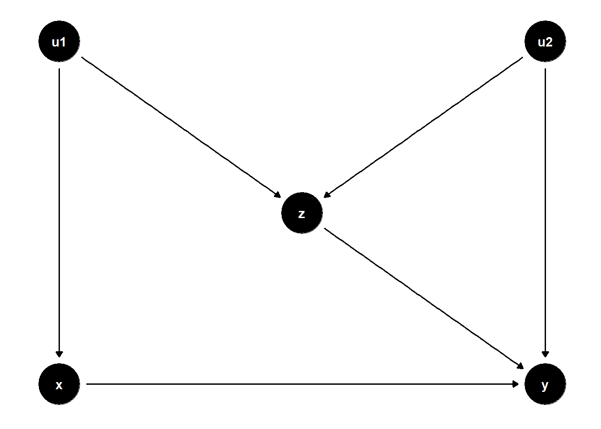
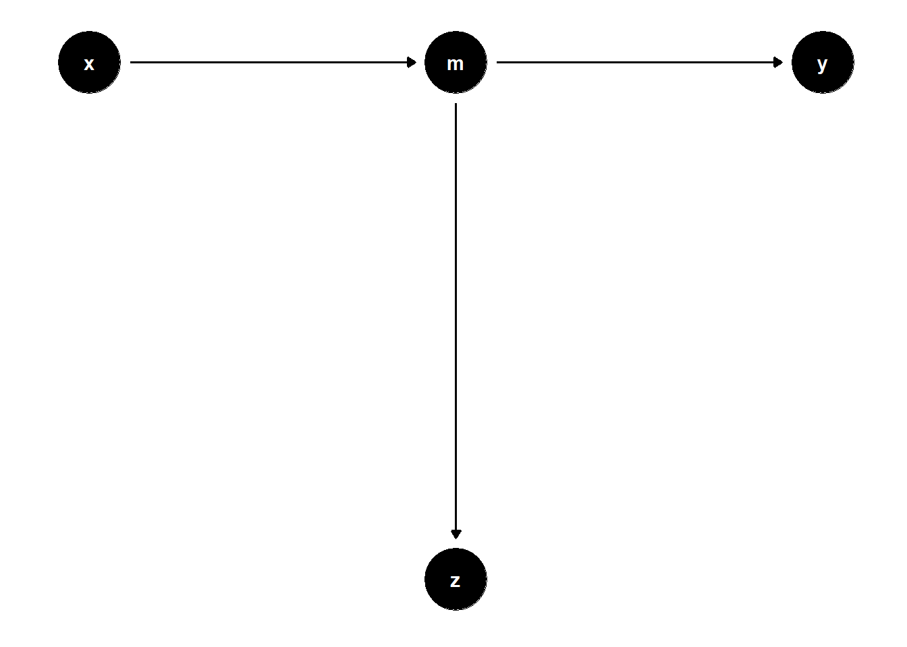
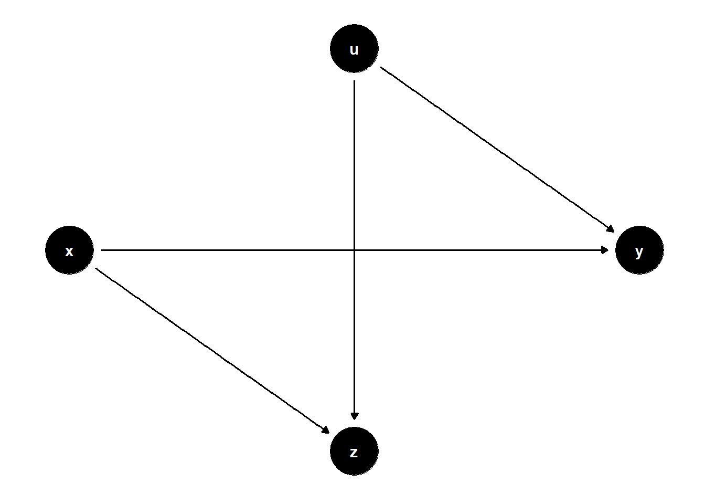
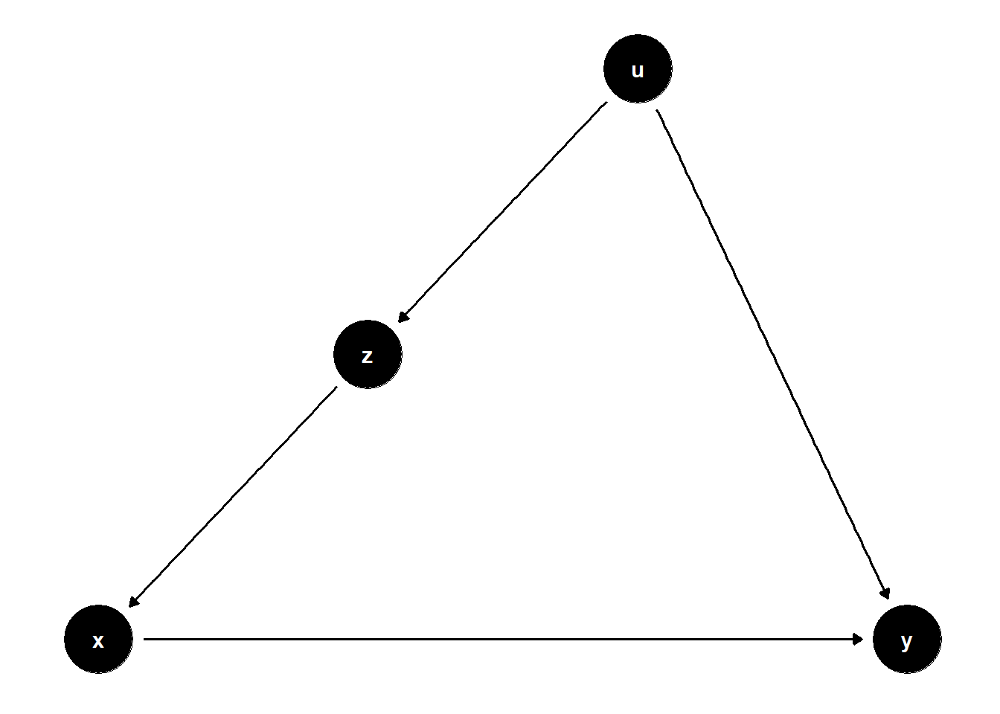
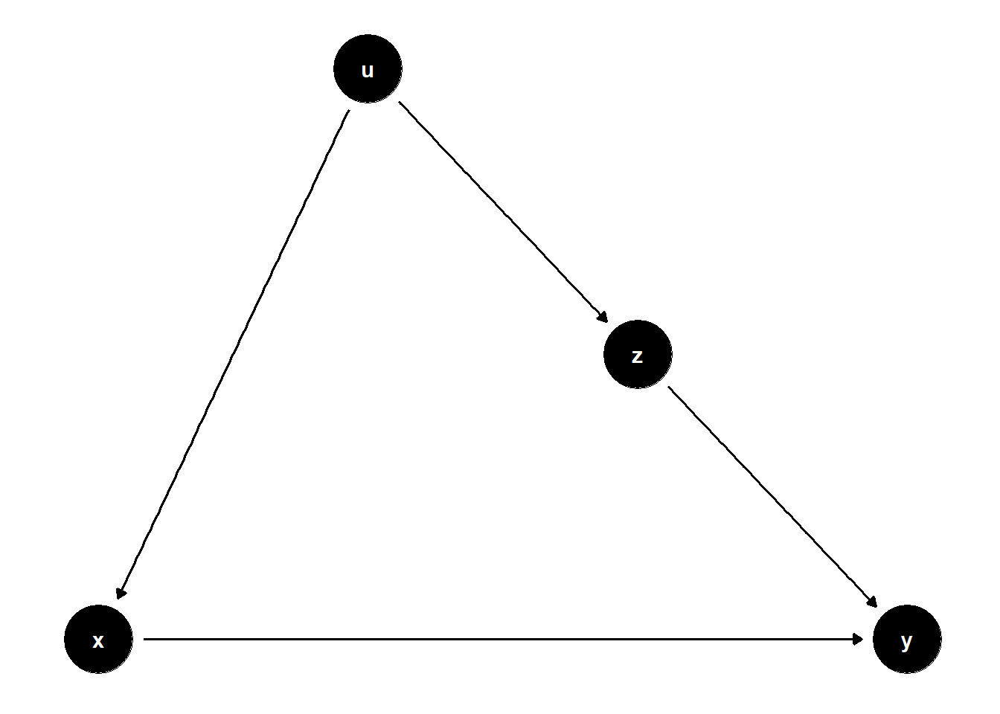
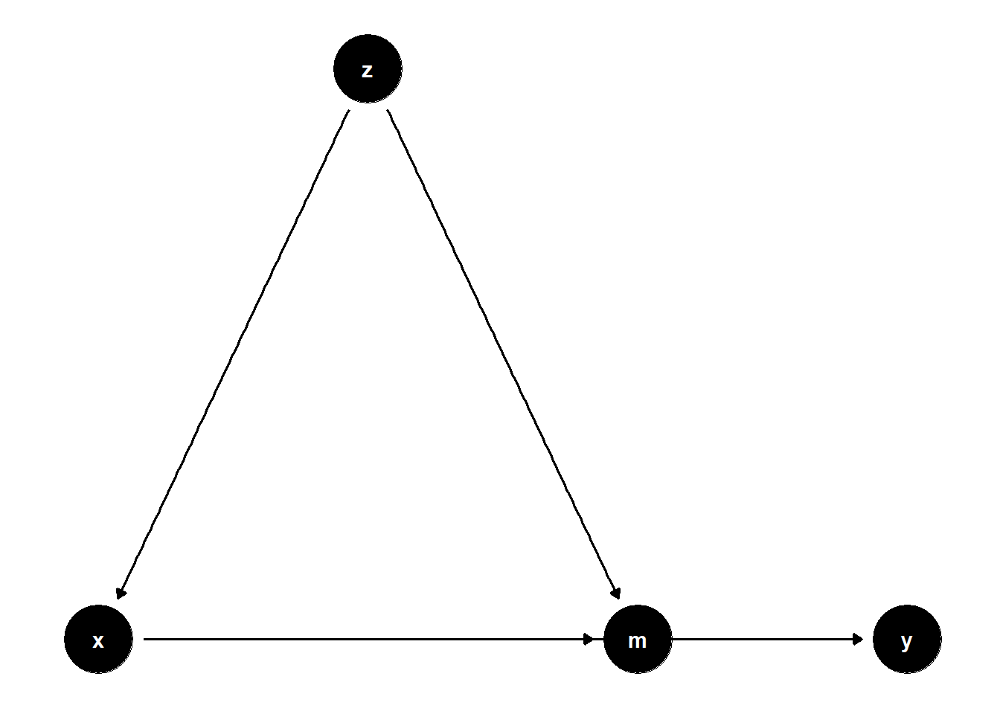
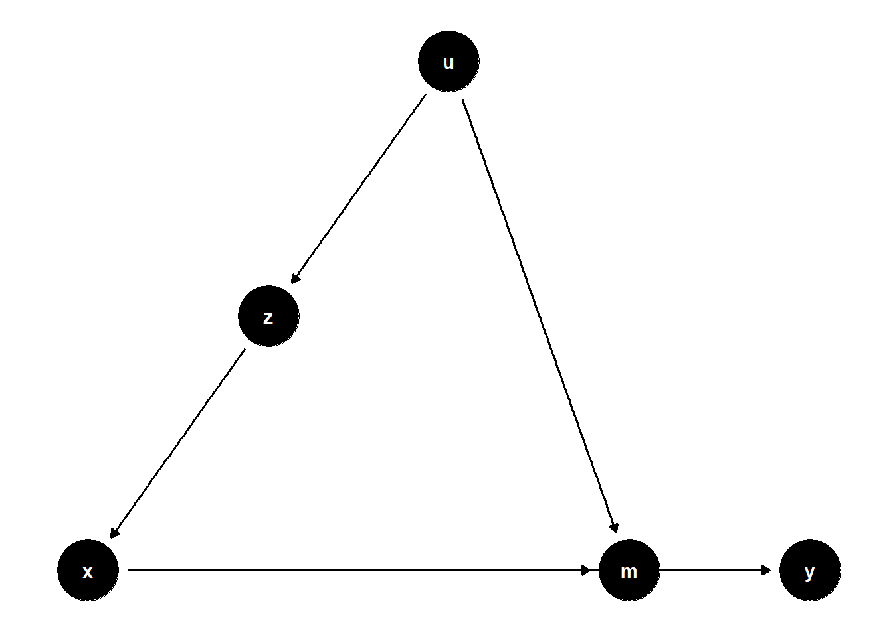
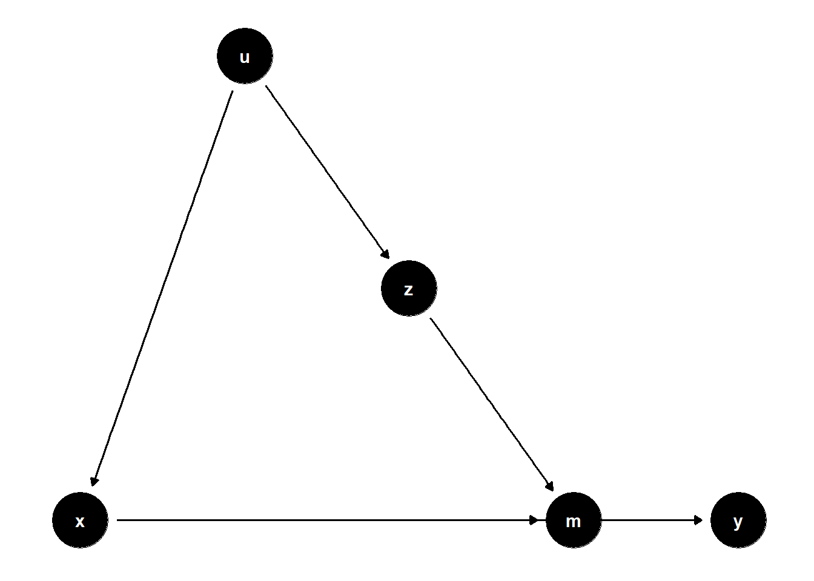
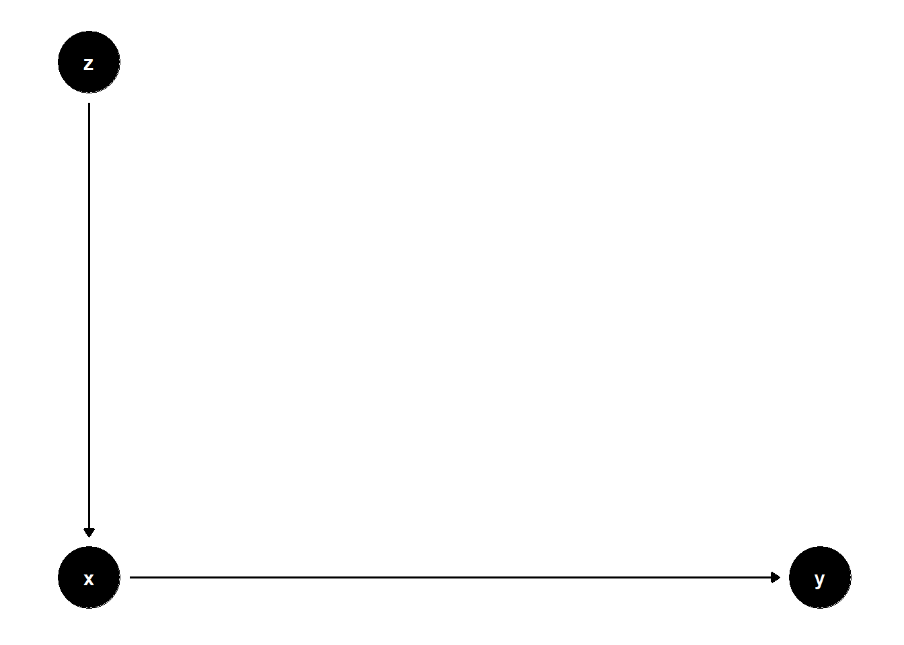
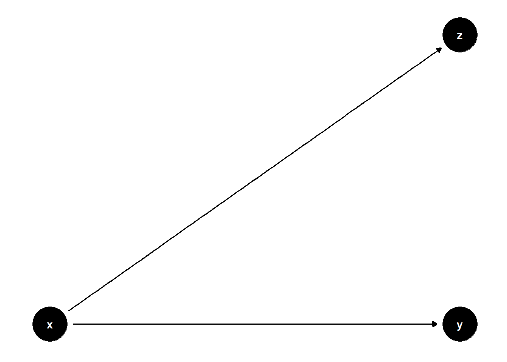

# Controls {#sec-controls}

<!--# This section follows the work of [@cinelli2022crash] and an associated Kaggle notebook. -->


``` r
library(dagitty)
library(ggdag)
```

Traditionally, adding more control variables in regression models is often considered harmless or even beneficial. The idea is simple: controlling for potential confounders (variables that influence both the treatment and the outcome) should help isolate the causal effect of the variable of interest. However, this intuition can be misleading, especially when it comes to overcontrolling---an issue often overlooked in both academic research and the review process.

In many fields, the peer review process frequently encourages the addition of more control variables. Reviewers often ask authors to add variables to "control" for potential confounding. While this seems reasonable on the surface, it's important to note that the practice of adding controls without a solid theoretical justification can lead to erroneous conclusions.

-   **Question**: Why are reviewers often quick to suggest adding more controls?

    -   **Answer**: It is often assumed that more control variables lead to more accurate models, but this assumption does not hold in many situations. The true causal relationship between the treatment (e.g., marketing campaign) and outcome (e.g., sales) may become obscured if irrelevant or inappropriate variables are controlled for.

-   **Counterpoint**: Rarely will a reviewer suggest removing variables that could distort the analysis, even though doing so may be more appropriate in some cases. This is a subtle issue that is often connected to the concept of [Coefficient Stability](#sec-coefficient-stability-bounds).

Overcontrolling occurs when we include control variables that do not truly affect the causal relationship between the exposure (e.g., treatment) and the outcome. This practice can introduce **bias** into the estimated causal effect. There are two main issues with overcontrolling:

1.  **Overcontrol Bias**: When a control variable is a **collider** (as described in [Directed Acyclic Graphs](#sec-directed-acyclic-graphs)), conditioning on it can induce a spurious correlation between the exposure and the outcome.
2.  **Loss of Variability**: Including too many control variables can lead to multicollinearity, which reduces the variability available to estimate the relationship between the treatment and outcome.

------------------------------------------------------------------------

## Bad Controls

### M-bias

A common intuition in causal inference is to control for any variable that precedes the treatment. This logic underpins much of the guidance in traditional econometric texts [@imbens2015causal; @angrist2009mostly], where pre-treatment variables like $Z$ are often recommended as controls if they correlate with both the treatment $X$ and the outcome $Y$.

This perspective is especially prevalent in [Matching Methods], where all observed pre-treatment covariates are typically included in the matching process. However, controlling for *every* pre-treatment variable can lead to *bad control bias*.

One such example is **M-bias**, which arises when conditioning on a *collider* --- a variable that is influenced by two unobserved causes. The DAG below illustrates a case where $Z$ appears to be a good control but actually opens a biasing path:


``` r
# Clean workspace
rm(list = ls())

# DAG specification
model <- dagitty("dag{
  x -> y
  u1 -> x
  u1 -> z
  u2 -> z
  u2 -> y
}")

# Set latent variables
latents(model) <- c("u1", "u2")

# Coordinates for plotting
coordinates(model) <- list(
  x = c(x = 1, u1 = 1, z = 2, u2 = 3, y = 3),
  y = c(x = 1, u1 = 2, z = 1.5, u2 = 2, y = 1)
)

# Plot the DAG
ggdag(model) + theme_dag()
```


In this structure, $Z$ is a **collider** on the path $X \leftarrow U_1 \rightarrow Z \leftarrow U_2 \rightarrow Y$. Controlling for $Z$ opens this path, introducing a spurious association between $X$ and $Y$ even if none existed originally.

Even though $Z$ is statistically correlated with both $X$ and $Y$, it is **not a confounder**, because it does not lie on a *back-door path* that needs to be blocked. Instead, adjusting for $Z$ biases the estimate of the causal effect of $X \to Y$.

Let's illustrate this with a simulation:


``` r
set.seed(123)

n <- 1e4
u1 <- rnorm(n)
u2 <- rnorm(n)
z <- u1 + u2 + rnorm(n)
x <- u1 + rnorm(n)
causal_coef <- 2
y <- causal_coef * x - 4 * u2 + rnorm(n)

# Compare unadjusted and adjusted models
jtools::export_summs(
  lm(y ~ x),
  lm(y ~ x + z),
  model.names = c("Unadjusted", "Adjusted")
)
```


```{=html}
<table class="huxtable" data-quarto-disable-processing="true" style="border-collapse: collapse; border: 0px; margin-bottom: 2em; margin-top: 2em; ; margin-left: auto; margin-right: auto;  ">
<col><col><col><tr>
<th style="vertical-align: top; text-align: center; white-space: normal; border-style: solid solid solid solid; border-width: 0.8pt 0pt 0pt 0pt;    padding: 6pt 6pt 6pt 6pt; font-weight: normal;"></th><th style="vertical-align: top; text-align: center; white-space: normal; border-style: solid solid solid solid; border-width: 0.8pt 0pt 0.4pt 0pt;    padding: 6pt 6pt 6pt 6pt; font-weight: normal;">Unadjusted</th><th style="vertical-align: top; text-align: center; white-space: normal; border-style: solid solid solid solid; border-width: 0.8pt 0pt 0.4pt 0pt;    padding: 6pt 6pt 6pt 6pt; font-weight: normal;">Adjusted</th></tr>
<tr>
<th style="vertical-align: top; text-align: left; white-space: normal; border-style: solid solid solid solid; border-width: 0pt 0pt 0pt 0pt;    padding: 6pt 6pt 6pt 6pt; font-weight: normal;">(Intercept)</th><td style="vertical-align: top; text-align: right; white-space: normal; border-style: solid solid solid solid; border-width: 0.4pt 0pt 0pt 0pt;    padding: 6pt 6pt 6pt 6pt; font-weight: normal;">0.05&nbsp;&nbsp;&nbsp;&nbsp;</td><td style="vertical-align: top; text-align: right; white-space: normal; border-style: solid solid solid solid; border-width: 0.4pt 0pt 0pt 0pt;    padding: 6pt 6pt 6pt 6pt; font-weight: normal;">0.03&nbsp;&nbsp;&nbsp;&nbsp;</td></tr>
<tr>
<th style="vertical-align: top; text-align: left; white-space: normal; border-style: solid solid solid solid; border-width: 0pt 0pt 0pt 0pt;    padding: 6pt 6pt 6pt 6pt; font-weight: normal;"></th><td style="vertical-align: top; text-align: right; white-space: normal; border-style: solid solid solid solid; border-width: 0pt 0pt 0pt 0pt;    padding: 6pt 6pt 6pt 6pt; font-weight: normal;">(0.04)&nbsp;&nbsp;&nbsp;</td><td style="vertical-align: top; text-align: right; white-space: normal; border-style: solid solid solid solid; border-width: 0pt 0pt 0pt 0pt;    padding: 6pt 6pt 6pt 6pt; font-weight: normal;">(0.03)&nbsp;&nbsp;&nbsp;</td></tr>
<tr>
<th style="vertical-align: top; text-align: left; white-space: normal; border-style: solid solid solid solid; border-width: 0pt 0pt 0pt 0pt;    padding: 6pt 6pt 6pt 6pt; font-weight: normal;">x</th><td style="vertical-align: top; text-align: right; white-space: normal; border-style: solid solid solid solid; border-width: 0pt 0pt 0pt 0pt;    padding: 6pt 6pt 6pt 6pt; font-weight: normal;">2.01 ***</td><td style="vertical-align: top; text-align: right; white-space: normal; border-style: solid solid solid solid; border-width: 0pt 0pt 0pt 0pt;    padding: 6pt 6pt 6pt 6pt; font-weight: normal;">2.80 ***</td></tr>
<tr>
<th style="vertical-align: top; text-align: left; white-space: normal; border-style: solid solid solid solid; border-width: 0pt 0pt 0pt 0pt;    padding: 6pt 6pt 6pt 6pt; font-weight: normal;"></th><td style="vertical-align: top; text-align: right; white-space: normal; border-style: solid solid solid solid; border-width: 0pt 0pt 0pt 0pt;    padding: 6pt 6pt 6pt 6pt; font-weight: normal;">(0.03)&nbsp;&nbsp;&nbsp;</td><td style="vertical-align: top; text-align: right; white-space: normal; border-style: solid solid solid solid; border-width: 0pt 0pt 0pt 0pt;    padding: 6pt 6pt 6pt 6pt; font-weight: normal;">(0.03)&nbsp;&nbsp;&nbsp;</td></tr>
<tr>
<th style="vertical-align: top; text-align: left; white-space: normal; border-style: solid solid solid solid; border-width: 0pt 0pt 0pt 0pt;    padding: 6pt 6pt 6pt 6pt; font-weight: normal;">z</th><td style="vertical-align: top; text-align: right; white-space: normal; border-style: solid solid solid solid; border-width: 0pt 0pt 0pt 0pt;    padding: 6pt 6pt 6pt 6pt; font-weight: normal;">&nbsp;&nbsp;&nbsp;&nbsp;&nbsp;&nbsp;&nbsp;</td><td style="vertical-align: top; text-align: right; white-space: normal; border-style: solid solid solid solid; border-width: 0pt 0pt 0pt 0pt;    padding: 6pt 6pt 6pt 6pt; font-weight: normal;">-1.57 ***</td></tr>
<tr>
<th style="vertical-align: top; text-align: left; white-space: normal; border-style: solid solid solid solid; border-width: 0pt 0pt 0pt 0pt;    padding: 6pt 6pt 6pt 6pt; font-weight: normal;"></th><td style="vertical-align: top; text-align: right; white-space: normal; border-style: solid solid solid solid; border-width: 0pt 0pt 0.4pt 0pt;    padding: 6pt 6pt 6pt 6pt; font-weight: normal;">&nbsp;&nbsp;&nbsp;&nbsp;&nbsp;&nbsp;&nbsp;</td><td style="vertical-align: top; text-align: right; white-space: normal; border-style: solid solid solid solid; border-width: 0pt 0pt 0.4pt 0pt;    padding: 6pt 6pt 6pt 6pt; font-weight: normal;">(0.02)&nbsp;&nbsp;&nbsp;</td></tr>
<tr>
<th style="vertical-align: top; text-align: left; white-space: normal; border-style: solid solid solid solid; border-width: 0pt 0pt 0pt 0pt;    padding: 6pt 6pt 6pt 6pt; font-weight: normal;">N</th><td style="vertical-align: top; text-align: right; white-space: normal; border-style: solid solid solid solid; border-width: 0.4pt 0pt 0pt 0pt;    padding: 6pt 6pt 6pt 6pt; font-weight: normal;">10000&nbsp;&nbsp;&nbsp;&nbsp;&nbsp;&nbsp;&nbsp;</td><td style="vertical-align: top; text-align: right; white-space: normal; border-style: solid solid solid solid; border-width: 0.4pt 0pt 0pt 0pt;    padding: 6pt 6pt 6pt 6pt; font-weight: normal;">10000&nbsp;&nbsp;&nbsp;&nbsp;&nbsp;&nbsp;&nbsp;</td></tr>
<tr>
<th style="vertical-align: top; text-align: left; white-space: normal; border-style: solid solid solid solid; border-width: 0pt 0pt 0.8pt 0pt;    padding: 6pt 6pt 6pt 6pt; font-weight: normal;">R2</th><td style="vertical-align: top; text-align: right; white-space: normal; border-style: solid solid solid solid; border-width: 0pt 0pt 0.8pt 0pt;    padding: 6pt 6pt 6pt 6pt; font-weight: normal;">0.32&nbsp;&nbsp;&nbsp;&nbsp;</td><td style="vertical-align: top; text-align: right; white-space: normal; border-style: solid solid solid solid; border-width: 0pt 0pt 0.8pt 0pt;    padding: 6pt 6pt 6pt 6pt; font-weight: normal;">0.57&nbsp;&nbsp;&nbsp;&nbsp;</td></tr>
<tr>
<th colspan="3" style="vertical-align: top; text-align: left; white-space: normal; border-style: solid solid solid solid; border-width: 0.8pt 0pt 0pt 0pt;    padding: 6pt 6pt 6pt 6pt; font-weight: normal;"> *** p &lt; 0.001;  ** p &lt; 0.01;  * p &lt; 0.05.</th></tr>
</table>

```


Notice how adjusting for $Z$ changes the estimate of the effect of $X$ on $Y$, even though $Z$ is not a true confounder. This is a textbook example of M-bias in practice.

#### Worse: M-bias with Direct Effect from Z to Y

A more difficult case arises when $Z$ also has a direct effect on $Y$. Consider the DAG below:


``` r
# Clean workspace
rm(list = ls())

# DAG specification
model <- dagitty("dag{
  x -> y
  u1 -> x
  u1 -> z
  u2 -> z
  u2 -> y
  z -> y
}")

# Set latent variables
latents(model) <- c("u1", "u2")

# Coordinates for plotting
coordinates(model) <- list(
  x = c(x = 1, u1 = 1, z = 2, u2 = 3, y = 3),
  y = c(x = 1, u1 = 2, z = 1.5, u2 = 2, y = 1)
)

# Plot the DAG
ggdag(model) + theme_dag()
```



This situation presents a dilemma:

-   **Not controlling for** $Z$ leaves the back-door path $X \leftarrow U_1 \to Z \to Y$ open, introducing confounding bias.

-   **Controlling for** $Z$ opens the collider path $X \leftarrow U_1 \to Z \leftarrow U_2 \to Y$, which also biases the estimate.

In short, **no adjustment strategy** can fully remove bias from the estimate of $X \to Y$ using observed data alone.

**What Can Be Done?**

When facing such situations, we often turn to **sensitivity analysis** to assess how robust our causal conclusions are to unmeasured confounding. Specifically, recent advances [@cinelli2019sensitivity; @cinelli2020making] allow us to quantify:

1.  **Plausible bounds** on the strength of the direct effect $Z \to Y$

2.  **Sensitivity parameters** reflecting the possible influence of the latent variables $U_1$ and $U_2$

These tools help us understand how large the unmeasured biases would have to be in order to overturn our conclusions --- a pragmatic approach when perfect control is impossible.

### Bias Amplification

Bias amplification occurs when controlling for a variable that is not a confounder --- in fact, controlling for it increases bias due to an unobserved confounder.

In the DAG below, $U$ is an unobserved common cause of both $X$ and $Y$. $Z$ influences $X$ but has no causal relationship with $Y$. Including $Z$ in the model does not block any back-door path but instead increases the bias from $U$ by amplifying its association with $X$.


``` r
# Clean workspace
rm(list = ls())

# DAG specification
model <- dagitty("dag{
  x -> y
  u -> x
  u -> y
  z -> x
}")

# Set latent variable
latents(model) <- c("u")

# Coordinates for plotting
coordinates(model) <- list(
  x = c(z = 1, x = 2, u = 3, y = 4),
  y = c(z = 1, x = 1, u = 2, y = 1)
)

# Plot the DAG
ggdag(model) + theme_dag()
```


Even though $Z$ is a strong predictor of $X$, it is **not a confounder**, because it is not a common cause of $X$ and $Y$. Controlling for $Z$ increases the portion of $X$'s variation explained by $U$, thus amplifying bias in estimating the effect of $X$ on $Y$.

Simulation:


``` r
set.seed(123)
n <- 1e4
z <- rnorm(n)
u <- rnorm(n)
x <- 2*z + u + rnorm(n)
y <- x + 2*u + rnorm(n)

jtools::export_summs(
  lm(y ~ x),
  lm(y ~ x + z),
  model.names = c("Unadjusted", "Adjusted")
)
```


```{=html}
<table class="huxtable" data-quarto-disable-processing="true" style="border-collapse: collapse; border: 0px; margin-bottom: 2em; margin-top: 2em; ; margin-left: auto; margin-right: auto;  ">
<col><col><col><tr>
<th style="vertical-align: top; text-align: center; white-space: normal; border-style: solid solid solid solid; border-width: 0.8pt 0pt 0pt 0pt;    padding: 6pt 6pt 6pt 6pt; font-weight: normal;"></th><th style="vertical-align: top; text-align: center; white-space: normal; border-style: solid solid solid solid; border-width: 0.8pt 0pt 0.4pt 0pt;    padding: 6pt 6pt 6pt 6pt; font-weight: normal;">Unadjusted</th><th style="vertical-align: top; text-align: center; white-space: normal; border-style: solid solid solid solid; border-width: 0.8pt 0pt 0.4pt 0pt;    padding: 6pt 6pt 6pt 6pt; font-weight: normal;">Adjusted</th></tr>
<tr>
<th style="vertical-align: top; text-align: left; white-space: normal; border-style: solid solid solid solid; border-width: 0pt 0pt 0pt 0pt;    padding: 6pt 6pt 6pt 6pt; font-weight: normal;">(Intercept)</th><td style="vertical-align: top; text-align: right; white-space: normal; border-style: solid solid solid solid; border-width: 0.4pt 0pt 0pt 0pt;    padding: 6pt 6pt 6pt 6pt; font-weight: normal;">-0.02&nbsp;&nbsp;&nbsp;&nbsp;</td><td style="vertical-align: top; text-align: right; white-space: normal; border-style: solid solid solid solid; border-width: 0.4pt 0pt 0pt 0pt;    padding: 6pt 6pt 6pt 6pt; font-weight: normal;">-0.01&nbsp;&nbsp;&nbsp;&nbsp;</td></tr>
<tr>
<th style="vertical-align: top; text-align: left; white-space: normal; border-style: solid solid solid solid; border-width: 0pt 0pt 0pt 0pt;    padding: 6pt 6pt 6pt 6pt; font-weight: normal;"></th><td style="vertical-align: top; text-align: right; white-space: normal; border-style: solid solid solid solid; border-width: 0pt 0pt 0pt 0pt;    padding: 6pt 6pt 6pt 6pt; font-weight: normal;">(0.02)&nbsp;&nbsp;&nbsp;</td><td style="vertical-align: top; text-align: right; white-space: normal; border-style: solid solid solid solid; border-width: 0pt 0pt 0pt 0pt;    padding: 6pt 6pt 6pt 6pt; font-weight: normal;">(0.02)&nbsp;&nbsp;&nbsp;</td></tr>
<tr>
<th style="vertical-align: top; text-align: left; white-space: normal; border-style: solid solid solid solid; border-width: 0pt 0pt 0pt 0pt;    padding: 6pt 6pt 6pt 6pt; font-weight: normal;">x</th><td style="vertical-align: top; text-align: right; white-space: normal; border-style: solid solid solid solid; border-width: 0pt 0pt 0pt 0pt;    padding: 6pt 6pt 6pt 6pt; font-weight: normal;">1.32 ***</td><td style="vertical-align: top; text-align: right; white-space: normal; border-style: solid solid solid solid; border-width: 0pt 0pt 0pt 0pt;    padding: 6pt 6pt 6pt 6pt; font-weight: normal;">1.99 ***</td></tr>
<tr>
<th style="vertical-align: top; text-align: left; white-space: normal; border-style: solid solid solid solid; border-width: 0pt 0pt 0pt 0pt;    padding: 6pt 6pt 6pt 6pt; font-weight: normal;"></th><td style="vertical-align: top; text-align: right; white-space: normal; border-style: solid solid solid solid; border-width: 0pt 0pt 0pt 0pt;    padding: 6pt 6pt 6pt 6pt; font-weight: normal;">(0.01)&nbsp;&nbsp;&nbsp;</td><td style="vertical-align: top; text-align: right; white-space: normal; border-style: solid solid solid solid; border-width: 0pt 0pt 0pt 0pt;    padding: 6pt 6pt 6pt 6pt; font-weight: normal;">(0.01)&nbsp;&nbsp;&nbsp;</td></tr>
<tr>
<th style="vertical-align: top; text-align: left; white-space: normal; border-style: solid solid solid solid; border-width: 0pt 0pt 0pt 0pt;    padding: 6pt 6pt 6pt 6pt; font-weight: normal;">z</th><td style="vertical-align: top; text-align: right; white-space: normal; border-style: solid solid solid solid; border-width: 0pt 0pt 0pt 0pt;    padding: 6pt 6pt 6pt 6pt; font-weight: normal;">&nbsp;&nbsp;&nbsp;&nbsp;&nbsp;&nbsp;&nbsp;</td><td style="vertical-align: top; text-align: right; white-space: normal; border-style: solid solid solid solid; border-width: 0pt 0pt 0pt 0pt;    padding: 6pt 6pt 6pt 6pt; font-weight: normal;">-2.01 ***</td></tr>
<tr>
<th style="vertical-align: top; text-align: left; white-space: normal; border-style: solid solid solid solid; border-width: 0pt 0pt 0pt 0pt;    padding: 6pt 6pt 6pt 6pt; font-weight: normal;"></th><td style="vertical-align: top; text-align: right; white-space: normal; border-style: solid solid solid solid; border-width: 0pt 0pt 0.4pt 0pt;    padding: 6pt 6pt 6pt 6pt; font-weight: normal;">&nbsp;&nbsp;&nbsp;&nbsp;&nbsp;&nbsp;&nbsp;</td><td style="vertical-align: top; text-align: right; white-space: normal; border-style: solid solid solid solid; border-width: 0pt 0pt 0.4pt 0pt;    padding: 6pt 6pt 6pt 6pt; font-weight: normal;">(0.03)&nbsp;&nbsp;&nbsp;</td></tr>
<tr>
<th style="vertical-align: top; text-align: left; white-space: normal; border-style: solid solid solid solid; border-width: 0pt 0pt 0pt 0pt;    padding: 6pt 6pt 6pt 6pt; font-weight: normal;">N</th><td style="vertical-align: top; text-align: right; white-space: normal; border-style: solid solid solid solid; border-width: 0.4pt 0pt 0pt 0pt;    padding: 6pt 6pt 6pt 6pt; font-weight: normal;">10000&nbsp;&nbsp;&nbsp;&nbsp;&nbsp;&nbsp;&nbsp;</td><td style="vertical-align: top; text-align: right; white-space: normal; border-style: solid solid solid solid; border-width: 0.4pt 0pt 0pt 0pt;    padding: 6pt 6pt 6pt 6pt; font-weight: normal;">10000&nbsp;&nbsp;&nbsp;&nbsp;&nbsp;&nbsp;&nbsp;</td></tr>
<tr>
<th style="vertical-align: top; text-align: left; white-space: normal; border-style: solid solid solid solid; border-width: 0pt 0pt 0.8pt 0pt;    padding: 6pt 6pt 6pt 6pt; font-weight: normal;">R2</th><td style="vertical-align: top; text-align: right; white-space: normal; border-style: solid solid solid solid; border-width: 0pt 0pt 0.8pt 0pt;    padding: 6pt 6pt 6pt 6pt; font-weight: normal;">0.71&nbsp;&nbsp;&nbsp;&nbsp;</td><td style="vertical-align: top; text-align: right; white-space: normal; border-style: solid solid solid solid; border-width: 0pt 0pt 0.8pt 0pt;    padding: 6pt 6pt 6pt 6pt; font-weight: normal;">0.80&nbsp;&nbsp;&nbsp;&nbsp;</td></tr>
<tr>
<th colspan="3" style="vertical-align: top; text-align: left; white-space: normal; border-style: solid solid solid solid; border-width: 0.8pt 0pt 0pt 0pt;    padding: 6pt 6pt 6pt 6pt; font-weight: normal;"> *** p &lt; 0.001;  ** p &lt; 0.01;  * p &lt; 0.05.</th></tr>
</table>

```


Observe that the adjusted model is **more biased** than the unadjusted one. This illustrates how controlling for a variable like $Z$ can *amplify* omitted variable bias.

### Overcontrol Bias {#sec-overcontrol-bias}

Overcontrol bias arises when we adjust for variables that lie on the causal path from treatment to outcome, or that serve as proxies for the outcome.

#### Mediator Control

Controlling for a **mediator** --- a variable that lies on the causal path between treatment and outcome --- removes part of the effect we are trying to estimate.


``` r
# Clean workspace
rm(list = ls())

# DAG: X → Z → Y
model <- dagitty("dag{
  x -> z
  z -> y
}")

coordinates(model) <- list(
  x = c(x = 1, z = 2, y = 3),
  y = c(x = 1, z = 1, y = 1)
)

ggdag(model) + theme_dag()
```


If we want to estimate the **total effect** of $X$ on $Y$, controlling for $Z$ (a mediator) leads to [overcontrol bias](#sec-overcontrol-bias).


``` r
set.seed(123)
n <- 1e4
x <- rnorm(n)
z <- x + rnorm(n)
y <- z + rnorm(n)

jtools::export_summs(
  lm(y ~ x),
  lm(y ~ x + z),
  model.names = c("Total Effect", "Controlled for Mediator")
)
```


```{=html}
<table class="huxtable" data-quarto-disable-processing="true" style="border-collapse: collapse; border: 0px; margin-bottom: 2em; margin-top: 2em; ; margin-left: auto; margin-right: auto;  ">
<col><col><col><tr>
<th style="vertical-align: top; text-align: center; white-space: normal; border-style: solid solid solid solid; border-width: 0.8pt 0pt 0pt 0pt;    padding: 6pt 6pt 6pt 6pt; font-weight: normal;"></th><th style="vertical-align: top; text-align: center; white-space: normal; border-style: solid solid solid solid; border-width: 0.8pt 0pt 0.4pt 0pt;    padding: 6pt 6pt 6pt 6pt; font-weight: normal;">Total Effect</th><th style="vertical-align: top; text-align: center; white-space: normal; border-style: solid solid solid solid; border-width: 0.8pt 0pt 0.4pt 0pt;    padding: 6pt 6pt 6pt 6pt; font-weight: normal;">Controlled for Mediator</th></tr>
<tr>
<th style="vertical-align: top; text-align: left; white-space: normal; border-style: solid solid solid solid; border-width: 0pt 0pt 0pt 0pt;    padding: 6pt 6pt 6pt 6pt; font-weight: normal;">(Intercept)</th><td style="vertical-align: top; text-align: right; white-space: normal; border-style: solid solid solid solid; border-width: 0.4pt 0pt 0pt 0pt;    padding: 6pt 6pt 6pt 6pt; font-weight: normal;">-0.02&nbsp;&nbsp;&nbsp;&nbsp;</td><td style="vertical-align: top; text-align: right; white-space: normal; border-style: solid solid solid solid; border-width: 0.4pt 0pt 0pt 0pt;    padding: 6pt 6pt 6pt 6pt; font-weight: normal;">-0.01&nbsp;&nbsp;&nbsp;&nbsp;</td></tr>
<tr>
<th style="vertical-align: top; text-align: left; white-space: normal; border-style: solid solid solid solid; border-width: 0pt 0pt 0pt 0pt;    padding: 6pt 6pt 6pt 6pt; font-weight: normal;"></th><td style="vertical-align: top; text-align: right; white-space: normal; border-style: solid solid solid solid; border-width: 0pt 0pt 0pt 0pt;    padding: 6pt 6pt 6pt 6pt; font-weight: normal;">(0.01)&nbsp;&nbsp;&nbsp;</td><td style="vertical-align: top; text-align: right; white-space: normal; border-style: solid solid solid solid; border-width: 0pt 0pt 0pt 0pt;    padding: 6pt 6pt 6pt 6pt; font-weight: normal;">(0.01)&nbsp;&nbsp;&nbsp;</td></tr>
<tr>
<th style="vertical-align: top; text-align: left; white-space: normal; border-style: solid solid solid solid; border-width: 0pt 0pt 0pt 0pt;    padding: 6pt 6pt 6pt 6pt; font-weight: normal;">x</th><td style="vertical-align: top; text-align: right; white-space: normal; border-style: solid solid solid solid; border-width: 0pt 0pt 0pt 0pt;    padding: 6pt 6pt 6pt 6pt; font-weight: normal;">1.03 ***</td><td style="vertical-align: top; text-align: right; white-space: normal; border-style: solid solid solid solid; border-width: 0pt 0pt 0pt 0pt;    padding: 6pt 6pt 6pt 6pt; font-weight: normal;">0.02&nbsp;&nbsp;&nbsp;&nbsp;</td></tr>
<tr>
<th style="vertical-align: top; text-align: left; white-space: normal; border-style: solid solid solid solid; border-width: 0pt 0pt 0pt 0pt;    padding: 6pt 6pt 6pt 6pt; font-weight: normal;"></th><td style="vertical-align: top; text-align: right; white-space: normal; border-style: solid solid solid solid; border-width: 0pt 0pt 0pt 0pt;    padding: 6pt 6pt 6pt 6pt; font-weight: normal;">(0.01)&nbsp;&nbsp;&nbsp;</td><td style="vertical-align: top; text-align: right; white-space: normal; border-style: solid solid solid solid; border-width: 0pt 0pt 0pt 0pt;    padding: 6pt 6pt 6pt 6pt; font-weight: normal;">(0.01)&nbsp;&nbsp;&nbsp;</td></tr>
<tr>
<th style="vertical-align: top; text-align: left; white-space: normal; border-style: solid solid solid solid; border-width: 0pt 0pt 0pt 0pt;    padding: 6pt 6pt 6pt 6pt; font-weight: normal;">z</th><td style="vertical-align: top; text-align: right; white-space: normal; border-style: solid solid solid solid; border-width: 0pt 0pt 0pt 0pt;    padding: 6pt 6pt 6pt 6pt; font-weight: normal;">&nbsp;&nbsp;&nbsp;&nbsp;&nbsp;&nbsp;&nbsp;</td><td style="vertical-align: top; text-align: right; white-space: normal; border-style: solid solid solid solid; border-width: 0pt 0pt 0pt 0pt;    padding: 6pt 6pt 6pt 6pt; font-weight: normal;">1.00 ***</td></tr>
<tr>
<th style="vertical-align: top; text-align: left; white-space: normal; border-style: solid solid solid solid; border-width: 0pt 0pt 0pt 0pt;    padding: 6pt 6pt 6pt 6pt; font-weight: normal;"></th><td style="vertical-align: top; text-align: right; white-space: normal; border-style: solid solid solid solid; border-width: 0pt 0pt 0.4pt 0pt;    padding: 6pt 6pt 6pt 6pt; font-weight: normal;">&nbsp;&nbsp;&nbsp;&nbsp;&nbsp;&nbsp;&nbsp;</td><td style="vertical-align: top; text-align: right; white-space: normal; border-style: solid solid solid solid; border-width: 0pt 0pt 0.4pt 0pt;    padding: 6pt 6pt 6pt 6pt; font-weight: normal;">(0.01)&nbsp;&nbsp;&nbsp;</td></tr>
<tr>
<th style="vertical-align: top; text-align: left; white-space: normal; border-style: solid solid solid solid; border-width: 0pt 0pt 0pt 0pt;    padding: 6pt 6pt 6pt 6pt; font-weight: normal;">N</th><td style="vertical-align: top; text-align: right; white-space: normal; border-style: solid solid solid solid; border-width: 0.4pt 0pt 0pt 0pt;    padding: 6pt 6pt 6pt 6pt; font-weight: normal;">10000&nbsp;&nbsp;&nbsp;&nbsp;&nbsp;&nbsp;&nbsp;</td><td style="vertical-align: top; text-align: right; white-space: normal; border-style: solid solid solid solid; border-width: 0.4pt 0pt 0pt 0pt;    padding: 6pt 6pt 6pt 6pt; font-weight: normal;">10000&nbsp;&nbsp;&nbsp;&nbsp;&nbsp;&nbsp;&nbsp;</td></tr>
<tr>
<th style="vertical-align: top; text-align: left; white-space: normal; border-style: solid solid solid solid; border-width: 0pt 0pt 0.8pt 0pt;    padding: 6pt 6pt 6pt 6pt; font-weight: normal;">R2</th><td style="vertical-align: top; text-align: right; white-space: normal; border-style: solid solid solid solid; border-width: 0pt 0pt 0.8pt 0pt;    padding: 6pt 6pt 6pt 6pt; font-weight: normal;">0.34&nbsp;&nbsp;&nbsp;&nbsp;</td><td style="vertical-align: top; text-align: right; white-space: normal; border-style: solid solid solid solid; border-width: 0pt 0pt 0.8pt 0pt;    padding: 6pt 6pt 6pt 6pt; font-weight: normal;">0.67&nbsp;&nbsp;&nbsp;&nbsp;</td></tr>
<tr>
<th colspan="3" style="vertical-align: top; text-align: left; white-space: normal; border-style: solid solid solid solid; border-width: 0.8pt 0pt 0pt 0pt;    padding: 6pt 6pt 6pt 6pt; font-weight: normal;"> *** p &lt; 0.001;  ** p &lt; 0.01;  * p &lt; 0.05.</th></tr>
</table>

```


Here, $Z$ will appear significant, but including it blocks the causal path from $X$ to $Y$. This is misleading when the goal is to estimate the **total effect** of $X$.

#### Proxy for Mediator

In more complex scenarios, controlling for variables that **proxy** for mediators can introduce similar distortions.


``` r
# Clean workspace
rm(list = ls())

# DAG: X → M → Z, M → Y
model <- dagitty("dag{
  x -> m
  m -> z
  m -> y
}")

coordinates(model) <- list(
  x = c(x = 1, m = 2, z = 2, y = 3),
  y = c(x = 2, m = 2, z = 1, y = 2)
)

ggdag(model) + theme_dag()
```




``` r
set.seed(123)
n <- 1e4
x <- rnorm(n)
m <- x + rnorm(n)
z <- m + rnorm(n)
y <- m + rnorm(n)


jtools::export_summs(lm(y ~ x),
                     lm(y ~ x + z),
                     model.names = c("Total Effect", "Controlled for Proxy Z"))
```


```{=html}
<table class="huxtable" data-quarto-disable-processing="true" style="border-collapse: collapse; border: 0px; margin-bottom: 2em; margin-top: 2em; ; margin-left: auto; margin-right: auto;  ">
<col><col><col><tr>
<th style="vertical-align: top; text-align: center; white-space: normal; border-style: solid solid solid solid; border-width: 0.8pt 0pt 0pt 0pt;    padding: 6pt 6pt 6pt 6pt; font-weight: normal;"></th><th style="vertical-align: top; text-align: center; white-space: normal; border-style: solid solid solid solid; border-width: 0.8pt 0pt 0.4pt 0pt;    padding: 6pt 6pt 6pt 6pt; font-weight: normal;">Total Effect</th><th style="vertical-align: top; text-align: center; white-space: normal; border-style: solid solid solid solid; border-width: 0.8pt 0pt 0.4pt 0pt;    padding: 6pt 6pt 6pt 6pt; font-weight: normal;">Controlled for Proxy Z</th></tr>
<tr>
<th style="vertical-align: top; text-align: left; white-space: normal; border-style: solid solid solid solid; border-width: 0pt 0pt 0pt 0pt;    padding: 6pt 6pt 6pt 6pt; font-weight: normal;">(Intercept)</th><td style="vertical-align: top; text-align: right; white-space: normal; border-style: solid solid solid solid; border-width: 0.4pt 0pt 0pt 0pt;    padding: 6pt 6pt 6pt 6pt; font-weight: normal;">-0.01&nbsp;&nbsp;&nbsp;&nbsp;</td><td style="vertical-align: top; text-align: right; white-space: normal; border-style: solid solid solid solid; border-width: 0.4pt 0pt 0pt 0pt;    padding: 6pt 6pt 6pt 6pt; font-weight: normal;">-0.01&nbsp;&nbsp;&nbsp;&nbsp;</td></tr>
<tr>
<th style="vertical-align: top; text-align: left; white-space: normal; border-style: solid solid solid solid; border-width: 0pt 0pt 0pt 0pt;    padding: 6pt 6pt 6pt 6pt; font-weight: normal;"></th><td style="vertical-align: top; text-align: right; white-space: normal; border-style: solid solid solid solid; border-width: 0pt 0pt 0pt 0pt;    padding: 6pt 6pt 6pt 6pt; font-weight: normal;">(0.01)&nbsp;&nbsp;&nbsp;</td><td style="vertical-align: top; text-align: right; white-space: normal; border-style: solid solid solid solid; border-width: 0pt 0pt 0pt 0pt;    padding: 6pt 6pt 6pt 6pt; font-weight: normal;">(0.01)&nbsp;&nbsp;&nbsp;</td></tr>
<tr>
<th style="vertical-align: top; text-align: left; white-space: normal; border-style: solid solid solid solid; border-width: 0pt 0pt 0pt 0pt;    padding: 6pt 6pt 6pt 6pt; font-weight: normal;">x</th><td style="vertical-align: top; text-align: right; white-space: normal; border-style: solid solid solid solid; border-width: 0pt 0pt 0pt 0pt;    padding: 6pt 6pt 6pt 6pt; font-weight: normal;">0.99 ***</td><td style="vertical-align: top; text-align: right; white-space: normal; border-style: solid solid solid solid; border-width: 0pt 0pt 0pt 0pt;    padding: 6pt 6pt 6pt 6pt; font-weight: normal;">0.49 ***</td></tr>
<tr>
<th style="vertical-align: top; text-align: left; white-space: normal; border-style: solid solid solid solid; border-width: 0pt 0pt 0pt 0pt;    padding: 6pt 6pt 6pt 6pt; font-weight: normal;"></th><td style="vertical-align: top; text-align: right; white-space: normal; border-style: solid solid solid solid; border-width: 0pt 0pt 0pt 0pt;    padding: 6pt 6pt 6pt 6pt; font-weight: normal;">(0.01)&nbsp;&nbsp;&nbsp;</td><td style="vertical-align: top; text-align: right; white-space: normal; border-style: solid solid solid solid; border-width: 0pt 0pt 0pt 0pt;    padding: 6pt 6pt 6pt 6pt; font-weight: normal;">(0.02)&nbsp;&nbsp;&nbsp;</td></tr>
<tr>
<th style="vertical-align: top; text-align: left; white-space: normal; border-style: solid solid solid solid; border-width: 0pt 0pt 0pt 0pt;    padding: 6pt 6pt 6pt 6pt; font-weight: normal;">z</th><td style="vertical-align: top; text-align: right; white-space: normal; border-style: solid solid solid solid; border-width: 0pt 0pt 0pt 0pt;    padding: 6pt 6pt 6pt 6pt; font-weight: normal;">&nbsp;&nbsp;&nbsp;&nbsp;&nbsp;&nbsp;&nbsp;</td><td style="vertical-align: top; text-align: right; white-space: normal; border-style: solid solid solid solid; border-width: 0pt 0pt 0pt 0pt;    padding: 6pt 6pt 6pt 6pt; font-weight: normal;">0.49 ***</td></tr>
<tr>
<th style="vertical-align: top; text-align: left; white-space: normal; border-style: solid solid solid solid; border-width: 0pt 0pt 0pt 0pt;    padding: 6pt 6pt 6pt 6pt; font-weight: normal;"></th><td style="vertical-align: top; text-align: right; white-space: normal; border-style: solid solid solid solid; border-width: 0pt 0pt 0.4pt 0pt;    padding: 6pt 6pt 6pt 6pt; font-weight: normal;">&nbsp;&nbsp;&nbsp;&nbsp;&nbsp;&nbsp;&nbsp;</td><td style="vertical-align: top; text-align: right; white-space: normal; border-style: solid solid solid solid; border-width: 0pt 0pt 0.4pt 0pt;    padding: 6pt 6pt 6pt 6pt; font-weight: normal;">(0.01)&nbsp;&nbsp;&nbsp;</td></tr>
<tr>
<th style="vertical-align: top; text-align: left; white-space: normal; border-style: solid solid solid solid; border-width: 0pt 0pt 0pt 0pt;    padding: 6pt 6pt 6pt 6pt; font-weight: normal;">N</th><td style="vertical-align: top; text-align: right; white-space: normal; border-style: solid solid solid solid; border-width: 0.4pt 0pt 0pt 0pt;    padding: 6pt 6pt 6pt 6pt; font-weight: normal;">10000&nbsp;&nbsp;&nbsp;&nbsp;&nbsp;&nbsp;&nbsp;</td><td style="vertical-align: top; text-align: right; white-space: normal; border-style: solid solid solid solid; border-width: 0.4pt 0pt 0pt 0pt;    padding: 6pt 6pt 6pt 6pt; font-weight: normal;">10000&nbsp;&nbsp;&nbsp;&nbsp;&nbsp;&nbsp;&nbsp;</td></tr>
<tr>
<th style="vertical-align: top; text-align: left; white-space: normal; border-style: solid solid solid solid; border-width: 0pt 0pt 0.8pt 0pt;    padding: 6pt 6pt 6pt 6pt; font-weight: normal;">R2</th><td style="vertical-align: top; text-align: right; white-space: normal; border-style: solid solid solid solid; border-width: 0pt 0pt 0.8pt 0pt;    padding: 6pt 6pt 6pt 6pt; font-weight: normal;">0.33&nbsp;&nbsp;&nbsp;&nbsp;</td><td style="vertical-align: top; text-align: right; white-space: normal; border-style: solid solid solid solid; border-width: 0pt 0pt 0.8pt 0pt;    padding: 6pt 6pt 6pt 6pt; font-weight: normal;">0.49&nbsp;&nbsp;&nbsp;&nbsp;</td></tr>
<tr>
<th colspan="3" style="vertical-align: top; text-align: left; white-space: normal; border-style: solid solid solid solid; border-width: 0.8pt 0pt 0pt 0pt;    padding: 6pt 6pt 6pt 6pt; font-weight: normal;"> *** p &lt; 0.001;  ** p &lt; 0.01;  * p &lt; 0.05.</th></tr>
</table>

```


Even though $Z$ is not on the path from $X$ to $Y$, controlling for it removes part of the causal variation coming through $M$.

#### Overcontrol with Unobserved Confounding

When $Z$ is influenced by both $X$ and a latent confounder $U$ that also affects $Y$, controlling for $Z$ again biases the estimate.


``` r
# Clean workspace
rm(list = ls())

# DAG: X → Z → Y; U → Z, U → Y
model <- dagitty("dag{
  x -> z
  z -> y
  u -> z
  u -> y
}")

latents(model) <- "u"

coordinates(model) <- list(
  x = c(x = 1, z = 2, u = 3, y = 4),
  y = c(x = 1, z = 1, u = 2, y = 1)
)

ggdag(model) + theme_dag()
```


``` r
set.seed(1)
n <- 1e4
x <- rnorm(n)
u <- rnorm(n)
z <- x + u + rnorm(n)
y <- z + u + rnorm(n)

jtools::export_summs(
  lm(y ~ x),
  lm(y ~ x + z),
  model.names = c("Unadjusted", "Controlled for Z")
)
```


```{=html}
<table class="huxtable" data-quarto-disable-processing="true" style="border-collapse: collapse; border: 0px; margin-bottom: 2em; margin-top: 2em; ; margin-left: auto; margin-right: auto;  ">
<col><col><col><tr>
<th style="vertical-align: top; text-align: center; white-space: normal; border-style: solid solid solid solid; border-width: 0.8pt 0pt 0pt 0pt;    padding: 6pt 6pt 6pt 6pt; font-weight: normal;"></th><th style="vertical-align: top; text-align: center; white-space: normal; border-style: solid solid solid solid; border-width: 0.8pt 0pt 0.4pt 0pt;    padding: 6pt 6pt 6pt 6pt; font-weight: normal;">Unadjusted</th><th style="vertical-align: top; text-align: center; white-space: normal; border-style: solid solid solid solid; border-width: 0.8pt 0pt 0.4pt 0pt;    padding: 6pt 6pt 6pt 6pt; font-weight: normal;">Controlled for Z</th></tr>
<tr>
<th style="vertical-align: top; text-align: left; white-space: normal; border-style: solid solid solid solid; border-width: 0pt 0pt 0pt 0pt;    padding: 6pt 6pt 6pt 6pt; font-weight: normal;">(Intercept)</th><td style="vertical-align: top; text-align: right; white-space: normal; border-style: solid solid solid solid; border-width: 0.4pt 0pt 0pt 0pt;    padding: 6pt 6pt 6pt 6pt; font-weight: normal;">-0.01&nbsp;&nbsp;&nbsp;&nbsp;</td><td style="vertical-align: top; text-align: right; white-space: normal; border-style: solid solid solid solid; border-width: 0.4pt 0pt 0pt 0pt;    padding: 6pt 6pt 6pt 6pt; font-weight: normal;">-0.01&nbsp;&nbsp;&nbsp;&nbsp;</td></tr>
<tr>
<th style="vertical-align: top; text-align: left; white-space: normal; border-style: solid solid solid solid; border-width: 0pt 0pt 0pt 0pt;    padding: 6pt 6pt 6pt 6pt; font-weight: normal;"></th><td style="vertical-align: top; text-align: right; white-space: normal; border-style: solid solid solid solid; border-width: 0pt 0pt 0pt 0pt;    padding: 6pt 6pt 6pt 6pt; font-weight: normal;">(0.02)&nbsp;&nbsp;&nbsp;</td><td style="vertical-align: top; text-align: right; white-space: normal; border-style: solid solid solid solid; border-width: 0pt 0pt 0pt 0pt;    padding: 6pt 6pt 6pt 6pt; font-weight: normal;">(0.01)&nbsp;&nbsp;&nbsp;</td></tr>
<tr>
<th style="vertical-align: top; text-align: left; white-space: normal; border-style: solid solid solid solid; border-width: 0pt 0pt 0pt 0pt;    padding: 6pt 6pt 6pt 6pt; font-weight: normal;">x</th><td style="vertical-align: top; text-align: right; white-space: normal; border-style: solid solid solid solid; border-width: 0pt 0pt 0pt 0pt;    padding: 6pt 6pt 6pt 6pt; font-weight: normal;">1.01 ***</td><td style="vertical-align: top; text-align: right; white-space: normal; border-style: solid solid solid solid; border-width: 0pt 0pt 0pt 0pt;    padding: 6pt 6pt 6pt 6pt; font-weight: normal;">-0.47 ***</td></tr>
<tr>
<th style="vertical-align: top; text-align: left; white-space: normal; border-style: solid solid solid solid; border-width: 0pt 0pt 0pt 0pt;    padding: 6pt 6pt 6pt 6pt; font-weight: normal;"></th><td style="vertical-align: top; text-align: right; white-space: normal; border-style: solid solid solid solid; border-width: 0pt 0pt 0pt 0pt;    padding: 6pt 6pt 6pt 6pt; font-weight: normal;">(0.02)&nbsp;&nbsp;&nbsp;</td><td style="vertical-align: top; text-align: right; white-space: normal; border-style: solid solid solid solid; border-width: 0pt 0pt 0pt 0pt;    padding: 6pt 6pt 6pt 6pt; font-weight: normal;">(0.01)&nbsp;&nbsp;&nbsp;</td></tr>
<tr>
<th style="vertical-align: top; text-align: left; white-space: normal; border-style: solid solid solid solid; border-width: 0pt 0pt 0pt 0pt;    padding: 6pt 6pt 6pt 6pt; font-weight: normal;">z</th><td style="vertical-align: top; text-align: right; white-space: normal; border-style: solid solid solid solid; border-width: 0pt 0pt 0pt 0pt;    padding: 6pt 6pt 6pt 6pt; font-weight: normal;">&nbsp;&nbsp;&nbsp;&nbsp;&nbsp;&nbsp;&nbsp;</td><td style="vertical-align: top; text-align: right; white-space: normal; border-style: solid solid solid solid; border-width: 0pt 0pt 0pt 0pt;    padding: 6pt 6pt 6pt 6pt; font-weight: normal;">1.48 ***</td></tr>
<tr>
<th style="vertical-align: top; text-align: left; white-space: normal; border-style: solid solid solid solid; border-width: 0pt 0pt 0pt 0pt;    padding: 6pt 6pt 6pt 6pt; font-weight: normal;"></th><td style="vertical-align: top; text-align: right; white-space: normal; border-style: solid solid solid solid; border-width: 0pt 0pt 0.4pt 0pt;    padding: 6pt 6pt 6pt 6pt; font-weight: normal;">&nbsp;&nbsp;&nbsp;&nbsp;&nbsp;&nbsp;&nbsp;</td><td style="vertical-align: top; text-align: right; white-space: normal; border-style: solid solid solid solid; border-width: 0pt 0pt 0.4pt 0pt;    padding: 6pt 6pt 6pt 6pt; font-weight: normal;">(0.01)&nbsp;&nbsp;&nbsp;</td></tr>
<tr>
<th style="vertical-align: top; text-align: left; white-space: normal; border-style: solid solid solid solid; border-width: 0pt 0pt 0pt 0pt;    padding: 6pt 6pt 6pt 6pt; font-weight: normal;">N</th><td style="vertical-align: top; text-align: right; white-space: normal; border-style: solid solid solid solid; border-width: 0.4pt 0pt 0pt 0pt;    padding: 6pt 6pt 6pt 6pt; font-weight: normal;">10000&nbsp;&nbsp;&nbsp;&nbsp;&nbsp;&nbsp;&nbsp;</td><td style="vertical-align: top; text-align: right; white-space: normal; border-style: solid solid solid solid; border-width: 0.4pt 0pt 0pt 0pt;    padding: 6pt 6pt 6pt 6pt; font-weight: normal;">10000&nbsp;&nbsp;&nbsp;&nbsp;&nbsp;&nbsp;&nbsp;</td></tr>
<tr>
<th style="vertical-align: top; text-align: left; white-space: normal; border-style: solid solid solid solid; border-width: 0pt 0pt 0.8pt 0pt;    padding: 6pt 6pt 6pt 6pt; font-weight: normal;">R2</th><td style="vertical-align: top; text-align: right; white-space: normal; border-style: solid solid solid solid; border-width: 0pt 0pt 0.8pt 0pt;    padding: 6pt 6pt 6pt 6pt; font-weight: normal;">0.15&nbsp;&nbsp;&nbsp;&nbsp;</td><td style="vertical-align: top; text-align: right; white-space: normal; border-style: solid solid solid solid; border-width: 0pt 0pt 0.8pt 0pt;    padding: 6pt 6pt 6pt 6pt; font-weight: normal;">0.78&nbsp;&nbsp;&nbsp;&nbsp;</td></tr>
<tr>
<th colspan="3" style="vertical-align: top; text-align: left; white-space: normal; border-style: solid solid solid solid; border-width: 0.8pt 0pt 0pt 0pt;    padding: 6pt 6pt 6pt 6pt; font-weight: normal;"> *** p &lt; 0.001;  ** p &lt; 0.01;  * p &lt; 0.05.</th></tr>
</table>

```


Although the **total effect** of $X$ on $Y$ is correctly captured in the unadjusted model, adjusting for $Z$ introduces bias via the collider path $X \to Z \leftarrow U \to Y$.

> **Insight:** Controlling for $Z$ inadvertently **blocks** the direct effect of $X$ and **opens** a biasing path through $U$. This makes the adjusted model unreliable for causal inference.

These examples highlight the importance of **conceptual clarity** and **causal reasoning** in model specification. Not all covariates should be controlled for --- especially not those that are:

-   Mediators (on the causal path)

-   Proxies for mediators or outcomes

-   Colliders or descendants of colliders

In business contexts, this often arises when analysts include *intermediate* variables like sales leads, customer engagement scores, or operational metrics without understanding whether these mediate the effect of a treatment (e.g., ad spend) or confound it.

### Selection Bias

Selection bias --- also known as **collider stratification bias** --- occurs when conditioning on a variable that is a *collider* (a common effect of two or more variables). This inadvertently opens non-causal paths, inducing spurious associations between variables that are otherwise independent or unconfounded.

#### Classic Collider Bias

In the DAG below, $Z$ is a collider between $X$ and a latent variable $U$. Controlling for $Z$ opens a back-door path from $X$ to $Y$ through $U$, introducing bias.


``` r
rm(list = ls())

# DAG
model <- dagitty("dag{
  x -> y
  x -> z
  u -> z
  u -> y
}")
latents(model) <- "u"
coordinates(model) <- list(
  x = c(x = 1, z = 2, u = 2, y = 3),
  y = c(x = 3, z = 2, u = 4, y = 3)
)
ggdag(model) + theme_dag()
```



Simulation:


``` r
set.seed(123)
n <- 1e4
x <- rnorm(n)
u <- rnorm(n)
z <- x + u + rnorm(n)
y <- x + 2*u + rnorm(n)

jtools::export_summs(
  lm(y ~ x),
  lm(y ~ x + z),
  model.names = c("Unadjusted", "Adjusted for Z (collider)")
)
```


```{=html}
<table class="huxtable" data-quarto-disable-processing="true" style="border-collapse: collapse; border: 0px; margin-bottom: 2em; margin-top: 2em; ; margin-left: auto; margin-right: auto;  ">
<col><col><col><tr>
<th style="vertical-align: top; text-align: center; white-space: normal; border-style: solid solid solid solid; border-width: 0.8pt 0pt 0pt 0pt;    padding: 6pt 6pt 6pt 6pt; font-weight: normal;"></th><th style="vertical-align: top; text-align: center; white-space: normal; border-style: solid solid solid solid; border-width: 0.8pt 0pt 0.4pt 0pt;    padding: 6pt 6pt 6pt 6pt; font-weight: normal;">Unadjusted</th><th style="vertical-align: top; text-align: center; white-space: normal; border-style: solid solid solid solid; border-width: 0.8pt 0pt 0.4pt 0pt;    padding: 6pt 6pt 6pt 6pt; font-weight: normal;">Adjusted for Z (collider)</th></tr>
<tr>
<th style="vertical-align: top; text-align: left; white-space: normal; border-style: solid solid solid solid; border-width: 0pt 0pt 0pt 0pt;    padding: 6pt 6pt 6pt 6pt; font-weight: normal;">(Intercept)</th><td style="vertical-align: top; text-align: right; white-space: normal; border-style: solid solid solid solid; border-width: 0.4pt 0pt 0pt 0pt;    padding: 6pt 6pt 6pt 6pt; font-weight: normal;">-0.02&nbsp;&nbsp;&nbsp;&nbsp;</td><td style="vertical-align: top; text-align: right; white-space: normal; border-style: solid solid solid solid; border-width: 0.4pt 0pt 0pt 0pt;    padding: 6pt 6pt 6pt 6pt; font-weight: normal;">-0.01&nbsp;&nbsp;&nbsp;&nbsp;</td></tr>
<tr>
<th style="vertical-align: top; text-align: left; white-space: normal; border-style: solid solid solid solid; border-width: 0pt 0pt 0pt 0pt;    padding: 6pt 6pt 6pt 6pt; font-weight: normal;"></th><td style="vertical-align: top; text-align: right; white-space: normal; border-style: solid solid solid solid; border-width: 0pt 0pt 0pt 0pt;    padding: 6pt 6pt 6pt 6pt; font-weight: normal;">(0.02)&nbsp;&nbsp;&nbsp;</td><td style="vertical-align: top; text-align: right; white-space: normal; border-style: solid solid solid solid; border-width: 0pt 0pt 0pt 0pt;    padding: 6pt 6pt 6pt 6pt; font-weight: normal;">(0.02)&nbsp;&nbsp;&nbsp;</td></tr>
<tr>
<th style="vertical-align: top; text-align: left; white-space: normal; border-style: solid solid solid solid; border-width: 0pt 0pt 0pt 0pt;    padding: 6pt 6pt 6pt 6pt; font-weight: normal;">x</th><td style="vertical-align: top; text-align: right; white-space: normal; border-style: solid solid solid solid; border-width: 0pt 0pt 0pt 0pt;    padding: 6pt 6pt 6pt 6pt; font-weight: normal;">0.99 ***</td><td style="vertical-align: top; text-align: right; white-space: normal; border-style: solid solid solid solid; border-width: 0pt 0pt 0pt 0pt;    padding: 6pt 6pt 6pt 6pt; font-weight: normal;">-0.02&nbsp;&nbsp;&nbsp;&nbsp;</td></tr>
<tr>
<th style="vertical-align: top; text-align: left; white-space: normal; border-style: solid solid solid solid; border-width: 0pt 0pt 0pt 0pt;    padding: 6pt 6pt 6pt 6pt; font-weight: normal;"></th><td style="vertical-align: top; text-align: right; white-space: normal; border-style: solid solid solid solid; border-width: 0pt 0pt 0pt 0pt;    padding: 6pt 6pt 6pt 6pt; font-weight: normal;">(0.02)&nbsp;&nbsp;&nbsp;</td><td style="vertical-align: top; text-align: right; white-space: normal; border-style: solid solid solid solid; border-width: 0pt 0pt 0pt 0pt;    padding: 6pt 6pt 6pt 6pt; font-weight: normal;">(0.02)&nbsp;&nbsp;&nbsp;</td></tr>
<tr>
<th style="vertical-align: top; text-align: left; white-space: normal; border-style: solid solid solid solid; border-width: 0pt 0pt 0pt 0pt;    padding: 6pt 6pt 6pt 6pt; font-weight: normal;">z</th><td style="vertical-align: top; text-align: right; white-space: normal; border-style: solid solid solid solid; border-width: 0pt 0pt 0pt 0pt;    padding: 6pt 6pt 6pt 6pt; font-weight: normal;">&nbsp;&nbsp;&nbsp;&nbsp;&nbsp;&nbsp;&nbsp;</td><td style="vertical-align: top; text-align: right; white-space: normal; border-style: solid solid solid solid; border-width: 0pt 0pt 0pt 0pt;    padding: 6pt 6pt 6pt 6pt; font-weight: normal;">0.99 ***</td></tr>
<tr>
<th style="vertical-align: top; text-align: left; white-space: normal; border-style: solid solid solid solid; border-width: 0pt 0pt 0pt 0pt;    padding: 6pt 6pt 6pt 6pt; font-weight: normal;"></th><td style="vertical-align: top; text-align: right; white-space: normal; border-style: solid solid solid solid; border-width: 0pt 0pt 0.4pt 0pt;    padding: 6pt 6pt 6pt 6pt; font-weight: normal;">&nbsp;&nbsp;&nbsp;&nbsp;&nbsp;&nbsp;&nbsp;</td><td style="vertical-align: top; text-align: right; white-space: normal; border-style: solid solid solid solid; border-width: 0pt 0pt 0.4pt 0pt;    padding: 6pt 6pt 6pt 6pt; font-weight: normal;">(0.01)&nbsp;&nbsp;&nbsp;</td></tr>
<tr>
<th style="vertical-align: top; text-align: left; white-space: normal; border-style: solid solid solid solid; border-width: 0pt 0pt 0pt 0pt;    padding: 6pt 6pt 6pt 6pt; font-weight: normal;">N</th><td style="vertical-align: top; text-align: right; white-space: normal; border-style: solid solid solid solid; border-width: 0.4pt 0pt 0pt 0pt;    padding: 6pt 6pt 6pt 6pt; font-weight: normal;">10000&nbsp;&nbsp;&nbsp;&nbsp;&nbsp;&nbsp;&nbsp;</td><td style="vertical-align: top; text-align: right; white-space: normal; border-style: solid solid solid solid; border-width: 0.4pt 0pt 0pt 0pt;    padding: 6pt 6pt 6pt 6pt; font-weight: normal;">10000&nbsp;&nbsp;&nbsp;&nbsp;&nbsp;&nbsp;&nbsp;</td></tr>
<tr>
<th style="vertical-align: top; text-align: left; white-space: normal; border-style: solid solid solid solid; border-width: 0pt 0pt 0.8pt 0pt;    padding: 6pt 6pt 6pt 6pt; font-weight: normal;">R2</th><td style="vertical-align: top; text-align: right; white-space: normal; border-style: solid solid solid solid; border-width: 0pt 0pt 0.8pt 0pt;    padding: 6pt 6pt 6pt 6pt; font-weight: normal;">0.17&nbsp;&nbsp;&nbsp;&nbsp;</td><td style="vertical-align: top; text-align: right; white-space: normal; border-style: solid solid solid solid; border-width: 0pt 0pt 0.8pt 0pt;    padding: 6pt 6pt 6pt 6pt; font-weight: normal;">0.49&nbsp;&nbsp;&nbsp;&nbsp;</td></tr>
<tr>
<th colspan="3" style="vertical-align: top; text-align: left; white-space: normal; border-style: solid solid solid solid; border-width: 0.8pt 0pt 0pt 0pt;    padding: 6pt 6pt 6pt 6pt; font-weight: normal;"> *** p &lt; 0.001;  ** p &lt; 0.01;  * p &lt; 0.05.</th></tr>
</table>

```


Controlling for $Z$ opens the non-causal path $X \to Z \leftarrow U \to Y$, resulting in **biased estimates** of the effect of $X$ on $Y$.

#### Collider Between Treatment and Outcome

In some cases, the collider is influenced directly by both the treatment and the outcome. This setting is also highly relevant in observational designs, particularly in retrospective or convenience sampling scenarios.


``` r
rm(list = ls())

# DAG: X → Z ← Y
model <- dagitty("dag{
  x -> y
  x -> z
  y -> z
}")
coordinates(model) <- list(
  x = c(x = 1, z = 2, y = 3),
  y = c(x = 2, z = 1, y = 2)
)
ggdag(model) + theme_dag()
```


Simulation:


``` r
set.seed(123)
n <- 1e4
x <- rnorm(n)
y <- x + rnorm(n)
z <- x + y + rnorm(n)

jtools::export_summs(
  lm(y ~ x),
  lm(y ~ x + z),
  model.names = c("Unadjusted", "Adjusted for Collider Z")
)
```


```{=html}
<table class="huxtable" data-quarto-disable-processing="true" style="border-collapse: collapse; border: 0px; margin-bottom: 2em; margin-top: 2em; ; margin-left: auto; margin-right: auto;  ">
<col><col><col><tr>
<th style="vertical-align: top; text-align: center; white-space: normal; border-style: solid solid solid solid; border-width: 0.8pt 0pt 0pt 0pt;    padding: 6pt 6pt 6pt 6pt; font-weight: normal;"></th><th style="vertical-align: top; text-align: center; white-space: normal; border-style: solid solid solid solid; border-width: 0.8pt 0pt 0.4pt 0pt;    padding: 6pt 6pt 6pt 6pt; font-weight: normal;">Unadjusted</th><th style="vertical-align: top; text-align: center; white-space: normal; border-style: solid solid solid solid; border-width: 0.8pt 0pt 0.4pt 0pt;    padding: 6pt 6pt 6pt 6pt; font-weight: normal;">Adjusted for Collider Z</th></tr>
<tr>
<th style="vertical-align: top; text-align: left; white-space: normal; border-style: solid solid solid solid; border-width: 0pt 0pt 0pt 0pt;    padding: 6pt 6pt 6pt 6pt; font-weight: normal;">(Intercept)</th><td style="vertical-align: top; text-align: right; white-space: normal; border-style: solid solid solid solid; border-width: 0.4pt 0pt 0pt 0pt;    padding: 6pt 6pt 6pt 6pt; font-weight: normal;">-0.01&nbsp;&nbsp;&nbsp;&nbsp;</td><td style="vertical-align: top; text-align: right; white-space: normal; border-style: solid solid solid solid; border-width: 0.4pt 0pt 0pt 0pt;    padding: 6pt 6pt 6pt 6pt; font-weight: normal;">-0.00&nbsp;&nbsp;&nbsp;&nbsp;</td></tr>
<tr>
<th style="vertical-align: top; text-align: left; white-space: normal; border-style: solid solid solid solid; border-width: 0pt 0pt 0pt 0pt;    padding: 6pt 6pt 6pt 6pt; font-weight: normal;"></th><td style="vertical-align: top; text-align: right; white-space: normal; border-style: solid solid solid solid; border-width: 0pt 0pt 0pt 0pt;    padding: 6pt 6pt 6pt 6pt; font-weight: normal;">(0.01)&nbsp;&nbsp;&nbsp;</td><td style="vertical-align: top; text-align: right; white-space: normal; border-style: solid solid solid solid; border-width: 0pt 0pt 0pt 0pt;    padding: 6pt 6pt 6pt 6pt; font-weight: normal;">(0.01)&nbsp;&nbsp;&nbsp;</td></tr>
<tr>
<th style="vertical-align: top; text-align: left; white-space: normal; border-style: solid solid solid solid; border-width: 0pt 0pt 0pt 0pt;    padding: 6pt 6pt 6pt 6pt; font-weight: normal;">x</th><td style="vertical-align: top; text-align: right; white-space: normal; border-style: solid solid solid solid; border-width: 0pt 0pt 0pt 0pt;    padding: 6pt 6pt 6pt 6pt; font-weight: normal;">1.01 ***</td><td style="vertical-align: top; text-align: right; white-space: normal; border-style: solid solid solid solid; border-width: 0pt 0pt 0pt 0pt;    padding: 6pt 6pt 6pt 6pt; font-weight: normal;">-0.01&nbsp;&nbsp;&nbsp;&nbsp;</td></tr>
<tr>
<th style="vertical-align: top; text-align: left; white-space: normal; border-style: solid solid solid solid; border-width: 0pt 0pt 0pt 0pt;    padding: 6pt 6pt 6pt 6pt; font-weight: normal;"></th><td style="vertical-align: top; text-align: right; white-space: normal; border-style: solid solid solid solid; border-width: 0pt 0pt 0pt 0pt;    padding: 6pt 6pt 6pt 6pt; font-weight: normal;">(0.01)&nbsp;&nbsp;&nbsp;</td><td style="vertical-align: top; text-align: right; white-space: normal; border-style: solid solid solid solid; border-width: 0pt 0pt 0pt 0pt;    padding: 6pt 6pt 6pt 6pt; font-weight: normal;">(0.01)&nbsp;&nbsp;&nbsp;</td></tr>
<tr>
<th style="vertical-align: top; text-align: left; white-space: normal; border-style: solid solid solid solid; border-width: 0pt 0pt 0pt 0pt;    padding: 6pt 6pt 6pt 6pt; font-weight: normal;">z</th><td style="vertical-align: top; text-align: right; white-space: normal; border-style: solid solid solid solid; border-width: 0pt 0pt 0pt 0pt;    padding: 6pt 6pt 6pt 6pt; font-weight: normal;">&nbsp;&nbsp;&nbsp;&nbsp;&nbsp;&nbsp;&nbsp;</td><td style="vertical-align: top; text-align: right; white-space: normal; border-style: solid solid solid solid; border-width: 0pt 0pt 0pt 0pt;    padding: 6pt 6pt 6pt 6pt; font-weight: normal;">0.50 ***</td></tr>
<tr>
<th style="vertical-align: top; text-align: left; white-space: normal; border-style: solid solid solid solid; border-width: 0pt 0pt 0pt 0pt;    padding: 6pt 6pt 6pt 6pt; font-weight: normal;"></th><td style="vertical-align: top; text-align: right; white-space: normal; border-style: solid solid solid solid; border-width: 0pt 0pt 0.4pt 0pt;    padding: 6pt 6pt 6pt 6pt; font-weight: normal;">&nbsp;&nbsp;&nbsp;&nbsp;&nbsp;&nbsp;&nbsp;</td><td style="vertical-align: top; text-align: right; white-space: normal; border-style: solid solid solid solid; border-width: 0pt 0pt 0.4pt 0pt;    padding: 6pt 6pt 6pt 6pt; font-weight: normal;">(0.01)&nbsp;&nbsp;&nbsp;</td></tr>
<tr>
<th style="vertical-align: top; text-align: left; white-space: normal; border-style: solid solid solid solid; border-width: 0pt 0pt 0pt 0pt;    padding: 6pt 6pt 6pt 6pt; font-weight: normal;">N</th><td style="vertical-align: top; text-align: right; white-space: normal; border-style: solid solid solid solid; border-width: 0.4pt 0pt 0pt 0pt;    padding: 6pt 6pt 6pt 6pt; font-weight: normal;">10000&nbsp;&nbsp;&nbsp;&nbsp;&nbsp;&nbsp;&nbsp;</td><td style="vertical-align: top; text-align: right; white-space: normal; border-style: solid solid solid solid; border-width: 0.4pt 0pt 0pt 0pt;    padding: 6pt 6pt 6pt 6pt; font-weight: normal;">10000&nbsp;&nbsp;&nbsp;&nbsp;&nbsp;&nbsp;&nbsp;</td></tr>
<tr>
<th style="vertical-align: top; text-align: left; white-space: normal; border-style: solid solid solid solid; border-width: 0pt 0pt 0.8pt 0pt;    padding: 6pt 6pt 6pt 6pt; font-weight: normal;">R2</th><td style="vertical-align: top; text-align: right; white-space: normal; border-style: solid solid solid solid; border-width: 0pt 0pt 0.8pt 0pt;    padding: 6pt 6pt 6pt 6pt; font-weight: normal;">0.50&nbsp;&nbsp;&nbsp;&nbsp;</td><td style="vertical-align: top; text-align: right; white-space: normal; border-style: solid solid solid solid; border-width: 0pt 0pt 0.8pt 0pt;    padding: 6pt 6pt 6pt 6pt; font-weight: normal;">0.75&nbsp;&nbsp;&nbsp;&nbsp;</td></tr>
<tr>
<th colspan="3" style="vertical-align: top; text-align: left; white-space: normal; border-style: solid solid solid solid; border-width: 0.8pt 0pt 0pt 0pt;    padding: 6pt 6pt 6pt 6pt; font-weight: normal;"> *** p &lt; 0.001;  ** p &lt; 0.01;  * p &lt; 0.05.</th></tr>
</table>

```


Even though $Z$ is associated with both $X$ and \$Y\$, it **should not be controlled for**, because doing so opens the collider path $X \to Z \leftarrow Y$, generating spurious dependence.

### Case-Control Bias

Case-control studies often condition on the outcome (or its descendants), which can lead to collider bias if not properly accounted for.

In the DAG below, $Z$ is a **descendant of a collider**. Controlling for it can again induce spurious correlations by opening non-causal paths.


``` r
rm(list = ls())

# DAG: X → Y → Z
model <- dagitty("dag{
  x -> y
  y -> z
}")
coordinates(model) <- list(
  x = c(x = 1, z = 2, y = 3),
  y = c(x = 2, z = 1, y = 2)
)
ggdag(model) + theme_dag()
```


Simulation:


``` r
set.seed(123)
n <- 1e4
x <- rnorm(n)
y <- x + rnorm(n)
z <- y + rnorm(n)

jtools::export_summs(
  lm(y ~ x),
  lm(y ~ x + z),
  model.names = c("Unadjusted", "Adjusted for Descendant Z")
)
```


```{=html}
<table class="huxtable" data-quarto-disable-processing="true" style="border-collapse: collapse; border: 0px; margin-bottom: 2em; margin-top: 2em; ; margin-left: auto; margin-right: auto;  ">
<col><col><col><tr>
<th style="vertical-align: top; text-align: center; white-space: normal; border-style: solid solid solid solid; border-width: 0.8pt 0pt 0pt 0pt;    padding: 6pt 6pt 6pt 6pt; font-weight: normal;"></th><th style="vertical-align: top; text-align: center; white-space: normal; border-style: solid solid solid solid; border-width: 0.8pt 0pt 0.4pt 0pt;    padding: 6pt 6pt 6pt 6pt; font-weight: normal;">Unadjusted</th><th style="vertical-align: top; text-align: center; white-space: normal; border-style: solid solid solid solid; border-width: 0.8pt 0pt 0.4pt 0pt;    padding: 6pt 6pt 6pt 6pt; font-weight: normal;">Adjusted for Descendant Z</th></tr>
<tr>
<th style="vertical-align: top; text-align: left; white-space: normal; border-style: solid solid solid solid; border-width: 0pt 0pt 0pt 0pt;    padding: 6pt 6pt 6pt 6pt; font-weight: normal;">(Intercept)</th><td style="vertical-align: top; text-align: right; white-space: normal; border-style: solid solid solid solid; border-width: 0.4pt 0pt 0pt 0pt;    padding: 6pt 6pt 6pt 6pt; font-weight: normal;">-0.01&nbsp;&nbsp;&nbsp;&nbsp;</td><td style="vertical-align: top; text-align: right; white-space: normal; border-style: solid solid solid solid; border-width: 0.4pt 0pt 0pt 0pt;    padding: 6pt 6pt 6pt 6pt; font-weight: normal;">-0.00&nbsp;&nbsp;&nbsp;&nbsp;</td></tr>
<tr>
<th style="vertical-align: top; text-align: left; white-space: normal; border-style: solid solid solid solid; border-width: 0pt 0pt 0pt 0pt;    padding: 6pt 6pt 6pt 6pt; font-weight: normal;"></th><td style="vertical-align: top; text-align: right; white-space: normal; border-style: solid solid solid solid; border-width: 0pt 0pt 0pt 0pt;    padding: 6pt 6pt 6pt 6pt; font-weight: normal;">(0.01)&nbsp;&nbsp;&nbsp;</td><td style="vertical-align: top; text-align: right; white-space: normal; border-style: solid solid solid solid; border-width: 0pt 0pt 0pt 0pt;    padding: 6pt 6pt 6pt 6pt; font-weight: normal;">(0.01)&nbsp;&nbsp;&nbsp;</td></tr>
<tr>
<th style="vertical-align: top; text-align: left; white-space: normal; border-style: solid solid solid solid; border-width: 0pt 0pt 0pt 0pt;    padding: 6pt 6pt 6pt 6pt; font-weight: normal;">x</th><td style="vertical-align: top; text-align: right; white-space: normal; border-style: solid solid solid solid; border-width: 0pt 0pt 0pt 0pt;    padding: 6pt 6pt 6pt 6pt; font-weight: normal;">1.01 ***</td><td style="vertical-align: top; text-align: right; white-space: normal; border-style: solid solid solid solid; border-width: 0pt 0pt 0pt 0pt;    padding: 6pt 6pt 6pt 6pt; font-weight: normal;">0.49 ***</td></tr>
<tr>
<th style="vertical-align: top; text-align: left; white-space: normal; border-style: solid solid solid solid; border-width: 0pt 0pt 0pt 0pt;    padding: 6pt 6pt 6pt 6pt; font-weight: normal;"></th><td style="vertical-align: top; text-align: right; white-space: normal; border-style: solid solid solid solid; border-width: 0pt 0pt 0pt 0pt;    padding: 6pt 6pt 6pt 6pt; font-weight: normal;">(0.01)&nbsp;&nbsp;&nbsp;</td><td style="vertical-align: top; text-align: right; white-space: normal; border-style: solid solid solid solid; border-width: 0pt 0pt 0pt 0pt;    padding: 6pt 6pt 6pt 6pt; font-weight: normal;">(0.01)&nbsp;&nbsp;&nbsp;</td></tr>
<tr>
<th style="vertical-align: top; text-align: left; white-space: normal; border-style: solid solid solid solid; border-width: 0pt 0pt 0pt 0pt;    padding: 6pt 6pt 6pt 6pt; font-weight: normal;">z</th><td style="vertical-align: top; text-align: right; white-space: normal; border-style: solid solid solid solid; border-width: 0pt 0pt 0pt 0pt;    padding: 6pt 6pt 6pt 6pt; font-weight: normal;">&nbsp;&nbsp;&nbsp;&nbsp;&nbsp;&nbsp;&nbsp;</td><td style="vertical-align: top; text-align: right; white-space: normal; border-style: solid solid solid solid; border-width: 0pt 0pt 0pt 0pt;    padding: 6pt 6pt 6pt 6pt; font-weight: normal;">0.50 ***</td></tr>
<tr>
<th style="vertical-align: top; text-align: left; white-space: normal; border-style: solid solid solid solid; border-width: 0pt 0pt 0pt 0pt;    padding: 6pt 6pt 6pt 6pt; font-weight: normal;"></th><td style="vertical-align: top; text-align: right; white-space: normal; border-style: solid solid solid solid; border-width: 0pt 0pt 0.4pt 0pt;    padding: 6pt 6pt 6pt 6pt; font-weight: normal;">&nbsp;&nbsp;&nbsp;&nbsp;&nbsp;&nbsp;&nbsp;</td><td style="vertical-align: top; text-align: right; white-space: normal; border-style: solid solid solid solid; border-width: 0pt 0pt 0.4pt 0pt;    padding: 6pt 6pt 6pt 6pt; font-weight: normal;">(0.01)&nbsp;&nbsp;&nbsp;</td></tr>
<tr>
<th style="vertical-align: top; text-align: left; white-space: normal; border-style: solid solid solid solid; border-width: 0pt 0pt 0pt 0pt;    padding: 6pt 6pt 6pt 6pt; font-weight: normal;">N</th><td style="vertical-align: top; text-align: right; white-space: normal; border-style: solid solid solid solid; border-width: 0.4pt 0pt 0pt 0pt;    padding: 6pt 6pt 6pt 6pt; font-weight: normal;">10000&nbsp;&nbsp;&nbsp;&nbsp;&nbsp;&nbsp;&nbsp;</td><td style="vertical-align: top; text-align: right; white-space: normal; border-style: solid solid solid solid; border-width: 0.4pt 0pt 0pt 0pt;    padding: 6pt 6pt 6pt 6pt; font-weight: normal;">10000&nbsp;&nbsp;&nbsp;&nbsp;&nbsp;&nbsp;&nbsp;</td></tr>
<tr>
<th style="vertical-align: top; text-align: left; white-space: normal; border-style: solid solid solid solid; border-width: 0pt 0pt 0.8pt 0pt;    padding: 6pt 6pt 6pt 6pt; font-weight: normal;">R2</th><td style="vertical-align: top; text-align: right; white-space: normal; border-style: solid solid solid solid; border-width: 0pt 0pt 0.8pt 0pt;    padding: 6pt 6pt 6pt 6pt; font-weight: normal;">0.50&nbsp;&nbsp;&nbsp;&nbsp;</td><td style="vertical-align: top; text-align: right; white-space: normal; border-style: solid solid solid solid; border-width: 0pt 0pt 0.8pt 0pt;    padding: 6pt 6pt 6pt 6pt; font-weight: normal;">0.75&nbsp;&nbsp;&nbsp;&nbsp;</td></tr>
<tr>
<th colspan="3" style="vertical-align: top; text-align: left; white-space: normal; border-style: solid solid solid solid; border-width: 0.8pt 0pt 0pt 0pt;    padding: 6pt 6pt 6pt 6pt; font-weight: normal;"> *** p &lt; 0.001;  ** p &lt; 0.01;  * p &lt; 0.05.</th></tr>
</table>

```


Note the subtlety: if $X$ has a **true causal effect** on $Y$, then controlling for $Z$ biases the estimate. However, if $X$ has **no causal effect** on $Y$, then $X$ is *d-separated* from $Y$, even when adjusting for $Z$. In that special case, controlling for $Z$ will not falsely suggest an effect.

> **Key Insight:** Whether or not adjustment induces bias depends on the presence or absence of a true causal path. This highlights the importance of DAGs in clarifying assumptions and guiding valid statistical inference.

### Summary

| Bias Type          | Key Mistake                                    | Path Opened                                   | Consequence                    |
|------------------|-------------------|------------------|------------------|
| M-Bias             | Controlling for a collider                     | $X \leftarrow U_1 \to Z \leftarrow U_2 \to Y$ | Spurious association           |
| Bias Amplification | Controlling for a non-confounder               | Amplifies unobserved confounding              | Larger bias than before        |
| Overcontrol Bias   | Controlling for a mediator or proxy            | Blocks part of causal effect                  | Underestimates total effect    |
| Selection Bias     | Conditioning on a collider or its descendant   | $X \to Z \leftarrow Y$ or similar             | Induced non-causal correlation |
| Case-Control Bias  | Conditioning on a variable affected by outcome | $X \to Y \to Z$                               | Collider-induced associatio    |

------------------------------------------------------------------------

## Good Controls

### Omitted Variable Bias Correction

A variable $Z$ is a **good control** when it blocks all *back-door paths* from the treatment $X$ to the outcome $Y$. This is the fundamental criterion from the back-door adjustment theorem in causal inference.

#### Simple Confounder

In this DAG, $Z$ is a common cause of both $X$ and $Y$, i.e., a **confounder**.


``` r
rm(list = ls())

model <- dagitty("dag{
  x -> y
  z -> x
  z -> y
}")
coordinates(model) <- list(
  x = c(x = 1, z = 2, y = 3),
  y = c(x = 1, z = 2, y = 1)
)
ggdag(model) + theme_dag()
```


Controlling for $Z$ removes the bias from the back-door path $X \leftarrow Z \rightarrow Y$.


``` r
n <- 1e4
z <- rnorm(n)
causal_coef <- 2
beta2 <- 3
x <- z + rnorm(n)
y <- causal_coef * x + beta2 * z + rnorm(n)

jtools::export_summs(lm(y ~ x), lm(y ~ x + z))
```


```{=html}
<table class="huxtable" data-quarto-disable-processing="true" style="border-collapse: collapse; border: 0px; margin-bottom: 2em; margin-top: 2em; ; margin-left: auto; margin-right: auto;  ">
<col><col><col><tr>
<th style="vertical-align: top; text-align: center; white-space: normal; border-style: solid solid solid solid; border-width: 0.8pt 0pt 0pt 0pt;    padding: 6pt 6pt 6pt 6pt; font-weight: normal;"></th><th style="vertical-align: top; text-align: center; white-space: normal; border-style: solid solid solid solid; border-width: 0.8pt 0pt 0.4pt 0pt;    padding: 6pt 6pt 6pt 6pt; font-weight: normal;">Model 1</th><th style="vertical-align: top; text-align: center; white-space: normal; border-style: solid solid solid solid; border-width: 0.8pt 0pt 0.4pt 0pt;    padding: 6pt 6pt 6pt 6pt; font-weight: normal;">Model 2</th></tr>
<tr>
<th style="vertical-align: top; text-align: left; white-space: normal; border-style: solid solid solid solid; border-width: 0pt 0pt 0pt 0pt;    padding: 6pt 6pt 6pt 6pt; font-weight: normal;">(Intercept)</th><td style="vertical-align: top; text-align: right; white-space: normal; border-style: solid solid solid solid; border-width: 0.4pt 0pt 0pt 0pt;    padding: 6pt 6pt 6pt 6pt; font-weight: normal;">-0.02&nbsp;&nbsp;&nbsp;&nbsp;</td><td style="vertical-align: top; text-align: right; white-space: normal; border-style: solid solid solid solid; border-width: 0.4pt 0pt 0pt 0pt;    padding: 6pt 6pt 6pt 6pt; font-weight: normal;">0.01&nbsp;&nbsp;&nbsp;&nbsp;</td></tr>
<tr>
<th style="vertical-align: top; text-align: left; white-space: normal; border-style: solid solid solid solid; border-width: 0pt 0pt 0pt 0pt;    padding: 6pt 6pt 6pt 6pt; font-weight: normal;"></th><td style="vertical-align: top; text-align: right; white-space: normal; border-style: solid solid solid solid; border-width: 0pt 0pt 0pt 0pt;    padding: 6pt 6pt 6pt 6pt; font-weight: normal;">(0.02)&nbsp;&nbsp;&nbsp;</td><td style="vertical-align: top; text-align: right; white-space: normal; border-style: solid solid solid solid; border-width: 0pt 0pt 0pt 0pt;    padding: 6pt 6pt 6pt 6pt; font-weight: normal;">(0.01)&nbsp;&nbsp;&nbsp;</td></tr>
<tr>
<th style="vertical-align: top; text-align: left; white-space: normal; border-style: solid solid solid solid; border-width: 0pt 0pt 0pt 0pt;    padding: 6pt 6pt 6pt 6pt; font-weight: normal;">x</th><td style="vertical-align: top; text-align: right; white-space: normal; border-style: solid solid solid solid; border-width: 0pt 0pt 0pt 0pt;    padding: 6pt 6pt 6pt 6pt; font-weight: normal;">3.49 ***</td><td style="vertical-align: top; text-align: right; white-space: normal; border-style: solid solid solid solid; border-width: 0pt 0pt 0pt 0pt;    padding: 6pt 6pt 6pt 6pt; font-weight: normal;">2.00 ***</td></tr>
<tr>
<th style="vertical-align: top; text-align: left; white-space: normal; border-style: solid solid solid solid; border-width: 0pt 0pt 0pt 0pt;    padding: 6pt 6pt 6pt 6pt; font-weight: normal;"></th><td style="vertical-align: top; text-align: right; white-space: normal; border-style: solid solid solid solid; border-width: 0pt 0pt 0pt 0pt;    padding: 6pt 6pt 6pt 6pt; font-weight: normal;">(0.02)&nbsp;&nbsp;&nbsp;</td><td style="vertical-align: top; text-align: right; white-space: normal; border-style: solid solid solid solid; border-width: 0pt 0pt 0pt 0pt;    padding: 6pt 6pt 6pt 6pt; font-weight: normal;">(0.01)&nbsp;&nbsp;&nbsp;</td></tr>
<tr>
<th style="vertical-align: top; text-align: left; white-space: normal; border-style: solid solid solid solid; border-width: 0pt 0pt 0pt 0pt;    padding: 6pt 6pt 6pt 6pt; font-weight: normal;">z</th><td style="vertical-align: top; text-align: right; white-space: normal; border-style: solid solid solid solid; border-width: 0pt 0pt 0pt 0pt;    padding: 6pt 6pt 6pt 6pt; font-weight: normal;">&nbsp;&nbsp;&nbsp;&nbsp;&nbsp;&nbsp;&nbsp;</td><td style="vertical-align: top; text-align: right; white-space: normal; border-style: solid solid solid solid; border-width: 0pt 0pt 0pt 0pt;    padding: 6pt 6pt 6pt 6pt; font-weight: normal;">2.98 ***</td></tr>
<tr>
<th style="vertical-align: top; text-align: left; white-space: normal; border-style: solid solid solid solid; border-width: 0pt 0pt 0pt 0pt;    padding: 6pt 6pt 6pt 6pt; font-weight: normal;"></th><td style="vertical-align: top; text-align: right; white-space: normal; border-style: solid solid solid solid; border-width: 0pt 0pt 0.4pt 0pt;    padding: 6pt 6pt 6pt 6pt; font-weight: normal;">&nbsp;&nbsp;&nbsp;&nbsp;&nbsp;&nbsp;&nbsp;</td><td style="vertical-align: top; text-align: right; white-space: normal; border-style: solid solid solid solid; border-width: 0pt 0pt 0.4pt 0pt;    padding: 6pt 6pt 6pt 6pt; font-weight: normal;">(0.01)&nbsp;&nbsp;&nbsp;</td></tr>
<tr>
<th style="vertical-align: top; text-align: left; white-space: normal; border-style: solid solid solid solid; border-width: 0pt 0pt 0pt 0pt;    padding: 6pt 6pt 6pt 6pt; font-weight: normal;">N</th><td style="vertical-align: top; text-align: right; white-space: normal; border-style: solid solid solid solid; border-width: 0.4pt 0pt 0pt 0pt;    padding: 6pt 6pt 6pt 6pt; font-weight: normal;">10000&nbsp;&nbsp;&nbsp;&nbsp;&nbsp;&nbsp;&nbsp;</td><td style="vertical-align: top; text-align: right; white-space: normal; border-style: solid solid solid solid; border-width: 0.4pt 0pt 0pt 0pt;    padding: 6pt 6pt 6pt 6pt; font-weight: normal;">10000&nbsp;&nbsp;&nbsp;&nbsp;&nbsp;&nbsp;&nbsp;</td></tr>
<tr>
<th style="vertical-align: top; text-align: left; white-space: normal; border-style: solid solid solid solid; border-width: 0pt 0pt 0.8pt 0pt;    padding: 6pt 6pt 6pt 6pt; font-weight: normal;">R2</th><td style="vertical-align: top; text-align: right; white-space: normal; border-style: solid solid solid solid; border-width: 0pt 0pt 0.8pt 0pt;    padding: 6pt 6pt 6pt 6pt; font-weight: normal;">0.82&nbsp;&nbsp;&nbsp;&nbsp;</td><td style="vertical-align: top; text-align: right; white-space: normal; border-style: solid solid solid solid; border-width: 0pt 0pt 0.8pt 0pt;    padding: 6pt 6pt 6pt 6pt; font-weight: normal;">0.97&nbsp;&nbsp;&nbsp;&nbsp;</td></tr>
<tr>
<th colspan="3" style="vertical-align: top; text-align: left; white-space: normal; border-style: solid solid solid solid; border-width: 0.8pt 0pt 0pt 0pt;    padding: 6pt 6pt 6pt 6pt; font-weight: normal;"> *** p &lt; 0.001;  ** p &lt; 0.01;  * p &lt; 0.05.</th></tr>
</table>

```


#### Confounding via a Latent Variable

In this structure, $U$ is unobserved but causes both $Z$ and $Y$, and $Z$ affects $X$. Even though $U$ is not observed, adjusting for $Z$ helps block the back-door path from $X$ to $Y$ that goes through $U$.


``` r
rm(list = ls())

model <- dagitty("dag{
  x -> y
  u -> z
  z -> x
  u -> y
}")
latents(model) <- "u"
coordinates(model) <- list(
  x = c(x = 1, z = 2, u = 3, y = 4),
  y = c(x = 1, z = 2, u = 3, y = 1)
)
ggdag(model) + theme_dag()
```




``` r
n <- 1e4
u <- rnorm(n)
z <- u + rnorm(n)
x <- z + rnorm(n)
y <- 2 * x + u + rnorm(n)

jtools::export_summs(lm(y ~ x), lm(y ~ x + z))
```


```{=html}
<table class="huxtable" data-quarto-disable-processing="true" style="border-collapse: collapse; border: 0px; margin-bottom: 2em; margin-top: 2em; ; margin-left: auto; margin-right: auto;  ">
<col><col><col><tr>
<th style="vertical-align: top; text-align: center; white-space: normal; border-style: solid solid solid solid; border-width: 0.8pt 0pt 0pt 0pt;    padding: 6pt 6pt 6pt 6pt; font-weight: normal;"></th><th style="vertical-align: top; text-align: center; white-space: normal; border-style: solid solid solid solid; border-width: 0.8pt 0pt 0.4pt 0pt;    padding: 6pt 6pt 6pt 6pt; font-weight: normal;">Model 1</th><th style="vertical-align: top; text-align: center; white-space: normal; border-style: solid solid solid solid; border-width: 0.8pt 0pt 0.4pt 0pt;    padding: 6pt 6pt 6pt 6pt; font-weight: normal;">Model 2</th></tr>
<tr>
<th style="vertical-align: top; text-align: left; white-space: normal; border-style: solid solid solid solid; border-width: 0pt 0pt 0pt 0pt;    padding: 6pt 6pt 6pt 6pt; font-weight: normal;">(Intercept)</th><td style="vertical-align: top; text-align: right; white-space: normal; border-style: solid solid solid solid; border-width: 0.4pt 0pt 0pt 0pt;    padding: 6pt 6pt 6pt 6pt; font-weight: normal;">-0.02&nbsp;&nbsp;&nbsp;&nbsp;</td><td style="vertical-align: top; text-align: right; white-space: normal; border-style: solid solid solid solid; border-width: 0.4pt 0pt 0pt 0pt;    padding: 6pt 6pt 6pt 6pt; font-weight: normal;">-0.01&nbsp;&nbsp;&nbsp;&nbsp;</td></tr>
<tr>
<th style="vertical-align: top; text-align: left; white-space: normal; border-style: solid solid solid solid; border-width: 0pt 0pt 0pt 0pt;    padding: 6pt 6pt 6pt 6pt; font-weight: normal;"></th><td style="vertical-align: top; text-align: right; white-space: normal; border-style: solid solid solid solid; border-width: 0pt 0pt 0pt 0pt;    padding: 6pt 6pt 6pt 6pt; font-weight: normal;">(0.01)&nbsp;&nbsp;&nbsp;</td><td style="vertical-align: top; text-align: right; white-space: normal; border-style: solid solid solid solid; border-width: 0pt 0pt 0pt 0pt;    padding: 6pt 6pt 6pt 6pt; font-weight: normal;">(0.01)&nbsp;&nbsp;&nbsp;</td></tr>
<tr>
<th style="vertical-align: top; text-align: left; white-space: normal; border-style: solid solid solid solid; border-width: 0pt 0pt 0pt 0pt;    padding: 6pt 6pt 6pt 6pt; font-weight: normal;">x</th><td style="vertical-align: top; text-align: right; white-space: normal; border-style: solid solid solid solid; border-width: 0pt 0pt 0pt 0pt;    padding: 6pt 6pt 6pt 6pt; font-weight: normal;">2.33 ***</td><td style="vertical-align: top; text-align: right; white-space: normal; border-style: solid solid solid solid; border-width: 0pt 0pt 0pt 0pt;    padding: 6pt 6pt 6pt 6pt; font-weight: normal;">1.99 ***</td></tr>
<tr>
<th style="vertical-align: top; text-align: left; white-space: normal; border-style: solid solid solid solid; border-width: 0pt 0pt 0pt 0pt;    padding: 6pt 6pt 6pt 6pt; font-weight: normal;"></th><td style="vertical-align: top; text-align: right; white-space: normal; border-style: solid solid solid solid; border-width: 0pt 0pt 0pt 0pt;    padding: 6pt 6pt 6pt 6pt; font-weight: normal;">(0.01)&nbsp;&nbsp;&nbsp;</td><td style="vertical-align: top; text-align: right; white-space: normal; border-style: solid solid solid solid; border-width: 0pt 0pt 0pt 0pt;    padding: 6pt 6pt 6pt 6pt; font-weight: normal;">(0.01)&nbsp;&nbsp;&nbsp;</td></tr>
<tr>
<th style="vertical-align: top; text-align: left; white-space: normal; border-style: solid solid solid solid; border-width: 0pt 0pt 0pt 0pt;    padding: 6pt 6pt 6pt 6pt; font-weight: normal;">z</th><td style="vertical-align: top; text-align: right; white-space: normal; border-style: solid solid solid solid; border-width: 0pt 0pt 0pt 0pt;    padding: 6pt 6pt 6pt 6pt; font-weight: normal;">&nbsp;&nbsp;&nbsp;&nbsp;&nbsp;&nbsp;&nbsp;</td><td style="vertical-align: top; text-align: right; white-space: normal; border-style: solid solid solid solid; border-width: 0pt 0pt 0pt 0pt;    padding: 6pt 6pt 6pt 6pt; font-weight: normal;">0.51 ***</td></tr>
<tr>
<th style="vertical-align: top; text-align: left; white-space: normal; border-style: solid solid solid solid; border-width: 0pt 0pt 0pt 0pt;    padding: 6pt 6pt 6pt 6pt; font-weight: normal;"></th><td style="vertical-align: top; text-align: right; white-space: normal; border-style: solid solid solid solid; border-width: 0pt 0pt 0.4pt 0pt;    padding: 6pt 6pt 6pt 6pt; font-weight: normal;">&nbsp;&nbsp;&nbsp;&nbsp;&nbsp;&nbsp;&nbsp;</td><td style="vertical-align: top; text-align: right; white-space: normal; border-style: solid solid solid solid; border-width: 0pt 0pt 0.4pt 0pt;    padding: 6pt 6pt 6pt 6pt; font-weight: normal;">(0.01)&nbsp;&nbsp;&nbsp;</td></tr>
<tr>
<th style="vertical-align: top; text-align: left; white-space: normal; border-style: solid solid solid solid; border-width: 0pt 0pt 0pt 0pt;    padding: 6pt 6pt 6pt 6pt; font-weight: normal;">N</th><td style="vertical-align: top; text-align: right; white-space: normal; border-style: solid solid solid solid; border-width: 0.4pt 0pt 0pt 0pt;    padding: 6pt 6pt 6pt 6pt; font-weight: normal;">10000&nbsp;&nbsp;&nbsp;&nbsp;&nbsp;&nbsp;&nbsp;</td><td style="vertical-align: top; text-align: right; white-space: normal; border-style: solid solid solid solid; border-width: 0.4pt 0pt 0pt 0pt;    padding: 6pt 6pt 6pt 6pt; font-weight: normal;">10000&nbsp;&nbsp;&nbsp;&nbsp;&nbsp;&nbsp;&nbsp;</td></tr>
<tr>
<th style="vertical-align: top; text-align: left; white-space: normal; border-style: solid solid solid solid; border-width: 0pt 0pt 0.8pt 0pt;    padding: 6pt 6pt 6pt 6pt; font-weight: normal;">R2</th><td style="vertical-align: top; text-align: right; white-space: normal; border-style: solid solid solid solid; border-width: 0pt 0pt 0.8pt 0pt;    padding: 6pt 6pt 6pt 6pt; font-weight: normal;">0.91&nbsp;&nbsp;&nbsp;&nbsp;</td><td style="vertical-align: top; text-align: right; white-space: normal; border-style: solid solid solid solid; border-width: 0pt 0pt 0.8pt 0pt;    padding: 6pt 6pt 6pt 6pt; font-weight: normal;">0.92&nbsp;&nbsp;&nbsp;&nbsp;</td></tr>
<tr>
<th colspan="3" style="vertical-align: top; text-align: left; white-space: normal; border-style: solid solid solid solid; border-width: 0.8pt 0pt 0pt 0pt;    padding: 6pt 6pt 6pt 6pt; font-weight: normal;"> *** p &lt; 0.001;  ** p &lt; 0.01;  * p &lt; 0.05.</th></tr>
</table>

```


Even though \$Z\$ appears significant, **its inclusion serves to reduce omitted variable bias** rather than having a causal interpretation itself.

#### $Z$ is caused by $U$, but also causes $Y$

This DAG illustrates a subtle case where $Z$ is on a non-causal path from $X$ to $Y$ and helps block bias through a shared cause $U$.


``` r
rm(list = ls())

model <- dagitty("dag{
  x -> y
  u -> z
  u -> x
  z -> y
}")
latents(model) <- "u"
coordinates(model) <- list(
  x = c(x = 1, z = 3, u = 2, y = 4),
  y = c(x = 1, z = 2, u = 3, y = 1)
)
ggdag(model) + theme_dag()
```


``` r
n <- 1e4
u <- rnorm(n)
z <- u + rnorm(n)
x <- u + rnorm(n)
y <- 2 * x + z + rnorm(n)

jtools::export_summs(lm(y ~ x), lm(y ~ x + z))
```


```{=html}
<table class="huxtable" data-quarto-disable-processing="true" style="border-collapse: collapse; border: 0px; margin-bottom: 2em; margin-top: 2em; ; margin-left: auto; margin-right: auto;  ">
<col><col><col><tr>
<th style="vertical-align: top; text-align: center; white-space: normal; border-style: solid solid solid solid; border-width: 0.8pt 0pt 0pt 0pt;    padding: 6pt 6pt 6pt 6pt; font-weight: normal;"></th><th style="vertical-align: top; text-align: center; white-space: normal; border-style: solid solid solid solid; border-width: 0.8pt 0pt 0.4pt 0pt;    padding: 6pt 6pt 6pt 6pt; font-weight: normal;">Model 1</th><th style="vertical-align: top; text-align: center; white-space: normal; border-style: solid solid solid solid; border-width: 0.8pt 0pt 0.4pt 0pt;    padding: 6pt 6pt 6pt 6pt; font-weight: normal;">Model 2</th></tr>
<tr>
<th style="vertical-align: top; text-align: left; white-space: normal; border-style: solid solid solid solid; border-width: 0pt 0pt 0pt 0pt;    padding: 6pt 6pt 6pt 6pt; font-weight: normal;">(Intercept)</th><td style="vertical-align: top; text-align: right; white-space: normal; border-style: solid solid solid solid; border-width: 0.4pt 0pt 0pt 0pt;    padding: 6pt 6pt 6pt 6pt; font-weight: normal;">0.02&nbsp;&nbsp;&nbsp;&nbsp;</td><td style="vertical-align: top; text-align: right; white-space: normal; border-style: solid solid solid solid; border-width: 0.4pt 0pt 0pt 0pt;    padding: 6pt 6pt 6pt 6pt; font-weight: normal;">0.01&nbsp;&nbsp;&nbsp;&nbsp;</td></tr>
<tr>
<th style="vertical-align: top; text-align: left; white-space: normal; border-style: solid solid solid solid; border-width: 0pt 0pt 0pt 0pt;    padding: 6pt 6pt 6pt 6pt; font-weight: normal;"></th><td style="vertical-align: top; text-align: right; white-space: normal; border-style: solid solid solid solid; border-width: 0pt 0pt 0pt 0pt;    padding: 6pt 6pt 6pt 6pt; font-weight: normal;">(0.02)&nbsp;&nbsp;&nbsp;</td><td style="vertical-align: top; text-align: right; white-space: normal; border-style: solid solid solid solid; border-width: 0pt 0pt 0pt 0pt;    padding: 6pt 6pt 6pt 6pt; font-weight: normal;">(0.01)&nbsp;&nbsp;&nbsp;</td></tr>
<tr>
<th style="vertical-align: top; text-align: left; white-space: normal; border-style: solid solid solid solid; border-width: 0pt 0pt 0pt 0pt;    padding: 6pt 6pt 6pt 6pt; font-weight: normal;">x</th><td style="vertical-align: top; text-align: right; white-space: normal; border-style: solid solid solid solid; border-width: 0pt 0pt 0pt 0pt;    padding: 6pt 6pt 6pt 6pt; font-weight: normal;">2.49 ***</td><td style="vertical-align: top; text-align: right; white-space: normal; border-style: solid solid solid solid; border-width: 0pt 0pt 0pt 0pt;    padding: 6pt 6pt 6pt 6pt; font-weight: normal;">1.98 ***</td></tr>
<tr>
<th style="vertical-align: top; text-align: left; white-space: normal; border-style: solid solid solid solid; border-width: 0pt 0pt 0pt 0pt;    padding: 6pt 6pt 6pt 6pt; font-weight: normal;"></th><td style="vertical-align: top; text-align: right; white-space: normal; border-style: solid solid solid solid; border-width: 0pt 0pt 0pt 0pt;    padding: 6pt 6pt 6pt 6pt; font-weight: normal;">(0.01)&nbsp;&nbsp;&nbsp;</td><td style="vertical-align: top; text-align: right; white-space: normal; border-style: solid solid solid solid; border-width: 0pt 0pt 0pt 0pt;    padding: 6pt 6pt 6pt 6pt; font-weight: normal;">(0.01)&nbsp;&nbsp;&nbsp;</td></tr>
<tr>
<th style="vertical-align: top; text-align: left; white-space: normal; border-style: solid solid solid solid; border-width: 0pt 0pt 0pt 0pt;    padding: 6pt 6pt 6pt 6pt; font-weight: normal;">z</th><td style="vertical-align: top; text-align: right; white-space: normal; border-style: solid solid solid solid; border-width: 0pt 0pt 0pt 0pt;    padding: 6pt 6pt 6pt 6pt; font-weight: normal;">&nbsp;&nbsp;&nbsp;&nbsp;&nbsp;&nbsp;&nbsp;</td><td style="vertical-align: top; text-align: right; white-space: normal; border-style: solid solid solid solid; border-width: 0pt 0pt 0pt 0pt;    padding: 6pt 6pt 6pt 6pt; font-weight: normal;">1.02 ***</td></tr>
<tr>
<th style="vertical-align: top; text-align: left; white-space: normal; border-style: solid solid solid solid; border-width: 0pt 0pt 0pt 0pt;    padding: 6pt 6pt 6pt 6pt; font-weight: normal;"></th><td style="vertical-align: top; text-align: right; white-space: normal; border-style: solid solid solid solid; border-width: 0pt 0pt 0.4pt 0pt;    padding: 6pt 6pt 6pt 6pt; font-weight: normal;">&nbsp;&nbsp;&nbsp;&nbsp;&nbsp;&nbsp;&nbsp;</td><td style="vertical-align: top; text-align: right; white-space: normal; border-style: solid solid solid solid; border-width: 0pt 0pt 0.4pt 0pt;    padding: 6pt 6pt 6pt 6pt; font-weight: normal;">(0.01)&nbsp;&nbsp;&nbsp;</td></tr>
<tr>
<th style="vertical-align: top; text-align: left; white-space: normal; border-style: solid solid solid solid; border-width: 0pt 0pt 0pt 0pt;    padding: 6pt 6pt 6pt 6pt; font-weight: normal;">N</th><td style="vertical-align: top; text-align: right; white-space: normal; border-style: solid solid solid solid; border-width: 0.4pt 0pt 0pt 0pt;    padding: 6pt 6pt 6pt 6pt; font-weight: normal;">10000&nbsp;&nbsp;&nbsp;&nbsp;&nbsp;&nbsp;&nbsp;</td><td style="vertical-align: top; text-align: right; white-space: normal; border-style: solid solid solid solid; border-width: 0.4pt 0pt 0pt 0pt;    padding: 6pt 6pt 6pt 6pt; font-weight: normal;">10000&nbsp;&nbsp;&nbsp;&nbsp;&nbsp;&nbsp;&nbsp;</td></tr>
<tr>
<th style="vertical-align: top; text-align: left; white-space: normal; border-style: solid solid solid solid; border-width: 0pt 0pt 0.8pt 0pt;    padding: 6pt 6pt 6pt 6pt; font-weight: normal;">R2</th><td style="vertical-align: top; text-align: right; white-space: normal; border-style: solid solid solid solid; border-width: 0pt 0pt 0.8pt 0pt;    padding: 6pt 6pt 6pt 6pt; font-weight: normal;">0.83&nbsp;&nbsp;&nbsp;&nbsp;</td><td style="vertical-align: top; text-align: right; white-space: normal; border-style: solid solid solid solid; border-width: 0pt 0pt 0.8pt 0pt;    padding: 6pt 6pt 6pt 6pt; font-weight: normal;">0.93&nbsp;&nbsp;&nbsp;&nbsp;</td></tr>
<tr>
<th colspan="3" style="vertical-align: top; text-align: left; white-space: normal; border-style: solid solid solid solid; border-width: 0.8pt 0pt 0pt 0pt;    padding: 6pt 6pt 6pt 6pt; font-weight: normal;"> *** p &lt; 0.001;  ** p &lt; 0.01;  * p &lt; 0.05.</th></tr>
</table>

```


Again, **we cannot interpret the coefficient on** $Z$ **causally**, but including $Z$ helps reduce omitted variable bias from the unobserved confounder $U$.

#### Summary of Omitted Variable Correction


``` r
# Model 1: Z is a confounder
model1 <- dagitty("dag{
  x -> y
  z -> x
  z -> y
}")
coordinates(model1) <-
    list(x = c(x = 1, z = 2, y = 3), y = c(x = 1, z = 2, y = 1))

# Model 2: Z is on path from U to X
model2 <- dagitty("dag{
  x -> y
  u -> z
  z -> x
  u -> y
}")
latents(model2) <- "u"
coordinates(model2) <-
    list(x = c(
        x = 1,
        z = 2,
        u = 3,
        y = 4
    ),
    y = c(
        x = 1,
        z = 2,
        u = 3,
        y = 1
    ))

# Model 3: Z influenced by U, affects Y
model3 <- dagitty("dag{
  x -> y
  u -> z
  u -> x
  z -> y
}")
latents(model3) <- "u"
coordinates(model3) <-
    list(x = c(
        x = 1,
        z = 3,
        u = 2,
        y = 4
    ),
    y = c(
        x = 1,
        z = 2,
        u = 3,
        y = 1
    ))

par(mfrow = c(1, 3))
ggdag(model1) + theme_dag()
```


``` r
ggdag(model2) + theme_dag()
```


``` r
ggdag(model3) + theme_dag()
```



### Omitted Variable Bias in Mediation Correction

When a variable $Z$ is a confounder of both the treatment $X$ and a mediator $M$, controlling for $Z$ helps isolate the **indirect and direct effects** more accurately.

#### Observed Confounder of Mediator and Treatment


``` r
rm(list = ls())

model <- dagitty("dag{
  x -> y
  z -> x
  x -> m
  z -> m
  m -> y
}")
coordinates(model) <-
    list(x = c(
        x = 1,
        z = 2,
        m = 3,
        y = 4
    ),
    y = c(
        x = 1,
        z = 2,
        m = 1,
        y = 1
    ))
ggdag(model) + theme_dag()
```




``` r
n <- 1e4
z <- rnorm(n)
x <- z + rnorm(n)
m <- 2 * x + z + rnorm(n)
y <- m + rnorm(n)

jtools::export_summs(lm(y ~ x), lm(y ~ x + z))
```


```{=html}
<table class="huxtable" data-quarto-disable-processing="true" style="border-collapse: collapse; border: 0px; margin-bottom: 2em; margin-top: 2em; ; margin-left: auto; margin-right: auto;  ">
<col><col><col><tr>
<th style="vertical-align: top; text-align: center; white-space: normal; border-style: solid solid solid solid; border-width: 0.8pt 0pt 0pt 0pt;    padding: 6pt 6pt 6pt 6pt; font-weight: normal;"></th><th style="vertical-align: top; text-align: center; white-space: normal; border-style: solid solid solid solid; border-width: 0.8pt 0pt 0.4pt 0pt;    padding: 6pt 6pt 6pt 6pt; font-weight: normal;">Model 1</th><th style="vertical-align: top; text-align: center; white-space: normal; border-style: solid solid solid solid; border-width: 0.8pt 0pt 0.4pt 0pt;    padding: 6pt 6pt 6pt 6pt; font-weight: normal;">Model 2</th></tr>
<tr>
<th style="vertical-align: top; text-align: left; white-space: normal; border-style: solid solid solid solid; border-width: 0pt 0pt 0pt 0pt;    padding: 6pt 6pt 6pt 6pt; font-weight: normal;">(Intercept)</th><td style="vertical-align: top; text-align: right; white-space: normal; border-style: solid solid solid solid; border-width: 0.4pt 0pt 0pt 0pt;    padding: 6pt 6pt 6pt 6pt; font-weight: normal;">-0.01&nbsp;&nbsp;&nbsp;&nbsp;</td><td style="vertical-align: top; text-align: right; white-space: normal; border-style: solid solid solid solid; border-width: 0.4pt 0pt 0pt 0pt;    padding: 6pt 6pt 6pt 6pt; font-weight: normal;">0.01&nbsp;&nbsp;&nbsp;&nbsp;</td></tr>
<tr>
<th style="vertical-align: top; text-align: left; white-space: normal; border-style: solid solid solid solid; border-width: 0pt 0pt 0pt 0pt;    padding: 6pt 6pt 6pt 6pt; font-weight: normal;"></th><td style="vertical-align: top; text-align: right; white-space: normal; border-style: solid solid solid solid; border-width: 0pt 0pt 0pt 0pt;    padding: 6pt 6pt 6pt 6pt; font-weight: normal;">(0.02)&nbsp;&nbsp;&nbsp;</td><td style="vertical-align: top; text-align: right; white-space: normal; border-style: solid solid solid solid; border-width: 0pt 0pt 0pt 0pt;    padding: 6pt 6pt 6pt 6pt; font-weight: normal;">(0.01)&nbsp;&nbsp;&nbsp;</td></tr>
<tr>
<th style="vertical-align: top; text-align: left; white-space: normal; border-style: solid solid solid solid; border-width: 0pt 0pt 0pt 0pt;    padding: 6pt 6pt 6pt 6pt; font-weight: normal;">x</th><td style="vertical-align: top; text-align: right; white-space: normal; border-style: solid solid solid solid; border-width: 0pt 0pt 0pt 0pt;    padding: 6pt 6pt 6pt 6pt; font-weight: normal;">2.50 ***</td><td style="vertical-align: top; text-align: right; white-space: normal; border-style: solid solid solid solid; border-width: 0pt 0pt 0pt 0pt;    padding: 6pt 6pt 6pt 6pt; font-weight: normal;">1.99 ***</td></tr>
<tr>
<th style="vertical-align: top; text-align: left; white-space: normal; border-style: solid solid solid solid; border-width: 0pt 0pt 0pt 0pt;    padding: 6pt 6pt 6pt 6pt; font-weight: normal;"></th><td style="vertical-align: top; text-align: right; white-space: normal; border-style: solid solid solid solid; border-width: 0pt 0pt 0pt 0pt;    padding: 6pt 6pt 6pt 6pt; font-weight: normal;">(0.01)&nbsp;&nbsp;&nbsp;</td><td style="vertical-align: top; text-align: right; white-space: normal; border-style: solid solid solid solid; border-width: 0pt 0pt 0pt 0pt;    padding: 6pt 6pt 6pt 6pt; font-weight: normal;">(0.01)&nbsp;&nbsp;&nbsp;</td></tr>
<tr>
<th style="vertical-align: top; text-align: left; white-space: normal; border-style: solid solid solid solid; border-width: 0pt 0pt 0pt 0pt;    padding: 6pt 6pt 6pt 6pt; font-weight: normal;">z</th><td style="vertical-align: top; text-align: right; white-space: normal; border-style: solid solid solid solid; border-width: 0pt 0pt 0pt 0pt;    padding: 6pt 6pt 6pt 6pt; font-weight: normal;">&nbsp;&nbsp;&nbsp;&nbsp;&nbsp;&nbsp;&nbsp;</td><td style="vertical-align: top; text-align: right; white-space: normal; border-style: solid solid solid solid; border-width: 0pt 0pt 0pt 0pt;    padding: 6pt 6pt 6pt 6pt; font-weight: normal;">1.01 ***</td></tr>
<tr>
<th style="vertical-align: top; text-align: left; white-space: normal; border-style: solid solid solid solid; border-width: 0pt 0pt 0pt 0pt;    padding: 6pt 6pt 6pt 6pt; font-weight: normal;"></th><td style="vertical-align: top; text-align: right; white-space: normal; border-style: solid solid solid solid; border-width: 0pt 0pt 0.4pt 0pt;    padding: 6pt 6pt 6pt 6pt; font-weight: normal;">&nbsp;&nbsp;&nbsp;&nbsp;&nbsp;&nbsp;&nbsp;</td><td style="vertical-align: top; text-align: right; white-space: normal; border-style: solid solid solid solid; border-width: 0pt 0pt 0.4pt 0pt;    padding: 6pt 6pt 6pt 6pt; font-weight: normal;">(0.02)&nbsp;&nbsp;&nbsp;</td></tr>
<tr>
<th style="vertical-align: top; text-align: left; white-space: normal; border-style: solid solid solid solid; border-width: 0pt 0pt 0pt 0pt;    padding: 6pt 6pt 6pt 6pt; font-weight: normal;">N</th><td style="vertical-align: top; text-align: right; white-space: normal; border-style: solid solid solid solid; border-width: 0.4pt 0pt 0pt 0pt;    padding: 6pt 6pt 6pt 6pt; font-weight: normal;">10000&nbsp;&nbsp;&nbsp;&nbsp;&nbsp;&nbsp;&nbsp;</td><td style="vertical-align: top; text-align: right; white-space: normal; border-style: solid solid solid solid; border-width: 0.4pt 0pt 0pt 0pt;    padding: 6pt 6pt 6pt 6pt; font-weight: normal;">10000&nbsp;&nbsp;&nbsp;&nbsp;&nbsp;&nbsp;&nbsp;</td></tr>
<tr>
<th style="vertical-align: top; text-align: left; white-space: normal; border-style: solid solid solid solid; border-width: 0pt 0pt 0.8pt 0pt;    padding: 6pt 6pt 6pt 6pt; font-weight: normal;">R2</th><td style="vertical-align: top; text-align: right; white-space: normal; border-style: solid solid solid solid; border-width: 0pt 0pt 0.8pt 0pt;    padding: 6pt 6pt 6pt 6pt; font-weight: normal;">0.84&nbsp;&nbsp;&nbsp;&nbsp;</td><td style="vertical-align: top; text-align: right; white-space: normal; border-style: solid solid solid solid; border-width: 0pt 0pt 0.8pt 0pt;    padding: 6pt 6pt 6pt 6pt; font-weight: normal;">0.87&nbsp;&nbsp;&nbsp;&nbsp;</td></tr>
<tr>
<th colspan="3" style="vertical-align: top; text-align: left; white-space: normal; border-style: solid solid solid solid; border-width: 0.8pt 0pt 0pt 0pt;    padding: 6pt 6pt 6pt 6pt; font-weight: normal;"> *** p &lt; 0.001;  ** p &lt; 0.01;  * p &lt; 0.05.</th></tr>
</table>

```


#### Latent Common Cause of Mediator and Treatment


``` r
rm(list = ls())

model <- dagitty("dag{
  x -> y
  u -> z
  z -> x
  x -> m
  u -> m
  m -> y
}")
latents(model) <- "u"
coordinates(model) <-
    list(x = c(
        x = 1,
        z = 2,
        u = 3,
        m = 4,
        y = 5
    ),
    y = c(
        x = 1,
        z = 2,
        u = 3,
        m = 1,
        y = 1
    ))
ggdag(model) + theme_dag()
```




``` r
n <- 1e4
u <- rnorm(n)
z <- u + rnorm(n)
x <- z + rnorm(n)
m <- 2 * x + u + rnorm(n)
y <- m + rnorm(n)

jtools::export_summs(lm(y ~ x), lm(y ~ x + z))
```


```{=html}
<table class="huxtable" data-quarto-disable-processing="true" style="border-collapse: collapse; border: 0px; margin-bottom: 2em; margin-top: 2em; ; margin-left: auto; margin-right: auto;  ">
<col><col><col><tr>
<th style="vertical-align: top; text-align: center; white-space: normal; border-style: solid solid solid solid; border-width: 0.8pt 0pt 0pt 0pt;    padding: 6pt 6pt 6pt 6pt; font-weight: normal;"></th><th style="vertical-align: top; text-align: center; white-space: normal; border-style: solid solid solid solid; border-width: 0.8pt 0pt 0.4pt 0pt;    padding: 6pt 6pt 6pt 6pt; font-weight: normal;">Model 1</th><th style="vertical-align: top; text-align: center; white-space: normal; border-style: solid solid solid solid; border-width: 0.8pt 0pt 0.4pt 0pt;    padding: 6pt 6pt 6pt 6pt; font-weight: normal;">Model 2</th></tr>
<tr>
<th style="vertical-align: top; text-align: left; white-space: normal; border-style: solid solid solid solid; border-width: 0pt 0pt 0pt 0pt;    padding: 6pt 6pt 6pt 6pt; font-weight: normal;">(Intercept)</th><td style="vertical-align: top; text-align: right; white-space: normal; border-style: solid solid solid solid; border-width: 0.4pt 0pt 0pt 0pt;    padding: 6pt 6pt 6pt 6pt; font-weight: normal;">0.01&nbsp;&nbsp;&nbsp;&nbsp;</td><td style="vertical-align: top; text-align: right; white-space: normal; border-style: solid solid solid solid; border-width: 0.4pt 0pt 0pt 0pt;    padding: 6pt 6pt 6pt 6pt; font-weight: normal;">0.01&nbsp;&nbsp;&nbsp;&nbsp;</td></tr>
<tr>
<th style="vertical-align: top; text-align: left; white-space: normal; border-style: solid solid solid solid; border-width: 0pt 0pt 0pt 0pt;    padding: 6pt 6pt 6pt 6pt; font-weight: normal;"></th><td style="vertical-align: top; text-align: right; white-space: normal; border-style: solid solid solid solid; border-width: 0pt 0pt 0pt 0pt;    padding: 6pt 6pt 6pt 6pt; font-weight: normal;">(0.02)&nbsp;&nbsp;&nbsp;</td><td style="vertical-align: top; text-align: right; white-space: normal; border-style: solid solid solid solid; border-width: 0pt 0pt 0pt 0pt;    padding: 6pt 6pt 6pt 6pt; font-weight: normal;">(0.02)&nbsp;&nbsp;&nbsp;</td></tr>
<tr>
<th style="vertical-align: top; text-align: left; white-space: normal; border-style: solid solid solid solid; border-width: 0pt 0pt 0pt 0pt;    padding: 6pt 6pt 6pt 6pt; font-weight: normal;">x</th><td style="vertical-align: top; text-align: right; white-space: normal; border-style: solid solid solid solid; border-width: 0pt 0pt 0pt 0pt;    padding: 6pt 6pt 6pt 6pt; font-weight: normal;">2.34 ***</td><td style="vertical-align: top; text-align: right; white-space: normal; border-style: solid solid solid solid; border-width: 0pt 0pt 0pt 0pt;    padding: 6pt 6pt 6pt 6pt; font-weight: normal;">2.01 ***</td></tr>
<tr>
<th style="vertical-align: top; text-align: left; white-space: normal; border-style: solid solid solid solid; border-width: 0pt 0pt 0pt 0pt;    padding: 6pt 6pt 6pt 6pt; font-weight: normal;"></th><td style="vertical-align: top; text-align: right; white-space: normal; border-style: solid solid solid solid; border-width: 0pt 0pt 0pt 0pt;    padding: 6pt 6pt 6pt 6pt; font-weight: normal;">(0.01)&nbsp;&nbsp;&nbsp;</td><td style="vertical-align: top; text-align: right; white-space: normal; border-style: solid solid solid solid; border-width: 0pt 0pt 0pt 0pt;    padding: 6pt 6pt 6pt 6pt; font-weight: normal;">(0.02)&nbsp;&nbsp;&nbsp;</td></tr>
<tr>
<th style="vertical-align: top; text-align: left; white-space: normal; border-style: solid solid solid solid; border-width: 0pt 0pt 0pt 0pt;    padding: 6pt 6pt 6pt 6pt; font-weight: normal;">z</th><td style="vertical-align: top; text-align: right; white-space: normal; border-style: solid solid solid solid; border-width: 0pt 0pt 0pt 0pt;    padding: 6pt 6pt 6pt 6pt; font-weight: normal;">&nbsp;&nbsp;&nbsp;&nbsp;&nbsp;&nbsp;&nbsp;</td><td style="vertical-align: top; text-align: right; white-space: normal; border-style: solid solid solid solid; border-width: 0pt 0pt 0pt 0pt;    padding: 6pt 6pt 6pt 6pt; font-weight: normal;">0.50 ***</td></tr>
<tr>
<th style="vertical-align: top; text-align: left; white-space: normal; border-style: solid solid solid solid; border-width: 0pt 0pt 0pt 0pt;    padding: 6pt 6pt 6pt 6pt; font-weight: normal;"></th><td style="vertical-align: top; text-align: right; white-space: normal; border-style: solid solid solid solid; border-width: 0pt 0pt 0.4pt 0pt;    padding: 6pt 6pt 6pt 6pt; font-weight: normal;">&nbsp;&nbsp;&nbsp;&nbsp;&nbsp;&nbsp;&nbsp;</td><td style="vertical-align: top; text-align: right; white-space: normal; border-style: solid solid solid solid; border-width: 0pt 0pt 0.4pt 0pt;    padding: 6pt 6pt 6pt 6pt; font-weight: normal;">(0.02)&nbsp;&nbsp;&nbsp;</td></tr>
<tr>
<th style="vertical-align: top; text-align: left; white-space: normal; border-style: solid solid solid solid; border-width: 0pt 0pt 0pt 0pt;    padding: 6pt 6pt 6pt 6pt; font-weight: normal;">N</th><td style="vertical-align: top; text-align: right; white-space: normal; border-style: solid solid solid solid; border-width: 0.4pt 0pt 0pt 0pt;    padding: 6pt 6pt 6pt 6pt; font-weight: normal;">10000&nbsp;&nbsp;&nbsp;&nbsp;&nbsp;&nbsp;&nbsp;</td><td style="vertical-align: top; text-align: right; white-space: normal; border-style: solid solid solid solid; border-width: 0.4pt 0pt 0pt 0pt;    padding: 6pt 6pt 6pt 6pt; font-weight: normal;">10000&nbsp;&nbsp;&nbsp;&nbsp;&nbsp;&nbsp;&nbsp;</td></tr>
<tr>
<th style="vertical-align: top; text-align: left; white-space: normal; border-style: solid solid solid solid; border-width: 0pt 0pt 0.8pt 0pt;    padding: 6pt 6pt 6pt 6pt; font-weight: normal;">R2</th><td style="vertical-align: top; text-align: right; white-space: normal; border-style: solid solid solid solid; border-width: 0pt 0pt 0.8pt 0pt;    padding: 6pt 6pt 6pt 6pt; font-weight: normal;">0.86&nbsp;&nbsp;&nbsp;&nbsp;</td><td style="vertical-align: top; text-align: right; white-space: normal; border-style: solid solid solid solid; border-width: 0pt 0pt 0.8pt 0pt;    padding: 6pt 6pt 6pt 6pt; font-weight: normal;">0.87&nbsp;&nbsp;&nbsp;&nbsp;</td></tr>
<tr>
<th colspan="3" style="vertical-align: top; text-align: left; white-space: normal; border-style: solid solid solid solid; border-width: 0.8pt 0pt 0pt 0pt;    padding: 6pt 6pt 6pt 6pt; font-weight: normal;"> *** p &lt; 0.001;  ** p &lt; 0.01;  * p &lt; 0.05.</th></tr>
</table>

```


#### Z Affects Mediator, U Affects Both X and Z


``` r
rm(list = ls())

model <- dagitty("dag{
  x -> y
  u -> z
  z -> m
  x -> m
  u -> x
  m -> y
}")
latents(model) <- "u"
coordinates(model) <-
    list(x = c(
        x = 1,
        z = 3,
        u = 2,
        m = 4,
        y = 5
    ),
    y = c(
        x = 1,
        z = 2,
        u = 3,
        m = 1,
        y = 1
    ))
ggdag(model) + theme_dag()
```




``` r
n <- 1e4
u <- rnorm(n)
z <- u + rnorm(n)
x <- u + rnorm(n)
m <- 2 * x + z + rnorm(n)
y <- m + rnorm(n)

jtools::export_summs(lm(y ~ x), lm(y ~ x + z))
```


```{=html}
<table class="huxtable" data-quarto-disable-processing="true" style="border-collapse: collapse; border: 0px; margin-bottom: 2em; margin-top: 2em; ; margin-left: auto; margin-right: auto;  ">
<col><col><col><tr>
<th style="vertical-align: top; text-align: center; white-space: normal; border-style: solid solid solid solid; border-width: 0.8pt 0pt 0pt 0pt;    padding: 6pt 6pt 6pt 6pt; font-weight: normal;"></th><th style="vertical-align: top; text-align: center; white-space: normal; border-style: solid solid solid solid; border-width: 0.8pt 0pt 0.4pt 0pt;    padding: 6pt 6pt 6pt 6pt; font-weight: normal;">Model 1</th><th style="vertical-align: top; text-align: center; white-space: normal; border-style: solid solid solid solid; border-width: 0.8pt 0pt 0.4pt 0pt;    padding: 6pt 6pt 6pt 6pt; font-weight: normal;">Model 2</th></tr>
<tr>
<th style="vertical-align: top; text-align: left; white-space: normal; border-style: solid solid solid solid; border-width: 0pt 0pt 0pt 0pt;    padding: 6pt 6pt 6pt 6pt; font-weight: normal;">(Intercept)</th><td style="vertical-align: top; text-align: right; white-space: normal; border-style: solid solid solid solid; border-width: 0.4pt 0pt 0pt 0pt;    padding: 6pt 6pt 6pt 6pt; font-weight: normal;">0.00&nbsp;&nbsp;&nbsp;&nbsp;</td><td style="vertical-align: top; text-align: right; white-space: normal; border-style: solid solid solid solid; border-width: 0.4pt 0pt 0pt 0pt;    padding: 6pt 6pt 6pt 6pt; font-weight: normal;">0.00&nbsp;&nbsp;&nbsp;&nbsp;</td></tr>
<tr>
<th style="vertical-align: top; text-align: left; white-space: normal; border-style: solid solid solid solid; border-width: 0pt 0pt 0pt 0pt;    padding: 6pt 6pt 6pt 6pt; font-weight: normal;"></th><td style="vertical-align: top; text-align: right; white-space: normal; border-style: solid solid solid solid; border-width: 0pt 0pt 0pt 0pt;    padding: 6pt 6pt 6pt 6pt; font-weight: normal;">(0.02)&nbsp;&nbsp;&nbsp;</td><td style="vertical-align: top; text-align: right; white-space: normal; border-style: solid solid solid solid; border-width: 0pt 0pt 0pt 0pt;    padding: 6pt 6pt 6pt 6pt; font-weight: normal;">(0.01)&nbsp;&nbsp;&nbsp;</td></tr>
<tr>
<th style="vertical-align: top; text-align: left; white-space: normal; border-style: solid solid solid solid; border-width: 0pt 0pt 0pt 0pt;    padding: 6pt 6pt 6pt 6pt; font-weight: normal;">x</th><td style="vertical-align: top; text-align: right; white-space: normal; border-style: solid solid solid solid; border-width: 0pt 0pt 0pt 0pt;    padding: 6pt 6pt 6pt 6pt; font-weight: normal;">2.49 ***</td><td style="vertical-align: top; text-align: right; white-space: normal; border-style: solid solid solid solid; border-width: 0pt 0pt 0pt 0pt;    padding: 6pt 6pt 6pt 6pt; font-weight: normal;">1.99 ***</td></tr>
<tr>
<th style="vertical-align: top; text-align: left; white-space: normal; border-style: solid solid solid solid; border-width: 0pt 0pt 0pt 0pt;    padding: 6pt 6pt 6pt 6pt; font-weight: normal;"></th><td style="vertical-align: top; text-align: right; white-space: normal; border-style: solid solid solid solid; border-width: 0pt 0pt 0pt 0pt;    padding: 6pt 6pt 6pt 6pt; font-weight: normal;">(0.01)&nbsp;&nbsp;&nbsp;</td><td style="vertical-align: top; text-align: right; white-space: normal; border-style: solid solid solid solid; border-width: 0pt 0pt 0pt 0pt;    padding: 6pt 6pt 6pt 6pt; font-weight: normal;">(0.01)&nbsp;&nbsp;&nbsp;</td></tr>
<tr>
<th style="vertical-align: top; text-align: left; white-space: normal; border-style: solid solid solid solid; border-width: 0pt 0pt 0pt 0pt;    padding: 6pt 6pt 6pt 6pt; font-weight: normal;">z</th><td style="vertical-align: top; text-align: right; white-space: normal; border-style: solid solid solid solid; border-width: 0pt 0pt 0pt 0pt;    padding: 6pt 6pt 6pt 6pt; font-weight: normal;">&nbsp;&nbsp;&nbsp;&nbsp;&nbsp;&nbsp;&nbsp;</td><td style="vertical-align: top; text-align: right; white-space: normal; border-style: solid solid solid solid; border-width: 0pt 0pt 0pt 0pt;    padding: 6pt 6pt 6pt 6pt; font-weight: normal;">1.00 ***</td></tr>
<tr>
<th style="vertical-align: top; text-align: left; white-space: normal; border-style: solid solid solid solid; border-width: 0pt 0pt 0pt 0pt;    padding: 6pt 6pt 6pt 6pt; font-weight: normal;"></th><td style="vertical-align: top; text-align: right; white-space: normal; border-style: solid solid solid solid; border-width: 0pt 0pt 0.4pt 0pt;    padding: 6pt 6pt 6pt 6pt; font-weight: normal;">&nbsp;&nbsp;&nbsp;&nbsp;&nbsp;&nbsp;&nbsp;</td><td style="vertical-align: top; text-align: right; white-space: normal; border-style: solid solid solid solid; border-width: 0pt 0pt 0.4pt 0pt;    padding: 6pt 6pt 6pt 6pt; font-weight: normal;">(0.01)&nbsp;&nbsp;&nbsp;</td></tr>
<tr>
<th style="vertical-align: top; text-align: left; white-space: normal; border-style: solid solid solid solid; border-width: 0pt 0pt 0pt 0pt;    padding: 6pt 6pt 6pt 6pt; font-weight: normal;">N</th><td style="vertical-align: top; text-align: right; white-space: normal; border-style: solid solid solid solid; border-width: 0.4pt 0pt 0pt 0pt;    padding: 6pt 6pt 6pt 6pt; font-weight: normal;">10000&nbsp;&nbsp;&nbsp;&nbsp;&nbsp;&nbsp;&nbsp;</td><td style="vertical-align: top; text-align: right; white-space: normal; border-style: solid solid solid solid; border-width: 0.4pt 0pt 0pt 0pt;    padding: 6pt 6pt 6pt 6pt; font-weight: normal;">10000&nbsp;&nbsp;&nbsp;&nbsp;&nbsp;&nbsp;&nbsp;</td></tr>
<tr>
<th style="vertical-align: top; text-align: left; white-space: normal; border-style: solid solid solid solid; border-width: 0pt 0pt 0.8pt 0pt;    padding: 6pt 6pt 6pt 6pt; font-weight: normal;">R2</th><td style="vertical-align: top; text-align: right; white-space: normal; border-style: solid solid solid solid; border-width: 0pt 0pt 0.8pt 0pt;    padding: 6pt 6pt 6pt 6pt; font-weight: normal;">0.78&nbsp;&nbsp;&nbsp;&nbsp;</td><td style="vertical-align: top; text-align: right; white-space: normal; border-style: solid solid solid solid; border-width: 0pt 0pt 0.8pt 0pt;    padding: 6pt 6pt 6pt 6pt; font-weight: normal;">0.87&nbsp;&nbsp;&nbsp;&nbsp;</td></tr>
<tr>
<th colspan="3" style="vertical-align: top; text-align: left; white-space: normal; border-style: solid solid solid solid; border-width: 0.8pt 0pt 0pt 0pt;    padding: 6pt 6pt 6pt 6pt; font-weight: normal;"> *** p &lt; 0.001;  ** p &lt; 0.01;  * p &lt; 0.05.</th></tr>
</table>

```


#### Summary of Mediation Correction


``` r
# Model 4
model4 <- dagitty("dag{
  x -> y
  z -> x
  x -> m
  z -> m
  m -> y
}")
coordinates(model4) <-
    list(x = c(
        x = 1,
        z = 2,
        m = 3,
        y = 4
    ),
    y = c(
        x = 1,
        z = 2,
        m = 1,
        y = 1
    ))

# Model 5
model5 <- dagitty("dag{
  x -> y
  u -> z
  z -> x
  x -> m
  u -> m
  m -> y
}")
latents(model5) <- "u"
coordinates(model5) <-
    list(x = c(
        x = 1,
        z = 2,
        u = 3,
        m = 4,
        y = 5
    ),
    y = c(
        x = 1,
        z = 2,
        u = 3,
        m = 1,
        y = 1
    ))

# Model 6
model6 <- dagitty("dag{
  x -> y
  u -> z
  z -> m
  x -> m
  u -> x
  m -> y
}")
latents(model6) <- "u"
coordinates(model6) <-
    list(x = c(
        x = 1,
        z = 3,
        u = 2,
        m = 4,
        y = 5
    ),
    y = c(
        x = 1,
        z = 2,
        u = 3,
        m = 1,
        y = 1
    ))

par(mfrow = c(1, 3))
ggdag(model4) + theme_dag()
```


``` r
ggdag(model5) + theme_dag()
```


``` r
ggdag(model6) + theme_dag()
```


While $Z$ may be statistically significant, this **does not imply a causal effect** unless $Z$ is directly on the causal path from $X$ to $Y$. In many valid control scenarios, $Z$ simply serves to isolate the causal effect of $X$, not to be interpreted as a cause itself.

------------------------------------------------------------------------

## Neutral Controls

Not all covariates used in regression adjustment are necessary for identification. **Neutral controls** do not help with causal identification but may affect estimation **precision**. Including them:

-   **Does not introduce bias**, because they do not lie on back-door or collider paths.
-   **May reduce standard errors**, by explaining additional variation in the outcome.

------------------------------------------------------------------------

### Good Predictive Controls

When a variable is correlated with the outcome $Y$, but not a cause of the treatment $X$, controlling for it is optional for identification but may increase precision.

#### $Z$ predicts $Y$, not $X$


``` r
# Clean workspace
rm(list = ls())

model <- dagitty("dag{
  x -> y
  z -> y
}")
coordinates(model) <- list(
  x = c(x = 1, z = 2, y = 2),
  y = c(x = 1, z = 2, y = 1)
)
ggdag(model) + theme_dag()
```


``` r
n <- 1e4
z <- rnorm(n)
x <- rnorm(n)
y <- x + 2 * z + rnorm(n)

jtools::export_summs(
  lm(y ~ x),
  lm(y ~ x + z),
  model.names = c("Without Z", "With Predictive Z")
)
```


```{=html}
<table class="huxtable" data-quarto-disable-processing="true" style="border-collapse: collapse; border: 0px; margin-bottom: 2em; margin-top: 2em; ; margin-left: auto; margin-right: auto;  ">
<col><col><col><tr>
<th style="vertical-align: top; text-align: center; white-space: normal; border-style: solid solid solid solid; border-width: 0.8pt 0pt 0pt 0pt;    padding: 6pt 6pt 6pt 6pt; font-weight: normal;"></th><th style="vertical-align: top; text-align: center; white-space: normal; border-style: solid solid solid solid; border-width: 0.8pt 0pt 0.4pt 0pt;    padding: 6pt 6pt 6pt 6pt; font-weight: normal;">Without Z</th><th style="vertical-align: top; text-align: center; white-space: normal; border-style: solid solid solid solid; border-width: 0.8pt 0pt 0.4pt 0pt;    padding: 6pt 6pt 6pt 6pt; font-weight: normal;">With Predictive Z</th></tr>
<tr>
<th style="vertical-align: top; text-align: left; white-space: normal; border-style: solid solid solid solid; border-width: 0pt 0pt 0pt 0pt;    padding: 6pt 6pt 6pt 6pt; font-weight: normal;">(Intercept)</th><td style="vertical-align: top; text-align: right; white-space: normal; border-style: solid solid solid solid; border-width: 0.4pt 0pt 0pt 0pt;    padding: 6pt 6pt 6pt 6pt; font-weight: normal;">-0.01&nbsp;&nbsp;&nbsp;&nbsp;</td><td style="vertical-align: top; text-align: right; white-space: normal; border-style: solid solid solid solid; border-width: 0.4pt 0pt 0pt 0pt;    padding: 6pt 6pt 6pt 6pt; font-weight: normal;">-0.01&nbsp;&nbsp;&nbsp;&nbsp;</td></tr>
<tr>
<th style="vertical-align: top; text-align: left; white-space: normal; border-style: solid solid solid solid; border-width: 0pt 0pt 0pt 0pt;    padding: 6pt 6pt 6pt 6pt; font-weight: normal;"></th><td style="vertical-align: top; text-align: right; white-space: normal; border-style: solid solid solid solid; border-width: 0pt 0pt 0pt 0pt;    padding: 6pt 6pt 6pt 6pt; font-weight: normal;">(0.02)&nbsp;&nbsp;&nbsp;</td><td style="vertical-align: top; text-align: right; white-space: normal; border-style: solid solid solid solid; border-width: 0pt 0pt 0pt 0pt;    padding: 6pt 6pt 6pt 6pt; font-weight: normal;">(0.01)&nbsp;&nbsp;&nbsp;</td></tr>
<tr>
<th style="vertical-align: top; text-align: left; white-space: normal; border-style: solid solid solid solid; border-width: 0pt 0pt 0pt 0pt;    padding: 6pt 6pt 6pt 6pt; font-weight: normal;">x</th><td style="vertical-align: top; text-align: right; white-space: normal; border-style: solid solid solid solid; border-width: 0pt 0pt 0pt 0pt;    padding: 6pt 6pt 6pt 6pt; font-weight: normal;">1.01 ***</td><td style="vertical-align: top; text-align: right; white-space: normal; border-style: solid solid solid solid; border-width: 0pt 0pt 0pt 0pt;    padding: 6pt 6pt 6pt 6pt; font-weight: normal;">1.01 ***</td></tr>
<tr>
<th style="vertical-align: top; text-align: left; white-space: normal; border-style: solid solid solid solid; border-width: 0pt 0pt 0pt 0pt;    padding: 6pt 6pt 6pt 6pt; font-weight: normal;"></th><td style="vertical-align: top; text-align: right; white-space: normal; border-style: solid solid solid solid; border-width: 0pt 0pt 0pt 0pt;    padding: 6pt 6pt 6pt 6pt; font-weight: normal;">(0.02)&nbsp;&nbsp;&nbsp;</td><td style="vertical-align: top; text-align: right; white-space: normal; border-style: solid solid solid solid; border-width: 0pt 0pt 0pt 0pt;    padding: 6pt 6pt 6pt 6pt; font-weight: normal;">(0.01)&nbsp;&nbsp;&nbsp;</td></tr>
<tr>
<th style="vertical-align: top; text-align: left; white-space: normal; border-style: solid solid solid solid; border-width: 0pt 0pt 0pt 0pt;    padding: 6pt 6pt 6pt 6pt; font-weight: normal;">z</th><td style="vertical-align: top; text-align: right; white-space: normal; border-style: solid solid solid solid; border-width: 0pt 0pt 0pt 0pt;    padding: 6pt 6pt 6pt 6pt; font-weight: normal;">&nbsp;&nbsp;&nbsp;&nbsp;&nbsp;&nbsp;&nbsp;</td><td style="vertical-align: top; text-align: right; white-space: normal; border-style: solid solid solid solid; border-width: 0pt 0pt 0pt 0pt;    padding: 6pt 6pt 6pt 6pt; font-weight: normal;">2.01 ***</td></tr>
<tr>
<th style="vertical-align: top; text-align: left; white-space: normal; border-style: solid solid solid solid; border-width: 0pt 0pt 0pt 0pt;    padding: 6pt 6pt 6pt 6pt; font-weight: normal;"></th><td style="vertical-align: top; text-align: right; white-space: normal; border-style: solid solid solid solid; border-width: 0pt 0pt 0.4pt 0pt;    padding: 6pt 6pt 6pt 6pt; font-weight: normal;">&nbsp;&nbsp;&nbsp;&nbsp;&nbsp;&nbsp;&nbsp;</td><td style="vertical-align: top; text-align: right; white-space: normal; border-style: solid solid solid solid; border-width: 0pt 0pt 0.4pt 0pt;    padding: 6pt 6pt 6pt 6pt; font-weight: normal;">(0.01)&nbsp;&nbsp;&nbsp;</td></tr>
<tr>
<th style="vertical-align: top; text-align: left; white-space: normal; border-style: solid solid solid solid; border-width: 0pt 0pt 0pt 0pt;    padding: 6pt 6pt 6pt 6pt; font-weight: normal;">N</th><td style="vertical-align: top; text-align: right; white-space: normal; border-style: solid solid solid solid; border-width: 0.4pt 0pt 0pt 0pt;    padding: 6pt 6pt 6pt 6pt; font-weight: normal;">10000&nbsp;&nbsp;&nbsp;&nbsp;&nbsp;&nbsp;&nbsp;</td><td style="vertical-align: top; text-align: right; white-space: normal; border-style: solid solid solid solid; border-width: 0.4pt 0pt 0pt 0pt;    padding: 6pt 6pt 6pt 6pt; font-weight: normal;">10000&nbsp;&nbsp;&nbsp;&nbsp;&nbsp;&nbsp;&nbsp;</td></tr>
<tr>
<th style="vertical-align: top; text-align: left; white-space: normal; border-style: solid solid solid solid; border-width: 0pt 0pt 0.8pt 0pt;    padding: 6pt 6pt 6pt 6pt; font-weight: normal;">R2</th><td style="vertical-align: top; text-align: right; white-space: normal; border-style: solid solid solid solid; border-width: 0pt 0pt 0.8pt 0pt;    padding: 6pt 6pt 6pt 6pt; font-weight: normal;">0.17&nbsp;&nbsp;&nbsp;&nbsp;</td><td style="vertical-align: top; text-align: right; white-space: normal; border-style: solid solid solid solid; border-width: 0pt 0pt 0.8pt 0pt;    padding: 6pt 6pt 6pt 6pt; font-weight: normal;">0.83&nbsp;&nbsp;&nbsp;&nbsp;</td></tr>
<tr>
<th colspan="3" style="vertical-align: top; text-align: left; white-space: normal; border-style: solid solid solid solid; border-width: 0.8pt 0pt 0pt 0pt;    padding: 6pt 6pt 6pt 6pt; font-weight: normal;"> *** p &lt; 0.001;  ** p &lt; 0.01;  * p &lt; 0.05.</th></tr>
</table>

```


The coefficient on $X$ remains unbiased in both models, but standard errors are smaller in the model with $Z$.

#### $Z$ predicts a mediator $M$


``` r
rm(list = ls())

model <- dagitty("dag{
  x -> y
  x -> m
  z -> m
  m -> y
}")
coordinates(model) <- list(
  x = c(x = 1, z = 2, m = 2, y = 3),
  y = c(x = 1, z = 2, m = 1, y = 1)
)
ggdag(model) + theme_dag()
```


``` r
n <- 1e4
z <- rnorm(n)
x <- rnorm(n)
m <- 2 * z + rnorm(n)
y <- x + 2 * m + rnorm(n)

jtools::export_summs(
  lm(y ~ x),
  lm(y ~ x + z),
  model.names = c("Without Z", "With Predictive Z")
)
```


```{=html}
<table class="huxtable" data-quarto-disable-processing="true" style="border-collapse: collapse; border: 0px; margin-bottom: 2em; margin-top: 2em; ; margin-left: auto; margin-right: auto;  ">
<col><col><col><tr>
<th style="vertical-align: top; text-align: center; white-space: normal; border-style: solid solid solid solid; border-width: 0.8pt 0pt 0pt 0pt;    padding: 6pt 6pt 6pt 6pt; font-weight: normal;"></th><th style="vertical-align: top; text-align: center; white-space: normal; border-style: solid solid solid solid; border-width: 0.8pt 0pt 0.4pt 0pt;    padding: 6pt 6pt 6pt 6pt; font-weight: normal;">Without Z</th><th style="vertical-align: top; text-align: center; white-space: normal; border-style: solid solid solid solid; border-width: 0.8pt 0pt 0.4pt 0pt;    padding: 6pt 6pt 6pt 6pt; font-weight: normal;">With Predictive Z</th></tr>
<tr>
<th style="vertical-align: top; text-align: left; white-space: normal; border-style: solid solid solid solid; border-width: 0pt 0pt 0pt 0pt;    padding: 6pt 6pt 6pt 6pt; font-weight: normal;">(Intercept)</th><td style="vertical-align: top; text-align: right; white-space: normal; border-style: solid solid solid solid; border-width: 0.4pt 0pt 0pt 0pt;    padding: 6pt 6pt 6pt 6pt; font-weight: normal;">0.02&nbsp;&nbsp;&nbsp;&nbsp;</td><td style="vertical-align: top; text-align: right; white-space: normal; border-style: solid solid solid solid; border-width: 0.4pt 0pt 0pt 0pt;    padding: 6pt 6pt 6pt 6pt; font-weight: normal;">0.02&nbsp;&nbsp;&nbsp;&nbsp;</td></tr>
<tr>
<th style="vertical-align: top; text-align: left; white-space: normal; border-style: solid solid solid solid; border-width: 0pt 0pt 0pt 0pt;    padding: 6pt 6pt 6pt 6pt; font-weight: normal;"></th><td style="vertical-align: top; text-align: right; white-space: normal; border-style: solid solid solid solid; border-width: 0pt 0pt 0pt 0pt;    padding: 6pt 6pt 6pt 6pt; font-weight: normal;">(0.05)&nbsp;&nbsp;&nbsp;</td><td style="vertical-align: top; text-align: right; white-space: normal; border-style: solid solid solid solid; border-width: 0pt 0pt 0pt 0pt;    padding: 6pt 6pt 6pt 6pt; font-weight: normal;">(0.02)&nbsp;&nbsp;&nbsp;</td></tr>
<tr>
<th style="vertical-align: top; text-align: left; white-space: normal; border-style: solid solid solid solid; border-width: 0pt 0pt 0pt 0pt;    padding: 6pt 6pt 6pt 6pt; font-weight: normal;">x</th><td style="vertical-align: top; text-align: right; white-space: normal; border-style: solid solid solid solid; border-width: 0pt 0pt 0pt 0pt;    padding: 6pt 6pt 6pt 6pt; font-weight: normal;">1.04 ***</td><td style="vertical-align: top; text-align: right; white-space: normal; border-style: solid solid solid solid; border-width: 0pt 0pt 0pt 0pt;    padding: 6pt 6pt 6pt 6pt; font-weight: normal;">1.00 ***</td></tr>
<tr>
<th style="vertical-align: top; text-align: left; white-space: normal; border-style: solid solid solid solid; border-width: 0pt 0pt 0pt 0pt;    padding: 6pt 6pt 6pt 6pt; font-weight: normal;"></th><td style="vertical-align: top; text-align: right; white-space: normal; border-style: solid solid solid solid; border-width: 0pt 0pt 0pt 0pt;    padding: 6pt 6pt 6pt 6pt; font-weight: normal;">(0.05)&nbsp;&nbsp;&nbsp;</td><td style="vertical-align: top; text-align: right; white-space: normal; border-style: solid solid solid solid; border-width: 0pt 0pt 0pt 0pt;    padding: 6pt 6pt 6pt 6pt; font-weight: normal;">(0.02)&nbsp;&nbsp;&nbsp;</td></tr>
<tr>
<th style="vertical-align: top; text-align: left; white-space: normal; border-style: solid solid solid solid; border-width: 0pt 0pt 0pt 0pt;    padding: 6pt 6pt 6pt 6pt; font-weight: normal;">z</th><td style="vertical-align: top; text-align: right; white-space: normal; border-style: solid solid solid solid; border-width: 0pt 0pt 0pt 0pt;    padding: 6pt 6pt 6pt 6pt; font-weight: normal;">&nbsp;&nbsp;&nbsp;&nbsp;&nbsp;&nbsp;&nbsp;</td><td style="vertical-align: top; text-align: right; white-space: normal; border-style: solid solid solid solid; border-width: 0pt 0pt 0pt 0pt;    padding: 6pt 6pt 6pt 6pt; font-weight: normal;">3.98 ***</td></tr>
<tr>
<th style="vertical-align: top; text-align: left; white-space: normal; border-style: solid solid solid solid; border-width: 0pt 0pt 0pt 0pt;    padding: 6pt 6pt 6pt 6pt; font-weight: normal;"></th><td style="vertical-align: top; text-align: right; white-space: normal; border-style: solid solid solid solid; border-width: 0pt 0pt 0.4pt 0pt;    padding: 6pt 6pt 6pt 6pt; font-weight: normal;">&nbsp;&nbsp;&nbsp;&nbsp;&nbsp;&nbsp;&nbsp;</td><td style="vertical-align: top; text-align: right; white-space: normal; border-style: solid solid solid solid; border-width: 0pt 0pt 0.4pt 0pt;    padding: 6pt 6pt 6pt 6pt; font-weight: normal;">(0.02)&nbsp;&nbsp;&nbsp;</td></tr>
<tr>
<th style="vertical-align: top; text-align: left; white-space: normal; border-style: solid solid solid solid; border-width: 0pt 0pt 0pt 0pt;    padding: 6pt 6pt 6pt 6pt; font-weight: normal;">N</th><td style="vertical-align: top; text-align: right; white-space: normal; border-style: solid solid solid solid; border-width: 0.4pt 0pt 0pt 0pt;    padding: 6pt 6pt 6pt 6pt; font-weight: normal;">10000&nbsp;&nbsp;&nbsp;&nbsp;&nbsp;&nbsp;&nbsp;</td><td style="vertical-align: top; text-align: right; white-space: normal; border-style: solid solid solid solid; border-width: 0.4pt 0pt 0pt 0pt;    padding: 6pt 6pt 6pt 6pt; font-weight: normal;">10000&nbsp;&nbsp;&nbsp;&nbsp;&nbsp;&nbsp;&nbsp;</td></tr>
<tr>
<th style="vertical-align: top; text-align: left; white-space: normal; border-style: solid solid solid solid; border-width: 0pt 0pt 0.8pt 0pt;    padding: 6pt 6pt 6pt 6pt; font-weight: normal;">R2</th><td style="vertical-align: top; text-align: right; white-space: normal; border-style: solid solid solid solid; border-width: 0pt 0pt 0.8pt 0pt;    padding: 6pt 6pt 6pt 6pt; font-weight: normal;">0.05&nbsp;&nbsp;&nbsp;&nbsp;</td><td style="vertical-align: top; text-align: right; white-space: normal; border-style: solid solid solid solid; border-width: 0pt 0pt 0.8pt 0pt;    padding: 6pt 6pt 6pt 6pt; font-weight: normal;">0.77&nbsp;&nbsp;&nbsp;&nbsp;</td></tr>
<tr>
<th colspan="3" style="vertical-align: top; text-align: left; white-space: normal; border-style: solid solid solid solid; border-width: 0.8pt 0pt 0pt 0pt;    padding: 6pt 6pt 6pt 6pt; font-weight: normal;"> *** p &lt; 0.001;  ** p &lt; 0.01;  * p &lt; 0.05.</th></tr>
</table>

```


Even though $Z$ is not on any causal path from $X$ to $Y$, controlling for it may reduce residual variance in $Y$, hence increasing precision.

### Good Selection Bias

In more complex selection structures, adjusting for selection variables can improve identification, but only in the presence of additional post-selection information.

#### $W$ is a collider; $Z$ helps condition on selection


``` r
rm(list = ls())

model <- dagitty("dag{
  x -> y
  x -> z
  z -> w
  u -> w
  u -> y
}")
latents(model) <- "u"
coordinates(model) <- list(
  x = c(x = 1, z = 2, w = 3, u = 3, y = 5),
  y = c(x = 3, z = 2, w = 1, u = 4, y = 3)
)
ggdag(model) + theme_dag()
```


``` r
n <- 1e4
x <- rnorm(n)
u <- rnorm(n)
z <- x + rnorm(n)
w <- z + u + rnorm(n)
y <- x - 2 * u + rnorm(n)

jtools::export_summs(
  lm(y ~ x),
  lm(y ~ x + w),
  lm(y ~ x + z + w),
  model.names = c("Unadjusted", "Control W", "Control W + Z")
)
```


```{=html}
<table class="huxtable" data-quarto-disable-processing="true" style="border-collapse: collapse; border: 0px; margin-bottom: 2em; margin-top: 2em; ; margin-left: auto; margin-right: auto;  ">
<col><col><col><col><tr>
<th style="vertical-align: top; text-align: center; white-space: normal; border-style: solid solid solid solid; border-width: 0.8pt 0pt 0pt 0pt;    padding: 6pt 6pt 6pt 6pt; font-weight: normal;"></th><th style="vertical-align: top; text-align: center; white-space: normal; border-style: solid solid solid solid; border-width: 0.8pt 0pt 0.4pt 0pt;    padding: 6pt 6pt 6pt 6pt; font-weight: normal;">Unadjusted</th><th style="vertical-align: top; text-align: center; white-space: normal; border-style: solid solid solid solid; border-width: 0.8pt 0pt 0.4pt 0pt;    padding: 6pt 6pt 6pt 6pt; font-weight: normal;">Control W</th><th style="vertical-align: top; text-align: center; white-space: normal; border-style: solid solid solid solid; border-width: 0.8pt 0pt 0.4pt 0pt;    padding: 6pt 6pt 6pt 6pt; font-weight: normal;">Control W + Z</th></tr>
<tr>
<th style="vertical-align: top; text-align: left; white-space: normal; border-style: solid solid solid solid; border-width: 0pt 0pt 0pt 0pt;    padding: 6pt 6pt 6pt 6pt; font-weight: normal;">(Intercept)</th><td style="vertical-align: top; text-align: right; white-space: normal; border-style: solid solid solid solid; border-width: 0.4pt 0pt 0pt 0pt;    padding: 6pt 6pt 6pt 6pt; font-weight: normal;">-0.00&nbsp;&nbsp;&nbsp;&nbsp;</td><td style="vertical-align: top; text-align: right; white-space: normal; border-style: solid solid solid solid; border-width: 0.4pt 0pt 0pt 0pt;    padding: 6pt 6pt 6pt 6pt; font-weight: normal;">0.00&nbsp;&nbsp;&nbsp;&nbsp;</td><td style="vertical-align: top; text-align: right; white-space: normal; border-style: solid solid solid solid; border-width: 0.4pt 0pt 0pt 0pt;    padding: 6pt 6pt 6pt 6pt; font-weight: normal;">-0.02&nbsp;&nbsp;&nbsp;&nbsp;</td></tr>
<tr>
<th style="vertical-align: top; text-align: left; white-space: normal; border-style: solid solid solid solid; border-width: 0pt 0pt 0pt 0pt;    padding: 6pt 6pt 6pt 6pt; font-weight: normal;"></th><td style="vertical-align: top; text-align: right; white-space: normal; border-style: solid solid solid solid; border-width: 0pt 0pt 0pt 0pt;    padding: 6pt 6pt 6pt 6pt; font-weight: normal;">(0.02)&nbsp;&nbsp;&nbsp;</td><td style="vertical-align: top; text-align: right; white-space: normal; border-style: solid solid solid solid; border-width: 0pt 0pt 0pt 0pt;    padding: 6pt 6pt 6pt 6pt; font-weight: normal;">(0.02)&nbsp;&nbsp;&nbsp;</td><td style="vertical-align: top; text-align: right; white-space: normal; border-style: solid solid solid solid; border-width: 0pt 0pt 0pt 0pt;    padding: 6pt 6pt 6pt 6pt; font-weight: normal;">(0.02)&nbsp;&nbsp;&nbsp;</td></tr>
<tr>
<th style="vertical-align: top; text-align: left; white-space: normal; border-style: solid solid solid solid; border-width: 0pt 0pt 0pt 0pt;    padding: 6pt 6pt 6pt 6pt; font-weight: normal;">x</th><td style="vertical-align: top; text-align: right; white-space: normal; border-style: solid solid solid solid; border-width: 0pt 0pt 0pt 0pt;    padding: 6pt 6pt 6pt 6pt; font-weight: normal;">1.00 ***</td><td style="vertical-align: top; text-align: right; white-space: normal; border-style: solid solid solid solid; border-width: 0pt 0pt 0pt 0pt;    padding: 6pt 6pt 6pt 6pt; font-weight: normal;">1.69 ***</td><td style="vertical-align: top; text-align: right; white-space: normal; border-style: solid solid solid solid; border-width: 0pt 0pt 0pt 0pt;    padding: 6pt 6pt 6pt 6pt; font-weight: normal;">1.01 ***</td></tr>
<tr>
<th style="vertical-align: top; text-align: left; white-space: normal; border-style: solid solid solid solid; border-width: 0pt 0pt 0pt 0pt;    padding: 6pt 6pt 6pt 6pt; font-weight: normal;"></th><td style="vertical-align: top; text-align: right; white-space: normal; border-style: solid solid solid solid; border-width: 0pt 0pt 0pt 0pt;    padding: 6pt 6pt 6pt 6pt; font-weight: normal;">(0.02)&nbsp;&nbsp;&nbsp;</td><td style="vertical-align: top; text-align: right; white-space: normal; border-style: solid solid solid solid; border-width: 0pt 0pt 0pt 0pt;    padding: 6pt 6pt 6pt 6pt; font-weight: normal;">(0.02)&nbsp;&nbsp;&nbsp;</td><td style="vertical-align: top; text-align: right; white-space: normal; border-style: solid solid solid solid; border-width: 0pt 0pt 0pt 0pt;    padding: 6pt 6pt 6pt 6pt; font-weight: normal;">(0.02)&nbsp;&nbsp;&nbsp;</td></tr>
<tr>
<th style="vertical-align: top; text-align: left; white-space: normal; border-style: solid solid solid solid; border-width: 0pt 0pt 0pt 0pt;    padding: 6pt 6pt 6pt 6pt; font-weight: normal;">w</th><td style="vertical-align: top; text-align: right; white-space: normal; border-style: solid solid solid solid; border-width: 0pt 0pt 0pt 0pt;    padding: 6pt 6pt 6pt 6pt; font-weight: normal;">&nbsp;&nbsp;&nbsp;&nbsp;&nbsp;&nbsp;&nbsp;</td><td style="vertical-align: top; text-align: right; white-space: normal; border-style: solid solid solid solid; border-width: 0pt 0pt 0pt 0pt;    padding: 6pt 6pt 6pt 6pt; font-weight: normal;">-0.67 ***</td><td style="vertical-align: top; text-align: right; white-space: normal; border-style: solid solid solid solid; border-width: 0pt 0pt 0pt 0pt;    padding: 6pt 6pt 6pt 6pt; font-weight: normal;">-1.00 ***</td></tr>
<tr>
<th style="vertical-align: top; text-align: left; white-space: normal; border-style: solid solid solid solid; border-width: 0pt 0pt 0pt 0pt;    padding: 6pt 6pt 6pt 6pt; font-weight: normal;"></th><td style="vertical-align: top; text-align: right; white-space: normal; border-style: solid solid solid solid; border-width: 0pt 0pt 0pt 0pt;    padding: 6pt 6pt 6pt 6pt; font-weight: normal;">&nbsp;&nbsp;&nbsp;&nbsp;&nbsp;&nbsp;&nbsp;</td><td style="vertical-align: top; text-align: right; white-space: normal; border-style: solid solid solid solid; border-width: 0pt 0pt 0pt 0pt;    padding: 6pt 6pt 6pt 6pt; font-weight: normal;">(0.01)&nbsp;&nbsp;&nbsp;</td><td style="vertical-align: top; text-align: right; white-space: normal; border-style: solid solid solid solid; border-width: 0pt 0pt 0pt 0pt;    padding: 6pt 6pt 6pt 6pt; font-weight: normal;">(0.01)&nbsp;&nbsp;&nbsp;</td></tr>
<tr>
<th style="vertical-align: top; text-align: left; white-space: normal; border-style: solid solid solid solid; border-width: 0pt 0pt 0pt 0pt;    padding: 6pt 6pt 6pt 6pt; font-weight: normal;">z</th><td style="vertical-align: top; text-align: right; white-space: normal; border-style: solid solid solid solid; border-width: 0pt 0pt 0pt 0pt;    padding: 6pt 6pt 6pt 6pt; font-weight: normal;">&nbsp;&nbsp;&nbsp;&nbsp;&nbsp;&nbsp;&nbsp;</td><td style="vertical-align: top; text-align: right; white-space: normal; border-style: solid solid solid solid; border-width: 0pt 0pt 0pt 0pt;    padding: 6pt 6pt 6pt 6pt; font-weight: normal;">&nbsp;&nbsp;&nbsp;&nbsp;&nbsp;&nbsp;&nbsp;</td><td style="vertical-align: top; text-align: right; white-space: normal; border-style: solid solid solid solid; border-width: 0pt 0pt 0pt 0pt;    padding: 6pt 6pt 6pt 6pt; font-weight: normal;">1.01 ***</td></tr>
<tr>
<th style="vertical-align: top; text-align: left; white-space: normal; border-style: solid solid solid solid; border-width: 0pt 0pt 0pt 0pt;    padding: 6pt 6pt 6pt 6pt; font-weight: normal;"></th><td style="vertical-align: top; text-align: right; white-space: normal; border-style: solid solid solid solid; border-width: 0pt 0pt 0.4pt 0pt;    padding: 6pt 6pt 6pt 6pt; font-weight: normal;">&nbsp;&nbsp;&nbsp;&nbsp;&nbsp;&nbsp;&nbsp;</td><td style="vertical-align: top; text-align: right; white-space: normal; border-style: solid solid solid solid; border-width: 0pt 0pt 0.4pt 0pt;    padding: 6pt 6pt 6pt 6pt; font-weight: normal;">&nbsp;&nbsp;&nbsp;&nbsp;&nbsp;&nbsp;&nbsp;</td><td style="vertical-align: top; text-align: right; white-space: normal; border-style: solid solid solid solid; border-width: 0pt 0pt 0.4pt 0pt;    padding: 6pt 6pt 6pt 6pt; font-weight: normal;">(0.02)&nbsp;&nbsp;&nbsp;</td></tr>
<tr>
<th style="vertical-align: top; text-align: left; white-space: normal; border-style: solid solid solid solid; border-width: 0pt 0pt 0pt 0pt;    padding: 6pt 6pt 6pt 6pt; font-weight: normal;">N</th><td style="vertical-align: top; text-align: right; white-space: normal; border-style: solid solid solid solid; border-width: 0.4pt 0pt 0pt 0pt;    padding: 6pt 6pt 6pt 6pt; font-weight: normal;">10000&nbsp;&nbsp;&nbsp;&nbsp;&nbsp;&nbsp;&nbsp;</td><td style="vertical-align: top; text-align: right; white-space: normal; border-style: solid solid solid solid; border-width: 0.4pt 0pt 0pt 0pt;    padding: 6pt 6pt 6pt 6pt; font-weight: normal;">10000&nbsp;&nbsp;&nbsp;&nbsp;&nbsp;&nbsp;&nbsp;</td><td style="vertical-align: top; text-align: right; white-space: normal; border-style: solid solid solid solid; border-width: 0.4pt 0pt 0pt 0pt;    padding: 6pt 6pt 6pt 6pt; font-weight: normal;">10000&nbsp;&nbsp;&nbsp;&nbsp;&nbsp;&nbsp;&nbsp;</td></tr>
<tr>
<th style="vertical-align: top; text-align: left; white-space: normal; border-style: solid solid solid solid; border-width: 0pt 0pt 0.8pt 0pt;    padding: 6pt 6pt 6pt 6pt; font-weight: normal;">R2</th><td style="vertical-align: top; text-align: right; white-space: normal; border-style: solid solid solid solid; border-width: 0pt 0pt 0.8pt 0pt;    padding: 6pt 6pt 6pt 6pt; font-weight: normal;">0.18&nbsp;&nbsp;&nbsp;&nbsp;</td><td style="vertical-align: top; text-align: right; white-space: normal; border-style: solid solid solid solid; border-width: 0pt 0pt 0.8pt 0pt;    padding: 6pt 6pt 6pt 6pt; font-weight: normal;">0.40&nbsp;&nbsp;&nbsp;&nbsp;</td><td style="vertical-align: top; text-align: right; white-space: normal; border-style: solid solid solid solid; border-width: 0pt 0pt 0.8pt 0pt;    padding: 6pt 6pt 6pt 6pt; font-weight: normal;">0.51&nbsp;&nbsp;&nbsp;&nbsp;</td></tr>
<tr>
<th colspan="4" style="vertical-align: top; text-align: left; white-space: normal; border-style: solid solid solid solid; border-width: 0.8pt 0pt 0pt 0pt;    padding: 6pt 6pt 6pt 6pt; font-weight: normal;"> *** p &lt; 0.001;  ** p &lt; 0.01;  * p &lt; 0.05.</th></tr>
</table>

```


-   Unadjusted model is unbiased.

-   Controlling only for $W$ is biased due to collider path $X \to Z \to W \leftarrow U \to Y$.

-   Adding $Z$ restores identification by blocking that path.

### Bad Predictive Controls

Not all predictive variables are useful --- some may reduce precision by soaking up degrees of freedom or increasing multicollinearity.

#### $Z$ predicts $X$, not $Y$


``` r
rm(list = ls())

model <- dagitty("dag{
  x -> y
  z -> x
}")
coordinates(model) <- list(
  x = c(x = 1, z = 1, y = 2),
  y = c(x = 1, z = 2, y = 1)
)
ggdag(model) + theme_dag()
```




``` r
n <- 1e4
z <- rnorm(n)
x <- 2 * z + rnorm(n)
y <- x + rnorm(n)

jtools::export_summs(
  lm(y ~ x),
  lm(y ~ x + z),
  model.names = c("Without Z", "With Z (predicts X)")
)
```


```{=html}
<table class="huxtable" data-quarto-disable-processing="true" style="border-collapse: collapse; border: 0px; margin-bottom: 2em; margin-top: 2em; ; margin-left: auto; margin-right: auto;  ">
<col><col><col><tr>
<th style="vertical-align: top; text-align: center; white-space: normal; border-style: solid solid solid solid; border-width: 0.8pt 0pt 0pt 0pt;    padding: 6pt 6pt 6pt 6pt; font-weight: normal;"></th><th style="vertical-align: top; text-align: center; white-space: normal; border-style: solid solid solid solid; border-width: 0.8pt 0pt 0.4pt 0pt;    padding: 6pt 6pt 6pt 6pt; font-weight: normal;">Without Z</th><th style="vertical-align: top; text-align: center; white-space: normal; border-style: solid solid solid solid; border-width: 0.8pt 0pt 0.4pt 0pt;    padding: 6pt 6pt 6pt 6pt; font-weight: normal;">With Z (predicts X)</th></tr>
<tr>
<th style="vertical-align: top; text-align: left; white-space: normal; border-style: solid solid solid solid; border-width: 0pt 0pt 0pt 0pt;    padding: 6pt 6pt 6pt 6pt; font-weight: normal;">(Intercept)</th><td style="vertical-align: top; text-align: right; white-space: normal; border-style: solid solid solid solid; border-width: 0.4pt 0pt 0pt 0pt;    padding: 6pt 6pt 6pt 6pt; font-weight: normal;">0.01&nbsp;&nbsp;&nbsp;&nbsp;</td><td style="vertical-align: top; text-align: right; white-space: normal; border-style: solid solid solid solid; border-width: 0.4pt 0pt 0pt 0pt;    padding: 6pt 6pt 6pt 6pt; font-weight: normal;">0.01&nbsp;&nbsp;&nbsp;&nbsp;</td></tr>
<tr>
<th style="vertical-align: top; text-align: left; white-space: normal; border-style: solid solid solid solid; border-width: 0pt 0pt 0pt 0pt;    padding: 6pt 6pt 6pt 6pt; font-weight: normal;"></th><td style="vertical-align: top; text-align: right; white-space: normal; border-style: solid solid solid solid; border-width: 0pt 0pt 0pt 0pt;    padding: 6pt 6pt 6pt 6pt; font-weight: normal;">(0.01)&nbsp;&nbsp;&nbsp;</td><td style="vertical-align: top; text-align: right; white-space: normal; border-style: solid solid solid solid; border-width: 0pt 0pt 0pt 0pt;    padding: 6pt 6pt 6pt 6pt; font-weight: normal;">(0.01)&nbsp;&nbsp;&nbsp;</td></tr>
<tr>
<th style="vertical-align: top; text-align: left; white-space: normal; border-style: solid solid solid solid; border-width: 0pt 0pt 0pt 0pt;    padding: 6pt 6pt 6pt 6pt; font-weight: normal;">x</th><td style="vertical-align: top; text-align: right; white-space: normal; border-style: solid solid solid solid; border-width: 0pt 0pt 0pt 0pt;    padding: 6pt 6pt 6pt 6pt; font-weight: normal;">1.00 ***</td><td style="vertical-align: top; text-align: right; white-space: normal; border-style: solid solid solid solid; border-width: 0pt 0pt 0pt 0pt;    padding: 6pt 6pt 6pt 6pt; font-weight: normal;">1.00 ***</td></tr>
<tr>
<th style="vertical-align: top; text-align: left; white-space: normal; border-style: solid solid solid solid; border-width: 0pt 0pt 0pt 0pt;    padding: 6pt 6pt 6pt 6pt; font-weight: normal;"></th><td style="vertical-align: top; text-align: right; white-space: normal; border-style: solid solid solid solid; border-width: 0pt 0pt 0pt 0pt;    padding: 6pt 6pt 6pt 6pt; font-weight: normal;">(0.00)&nbsp;&nbsp;&nbsp;</td><td style="vertical-align: top; text-align: right; white-space: normal; border-style: solid solid solid solid; border-width: 0pt 0pt 0pt 0pt;    padding: 6pt 6pt 6pt 6pt; font-weight: normal;">(0.01)&nbsp;&nbsp;&nbsp;</td></tr>
<tr>
<th style="vertical-align: top; text-align: left; white-space: normal; border-style: solid solid solid solid; border-width: 0pt 0pt 0pt 0pt;    padding: 6pt 6pt 6pt 6pt; font-weight: normal;">z</th><td style="vertical-align: top; text-align: right; white-space: normal; border-style: solid solid solid solid; border-width: 0pt 0pt 0pt 0pt;    padding: 6pt 6pt 6pt 6pt; font-weight: normal;">&nbsp;&nbsp;&nbsp;&nbsp;&nbsp;&nbsp;&nbsp;</td><td style="vertical-align: top; text-align: right; white-space: normal; border-style: solid solid solid solid; border-width: 0pt 0pt 0pt 0pt;    padding: 6pt 6pt 6pt 6pt; font-weight: normal;">-0.00&nbsp;&nbsp;&nbsp;&nbsp;</td></tr>
<tr>
<th style="vertical-align: top; text-align: left; white-space: normal; border-style: solid solid solid solid; border-width: 0pt 0pt 0pt 0pt;    padding: 6pt 6pt 6pt 6pt; font-weight: normal;"></th><td style="vertical-align: top; text-align: right; white-space: normal; border-style: solid solid solid solid; border-width: 0pt 0pt 0.4pt 0pt;    padding: 6pt 6pt 6pt 6pt; font-weight: normal;">&nbsp;&nbsp;&nbsp;&nbsp;&nbsp;&nbsp;&nbsp;</td><td style="vertical-align: top; text-align: right; white-space: normal; border-style: solid solid solid solid; border-width: 0pt 0pt 0.4pt 0pt;    padding: 6pt 6pt 6pt 6pt; font-weight: normal;">(0.02)&nbsp;&nbsp;&nbsp;</td></tr>
<tr>
<th style="vertical-align: top; text-align: left; white-space: normal; border-style: solid solid solid solid; border-width: 0pt 0pt 0pt 0pt;    padding: 6pt 6pt 6pt 6pt; font-weight: normal;">N</th><td style="vertical-align: top; text-align: right; white-space: normal; border-style: solid solid solid solid; border-width: 0.4pt 0pt 0pt 0pt;    padding: 6pt 6pt 6pt 6pt; font-weight: normal;">10000&nbsp;&nbsp;&nbsp;&nbsp;&nbsp;&nbsp;&nbsp;</td><td style="vertical-align: top; text-align: right; white-space: normal; border-style: solid solid solid solid; border-width: 0.4pt 0pt 0pt 0pt;    padding: 6pt 6pt 6pt 6pt; font-weight: normal;">10000&nbsp;&nbsp;&nbsp;&nbsp;&nbsp;&nbsp;&nbsp;</td></tr>
<tr>
<th style="vertical-align: top; text-align: left; white-space: normal; border-style: solid solid solid solid; border-width: 0pt 0pt 0.8pt 0pt;    padding: 6pt 6pt 6pt 6pt; font-weight: normal;">R2</th><td style="vertical-align: top; text-align: right; white-space: normal; border-style: solid solid solid solid; border-width: 0pt 0pt 0.8pt 0pt;    padding: 6pt 6pt 6pt 6pt; font-weight: normal;">0.84&nbsp;&nbsp;&nbsp;&nbsp;</td><td style="vertical-align: top; text-align: right; white-space: normal; border-style: solid solid solid solid; border-width: 0pt 0pt 0.8pt 0pt;    padding: 6pt 6pt 6pt 6pt; font-weight: normal;">0.84&nbsp;&nbsp;&nbsp;&nbsp;</td></tr>
<tr>
<th colspan="3" style="vertical-align: top; text-align: left; white-space: normal; border-style: solid solid solid solid; border-width: 0.8pt 0pt 0pt 0pt;    padding: 6pt 6pt 6pt 6pt; font-weight: normal;"> *** p &lt; 0.001;  ** p &lt; 0.01;  * p &lt; 0.05.</th></tr>
</table>

```


$Z$ adds no explanatory power for $Y$, and thus increases SE for the estimate of $X$'s effect.

#### $Z$ is a child of $X$


``` r
rm(list = ls())

model <- dagitty("dag{
  x -> y
  x -> z
}")
coordinates(model) <- list(
  x = c(x = 1, z = 1, y = 2),
  y = c(x = 1, z = 2, y = 1)
)
ggdag(model) + theme_dag()
```


``` r
n <- 1e4
x <- rnorm(n)
z <- 2 * x + rnorm(n)
y <- x + rnorm(n)

jtools::export_summs(
  lm(y ~ x),
  lm(y ~ x + z),
  model.names = c("Without Z", "With Child Z")
)
```


```{=html}
<table class="huxtable" data-quarto-disable-processing="true" style="border-collapse: collapse; border: 0px; margin-bottom: 2em; margin-top: 2em; ; margin-left: auto; margin-right: auto;  ">
<col><col><col><tr>
<th style="vertical-align: top; text-align: center; white-space: normal; border-style: solid solid solid solid; border-width: 0.8pt 0pt 0pt 0pt;    padding: 6pt 6pt 6pt 6pt; font-weight: normal;"></th><th style="vertical-align: top; text-align: center; white-space: normal; border-style: solid solid solid solid; border-width: 0.8pt 0pt 0.4pt 0pt;    padding: 6pt 6pt 6pt 6pt; font-weight: normal;">Without Z</th><th style="vertical-align: top; text-align: center; white-space: normal; border-style: solid solid solid solid; border-width: 0.8pt 0pt 0.4pt 0pt;    padding: 6pt 6pt 6pt 6pt; font-weight: normal;">With Child Z</th></tr>
<tr>
<th style="vertical-align: top; text-align: left; white-space: normal; border-style: solid solid solid solid; border-width: 0pt 0pt 0pt 0pt;    padding: 6pt 6pt 6pt 6pt; font-weight: normal;">(Intercept)</th><td style="vertical-align: top; text-align: right; white-space: normal; border-style: solid solid solid solid; border-width: 0.4pt 0pt 0pt 0pt;    padding: 6pt 6pt 6pt 6pt; font-weight: normal;">0.00&nbsp;&nbsp;&nbsp;&nbsp;</td><td style="vertical-align: top; text-align: right; white-space: normal; border-style: solid solid solid solid; border-width: 0.4pt 0pt 0pt 0pt;    padding: 6pt 6pt 6pt 6pt; font-weight: normal;">0.00&nbsp;&nbsp;&nbsp;&nbsp;</td></tr>
<tr>
<th style="vertical-align: top; text-align: left; white-space: normal; border-style: solid solid solid solid; border-width: 0pt 0pt 0pt 0pt;    padding: 6pt 6pt 6pt 6pt; font-weight: normal;"></th><td style="vertical-align: top; text-align: right; white-space: normal; border-style: solid solid solid solid; border-width: 0pt 0pt 0pt 0pt;    padding: 6pt 6pt 6pt 6pt; font-weight: normal;">(0.01)&nbsp;&nbsp;&nbsp;</td><td style="vertical-align: top; text-align: right; white-space: normal; border-style: solid solid solid solid; border-width: 0pt 0pt 0pt 0pt;    padding: 6pt 6pt 6pt 6pt; font-weight: normal;">(0.01)&nbsp;&nbsp;&nbsp;</td></tr>
<tr>
<th style="vertical-align: top; text-align: left; white-space: normal; border-style: solid solid solid solid; border-width: 0pt 0pt 0pt 0pt;    padding: 6pt 6pt 6pt 6pt; font-weight: normal;">x</th><td style="vertical-align: top; text-align: right; white-space: normal; border-style: solid solid solid solid; border-width: 0pt 0pt 0pt 0pt;    padding: 6pt 6pt 6pt 6pt; font-weight: normal;">1.02 ***</td><td style="vertical-align: top; text-align: right; white-space: normal; border-style: solid solid solid solid; border-width: 0pt 0pt 0pt 0pt;    padding: 6pt 6pt 6pt 6pt; font-weight: normal;">1.06 ***</td></tr>
<tr>
<th style="vertical-align: top; text-align: left; white-space: normal; border-style: solid solid solid solid; border-width: 0pt 0pt 0pt 0pt;    padding: 6pt 6pt 6pt 6pt; font-weight: normal;"></th><td style="vertical-align: top; text-align: right; white-space: normal; border-style: solid solid solid solid; border-width: 0pt 0pt 0pt 0pt;    padding: 6pt 6pt 6pt 6pt; font-weight: normal;">(0.01)&nbsp;&nbsp;&nbsp;</td><td style="vertical-align: top; text-align: right; white-space: normal; border-style: solid solid solid solid; border-width: 0pt 0pt 0pt 0pt;    padding: 6pt 6pt 6pt 6pt; font-weight: normal;">(0.02)&nbsp;&nbsp;&nbsp;</td></tr>
<tr>
<th style="vertical-align: top; text-align: left; white-space: normal; border-style: solid solid solid solid; border-width: 0pt 0pt 0pt 0pt;    padding: 6pt 6pt 6pt 6pt; font-weight: normal;">z</th><td style="vertical-align: top; text-align: right; white-space: normal; border-style: solid solid solid solid; border-width: 0pt 0pt 0pt 0pt;    padding: 6pt 6pt 6pt 6pt; font-weight: normal;">&nbsp;&nbsp;&nbsp;&nbsp;&nbsp;&nbsp;&nbsp;</td><td style="vertical-align: top; text-align: right; white-space: normal; border-style: solid solid solid solid; border-width: 0pt 0pt 0pt 0pt;    padding: 6pt 6pt 6pt 6pt; font-weight: normal;">-0.02 *&nbsp;&nbsp;</td></tr>
<tr>
<th style="vertical-align: top; text-align: left; white-space: normal; border-style: solid solid solid solid; border-width: 0pt 0pt 0pt 0pt;    padding: 6pt 6pt 6pt 6pt; font-weight: normal;"></th><td style="vertical-align: top; text-align: right; white-space: normal; border-style: solid solid solid solid; border-width: 0pt 0pt 0.4pt 0pt;    padding: 6pt 6pt 6pt 6pt; font-weight: normal;">&nbsp;&nbsp;&nbsp;&nbsp;&nbsp;&nbsp;&nbsp;</td><td style="vertical-align: top; text-align: right; white-space: normal; border-style: solid solid solid solid; border-width: 0pt 0pt 0.4pt 0pt;    padding: 6pt 6pt 6pt 6pt; font-weight: normal;">(0.01)&nbsp;&nbsp;&nbsp;</td></tr>
<tr>
<th style="vertical-align: top; text-align: left; white-space: normal; border-style: solid solid solid solid; border-width: 0pt 0pt 0pt 0pt;    padding: 6pt 6pt 6pt 6pt; font-weight: normal;">N</th><td style="vertical-align: top; text-align: right; white-space: normal; border-style: solid solid solid solid; border-width: 0.4pt 0pt 0pt 0pt;    padding: 6pt 6pt 6pt 6pt; font-weight: normal;">10000&nbsp;&nbsp;&nbsp;&nbsp;&nbsp;&nbsp;&nbsp;</td><td style="vertical-align: top; text-align: right; white-space: normal; border-style: solid solid solid solid; border-width: 0.4pt 0pt 0pt 0pt;    padding: 6pt 6pt 6pt 6pt; font-weight: normal;">10000&nbsp;&nbsp;&nbsp;&nbsp;&nbsp;&nbsp;&nbsp;</td></tr>
<tr>
<th style="vertical-align: top; text-align: left; white-space: normal; border-style: solid solid solid solid; border-width: 0pt 0pt 0.8pt 0pt;    padding: 6pt 6pt 6pt 6pt; font-weight: normal;">R2</th><td style="vertical-align: top; text-align: right; white-space: normal; border-style: solid solid solid solid; border-width: 0pt 0pt 0.8pt 0pt;    padding: 6pt 6pt 6pt 6pt; font-weight: normal;">0.49&nbsp;&nbsp;&nbsp;&nbsp;</td><td style="vertical-align: top; text-align: right; white-space: normal; border-style: solid solid solid solid; border-width: 0pt 0pt 0.8pt 0pt;    padding: 6pt 6pt 6pt 6pt; font-weight: normal;">0.49&nbsp;&nbsp;&nbsp;&nbsp;</td></tr>
<tr>
<th colspan="3" style="vertical-align: top; text-align: left; white-space: normal; border-style: solid solid solid solid; border-width: 0.8pt 0pt 0pt 0pt;    padding: 6pt 6pt 6pt 6pt; font-weight: normal;"> *** p &lt; 0.001;  ** p &lt; 0.01;  * p &lt; 0.05.</th></tr>
</table>

```


Here, $Z$ is a post-treatment variable. Though it does not bias the estimate of $X$, it adds noise and increases the SE.

### Bad Selection Bias

Controlling for some post-treatment variables can hurt precision without affecting bias.


``` r
rm(list = ls())

model <- dagitty("dag{
  x -> y
  x -> z
}")
coordinates(model) <- list(
  x = c(x = 1, z = 2, y = 2),
  y = c(x = 1, z = 2, y = 1)
)
ggdag(model) + theme_dag()
```




``` r
n <- 1e4
x <- rnorm(n)
z <- 2 * x + rnorm(n)
y <- x + rnorm(n)

jtools::export_summs(
  lm(y ~ x),
  lm(y ~ x + z),
  model.names = c("Without Z", "With Post-treatment Z")
)
```


```{=html}
<table class="huxtable" data-quarto-disable-processing="true" style="border-collapse: collapse; border: 0px; margin-bottom: 2em; margin-top: 2em; ; margin-left: auto; margin-right: auto;  ">
<col><col><col><tr>
<th style="vertical-align: top; text-align: center; white-space: normal; border-style: solid solid solid solid; border-width: 0.8pt 0pt 0pt 0pt;    padding: 6pt 6pt 6pt 6pt; font-weight: normal;"></th><th style="vertical-align: top; text-align: center; white-space: normal; border-style: solid solid solid solid; border-width: 0.8pt 0pt 0.4pt 0pt;    padding: 6pt 6pt 6pt 6pt; font-weight: normal;">Without Z</th><th style="vertical-align: top; text-align: center; white-space: normal; border-style: solid solid solid solid; border-width: 0.8pt 0pt 0.4pt 0pt;    padding: 6pt 6pt 6pt 6pt; font-weight: normal;">With Post-treatment Z</th></tr>
<tr>
<th style="vertical-align: top; text-align: left; white-space: normal; border-style: solid solid solid solid; border-width: 0pt 0pt 0pt 0pt;    padding: 6pt 6pt 6pt 6pt; font-weight: normal;">(Intercept)</th><td style="vertical-align: top; text-align: right; white-space: normal; border-style: solid solid solid solid; border-width: 0.4pt 0pt 0pt 0pt;    padding: 6pt 6pt 6pt 6pt; font-weight: normal;">-0.00&nbsp;&nbsp;&nbsp;&nbsp;</td><td style="vertical-align: top; text-align: right; white-space: normal; border-style: solid solid solid solid; border-width: 0.4pt 0pt 0pt 0pt;    padding: 6pt 6pt 6pt 6pt; font-weight: normal;">-0.00&nbsp;&nbsp;&nbsp;&nbsp;</td></tr>
<tr>
<th style="vertical-align: top; text-align: left; white-space: normal; border-style: solid solid solid solid; border-width: 0pt 0pt 0pt 0pt;    padding: 6pt 6pt 6pt 6pt; font-weight: normal;"></th><td style="vertical-align: top; text-align: right; white-space: normal; border-style: solid solid solid solid; border-width: 0pt 0pt 0pt 0pt;    padding: 6pt 6pt 6pt 6pt; font-weight: normal;">(0.01)&nbsp;&nbsp;&nbsp;</td><td style="vertical-align: top; text-align: right; white-space: normal; border-style: solid solid solid solid; border-width: 0pt 0pt 0pt 0pt;    padding: 6pt 6pt 6pt 6pt; font-weight: normal;">(0.01)&nbsp;&nbsp;&nbsp;</td></tr>
<tr>
<th style="vertical-align: top; text-align: left; white-space: normal; border-style: solid solid solid solid; border-width: 0pt 0pt 0pt 0pt;    padding: 6pt 6pt 6pt 6pt; font-weight: normal;">x</th><td style="vertical-align: top; text-align: right; white-space: normal; border-style: solid solid solid solid; border-width: 0pt 0pt 0pt 0pt;    padding: 6pt 6pt 6pt 6pt; font-weight: normal;">1.00 ***</td><td style="vertical-align: top; text-align: right; white-space: normal; border-style: solid solid solid solid; border-width: 0pt 0pt 0pt 0pt;    padding: 6pt 6pt 6pt 6pt; font-weight: normal;">0.99 ***</td></tr>
<tr>
<th style="vertical-align: top; text-align: left; white-space: normal; border-style: solid solid solid solid; border-width: 0pt 0pt 0pt 0pt;    padding: 6pt 6pt 6pt 6pt; font-weight: normal;"></th><td style="vertical-align: top; text-align: right; white-space: normal; border-style: solid solid solid solid; border-width: 0pt 0pt 0pt 0pt;    padding: 6pt 6pt 6pt 6pt; font-weight: normal;">(0.01)&nbsp;&nbsp;&nbsp;</td><td style="vertical-align: top; text-align: right; white-space: normal; border-style: solid solid solid solid; border-width: 0pt 0pt 0pt 0pt;    padding: 6pt 6pt 6pt 6pt; font-weight: normal;">(0.02)&nbsp;&nbsp;&nbsp;</td></tr>
<tr>
<th style="vertical-align: top; text-align: left; white-space: normal; border-style: solid solid solid solid; border-width: 0pt 0pt 0pt 0pt;    padding: 6pt 6pt 6pt 6pt; font-weight: normal;">z</th><td style="vertical-align: top; text-align: right; white-space: normal; border-style: solid solid solid solid; border-width: 0pt 0pt 0pt 0pt;    padding: 6pt 6pt 6pt 6pt; font-weight: normal;">&nbsp;&nbsp;&nbsp;&nbsp;&nbsp;&nbsp;&nbsp;</td><td style="vertical-align: top; text-align: right; white-space: normal; border-style: solid solid solid solid; border-width: 0pt 0pt 0pt 0pt;    padding: 6pt 6pt 6pt 6pt; font-weight: normal;">0.01&nbsp;&nbsp;&nbsp;&nbsp;</td></tr>
<tr>
<th style="vertical-align: top; text-align: left; white-space: normal; border-style: solid solid solid solid; border-width: 0pt 0pt 0pt 0pt;    padding: 6pt 6pt 6pt 6pt; font-weight: normal;"></th><td style="vertical-align: top; text-align: right; white-space: normal; border-style: solid solid solid solid; border-width: 0pt 0pt 0.4pt 0pt;    padding: 6pt 6pt 6pt 6pt; font-weight: normal;">&nbsp;&nbsp;&nbsp;&nbsp;&nbsp;&nbsp;&nbsp;</td><td style="vertical-align: top; text-align: right; white-space: normal; border-style: solid solid solid solid; border-width: 0pt 0pt 0.4pt 0pt;    padding: 6pt 6pt 6pt 6pt; font-weight: normal;">(0.01)&nbsp;&nbsp;&nbsp;</td></tr>
<tr>
<th style="vertical-align: top; text-align: left; white-space: normal; border-style: solid solid solid solid; border-width: 0pt 0pt 0pt 0pt;    padding: 6pt 6pt 6pt 6pt; font-weight: normal;">N</th><td style="vertical-align: top; text-align: right; white-space: normal; border-style: solid solid solid solid; border-width: 0.4pt 0pt 0pt 0pt;    padding: 6pt 6pt 6pt 6pt; font-weight: normal;">10000&nbsp;&nbsp;&nbsp;&nbsp;&nbsp;&nbsp;&nbsp;</td><td style="vertical-align: top; text-align: right; white-space: normal; border-style: solid solid solid solid; border-width: 0.4pt 0pt 0pt 0pt;    padding: 6pt 6pt 6pt 6pt; font-weight: normal;">10000&nbsp;&nbsp;&nbsp;&nbsp;&nbsp;&nbsp;&nbsp;</td></tr>
<tr>
<th style="vertical-align: top; text-align: left; white-space: normal; border-style: solid solid solid solid; border-width: 0pt 0pt 0.8pt 0pt;    padding: 6pt 6pt 6pt 6pt; font-weight: normal;">R2</th><td style="vertical-align: top; text-align: right; white-space: normal; border-style: solid solid solid solid; border-width: 0pt 0pt 0.8pt 0pt;    padding: 6pt 6pt 6pt 6pt; font-weight: normal;">0.50&nbsp;&nbsp;&nbsp;&nbsp;</td><td style="vertical-align: top; text-align: right; white-space: normal; border-style: solid solid solid solid; border-width: 0pt 0pt 0.8pt 0pt;    padding: 6pt 6pt 6pt 6pt; font-weight: normal;">0.50&nbsp;&nbsp;&nbsp;&nbsp;</td></tr>
<tr>
<th colspan="3" style="vertical-align: top; text-align: left; white-space: normal; border-style: solid solid solid solid; border-width: 0.8pt 0pt 0pt 0pt;    padding: 6pt 6pt 6pt 6pt; font-weight: normal;"> *** p &lt; 0.001;  ** p &lt; 0.01;  * p &lt; 0.05.</th></tr>
</table>

```


Although $Z$ lies on a causal path from $X$ to $Z$ (and not from $Z$ to $Y$), including $Z$ adds redundant information and may inflate standard errors. In this case, it's not a "bad control" in the M-bias sense, but still suboptimal.

### Summary Table: Predictive vs. Causal Utility of Controls

| Control Type                 | Bias Impact              | SE Impact          | Causal Use?                           |
|------------------|------------------|------------------|--------------------|
| Predictive of $Y$, not $X$   | None                     | Improves SE        | Optional                              |
| Predictive of $X$, not $Y$   | None                     | Hurts SE           | Avoid if possible                     |
| On causal path ($X \to Z$)   | None (if not a mediator) | SE or undercontrol | Avoid unless estimating direct effect |
| Post-treatment collider      | May induce bias          | Hurts SE           | Avoid                                 |
| Aids blocking collider paths | May help                 | Mixed              | Conditional                           |

------------------------------------------------------------------------

## Choosing Controls

Identifying which variables to control for is one of the most important --- and difficult --- steps in causal inference. The goal is to **block all back-door paths** between the treatment $X$ and the outcome $Y$, without introducing bias from colliders or mediators.

When done correctly, adjustment removes confounding bias. When done incorrectly, it can introduce bias, increase variance, or obscure the true causal relationship.


------------------------------------------------------------------------

### Step 1: Use a Causal Diagram (DAG)

Causal diagrams provide a graphical representation of assumptions about the data-generating process. With a DAG, we can:

-   Identify all back-door paths from $X$ to $Y$
-   Determine which paths are blocked or opened by conditioning
-   Use software to identify minimal sufficient adjustment sets

For example, using `dagitty`:


``` r
library(dagitty)

dag <- dagitty("dag {
  X -> Y
  Z -> X
  Z -> Y
  U -> X
  U -> Y
}")

adjustmentSets(dag, exposure = "X", outcome = "Y")
```

This will return the set(s) of covariates that must be controlled for to estimate the **causal effect of** $X$ **on** $Y$ under the back-door criterion.

### Step 2: Use Algorithmic Tools

Several tools can **automate** the process of selecting appropriate controls given a DAG:

[DAGitty](http://dagitty.net/) provides an intuitive browser-based interface to:

-   Draw causal diagrams

-   Identify minimal sufficient adjustment sets

-   Simulate interventions (do-calculus)

-   Diagnose overcontrol or collider bias

It supports direct integration with `R` and allows reproducible workflows.

[Fusion](https://causalfusion.net/login) is a powerful tool for:

-   Computing identification formulas using do-calculus

-   Handling complex longitudinal data and selection bias

-   Formalizing queries for total, direct, and mediated effects

Fusion implements algorithms that go beyond standard adjustment and allow for nonparametric identification when latent confounders are present.

### Step 3: Theoretical Principles

<!-- @vanderweele2019principles provide a practical guide to choosing control variables: -->

<!-- > \"Control for common causes of exposure and outcome. Avoid adjusting for variables that are consequences of the exposure.\" -->

Key guidelines include:

-   Do not control for mediators if estimating the total effect

-   Control for pre-treatment confounders (common causes of treatment and outcome)

-   Avoid colliders and their descendants

-   Consider the use of instrumental variables when no suitable adjustment set exists

### Step 4: Consider Sensitivity Analysis

Even with well-reasoned DAGs, our control set may be imperfect, especially if some variables are unobserved or measured with error. In these cases, sensitivity analysis tools help quantify how robust our causal conclusions are.

The `sensemakr` package [@cinelli2019sensitivity; @cinelli2020making] allows for:

-   Quantifying how strong unmeasured confounding would have to be to change conclusions

-   Reporting robustness values: the minimal strength of confounding needed to explain away the effect

-   Graphical summaries of confounding thresholds

This allows researchers to report assumptions transparently, even in the presence of unmeasured bias.

### Step 5: Know When Not to Control

Remember, not every variable should be adjusted for. The table below summarizes **when to control** and **when to avoid**:

| Variable Type                         | Control? | Why                                                         |
|-----------------------|-----------------|--------------------------------|
| Confounder ($Z \to X$ and $Z \to Y$)  | Yes      | Blocks back-door path                                       |
| Mediator ($X \to Z \to Y$)            | No       | Blocks part of the effect (unless estimating direct effect) |
| Collider ($X \to Z \leftarrow Y$)     | No       | Opens non-causal paths                                      |
| Instrument ($Z \to X$, $Z \not\to Y$) | No       | Used differently, not for adjustment                        |
| Pre-treatment proxy for outcome       | Caution  | May amplify bias or introduce overcontrol                   |
| Predictor of outcome, not $X$         | Optional | Improves precision, does not affect identification          |

### Summary: Control Selection Pipeline

1.  **Define your causal question clearly** (total effect, direct effect, etc.)

2.  **Draw a DAG** that reflects substantive knowledge

3.  **Use DAGitty/Fusion** to identify minimal sufficient control sets

4.  **Double-check for bad controls** (colliders, mediators)

5.  **If in doubt**, conduct **sensitivity analysis** using `sensemakr`

6.  **Report assumptions transparently** --- causal conclusions are only as valid as the assumptions they rely on

> The most important confounders are often unmeasured. But recognizing which ones *should* have been measured is already half the battle.

<!-- In simple cases, we can follow the simple rules of thumb provided by @steinmetz2022meta (p. 614, Fig 2) -->

<!-- {width="600" height="400"} -->
