# Reporting Your Analysis

This chapter provides a **concise, reproducible workflow** for reporting a data analysis in business and social science contexts. We demonstrate end-to-end reporting elements you'd typically see in a professional manuscript (marketing, finance, management), complete with diagnostic checks, robust/clustered standard errors, model comparison, and high-quality tables/figures.

------------------------------------------------------------------------

## Recommended Structure

### Phase 1: Exploratory Data Analysis (EDA)

**Understanding Your Data Landscape**

Before embarking on any modeling endeavor, immerse yourself thoroughly in your data. Exploratory data analysis serves as the foundation upon which all subsequent analysis rests. This critical phase allows you to develop intuition about your dataset, identify potential challenges, and formulate preliminary hypotheses that will guide your modeling decisions.

**Visual Exploration and Data Visualization**

Begin by creating a comprehensive suite of visualizations that reveal the character and structure of your data. Univariate plots such as histograms, density plots, and boxplots illuminate the distribution of individual variables, revealing whether they follow normal, skewed, bimodal, or other distribution patterns. These visualizations immediately expose the presence of extreme values and help you understand the central tendency and spread of each variable.

For continuous variables, construct detailed histograms with appropriate bin widths to capture the true shape of the distribution. Overlay kernel density estimates to smooth out the discrete nature of histograms and reveal underlying patterns. Complement these with boxplots that succinctly display the five-number summary while making outliers immediately visible.

For categorical variables, develop bar charts and frequency tables that show the distribution of observations across categories. Pay particular attention to class imbalance, as severely imbalanced categories can create challenges for certain modeling approaches and may require special handling techniques such as stratified sampling or synthetic minority oversampling.

Transition next to bivariate and multivariate visualizations that expose relationships between variables. Scatter plots reveal correlations, non-linear relationships, and interaction effects between continuous variables. When examining the relationship between a continuous outcome and categorical predictors, construct side-by-side boxplots or violin plots that simultaneously display distribution shape and central tendency across groups.

Correlation matrices presented as heatmaps provide an at-a-glance understanding of linear relationships among all continuous variables in your dataset. Use color gradients thoughtfully to make strong positive and negative correlations immediately apparent. Augment simple correlation coefficients with scatter plot matrices that allow you to visually inspect the nature of each pairwise relationship.

For more complex multivariate patterns, consider dimension reduction techniques such as principal component analysis (PCA) or t-distributed stochastic neighbor embedding (t-SNE). While these methods will be explored more rigorously later, preliminary visualizations in reduced dimensional space can reveal clustering, separation between groups, or other high-dimensional structure that would otherwise remain hidden.

**Preliminary Statistical Results**

Complement your visual exploration with descriptive statistics that quantify the properties you've observed graphically. Calculate measures of central tendency including means, medians, and modes for each variable. Assess spread through standard deviations, interquartile ranges, and ranges. For skewed distributions, report robust statistics that are less sensitive to extreme values.

Construct detailed contingency tables for categorical variables, including both counts and proportions. Calculate marginal and conditional distributions to understand how categories relate to one another. For key relationships of interest, compute preliminary effect sizes or correlation coefficients to quantify the strength of associations.

Perform initial hypothesis tests where appropriate, but interpret these exploratory results with appropriate caution. At this stage, you are generating hypotheses rather than testing pre-specified ones, so traditional significance thresholds should be applied conservatively. Consider adjusting for multiple comparisons if you conduct numerous exploratory tests, or better yet, clearly distinguish between confirmatory and exploratory findings in your narrative.

**Identifying Interesting Patterns, Structure, and Features**

As you explore your data, remain vigilant for unexpected patterns that might inform your modeling strategy or reveal important substantive insights. Look for evidence of subgroups or clusters within your data that might suggest the need for hierarchical models, mixture models, or stratified analyses. Notice whether relationships between variables appear consistent across the full range of the data or if they change in character at certain thresholds.

Temporal patterns deserve special attention if your data have any time-series component. Plot variables across time to identify trends, seasonality, or structural breaks that might violate independence assumptions or require specialized time-series modeling approaches. Even in cross-sectional data, consider whether unobserved temporal factors might have introduced systematic patterns.

Geographic or spatial patterns should similarly be explored if your data have spatial attributes. Map-based visualizations can reveal spatial autocorrelation or clustering that standard models might miss. If present, such patterns may necessitate spatial statistical methods that explicitly model dependence structures.

Pay attention to the relationship between variance and mean across groups or conditions. Heteroscedasticity, where the variability of your outcome changes systematically with predictor values, will violate key assumptions of many standard models and may require variance-stabilizing transformations or more flexible modeling frameworks.

**Outlier Detection and Characterization**

Devote substantial attention to identifying and understanding outliers, which are observations that differ markedly from the overall pattern in your data. Begin with univariate outlier detection using methods such as the $1.5 \times IQR$ rule for boxplots, which flags points falling more than 1.5 times the interquartile range beyond the first or third quartile. For normally distributed data, consider threshold rules based on standard deviations, such as flagging observations more than three standard deviations from the mean.

Extend your outlier analysis to the multivariate space, where observations that appear unremarkable in any single dimension may nonetheless be anomalous in their combination of values. Mahalanobis distance measures how far each observation lies from the center of the multivariate distribution, accounting for correlations between variables. Cook's distance and other influence diagnostics, while typically associated with model diagnostics, can also be calculated at this exploratory stage to identify observations that might exert disproportionate influence on subsequent analyses.

Crucially, resist the temptation to automatically discard outliers. Instead, investigate each carefully to understand its origin and nature.

-   Is it a data entry error that should be corrected?

-   Is it a legitimate but rare event that contains valuable information?

-   Does it represent a different population that should be analyzed separately?

Document your decisions transparently, presenting results both with and without questionable observations when appropriate, so readers can assess the robustness of your conclusions.

Consider the domain context when evaluating outliers. In some fields, extreme values may be the most scientifically interesting observations, while in others they may represent measurement errors or irrelevant anomalies. Consult with subject matter experts to properly interpret unusual observations and make informed decisions about their treatment.

### Phase 2: Model Selection and Specification

**Articulating Model Assumptions**

Every statistical model rests on a foundation of assumptions, and making these explicit is essential for proper interpretation and assessment of your results. Begin by clearly stating the distributional assumptions your model makes about the outcome variable. Does your model assume normally distributed errors, or are you working within a generalized linear model framework that allows for binomial, Poisson, or other distributional families?

Detail the assumptions about the relationship between predictors and outcome. Most commonly, models assume linearity in parameters, meaning that the expected outcome changes by a constant amount for each unit change in a predictor (possibly after appropriate transformation or link function). If your model permits non-linear relationships through polynomial terms, splines, or other flexible forms, explain the functional form you've adopted and why.

Independence assumptions warrant careful consideration. Standard regression assumes that observations are independent of one another, but this is frequently violated in practice by clustering (students within schools, measurements within individuals), spatial dependence, or temporal autocorrelation. If such dependencies exist in your data structure, acknowledge them explicitly and describe how your model accounts for them, whether through mixed effects, robust standard errors, or specialized correlation structures.

Homoscedasticity, the assumption of constant error variance, should be stated and later verified. Many standard inferential procedures assume that the variance of your outcome does not depend on predictor values or fitted values, though weighted regression or generalized linear models can accommodate heteroscedastic errors when this assumption is untenable.

Additional assumptions relevant to specific methods should be documented. For causal inference, state clearly what identification assumptions are necessary for causal interpretation, such as ignorability, no unmeasured confounding, or valid instrumental variables. For time series models, describe stationarity assumptions. For machine learning approaches, discuss assumptions about the relationship between training and test data distributions.

**Justifying Your Modeling Approach**

After articulating assumptions, provide a compelling rationale for why your chosen model is the most appropriate tool for addressing your research question. Connect the model selection directly to your scientific objectives. If your goal is prediction, emphasize the model's predictive performance and its ability to generalize to new data. If your goal is inference about specific parameters, justify how the model structure allows for valid and efficient estimation of those parameters.

Consider the nature of your outcome variable in justifying your approach. Continuous outcomes measured on an interval or ratio scale typically call for linear regression or its extensions, while binary outcomes necessitate logistic regression or other classification methods. Count data often require Poisson or negative binomial regression, while time-to-event data demand survival analysis techniques. Ordinal outcomes merit specialized methods that respect the ordered nature of categories.

Discuss how your model handles the specific challenges present in your data. If you have high-dimensional data with more predictors than observations, explain your choice of regularization method such as ridge, lasso, or elastic net regression. If multicollinearity is a concern, describe how your approach mitigates its effects, whether through variable selection, principal component regression, or Bayesian methods with informative priors.

Address computational considerations when relevant. Some modeling approaches that are theoretically ideal may be computationally intractable for large datasets, while others scale efficiently. If you've made tradeoffs between statistical optimality and computational feasibility, acknowledge this transparently and describe any steps taken to validate that the chosen approach provides adequate performance.

Compare your chosen model to reasonable alternatives, explaining why you've selected one approach over others. This comparative discussion demonstrates that you've thoughtfully considered multiple options rather than defaulting to a familiar method. You might compare parametric versus non-parametric approaches, frequentist versus Bayesian frameworks, or simple versus complex model structures, weighing their relative advantages and limitations in your specific context.

**Considering Interactions, Collinearity, and Dependence**

Interaction effects represent situations where the effect of one predictor on the outcome depends on the value of another predictor. During model specification, consider whether substantive theory suggests important interactions, and explore whether your exploratory analysis revealed evidence of effect modification. Interaction terms can substantially improve model fit and provide crucial scientific insights, but they also increase model complexity and can make interpretation challenging.

When including interactions, think carefully about whether to also include the constituent main effects (you almost always should, to maintain the principle of marginality), and consider centering continuous variables before forming interaction terms to reduce collinearity and aid interpretation. Visualize predicted values across different combinations of interacting variables to help readers understand these complex relationships.

Multicollinearity, the presence of strong linear relationships among predictors, can create serious problems for parameter estimation and interpretation. Severely collinear predictors lead to unstable coefficient estimates with inflated standard errors, making it difficult to isolate the individual effect of any single predictor. Assess collinearity using variance inflation factors (VIF), with values exceeding 5 or 10 typically indicating problematic levels.

When high collinearity is detected, several remedial strategies exist. You might remove one of a highly correlated pair of predictors based on theoretical considerations or measurement quality. Alternatively, combine collinear predictors into composite scores or indices that capture their shared information. Regularization methods such as ridge regression explicitly address collinearity by shrinking coefficient estimates. In some cases, severe collinearity simply reflects reality and must be acknowledged as a limitation, particularly when you need to include certain predictors for theoretical completeness despite their intercorrelation.

Dependence structures in your data require special modeling approaches. For clustered data, where observations are nested within groups, mixed effects (multilevel or hierarchical) models partition variance into within-group and between-group components and account for the correlation among observations from the same cluster. Specify both fixed effects that represent average relationships and random effects that allow these relationships to vary across clusters.

For longitudinal data with repeated measurements on the same units, consider growth curve models, generalized estimating equations (GEE), or transition models depending on your research question. Each approach handles the correlation among repeated measures differently and allows for different types of inference, so select the framework that best matches your substantive goals.

Spatial or network dependence calls for specialized models that explicitly represent connections between observations. Spatial autoregressive models, geographically weighted regression, or network autocorrelation models may be appropriate depending on the structure of spatial or social relationships in your data.

### Phase 3: Model Fitting and Diagnostic Assessment

**Evaluating Overall Model Fit**

After estimating your model, systematically evaluate how well it fits the observed data. Begin with summary statistics that quantify the proportion of variance explained. For linear models, the coefficient of determination ($R^2$) indicates what fraction of outcome variance is captured by your predictors, while adjusted $R^2$ penalizes model complexity to discourage overfitting. Recognize that while $R^2$ provides a useful summary, it doesn't tell the whole story about model adequacy, and even low $R^2$ values can be scientifically important if they represent relationships that are difficult to predict.

For generalized linear models, report appropriate pseudo-$R^2$ measures such as McFadden's, Nagelkerke's, or Tjur's $R^2$, keeping in mind that these lack the direct interpretation of classical $R^2$. Log-likelihood values and deviance statistics provide information about how well the model's probability distribution matches the data, with comparisons to null or saturated models offering context for interpretation.

Information criteria including Akaike Information Criterion (AIC) and Bayesian Information Criterion (BIC) balance goodness of fit against model complexity, rewarding fit while penalizing the inclusion of additional parameters. These are particularly valuable for comparing non-nested models, though differences of less than 2-3 units are generally considered negligible. BIC penalizes complexity more heavily than AIC and tends to favor simpler models, especially with large sample sizes.

For models intended for prediction, assess predictive performance using metrics appropriate to your outcome type. For continuous outcomes, examine mean squared error, root mean squared error, or mean absolute error. For binary outcomes, consider accuracy, sensitivity, specificity, positive and negative predictive values, area under the ROC curve (AUC), and calibration metrics. Critically, evaluate predictive performance on held-out data not used for model training to obtain honest estimates of generalization performance.

Conduct formal goodness-of-fit tests where appropriate. The Hosmer-Lemeshow test for logistic regression, the deviance test for generalized linear models, or omnibus tests for model specification each provide statistical assessments of model adequacy, though remember that with large sample sizes, these tests may reject even models that fit adequately for practical purposes.

**Verifying Model Assumptions Through Residual Analysis**

Residual analysis forms the cornerstone of model diagnostics, as residuals (i.e., the differences between observed and fitted values) should exhibit certain properties if model assumptions hold. If your model is correctly specified and assumptions are satisfied, residuals should appear as random noise without systematic patterns.

Begin with residual plots that display residuals against fitted values. In a well-fitting model, this plot should show a random cloud of points with no discernible pattern, constant spread across the range of fitted values, and no systematic curvature. A funnel shape, where spread increases or decreases with fitted values, suggests heteroscedasticity. Curved patterns indicate that the assumed functional form may be incorrect and that transformations or additional predictors might improve the model.

For generalized linear models, use appropriate residuals such as deviance, Pearson, or quantile residuals rather than raw residuals, as these better approximate the expected properties under the model assumptions. Deviance residuals are particularly useful for assessing overall model fit, while Pearson residuals help evaluate the variance assumption.

Construct residual plots against each predictor variable to identify whether any individual predictor's relationship with the outcome is misspecified. Non-random patterns in these plots suggest that the predictor may require transformation, that its effect may be non-linear, or that it may interact with other variables.

Q-Q (quantile-quantile) plots compare the distribution of residuals to the theoretical distribution assumed by your model, typically the normal distribution for linear regression. Points should fall approximately along a straight diagonal line if the distributional assumption is satisfied. Systematic departures from linearity, particularly in the tails, indicate non-normality. Light-tailed distributions (fewer extreme values than expected under normality) produce S-shaped patterns, while heavy-tailed distributions (more extreme values) create inversely S-shaped patterns.

For time series or spatially structured data, examine residual autocorrelation through autocorrelation function (ACF) plots or spatial correlograms. Significant autocorrelation in residuals indicates that your model has failed to account for temporal or spatial dependence, suggesting the need for more sophisticated modeling approaches that explicitly model correlation structures.

Identify influential observations using diagnostic measures such as Cook's distance, DFBETAS, DFFITS, and leverage values. Influential points are those whose inclusion or exclusion would substantially alter model estimates or predictions. High leverage points have unusual predictor values that give them the potential for influence, while high influence points actually do substantially affect the fitted model. Investigate influential observations carefully, determining whether they represent errors, exceptional cases worthy of separate analysis, or legitimate data that should be retained.

Assess the variance inflation in parameter estimates due to collinearity by examining condition indices or variance decomposition proportions in addition to variance inflation factors. These diagnostics help you understand which specific parameters are most affected by collinearity and whether the instability is severe enough to warrant remedial action.

Test for heteroscedasticity formally using the Breusch-Pagan test, White test, or other appropriate diagnostics depending on your model type. If heteroscedasticity is detected, consider whether variance-stabilizing transformations, weighted least squares, or robust standard error estimators are appropriate remedies.

For mixed effects models, examine residuals at each level of the hierarchy. Inspect level-1 (within-group) residuals for the usual regression diagnostics, and additionally examine level-2 (group-level) residuals and random effects to assess whether higher-level assumptions are satisfied and to identify outlying clusters.

When assumption violations are detected, consider their practical severity carefully. Minor violations may have negligible impact on inference, particularly with large samples where central limit theorem properties provide robustness. Severe violations require remedy through data transformation, alternative modeling approaches, robust methods, or explicit acknowledgment as a limitation.

### Phase 4: Inference and Prediction

**Drawing Valid Statistical Inferences**

With a well-fitting model in hand, turn your attention to statistical inference about parameters of interest and the relationships they represent. Begin by reporting point estimates for all relevant parameters, including regression coefficients, odds ratios, hazard ratios, or other effect measures appropriate to your model type. Present these with appropriate measures of uncertainty, typically confidence intervals and p-values from hypothesis tests.

Interpret each parameter estimate in the context of your research question and in language accessible to your intended audience. For linear regression coefficients, explain the expected change in the outcome associated with a one-unit change in the predictor, holding other variables constant. For logistic regression, interpret odds ratios or convert to more intuitive probability scales for specific covariate values. For survival models, explain hazard ratios in terms of relative risk over time.

Attend carefully to the distinction between statistical significance and practical significance. Statistically significant effects may be too small to matter in practice, particularly with large samples, while non-significant effects may still be substantively important, especially when confidence intervals are wide due to limited power. Report and discuss both the magnitude and precision of estimates rather than focusing exclusively on whether p-values fall below arbitrary thresholds.

Consider the multiple testing problem if you're conducting numerous hypothesis tests. When testing many hypotheses simultaneously, some will appear significant purely by chance. Address this through appropriate multiple testing corrections such as Bonferroni, Holm, or false discovery rate (FDR) methods, or through a hierarchical testing strategy that prioritizes certain comparisons. Alternatively, distinguish clearly between confirmatory tests of pre-specified hypotheses and exploratory analyses that generate hypotheses for future research.

For predictive models, generate predictions for new observations or for specific covariate profiles of interest. Provide prediction intervals that appropriately capture uncertainty, recognizing that prediction uncertainty includes both estimation uncertainty about parameters and inherent residual variation in individual observations. Visualize predictions across the range of key predictors to help readers understand model implications.

**Exploring Alternative Approaches to Support Inference**

Strengthen your inferences by demonstrating robustness through alternative analytical approaches. A finding that persists across multiple reasonable modeling strategies is more credible than one that depends critically on specific modeling choices. This triangulation of evidence provides readers with greater confidence in your conclusions.

Conduct sensitivity analyses that explore how results change under different assumptions. Fit variants of your model that include or exclude potential confounders, use different functional forms for continuous predictors, apply different transformations to the outcome, or employ alternative link functions. If conclusions remain substantively similar across these variations, you can be more confident in their validity. If results are sensitive to specific modeling choices, acknowledge this and discuss which specification is most defensible based on theory and empirical evidence.

For causal inference questions, implement multiple analytical strategies if possible. Combine regression adjustment with propensity score methods, instrumental variables, difference-in-differences, or regression discontinuity designs depending on your data structure and research design. Agreement across methods that rely on different identifying assumptions substantially strengthens causal claims.

Employ resampling methods such as bootstrap or permutation tests to validate your inferential conclusions, particularly when sample sizes are modest or distributional assumptions are questionable. The bootstrap provides a way to estimate sampling distributions and standard errors without relying on parametric assumptions, while permutation tests offer exact significance tests for certain hypotheses.

Conduct subgroup analyses to examine whether relationships are consistent across different populations or contexts within your data. While these are exploratory and should be interpreted cautiously due to reduced power and multiple testing concerns, they can reveal important heterogeneity in effects and generate hypotheses about effect moderation that deserve investigation in future studies.

Implement cross-validation or other hold-out validation procedures for predictive models to honestly assess generalization performance. K-fold cross-validation, leave-one-out cross-validation, or train-test splits allow you to evaluate how well your model performs on data it hasn't seen during training. This is essential for claims about predictive utility and for comparing the predictive performance of different modeling approaches.

If you have access to multiple datasets addressing similar questions, consider replication analyses that fit your model to independent data. Successful replication provides the strongest possible evidence for the robustness and generalizability of your findings, while failures to replicate may indicate that initial results were sample-specific or resulted from chance variation.

For Bayesian analyses, conduct prior sensitivity analyses that examine how posterior inferences change under different prior specifications. If conclusions are similar under a range of reasonable priors, inference is robust to prior specification. If posteriors are highly sensitive to prior choice, either collect more data to allow the likelihood to dominate or acknowledge that definitive conclusions require stronger prior information.

### Phase 5: Conclusions and Recommendations

**Synthesizing Findings into Actionable Recommendations**

In concluding your analysis, synthesize your findings into clear, actionable recommendations that directly address the original research questions or practical problems that motivated the investigation. Avoid simply restating results; instead, interpret their meaning and implications for theory, policy, or practice.

Connect your statistical findings back to the substantive domain, explaining what your results mean for real-world phenomena. If you've found that a particular intervention has a significant positive effect, discuss what decision-makers should do with this information. If you've built a predictive model, explain how it should be deployed and what level of performance users can expect in practice.

Prioritize your recommendations by importance and strength of evidence. Some findings will be central to your research questions and supported by robust evidence across multiple analyses, while others may be more peripheral or tentative. Help readers understand which conclusions are most secure and which require additional confirmation before being acted upon.

Acknowledge uncertainty in your recommendations. Statistical analysis rarely provides absolute certainty, and honest acknowledgment of uncertainty better serves decision-makers than false precision. Describe the range of plausible effects indicated by confidence intervals and discuss how remaining uncertainty might affect decisions.

If your analysis revealed unexpected findings, discuss their potential significance and implications for existing theory or practice. Surprising results often represent the most important scientific contributions, but they also require more scrutiny and replication before being accepted with high confidence.

Consider differential implications for different stakeholders or contexts. A finding that suggests one course of action for one group might have different implications for another, and careful analysis should recognize this heterogeneity in drawing conclusions.

**Acknowledging Limitations with Specificity and Candor**

Every analysis has limitations, and comprehensive acknowledgment of these limitations actually strengthens rather than weakens your work by demonstrating careful scientific reasoning and helping readers appropriately calibrate their confidence in your conclusions. Move beyond generic limitations to provide specific, honest assessment of factors that may limit the validity or generalizability of your findings.

Discuss limitations related to your data source and sampling. Is your sample representative of the population to which you wish to generalize, or might selection bias limit external validity? Are there important subgroups underrepresented or absent from your data? Does non-response or attrition introduce potential bias? Are key variables measured with error or missing for substantial proportions of observations?

Address methodological limitations in your analytical approach. Which assumptions of your chosen model are most questionable in your particular application? Are there known alternatives that might have advantages you couldn't exploit due to data constraints or computational limitations? Does the observational nature of your data limit causal inference, even if you've attempted to address confounding through statistical adjustment?

Consider limitations in measurement and operationalization. Do your variables capture the theoretical constructs of interest with high fidelity, or are they imperfect proxies? Are there important dimensions of concepts that your measures don't capture? Would different but equally defensible operationalizations lead to different conclusions?

Acknowledge temporal limitations. For cross-sectional data, note that you observe relationships at a single time point and cannot make claims about causal ordering or temporal dynamics. For longitudinal data, discuss whether your observation period is long enough to capture relevant changes and whether patterns might differ over longer time horizons.

Discuss limitations related to model complexity and specification. Have you potentially omitted important confounders or moderators due to data unavailability? Does your model impose functional form assumptions that, while reasonable, may not perfectly capture reality? Have you prioritized interpretability over predictive performance, or vice versa, and how might this choice limit certain uses of your findings?

For predictive models, clearly delineate the conditions under which predictions should be trusted and situations where the model may perform poorly. Discuss the training data's representativeness and how concept drift or distribution shift might affect performance when the model is deployed in different contexts or time periods.

Address limitations in statistical power if applicable. Underpowered studies may fail to detect truly important effects, and confidence intervals may be too wide to provide useful guidance. Non-significant findings in underpowered studies should be interpreted as inconclusive rather than as evidence of null effects.

**Charting a Path Forward: Future Research Directions**

Conclude by outlining specific steps that could address the limitations you've identified and advance understanding beyond what your current analysis achieved. This forward-looking discussion demonstrates scientific maturity and provides a roadmap for continuing research on important questions.

For data-related limitations, describe what improved data collection efforts would look like. Should future studies employ different sampling strategies to improve representativeness? Would longitudinal designs that track individuals over time provide stronger evidence than cross-sectional data? Are there key variables that should be measured but weren't available in your data? Would larger sample sizes enable detection of more subtle effects or more complex modeling?

Recommend methodological innovations or alternative analytical approaches that might overcome current limitations. Are there emerging statistical methods that would better address the particular challenges your data present? Would experimental or quasi-experimental designs provide stronger causal evidence? Could different modeling frameworks accommodate complexities that your current approach handles imperfectly?

Suggest directions for extending your findings. What related research questions naturally follow from your results? Are there important moderators or boundary conditions that should be explored? Would replication in different populations or contexts test the generalizability of your findings? Are there theoretical mechanisms linking your variables that require further investigation?

For applied work, discuss how implementation research could assess the effectiveness of your recommendations in practice. Statistical findings that seem promising in analysis may encounter challenges when deployed in real-world contexts, and careful evaluation of implementation is crucial for evidence-based practice.

Consider interdisciplinary connections that might enrich future investigation of your research questions. Would combining your quantitative approach with qualitative methods provide richer understanding? Could insights from other disciplines inform better model specification or theoretical development?

If your work identified measurement limitations, suggest how instrument development or validation studies could improve future research. Better measurement is often the key to scientific progress, and acknowledging measurement challenges while proposing solutions contributes meaningfully to your field.

Discuss how emerging data sources or technologies might enable future research that wasn't possible for your current analysis. Could sensor data, administrative records, natural language processing of text data, or other innovations provide new windows into your research questions?

Finally, contextualize your work within the broader scientific enterprise. Position your analysis as one contribution within an accumulating body of evidence, acknowledging what remains to be learned and how the field should collectively move forward to advance understanding.

This expanded structure provides a comprehensive framework for conducting and presenting rigorous statistical analysis, emphasizing transparency, methodological awareness, and careful reasoning at every stage of the research process.

------------------------------------------------------------------------

## One Summary Table (Packages)

**Summary Statistics Table**

-   [qwraps2](https://cran.r-project.org/web/packages/qwraps2/vignettes/summary-statistics.html)

-   [vtable](https://cran.r-project.org/web/packages/vtable/vignettes/sumtable.html)

-   [gtsummary](http://www.danieldsjoberg.com/gtsummary/)

-   [apaTables](https://cran.r-project.org/web/packages/apaTables/apaTables.pdf)

-   [stargazer](https://cran.r-project.org/web/packages/stargazer/vignettes/stargazer.pdf)

**Regression Table**

-   [gtsummary](http://www.danieldsjoberg.com/gtsummary/)

-   [sjPlot, sjmisc, sjlabelled](https://cran.r-project.org/web/packages/sjPlot/vignettes/tab_model_estimates.html)

-   [stargazer](https://cran.r-project.org/web/packages/stargazer/vignettes/stargazer.pdf): recommended ([Example](https://www.jakeruss.com/cheatsheets/stargazer/))

-   [modelsummary](https://github.com/vincentarelbundock/modelsummary#a-simple-example)


``` r
# Core packages we will use throughout the chapter
library(jtools)
library(broom)
library(dplyr)
library(ggplot2)
library(lmtest)
library(sandwich)
set.seed(123)
```

## Exploratory Analysis

We begin with EDA to understand variable distributions, relationships, and potential data issues (outliers, missingness, skew)[^40-report-1]. The `jtools::movies` dataset offers a realistic setting with continuous and discrete variables relevant to business/creative outcomes.

[^40-report-1]: For further details on exploratory analysis, see the next chapter.

Key steps:

-   Inspect distributions (histograms/densities)

-   Examine pairwise relationships (scatterplots, correlation)

-   Flag outliers and influential observations


``` r
data(movies, package = "jtools")

# Minimal wrangling for illustration
movies_small <- movies %>%
  select(metascore, budget, us_gross, year, runtime) %>%
  filter(complete.cases(.))

summary(movies_small)
#>    metascore          budget             us_gross              year     
#>  Min.   : 16.00   Min.   :    11622   Min.   :4.261e+04   Min.   :1971  
#>  1st Qu.: 52.00   1st Qu.: 19543169   1st Qu.:3.168e+07   1st Qu.:1998  
#>  Median : 64.00   Median : 40452872   Median :7.318e+07   Median :2004  
#>  Mean   : 63.01   Mean   : 60831325   Mean   :1.215e+08   Mean   :2002  
#>  3rd Qu.: 75.00   3rd Qu.: 89567622   3rd Qu.:1.530e+08   3rd Qu.:2009  
#>  Max.   :100.00   Max.   :461435929   Max.   :1.772e+09   Max.   :2013  
#>     runtime     
#>  Min.   :1.333  
#>  1st Qu.:1.667  
#>  Median :1.850  
#>  Mean   :1.923  
#>  3rd Qu.:2.100  
#>  Max.   :3.367
```


``` r
# Distribution plots (log scale for highly skewed financials)
library(tidyr)

movies_long <- movies_small %>%
  pivot_longer(cols = c(metascore, budget, us_gross, runtime),
               names_to = "variable", values_to = "value")

ggplot(movies_long, aes(value)) +
  facet_wrap(~ variable, scales = "free") +
  geom_histogram(bins = 30, fill = "#3c8dbc", color = "white") +
  scale_x_continuous(labels = scales::label_number(scale_cut = scales::cut_short_scale())) +
  labs(title = "Distributions of Key Variables",
       x = NULL, y = "Count") +
  theme_bw(base_size = 12)
```

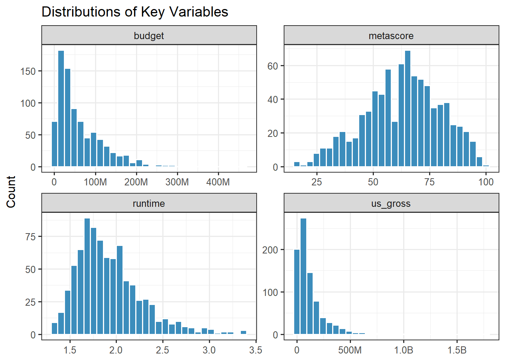


``` r
# Pairwise relationships: simple scatter matrix
if (requireNamespace("GGally", quietly = TRUE)) {
  GGally::ggpairs(
    movies_small %>% mutate(across(c(budget, us_gross), log1p)),
    columns = c("metascore","budget","us_gross","runtime","year"),
    upper = list(continuous = GGally::wrap("cor", size = 3)),
    lower = list(continuous = GGally::wrap("points", alpha = .5, size = .7)),
    diag = list(continuous = GGally::wrap("barDiag", bins = 20))
  ) + theme_bw(base_size = 10)
}
```

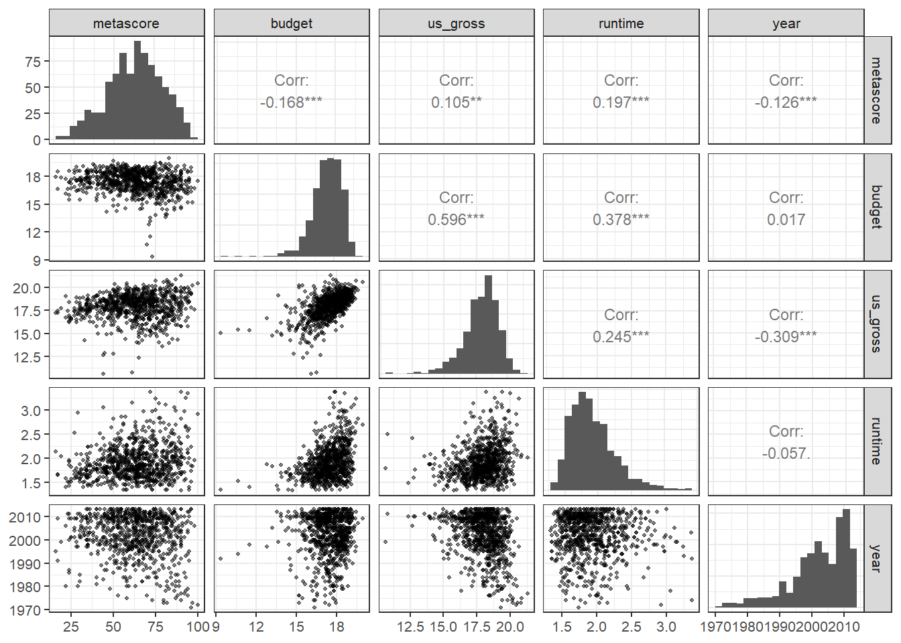


``` r
# Quick correlation table (with log transforms for skewed $ variables)
cor_mat <- movies_small %>%
  mutate(across(c(budget, us_gross), log1p)) %>%
  select(metascore, budget, us_gross, runtime, year) %>%
  cor(use = "pairwise.complete.obs")

round(cor_mat, 3)
#>           metascore budget us_gross runtime   year
#> metascore     1.000 -0.168    0.105   0.197 -0.126
#> budget       -0.168  1.000    0.596   0.378  0.017
#> us_gross      0.105  0.596    1.000   0.245 -0.309
#> runtime       0.197  0.378    0.245   1.000 -0.057
#> year         -0.126  0.017   -0.309  -0.057  1.000
```


``` r
# Outlier & influence screening (pre-model)
base_fit <- lm(metascore ~ log1p(budget) + log1p(us_gross) + runtime + year, data = movies_small)

infl <- influence.measures(base_fit)
summary(infl)
#> Potentially influential observations of
#> 	 lm(formula = metascore ~ log1p(budget) + log1p(us_gross) + runtime +      year, data = movies_small) :
#> 
#>     dfb.1_ dfb.l1() dfb.l1(_ dfb.rntm dfb.year dffit   cov.r   cook.d hat    
#> 20  -0.05  -0.06     0.06    -0.02     0.05    -0.12    0.96_*  0.00   0.00  
#> 40   0.08   0.06    -0.04     0.05    -0.09    -0.16    0.96_*  0.01   0.00  
#> 44   0.05  -0.08     0.06     0.01    -0.05     0.12    1.03_*  0.00   0.03_*
#> 62   0.09   0.13    -0.05     0.07    -0.10    -0.22    0.97_*  0.01   0.01  
#> 95   0.02   0.03     0.01     0.10    -0.02    -0.16    0.97_*  0.01   0.00  
#> 102  0.00   0.00     0.00     0.00     0.00    -0.01    1.02_*  0.00   0.02_*
#> 106 -0.01  -0.01     0.00     0.01     0.01     0.02    1.02_*  0.00   0.02  
#> 110 -0.01   0.00     0.01    -0.03     0.01    -0.04    1.02_*  0.00   0.01  
#> 112  0.00   0.04     0.00    -0.02     0.00    -0.05    1.02_*  0.00   0.02_*
#> 129  0.00   0.00     0.00     0.00     0.00     0.00    1.02_*  0.00   0.01  
#> 133  0.03   0.03    -0.05    -0.02    -0.03     0.06    1.02_*  0.00   0.01  
#> 138  0.00   0.18    -0.07    -0.06    -0.01    -0.19    1.03_*  0.01   0.03_*
#> 143 -0.02   0.31    -0.10    -0.06     0.00    -0.34_*  1.04_*  0.02   0.05_*
#> 172  0.25   0.05    -0.14    -0.06    -0.24     0.28_*  1.00    0.02   0.02  
#> 205 -0.02   0.40    -0.13    -0.06     0.00    -0.44_*  1.06_*  0.04   0.07_*
#> 230  0.01   0.01    -0.01     0.00    -0.01     0.01    1.02_*  0.00   0.01  
#> 237 -0.21  -0.06     0.01     0.12     0.21    -0.26_*  0.98_*  0.01   0.01  
#> 239 -0.18   0.14    -0.07     0.05     0.17    -0.30_*  0.97_*  0.02   0.01  
#> 271 -0.14   0.04     0.11    -0.14     0.14     0.25_*  0.97_*  0.01   0.01  
#> 296 -0.01  -0.02     0.06     0.00     0.01    -0.07    1.02_*  0.00   0.02_*
#> 298 -0.20  -0.11     0.18     0.00     0.20    -0.24_*  0.99    0.01   0.01  
#> 329  0.11   0.24    -0.16    -0.03    -0.12    -0.26_*  1.00    0.01   0.02_*
#> 330  0.16   0.22    -0.18    -0.02    -0.16    -0.26_*  0.99    0.01   0.01  
#> 350 -0.01   0.00     0.00     0.06     0.01     0.07    1.02_*  0.00   0.02  
#> 383  0.00   0.00     0.00     0.01     0.00     0.01    1.02_*  0.00   0.02_*
#> 385 -0.02   0.01     0.01    -0.09     0.02    -0.10    1.03_*  0.00   0.02_*
#> 387  0.04   0.06    -0.16     0.06    -0.03     0.17    1.06_*  0.01   0.05_*
#> 391  0.00  -0.02     0.00     0.00     0.01     0.02    1.02_*  0.00   0.01  
#> 408 -0.01  -0.02     0.02     0.01     0.01    -0.02    1.02_*  0.00   0.01  
#> 413  0.00   0.00    -0.02     0.01     0.00     0.02    1.02_*  0.00   0.01  
#> 454  0.00   0.15    -0.04    -0.01    -0.01    -0.17    1.04_*  0.01   0.03_*
#> 484 -0.06   0.08     0.04    -0.06     0.06     0.17    0.97_*  0.01   0.00  
#> 503 -0.07   0.12    -0.09    -0.03     0.06    -0.17    1.02_*  0.01   0.02_*
#> 510  0.00   0.00     0.00     0.00     0.00     0.00    1.02_*  0.00   0.02  
#> 515  0.09   0.30    -0.20    -0.04    -0.10    -0.32_*  0.99    0.02   0.02  
#> 516  0.01  -0.03     0.01     0.07    -0.01     0.08    1.03_*  0.00   0.02_*
#> 535 -0.13  -0.10     0.14    -0.04     0.13    -0.20    0.96_*  0.01   0.00  
#> 551 -0.22  -0.02     0.10     0.04     0.22    -0.24_*  0.99    0.01   0.01  
#> 554 -0.03  -0.04     0.11    -0.04     0.03    -0.12    1.04_*  0.00   0.03_*
#> 586 -0.01   0.00     0.04     0.00     0.00    -0.06    1.02_*  0.00   0.02_*
#> 615  0.01   0.04    -0.03     0.00    -0.01    -0.04    1.04_*  0.00   0.03_*
#> 617  0.01   0.01    -0.02     0.00    -0.01     0.02    1.06_*  0.00   0.05_*
#> 618  0.05   0.09     0.04    -0.07    -0.06    -0.19    0.96_*  0.01   0.00  
#> 625  0.04   0.09    -0.07    -0.02    -0.05    -0.13    0.97_*  0.00   0.00  
#> 639  0.03  -0.01     0.00     0.04    -0.03     0.05    1.03_*  0.00   0.02_*
#> 646  0.05  -0.01     0.02     0.00    -0.06     0.08    1.02_*  0.00   0.02  
#> 655  0.02   0.01     0.00     0.04    -0.02    -0.10    0.98_*  0.00   0.00  
#> 661  0.07  -0.04     0.03     0.09    -0.08     0.14    1.03_*  0.00   0.03_*
#> 662  0.02  -0.01     0.00     0.04    -0.02     0.05    1.04_*  0.00   0.03_*
#> 673  0.02   0.03    -0.03     0.00    -0.02     0.04    1.02_*  0.00   0.02  
#> 683  0.07   0.14    -0.10    -0.14    -0.08     0.20    0.98_*  0.01   0.01  
#> 692  0.02  -0.01    -0.01     0.02    -0.01     0.03    1.02_*  0.00   0.02  
#> 698 -0.02  -0.03     0.03     0.10     0.02     0.11    1.03_*  0.00   0.02_*
#> 703 -0.04  -0.07     0.10    -0.13     0.04    -0.20    0.98_*  0.01   0.01  
#> 721 -0.10  -0.09     0.17    -0.24     0.10    -0.32_*  0.99    0.02   0.02  
#> 730 -0.10   0.14    -0.13     0.02     0.10    -0.23    1.01    0.01   0.02_*
#> 731  0.09   0.05    -0.04     0.08    -0.09    -0.16    0.97_*  0.01   0.00  
#> 744  0.01   0.00     0.01     0.00    -0.01     0.02    1.02_*  0.00   0.02  
#> 759  0.00   0.00     0.00     0.01     0.00     0.01    1.02_*  0.00   0.02  
#> 771  0.00   0.00    -0.01    -0.03     0.00    -0.03    1.03_*  0.00   0.02_*
#> 778  0.03   0.01     0.09    -0.15    -0.03     0.20    0.98_*  0.01   0.01  
#> 779 -0.10   0.06     0.09    -0.10     0.09     0.21    0.98_*  0.01   0.01  
#> 788  0.04   0.05    -0.15    -0.02    -0.03     0.17    1.02_*  0.01   0.02_*
#> 829  0.03  -0.01     0.01     0.00    -0.03     0.04    1.02_*  0.00   0.02

# Flag observations with large Cook's distance or high leverage
diag_df <- tibble(
  .cooksd  = cooks.distance(base_fit),
  .hat     = hatvalues(base_fit),
  .resid   = rstandard(base_fit)
) %>% mutate(id = row_number())

head(diag_df[order(-diag_df$.cooksd),], 10)
#> # A tibble: 10 × 4
#>    .cooksd    .hat .resid    id
#>      <dbl>   <dbl>  <dbl> <int>
#>  1  0.0393 0.0668   -1.66   205
#>  2  0.0233 0.0476   -1.53   143
#>  3  0.0199 0.0178   -2.34   515
#>  4  0.0199 0.0161   -2.46   721
#>  5  0.0176 0.0113   -2.77   239
#>  6  0.0152 0.0165    2.13   172
#>  7  0.0139 0.0107   -2.53   237
#>  8  0.0134 0.0126   -2.29   330
#>  9  0.0134 0.0187   -1.87   329
#> 10  0.0122 0.00869   2.64   271
```

## Model

We illustrate a multiple linear regression model appropriate for continuous outcomes:

$$
y_i = \beta_0+ \beta_1 \log(\mathrm{budget}_i + 1)+ \beta_2 \log(\mathrm{us\_gross}_i + 1)+ \beta_3 \mathrm{runtime}_i+ \beta_4 \mathrm{year}_i+ \varepsilon_i .
$$

### Assumptions

-   Linearity in parameters and approximately linear relationships after transformation
-   Independence of errors (or appropriately modeled dependence/clustered SEs)
-   Homoskedasticity of errors (or robust SEs)
-   Approximately normal errors for t tests/intervals (large-sample robustness often sufficient)

### Why this model?

-   `metascore` is continuous; OLS is a natural baseline.
-   Financial variables are **skewed**; log-transform helps stabilize variance and linearize relationships.
-   `year` and `runtime` capture secular trends and content length.

### Considerations

-   **Interactions**: e.g., does budget effectiveness differ by year?
-   **Collinearity**: budget and gross can be correlated; check VIF.
-   **Dependence**: panel or clustered structures (franchise, studio) may require cluster-robust SEs.


``` r
fit <- lm(metascore ~ log1p(budget) + log1p(us_gross) + runtime + year, data = movies_small)

# Core jtools summary (unstandardized)
summ(fit)
```

<table class="table table-striped table-hover table-condensed table-responsive" style="width: auto !important; margin-left: auto; margin-right: auto;">
<tbody>
  <tr>
   <td style="text-align:left;font-weight: bold;"> Observations </td>
   <td style="text-align:right;"> 831 </td>
  </tr>
  <tr>
   <td style="text-align:left;font-weight: bold;"> Dependent variable </td>
   <td style="text-align:right;"> metascore </td>
  </tr>
  <tr>
   <td style="text-align:left;font-weight: bold;"> Type </td>
   <td style="text-align:right;"> OLS linear regression </td>
  </tr>
</tbody>
</table> <table class="table table-striped table-hover table-condensed table-responsive" style="width: auto !important; margin-left: auto; margin-right: auto;">
<tbody>
  <tr>
   <td style="text-align:left;font-weight: bold;"> F(4,826) </td>
   <td style="text-align:right;"> 41.99 </td>
  </tr>
  <tr>
   <td style="text-align:left;font-weight: bold;"> R² </td>
   <td style="text-align:right;"> 0.17 </td>
  </tr>
  <tr>
   <td style="text-align:left;font-weight: bold;"> Adj. R² </td>
   <td style="text-align:right;"> 0.16 </td>
  </tr>
</tbody>
</table> <table class="table table-striped table-hover table-condensed table-responsive" style="width: auto !important; margin-left: auto; margin-right: auto;border-bottom: 0;">
 <thead>
  <tr>
   <th style="text-align:left;">   </th>
   <th style="text-align:right;"> Est. </th>
   <th style="text-align:right;"> S.E. </th>
   <th style="text-align:right;"> t val. </th>
   <th style="text-align:right;"> p </th>
  </tr>
 </thead>
<tbody>
  <tr>
   <td style="text-align:left;font-weight: bold;"> (Intercept) </td>
   <td style="text-align:right;"> 108.91 </td>
   <td style="text-align:right;"> 131.81 </td>
   <td style="text-align:right;"> 0.83 </td>
   <td style="text-align:right;"> 0.41 </td>
  </tr>
  <tr>
   <td style="text-align:left;font-weight: bold;"> log1p(budget) </td>
   <td style="text-align:right;"> -6.67 </td>
   <td style="text-align:right;"> 0.62 </td>
   <td style="text-align:right;"> -10.75 </td>
   <td style="text-align:right;"> 0.00 </td>
  </tr>
  <tr>
   <td style="text-align:left;font-weight: bold;"> log1p(us_gross) </td>
   <td style="text-align:right;"> 3.80 </td>
   <td style="text-align:right;"> 0.54 </td>
   <td style="text-align:right;"> 7.08 </td>
   <td style="text-align:right;"> 0.00 </td>
  </tr>
  <tr>
   <td style="text-align:left;font-weight: bold;"> runtime </td>
   <td style="text-align:right;"> 14.27 </td>
   <td style="text-align:right;"> 1.65 </td>
   <td style="text-align:right;"> 8.65 </td>
   <td style="text-align:right;"> 0.00 </td>
  </tr>
  <tr>
   <td style="text-align:left;font-weight: bold;"> year </td>
   <td style="text-align:right;"> -0.01 </td>
   <td style="text-align:right;"> 0.07 </td>
   <td style="text-align:right;"> -0.19 </td>
   <td style="text-align:right;"> 0.85 </td>
  </tr>
</tbody>
<tfoot><tr><td style="padding: 0; " colspan="100%">
<sup></sup> Standard errors: OLS</td></tr></tfoot>
</table>


``` r
# Enhanced jtools summary: standardized coefs, VIFs, semi-partial correlations, CIs
summ(
  fit,
  scale = TRUE,      # standardized betas
  vifs = TRUE,       # collinearity diagnostics
  part.corr = TRUE,  # semi-partial (part) correlations
  confint = TRUE,
  pvals = TRUE
)
```

<table class="table table-striped table-hover table-condensed table-responsive" style="width: auto !important; margin-left: auto; margin-right: auto;">
<tbody>
  <tr>
   <td style="text-align:left;font-weight: bold;"> Observations </td>
   <td style="text-align:right;"> 831 </td>
  </tr>
  <tr>
   <td style="text-align:left;font-weight: bold;"> Dependent variable </td>
   <td style="text-align:right;"> metascore </td>
  </tr>
  <tr>
   <td style="text-align:left;font-weight: bold;"> Type </td>
   <td style="text-align:right;"> OLS linear regression </td>
  </tr>
</tbody>
</table> <table class="table table-striped table-hover table-condensed table-responsive" style="width: auto !important; margin-left: auto; margin-right: auto;">
<tbody>
  <tr>
   <td style="text-align:left;font-weight: bold;"> F(4,826) </td>
   <td style="text-align:right;"> 41.99 </td>
  </tr>
  <tr>
   <td style="text-align:left;font-weight: bold;"> R² </td>
   <td style="text-align:right;"> 0.17 </td>
  </tr>
  <tr>
   <td style="text-align:left;font-weight: bold;"> Adj. R² </td>
   <td style="text-align:right;"> 0.16 </td>
  </tr>
</tbody>
</table> <table class="table table-striped table-hover table-condensed table-responsive" style="width: auto !important; margin-left: auto; margin-right: auto;border-bottom: 0;">
 <thead>
  <tr>
   <th style="text-align:left;">   </th>
   <th style="text-align:right;"> Est. </th>
   <th style="text-align:right;"> 2.5% </th>
   <th style="text-align:right;"> 97.5% </th>
   <th style="text-align:right;"> t val. </th>
   <th style="text-align:right;"> p </th>
   <th style="text-align:right;"> VIF </th>
   <th style="text-align:right;"> partial.r </th>
   <th style="text-align:right;"> part.r </th>
  </tr>
 </thead>
<tbody>
  <tr>
   <td style="text-align:left;font-weight: bold;"> (Intercept) </td>
   <td style="text-align:right;"> 63.01 </td>
   <td style="text-align:right;"> 61.96 </td>
   <td style="text-align:right;"> 64.06 </td>
   <td style="text-align:right;"> 117.57 </td>
   <td style="text-align:right;"> 0.00 </td>
   <td style="text-align:right;"> NA </td>
   <td style="text-align:right;"> NA </td>
   <td style="text-align:right;"> NA </td>
  </tr>
  <tr>
   <td style="text-align:left;font-weight: bold;"> `log1p(budget)` </td>
   <td style="text-align:right;"> -7.81 </td>
   <td style="text-align:right;"> -9.24 </td>
   <td style="text-align:right;"> -6.38 </td>
   <td style="text-align:right;"> -10.75 </td>
   <td style="text-align:right;"> 0.00 </td>
   <td style="text-align:right;"> 1.84 </td>
   <td style="text-align:right;"> -0.35 </td>
   <td style="text-align:right;"> -0.34 </td>
  </tr>
  <tr>
   <td style="text-align:left;font-weight: bold;"> `log1p(us_gross)` </td>
   <td style="text-align:right;"> 5.15 </td>
   <td style="text-align:right;"> 3.73 </td>
   <td style="text-align:right;"> 6.58 </td>
   <td style="text-align:right;"> 7.08 </td>
   <td style="text-align:right;"> 0.00 </td>
   <td style="text-align:right;"> 1.84 </td>
   <td style="text-align:right;"> 0.24 </td>
   <td style="text-align:right;"> 0.22 </td>
  </tr>
  <tr>
   <td style="text-align:left;font-weight: bold;"> runtime </td>
   <td style="text-align:right;"> 5.02 </td>
   <td style="text-align:right;"> 3.88 </td>
   <td style="text-align:right;"> 6.16 </td>
   <td style="text-align:right;"> 8.65 </td>
   <td style="text-align:right;"> 0.00 </td>
   <td style="text-align:right;"> 1.17 </td>
   <td style="text-align:right;"> 0.29 </td>
   <td style="text-align:right;"> 0.27 </td>
  </tr>
  <tr>
   <td style="text-align:left;font-weight: bold;"> year </td>
   <td style="text-align:right;"> -0.11 </td>
   <td style="text-align:right;"> -1.26 </td>
   <td style="text-align:right;"> 1.04 </td>
   <td style="text-align:right;"> -0.19 </td>
   <td style="text-align:right;"> 0.85 </td>
   <td style="text-align:right;"> 1.19 </td>
   <td style="text-align:right;"> -0.01 </td>
   <td style="text-align:right;"> -0.01 </td>
  </tr>
</tbody>
<tfoot><tr><td style="padding: 0; " colspan="100%">
<sup></sup> Standard errors: OLS; Continuous predictors are mean-centered and scaled by 1 s.d. The outcome variable remains in its original units.</td></tr></tfoot>
</table>


``` r
# Interactions: visualize and test
fit_int <- lm(metascore ~ log1p(budget)*year + log1p(us_gross) + runtime, data = movies_small)

# Create the transformed variable in your dataset
movies_small$log_budget <- log1p(movies_small$budget)

# Fit the model with the new variable
fit_int <- lm(metascore ~ log_budget*year + log1p(us_gross) + runtime, 
              data = movies_small)

# Now visualize
interactions::interact_plot(fit_int,
                           pred = year,
                           modx = log_budget,
                           interval = TRUE,
                           plot.points = TRUE) +
  theme_bw(base_size = 12)
```

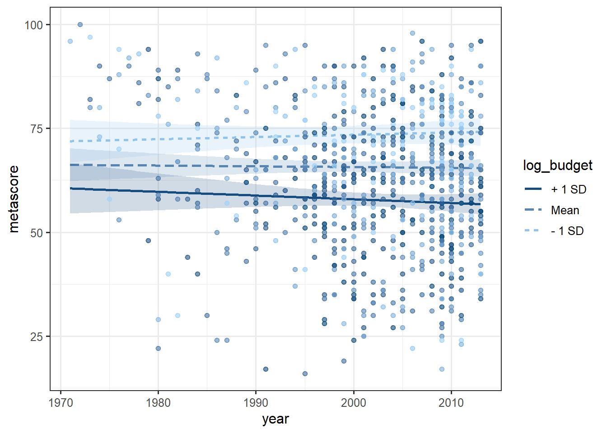


``` r
# Collinearity (car::vif)
car::vif(fit)
#>   log1p(budget) log1p(us_gross)         runtime            year 
#>        1.835578        1.841513        1.172572        1.192862
```

### Model Fit

We report $R^2$, adjusted $R^2$, residual standard error (RSE), and information criteria (AIC/BIC). For nested models, we can use ANOVA; otherwise, compare AIC/BIC, cross-validated error, or out-of-sample performance.

We then examine residuals for normality, heteroskedasticity, and influential points. If assumptions are questionable, prefer **heteroskedasticity-robust** or **cluster-robust** standard errors.


``` r
broom::glance(fit) %>%
  select(r.squared, adj.r.squared, sigma, AIC, BIC, df, nobs)
#> # A tibble: 1 × 7
#>   r.squared adj.r.squared sigma   AIC   BIC    df  nobs
#>       <dbl>         <dbl> <dbl> <dbl> <dbl> <dbl> <int>
#> 1     0.169         0.165  15.4 6915. 6943.     4   831
```


``` r
# Base residual diagnostics (four-panel plots)
par(mfrow = c(2, 2))
plot(fit)
```

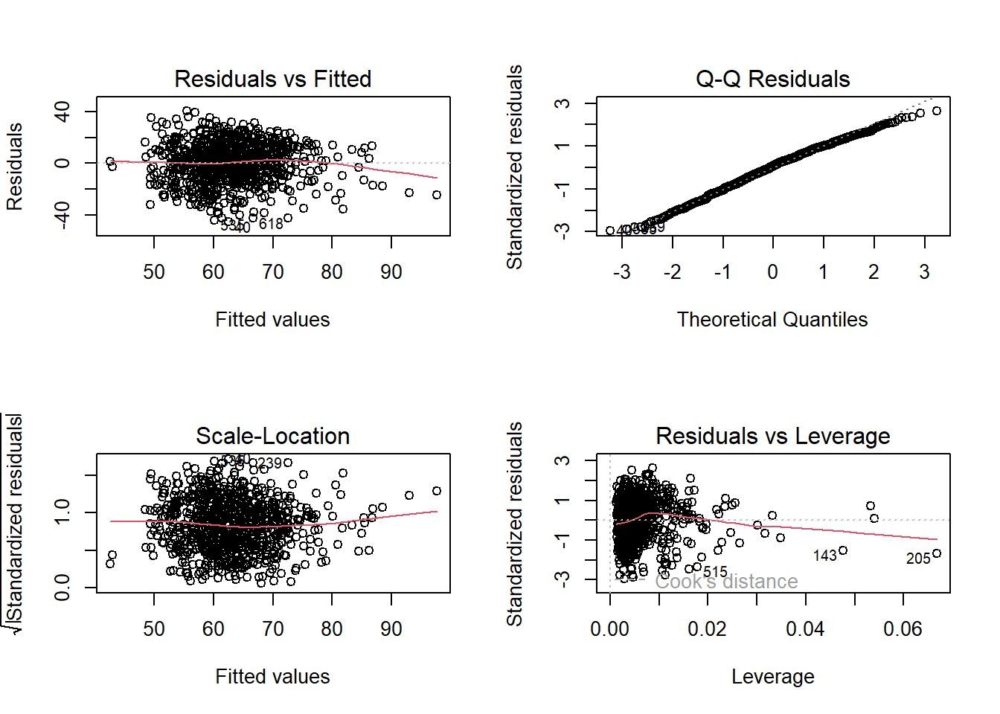

``` r
par(mfrow = c(1, 1))
```


``` r
# Formal tests (use judiciously; they're sensitive to n)
if (requireNamespace("car", quietly = TRUE)) {
  car::ncvTest(fit)                     # non-constant variance test
  car::durbinWatsonTest(fit)            # autocorrelation test (time ordering needed)
}
#>  lag Autocorrelation D-W Statistic p-value
#>    1      0.03649805      1.923838   0.268
#>  Alternative hypothesis: rho != 0
lmtest::bptest(fit)                      # Breusch-Pagan heteroskedasticity test
#> 
#> 	studentized Breusch-Pagan test
#> 
#> data:  fit
#> BP = 18.909, df = 4, p-value = 0.0008191
```


``` r
# Partial residual plots
if (requireNamespace("car", quietly = TRUE)) {
  car::crPlots(fit)
}
```

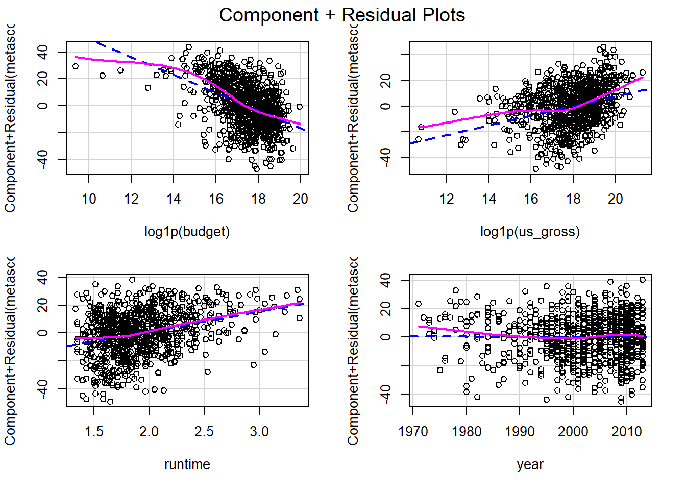

### Cluster-Robust Standard Errors

When heteroskedasticity or clustering is present, use **sandwich** estimators:

-   HC0/HC1/HC2/HC3: robust to heteroskedasticity

-   Cluster-robust (by firm, school, market, etc.) when errors correlate within clusters

Below: examples using `jtools::summ()` and `lmtest::coeftest()` with `sandwich`.


``` r
# Heteroskedasticity-robust SEs for fit
lmtest::coeftest(fit, vcov. = sandwich::vcovHC(fit, type = "HC3"))
#> 
#> t test of coefficients:
#> 
#>                   Estimate Std. Error t value  Pr(>|t|)    
#> (Intercept)     108.910293 145.640262  0.7478    0.4548    
#> log1p(budget)    -6.669123   0.708027 -9.4193 < 2.2e-16 ***
#> log1p(us_gross)   3.803854   0.552399  6.8861 1.136e-11 ***
#> runtime          14.268967   1.641196  8.6942 < 2.2e-16 ***
#> year             -0.012659   0.072085 -0.1756    0.8606    
#> ---
#> Signif. codes:  0 '***' 0.001 '**' 0.01 '*' 0.05 '.' 0.1 ' ' 1

# jtools in one line
summ(fit, robust = "HC3", confint = TRUE)
```

<table class="table table-striped table-hover table-condensed table-responsive" style="width: auto !important; margin-left: auto; margin-right: auto;">
<tbody>
  <tr>
   <td style="text-align:left;font-weight: bold;"> Observations </td>
   <td style="text-align:right;"> 831 </td>
  </tr>
  <tr>
   <td style="text-align:left;font-weight: bold;"> Dependent variable </td>
   <td style="text-align:right;"> metascore </td>
  </tr>
  <tr>
   <td style="text-align:left;font-weight: bold;"> Type </td>
   <td style="text-align:right;"> OLS linear regression </td>
  </tr>
</tbody>
</table> <table class="table table-striped table-hover table-condensed table-responsive" style="width: auto !important; margin-left: auto; margin-right: auto;">
<tbody>
  <tr>
   <td style="text-align:left;font-weight: bold;"> F(4,826) </td>
   <td style="text-align:right;"> 41.99 </td>
  </tr>
  <tr>
   <td style="text-align:left;font-weight: bold;"> R² </td>
   <td style="text-align:right;"> 0.17 </td>
  </tr>
  <tr>
   <td style="text-align:left;font-weight: bold;"> Adj. R² </td>
   <td style="text-align:right;"> 0.16 </td>
  </tr>
</tbody>
</table> <table class="table table-striped table-hover table-condensed table-responsive" style="width: auto !important; margin-left: auto; margin-right: auto;border-bottom: 0;">
 <thead>
  <tr>
   <th style="text-align:left;">   </th>
   <th style="text-align:right;"> Est. </th>
   <th style="text-align:right;"> 2.5% </th>
   <th style="text-align:right;"> 97.5% </th>
   <th style="text-align:right;"> t val. </th>
   <th style="text-align:right;"> p </th>
  </tr>
 </thead>
<tbody>
  <tr>
   <td style="text-align:left;font-weight: bold;"> (Intercept) </td>
   <td style="text-align:right;"> 108.91 </td>
   <td style="text-align:right;"> -176.96 </td>
   <td style="text-align:right;"> 394.78 </td>
   <td style="text-align:right;"> 0.75 </td>
   <td style="text-align:right;"> 0.45 </td>
  </tr>
  <tr>
   <td style="text-align:left;font-weight: bold;"> log1p(budget) </td>
   <td style="text-align:right;"> -6.67 </td>
   <td style="text-align:right;"> -8.06 </td>
   <td style="text-align:right;"> -5.28 </td>
   <td style="text-align:right;"> -9.42 </td>
   <td style="text-align:right;"> 0.00 </td>
  </tr>
  <tr>
   <td style="text-align:left;font-weight: bold;"> log1p(us_gross) </td>
   <td style="text-align:right;"> 3.80 </td>
   <td style="text-align:right;"> 2.72 </td>
   <td style="text-align:right;"> 4.89 </td>
   <td style="text-align:right;"> 6.89 </td>
   <td style="text-align:right;"> 0.00 </td>
  </tr>
  <tr>
   <td style="text-align:left;font-weight: bold;"> runtime </td>
   <td style="text-align:right;"> 14.27 </td>
   <td style="text-align:right;"> 11.05 </td>
   <td style="text-align:right;"> 17.49 </td>
   <td style="text-align:right;"> 8.69 </td>
   <td style="text-align:right;"> 0.00 </td>
  </tr>
  <tr>
   <td style="text-align:left;font-weight: bold;"> year </td>
   <td style="text-align:right;"> -0.01 </td>
   <td style="text-align:right;"> -0.15 </td>
   <td style="text-align:right;"> 0.13 </td>
   <td style="text-align:right;"> -0.18 </td>
   <td style="text-align:right;"> 0.86 </td>
  </tr>
</tbody>
<tfoot><tr><td style="padding: 0; " colspan="100%">
<sup></sup> Standard errors: Robust, type = HC3</td></tr></tfoot>
</table>


``` r
# Cluster-robust SEs using example data from 'sandwich'
data("PetersenCL", package = "sandwich")
fit2 <- lm(y ~ x, data = PetersenCL)

# Cluster on 'firm'
summ(fit2, robust = "HC3", cluster = "firm")
```

<table class="table table-striped table-hover table-condensed table-responsive" style="width: auto !important; margin-left: auto; margin-right: auto;">
<tbody>
  <tr>
   <td style="text-align:left;font-weight: bold;"> Observations </td>
   <td style="text-align:right;"> 5000 </td>
  </tr>
  <tr>
   <td style="text-align:left;font-weight: bold;"> Dependent variable </td>
   <td style="text-align:right;"> y </td>
  </tr>
  <tr>
   <td style="text-align:left;font-weight: bold;"> Type </td>
   <td style="text-align:right;"> OLS linear regression </td>
  </tr>
</tbody>
</table> <table class="table table-striped table-hover table-condensed table-responsive" style="width: auto !important; margin-left: auto; margin-right: auto;">
<tbody>
  <tr>
   <td style="text-align:left;font-weight: bold;"> F(1,4998) </td>
   <td style="text-align:right;"> 1310.74 </td>
  </tr>
  <tr>
   <td style="text-align:left;font-weight: bold;"> R² </td>
   <td style="text-align:right;"> 0.21 </td>
  </tr>
  <tr>
   <td style="text-align:left;font-weight: bold;"> Adj. R² </td>
   <td style="text-align:right;"> 0.21 </td>
  </tr>
</tbody>
</table> <table class="table table-striped table-hover table-condensed table-responsive" style="width: auto !important; margin-left: auto; margin-right: auto;border-bottom: 0;">
 <thead>
  <tr>
   <th style="text-align:left;">   </th>
   <th style="text-align:right;"> Est. </th>
   <th style="text-align:right;"> S.E. </th>
   <th style="text-align:right;"> t val. </th>
   <th style="text-align:right;"> p </th>
  </tr>
 </thead>
<tbody>
  <tr>
   <td style="text-align:left;font-weight: bold;"> (Intercept) </td>
   <td style="text-align:right;"> 0.03 </td>
   <td style="text-align:right;"> 0.07 </td>
   <td style="text-align:right;"> 0.44 </td>
   <td style="text-align:right;"> 0.66 </td>
  </tr>
  <tr>
   <td style="text-align:left;font-weight: bold;"> x </td>
   <td style="text-align:right;"> 1.03 </td>
   <td style="text-align:right;"> 0.05 </td>
   <td style="text-align:right;"> 20.36 </td>
   <td style="text-align:right;"> 0.00 </td>
  </tr>
</tbody>
<tfoot><tr><td style="padding: 0; " colspan="100%">
<sup></sup> Standard errors: Cluster-robust, type = HC3</td></tr></tfoot>
</table>

See Table \@ref(tab:report-sandwich-variants) for a quick reference:

| Type     | Applicable | Usage           | Notes/References                                 |
|:---------|:-----------|:----------------|:-------------------------------------------------|
| const    | iid        | Homskedastic    | Assumes constant variance                        |
| HC/HC0   | vcovHC     | Heteroskedastic | White's estimator [@white1980heteroskedasticity] |
| HC1      | vcovHC     | Heteroskedastic | DoF correction [@mackinnon1985some]              |
| HC2      | vcovHC     | Heteroskedastic | Hat-matrix adjustment                            |
| HC3      | vcovHC     | Heteroskedastic | Preferred for small $n$; hat-matrix adjustment   |
| HC4/4m/5 | vcovHC     | Heteroskedastic | Leverage-adaptive                                |

: (#tab:report-sandwich-variants) Sandwich Variants

<!--# See vignette: https://cran.r-project.org/web/packages/sandwich/vignettes/sandwich-CL.pdf  -->


``` r
# Another quick demo on built-in data
data(cars)
model <- lm(speed ~ dist, data = cars)
summary(model)
#> 
#> Call:
#> lm(formula = speed ~ dist, data = cars)
#> 
#> Residuals:
#>     Min      1Q  Median      3Q     Max 
#> -7.5293 -2.1550  0.3615  2.4377  6.4179 
#> 
#> Coefficients:
#>             Estimate Std. Error t value Pr(>|t|)    
#> (Intercept)  8.28391    0.87438   9.474 1.44e-12 ***
#> dist         0.16557    0.01749   9.464 1.49e-12 ***
#> ---
#> Signif. codes:  0 '***' 0.001 '**' 0.01 '*' 0.05 '.' 0.1 ' ' 1
#> 
#> Residual standard error: 3.156 on 48 degrees of freedom
#> Multiple R-squared:  0.6511,	Adjusted R-squared:  0.6438 
#> F-statistic: 89.57 on 1 and 48 DF,  p-value: 1.49e-12
lmtest::coeftest(model, vcov. = sandwich::vcovHC(model, type = "HC1"))
#> 
#> t test of coefficients:
#> 
#>             Estimate Std. Error t value  Pr(>|t|)    
#> (Intercept) 8.283906   0.891860  9.2883 2.682e-12 ***
#> dist        0.165568   0.019402  8.5335 3.482e-11 ***
#> ---
#> Signif. codes:  0 '***' 0.001 '**' 0.01 '*' 0.05 '.' 0.1 ' ' 1
```

### Model to Equation

Use `equatiomatic` to extract LaTeX-ready equations. If unavailable, we provide a fallback to print the fitted equation with estimated coefficients.


``` r
# install.packages("equatiomatic") # not available for some R versions (e.g., R 4.2)
fit_eq <- lm(metascore ~ log1p(budget) + log1p(us_gross) + runtime + year, data = movies_small)

# Show the theoretical model
equatiomatic::extract_eq(fit_eq)

# Display the actual coefficients
equatiomatic::extract_eq(fit_eq, use_coefs = TRUE)
```


``` r
# Fallback: build a simple equation string with estimated coefs
print_lm_equation <- function(mod) {
  co <- coef(mod)
  terms <- names(co)
  terms_fmt <- ifelse(terms == "(Intercept)",
                      sprintf("%.3f", co[terms]),
                      paste0(sprintf("%.3f", co[terms]), " \\cdot ", terms))
  rhs <- paste(terms_fmt, collapse = " + ")
  asis <- paste0("$\\hat{y} = ", rhs, "$")
  cat(asis, "\n")
}
print_lm_equation(fit)
#> $\hat{y} = 108.910 + -6.669 \cdot log1p(budget) + 3.804 \cdot log1p(us_gross) + 14.269 \cdot runtime + -0.013 \cdot year$
```

## Model Comparison

Compare nested models via ANOVA (F-test), and non-nested via AIC/BIC, cross-validation, or predictive performance metrics. `jtools::export_summs()` offers attractive comparison tables.


``` r
fit_a <- lm(metascore ~ log1p(budget), data = movies_small)
fit_b <- lm(metascore ~ log1p(budget) + log1p(us_gross), data = movies_small)
fit_c <- lm(metascore ~ log1p(budget) + log1p(us_gross) + runtime, data = movies_small)

coef_names <- c("Budget" = "log1p(budget)",
                "US Gross" = "log1p(us_gross)",
                "Runtime (Hours)" = "runtime",
                "Constant" = "(Intercept)")

export_summs(fit_a, fit_b, fit_c, robust = "HC3", coefs = coef_names)
```


```{=html}
<table class="huxtable" data-quarto-disable-processing="true"  style="margin-left: auto; margin-right: auto;">
<col><col><col><col><thead>
<tr>
<th class="huxtable-cell huxtable-header" style="text-align: center;  border-style: solid solid solid solid; border-width: 0.8pt 0pt 0pt 0pt;      font-weight: normal;"></th><th class="huxtable-cell huxtable-header" style="text-align: center;  border-style: solid solid solid solid; border-width: 0.8pt 0pt 0.4pt 0pt;      font-weight: normal;">Model 1</th><th class="huxtable-cell huxtable-header" style="text-align: center;  border-style: solid solid solid solid; border-width: 0.8pt 0pt 0.4pt 0pt;      font-weight: normal;">Model 2</th><th class="huxtable-cell huxtable-header" style="text-align: center;  border-style: solid solid solid solid; border-width: 0.8pt 0pt 0.4pt 0pt;      font-weight: normal;">Model 3</th></tr>
</thead>
<tbody>
<tr>
<th class="huxtable-cell huxtable-header" style="border-style: solid solid solid solid; border-width: 0pt 0pt 0pt 0pt;      font-weight: normal;">Budget</th><td class="huxtable-cell" style="text-align: right;  border-style: solid solid solid solid; border-width: 0.4pt 0pt 0pt 0pt;">-2.43 ***</td><td class="huxtable-cell" style="text-align: right;  border-style: solid solid solid solid; border-width: 0.4pt 0pt 0pt 0pt;">-5.16 ***</td><td class="huxtable-cell" style="text-align: right;  border-style: solid solid solid solid; border-width: 0.4pt 0pt 0pt 0pt;">-6.70 ***</td></tr>
<tr>
<th class="huxtable-cell huxtable-header" style="border-style: solid solid solid solid; border-width: 0pt 0pt 0pt 0pt;      font-weight: normal;"></th><td class="huxtable-cell" style="text-align: right;  border-style: solid solid solid solid; border-width: 0pt 0pt 0pt 0pt;">(0.44)&nbsp;&nbsp;&nbsp;</td><td class="huxtable-cell" style="text-align: right;  border-style: solid solid solid solid; border-width: 0pt 0pt 0pt 0pt;">(0.62)&nbsp;&nbsp;&nbsp;</td><td class="huxtable-cell" style="text-align: right;  border-style: solid solid solid solid; border-width: 0pt 0pt 0pt 0pt;">(0.67)&nbsp;&nbsp;&nbsp;</td></tr>
<tr>
<th class="huxtable-cell huxtable-header" style="border-style: solid solid solid solid; border-width: 0pt 0pt 0pt 0pt;      font-weight: normal;">US Gross</th><td class="huxtable-cell" style="text-align: right;  border-style: solid solid solid solid; border-width: 0pt 0pt 0pt 0pt;">&nbsp;&nbsp;&nbsp;&nbsp;&nbsp;&nbsp;&nbsp;</td><td class="huxtable-cell" style="text-align: right;  border-style: solid solid solid solid; border-width: 0pt 0pt 0pt 0pt;">3.96 ***</td><td class="huxtable-cell" style="text-align: right;  border-style: solid solid solid solid; border-width: 0pt 0pt 0pt 0pt;">3.85 ***</td></tr>
<tr>
<th class="huxtable-cell huxtable-header" style="border-style: solid solid solid solid; border-width: 0pt 0pt 0pt 0pt;      font-weight: normal;"></th><td class="huxtable-cell" style="text-align: right;  border-style: solid solid solid solid; border-width: 0pt 0pt 0pt 0pt;">&nbsp;&nbsp;&nbsp;&nbsp;&nbsp;&nbsp;&nbsp;</td><td class="huxtable-cell" style="text-align: right;  border-style: solid solid solid solid; border-width: 0pt 0pt 0pt 0pt;">(0.51)&nbsp;&nbsp;&nbsp;</td><td class="huxtable-cell" style="text-align: right;  border-style: solid solid solid solid; border-width: 0pt 0pt 0pt 0pt;">(0.48)&nbsp;&nbsp;&nbsp;</td></tr>
<tr>
<th class="huxtable-cell huxtable-header" style="border-style: solid solid solid solid; border-width: 0pt 0pt 0pt 0pt;      font-weight: normal;">Runtime (Hours)</th><td class="huxtable-cell" style="text-align: right;  border-style: solid solid solid solid; border-width: 0pt 0pt 0pt 0pt;">&nbsp;&nbsp;&nbsp;&nbsp;&nbsp;&nbsp;&nbsp;</td><td class="huxtable-cell" style="text-align: right;  border-style: solid solid solid solid; border-width: 0pt 0pt 0pt 0pt;">&nbsp;&nbsp;&nbsp;&nbsp;&nbsp;&nbsp;&nbsp;</td><td class="huxtable-cell" style="text-align: right;  border-style: solid solid solid solid; border-width: 0pt 0pt 0pt 0pt;">14.29 ***</td></tr>
<tr>
<th class="huxtable-cell huxtable-header" style="border-style: solid solid solid solid; border-width: 0pt 0pt 0pt 0pt;      font-weight: normal;"></th><td class="huxtable-cell" style="text-align: right;  border-style: solid solid solid solid; border-width: 0pt 0pt 0pt 0pt;">&nbsp;&nbsp;&nbsp;&nbsp;&nbsp;&nbsp;&nbsp;</td><td class="huxtable-cell" style="text-align: right;  border-style: solid solid solid solid; border-width: 0pt 0pt 0pt 0pt;">&nbsp;&nbsp;&nbsp;&nbsp;&nbsp;&nbsp;&nbsp;</td><td class="huxtable-cell" style="text-align: right;  border-style: solid solid solid solid; border-width: 0pt 0pt 0pt 0pt;">(1.63)&nbsp;&nbsp;&nbsp;</td></tr>
<tr>
<th class="huxtable-cell huxtable-header" style="border-style: solid solid solid solid; border-width: 0pt 0pt 0pt 0pt;      font-weight: normal;">Constant</th><td class="huxtable-cell" style="text-align: right;  border-style: solid solid solid solid; border-width: 0pt 0pt 0pt 0pt;">105.29 ***</td><td class="huxtable-cell" style="text-align: right;  border-style: solid solid solid solid; border-width: 0pt 0pt 0pt 0pt;">81.84 ***</td><td class="huxtable-cell" style="text-align: right;  border-style: solid solid solid solid; border-width: 0pt 0pt 0pt 0pt;">83.35 ***</td></tr>
<tr>
<th class="huxtable-cell huxtable-header" style="border-style: solid solid solid solid; border-width: 0pt 0pt 0pt 0pt;      font-weight: normal;"></th><td class="huxtable-cell" style="text-align: right;  border-style: solid solid solid solid; border-width: 0pt 0pt 0.4pt 0pt;">(7.65)&nbsp;&nbsp;&nbsp;</td><td class="huxtable-cell" style="text-align: right;  border-style: solid solid solid solid; border-width: 0pt 0pt 0.4pt 0pt;">(8.66)&nbsp;&nbsp;&nbsp;</td><td class="huxtable-cell" style="text-align: right;  border-style: solid solid solid solid; border-width: 0pt 0pt 0.4pt 0pt;">(8.82)&nbsp;&nbsp;&nbsp;</td></tr>
<tr>
<th class="huxtable-cell huxtable-header" style="border-style: solid solid solid solid; border-width: 0pt 0pt 0pt 0pt;      font-weight: normal;">N</th><td class="huxtable-cell" style="text-align: right;  border-style: solid solid solid solid; border-width: 0.4pt 0pt 0pt 0pt;">831&nbsp;&nbsp;&nbsp;&nbsp;&nbsp;&nbsp;&nbsp;</td><td class="huxtable-cell" style="text-align: right;  border-style: solid solid solid solid; border-width: 0.4pt 0pt 0pt 0pt;">831&nbsp;&nbsp;&nbsp;&nbsp;&nbsp;&nbsp;&nbsp;</td><td class="huxtable-cell" style="text-align: right;  border-style: solid solid solid solid; border-width: 0.4pt 0pt 0pt 0pt;">831&nbsp;&nbsp;&nbsp;&nbsp;&nbsp;&nbsp;&nbsp;</td></tr>
<tr>
<th class="huxtable-cell huxtable-header" style="border-style: solid solid solid solid; border-width: 0pt 0pt 0.8pt 0pt;      font-weight: normal;">R2</th><td class="huxtable-cell" style="text-align: right;  border-style: solid solid solid solid; border-width: 0pt 0pt 0.8pt 0pt;">0.03&nbsp;&nbsp;&nbsp;&nbsp;</td><td class="huxtable-cell" style="text-align: right;  border-style: solid solid solid solid; border-width: 0pt 0pt 0.8pt 0pt;">0.09&nbsp;&nbsp;&nbsp;&nbsp;</td><td class="huxtable-cell" style="text-align: right;  border-style: solid solid solid solid; border-width: 0pt 0pt 0.8pt 0pt;">0.17&nbsp;&nbsp;&nbsp;&nbsp;</td></tr>
<tr>
<th class="huxtable-cell huxtable-header" colspan="4" style="border-style: solid solid solid solid; border-width: 0.8pt 0pt 0pt 0pt;      font-weight: normal;">Standard errors are heteroskedasticity robust. *** p &lt; 0.001; ** p &lt; 0.01; * p &lt; 0.05.</th></tr>
</tbody>
</table>

```


``` r
# AIC/BIC comparison
broom::glance(fit_a) %>% select(AIC, BIC, adj.r.squared) %>% mutate(model = "fit_a")
#> # A tibble: 1 × 4
#>     AIC   BIC adj.r.squared model
#>   <dbl> <dbl>         <dbl> <chr>
#> 1 7039. 7053.        0.0271 fit_a
broom::glance(fit_b) %>% select(AIC, BIC, adj.r.squared) %>% mutate(model = "fit_b")
#> # A tibble: 1 × 4
#>     AIC   BIC adj.r.squared model
#>   <dbl> <dbl>         <dbl> <chr>
#> 1 6984. 7003.        0.0910 fit_b
broom::glance(fit_c) %>% select(AIC, BIC, adj.r.squared) %>% mutate(model = "fit_c")
#> # A tibble: 1 × 4
#>     AIC   BIC adj.r.squared model
#>   <dbl> <dbl>         <dbl> <chr>
#> 1 6913. 6937.         0.166 fit_c
```


``` r
# Nested model ANOVA (fit_a ⊂ fit_b ⊂ fit_c)
anova(fit_a, fit_b, fit_c)
#> Analysis of Variance Table
#> 
#> Model 1: metascore ~ log1p(budget)
#> Model 2: metascore ~ log1p(budget) + log1p(us_gross)
#> Model 3: metascore ~ log1p(budget) + log1p(us_gross) + runtime
#>   Res.Df    RSS Df Sum of Sq      F    Pr(>F)    
#> 1    829 230545                                  
#> 2    828 215136  1     15409 64.634  3.11e-15 ***
#> 3    827 197160  1     17976 75.401 < 2.2e-16 ***
#> ---
#> Signif. codes:  0 '***' 0.001 '**' 0.01 '*' 0.05 '.' 0.1 ' ' 1
```

## Changes in an Estimate

Visualize how coefficient estimates shift when adding controls. This is especially useful to show robustness to omitted variable bias concerns.


``` r
coef_names_plot <- coef_names[1:3] # Dropping intercept for plots
plot_summs(fit_a, fit_b, fit_c, robust = "HC3", coefs = coef_names_plot)
```

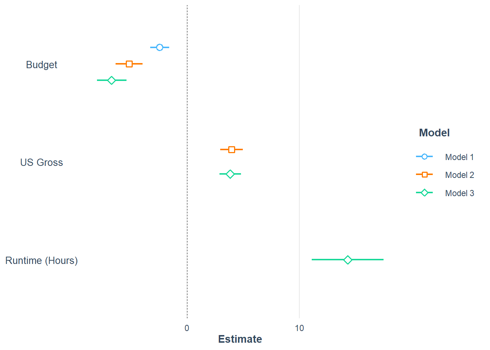


``` r
plot_summs(
  fit_c,
  robust = "HC3",
  coefs = coef_names_plot,
  plot.distributions = TRUE
)
```

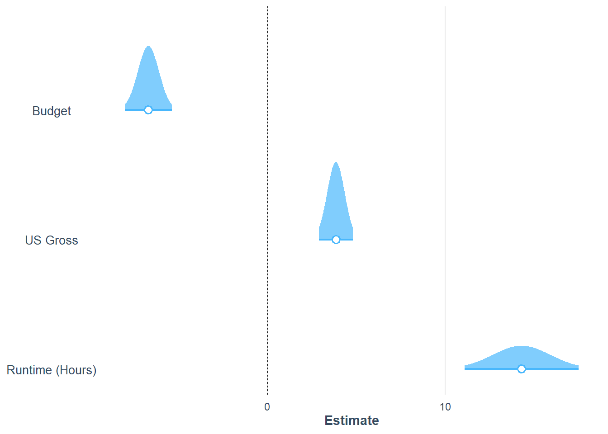

### Coefficient Uncertainty and Distribution

Visualize uncertainty with either frequentist or Bayesian approaches. With frequentist OLS, we can simulate coefficient draws from the asymptotic sampling distribution using the estimated variance-covariance matrix and then plot with `ggplot2`.


``` r
# Simulate coefficient draws (multivariate normal approx)
if (requireNamespace("MASS", quietly = TRUE)) {
  V <- vcovHC(fit_c, type = "HC3")
  b <- coef(fit_c)
  draws <- MASS::mvrnorm(n = 5000, mu = b, Sigma = V)
  draws_df <- as.data.frame(draws) %>% 
    select(`log1p(budget)`, `log1p(us_gross)`, runtime)

  draws_long <- tidyr::pivot_longer(draws_df, everything(), names_to = "term", values_to = "beta")

  ggplot(draws_long, aes(beta)) +
    facet_wrap(~ term, scales = "free") +
    geom_density(fill = "#6baed6", alpha = 0.6) +
    geom_vline(xintercept = 0, linetype = 2) +
    labs(title = "Sampling Distributions of Selected Coefficients (HC3)",
         x = "Coefficient value", y = "Density") +
    theme_bw(base_size = 12)
}
```

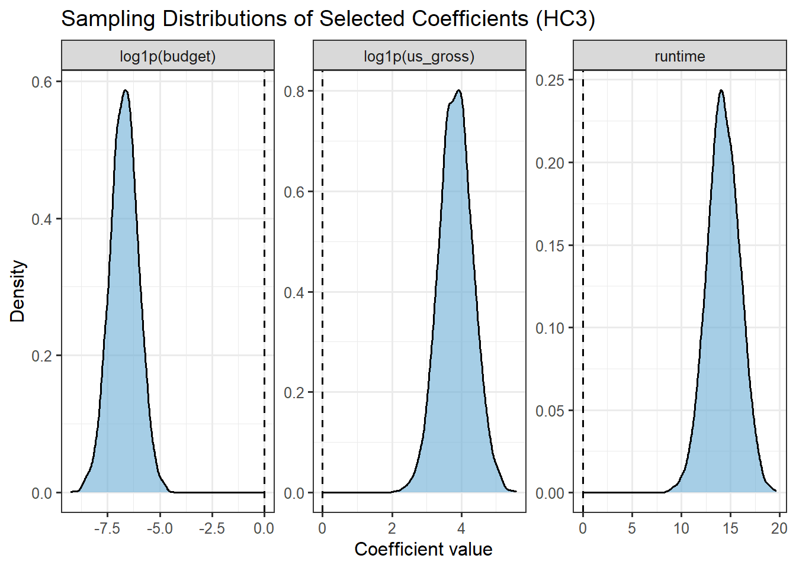

## Descriptive Tables

Produce journal-quality descriptives and regression tables. Below are multiple options to match target outlet styles (APA, AER, WSJ, etc.)


``` r
# Example with gtsummary: one-table overview
if (requireNamespace("gtsummary", quietly = TRUE)) {
  library(gtsummary)
  movies_small %>%
    mutate(
      across(c(budget, us_gross), log1p),
      score_group = cut(metascore, 
                       breaks = quantile(metascore, probs = c(0, .5, 1)),
                       include.lowest = TRUE, 
                       labels = c("Low score", "High score"))
    ) %>%
    select(metascore, budget, us_gross, runtime, year, score_group) %>%
    tbl_summary(
      by = score_group,
      statistic = list(all_continuous() ~ "{mean} ({sd})"),
      digits = all_continuous() ~ 1
    ) %>%
    add_overall() %>%
    add_p() %>%
    bold_labels()
}
```


```{=html}
<div id="vycmnxhdta" style="padding-left:0px;padding-right:0px;padding-top:10px;padding-bottom:10px;overflow-x:auto;overflow-y:auto;width:auto;height:auto;">
<style>#vycmnxhdta table {
  font-family: system-ui, 'Segoe UI', Roboto, Helvetica, Arial, sans-serif, 'Apple Color Emoji', 'Segoe UI Emoji', 'Segoe UI Symbol', 'Noto Color Emoji';
  -webkit-font-smoothing: antialiased;
  -moz-osx-font-smoothing: grayscale;
}

#vycmnxhdta thead, #vycmnxhdta tbody, #vycmnxhdta tfoot, #vycmnxhdta tr, #vycmnxhdta td, #vycmnxhdta th {
  border-style: none;
}

#vycmnxhdta p {
  margin: 0;
  padding: 0;
}

#vycmnxhdta .gt_table {
  display: table;
  border-collapse: collapse;
  line-height: normal;
  margin-left: auto;
  margin-right: auto;
  color: #333333;
  font-size: 16px;
  font-weight: normal;
  font-style: normal;
  background-color: #FFFFFF;
  width: auto;
  border-top-style: solid;
  border-top-width: 2px;
  border-top-color: #A8A8A8;
  border-right-style: none;
  border-right-width: 2px;
  border-right-color: #D3D3D3;
  border-bottom-style: solid;
  border-bottom-width: 2px;
  border-bottom-color: #A8A8A8;
  border-left-style: none;
  border-left-width: 2px;
  border-left-color: #D3D3D3;
}

#vycmnxhdta .gt_caption {
  padding-top: 4px;
  padding-bottom: 4px;
}

#vycmnxhdta .gt_title {
  color: #333333;
  font-size: 125%;
  font-weight: initial;
  padding-top: 4px;
  padding-bottom: 4px;
  padding-left: 5px;
  padding-right: 5px;
  border-bottom-color: #FFFFFF;
  border-bottom-width: 0;
}

#vycmnxhdta .gt_subtitle {
  color: #333333;
  font-size: 85%;
  font-weight: initial;
  padding-top: 3px;
  padding-bottom: 5px;
  padding-left: 5px;
  padding-right: 5px;
  border-top-color: #FFFFFF;
  border-top-width: 0;
}

#vycmnxhdta .gt_heading {
  background-color: #FFFFFF;
  text-align: center;
  border-bottom-color: #FFFFFF;
  border-left-style: none;
  border-left-width: 1px;
  border-left-color: #D3D3D3;
  border-right-style: none;
  border-right-width: 1px;
  border-right-color: #D3D3D3;
}

#vycmnxhdta .gt_bottom_border {
  border-bottom-style: solid;
  border-bottom-width: 2px;
  border-bottom-color: #D3D3D3;
}

#vycmnxhdta .gt_col_headings {
  border-top-style: solid;
  border-top-width: 2px;
  border-top-color: #D3D3D3;
  border-bottom-style: solid;
  border-bottom-width: 2px;
  border-bottom-color: #D3D3D3;
  border-left-style: none;
  border-left-width: 1px;
  border-left-color: #D3D3D3;
  border-right-style: none;
  border-right-width: 1px;
  border-right-color: #D3D3D3;
}

#vycmnxhdta .gt_col_heading {
  color: #333333;
  background-color: #FFFFFF;
  font-size: 100%;
  font-weight: normal;
  text-transform: inherit;
  border-left-style: none;
  border-left-width: 1px;
  border-left-color: #D3D3D3;
  border-right-style: none;
  border-right-width: 1px;
  border-right-color: #D3D3D3;
  vertical-align: bottom;
  padding-top: 5px;
  padding-bottom: 6px;
  padding-left: 5px;
  padding-right: 5px;
  overflow-x: hidden;
}

#vycmnxhdta .gt_column_spanner_outer {
  color: #333333;
  background-color: #FFFFFF;
  font-size: 100%;
  font-weight: normal;
  text-transform: inherit;
  padding-top: 0;
  padding-bottom: 0;
  padding-left: 4px;
  padding-right: 4px;
}

#vycmnxhdta .gt_column_spanner_outer:first-child {
  padding-left: 0;
}

#vycmnxhdta .gt_column_spanner_outer:last-child {
  padding-right: 0;
}

#vycmnxhdta .gt_column_spanner {
  border-bottom-style: solid;
  border-bottom-width: 2px;
  border-bottom-color: #D3D3D3;
  vertical-align: bottom;
  padding-top: 5px;
  padding-bottom: 5px;
  overflow-x: hidden;
  display: inline-block;
  width: 100%;
}

#vycmnxhdta .gt_spanner_row {
  border-bottom-style: hidden;
}

#vycmnxhdta .gt_group_heading {
  padding-top: 8px;
  padding-bottom: 8px;
  padding-left: 5px;
  padding-right: 5px;
  color: #333333;
  background-color: #FFFFFF;
  font-size: 100%;
  font-weight: initial;
  text-transform: inherit;
  border-top-style: solid;
  border-top-width: 2px;
  border-top-color: #D3D3D3;
  border-bottom-style: solid;
  border-bottom-width: 2px;
  border-bottom-color: #D3D3D3;
  border-left-style: none;
  border-left-width: 1px;
  border-left-color: #D3D3D3;
  border-right-style: none;
  border-right-width: 1px;
  border-right-color: #D3D3D3;
  vertical-align: middle;
  text-align: left;
}

#vycmnxhdta .gt_empty_group_heading {
  padding: 0.5px;
  color: #333333;
  background-color: #FFFFFF;
  font-size: 100%;
  font-weight: initial;
  border-top-style: solid;
  border-top-width: 2px;
  border-top-color: #D3D3D3;
  border-bottom-style: solid;
  border-bottom-width: 2px;
  border-bottom-color: #D3D3D3;
  vertical-align: middle;
}

#vycmnxhdta .gt_from_md > :first-child {
  margin-top: 0;
}

#vycmnxhdta .gt_from_md > :last-child {
  margin-bottom: 0;
}

#vycmnxhdta .gt_row {
  padding-top: 8px;
  padding-bottom: 8px;
  padding-left: 5px;
  padding-right: 5px;
  margin: 10px;
  border-top-style: solid;
  border-top-width: 1px;
  border-top-color: #D3D3D3;
  border-left-style: none;
  border-left-width: 1px;
  border-left-color: #D3D3D3;
  border-right-style: none;
  border-right-width: 1px;
  border-right-color: #D3D3D3;
  vertical-align: middle;
  overflow-x: hidden;
}

#vycmnxhdta .gt_stub {
  color: #333333;
  background-color: #FFFFFF;
  font-size: 100%;
  font-weight: initial;
  text-transform: inherit;
  border-right-style: solid;
  border-right-width: 2px;
  border-right-color: #D3D3D3;
  padding-left: 5px;
  padding-right: 5px;
}

#vycmnxhdta .gt_stub_row_group {
  color: #333333;
  background-color: #FFFFFF;
  font-size: 100%;
  font-weight: initial;
  text-transform: inherit;
  border-right-style: solid;
  border-right-width: 2px;
  border-right-color: #D3D3D3;
  padding-left: 5px;
  padding-right: 5px;
  vertical-align: top;
}

#vycmnxhdta .gt_row_group_first td {
  border-top-width: 2px;
}

#vycmnxhdta .gt_row_group_first th {
  border-top-width: 2px;
}

#vycmnxhdta .gt_summary_row {
  color: #333333;
  background-color: #FFFFFF;
  text-transform: inherit;
  padding-top: 8px;
  padding-bottom: 8px;
  padding-left: 5px;
  padding-right: 5px;
}

#vycmnxhdta .gt_first_summary_row {
  border-top-style: solid;
  border-top-color: #D3D3D3;
}

#vycmnxhdta .gt_first_summary_row.thick {
  border-top-width: 2px;
}

#vycmnxhdta .gt_last_summary_row {
  padding-top: 8px;
  padding-bottom: 8px;
  padding-left: 5px;
  padding-right: 5px;
  border-bottom-style: solid;
  border-bottom-width: 2px;
  border-bottom-color: #D3D3D3;
}

#vycmnxhdta .gt_grand_summary_row {
  color: #333333;
  background-color: #FFFFFF;
  text-transform: inherit;
  padding-top: 8px;
  padding-bottom: 8px;
  padding-left: 5px;
  padding-right: 5px;
}

#vycmnxhdta .gt_first_grand_summary_row {
  padding-top: 8px;
  padding-bottom: 8px;
  padding-left: 5px;
  padding-right: 5px;
  border-top-style: double;
  border-top-width: 6px;
  border-top-color: #D3D3D3;
}

#vycmnxhdta .gt_last_grand_summary_row_top {
  padding-top: 8px;
  padding-bottom: 8px;
  padding-left: 5px;
  padding-right: 5px;
  border-bottom-style: double;
  border-bottom-width: 6px;
  border-bottom-color: #D3D3D3;
}

#vycmnxhdta .gt_striped {
  background-color: rgba(128, 128, 128, 0.05);
}

#vycmnxhdta .gt_table_body {
  border-top-style: solid;
  border-top-width: 2px;
  border-top-color: #D3D3D3;
  border-bottom-style: solid;
  border-bottom-width: 2px;
  border-bottom-color: #D3D3D3;
}

#vycmnxhdta .gt_footnotes {
  color: #333333;
  background-color: #FFFFFF;
  border-bottom-style: none;
  border-bottom-width: 2px;
  border-bottom-color: #D3D3D3;
  border-left-style: none;
  border-left-width: 2px;
  border-left-color: #D3D3D3;
  border-right-style: none;
  border-right-width: 2px;
  border-right-color: #D3D3D3;
}

#vycmnxhdta .gt_footnote {
  margin: 0px;
  font-size: 90%;
  padding-top: 4px;
  padding-bottom: 4px;
  padding-left: 5px;
  padding-right: 5px;
}

#vycmnxhdta .gt_sourcenotes {
  color: #333333;
  background-color: #FFFFFF;
  border-bottom-style: none;
  border-bottom-width: 2px;
  border-bottom-color: #D3D3D3;
  border-left-style: none;
  border-left-width: 2px;
  border-left-color: #D3D3D3;
  border-right-style: none;
  border-right-width: 2px;
  border-right-color: #D3D3D3;
}

#vycmnxhdta .gt_sourcenote {
  font-size: 90%;
  padding-top: 4px;
  padding-bottom: 4px;
  padding-left: 5px;
  padding-right: 5px;
}

#vycmnxhdta .gt_left {
  text-align: left;
}

#vycmnxhdta .gt_center {
  text-align: center;
}

#vycmnxhdta .gt_right {
  text-align: right;
  font-variant-numeric: tabular-nums;
}

#vycmnxhdta .gt_font_normal {
  font-weight: normal;
}

#vycmnxhdta .gt_font_bold {
  font-weight: bold;
}

#vycmnxhdta .gt_font_italic {
  font-style: italic;
}

#vycmnxhdta .gt_super {
  font-size: 65%;
}

#vycmnxhdta .gt_footnote_marks {
  font-size: 75%;
  vertical-align: 0.4em;
  position: initial;
}

#vycmnxhdta .gt_asterisk {
  font-size: 100%;
  vertical-align: 0;
}

#vycmnxhdta .gt_indent_1 {
  text-indent: 5px;
}

#vycmnxhdta .gt_indent_2 {
  text-indent: 10px;
}

#vycmnxhdta .gt_indent_3 {
  text-indent: 15px;
}

#vycmnxhdta .gt_indent_4 {
  text-indent: 20px;
}

#vycmnxhdta .gt_indent_5 {
  text-indent: 25px;
}

#vycmnxhdta .katex-display {
  display: inline-flex !important;
  margin-bottom: 0.75em !important;
}

#vycmnxhdta div.Reactable > div.rt-table > div.rt-thead > div.rt-tr.rt-tr-group-header > div.rt-th-group:after {
  height: 0px !important;
}
</style>
<table class="gt_table" data-quarto-disable-processing="false" data-quarto-bootstrap="false">
  <thead>
    <tr class="gt_col_headings">
      <th class="gt_col_heading gt_columns_bottom_border gt_left" rowspan="1" colspan="1" scope="col" id="label"><span class='gt_from_md'><strong>Characteristic</strong></span></th>
      <th class="gt_col_heading gt_columns_bottom_border gt_center" rowspan="1" colspan="1" scope="col" id="stat_0"><span class='gt_from_md'><strong>Overall</strong><br />
N = 831</span><span class="gt_footnote_marks" style="white-space:nowrap;font-style:italic;font-weight:normal;line-height:0;"><sup>1</sup></span></th>
      <th class="gt_col_heading gt_columns_bottom_border gt_center" rowspan="1" colspan="1" scope="col" id="stat_1"><span class='gt_from_md'><strong>Low score</strong><br />
N = 431</span><span class="gt_footnote_marks" style="white-space:nowrap;font-style:italic;font-weight:normal;line-height:0;"><sup>1</sup></span></th>
      <th class="gt_col_heading gt_columns_bottom_border gt_center" rowspan="1" colspan="1" scope="col" id="stat_2"><span class='gt_from_md'><strong>High score</strong><br />
N = 400</span><span class="gt_footnote_marks" style="white-space:nowrap;font-style:italic;font-weight:normal;line-height:0;"><sup>1</sup></span></th>
      <th class="gt_col_heading gt_columns_bottom_border gt_center" rowspan="1" colspan="1" scope="col" id="p.value"><span class='gt_from_md'><strong>p-value</strong></span><span class="gt_footnote_marks" style="white-space:nowrap;font-style:italic;font-weight:normal;line-height:0;"><sup>2</sup></span></th>
    </tr>
  </thead>
  <tbody class="gt_table_body">
    <tr><td headers="label" class="gt_row gt_left" style="font-weight: bold;">metascore</td>
<td headers="stat_0" class="gt_row gt_center">63.0 (16.9)</td>
<td headers="stat_1" class="gt_row gt_center">50.0 (11.3)</td>
<td headers="stat_2" class="gt_row gt_center">77.1 (8.7)</td>
<td headers="p.value" class="gt_row gt_center"><0.001</td></tr>
    <tr><td headers="label" class="gt_row gt_left" style="font-weight: bold;">budget</td>
<td headers="stat_0" class="gt_row gt_center">17.4 (1.2)</td>
<td headers="stat_1" class="gt_row gt_center">17.7 (0.9)</td>
<td headers="stat_2" class="gt_row gt_center">17.2 (1.3)</td>
<td headers="p.value" class="gt_row gt_center"><0.001</td></tr>
    <tr><td headers="label" class="gt_row gt_left" style="font-weight: bold;">us_gross</td>
<td headers="stat_0" class="gt_row gt_center">17.9 (1.4)</td>
<td headers="stat_1" class="gt_row gt_center">17.9 (1.2)</td>
<td headers="stat_2" class="gt_row gt_center">18.0 (1.5)</td>
<td headers="p.value" class="gt_row gt_center">0.3</td></tr>
    <tr><td headers="label" class="gt_row gt_left" style="font-weight: bold;">runtime</td>
<td headers="stat_0" class="gt_row gt_center">1.9 (0.4)</td>
<td headers="stat_1" class="gt_row gt_center">1.9 (0.3)</td>
<td headers="stat_2" class="gt_row gt_center">2.0 (0.4)</td>
<td headers="p.value" class="gt_row gt_center">0.004</td></tr>
    <tr><td headers="label" class="gt_row gt_left" style="font-weight: bold;">year</td>
<td headers="stat_0" class="gt_row gt_center">2,002.2 (9.0)</td>
<td headers="stat_1" class="gt_row gt_center">2,003.0 (8.0)</td>
<td headers="stat_2" class="gt_row gt_center">2,001.3 (9.9)</td>
<td headers="p.value" class="gt_row gt_center">0.056</td></tr>
  </tbody>
  <tfoot>
    <tr class="gt_footnotes">
      <td class="gt_footnote" colspan="5"><span class="gt_footnote_marks" style="white-space:nowrap;font-style:italic;font-weight:normal;line-height:0;"><sup>1</sup></span> <span class='gt_from_md'>Mean (SD)</span></td>
    </tr>
    <tr class="gt_footnotes">
      <td class="gt_footnote" colspan="5"><span class="gt_footnote_marks" style="white-space:nowrap;font-style:italic;font-weight:normal;line-height:0;"><sup>2</sup></span> <span class='gt_from_md'>Wilcoxon rank sum test</span></td>
    </tr>
  </tfoot>
</table>
</div>
```


``` r
# modelsummary example
if (requireNamespace("modelsummary", quietly = TRUE)) {
  library(modelsummary)
  lm_mod <- lm(mpg ~ wt + hp + cyl, mtcars)
  msummary(lm_mod, vcov = c("iid","robust","HC4"))
  modelplot(lm_mod, vcov = c("iid","robust","HC4"))
}
```


``` r
# stargazer examples, including correlation and ASCII output
if (requireNamespace("stargazer", quietly = TRUE)) {
  library(stargazer)
  stargazer(attitude)

  linear.1 <- lm(rating ~ complaints + privileges + learning + raises + critical, data = attitude)
  linear.2 <- lm(rating ~ complaints + privileges + learning, data = attitude)

  attitude$high.rating <- (attitude$rating > 70)
  probit.model <- glm(high.rating ~ learning + critical + advance,
                      data = attitude,
                      family = binomial(link = "probit"))

  stargazer(linear.1, linear.2, probit.model,
            title = "Results",
            align = TRUE)

  # ASCII text output with CI
  stargazer(
    linear.1,
    linear.2,
    type = "text",
    title = "Regression Results",
    dep.var.labels = c("Overall Rating", "High Rating"),
    covariate.labels = c(
      "Handling of Complaints",
      "No Special Privileges",
      "Opportunity to Learn",
      "Performance-Based Raises",
      "Too Critical",
      "Advancement"
    ),
    omit.stat = c("LL", "ser", "f"),
    ci = TRUE,
    ci.level = 0.90,
    single.row = TRUE
  )

  # Correlation table
  correlation.matrix <- cor(attitude[, c("rating", "complaints", "privileges")])
  stargazer(correlation.matrix, title = "Correlation Matrix")
}
#> 
#> % Table created by stargazer v.5.2.3 by Marek Hlavac, Social Policy Institute. E-mail: marek.hlavac at gmail.com
#> % Date and time: Mon, Nov 03, 2025 - 8:30:37 PM
#> \begin{table}[!htbp] \centering 
#>   \caption{} 
#>   \label{} 
#> \begin{tabular}{@{\extracolsep{5pt}}lccccc} 
#> \\[-1.8ex]\hline 
#> \hline \\[-1.8ex] 
#> Statistic & \multicolumn{1}{c}{N} & \multicolumn{1}{c}{Mean} & \multicolumn{1}{c}{St. Dev.} & \multicolumn{1}{c}{Min} & \multicolumn{1}{c}{Max} \\ 
#> \hline \\[-1.8ex] 
#> rating & 30 & 64.633 & 12.173 & 40 & 85 \\ 
#> complaints & 30 & 66.600 & 13.315 & 37 & 90 \\ 
#> privileges & 30 & 53.133 & 12.235 & 30 & 83 \\ 
#> learning & 30 & 56.367 & 11.737 & 34 & 75 \\ 
#> raises & 30 & 64.633 & 10.397 & 43 & 88 \\ 
#> critical & 30 & 74.767 & 9.895 & 49 & 92 \\ 
#> advance & 30 & 42.933 & 10.289 & 25 & 72 \\ 
#> \hline \\[-1.8ex] 
#> \end{tabular} 
#> \end{table} 
#> 
#> % Table created by stargazer v.5.2.3 by Marek Hlavac, Social Policy Institute. E-mail: marek.hlavac at gmail.com
#> % Date and time: Mon, Nov 03, 2025 - 8:30:37 PM
#> % Requires LaTeX packages: dcolumn 
#> \begin{table}[!htbp] \centering 
#>   \caption{Results} 
#>   \label{} 
#> \begin{tabular}{@{\extracolsep{5pt}}lD{.}{.}{-3} D{.}{.}{-3} D{.}{.}{-3} } 
#> \\[-1.8ex]\hline 
#> \hline \\[-1.8ex] 
#>  & \multicolumn{3}{c}{\textit{Dependent variable:}} \\ 
#> \cline{2-4} 
#> \\[-1.8ex] & \multicolumn{2}{c}{rating} & \multicolumn{1}{c}{high.rating} \\ 
#> \\[-1.8ex] & \multicolumn{2}{c}{\textit{OLS}} & \multicolumn{1}{c}{\textit{probit}} \\ 
#> \\[-1.8ex] & \multicolumn{1}{c}{(1)} & \multicolumn{1}{c}{(2)} & \multicolumn{1}{c}{(3)}\\ 
#> \hline \\[-1.8ex] 
#>  complaints & 0.692^{***} & 0.682^{***} &  \\ 
#>   & (0.149) & (0.129) &  \\ 
#>   & & & \\ 
#>  privileges & -0.104 & -0.103 &  \\ 
#>   & (0.135) & (0.129) &  \\ 
#>   & & & \\ 
#>  learning & 0.249 & 0.238^{*} & 0.164^{***} \\ 
#>   & (0.160) & (0.139) & (0.053) \\ 
#>   & & & \\ 
#>  raises & -0.033 &  &  \\ 
#>   & (0.202) &  &  \\ 
#>   & & & \\ 
#>  critical & 0.015 &  & -0.001 \\ 
#>   & (0.147) &  & (0.044) \\ 
#>   & & & \\ 
#>  advance &  &  & -0.062 \\ 
#>   &  &  & (0.042) \\ 
#>   & & & \\ 
#>  Constant & 11.011 & 11.258 & -7.476^{**} \\ 
#>   & (11.704) & (7.318) & (3.570) \\ 
#>   & & & \\ 
#> \hline \\[-1.8ex] 
#> Observations & \multicolumn{1}{c}{30} & \multicolumn{1}{c}{30} & \multicolumn{1}{c}{30} \\ 
#> R$^{2}$ & \multicolumn{1}{c}{0.715} & \multicolumn{1}{c}{0.715} &  \\ 
#> Adjusted R$^{2}$ & \multicolumn{1}{c}{0.656} & \multicolumn{1}{c}{0.682} &  \\ 
#> Log Likelihood &  &  & \multicolumn{1}{c}{-9.087} \\ 
#> Akaike Inf. Crit. &  &  & \multicolumn{1}{c}{26.175} \\ 
#> Residual Std. Error & \multicolumn{1}{c}{7.139 (df = 24)} & \multicolumn{1}{c}{6.863 (df = 26)} &  \\ 
#> F Statistic & \multicolumn{1}{c}{12.063$^{***}$ (df = 5; 24)} & \multicolumn{1}{c}{21.743$^{***}$ (df = 3; 26)} &  \\ 
#> \hline 
#> \hline \\[-1.8ex] 
#> \textit{Note:}  & \multicolumn{3}{r}{$^{*}$p$<$0.1; $^{**}$p$<$0.05; $^{***}$p$<$0.01} \\ 
#> \end{tabular} 
#> \end{table} 
#> 
#> Regression Results
#> ========================================================================
#>                                        Dependent variable:              
#>                          -----------------------------------------------
#>                                          Overall Rating                 
#>                                    (1)                     (2)          
#> ------------------------------------------------------------------------
#> Handling of Complaints   0.692*** (0.447, 0.937) 0.682*** (0.470, 0.894)
#> No Special Privileges    -0.104 (-0.325, 0.118)  -0.103 (-0.316, 0.109) 
#> Opportunity to Learn      0.249 (-0.013, 0.512)   0.238* (0.009, 0.467) 
#> Performance-Based Raises -0.033 (-0.366, 0.299)                         
#> Too Critical              0.015 (-0.227, 0.258)                         
#> Advancement              11.011 (-8.240, 30.262) 11.258 (-0.779, 23.296)
#> ------------------------------------------------------------------------
#> Observations                       30                      30           
#> R2                                0.715                   0.715         
#> Adjusted R2                       0.656                   0.682         
#> ========================================================================
#> Note:                                        *p<0.1; **p<0.05; ***p<0.01
#> 
#> % Table created by stargazer v.5.2.3 by Marek Hlavac, Social Policy Institute. E-mail: marek.hlavac at gmail.com
#> % Date and time: Mon, Nov 03, 2025 - 8:30:37 PM
#> \begin{table}[!htbp] \centering 
#>   \caption{Correlation Matrix} 
#>   \label{} 
#> \begin{tabular}{@{\extracolsep{5pt}} cccc} 
#> \\[-1.8ex]\hline 
#> \hline \\[-1.8ex] 
#>  & rating & complaints & privileges \\ 
#> \hline \\[-1.8ex] 
#> rating & $1$ & $0.825$ & $0.426$ \\ 
#> complaints & $0.825$ & $1$ & $0.558$ \\ 
#> privileges & $0.426$ & $0.558$ & $1$ \\ 
#> \hline \\[-1.8ex] 
#> \end{tabular} 
#> \end{table}
```


``` r
# LaTeX output (uncomment to use)
stargazer(
  linear.1,
  linear.2,
  probit.model,
  title = "Regression Results",
  align = TRUE,
  dep.var.labels = c("Overall Rating", "High Rating"),
  covariate.labels = c(
    "Handling of Complaints",
    "No Special Privileges",
    "Opportunity to Learn",
    "Performance-Based Raises",
    "Too Critical",
    "Advancement"
  ),
  omit.stat = c("LL", "ser", "f"),
  no.space = TRUE
)
```

### Export APA theme (flextable)

Below creates an APA-like table for a subset of `mtcars`.


``` r
data("mtcars")
library(flextable)
theme_apa(flextable(mtcars[1:5,1:5]))
```

You can export data frames to LaTeX via `xtable` and ready-made styles via `stargazer`. (Ensure output directory exists.)


``` r
print(xtable::xtable(mtcars, type = "latex"),
      file = file.path(getwd(), "output", "mtcars_xtable.tex"))

# American Economic Review style
stargazer::stargazer(
  mtcars,
  title = "Testing",
  style = "aer",
  out = file.path(getwd(), "output", "mtcars_stargazer.tex")
)
```

However, some exporters don't play well with **table notes**. Below is a custom function following AMA-style notes placement.


``` r
ama_tbl <- function(data, caption, label, note, output_path) {
  library(tidyverse)
  library(xtable)
  # Function to determine column alignment
  get_column_alignment <- function(data) {
    # xtable align requires length ncol + 1; first is for rownames
    alignment <- c("l", "l")
    for (col in seq_len(ncol(data))[-1]) {
      if (is.numeric(data[[col]])) {
        alignment <- c(alignment, "r")
      } else {
        alignment <- c(alignment, "c")
      }
    }
    alignment
  }

  data %>%
    # bold + left align first column 
    rename_with(~paste0("\\\\multicolumn{1}{l}{\\\\textbf{", ., "}}"), 1) %>% 
    # bold + center align all other columns
    `colnames<-`(ifelse(colnames(.) != colnames(.)[1],
                        paste0("\\\\multicolumn{1}{c}{\\\\textbf{", colnames(.), "}}"),
                        colnames(.))) %>% 
    xtable(caption = caption,
           label = label,
           align = get_column_alignment(data),
           auto = TRUE) %>%
    print(
      include.rownames = FALSE,
      caption.placement = "top",
      hline.after = c(-1, 0),
      add.to.row = list(
        pos = list(nrow(data)),
        command = c(
          paste0("\\\\hline \n \\\\multicolumn{", ncol(data),
                 "}{l}{ \n \\\\begin{tabular}{@{}p{0.9\\\\linewidth}@{}} \n",
                 "Note: ", note, "\n \\\\end{tabular} } \n")
        )
      ),
      sanitize.colnames.function = identity,
      table.placement = "h",
      file = output_path
    )
}
```


``` r
ama_tbl(
  mtcars,
  caption     = "This is caption",
  label       = "tab:this_is_label",
  note        = "this is note",
  output_path = file.path(getwd(), "output", "mtcars_custom_ama.tex")
)
```

## Visualizations & Plots

Customize plots to match target journal aesthetics. Below we provide an **American Marketing Association--ready** theme and examples. (Change fonts on your system as needed.)


``` r
# Base ggplot setup
library(ggplot2)
```


``` r
# AMA-inspired theme (serif base, clean grid)
amatheme <- theme_bw(base_size = 14, base_family = "serif") +
  theme(
    panel.grid.major   = element_blank(),
    panel.grid.minor   = element_blank(),
    panel.border       = element_blank(),
    line               = element_line(),
    text               = element_text(),
    legend.title       = element_text(size = rel(0.6), face = "bold"),
    legend.text        = element_text(size = rel(0.6)),
    legend.background  = element_rect(color = "black"),
    plot.title         = element_text(
      size   = rel(1.2),
      face   = "bold",
      hjust  = 0.5,
      margin = margin(b = 15)
    ),
    plot.margin        = unit(c(1, 1, 1, 1), "cm"),
    axis.line          = element_line(colour = "black", linewidth = .8),
    axis.ticks         = element_line(),
    axis.title.x       = element_text(size = rel(1.2), face = "bold"),
    axis.title.y       = element_text(size = rel(1.2), face = "bold"),
    axis.text.y        = element_text(size = rel(1)),
    axis.text.x        = element_text(size = rel(1))
  )
```


``` r
# Example plot
library(tidyverse)
library(ggsci)
data("mtcars")

yourplot <- mtcars %>%
  select(mpg, cyl, gear) %>%
  ggplot(aes(x = mpg, y = cyl, color = factor(gear))) +
  geom_point(size = 2, alpha = .8) +
  labs(title = "Example Plot", x = "MPG", y = "Cylinders", color = "Gears")

yourplot + amatheme + scale_color_npg()
```

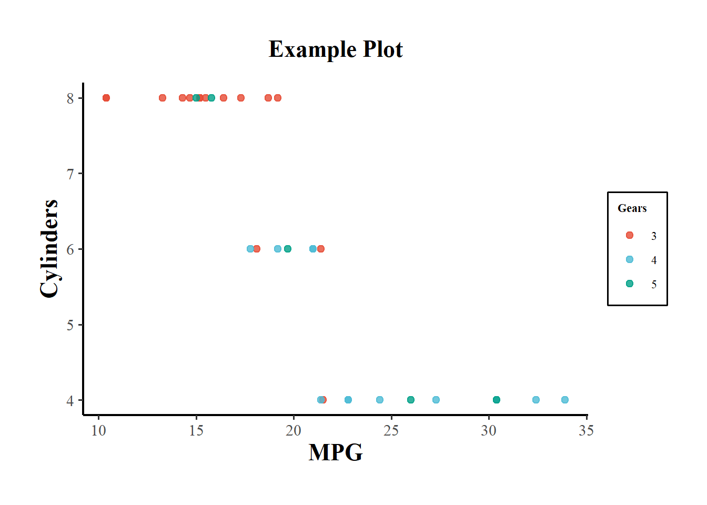


``` r
yourplot + amatheme + scale_color_viridis_d()
```

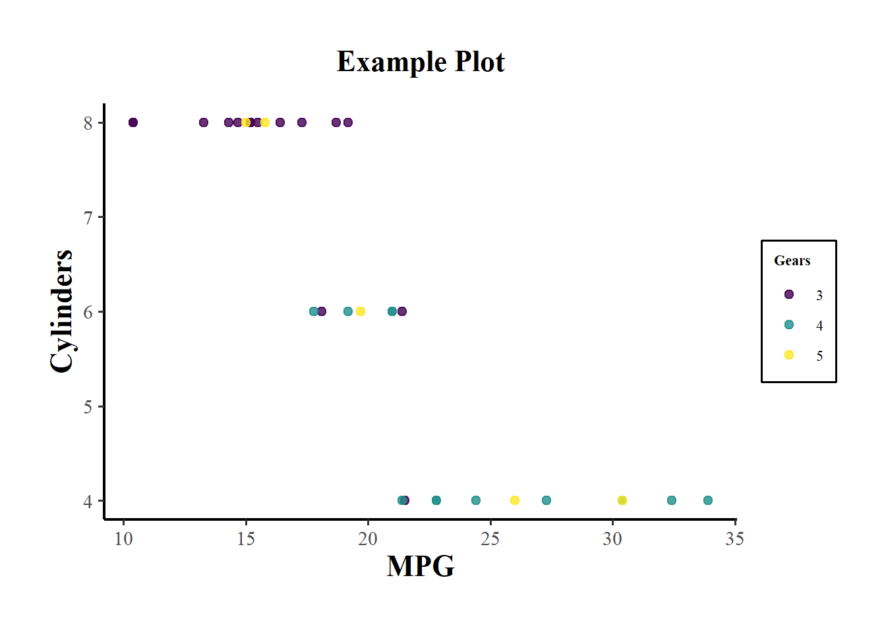


``` r
# Other pre-specified themes
library(ggthemes)

yourplot + theme_stata()
```

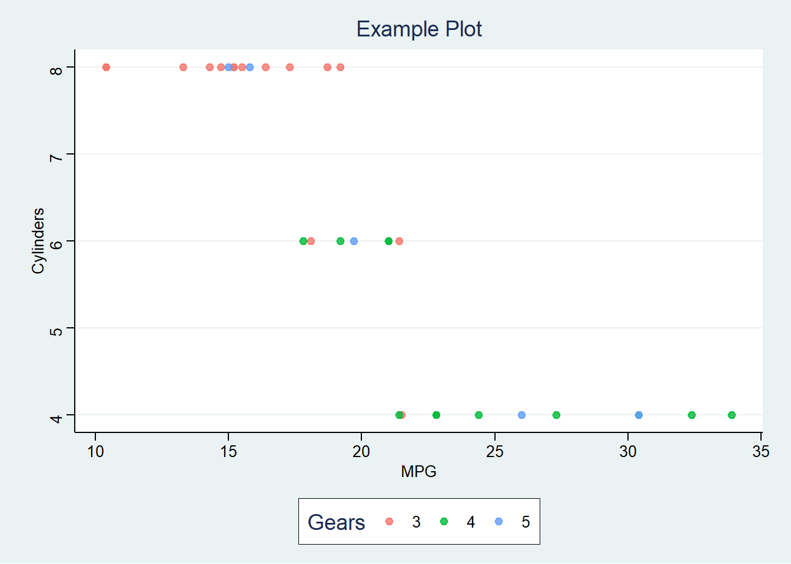

``` r
yourplot + theme_economist()
```

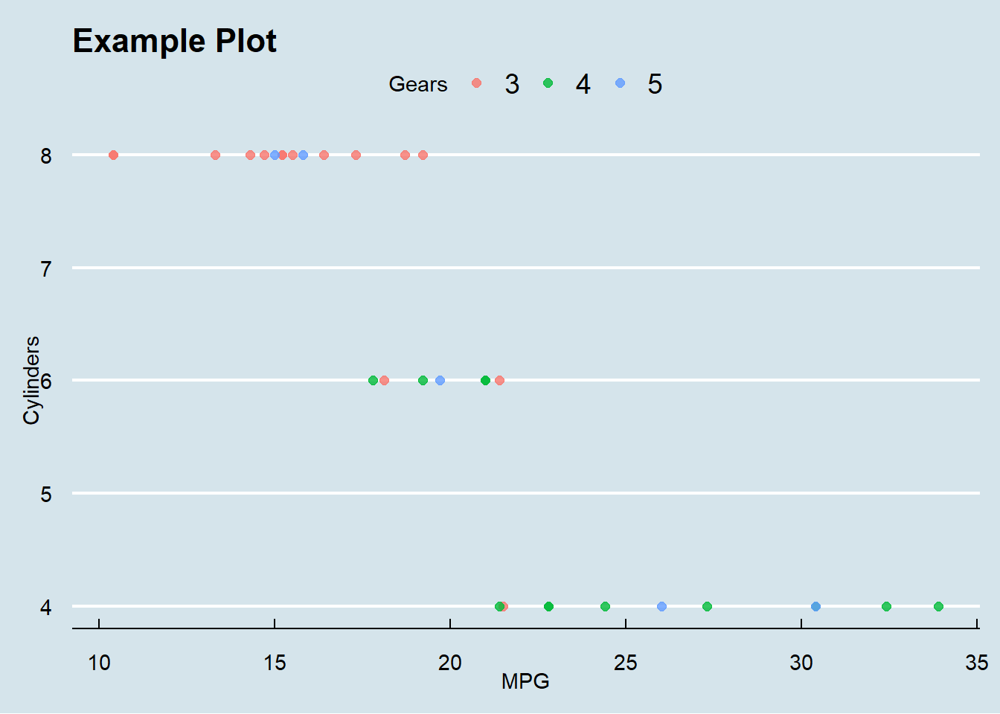

``` r
yourplot + theme_economist_white()
```

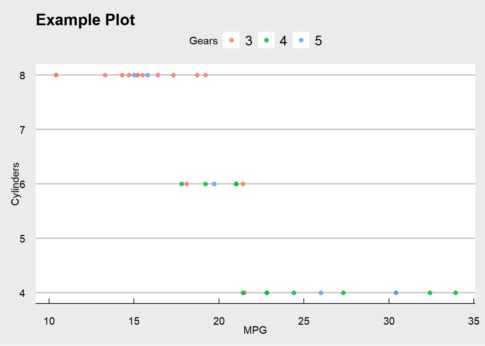

``` r
yourplot + theme_wsj()
```

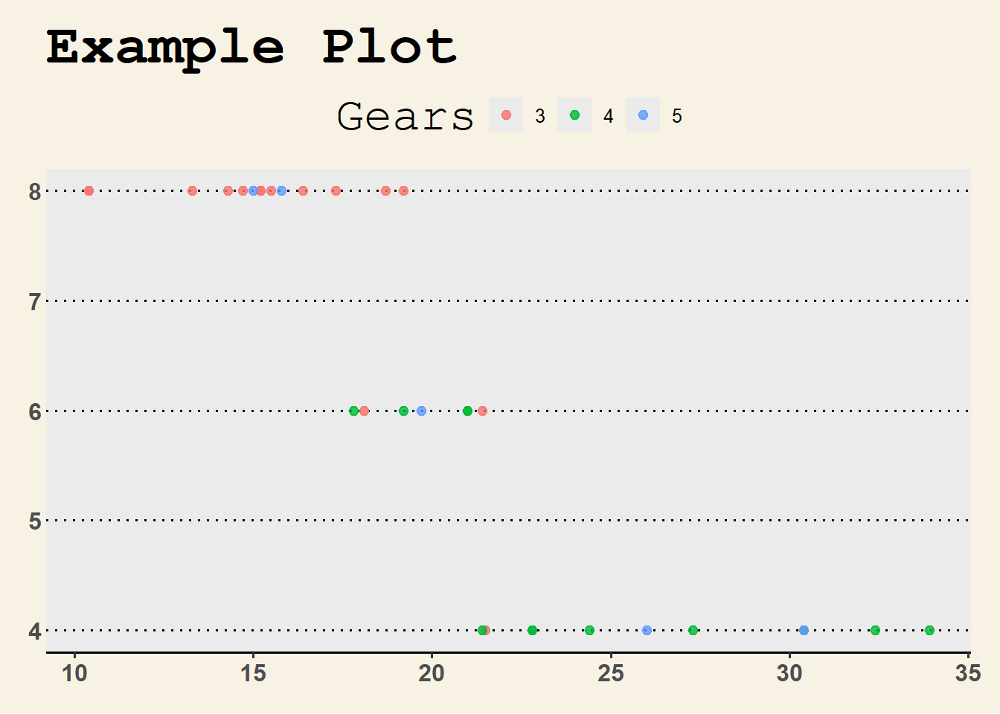

``` r

# APA-like theme from jtools
jtools::theme_apa(
  legend.font.size = 12,
  x.font.size = 12,
  y.font.size = 12
)
#> <theme> List of 144
#>  $ line                            : <ggplot2::element_line>
#>   ..@ colour       : chr "black"
#>   ..@ linewidth    : num 0.5
#>   ..@ linetype     : num 1
#>   ..@ lineend      : chr "butt"
#>   ..@ linejoin     : chr "round"
#>   ..@ arrow        : logi FALSE
#>   ..@ arrow.fill   : chr "black"
#>   ..@ inherit.blank: logi TRUE
#>  $ rect                            : <ggplot2::element_rect>
#>   ..@ fill         : chr "white"
#>   ..@ colour       : chr "black"
#>   ..@ linewidth    : num 0.5
#>   ..@ linetype     : num 1
#>   ..@ linejoin     : chr "round"
#>   ..@ inherit.blank: logi TRUE
#>  $ text                            : <ggplot2::element_text>
#>   ..@ family       : chr ""
#>   ..@ face         : chr "plain"
#>   ..@ italic       : chr NA
#>   ..@ fontweight   : num NA
#>   ..@ fontwidth    : num NA
#>   ..@ colour       : chr "black"
#>   ..@ size         : num 11
#>   ..@ hjust        : num 0.5
#>   ..@ vjust        : num 0.5
#>   ..@ angle        : num 0
#>   ..@ lineheight   : num 0.9
#>   ..@ margin       : <ggplot2::margin> num [1:4] 0 0 0 0
#>   ..@ debug        : logi FALSE
#>   ..@ inherit.blank: logi TRUE
#>  $ title                           : <ggplot2::element_text>
#>   ..@ family       : NULL
#>   ..@ face         : NULL
#>   ..@ italic       : chr NA
#>   ..@ fontweight   : num NA
#>   ..@ fontwidth    : num NA
#>   ..@ colour       : NULL
#>   ..@ size         : NULL
#>   ..@ hjust        : NULL
#>   ..@ vjust        : NULL
#>   ..@ angle        : NULL
#>   ..@ lineheight   : NULL
#>   ..@ margin       : NULL
#>   ..@ debug        : NULL
#>   ..@ inherit.blank: logi TRUE
#>  $ point                           : <ggplot2::element_point>
#>   ..@ colour       : chr "black"
#>   ..@ shape        : num 19
#>   ..@ size         : num 1.5
#>   ..@ fill         : chr "white"
#>   ..@ stroke       : num 0.5
#>   ..@ inherit.blank: logi TRUE
#>  $ polygon                         : <ggplot2::element_polygon>
#>   ..@ fill         : chr "white"
#>   ..@ colour       : chr "black"
#>   ..@ linewidth    : num 0.5
#>   ..@ linetype     : num 1
#>   ..@ linejoin     : chr "round"
#>   ..@ inherit.blank: logi TRUE
#>  $ geom                            : <ggplot2::element_geom>
#>   ..@ ink        : chr "black"
#>   ..@ paper      : chr "white"
#>   ..@ accent     : chr "#3366FF"
#>   ..@ linewidth  : num 0.5
#>   ..@ borderwidth: num 0.5
#>   ..@ linetype   : int 1
#>   ..@ bordertype : int 1
#>   ..@ family     : chr ""
#>   ..@ fontsize   : num 3.87
#>   ..@ pointsize  : num 1.5
#>   ..@ pointshape : num 19
#>   ..@ colour     : NULL
#>   ..@ fill       : NULL
#>  $ spacing                         : 'simpleUnit' num 5.5points
#>   ..- attr(*, "unit")= int 8
#>  $ margins                         : <ggplot2::margin> num [1:4] 5.5 5.5 5.5 5.5
#>  $ aspect.ratio                    : NULL
#>  $ axis.title                      : NULL
#>  $ axis.title.x                    : <ggplot2::element_text>
#>   ..@ family       : NULL
#>   ..@ face         : NULL
#>   ..@ italic       : chr NA
#>   ..@ fontweight   : num NA
#>   ..@ fontwidth    : num NA
#>   ..@ colour       : NULL
#>   ..@ size         : num 12
#>   ..@ hjust        : NULL
#>   ..@ vjust        : num 1
#>   ..@ angle        : NULL
#>   ..@ lineheight   : NULL
#>   ..@ margin       : <ggplot2::margin> num [1:4] 2.75 0 0 0
#>   ..@ debug        : NULL
#>   ..@ inherit.blank: logi FALSE
#>  $ axis.title.x.top                : <ggplot2::element_text>
#>   ..@ family       : NULL
#>   ..@ face         : NULL
#>   ..@ italic       : chr NA
#>   ..@ fontweight   : num NA
#>   ..@ fontwidth    : num NA
#>   ..@ colour       : NULL
#>   ..@ size         : NULL
#>   ..@ hjust        : NULL
#>   ..@ vjust        : num 0
#>   ..@ angle        : NULL
#>   ..@ lineheight   : NULL
#>   ..@ margin       : <ggplot2::margin> num [1:4] 0 0 2.75 0
#>   ..@ debug        : NULL
#>   ..@ inherit.blank: logi TRUE
#>  $ axis.title.x.bottom             : NULL
#>  $ axis.title.y                    : <ggplot2::element_text>
#>   ..@ family       : NULL
#>   ..@ face         : NULL
#>   ..@ italic       : chr NA
#>   ..@ fontweight   : num NA
#>   ..@ fontwidth    : num NA
#>   ..@ colour       : NULL
#>   ..@ size         : num 12
#>   ..@ hjust        : NULL
#>   ..@ vjust        : num 1
#>   ..@ angle        : num 90
#>   ..@ lineheight   : NULL
#>   ..@ margin       : <ggplot2::margin> num [1:4] 0 2.75 0 0
#>   ..@ debug        : NULL
#>   ..@ inherit.blank: logi FALSE
#>  $ axis.title.y.left               : NULL
#>  $ axis.title.y.right              : <ggplot2::element_text>
#>   ..@ family       : NULL
#>   ..@ face         : NULL
#>   ..@ italic       : chr NA
#>   ..@ fontweight   : num NA
#>   ..@ fontwidth    : num NA
#>   ..@ colour       : NULL
#>   ..@ size         : NULL
#>   ..@ hjust        : NULL
#>   ..@ vjust        : num 1
#>   ..@ angle        : num -90
#>   ..@ lineheight   : NULL
#>   ..@ margin       : <ggplot2::margin> num [1:4] 0 0 0 2.75
#>   ..@ debug        : NULL
#>   ..@ inherit.blank: logi TRUE
#>  $ axis.text                       : <ggplot2::element_text>
#>   ..@ family       : NULL
#>   ..@ face         : NULL
#>   ..@ italic       : chr NA
#>   ..@ fontweight   : num NA
#>   ..@ fontwidth    : num NA
#>   ..@ colour       : chr "#4D4D4DFF"
#>   ..@ size         : 'rel' num 0.8
#>   ..@ hjust        : NULL
#>   ..@ vjust        : NULL
#>   ..@ angle        : NULL
#>   ..@ lineheight   : NULL
#>   ..@ margin       : NULL
#>   ..@ debug        : NULL
#>   ..@ inherit.blank: logi TRUE
#>  $ axis.text.x                     : <ggplot2::element_text>
#>   ..@ family       : NULL
#>   ..@ face         : NULL
#>   ..@ italic       : chr NA
#>   ..@ fontweight   : num NA
#>   ..@ fontwidth    : num NA
#>   ..@ colour       : NULL
#>   ..@ size         : NULL
#>   ..@ hjust        : NULL
#>   ..@ vjust        : num 1
#>   ..@ angle        : NULL
#>   ..@ lineheight   : NULL
#>   ..@ margin       : <ggplot2::margin> num [1:4] 2.2 0 0 0
#>   ..@ debug        : NULL
#>   ..@ inherit.blank: logi TRUE
#>  $ axis.text.x.top                 : <ggplot2::element_text>
#>   ..@ family       : NULL
#>   ..@ face         : NULL
#>   ..@ italic       : chr NA
#>   ..@ fontweight   : num NA
#>   ..@ fontwidth    : num NA
#>   ..@ colour       : NULL
#>   ..@ size         : NULL
#>   ..@ hjust        : NULL
#>   ..@ vjust        : num 0
#>   ..@ angle        : NULL
#>   ..@ lineheight   : NULL
#>   ..@ margin       : <ggplot2::margin> num [1:4] 0 0 2.2 0
#>   ..@ debug        : NULL
#>   ..@ inherit.blank: logi TRUE
#>  $ axis.text.x.bottom              : NULL
#>  $ axis.text.y                     : <ggplot2::element_text>
#>   ..@ family       : NULL
#>   ..@ face         : NULL
#>   ..@ italic       : chr NA
#>   ..@ fontweight   : num NA
#>   ..@ fontwidth    : num NA
#>   ..@ colour       : NULL
#>   ..@ size         : NULL
#>   ..@ hjust        : num 1
#>   ..@ vjust        : NULL
#>   ..@ angle        : NULL
#>   ..@ lineheight   : NULL
#>   ..@ margin       : <ggplot2::margin> num [1:4] 0 2.2 0 0
#>   ..@ debug        : NULL
#>   ..@ inherit.blank: logi TRUE
#>  $ axis.text.y.left                : NULL
#>  $ axis.text.y.right               : <ggplot2::element_text>
#>   ..@ family       : NULL
#>   ..@ face         : NULL
#>   ..@ italic       : chr NA
#>   ..@ fontweight   : num NA
#>   ..@ fontwidth    : num NA
#>   ..@ colour       : NULL
#>   ..@ size         : NULL
#>   ..@ hjust        : num 0
#>   ..@ vjust        : NULL
#>   ..@ angle        : NULL
#>   ..@ lineheight   : NULL
#>   ..@ margin       : <ggplot2::margin> num [1:4] 0 0 0 2.2
#>   ..@ debug        : NULL
#>   ..@ inherit.blank: logi TRUE
#>  $ axis.text.theta                 : NULL
#>  $ axis.text.r                     : <ggplot2::element_text>
#>   ..@ family       : NULL
#>   ..@ face         : NULL
#>   ..@ italic       : chr NA
#>   ..@ fontweight   : num NA
#>   ..@ fontwidth    : num NA
#>   ..@ colour       : NULL
#>   ..@ size         : NULL
#>   ..@ hjust        : num 0.5
#>   ..@ vjust        : NULL
#>   ..@ angle        : NULL
#>   ..@ lineheight   : NULL
#>   ..@ margin       : <ggplot2::margin> num [1:4] 0 2.2 0 2.2
#>   ..@ debug        : NULL
#>   ..@ inherit.blank: logi TRUE
#>  $ axis.ticks                      : <ggplot2::element_line>
#>   ..@ colour       : chr "#333333FF"
#>   ..@ linewidth    : NULL
#>   ..@ linetype     : NULL
#>   ..@ lineend      : NULL
#>   ..@ linejoin     : NULL
#>   ..@ arrow        : logi FALSE
#>   ..@ arrow.fill   : chr "#333333FF"
#>   ..@ inherit.blank: logi TRUE
#>  $ axis.ticks.x                    : NULL
#>  $ axis.ticks.x.top                : NULL
#>  $ axis.ticks.x.bottom             : NULL
#>  $ axis.ticks.y                    : NULL
#>  $ axis.ticks.y.left               : NULL
#>  $ axis.ticks.y.right              : NULL
#>  $ axis.ticks.theta                : NULL
#>  $ axis.ticks.r                    : NULL
#>  $ axis.minor.ticks.x.top          : NULL
#>  $ axis.minor.ticks.x.bottom       : NULL
#>  $ axis.minor.ticks.y.left         : NULL
#>  $ axis.minor.ticks.y.right        : NULL
#>  $ axis.minor.ticks.theta          : NULL
#>  $ axis.minor.ticks.r              : NULL
#>  $ axis.ticks.length               : 'rel' num 0.5
#>  $ axis.ticks.length.x             : NULL
#>  $ axis.ticks.length.x.top         : NULL
#>  $ axis.ticks.length.x.bottom      : NULL
#>  $ axis.ticks.length.y             : NULL
#>  $ axis.ticks.length.y.left        : NULL
#>  $ axis.ticks.length.y.right       : NULL
#>  $ axis.ticks.length.theta         : NULL
#>  $ axis.ticks.length.r             : NULL
#>  $ axis.minor.ticks.length         : 'rel' num 0.75
#>  $ axis.minor.ticks.length.x       : NULL
#>  $ axis.minor.ticks.length.x.top   : NULL
#>  $ axis.minor.ticks.length.x.bottom: NULL
#>  $ axis.minor.ticks.length.y       : NULL
#>  $ axis.minor.ticks.length.y.left  : NULL
#>  $ axis.minor.ticks.length.y.right : NULL
#>  $ axis.minor.ticks.length.theta   : NULL
#>  $ axis.minor.ticks.length.r       : NULL
#>  $ axis.line                       : <ggplot2::element_blank>
#>  $ axis.line.x                     : NULL
#>  $ axis.line.x.top                 : NULL
#>  $ axis.line.x.bottom              : NULL
#>  $ axis.line.y                     : NULL
#>  $ axis.line.y.left                : NULL
#>  $ axis.line.y.right               : NULL
#>  $ axis.line.theta                 : NULL
#>  $ axis.line.r                     : NULL
#>  $ legend.background               : <ggplot2::element_rect>
#>   ..@ fill         : NULL
#>   ..@ colour       : logi NA
#>   ..@ linewidth    : NULL
#>   ..@ linetype     : NULL
#>   ..@ linejoin     : NULL
#>   ..@ inherit.blank: logi TRUE
#>  $ legend.margin                   : NULL
#>  $ legend.spacing                  : 'rel' num 2
#>  $ legend.spacing.x                : NULL
#>  $ legend.spacing.y                : NULL
#>  $ legend.key                      : <ggplot2::element_blank>
#>  $ legend.key.size                 : 'simpleUnit' num 1.5lines
#>   ..- attr(*, "unit")= int 3
#>  $ legend.key.height               : NULL
#>  $ legend.key.width                : 'simpleUnit' num 2lines
#>   ..- attr(*, "unit")= int 3
#>  $ legend.key.spacing              : NULL
#>  $ legend.key.spacing.x            : NULL
#>  $ legend.key.spacing.y            : NULL
#>  $ legend.key.justification        : NULL
#>  $ legend.frame                    : NULL
#>  $ legend.ticks                    : NULL
#>  $ legend.ticks.length             : 'rel' num 0.2
#>  $ legend.axis.line                : NULL
#>  $ legend.text                     : <ggplot2::element_text>
#>   ..@ family       : NULL
#>   ..@ face         : NULL
#>   ..@ italic       : chr NA
#>   ..@ fontweight   : num NA
#>   ..@ fontwidth    : num NA
#>   ..@ colour       : NULL
#>   ..@ size         : num 12
#>   ..@ hjust        : NULL
#>   ..@ vjust        : NULL
#>   ..@ angle        : NULL
#>   ..@ lineheight   : NULL
#>   ..@ margin       : NULL
#>   ..@ debug        : NULL
#>   ..@ inherit.blank: logi FALSE
#>  $ legend.text.position            : NULL
#>  $ legend.title                    : <ggplot2::element_blank>
#>  $ legend.title.position           : NULL
#>  $ legend.position                 : chr "right"
#>  $ legend.position.inside          : NULL
#>  $ legend.direction                : NULL
#>  $ legend.byrow                    : NULL
#>  $ legend.justification            : chr "center"
#>  $ legend.justification.top        : NULL
#>  $ legend.justification.bottom     : NULL
#>  $ legend.justification.left       : NULL
#>  $ legend.justification.right      : NULL
#>  $ legend.justification.inside     : NULL
#>   [list output truncated]
#>  @ complete: logi TRUE
#>  @ validate: logi TRUE
yourplot + jtools::theme_apa()
```

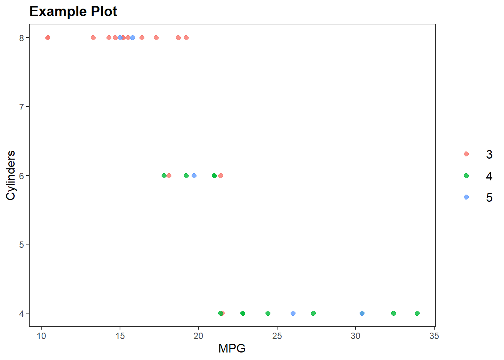

## One-Table Summary

A pragmatic approach for business audiences: show **descriptives** and **key regression** side-by-side (or sequentially) in a single, coherent section. This can be achieved with `gtsummary::tbl_merge()` combining `tbl_summary()` and `tbl_regression()`.


``` r
if (requireNamespace("gtsummary", quietly = TRUE) &&
    requireNamespace("gt", quietly = TRUE)) {
  library(gtsummary)
  library(gt)
  mod_for_tbl <- lm(metascore ~ log1p(budget) + log1p(us_gross) + runtime + year, data = movies_small)

  tbl1 <- movies_small %>%
    mutate(across(c(budget, us_gross), log1p)) %>%
    select(metascore, budget, us_gross, runtime, year) %>%
    tbl_summary(
      statistic = all_continuous() ~ "{mean} ({sd})",
      digits = all_continuous() ~ 1
    ) %>%
    bold_labels()

  tbl2 <- tbl_regression(mod_for_tbl, exponentiate = FALSE) %>%
    add_glance_table(include = c(r.squared, adj.r.squared, AIC, BIC), label = list(r.squared ~ "R^2",
                                                                                   adj.r.squared ~ "Adj. R^2"))

  tbl_merge(
    tbls = list(tbl1, tbl2),
    tab_spanner = c("**Descriptive Statistics**", "**Regression Results**")
  ) %>%
    as_gt() %>%
    tab_source_note(source_note = md("SEs are HC3-robust unless otherwise noted."))
}
```


```{=html}
<div id="xufhgakeot" style="padding-left:0px;padding-right:0px;padding-top:10px;padding-bottom:10px;overflow-x:auto;overflow-y:auto;width:auto;height:auto;">
<style>#xufhgakeot table {
  font-family: system-ui, 'Segoe UI', Roboto, Helvetica, Arial, sans-serif, 'Apple Color Emoji', 'Segoe UI Emoji', 'Segoe UI Symbol', 'Noto Color Emoji';
  -webkit-font-smoothing: antialiased;
  -moz-osx-font-smoothing: grayscale;
}

#xufhgakeot thead, #xufhgakeot tbody, #xufhgakeot tfoot, #xufhgakeot tr, #xufhgakeot td, #xufhgakeot th {
  border-style: none;
}

#xufhgakeot p {
  margin: 0;
  padding: 0;
}

#xufhgakeot .gt_table {
  display: table;
  border-collapse: collapse;
  line-height: normal;
  margin-left: auto;
  margin-right: auto;
  color: #333333;
  font-size: 16px;
  font-weight: normal;
  font-style: normal;
  background-color: #FFFFFF;
  width: auto;
  border-top-style: solid;
  border-top-width: 2px;
  border-top-color: #A8A8A8;
  border-right-style: none;
  border-right-width: 2px;
  border-right-color: #D3D3D3;
  border-bottom-style: solid;
  border-bottom-width: 2px;
  border-bottom-color: #A8A8A8;
  border-left-style: none;
  border-left-width: 2px;
  border-left-color: #D3D3D3;
}

#xufhgakeot .gt_caption {
  padding-top: 4px;
  padding-bottom: 4px;
}

#xufhgakeot .gt_title {
  color: #333333;
  font-size: 125%;
  font-weight: initial;
  padding-top: 4px;
  padding-bottom: 4px;
  padding-left: 5px;
  padding-right: 5px;
  border-bottom-color: #FFFFFF;
  border-bottom-width: 0;
}

#xufhgakeot .gt_subtitle {
  color: #333333;
  font-size: 85%;
  font-weight: initial;
  padding-top: 3px;
  padding-bottom: 5px;
  padding-left: 5px;
  padding-right: 5px;
  border-top-color: #FFFFFF;
  border-top-width: 0;
}

#xufhgakeot .gt_heading {
  background-color: #FFFFFF;
  text-align: center;
  border-bottom-color: #FFFFFF;
  border-left-style: none;
  border-left-width: 1px;
  border-left-color: #D3D3D3;
  border-right-style: none;
  border-right-width: 1px;
  border-right-color: #D3D3D3;
}

#xufhgakeot .gt_bottom_border {
  border-bottom-style: solid;
  border-bottom-width: 2px;
  border-bottom-color: #D3D3D3;
}

#xufhgakeot .gt_col_headings {
  border-top-style: solid;
  border-top-width: 2px;
  border-top-color: #D3D3D3;
  border-bottom-style: solid;
  border-bottom-width: 2px;
  border-bottom-color: #D3D3D3;
  border-left-style: none;
  border-left-width: 1px;
  border-left-color: #D3D3D3;
  border-right-style: none;
  border-right-width: 1px;
  border-right-color: #D3D3D3;
}

#xufhgakeot .gt_col_heading {
  color: #333333;
  background-color: #FFFFFF;
  font-size: 100%;
  font-weight: normal;
  text-transform: inherit;
  border-left-style: none;
  border-left-width: 1px;
  border-left-color: #D3D3D3;
  border-right-style: none;
  border-right-width: 1px;
  border-right-color: #D3D3D3;
  vertical-align: bottom;
  padding-top: 5px;
  padding-bottom: 6px;
  padding-left: 5px;
  padding-right: 5px;
  overflow-x: hidden;
}

#xufhgakeot .gt_column_spanner_outer {
  color: #333333;
  background-color: #FFFFFF;
  font-size: 100%;
  font-weight: normal;
  text-transform: inherit;
  padding-top: 0;
  padding-bottom: 0;
  padding-left: 4px;
  padding-right: 4px;
}

#xufhgakeot .gt_column_spanner_outer:first-child {
  padding-left: 0;
}

#xufhgakeot .gt_column_spanner_outer:last-child {
  padding-right: 0;
}

#xufhgakeot .gt_column_spanner {
  border-bottom-style: solid;
  border-bottom-width: 2px;
  border-bottom-color: #D3D3D3;
  vertical-align: bottom;
  padding-top: 5px;
  padding-bottom: 5px;
  overflow-x: hidden;
  display: inline-block;
  width: 100%;
}

#xufhgakeot .gt_spanner_row {
  border-bottom-style: hidden;
}

#xufhgakeot .gt_group_heading {
  padding-top: 8px;
  padding-bottom: 8px;
  padding-left: 5px;
  padding-right: 5px;
  color: #333333;
  background-color: #FFFFFF;
  font-size: 100%;
  font-weight: initial;
  text-transform: inherit;
  border-top-style: solid;
  border-top-width: 2px;
  border-top-color: #D3D3D3;
  border-bottom-style: solid;
  border-bottom-width: 2px;
  border-bottom-color: #D3D3D3;
  border-left-style: none;
  border-left-width: 1px;
  border-left-color: #D3D3D3;
  border-right-style: none;
  border-right-width: 1px;
  border-right-color: #D3D3D3;
  vertical-align: middle;
  text-align: left;
}

#xufhgakeot .gt_empty_group_heading {
  padding: 0.5px;
  color: #333333;
  background-color: #FFFFFF;
  font-size: 100%;
  font-weight: initial;
  border-top-style: solid;
  border-top-width: 2px;
  border-top-color: #D3D3D3;
  border-bottom-style: solid;
  border-bottom-width: 2px;
  border-bottom-color: #D3D3D3;
  vertical-align: middle;
}

#xufhgakeot .gt_from_md > :first-child {
  margin-top: 0;
}

#xufhgakeot .gt_from_md > :last-child {
  margin-bottom: 0;
}

#xufhgakeot .gt_row {
  padding-top: 8px;
  padding-bottom: 8px;
  padding-left: 5px;
  padding-right: 5px;
  margin: 10px;
  border-top-style: solid;
  border-top-width: 1px;
  border-top-color: #D3D3D3;
  border-left-style: none;
  border-left-width: 1px;
  border-left-color: #D3D3D3;
  border-right-style: none;
  border-right-width: 1px;
  border-right-color: #D3D3D3;
  vertical-align: middle;
  overflow-x: hidden;
}

#xufhgakeot .gt_stub {
  color: #333333;
  background-color: #FFFFFF;
  font-size: 100%;
  font-weight: initial;
  text-transform: inherit;
  border-right-style: solid;
  border-right-width: 2px;
  border-right-color: #D3D3D3;
  padding-left: 5px;
  padding-right: 5px;
}

#xufhgakeot .gt_stub_row_group {
  color: #333333;
  background-color: #FFFFFF;
  font-size: 100%;
  font-weight: initial;
  text-transform: inherit;
  border-right-style: solid;
  border-right-width: 2px;
  border-right-color: #D3D3D3;
  padding-left: 5px;
  padding-right: 5px;
  vertical-align: top;
}

#xufhgakeot .gt_row_group_first td {
  border-top-width: 2px;
}

#xufhgakeot .gt_row_group_first th {
  border-top-width: 2px;
}

#xufhgakeot .gt_summary_row {
  color: #333333;
  background-color: #FFFFFF;
  text-transform: inherit;
  padding-top: 8px;
  padding-bottom: 8px;
  padding-left: 5px;
  padding-right: 5px;
}

#xufhgakeot .gt_first_summary_row {
  border-top-style: solid;
  border-top-color: #D3D3D3;
}

#xufhgakeot .gt_first_summary_row.thick {
  border-top-width: 2px;
}

#xufhgakeot .gt_last_summary_row {
  padding-top: 8px;
  padding-bottom: 8px;
  padding-left: 5px;
  padding-right: 5px;
  border-bottom-style: solid;
  border-bottom-width: 2px;
  border-bottom-color: #D3D3D3;
}

#xufhgakeot .gt_grand_summary_row {
  color: #333333;
  background-color: #FFFFFF;
  text-transform: inherit;
  padding-top: 8px;
  padding-bottom: 8px;
  padding-left: 5px;
  padding-right: 5px;
}

#xufhgakeot .gt_first_grand_summary_row {
  padding-top: 8px;
  padding-bottom: 8px;
  padding-left: 5px;
  padding-right: 5px;
  border-top-style: double;
  border-top-width: 6px;
  border-top-color: #D3D3D3;
}

#xufhgakeot .gt_last_grand_summary_row_top {
  padding-top: 8px;
  padding-bottom: 8px;
  padding-left: 5px;
  padding-right: 5px;
  border-bottom-style: double;
  border-bottom-width: 6px;
  border-bottom-color: #D3D3D3;
}

#xufhgakeot .gt_striped {
  background-color: rgba(128, 128, 128, 0.05);
}

#xufhgakeot .gt_table_body {
  border-top-style: solid;
  border-top-width: 2px;
  border-top-color: #D3D3D3;
  border-bottom-style: solid;
  border-bottom-width: 2px;
  border-bottom-color: #D3D3D3;
}

#xufhgakeot .gt_footnotes {
  color: #333333;
  background-color: #FFFFFF;
  border-bottom-style: none;
  border-bottom-width: 2px;
  border-bottom-color: #D3D3D3;
  border-left-style: none;
  border-left-width: 2px;
  border-left-color: #D3D3D3;
  border-right-style: none;
  border-right-width: 2px;
  border-right-color: #D3D3D3;
}

#xufhgakeot .gt_footnote {
  margin: 0px;
  font-size: 90%;
  padding-top: 4px;
  padding-bottom: 4px;
  padding-left: 5px;
  padding-right: 5px;
}

#xufhgakeot .gt_sourcenotes {
  color: #333333;
  background-color: #FFFFFF;
  border-bottom-style: none;
  border-bottom-width: 2px;
  border-bottom-color: #D3D3D3;
  border-left-style: none;
  border-left-width: 2px;
  border-left-color: #D3D3D3;
  border-right-style: none;
  border-right-width: 2px;
  border-right-color: #D3D3D3;
}

#xufhgakeot .gt_sourcenote {
  font-size: 90%;
  padding-top: 4px;
  padding-bottom: 4px;
  padding-left: 5px;
  padding-right: 5px;
}

#xufhgakeot .gt_left {
  text-align: left;
}

#xufhgakeot .gt_center {
  text-align: center;
}

#xufhgakeot .gt_right {
  text-align: right;
  font-variant-numeric: tabular-nums;
}

#xufhgakeot .gt_font_normal {
  font-weight: normal;
}

#xufhgakeot .gt_font_bold {
  font-weight: bold;
}

#xufhgakeot .gt_font_italic {
  font-style: italic;
}

#xufhgakeot .gt_super {
  font-size: 65%;
}

#xufhgakeot .gt_footnote_marks {
  font-size: 75%;
  vertical-align: 0.4em;
  position: initial;
}

#xufhgakeot .gt_asterisk {
  font-size: 100%;
  vertical-align: 0;
}

#xufhgakeot .gt_indent_1 {
  text-indent: 5px;
}

#xufhgakeot .gt_indent_2 {
  text-indent: 10px;
}

#xufhgakeot .gt_indent_3 {
  text-indent: 15px;
}

#xufhgakeot .gt_indent_4 {
  text-indent: 20px;
}

#xufhgakeot .gt_indent_5 {
  text-indent: 25px;
}

#xufhgakeot .katex-display {
  display: inline-flex !important;
  margin-bottom: 0.75em !important;
}

#xufhgakeot div.Reactable > div.rt-table > div.rt-thead > div.rt-tr.rt-tr-group-header > div.rt-th-group:after {
  height: 0px !important;
}
</style>
<table class="gt_table" data-quarto-disable-processing="false" data-quarto-bootstrap="false">
  <thead>
    <tr class="gt_col_headings gt_spanner_row">
      <th class="gt_col_heading gt_columns_bottom_border gt_left" rowspan="2" colspan="1" scope="col" id="label"><span class='gt_from_md'><strong>Characteristic</strong></span></th>
      <th class="gt_center gt_columns_top_border gt_column_spanner_outer" rowspan="1" colspan="1" scope="col" id="level 1; stat_0_1">
        <div class="gt_column_spanner"><span class='gt_from_md'><strong>Descriptive Statistics</strong></span></div>
      </th>
      <th class="gt_center gt_columns_top_border gt_column_spanner_outer" rowspan="1" colspan="3" scope="colgroup" id="level 1; estimate_2">
        <div class="gt_column_spanner"><span class='gt_from_md'><strong>Regression Results</strong></span></div>
      </th>
    </tr>
    <tr class="gt_col_headings">
      <th class="gt_col_heading gt_columns_bottom_border gt_center" rowspan="1" colspan="1" scope="col" id="stat_0_1"><span class='gt_from_md'><strong>N = 831</strong></span><span class="gt_footnote_marks" style="white-space:nowrap;font-style:italic;font-weight:normal;line-height:0;"><sup>1</sup></span></th>
      <th class="gt_col_heading gt_columns_bottom_border gt_center" rowspan="1" colspan="1" scope="col" id="estimate_2"><span class='gt_from_md'><strong>Beta</strong></span></th>
      <th class="gt_col_heading gt_columns_bottom_border gt_center" rowspan="1" colspan="1" scope="col" id="conf.low_2"><span class='gt_from_md'><strong>95% CI</strong></span></th>
      <th class="gt_col_heading gt_columns_bottom_border gt_center" rowspan="1" colspan="1" scope="col" id="p.value_2"><span class='gt_from_md'><strong>p-value</strong></span></th>
    </tr>
  </thead>
  <tbody class="gt_table_body">
    <tr><td headers="label" class="gt_row gt_left" style="font-weight: bold;">metascore</td>
<td headers="stat_0_1" class="gt_row gt_center">63.0 (16.9)</td>
<td headers="estimate_2" class="gt_row gt_center"><br /></td>
<td headers="conf.low_2" class="gt_row gt_center"><br /></td>
<td headers="p.value_2" class="gt_row gt_center"><br /></td></tr>
    <tr><td headers="label" class="gt_row gt_left" style="font-weight: bold;">budget</td>
<td headers="stat_0_1" class="gt_row gt_center">17.4 (1.2)</td>
<td headers="estimate_2" class="gt_row gt_center"><br /></td>
<td headers="conf.low_2" class="gt_row gt_center"><br /></td>
<td headers="p.value_2" class="gt_row gt_center"><br /></td></tr>
    <tr><td headers="label" class="gt_row gt_left" style="font-weight: bold;">us_gross</td>
<td headers="stat_0_1" class="gt_row gt_center">17.9 (1.4)</td>
<td headers="estimate_2" class="gt_row gt_center"><br /></td>
<td headers="conf.low_2" class="gt_row gt_center"><br /></td>
<td headers="p.value_2" class="gt_row gt_center"><br /></td></tr>
    <tr><td headers="label" class="gt_row gt_left" style="font-weight: bold;">runtime</td>
<td headers="stat_0_1" class="gt_row gt_center">1.9 (0.4)</td>
<td headers="estimate_2" class="gt_row gt_center">14</td>
<td headers="conf.low_2" class="gt_row gt_center">11, 18</td>
<td headers="p.value_2" class="gt_row gt_center"><0.001</td></tr>
    <tr><td headers="label" class="gt_row gt_left" style="font-weight: bold;">year</td>
<td headers="stat_0_1" class="gt_row gt_center">2,002.2 (9.0)</td>
<td headers="estimate_2" class="gt_row gt_center">-0.01</td>
<td headers="conf.low_2" class="gt_row gt_center">-0.14, 0.12</td>
<td headers="p.value_2" class="gt_row gt_center">0.8</td></tr>
    <tr><td headers="label" class="gt_row gt_left" style="font-weight: bold;">log1p(budget)</td>
<td headers="stat_0_1" class="gt_row gt_center"><br /></td>
<td headers="estimate_2" class="gt_row gt_center">-6.7</td>
<td headers="conf.low_2" class="gt_row gt_center">-7.9, -5.5</td>
<td headers="p.value_2" class="gt_row gt_center"><0.001</td></tr>
    <tr><td headers="label" class="gt_row gt_left" style="font-weight: bold;">log1p(us_gross)</td>
<td headers="stat_0_1" class="gt_row gt_center"><br /></td>
<td headers="estimate_2" class="gt_row gt_center">3.8</td>
<td headers="conf.low_2" class="gt_row gt_center">2.7, 4.9</td>
<td headers="p.value_2" class="gt_row gt_center"><0.001</td></tr>
    <tr><td headers="label" class="gt_row gt_left" style="border-top-width: 2px; border-top-style: solid; border-top-color: #D3D3D3;">R^2</td>
<td headers="stat_0_1" class="gt_row gt_center" style="border-top-width: 2px; border-top-style: solid; border-top-color: #D3D3D3;"><br /></td>
<td headers="estimate_2" class="gt_row gt_center" style="border-top-width: 2px; border-top-style: solid; border-top-color: #D3D3D3;">0.169</td>
<td headers="conf.low_2" class="gt_row gt_center" style="border-top-width: 2px; border-top-style: solid; border-top-color: #D3D3D3;"><br /></td>
<td headers="p.value_2" class="gt_row gt_center" style="border-top-width: 2px; border-top-style: solid; border-top-color: #D3D3D3;"><br /></td></tr>
    <tr><td headers="label" class="gt_row gt_left">Adj. R^2</td>
<td headers="stat_0_1" class="gt_row gt_center"><br /></td>
<td headers="estimate_2" class="gt_row gt_center">0.165</td>
<td headers="conf.low_2" class="gt_row gt_center"><br /></td>
<td headers="p.value_2" class="gt_row gt_center"><br /></td></tr>
    <tr><td headers="label" class="gt_row gt_left">AIC</td>
<td headers="stat_0_1" class="gt_row gt_center"><br /></td>
<td headers="estimate_2" class="gt_row gt_center">6,915</td>
<td headers="conf.low_2" class="gt_row gt_center"><br /></td>
<td headers="p.value_2" class="gt_row gt_center"><br /></td></tr>
    <tr><td headers="label" class="gt_row gt_left">BIC</td>
<td headers="stat_0_1" class="gt_row gt_center"><br /></td>
<td headers="estimate_2" class="gt_row gt_center">6,943</td>
<td headers="conf.low_2" class="gt_row gt_center"><br /></td>
<td headers="p.value_2" class="gt_row gt_center"><br /></td></tr>
  </tbody>
  <tfoot>
    <tr class="gt_footnotes">
      <td class="gt_footnote" colspan="5"><span class="gt_footnote_marks" style="white-space:nowrap;font-style:italic;font-weight:normal;line-height:0;"><sup>1</sup></span> <span class='gt_from_md'>Mean (SD)</span></td>
    </tr>
    <tr class="gt_sourcenotes">
      <td class="gt_sourcenote" colspan="5"><span class='gt_from_md'>Abbreviation: CI = Confidence Interval</span></td>
    </tr>
    <tr class="gt_sourcenotes">
      <td class="gt_sourcenote" colspan="5"><span class='gt_from_md'>SEs are HC3-robust unless otherwise noted.</span></td>
    </tr>
  </tfoot>
</table>
</div>
```


## Inference / Prediction

Beyond classical t-tests:

-   Bootstrap CIs (resample rows)

-   Permutation tests (randomize treatment/feature under $H_0$)

-   Cross-validation for predictive accuracy (RMSE/MAE)

-   Prediction intervals for new observations


``` r
# Bootstrap coefficient CIs (percentile) using boot
if (requireNamespace("boot", quietly = TRUE)) {
  library(boot)

  boot_fun <- function(data, idx) {
    m <- lm(metascore ~ log1p(budget) + log1p(us_gross) + runtime + year, data = data[idx, , drop = FALSE])
    coef(m)
  }

  bt <- boot(movies_small, statistic = boot_fun, R = 1000)
  # Percentile CI for log1p(budget)
  boot.ci(bt, type = "perc", index = which(names(coef(fit)) == "log1p(budget)"))
}
#> BOOTSTRAP CONFIDENCE INTERVAL CALCULATIONS
#> Based on 1000 bootstrap replicates
#> 
#> CALL : 
#> boot.ci(boot.out = bt, type = "perc", index = which(names(coef(fit)) == 
#>     "log1p(budget)"))
#> 
#> Intervals : 
#> Level     Percentile     
#> 95%   (-8.158, -5.443 )  
#> Calculations and Intervals on Original Scale
```


``` r
# Simple K-fold CV (caret) for RMSE
if (requireNamespace("caret", quietly = TRUE)) {
  library(caret)
  ctrl <- trainControl(method = "cv", number = 5)
  cv_fit <- train(
    metascore ~ log1p(budget) + log1p(us_gross) + runtime + year,
    data = movies_small,
    method = "lm",
    trControl = ctrl
  )
  cv_fit
}
#> Linear Regression 
#> 
#> 831 samples
#>   4 predictor
#> 
#> No pre-processing
#> Resampling: Cross-Validated (5 fold) 
#> Summary of sample sizes: 665, 664, 665, 666, 664 
#> Resampling results:
#> 
#>   RMSE      Rsquared   MAE     
#>   15.46842  0.1624431  12.53269
#> 
#> Tuning parameter 'intercept' was held constant at a value of TRUE
```


``` r
# Prediction intervals for new data
newdat <- tibble(
  budget = median(movies_small$budget, na.rm = TRUE),
  us_gross = median(movies_small$us_gross, na.rm = TRUE),
  runtime = median(movies_small$runtime, na.rm = TRUE),
  year = median(movies_small$year, na.rm = TRUE)
)

predict(fit, newdata = newdat, interval = "prediction", level = 0.95)
#>        fit      lwr      upr
#> 1 62.00795 31.66255 92.35336
```

------------------------------------------------------------------------

## Appendix: Reproducible Snippets


``` r
# jtools: baseline summary again for traceability
data(movies)
fit <- lm(metascore ~ budget + us_gross + year, data = movies)
summ(fit)
```

<table class="table table-striped table-hover table-condensed table-responsive" style="width: auto !important; margin-left: auto; margin-right: auto;">
<tbody>
  <tr>
   <td style="text-align:left;font-weight: bold;"> Observations </td>
   <td style="text-align:right;"> 831 (10 missing obs. deleted) </td>
  </tr>
  <tr>
   <td style="text-align:left;font-weight: bold;"> Dependent variable </td>
   <td style="text-align:right;"> metascore </td>
  </tr>
  <tr>
   <td style="text-align:left;font-weight: bold;"> Type </td>
   <td style="text-align:right;"> OLS linear regression </td>
  </tr>
</tbody>
</table> <table class="table table-striped table-hover table-condensed table-responsive" style="width: auto !important; margin-left: auto; margin-right: auto;">
<tbody>
  <tr>
   <td style="text-align:left;font-weight: bold;"> F(3,827) </td>
   <td style="text-align:right;"> 26.23 </td>
  </tr>
  <tr>
   <td style="text-align:left;font-weight: bold;"> R² </td>
   <td style="text-align:right;"> 0.09 </td>
  </tr>
  <tr>
   <td style="text-align:left;font-weight: bold;"> Adj. R² </td>
   <td style="text-align:right;"> 0.08 </td>
  </tr>
</tbody>
</table> <table class="table table-striped table-hover table-condensed table-responsive" style="width: auto !important; margin-left: auto; margin-right: auto;border-bottom: 0;">
 <thead>
  <tr>
   <th style="text-align:left;">   </th>
   <th style="text-align:right;"> Est. </th>
   <th style="text-align:right;"> S.E. </th>
   <th style="text-align:right;"> t val. </th>
   <th style="text-align:right;"> p </th>
  </tr>
 </thead>
<tbody>
  <tr>
   <td style="text-align:left;font-weight: bold;"> (Intercept) </td>
   <td style="text-align:right;"> 52.06 </td>
   <td style="text-align:right;"> 139.67 </td>
   <td style="text-align:right;"> 0.37 </td>
   <td style="text-align:right;"> 0.71 </td>
  </tr>
  <tr>
   <td style="text-align:left;font-weight: bold;"> budget </td>
   <td style="text-align:right;"> -0.00 </td>
   <td style="text-align:right;"> 0.00 </td>
   <td style="text-align:right;"> -5.89 </td>
   <td style="text-align:right;"> 0.00 </td>
  </tr>
  <tr>
   <td style="text-align:left;font-weight: bold;"> us_gross </td>
   <td style="text-align:right;"> 0.00 </td>
   <td style="text-align:right;"> 0.00 </td>
   <td style="text-align:right;"> 7.61 </td>
   <td style="text-align:right;"> 0.00 </td>
  </tr>
  <tr>
   <td style="text-align:left;font-weight: bold;"> year </td>
   <td style="text-align:right;"> 0.01 </td>
   <td style="text-align:right;"> 0.07 </td>
   <td style="text-align:right;"> 0.08 </td>
   <td style="text-align:right;"> 0.94 </td>
  </tr>
</tbody>
<tfoot><tr><td style="padding: 0; " colspan="100%">
<sup></sup> Standard errors: OLS</td></tr></tfoot>
</table>

``` r
summ(
  fit,
  scale = TRUE,
  vifs = TRUE,
  part.corr = TRUE,
  confint = TRUE,
  pvals = FALSE
) # notice that scale here is TRUE
```

<table class="table table-striped table-hover table-condensed table-responsive" style="width: auto !important; margin-left: auto; margin-right: auto;">
<tbody>
  <tr>
   <td style="text-align:left;font-weight: bold;"> Observations </td>
   <td style="text-align:right;"> 831 (10 missing obs. deleted) </td>
  </tr>
  <tr>
   <td style="text-align:left;font-weight: bold;"> Dependent variable </td>
   <td style="text-align:right;"> metascore </td>
  </tr>
  <tr>
   <td style="text-align:left;font-weight: bold;"> Type </td>
   <td style="text-align:right;"> OLS linear regression </td>
  </tr>
</tbody>
</table> <table class="table table-striped table-hover table-condensed table-responsive" style="width: auto !important; margin-left: auto; margin-right: auto;">
<tbody>
  <tr>
   <td style="text-align:left;font-weight: bold;"> F(3,827) </td>
   <td style="text-align:right;"> 26.23 </td>
  </tr>
  <tr>
   <td style="text-align:left;font-weight: bold;"> R² </td>
   <td style="text-align:right;"> 0.09 </td>
  </tr>
  <tr>
   <td style="text-align:left;font-weight: bold;"> Adj. R² </td>
   <td style="text-align:right;"> 0.08 </td>
  </tr>
</tbody>
</table> <table class="table table-striped table-hover table-condensed table-responsive" style="width: auto !important; margin-left: auto; margin-right: auto;border-bottom: 0;">
 <thead>
  <tr>
   <th style="text-align:left;">   </th>
   <th style="text-align:right;"> Est. </th>
   <th style="text-align:right;"> 2.5% </th>
   <th style="text-align:right;"> 97.5% </th>
   <th style="text-align:right;"> t val. </th>
   <th style="text-align:right;"> VIF </th>
   <th style="text-align:right;"> partial.r </th>
   <th style="text-align:right;"> part.r </th>
  </tr>
 </thead>
<tbody>
  <tr>
   <td style="text-align:left;font-weight: bold;"> (Intercept) </td>
   <td style="text-align:right;"> 63.01 </td>
   <td style="text-align:right;"> 61.91 </td>
   <td style="text-align:right;"> 64.11 </td>
   <td style="text-align:right;"> 112.23 </td>
   <td style="text-align:right;"> NA </td>
   <td style="text-align:right;"> NA </td>
   <td style="text-align:right;"> NA </td>
  </tr>
  <tr>
   <td style="text-align:left;font-weight: bold;"> budget </td>
   <td style="text-align:right;"> -3.78 </td>
   <td style="text-align:right;"> -5.05 </td>
   <td style="text-align:right;"> -2.52 </td>
   <td style="text-align:right;"> -5.89 </td>
   <td style="text-align:right;"> 1.31 </td>
   <td style="text-align:right;"> -0.20 </td>
   <td style="text-align:right;"> -0.20 </td>
  </tr>
  <tr>
   <td style="text-align:left;font-weight: bold;"> us_gross </td>
   <td style="text-align:right;"> 5.28 </td>
   <td style="text-align:right;"> 3.92 </td>
   <td style="text-align:right;"> 6.64 </td>
   <td style="text-align:right;"> 7.61 </td>
   <td style="text-align:right;"> 1.52 </td>
   <td style="text-align:right;"> 0.26 </td>
   <td style="text-align:right;"> 0.25 </td>
  </tr>
  <tr>
   <td style="text-align:left;font-weight: bold;"> year </td>
   <td style="text-align:right;"> 0.05 </td>
   <td style="text-align:right;"> -1.18 </td>
   <td style="text-align:right;"> 1.28 </td>
   <td style="text-align:right;"> 0.08 </td>
   <td style="text-align:right;"> 1.24 </td>
   <td style="text-align:right;"> 0.00 </td>
   <td style="text-align:right;"> 0.00 </td>
  </tr>
</tbody>
<tfoot><tr><td style="padding: 0; " colspan="100%">
<sup></sup> Standard errors: OLS; Continuous predictors are mean-centered and scaled by 1 s.d. The outcome variable remains in its original units.</td></tr></tfoot>
</table>

``` r

# obtain cluster-robust SE
data("PetersenCL", package = "sandwich")
fit2 <- lm(y ~ x, data = PetersenCL)
summ(fit2, robust = "HC3", cluster = "firm") 
```

<table class="table table-striped table-hover table-condensed table-responsive" style="width: auto !important; margin-left: auto; margin-right: auto;">
<tbody>
  <tr>
   <td style="text-align:left;font-weight: bold;"> Observations </td>
   <td style="text-align:right;"> 5000 </td>
  </tr>
  <tr>
   <td style="text-align:left;font-weight: bold;"> Dependent variable </td>
   <td style="text-align:right;"> y </td>
  </tr>
  <tr>
   <td style="text-align:left;font-weight: bold;"> Type </td>
   <td style="text-align:right;"> OLS linear regression </td>
  </tr>
</tbody>
</table> <table class="table table-striped table-hover table-condensed table-responsive" style="width: auto !important; margin-left: auto; margin-right: auto;">
<tbody>
  <tr>
   <td style="text-align:left;font-weight: bold;"> F(1,4998) </td>
   <td style="text-align:right;"> 1310.74 </td>
  </tr>
  <tr>
   <td style="text-align:left;font-weight: bold;"> R² </td>
   <td style="text-align:right;"> 0.21 </td>
  </tr>
  <tr>
   <td style="text-align:left;font-weight: bold;"> Adj. R² </td>
   <td style="text-align:right;"> 0.21 </td>
  </tr>
</tbody>
</table> <table class="table table-striped table-hover table-condensed table-responsive" style="width: auto !important; margin-left: auto; margin-right: auto;border-bottom: 0;">
 <thead>
  <tr>
   <th style="text-align:left;">   </th>
   <th style="text-align:right;"> Est. </th>
   <th style="text-align:right;"> S.E. </th>
   <th style="text-align:right;"> t val. </th>
   <th style="text-align:right;"> p </th>
  </tr>
 </thead>
<tbody>
  <tr>
   <td style="text-align:left;font-weight: bold;"> (Intercept) </td>
   <td style="text-align:right;"> 0.03 </td>
   <td style="text-align:right;"> 0.07 </td>
   <td style="text-align:right;"> 0.44 </td>
   <td style="text-align:right;"> 0.66 </td>
  </tr>
  <tr>
   <td style="text-align:left;font-weight: bold;"> x </td>
   <td style="text-align:right;"> 1.03 </td>
   <td style="text-align:right;"> 0.05 </td>
   <td style="text-align:right;"> 20.36 </td>
   <td style="text-align:right;"> 0.00 </td>
  </tr>
</tbody>
<tfoot><tr><td style="padding: 0; " colspan="100%">
<sup></sup> Standard errors: Cluster-robust, type = HC3</td></tr></tfoot>
</table>


``` r
# Model to Equation via equatiomatic (if available)
# install.packages("equatiomatic") # not available for R 4.2
fit <- lm(metascore ~ budget + us_gross + year, data = movies)
# show the theoretical model
equatiomatic::extract_eq(fit)
# display the actual coefficients
equatiomatic::extract_eq(fit, use_coefs = TRUE)
```


``` r
# Model Comparison via jtools
fit <- lm(metascore ~ log(budget), data = movies)
fit_b <- lm(metascore ~ log(budget) + log(us_gross), data = movies)
fit_c <- lm(metascore ~ log(budget) + log(us_gross) + runtime, data = movies)
coef_names <- c("Budget" = "log(budget)", "US Gross" = "log(us_gross)",
                "Runtime (Hours)" = "runtime", "Constant" = "(Intercept)")
export_summs(fit, fit_b, fit_c, robust = "HC3", coefs = coef_names)
```


```{=html}
<table class="huxtable" data-quarto-disable-processing="true"  style="margin-left: auto; margin-right: auto;">
<col><col><col><col><thead>
<tr>
<th class="huxtable-cell huxtable-header" style="text-align: center;  border-style: solid solid solid solid; border-width: 0.8pt 0pt 0pt 0pt;      font-weight: normal;"></th><th class="huxtable-cell huxtable-header" style="text-align: center;  border-style: solid solid solid solid; border-width: 0.8pt 0pt 0.4pt 0pt;      font-weight: normal;">Model 1</th><th class="huxtable-cell huxtable-header" style="text-align: center;  border-style: solid solid solid solid; border-width: 0.8pt 0pt 0.4pt 0pt;      font-weight: normal;">Model 2</th><th class="huxtable-cell huxtable-header" style="text-align: center;  border-style: solid solid solid solid; border-width: 0.8pt 0pt 0.4pt 0pt;      font-weight: normal;">Model 3</th></tr>
</thead>
<tbody>
<tr>
<th class="huxtable-cell huxtable-header" style="border-style: solid solid solid solid; border-width: 0pt 0pt 0pt 0pt;      font-weight: normal;">Budget</th><td class="huxtable-cell" style="text-align: right;  border-style: solid solid solid solid; border-width: 0.4pt 0pt 0pt 0pt;">-2.43 ***</td><td class="huxtable-cell" style="text-align: right;  border-style: solid solid solid solid; border-width: 0.4pt 0pt 0pt 0pt;">-5.16 ***</td><td class="huxtable-cell" style="text-align: right;  border-style: solid solid solid solid; border-width: 0.4pt 0pt 0pt 0pt;">-6.70 ***</td></tr>
<tr>
<th class="huxtable-cell huxtable-header" style="border-style: solid solid solid solid; border-width: 0pt 0pt 0pt 0pt;      font-weight: normal;"></th><td class="huxtable-cell" style="text-align: right;  border-style: solid solid solid solid; border-width: 0pt 0pt 0pt 0pt;">(0.44)&nbsp;&nbsp;&nbsp;</td><td class="huxtable-cell" style="text-align: right;  border-style: solid solid solid solid; border-width: 0pt 0pt 0pt 0pt;">(0.62)&nbsp;&nbsp;&nbsp;</td><td class="huxtable-cell" style="text-align: right;  border-style: solid solid solid solid; border-width: 0pt 0pt 0pt 0pt;">(0.67)&nbsp;&nbsp;&nbsp;</td></tr>
<tr>
<th class="huxtable-cell huxtable-header" style="border-style: solid solid solid solid; border-width: 0pt 0pt 0pt 0pt;      font-weight: normal;">US Gross</th><td class="huxtable-cell" style="text-align: right;  border-style: solid solid solid solid; border-width: 0pt 0pt 0pt 0pt;">&nbsp;&nbsp;&nbsp;&nbsp;&nbsp;&nbsp;&nbsp;</td><td class="huxtable-cell" style="text-align: right;  border-style: solid solid solid solid; border-width: 0pt 0pt 0pt 0pt;">3.96 ***</td><td class="huxtable-cell" style="text-align: right;  border-style: solid solid solid solid; border-width: 0pt 0pt 0pt 0pt;">3.85 ***</td></tr>
<tr>
<th class="huxtable-cell huxtable-header" style="border-style: solid solid solid solid; border-width: 0pt 0pt 0pt 0pt;      font-weight: normal;"></th><td class="huxtable-cell" style="text-align: right;  border-style: solid solid solid solid; border-width: 0pt 0pt 0pt 0pt;">&nbsp;&nbsp;&nbsp;&nbsp;&nbsp;&nbsp;&nbsp;</td><td class="huxtable-cell" style="text-align: right;  border-style: solid solid solid solid; border-width: 0pt 0pt 0pt 0pt;">(0.51)&nbsp;&nbsp;&nbsp;</td><td class="huxtable-cell" style="text-align: right;  border-style: solid solid solid solid; border-width: 0pt 0pt 0pt 0pt;">(0.48)&nbsp;&nbsp;&nbsp;</td></tr>
<tr>
<th class="huxtable-cell huxtable-header" style="border-style: solid solid solid solid; border-width: 0pt 0pt 0pt 0pt;      font-weight: normal;">Runtime (Hours)</th><td class="huxtable-cell" style="text-align: right;  border-style: solid solid solid solid; border-width: 0pt 0pt 0pt 0pt;">&nbsp;&nbsp;&nbsp;&nbsp;&nbsp;&nbsp;&nbsp;</td><td class="huxtable-cell" style="text-align: right;  border-style: solid solid solid solid; border-width: 0pt 0pt 0pt 0pt;">&nbsp;&nbsp;&nbsp;&nbsp;&nbsp;&nbsp;&nbsp;</td><td class="huxtable-cell" style="text-align: right;  border-style: solid solid solid solid; border-width: 0pt 0pt 0pt 0pt;">14.29 ***</td></tr>
<tr>
<th class="huxtable-cell huxtable-header" style="border-style: solid solid solid solid; border-width: 0pt 0pt 0pt 0pt;      font-weight: normal;"></th><td class="huxtable-cell" style="text-align: right;  border-style: solid solid solid solid; border-width: 0pt 0pt 0pt 0pt;">&nbsp;&nbsp;&nbsp;&nbsp;&nbsp;&nbsp;&nbsp;</td><td class="huxtable-cell" style="text-align: right;  border-style: solid solid solid solid; border-width: 0pt 0pt 0pt 0pt;">&nbsp;&nbsp;&nbsp;&nbsp;&nbsp;&nbsp;&nbsp;</td><td class="huxtable-cell" style="text-align: right;  border-style: solid solid solid solid; border-width: 0pt 0pt 0pt 0pt;">(1.63)&nbsp;&nbsp;&nbsp;</td></tr>
<tr>
<th class="huxtable-cell huxtable-header" style="border-style: solid solid solid solid; border-width: 0pt 0pt 0pt 0pt;      font-weight: normal;">Constant</th><td class="huxtable-cell" style="text-align: right;  border-style: solid solid solid solid; border-width: 0pt 0pt 0pt 0pt;">105.29 ***</td><td class="huxtable-cell" style="text-align: right;  border-style: solid solid solid solid; border-width: 0pt 0pt 0pt 0pt;">81.84 ***</td><td class="huxtable-cell" style="text-align: right;  border-style: solid solid solid solid; border-width: 0pt 0pt 0pt 0pt;">83.35 ***</td></tr>
<tr>
<th class="huxtable-cell huxtable-header" style="border-style: solid solid solid solid; border-width: 0pt 0pt 0pt 0pt;      font-weight: normal;"></th><td class="huxtable-cell" style="text-align: right;  border-style: solid solid solid solid; border-width: 0pt 0pt 0.4pt 0pt;">(7.65)&nbsp;&nbsp;&nbsp;</td><td class="huxtable-cell" style="text-align: right;  border-style: solid solid solid solid; border-width: 0pt 0pt 0.4pt 0pt;">(8.66)&nbsp;&nbsp;&nbsp;</td><td class="huxtable-cell" style="text-align: right;  border-style: solid solid solid solid; border-width: 0pt 0pt 0.4pt 0pt;">(8.82)&nbsp;&nbsp;&nbsp;</td></tr>
<tr>
<th class="huxtable-cell huxtable-header" style="border-style: solid solid solid solid; border-width: 0pt 0pt 0pt 0pt;      font-weight: normal;">N</th><td class="huxtable-cell" style="text-align: right;  border-style: solid solid solid solid; border-width: 0.4pt 0pt 0pt 0pt;">831&nbsp;&nbsp;&nbsp;&nbsp;&nbsp;&nbsp;&nbsp;</td><td class="huxtable-cell" style="text-align: right;  border-style: solid solid solid solid; border-width: 0.4pt 0pt 0pt 0pt;">831&nbsp;&nbsp;&nbsp;&nbsp;&nbsp;&nbsp;&nbsp;</td><td class="huxtable-cell" style="text-align: right;  border-style: solid solid solid solid; border-width: 0.4pt 0pt 0pt 0pt;">831&nbsp;&nbsp;&nbsp;&nbsp;&nbsp;&nbsp;&nbsp;</td></tr>
<tr>
<th class="huxtable-cell huxtable-header" style="border-style: solid solid solid solid; border-width: 0pt 0pt 0.8pt 0pt;      font-weight: normal;">R2</th><td class="huxtable-cell" style="text-align: right;  border-style: solid solid solid solid; border-width: 0pt 0pt 0.8pt 0pt;">0.03&nbsp;&nbsp;&nbsp;&nbsp;</td><td class="huxtable-cell" style="text-align: right;  border-style: solid solid solid solid; border-width: 0pt 0pt 0.8pt 0pt;">0.09&nbsp;&nbsp;&nbsp;&nbsp;</td><td class="huxtable-cell" style="text-align: right;  border-style: solid solid solid solid; border-width: 0pt 0pt 0.8pt 0pt;">0.17&nbsp;&nbsp;&nbsp;&nbsp;</td></tr>
<tr>
<th class="huxtable-cell huxtable-header" colspan="4" style="border-style: solid solid solid solid; border-width: 0.8pt 0pt 0pt 0pt;      font-weight: normal;">Standard errors are heteroskedasticity robust. *** p &lt; 0.001; ** p &lt; 0.01; * p &lt; 0.05.</th></tr>
</tbody>
</table>

```


``` r
# modelsummary quick demo
library(modelsummary)
lm_mod <- lm(mpg ~ wt + hp + cyl, mtcars)
msummary(lm_mod, vcov = c("iid","robust","HC4"))
```


```{=html}
<!-- preamble start -->

    <script src="https://cdn.jsdelivr.net/gh/vincentarelbundock/tinytable@main/inst/tinytable.js"></script>

    <script>
      // Create table-specific functions using external factory
      const tableFns_ahcw8b11uqivo1lh90du = TinyTable.createTableFunctions("tinytable_ahcw8b11uqivo1lh90du");
      // tinytable span after
      window.addEventListener('load', function () {
          var cellsToStyle = [
            // tinytable style arrays after
          { positions: [ { i: '17', j: 2 }, { i: '17', j: 3 }, { i: '17', j: 4 } ], css_id: 'tinytable_css_tpfkg1h0r9t4xb5k0b7i',}, 
          { positions: [ { i: '8', j: 2 }, { i: '8', j: 3 }, { i: '8', j: 4 } ], css_id: 'tinytable_css_zrrscbbvb1jt0andsysz',}, 
          { positions: [ { i: '1', j: 2 }, { i: '2', j: 2 }, { i: '3', j: 2 }, { i: '4', j: 2 }, { i: '5', j: 2 }, { i: '6', j: 2 }, { i: '7', j: 2 }, { i: '9', j: 2 }, { i: '10', j: 2 }, { i: '11', j: 2 }, { i: '12', j: 2 }, { i: '13', j: 2 }, { i: '14', j: 2 }, { i: '15', j: 2 }, { i: '16', j: 2 }, { i: '1', j: 3 }, { i: '2', j: 3 }, { i: '3', j: 3 }, { i: '4', j: 3 }, { i: '5', j: 3 }, { i: '6', j: 3 }, { i: '7', j: 3 }, { i: '9', j: 3 }, { i: '10', j: 3 }, { i: '11', j: 3 }, { i: '12', j: 3 }, { i: '13', j: 3 }, { i: '14', j: 3 }, { i: '15', j: 3 }, { i: '16', j: 3 }, { i: '1', j: 4 }, { i: '2', j: 4 }, { i: '3', j: 4 }, { i: '4', j: 4 }, { i: '5', j: 4 }, { i: '6', j: 4 }, { i: '7', j: 4 }, { i: '9', j: 4 }, { i: '10', j: 4 }, { i: '11', j: 4 }, { i: '12', j: 4 }, { i: '13', j: 4 }, { i: '14', j: 4 }, { i: '15', j: 4 }, { i: '16', j: 4 } ], css_id: 'tinytable_css_b6bb1r64g4ebkwi0fsg1',}, 
          { positions: [ { i: '0', j: 2 }, { i: '0', j: 3 }, { i: '0', j: 4 } ], css_id: 'tinytable_css_a3efp7t0yppczryjy5q4',}, 
          { positions: [ { i: '17', j: 1 } ], css_id: 'tinytable_css_bro6zmi1bn9z9robtcpy',}, 
          { positions: [ { i: '8', j: 1 } ], css_id: 'tinytable_css_fdozb2h2ixj5yku8xdli',}, 
          { positions: [ { i: '1', j: 1 }, { i: '2', j: 1 }, { i: '3', j: 1 }, { i: '4', j: 1 }, { i: '5', j: 1 }, { i: '6', j: 1 }, { i: '7', j: 1 }, { i: '9', j: 1 }, { i: '10', j: 1 }, { i: '11', j: 1 }, { i: '12', j: 1 }, { i: '13', j: 1 }, { i: '14', j: 1 }, { i: '15', j: 1 }, { i: '16', j: 1 } ], css_id: 'tinytable_css_ogxu80dee8ligfu7e6b7',}, 
          { positions: [ { i: '0', j: 1 } ], css_id: 'tinytable_css_3s3oi2f28rguu4u7s7xo',}, 
          ];

          // Loop over the arrays to style the cells
          cellsToStyle.forEach(function (group) {
              group.positions.forEach(function (cell) {
                  tableFns_ahcw8b11uqivo1lh90du.styleCell(cell.i, cell.j, group.css_id);
              });
          });
      });
    </script>

    <link rel="stylesheet" href="https://cdn.jsdelivr.net/gh/vincentarelbundock/tinytable@main/inst/tinytable.css">
    <style>
    /* tinytable css entries after */
    #tinytable_ahcw8b11uqivo1lh90du td.tinytable_css_tpfkg1h0r9t4xb5k0b7i, #tinytable_ahcw8b11uqivo1lh90du th.tinytable_css_tpfkg1h0r9t4xb5k0b7i {  position: relative; --border-bottom: 1; --border-left: 0; --border-right: 0; --border-top: 0; --line-color-bottom: black; --line-color-left: black; --line-color-right: black; --line-color-top: black; --line-width-bottom: 0.1em; --line-width-left: 0.1em; --line-width-right: 0.1em; --line-width-top: 0.1em; --trim-bottom-left: 0%; --trim-bottom-right: 0%; --trim-left-bottom: 0%; --trim-left-top: 0%; --trim-right-bottom: 0%; --trim-right-top: 0%; --trim-top-left: 0%; --trim-top-right: 0%; ; text-align: center }
    #tinytable_ahcw8b11uqivo1lh90du td.tinytable_css_zrrscbbvb1jt0andsysz, #tinytable_ahcw8b11uqivo1lh90du th.tinytable_css_zrrscbbvb1jt0andsysz {  position: relative; --border-bottom: 1; --border-left: 0; --border-right: 0; --border-top: 0; --line-color-bottom: black; --line-color-left: black; --line-color-right: black; --line-color-top: black; --line-width-bottom: 0.05em; --line-width-left: 0.1em; --line-width-right: 0.1em; --line-width-top: 0.1em; --trim-bottom-left: 0%; --trim-bottom-right: 0%; --trim-left-bottom: 0%; --trim-left-top: 0%; --trim-right-bottom: 0%; --trim-right-top: 0%; --trim-top-left: 0%; --trim-top-right: 0%; ; text-align: center }
    #tinytable_ahcw8b11uqivo1lh90du td.tinytable_css_b6bb1r64g4ebkwi0fsg1, #tinytable_ahcw8b11uqivo1lh90du th.tinytable_css_b6bb1r64g4ebkwi0fsg1 { text-align: center }
    #tinytable_ahcw8b11uqivo1lh90du td.tinytable_css_a3efp7t0yppczryjy5q4, #tinytable_ahcw8b11uqivo1lh90du th.tinytable_css_a3efp7t0yppczryjy5q4 {  position: relative; --border-bottom: 1; --border-left: 0; --border-right: 0; --border-top: 1; --line-color-bottom: black; --line-color-left: black; --line-color-right: black; --line-color-top: black; --line-width-bottom: 0.05em; --line-width-left: 0.1em; --line-width-right: 0.1em; --line-width-top: 0.1em; --trim-bottom-left: 0%; --trim-bottom-right: 0%; --trim-left-bottom: 0%; --trim-left-top: 0%; --trim-right-bottom: 0%; --trim-right-top: 0%; --trim-top-left: 0%; --trim-top-right: 0%; ; text-align: center }
    #tinytable_ahcw8b11uqivo1lh90du td.tinytable_css_bro6zmi1bn9z9robtcpy, #tinytable_ahcw8b11uqivo1lh90du th.tinytable_css_bro6zmi1bn9z9robtcpy {  position: relative; --border-bottom: 1; --border-left: 0; --border-right: 0; --border-top: 0; --line-color-bottom: black; --line-color-left: black; --line-color-right: black; --line-color-top: black; --line-width-bottom: 0.1em; --line-width-left: 0.1em; --line-width-right: 0.1em; --line-width-top: 0.1em; --trim-bottom-left: 0%; --trim-bottom-right: 0%; --trim-left-bottom: 0%; --trim-left-top: 0%; --trim-right-bottom: 0%; --trim-right-top: 0%; --trim-top-left: 0%; --trim-top-right: 0%; ; text-align: left }
    #tinytable_ahcw8b11uqivo1lh90du td.tinytable_css_fdozb2h2ixj5yku8xdli, #tinytable_ahcw8b11uqivo1lh90du th.tinytable_css_fdozb2h2ixj5yku8xdli {  position: relative; --border-bottom: 1; --border-left: 0; --border-right: 0; --border-top: 0; --line-color-bottom: black; --line-color-left: black; --line-color-right: black; --line-color-top: black; --line-width-bottom: 0.05em; --line-width-left: 0.1em; --line-width-right: 0.1em; --line-width-top: 0.1em; --trim-bottom-left: 0%; --trim-bottom-right: 0%; --trim-left-bottom: 0%; --trim-left-top: 0%; --trim-right-bottom: 0%; --trim-right-top: 0%; --trim-top-left: 0%; --trim-top-right: 0%; ; text-align: left }
    #tinytable_ahcw8b11uqivo1lh90du td.tinytable_css_ogxu80dee8ligfu7e6b7, #tinytable_ahcw8b11uqivo1lh90du th.tinytable_css_ogxu80dee8ligfu7e6b7 { text-align: left }
    #tinytable_ahcw8b11uqivo1lh90du td.tinytable_css_3s3oi2f28rguu4u7s7xo, #tinytable_ahcw8b11uqivo1lh90du th.tinytable_css_3s3oi2f28rguu4u7s7xo {  position: relative; --border-bottom: 1; --border-left: 0; --border-right: 0; --border-top: 1; --line-color-bottom: black; --line-color-left: black; --line-color-right: black; --line-color-top: black; --line-width-bottom: 0.05em; --line-width-left: 0.1em; --line-width-right: 0.1em; --line-width-top: 0.1em; --trim-bottom-left: 0%; --trim-bottom-right: 0%; --trim-left-bottom: 0%; --trim-left-top: 0%; --trim-right-bottom: 0%; --trim-right-top: 0%; --trim-top-left: 0%; --trim-top-right: 0%; ; text-align: left }
    </style>
    <div class="container">
      <table class="tinytable" id="tinytable_ahcw8b11uqivo1lh90du" style="width: auto; margin-left: auto; margin-right: auto;" data-quarto-disable-processing='true'>
        
        <thead>
              <tr>
                <th scope="col" data-row="0" data-col="1"> </th>
                <th scope="col" data-row="0" data-col="2">(1)</th>
                <th scope="col" data-row="0" data-col="3">(2)</th>
                <th scope="col" data-row="0" data-col="4">(3)</th>
              </tr>
        </thead>
        
        <tbody>
                <tr>
                  <td data-row="1" data-col="1">(Intercept)</td>
                  <td data-row="1" data-col="2">38.752</td>
                  <td data-row="1" data-col="3">38.752</td>
                  <td data-row="1" data-col="4">38.752</td>
                </tr>
                <tr>
                  <td data-row="2" data-col="1"></td>
                  <td data-row="2" data-col="2">(1.787)</td>
                  <td data-row="2" data-col="3">(2.286)</td>
                  <td data-row="2" data-col="4">(2.177)</td>
                </tr>
                <tr>
                  <td data-row="3" data-col="1">wt</td>
                  <td data-row="3" data-col="2">-3.167</td>
                  <td data-row="3" data-col="3">-3.167</td>
                  <td data-row="3" data-col="4">-3.167</td>
                </tr>
                <tr>
                  <td data-row="4" data-col="1"></td>
                  <td data-row="4" data-col="2">(0.741)</td>
                  <td data-row="4" data-col="3">(0.833)</td>
                  <td data-row="4" data-col="4">(0.819)</td>
                </tr>
                <tr>
                  <td data-row="5" data-col="1">hp</td>
                  <td data-row="5" data-col="2">-0.018</td>
                  <td data-row="5" data-col="3">-0.018</td>
                  <td data-row="5" data-col="4">-0.018</td>
                </tr>
                <tr>
                  <td data-row="6" data-col="1"></td>
                  <td data-row="6" data-col="2">(0.012)</td>
                  <td data-row="6" data-col="3">(0.010)</td>
                  <td data-row="6" data-col="4">(0.013)</td>
                </tr>
                <tr>
                  <td data-row="7" data-col="1">cyl</td>
                  <td data-row="7" data-col="2">-0.942</td>
                  <td data-row="7" data-col="3">-0.942</td>
                  <td data-row="7" data-col="4">-0.942</td>
                </tr>
                <tr>
                  <td data-row="8" data-col="1"></td>
                  <td data-row="8" data-col="2">(0.551)</td>
                  <td data-row="8" data-col="3">(0.573)</td>
                  <td data-row="8" data-col="4">(0.572)</td>
                </tr>
                <tr>
                  <td data-row="9" data-col="1">Num.Obs.</td>
                  <td data-row="9" data-col="2">32</td>
                  <td data-row="9" data-col="3">32</td>
                  <td data-row="9" data-col="4">32</td>
                </tr>
                <tr>
                  <td data-row="10" data-col="1">R2</td>
                  <td data-row="10" data-col="2">0.843</td>
                  <td data-row="10" data-col="3">0.843</td>
                  <td data-row="10" data-col="4">0.843</td>
                </tr>
                <tr>
                  <td data-row="11" data-col="1">R2 Adj.</td>
                  <td data-row="11" data-col="2">0.826</td>
                  <td data-row="11" data-col="3">0.826</td>
                  <td data-row="11" data-col="4">0.826</td>
                </tr>
                <tr>
                  <td data-row="12" data-col="1">AIC</td>
                  <td data-row="12" data-col="2">155.5</td>
                  <td data-row="12" data-col="3">155.5</td>
                  <td data-row="12" data-col="4">155.5</td>
                </tr>
                <tr>
                  <td data-row="13" data-col="1">BIC</td>
                  <td data-row="13" data-col="2">162.8</td>
                  <td data-row="13" data-col="3">162.8</td>
                  <td data-row="13" data-col="4">162.8</td>
                </tr>
                <tr>
                  <td data-row="14" data-col="1">Log.Lik.</td>
                  <td data-row="14" data-col="2">-72.738</td>
                  <td data-row="14" data-col="3">-72.738</td>
                  <td data-row="14" data-col="4">-72.738</td>
                </tr>
                <tr>
                  <td data-row="15" data-col="1">F</td>
                  <td data-row="15" data-col="2">50.171</td>
                  <td data-row="15" data-col="3">31.065</td>
                  <td data-row="15" data-col="4">32.623</td>
                </tr>
                <tr>
                  <td data-row="16" data-col="1">RMSE</td>
                  <td data-row="16" data-col="2">2.35</td>
                  <td data-row="16" data-col="3">2.35</td>
                  <td data-row="16" data-col="4">2.35</td>
                </tr>
                <tr>
                  <td data-row="17" data-col="1">Std.Errors</td>
                  <td data-row="17" data-col="2">IID</td>
                  <td data-row="17" data-col="3">HC3</td>
                  <td data-row="17" data-col="4">HC4</td>
                </tr>
        </tbody>
      </table>
    </div>
<!-- hack to avoid NA insertion in last line -->
```


``` r
modelplot(lm_mod, vcov = c("iid","robust","HC4"))
```

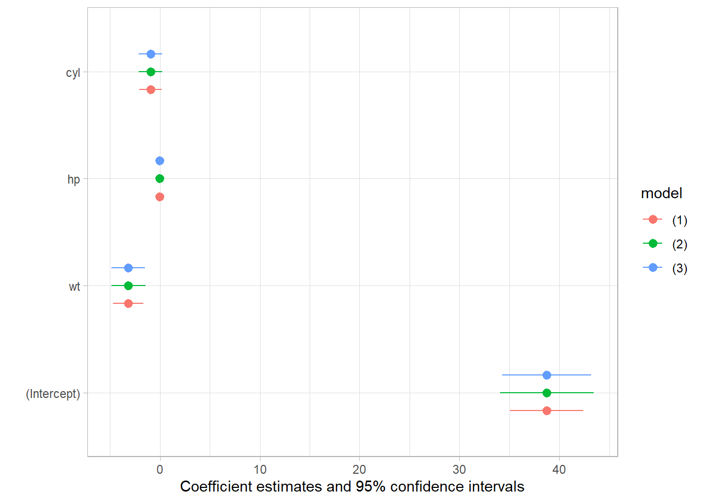


``` r
# stargazer examples (as in text)
library("stargazer")
stargazer(attitude)
linear.1 <-
    lm(rating ~ complaints + privileges + learning + raises + critical,
       data = attitude)
linear.2 <-
    lm(rating ~ complaints + privileges + learning, data = attitude)
attitude$high.rating <- (attitude$rating > 70)
probit.model <-
    glm(
        high.rating ~ learning + critical + advance,
        data = attitude,
        family = binomial(link = "probit")
    )
stargazer(linear.1,
          linear.2,
          probit.model,
          title = "Results",
          align = TRUE)
```


``` r
# LaTeX-ready stargazer (as in text)
stargazer(
    linear.1,
    linear.2,
    probit.model,
    title = "Regression Results",
    align = TRUE,
    dep.var.labels = c("Overall Rating", "High Rating"),
    covariate.labels = c(
        "Handling of Complaints",
        "No Special Privileges",
        "Opportunity to Learn",
        "Performance-Based Raises",
        "Too Critical",
        "Advancement"
    ),
    omit.stat = c("LL", "ser", "f"),
    no.space = TRUE
)
```


``` r
# ASCII text output (as in text)
stargazer(
    linear.1,
    linear.2,
    type = "text",
    title = "Regression Results",
    dep.var.labels = c("Overall Rating", "High Rating"),
    covariate.labels = c(
        "Handling of Complaints",
        "No Special Privileges",
        "Opportunity to Learn",
        "Performance-Based Raises",
        "Too Critical",
        "Advancement"
    ),
    omit.stat = c("LL", "ser", "f"),
    ci = TRUE,
    ci.level = 0.90,
    single.row = TRUE
)
#> 
#> Regression Results
#> ========================================================================
#>                                        Dependent variable:              
#>                          -----------------------------------------------
#>                                          Overall Rating                 
#>                                    (1)                     (2)          
#> ------------------------------------------------------------------------
#> Handling of Complaints   0.692*** (0.447, 0.937) 0.682*** (0.470, 0.894)
#> No Special Privileges    -0.104 (-0.325, 0.118)  -0.103 (-0.316, 0.109) 
#> Opportunity to Learn      0.249 (-0.013, 0.512)   0.238* (0.009, 0.467) 
#> Performance-Based Raises -0.033 (-0.366, 0.299)                         
#> Too Critical              0.015 (-0.227, 0.258)                         
#> Advancement              11.011 (-8.240, 30.262) 11.258 (-0.779, 23.296)
#> ------------------------------------------------------------------------
#> Observations                       30                      30           
#> R2                                0.715                   0.715         
#> Adjusted R2                       0.656                   0.682         
#> ========================================================================
#> Note:                                        *p<0.1; **p<0.05; ***p<0.01
```


``` r
# Correlation table
correlation.matrix <-
    cor(attitude[, c("rating", "complaints", "privileges")])
stargazer(correlation.matrix, title = "Correlation Matrix")
```

**Pro Tip:** Save figures reproducibly for journals:


``` r
ggsave(filename = file.path('output','coef_plot.png'),
       plot = last_plot(),
       width = 6.5, height = 4.5, dpi = 300)
```
