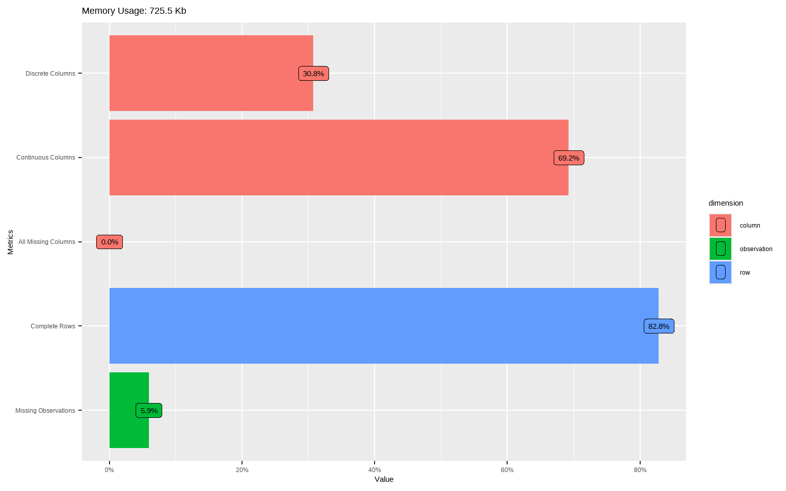
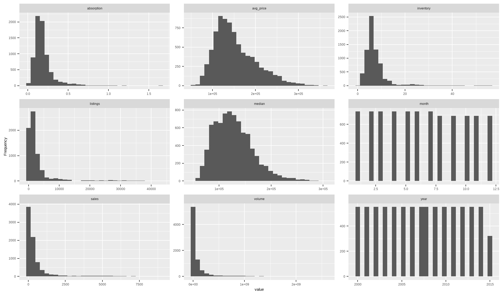
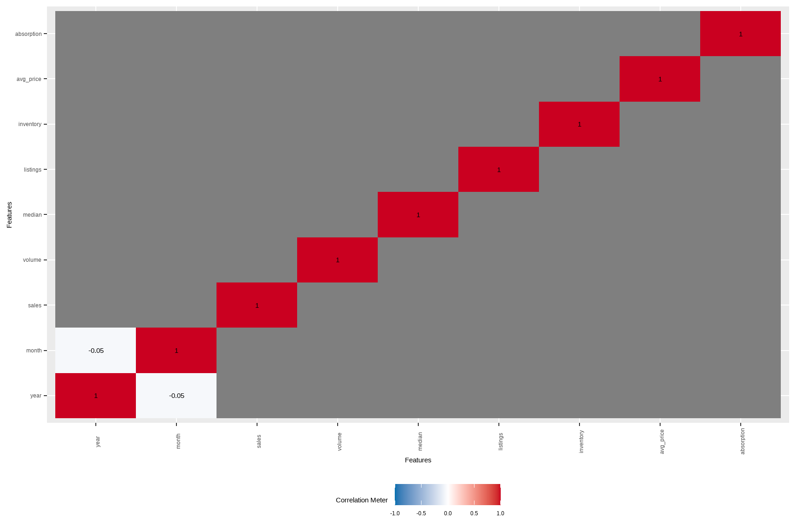
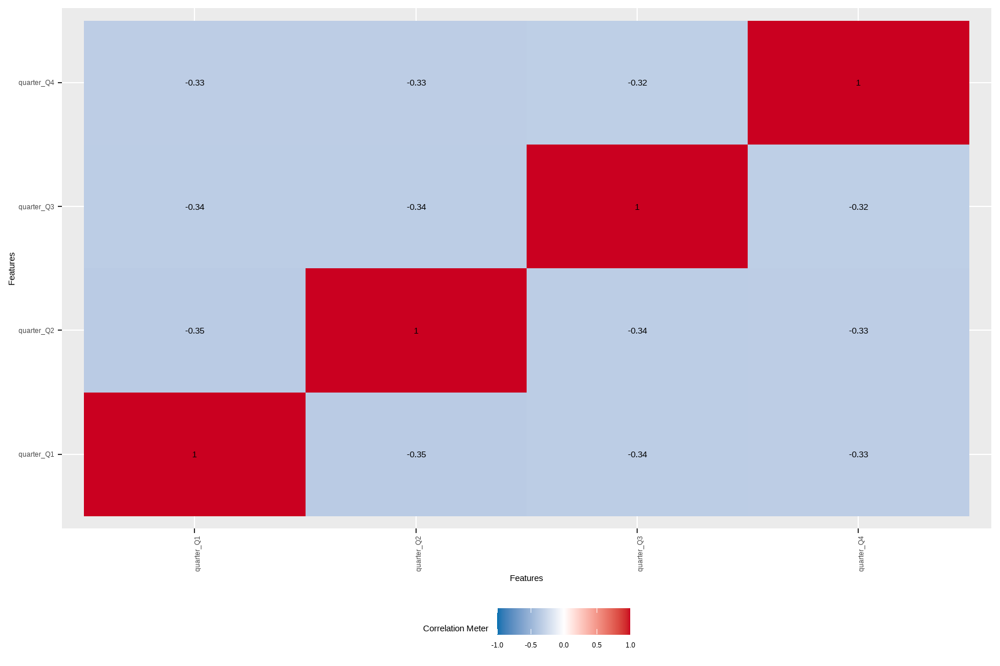
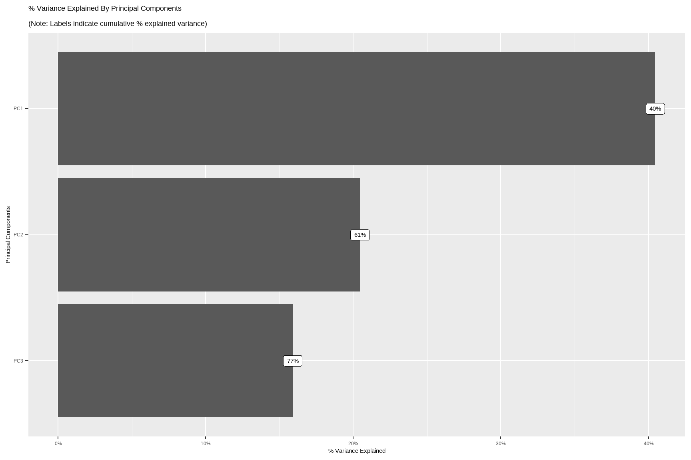
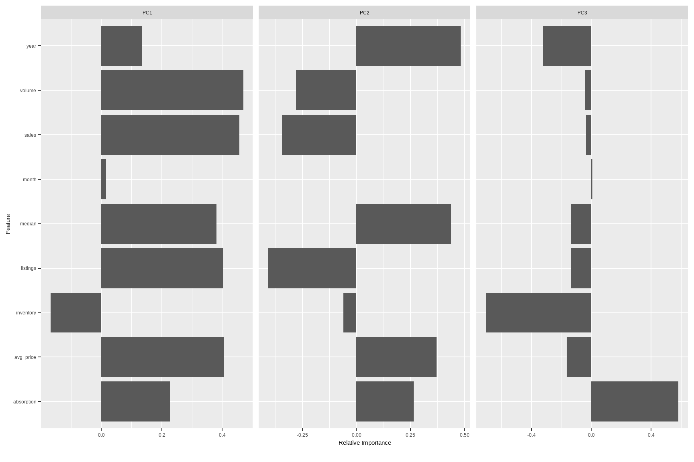
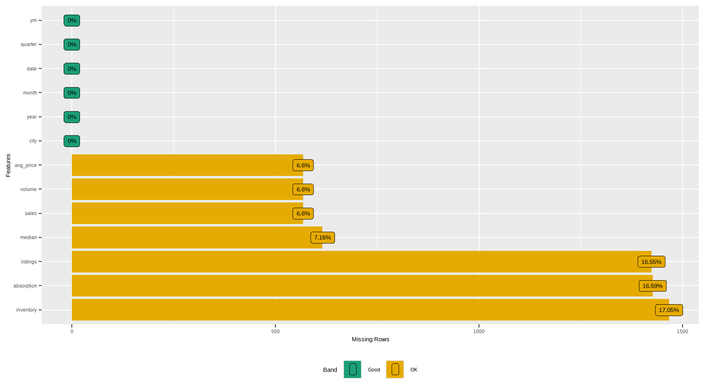
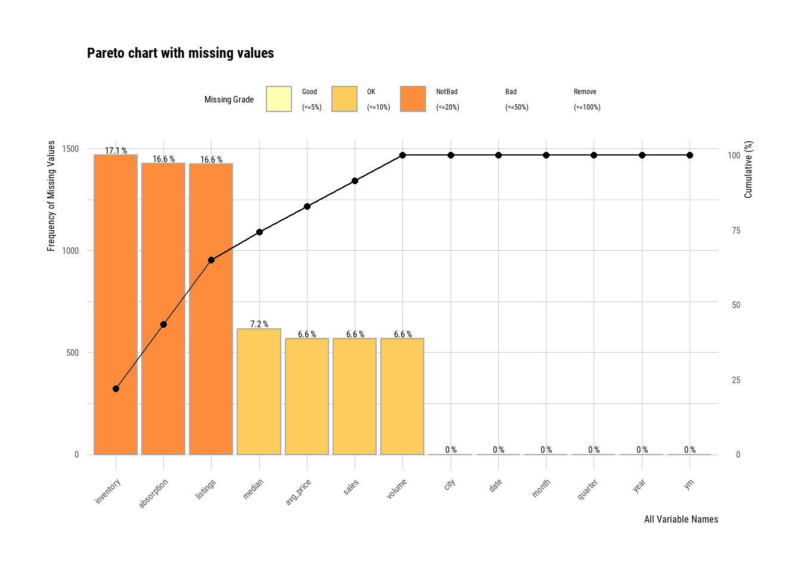
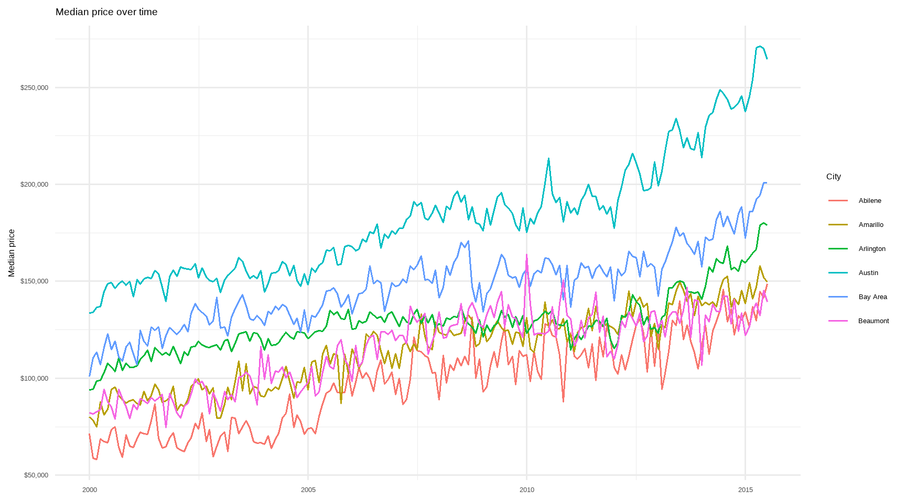
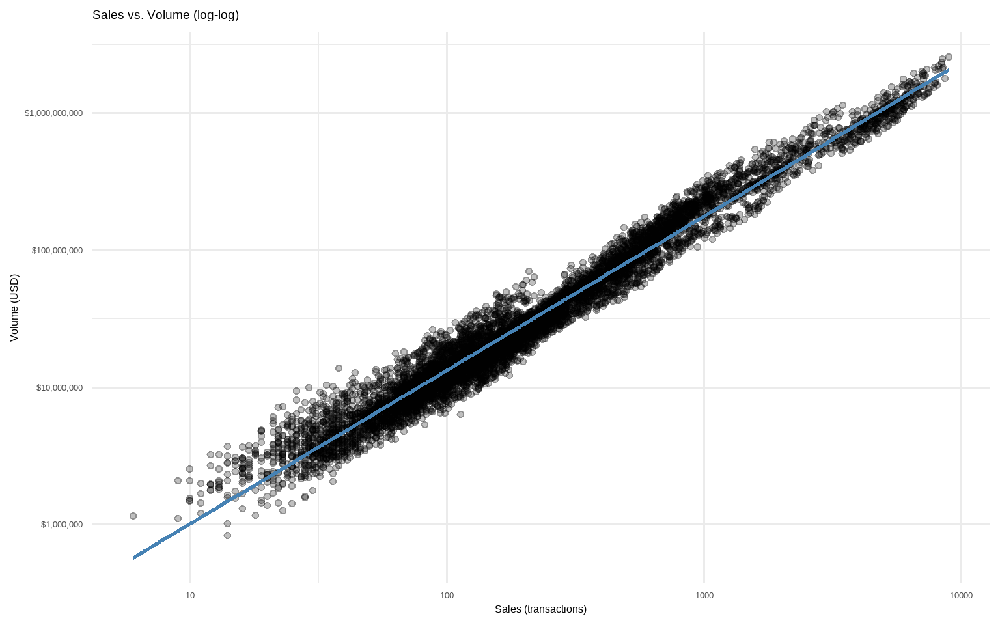

# Exploratory Data Analysis

This section demonstrates a fast, business-oriented EDA workflow on `ggplot2::txhousing`. We'll generate automated reports, engineer interpretable features for marketing/finance contexts, profile missingness, identify errors/outliers, and provide quick interactive tools your stakeholders will actually use. Where possible, we keep everything reproducible in code and easy to extend for your own datasets.


``` r
# Core packages
# install.packages(c("tidyverse","lubridate","DataExplorer","dataReporter","skimr","rpivotTable","esquisse","dlookr"))
library(ggplot2)
library(dplyr)
library(tidyr)
library(lubridate)
library(ggplot2)
library(DataExplorer)
library(skimr)
library(dlookr)

# Data: ggplot2 ships with txhousing
data("txhousing", package = "ggplot2")

# Create a clean working copy with business-friendly engineered features
tx <- txhousing %>%
  mutate(
    date = make_date(year, month, 1),
    # Average price per sale (proxy for ARPU-like metric in sales)
    avg_price = ifelse(sales > 0, volume / sales, NA_real_),
    # Absorption-like metric: sales per listing (how fast inventory turns)
    absorption = ifelse(listings > 0, sales / listings, NA_real_),
    # Months of inventory is already provided as `inventory`
    # Seasonal and calendar features
    quarter = factor(quarter(date), labels = c("Q1", "Q2", "Q3", "Q4")),
    ym = factor(format(date, "%Y-%m")),
    city = as.factor(city)
  )

# A couple of quick sanity checks
stopifnot(all(
    c(
        "city",
        "year",
        "month",
        "sales",
        "volume",
        "median",
        "listings",
        "inventory"
    ) %in% names(tx)
))

# Preview
dplyr::glimpse(tx)
#> Rows: 8,602
#> Columns: 13
#> $ city       <fct> Abilene, Abilene, Abilene, Abilene, Abilene, Abilene, Abile…
#> $ year       <int> 2000, 2000, 2000, 2000, 2000, 2000, 2000, 2000, 2000, 2000,…
#> $ month      <int> 1, 2, 3, 4, 5, 6, 7, 8, 9, 10, 11, 12, 1, 2, 3, 4, 5, 6, 7,…
#> $ sales      <dbl> 72, 98, 130, 98, 141, 156, 152, 131, 104, 101, 100, 92, 75,…
#> $ volume     <dbl> 5380000, 6505000, 9285000, 9730000, 10590000, 13910000, 126…
#> $ median     <dbl> 71400, 58700, 58100, 68600, 67300, 66900, 73500, 75000, 645…
#> $ listings   <dbl> 701, 746, 784, 785, 794, 780, 742, 765, 771, 764, 721, 658,…
#> $ inventory  <dbl> 6.3, 6.6, 6.8, 6.9, 6.8, 6.6, 6.2, 6.4, 6.5, 6.6, 6.2, 5.7,…
#> $ date       <date> 2000-01-01, 2000-02-01, 2000-03-01, 2000-04-01, 2000-05-01…
#> $ avg_price  <dbl> 74722.22, 66377.55, 71423.08, 99285.71, 75106.38, 89166.67,…
#> $ absorption <dbl> 0.10271041, 0.13136729, 0.16581633, 0.12484076, 0.17758186,…
#> $ quarter    <fct> Q1, Q1, Q1, Q2, Q2, Q2, Q3, Q3, Q3, Q4, Q4, Q4, Q1, Q1, Q1,…
#> $ ym         <fct> 2000-01, 2000-02, 2000-03, 2000-04, 2000-05, 2000-06, 2000-…
```

------------------------------------------------------------------------

## Data Report

Automate a first-pass profile to see dimensions, types, basic completeness, and distributions.


``` r
# High-level overview
introduce(tx)
```


``` r
# Structural intro plots
plot_intro(tx)
```




``` r
# Quick distribution sweep for numerics (great to spot skew and heavy tails)
plot_histogram(tx, ncol = 3L)
```




``` r
# Pairwise correlations (continuous); useful for multicollinearity hints
# Note: if your dataset has many numerics, set cor_args = list(use = "pairwise.complete.obs")
plot_correlation(tx, type = "continuous")
```




``` r
# If you want correlations/associations among discrete variables:
# (city and quarter here; may be high-cardinality)
plot_correlation(tx %>% select(city, quarter), type = "discrete")
```




``` r
# Quick PCA map for continuous variables (after standardizing)
DataExplorer::plot_prcomp(tx %>%
  select(where(is.numeric)) %>%
  na.omit()
)
```



*Tip:* For very wide tables, use `maxcat` in `DataExplorer` functions to cap cardinality for cleaner plots.

------------------------------------------------------------------------

## Feature Engineering

Business-minded transforms often beat fancy models. The goal is interpretability and better signal-to-noise.


``` r
fe_tx <- tx %>%
  mutate(
    # Year-month numeric for time-aware models
    t_index = as.integer(zoo::as.yearmon(date)),
    # Price momentum: rolling median (by city) as a simple trend proxy
    median_roll3 = dplyr::lag(slider::slide_dbl(median, mean, .before = 2, .complete = TRUE), 0), 
    # Volume-per-listing: marketing pipeline proxy (dollars per active listing)
    vol_per_listing = ifelse(listings > 0, volume / listings, NA_real_),
    # Seasonality flags
    is_peak_summer = month(date) %in% 6:8,
    is_december = month(date) == 12
  )
head(fe_tx)
#> # A tibble: 6 × 18
#>   city    year month sales volume median listings inventory date       avg_price
#>   <fct>  <int> <int> <dbl>  <dbl>  <dbl>    <dbl>     <dbl> <date>         <dbl>
#> 1 Abile…  2000     1    72 5.38e6  71400      701       6.3 2000-01-01    74722.
#> 2 Abile…  2000     2    98 6.51e6  58700      746       6.6 2000-02-01    66378.
#> 3 Abile…  2000     3   130 9.28e6  58100      784       6.8 2000-03-01    71423.
#> 4 Abile…  2000     4    98 9.73e6  68600      785       6.9 2000-04-01    99286.
#> 5 Abile…  2000     5   141 1.06e7  67300      794       6.8 2000-05-01    75106.
#> 6 Abile…  2000     6   156 1.39e7  66900      780       6.6 2000-06-01    89167.
#> # ℹ 8 more variables: absorption <dbl>, quarter <fct>, ym <fct>, t_index <int>,
#> #   median_roll3 <dbl>, vol_per_listing <dbl>, is_peak_summer <lgl>,
#> #   is_december <lgl>
```

One-hot encode high-utility discrete features (keep top cities to avoid huge design matrices)

**Note**: `dummify()` will create binary indicators and drop the original variable by default.

To avoid exploding dimensions, we lump rare cities first.


``` r
fe_tx_small <- fe_tx %>%
    mutate(city_lumped = forcats::fct_lump_n(city, n = 10, other_level = "Other"))
tx_dummy <-
    dummify(fe_tx_small %>% select(-city), select = "city_lumped")
names(tx_dummy)[1:15]
#>  [1] "year"            "month"           "sales"           "volume"         
#>  [5] "median"          "listings"        "inventory"       "avg_price"      
#>  [9] "absorption"      "t_index"         "median_roll3"    "vol_per_listing"
#> [13] "date"            "quarter"         "ym"
```


``` r
# Separate continuous and discrete columns for targeted transformations/modeling
spl <- split_columns(tx)
names(spl)
#> [1] "discrete"        "continuous"      "num_discrete"    "num_continuous" 
#> [5] "num_all_missing"
```

*Rules of thumb:*

-   Normalize skewed monetary variables (e.g., $\log(\text{volume}+1)$) before linear modeling.
-   Group rare categories and avoid too many dummies relative to $n$.
-   Create business KPIs: `avg_price`, `absorption`, `vol_per_listing`, and simple momentum features.

------------------------------------------------------------------------

## Missing Data

Missingness is information. First detect, then decide: delete, impute, or model it explicitly.


``` r
# Counts by variable
profile_missing(tx)
#> # A tibble: 13 × 3
#>    feature    num_missing pct_missing
#>    <fct>            <int>       <dbl>
#>  1 city                 0      0     
#>  2 year                 0      0     
#>  3 month                0      0     
#>  4 sales              568      0.0660
#>  5 volume             568      0.0660
#>  6 median             616      0.0716
#>  7 listings          1424      0.166 
#>  8 inventory         1467      0.171 
#>  9 date                 0      0     
#> 10 avg_price          568      0.0660
#> 11 absorption        1427      0.166 
#> 12 quarter              0      0     
#> 13 ym                   0      0
```


``` r
plot_missing(tx)
```




``` r
# Simple tidy summary (counts and proportions)
tx %>%
    summarise(across(everything(),
                     ~ sprintf(
                         "%d (%.1f%%)", sum(is.na(.)), 100 * mean(is.na(.))
                     ),
                     .names = "{.col}")) %>%
    pivot_longer(everything(), names_to = "variable", values_to = "n_pct_na") %>%
    arrange(desc(n_pct_na)) %>%
    head(12)
#> # A tibble: 12 × 2
#>    variable   n_pct_na    
#>    <chr>      <chr>       
#>  1 median     616 (7.2%)  
#>  2 sales      568 (6.6%)  
#>  3 volume     568 (6.6%)  
#>  4 avg_price  568 (6.6%)  
#>  5 inventory  1467 (17.1%)
#>  6 absorption 1427 (16.6%)
#>  7 listings   1424 (16.6%)
#>  8 city       0 (0.0%)    
#>  9 year       0 (0.0%)    
#> 10 month      0 (0.0%)    
#> 11 date       0 (0.0%)    
#> 12 quarter    0 (0.0%)
```


``` r
# Example: median imputation for a few numerics (for demonstration only)
# (In modeling, prefer imputations *within* resampling using recipes/caret/tidymodels.)
tx_imputed <- tx %>%
  mutate(
    sales     = ifelse(is.na(sales),     median(sales,     na.rm = TRUE), sales),
    listings  = ifelse(is.na(listings),  median(listings,  na.rm = TRUE), listings),
    inventory = ifelse(is.na(inventory), median(inventory, na.rm = TRUE), inventory),
    median    = ifelse(is.na(median),    median(median,    na.rm = TRUE), median)
  )
skimr::skim(tx_imputed %>% select(sales, listings, inventory, median))
```


Table: (\#tab:unnamed-chunk-13)Data summary

|                         |                             |
|:------------------------|:----------------------------|
|Name                     |tx_imputed %>% select(sal... |
|Number of rows           |8602                         |
|Number of columns        |4                            |
|_______________________  |                             |
|Column type frequency:   |                             |
|numeric                  |4                            |
|________________________ |                             |
|Group variables          |None                         |


**Variable type: numeric**

|skim_variable | n_missing| complete_rate|      mean|       sd|    p0|      p25|      p50|       p75|     p100|hist  |
|:-------------|---------:|-------------:|---------:|--------:|-----:|--------:|--------:|---------:|--------:|:-----|
|sales         |         0|             1|    524.44|  1077.59|     6|     90.0|    169.0|    432.00|   8945.0|▇▁▁▁▁ |
|listings      |         0|             1|   2896.76|  5499.11|     0|    756.0|   1283.0|   2527.75|  43107.0|▇▁▁▁▁ |
|inventory     |         0|             1|      7.01|     4.22|     0|      5.2|      6.2|      7.57|     55.9|▇▁▁▁▁ |
|median        |         0|             1| 127821.26| 36014.21| 50000| 101725.0| 123800.0| 147900.00| 304200.0|▃▇▃▁▁ |


``` r
# dlookr helpers (diagnose and visualize NA concentration)
diagnose(tx)
#> # A tibble: 13 × 6
#>    variables  types   missing_count missing_percent unique_count unique_rate
#>    <chr>      <chr>           <int>           <dbl>        <int>       <dbl>
#>  1 city       factor              0            0              46    0.00535 
#>  2 year       integer             0            0              16    0.00186 
#>  3 month      integer             0            0              12    0.00140 
#>  4 sales      numeric           568            6.60         1712    0.199   
#>  5 volume     numeric           568            6.60         7495    0.871   
#>  6 median     numeric           616            7.16         1538    0.179   
#>  7 listings   numeric          1424           16.6          3703    0.430   
#>  8 inventory  numeric          1467           17.1           296    0.0344  
#>  9 date       Date                0            0             187    0.0217  
#> 10 avg_price  numeric           568            6.60         7917    0.920   
#> 11 absorption numeric          1427           16.6          6880    0.800   
#> 12 quarter    factor              0            0               4    0.000465
#> 13 ym         factor              0            0             187    0.0217
plot_na_pareto(tx)
```



*Best practice:* Impute inside a modeling pipeline (e.g., `recipes::step_impute_median()`), and consider adding "was missing" flags to retain signal from missingness patterns.

------------------------------------------------------------------------

## Error Identification

Catch anomalies early: impossible values, data entry glitches, or KPI mismatches.

1.  Logical constraints


``` r

violations <- tx %>%
  mutate(
    v_sales_negative   = sales < 0,
    v_volume_negative  = volume < 0,
    v_listings_negative= listings < 0,
    v_inventory_negative = inventory < 0
  ) %>%
  summarise(across(starts_with("v_"), ~sum(.x, na.rm = TRUE)))
violations
#> # A tibble: 1 × 4
#>   v_sales_negative v_volume_negative v_listings_negative v_inventory_negative
#>              <int>             <int>               <int>                <int>
#> 1                0                 0                   0                    0
```

2.  Price coherence: median vs. average price (avg_price = volume/sales)

Large gaps are not necessarily errors, but extreme ratios can flag data issues.


``` r
coherence <- tx %>%
  mutate(avg_price = ifelse(sales > 0, volume / sales, NA_real_),
         ratio = median / avg_price) %>%
  filter(!is.na(ratio), is.finite(ratio)) %>%
  summarise(
    n = n(),
    ratio_p01 = quantile(ratio, 0.01),
    ratio_p99 = quantile(ratio, 0.99),
    extreme = sum(ratio < 0.25 | ratio > 4, na.rm = TRUE)
  )
coherence
#> # A tibble: 1 × 4
#>       n ratio_p01 ratio_p99 extreme
#>   <int>     <dbl>     <dbl>   <int>
#> 1  7985     0.682     0.992       0
```

3.  Outliers (univariate) with `dlookr`


``` r
out_summary <- diagnose_outlier(tx %>% select(sales, volume, median, listings, inventory, avg_price))
out_summary %>% arrange(desc(outliers_cnt)) %>% head(10)
#> # A tibble: 6 × 6
#>   variables outliers_cnt outliers_ratio outliers_mean    with_mean without_mean
#>   <chr>            <int>          <dbl>         <dbl>        <dbl>        <dbl>
#> 1 volume            1116          13.0    563924698.  106858621.    33125498.  
#> 2 sales              899          10.5         3057.        550.         234.  
#> 3 listings           742           8.63       17522.       3217.        1568.  
#> 4 inventory          437           5.08          20.8         7.17         6.29
#> 5 median             147           1.71      248251.     128131.      125879.  
#> 6 avg_price          143           1.66      300786.     153202.      150528.
```


``` r
# Full, human-readable data quality report (HTML) with dataReporter
# install.packages("dataReporter")
library(dataReporter)
makeDataReport(tx)  # Generates an HTML report in your working directory
```

------------------------------------------------------------------------

## Summary statistics

Concise summaries for continuous and categorical variables, plus grouped business KPIs.


``` r
skim(tx)
```


Table: (\#tab:unnamed-chunk-19)Data summary

|                         |     |
|:------------------------|:----|
|Name                     |tx   |
|Number of rows           |8602 |
|Number of columns        |13   |
|_______________________  |     |
|Column type frequency:   |     |
|Date                     |1    |
|factor                   |3    |
|numeric                  |9    |
|________________________ |     |
|Group variables          |None |


**Variable type: Date**

|skim_variable | n_missing| complete_rate|min        |max        |median     | n_unique|
|:-------------|---------:|-------------:|:----------|:----------|:----------|--------:|
|date          |         0|             1|2000-01-01 |2015-07-01 |2007-10-01 |      187|


**Variable type: factor**

|skim_variable | n_missing| complete_rate|ordered | n_unique|top_counts                             |
|:-------------|---------:|-------------:|:-------|--------:|:--------------------------------------|
|city          |         0|             1|FALSE   |       46|Abi: 187, Ama: 187, Arl: 187, Aus: 187 |
|quarter       |         0|             1|FALSE   |        4|Q1: 2208, Q2: 2208, Q3: 2116, Q4: 2070 |
|ym            |         0|             1|FALSE   |      187|200: 46, 200: 46, 200: 46, 200: 46     |


**Variable type: numeric**

|skim_variable | n_missing| complete_rate|         mean|           sd|        p0|         p25|         p50|         p75|         p100|hist  |
|:-------------|---------:|-------------:|------------:|------------:|---------:|-----------:|-----------:|-----------:|------------:|:-----|
|year          |         0|          1.00|      2007.30|         4.50|   2000.00|     2003.00|     2007.00|     2011.00| 2.015000e+03|▇▆▆▆▅ |
|month         |         0|          1.00|         6.41|         3.44|      1.00|        3.00|        6.00|        9.00| 1.200000e+01|▇▅▅▅▇ |
|sales         |       568|          0.93|       549.56|      1110.74|      6.00|       86.00|      169.00|      467.00| 8.945000e+03|▇▁▁▁▁ |
|volume        |       568|          0.93| 106858620.78| 244933668.97| 835000.00| 10840000.00| 22986824.00| 75121388.75| 2.568157e+09|▇▁▁▁▁ |
|median        |       616|          0.93|    128131.44|     37359.58|  50000.00|   100000.00|   123800.00|   150000.00| 3.042000e+05|▅▇▃▁▁ |
|listings      |      1424|          0.83|      3216.90|      5968.33|      0.00|      682.00|     1283.00|     2953.75| 4.310700e+04|▇▁▁▁▁ |
|inventory     |      1467|          0.83|         7.17|         4.61|      0.00|        4.90|        6.20|        8.15| 5.590000e+01|▇▁▁▁▁ |
|avg_price     |       568|          0.93|    153202.38|     48188.98|  54782.61|   118099.79|   142510.87|   181806.06| 3.626882e+05|▃▇▃▁▁ |
|absorption    |      1427|          0.83|         0.18|         0.11|      0.01|        0.12|        0.16|        0.21| 1.650000e+00|▇▁▁▁▁ |


``` r
# City-level yearly KPIs
city_year <- tx %>%
    group_by(city, year) %>%
    summarise(
        n_months      = n(),
        sales_total   = sum(sales, na.rm = TRUE),
        volume_total  = sum(volume, na.rm = TRUE),
        median_price  = median(median, na.rm = TRUE),
        avg_inventory = mean(inventory, na.rm = TRUE),
        .groups = "drop"
    ) %>%
    arrange(city, year)
head(city_year, 10)
#> # A tibble: 10 × 7
#>    city     year n_months sales_total volume_total median_price avg_inventory
#>    <fct>   <int>    <int>       <dbl>        <dbl>        <dbl>         <dbl>
#>  1 Abilene  2000       12        1375    108575000        67100          6.47
#>  2 Abilene  2001       12        1431    114365000        70050          6.62
#>  3 Abilene  2002       12        1516    118675000        67100          5.84
#>  4 Abilene  2003       12        1632    135675000        71850          5.68
#>  5 Abilene  2004       12        1830    159670000        73200          4.56
#>  6 Abilene  2005       12        1977    198855000        92400          3.82
#>  7 Abilene  2006       12        1997    227530000        99900          4.48
#>  8 Abilene  2007       12        2003    232062585       102800          4.96
#>  9 Abilene  2008       12        1651    192520335       106900          6.32
#> 10 Abilene  2009       12        1634    202357756       109050          6.12
```


``` r
# Example visual: price over time for a few major cities
top_cities <- tx %>%
    count(city, sort = TRUE) %>%
    slice_head(n = 6) %>%
    pull(city)

tx %>%
    filter(city %in% top_cities) %>%
    ggplot(aes(date, median, color = city)) +
    geom_line(linewidth = 0.7) +
    scale_y_continuous(labels = scales::dollar_format()) +
    labs(
        title = "Median price over time",
        x = NULL,
        y = "Median price",
        color = "City"
    ) +
    theme_minimal(base_size = 12)
```




``` r
# Volume vs. Sales (log-scale to reduce skew)
tx %>%
    filter(sales > 0, volume > 0) %>%
    ggplot(aes(sales, volume)) +
    geom_point(alpha = 0.25) +
    scale_x_log10() +
    scale_y_log10(labels = scales::dollar_format()) +
    geom_smooth(method = "lm",
                se = FALSE,
                color = "steelblue") +
    labs(title = "Sales vs. Volume (log-log)",
         x = "Sales (transactions)",
         y = "Volume (USD)") +
    theme_minimal(base_size = 12)
```



------------------------------------------------------------------------

## Not so code-y process

### Quick and dirty way to look at your data


``` r
# install.packages("rpivotTable")
library(rpivotTable)

# Works best in HTML output; drag-and-drop just like Excel PivotTables
rpivotTable(
  data = tx,
  rows = "city",
  cols = "year",
  vals = "sales",
  aggregatorName = "Sum",
  rendererName = "Heatmap"
)
```

### Code generation and wrangling (visual)


``` r
# install.packages("esquisse")
library(esquisse)
# Launch the GUI to build ggplots and dplyr pipelines interactively
esquisse::esquisser(tx)
```

------------------------------------------------------------------------

## Shiny-app based Tableau style


``` r
# Minimal Shiny-style dashboard idea (skeleton)
# shinyApp(
#   ui = fluidPage(
#     titlePanel("TX Housing Explorer"),
#     sidebarLayout(
#       sidebarPanel(selectInput("city", "City", choices = sort(unique(tx$city)), selected = "Houston")),
#       mainPanel(plotOutput("trend"))
#     )
#   ),
#   server = function(input, output, session) {
#     output$trend <- renderPlot({
#       tx %>%
#         filter(city == input$city) %>%
#         ggplot(aes(date, median)) + geom_line() +
#         labs(x = NULL, y = "Median Price") +
#         theme_minimal()
#     })
#   }
# )
```

------------------------------------------------------------------------

## Customize your daily/automatic report


``` r
# Option A: One-liner automated HTML report (DataExplorer)
DataExplorer::create_report(tx, y = "median")  # sets target variable for focus

# Option B: Knit this Rmd on a schedule (cron/Task Scheduler)
# rmarkdown::render("eda_txhousing.Rmd", output_format = "html_document")
```


``` r
# Optionally explore additional EDA helpers
# install.packages(c("chronicle","descriptr"))
library(chronicle)
library(descriptr)
# Tip: Use these packages selectively; their APIs evolve.
# Prefer stable verbs above; consult vignettes for current functions.
```

------------------------------------------------------------------------

### Appendix: Small "gotchas" to keep in mind

-   For correlation heatmaps, ensure you're not mixing units without scaling; use `scale. = TRUE` in PCA.
-   For discrete correlations, high-cardinality features (like many cities) can make matrices unwieldy. Thus, lump or select top-$k$ first.
-   Imputation should be inside resampling to avoid leakage.
-   KPI checks (e.g., `median` vs `volume/sales`) are *diagnostics*, not proofs of error. Hence, investigate outliers before removal.
