# Sensitivity Analysis and Robustness Checks

> "Do robustness checks until you believe the result."
>
> --- the author, having repeatedly experienced the brief joy of promising results only to watch them collapse under closer inspection, and now treating every finding as too good to be true until proven otherwise.

Sensitivity analysis and robustness checks are critical components of rigorous empirical research. They help researchers assess the stability of their findings across different model specifications, evaluate the potential impact of omitted variable bias, and provide evidence for or against causal interpretations. This chapter provides guidance on implementing various sensitivity analysis techniques, ranging from specification curve analysis to sophisticated methods for quantifying omitted variable bias.

## The Philosophy of Robustness

Before diving into specific techniques, it's worth understanding why robustness checks matter. In empirical research, we rarely have perfect certainty about the "correct" specification. Our choices about which controls to include, how to measure variables, which functional forms to use, and how to address endogeneity can all influence our results. Sensitivity analysis helps us understand whether our main conclusions depend critically on these choices, or whether they remain stable across reasonable alternatives.

A robust finding is one that persists across multiple plausible specifications. This doesn't necessarily mean the coefficient estimate must be identical across all specifications, some variation is expected and often informative. Rather, robustness means that the key substantive conclusion (e.g., the sign, statistical significance, or economic magnitude of an effect) remains consistent despite reasonable variation in modeling choices.

## Specification Curve Analysis

Specification curve analysis (also known as multiverse analysis or the specification robustness graph) provides a systematic way to examine how results vary across a large set of defensible specifications. Rather than reporting a single "preferred" specification, this approach acknowledges that multiple specifications may be equally justifiable and examines the distribution of estimates across all of them.

### Conceptual Foundation

The specification curve approach was formalized by @simonsohn2020specification, though similar ideas have appeared under various names in the literature. The key insight is that researchers make many decisions when specifying a model: which controls to include, which fixed effects to add, how to cluster standard errors, etc. And these decisions can be viewed as creating a "multiverse" of possible specifications. By systematically varying these choices and examining the resulting distribution of estimates, we can assess whether our main conclusion depends on arbitrary specification choices.

A specification curve typically consists of two panels:

1.  **The coefficient panel**: Shows the point estimate and confidence interval for the main variable of interest across all specifications, typically sorted by coefficient magnitude
2.  **The specification panel**: Shows which modeling choices were made in each specification (e.g., which controls were included, which fixed effects were used)

This visualization makes it easy to see whether results are driven by particular specification choices and whether the finding is robust across the specification space.

### The `starbility` Package

The `starbility` package provides a flexible and user-friendly implementation of specification curve analysis. It works seamlessly with various model types and allows for sophisticated customization.

#### Installation and Setup


``` r
# Install from GitHub
# devtools::install_github('https://github.com/AakaashRao/starbility')
library(starbility)

# Load other required packages
library(tidyverse)  # For data manipulation and visualization
library(lfe)        # For fixed effects models
library(broom)      # For tidying model output
library(cowplot)    # For combining plots
```

#### Basic Specification Curve with Multiple Controls

Let's start with an example using the diamonds dataset. This example demonstrates how to systematically vary control variables and visualize the resulting specification curve.


``` r
library(tidyverse)
library(starbility)
library(lfe)

# Load and prepare data
data("diamonds")
set.seed(43)  # For reproducibility

# Create a subset for computational efficiency
# In practice, you'd use your full dataset
indices = sample(1:nrow(diamonds),
                 replace = FALSE,
                 size = round(nrow(diamonds) / 20))
diamonds = diamonds[indices, ]

# Create additional variables for demonstration
diamonds$high_clarity = diamonds$clarity %in% c('VS1','VVS2','VVS1','IF')
diamonds$log_price = log(diamonds$price)
diamonds$log_carat = log(diamonds$carat)
```

Now let's define our specification universe. The key is to think carefully about which specification choices are defensible and should be explored:


``` r
# Base controls: These are included in ALL specifications
# Use this for controls that you believe should always be included based on theory
base_controls = c(
  'Diamond dimensions' = 'x + y + z'  # Physical dimensions
)

# Permutable controls: These will be included in all possible combinations
# These are controls where theory doesn't give clear guidance on inclusion
perm_controls = c(
  'Depth' = 'depth',
  'Table width' = 'table'
)

# Permutable fixed effects: Different types of fixed effects to explore
# Useful when you have multiple ways to control for unobserved heterogeneity
perm_fe_controls = c(
  'Cut FE' = 'cut',
  'Color FE' = 'color'
)

# Non-permutable fixed effects: Alternative specifications (only one included at a time)
# Use this when you have mutually exclusive ways of controlling for something
nonperm_fe_controls = c(
  'Clarity FE (granular)' = 'clarity',
  'Clarity FE (binary)' = 'high_clarity'
)

# If you want to explore instrumental variables specifications
instruments = 'x + y + z'

# Add sample weights for robustness
diamonds$sample_weights = runif(n = nrow(diamonds))
```

#### Custom Model Functions

One of the most powerful features of `starbility` is the ability to use custom model functions. This allows you to implement your preferred estimation approach, including custom standard errors, specific inference procedures, or alternative confidence intervals.


``` r
# Custom function for felm models with robust standard errors
# This function must return a vector of: c(coefficient, p-value, upper CI, lower CI)
starb_felm_custom = function(spec, data, rhs, ...) {
  # Convert specification string to formula
  spec = as.formula(spec)
  
  # Estimate the model using lfe::felm
  # felm is particularly useful for models with multiple fixed effects
  model = lfe::felm(spec, data = data) %>% 
    broom::tidy()  # Convert to tidy format

  # Extract results for the variable of interest (rhs)
  row  = which(model$term == rhs)
  coef = model[row, 'estimate'] %>% as.numeric()
  se   = model[row, 'std.error'] %>% as.numeric()
  p    = model[row, 'p.value'] %>% as.numeric()
  
  # Calculate confidence intervals
  # Here we use 99% CI for more conservative inference
  z = qnorm(0.995)  # 99% confidence level
  upper_ci = coef + z * se
  lower_ci = coef - z * se
  
  # For one-tailed tests, divide p-value by 2
  # Remove this if you want two-tailed p-values
  p_onetailed = p / 2
  
  return(c(coef, p_onetailed, upper_ci, lower_ci))
}

# Alternative: Custom function with heteroskedasticity-robust SEs
starb_lm_robust = function(spec, data, rhs, ...) {
  spec = as.formula(spec)
  
  # Estimate with HC3 robust standard errors
  model = lm(spec, data = data)
  robust_se = sandwich::vcovHC(model, type = "HC3")
  
  # Use lmtest for robust inference
  coef_test = lmtest::coeftest(model, vcov = robust_se)
  
  row  = which(rownames(coef_test) == rhs)
  coef = coef_test[row, 'Estimate']
  se   = coef_test[row, 'Std. Error']
  p    = coef_test[row, 'Pr(>|t|)']
  
  z = qnorm(0.975)  # 95% confidence level
  return(c(coef, p, coef + z * se, coef - z * se))
}
```

#### Creating the Specification Curve

Now we can generate our specification curve with all the bells and whistles (Figure \@ref(fig:robustness-specification-curve))


``` r
# Generate specification curve
# This will create plots showing how the coefficient varies across specifications
plots = stability_plot(
    data = diamonds,
    lhs = 'price',           # Dependent variable
    rhs = 'carat',           # Main independent variable of interest
    model = starb_felm_custom,  # Use our custom model function
    
    # Clustering and weights
    cluster = 'cut',            # Cluster standard errors by cut
    weights = 'sample_weights', # Use sample weights
    
    # Control variable specifications
    base = base_controls,       # Always included
    perm = perm_controls,       # All combinations
    perm_fe = perm_fe_controls, # All combinations of these FEs
    
    # Alternative: Use non-permutable FE (only one at a time)
    # nonperm_fe = nonperm_fe_controls,
    # fe_always = FALSE,  # Set to FALSE to include specs without any FEs
    
    # Instrumental variables (if needed)
    # iv = instruments,
    
    # Sorting and display options
    sort = "asc-by-fe",  # Options: "asc", "desc", "asc-by-fe", "desc-by-fe"
    
    # Visual customization
    error_geom = 'ribbon',  # Display error bands as ribbons (alternatives: 'linerange', 'none')
    # error_alpha = 0.2,    # Transparency of error bands
    # point_size = 1.5,     # Size of coefficient points
    # control_text_size = 10,  # Size of control labels
    
    # For datasets with fewer specifications, you might want:
    # control_geom = 'circle',  # Use circles instead of rectangles
    # point_size = 2,
    # control_spacing = 0.3,
    
    # Customize the y-axis range if needed
    # coef_ylim = c(-5000, 35000),
    
    # Adjust spacing between panels
    # trip_top = 3,
    
    # Relative height of coefficient panel vs control panel
    rel_height = 0.6
)
```


``` r
# Display the plots
plots
```

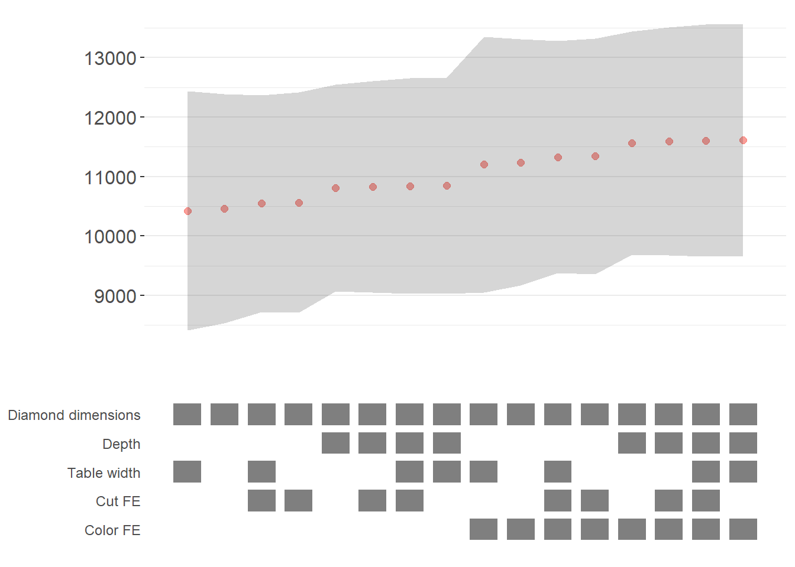

The specification curve uses color coding to indicate statistical significance:

-   **Red**: $p < 0.01$ (highly significant)
-   **Green**: $p < 0.05$ (significant)
-   **Blue**: $p < 0.1$ (marginally significant)
-   **Black**: $p > 0.1$ (not significant)

This color scheme makes it easy to see at a glance whether your finding is robust across specifications, or whether significance depends on particular specification choices.

### Advanced Specification Curve Techniques

#### Step-by-Step Control of the Process

For maximum flexibility, `starbility` allows you to control each step of the specification curve generation process. This is useful when you want to modify the grid of specifications, use custom model functions, or create highly customized visualizations.


``` r
# Ensure high_clarity variable exists
diamonds$high_clarity = diamonds$clarity %in% c('VS1','VVS2','VVS1','IF')

# Redefine controls for this example
base_controls = c(
  'Diamond dimensions' = 'x + y + z'
)

perm_controls = c(
  'Depth' = 'depth',
  'Table width' = 'table'
)

perm_fe_controls = c(
  'Cut FE' = 'cut',
  'Color FE' = 'color'
)

nonperm_fe_controls = c(
  'Clarity FE (granular)' = 'clarity',
  'Clarity FE (binary)' = 'high_clarity'
)

# Step 1: Create the control grid
# This generates all possible combinations of controls
grid1 = stability_plot(
  data = diamonds, 
  lhs = 'price', 
  rhs = 'carat', 
  perm = perm_controls,
  base = base_controls, 
  perm_fe = perm_fe_controls, 
  nonperm_fe = nonperm_fe_controls, 
  run_to = 2  # Stop after creating the grid
)

# Examine the grid structure
knitr::kable(grid1 %>% head(10))
```


| Diamond dimensions| Depth| Table width| Cut FE| Color FE|np_fe |
|------------------:|-----:|-----------:|------:|--------:|:-----|
|                  1|     0|           0|      0|        0|      |
|                  1|     1|           0|      0|        0|      |
|                  1|     0|           1|      0|        0|      |
|                  1|     1|           1|      0|        0|      |
|                  1|     0|           0|      1|        0|      |
|                  1|     1|           0|      1|        0|      |
|                  1|     0|           1|      1|        0|      |
|                  1|     1|           1|      1|        0|      |
|                  1|     0|           0|      0|        1|      |
|                  1|     1|           0|      0|        1|      |


``` r
# Each row represents a different specification
# Columns indicate which controls/FEs are included (1 = yes, 0 = no)

# Step 2: Generate model expressions
# This creates the actual formula for each specification
grid2 = stability_plot(
  grid = grid1,  # Use the grid from step 1
  data = diamonds, 
  lhs = 'price', 
  rhs = 'carat', 
  perm = perm_controls, 
  base = base_controls,
  run_from = 2,  # Start from step 2
  run_to = 3     # Stop after generating expressions
)

# View the formulas
knitr::kable(grid2 %>% head(10))
```


| Diamond dimensions| Depth| Table width|np_fe |expr                                               |
|------------------:|-----:|-----------:|:-----|:--------------------------------------------------|
|                  1|     0|           0|0     |price~carat+x+y+z&#124;0&#124;0&#124;0             |
|                  1|     1|           0|0     |price~carat+x+y+z+depth&#124;0&#124;0&#124;0       |
|                  1|     0|           1|0     |price~carat+x+y+z+table&#124;0&#124;0&#124;0       |
|                  1|     1|           1|0     |price~carat+x+y+z+depth+table&#124;0&#124;0&#124;0 |
|                  1|     0|           0|0     |price~carat+x+y+z&#124;0&#124;0&#124;0             |
|                  1|     1|           0|0     |price~carat+x+y+z+depth&#124;0&#124;0&#124;0       |
|                  1|     0|           1|0     |price~carat+x+y+z+table&#124;0&#124;0&#124;0       |
|                  1|     1|           1|0     |price~carat+x+y+z+depth+table&#124;0&#124;0&#124;0 |
|                  1|     0|           0|0     |price~carat+x+y+z&#124;0&#124;0&#124;0             |
|                  1|     1|           0|0     |price~carat+x+y+z+depth&#124;0&#124;0&#124;0       |


``` r
# Now each row has an 'expr' column with the full model formula

# Step 3: Estimate all models
# This runs the actual regressions
grid3 = stability_plot(
  grid = grid2,
  data = diamonds, 
  lhs = 'price', 
  rhs = 'carat', 
  perm = perm_controls, 
  base = base_controls,
  run_from = 3,
  run_to = 4
)

# View estimation results
knitr::kable(grid3 %>% head(10))
```


| Diamond dimensions| Depth| Table width|np_fe |expr                                               |     coef|p      | error_high| error_low|
|------------------:|-----:|-----------:|:-----|:--------------------------------------------------|--------:|:------|----------:|---------:|
|                  1|     0|           0|0     |price~carat+x+y+z&#124;0&#124;0&#124;0             | 10461.86|p<0.01 |   11031.84|  9891.876|
|                  1|     1|           0|0     |price~carat+x+y+z+depth&#124;0&#124;0&#124;0       | 10808.25|p<0.01 |   11388.81| 10227.683|
|                  1|     0|           1|0     |price~carat+x+y+z+table&#124;0&#124;0&#124;0       | 10423.42|p<0.01 |   10992.00|  9854.849|
|                  1|     1|           1|0     |price~carat+x+y+z+depth+table&#124;0&#124;0&#124;0 | 10851.31|p<0.01 |   11428.58| 10274.037|
|                  1|     0|           0|0     |price~carat+x+y+z&#124;0&#124;0&#124;0             | 10461.86|p<0.01 |   11031.84|  9891.876|
|                  1|     1|           0|0     |price~carat+x+y+z+depth&#124;0&#124;0&#124;0       | 10808.25|p<0.01 |   11388.81| 10227.683|
|                  1|     0|           1|0     |price~carat+x+y+z+table&#124;0&#124;0&#124;0       | 10423.42|p<0.01 |   10992.00|  9854.849|
|                  1|     1|           1|0     |price~carat+x+y+z+depth+table&#124;0&#124;0&#124;0 | 10851.31|p<0.01 |   11428.58| 10274.037|
|                  1|     0|           0|0     |price~carat+x+y+z&#124;0&#124;0&#124;0             | 10461.86|p<0.01 |   11031.84|  9891.876|
|                  1|     1|           0|0     |price~carat+x+y+z+depth&#124;0&#124;0&#124;0       | 10808.25|p<0.01 |   11388.81| 10227.683|


``` r
# Now includes coefficient estimates, p-values, and confidence intervals

# Step 4: Prepare data for plotting
# This creates the two dataframes needed for visualization
dfs = stability_plot(
  grid = grid3,
  data = diamonds, 
  lhs = 'price', 
  rhs = 'carat', 
  perm = perm_controls, 
  base = base_controls,
  run_from = 4,
  run_to = 5
)

coef_grid = dfs[[1]]      # Data for coefficient panel
control_grid = dfs[[2]]   # Data for control specification panel

knitr::kable(coef_grid %>% head(10))
```


| Diamond dimensions| Depth| Table width|np_fe |expr                                               |     coef|p      | error_high| error_low| model|
|------------------:|-----:|-----------:|:-----|:--------------------------------------------------|--------:|:------|----------:|---------:|-----:|
|                  1|     0|           0|0     |price~carat+x+y+z&#124;0&#124;0&#124;0             | 10461.86|p<0.01 |   11031.84|  9891.876|     1|
|                  1|     1|           0|0     |price~carat+x+y+z+depth&#124;0&#124;0&#124;0       | 10808.25|p<0.01 |   11388.81| 10227.683|     2|
|                  1|     0|           1|0     |price~carat+x+y+z+table&#124;0&#124;0&#124;0       | 10423.42|p<0.01 |   10992.00|  9854.849|     3|
|                  1|     1|           1|0     |price~carat+x+y+z+depth+table&#124;0&#124;0&#124;0 | 10851.31|p<0.01 |   11428.58| 10274.037|     4|
|                  1|     0|           0|0     |price~carat+x+y+z&#124;0&#124;0&#124;0             | 10461.86|p<0.01 |   11031.84|  9891.876|     5|
|                  1|     1|           0|0     |price~carat+x+y+z+depth&#124;0&#124;0&#124;0       | 10808.25|p<0.01 |   11388.81| 10227.683|     6|
|                  1|     0|           1|0     |price~carat+x+y+z+table&#124;0&#124;0&#124;0       | 10423.42|p<0.01 |   10992.00|  9854.849|     7|
|                  1|     1|           1|0     |price~carat+x+y+z+depth+table&#124;0&#124;0&#124;0 | 10851.31|p<0.01 |   11428.58| 10274.037|     8|
|                  1|     0|           0|0     |price~carat+x+y+z&#124;0&#124;0&#124;0             | 10461.86|p<0.01 |   11031.84|  9891.876|     9|
|                  1|     1|           0|0     |price~carat+x+y+z+depth&#124;0&#124;0&#124;0       | 10808.25|p<0.01 |   11388.81| 10227.683|    10|


``` r

# Step 5: Create the plot panels
# This generates the two ggplot objects
panels = stability_plot(
  data = diamonds, 
  lhs = 'price', 
  rhs = 'carat', 
  coef_grid = coef_grid,
  control_grid = control_grid,
  run_from = 5,
  run_to = 6
)

# Step 6: Combine and display
# Final step to create the complete visualization
final_plot = stability_plot(
  data = diamonds,
  lhs = 'price', 
  rhs = 'carat', 
  coef_panel = panels[[1]],
  control_panel = panels[[2]],
  run_from = 6,
  run_to = 7
)
```

#### Specification Curves for Non-Linear Models

Specification curve analysis is not limited to linear models. Here's how to implement it with logistic regression (Figure \@ref(fig:robustness-logit-curve)).


``` r
# Create binary outcome variable
diamonds$above_med_price = as.numeric(diamonds$price > median(diamonds$price))

# Add sample weights for logit model
diamonds$weight = runif(nrow(diamonds))

# Define controls
base_controls = c('Diamond dimensions' = 'x + y + z')

perm_controls = c(
  'Depth' = 'depth',
  'Table width' = 'table',
  'Clarity' = 'clarity'
)

lhs_var = 'above_med_price'
rhs_var = 'carat'

# Step 1: Create initial grid
grid1 = stability_plot(
    data = diamonds,
    lhs = lhs_var,
    rhs = rhs_var,
    perm = perm_controls,
    base = base_controls,
    fe_always = FALSE,  # Include specifications without FEs
    run_to = 2
)

# Step 2: Manually create formulas for logit model
# The starbility package creates expressions for lm/felm by default
# For glm, we need to create our own formula structure
base_perm = c(base_controls, perm_controls)

# Create control part of formula
grid1$expr = apply(
  grid1[, 1:length(base_perm)], 
  1,
  function(x) {
    paste(
      base_perm[names(base_perm)[which(x == 1)]], 
      collapse = '+'
    )
  }
)

# Complete formula with LHS and RHS variables
grid1$expr = paste(lhs_var, '~', rhs_var, '+', grid1$expr, sep = '')

knitr::kable(grid1 %>% head(10))
```


| Diamond dimensions| Depth| Table width| Clarity|np_fe |expr                                                |
|------------------:|-----:|-----------:|-------:|:-----|:---------------------------------------------------|
|                  1|     0|           0|       0|      |above_med_price~carat+x + y + z                     |
|                  1|     1|           0|       0|      |above_med_price~carat+x + y + z+depth               |
|                  1|     0|           1|       0|      |above_med_price~carat+x + y + z+table               |
|                  1|     1|           1|       0|      |above_med_price~carat+x + y + z+depth+table         |
|                  1|     0|           0|       1|      |above_med_price~carat+x + y + z+clarity             |
|                  1|     1|           0|       1|      |above_med_price~carat+x + y + z+depth+clarity       |
|                  1|     0|           1|       1|      |above_med_price~carat+x + y + z+table+clarity       |
|                  1|     1|           1|       1|      |above_med_price~carat+x + y + z+depth+table+clarity |


``` r

# Step 3: Create custom logit estimation function
# This function estimates a logistic regression and extracts results
starb_logit = function(spec, data, rhs, ...) {
  spec = as.formula(spec)
  
  # Estimate logit model with weights, suppressing separation warning
  model = suppressWarnings(
    glm(
      spec, 
      data = data, 
      family = 'binomial',
      weights = data$weight
    )
  ) %>%
    broom::tidy()
  
  # Extract coefficient for variable of interest
  row  = which(model$term == rhs)
  coef = model[row, 'estimate'] %>% as.numeric()
  se   = model[row, 'std.error'] %>% as.numeric()
  p    = model[row, 'p.value'] %>% as.numeric()

  # Return coefficient, p-value, and 95% CI bounds
  return(c(coef, p, coef + 1.96*se, coef - 1.96*se))
}

# Generate specification curve for logit model
logit_curve = stability_plot(
  grid = grid1,
  data = diamonds, 
  lhs = lhs_var, 
  rhs = rhs_var,
  model = starb_logit,  # Use our custom logit function
  perm = perm_controls,
  base = base_controls,
  fe_always = FALSE,
  run_from = 3  # Start from estimation step
)
```


``` r
logit_curve
```

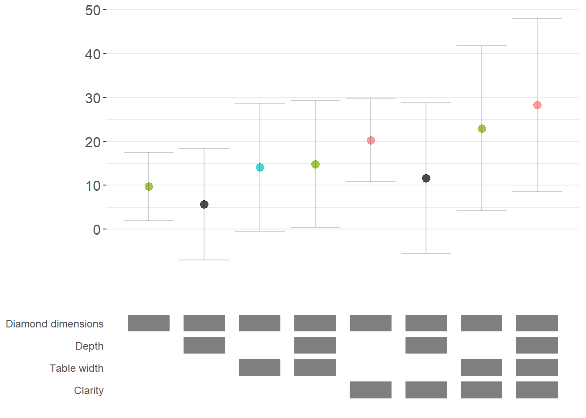

#### Marginal Effects for Non-Linear Models

For non-linear models like logit or probit, we often want to report marginal effects (average marginal effects, AME) rather than raw coefficients, as they're more interpretable. Here's how to incorporate marginal effects into specification curves (Figure \@ref(fig:robustness-ame-curve)).


``` r
library(margins)  # For calculating marginal effects

# Enhanced logit function with marginal effects option
starb_logit_enhanced = function(spec, data, rhs, ...) {
  # Extract additional arguments
  l = list(...)
  get_mfx = ifelse(is.null(l$get_mfx), FALSE, TRUE)  # Default to FALSE
  
  spec = as.formula(spec)
  
  if (get_mfx) {
    # Calculate average marginal effects
    model = suppressWarnings(
      glm(
        spec, 
        data = data, 
        family = 'binomial',
        weights = data$weight
      )
    ) %>%
      margins() %>%  # Calculate marginal effects
      summary()
    
    # Extract AME results
    row = which(model$factor == rhs)
    coef = model[row, 'AME'] %>% as.numeric()  # Average Marginal Effect
    se   = model[row, 'SE'] %>% as.numeric()
    p    = model[row, 'p'] %>% as.numeric()
  } else {
    # Return raw coefficients (log-odds)
    model = suppressWarnings(
      glm(
        spec, 
        data = data, 
        family = 'binomial',
        weights = data$weight
      )
    ) %>%
      broom::tidy()
    
    row = which(model$term == rhs)
    coef = model[row, 'estimate'] %>% as.numeric()
    se   = model[row, 'std.error'] %>% as.numeric()
    p    = model[row, 'p.value'] %>% as.numeric()
  }

  # Use 99% confidence intervals for more conservative inference
  z = qnorm(0.995)
  return(c(coef, p, coef + z*se, coef - z*se))
}

# Generate specification curve with marginal effects
ame_curve = stability_plot(
  grid = grid1,
  data = diamonds, 
  lhs = lhs_var, 
  rhs = rhs_var,
  model = starb_logit_enhanced,
  get_mfx = TRUE,  # Request marginal effects
  perm = perm_controls,
  base = base_controls,
  fe_always = FALSE,
  run_from = 3
)
```


``` r
ame_curve
```

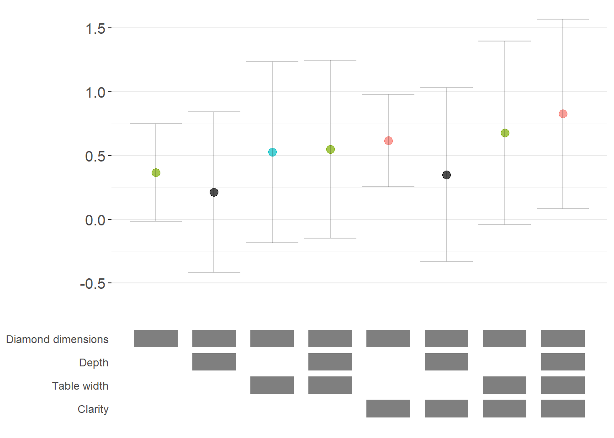

#### Fully Customized Specification Curve Visualizations

When you need complete control over the appearance of your specification curve, you can extract the underlying data and create custom ggplot visualizations:


``` r
# Extract data for custom plotting
dfs = stability_plot(
  grid = grid1,
  data = diamonds, 
  lhs = lhs_var, 
  rhs = rhs_var,
  model = starb_logit_enhanced,
  get_mfx = TRUE,
  perm = perm_controls,
  base = base_controls,
  fe_always = FALSE,
  run_from = 3,
  run_to = 5  # Stop before plotting
)

coef_grid_logit = dfs[[1]]
control_grid_logit = dfs[[2]]

# Define plot parameters
min_space = 0.5  # Space at edges of plot

# Create highly customized coefficient plot
coef_plot = ggplot2::ggplot(
  coef_grid_logit, 
  aes(
    x = model,
    y = coef,
    shape = p,
    group = p
  )
) +
  # Add confidence interval ribbons
  geom_linerange(
    aes(ymin = error_low, ymax = error_high),
    alpha = 0.75,
    size = 0.8
  ) +
  
  # Add coefficient points with color and shape by significance
  geom_point(
    size = 5,
    aes(col = p, fill = p),
    alpha = 1
  ) +
  
  # Use viridis color palette (colorblind-friendly)
  viridis::scale_color_viridis(
    discrete = TRUE,
    option = "D",
    name = "P-value"
  ) +
  
  # Different shapes for different significance levels
  scale_shape_manual(
    values = c(15, 17, 18, 19),
    name = "P-value"
  ) +
  
  # Reference line at zero
  geom_hline(
    yintercept = 0,
    linetype = 'dotted',
    color = 'red',
    size = 0.5
  ) +
  
  # Styling
  theme_classic() +
  theme(
    axis.text.x = element_blank(),
    axis.title = element_blank(),
    axis.ticks.x = element_blank(),
    plot.title = element_text(size = 14, face = "bold"),
    plot.subtitle = element_text(size = 11)
  ) +
  
  # Set axis limits
  coord_cartesian(
    xlim = c(1 - min_space, max(coef_grid_logit$model) + min_space),
    ylim = c(-0.1, 1.6)
  ) +
  
  # Remove redundant legends
  guides(fill = FALSE, shape = FALSE, col = FALSE) +
  
  # Add titles
  ggtitle('Specification Curve: Effect of Carat on Above-Median Price') +
  labs(subtitle = "Error bars represent 99% confidence intervals for average marginal effects")

# Create customized control specification plot
control_plot = ggplot(control_grid_logit) +
  # Use diamond shapes for controls
  geom_point(
    aes(x = model, y = y, fill = value),
    shape = 23,  # Diamond shape
    size = 4
  ) +
  
  # Black for included, white for excluded
  scale_fill_manual(values = c('#FFFFFF', '#000000')) +
  guides(fill = FALSE) +
  
  # Custom y-axis labels showing control names
  scale_y_continuous(
    breaks = unique(control_grid_logit$y), 
    labels = unique(control_grid_logit$key),
    limits = c(
      min(control_grid_logit$y) - 1,
      max(control_grid_logit$y) + 1
    )
  ) +
  
  # X-axis shows specification number
  scale_x_continuous(
    breaks = c(1:max(control_grid_logit$model))
  ) +
  
  coord_cartesian(
    xlim = c(1 - min_space, max(control_grid_logit$model) + min_space)
  ) +
  
  # Minimal theme for control panel
  theme_classic() +
  theme(
    panel.grid.major.y = element_blank(),
    panel.grid.minor.y = element_blank(),
    axis.title = element_blank(),
    axis.text.y = element_text(size = 10),
    axis.ticks = element_blank(),
    axis.line = element_blank()
  )

# Combine plots vertically
cowplot::plot_grid(
  coef_plot,
  control_plot,
  rel_heights = c(1, 0.5),  # Coefficient plot gets more space
  align = 'v',
  ncol = 1,
  axis = 'b'  # Align bottom axes
)
```

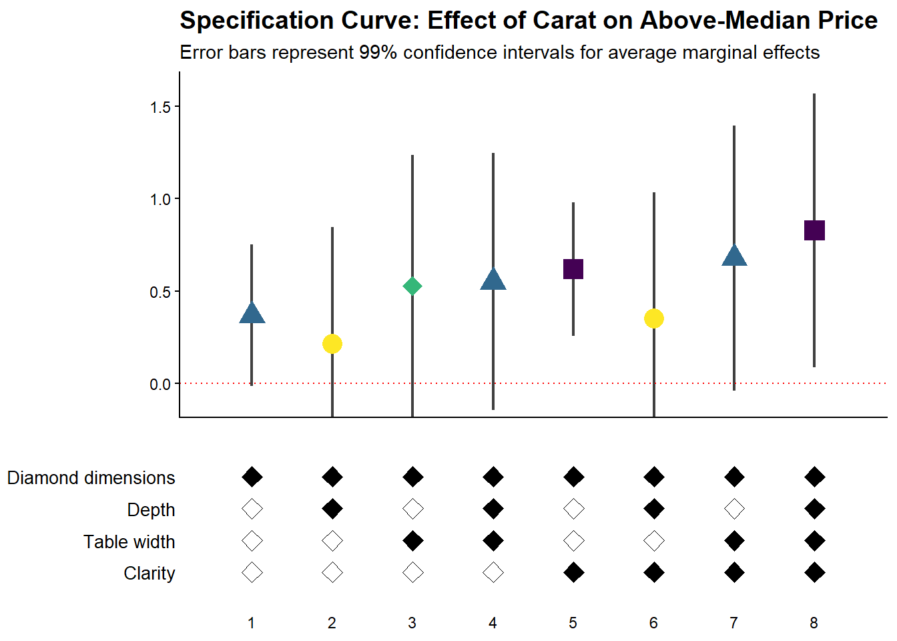

#### Comparing Multiple Model Types

A powerful extension is to compare results across different model types (e.g., logit vs. probit) in the same specification curve (Figure \@ref(fig:robustness-cowplot-plotgrid)). This helps assess whether your findings are specific to a particular functional form assumption:


``` r
# Create custom probit estimation function
starb_probit = function(spec, data, rhs, ...) {
    # Extract additional arguments
    l = list(...)
    get_mfx = ifelse(is.null(l$get_mfx), FALSE, TRUE)
    
    spec = as.formula(spec)
    
    if (get_mfx) {
        # Calculate average marginal effects for probit
        model = suppressWarnings(
            glm(
                spec,
                data = data,
                family = binomial(link = 'probit'),  # Probit link
                weights = data$weight
            )
        ) %>%
            margins() %>%
            summary()
        
        row = which(model$factor == rhs)
        coef = model[row, 'AME'] %>% as.numeric()
        se   = model[row, 'SE'] %>% as.numeric()
        p    = model[row, 'p'] %>% as.numeric()
    } else {
        # Return raw probit coefficients
        model = suppressWarnings(
            glm(
                spec,
                data = data,
                family = binomial(link = 'probit'),
                weights = data$weight
            )
        ) %>%
            broom::tidy()
        
        row = which(model$term == rhs)
        coef = model[row, 'estimate'] %>% as.numeric()
        se   = model[row, 'std.error'] %>% as.numeric()
        p    = model[row, 'p.value'] %>% as.numeric()
    }
    
    # 99% confidence intervals
    z = qnorm(0.995)
    return(c(coef, p, coef + z * se, coef - z * se))
}

# Generate probit specification curve
probit_dfs = stability_plot(
    grid = grid1,
    data = diamonds,
    lhs = lhs_var,
    rhs = rhs_var,
    model = starb_probit,
    get_mfx = TRUE,
    perm = perm_controls,
    base = base_controls,
    fe_always = FALSE,
    run_from = 3,
    run_to = 5
)

# Adjust model numbers for probit to plot side-by-side with logit
coef_grid_probit = probit_dfs[[1]] %>% 
    mutate(model = model + max(coef_grid_logit$model))

control_grid_probit = probit_dfs[[2]] %>% 
    mutate(model = model + max(control_grid_logit$model))

# Combine logit and probit results
coef_grid_combined = bind_rows(coef_grid_logit, coef_grid_probit)
control_grid_combined = bind_rows(control_grid_logit, control_grid_probit)

# Generate combined plots
panels = stability_plot(
    coef_grid = coef_grid_combined,
    control_grid = control_grid_combined,
    data = diamonds,
    lhs = lhs_var,
    rhs = rhs_var,
    perm = perm_controls,
    base = base_controls,
    fe_always = FALSE,
    run_from = 5,
    run_to = 6
)

# Add annotations to distinguish model types
coef_plot_combined = panels[[1]] +
  # Vertical line separating logit and probit
  geom_vline(
    xintercept = max(coef_grid_logit$model) + 0.5,
    linetype = 'dashed',
    alpha = 0.8,
    size = 1
  ) +
  
  # Label for logit models
  annotate(
    geom = 'label',
    x = max(coef_grid_logit$model) / 2,
    y = 1.8,
    label = 'Logit models',
    size = 6,
    fill = '#D3D3D3',
    alpha = 0.7
  ) +
  
  # Label for probit models
  annotate(
    geom = 'label',
    x = max(coef_grid_logit$model) + max(coef_grid_probit$model) / 2,
    y = 1.8,
    label = 'Probit models',
    size = 6,
    fill = '#D3D3D3',
    alpha = 0.7
  ) +
  
  coord_cartesian(ylim = c(-0.5, 1.9))

control_plot_combined = panels[[2]] +
  geom_vline(
    xintercept = max(control_grid_logit$model) + 0.5,
    linetype = 'dashed',
    alpha = 0.8,
    size = 1
  )

# Display combined plot
cowplot::plot_grid(
    coef_plot_combined,
    control_plot_combined,
    rel_heights = c(1, 0.5),
    align = 'v',
    ncol = 1,
    axis = 'b'
)
```

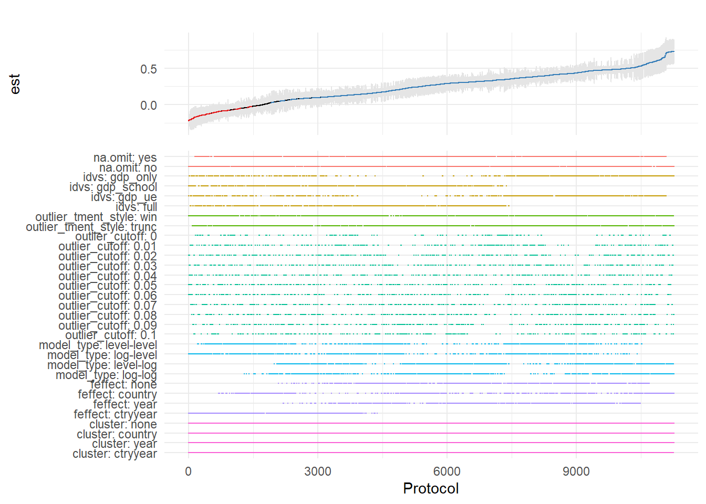


``` r
cowplot::plot_grid(
    coef_plot_combined,
    control_plot_combined,
    rel_heights = c(1, 0.5),
    align = 'v',
    ncol = 1,
    axis = 'b'
)
```

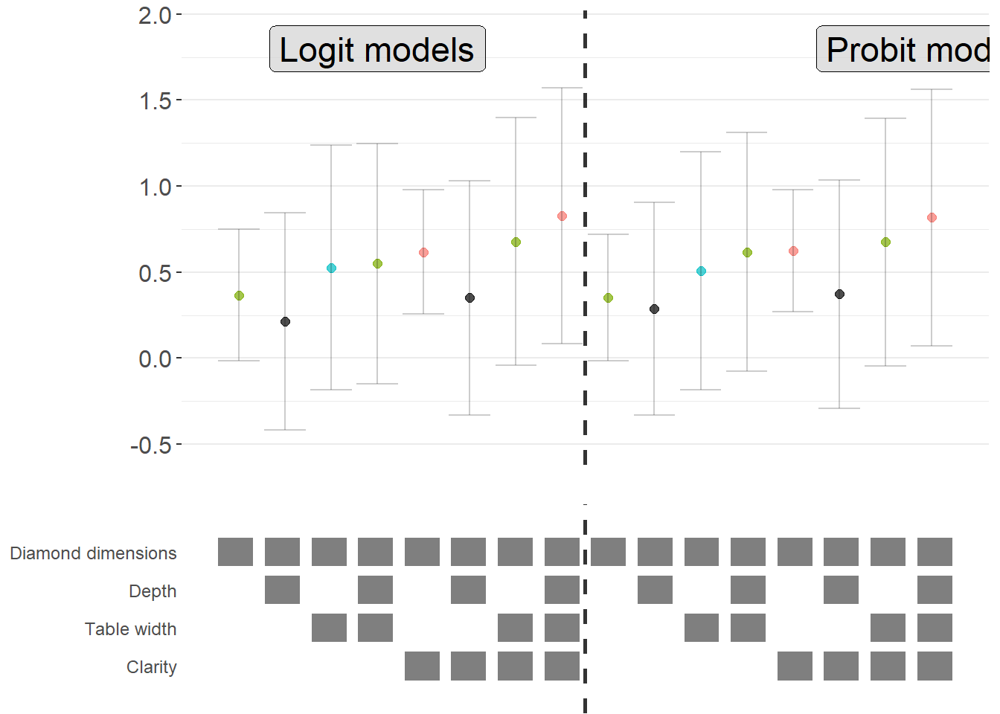

### Alternative Approaches: The `rdfanalysis` Package

While `starbility` is recommended for most applications, the `rdfanalysis` package by Joachim Gassen offers an alternative implementation with some unique features, particularly for research that follows a researcher degrees of freedom (RDF) framework.

#### Installation and Basic Usage


``` r
# Install from GitHub
devtools::install_github("joachim-gassen/rdfanalysis")
```

The `rdfanalysis` package focuses on documenting and visualizing researcher degrees of freedom throughout the research process (Figure \@ref(fig:robustness-rdf-spec-curve)), from data collection to model specification:


``` r
library(rdfanalysis)

# Load example estimates from the package documentation
load(url("https://joachim-gassen.github.io/data/rdf_ests.RData"))
```


``` r
# Generate specification curve
# The package expects a dataframe with estimates and confidence bounds
plot_rdf_spec_curve(
  ests,      # Dataframe with estimates
  "est",     # Column name for point estimates
  "lb",      # Column name for lower confidence bound
  "ub"       # Column name for upper confidence bound
)
```


This level of transparency is particularly valuable for addressing concerns about p-hacking and researcher degrees of freedom.

------------------------------------------------------------------------

## Coefficient Stability

Beyond specification curve analysis, another crucial aspect of sensitivity analysis is assessing whether your estimates are robust to potential omitted variable bias. Even with comprehensive controls, unobserved confounders may threaten causal inference.

### Theoretical Foundation: The Oster (2019) Approach

Oster's [-@oster2019unobservable] influential paper provides a formal framework for assessing omitted variable bias. The key insight is that coefficient stability alone is insufficient, we need to consider both coefficient stability and $R^2$ movement to evaluate the likely impact of unobservables.

The intuition is as follows:

1.  **Coefficient stability**: How much does the coefficient on your treatment variable change when you add controls?
2.  $R^2$ **movement**: How much does the model's explanatory power increase when you add controls?

If adding observed controls moves the $R^2$ substantially but barely affects the coefficient, this suggests that unobservables (which might also affect $R^2$) are unlikely to overturn your result. Conversely, if the coefficient is very sensitive to the controls you add, unobservables might also have large effects.

Oster formalizes this by computing a parameter $\delta$ (delta), which represents how strong the relationship between unobservables and the outcome would need to be (relative to the observables) to explain away the entire treatment effect. Higher values of $\delta$ suggest more robust results.

The formula for calculating the bias-adjusted treatment effect is:

$$
\beta^* = \tilde{\beta} - \delta \times [\dot{\beta} - \tilde{\beta}] \times \frac{R_{max} - \tilde{R}^2}{\tilde{R}^2 - \dot{R}^2}
$$

Where:

-   $\beta^*$ = bias-adjusted treatment effect
-   $\dot{\beta}$ = coefficient from short regression (without controls)
-   $\tilde{\beta}$ = coefficient from full regression (with controls)
-   $\dot{R}^2$ = $R^2$ from short regression
-   $\tilde{R}^2$ = $R^2$ from full regression
-   $R_{max}$ = hypothetical maximum $R^2$ (often set to 1 or a realistic upper bound)
-   $\delta$ = proportional selection on unobservables (assumed relationship)

### The `robomit` Package

The `robomit` package provides a straightforward implementation of Oster's method:


``` r
library(robomit)

# Calculate bias-adjusted treatment effect using Oster's method
# This function estimates beta* under different assumptions about delta

o_beta_results = o_beta(
  y     = "mpg",        # Dependent variable
  x     = "wt",         # Treatment variable of interest
  con   = "hp + qsec",  # Control variables (covariates)
  delta = 1,            # Proportional selection assumption
                        # delta = 1 means unobservables are as important as observables
                        # delta = 0 means no omitted variable bias
                        # delta > 1 means unobservables are more important than observables
  R2max = 0.9,          # Maximum R-squared achievable
                        # Common choices: 1.0 (theoretical max), 
                        # 1.3*R2_full (30% improvement over full model),
                        # or domain-specific reasonable maximum
  type  = "lm",         # Model type: "lm" for OLS, "logit" for logistic
  data  = mtcars        # Dataset
)
```

The function returns:

-   Coefficient from short model (without controls)

-   Coefficient from full model (with controls)

-   Bias-adjusted coefficient under delta and $R^2$ max assumptions

-   The value of delta needed to drive the coefficient to zero


``` r
print(o_beta_results)
#> # A tibble: 10 × 2
#>    Name                           Value
#>    <chr>                          <dbl>
#>  1 beta*                         -2.00 
#>  2 (beta*-beta controlled)^2      5.56 
#>  3 Alternative Solution 1        -7.01 
#>  4 (beta[AS1]-beta controlled)^2  7.05 
#>  5 Uncontrolled Coefficient      -5.34 
#>  6 Controlled Coefficient        -4.36 
#>  7 Uncontrolled R-square          0.753
#>  8 Controlled R-square            0.835
#>  9 Max R-square                   0.9  
#> 10 delta                          1
```

Interpretation:

-   If bias-adjusted beta is still large and significant, this suggests robustness to omitted variable bias

-   If the delta needed to explain away the effect is large (\>1), this suggests you'd need very strong unobservables to overturn the result

For a more comprehensive analysis, you can explore coefficient stability across a range of delta values:


``` r
# Create a sequence of delta values to explore
delta_values = seq(0, 2, by = 0.1)

beta_results = sapply(delta_values, function(d) {
  result = suppressWarnings(
    o_beta(
      y = "mpg",
      x = "wt",
      con = "hp + qsec",
      delta = d,
      R2max = 0.9,
      type = "lm",
      data = mtcars
    )
  )
  # Extract beta* (first row)
  result$Value[result$Name == "beta*"]
})

# Create visualization
stability_df = data.frame(
  delta = delta_values,
  beta_adjusted = beta_results
)
```

Interpretation guidelines:

-   $|\delta| < 1$: Unobservables would need to be less related to treatment/outcome than observables to overturn the result (less robust)

-   $|\delta| \approx 1$: Unobservables would need to be about as related as observables (moderate robustness)

-   $|\delta| > 1$: Unobservables would need to be MORE related than observables (more robust)

-   $|\delta| >> 1$: Very robust to omitted variable bias

Figure \@ref(fig:robustness-ovb-stability) shows bias-adjusted coefficients against $\delta$


``` r
# Plot
library(ggplot2)
ggplot(stability_df, aes(x = delta, y = beta_adjusted)) +
  geom_line(linewidth = 1) +
  geom_hline(yintercept = 0, linetype = "dashed", color = "red") +
  labs(
    x = "Delta (strength of confounding)",
    y = "Bias-adjusted coefficient (beta*)",
    title = "Coefficient stability under omitted variable bias"
  ) +
  theme_minimal()
```

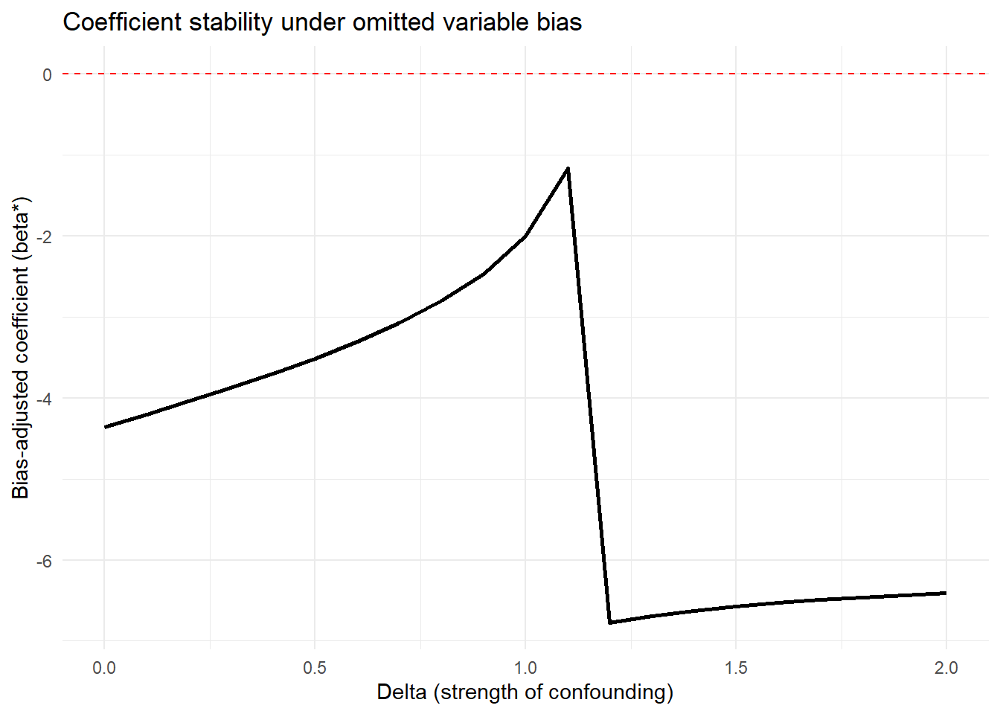

For more sophisticated applications with multiple treatments or different model types:


``` r
# Example with multiple treatment variables
# Useful when you have several key independent variables of interest

results_multi = lapply(c("wt", "hp"), function(treat) {
  o_beta(
    y = "mpg",
    x = treat,
    con = "qsec + gear + carb",  # More extensive controls
    delta = 1,
    R2max = 1.0,  # Theoretical maximum
    type = "lm",
    data = mtcars
  )
})

names(results_multi) = c("wt", "hp")
print(results_multi)
#> $wt
#> # A tibble: 10 × 2
#>    Name                           Value
#>    <chr>                          <dbl>
#>  1 beta*                          4.56 
#>  2 (beta*-beta controlled)^2     68.3  
#>  3 Alternative Solution 1        -6.29 
#>  4 (beta[AS1]-beta controlled)^2  6.70 
#>  5 Uncontrolled Coefficient      -5.34 
#>  6 Controlled Coefficient        -3.70 
#>  7 Uncontrolled R-square          0.753
#>  8 Controlled R-square            0.845
#>  9 Max R-square                   1    
#> 10 delta                          1    
#> 
#> $hp
#> # A tibble: 10 × 2
#>    Name                             Value
#>    <chr>                            <dbl>
#>  1 beta*                          0.118  
#>  2 (beta*-beta controlled)^2      0.0250 
#>  3 Alternative Solution 1        -0.0848 
#>  4 (beta[AS1]-beta controlled)^2  0.00195
#>  5 Uncontrolled Coefficient      -0.0682 
#>  6 Controlled Coefficient        -0.0406 
#>  7 Uncontrolled R-square          0.602  
#>  8 Controlled R-square            0.794  
#>  9 Max R-square                   1      
#> 10 delta                          1
```

Comparing robustness across treatment variables helps identify which relationships are most stable.

### The `mplot` Package for Graphical Model Stability

The `mplot` package provides complementary tools for visualizing model stability and variable selection:


``` r
# Install if needed
# install.packages("mplot")
library(mplot)

# Visualize variable importance across models
mplot::vis(
  lm(mpg ~ wt + hp + qsec + gear + carb, data = mtcars),
  B = 100  # Number of bootstrap samples
)
#>                    name prob logLikelihood
#>                   mpg~1 1.00       -102.38
#>                  mpg~wt 0.99        -80.01
#>             mpg~wt+qsec 0.48        -74.36
#>               mpg~wt+hp 0.42        -74.33
#>  mpg~wt+hp+gear+carb+RV 0.39        -71.77
```

This creates plots showing:

1.  Which variables are selected across bootstrap samples
2.  Coefficient stability for each variable
3.  Model fit across different variable combinations

Particularly useful for:

-   Assessing variable importance

-   Understanding multicollinearity effects

-   Evaluating model selection stability

------------------------------------------------------------------------

## Quantifying Omitted Variable Bias

While Oster's approach focuses on bias-adjusted coefficients, the Konfound framework [@narvaiz2024konfound] takes a complementary approach by asking: "How much bias would be needed to invalidate our inference?"

### The `konfound` Package

The `konfound` package implements sensitivity analysis for causal inferences by calculating how much unmeasured confounding would be needed to change your substantive conclusion.


``` r
library(konfound)

# Basic konfound analysis
# This calculates the amount of bias needed to invalidate your inference
pkonfound(
    est_eff = 5,         # Your estimated effect
    std_err = 2,         # Standard error of the estimate
    n_obs = 1000,        # Number of observations
    n_covariates = 5,    # Number of covariates in your model
    alpha = 0.05,        # Significance level
    tails = 2            # Two-tailed test
)
#> Robustness of Inference to Replacement (RIR):
#> RIR = 215
#> 
#> To nullify the inference of an effect using the threshold of 3.925 for
#> statistical significance (with null hypothesis = 0 and alpha = 0.05), 21.506%
#> of the estimate of 5 would have to be due to bias. This implies that to
#> nullify the inference one would expect to have to replace 215 (21.506%)
#> observations with data points for which the effect is 0 (RIR = 215).
#> 
#> See Frank et al. (2013) for a description of the method.
#> 
#> Citation: Frank, K.A., Maroulis, S., Duong, M., and Kelcey, B. (2013).
#> What would it take to change an inference?
#> Using Rubin's causal model to interpret the robustness of causal inferences.
#> Education, Evaluation and Policy Analysis, 35 437-460.
#> 
#> Accuracy of results increases with the number of decimals reported.
```

The output provides several key metrics:

1.  Robustness of Inference (RIR): The number of observations that would need to be replaced with observations having null effects to invalidate the inference

2.  Percentage of sample that would need to be replaced: RIR / n_obs \* 100

3.  Impact threshold: The correlation between an omitted variable and both the treatment and outcome needed to invalidate the inference

Interpretation:

-   Higher RIR = more robust inference

-   RIR should be compared to n_obs to assess practical robustness

-   Impact threshold shows how strong confounding needs to be

### Visualizing Sensitivity: The Threshold Plot

In Figure \@ref(fig:robustness-threshold-plot), the threshold plot shows the combination of correlations between a confound and the treatment (horizontal axis) and outcome (vertical axis) that would be needed to overturn your conclusion:


``` r
# Create threshold plot
# This visualizes the "confounding space" that would invalidate inference
pkonfound(
    est_eff = 5,
    std_err = 2,
    n_obs = 1000,
    n_covariates = 5,
    to_return = "thresh_plot"  # Request threshold plot
)
```

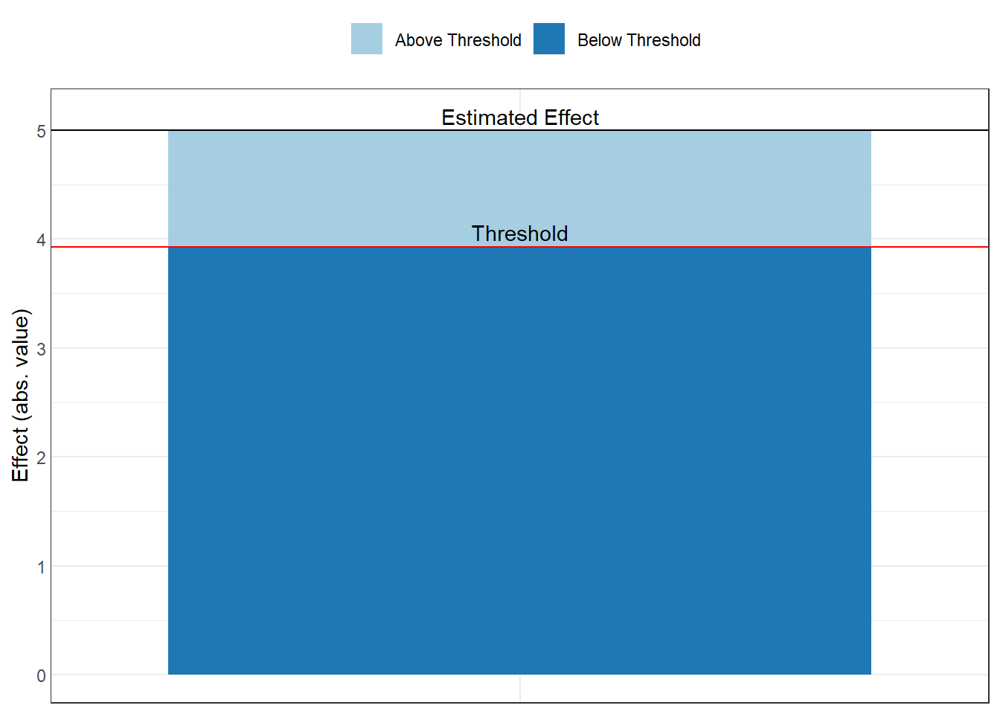

Interpretation of the plot:

-   The red line shows the threshold

-   Points above/beyond this line represent confounding strong enough to overturn your inference

-   You can compare this to the strength of known confounds

-   Benchmark correlations (e.g., 0.1, 0.3, 0.5) help assess plausibility

Example interpretation: "An omitted variable would need to be correlated at 0.35 with both the treatment and outcome to invalidate our inference. Given that our strongest observed control is correlated at 0.25 with the outcome, this seems unlikely."

### The Correlation Plot

In Figure \@ref(fig:robustness-correlation-plot), the correlation plot provides another view, showing the required partial correlation of an omitted variable with the outcome, conditional on the treatment and covariates:


``` r
# Create correlation plot
pkonfound(
    est_eff = 5,
    std_err = 2,
    n_obs = 1000,
    n_covariates = 5,
    to_return = "corr_plot"  # Request correlation plot
)
```

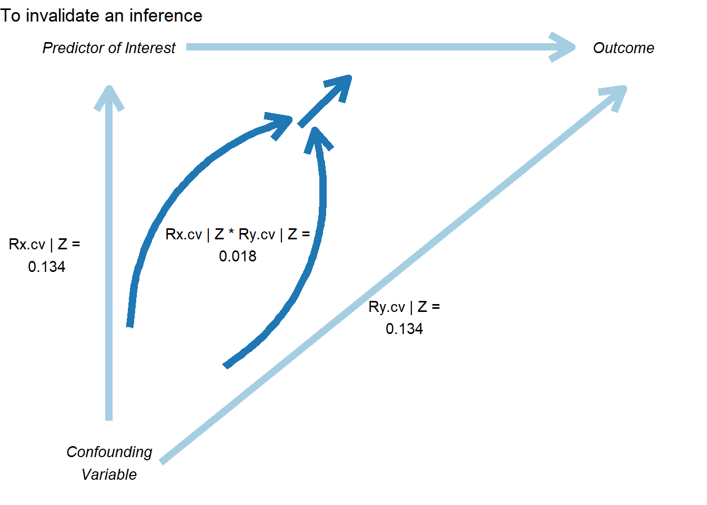

This plot shows:

-   The relationship between bias and the required correlation

-   How much the effect estimate would change for different confound strengths

-   The threshold where the inference would be overturned

### Konfound for Model Objects

You can also apply konfound directly to model objects, which is more convenient for real analyses:


``` r
# Fit your model
model = lm(mpg ~ wt + hp + qsec, data = mtcars)

# Apply konfound to the model
# This automatically extracts the necessary statistics
konfound(model, wt)  # Assess robustness for the 'wt' coefficient
```

------------------------------------------------------------------------

## Advanced Topics in Sensitivity Analysis

### Sensitivity to Functional Form

Beyond omitted variables, your results may be sensitive to functional form choices (Figure \@ref(fig:robustness-sen-functional-form)). Here are approaches to assess this:


``` r
# Test sensitivity to log transformations
models_functional_form = list(
  "Linear-Linear" = lm(mpg ~ wt + hp, data = mtcars),
  "Log-Linear"    = lm(log(mpg) ~ wt + hp, data = mtcars),
  "Linear-Log"    = lm(mpg ~ log(wt) + log(hp), data = mtcars),
  "Log-Log"       = lm(log(mpg) ~ log(wt) + log(hp), data = mtcars)
)

# Compare coefficients across functional forms
# Note: Coefficients need to be made comparable (e.g., via standardization or elasticities)

# Test sensitivity to polynomial terms
model_linear = lm(mpg ~ wt + hp, data = mtcars)
model_quad = lm(mpg ~ wt + I(wt^2) + hp + I(hp^2), data = mtcars)
model_cubic = lm(mpg ~ wt + I(wt^2) + I(wt^3) + hp + I(hp^2) + I(hp^3), data = mtcars)

# Compare using AIC/BIC
AIC(model_linear, model_quad, model_cubic)
#>              df      AIC
#> model_linear  4 156.6523
#> model_quad    6 145.9102
#> model_cubic   8 147.4138
BIC(model_linear, model_quad, model_cubic)
#>              df      BIC
#> model_linear  4 162.5153
#> model_quad    6 154.7047
#> model_cubic   8 159.1397

# Test sensitivity to splines/GAMs
library(mgcv)
model_gam = gam(mpg ~ s(wt) + s(hp), data = mtcars)

# Visualize functional form
plot(model_gam, pages = 1)
```

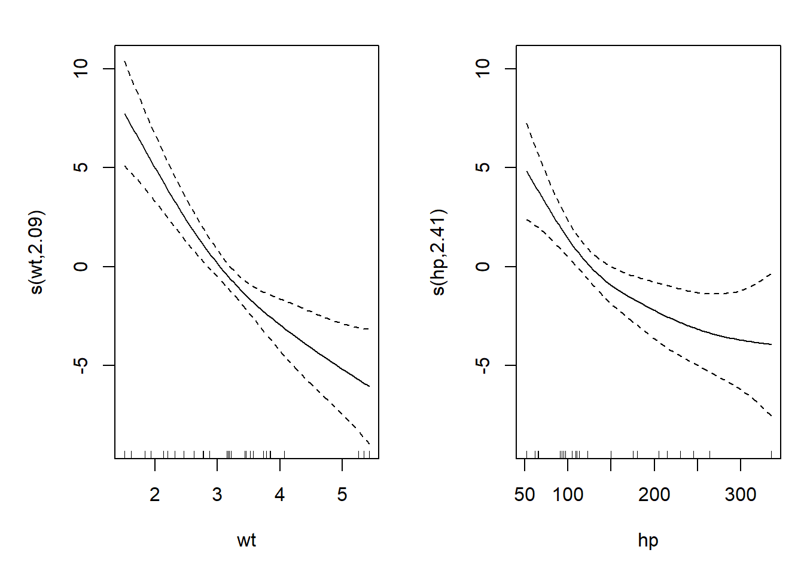

### Sensitivity to Sample Selection

Robustness to different subsamples can reveal whether your findings generalize (Figure \@ref(fig:robustness-sen-sample-selection))


``` r
# Define meaningful subsamples
subsamples = list(
  "Full sample"    = mtcars,
  "High cylinders" = mtcars[mtcars$cyl >= 6, ],
  "Low cylinders"  = mtcars[mtcars$cyl < 6, ],
  "Automatic"      = mtcars[mtcars$am == 0, ],
  "Manual"         = mtcars[mtcars$am == 1, ]
)

# Estimate model on each subsample
subsample_results = lapply(subsamples, function(data) {
  model = lm(mpg ~ wt + hp + qsec, data = data)
  summary(model)$coefficients["wt", ]
})

# Create forest plot of results
subsample_df = do.call(rbind, subsample_results) %>%
  as.data.frame() %>%
  mutate(
    subsample = names(subsamples),
    lower = Estimate - 1.96 * `Std. Error`,
    upper = Estimate + 1.96 * `Std. Error`
  )

ggplot(subsample_df, aes(x = Estimate, y = subsample)) +
  geom_point(size = 3) +
  geom_errorbarh(aes(xmin = lower, xmax = upper), height = 0.2) +
  geom_vline(xintercept = 0, linetype = "dashed", color = "red") +
  theme_minimal() +
  labs(
    title = "Coefficient Estimates Across Subsamples",
    x = "Effect of Weight on MPG",
    y = NULL
  )
```

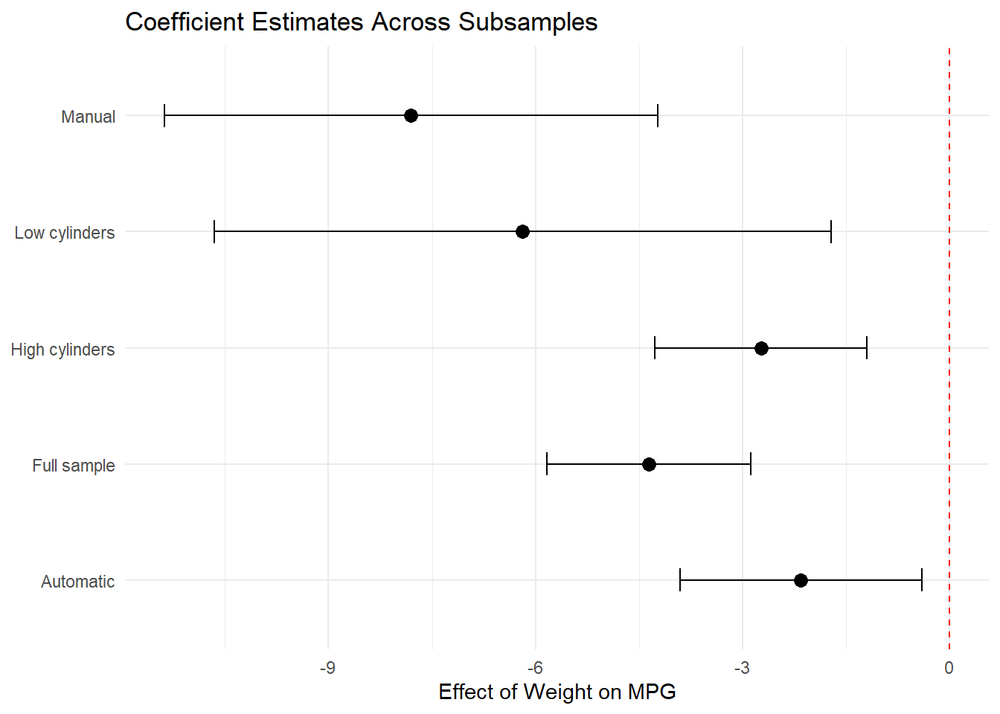

### Sensitivity to Outliers and Influential Observations

Outliers can drive results, so it's important to assess robustness to their inclusion:


``` r
# Identify influential observations
model = lm(mpg ~ wt + hp + qsec, data = mtcars)

# Calculate influence measures
influence_measures = influence.measures(model)

# Cook's Distance
cooks_d = cooks.distance(model)
influential = cooks_d > 4 / nrow(mtcars)  # Common threshold

# DFBETAS (change in coefficient when observation removed)
dfbetas_vals = dfbetas(model)

# Compare models with/without influential observations
model_full = lm(mpg ~ wt + hp + qsec, data = mtcars)
model_no_influential = lm(
  mpg ~ wt + hp + qsec,
  data = mtcars[!influential, ]
)

# Compare coefficients
compare_df = data.frame(
  Variable = names(coef(model_full)),
  Full_Sample = coef(model_full),
  Excl_Influential = c(
    coef(model_no_influential),
    rep(NA, length(coef(model_full)) - length(coef(model_no_influential)))
  )
)

# Winsorization approach
library(DescTools)
mtcars_winsor = mtcars
mtcars_winsor$wt = DescTools::Winsorize(mtcars$wt, val = c(0.01, 0.99))
mtcars_winsor$hp = DescTools::Winsorize(mtcars$hp, val = c(0.01, 0.99))

model_winsor = lm(mpg ~ wt + hp + qsec, data = mtcars_winsor)

# Compare original vs. winsorized
```

### Sensitivity to Measurement Error

If key variables are measured with error, results may be biased:


``` r
# Simulate measurement error
# This helps understand potential attenuation bias

library(simex)

# SIMEX (Simulation-Extrapolation) for measurement error correction
# Assumes classical measurement error in covariates

# Fit model with x = TRUE
naive_model <- lm(mpg ~ wt + hp, data = mtcars, x = TRUE)

# Apply SIMEX
# lambda is the factor by which measurement error variance increases
simex_model <- simex(
  naive_model,
  SIMEXvariable = "wt",  # Variable with measurement error
  measurement.error = 0.1,  # Assumed ME variance (proportion of var)
  lambda = seq(0.1, 2, 0.1),  # Extrapolation sequence
  B = 100  # Number of simulations
)


# View results
summary(simex_model)
#> Call:
#> simex(model = naive_model, SIMEXvariable = "wt", measurement.error = 0.1, 
#>     lambda = seq(0.1, 2, 0.1), B = 100)
#> 
#> Naive model: 
#> lm(formula = mpg ~ wt + hp, data = mtcars, x = TRUE)
#> 
#> Simex variable :
#>                      wt
#> Measurement error : 0.1
#> 
#> 
#> Number of iterations:  100 
#> 
#> Residuals: 
#>      Min.   1st Qu.    Median      Mean   3rd Qu.      Max. 
#> -3.930016 -1.593084 -0.185632  0.007452  1.076194  5.848556 
#> 
#> Coefficients: 
#> 
#> Asymptotic variance: 
#>              Estimate Std. Error t value Pr(>|t|)    
#> (Intercept) 37.256223   1.965061  18.959  < 2e-16 ***
#> wt          -3.896363   0.630915  -6.176 9.85e-07 ***
#> hp          -0.031615   0.006864  -4.606 7.57e-05 ***
#> ---
#> Signif. codes:  0 '***' 0.001 '**' 0.01 '*' 0.05 '.' 0.1 ' ' 1
#> 
#> Jackknife variance: 
#>              Estimate Std. Error t value Pr(>|t|)    
#> (Intercept) 37.256223   1.629969  22.857  < 2e-16 ***
#> wt          -3.896363   0.647648  -6.016 1.52e-06 ***
#> hp          -0.031615   0.009153  -3.454  0.00172 ** 
#> ---
#> Signif. codes:  0 '***' 0.001 '**' 0.01 '*' 0.05 '.' 0.1 ' ' 1

# Compare naive vs corrected coefficients
data.frame(
  Coefficient = names(coef(naive_model)),
  Naive = coef(naive_model),
  SIMEX_Corrected = coef(simex_model)
)
#>             Coefficient       Naive SIMEX_Corrected
#> (Intercept) (Intercept) 37.22727012     37.25622314
#> wt                   wt -3.87783074     -3.89636334
#> hp                   hp -0.03177295     -0.03161466

# SIMEX extrapolates back to zero ME, giving corrected estimate
```

Figure \@ref(fig:robustnees-simex) plots SIMEX extrapolation.


``` r
# Plot SIMEX extrapolation
par(mfrow = c(1, 3))
plot(simex_model)
```

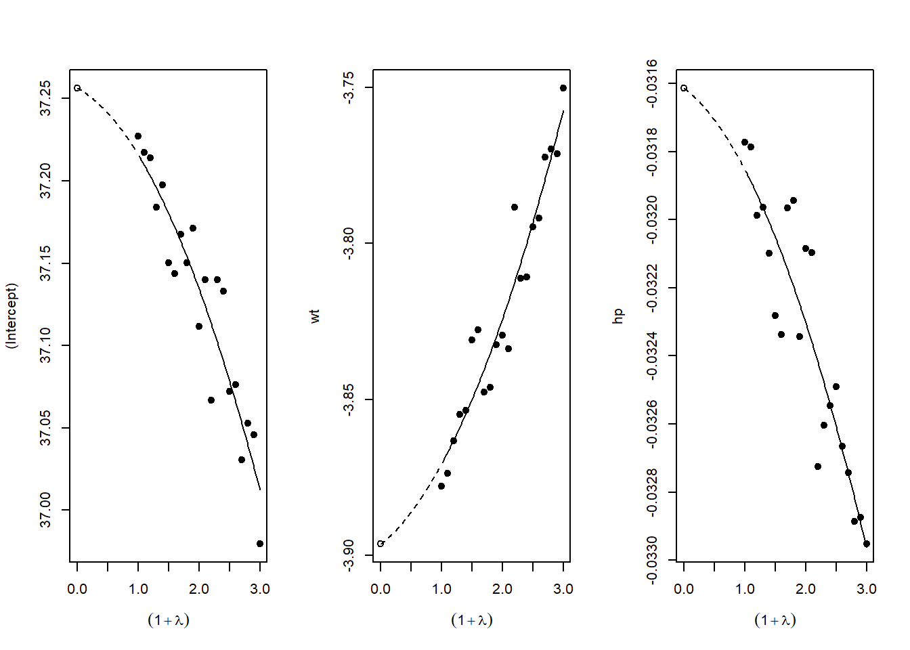

``` r
par(mfrow = c(1, 1))
```

------------------------------------------------------------------------

## Reporting Sensitivity Analysis Results

### Best Practices for Presentation

When presenting sensitivity analyses in your paper:

1.  **Main Text**: Present your primary specification and 1-2 key robustness checks that directly address the most plausible threats to identification

2.  **Tables**: Create comprehensive tables showing:

    -   Coefficient estimates across specifications
    -   Standard errors (in parentheses)
    -   $R^2$ and other fit statistics
    -   Number of observations
    -   Clear column headers describing each specification

3.  **Figures**: Use specification curves for visual impact when you have many specifications

4.  **Appendix**: Place exhaustive robustness checks in appendices with clear organization

## Conclusion and Recommendations

Sensitivity analysis is not optional in modern empirical research, it's essential. The techniques described in this chapter provide a toolkit for assessing the robustness of your findings:

1.  **Start with specification curve analysis** (`starbility`) to visualize how your results vary across defensible specifications

2.  **Apply Oster's method** (`robomit`) to assess sensitivity to omitted variable bias using coefficient stability and $R^2$ movement

3.  **Use konfound analysis** (`konfound`) to quantify how much bias would be needed to overturn your inference

4.  **Conduct additional tests** relevant to your context: placebo tests, subsample analysis, outlier diagnostics, etc.

5.  **Present results clearly**: Use both tables and figures, provide verbal interpretation, and be transparent about which specifications you view as most credible and why

**Remember**: The goal is not to show that your result is robust to *everything*, but to demonstrate that it's robust to *reasonable alternative choices* and *plausible threats to identification*. Be honest about the limitations while making the strongest case possible for your findings.

The mark of rigorous empirical work is not that every robustness check confirms your main result, it's that you've thoughtfully considered the most important threats to validity and provided evidence about whether those threats are likely to overturn your conclusions.

------------------------------------------------------------------------
