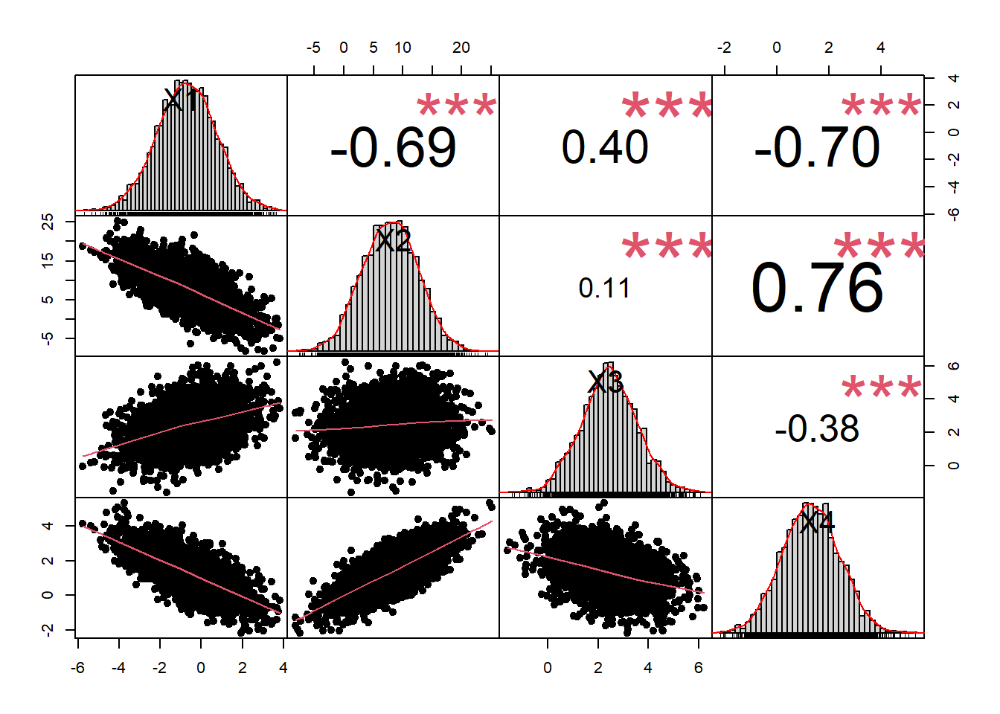

# Replication and Synthetic Data

Access to comprehensive data is pivotal for replication, especially in the realm of social sciences. Yet, data are often inaccessible due to proprietary restrictions, privacy concerns, or logistical constraints, making replication a challenge [@king1995replication]. This chapter explores the nuances of replication, exceptions to its norms, and the significance of synthetic data as a solution.

## The Replication Standard

Replicability in research ensures:

-   **Credibility** -- Reinforces trust in empirical studies by allowing independent verification.
-   **Continuity** -- Enables future research to build upon prior findings, promoting cumulative knowledge.
-   **Visibility** -- Increases readership and citations, benefiting both individual researchers and the broader academic community.

For research to be replicable, adhering to the **replication standard** is essential. This standard requires researchers to provide all necessary information---data, code, and methodological details---so that third parties can independently reproduce the study's findings. While quantitative research often allows for clearer replication, qualitative studies pose challenges due to their depth, contextual nature, and reliance on subjective interpretation.

### Solutions for Empirical Replication

Several approaches help address replication challenges in empirical research:

1.  **Role of Individual Authors**
    -   Researchers must commit to transparency and provide well-documented data and code.
    -   Repositories such as the **Inter-University Consortium for Political and Social Research (ICPSR)** offer secure, long-term storage for replication datasets.
2.  **Creation of a Replication Data Set**
    -   A dedicated **replication dataset** should include original data, relevant supplementary data, and the exact procedures used for analysis.
    -   Metadata and documentation should be provided to ensure clarity.
3.  **Professional Data Archives**
    -   Organizations like **ICPSR, Dataverse, and Zenodo** facilitate open access to datasets while maintaining proper governance over sensitive information.
    -   These archives help address data accessibility and preservation issues.
4.  **Educational Implications**
    -   Teaching replication strengthens students' understanding of empirical methods and reproducibility.
    -   Many graduate programs now incorporate replication studies into coursework, emphasizing their importance in methodological rigor.

### Free Data Repositories

1.  **Zenodo**: Hosted by CERN, it provides a place for researchers to deposit datasets. It's not subject-specific, so it caters to various disciplines.

2.  **figshare**: Allows researchers to upload, share, and cite their datasets.

3.  **Dryad**: Primarily for datasets associated with published articles in the biological and medical sciences.

4.  **OpenICPSR**: A public-facing version of the Inter-University Consortium for Political and Social Research (ICPSR) where researchers can deposit data without any cost.

5.  **Harvard Dataverse**: Hosted by Harvard University, this is an open-source repository software application dedicated to archiving, sharing, and citing research data.

6.  **Mendeley Data**: A multidisciplinary, free-to-use open access data repository where researchers can upload and share their datasets.

7.  **Open Science Framework (OSF)**: Offers both a platform for conducting research and a place to deposit datasets.

8.  **PubMed Central**: Specific to life sciences, but it's an open repository for journal articles, preprints, and datasets.

9.  **Registry of Research Data Repositories (re3data)**: While not a repository itself, it provides a global registry of research data repositories from various academic disciplines.

10. **SocArXiv**: An open archive for the social sciences.

11. **EarthArXiv**: A preprints archive for earth science.

12. **Protein Data Bank (PDB)**: For 3D structures of large biological molecules.

13. **Gene Expression Omnibus (GEO)**: A public functional genomics data repository.

14. **The Language Archive (TLA)**: Dedicated to data on languages worldwide, especially endangered languages.

15. **B2SHARE**: A platform for storing and sharing research data sets in various disciplines, especially from European research projects.

### Exceptions to Replication

While the replication standard is fundamental to scientific integrity, certain constraints may prevent full adherence. Some common exceptions include:

1.  **Confidentiality**
    -   Some datasets contain highly sensitive information (e.g., medical records, personal financial data) that cannot be disclosed, even in a fragmented form.
    -   Anonymization techniques and data aggregation can sometimes mitigate these concerns, but privacy regulations (e.g., GDPR, HIPAA) impose strict limitations.
2.  **Proprietary Data**
    -   Datasets owned by corporations, governments, or third-party vendors often have restricted access due to intellectual property concerns.
    -   In many cases, researchers can share **summary statistics, derived variables, or synthetic versions** of the data while respecting proprietary restrictions.
3.  **Rights of First Publication**
    -   Some studies involve data embargoes, where researchers must delay public release until initial publications are completed.
    -   Despite embargoes, the essential data and methodology should eventually be accessible to ensure transparency.

### Replication Landscape

@brodeur2025comparing finds that while AI-assisted teams improve upon AI-led approaches, human-only teams remain the most effective at detecting major errors and ensuring reproducibility in quantitative social science research.

-   Human teams and AI-assisted teams achieved similar reproducibility success rates, both significantly outperforming AI-led teams.

-   Human-only teams were 57 percentage points more successful than AI-led teams (p \< 0.001).

-   Error detection: Human teams identified significantly more major errors than AI-assisted teams (0.7 more errors per team, p = 0.017) and AI-led teams (1.1 more errors per team, p \< 0.001).

-   AI-assisted teams detected 0.4 more errors per team than AI-led teams (p = 0.029) but still fewer than human teams.

-   Robustness checks: Both human and AI-assisted teams were significantly better than AI-led teams in proposing (25 percentage points, p = 0.017) and implementing (33 percentage points, p = 0.005) comprehensive robustness checks.

@huntington2025sources uses a three-stage many-analysts design to examine how researcher decisions influence variation in treatment effect estimates.

-    146 research teams completed the same causal inference task three times under increasingly standardized conditions:

    -    **Stage 1:** Few constraints (free-form analysis).

    -    **Stage 2:** Prescribed research design.

    -    **Stage 3:** Prescribed design plus pre-cleaned data.

```{=html}
<!-- -->
```
-    **Key findings:**

    -    **Stage 1:** High variation in reported effects (IQR = 3.1 percentage points), with outliers.

    -    **Stage 2:** Even greater variation (IQR = 4.0), due to imperfect protocol adherence.

    -    **Stage 3:** Lowest variation (IQR = 2.4), suggesting data cleaning substantially reduces result heterogeneity.

```{=html}
<!-- -->
```
-    **Sample size convergence:**

    -   IQR dropped from 295,187 (Stage 1) to 29,144 (Stage 2), and was effectively zero in Stage 3.

    The results highlight the **critical role of data cleaning** in applied microeconomics and suggest **new directions for replication research**.

------------------------------------------------------------------------

## Synthetic Data

Synthetic data, which models real data while ensuring anonymity, is becoming an essential tool in research. By generating artificial datasets that retain key statistical properties of the original data, researchers can **preserve privacy, enhance data accessibility, and facilitate replication**. However, synthetic data also introduces complexities and should be used with caution.

------------------------------------------------------------------------

### Benefits of Synthetic Data

1.  **Privacy Preservation**
    -   Protects sensitive or proprietary information while enabling research collaboration.
2.  **Data Fairness and Augmentation**
    -   Helps mitigate biases by generating more balanced datasets.
    -   Can supplement real data when sample sizes are limited.
3.  **Acceleration in Research**
    -   Allows for data sharing in environments where access to real data is restricted.
    -   Enables large-scale simulations without legal or ethical constraints.

------------------------------------------------------------------------

### Concerns and Limitations

1.  **Misconceptions About Privacy**
    -   Synthetic data does not guarantee absolute privacy---re-identification risks remain if it is too similar to the real dataset.
2.  **Challenges with Data Outliers**
    -   Rare but important data points may be poorly represented or excluded.
3.  **Risks of Solely Relying on Synthetic Data**
    -   Models trained exclusively on synthetic data may lack generalizability.
    -   Differences between real and synthetic distributions can introduce biases.

------------------------------------------------------------------------

### Further Insights on Synthetic Data

Synthetic data acts as a bridge between **model-centric and data-centric perspectives**, making it a vital tool in modern research. An analogy can be drawn to **viewing a replica of the Mona Lisa**---the essence remains, but the original is securely stored.

For a deeper dive into synthetic data and its applications, refer to [@jordon2022synthetic].

------------------------------------------------------------------------

### Generating Synthetic Data

When generating synthetic data, the approach depends on whether researchers have full access to the original dataset or are working under restricted conditions.

#### When You Have Access to the Original Dataset

If researchers can directly use the dataset, various techniques can be employed to generate synthetic data while preserving the statistical properties of the original:

-   **Statistical Approaches**
    -   **Parametric models (e.g., Gaussian Mixture Models)**
        -   Fit statistical distributions to real data and sample synthetic observations.
-   **Machine Learning-Based Methods**
    -   **Variational Autoencoders (VAEs)** -- Useful for structured, complex data representations.
    -   **Generative Adversarial Networks (GANs)** -- Effective for generating high-dimensional data (e.g., tabular, image, and text data).
    -   **CTGAN (Conditional Tabular GAN)** -- Specifically designed for structured, tabular datasets, addressing categorical and imbalanced data challenges.
-   **Differential Privacy Techniques**
    -   **Noise Addition** -- Introduces controlled noise while maintaining the overall statistical structure.

#### When You Have a Restricted Dataset

In cases where **data cannot be exported** due to security, privacy, or proprietary constraints, researchers must rely on alternative strategies to generate synthetic data:

-   **Summarization and Approximation**
    -   Extract summary statistics (e.g., means, variances, correlations) to approximate the dataset's structure.
    -   If permitted, share aggregated or anonymized data instead of raw observations.
-   **Server-Based Computation**
    -   Conduct in-server analyses where raw data remains inaccessible, but synthetic outputs can be generated on the secure system.
-   **Synthetic Data Generation with Preserved Properties**
    -   Use models trained on the secure dataset to produce synthetic data without directly copying real observations.
    -   Ensure that key statistical relationships are maintained, even if individual values differ.

## Application

### Original Dataset

1.  Import libraries


``` r
library(copula)
library(moments)
library(PerformanceAnalytics)  # For correlation plots
library(ggplot2)
library(dplyr)
```

2.  Simulate a Complex, Nonlinear, Hierarchical Time Series

Suppose we have:

-   $G = 3$ groups (e.g., groups 1, 2, 3)

-   Each group has $N = 50$ units (e.g., individuals or devices)

-   Each unit is measured at $T = 20$ time points

We'll create four continuous variables, `X1` through `X4`, each influenced by:

-   A group-level random effect (different intercept by group)

-   A unit-level random effect (different intercept by unit)

-   Time (with some nonlinear relationships, e.g., sine, polynomial)

-   Nonlinear cross-relationships among X1--X4

This gives us a total of $3 \times 50 \times 20=3000$ rows in the "original" dataset.


``` r
set.seed(123)  # For reproducibility

G <- 3    # Number of groups
N <- 50   # Units per group
Tt <- 20  # Time points per unit

# Create a data frame structure
df_list <- list()

for(g in 1:G) {
  
  # Group-level random intercept
  group_intercept <- rnorm(1, mean = 0, sd = 1)
  
  for(u in 1:N) {
    
    # Unit-level random intercept
    unit_intercept <- rnorm(1, mean = 0, sd = 0.5)
    
    # Simulate time points
    time_points <- 1:Tt
    
    # Create some base patterns
    X1_base <- group_intercept + unit_intercept + 
               sin(0.2 * time_points) +  # Nonlinear time pattern
               rnorm(Tt, mean = 0, sd = 0.2)
    
    # Introduce different relationships for X2, X3, X4
    # Some polynomial in time, plus dependence on X1
    X2_base <- (X1_base^2) + 0.5 * time_points + rnorm(Tt, 0, 0.3)
    X3_base <- 1 + group_intercept - 0.3 * X1_base + log(time_points+1) + 
               rnorm(Tt, mean = 0, sd = 0.2)
    X4_base <- exp(0.1 * X1_base) + 0.2 * (X2_base) - 0.5 * (X3_base) + 
               rnorm(Tt, mean = 0, sd = 0.5)
    
    df_temp <- data.frame(
      group = g,
      unit  = paste0("G", g, "_U", u),
      time  = time_points,
      X1    = X1_base,
      X2    = X2_base,
      X3    = X3_base,
      X4    = X4_base
    )
    
    df_list[[length(df_list) + 1]] <- df_temp
  }
}

df_original <- do.call(rbind, df_list)
row.names(df_original) <- NULL

# Inspect the first rows
head(df_original)
#>   group  unit time           X1        X2        X3         X4
#> 1     1 G1_U1    1 -0.165153398 0.2194743 0.9291383  0.3963423
#> 2     1 G1_U1    2 -0.272044371 0.8553408 2.0535411 -0.3918278
#> 3     1 G1_U1    3 -0.085064371 1.3197242 2.0929304 -0.3268864
#> 4     1 G1_U1    4  0.384804697 1.6420667 1.7088991  0.6649585
#> 5     1 G1_U1    5  0.258089835 2.8179465 2.0732799  0.7771992
#> 6     1 G1_U1    6  0.003462448 3.0460239 2.2910647  0.4905209
```

3.  Explore the Original Dataset

Let's do some **descriptive statistics** and look at the **correlations** among X1--X4.\
Because we have repeated measures (time series) nested in units and groups, these correlations are "pooled" across all rows. This is a simplification, but it will let us demonstrate how to do a copula-based synthetic approach.


``` r
# Descriptive stats (overall)
summary(df_original[, c("X1", "X2", "X3", "X4")])
#>        X1                X2                 X3                X4         
#>  Min.   :-4.8316   Min.   :-0.02119   Min.   :-0.7811   Min.   :-1.2191  
#>  1st Qu.:-1.8272   1st Qu.: 4.47120   1st Qu.: 1.5865   1st Qu.: 0.5339  
#>  Median :-0.3883   Median : 7.08316   Median : 2.4366   Median : 1.1073  
#>  Mean   :-0.6520   Mean   : 7.76411   Mean   : 2.3832   Mean   : 1.3118  
#>  3rd Qu.: 0.4869   3rd Qu.: 9.65271   3rd Qu.: 3.3120   3rd Qu.: 1.8859  
#>  Max.   : 2.5247   Max.   :33.30223   Max.   : 4.9642   Max.   : 6.8820

# Skewness & Kurtosis
apply(df_original[, c("X1", "X2", "X3", "X4")], 2, skewness)
#>         X1         X2         X3         X4 
#> -0.3515255  1.3614289 -0.3142704  0.9435834
apply(df_original[, c("X1", "X2", "X3", "X4")], 2, kurtosis)
#>         X1         X2         X3         X4 
#> -0.7689287  2.6280956 -0.6086295  1.1138128

# Correlation matrix
(cor_mat <- cor(df_original[, c("X1", "X2", "X3", "X4")]))
#>            X1         X2         X3         X4
#> X1  1.0000000 -0.6865655  0.3948406 -0.7035793
#> X2 -0.6865655  1.0000000  0.1301602  0.7532715
#> X3  0.3948406  0.1301602  1.0000000 -0.3660620
#> X4 -0.7035793  0.7532715 -0.3660620  1.0000000

chart.Correlation(df_original[, c("X1", "X2", "X3", "X4")], 
                  histogram = TRUE, pch = 19)
```


4.  Convert to Pseudo-Observations for Copula Fitting

Copulas need variables in $[0,1]$ space, so we use the **empirical CDF** ("probability integral transform") on each variable.

> **Important**: We have discrete variables like `group`, or ID-like columns such as `unit`. For the synthetic generation of group/unit/time, we have multiple strategies:
>
> 1.  **Model them as random**: e.g., re-sample `group`, `unit`, `time` from the original distribution.
>
> 2.  **Treat them as continuous** in a copula (not recommended for true IDs).
>
> 3.  **Do a hierarchical approach**: fit a separate copula for each group or each time slice (advanced).

For simplicity, we'll:

1.  Re-sample `group` and `time` from their original distributions (like "bootstrapping").

2.  Use a **multivariate copula** only for `X1–X4`.


``` r
# Extract the numeric columns we want to transform
original_data <- df_original[, c("X1","X2","X3","X4")]

# Convert each to uniform [0,1] by empirical CDF
u_data <- pobs(as.matrix(original_data))

# Check ranges (should be between 0 and 1)
apply(u_data, 2, range)
#>                X1           X2           X3           X4
#> [1,] 0.0003332223 0.0003332223 0.0003332223 0.0003332223
#> [2,] 0.9996667777 0.9996667777 0.9996667777 0.9996667777
```

5.  Fit a Copula Model

We'll fit a **Gaussian copula** (you could try **t-copula** or **vine copulas** for heavier tails or more complex dependencies). We use maximum likelihood estimation:


``` r
# Define an unstructured Gaussian copula
gaussCop <- normalCopula(dim = ncol(u_data), dispstr = "un")

# Fit to the pseudo-observations
fit_gauss <- fitCopula(gaussCop, data = u_data, method = "ml")

summary(fit_gauss)
#> Call: fitCopula(gaussCop, data = u_data, method = "ml")
#> Fit based on "maximum likelihood" and 3000 4-dimensional observations.
#> Normal copula, dim. d = 4 
#>       Estimate Std. Error
#> rho.1  -0.5746      0.010
#> rho.2   0.3024      0.014
#> rho.3  -0.5762      0.010
#> rho.4   0.2188      0.013
#> rho.5   0.6477      0.008
#> rho.6  -0.3562      0.012
#> The maximized loglikelihood is 2885 
#> Optimization converged
#> Number of loglikelihood evaluations:
#> function gradient 
#>       68       14
```

Check the estimated correlation matrix within the copula. This should reflect the dependency among X1--X4 (though not time, group, or unit).

6.  Generate Synthetic Data

-   Synthetic X1--X4
    1.  **Sample** from the fitted copula to get synthetic $[0,1]$ values.
    2.  **Invert** them via the original empirical distributions (quantiles).


``` r
n_synth <- nrow(df_original)  # same size as original

# Sample from the copula
u_synth <- rCopula(n_synth, fit_gauss@copula)

# Convert from [0,1] -> real scale by matching original distribution
synth_X <- data.frame(
    X1_synth = quantile(original_data$X1, probs = u_synth[, 1],
                        type = 8),
    X2_synth = quantile(original_data$X2, probs = u_synth[, 2],
                        type = 8),
    X3_synth = quantile(original_data$X3, probs = u_synth[, 3],
                        type = 8),
    X4_synth = quantile(original_data$X4, probs = u_synth[, 4],
                        type = 8)
)

head(synth_X)
#>                X1_synth X2_synth  X3_synth   X4_synth
#> 68.93791982%  0.2965446 3.488621 2.0876565  0.9336342
#> 40.75838264% -0.8903883 5.341148 3.4134562  0.4857101
#> 80.51755107%  0.6841892 2.536933 0.5329199  1.3494999
#> 29.87601496% -1.5123574 8.127288 0.4861639  3.2120501
#> 68.75449744%  0.2855353 3.219903 2.1439338 -0.3848253
#> 35.73763642% -1.1651872 5.717179 2.7372298  0.6252287
```

-   Synthetic Group, Unit, and Time

A simple approach is to:

-   **Re-sample "group"** with the same probabilities as the original distribution.

-   **Re-sample "unit"** within each group or treat it as purely random labels (depending on your needs).

-   **Re-sample "time"** from the original distribution or replicate the same time points.

Below, we do a simplistic approach: for each row, pick a random row from the original data to copy `group`, `unit`, and `time`. This preserves the real distribution of group/time pairs and the frequency of each unit. (But it does **not** preserve the original time-series ordering or autoregressive structure!)


``` r
indices <-
    sample(seq_len(nrow(df_original)),
           size = n_synth,
           replace = TRUE)
synth_meta <- df_original[indices, c("group", "unit", "time")]

# Combine the meta-info with the synthetic X's
df_synth <- cbind(synth_meta, synth_X)

head(df_synth)
#>      group   unit time   X1_synth X2_synth  X3_synth   X4_synth
#> 1029     2  G2_U2    9  0.2965446 3.488621 2.0876565  0.9336342
#> 2279     3 G3_U14   19 -0.8903883 5.341148 3.4134562  0.4857101
#> 1885     2 G2_U45    5  0.6841892 2.536933 0.5329199  1.3494999
#> 2251     3 G3_U13   11 -1.5123574 8.127288 0.4861639  3.2120501
#> 1160     2  G2_U8   20  0.2855353 3.219903 2.1439338 -0.3848253
#> 2222     3 G3_U12    2 -1.1651872 5.717179 2.7372298  0.6252287
```

If you **need** to preserve the exact time-ordering or real "per-unit" correlation across time, you'd need a more advanced approach (e.g., separate copula by unit or a hierarchical time-series model).

7.  Validate the Synthetic Data

-   Compare Descriptive Statistics


``` r
# Original
orig_means  <- colMeans(df_original[, c("X1", "X2", "X3", "X4")])
orig_sds    <- apply(df_original[, c("X1", "X2", "X3", "X4")], 2, sd)
orig_skew   <-
    apply(df_original[, c("X1", "X2", "X3", "X4")], 2, skewness)
orig_kurt   <-
    apply(df_original[, c("X1", "X2", "X3", "X4")], 2, kurtosis)

# Synthetic
synth_means <-
    colMeans(df_synth[, c("X1_synth", "X2_synth", "X3_synth", "X4_synth")])
synth_sds   <-
    apply(df_synth[, c("X1_synth", "X2_synth", "X3_synth", "X4_synth")], 2, sd)
synth_skew  <-
    apply(df_synth[, c("X1_synth", "X2_synth", "X3_synth", "X4_synth")], 2, skewness)
synth_kurt  <-
    apply(df_synth[, c("X1_synth", "X2_synth", "X3_synth", "X4_synth")], 2, kurtosis)

cat(
    "### Means ###\nOriginal:",
    round(orig_means, 3),
    "\nSynthetic:",
    round(synth_means, 3),
    "\n\n"
)
#> ### Means ###
#> Original: -0.652 7.764 2.383 1.312 
#> Synthetic: -0.642 7.741 2.372 1.287

cat(
    "### SDs ###\nOriginal:",
    round(orig_sds, 3),
    "\nSynthetic:",
    round(synth_sds, 3),
    "\n\n"
)
#> ### SDs ###
#> Original: 1.448 4.937 1.16 1.102 
#> Synthetic: 1.449 5.046 1.159 1.102

cat(
    "### Skewness ###\nOriginal:",
    round(orig_skew, 3),
    "\nSynthetic:",
    round(synth_skew, 3),
    "\n\n"
)
#> ### Skewness ###
#> Original: -0.352 1.361 -0.314 0.944 
#> Synthetic: -0.349 1.353 -0.317 1.017

cat(
    "### Kurtosis ###\nOriginal:",
    round(orig_kurt, 3),
    "\nSynthetic:",
    round(synth_kurt, 3),
    "\n\n"
)
#> ### Kurtosis ###
#> Original: -0.769 2.628 -0.609 1.114 
#> Synthetic: -0.744 2.465 -0.619 1.381
```

-   Compare Correlation Matrices


``` r
cat("Original correlation:\n")
#> Original correlation:
round(cor(df_original[, c("X1", "X2", "X3", "X4")]), 3)
#>        X1     X2     X3     X4
#> X1  1.000 -0.687  0.395 -0.704
#> X2 -0.687  1.000  0.130  0.753
#> X3  0.395  0.130  1.000 -0.366
#> X4 -0.704  0.753 -0.366  1.000

cat("\nSynthetic correlation:\n")
#> 
#> Synthetic correlation:
round(cor(df_synth[, c("X1_synth", "X2_synth", "X3_synth", "X4_synth")]), 3)
#>          X1_synth X2_synth X3_synth X4_synth
#> X1_synth    1.000   -0.562    0.288   -0.565
#> X2_synth   -0.562    1.000    0.195    0.636
#> X3_synth    0.288    0.195    1.000   -0.346
#> X4_synth   -0.565    0.636   -0.346    1.000
```

-   Visual Comparison of Distributions


``` r
par(mfrow = c(2, 2))
vars <- c("X1", "X2", "X3", "X4")
for (i in seq_along(vars)) {
    hist(
        df_original[[vars[i]]],
        probability = TRUE,
        breaks = 30,
        main = paste("Original", vars[i]),
        col = rgb(1, 0, 0, 0.5)
    )
    hist(
        df_synth[[paste0(vars[i], "_synth")]],
        probability = TRUE,
        breaks = 30,
        main = paste("Synthetic", vars[i]),
        col = rgb(0, 0, 1, 0.5),
        add = TRUE
    )
    legend(
        "topright",
        legend = c("Original", "Synthetic"),
        fill = c(rgb(1, 0, 0, 0.5), rgb(0, 0, 1, 0.5))
    )
}
```


-   Correlation Plot for Synthetic Data


``` r
chart.Correlation(df_synth[, c("X1_synth", "X2_synth", "X3_synth", "X4_synth")],
                  histogram = TRUE, pch = 19)
```


-   **Indistinguishability**: If the synthetic summary statistics (means, variances, skewness, kurtosis) and correlation structure match closely, the synthetic data is often "indistinguishable" from the original for many analytical purposes.

-   **Hierarchical / Time-Series**: True hierarchical time-series replication (i.e., preserving each unit's time autocorrelation and group structure) may require more advanced methods, such as:

    -   **Hierarchical copulas** or **vine copulas** over time slices.

    -   **Mixed-effects / random-effects** modeling (e.g., for group and unit) plus a copula for residuals.

    -   **Deep generative approaches** (e.g., TimeGAN) for strong temporal dynamics, currently more common in Python.

-   **Categorical Variables**: For strictly categorical variables (e.g., group, unit ID), you can:

    -   Fit separate copulas within each group.

    -   Convert categories to numeric in a naive way (not recommended for actual IDs) or use specialized **discrete copulas**.

-   **Privacy Considerations**: Even if data is synthetic, do check that it doesn't inadvertently leak private information (e.g., via memorizing outliers). Techniques like **differential privacy** or **post-hoc checks** might be required.

### Restricted Dataset

1.  **Generate the "Original" Complex Dataset**

We'll simulate a hierarchical time-series with:

-   $G = 3$ groups

-   $N = 50$ units per group

-   $T = 20$ time points per unit

-   Nonlinear relationships between `X1`, `X2`, `X3`, `X4`.


``` r
# Step 1: Generate "df_original" (what the partner owns internally)
set.seed(123)  # For reproducibility

G <- 3    # Number of groups
N <- 50   # Units per group
Tt <- 20  # Time points per unit

df_list <- list()

for(g in 1:G) {
  
  # Group-level random intercept
  group_intercept <- rnorm(1, mean = 0, sd = 1)
  
  for(u in 1:N) {
    
    # Unit-level random intercept
    unit_intercept <- rnorm(1, mean = 0, sd = 0.5)
    
    # Simulate time points
    time_points <- 1:Tt
    
    # Create some base patterns (X1)
    X1_base <- group_intercept + unit_intercept + 
               sin(0.2 * time_points) +  # Nonlinear time pattern
               rnorm(Tt, mean = 0, sd = 0.2)
    
    # X2 depends on polynomial in time, plus dependence on X1
    X2_base <- (X1_base^2) + 0.5 * time_points + rnorm(Tt, 0, 0.3)
    
    # X3 depends on group intercept, negative correlation with X1, and log(time)
    X3_base <- 1 + group_intercept - 0.3 * X1_base + log(time_points + 1) + 
               rnorm(Tt, mean = 0, sd = 0.2)
    
    # X4 depends on X1, X2, X3 in a more complex, nonlinear form
    X4_base <- exp(0.1 * X1_base) + 0.2 * X2_base - 0.5 * X3_base + 
               rnorm(Tt, mean = 0, sd = 0.5)
    
    df_temp <- data.frame(
      group = g,
      unit  = paste0("G", g, "_U", u),
      time  = time_points,
      X1    = X1_base,
      X2    = X2_base,
      X3    = X3_base,
      X4    = X4_base
    )
    
    df_list[[length(df_list) + 1]] <- df_temp
  }
}

df_original <- do.call(rbind, df_list)
row.names(df_original) <- NULL

# Inspect the first rows (just for illustration)
head(df_original)
#>   group  unit time           X1        X2        X3         X4
#> 1     1 G1_U1    1 -0.165153398 0.2194743 0.9291383  0.3963423
#> 2     1 G1_U1    2 -0.272044371 0.8553408 2.0535411 -0.3918278
#> 3     1 G1_U1    3 -0.085064371 1.3197242 2.0929304 -0.3268864
#> 4     1 G1_U1    4  0.384804697 1.6420667 1.7088991  0.6649585
#> 5     1 G1_U1    5  0.258089835 2.8179465 2.0732799  0.7771992
#> 6     1 G1_U1    6  0.003462448 3.0460239 2.2910647  0.4905209
```

At this point, imagine `df_original` lives *only* on the partner's server and cannot be exported in its raw form.

2.  **Manually Collect Summary Statistics (Inside Secure Server)**

Within the secure environment, you would run commands to get:

-   Means, standard deviations for each variable

-   Correlation matrix

-   Group distribution info (how many groups, units, etc.)

-   Any other relevant stats (min, max, skewness, kurtosis, etc.) you might use

Below, we'll do that *directly* in code---**but in reality**, you would just write these numbers down or save them in a doc, not export the raw data.


``` r
# Step 2: Summaries from "df_original" (pretend we can't take the actual df out)
library(dplyr)

# For demonstration, we'll compute them here:
stats_summary <- df_original %>%
  summarise(
    mean_X1 = mean(X1),
    mean_X2 = mean(X2),
    mean_X3 = mean(X3),
    mean_X4 = mean(X4),
    
    sd_X1 = sd(X1),
    sd_X2 = sd(X2),
    sd_X3 = sd(X3),
    sd_X4 = sd(X4)
  )

# Extract the correlation matrix among (X1, X2, X3, X4)
cor_matrix <- cor(df_original[, c("X1","X2","X3","X4")])

# Also note the group info
unique_groups <- unique(df_original$group)
group_sizes   <- table(df_original$group)
N_groups      <- length(unique_groups)
unit_example  <- length(unique(df_original$unit[df_original$group == 1]))
time_points   <- length(unique(df_original$time[df_original$group == 1 & df_original$unit == "G1_U1"]))

# Print them out as if we wrote them down
stats_summary
#>     mean_X1  mean_X2  mean_X3  mean_X4    sd_X1    sd_X2    sd_X3    sd_X4
#> 1 -0.651988 7.764111 2.383214 1.311789 1.448297 4.937284 1.160375 1.102264
cor_matrix
#>            X1         X2         X3         X4
#> X1  1.0000000 -0.6865655  0.3948406 -0.7035793
#> X2 -0.6865655  1.0000000  0.1301602  0.7532715
#> X3  0.3948406  0.1301602  1.0000000 -0.3660620
#> X4 -0.7035793  0.7532715 -0.3660620  1.0000000
group_sizes
#> 
#>    1    2    3 
#> 1000 1000 1000
N_groups
#> [1] 3
unit_example
#> [1] 50
time_points
#> [1] 20
```

**Example Output** (numbers will vary):

-   Means, SDs of each variable

-   4×4 correlation matrix

-   `group_sizes`: each group has 50×20 = 1000 rows

-   `N_groups`: 3

**Simulating What We "Take Out"**

Pretend these are the **only** data you're allowed to copy into your local machine:


``` r
# (Pretend these are typed or copy-pasted from the secure environment)

# Means and SDs:
means <- c(stats_summary$mean_X1, stats_summary$mean_X2, 
           stats_summary$mean_X3, stats_summary$mean_X4)
sds   <- c(stats_summary$sd_X1,   stats_summary$sd_X2,   
           stats_summary$sd_X3,   stats_summary$sd_X4)

# Correlation matrix:
R <- cor_matrix

# Hierarchical structure info:
G_outside   <- N_groups  # 3
N_outside   <- unit_example  # 50
Tt_outside  <- time_points   # 20

```

4.  **Reconstruct Covariance Matrix and Distribution (Outside)**

Outside, you now have:

-   A mean vector for `(X1, X2, X3, X4)`

-   Standard deviations for each

-   A correlation matrix $R$

-   Basic knowledge: 3 groups, 50 units each, 20 time points each (or however the real data is structured)

Build the covariance $\Sigma$ from the correlation matrix and SDs:


``` r
# Step 3: Covariance matrix = diag(SDs) %*% R %*% diag(SDs)
Sigma <- diag(sds) %*% R %*% diag(sds)
Sigma
#>            [,1]       [,2]       [,3]       [,4]
#> [1,]  2.0975651 -4.9093928  0.6635565 -1.1231984
#> [2,] -4.9093928 24.3767734  0.7457009  4.0994482
#> [3,]  0.6635565  0.7457009  1.3464702 -0.4682079
#> [4,] -1.1231984  4.0994482 -0.4682079  1.2149866
```

4.  **Generate a Synthetic Dataset Matching Those Stats**

We'll replicate the same **hierarchical shape**: 3 groups, 50 units, 20 time points. But we'll fill in `(X1, X2, X3, X4)` by sampling from **multivariate normal** with `(means, Sigma)`.

> In practice, you might want to add back random intercepts for groups or time trends if your manual stats include that. However, if all you have are overall means, SDs, and a correlation matrix, the simplest approach is to assume a single global distribution for X1--X4.


``` r
library(MASS)

set.seed(999)  # Synthetic data seed (different from original)

df_synth <- data.frame()

for(g in 1:G_outside) {
  for(u in 1:N_outside) {
    for(t in 1:Tt_outside) {
      # Draw one sample from the 4D normal
      X_vector <- mvrnorm(n = 1, mu = means, Sigma = Sigma)
      
      df_temp <- data.frame(
        group = g,
        unit  = paste0("G", g, "_U", u),
        time  = t,
        X1    = X_vector[1],
        X2    = X_vector[2],
        X3    = X_vector[3],
        X4    = X_vector[4]
      )
      df_synth <- rbind(df_synth, df_temp)
    }
  }
}

# Check the first rows of the synthetic dataset
head(df_synth)
#>   group  unit time          X1        X2       X3        X4
#> 1     1 G1_U1    1  0.55555434  9.484499 3.729036 1.3156911
#> 2     1 G1_U1    2 -1.33012636  9.275848 3.202148 0.1467821
#> 3     1 G1_U1    3 -0.02332833 12.858857 3.425945 2.1621458
#> 4     1 G1_U1    4  0.84430687  3.253564 1.536901 0.5493251
#> 5     1 G1_U1    5  0.04440973  7.617650 1.552945 1.0185252
#> 6     1 G1_U1    6 -2.70087059 13.626038 1.959473 2.6224373
```

At this point, `df_synth` is a dataset that has the same shape (3 groups × 50 units × 20 time points = 3000 rows) and is drawn from the same approximate distribution (matching the partner's means, SDs, correlation matrix).

Alternatively, if the goal is to capture even skewness and kurtosis, it's a bit more complex.


``` r
# Load required libraries
library(MASS)   # For multivariate normal correlation structure
library(sn)     # For skewed normal distribution

# Step 1: Define Structure
num_groups <- 10   # Number of groups
num_timepoints <- 50  # Time series length per group
total_samples <- num_groups * num_timepoints  # Total data points

# Define statistical properties for each group
set.seed(123)  # For reproducibility

group_means <- rnorm(num_groups, mean=50, sd=10)  # Each group has a different mean
group_variances <- runif(num_groups, 50, 150)  # Random variance per group
group_skewness <- runif(num_groups, -1, 2)  # Skewness for each group
# group_kurtosis <- runif(num_groups, 3, 6)  # Excess kurtosis for each group

# Define AR(3) autocorrelation coefficients
phi <- c(0.5, 0.3, 0.2)  # AR(3) coefficients (must sum to < 1 for stationarity)
p <- length(phi)  # Order of the AR process

# Define correlation matrix for groups (cross-sectional correlation)
group_corr_matrix <- matrix(0.5, nrow=num_groups, ncol=num_groups)  # Moderate correlation
diag(group_corr_matrix) <- 1  # Set diagonal to 1 for perfect self-correlation

# Cholesky decomposition for group-level correlation
chol_decomp <- chol(group_corr_matrix)

# Step 2: Generate Hierarchical Time Series Data
data_list <- list()

for (g in 1:num_groups) {
    # Generate base time series (AR(p) process)
    ts_data <- numeric(num_timepoints)
    
    # Initialize first 'p' values randomly
    ts_data[1:p] <- rnorm(p, mean=group_means[g], sd=sqrt(group_variances[g]))  
    
    for (t in (p+1):num_timepoints) {
        # AR(p) process with multiple past values
        ts_data[t] <- sum(phi * ts_data[(t-p):(t-1)]) + 
            rnorm(1, mean=0, sd=sqrt(group_variances[g] * (1 - sum(phi^2))))
    }
    
    # Add skewness using skewed normal distribution
    ts_data <- rsn(num_timepoints, xi=mean(ts_data), omega=sd(ts_data), alpha=group_skewness[g])
    
    # Store data in list
    data_list[[g]] <- data.frame(
        Group = g,
        Time = 1:num_timepoints,
        Value = ts_data
    )
}

# Combine all group data into a single DataFrame
df <- do.call(rbind, data_list)

# Step 3: Apply Cross-Group Correlation
# Reshape the dataset for correlation application
wide_df <- reshape(df, idvar="Time", timevar="Group", direction="wide")

# Apply correlation across groups at each time step
for (t in 1:num_timepoints) {
    wide_df[t, -1] <- as.numeric(as.matrix(wide_df[t, -1]) %*% chol_decomp)
}

# Convert back to long format correctly
long_df <- reshape(wide_df, 
                   varying=colnames(wide_df)[-1],  # Select all group columns
                   v.names="Value", 
                   idvar="Time", 
                   timevar="Group", 
                   times=1:num_groups, 
                   direction="long")

# Ensure no unexpected columns
long_df <- long_df[, c("Time", "Group", "Value")]


# Display first few rows
head(long_df)
```

5.  **Evaluate & Compare**

In reality, you might do this comparison inside the partner's environment to confirm your synthetic data is a close match. For demonstration, we'll just compare directly here.


``` r
# Step 5: Evaluate

# A) Check Means & SDs
synth_means <- colMeans(df_synth[, c("X1","X2","X3","X4")])
synth_sds   <- apply(df_synth[, c("X1","X2","X3","X4")], 2, sd)

cat("Original (Collected) Means:\n", round(means, 3), "\n")
#> Original (Collected) Means:
#>  -0.652 7.764 2.383 1.312
cat("Synthetic Means:\n", round(synth_means, 3), "\n\n")
#> Synthetic Means:
#>  -0.627 7.882 2.441 1.315

cat("Original (Collected) SDs:\n", round(sds, 3), "\n")
#> Original (Collected) SDs:
#>  1.448 4.937 1.16 1.102
cat("Synthetic SDs:\n", round(synth_sds, 3), "\n\n")
#> Synthetic SDs:
#>  1.467 4.939 1.159 1.103

# B) Check Correlation
synth_cor <- cor(df_synth[, c("X1","X2","X3","X4")])
cat("Original (Collected) Correlation Matrix:\n")
#> Original (Collected) Correlation Matrix:
print(round(R, 3))
#>        X1     X2     X3     X4
#> X1  1.000 -0.687  0.395 -0.704
#> X2 -0.687  1.000  0.130  0.753
#> X3  0.395  0.130  1.000 -0.366
#> X4 -0.704  0.753 -0.366  1.000
cat("\nSynthetic Correlation Matrix:\n")
#> 
#> Synthetic Correlation Matrix:
print(round(synth_cor, 3))
#>        X1     X2     X3     X4
#> X1  1.000 -0.693  0.402 -0.704
#> X2 -0.693  1.000  0.114  0.756
#> X3  0.402  0.114  1.000 -0.376
#> X4 -0.704  0.756 -0.376  1.000
```

You should see that the synthetic dataset's means, SDs, and correlation matrix are **very close** to the manually collected values from `df_original`.


``` r
# Histograms or density plots
par(mfrow = c(2,2))
hist(df_synth$X1, main="X1 Synthetic", col="lightblue", breaks=30)
hist(df_synth$X2, main="X2 Synthetic", col="lightblue", breaks=30)
hist(df_synth$X3, main="X3 Synthetic", col="lightblue", breaks=30)
hist(df_synth$X4, main="X4 Synthetic", col="lightblue", breaks=30)
```


``` r

# Pairwise correlation scatterplots
library(PerformanceAnalytics)
chart.Correlation(df_synth[, c("X1","X2","X3","X4")], 
                  histogram=TRUE, pch=19)
```



### Synthpop

The easiest way to create synthetic data is to use the `synthpop` package.


``` r
library(synthpop)
library(tidyverse)
library(performance)

# library(effectsize)
# library(see)
# library(patchwork)
# library(knitr)
# library(kableExtra)

head(iris)
#>   Sepal.Length Sepal.Width Petal.Length Petal.Width Species
#> 1          5.1         3.5          1.4         0.2  setosa
#> 2          4.9         3.0          1.4         0.2  setosa
#> 3          4.7         3.2          1.3         0.2  setosa
#> 4          4.6         3.1          1.5         0.2  setosa
#> 5          5.0         3.6          1.4         0.2  setosa
#> 6          5.4         3.9          1.7         0.4  setosa

synthpop::codebook.syn(iris)
#> $tab
#>       variable   class nmiss perctmiss ndistinct
#> 1 Sepal.Length numeric     0         0        35
#> 2  Sepal.Width numeric     0         0        23
#> 3 Petal.Length numeric     0         0        43
#> 4  Petal.Width numeric     0         0        22
#> 5      Species  factor     0         0         3
#>                             details
#> 1                  Range: 4.3 - 7.9
#> 2                    Range: 2 - 4.4
#> 3                    Range: 1 - 6.9
#> 4                  Range: 0.1 - 2.5
#> 5 'setosa' 'versicolor' 'virginica'
#> 
#> $labs
#> NULL

syn_df <- syn(iris, seed = 3)
#> 
#> Synthesis
#> -----------
#>  Sepal.Length Sepal.Width Petal.Length Petal.Width Species

# check for replciated uniques
replicated.uniques(syn_df, iris)
#> Uniques and replicated uniques for  1  synthesised data set(s)
#> 
#>  from keys:  Sepal.Length Sepal.Width Petal.Length Petal.Width Species 
#> 
#>                               Number from total     %
#> Original                         148        150 98.67
#> Synthetic                        137        150 91.33
#> Synthetic uniques in original     17        150 11.33
#> Replicated uniques                17        150 11.33
#> To view possible exclusions from synthesised data set(s) check components
#>   synU.rm (suggested for low-fidelity synthesis) or  repU.rm (for high fidelity)


# remove replicated uniques and adds a FAKE_DATA label 
# (in case a person can see his or own data in 
# the replicated data by chance)

syn_df_sdc <- sdc(syn_df, iris, 
                  label = "FAKE_DATA",
                  rm.replicated.uniques = T)
#> no. of replicated uniques removed: 17
```


``` r
iris |> 
    GGally::ggpairs()
```


``` r

syn_df$syn |> 
    GGally::ggpairs()
```


``` r
lm_ori <- lm(Sepal.Length ~ Sepal.Width + Petal.Length , data = iris)
# performance::check_model(lm_ori)
summary(lm_ori)
#> 
#> Call:
#> lm(formula = Sepal.Length ~ Sepal.Width + Petal.Length, data = iris)
#> 
#> Residuals:
#>      Min       1Q   Median       3Q      Max 
#> -0.96159 -0.23489  0.00077  0.21453  0.78557 
#> 
#> Coefficients:
#>              Estimate Std. Error t value Pr(>|t|)    
#> (Intercept)   2.24914    0.24797    9.07 7.04e-16 ***
#> Sepal.Width   0.59552    0.06933    8.59 1.16e-14 ***
#> Petal.Length  0.47192    0.01712   27.57  < 2e-16 ***
#> ---
#> Signif. codes:  0 '***' 0.001 '**' 0.01 '*' 0.05 '.' 0.1 ' ' 1
#> 
#> Residual standard error: 0.3333 on 147 degrees of freedom
#> Multiple R-squared:  0.8402,	Adjusted R-squared:  0.838 
#> F-statistic: 386.4 on 2 and 147 DF,  p-value: < 2.2e-16

lm_syn <- lm(Sepal.Length ~ Sepal.Width + Petal.Length , data = syn_df$syn)
# performance::check_model(lm_syn)
summary(lm_syn)
#> 
#> Call:
#> lm(formula = Sepal.Length ~ Sepal.Width + Petal.Length, data = syn_df$syn)
#> 
#> Residuals:
#>      Min       1Q   Median       3Q      Max 
#> -0.79165 -0.22790 -0.01448  0.15893  1.13360 
#> 
#> Coefficients:
#>              Estimate Std. Error t value Pr(>|t|)    
#> (Intercept)   2.96449    0.24538  12.081  < 2e-16 ***
#> Sepal.Width   0.39214    0.06816   5.754  4.9e-08 ***
#> Petal.Length  0.45267    0.01743  25.974  < 2e-16 ***
#> ---
#> Signif. codes:  0 '***' 0.001 '**' 0.01 '*' 0.05 '.' 0.1 ' ' 1
#> 
#> Residual standard error: 0.3658 on 147 degrees of freedom
#> Multiple R-squared:  0.8246,	Adjusted R-squared:  0.8222 
#> F-statistic: 345.6 on 2 and 147 DF,  p-value: < 2.2e-16
```

Open data can be assessed for its utility in two distinct ways:

1.  **General Utility**: This refers to the broad resemblances within the dataset, allowing for preliminary data exploration.

2.  **Specific Utility**: This focuses on the comparability of models derived from synthetic and original datasets, emphasizing analytical reproducibility.

For General utility


``` r
compare(syn_df, iris)
```

Specific utility


``` r
# just like regular lm, but for synthetic data
lm_syn <- lm.synds(Sepal.Length ~ Sepal.Width + Petal.Length , data = syn_df)
compare(lm_syn, iris)
#> 
#> Call used to fit models to the data:
#> lm.synds(formula = Sepal.Length ~ Sepal.Width + Petal.Length, 
#>     data = syn_df)
#> 
#> Differences between results based on synthetic and observed data:
#>              Synthetic  Observed        Diff Std. coef diff CI overlap
#> (Intercept)  2.9644900 2.2491402  0.71534988       2.884829  0.2640608
#> Sepal.Width  0.3921429 0.5955247 -0.20338187      -2.933611  0.2516161
#> Petal.Length 0.4526695 0.4719200 -0.01925058      -1.124602  0.7131064
#> 
#> Measures for one synthesis and 3 coefficients
#> Mean confidence interval overlap:  0.4095944
#> Mean absolute std. coef diff:  2.314347
#> 
#> Mahalanobis distance ratio for lack-of-fit (target 1.0): 3.08
#> Lack-of-fit test: 9.23442; p-value 0.0263 for test that synthesis model is
#> compatible with a chi-squared test with 3 degrees of freedom.
#> 
#> Confidence interval plot:
```


``` r

# summary(lm_syn)
```

You basically want your lack-of-fit test to be non-significant.
