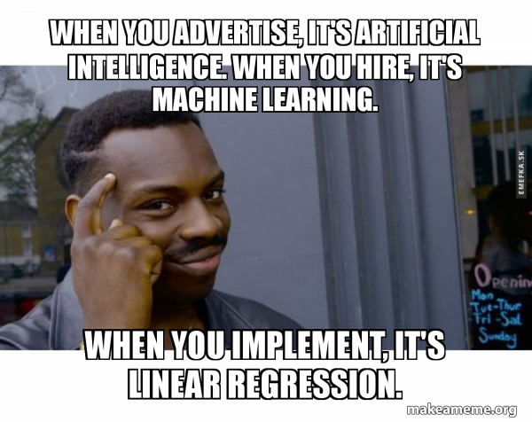

# Preface {#preface .unnumbered}


 This guide is an attempt to streamline and demystify the data analysis process. By no means this is the ultimate guide, or I am a great source of knowledge, or I claim myself to be a statistician/ econometrician, but I am a strong proponent of learning by teaching, and doing. Hence, this is more like a learning experience for both you and me. This book is completely free. My target audiences are those who have little to no experience in statistics and data science to those that have some interests in these fields and want to dive deeper and have a more holistic method. Even though my substantive domain of interest is marketing, this book can be used for other disciplines that use scientific methods or data analysis.

<br>


More books by the author can be found [here](https://mikenguyen.netlify.app/books/written_books/):

-   [Advanced Data Analysis](https://bookdown.org/mike/advanced_data_analysis/): the second book in the data analysis series, which covers machine learning models (with a focus on prediction)
-   [Marketing Research](https://bookdown.org/mike/marketing_research/)
-   [Communication Theory](https://bookdown.org/mike/comm_theory/)

# Introduction

Since the beginning of the century, we have been bombarded with amazing advancements and inventions, especially in the field of statistics, information technology, computer science, or a new emerging filed - data science. However, I believe the downside of this introduction is that we use **big** and **trendy** words too often (i.e., big data, machine learning, deep learning).

Each substantive field will have a metric subfield:

-   Econometrics in economics

-   Psychometrics in psychology

-   Chemometrics in chemistry

-   Sabermetrics in sports

-   Biostatistics in public health and medicine

But to laymen, these are known as:

-   Data Science

-   Applied Statistics

-   Computational Social Science

It's all fun and exciting when I learned these new tools. But I have to admit that I hardly retain any of these new ideas. However, writing down from the beginning till the end of a data analysis process is the solution that I came up with. Accordingly, let's dive right in.



<br>

**Some general recommendations**:

-   The more you practice/habituate/condition, more line of codes that you write, more function that you memorize, I think the more you will like this journey.

-   Readers can follow this book several ways:

    -   If you are interested in particular methods/tools, you can jump to that section by clicking the section name.
    -   If you want to follow a traditional path of data analysis, read the [Linear Regression] section.
    -   If you want to create your experiment and test your hypothesis, read the [Analysis of Variance (ANOVA)] section.

-   Alternatively, if you rather see the application of models, and disregard any theory or underlying mechanisms, you can skip to summary and application portion of each section.

-   If you don't understand a part, search the title of that part of that part on Google, and read more into that subject. This is just a general guide.

-   If you want to customize your code beyond the ones provided in this book, run in the console `help(code)` or `?code`. For example, I want more information on `hist` function, I'll type in the console `?hist` or `help(hist)`.

-   Another way is that you can search on Google. Different people will use different packages to achieve the same result in R. Accordingly, if you want to create a histogram, search on Google `histogram in R`, then you should be able to find multiple ways to create histogram in R.

**Tools of statistics**

-   Probability Theory
-   Mathematical Analysis
-   Computer Science
-   Numerical Analysis
-   Database Management


<br>

**Code Replication**

This book was built with R version 4.2.3 (2023-03-15 ucrt) and the following packages:


|package      |version    |source         |
|:------------|:----------|:--------------|
|abind        |1.4-5      |CRAN (R 4.2.0) |
|agridat      |NA         |NA             |
|ape          |5.7-1      |CRAN (R 4.2.3) |
|assertthat   |0.2.1      |CRAN (R 4.2.3) |
|backports    |1.4.1      |CRAN (R 4.2.0) |
|bookdown     |0.34       |CRAN (R 4.2.3) |
|boot         |1.3-28.1   |CRAN (R 4.2.3) |
|broom        |1.0.4      |CRAN (R 4.2.3) |
|bslib        |0.4.2      |CRAN (R 4.2.3) |
|cachem       |1.0.8      |CRAN (R 4.2.3) |
|callr        |3.7.3      |CRAN (R 4.2.3) |
|car          |3.1-2      |CRAN (R 4.2.3) |
|carData      |3.0-5      |CRAN (R 4.2.3) |
|cellranger   |1.1.0      |CRAN (R 4.2.3) |
|cli          |3.6.1      |CRAN (R 4.2.3) |
|coda         |0.19-4     |CRAN (R 4.2.3) |
|colorspace   |2.1-0      |CRAN (R 4.2.3) |
|corpcor      |NA         |NA             |
|crayon       |1.5.2      |CRAN (R 4.2.3) |
|cubature     |NA         |NA             |
|curl         |5.0.0      |CRAN (R 4.2.3) |
|data.table   |1.14.8     |CRAN (R 4.2.3) |
|DBI          |1.1.3      |CRAN (R 4.2.3) |
|dbplyr       |2.3.2      |CRAN (R 4.2.3) |
|desc         |1.4.2      |CRAN (R 4.2.3) |
|devtools     |2.4.5      |CRAN (R 4.2.3) |
|digest       |0.6.31     |CRAN (R 4.2.3) |
|dplyr        |1.1.1      |CRAN (R 4.2.3) |
|ellipsis     |0.3.2      |CRAN (R 4.2.3) |
|evaluate     |0.20       |CRAN (R 4.2.3) |
|extrafont    |NA         |NA             |
|extrafontdb  |NA         |NA             |
|fansi        |1.0.4      |CRAN (R 4.2.3) |
|faraway      |NA         |NA             |
|fastmap      |1.1.1      |CRAN (R 4.2.3) |
|forcats      |1.0.0      |CRAN (R 4.2.3) |
|foreign      |0.8-84     |CRAN (R 4.2.3) |
|fs           |1.6.1      |CRAN (R 4.2.3) |
|generics     |0.1.3      |CRAN (R 4.2.3) |
|ggplot2      |3.4.2      |CRAN (R 4.2.3) |
|glue         |1.6.2      |CRAN (R 4.2.3) |
|gtable       |0.3.3      |CRAN (R 4.2.3) |
|haven        |2.5.2      |CRAN (R 4.2.3) |
|Hmisc        |5.0-1      |CRAN (R 4.2.3) |
|hms          |1.1.3      |CRAN (R 4.2.3) |
|htmltools    |0.5.5      |CRAN (R 4.2.3) |
|htmlwidgets  |1.6.2      |CRAN (R 4.2.3) |
|httr         |1.4.5      |CRAN (R 4.2.3) |
|investr      |NA         |NA             |
|jpeg         |0.1-10     |CRAN (R 4.2.2) |
|jquerylib    |0.1.4      |CRAN (R 4.2.3) |
|jsonlite     |1.8.4      |CRAN (R 4.2.3) |
|kableExtra   |1.3.4      |CRAN (R 4.2.3) |
|knitr        |1.42       |CRAN (R 4.2.3) |
|lattice      |0.20-45    |CRAN (R 4.2.3) |
|latticeExtra |NA         |NA             |
|lifecycle    |1.0.3      |CRAN (R 4.2.3) |
|lme4         |1.1-32     |CRAN (R 4.2.3) |
|lmerTest     |NA         |NA             |
|lsr          |NA         |NA             |
|ltm          |NA         |NA             |
|lubridate    |1.9.2      |CRAN (R 4.2.3) |
|magrittr     |2.0.3      |CRAN (R 4.2.3) |
|MASS         |7.3-58.2   |CRAN (R 4.2.3) |
|matlib       |NA         |NA             |
|Matrix       |1.5-3      |CRAN (R 4.2.3) |
|MCMCglmm     |NA         |NA             |
|memoise      |2.0.1      |CRAN (R 4.2.3) |
|mgcv         |1.8-42     |CRAN (R 4.2.3) |
|minqa        |1.2.5      |CRAN (R 4.2.3) |
|modelr       |0.1.11     |CRAN (R 4.2.3) |
|munsell      |0.5.0      |CRAN (R 4.2.3) |
|nlme         |3.1-162    |CRAN (R 4.2.3) |
|nloptr       |2.0.3      |CRAN (R 4.2.3) |
|nlstools     |NA         |NA             |
|nnet         |7.3-18     |CRAN (R 4.2.3) |
|numDeriv     |2016.8-1.1 |CRAN (R 4.2.0) |
|openxlsx     |4.2.5.2    |CRAN (R 4.2.3) |
|pbkrtest     |0.5.2      |CRAN (R 4.2.3) |
|pillar       |1.9.0      |CRAN (R 4.2.3) |
|pkgbuild     |1.4.0      |CRAN (R 4.2.3) |
|pkgconfig    |2.0.3      |CRAN (R 4.2.3) |
|pkgload      |1.3.2      |CRAN (R 4.2.3) |
|png          |0.1-8      |CRAN (R 4.2.2) |
|ppsr         |NA         |NA             |
|prettyunits  |1.1.1      |CRAN (R 4.2.3) |
|processx     |3.8.0      |CRAN (R 4.2.3) |
|ps           |1.7.3      |CRAN (R 4.2.3) |
|pscl         |NA         |NA             |
|purrr        |1.0.1      |CRAN (R 4.2.3) |
|R6           |2.5.1      |CRAN (R 4.2.3) |
|RColorBrewer |1.1-3      |CRAN (R 4.2.0) |
|Rcpp         |1.0.10     |CRAN (R 4.2.3) |
|readr        |2.1.4      |CRAN (R 4.2.3) |
|readxl       |1.4.2      |CRAN (R 4.2.3) |
|remotes      |2.4.2      |CRAN (R 4.2.3) |
|reprex       |2.0.2      |CRAN (R 4.2.3) |
|rgl          |1.1.3      |CRAN (R 4.2.3) |
|rio          |0.5.29     |CRAN (R 4.2.3) |
|rlang        |1.1.0      |CRAN (R 4.2.3) |
|RLRsim       |NA         |NA             |
|rmarkdown    |2.21       |CRAN (R 4.2.3) |
|rprojroot    |2.0.3      |CRAN (R 4.2.3) |
|rstudioapi   |0.14       |CRAN (R 4.2.3) |
|Rttf2pt1     |NA         |NA             |
|rvest        |1.0.3      |CRAN (R 4.2.3) |
|sass         |0.4.6      |CRAN (R 4.2.3) |
|scales       |1.2.1      |CRAN (R 4.2.3) |
|sessioninfo  |1.2.2      |CRAN (R 4.2.3) |
|stringi      |1.7.12     |CRAN (R 4.2.2) |
|stringr      |1.5.0      |CRAN (R 4.2.3) |
|svglite      |2.1.1      |CRAN (R 4.2.3) |
|systemfonts  |1.0.4      |CRAN (R 4.2.3) |
|tensorA      |NA         |NA             |
|testthat     |3.1.7      |CRAN (R 4.2.3) |
|tibble       |3.2.1      |CRAN (R 4.2.3) |
|tidyr        |1.3.0      |CRAN (R 4.2.3) |
|tidyselect   |1.2.0      |CRAN (R 4.2.3) |
|tidyverse    |2.0.0      |CRAN (R 4.2.3) |
|tzdb         |0.3.0      |CRAN (R 4.2.3) |
|usethis      |2.1.6      |CRAN (R 4.2.3) |
|utf8         |1.2.3      |CRAN (R 4.2.3) |
|vctrs        |0.6.1      |CRAN (R 4.2.3) |
|viridisLite  |0.4.1      |CRAN (R 4.2.3) |
|webshot      |0.5.4      |CRAN (R 4.2.3) |
|withr        |2.5.0      |CRAN (R 4.2.3) |
|xfun         |0.39       |CRAN (R 4.2.3) |
|xml2         |1.3.3      |CRAN (R 4.2.3) |
|xtable       |1.8-4      |CRAN (R 4.2.3) |
|yaml         |2.3.7      |CRAN (R 4.2.3) |
|zip          |2.2.2      |CRAN (R 4.2.3) |

<br>


```
#> ─ Session info ───────────────────────────────────────────────────────────────
#>  setting  value
#>  version  R version 4.2.3 (2023-03-15 ucrt)
#>  os       Windows 10 x64 (build 22621)
#>  system   x86_64, mingw32
#>  ui       RTerm
#>  language (EN)
#>  collate  English_United States.utf8
#>  ctype    English_United States.utf8
#>  tz       America/Los_Angeles
#>  date     2023-06-17
#>  pandoc   2.19.2 @ C:/Program Files/RStudio/resources/app/bin/quarto/bin/tools/ (via rmarkdown)
#> 
#> ─ Packages ───────────────────────────────────────────────────────────────────
#>  package     * version date (UTC) lib source
#>  bookdown      0.34    2023-05-09 [1] CRAN (R 4.2.3)
#>  bslib         0.4.2   2022-12-16 [1] CRAN (R 4.2.3)
#>  cachem        1.0.8   2023-05-01 [1] CRAN (R 4.2.3)
#>  callr         3.7.3   2022-11-02 [1] CRAN (R 4.2.3)
#>  cli           3.6.1   2023-03-23 [1] CRAN (R 4.2.3)
#>  codetools     0.2-19  2023-02-01 [1] CRAN (R 4.2.3)
#>  colorspace    2.1-0   2023-01-23 [1] CRAN (R 4.2.3)
#>  crayon        1.5.2   2022-09-29 [1] CRAN (R 4.2.3)
#>  desc          1.4.2   2022-09-08 [1] CRAN (R 4.2.3)
#>  devtools      2.4.5   2022-10-11 [1] CRAN (R 4.2.3)
#>  digest        0.6.31  2022-12-11 [1] CRAN (R 4.2.3)
#>  dplyr       * 1.1.1   2023-03-22 [1] CRAN (R 4.2.3)
#>  ellipsis      0.3.2   2021-04-29 [1] CRAN (R 4.2.3)
#>  evaluate      0.20    2023-01-17 [1] CRAN (R 4.2.3)
#>  fansi         1.0.4   2023-01-22 [1] CRAN (R 4.2.3)
#>  fastmap       1.1.1   2023-02-24 [1] CRAN (R 4.2.3)
#>  forcats     * 1.0.0   2023-01-29 [1] CRAN (R 4.2.3)
#>  fs            1.6.1   2023-02-06 [1] CRAN (R 4.2.3)
#>  generics      0.1.3   2022-07-05 [1] CRAN (R 4.2.3)
#>  ggplot2     * 3.4.2   2023-04-03 [1] CRAN (R 4.2.3)
#>  glue          1.6.2   2022-02-24 [1] CRAN (R 4.2.3)
#>  gtable        0.3.3   2023-03-21 [1] CRAN (R 4.2.3)
#>  highr         0.10    2022-12-22 [1] CRAN (R 4.2.3)
#>  hms           1.1.3   2023-03-21 [1] CRAN (R 4.2.3)
#>  htmltools     0.5.5   2023-03-23 [1] CRAN (R 4.2.3)
#>  htmlwidgets   1.6.2   2023-03-17 [1] CRAN (R 4.2.3)
#>  httpuv        1.6.9   2023-02-14 [1] CRAN (R 4.2.3)
#>  jpeg        * 0.1-10  2022-11-29 [1] CRAN (R 4.2.2)
#>  jquerylib     0.1.4   2021-04-26 [1] CRAN (R 4.2.3)
#>  jsonlite      1.8.4   2022-12-06 [1] CRAN (R 4.2.3)
#>  knitr         1.42    2023-01-25 [1] CRAN (R 4.2.3)
#>  later         1.3.0   2021-08-18 [1] CRAN (R 4.2.3)
#>  lifecycle     1.0.3   2022-10-07 [1] CRAN (R 4.2.3)
#>  lubridate   * 1.9.2   2023-02-10 [1] CRAN (R 4.2.3)
#>  magrittr      2.0.3   2022-03-30 [1] CRAN (R 4.2.3)
#>  memoise       2.0.1   2021-11-26 [1] CRAN (R 4.2.3)
#>  mime          0.12    2021-09-28 [1] CRAN (R 4.2.0)
#>  miniUI        0.1.1.1 2018-05-18 [1] CRAN (R 4.2.3)
#>  munsell       0.5.0   2018-06-12 [1] CRAN (R 4.2.3)
#>  pillar        1.9.0   2023-03-22 [1] CRAN (R 4.2.3)
#>  pkgbuild      1.4.0   2022-11-27 [1] CRAN (R 4.2.3)
#>  pkgconfig     2.0.3   2019-09-22 [1] CRAN (R 4.2.3)
#>  pkgload       1.3.2   2022-11-16 [1] CRAN (R 4.2.3)
#>  prettyunits   1.1.1   2020-01-24 [1] CRAN (R 4.2.3)
#>  processx      3.8.0   2022-10-26 [1] CRAN (R 4.2.3)
#>  profvis       0.3.7   2020-11-02 [1] CRAN (R 4.2.3)
#>  promises      1.2.0.1 2021-02-11 [1] CRAN (R 4.2.3)
#>  ps            1.7.3   2023-03-21 [1] CRAN (R 4.2.3)
#>  purrr       * 1.0.1   2023-01-10 [1] CRAN (R 4.2.3)
#>  R6            2.5.1   2021-08-19 [1] CRAN (R 4.2.3)
#>  Rcpp          1.0.10  2023-01-22 [1] CRAN (R 4.2.3)
#>  readr       * 2.1.4   2023-02-10 [1] CRAN (R 4.2.3)
#>  remotes       2.4.2   2021-11-30 [1] CRAN (R 4.2.3)
#>  rlang         1.1.0   2023-03-14 [1] CRAN (R 4.2.3)
#>  rmarkdown     2.21    2023-03-26 [1] CRAN (R 4.2.3)
#>  rprojroot     2.0.3   2022-04-02 [1] CRAN (R 4.2.3)
#>  rstudioapi    0.14    2022-08-22 [1] CRAN (R 4.2.3)
#>  sass          0.4.6   2023-05-03 [1] CRAN (R 4.2.3)
#>  scales      * 1.2.1   2022-08-20 [1] CRAN (R 4.2.3)
#>  sessioninfo   1.2.2   2021-12-06 [1] CRAN (R 4.2.3)
#>  shiny         1.7.4   2022-12-15 [1] CRAN (R 4.2.3)
#>  stringi       1.7.12  2023-01-11 [1] CRAN (R 4.2.2)
#>  stringr     * 1.5.0   2022-12-02 [1] CRAN (R 4.2.3)
#>  tibble      * 3.2.1   2023-03-20 [1] CRAN (R 4.2.3)
#>  tidyr       * 1.3.0   2023-01-24 [1] CRAN (R 4.2.3)
#>  tidyselect    1.2.0   2022-10-10 [1] CRAN (R 4.2.3)
#>  tidyverse   * 2.0.0   2023-02-22 [1] CRAN (R 4.2.3)
#>  timechange    0.2.0   2023-01-11 [1] CRAN (R 4.2.3)
#>  tzdb          0.3.0   2022-03-28 [1] CRAN (R 4.2.3)
#>  urlchecker    1.0.1   2021-11-30 [1] CRAN (R 4.2.3)
#>  usethis       2.1.6   2022-05-25 [1] CRAN (R 4.2.3)
#>  utf8          1.2.3   2023-01-31 [1] CRAN (R 4.2.3)
#>  vctrs         0.6.1   2023-03-22 [1] CRAN (R 4.2.3)
#>  withr         2.5.0   2022-03-03 [1] CRAN (R 4.2.3)
#>  xfun          0.39    2023-04-20 [1] CRAN (R 4.2.3)
#>  xtable        1.8-4   2019-04-21 [1] CRAN (R 4.2.3)
#>  yaml          2.3.7   2023-01-23 [1] CRAN (R 4.2.3)
#> 
#>  [1] C:/Program Files/R/R-4.2.3/library
#> 
#> ──────────────────────────────────────────────────────────────────────────────
```
