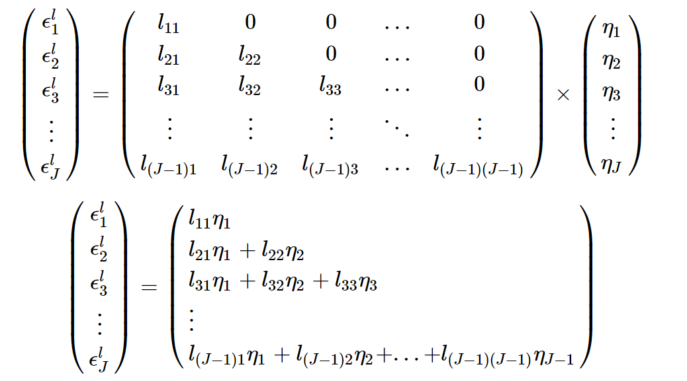

# Logit, Probit and Multinomial Logit

Packages in R:

-   `mnlogit`: MNL for large dataset

-   `gmnl`: Mixed Effect models, scale heterogeneity model, generalized multinomial logit model (including latent-class multinomial logit models and mix-mixed models)

-   `bayesm`, `MNP` or `RSGHB` : Bayesian estimation

## Standard Binary Outcome

### Logit

Example by [Oscar Torres-Reyna](https://www.princeton.edu/~otorres/LogitR101.pdf)

```{r}
library(foreign) 
mydata <- read.dta("https://dss.princeton.edu/training/Panel101.dta")

logit <- glm(y_bin ~ x1 + x2 + x3, family=binomial(link="logit"), data=mydata)
summary(logit)
```

-   No coefficients significantly affect the log-odds ratio fo the dependent variable.
-   The coefficient estiamtes represent the impact of one unit increase in the independent variable on the log odds of the dependent variable taking the value 1.

```{r}
# library(stargazer)
stargazer::stargazer(logit, type = "text")
```

Estimate the odds ratio

```{r}
# manually
cbind(Estimate = round(coef(logit), 4),
      OR = round(exp(coef(logit)), 4),
      change = round((exp(coef(logit))-1)*100, 4))
```

-   A one unit increase in `x3` corresponds with 112% increase in the odds of y taking the value of 1.

-   Equivalently, a one unit increase in `x3` will lead to the odds of $y = 1$ 2.12 times higher.

```{r}
library(mfx)
logitor(y_bin ~ x1 + x2 + x3, data = mydata)
```

Keep x1 and x2 constant while varying x3

```{r}
r1 <- logit$coeff[1] + logit$coeff[2] * mean(mydata$x1) +
    logit$coeff[3] * mean(mydata$x2) +
    logit$coeff[4] * 1

r1 

r2 <- logit$coeff[1] + logit$coeff[2] * mean(mydata$x1) +
    logit$coeff[3] * mean(mydata$x2) +
    logit$coeff[4] * 2

r2

r3 <- logit$coeff[1] + logit$coeff[2] * mean(mydata$x1) +
    logit$coeff[3] * mean(mydata$x2) +
    logit$coeff[4] * 3
r3
```

```{r}
# when x3 increases from 1 to 2, the log-odds increases 
r2 - r1

# when x3 increases from 2 to 3, the log-odds increases 
r3 - r2 
```

The logit model:

$$
P(Y_i = 1) = Logit^{-1}(X_i\beta)
$$

The probability at the mean point of each predictor is the invert of the logit model

```{r}
invlogit = function (x) {
    1 / (1 + exp(-x))
}

invlogit(
    coef(logit)[1] +
        coef(logit)[2] * mean(mydata$x1) +
        coef(logit)[3] * mean(mydata$x2) +
        coef(logit)[4] * mean(mydata$x3)
)
```

Predicted probability

```{r}
allmean <- data.frame(
    x1 = mean(mydata$x1),
    x2 = mean(mydata$x2),
    x3 = mean(mydata$x3)
)

allmean$pred.prob <- predict(logit, newdata=allmean, type="response")

allmean

# another case
rm(allmean)


allmean <- data.frame(
    x1 = rep(mean(mydata$x1), 4),
    x2 = rep(mean(mydata$x2), 4),
    x3 = rep(mean(mydata$x3), 4),
    opinion = as.factor(c("Str agree", "Agree", "Disag", "Str disag"))
)

allmean

allmean <-
    cbind(allmean,
          predict(
              logit,
              newdata = allmean,
              type = "response",
              se.fit = TRUE
          ))


# Renaming "fit" and "se.fit" columns
names(allmean)[names(allmean) == "fit"] = "prob"
names(allmean)[names(allmean) == "se.fit"] = "se.prob"
# Estimating confidence intervals
allmean$ll = allmean$prob - 1.96 * allmean$se.prob
allmean$ul = allmean$prob + 1.96 * allmean$se.prob
allmean
```

```{r}
# Plotting predicted probabilities and confidence intervals using ggplot2
library(ggplot2)
ggplot(allmean, aes(x = opinion, y = prob)) +
    geom_errorbar(
        aes(ymin = ll, ymax = ul),
        width = 0.2,
        lty = 1,
        lwd = 1,
        col = "red"
    ) +
    geom_point(shape = 18, size = 5, fill = "black") +
    scale_x_discrete(limits = c("Str agree", "Agree", "Disag", "Str disag")) +
    labs(
        title = " Predicted probabilities",
        x = "Opinion",
        y = "Pr(y=1)",
        caption = "add footnote here"
    ) +
    theme(
        plot.title = element_text(
            family = "sans",
            face = "bold",
            size = 13,
            hjust = 0.5
        ),
        axis.title = element_text(family = "sans", size = 9),
        plot.caption = element_text(family = "sans", size = 5)
    )

```

Marginal effects: the change in probability when the predictor increases by one unit

```{r}
logitmfx(y_bin ~ x1+x2+x3, data=mydata)
```

### Probit

## Order Categorical Outcome

### Ordinal Logit

```{r}
# Getting sample data
library(foreign)
mydata <-
    read.dta("https://dss.princeton.edu/training/Panel101.dta") 

# Loading library 
library(MASS)
# Running the ordered logit model
m1 <- polr(opinion ~ x1 + x2 + x3, data=mydata, Hess=TRUE)
summary(m1)

# Getting coefficients and p-values
m1.coef <- data.frame(coef(summary(m1)))
m1.coef$pval = round((pnorm(abs(m1.coef$t.value), lower.tail = FALSE) * 2),2)
m1.coef
```

```{r}
stargazer(m1, type = "text")
```

Relative Risk

```{r}
m1.or=exp(coef(m1))
m1.or

stargazer::stargazer(m1, type="text", coef=list(m1.or), p.auto=FALSE)
```

-   when x1 increases one unit, it's 2.68 times more likely to be in a higher category

-   Equivalently, the odds of a higher category in dependent variable is 166% (2.66-1).

Predicted probabilities

```{r}
m1.pred <- predict(m1, type="probs")
summary(m1.pred)


setup1 <- data.frame(x1 = rep(mean(mydata$x1), 2),
                     x2 = rep(mean(mydata$x2), 2),
                     x3 = c(1, 2))
setup1

setup1[, c("pred.prob")] <- predict(m1, newdata=setup1, type="probs")
setup1

# Use "class" for the predicted category
setup1[, c("pred.prob")] <-
    predict(m1, newdata = setup1, type = "class")
setup1

```

Marginal Effects

```{r}
library(erer)

x <- ocME(m1)
x
x$out
```

### Order Probit

## Multinomial Outcome

### Multinomial Logit

#### Example 1

```{r}
# Loading the required packages
library(foreign)
library(nnet)
library(stargazer)
# Getting the sample data from UCLA
mydata = read.dta("https://stats.idre.ucla.edu/stat/data/hsb2.dta")
# Checking the output (dependent) variable
table(mydata$ses)

# To change it so ‘middle’ is the reference type
mydata$ses2 = relevel(mydata$ses, ref = "middle")
```

```{r}
multi1 = multinom(ses2 ~ science + socst + female, data=mydata)
summary(multi1)
```

-   Under science, for one unit increase in science score, the logit coefficient for "low" relative to "middle" will go down by -0.02

-   Equivalently, one unit increase in science score leads to higher chances of staying in the middle ses category than staying in low ses.

```{r}
stargazer::stargazer(multi1, type = "text")
```

Relative Risk Ratios

```{r}
multi1.rrr = exp(coef(multi1))
multi1.rrr
stargazer::stargazer(multi1, type = "text", coef = list(multi1.rrr), p.auto = F)
```

-   One unit increase in science score make you more 0.97 more likely to stay in the low ses category as compared to the middle ses

Predicted probabilities

```{r}
allmean <- data.frame(
    science = rep(mean(mydata$science), 2),
    socst = rep(mean(mydata$socst), 2),
    female = c("male", "female")
)
allmean

allmean[, c("pred.prob")] <- predict(multi1, newdata=allmean, type="probs")
allmean


# Use "class" for the predicted category
allmean[, c("pred.prob")] <- predict(multi1, newdata=allmean, type="class")
allmean

```

#### Example 2

by `mlogit` [author](https://cran.r-project.org/web/packages/mlogit/vignettes/e1mlogit.html)

`Heating` dataset from `mlogit`

5 choice alternatives:

-   gas central `gc`

-   gas room `gr`

-   electric central `ec`

-   electric room `er`

-   heat pump `hp`

Variables:

-   `idcase`

-   `depvar` chosen alternative

-   `ic.alt` installation cost for the 5 alternatives

-   `oc.alt` the annual operating cost for the 5 alternatives

-   `income`

-   `agehed`

-   `rooms`

-   `region`

To estimate the logit model, we need data on the attributes of all the alternatives (not just the chosen one)

We first estimate the model with installation and operating cost, without intercepts.

```{r}
library("mlogit")
data("Heating", package = "mlogit")
H <- dfidx(Heating, choice = "depvar", varying = c(3:12))
m <- mlogit(depvar ~ ic + oc | 0, H)
summary(m)
```

As the cost of a system increases, the probability of being chosen falls.

```{r}
apply(fitted(m, outcome = FALSE), 2, mean)
```

Since the average probabilities do not match well with the sample frequency (e.g., 63.67% chose `gc`, but model predict 51.695%).

The ratio of the installation cost and the operating cost is the willingness to pay through higher installation cost for a one-dollar reduction in operating costs is the ratio of the operating cost coefficient to the installation cost coefficient.

$$
U = \beta_{ic} ic + \beta_{oc} oc \\
dU = \beta_{ic}dic + \beta_{oc} doc = 0 \\
- \frac{dic}{doc}|_{dU = 0} = \frac{\beta_{oc}}{\beta_{ic}}
$$

```{r}
coef(m)["oc"]/coef(m)["ic"]
```

the model implies that the decision maker is willing to pay 73 cents in higher installation cost in order to reduce annual operating costs by \$1

A 1\$ reduction in annual operating costs recurs each year, which is unreasonable to think that the decision-maker is only willing to pay only 73 cents as a one-time payment for a \$1/year stream of saving.

Estimate the model with alternative-specific constants to model. Hence, with $J$ alternatives, at most $J-1$ alternative-specific constants.

The coefficients of $J-1$ constants are interpreted as relative to alternative $J$-th alternative.

Normalize the constant for the alternative `hp` to 0

```{r}
mc <- mlogit(depvar ~ ic + oc, H, reflevel = 'hp') # have give the reference level to normalize that alternative constant to 0. 

# you can update the reflevel later using 
# update(mc, reflevel = "gr")

summary(mc)
apply(fitted(mc, outcome = FALSE), 2, mean)
```

Now the estimated probabilities match exactly the shares of customers choosing each alternative: alternative constants in a logit model make sure that the average probabilities equal the observed shares.

And the willingness to pay and discount rate is

```{r}
wtp <- coef(mc)["oc"] / coef(mc)["ic"]
wtp
r <- 1 / wtp
r
```

the decision-maker is willing to pay \$4.56 for a \$1 year stream of savings, which means the discount rate is 22%. The decision-maker applies a 22% discount rate (reasonable)

### `mlogit` author's vignettes

Example is the repeated choice of destinations for vacations by families

In a multinomial logit model, we have:

-   Choice situation specific variables (`chid`): the length of the vacation, the season

-   Individual specific variables (`id`): income, family size

-   Alternative specific variables (`alt`): distance to destination, cost

Unit of observation = the choice situation (in special cases where only one choice situation per individual, individual is also the unit of observation). Hence, `chid` and `id` will be different if we have repeated observations for the same person.

#### Data Shape

Dataset shape:

1.  Wide (one row for each choice situation): best for store choice situation (or individual specific) variables
2.  Long (one row for each alternative -\> many alternatives for each choice situation)

##### Wide fomat

```{r}
library(mlogit)

# Wide dataset
data("Train", package = "mlogit")
Train$choiceid <- 1:nrow(Train)
head(Train, 3)
```

Each person answer 16 scenarios with combination of four attributes, price, time, change, comfort.

```{r}


Tr <- dfidx(
    Train,
    shape = "wide",
    varying = 4:11, # alternative specific variables
    sep = "_", 
    idx = list(c("choiceid", "id")),
    idnames = c(NA, "alt")
)
head(Tr)
class(Tr)
```

Convert price and time

```{r}
Tr$price <- Tr$price / 100 * 2.20371
Tr$time <- Tr$time / 60

head(Tr, 3)
```

where `idx` contains

-   `choiceid` choice situation index

-   `alt` alternative index

-   `id` individual index

```{r}
head(idx(Tr), 3)
```

##### Long format

```{r}
data("ModeCanada", package = "mlogit")
head(ModeCanada)
```

4 choices:

1.  Air
2.  Train
3.  Bus
4.  Car

-   fewer columns

-   but repeated values for chocie situation specific variables

```{r}
MC <- dfidx(
    ModeCanada,
    subset = noalt == 4, # get only those have all 4 alternatives available
    idx = c("case", "alt"), # both alternative and choice situation variable
    alt.levels = c("train", "air", "bus", "car")
)
```

#### Model Specification

Under random utility models, there are four sets of $X$'s:

1.  Alternative and choice situations specific covariates $x_{ij}$ with generic coefficients $\beta$

    and alternative specific covariates $t_j$ with a generic coefficient $\upsilon$

2.  Choice situation specific covariates $z_i$ with alternative specific coefficients $\gamma_j$

3.  Alternative and choice situation specific covariates $w_{ij}$ with alternative specific coefficients $\delta_j$

4.  Choice situation specific covariates $v_i$ that influence the variance of the errors

The only difference between between 1 and 3 is that under 1, variables are comparable (with only generic coefficient), but under 3, variables are not comparable (hence, alternative specific coefficients).

The first three are observable part of the utility for alternative $j$

$$
V_{ij} = \alpha_j + \beta x_{ij} + \upsilon t_j + \gamma_j z_i + \delta_j w_{ij}
$$

Since we care about relative utility (i.e., utility differences), for two alternatives $j$ and $k$, we have

$$
V_{ij} - V_{ik} = (\alpha_j - \alpha_k) + \beta(x_{ij} - x_{ik})  + \upsilon(t_j - t_k) + (\gamma_j - \gamma_k) z_i + (\delta_j w_{ij} - \delta_k w_{ik})
$$

-   Only coefficients of alternative specific variables stay.

-   If alternative specific variables are not different from the alternative and choice situation specific variables, then $\upsilon$ can only be estimated **without intercepts** to avoid multicolinearity.

To include individual heteroskedasticity, we include it in the utility function

$$
U_{ij} = V_{ij} + \sigma_i \epsilon_{ij}
$$

where

-   $\sigma^2_i = f(v_i)$ is a parametric function of some individual-specific covariates

Individual heteroskedasticity is different from alternative heteroskedasticity ($\sigma^2_j \neq \sigma^2_k$)

With this incorporation, we have choice situation heteroskedasticity (i.e., scale heterogeneity)

Since the overall scale of utility is irrelevant, the utility becomes

$$
U^*_{ij} = \frac{U_ij}{\sigma_i} = \frac{V_{ij}}{\sigma_i} + \epsilon_{ij}
$$

with homoskedastic errors

| Variables                                                         | Model                   | Misleading                  |
|-------------------------------------------------------------------|-------------------------|-----------------------------|
| only choice situation specific variables                          | multinomial logit model |                             |
| only alternative specific variables                               | conditional logit model | also for longitudinal data  |
| both choice situation specific and alternative specific variables | mixed logit model       | also for random parameters. |

##### Example

`ModeCanada` data:

-   `cost` alternative specific covariates with a generic coefficient (part 1)

-   `income` and `urban` choice situation specific covariates (part 2)

-   `ivt` (vehicle travel time): alternative specific with alternative specific coefficients (part 3)

```{r}
library(Formula)
f <- Formula(choice ~ cost | income + ubrn | ivt)

```

The following specifications are identical

```{r}
f2 <- Formula(choice ~ cost + ivt | income + urban)
f2 <- Formula(choice ~ cost + ivt | income + urban | 0)
```

```{r}
f3 <- Formula(choice ~ 0 | income | 0)
f3 <- Formula(choice ~ 0 | income)
```

```{r}
f4 <- Formula(choice ~ cost + ivt)
f4 <- Formula(choice ~ cost + ivt | 1)
f4 <- Formula(choice ~ cost + ivt | 1 | 0)
```

If you don't want to include an intercept

```{r}
f5 <- Formula(choice ~ cost | income + 0 | ivt)
f5 <- Formula(choice ~ cost | income - 1 | ivt)
```

then, we put the formula into the model frame

```{r}
f <- Formula(choice ~ cost | income  | ivt)
mf <- model.frame(MC, f)
head(model.matrix(mf), 4)
```

-   The model matrix has $J-1$ columns for every choice situation specific variables (i.e., `income` and intercept). Thus, the coefficient of the first alternative (`air`) is set to 0

-   The model matrix has

    -   1 column for `cost` (because its coefficient is generic)

    -   $J$ columns for `ivt` (because their coefficients are alternative specific).

Testing for model fit (constrain vs. unconstrained)

```{r}
statpval <- function(x){
    if (inherits(x, "anova")) 
        result <- as.matrix(x)[2, c("Chisq", "Pr(>Chisq)")]
    if (inherits(x, "htest")) result <- c(x$statistic, x$p.value)
    names(result) <- c("stat", "p-value")
    round(result, 3)
}
```

#### Random utility model

The utility for alternative $l$ is

$$
U_l = V_l + \epsilon_l
$$

where

-   $V_l$ is a function of observables and unknown parameters to be estimated

-   $\epsilon_l$ is a random deviation that contains unobservables

Hence, alternative $l$ is chosen if $\epsilon_j < (V_l - V_j) + \epsilon_l \forall j \neq l$

The probability of choosing $l$ is

$$
P(\epsilon_1 < V_l -V_1 + \epsilon_l, \epsilon_2 < V_l - V_2 + \epsilon_l, \dots, \epsilon_J<V_l-V_j + \epsilon_l)
$$

Denoting $F_{-l}$ the cumulative density function of all the $\epsilon$'s except $\epsilon_ll$, this probability is

$$
(P_l|\epsilon_l) = F_{-l}(V_l - V_1 + \epsilon, \dots, V_l - V_J + \epsilon_l)
$$

To obtain unconditional probability (depends on $\beta$ and observables) is then

$$
P_l = \int F_{-l}(V_l - V_1 + \epsilon_l, \dots, V_l -V_J+ \epsilon_l)f_l(\epsilon_l)d_{\epsilon_l} 
$$

The multinomial logit model $$@mcfadden1974d$$ is a special case of [random utility model] with three assumptions:

1.  [Independence of the errors]
2.  $\epsilon \sim Gumbel$ [Errors follows Gumbel Distribution]
3.  [Errors are identically distributed]

##### Independence of the errors

Conditional probabilities

$$
(P_l|\epsilon_l) = \Pi_{j \neq l} F_j (V_l - V_j + \epsilon_l)
$$

Unconditional probabilities

$$
\int\Pi_{j \neq l} F_j (V_l - V_j + \epsilon_l)f_l(\epsilon_l) d \epsilon_l
$$

##### Errors follows Gumbel Distribution

Density

$$
f(z) = \frac{1}{\theta} e^{-\frac{z-\mu}{\theta}}e^{-e^{-\frac{z-\mu}{\theta}}}
$$

Probability functions

$$
F(z) + \int^z_{-\infty} f(t) dt = e^{-e^{- \frac{z - \mu}{\theta}}}
$$

where

-   $\mu$ is the location parameter

-   $\theta$ is the scale parameter

The first moments of the Gumbel distribution are

$$
E(z) = \mu + \theta \gamma
$$

where

-   $\gamma$ is the Euler-Mascheroni constant

and second moment is

$$
V(z) = \frac{\pi^2}{6} \theta^2
$$

The mean of $\epsilon_j$ is not identified if $V_j$ contains an intercept.

Suppose that $\mu_j =0 \forall j$ to the baseline, and only $J-1$ scale parameters can be identified with one of the $\theta_j$ normalize to equal 1.

##### Errors are identically distributed

Since the location parameter can't be identified for every error term, to make the model estimable we assume homoskadasticity in the error terms. This means that the scale parameter of the Gumbel distribution is the same for all the alternatives.

Since from we set one of them as 1 under [Errors follows Gumbel Distribution] for identification, we can set all of them to 1

$$
\theta_j = 1 \forall j \in 1, \dots, J
$$

then the conditional probabilities become

$$
P_l | \epsilon_l = \Pi_{j \neq l} e^{-e^{-(V_l - V_j+\epsilon_l)}}
$$

unconditional probabilities

$$
P_l = \int^{+\infty}_{-\infty} \Pi_{j \neq l} e^{-e^{-(V_l - V_j + t)}}e^{-t} e^{-e^{-t}}dt
$$

The probabilities now correspond to the logit transformation of the deterministic (observable) part of the utility

$$
P_l = \frac{e^{V_l}}{\sum_{j=1}^J e^{V_j}}
$$

From this assumption, we also have the **independence and irrelevant alternatives (IIA)** property.

For two alternatives $l$ and $m$, we have the probability ratio for the two alternatives as

$$
\frac{P_l}{P_m} = \frac{e^{V_l}}{e^{V_m}} = e^{V_l - V_m}
$$

Which depends only on the observables of the two alternatives (not other alternatives). However, with omitted variable bias this ratio might not be this simple

##### Interpretation

Under linear models, coefficients are the marginal effects of the independent variable on the dependent variable. However, under multinomial logit, we use the transformed coefficients to interpret.

Marginal Effects

The marginal effects of choice situation-specific ($z_i$) and alternative specific ($x_{ij}$)

$$
\begin{aligned}
\frac{\partial P{il}}{\partial z_i} &= P_{il} (\beta_l - \sum_j P_{ij} \beta_j) \\
\frac{\partial P_{il}}{\partial x_{il}} &= \gamma P_{il}(1 - P_{il}) \\
\frac{P_{il}}{x_{ik}} &= - \gamma P_{il}P_{ik}
\end{aligned}
$$

-   For a choice situation specific variable, the sign of the marginal effect is given by $(\beta_l - \sum_j P_{ij} \beta_j)$, which is positive for alternative $l$ is greater than a weighted average of the coefficients for all the alternatives, the weights being the probability of choosing the alternatives. Hence, we can know for sure the lowest and greatest coefficients, but we need calculation for other coefficients.

-   For an alternative-specific variable, the sign of the coefficient can be interpreted directly.

Thank to the **independence and irrelevant alternatives (IIA)**, we can rewrite the last equation

$$
\frac{d P_{il}/P_{il}}{d x_{ik}} = -\gamma P_{ik}
$$

which means when a characteristic of alternative $k$ changes, the relative change of the probabilities for every alternatives except $k$ remain constant.

##### Marginal rates of substitution

Since coefficients are marginal utilities, they cannot be interpreted.

The ratios of coefficient are marginal rates of substitution.

If the observable part of utility is

$$
V = \beta_0 + \beta_1 x_1 + \beta_2 x_2 + \beta_3 x_3
$$

Joint variations of $x_1, x_2$ to ensure the same level of utility is $dV = \beta_1 dx_1 + \beta_2 dx_2$, which means

$$
-\frac{dx_2}{dx_1} |_{dV=0} = \frac{\beta_1}{\beta_2}
$$

Example:

-   if $x_2$ is the transportation costs (in \$)

-   $x_1$ is the transport time (in hours)

-   $\beta_1 =1.5$

-   $\beta_2 = 0.2$

$$
\frac{\beta_1}{\beta_2} = 30
$$

is the marginal rate of substitution of time in terms of \$ (i.e., time value is 30\$ per hour)

##### Consumer's surplus

$$@rosen1979$$ derived the consumer's surplus for the multinomial logit models

The level of utility attained by an individual is $U_j = V_j + \epsilon_j$ where $j$ is the chosen alternative

The expected utility, from the searcher's point of view is $E(\max_j U_j)$, where the expectation is taken over the values of all the error terms.

$$
E(U) = \ln \sum_{j=1}^J e^{V_j} + C
$$

If we know the marginal utility of income ($\alpha$), then the expected surplus is $\frac{E(U)}{\alpha}$

##### Application

```{r}
library("mlogit")
data("ModeCanada", package = "mlogit")
MC <- dfidx(ModeCanada, subset = noalt == 4)
ml.MC1 <- mlogit(choice ~ cost + freq + ovt | income | ivt, MC)
```

Alternatively,

```{r}
ml.MC1b <-
    mlogit(
        choice ~ cost + freq + ovt | income | ivt,
        ModeCanada,
        subset = noalt == 4,
        idx = c("case", "alt")
    )
```

Say we have 3 alternatives (car -reference, train air)

```{r}
MC$time <- with(MC, ivt + ovt)
ml.MC1 <- mlogit(
    choice ~ cost + freq | income | time,
    MC,
    alt.subset = c("car", "train", "air"),
    reflevel = "car"
)
summary(ml.MC1)
```

-   Log-likelihood is compared to the intercept-only model.

To get the probability of actual choices

```{r}
head(fitted(ml.MC1, type = "outcome"))
```

To get the probabilities for all the alternatives

```{r}
head(fitted(ml.MC1, type = "probabilities"), 4)
```

Under the intercept-only model, the average fitted probability for every alternative is the market shares of the alternatives in the sample (i.e., frequency).

```{r}
sum(log(fitted(ml.MC1, type = "outcome")))
logLik(ml.MC1)
apply(fitted(ml.MC1, type = "probabilities"), 2, mean)
```

To make prediction for the sample means of the covariates

```{r}
predict(ml.MC1)
```

To make prediction for a particular value

```{r}
NMC <- MC
# predict the effect of a reduction of train transport time down 20%

NMC[idx(NMC)$alt == "train", "time"] <- 0.8 *
NMC[idx(NMC)$alt == "train", "time"]
Oprob <- fitted(ml.MC1, type = "probabilities")
Nprob <- predict(ml.MC1, newdata = NMC)
rbind(old = apply(Oprob, 2, mean), new = apply(Nprob, 2, mean))
```

Looking at the **independence and irrelevant alternatives (IIA)** property, when the time changes, the ratio between air and car remain constant.

```{r}
head(Nprob[, "air"] / Nprob[, "car"])
head(Oprob[, "air"] / Oprob[, "car"])
```

To calculate the consumer surplus from the reduction in train time, we see the log-sum term (i.e., inclusive value or inclusive utility)

$$
iv_i = \ln\sum_{j=1}^J e^{\beta^T x_{ij}} 
$$

```{r}
ivbefore <- logsum(ml.MC1)
ivafter <- logsum(ml.MC1, data = NMC)

# surplus = difference of the log-sums divided the the opposite of the cost coefficient (marginal utility of income)
surplus <- - (ivafter - ivbefore) / coef(ml.MC1)["cost"]
summary(surplus)
```

To calculate the marginal effects at the mean values

```{r}
# Absolute variation in probability 
effects(ml.MC1, covariate = "income", type = "ar")

# Relative variation in probability
effects(ml.MC1, covariate = "cost", type = "rr")
```

The cell in the $l$-th row and $c$-th column is the change of the probability of choosing alternative $c$ when the cost of alternative $l$ changes

Ex: a 10% change of train cost increase increases the probability of choosing car and air by 3.36%

To calculate the travel time valuation

```{r}
coef(ml.MC1)[grep("time", names(coef(ml.MC1)))] /
    coef(ml.MC1)["cost"] * 60 
```

The value of travel time for train is 23\$ per hour

The value of travel time for plan is 37\$ per hour

#### Logit models without IID

What if we relax [Independence of the errors] and [Errors are identically distributed]

##### Heteroskedastic logit model

Proposed by [@bhat1995]

The probability that $U_l > U_j$ is

$$
P(\epsilon_j < V_l - V_j + \epsilon_l) = e^{-e^{- \frac{(V_l - V_j + e_l)}{\theta_j}}}
$$

with conditional probabilities

$$
P_l | \epsilon_l = \Pi_{j \neq l}  e^{-e^{- \frac{(V_l - V_j + e_l)}{\theta_j}}}
$$

unconditional probabilities

$$
\begin{aligned}
P_l &= \int^{+ \infty}_{- \infty} \Pi_{j \neq l} (e^{-e^{- \frac{(V_l - V_j + e_l)}{\theta_j}}}) \frac{1}{\theta_l} e^{- \frac{t}{\theta_l}} e^{-e^{- \frac{t}{\theta_l}}} dt \\
&= \int^{+\infty}_0 (e^{-\sum_{j \neq l}e^{-\frac{V_l - V_j - \theta_l \ln t}{\theta_j}}})e^{-t} dt
\end{aligned}
$$

Since there is no closed form solution, we use Gauss-Laguerre quadrature method

```{r}
library("mlogit")
data("ModeCanada", package = "mlogit")
MC <-
    dfidx(ModeCanada,
          subset = noalt == 4,
          idnames = c("chid", "alt"))
ml.MC <-
    mlogit(
        choice ~ freq + cost + ivt + ovt | urban + income,
        MC,
        reflevel = 'car',
        alt.subset = c("car", "train", "air")
    )
hl.MC <-
    mlogit(
        choice ~ freq + cost + ivt + ovt | urban + income,
        MC,
        reflevel = 'car',
        alt.subset = c("car", "train", "air"),
        heterosc = TRUE
    )
coef(summary(hl.MC))[11:12,]
```

You should not use the z-values and p-values from this output because the null here is the coefficient is 0 (not 1).

To test for the homoscedasticity assumption

```{r}
lr.heter <- lrtest(hl.MC, ml.MC)
wd.heter <- waldtest(hl.MC, heterosc = FALSE)
```

or

```{r}
lrtest(hl.MC)
waldtest(hl.MC)
```

or using the `car` package

```{r}
library("car")
lh.heter <- linearHypothesis(hl.MC, c('sp.air = 1', 'sp.train = 1'))
```

for the score test

```{r}
sc.heter <- scoretest(ml.MC, heterosc = TRUE)


sapply(list(
    wald = wd.heter,
    lh = lh.heter,
    score = sc.heter,
    lr = lr.heter
),
statpval)
```

So we reject the homoscedasticity hypothesis (p \< 0.05).

##### Nested logit model

-   Proposed by [@mcfadden1978kmodelling]

-   generalization of the multinomial logit which assume some alternatives may be joined in several groups (i.e., nests). Then under the same nest, error terms may be correlated, while uncorrelated to those outside the nest.

Denote $m = 1, \dots, M$ the nests

$B_m$ the set of alternatives belonging to nest $m$

The cumulative distribution of the errors is

$$
\exp(- \sum_{m=1}^M (\sum_{j \in B_m} e^{-\epsilon_j /\lambda_m})^{\lambda_m})
$$

The marginal distribution of the $\epsilon$'s are still univariate extreme value, but now we have correlation within nests.

-   $1 - \lambda_m$ is a measure of the correlation (i.e., $\lambda_m = 1$ means no correlation)

    -   When $\lambda_m = 1 \forall m$ (the errors are iid Gumbel errors and the nested logit $\to$ the multinomial logit model)

The probability of choosing alternative $j$ that belongs to nest $l$ is

$$
P_j = \frac{e^{V_j / \lambda_l}(\sum_{k \in B_l}e^{V_k/ \lambda_l})^{\lambda_l -1} }{\sum_{m=1}^M (\sum_{k \in B_m}e^{V_k /\lambda_m})^{\lambda_m}}
$$

When $\lambda \in \{0,1\}$, the [Nested logit model] $\to$ [Random utility model]

We can also write the utility of alternative $j$ as

$$
V_j = Z_j + W_l
$$

where

-   $Z_j$ is the deterministic part specific to the alternative

-   $W_j$ is the deterministic part specific to the nest

Then the probability is

$$
\begin{aligned}
P_j &= \frac{e^{(Z_j + W_l)/ \lambda_l}}{\sum_{k \in B_l}e^{(Z_k + W_l)/ \lambda_l} } \times \frac{(\sum_{k \in B_l}e^{(Z_k + W_l)/ \lambda_l})^{\lambda_l}}{\sum_{m=1}^M (\sum_{k \in B_m}e^{(Z_k + W_m)/ \lambda_m})^{\lambda_m}}\\
&= \frac{e^{Z_j/\lambda_j}}{\sum_{k \in B_l}e^{Z_k / \lambda_l}} \times \frac{(\sum_{k \in B_l} e^{Z_k / \lambda_l})^{\lambda_l}}{\sum_{m = 1}^M (e^{W_m/\lambda_m}\sum_{k \in B_m}e^{Z_k / \lambda_m})^{\lambda_m}}
\end{aligned}
$$

Set $I_l = \ln \sum_{k \in B_l} e^{Z_k/ \lambda_l}$ (log-sum or inclusive value or inclusive utility)

$$
P_j = \frac{e^{Z_j / \lambda_l}}{\sum_{k \in B_l} e^{Z_k /\lambda_l}} \times \frac{e^{W_l + \lambda_l I_l}}{\sum_{m=1}^M e^{W_m + \lambda_m I_m}}
$$

where

-   $P_{j |l}$ the first term is the conditional probability of choosing alternative $j$ if nest $l$ is chosen (lower model)

-   $P_l$ is the marginal probability of choosing nest $l$ (upper model)

-   $W_l + \lambda_l I_l$ is the expected utility of choosing the best alternative in $l$

    -   $W_l$ is the expected utility of choosing an alternative in this nest

    -   $\lambda_l I_l$ is the expected extra utility gained by being able to choose the best alternative in the nest

-   IIA applies within nests (not across)

To estimate this model, we can either

-   estimate the two components separately (lower model first, then use $I_l$ as covariates to estimate the upper model): consistent but inefficient

-   maximum likelihood: more efficient.

<br>

Replication of [@head2004]

```{r}
data("JapaneseFDI", package = "mlogit")
jfdi <-
    dfidx(JapaneseFDI,
          idx = list("firm", c("region", "country")),
          idnames = c("chid", "alt"))
```

-   For nested model, we use `group.var` to indicate the grouping variable (i.e., nest)

Estimate a multinomial logit model

```{r}
ml.fdi <-
    mlogit(choice ~ log(wage) + unemp + elig + log(area) + scrate +
               ctaxrate | 0,
           data = jfdi)
```

-   Since the covariates are only alternative specific, the intercepts are not identified

We then estimate the lower model (choice of a region within a given country): for each choice situation, estimate the choice of a region on the subset of regions of the chosen country

```{r}
jfdi$country <- jfdi$country
lm.fdi <- mlogit(
    choice ~ log(wage) + unemp + elig + log(area) | 0,
    data = jfdi,
    subset = country == choice.c & !country %in% c("PT", "IE") # remove mono-region
)
```

then we use the fitted lower model to compute the inclusive value (at the country level):

$$
\text{iv}_{ig} = \ln \sum_{j \in B_g} e^{\beta^T x_{ij}} 
$$

where

-   $B_g$ is the set of regions for country $g$

Since we define the grouping variable above, the inclusive values are computed for every group $g$ (to get global inclusive values, `type = "global"`)

```{r}
lmformula <- formula(lm.fdi)

# default
head(logsum(
    ml.fdi,
    data = jfdi,
    formula = lmformula,
    type = "group"
), 2)


# the result will be a vector
head(logsum(ml.fdi, data = jfdi, formula = lmformula, type = "global"))

# a vector of length equal to the number of lines of the data in long format is returned
head(logsum(ml.fdi, data = jfdi, formula = lmformula, output = "obs"))


head(logsum(
    ml.fdi,
    data = jfdi,
    formula = lmformula,
    type = "global",
    output = "obs"
))


# To add the inclusive values in the original data.frame
JapaneseFDI$iv <- logsum(lm.fdi,
                         data = jfdi,
                         formula = lmformula,
                         output = "obs")
```

```{r}
# Select variables for the upper model estimation 
JapaneseFDI.c <- JapaneseFDI %>% 
    select("firm", "country", "choice.c", "scrate", "ctaxrate", "iv")

# Select lines to keep only one observation for every choice situation/ country combination 
JapaneseFDI.c <- unique(JapaneseFDI.c)

# coarse the response "choice.c" to a logical for the chosen country 
JapaneseFDI.c$choice.c <- with(JapaneseFDI.c, choice.c == country)
```

Estimate the upper model using the computed inclusive value as a covariate

```{r}
jfdi.c <-
    dfidx(JapaneseFDI.c,
          choice = "choice.c",
          idnames = c("chid", "alt"))
um.fdi <-
    mlogit(choice.c ~ scrate + ctaxrate + iv | 0, data = jfdi.c)
```

To obtain different `iv` coefficient for different countries, the `iv` covariate should be used in part 3, and for mono-region countries set to 1

```{r}
um2.fdi <-
    mlogit(
        choice.c ~ scrate + ctaxrate | 0 | iv,
        data = jfdi.c,
        constPar = c("iv:PT" = 1, "iv:IE" = 1)
    )
```

To estimate the full-info maximum likelihood nested model, we add `nests` argument

```{r}
# all the coefficient associated with the inclusive utility is the same for every nest (leads to degree of correlation inside each nest to be similar as well)
nl.fdi <-
    mlogit(
        choice ~ log(wage) + unemp + elig + log(area) + scrate +
            ctaxrate | 0,
        data = jfdi,
        nests = TRUE,
        un.nest.el = TRUE
    )


# different coefficient for every nest 
nl2.fdi <-
    update(nl.fdi,
           un.nest.el = FALSE,
           constPar = c('iv:PT' = 1,
                        'iv:IE' = 1))
```

Model comparison

```{r, eval = FALSE}
library("texreg")
htmlreg(
    list(
        'Mult. logit' = ml.fdi,
        'Lower model' = lm.fdi,
        'Upper model' = um.fdi,
        'Upper model' = um2.fdi,
        'Nested logit' = nl.fdi,
        'Nested logit' = nl2.fdi
    ),
    fontsize = "footnotesize",
    float.pos = "hbt",
    label = "tab:nlogit",
    caption = "Choice by Japanese firms of a european region."
)
```

Two tests under the nested logit models:

1.  Test of no nests (i.e., all the nest elasticities are 1)
2.  Test of unique nest elasticities (i.e., all the nest elasticities are equal to each other)

Test of no nests

```{r}
lr.nest <- lrtest(nl2.fdi)
wd.nest <- waldtest(nl2.fdi)
sc.nest <- scoretest(ml.fdi,
                     nests = TRUE,
                     constPar = c('iv:PT' = 1,
                                  'iv:IE' = 1))
# alternative for Wald test
lh.nest <- linearHypothesis(
    nl2.fdi,
    c(
        "iv:BE = 1",
        "iv:DE = 1",
        "iv:ES = 1",
        "iv:FR = 1",
        "iv:IT = 1",
        "iv:NL = 1",
        "iv:UK = 1"
    )
)

sapply(list(
    wald = wd.nest,
    lh = lh.nest,
    score = sc.nest,
    lr = lr.nest
),
statpval)
```

We reject the null hypothesis of no correlation

Test of unique elasticities

```{r}
lr.unest <- lrtest(nl2.fdi, nl.fdi)
wd.unest <- waldtest(nl2.fdi, un.nest.el = TRUE)
sc.unest <- scoretest(
    ml.fdi,
    nests = TRUE,
    un.nest.el = FALSE,
    constPar = c('iv:PT' = 1, 'iv:IE' = 1)
)
lh.unest <-
    linearHypothesis(
        nl2.fdi,
        c(
            "iv:BE = iv:DE",
            "iv:BE = iv:ES",
            "iv:BE = iv:FR",
            "iv:BE = iv:IT",
            "iv:BE = iv:NL",
            "iv:BE = iv:UK"
        )
    )

sapply(list(
    wald = wd.unest,
    lh = lh.unest,
    score = sc.unest,
    lr = lr.unest
),
statpval)
```

We reject the null hypothesis that all the nest elasticities are equal to each other

#### Random parameters (or mixed) logit model

-   A mixed logit model (or random parameters logit model) is a logit model where the parameters are assumed to vary by individual (account for heterogeneity of the population)

For a standard logit model, the probability that individual $i$ choose alternative $j$ is:

$$
P_{il} = \frac{e^{\beta' x_{il}}}{\sum_j e^{\beta' x_{ij}}}
$$

For individual-specific coefficients, the probabilities are

$$
P_{il} = \frac{e^{\beta'_i x_{il}}}{\sum_j e^{\beta'_i x_{ij}}}
$$

1.  This model is feasible only when per individual, we observe a large number of choice situations ([Panel Data])
2.  If this is not the case, we can consider $\beta_i$'s as random draws from a distribution whose parameters are estimated, which leads to the mixed logit model ([Individual parameters])

The probability that individual $i$ will choose alternative $l$ for a given value of $\beta_i$ is

$$
P_{il}|\beta_i = \frac{e^{e^{\beta_i' x_{il}}}}{\sum_j e^{\beta_i'x_{ij}}}
$$

To get the unconditional probability, we use the density function of $\beta$ to integrate out the conditional probability

1.  Suppose that $V_{il} = \alpha + \beta_i x_{il}$ (i..e, there is only one individual-specific coefficient and that the density of $\beta_i$ is $f(\beta, \theta)$ where $\theta$ is the vector of the parameters of the distribution of $\beta$. The unconditional probability is then:

$$
\begin{aligned}
P_{il} &= E(P_{il} |\beta_i) \\
&= \int_\beta (P_{il} | \beta) f(\beta, \theta) d\beta  \\
&= \int_\beta \frac{e^{\beta_i' x_{il}}}{\sum_j e^{\beta_i' x_{ij}}} f(\beta, \theta) d\beta 
\end{aligned}
$$

which can be estimated by quadrature methods

2.  If $V_{il} = \beta_i^T x_{il}$ where $\beta_i$ is a vector of length $K$ and $f(\beta, \theta)$ is the joint density of the $K$ individual-specific coefficients, the unconditional probability is

$$
\begin{aligned}
P_{il} &= E(P_{il} | \beta_i ) \\
&= \int_{\beta_1} \int_{\beta_2} \dots \int_{\beta_K} (P_{il}|\beta) f(\beta, \theta) d \beta_1 d \beta_2 \dots d \beta_K
\end{aligned}
$$

we can't estimate this $K$-dimensional integral using the quadrature methods. Hence, we have to use simulation (**Simulated Maximum Likelihood**):

1.  $R$ draws of the parameters from the distribution of $\beta$
2.  the probability is computed for every draw and the unconditional probability (i.e., the expected value of th conditional probabilities is estimated by the average of the $R$ probabilities )

##### Individual parameters

The expected value of a random coefficient $E(\beta)$) is estimated by the $R$ mean draws on its distribution: $\bar{\beta} = \sum_{r =1}^R \beta_r$

The individual parameters are obtained by first computing the probabilties of the observed choice of $i$ for every value of $\beta_r$:

$$
P_{ir} = \frac{\sum_{j}y_{ij} e^{\beta'_r x_{ij}}}{\sum_j e^{\beta_r' x_{ij}}}
$$

where

-   $y_{ij}$ is a dummy (1 if $i$ chose alternative $j$)

The expected value of the parameter for an individual is then estimated by using these probabilities to weight the $R \beta$ values:

$$
\hat{\beta}_i = \frac{\sum_r P_{ir}\beta_r}{\sum_r P_{ir}}
$$

##### Panel Data

If we have repeated observations for the same individuals, the longitudinal dimension fo the data can be used under the mixed logit model, assuming that the random parameters of individual $i$ are the same for all his choice situations.

Denoting $y_{itl}$ a dummy equal 1 if $i$ choose alternative $l$ for the $t$-th choice situation, the probability of the observed choice is

$$
P_{it} = \Pi_j \frac{\sum_j y_{itj} e^{\beta_i x_{itl}}}{\sum_j e^{\beta_i x_{itj}}}
$$

The joint probability for the $T$ obs of individual $i$ then

$$
P_i = \Pi_t \Pi_j \frac{\sum_j y_{itt} e^{\beta_i x_{itj}}}{\sum_j e^{\beta_i x_{itj}}}
$$

and the log-likelihood is $\sum_i \ln P_i$

How to choose the distribution for the random coefficients:

-   If we expect correlated coefficients, the natural choice is a (transformed-) normal distribution (`"n"`, `"ln"`, `"tn"`, `"cn"`)

-   For strictly positive or negative random coefficients value

    -   price coefficient should be **negative** (`"zbt"`, `"zbu"`)

    -   **positive** (use the `opposite` argument for `dfidx` dataset).

-   For unbounded distribution (careful with implausible values), like log-normal distribution, we can use bounded distribution like uniform (`"u"`) or triangular (`"t"`)

More specification:

-   `R` = number of draws

-   `halton` = use halton draws

-   `panel = T` for panel data version

-   `correlation` should be used if you expect corrections between random coefficients under the normal-related distribution.

**Use only generic coefficient and remove the intercept**

```{r}
library("mlogit")
data("Train", package = "mlogit")
Train$choiceid <- 1:nrow(Train)
Tr <- dfidx(
    Train,
    choice = "choice",
    varying = 4:11,
    sep = "_",
    opposite = c("price", "comfort", "time", "change"),
    idx = list(c("choiceid", "id")),
    idnames = c("chid", "alt")
)
Tr$price <- Tr$price / 100 * 2.20371
Tr$time <- Tr$time / 60
Train.ml <-
    mlogit(choice ~ price + time + change + comfort | -1, Tr)
coef(summary(Train.ml))
```

`comfort` variable is in a decreasing comfort level (the higher the coefficient, the less comfort).

We can't interpret the coefficients directly, but we can get monetary values

```{r}
coef(Train.ml)[- 1] / coef(Train.ml)[1]
```

-   26 euros for an hour of traveling

-   5 euros for a change

-   14 euros to travel in a more comfortable class.

**Use three random parameters**

1.  Uncorrelated mixed logit model

```{r}
Train.mxlu <-
    mlogit(
        choice ~ price + time + change + comfort | -1,
        Tr,
        panel = TRUE,
        rpar = c(
            time = "n",
            change = "n",
            comfort = "n"
        ),
        R = 100,
        correlation = FALSE,
        halton = NA,
        method = "bhhh"
    )
names(coef(Train.mxlu))
```

Compared to the multinomial logit model, we have 3 more coefficients (which are the standard deviations of the distribution of the three random parameters)

2.  Correlated mixed logit model

```{r}
Train.mxlc <- update(Train.mxlu, correlation = TRUE)
names(coef(Train.mxlc))
```

We have 6 parameters which are the elements of the Choleski decomposition of the covariance matrix of the 3 random parameters

$$
C = 
\left(
\begin{array}
{ccc}
c_{11} & 0 & 0 \\
c_{12} & c_{22} & 0 \\
c_{13} & c_{23} & c_{33}
\end{array}
\right)
$$

such that

$$
CC^T = 
\left(
\begin{array}
{ccc}
c_{11}^2 & c_{11} c_{12} & c_{11} c_{13} \\
c_{12}c_{12} & c_{12}^2 + c_{22}^2 & c_{12}c_{23} + c_{22} c_{23} \\
c_{11}c_{13} & c_{12} c_{13} + c_{22} c_{23} & c_{13}^2 + c_{23}^2c_{33}^2
\end{array}
\right) \\
= \left(
\begin{array}
{ccc}
\sigma^2_1 & \sigma_{12} & \sigma_{13} \\
\sigma_{12} & \sigma^2_2 & \sigma_{23} \\
\sigma_{13} & \sigma_{23} & \sigma^2_{3}
\end{array}
\right)
$$

where

-   $\sigma^2_i$ is the variance of the random parameter $i$

-   $\sigma_{ij}$ is the covariance of the random parameters $i$ and $j$

Hence, the first estimated parameter is the standard deviation of the first random parameter (but the other 5 can't be interpreted this way).

We can extract the random parameters by

```{r}
marg.ut.time <- rpar(Train.mxlc, "time")
summary(marg.ut.time) # unconditional distriubtion of the marignal utility of time
```

the estimated random parameter is the marginal utility of time in the "preference space"

or

```{r}
rpar(Train.mxlc)
```

To obtain the parameters in the "willingness to pay" (WTP) space

```{r}
wtp.time <- rpar(Train.mxlc, "time", norm = "price") # distribution of the random parameters in the TP space
summary(wtp.time)
```

The median of transport time is 33 euros.

To extract individual statistics

```{r}
mean(rpar(Train.mxlc, "time", norm = "price"))
med(rpar(Train.mxlc, "time", norm = "price"))
stdev(rpar(Train.mxlc, "time", norm = "price"))
```

For correlated random parameter, we first need to get the covariance matrix

```{r}
vcov(Train.mxlc, what = "rpar")
```

or correlation matrix

```{r}
vcov(Train.mxlc, what = "rpar", type = "cor")
summary(vcov(Train.mxlc, what = "rpar", type = "cor"))
summary(vcov(Train.mxlc, what = "rpar", type = "cov"))
```

Parameters in the correlated random parameter can't be interpreted directly

```{r}
cor.mlogit(Train.mxlc)
cov.mlogit(Train.mxlc)
stdev(Train.mxlc)
```

To restrict to a subset of random parameters

```{r}
Train.mxlc2 <- update(Train.mxlc, correlation = c("time", "comfort"))
vcov(Train.mxlc2, what = "rpar", type = "cor")
```

To investigate the presence of random coefficients and their correlation, we see the 3 nested model:

1.  Model with no random effects
2.  Model with uncorrelated random effects
3.  Model with correlated random effects

##### Assumption Testing

###### Test of no correlated random effects

```{r}
lr.mxc <- lrtest(Train.mxlc, Train.ml)
wd.mxc <- waldtest(Train.mxlc)
library("car")
lh.mxc <- linearHypothesis(
    Train.mxlc,
    c(
        "chol.time:time = 0",
        "chol.time:change =  0",
        "chol.time:comfort = 0",
        "chol.change:change = 0",
        "chol.change:comfort = 0",
        "chol.comfort:comfort = 0"
    )
)
sc.mxc <- scoretest(
    Train.ml,
    rpar = c(
        time = "n",
        change = "n",
        comfort = "n"
    ),
    R = 100,
    correlation = TRUE,
    halton = NA,
    panel = TRUE
)
sapply(list(
    wald = wd.mxc,
    lh = lh.mxc,
    score = sc.mxc,
    lr = lr.mxc
),
statpval)
```

We reject the hypothesis of no correlated random parameters

###### Test of no correlation

```{r}
lr.corr <- lrtest(Train.mxlc, Train.mxlu)
lh.corr <- linearHypothesis(
    Train.mxlc,
    c(
        "chol.time:change = 0",
        "chol.time:comfort = 0",
        "chol.change:comfort = 0"
    )
)
wd.corr <- waldtest(Train.mxlc, correlation = FALSE)
#YC
sc.corr <- scoretest(Train.mxlu, correlation = TRUE)
sapply(list(
    wald = wd.corr,
    lh = lh.corr,
    score = sc.corr,
    lr = lr.corr
),
statpval)
```

We reject the null hypothesis that there is no correlation

#### Multinomial probit

The utility of an alternative

$$
u_j = V_j + \epsilon_j
$$

where the joint distribution of the error terms follow a multivariate normal with mean 0 and a matrix of covariance denoted $\Omega$

Alternative $l$ is chosen if

$$
\begin{cases}
U_1 - U_l = (V_1 - V_l) + (\epsilon_1 - \epsilon_l) < 0 \\
U_2 - U_l = (V_2 - V_l) + (\epsilon_2 - \epsilon_l) < 0 \\
\vdots \\
U_J - U_l = (V_J - V_l) + (\epsilon_J + \epsilon_l) <0
\end{cases}
$$

denoting $V_j^l = V_j - V_l$, then

$$
\begin{cases}
\epsilon_1^l = (\epsilon_1 - \epsilon_l) < - V_1^l \\
\epsilon_2^l = (\epsilon_2 - \epsilon_l) < - V^l_2 \\
\vdots \\
\epsilon_J^l = (\epsilon_J - \epsilon_l) < - V_J^l
\end{cases}
$$

The initial vector of errors $\epsilon$ are transformed using

$$
\epsilon^l = M^l \epsilon
$$

where the transformation matrix $M^l$ is a $(J-1) \times J$ matrix obtained by inserting in an identity matrix a $l$-th column of $-1$

For example, if $J = 4$ and $l = 3$

$$
M^3 = 
\left(
\begin{array}
{cccc}
1 & 0 & -1 & 0 \\
0 & 1 & -1 & 0 \\
0 & 0 & -1 & 1 
\end{array}
\right)
$$

The covariance matrix of the error differences is obtained using the following matrix:

$$
\begin{aligned}
V(\epsilon^l) &= V(M^l \epsilon) \\
&= M^l V(\epsilon) M^{l^\top} \\
&= M^l \Omega M^{l^\top}
\end{aligned}
$$

**Note**: the $V$ stands for variance operator, not the observable part of the utility function ($V_j$)

The probability of choosing $l$ is

$$
P_l = P(\epsilon_1^l < - V_1^l \& \epsilon_2^l < -V_2^l \& \dots \epsilon_J^l < -V_J^l)
$$

with the error terms distribution assumption, we can rewrite

$$
P_l = \int^{-V_1^l}_{-\infty} \int^{-V_2^l}_{-\infty} \dots  \int^{-V_J^l}_{-\infty} \phi(\epsilon^l) d \epsilon_1^l d \epsilon_2^l \dots d_J^l
$$

with

$$
\phi (\epsilon^l) = \frac{1}{(2\pi)^{(J-1)/2}|\Omega^l|^{1/2}} e^{-\frac{1}{2}\epsilon^l \Omega^{l^{-1}}\epsilon^l}
$$

Two problems:

1.  [Identification]: The identified parameters are the elements of $\Omega^l$ (not of $\Omega$), which could mean differently
2.  

##### Identification

The meaningful parameters are those of the covariance matrix of the error $\Omega$

Example: $J = 3$

$$
\Omega =
\left(
\begin{array}
{ccc}
\sigma_{11} & \sigma_{12} & \sigma_{13} \\
\sigma_{21} & \sigma_{22} & \sigma_{23} \\
\sigma_{31} & \sigma_{32} & \sigma_{33}
\end{array}
\right)
$$

$$
\Omega^{-1} =  M^1 \Omega M^{-1^\top} = \\
\left(
\begin{array}
{cc}
\sigma_{11} + \sigma_{22} - 2 \sigma_{12} & \sigma_{11} + \sigma_{23} - \sigma_{12} - \sigma_{13} \\
\sigma_{11} + \sigma_{23} - \sigma_{12} - \sigma_{13} & \sigma_{11} + \sigma_{33} - 2 \sigma_{13}
\end{array}
\right)
$$

Since the overall scale of utility is unidentified, we have to impose the value of one of the variance (e.g., fix the first to 1)

$$
\Omega^{-1} = 
\left(
\begin{array}
{cc}
1 & \frac{\sigma_{11} + \sigma_{23} - \sigma_{12} - \sigma_{13}}{\sigma_{11} + \sigma_{22} - 2 \sigma_{12}} \\
\frac{\sigma_{11} + \sigma_{23} - \sigma_{12} - \sigma_{13}}{\sigma_{11} + \sigma_{22} - 2 \sigma_{12}} & \frac{\sigma_{11} + \sigma_{33} - 2 \sigma_{13}}{\sigma_{11} + \sigma_{22} - 2 \sigma_{12}}
\end{array}
\right)
$$

Out of the 6 structural parameters of the covariance matrix, only 3 can be identified. And we can't interpret them either.

More generally, with $J$ alternatives, the number of the parameters of the covariance matrix is $(J+1) \times J/2$ and the number of identified parameters is $J \times (J-1)/2 -1$

##### Simulation

Let $L^l$ be the Choleski decomposition of the covariance matrix of the error differences:

$$
\Omega^l = L^l L^{l^\top}
$$

This matrix is a lower triangular matrix of dimension $(J-1)$:

$$
L^l = 
\left(
\begin{array}
{ccccc}
l_{11} & 0 & 0 & \dots & 0 \\
l_{21} & l_{22} & 0 & \dots & 0 \\
l_{31} & l_{32} & l_{33} & \dots 0 \\
\vdots & \vdots & \vdots & \ddots & \vdots \\
l_{(J-1)1} & l_{(J-1)2} & l_{(J-1)3} & \dots & l_{(J-1)(J-1)}
\end{array}
\right)
$$

Let $\eta$ be a vector of standard normal deviation: $\eta \sim N(0,I)$

hence,

$$
V(L^l \eta) = L^l V (\eta)L^{l^\top} = L^l I L^{l^\top} = \Omega^l
$$

if we draw a vector of standard normal $\eta$ and apply this transformation, we get a realization of $\epsilon^l$

The joint probability is the product of conditional and marginal probabilities:

$$
\begin{aligned}
P_l &= P(\epsilon_1^l < -V_1^l \& \epsilon_2^l < -V_2^l \& \dots \& \epsilon_J^l < - V_J^l \\
&= P(\epsilon_1^l < -V_1^l ) \\
& \times P( \epsilon_2^l < -V_2^l | \epsilon_1^l < -V_1^l ) \\
& \times P(\epsilon_3^l < -V_3^l | \epsilon_1^l < -V_1^l \& \epsilon_2^l < -V_2^l \\
& \vdots \\
& \times P(\epsilon_J^l < - V_J^l | \epsilon_1^l < - V_1^l \& \dots \& \epsilon_{J-1}^l < -V_{J-1}^l)
\end{aligned}
$$

The vector of error differences deviates is



-   The first term is the marginal probability for the standard normal: $P(\epsilon_1^l < -V_1^l = \Phi (-\frac{V_1^l}{l_{11}})$

-   The second term is, for a given value of $\eta_1 = \Phi (-\frac{V_2^l + l_{21} \eta_1}{l_{22}})$. We compute the mean of this expression for any value of $\eta_1< - \frac{V_1^l}{l_{11}}$. Then (denote $\bar{\phi}_1$ the truncated normal density), we have

$$
P(\epsilon_2^l < - V_2^l ) =\int_{-\infty}^{- \frac{V_1^l}{l_{11}}} \Phi (-\frac{V_2^l + l_{21} \eta_1}{l_{22}}) \bar{\phi}_1 (\eta_1) d \eta_1
$$

-   The third term is, for given values of $\eta_1, \eta_2 = \Phi (- \frac{V_3^l + l_{31} \eta_1 + l_{32} \eta_2}{l_{22}})$, then we have

$$
P(\epsilon_3^l < - V_3^l) = \int_{-\infty}^{- \frac{V_1^l}{l_{11}}} \int_{- \infty}^{- \frac{V_2^l + l_{21} \eta_1}{l_{22}}}\Phi (- \frac{V_3^l + l_{31} \eta_1 + l_{32} \eta_2}{l_{22}}) \bar{\phi}_1 (\eta_1) \bar{\phi}_2 (\eta_2) d \eta_1 d \eta_2
$$

-   so on

This probability can be simulated by drawing numbers from a truncated normal distribution.

Algorithm by $$@geweke1994a$$:

1.  Compute $\Phi (- \frac{V_1^l}{l_{11}})$
2.  Draw a number called $\eta_1^r$ from a standard normal distribution upper-truncated at $-\frac{V_1^l}{l_{11}}$ and compute $\Phi(- \frac{V_2^l + l_{21} \eta_1^r}{l_{22}})$
3.  Draw a number called $\eta_2^r$ from a standard normal distribution upper-truncated at $- \frac{V_2^l + l_{21} \eta^r_1}{l_{22}}$ and compute $\Phi(- \frac{ V_3^l + l_{31} \eta_1^r + l_{32} \eta_2^r}{l_{33}})$
4.  Continue draw a number called $\eta_{J-1}^r$ from a standard normal distribution upper-truncated at $- \frac{V_{J-1}^l + l_{(J-1)1}\eta_1^r + \dots + V_{J-1}^l + l_{(J-1)(J-2)}\eta^r_{J-2}}{l_{(J-1)(J-2)}}$
5.  Multiply all these probabilities and get a realization of the probability called $P_l^r$
6.  repeat all steps and take average of all these probabilities

This average is an estimation of the probability: $\bar{P}_l = \sum_{r=1}^R \frac{P_l^r}{R}$

Notes:

-   The utility differences should be computed respective to the chosen alternative for each individual

-   The Choleski decomposition used should rely on the same covariance matrix as the errors

    -   Start from a given difference (e.g., the difference respective with the first alternative). The vector of error difference is then $\epsilon^1$ and its covariance matrix is $\Omega^1 = L^1 L^{1^\top}$. To apply a difference respective with another alternative $l$, we construct a matrix called $S^l$ (obtained by using a $J-2$ identity matrix, adding a first row of 0 and inserting a column of -1 at the $l-1$- th position). Ex:

$$
S^3 = 
\left(
\begin{array}
{ccc}
0 & -1 & 0 \\
1 & -1 & 0 \\
0 & -1 & 1
\end{array}
\right)
$$

The elements of the Choleski decomposition of the co varinace matrix is

$$
\Omega^l = S^l \Omega^1 S^{l^\top} = L^l L^{l^\top}
$$

-   To compute draws from a normal distribution truncated at $a$, we can: take a draw $\mu$ from a uniform distribution (between 0 and 1); then $\eta = \Phi^{-1} (\mu \Phi(a))$ is a draw from a normal distribution truncated at $a$

```{r}
library("mlogit")
data("Fishing", package = "mlogit")
Fish <-
    dfidx(
        Fishing,
        varying = 2:9,
        choice = "mode",
        idnames = c("chid", "alt")
    )

Fish.mprobit <-
    mlogit(
        mode ~ price |
            income |
            catch,
        Fish,
        probit = TRUE, # we use probit model
        alt.subset = c('beach', 'boat', 'pier')
    )

summary(Fish.mprobit)
```

Other models include:

-   Paired combinatorial logit model [@koppelman2000]

-   Rank-ordered logit model
