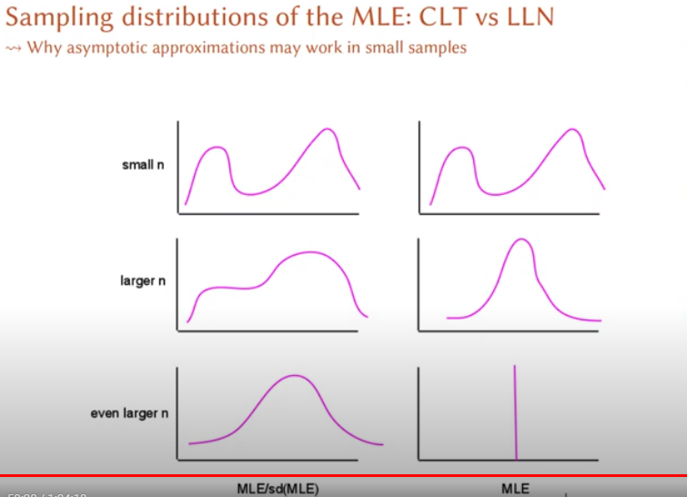

# Statistical Model

Standard Notation

$$
\begin{aligned}
Y_i &= x_i + \epsilon_i\\
&= \text{systematic + stochastic}
\end{aligned}
$$

where

-   $Y_i$ = a random variable (before data)

-   $y_i$ = a number (after data)

Hierarchical Notation

$$
\begin{aligned}
Y_i &\sim N(\mu_i, \sigma^2) && \text{stochastic}\\
\mu_i &= x_i \beta && \text{systematic}
\end{aligned}
$$

Generalized Notation

$$
\begin{aligned}
Y_i &\sim f(\theta_i, \alpha) && \text{stochastic}\\
\theta_i &= g(x_i \beta) && \text{systematic}
\end{aligned}
$$

where

-   $Y_i$ = random dependent variable

-   $f(.)$ = probability density

-   $\theta_i$ = systematic feature of the density that varies over $i$

-   $\alpha$ = ancillary parameter (feature of $f$ constant over $i$)

-   $g(.)$ = functional form (linear or non-linear)

-   $x_i$ = independent variable vector for $i$

-   $\beta$ = effect parameters

3 types of uncertainty

1.  **Estimation uncertainty**: Not enough info about $\beta$ and $\alpha$ (as $n \to \infty$, estimation uncertainty $\to 0$)
2.  **Fundamental uncertainty**: is the stochastic component (invariant to changes in $n$)
3.  **Model dependence**: Uncertainty about the whole setup.

<br>

For the wrong functional forms (or family of functional form), we have

-   Specification error, which can bias our estimates (but can still get the best linear/ logit/etc approximation of the correct functional form).

For systematic and stochastic components:

-   If one is bounded, so is the other

    -   If the stochastic component is bounded, the systematic component must be globally nonlinear (possibly locally linear)

# Data Generation Process

DGP Uncertainty can lead substantive uncertainty

To make use of data, we need the DGP and theory (story) can help this iteration process

Simulation can help

-   Understand the assumed DGP

-   Solve probability problems

-   Evaluate estimators

-   Calculate features of probability densities

# Probability

-   A function $P(y|M) = P(data| Model)$, where $M = (f,g,X,\beta,\alpha)$

-   For simplicity: $P(y|M) = P(y)$

-   3 axioms define the function $P(.)$ (are not assumptions, can never be wrong)

    1.  $P(z) \ge 0$ for some event $z$

    2.  $P(\text{sample space}) = 1$

    3.  If $z_1, \dots, z_k$ are mutually exclusive events

$$
P(z_1 \cup \dots \cup z_k) = P(z_1) + \dots + P(z_k) 
$$

Random is not haphazard (e.g., Benford's law)

Random number generators are perfectly predictable because we can only generate pseudo-random numbers

# The Impossibility of Inference Without Assumptions

[Videos by professor Gary King](https://www.youtube.com/watch?v=P79af1fkUsk&list=PL0n492lUg2sgSevEQ3bLilGbFph4l92gH&index=5&ab_channel=GaryKing)

Quantities of interest

-   Summarizing Dataa: functions of facts you have

-   Inference: Using facts that we do know to learn about facts that we don't know

    -   Descriptive Inference: facts about things that exist

    -   Counterfactual: find things that don't actually exist

        -   Prediction: but might exist in the future)

        -   What-if Questions: but might exist if the world is different

        -   Causal Inferences: what would have happened if we were to intervene with the world

The problem of Inference

Probability: $P(y|M) = P(\text{known}| \text{unknown})$

The goal of inverse probability (mathematically impossible, but we want this): $P(M|y) = P(\text{unknown}|\text{known})$

A more reasonable limited goal: Let $M = \{M^*, \theta \}$ where $M^*$ is assumed and $\theta$ is to be estiaamted

$$
P(\theta|y, M^*) \equiv P(\theta|y)
$$

# Three Theories of Inference

-   Bayes Theorem (different from Bayesian inference)

$$
\begin{aligned}
P(\theta| y) &= \frac{P(\theta,y)}{P(y)} && \text{Def of conditional prob} \\
&= \frac{P(\theta)P(y|\theta)}{P(y)} && P (A,B) = P(B) P(A|B) \\
&= \frac{P(\theta) P(y|\theta)}{\int P(\theta) P(y|\theta) d \theta} && P(Aa) = \int P(A,B) d B
\end{aligned}
$$

If we know the right side, we could compute the inverse probability

Theories of inference arose to interpret this result: Likelihood and Bayesian

In both, $P(y|\theta)$ is a traditional probability density

The two differ on the rest

## Interpretation 1: The Likelihood Theory of Inference

-   R. A. Fisher's idea

-   $\theta$ is fixed and $y$ is random

-   Let

$$
k(y) \equiv \frac{P(\theta)}{\int P(\theta) P(y|\theta) d \theta}
$$

Thus

$$
P(\theta|y) = \frac{P( \theta) P(y| \theta)}{\int P(\theta) P(y |\theta) d \theta} = k(y) P(y|\theta)
$$

-   Define $k(y)$ as unknown function of $y$ with $\theta$ fixed at its true value

-   The likelihood theory of inference has 4 axioms:

    -   The 3 probability axioms

    -   The likelihood axioms: The likelihood of $\theta$ given $y$ is defined as (i.e., $\equiv$) unknown function of $y$ with $\theta$ fixed at its true value times the traditional probability

        -   The likelihood is the right hand side.

$$
\begin{aligned}
L(\theta| y) &\equiv k(y) P(y|\theta) \\
& \propto P(y|\theta)
\end{aligned}
$$

-   $L(\theta |y)$ is a funnction: for $y$ fixed at the observed values, it gives the "likelihood" of any value of $\theta$ you might want to try. You choose the quantity of interest, which means your $\theta$ is defined (even though you don't the exact value of it). After having your data, you can pick/try out the value of $\theta$ and the llikelihood function will give you the likelihood (and you probably want to choose the $\theta$ with the highest likelihood)

-   Likelihood: a relative measure of uncertainty, changing with the data

-   Comparinng value of $L(\theta|y)$ for different $\theta$ values:

    -   Within a dataset: meaningful

    -   across data sets: meaningless

    -   You can't compare $R^2$ values across equations with different dependent variable.

-   The **likelihood principle**: the data $y$ only affect inferences through the likelihood function$L(\theta|y) = k(y) P(y|\theta)$

Visualizing

-   For algebraic simpllicity and numericala stability, we use the log-likelihood (the shape changes, the max is unchanged)

-   Summary Estimator: The likelihood curve (Likelihood principle: we can now discard teh data - if the model is correct)

-   One-point summary: at the maximum is the MLE

-   Uncertainty of the MLE: curvature at the maximum (i.e., standard error)

<br>

## Interpretation 2: The Bayesian Theory of Inference

-   Rev. Thomas Bayes' unpublished idea, and later rediscovered

$$
\begin{aligned}
P(\theta| y) &= \frac{P(\theta,y)}{P(y)} && \text{Def of conditional prob} \\
&= \frac{P(\theta)P(y|\theta)}{P(y)} && P (A,B) = P(B) P(A|B) \\
&= \frac{P(\theta) P(y|\theta)}{\int P(\theta) P(y|\theta) d \theta} && P(Aa) = \int P(A,B) d B \\
& \propto P(\theta) P(y| \theta)
\end{aligned}
$$

-   $P(\theta|y)$ = the posterior density

-   $P(y|\theta)$ = the traditional probability ($\propto$ likelihood)

-   $P(y)$ = a constant

-   $P(\theta)$ = the prior density - the way Bayese differs from likelihood

Prior density $P(\theta)$

-   A probability density that represents all prior evidence about $\theta$

-   An opportunity: a way of getting other info outside the data set into the model and estimator

-   An annoyance: the "other info" is required

-   A philosophical assumption that nonsample info:

    -   Should matter

    -   should be formalized and incldued in all inferences

<br>

Principles of Bayesian analysis

1.  All unknown quantities $(\theta, Y)$ are treated as random variables and have a joint probability distribution
2.  All known quantities ($y$) are treated as fixed
3.  If we have observed variable $B$ and unobserved variable $A$, then we re usually interested in the conditional distribution of $A$, given B:

$$
P(A|B) = \frac{P(A, B)}{P(B)}
$$

4.  If variables $A$ and $B$ are both unknown, then the distribution of $A$ alone is $P(A) = \int P(A,B) dB= \int P(A|B) P(B) dB$

<br>

The Posterior density $P(\theta|y)$

-   Like $L$, it's a summary estimator

-   Unlike $L$, it's a real probability density, from which we can derive probabilistic statements (via integration)

-   To compare across application or data sets, you may need different priors. So, the posterior is relative, just like likelihood

-   Bayesian inference obeys the likelihood principle: the data set only affects inferenncees through the likelihood function

-   If $P(\theta) = 1$ (i.e., is uniform in the relevant region), then $L(\theta|y) = P(\theta|y)$

How to think about Bayes v. Likelihood

-   Summary

    -   Likelihood is simpler; start here

    -   Bayes opens up more possibilities, use if needed

-   Philosophical differences from likelihood: huge

-   Practical differences: Minor, unless the prior matters

-   Example where prior matters: demographic forecasting model

-   Bayesian are happier people: If $P(\theta)$ is diffuse, differences from likelihood are minor, but numerical stability (and "identification") improves. Hence, your programs will run better

-   advantages of Bayes: more info leads to more efficiency; MCMC algorithms are easier

-   Few fights now betweeen Bayesians and likelihoodists

## A 3rd Theory: Neyman-Pearson Hypothesis Testing

1.  Fights between these folks and the {Bayesians, Lieklihoodists}
2.  Strict but arbitrary distinction: null $H_0$ vs. alternative $H_1$
3.  Alll tests are "under" (i.e., assuming) $H_0$

Example:

is $\beta = 0$ in $E(Y) = \beta_0 + \beta X$?

-   $H_0: \beta=0$ vs. $H_1: \beta>0$

-   Choose type I error, probability of deciding $H_1$ is right when $H_0$ is really true: $\alpha= 0.05$

-   Type II error, the power to detect $H_1$ if it is true, is a consequence of choosing an estimator, not an ex ante decision like choosing

-   Assume $n$ is large enough fro the CLT to kick in

-   Then $b| (\beta = 0) \sim N(0, \sigma^2_b)$

-   or

$$
(TS)_\beta| (\beta = 0) \equiv \frac{b- \beta}{\hat{\sigma}_b} \equiv \frac{b}{\hat{\sigma}_b} \sim N(0,1)
$$

Derive critical value, (CV), e.g., the right tail:

$$
\int_{(CV)}^\infty N(b|0, \sigma^2_b)  db = \alpha
$$

In educationaal psychology and some other fields: write your prospectus, plan your experiment, report the CV\< and write the concluding chapter:

Deicision:

-   $\beta > 0$ (I was right) if $TS >CV$

-   $\beta =0$ (I was wrong) if $TS \ge CV$

Then collect data. You may not revise your hypothesis or chapter

Once discredited, making a comeback through the pre-registration movement

## Summary

The right theory of inference: utilitarianism. (choose one that is easier for you)

Unification of Theories of Inference

-   Can't bank on agreement on normative issues

-   Even if there is agreement, it won't hold or shouldn't

-   Alternative convergence is occurring: different methods giving the same result

    -   Likelihood or Bayes with careful goodness of fit checks

    -   Various types of robust or semi-parametric methods

    -   Matching for use as preprocessing for parametric analysis

    -   Bayesian model averaging, with a large enough class of models to average over

    -   Committee methods, mixture of experts models

    -   Model with highly flexible functional forms

-   The key: No assumptions can be trusted, all theories of inference condition on assumptions and so data analysts always struggle trying to understand and get around them

# Likelihood Inference

A simple Likelihood Model: Stylized Normal, no X

The Model

1.  $Y_i \sim f_{stn}(y_i | \mu_i)$ normal stochastic component
2.  $\mu_i = \beta$, a constant systematic component (no covariates)
3.  $Y_i$ and $Y_j$ are independent $\forall i \neq j$

Derive the full probability dentisity of all $y, P(data | model)$

$$
P(y| \mu) \equiv P(y_1, \dots, y_n |\mu_1 , \dots, \mu_n)= \Pi_{i=1}^n f_{stn}(y_i|\mu_i) \\
= \Pi_{i=1}^n (2 \pi)^{-1/2}\exp(\frac{-(y_i - \mu_i)^2}{2})
$$

reparameterizing with $\mu_i = \beta$

$$
P(y| \mu) \equiv P(y_1, \dots, y_n |\mu_1 , \dots, \mu_n)
= \Pi_{i=1}^n (2 \pi)^{-1/2}\exp(\frac{-(y_i - \beta)^2}{2})
$$

The likelihood of $\beta$ having generated the data we observe:

$$
\begin{aligned}
L(\beta|y) &= k(y) \Pi_{i=1}^n f_{stn}(y_i |\beta) \\
&= k(y) \Pi_{i=1}^n (2 \pi)^{-1/2} \exp(\frac{-(y_i - \beta)^2}{2})
\end{aligned}
$$

The log-likelihood

$$
\begin{aligned}
\ln L(\beta | y) &= \ln [k(y)] + \sum_{i=1}^n \ln f_{stn}(y_i | \beta) \\
&= \ln [k(y)] + \sum_{i=1}^n \ln[(2\pi)^{-1/2}] - \sum_{i=1}^n \frac{1}{2}(y_i - \beta)^2
\end{aligned}
$$

but since the first 2 terms are not a function of $\beta$, they do not matter because likelihood is a relative concept (having the first 2 terms which are constant will not matter). Hence,

$$
\ln L(\beta |y) \dot{=} - \sum_{i=1}^n \frac{1}{2}(y_i - \beta)^2
$$

How to find the maximum?

Goal: Find the value of $\theta \equiv \{ \theta_1, \dots, \theta_k \}$ that maximizes $L(\theta|y)$

1.  Analytically - sometimes possible

    -   Take derivative of $\ln L(\theta|y)$ w.r.t. $\theta$

    -   Set to 0, substituting $\hat{\theta}$ for $\theta$

$$
|\frac{\partial \ln L( \theta|y)}{\partial \theta}|_{\theta = \hat{\theta}} =0
$$

If possible, solve for $\theta$, and label it $\hat{\theta}$

Check for second order condition: to make sure second derivative is negative

2.  Numerically

<br>

## Finite Sample Properties of the MLE

1.  Minimum variance unbiased estimator (MVUE)

    1.  Unbiasedness:

        -   Definition: $E(\hat{\theta}) = \theta$

        -   Example: $E(\hat{Y}) = E(\frac{1}{n} \sum_{i=1}^n Y_i) = \frac{1}{n} n \mu = \mu$

    2.  Minimum variance ("efficiency")

        -   Variance to be minimized: $V(\hat{\theta})$

        -   Example: $V(\bar{Y}) = V(\frac{1}{n} \sum_{i=1}^n Y_i) = \frac{1}{n^2} \sum_{i=1}^n V(Y_i) = \frac{1}{n^2} n \sigma^2 = \sigma^2/n$

        -   Efficiency: define $\hat{\theta}$ to minimize $V(\hat{\theta})$ s.t. $E(\hat{\theta}) = \theta$

    3.  If there is a MVUE, ML will find it

    4.  If there isn't one, ML will still find a good estimator

2.  Invariance to reparametization

    1.  Both are MLEs: Estimate $\sigma^2$ with $\hat{\sigma}^2$ or estimaate $\sigma$ with $\hat{\sigma}$ and calculate $\hat{\sigma}^2$

    2.  Not true for other methods of inferrence; e.g., $E(\bar{y}) = \mu$. What is an unbiased estimate of $1/\mu$? $E(1/\bar{y}) \neq1/E(\bar{y})$

3.  Invariance to sampling plans:

    1.  Ok to look at results while deciding how much data to collect

    2.  In fact, it's a great a idea? (e.g., [@king2017])

<br>

Asymptotic Properties of the MLE

1.  Consistency (from the Law of Large Numbers)

    1.  As $n \to \infty$, the sampling distribution of the MLE colllapeses to a spike over the parameter value

    2.  An approximation to: more data helps

2.  Asymptotic normality (from the Central Limit Theorem):

    1.  As $n \to \infty$, repeated samaples of MLE/se(MLE) converge to normal

    2.  If N is large enough, the asymptotic distribution is a good approximation

3.  Asymptotic efficiency

    1.  As $n \to \infty$ MLE contains as much info as can be packed into a point estimator; it is the MVUE

    2.  If $n$ is large enough, we're not wasting data



<br>

# Uncertainty Estimates

Measures of Uncertainty

-   Relative heights at different parameter values: Likelihood Ratio

-   Curvature at maximum: standard Errors.

-   Slope at signlle parameter value: Rao's Score (Lagrange multipliers)

## Uncertainty via the Likelihood Ratio

-   Compare two likelihood models

    -   Unrestricted model: $L^*$

    -   Restricted (nested) model: $L_R^*$

    -   Likelihood Ratio: $L^* \ge L_R^* \Rightarrow \frac{L^*_R}{L^*} \le 1$

-   Likelihood ratio: the ratio of 2 traditional probabilities

$$
L^*_R \equiv L(\theta_1 |y) \propto k(y) P(y| \theta_1) \\
L \equiv L(\theta_2| y) \propto k(y) P(y|\theta_2)
$$

$$
\frac{L(\theta_1 |y)}{L(\theta_2 |y)} = \frac{k(y)}{k(y)} \frac{P(y|\theta_1)}{P(y|\theta_2)} = \frac{P(y|\theta_1)}{P(y|\theta_2)}
$$

which is a risk ratio

Under Neyman-Pearson hypothesis testing (under the null):

$$
R = -2 \ln (\frac{L^*_R}{L^*}) = 2(\ln L^* - \ln L^*_R) \sim f_{\chi^2}(r|m)
$$

$r$ is realized value of $R$, $m$ is number of restricted parameters

-   If restrictions have no effect $E(R) = m$

-   Parameters are different from 0 if $r >> m$

-   works welll, but: lots of likelihood ratio tests may be required to test all points of interest

## Uncertainty via Standard Errors

-   Instead of (a) plotting the entire likelihood hyper-surface or (b) computing numerous likelihood ratio tests, we summarize the likelihood curvature near the maximum with one number

-   We use the normal likelihood to approximate all likelihoods

-   One justification: as $n \to \infty$ likelihoods become normal.

-   Reformulate the normal (not stylized) likelihood with $E(Y) = \mu_i = \beta$

$$
\begin{aligned}
L(\beta|y) & \propto N(y_i |\mu_i, \sigma^2) \\
&= (2 \pi \sigma^2)^{-1/2} \exp( \frac{-(y_i - \mu_i)^2}{2\sigma^2})\\
&= (2 \pi \sigma^2)^{-1/2} \exp(\frac{-(y_i - \beta)^2}{2\sigma^2})
\end{aligned}
$$

### Standaard Errors, Linear Normal Model

$$
\begin{aligned}
\ln L(\beta|y) &= - \frac{n}{2} \ln ( 2 \pi \sigma^2) - \frac{1}{2\sigma^2} \sum_{i=1}^n(y_i - \beta)^2 \\
&= - \frac{n}{2} \ln ( 2 \pi \sigma^2) - \frac{1}{2\sigma^2} \sum_{i=1}^n(y_i^2 - 2y_i \beta + \beta^2) \\
&= (- \frac{n}{2} \ln ( 2 \pi \sigma^2) - \frac{\sum_{i=1}^n y_i^2}{2 \sigma^2}) + (\frac{\sum_{i=1}^n y_i}{\sigma^2}) \beta + (\frac{-n}{2 \sigma^2}) \beta^2 \\
&= a + b \beta + c \beta^2
\end{aligned}
$$

where $c = (\frac{-n}{2 \sigma^2})$ is the degree of curvature. Curvature is larger when:

-   $n$ is large

-   $\sigma^2$ is small

For normal likelihood, $(\frac{-n}{2 \sigma^2})$ is a summary. The bigger the (negative) number

-   the better

-   the more info exists in the MLE

-   the larger the likelihood raatio would be in comparing the MLE with any other parameter value

### Standard Errors: Any Likelihood Model

-   When the log-likelihood is not normal, we'll use the best quadratic approximation to it. Under the normal,

$$
\frac{\partial^2 \ln L(\beta|y)}{\partial \beta \partial \beta'} = \frac{-n}{\sigma^2}
$$

Second derivative: Coefficient $c$ on squared term for any model

-   we invert the curvature to provide a statistical interpretation

$$
\hat{V} (\hat{\theta}) = [- \frac{\partial^2 \ln L(\theta|y)}{\partial \theta \partial\theta'}]^{-1}_{\theta = \hat{\theta}} = 
\left(
\begin{array}
\hat{\sigma}^2_1 & \hat{\sigma}_{12} & \dots \\
\hat{\sigma}_{21} & \hat{\sigma}^2_2 & \dots \\
\vdots & \vdots & \ddots
\end{array}
\right)
$$

-   The variance (aka covar or var-covar) across repeated samples

-   Works in general for a $k$-dimensional $\theta$ vector

-   Can be computed numerically, we typically do it analytically

-   An estiamte of a quadratic approximation to the log-likelihood

-   Asymptotically, it's an estimate of the exact log-likelihood

<br>

# Parameter Simulation for any ML model

-   Assume model is correct

-   Write down likelihood, calculate the MLE $\hat{\theta}$

-   Properties of $\hat{\theta}$ as $n$ gets large

    -   Distribution of $\hat{\theta}$ collapses to spike over $\theta$ (LLN gives consistency)

    -   The standardized sampling distribuiton of $\hat{\theta}$ becomes normal (CLT gives asymptotic normality)

    -   Quadratic approximation to the log-likelihood (from the second derivative) improves

-   True variance of sampling distribution of $\hat{\theta}$: $V(\hat{\theta})$

-   Estimate of $V(\hat{\theta})$: $\hat{V}(\hat{\theta})$ the inverse of the negative of the matrix of second derivatives of $\ln L(\theta|y)$, evaluated at $\hat{\theta}$

-   To simulate $\theta$,

    -   Draw $\theta$ from the multivariate normal: $\tilde{\theta} \sim N( \hat{\theta}, \hat{V}(\hat{\theta}))$

    -   This is an asymptotic approximation and can be wrong sometimes (we'll ignore now, improve later)

## QOI Simulation from any ML Model

Recall Generalized ML Model

$$
\begin{aligned}
Y_i &\sim f(\theta_i, \alpha) && \text{stochastic}\\
\theta_i &= g(x_i \beta) && \text{systematic}
\end{aligned}
$$

Choose values of $X$: $X_c$

Estimate: MLE $\hat{\gamma} = \{ \hat{\beta}, \hat{\alpha}\}$ and its variance $\hat{V} (\hat{\gamma})$

Simulate estimation uncertainty: $\tilde{\gamma} \sim N[ \hat{\gamma}, \hat{V} (\hat{\gamma})]$

Calculate (often expected value of $y$): $\tilde{\theta}_c = g(X_c, \tilde{\beta})$

Simulaate fundamental uncertainty: $\tilde{y}_c \sim f(\tilde{\theta}_c, \tilde{\alpha})$

Calculate QOI: calculate histogram, mean, variance, etc. of $\tilde{y}_c$

The data

-   $i$: U.S. state for $i = 1, \dots, 50$

-   $t$: election year for $t = 1948, 1952, 2016$

-   $y_{it}$: Democratic proportion of the two-party vote

-   $X_{it}$: Constant, economics, pollls, home state, ideology, etc.

-   $X_{i, 2020}$ the same covariates as $X_{it}$ but measured in 2020

-   $C_i$: number of electoral College delegates in $i$ in 2020

The Model

1.  $Y_{it} \sim N(\mu_{it}, \sigma^2)$
2.  $\mu_{it} = x_{it} \beta$ where $x_{it}$ includes a constant
3.  $Y_{it}$ and $Y_{i't'}$ are independent $\forall i \neq i'; t \neq t'$ (given $X$)

The Likelihood Model

-   Likelihood for observation $it$

$$
L(\mu_{it}, \sigma^2 | y_{it} ) \propto N(y_{it} |\mu_{it} , \sigma^2) = (2 \pi \sigma^2) ^{-1/2} e^{-\frac{(y_{it} - \mu_{it})^2}{2 \sigma^2}}
$$

-   Likelihood for all $n$ observations

$$
\begin{aligned}
L(\beta, \sigma^2| y) &= \Pi_{i=1}^n \Pi_{t=1}^T L(\mu_{it}, \sigma^2 | y_{it}) \\
&= \Pi_{i=1}^n \Pi_{t=1}^T (2 \pi \sigma^2) ^{-1/2} e^{-\frac{(y_{it} - \mu_{it})^2}{2 \sigma^2}}
\end{aligned}
$$

Log-Likelihood

$$
\begin{aligned}
\ln L(\beta, \sigma^2 | y) &= \ln [\Pi_{i=1}^n \Pi_{t=1}^T L(\mu_{it}, \sigma^2 | y_{it})] = \sum_{i=1}^n \sum_{i=1}^T \ln L(y_{it}| \mu_{it}, \sigma^) \\
&= \sum_{i=1}^n \sum_{i=1}^T \ln[(2 \pi \sigma^2) ^{-1/2} e^{-\frac{(y_{it} - \mu_{it})^2}{2 \sigma^2}}] \\
&= \sum_{i=1}^n \sum_{i=1}^T [-\frac{1}{2}\ln ( 2 \pi \sigma^2) -\frac{(y_{it} - \mu_{it})^2}{2 \sigma^2}] \\
&=-\frac{1}{2} \sum_{i=1}^n \sum_{i=1}^T [\ln (2\pi) + \ln \sigma^2 + -\frac{(y_{it} - \mu_{it})^2}{2 \sigma^2}] \\
&\dot{=} -\frac{1}{2} \sum_{i=1}^n \sum_{i=1}^T [\ln \sigma^2 + -\frac{(y_{it} - \mu_{it})^2}{2 \sigma^2}] \\
&= -\frac{1}{2} \sum_{i=1}^n \sum_{i=1}^T [ \ln \sigma^2 + -\frac{(y_{it} - X_{it}\beta)^2}{2 \sigma^2}]
\end{aligned}
$$

Estimation

-   Reparameterize to unbounded scale

    -   Numerical optimizers work better this way

    -   The CLT kicks in faster

    -   $\beta$ is already unbounded

    -   $\sigma >0$ leads to transform with $\sigma = e^\eta$ and estimate $\eta$

-   Stack: $\gamma = \{ \beta, \eta \}$, a $k + 2 \times 1$ vector ($k$: number of covariates)

-   Turn log-likelihood into code; maximize so we can get:

    -   Point estimate: save the MLE, $\hat{\gamma} = \{ \hat{\beta}, \hat{\eta}\}$

    -   Uncertainty estiamtes: $\hat{V}(\hat{\gamma})$, which is $k + 2 \times k + 2$

Mathematical Form of the Log-Likelihood

$$
\ln L (\beta, \sigma^2 |y) =   \sum_{i=1}^n \sum_{i=1}^T -\frac{1}{2}[ \ln \sigma^2 + -\frac{(y_{it} - X_{it}\beta)^2}{2 \sigma^2}]
$$

```{r}
loglik <- function(par, X, Y) {
    X <- as.matrix(cbind(1, X))
    beta <- par[1:ncol(X)]
    sigma2 <-
        exp(par[ncol(X) + 1]) - 1 / 2 * sum(log(sigma2) + ((Y - X %*% beta) ^ 2 /
                                                               sigma2))
}
```

<br>

# Interpretation and Presentation

-   Statistical presentations contain [@king2000]

    -   (Point) Estimate of quantities of interest

    -   Measure of uncertainty (all 3)

    -   should be able to easily understand (from tables only)

$$
\begin{aligned}
Y_i &\sim f(\theta_i, \alpha) && \text{stochastic}\\
\theta_i &= g(x_i \beta) && \text{systematic}
\end{aligned}
$$

Simulate QOIs

1.  Simulate $\beta$ and $\alpha$ because of estimation uncertainty
2.  Simulate $Y$ (given $\alpha, \beta$ ) representing fundamental uncertainty
3.  Calculate QOIs (given $Y$)

+------------------------+------------------------------------------------------------------+-----------------------------------------------+
|                        | Predicted                                                        | Expected                                      |
+========================+==================================================================+===============================================+
| Definition             | Draws of $Y$ that could technically be observed                  | Draws of distribution features (e.g., $E(Y)$) |
+------------------------+------------------------------------------------------------------+-----------------------------------------------+
| Sources of variability | estimation and fundamental uncertainty                           | estimation only (average over fundamental)    |
+------------------------+------------------------------------------------------------------+-----------------------------------------------+
| As $n \to \infty$      | There is still variance (because of the fundamental uncertainty) | Variance goes to 0                            |
+------------------------+------------------------------------------------------------------+-----------------------------------------------+

# Discrete Outcome Models

## Ordered Dependent Variable Models

Order Probit

$$
Y_i^*  \sim STN (y_i^*|\mu_i)
$$

STN = Stylized Normal Distribution

$$
\mu_i = x_i \beta
$$

$$
Y_i \perp Y_{i'} |X
$$

$$
y_i
\begin{cases}
j & \text{if} \tau_{j-1,i} \le y_i^* \le \tau_{j,i} \\
0 & \text{otherwise}
\end{cases}
$$

Alternatively, we have

Ordered Logit Model

$$
Y_i^* \sim STL (y_i^* | \mu_i)
$$

STL = Stylized logistic distribution

-   Probability of one observation

$$
\begin{aligned}
P(Y_i = j) &= P(\tau_{j-1}\le Y_i^* \le \tau_j) = \int_{\tau_{j-1}}^{\tau} STN(y_i^* |\mu_i ) dy_i^* \\
&= F_{stn} (\tau_j | \mu_i)- F_{stn} (\tau_{j-1}|\mu_i) \\
&= F_{stn} (\tau_j | x_i \beta) - F_{stn} (\tau_{j-1}|x_i \beta)
\end{aligned}
$$

Joint Probability

$$
P(Y) = \Pi_{i=1}^n [P(Y_i = j)]
$$

Log-Likelihood

$$
\begin{aligned}
\ln L(\beta, \tau | y) &= \sum_{i=1}^n \ln P(Y_i = j) \\
&= \sum_{i=1}^n \ln [ F_{stn}(\tau_j | x_i \beta) - F_{stn} (\tau_{j-1} | x_i \beta)]
\end{aligned}
$$

$\tau_{j-1} < \tau_j \forall j$

Interpretation

-   $\beta$: linear effect of $X$ on $Y^*$ (in SD units)

-   $\widehat{P(Y_i |X)}$ on the simplex (i.e., $J$ prob sum to 1)

-   First difference: effects all $J$ prob

-   When one prob goes up $\ge 1$ must go down

## Grouped Uncorrelated Binary Model

-   Same as Binary Logit, but only observe sum of iid Bernoulli trials

$$
Y_i \sim Binomial (y_i|\pi_i), \pi_i = [1+e^{-x_i \beta}]^{-1}, E(Y_i) = N_i \pi_i
$$

$$
L(\pi|y) \propto \Pi_{i=1}^n Binomial (y_i | \pi_i) = \Pi_{i=1}^n {{N_i}\choose{y_i}} \pi_i^{y_i} (1-\pi_i)^{N_i -y_i}
$$

Log-likelihood$$
\begin{aligned}
\ln L(\pi|y) &= \sum_{i=1}^n \{\ln {{N_i}\choose{y_i}} + y_i \ln \pi_i + (N_i - y_i) \ln(1-\pi_i) \} \\
&\dot{=} \{ -y_i \ln [1 + e{-x_i \beta}] + (N_i - y_i) \ln (1 - [1 + e{-x_i \beta}]^{-1}) \} \\
&= \sum_{i=1}^n \{ (N_i -y_i) \ln (1 + e^{x_i \beta}) - y_i \ln (1+ e^{-x_i \beta})\}
\end{aligned}
$$

-   Similar to the binary logit log-likelihood

-   Inferential goal: the same $\pi$ as in binary logit

-   Draw one simulation

    -   Maximize log-likelihood, save $\hat{\beta}$ and $\hat{V}(\hat{\beta})$

    -   Draw $\tilde{\beta} \sim N(\hat{\beta}, \hat{V}(\hat{\beta}))$ from multivariatae normal

    -   Set $X$ to your choice of values $X_c$

    -   Calculate simultaiosn of the prob that any of the component binary variables is a one: $\tilde{\pi}_c = [1 + e^{-x_c \tilde{\beta}}]^{-1}$

    -   If $\pi$ is of interest, stop

    -   If simulations of $y$ are needed, draw $\tilde{y} \sim Binomial (y_i |\pi_i)$

-   Compute QOIs: mean, SD, CI's, etc.

## Grouped Correlated Binary Model

-   Modeling issues with [Grouped Uncorrelated Binary Model]?

    -   Is iid assumption reasonable (within observation $i$)?

    -   $V(Y) = \pi_i(1-\pi)/N_i$ with no $\sigma^2$ -like parameter to take up slack

    -   These aare the same issue

-   Extended Beta-Binomial Model

$$
Y_i \sim f_{ebb} (y_i |\pi_i, \gamma), \pi = [1+e^{-x_i \beta}]^{-1}
$$

The EBB pdf

$$
f_{ebb}(y_i | \pi_i, \gamma) = P(Y_i = y_i | \pi_i, \gamma, N) \\
= \frac{N!}{y_i!(N-y_i)!} \Pi_{j=0}^{y_i -1} (\pi_i + \gamma j)\Pi_{j=0}^{N-y_i -1}(1-\pi_i + \gamma j)/ \Pi_{j=0}^{N -1}(1 + \gamma j)
$$

-   $\gamma$ soaks up binomial misspecification

-   Assumign binomial when EBB is right:

Simulate QOIs from Correlated Binary Model

-   Draw one simulation

    -   Run `optim`, get $\hat{\eta} = \{ \hat{\beta}, \hat{\gamma}\}; \hat{V}(\hat{\eta})$

    -   Draw $\tilde{\eta}$ from multivariate normal: $N[\eta| \hat{\eta}, \hat{V}(\hat{\eta}]$

    -   Set $X$ to your choice of values, $X_c$

    -   Calculate sims of the prob that any of the component binary variables is one: $\tilde{\pi}_c = [1 + e^{-x_c \tilde{\beta}}]^{-1}$

    -   If $\pi$ is of interest, stop

    -   If simulations of $y$ are needed, draw $\tilde{y}$ from $f_{ebb}(y_i |pi_i)$

-   Compute QOIs

## Count Models

### Poisson Count Model

Event Count Applications

-   Unit of analysis:

    -   over time (count per year)

    -   across areas (count per state)

    -   both

-   Event count: \# of events in a time period for some unit

-   No upper limit

Poisson distribution's first principles

-   Begin with a (black box) observation period and count point

-   Assumption concerns: event occurring during black box period

-   No 2 events can occur at the same time

-   Markov Independence: Pr(event at time t \| events up to t - 1) constant $\forall t$

Model

$$
Y_i \sim Poisson (y_i |\lambda_i), \lambda_i = \exp(x_i \beta), Y_i \perp Y_j |X
$$

The prob density of all the data: $P(y|\lambda) = \Pi_{i=1}^n\frac{e^{-\lambda_i} \lambda_i^{y_i}}{y_i!}$

Log-likelihood

$$
\begin{aligned}
\ln L(\beta|y) &= \sum_{i=1}^n \{ y_i \ln (\lambda_i) - \lambda_i - \ln y_i!\} \\
&= \sum_{i=1}^n \{ (x_i \beta) y_i - e^{x_i \beta} - \ln y_i!\} \\
&\dot{=} \sum_{i=1}^n \{ (x_i \beta) y_i - e^{x_i \beta} \}
\end{aligned}
$$

Modeling issues

-   Like EBB ([Grouped Correlated Binary Model]), Markov Independence

-   No extra parameter like $\sigma^2$ in regreession to take up slcak

-   Consequence of violation: SEs and fit wrong

Poisson Model Interpretation

-   Derivative method

$$
\frac{\partial \lambda_i}{\partial X_i^1} = \exp(x_i \beta) \beta_1 = \lambda_i \beta_1
$$

so $\bar{y} \beta$ is an appropriate linearized effect

-   To simulate

    -   Set $X_c$

    -   Draw $\tilde{\beta} \sim N(\hat{\beta}, \hat{V} (\hat{\beta}))$

    -   Compute $\tilde{\lambda}_c = \exp(X_c \tilde{\beta})$

    -   Draw fundamental variability $Y_c \sim Poisson ( y |\tilde{\lambda})$

-   Variance under specification

    -   Under Poisson model: $V(Y_i |X_i) = E(Y_i |X_i)$, heteroskedastic and fixed

    -   $V(Y_i |X_i) > E(Y_i |X_i)$ is overdispersion: SEs will be too small (very common)

    -   $V(Y_i |X_i) < E(Y_i |X_i)$ is underdispersion: SEs too big

    -   Variance conditional on X, dispersion changes with specification.

<br>

### Negative Binomial Event Count Model

-   For overdispersed data (conditional on X)

$$
Y_i \sim NegBin (y_i |\phi, \sigma^2), E(Y_i) \equiv \phi = e^{x_i \beta}, Y_i \perp Y_j | X
$$

Likelihood

$$
L(\phi, \sigma^2 |y) \propto P(y | \phi, \sigma^2) = \Pi_{i=1}^n \frac{\Gamma(\frac{\phi}{\sigma^2-1} + y_i)}{y_i! \Gamma(\frac{\phi}{\sigma^2-1} )}(\frac{\sigma^2-1}{\sigma^2})^{y_i} (\sigma^2)^{\frac{-\phi}{\sigma^2-1}}
$$

Computational Issues

-   $\ln \Gamma(a)$ with large $a$ is hard to compute in 2 steps (since $\Gamma(a) \approx a!$ is immense) but easy in one. In R, see `lgamma`

-   $\beta$ is unbounded; no need to reparameterize

-   $\sigma^2 >1$; so reparameterize $\sigma^2 = e^\gamma +1$ and estimate $\gamma$

Interpretation

-   $V(Y|X) = \phi \sigma^2$ and $\sigma^2 >1$

-   Recall: $\lim_{\sigma^2 \to 1} Negbin (y_i |\phi_i , \sigma^2)= Poisson (y_i |\phi_i)$

-   Test of Poisson vs NegBin: look at $\sigma^2$ (likelihood ratio doesn't work since Poisson doesn't nest within Negbin)

-   Careful of off-the-shelf programs: maybe $V(Y|X) = \phi(1 + \sigma^2 \phi)$

<br>

### Generalized Event Count Model

-   Since the [Negative Binomial Event Count Model] can only take care of overdispersion, GEC can take care both under-, Poisson, and over-dispersion

-   Application

    -   [@king1996]

    -   [@harris2014]

Stochastic component:

$$
Y_i \sim GEC (y_i |\lambda_i, \sigma^2) \equiv P(Y = y_i |\lambda_i, \sigma^2) \\
= \frac{1}{y_i!} (\frac{\lambda_i}{\sigma^2})^{(y_i, 1 - \frac{1}{\sigma^2})}[\sum_{j=0}^{y_i^{max}} \frac{1}{j!}(\frac{e^{\lambda_i}}{\sigma^2})^{(j, 1 - \frac{1}{\sigma^2})}]^{-1}
$$

where

-   $y_i^{max} = \infty$ for $\sigma^2 \ge 1, n_i = \lambda_i / (1-\sigma^2)$

-   $y_i^{max}= [n_i + 1)$ for $0 < \sigma^2 < 1$ and $[x) = x-1$ for integer $x$ and $floor(x)$ for non-integer $x$

$$
x^{(m, \delta)} = 
\begin{cases}
\Pi_{i=0}^{m-1} (x + \delta i) = x(x+\delta)(x+2\delta) \dots [x+\delta(m-1)] & m \ge 1 \\
1 & m = 0 
\end{cases}
$$

Systematic component

$$
E(Y_i | X_i) \equiv \lambda_i = \exp(X_i \beta)
$$

GEC Interpretation

-   Special cases of the GEC

+-------------------------------+-------------------+-------------------------------------------------------------------------+
| Model                         | $\sigma^2$        | Case                                                                    |
+===============================+===================+=========================================================================+
| Negative Binomial             | $\sigma^2>1$      | Over-dispersed                                                          |
+-------------------------------+-------------------+-------------------------------------------------------------------------+
| Poisson                       | $\sigma^2 = 1$    | No dispersion                                                           |
+-------------------------------+-------------------+-------------------------------------------------------------------------+
| Continuous Parameter Binomial | $0 < \sigma^2 <1$ | Underdispersed                                                          |
|                               |                   |                                                                         |
|                               |                   | When $\lambda_i/(1 -\sigma^2)$ is an integer, this becomes the Binomial |
+-------------------------------+-------------------+-------------------------------------------------------------------------+

## Duration Models and Censoring

### The Exponential Model

-   The density: Same first principles as the [Poisson Count Model], but know the duration between events.

-   Example: [@king1990]

$$
Y_i \sim expon(\lambda_i) = \lambda_i e^{-\lambda_i y_i}
$$

$$
E(Y_i) \equiv \frac{1}{\lambda_i} = \frac{1}{e^{-x_i \beta}} = e^{x_i \beta}
$$

Log-likelihood

$$
\begin{aligned}
\ln L(\beta|y) &= \sum_{i=1}^n (\ln \lambda_i - \lambda_i y_i ) \\
&= \sum_{i=1}^n (-X_i \beta - e^{-X_i \beta}y_i)
\end{aligned}
$$

### Censoring

-   For unfinished (i.e., incomplete info) observations

    -   Drop these obs leads to **selection bias**

    -   If we set their duration to the observed value (e.g., see a patient is still alive, and code them as their age for longevity study), it will underestimate duration and thus bias

    -   Impute? Best guesses can still bias SEs

    -   Include censoring info in the likelihood

Observation mechanism

$$
y_i 
\begin{cases}
y_i^* & \text{if } y_i^* <C \\
C & \text{if } y_i^*  \ge C
\end{cases}
$$

$$
P(Y_i = C) = P(Y_i^* \ge C) = \int_C^\infty expon (y_i |\lambda_i) dy_i \\
= \int_C^\infty  \lambda_i e^{-\lambda_i y_i} d y_i = e^{-\lambda_i C}
$$

Full Likelihood becomes

$$
L(\beta|y) = (\Pi_{y_i^* < C} \text{ expon} (y_i|\lambda_i)(\Pi_{y_i^* \ge C} P(Y_i^* \ge C))
$$

<br>

# Model Evaluation

## Out-of-Sample Forecast

-   We try to find the underlying structure of the data generating process

-   We typically paarition data into

    -   Training set: to fit model

    -   Test set: to predict

-   Then we compare our prediction to truth to evaluate our prediction

## Other Evaluation Methods

-   Cross-validation

-   Fit

-   ROC curves (for binary model)

    -   Binary predictions require a normative decision

        -   $C$ (decided based on previous literature): \# of times more costly misclassifying 1 than 0

        -   Alternatively, based on decisionn theory: choose

$$
Y =
\begin{cases}
1 & \text{if } \hat{\pi} > 1 / (1+C) \\
0 & \text{otherwise}
\end{cases}
$$

-   For example,

    -   If $C = 1$ predict $y = 1$ when $\hat{\pi} > 0.5$

    -   If $C =2$, predict $y =1$, when $\hat{\pi} > 1/3$

-   We can see

    -   \% of 1s true positive

    -   \% of 0s true positive

    -   ROC (receiver-operator characteristic) curve

        -   Compute % 1s and %0s true positive for all $C$

        -   You can also overlay several curves for several models

    -   Calibration (for binary models)

# Robust Standard Errors

-   Robust SE estimate $V(\hat{\theta})$ with fewer assumptions (does not mean without any assumptions)

-   can help detect model misspecification

-   When SEs and robust SEs differ

    -   Best case: some QOIs (e.g., coefficients) unbiased, but inefficient, while other might be biased

    -   Worst case: all QOIs are biased

Regression Model Variance Specificaation

-   Llineara-normall regrression model

    -   $Y_i \sim N(\mu_i, \sigma^2)$ (systematic component)

    -   $\mu_i = X_i \beta$ (stochastic component)

    -   $Y_i \perp Y_j|X, \forall i \neq j$ (independence assumption)

-   Equivalently

$$
\mathbf{Y \sim N(X \beta, \Sigma)}
$$

where $\Sigma = \sigma^2 I$

Variance Matrix uncontrained

$$
\mathbf{\Sigma} = 
\left(
\begin{array}
{cccc}
\sigma^2_{11} & \sigma^2_{12} & \dots & \sigma^2_{1n} \\
\sigma^2_{21} & \sigma^2_{22} & \dots & \sigma^2_{22} \\
\vdots & \vdots & \ddots & \vdots \\
\sigma^2_{n1} & \sigma^2_{n1} & \dots & \sigma^2_{nn}
\end{array}
\right)
$$

With the independence assumption, all the covariances (i.e., off-diagonal terms) equal 0 (e.g., $\sigma^2_{21} = \sigma^2_{12} = 0$)

With the homoskedasticity assumption, all the variances (i.e., diagonal terms) equal to one another (e.g., $\sigma^2_{11} = \sigma^2_{22} =\dots = \sigma^2_{nn} = \sigma^2$)

Then the variance-covariance matrix turns into

$$
\mathbf{\Sigma} = \sigma^2
\left(
\begin{array}
{cccc}
1 & 0 & \dots & 0 \\
0 & 1 & \dots & 0 \\
\vdots & \vdots & \ddots & \vdots \\
0 & 0 & \dots & 1
\end{array}
\right)
= \sigma^2 \mathbf{I}
$$

If $V(Y) \equiv \Sigma \neq \sigma^2 \mathbf{I}$ (i.e., the true variance matrix cannot assume independence and homoskedasticity), and we run a regression anyway

-   Coefficients $b = \mathbf{Q^{-1} X' y}$ (where $\mathbf{Q = X'X}$) i still unbiased

    -   Proof: $E(b) = E(\mathbf{Q^{-1} X' y}) = \mathbf{Q^{-1}X'}E(y) = \mathbf{Q^{-1}X'X}\beta = \beta$

-   True Variance: $V(b) = V(\mathbf{Q^{-1} X'}y) = \mathbf{Q^{-1}X'}V(y) \mathbf{XQ^{-1}} = \mathbf{Q^{-1}X'\Sigma X Q^{-1}} \neq \sigma^2 Q^{-1}$

    -   Hence, if we estimate the variance as $V(b) = \sigma^2 \mathbf{Q}^{-1}$ it will be biased

-   Even though the mean is unbiased, other QOIs are biased

-   Naively, we might want to estimate $\mathbf{\Sigma}$, but it's a $n \times n$ matrix (i.e., impossible). But what we can do is

    -   $V(b) = \mathbf{Q^{-1}X' \Sigma X Q^{-1}} = \mathbf{Q^{-1} G Q^{-1}}$

    -   Estimating $\mathbf{G}$ ($k \times k$ matrix, $k <<n$) is so much easier than $\mathbf{\Sigma}$ ($n\times n$ matrix)

    -   To estimate $V(b)$, e replace $\sigma_i^2$ (diagonal terms) with the residual squared, $e^2_i$, from the first regression run in $\mathbf{\Sigma}$

        -   Even though $e^2_i$ is not a good estimate of the variance indiviually, it tells the contribution of the variance.

    -   This can generalize to any MLE model

-   So the robust SEs are statistically consistent with this estimation method

-   But then, robust SEs are only useful when you are in the Goldilocks Region (i.e., biased just enough, model is not too misspecified, and the model is not correct either). And we just don't know if we are in this region.

-   Hence, if SE $\neq$ RSE, we should find and fix the model until the two are equal.

# Research Design

## Components of causala Estimation Error

-   Sample n units from finite popultaion size $N$ ($N >> n$)

-   $Y_i$: observed outcome

-   $I_i = 1$: sample selection

-   $T_i = 1$: Treatment assignment

-   Assume equal treated and control group ($n/2$)

-   Potential outcomes:

$$
\text{potential outcome} = 
\begin{cases}
Y_i(1) & \text{when } T_i = 1 \\
Y_i(0) & \text{when } T_i = 0
\end{cases}
$$

Fundamental problem of causal inference is that we only observe on potential outcome.

Then the question is that: what happen in the "parallel world?"

|              |                |                |
|--------------|----------------|----------------|
| If $T_i = 0$ | $Y_i(0) = Y_i$ | $Y_i(1) = ?$   |
| If $T_i = 1$ | $Y_i(0) = ?$   | $Y_i(1) = Y_i$ |

-   $(I_i, T_i, Y_i)$ are random

-   $Y_i(1), Y_i(0)$ are fixed

QOIs

-   Treatment Effect (for unit $i$)

$$
TE_i \equiv Y_i(1) - Y_i(0)
$$

-   Population Average Treatment Effect

$$
PATE \equiv \frac{1}{N} \sum_{i=1}^N TE_i
$$

-   Sample Average Treatment Effect

$$
SATE \equiv \frac{1}{n}\sum_{i \in \{I_i = 1\}} TE_i
$$

Composition of Causal Effect Estimation Error

-   Difference in means estimator

$$
D \equiv \bar{Y}_1 - \bar{Y}_0 = (\frac{1}{n/2} \sum_{i \in \{I_i = 1, T_i =1\}} Y_i)-(\frac{1}{n/2}\sum_{i \in \{ I_i1, T_i =0\}}Y_i)
$$

-   Pre-treatment confounders: observed $X$; unobserved $U$

Decomposition

$$
\begin{aligned}
\Delta&\equiv PATE - D \\
&= \Delta_S + \Delta_T
\end{aligned}
$$

<br>

## Issues in Ideal Designs

# Rare events 

Say that you have binary dependent variable with a lot of 0s, and only few 1s. Then you need to make correction for your estimates (because for example logistic regression can underestiamte the probability of the rare event) [@king2001]

```{r}
library(Zelig)
```
