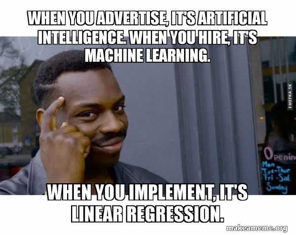

# Preface {#preface .unnumbered}

```{r setup, include = FALSE}
knitr::opts_chunk$set(warning = FALSE,
                      message = FALSE,
                      fig.width = 6, 
                      fig.height = 4, 
                      out.width = '\\textwidth', 
                      echo = FALSE,
                      cache = TRUE)
```

```{r, include = F}
knitr::write_bib(c(.packages(), "bookdown", "knitr", "rmarkdown"), "packages.bib")
```

 This book is an effort to simplify and demystify the complex process of data analysis, making it accessible to a wide audience. While I do not claim to be a professional statistician, econometrician, or data scientist, I firmly believe in the value of learning through teaching and practical application. Writing this book has been as much a learning journey for me as I hope it will be for you.

The intended audience includes those with little to no experience in statistics, econometrics, or data science, as well as individuals with a budding interest in these fields who are eager to deepen their knowledge. While my primary domain of interest is marketing, the principles and methods discussed in this book are universally applicable to any discipline that employs scientific methods or data analysis.

This book aims to serve as a working reference for statisticians, econometricians, and data scientists at any stage of their training, covering the ideas and techniques of causal inference and applied data analysis side by side.

::: {style="text-align:center"}
{width="300" height="300"}
:::

```{r, out.width='25%', fig.align='center', echo=FALSE, eval = FALSE}
knitr::include_graphics('logo.png')
```

------------------------------------------------------------------------

## How to cite these books {.unnumbered}

### **Volume 1: Foundations of Data Analysis**

**1. APA (7th edition)**

Nguyen, M. (2025). *Foundations of data analysis* (Vol. 1). Springer Cham. [https://doi.org/10.1007/978-3-032-01858-8](https://tidd.ly/4oL3N2X)

**2. MLA (8th edition)**

Nguyen, Mike. *Foundations of Data Analysis*. Vol. 1, Springer Cham, 2025. DOI: [10.1007/978-3-032-01858-8](https://tidd.ly/4oL3N2X).

**3. Chicago (17th edition)**

Nguyen, Mike. 2025. *Foundations of Data Analysis*. Vol. 1. Cham: Springer. [https://doi.org/10.1007/978-3-032-01858-8](https://tidd.ly/4oL3N2X).

**4. Harvard**

Nguyen, M. (2025) *Foundations of Data Analysis*. Vol. 1. Springer Cham. Available at: [https://doi.org/10.1007/978-3-032-01858-8](https://tidd.ly/4oL3N2X)

```{r, eval=FALSE}
@book{Nguyen2025Vol1,
  author    = {Nguyen, Mike},
  title     = {Foundations of Data Analysis},
  volume    = {1},
  year      = {2025},
  publisher = {Springer Cham},
  doi       = {10.1007/978-3-032-01858-8},
  url       = {https://doi.org/10.1007/978-3-032-01858-8}
}
```

------------------------------------------------------------------------

### **Volume 2: Regression Techniques for Data Analysis**

**1. APA (7th edition)**

Nguyen, M. (2025). *Regression techniques for data analysis* (Vol. 2). Springer Cham. [https://link.springer.com/book/9783032018342](https://tidd.ly/47PJ7kB)

**2. MLA (8th edition)**

Nguyen, Mike. *Regression Techniques for Data Analysis*. Vol. 2, Springer Cham, 2025. [https://link.springer.com/book/9783032018342](https://tidd.ly/47PJ7kB).

**3. Chicago (17th edition)**

Nguyen, Mike. 2025. *Regression Techniques for Data Analysis*. Vol. 2. Cham: Springer. [https://link.springer.com/book/9783032018342](https://tidd.ly/47PJ7kB).

**4. Harvard**

Nguyen, M. (2025) *Regression Techniques for Data Analysis*. Vol. 2. Springer Cham. Available at: [https://link.springer.com/book/9783032018342](https://tidd.ly/47PJ7kB)

```{r, eval = FALSE}
@book{Nguyen2025Vol2,
  author    = {Nguyen, Mike},
  title     = {Regression Techniques for Data Analysis},
  volume    = {2},
  year      = {2025},
  publisher = {Springer Cham},
  isbn      = {978-3-032-01834-2},
  url       = {https://link.springer.com/book/9783032018342}
}
```

------------------------------------------------------------------------

### **Volume 3: Advanced Modeling and Data Challenges**

**1. APA (7th edition)**

Nguyen, M. (2025). *Advanced modeling and data challenges* (Vol. 3). Springer Cham. [https://link.springer.com/book/9783032017185](https://tidd.ly/3JrB3xm)

**2. MLA (8th edition)**

Nguyen, Mike. *Advanced Modeling and Data Challenges*. Vol. 3, Springer Cham, 2025. [https://link.springer.com/book/9783032017185](https://tidd.ly/3JrB3xm).

**3. Chicago (17th edition)**

Nguyen, Mike. 2025. *Advanced Modeling and Data Challenges*. Vol. 3. Cham: Springer. [https://link.springer.com/book/9783032017185](https://tidd.ly/3JrB3xm).

**4. Harvard**

Nguyen, M. (2025) *Advanced Modeling and Data Challenges*. Vol. 3. Springer Cham. Available at: [https://link.springer.com/book/9783032017185](https://tidd.ly/3JrB3xm)

```{r, eval = FALSE}
@book{Nguyen2025Vol3,
  author    = {Nguyen, Mike},
  title     = {Advanced Modeling and Data Challenges},
  volume    = {3},
  year      = {2025},
  publisher = {Springer Cham},
  isbn      = {978-3-032-01718-5},
  url       = {https://link.springer.com/book/9783032017185}
}
```

------------------------------------------------------------------------

### **Volume 4: Experimental Design**

**1. APA (7th edition)**

Nguyen, M. (2025). *Experimental design* (Vol. 4). Springer Cham. [https://link.springer.com/book/9783032018380](https://tidd.ly/4oFridQ)

**2. MLA (8th edition)**

Nguyen, Mike. *Experimental Design*. Vol. 4, Springer Cham, 2025. [https://link.springer.com/book/9783032018380](https://tidd.ly/4oFridQ).

**3. Chicago (17th edition)**

Nguyen, Mike. 2025. *Experimental Design*. Vol. 4. Cham: Springer. [https://link.springer.com/book/9783032018380](https://tidd.ly/4oFridQ).

**4. Harvard**

Nguyen, M. (2025) *Experimental Design*. Vol. 4. Springer Cham. Available at: [https://link.springer.com/book/9783032018380](https://tidd.ly/4oFridQ)

```{r, eval = FALSE}
@book{Nguyen2025Vol4,
  author    = {Nguyen, Mike},
  title     = {Experimental Design},
  volume    = {4},
  year      = {2025},
  publisher = {Springer Cham},
  isbn      = {978-3-032-01838-0},
  url       = {https://link.springer.com/book/9783032018380}
}
```

------------------------------------------------------------------------

<!-- > **1. APA (7th edition):** -->

<!-- > -->

<!-- > Nguyen, M. (2020). *A Guide on Data Analysis*. Bookdown. -->

<!-- > -->

<!-- > [**https://bookdown.org/mike/data_analysis/**](https://bookdown.org/mike/data_analysis/) -->

<!-- > -->

<!-- > **2. MLA (8th edition):** -->

<!-- > -->

<!-- > Nguyen, Mike. *A Guide on Data Analysis*. Bookdown, 2020. [**https://bookdown.org/mike/data_analysis/**](https://bookdown.org/mike/data_analysis/) -->

<!-- > -->

<!-- > **3. Chicago (17th edition):** -->

<!-- > -->

<!-- > Nguyen, Mike. 2020. *A Guide on Data Analysis*. Bookdown. [**https://bookdown.org/mike/data_analysis/**](https://bookdown.org/mike/data_analysis/) -->

<!-- > -->

<!-- > **4. Harvard:** -->

<!-- > -->

<!-- > Nguyen, M. (2020) *A Guide on Data Analysis*. Bookdown. Available at: [**https://bookdown.org/mike/data_analysis/**](https://bookdown.org/mike/data_analysis/) -->

```{r, eval = FALSE, include=FALSE}
@book{nguyen2020guide,
  title={A Guide on Data Analysis},
  author={Nguyen, Mike},
  year={2020},
  publisher={Bookdown},
  url={https://bookdown.org/mike/data_analysis/}
}
```

<!-- ## More books {.unnumbered} -->

<!-- More books by the author can be found [here](https://mikenguyen.netlify.app/books/written_books/): -->

<!-- -   [Advanced Data Analysis](https://bookdown.org/mike/advanced_data_analysis/): the second book in the data analysis series, which covers machine learning models (with a focus on prediction) -->

<!-- -   [Marketing Research](https://bookdown.org/mike/marketing_research/) -->

<!-- -   [Communication Theory](https://bookdown.org/mike/comm_theory/) -->

# Introduction

Since the turn of the century, we have witnessed remarkable advancements and innovations, particularly in statistics, information technology, computer science, and the rapidly emerging field of data science. However, one challenge of these developments is the overuse of **buzzwords** like *big data*, *machine learning*, and *deep learning*. While these terms are powerful in context, they can sometimes obscure the foundational principles underlying their application.

Every substantive field often has its own specialized metric subfield, such as:

-   **Econometrics** in economics\
-   **Psychometrics** in psychology\
-   **Chemometrics** in chemistry\
-   **Sabermetrics** in sports analytics\
-   **Biostatistics** in public health and medicine

To the layperson, these disciplines are often grouped under broader terms like:

-   **Data Science**\
-   **Applied Statistics**\
-   **Computational Social Science**

As exciting as it is to explore these new tools and techniques, I must admit that retaining these concepts can be challenging. For me, the most effective way to internalize and apply these ideas has been to document the data analysis process from start to finish.

With that in mind, let's dive in and explore the fascinating world of data analysis together.

::: {style="text-align:center"}
{width="450" height="350"}
:::

```{r fig.align='center', echo=FALSE, include = FALSE}
library("jpeg")

```

## General Recommendations

-   The journey of mastering data analysis is fueled by practice and repetition. The more lines of code you write, the more functions you familiarize yourself with, and the more you experiment, the more enjoyable and rewarding this process becomes.

-   Readers can approach this book in several ways:

    -   **Focused Learning**: If you are interested in specific methods or tools, you can jump directly to the relevant section by navigating through the table of contents.
    -   **Sequential Learning**: To follow a traditional path of data analysis, start with the [Linear Regression] section.
    -   **Experimental Approach**: If you are interested in designing experiments and testing hypotheses, explore the [Analysis of Variance (ANOVA)] section.

-   For those primarily interested in applications and less concerned with theoretical foundations, focus on the summary and application sections of each chapter.

-   If a concept is unclear, consider researching the topic online. This book serves as a guide, and external resources like tutorials or articles can provide additional insights.

-   To customize the code examples provided in this book, use R's built-in help functions. For instance:

    -   To learn more about a specific function, type `help(function_name)` or `?function_name` in the R console.
    -   For example, to find details about the `hist` function, type `?hist` or `help(hist)` in the console.

-   Additionally, searching online is a powerful resource (e.g., Google, ChatGPT, etc.). Different practitioners often use various R packages to achieve similar results. For instance, if you need to create a histogram in R, a simple search like *"histogram in R"* will provide multiple approaches and examples.

By adopting these strategies, you can tailor your learning experience and maximize the value of this book.

**Tools of statistics**

-   Probability Theory
-   Mathematical Analysis
-   Computer Science
-   Numerical Analysis
-   Database Management

```{r warning=FALSE, eval=FALSE, include=FALSE}
if (!require("pacman"))
    install.packages("pacman")
if (!require("devtools"))
    install.packages("devtools")
library("pacman")
library("devtools")
```

```{r include=FALSE}
# automatically create a bib database for R packages
knitr::write_bib(c(
  .packages(), 'bookdown', 'knitr', 'rmarkdown'
), 'packages.bib')
knitr::opts_chunk$set(warning = FALSE, message = FALSE)
```

**Code Replication**

This book was built with `r R.version.string` and the following packages:

```{r, echo = FALSE, results="asis"}
# usethis::use_description_defaults()
# usethis::use_description(package = c("tidyverse","usethis"),check_name = F)
# 
# # .libPaths()
# deps <- desc::desc_get_deps("C:/Program Files/R/R-4.0.4/library") 
# deps <- desc::desc_get_deps("C:/Users/tn9k4/OneDrive - University of Missouri/Documents/R/win-library/4.0")

# if you want to make it beautiful for markdown
deps <- desc::desc_get_deps()
pkgs <- sort(deps$package[deps$type == "Imports"])
pkgs <- sessioninfo::package_info(pkgs, dependencies = FALSE)
df <- tibble::tibble(
  package = pkgs$package,
  version = pkgs$ondiskversion,
  source = gsub("@", "\\\\@", pkgs$source)
)
knitr::kable(df, format = "markdown",
             caption = "R packages and versions used")
```

```{r, echo=FALSE}
devtools::session_info()
# usethis::use_package("dplyr") # Default is "Imports"
# usethis::use_package("ggplot2", "Suggests")` # Suggests
```

## Installing GitHub-Only Dependencies {.unnumbered}

A few packages used in the [Quasi-Experimental Design](#sec-quasi-experimental) chapters are not on CRAN. Install them with `remotes::install_github()` before rendering:

```{r eval = FALSE}
remotes::install_github("synth-inference/synthdid")  # Ch. 29
remotes::install_github("mikenguyen13/causalverse")  # Ch. 29 and 30.x
remotes::install_github("kylebutts/fwlplot")         # Ch. 30.1
```

The `rstan` package (used for the Bayesian synthetic control example in [Chapter 32](#sec-synthetic-control)) requires a working C++ toolchain. On Windows install [Rtools](https://cran.r-project.org/bin/windows/Rtools/); on macOS install the Xcode command-line tools. First-time compilation can take 5 to 10 minutes. That section can be skipped without affecting the rest of the book.
