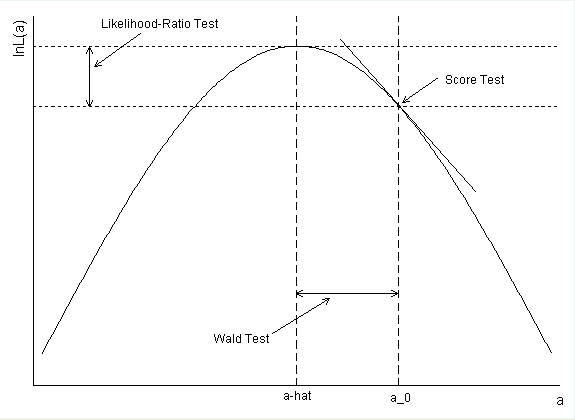

# Tests for difference among nested models

$H_0 : \theta = \theta_0$  

$H_1 : \theta \neq \theta_0$

How far away / extreme $\theta$ can be if our null hypothesis is true


Assume that our likelihood function for q is $L(q) = q^{30}(1-q)^{70}$
**Likelihood function**

```{r}
q = seq(0,1,length=100)
L= function(q){q^30 * (1-q)^70}
plot(q,L(q),ylab="L(q)",xlab="q",type="l")
```

**Log-Likelihood function**

```{r}
q = seq(0,1,length=100)
l= function(q){30*log(q) + 70 * log(1-q)}
plot(q,l(q)-l(0.3),ylab="l(q) - l(qhat)",xlab="q",type="l")
abline(v=0.2)
```

```{r fig.align='center', echo=FALSE}
library("jpeg")

```

[@Fox_1991]


## Wald test

$$
t_W=\frac{(\hat{\theta}-\theta_0)^2}{I(\theta_0)^{-1}} \sim \chi^2_{(v)}
$$

where v is the degree of freedom.

Equivalently, 
$$
s_W= \frac{\hat{\theta}-\theta_0}{\sqrt{I(\hat{\theta})^{-1}}} \sim Z
$$

How far away in the distribution your sample estimate is from the hypothesized population parameter.


## The likelihood ratio test 

$$
t_{LR} = 2[l(\hat{\theta})-l(\theta_0)] \sim \chi^2_v
$$
where v is the degree of freedom.

Compare the height of the log-likelihood of the sample estimate in relation to the height of log-likelihood of the hypothesized population parameter


## Lagrange Multiplier (Score)

$$
t_S= \frac{S(\theta_0)^2}{I(\theta_0)} \sim \chi^2_v
$$

where v is the degree of freedom.

Compare the slope of the log-likelihood of the sample estimate in relation to the slope of the log-likelihood of the hypothesized population parameter